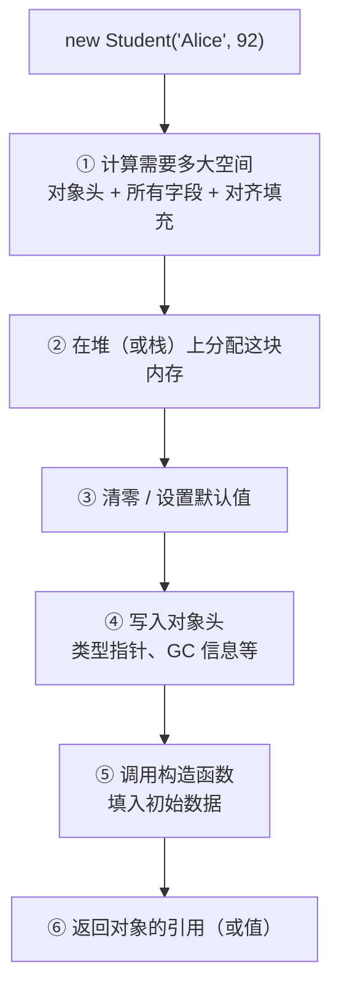

# 第 24 章 · 对象

**简体中文** ｜ [English](./24-object.en-US.md)

---

> 上一章把类当成一张"图纸"来用。这一章掀开盖子：**当 `new` 真正执行时，内存里究竟发生了什么？**
>
> 这里有三个会颠覆直觉的实测。第一个：**同样的字段，只是换个声明顺序，对象大小就从 12 字节变成 8 字节**——省了三分之一，一百万个对象就是好几 MB。第二个：**Java 里一个"只有一个 int"的对象，实测占 16 字节**，而 `int` 本身只要 4 字节——多出来的是你付不掉的"对象头"。第三个：**Python 加一行 `__slots__`，对象从 152 字节降到 48 字节**，省了 68%。
>
> 理解对象的内存布局，你才能解释为什么有的程序内存占用大得离谱、为什么属性访问会有快慢之分，以及为什么这些语言在同一个问题上做出了完全不同的选择。

## 1. 学习目标

本章结束后，你将能够：

- 说清 **`new` 执行时的完整步骤**，以及对象在内存里由哪几部分构成；
- 解释**内存对齐与填充**，并通过重排字段减少对象体积；
- 说清 **对象头** 的存在与代价，理解为什么小对象的"额外开销"占比惊人；
- 解释 **JavaScript 的原型链查找** 和 **Python 的 `__dict__`**，以及它们为何比固定布局慢；
- 用 `__slots__`、`struct`、字段重排等手段**实际降低内存占用**。

---

## 2. 为什么会出现这个概念

上一章我们说"类是图纸，对象是成品"。但**成品到底长什么样**？这个问题不是学术兴趣，它直接决定三件事：

| 问题 | 由内存布局决定 |
|------|---------------|
| **程序占多少内存** | 一百万个对象是 8 MB 还是 150 MB |
| **属性访问有多快** | 是"基址+固定偏移"一步到位，还是要查哈希表甚至沿链上溯 |
| **能不能利用缓存** | 数据紧凑连续才有缓存局部性（第 16 章） |

**一个直观的例子**：同一个"点"的概念，在不同语言里的实际体积可能差十倍。

```text
C++  struct Point { int x, y; }      → 8 字节（就是两个 int，没有任何额外开销）
Java class Point { int x, y; }       → 16 字节（12 字节对象头 + 8 字节数据，对齐到 16）
Python class Point                   → 152 字节（对象本体 48 + __dict__ 104）
```

> 这不是说 Python 写得差——**每一份额外开销都买到了某种能力**：Java 的对象头买到了 GC、锁和运行时类型信息，Python 的 `__dict__` 买到了"随时给对象加属性"的动态性。本章要讲清的正是**这些交易的具体内容**。

---

## 3. 底层原理

### `new` 执行时发生了什么



**第 ① 步就是本章的核心**——"需要多大空间"这个问题的答案，比你想的复杂。

### 对象的三个组成部分

```text
┌─────────────────────────────────────┐
│  对象头（object header）             │ ← 运行时需要的元数据
│  · 类型指针：我是哪个类的实例         │
│  · GC 信息：年龄、标记位             │
│  · 锁状态、哈希码（Java 的 mark word）│
├─────────────────────────────────────┤
│  实例字段                            │ ← 你声明的那些数据
│  · 按声明顺序（或编译器重排后）排列    │
├─────────────────────────────────────┤
│  对齐填充（padding）                 │ ← 为了满足对齐要求而浪费的空间
└─────────────────────────────────────┘
```

**注意：只有实例字段是"你要的东西"**，另外两部分都是代价。对象越小，这个代价的占比越离谱。

### ⚠️ 内存对齐：本章最反直觉的一点

CPU 读取内存时并非按字节任意访问，而是按块读取，并且要求**某些类型必须放在特定倍数的地址上**：

```text
char   大小 1，要求对齐到 1 的倍数
int    大小 4，要求对齐到 4 的倍数
double 大小 8，要求对齐到 8 的倍数
```

于是编译器会插入**填充字节**来满足这个要求。看这个实测：

```cpp
struct Bad  { char c; int i; char d; };   // → 12 字节
struct Good { int i; char c; char d; };   // → 8 字节
```

**同样的三个字段，只是换了顺序，就省了 33%。** 打印实际偏移能看清原因：

```text
Bad 的布局：
  c 在偏移 0      占 1 字节
  ▒▒▒ 偏移 1-3    ← 3 字节填充！因为 int 必须放在 4 的倍数上
  i 在偏移 4      占 4 字节
  d 在偏移 8      占 1 字节
  ▒▒▒ 偏移 9-11   ← 3 字节尾部填充（整体要对齐到 4 的倍数）
  合计 12 字节

Good 的布局：
  i 在偏移 0      占 4 字节
  c 在偏移 4      占 1 字节
  d 在偏移 5      占 1 字节
  ▒▒ 偏移 6-7     ← 只有 2 字节填充
  合计 8 字节
```

**更极端的例子**（实测）：

| 定义 | 大小 |
|------|-----:|
| `struct Bad2 { char a; double d; char b; int i; };` | **24 字节** |
| `struct Good2 { double d; int i; char a; char b; };` | **16 字节** |

同样省 33%。**一百万个对象时，这个差别是 7.6 MB。**

> **规则**：**按字段大小从大到小声明**，能显著减少填充。这是个"改一行代码就能省内存"的优化——但也别过度：可读性通常比几个字节更重要，除非你确实在处理海量对象。

### 对象头：你付不掉的固定开销

**Java 实测**（一百万个"只有一个 int"的对象，三次测量结果一致）：

```text
每个对象约 16 字节
而 int 本身只需要 4 字节
```

多出来的 12 字节就是**对象头**：

| 组成 | 大小（64 位 HotSpot，开启压缩指针） | 作用 |
|------|:---:|------|
| **mark word** | 8 字节 | 哈希码、GC 分代年龄、锁状态 |
| **类型指针** | 4 字节 | 指向类的元数据（"我是谁"） |
| 数据 | 4 字节 | 你真正想存的 `int` |
| **合计** | 16 字节 | （对齐到 8 的倍数） |

> **这解释了一个常见现象**：把一亿个整数存进 `ArrayList<Integer>` 会爆内存，而 `int[]` 却轻松装下。前者是一亿个对象（每个 16 字节 + 引用 4 字节），后者只是一块连续的 4 亿字节。

> ⚠️ **测量方法说明**：上面的数字用 `Runtime` 的内存差值估算，并做了 GC 和预热。它与 HotSpot 已知的布局规则吻合，但**精确测量应使用 JOL 工具**（见延伸阅读）。不同 JVM、不同堆大小（压缩指针在堆超过 32 GB 时失效）结果会不同。

### 属性访问的三种实现

这是理解性能差异的关键。**同样是 `obj.x`，底层可能是三件完全不同的事**：

**① 固定偏移**（C++、Java、C#、Rust）——编译期就知道 `x` 在偏移 4：

```text
读 obj.x  →  从 [对象地址 + 4] 读 4 个字节     ← 一次内存访问，最快
```

**② 哈希表查找**（Python 的 `__dict__`、JS 的字典模式）：

```text
读 obj.x  →  在对象自带的哈希表里查键 "x"      ← 哈希计算 + 查找（第 20 章）
```

**③ 沿原型链上溯**（JavaScript）——自己没有就往上找：

```text
读 d.speak  →  d 自己有吗？没有
            →  Dog.prototype 有吗？没有
            →  Animal.prototype 有吗？有！     ← 找了 3 层
```

**JS 原型链实测**：

```text
第 0 层: Dog 实例   拥有 []
第 1 层: Dog.prototype     拥有 ['bark']
第 2 层: Animal.prototype  拥有 ['speak']
第 3 层: Object.prototype  拥有 ['toString', 'hasOwnProperty', ...]
```

> **越深的查找越慢**，所以 JS 引擎投入大量精力做优化——**内联缓存**（记住"上次这个位置的属性在哪找到的"）和**隐藏类**（给形状相同的对象生成固定布局）。这也是为什么"**始终以相同顺序初始化同名属性**"能让 JS 跑得更快：形状一致的对象可以共享隐藏类。

### Python 的 `__dict__` 与 `__slots__`

Python 默认给**每个实例配一个哈希表**（`__dict__`），这带来了极大的动态性——你随时可以给对象加属性。代价是内存：

**实测**：

| 定义 | 对象本体 | `__dict__` | 合计 |
|------|:-------:|:---------:|-----:|
| 普通类 | 48 字节 | 104 字节 | **152 字节** |
| `__slots__` 类 | 48 字节 | 无 | **48 字节** |

**省了 104 字节，约 68%。一百万个对象省 99.2 MB。**

```python
class WithSlots:
    __slots__ = ("x", "y")     # 明确声明只有这两个属性
```

代价是**失去动态性**（实测）：

```text
给 slots 实例加新属性 → AttributeError: 'WithSlots' object has no attribute 'z'
```

> `__slots__` 让 Python 对象从"哈希表"变成"固定偏移的数组式布局"——**本质上就是变回了 C 的 struct**。这是"用灵活性换内存和速度"的典型交易。

### 值类型与装箱

C# 和 Java 都有"值类型放进需要对象的地方"的问题，解决方式是**装箱**——在堆上分配一个对象，把值拷进去：

```csharp
int n = 42;              // 栈上 4 字节
object boxed = n;        // 堆上分配一个对象，把 42 拷贝进去
```

**实测代价**（一千万次循环）：

| 操作 | 耗时 |
|------|-----:|
| 直接累加 | 6–11 ms |
| 装箱后累加 | 29–30 ms |

**慢约 3–5 倍**（多次测量的范围）。而且**装两次得到两个不同对象**：

```text
object b1 = m, b2 = m;
ReferenceEquals(b1, b2) → False    ← 装箱会拷贝
```

> ⚠️ 倍数会随运行环境波动（这是 Part 3 反复得到的教训），**记住"装箱有实实在在的代价"这个结论**，具体数字请自己实测。

---

## 4. JavaScript

JavaScript 对象是**动态的属性集合**，底层实现比看起来复杂得多。

### 对象的两种内部表示

V8 等现代引擎为对象准备了两条路径：

| 模式 | 何时使用 | 属性访问 |
|------|---------|---------|
| **隐藏类（快模式）** | 对象形状稳定 | **接近固定偏移，很快** |
| **字典模式（慢模式）** | 频繁增删属性、属性过多 | 哈希表查找，较慢 |

```javascript
// ✅ 形状一致 —— 两个对象可以共享同一个隐藏类
const a = { x: 1, y: 2 };
const b = { x: 3, y: 4 };

// ❌ 顺序不同 —— 产生不同的隐藏类，无法共享优化
const c = { y: 4, x: 3 };

// ❌ 后加属性 —— 触发隐藏类变更（transition）
const d = { x: 1 };
d.y = 2;
```

> **实践含义**：**在构造函数里一次性初始化所有属性，并保持顺序一致**。这不是迷信，而是让引擎能给这批对象生成同一个隐藏类。

### 原型链查找

```javascript
class Animal { speak() { return "..."; } }
class Dog extends Animal { bark() { return "汪"; } }

const d = new Dog();
Object.hasOwn(d, "bark");            // false ← 实例自己没有
Object.hasOwn(Dog.prototype, "bark"); // true  ← 在原型上
d.speak();                            // 要往上找 2 层才找到
```

**查看一个对象的完整原型链**：

```javascript
let cur = d;
while (cur !== null) {
  console.log(Object.getOwnPropertyNames(cur));
  cur = Object.getPrototypeOf(cur);
}
```

### 删除属性的代价

```javascript
delete obj.x;      // ⚠️ 可能让对象从快模式退化到字典模式
obj.x = undefined; // ✓ 通常更好：保持形状不变
```

> **注意事项**：`delete` 在语义上很干净，但它改变了对象的形状。在热点代码里，把属性设为 `undefined` 或 `null` 通常比 `delete` 更快——**除非你确实需要 `in` 运算符返回 `false`**。

---

## 5. Python

Python 对象的核心是：**一切皆对象，每个对象都带引用计数和类型指针**。

### 对象的基本开销

```python
import sys
sys.getsizeof(1)        # 28 字节 ← 一个"小整数"也是完整对象
sys.getsizeof("")       # 49 字节
sys.getsizeof([])       # 56 字节
```

> 这就是 Python 内存占用高的根源：**没有"裸值"，所有东西都是带头部的对象**。需要处理大量数值时应该用 `array`、`numpy` 或 `bytes`——它们把数据紧凑存放，绕开了逐个对象的开销。

### `__dict__`：灵活性的代价

```python
class Point:
    def __init__(self, x, y):
        self.x, self.y = x, y

p = Point(1, 2)
p.__dict__          # {'x': 1, 'y': 2} ← 每个实例一个哈希表
p.z = 3             # 随时可以加属性，因为就是往哈希表里塞
```

### `__slots__`：换回性能

```python
class Point:
    __slots__ = ("x", "y")      # 固定布局，不再有 __dict__
    def __init__(self, x, y):
        self.x, self.y = x, y
```

**实测对比**：

| | 普通类 | `__slots__` |
|---|:---:|:---:|
| 单个对象 | 152 字节 | **48 字节** |
| 一百万个 | ~145 MB | **~46 MB** |
| 加新属性 | ✅ 可以 | ❌ `AttributeError` |
| 有 `__dict__` | ✅ | ❌ |

**什么时候该用 `__slots__`**：

```text
✅ 要创建大量实例（十万级以上）
✅ 属性集合固定，不需要动态添加
✅ 性能敏感的数据类
❌ 需要动态加属性
❌ 只有几十个实例（省下的内存没有意义）
```

> **注意事项**：继承时子类也要声明 `__slots__`，否则子类实例会重新获得 `__dict__`，优化前功尽弃。

---

## 6. Java

Java 对象布局是这几门语言里最"确定"的——JVM 规范和 HotSpot 实现都有明确规则。

### 对象的组成

```text
┌──────────────────────────┐
│ mark word      8 字节     │ 哈希码 / GC 年龄 / 锁状态
│ 类型指针        4 字节     │ 指向 Class 元数据（压缩指针时 4 字节）
├──────────────────────────┤
│ 实例字段        ...       │ JVM 会重排字段以减少填充
├──────────────────────────┤
│ 对齐填充        ...       │ 补齐到 8 的倍数
└──────────────────────────┘
```

**实测**：

| 类 | 实测大小 | 算式 |
|----|-------:|------|
| 只有一个 `int` | **16 字节** | 12 字节头 + 4 = 16，正好是 8 的倍数，**零填充** |
| 有两个 `int` | **24 字节** | 12 字节头 + 8 = 20 → 补到 24，**浪费 4 字节** |

> 注意"只有一个 `int`"那个对象其实是最理想的情况：16 字节里没有一点填充浪费——但其中 **12 字节全是对象头**，真正的数据只占 4 字节。

### JVM 会自动重排字段

与 C++ 不同，**Java 不保证字段按声明顺序排列**——JVM 会主动重排以减少填充：

```java
class Mixed {
    byte a;      // 声明顺序是 byte, long, byte, int
    long b;
    byte c;
    int d;
}
// JVM 实际可能排成 long, int, byte, byte —— 自动做了 C++ 需要你手工做的事
```

> 所以第 3 节讲的"手工重排字段"对 Java 程序员不适用——**JVM 已经帮你做了**。但理解原理仍有价值，因为它解释了对象大小的来源。

### 包装类型的开销

```java
int[] a = new int[10_000_000];               // 约 40 MB
Integer[] b = new Integer[10_000_000];       // 引用数组 40 MB + 一千万个对象 160 MB
List<Integer> c = new ArrayList<>();          // 更糟：还有装箱和 ArrayList 自身开销
```

> **这是 Java 性能问题的经典来源**。热点路径上处理大量数值时，用原始类型数组，或使用专门的原始类型集合库。

### 查看真实布局

```java
// 加依赖 org.openjdk.jol:jol-core
System.out.println(ClassLayout.parseClass(Student.class).toPrintable());
```

> **注意事项**：JOL 是查看 Java 对象布局的权威工具，能精确打印每个字段的偏移和填充。**不要靠猜测或估算**——这正是本章开头那个实测标注"精确测量应使用 JOL"的原因。

---

## 7. C++

C++ 给了你**对内存布局的完全控制**，也因此要求你理解得最清楚。

### `sizeof`、`alignof`、`offsetof`

```cpp
#include <cstddef>

struct Point { int x; int y; };

sizeof(Point);            // 8
alignof(Point);           // 4 ← 对齐要求取字段中最严格的
offsetof(Point, y);       // 4 ← y 的偏移
```

### 字段顺序的影响（实测）

```cpp
struct Bad  { char c; int i; char d; };   // 12 字节
struct Good { int i; char c; char d; };   // 8 字节 ← 省 33%
```

**C++ 不会替你重排字段**（因为标准保证同一访问级别内的字段按声明顺序排列），所以**这是你的责任**。

### 没有对象头

```cpp
struct Point { int x, y; };
sizeof(Point);            // 8 —— 就是两个 int，一个字节都不多
```

> 这是 C++ 的核心优势之一：**不用的东西不付代价**。没有 GC 就不需要 GC 信息，没有运行时反射就不需要类型指针——除非你用了虚函数：

```cpp
struct WithVirtual { virtual void f() {} int x; };
sizeof(WithVirtual);      // 16 —— 多了一个 vptr（虚表指针，第 27 章）
```

### 控制布局

```cpp
#pragma pack(push, 1)     // 取消填充（谨慎使用！）
struct Packed { char c; int i; };   // 5 字节而非 8
#pragma pack(pop)

struct alignas(64) CacheAligned { int x; };  // 强制对齐到 64 字节（缓存行）
```

> **注意事项**：`#pragma pack(1)` 能省空间，但**未对齐的访问在某些架构上会变慢甚至崩溃**。只在处理网络协议、文件格式等有严格布局要求的场景使用。而 `alignas(64)` 常用于避免多线程下的"伪共享"（第 6 部分并发会讲）。

---

## 8. C#

C# 同时拥有引用类型和值类型，布局规则也因此分两套。

### `class` vs `struct` 的布局

```csharp
class PointClass { public int X, Y; }     // 堆上：对象头(16字节) + 数据(8字节)
struct PointStruct { public int X, Y; }   // 栈上或内联：就是 8 字节，无对象头
```

```csharp
Unsafe.SizeOf<PointStruct>();   // 8
// class 的实例大小需要用诊断工具查看
```

### ⚠️ 装箱：值类型的隐形成本

```csharp
int n = 42;
object boxed = n;         // 装箱：堆上分配对象，把值拷进去
int back = (int)boxed;    // 拆箱：拷回来
```

**实测**（一千万次循环）：

| 操作 | 耗时 |
|------|-----:|
| 直接累加 | 6–11 ms |
| 装箱后累加 | 29–30 ms |

**慢约 3–5 倍**。而且：

```csharp
object b1 = m, b2 = m;
ReferenceEquals(b1, b2);   // False ← 装两次 = 两个不同对象
```

**装箱容易在意想不到的地方发生**：

```csharp
// ❌ 会装箱
ArrayList list = new ArrayList();
list.Add(42);                        // int → object

object o = 42;
o.ToString();                        // 已装箱

// ✅ 不装箱
List<int> generic = new List<int>(); // 泛型避免装箱（第 29 章）
42.ToString();                       // 直接调用，无需装箱
```

> **泛型的一大价值就是消除装箱**——`List<int>` 内部是真正的 `int[]`，而 `ArrayList` 存的是 `object[]`。这是第 29 章的重要伏笔。

### 控制布局

```csharp
[StructLayout(LayoutKind.Sequential)]   // 按声明顺序（默认对 struct 是 Sequential）
public struct Packet { public byte A; public int B; }

[StructLayout(LayoutKind.Explicit)]     // 手工指定每个字段的偏移
public struct Union {
    [FieldOffset(0)] public int AsInt;
    [FieldOffset(0)] public float AsFloat;   // 与上面共用同一块内存
}
```

> **注意事项**：默认情况下 CLR 对 `class` 可能重排字段（`LayoutKind.Auto`），与 JVM 类似。需要确定布局（如与本地代码互操作）时必须显式声明 `Sequential` 或 `Explicit`。

---

## 9. SQL

数据库里"对象"的对应物是**行**，而行的存储布局同样有实实在在的性能后果。

### ① 行的物理存储

数据库把行存放在固定大小的**页**（page/block，通常 4 KB 到 16 KB）里：

```text
┌─────────────── 一个数据页 (如 8 KB) ───────────────┐
│ 页头 │ 行1 │ 行2 │ 行3 │ ...空闲空间... │ 行偏移表 │
└────────────────────────────────────────────────────┘
```

**一页能放多少行，直接决定读取需要多少次 I/O**（第 21 章的 B+ 树也是同样的道理）。

### ② 列的顺序与类型会影响行宽

```sql
-- 定长类型在前、变长类型在后，通常更利于存储引擎处理
CREATE TABLE good (
    id      INTEGER,       -- 定长
    score   INTEGER,       -- 定长
    created DATE,          -- 定长
    name    TEXT,          -- 变长放后面
    bio     TEXT
);
```

> 具体规则因数据库而异（PostgreSQL 有列对齐填充，MySQL InnoDB 有自己的行格式），但**共同原则是一致的：让行更窄，一页就能放更多行，I/O 就更少**。

### ③ 选择合适的类型能显著减小行宽

```sql
-- ❌ 浪费
CREATE TABLE bloated (
    id     BIGINT,          -- 8 字节，但数据量根本用不到
    status VARCHAR(255),    -- 存的其实只是 'active' / 'inactive'
    flag   VARCHAR(10)      -- 存的其实是 'yes' / 'no'
);

-- ✅ 紧凑
CREATE TABLE compact (
    id     INTEGER,         -- 4 字节足够
    status SMALLINT,        -- 用枚举值代替字符串
    flag   BOOLEAN          -- 1 字节
);
```

### ④ 只查需要的列

```sql
SELECT * FROM student;              -- ❌ 读出所有列，包括那个巨大的 bio
SELECT id, name FROM student;       -- ✅ 只读需要的
```

> **为什么这不只是"少传点数据"**：行式存储里读一行就要把整行从磁盘load进来。而**列式存储**（ClickHouse、Parquet）把同一列的数据放在一起，`SELECT id, name` 就真的只读那两列——这是分析型数据库快几十倍的根本原因之一。

### ⑤ 对象与行的映射

回顾第 23 章的阻抗失配：

```sql
-- 对象里的 student.tags = ['优秀', '班长']
-- 在关系模型里必须拆成单独的表
CREATE TABLE student_tag (student_id INTEGER, tag TEXT);
```

> **工程提醒**：ORM 把行映射成对象时，**每一行都会变成一个完整的语言对象**——带上本章讲的全部开销。查询返回十万行就意味着创建十万个对象。这是"查询很快但程序很慢"的常见原因，也是很多 ORM 提供"只取部分列并投影到轻量对象"选项的原因。

---

## 10. 五语言横向对比

### ① 内存布局对比

| 特性 | JavaScript | Python | Java | C++ | C# |
|------|-----------|--------|------|-----|-----|
| 对象头 | 有（引擎内部） | 有（引用计数+类型指针） | **12 字节** | **无**（除非有虚函数） | 16 字节（`class`） |
| 字段布局 | 隐藏类 / 字典 | `__dict__` 哈希表 | JVM 自动重排 | **按声明顺序，你负责** | CLR 可能重排 |
| 属性访问 | 隐藏类快 / 字典慢 | 哈希查找 | 固定偏移 | **固定偏移** | 固定偏移 |
| 动态加属性 | ✅ | ✅ | ❌ | ❌ | ❌ |
| 省内存手段 | 保持形状一致 | **`__slots__`** | 原始类型数组 | **重排字段** | **`struct`** |
| 一个"两个 int"的对象 | 引擎相关 | ~152 字节 | 16 字节 | **8 字节** | 8 字节（`struct`） |

### ② 一条清晰的光谱

```text
完全控制 ←─────────────────────────────────────────→ 完全动态
   C++          C# struct     Java/C# class    Python    JavaScript
   无对象头      无对象头       固定布局+头      __dict__   隐藏类/字典
   手工重排      值语义         JVM 重排        可加属性    可加属性
   8 字节        8 字节         16 字节         152 字节   引擎相关
```

**越往右，灵活性越高、单个对象越大、属性访问越慢。** 这不是优劣之分，而是**每门语言在"控制力"和"表达力"之间选的位置**。

### ③ 共同点与差异根源

**共同点**：所有语言的对象都由"元数据 + 数据"构成，都要面对内存对齐，方法代码都只存一份（第 23 章）。

**差异根源**：

- **C++ 没有对象头**，因为它没有 GC、没有运行时反射——**不用的东西不付代价**；
- **Java 的 12 字节头**买到了 GC、锁、`hashCode()` 和运行时类型信息；
- **Python 的 `__dict__`** 买到了完全的动态性，代价是每个实例一个哈希表；
- **JavaScript 的隐藏类**是一种妥协：语言语义上是动态的，引擎却努力把稳定形状的对象优化成固定布局；
- **C# 提供 `struct`** 让你在需要时退回到无头的紧凑布局——这与它提供值语义（第 23 章）是同一个设计思路。

---

## 11. 底层实现对比

| 语言 · 机制 | 实现方式 | 关键代价 |
|------------|---------|---------|
| **C++ · 普通对象** | 字段紧密排列 + 对齐填充 | 需自己重排字段 |
| **C++ · 含虚函数** | 多一个 vptr（8 字节） | 见第 27 章多态 |
| **Java · 对象** | mark word + 类型指针 + 字段 | 固定 12 字节头 |
| **Java · 包装类型** | 每个数值都是完整对象 | `Integer` 是 `int` 的 4 倍 |
| **Python · 默认** | `PyObject` 头 + `__dict__` 指针 | 每实例一个哈希表 |
| **Python · `__slots__`** | 固定偏移的数组式布局 | 失去动态性 |
| **JS · 隐藏类** | 形状相同的对象共享布局描述 | 形状变化触发 transition |
| **JS · 字典模式** | 退化为哈希表 | 属性访问变慢 |
| **C# · struct** | 无头，内联在栈/数组中 | 拷贝成本随大小增长 |
| **C# · 装箱** | 堆上分配 + 拷贝值 | 实测慢 3–5 倍 |

**一个跨语言的共同主题**：**固定布局快而省，动态布局灵活而贵**。所有语言都在这条轴上选了一个点，有些（C#、Python）还提供了在两端之间切换的手段。

---

## 12. 性能分析

### 内存开销实测汇总

**① C++ 字段重排**（结构性事实，与环境无关）：

| 定义 | 大小 |
|------|-----:|
| `struct Bad { char c; int i; char d; }` | 12 字节 |
| `struct Good { int i; char c; char d; }` | **8 字节** |
| `struct Bad2 { char a; double d; char b; int i; }` | 24 字节 |
| `struct Good2 { double d; int i; char a; char b; }` | **16 字节** |

**均省 33%**；一百万个 `Bad2` 比 `Good2` 多占 **7.6 MB**。

**② Java 对象头**（三次测量一致）：

| 对象 | 大小 |
|------|-----:|
| 只有一个 `int` 的类实例 | **16 字节** |
| 其中真正的数据 | 4 字节 |
| 对象头开销占比 | **75%** |

**③ Python `__slots__`**：

| | 大小 | 一百万个 |
|---|---:|---:|
| 普通类 | 152 字节 | ~145 MB |
| `__slots__` | **48 字节** | **~46 MB** |

**省 68%，即 99.2 MB。**

**④ C# 装箱**（一千万次循环，多次测量）：

| 操作 | 耗时 |
|------|-----:|
| 直接累加 | 6–11 ms |
| 装箱后累加 | 29–30 ms |

**慢约 3–5 倍。**

> ⚠️ **哪些数字可以引用，哪些不能**：
> - **C++ 的 `sizeof` 结果是确定性的**（由 ABI 规定），在同类平台上可直接引用；
> - **Java 的 16 字节**符合 HotSpot 已知规则，但换 JVM、关闭压缩指针（堆 > 32 GB）会变；
> - **Python 的字节数**依赖版本（3.11 起有布局优化）；
> - **C# 装箱的倍数波动明显**（实测 2.7–4.7），**只应记住"有实实在在的代价"这个结论**。
>
> 这是 Part 3 反复得到的教训：**记原理，不记数字**。

---

## 13. 工程实践

| 场景 | ✅ 推荐 | ❌ 不推荐 | 原因 |
|------|--------|----------|------|
| C++ 定义结构体 | 大字段在前 | 随意顺序 | 减少填充，实测省 33% |
| Java 存大量数值 | `int[]` | `List<Integer>` | 避免每个数值一个对象 |
| Python 大量实例 | `__slots__` | 默认 `__dict__` | 实测省 68% |
| Python 数值计算 | `array` / `numpy` | `list` of int | 绕开逐对象开销 |
| C# 小而不变的数据 | `struct` | `class` | 无对象头、无堆分配 |
| C# 泛型集合 | `List<int>` | `ArrayList` | 避免装箱（第 29 章） |
| JS 对象初始化 | 构造函数里一次性写全 | 后续陆续加属性 | 保持隐藏类稳定 |
| JS 移除属性 | 设为 `null`/`undefined` | `delete` | 避免退化到字典模式 |
| 查看 Java 布局 | **JOL 工具** | 估算 / 猜测 | 精确可靠 |
| SQL 查询 | 只选需要的列 | `SELECT *` | 减少行宽和 I/O |
| ORM 取大量行 | 投影到轻量对象 | 取完整实体 | 十万行 = 十万个对象 |

**什么时候不该操心这些**：

```text
- 对象只有几百上千个 —— 省下的内存毫无意义
- 代码可读性会因此明显下降
- 你还没测量过，只是"觉得"这里慢
```

> **过早优化仍是万恶之源**。本章的知识主要用于两种场合：**遇到真实的内存/性能问题时的诊断**，以及**明知要创建海量对象时的前期设计**。

---

## 14. 最佳实践

- **先测量，再优化**——用 JOL、`sys.getsizeof`、`sizeof` 拿到真实数字，别靠猜。
- **C++ 中按字段大小从大到小声明**，这是零成本的优化。
- **Python 中对海量小对象使用 `__slots__`**，并记得子类也要声明。
- **Java 中避免在热点路径上使用包装类型**，用原始类型数组。
- **C# 中用泛型集合避免装箱**，小数据用 `struct`。
- **JavaScript 中保持对象形状稳定**：同样的属性、同样的顺序、构造时一次写全。
- **数据库中让行尽可能窄**，选合适的列类型，只查需要的列。
- **不要为了几个字节牺牲可读性**——除非你确实在处理海量对象。

---

## 15. 常见坑

**坑 1 · 以为字段顺序不影响对象大小**

```cpp
struct Bad { char c; int i; char d; };    // ✗ 12 字节
struct Good { int i; char c; char d; };   // ✓ 8 字节
```
**如何避免**：C++ 中按大小降序声明。（Java/C# 由运行时代劳。）

**坑 2 · Java 用 `List<Integer>` 存海量数值**

```java
List<Integer> nums = new ArrayList<>();   // ✗ 一千万个数 = 一千万个对象
int[] nums = new int[10_000_000];         // ✓ 一块连续内存
```

**坑 3 · Python 子类忘记声明 `__slots__`**

```python
class Base:
    __slots__ = ("x",)
class Child(Base):        # ✗ 没声明 __slots__，实例又有了 __dict__
    pass
class Child(Base):        # ✓
    __slots__ = ()
```

**坑 4 · JavaScript 在构造后陆续添加属性**

```javascript
const p = {};
p.x = 1;                  // ⚠️ 每次添加都可能触发隐藏类变更
p.y = 2;
const p = { x: 1, y: 2 }; // ✓ 一次成型
```

**坑 5 · C# 在循环里意外装箱**

```csharp
ArrayList list = new ArrayList();
for (int i = 0; i < 1000000; i++) list.Add(i);   // ✗ 一百万次装箱
List<int> list = new List<int>();                 // ✓ 无装箱
```

**坑 6 · 滥用 `#pragma pack(1)`**

```cpp
#pragma pack(push, 1)
struct Packed { char c; int i; };    // ⚠️ 省了空间，但访问可能变慢甚至崩溃
```
**如何避免**：只在协议/文件格式等有严格布局要求时使用。

**坑 7 · 用 `sys.getsizeof` 测容器时忘了它不递归**

```python
sys.getsizeof([1, 2, 3])     # ⚠️ 只算列表本身，不含里面三个 int 对象
```
**如何避免**：需要总大小时手工累加，或用专门的工具。

---

## 16. 面试题

**基础**

1. `new` 一个对象时，运行时做了哪些事？
2. 对象在内存里由哪几部分组成？
3. 什么是内存对齐？为什么需要它？

**中级**

4. **为什么同样的字段换个顺序，对象大小会变？** 举例说明。
5. Java 对象头包含什么？为什么一个只有 `int` 的对象要 16 字节？
6. Python 的 `__slots__` 做了什么？它省下的是什么、失去的是什么？

**高级**

7. **JavaScript 的隐藏类是什么？** 为什么"保持对象形状一致"能提升性能？
8. C# 的装箱发生了什么？为什么泛型能避免它？
9. 为什么 `List<Integer>` 比 `int[]` 占用多得多的内存？差在哪里？

---

## 17. 练习

**基础**

1. 用 C++ 的 `sizeof` 和 `offsetof` 打印几个结构体的大小与字段偏移。
2. 用 `sys.getsizeof` 对比 Python 普通类与 `__slots__` 类的内存占用。
3. 在 JavaScript 中打印一个对象的完整原型链。

**提高**

4. 重排一个含 `char`/`int`/`double` 的结构体字段，验证能省下多少字节。
5. 实测 C# 中装箱与不装箱的性能差异，并解释为什么。
6. 估算"一千万个 `Integer`"与"一千万个 `int`"在 Java 中的内存差距。

**挑战**

7. 用 JOL 打印一个 Java 类的精确对象布局，标出对象头、字段和填充各占多少。
8. 设计一个需要创建百万级实例的类，用本章的手段把它的内存占用降到最低，并测量前后差距。
9. 在 JavaScript 中构造两组对象（形状一致 vs 形状不一致），测量属性访问的性能差异。

---

## 18. 本章总结

**一句话总结**：对象在内存里由**对象头 + 实例字段 + 对齐填充**三部分组成，只有中间那部分是你真正想要的；各语言在"控制力"与"表达力"之间选了不同的点——C++ 无对象头但要你手工重排字段，Java 用 12 字节头换来 GC 和运行时能力，Python 用 `__dict__` 换来完全动态性，而 JavaScript 靠隐藏类在动态语义下逼近固定布局的速度。

**核心知识点**

- **内存对齐会产生填充**：实测同样字段换个顺序，从 12 字节降到 8 字节（省 33%）。
- **对象头是固定开销**：实测 Java 中"只有一个 int"的对象占 16 字节，其中 75% 是头。
- **`__slots__` 省 68%**：实测 152 → 48 字节，代价是失去动态添加属性的能力。
- **属性访问有三种实现**：固定偏移（最快）、哈希查找、原型链上溯（实测要往上找 2 层）。
- **装箱有实实在在的代价**：实测慢 3–5 倍，且装两次得到两个不同对象。
- **贯穿全章的主题**：**固定布局快而省，动态布局灵活而贵**。

**检查清单**

- [ ] 我能说清 `new` 执行时的完整步骤。
- [ ] 我能解释为什么字段顺序会影响对象大小。
- [ ] 我知道对象头存了什么，以及它为什么无法避免。
- [ ] 我能说出所用语言中降低对象内存占用的手段。
- [ ] 我理解属性访问的快慢来自哪里。

**下一章预告**：现在我们知道对象在内存里长什么样了。但一个新问题随之而来：**对象的字段应该让谁看见？** 如果任何代码都能直接改 `student.score = -100`，构造函数里辛苦写的校验就形同虚设。第 25 章「封装」要回答的是：**隐藏实现细节为什么重要，以及各语言用什么手段做到它**——从 Java 的 `private` 到 Python 那个"全靠自觉"的下划线约定。

---

## 19. 延伸阅读

- <a href="https://en.wikipedia.org/wiki/Object_(computer_science)" target="_blank" rel="noopener">Wikipedia：对象（计算机科学）</a> — 概念定义与各语言的实现差异。
- <a href="https://en.wikipedia.org/wiki/Data_structure_alignment" target="_blank" rel="noopener">Wikipedia：数据结构对齐</a> — 对齐规则、填充与重排的完整说明。
- <a href="https://developer.mozilla.org/en-US/docs/Web/JavaScript/Guide/Inheritance_and_the_prototype_chain" target="_blank" rel="noopener">MDN · 继承与原型链</a> — 属性查找如何沿原型链进行。
- <a href="https://docs.python.org/3/reference/datamodel.html#slots" target="_blank" rel="noopener">Python 文档 · `__slots__`</a> — 官方说明，含继承时的注意事项。
- <a href="https://en.cppreference.com/w/cpp/language/object" target="_blank" rel="noopener">cppreference · Object</a> — 对象模型、大小与对齐的权威定义。
- <a href="https://learn.microsoft.com/en-us/dotnet/csharp/programming-guide/types/boxing-and-unboxing" target="_blank" rel="noopener">Microsoft Learn · 装箱与拆箱</a> — 装箱何时发生及其代价。
- <a href="https://openjdk.org/projects/code-tools/jol/" target="_blank" rel="noopener">OpenJDK · JOL（Java Object Layout）</a> — 精确查看 Java 对象布局的官方工具。
