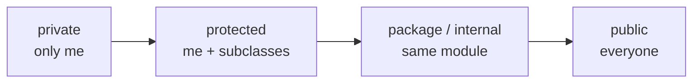

# Chapter 25 · Encapsulation

[简体中文](./25-encapsulation.md) ｜ **English**

---

> In Chapter 23 we carefully wrote validation into a constructor: a score must fall between 0 and 100. But if any code can simply write `student.score = -100`, that validation counts for nothing — **the object is born valid and rots while alive**.
>
> **Encapsulation** is the mechanism that answers "who may touch this field." It looks like a handful of keywords, but it decides something more important: **which parts of your code are promises and which are implementation details you may change at will**.
>
> The most interesting measurement in this chapter is a spectrum of how strictly "private" is enforced, and the result is surprising: **JavaScript, long considered the loosest of the group, turns out to have the strongest privacy** — `#balance` is invisible even to reflection, while the "private" of Java, C#, C++, and Python can all be circumvented, differing only in difficulty.

## 1. Learning Objectives

By the end of this chapter, you will be able to:

- Explain **what goes wrong without encapsulation**, and what it actually protects;
- Use each language's **access modifiers** and explain their scope differences;
- Explain **how differently each language enforces "private"**: syntactic prohibition, compile-time check, or pure convention;
- Judge when **getters/setters** are worth writing and when they are pure boilerplate;
- Use encapsulation to protect **invariants**, keeping objects valid throughout their lifetime.

---

## 2. Why This Concept Exists

### Problem one: validation counts for nothing

```java
public class Account {
    public int balance;                    // ⚠️ public field

    public void deposit(int n) {
        if (n <= 0) throw new IllegalArgumentException("amount must be positive");
        balance += n;                       // carefully written validation
    }
}
```

```java
acc.deposit(-50);       // ✓ blocked
acc.balance = -999;     // ✗ bypasses every check
```

**Validation only guards the front door, and a public field is a hole in the wall.**

### Problem two: implementation details become promises

```java
public class Temperature {
    public double celsius;      // now public
}
```

Six months later you want to store Fahrenheit internally — **you can't**. Every piece of code touching `temp.celsius` would break. **Once a field is public, it is promoted from "implementation detail" to "public promise."**

This is encapsulation's deeper value:

| Surface value | Deeper value |
|---------------|--------------|
| Stops others from corrupting data | **Draws the line between promise and detail** |
| Protects invariants | **Preserves your freedom to change the implementation** |
| Hides complexity | **Lets callers understand only a small part** |

> **In one sentence**: encapsulation is not about hiding, but about **clearly separating "what I guarantee will not change" from "what I may change at any time."**

### An everyday analogy

```text
A car's steering wheel, accelerator, brake  →  public interface (guaranteed stable)
The engine's combustion cycle inside        →  implementation detail (swap in a motor anytime)
```

If drivers had to operate cylinders directly, **switching to an electric car would mean every driver relearning how to drive**.

---

## 3. How It Works

### Four levels of access

Nearly every language makes its trade-offs across these four levels:



| Level | Who can access | Typical use |
|-------|----------------|-------------|
| **private** | Only this class | Implementation details, internal state |
| **protected** | This class + subclasses | Extension points for inheritance (Chapter 26) |
| **package / internal** | Same package / assembly | Intra-module collaboration |
| **public** | Anyone | The interface you promise |

### ⚠️ Key insight: enforcement differs enormously

The word "private" carries **wildly different force** across languages. This is the chapter's most valuable takeaway:

| Enforcement | Language | Circumventable? |
|-------------|----------|-----------------|
| **Syntactic prohibition** | JavaScript `#` | ❌ **No** — it isn't even valid syntax |
| **Compile-time check** | Java / C# / C++ | ✅ Reflection or raw memory can |
| **Name mangling** | Python `__` | ✅ Know the rule and you have it |
| **Pure convention** | Python `_` | ✅ Entirely unrestricted, honor system |

**Measured evidence**:

**① Python's `__` merely renames**:

```text
a.__secret          → AttributeError (looks private)
Real keys in a.__dict__: ['balance', '_internal', '_Account__secret']
a._Account__secret  → "double underscore"   ← still reachable!
```

**② Java's `private` falls to reflection**:

```text
acc.balance = -999           → compile error, the compiler blocks it
Field f = Account.class.getDeclaredField("balance");
f.setAccessible(true);
f.setInt(acc, -999);         → getBalance() becomes -999   ← breached
```

**③ C# behaves the same**:

```text
BindingFlags.NonPublic | BindingFlags.Instance
→ acc.Balance becomes -999
```

**④ C++'s `private` is compile-time only; memory doesn't care**:

```text
acc.balance = -999                          → compile error
reinterpret_cast<int*>(&acc), then *hack = -999
→ getBalance() becomes -999    ← undefined behavior, but it ran
```

**⑤ JavaScript's `#` is genuinely private**:

```text
Object.keys(a)             → ['_internal']
Object.getOwnPropertyNames(a) → ['_internal']
Reflect.ownKeys(a)         → ['_internal']
JSON.stringify(a)          → {"_internal":"convention-private"}
a.#balance                 → SyntaxError (won't even parse)
```

**No reflection mechanism can see `#balance`.**

> **This conclusion deserves a pause**: JavaScript, famous for letting you change anything, is the strictest about privacy. The reason is that `#` arrived only in 2022 — **its designers had the chance to get it right from scratch**, unlike Java's reflection, which had long become an ecosystem cornerstone (dependency injection, serialization, ORMs all rely on it) and could not be withdrawn.

### Does "circumventable" mean encapsulation is pointless?

**No.** Encapsulation was never meant to defend against a determined attacker. Its goals are:

```text
① Prevent accidents — a colleague won't casually write acc.balance = -999
② Draw boundaries — tools and docs can mark what is public API
③ Preserve freedom — you can refactor the private parts with confidence
```

**In Python's phrasing**: *"we're all consenting adults here"* — the language trusts you not to do obviously wrong things. And circumventing encapsulation requires explicitly writing `setAccessible(true)` or `_Account__secret`; **that act is itself a warning sign**.

### Invariants: what encapsulation really protects

An **invariant** is a condition an object must satisfy at all times:

```text
Account: balance >= 0
Rectangle: width > 0 and height > 0
Date: 1 <= month <= 12
Connection pool: idle + in-use == total
```

**Encapsulation's core role is to ensure invariants can only change inside code you control**:

```java
private int balance;                        // untouchable from outside
public void withdraw(int n) {
    if (n > balance) throw new IllegalStateException("insufficient funds");
    balance -= n;                            // the only entry point; the invariant holds
}
```

When every modification must pass through your methods, **the invariant becomes a fact you can rely on** rather than an assumption requiring defensive checks everywhere.

---

## 4. JavaScript

JavaScript's encapsulation evolved through three generations and ended with the strongest privacy of the group.

### Three generations of privacy

**① Underscore convention** (honor system):

```javascript
class Account {
  _balance = 100;      // just a naming convention; the language ignores it
}
new Account()._balance;   // 100 ← still accessible
```

**② Closures** (genuinely private, but one copy of each method per instance):

```javascript
function createAccount() {
  let balance = 100;                     // a closure variable, unreachable outside (Chapter 13)
  return {
    getBalance: () => balance,
    deposit(n) {
      if (n <= 0) throw new Error("amount must be positive");
      balance += n;
    },
  };
}
```

> This was the standard approach before ES6. The cost is that **each instance carries its own copy of every method** (Chapter 23: `class` methods live once on the prototype, which the closure approach cannot achieve).

**③ `#` private fields** (ES2022, true syntactic privacy):

```javascript
class Account {
  #balance = 100;
  getBalance() { return this.#balance; }
  deposit(n) {
    if (n <= 0) throw new Error("amount must be positive");
    this.#balance += n;
  }
  // private methods are possible too
  #validate(n) { return n > 0; }
  static #instances = 0;      // static private field
}
```

**Measured: no reflection sees it**:

```text
Object.keys(a)                → ['_internal']
Object.getOwnPropertyNames(a) → ['_internal']
Reflect.ownKeys(a)            → ['_internal']
JSON.stringify(a)             → {"_internal":"convention-private"}
a.#balance (outside the class) → SyntaxError
```

### Using `#` to test "is this one of ours"

```javascript
class Account {
  #balance = 0;
  static isAccount(obj) {
    return #balance in obj;      // ES2022's `in` form, which does not throw
  }
}
```

### Getters and setters

```javascript
class Temperature {
  #celsius = 0;
  get celsius() { return this.#celsius; }
  set celsius(v) {
    if (v < -273.15) throw new RangeError("below absolute zero");
    this.#celsius = v;
  }
  get fahrenheit() { return this.#celsius * 9 / 5 + 32; }   // computed property
}

const t = new Temperature();
t.celsius = 25;          // looks like assignment, actually calls the setter
t.fahrenheit;            // 77 ← derived, stored nowhere
```

> **Note**: `#` private fields are not serialized by `JSON.stringify` (confirmed by measurement). If your object needs serializing, provide a `toJSON()` method or use another approach — the most common trap when migrating from underscores to `#`.

---

## 5. Python

Python's stance is the most distinctive: **no enforced privacy at all; convention and culture instead.**

### Two kinds of underscore

```python
class Account:
    def __init__(self):
        self.balance = 100          # public
        self._internal = "internal"  # single underscore: convention, "please don't"
        self.__secret = "private"    # double underscore: name mangling
```

**Measured behavior of both**:

```text
a._internal          → "internal"        ← fully accessible, honor system
a.__secret           → AttributeError    ← looks private
Real keys in a.__dict__ → ['balance', '_internal', '_Account__secret']
a._Account__secret   → "private"         ← know the rule and you have it
```

**What `__` actually does**: the compiler rewrites `self.__secret` into `self._Account__secret`. **Its purpose is not secrecy but preventing subclasses from accidentally overriding a parent's attribute** (relevant in Chapter 26).

### `@property`: Python's signature move

Python does not encourage writing getters and setters up front. Instead, **use a public attribute and upgrade painlessly to a property when needed**:

```python
class Temperature:
    def __init__(self, celsius=0):
        self.celsius = celsius        # note: this already goes through the setter below

    @property
    def celsius(self):
        return self._celsius

    @celsius.setter
    def celsius(self, value):
        if value < -273.15:
            raise ValueError("below absolute zero")
        self._celsius = value

    @property
    def fahrenheit(self):             # read-only computed property
        return self._celsius * 9 / 5 + 32
```

**The crucial point is that caller code never changes**:

```python
t.celsius = 25        # was a plain attribute, now a property — callers can't tell
```

> **This is why Python can skip getters and setters**: because **validation can be added later without breaking a single caller**. In Java, a public field that needs validation must become a method, and every caller must change — precisely why the Java community habitually writes getters and setters preemptively.

### Read-only properties

```python
class Circle:
    def __init__(self, radius):
        self._radius = radius

    @property
    def area(self):                   # no setter → read-only
        return 3.14159 * self._radius ** 2
```

> **Note**: Python's encapsulation is **convention-driven**. That works well in practice — a leading underscore is a clear signal of "internal, subject to change." But it also means **you cannot stop others from depending on your internals**; only documentation and code review maintain the boundary.

---

## 6. Java

Java has the most granular access control, with four levels.

### The four levels

```java
public class Account {
    private int balance;          // this class only
    int packagePrivate;           // no modifier = package-visible
    protected int forSubclass;    // this class + subclasses + same package
    public int anyone;            // everyone
}
```

| Modifier | This class | Same package | Subclass | Elsewhere |
|----------|:---:|:---:|:---:|:---:|
| `private` | ✅ | ❌ | ❌ | ❌ |
| (default) | ✅ | ✅ | ❌ | ❌ |
| `protected` | ✅ | ✅ | ✅ | ❌ |
| `public` | ✅ | ✅ | ✅ | ✅ |

> **Note that `protected` includes the whole package** — commonly misremembered. It is looser than "this class plus subclasses."

### ⚠️ Reflection breaches `private` (measured)

```java
Field f = Account.class.getDeclaredField("balance");
f.setAccessible(true);          // disable the access check
f.setInt(acc, -999);            // the private field is modified
```

> **This is not a bug but a deliberately retained capability** — Spring's dependency injection, Jackson's JSON serialization, and Hibernate's ORM all depend on it. The price is that `private` guards against accidents, not intent.

> Java 9's module system (Chapter 15) offers stronger encapsulation: a package that is not `exports`ed is **unreachable even by reflection**.

### The getter/setter debate

```java
// classic boilerplate
public int getBalance() { return balance; }
public void setBalance(int b) { this.balance = b; }   // ⚠️ what does this setter add?
```

**A blunt test**:

```text
If a setter is just this.x = x with no validation or side effect,
→ it differs from a public field only by a useless layer of wrapping
→ its sole value is "no caller changes needed if validation is added later"
```

**Often the better move is to provide no setter at all**:

```java
public record Point(int x, int y) { }        // immutable; setters are meaningless

public class Account {
    private int balance;
    public int getBalance() { return balance; }
    public void deposit(int n) { ... }        // meaningful operations, not a bare setter
    public void withdraw(int n) { ... }
}
```

> **Note**: `deposit` / `withdraw` beat `setBalance` decisively — **the former express business intent and protect invariants; the latter merely wraps a field assignment**. This is the core distinction in encapsulation design: **expose operations, not state**.

---

## 7. C++

C++ has three access levels plus something no other language here provides: `friend`.

### Three levels plus friend

```cpp
class Account {
private:
    int balance = 100;              // this class and friends only

protected:
    int forSubclass;                // this class + derived classes

public:
    int getBalance() const { return balance; }

    friend class Auditor;           // ⚠️ unique to C++: an explicit, legal back door
    friend void debugPrint(const Account&);
};

class Auditor {
public:
    static int peek(const Account& a) { return a.balance; }   // legally reads a private member
};
```

**Measured**: `Auditor::peek(acc)` successfully read the private `balance`.

> **The intent behind `friend`**: some collaborations genuinely need access to each other's internals (operator overloads, factory classes, test classes). C++'s choice is to **name exactly who is trusted** rather than make members public. That is more precise than widening access — **you know exactly which code depends on the internals**.

### The only difference between `struct` and `class`

```cpp
struct A { int x; };     // public by default
class  B { int x; };     // private by default
```

> The convention: **`struct` for plain data aggregates, `class` when there are invariants to maintain.**

### ⚠️ `private` is only a compile-time check (measured)

```cpp
acc.balance = -999;                              // compile error
int* hack = reinterpret_cast<int*>(&acc);        // undefined behavior
*hack = -999;                                     // yet it does change the value
```

> **This is C++'s consistent philosophy**: the language helps you express intent and checks it at compile time, but **will not spend runtime cost stopping you**. No runtime access check means no runtime overhead.

### Pimpl: really hiding the implementation

When you want to hide even *which fields exist* (for ABI stability, say), C++ has a classic idiom:

```cpp
// account.h — the header reveals nothing
class Account {
public:
    Account();
    ~Account();
    int getBalance() const;
private:
    class Impl;                        // declared, not defined
    std::unique_ptr<Impl> pImpl;       // points to the implementation
};
```

> **Pimpl (pointer to implementation)** buys this: changing private members **does not force recompilation of client code**. The cost is one pointer indirection and one heap allocation.

---

## 8. C#

C# has the most modifiers, and properties make encapsulation the least tedious to write.

### Access modifiers

| Modifier | Visibility |
|----------|-----------|
| `private` | This class only (the default) |
| `protected` | This class + derived classes |
| `internal` | Same assembly |
| `protected internal` | Derived classes **or** same assembly |
| `private protected` | Derived classes within the same assembly (both required) |
| `public` | Everyone |

> `internal` corresponds to Java's package-private, but its granularity is the **assembly** (a DLL) — matching .NET's deployment unit.

### Properties: C#'s core advantage

```csharp
public class Temperature
{
    private double _celsius;

    public double Celsius
    {
        get => _celsius;
        set
        {
            if (value < -273.15) throw new ArgumentOutOfRangeException(nameof(value));
            _celsius = value;
        }
    }

    public double Fahrenheit => _celsius * 9 / 5 + 32;   // read-only computed property
}
```

**Auto-properties** — the shorthand when no validation is needed:

```csharp
public int Score { get; set; }              // the compiler generates the backing field
public int Id { get; }                       // read-only, assignable only in the constructor
public int Count { get; private set; }       // read-only outside, writable inside
public string Name { get; init; }            // C# 9+: assignable only during initialization
```

> **The same idea as Python's `@property`**: start with a simple auto-property and **switch to a full property when validation is needed, with no caller changes**. This removes any need to write getters and setters preemptively.

### `init` and `required`

```csharp
public class Student
{
    public required string Name { get; init; }   // C# 11: must be initialized, read-only after
    public int Score { get; init; }
}

var s = new Student { Name = "Alice", Score = 92 };
// s.Name = "Bob";   // compile error: assignable only during initialization
```

> **Note**: C# is equally breachable by reflection (measured: `BindingFlags.NonPublic` modified the private field). As in Java, this is the foundation of serialization and dependency-injection frameworks.

---

## 9. SQL

A database's encapsulation mechanisms differ from a language's, but the goal is identical: **hide the internal structure and expose only what should be exposed.**

### ① Views: hiding table structure

```sql
CREATE TABLE student (
    id INTEGER PRIMARY KEY, name TEXT, score INTEGER,
    id_number TEXT,          -- sensitive
    parent_income INTEGER    -- sensitive
);

-- a view is the database's "public interface"
CREATE VIEW student_public AS
SELECT id, name, score,
       CASE WHEN score >= 60 THEN 'pass' ELSE 'fail' END AS status
FROM student;
```

**The benefits mirror language-level encapsulation exactly**:

| Programming language | Database |
|---------------------|----------|
| Private field | A column absent from the view |
| Public method | The view |
| Change internals without breaking callers | **Change the table; adjust the view; queries stay the same** |
| Computed property | A derived column in the view |

### ② Permissions: genuinely enforced access control

```sql
-- grant on the view only, never on the base table
GRANT SELECT ON student_public TO reporting_user;
REVOKE ALL ON student FROM reporting_user;
```

> **This is the chapter's most interesting contrast**: database permissions are **enforced at runtime** — unlike Java's `private`, which reflection defeats, a user who has been `REVOKE`d genuinely cannot read the table. Because **a database has an absolute execution boundary (the server), while all your language code runs in one process.**

### ③ Stored procedures: expose operations, not tables

```sql
CREATE PROCEDURE deposit(IN account_id INT, IN amount INT)
BEGIN
    IF amount <= 0 THEN
        SIGNAL SQLSTATE '45000' SET MESSAGE_TEXT = 'amount must be positive';
    END IF;
    UPDATE account SET balance = balance + amount WHERE id = account_id;
END;
```

> This echoes Section 6 exactly: **expose an operation like `deposit`, not the state `balance`.** If users can only change the balance through the procedure, the validation can never be bypassed. (Syntax varies by database; SQLite has no stored procedures.)

### ④ Constraints: invariants at the database level

```sql
CREATE TABLE account (
    id      INTEGER PRIMARY KEY,
    balance INTEGER NOT NULL CHECK (balance >= 0)   -- the invariant, in the schema
);
```

> **This is the strongest layer of protection**: no matter who writes, how, or from which application, `balance >= 0` cannot be violated. **Application-level encapsulation can be circumvented; a database constraint cannot.**

---

## 10. Cross-Language Comparison

### ① Encapsulation mechanisms

| Feature | JavaScript | Python | Java | C++ | C# |
|---------|-----------|--------|------|-----|-----|
| True privacy | ✅ **`#`** | ❌ | ❌ (reflection) | ❌ (raw memory) | ❌ (reflection) |
| Private syntax | `#field` | `_x` / `__x` | `private` | `private` | `private` |
| Protected level | ❌ none | ❌ none (`_` convention) | `protected` | `protected` | `protected` |
| Module level | ❌ | The module itself | Package (default) | Namespace | `internal` |
| Property syntax | `get`/`set` | `@property` | Hand-written methods | Hand-written methods | **Properties (cleanest)** |
| Back door | ❌ | Mangling rule | Reflection | **`friend`** | Reflection |

### ② The enforcement spectrum

```text
Strongest ←────────────────────────────────────────────→ Weakest
JS #        Java/C# private     C++ private        Python __      Python _
syntax      compile+reflection  compile+memory     renaming       convention
```

**Conclusions verified by measurement**:

- **JavaScript `#`**: invisible to `Object.keys`, `getOwnPropertyNames`, `Reflect.ownKeys`, and `JSON.stringify`; access outside the class is a `SyntaxError`;
- **Java / C#**: the compiler blocks direct access, but `setAccessible(true)` / `BindingFlags.NonPublic` breach it;
- **C++**: the compiler blocks it, but `reinterpret_cast` overwrites it (undefined behavior);
- **Python `__`**: merely renamed to `_ClassName__attr`, reachable if you know the rule;
- **Python `_`**: entirely unrestricted.

### ③ Commonalities and the roots of the differences

**In common**: every language provides a way to mark internals, supports some form of computed property, and agrees that exposing operations beats exposing state.

**Roots of the differences**:

- **Python chose convention over enforcement**, from its "we're all consenting adults" philosophy — **trust the programmer and make introspection and metaprogramming first-class** (Chapter 30);
- **Java / C# kept the reflection back door** because reflection had already become an ecosystem cornerstone (DI, serialization, ORM); sealing it would break half the ecosystem;
- **C++'s `friend`** reflects its usual style: **rather than widening access, name the exceptions precisely**;
- **JavaScript's `#` is the strictest** precisely because it arrived last — **its designers could get it right from scratch**, unburdened by history;
- **Database permissions are the only truly enforced ones**, because they have an execution boundary outside your process.

---

## 11. Implementation Comparison

| Language · Mechanism | How it works | When checked |
|---------------------|-------------|--------------|
| **JS `#`** | An engine-internal private slot, absent from the property table | **Parse time** (syntax error) |
| **JS closures** | Variables live in the closure environment (Chapter 13) | No check needed — no external reference exists |
| **Python `_`** | No mechanism at all | **Never** |
| **Python `__`** | Compile-time rename to `_Class__attr` | Never (the original name simply isn't found) |
| **Java `private`** | Recorded in class-file access flags | **Compile time** + JVM verification (reflection can disable) |
| **C++ `private`** | A purely compile-time concept; no effect on layout | **Compile time** (zero runtime cost) |
| **C# `private`** | Recorded in IL metadata | **Compile time** (reflection can bypass) |
| **SQL permissions** | Server-side permission tables | **Every query, at runtime** |

**A fact worth noting**: **C++'s `private` has no effect on object layout at all** (Chapter 24) — private and public fields take the same space at the same offsets. Access control is purely the compiler's business, leaving no runtime trace, which is exactly what "zero overhead" means.

---

## 12. Performance Analysis

### The cost of encapsulation itself

| Mechanism | Runtime cost |
|-----------|-------------|
| C++ `private` | **Zero** — purely compile-time |
| Java / C# `private` | **Zero** — the JIT inlines simple getters |
| JS `#` fields | Near zero (engine-optimized private slots) |
| **JS closure privacy** | ⚠️ **One copy of each method per instance** (Chapter 23: `class` methods exist once) |
| Python `@property` | ⚠️ Attribute access becomes a method call, **slower than direct access** |
| SQL views | Usually zero (expanded by the query optimizer) |

### Two things worth noting

**① Python's `@property` really does cost something**:

```python
obj.x           # plain attribute: one dict lookup
obj.x           # property: dict lookup plus a method call
```

> But this is **almost never the bottleneck**. If you must optimize, `__slots__` (Chapter 24) pays off far more than removing properties.

**② The memory cost of JS closure privacy**:

```javascript
// closures: ten thousand instances = ten thousand sets of methods
function createAccount() {
  let balance = 0;
  return { deposit(n) { balance += n; } };   // a new function object every call
}

// # fields: methods live on the prototype, one copy
class Account {
  #balance = 0;
  deposit(n) { this.#balance += n; }
}
```

> ⚠️ This section gives no millisecond figures — encapsulation overhead is usually within noise, and **using it to drive optimization decisions is backwards**. The things worth measuring are the layout issues of Chapter 24.

---

## 13. Engineering Practice

| Scenario | ✅ Recommended | ❌ Not recommended | Why |
|----------|---------------|-------------------|-----|
| Fields with invariants | `private` + meaningful methods | Public fields | Validation cannot be bypassed |
| Pure data transfer | `record` / `@dataclass` | Hand-written accessors | Less boilerplate |
| A setter that only assigns | Don't write it | `setX(x) { this.x = x; }` | It adds nothing |
| State-changing operations | `deposit()` / `withdraw()` | `setBalance()` | Expresses intent, not state |
| Derived data | Computed property | A field kept in sync by hand | Cannot go inconsistent |
| Python internals | Single underscore `_x` | Double underscore `__x` | `__` is mainly for subclass collisions |
| True privacy in JS | `#field` | Underscore convention | Measured: `#` is invisible to reflection |
| JS objects needing serialization | Underscore or `toJSON()` | `#field` | `#` is skipped by `JSON.stringify` |
| C++ collaborating classes | `friend` | Making members public | Precise control over exceptions |
| C++ ABI stability | Pimpl | Private members in the header | Changing internals avoids recompiles |
| Sensitive database columns | View + `GRANT` | Filtering in the application | Runtime-enforced, unbypassable |
| Critical invariants | Database `CHECK` constraint | Application-level validation only | The database is the last line of defense |

**A practical design principle**:

```text
Ask "what does the caller need to do," not "what data does this object hold."
→ You get operations (deposit / withdraw / transfer)
→ instead of state (getBalance / setBalance)
```

---

## 14. Best Practices

- **Default to private and open up only when needed** — widening is easy, narrowing is nearly impossible.
- **Expose operations, not state**: `deposit()` over `setBalance()`.
- **Do not write meaningless setters**; many classes should simply be immutable.
- **Let invariants change only inside code you control**, so they can be relied upon.
- **In Python and C#, start with simple attributes** and upgrade to properties painlessly when validation appears.
- **Prefer `#` in JavaScript**, remembering it is not serialized by `JSON.stringify`.
- **Write critical constraints at the database level too** — application encapsulation can be circumvented; a `CHECK` constraint cannot.
- **Do not expect encapsulation to stop malice**: it stops accidents and misuse, and draws maintainable boundaries.

---

## 15. Common Pitfalls

**Pitfall 1 · Believing Python's `__` is truly private**

```python
a._Account__secret       # ✗ still reachable (verified by measurement)
```
**How to avoid**: understand that `__` prevents subclass name collisions, not access.

**Pitfall 2 · Writing piles of validation-free getters and setters**

```java
public void setBalance(int b) { this.balance = b; }   // ✗ no different from a public field
```
**How to avoid**: either omit them or write meaningful operations instead.

**Pitfall 3 · JS `#` fields are not serialized**

```javascript
class A { #x = 1; }
JSON.stringify(new A());     // "{}" ← the data is gone (verified)
```
**How to avoid**: implement `toJSON()` when serialization is needed.

**Pitfall 4 · Assuming Java's `protected` means subclasses only**

```java
protected int x;    // ⚠️ any class in the same package can access it — looser than you think
```

**Pitfall 5 · Returning a mutable internal object**

```java
private List<String> items = new ArrayList<>();
public List<String> getItems() { return items; }      // ✗ callers can modify the internal list!
public List<String> getItems() {
    return Collections.unmodifiableList(items);       // ✓
}
```
**How to avoid**: return an unmodifiable view or a defensive copy. **This is the most insidious encapsulation leak** — the field is private, but the reference escaped.

**Pitfall 6 · Leaking `this` from a constructor**

```java
public Account() {
    registry.add(this);      // ⚠️ others obtain the object before construction finishes
}
```

**Pitfall 7 · Validating only in the application**

```text
Application: if (balance < 0) throw ...
Database:    balance INTEGER          ← ✗ another client writes directly and bypasses it
Database:    balance INTEGER CHECK (balance >= 0)   ← ✓
```

---

## 16. Interview Questions

**Basic**

1. What is encapsulation, and what problem does it solve?
2. What are the visibility scopes of `private`, `protected`, and `public`?
3. Why does a public field defeat constructor validation?

**Intermediate**

4. **What is the difference between Python's `_` and `__`? Is `__` truly private?**
5. When are getters and setters valuable, and when are they just boilerplate?
6. What is an invariant, and how does encapsulation protect it?

**Advanced**

7. **How does "private" enforcement differ across languages?** Which is strongest, and why?
8. Java's reflection breaches `private` — is that a design flaw? Why was it kept?
9. What is an encapsulation leak? Why is returning an internal collection dangerous?

---

## 17. Exercises

**Basic**

1. Write an `Account` class whose balance can never go negative.
2. Implement a read-only computed property (such as Celsius to Fahrenheit) in all six languages.
3. Refactor a class with public fields into a well-encapsulated one.

**Intermediate**

4. Verify whether a Python `__` attribute is reachable via `_ClassName__attr`.
5. Breach a `private` field with Java reflection, and consider what that means for encapsulation.
6. Verify that a JavaScript `#` field is invisible to `Object.keys`, `Reflect.ownKeys`, and `JSON.stringify`.

**Advanced**

7. Find code with an encapsulation leak (a mutable internal collection returned) and fix it.
8. Implement a class using the C++ Pimpl idiom and verify that changing private members requires no client recompilation.
9. Design a view-plus-permission scheme so a reporting user sees only redacted data.

---

## 18. Chapter Summary

**In one sentence**: encapsulation is not about hiding but about **separating "the promise I guarantee" from "the implementation I may change"**; it makes constructor validation actually effective, turns invariants into reliable facts, and preserves your freedom to refactor internals — and enforcement varies enormously, with **only JavaScript's `#` syntactically forbidding access**.

**Key points**

- **Two consequences of skipping encapsulation**: validation is bypassed, and details become unchangeable promises.
- **The enforcement spectrum** (measured): JS `#` (syntax) > Java/C# `private` (reflection breaks it) > C++ `private` (memory breaks it) > Python `__` (renaming breaks it) > Python `_` (pure convention).
- **JavaScript is the strictest**, because `#` arrived last and carried no historical baggage.
- **Circumventable ≠ useless**: encapsulation stops accidents and misuse and draws maintainable boundaries.
- **Expose operations, not state**: `deposit()` over `setBalance()`.
- **Database permissions and `CHECK` constraints are the only runtime-enforced encapsulation**, thanks to an out-of-process boundary.
- **The most insidious pitfall is the encapsulation leak**: the field is private, but a mutable internal reference escaped.

**Checklist**

- [ ] I can name the concrete problems that arise without encapsulation.
- [ ] I know how strictly "private" is enforced in the language I use.
- [ ] I can judge whether a getter or setter earns its place.
- [ ] I understand why exposing operations beats exposing state.
- [ ] I avoid returning mutable internal collections.

**Coming next**: encapsulation settled "who may touch my data." But another kind of repetition remains: `Dog`, `Cat`, and `Bird` all have `name`, `age`, and `eat()` — must every class rewrite them? **Inheritance** answers "let a new class receive everything an existing class has" — yet this apparently perfect reuse mechanism became the most widely abused feature in object orientation. Chapter 26, "Inheritance," covers **what it genuinely solves, what it costs, and why modern design favors composition over inheritance**.

---

## 19. Further Reading

- <a href="https://en.wikipedia.org/wiki/Encapsulation_(computer_programming)" target="_blank" rel="noopener">Wikipedia: Encapsulation (computer programming)</a> — the concept and its implementations.
- <a href="https://en.wikipedia.org/wiki/Information_hiding" target="_blank" rel="noopener">Wikipedia: Information hiding</a> — Parnas's original idea, the theoretical basis of encapsulation.
- <a href="https://developer.mozilla.org/en-US/docs/Web/JavaScript/Reference/Classes/Private_properties" target="_blank" rel="noopener">MDN · Private properties</a> — full reference on `#` private fields.
- <a href="https://docs.python.org/3/tutorial/classes.html#private-variables" target="_blank" rel="noopener">Python Tutorial · Private Variables</a> — the official account of name mangling.
- <a href="https://docs.oracle.com/javase/specs/jls/se21/html/jls-6.html" target="_blank" rel="noopener">Java Language Specification · Chapter 6, "Names"</a> — the authoritative definition of access control (§6.6).
- <a href="https://en.cppreference.com/w/cpp/language/access" target="_blank" rel="noopener">cppreference · Access specifiers</a> — rules for `public`/`protected`/`private` and `friend`.
- <a href="https://learn.microsoft.com/en-us/dotnet/csharp/programming-guide/classes-and-structs/access-modifiers" target="_blank" rel="noopener">Microsoft Learn · C# access modifiers</a> — including `internal` and `private protected`.
