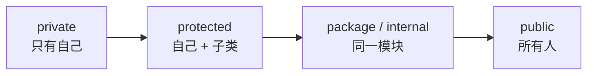

# 第 25 章 · 封装

**简体中文** ｜ [English](./25-encapsulation.en-US.md)

---

> 第 23 章我们在构造函数里认真写了校验：分数必须在 0 到 100 之间。但如果任何代码都能直接写 `student.score = -100`，那份校验就形同虚设——**对象出生时是合法的，活着活着就烂掉了**。
>
> **封装**就是回答"谁能碰这个字段"的机制。它看起来只是几个关键字，实际上决定了一件更重要的事：**你的代码里，哪些部分是承诺、哪些部分是可以随时改的实现细节**。
>
> 本章最有意思的实测是一张"私有强制程度光谱"，而结论出人意料：**一向被认为最松散的 JavaScript，反而拥有这几门语言里最强的私有性**——`#balance` 连反射都看不见；而 Java、C#、C++、Python 的"私有"全都能被绕过，只是难度不同。

## 1. 学习目标

本章结束后，你将能够：

- 说清**不封装会出什么问题**，以及封装保护的到底是什么；
- 使用各语言的**访问修饰符**，并说清它们的作用域差异；
- 解释**各语言"私有"的强制程度差异**：语法禁止、编译期检查、还是纯粹约定；
- 判断什么时候该写 **getter/setter**，什么时候它们只是无意义的样板；
- 用封装保护**不变式**，让对象在整个生命周期里都保持合法。

---

## 2. 为什么会出现这个概念

### 不封装的第一个问题：校验形同虚设

```java
public class Account {
    public int balance;                    // ⚠️ 公开字段

    public void deposit(int n) {
        if (n <= 0) throw new IllegalArgumentException("金额必须为正");
        balance += n;                       // 认真写的校验
    }
}
```

```java
acc.deposit(-50);       // ✓ 被挡住了
acc.balance = -999;     // ✗ 直接绕过所有校验
```

**校验只在"正门"生效，而公开字段等于在墙上开了个洞。**

### 不封装的第二个问题：实现细节变成了承诺

```java
public class Temperature {
    public double celsius;      // 公开出去了
}
```

半年后你想改成内部存华氏度——**改不了了**。所有用到 `temp.celsius` 的代码都会坏掉。**一旦一个字段是公开的，它就从"实现细节"升级成了"对外承诺"。**

这才是封装更深层的价值：

| 表面价值 | 更深层的价值 |
|---------|-------------|
| 防止别人乱改数据 | **划清"承诺"与"实现细节"的边界** |
| 保护不变式 | **保留未来改实现的自由** |
| 隐藏复杂度 | **让调用方只需理解一小部分** |

> **一句话**：封装的本质不是"藏起来"，而是**明确区分"我保证不变的部分"和"我随时可能改的部分"**。

### 一个直观的类比

```text
汽车的方向盘、油门、刹车  →  公开接口（承诺一直是这样）
发动机内部的燃烧循环      →  实现细节（厂商随时可以换成电机）
```

如果驾驶员必须直接操作气缸，那么**换成电动车就意味着所有司机都要重新学开车**。

---

## 3. 底层原理

### 访问级别的四个层次

几乎所有语言都在这四个层次上做取舍：



| 级别 | 谁能访问 | 典型用途 |
|------|---------|---------|
| **private** | 只有本类 | 实现细节、内部状态 |
| **protected** | 本类 + 子类 | 供继承使用的扩展点（第 26 章） |
| **package / internal** | 同一包 / 同一程序集 | 模块内部协作 |
| **public** | 任何人 | 对外承诺的接口 |

### ⚠️ 关键洞察：私有的强制程度差别巨大

"私有"这个词在不同语言里的**约束力完全不同**。这是本章最值得记住的一点：

| 强制方式 | 语言 | 能绕过吗 |
|---------|------|---------|
| **语法层面禁止** | JavaScript `#` | ❌ **不能**——连语法都不合法 |
| **编译期检查** | Java / C# / C++ | ✅ 反射或内存操作可以 |
| **改名（name mangling）** | Python `__` | ✅ 知道规则就能拿到 |
| **纯约定** | Python `_` | ✅ 完全不受限，全靠自觉 |

**实测证据**：

**① Python 的 `__` 只是改了个名字**：

```text
a.__secret          → AttributeError（看起来是私有的）
a.__dict__ 里的真实键: ['balance', '_internal', '_Account__secret']
a._Account__secret  → "双下划线"   ← 照样能拿到！
```

**② Java 的 `private` 能被反射突破**：

```text
acc.balance = -999           → 编译错误，编译器挡住了
Field f = Account.class.getDeclaredField("balance");
f.setAccessible(true);
f.setInt(acc, -999);         → getBalance() 变成 -999   ← 突破成功
```

**③ C# 同样如此**：

```text
BindingFlags.NonPublic | BindingFlags.Instance
→ acc.Balance 变成 -999
```

**④ C++ 的 `private` 只是编译期检查，内存层面拦不住**：

```text
acc.balance = -999                          → 编译错误
reinterpret_cast<int*>(&acc)，然后 *hack = -999
→ getBalance() 变成 -999    ← 未定义行为，但确实跑通了
```

**⑤ 而 JavaScript 的 `#` 是真的私有**：

```text
Object.keys(a)             → ['_internal']
Object.getOwnPropertyNames(a) → ['_internal']
Reflect.ownKeys(a)         → ['_internal']
JSON.stringify(a)          → {"_internal":"约定私有"}
a.#balance                 → SyntaxError（根本编译不过）
```

**所有反射手段都看不到 `#balance`。**

> **这个结论值得停下来想想**：以"什么都能改"著称的 JavaScript，在私有性上反而最严格。原因是 `#` 是 2022 年才加入的新特性——**设计者有机会从零做对**，不像 Java 的反射机制早已成为生态基石（依赖注入、序列化、ORM 全靠它），无法收回。

### 那么"能被绕过"意味着封装没用吗

**不意味着**。封装的目标从来不是防御恶意攻击，而是：

```text
① 防止「意外」——同事不会不小心写出 acc.balance = -999
② 划清边界——工具和文档能清楚标出哪些是公开 API
③ 保留自由——你能放心地重构私有部分
```

**用 Python 的说法**：*"我们都是自愿成年人"*（we're all consenting adults）——语言相信你不会去做明显错误的事。而绕过封装需要显式写出 `setAccessible(true)` 或 `_Account__secret`，**这个动作本身就是一个警示信号**。

### 不变式：封装真正保护的东西

**不变式**（invariant）是"这个对象在任何时刻都必须满足的条件"：

```text
Account: balance >= 0
Rectangle: width > 0 且 height > 0
Date: 1 <= month <= 12
连接池: 空闲连接数 + 使用中连接数 == 总连接数
```

**封装的核心作用，是让不变式只可能在"你控制的代码"里被改变**：

```java
private int balance;                        // 外部改不了
public void withdraw(int n) {
    if (n > balance) throw new IllegalStateException("余额不足");
    balance -= n;                            // 唯一的修改入口，不变式得到保证
}
```

只要所有修改都必须经过你写的方法，**不变式就成了可以依赖的事实**，而不是需要到处防御性检查的假设。

---

## 4. JavaScript

JavaScript 的封装手段经历了三代演进，最终得到了这几门语言里最强的私有性。

### 三代私有方案

**① 下划线约定**（纯靠自觉）：

```javascript
class Account {
  _balance = 100;      // 只是个命名约定，语言完全不管
}
new Account()._balance;   // 100 ← 照样能访问
```

**② 闭包**（真私有，但每个实例一份函数）：

```javascript
function createAccount() {
  let balance = 100;                     // 闭包变量，外部拿不到（第 13 章）
  return {
    getBalance: () => balance,
    deposit(n) {
      if (n <= 0) throw new Error("金额必须为正");
      balance += n;
    },
  };
}
```

> 这是 ES6 之前的标准做法。代价是**每个实例都持有自己的一套方法**（第 23 章讲过：`class` 的方法在原型上只存一份，而闭包方案做不到）。

**③ `#` 私有字段**（ES2022，语法层面的真私有）：

```javascript
class Account {
  #balance = 100;
  getBalance() { return this.#balance; }
  deposit(n) {
    if (n <= 0) throw new Error("金额必须为正");
    this.#balance += n;
  }
  // 也可以有私有方法
  #validate(n) { return n > 0; }
  static #instances = 0;      // 静态私有字段
}
```

**实测：所有反射手段都看不到它**：

```text
Object.keys(a)                → ['_internal']
Object.getOwnPropertyNames(a) → ['_internal']
Reflect.ownKeys(a)            → ['_internal']
JSON.stringify(a)             → {"_internal":"约定私有"}
a.#balance（在类外）           → SyntaxError
```

### 用 `#` 检测"是不是自己人"

```javascript
class Account {
  #balance = 0;
  static isAccount(obj) {
    return #balance in obj;      // ES2022 的 in 用法，不会抛错
  }
}
```

### getter / setter

```javascript
class Temperature {
  #celsius = 0;
  get celsius() { return this.#celsius; }
  set celsius(v) {
    if (v < -273.15) throw new RangeError("低于绝对零度");
    this.#celsius = v;
  }
  get fahrenheit() { return this.#celsius * 9 / 5 + 32; }   // 计算属性
}

const t = new Temperature();
t.celsius = 25;          // 看起来像赋值，实际调用了 setter
t.fahrenheit;            // 77 ← 派生数据，不占存储
```

> **注意事项**：`#` 私有字段不会被 `JSON.stringify` 序列化（实测已确认）。如果对象需要序列化，要么提供 `toJSON()` 方法，要么改用别的方案——这是从下划线迁移到 `#` 时最容易踩的坑。

---

## 5. Python

Python 的态度最鲜明：**不提供强制私有，而是靠约定和文化**。

### 两种下划线

```python
class Account:
    def __init__(self):
        self.balance = 100          # 公开
        self._internal = "内部用"    # 单下划线：约定，"请别碰"
        self.__secret = "私有"       # 双下划线：name mangling
```

**实测两者的真实行为**：

```text
a._internal          → "内部用"          ← 完全能访问，纯靠自觉
a.__secret           → AttributeError   ← 看起来私有
a.__dict__ 的真实键   → ['balance', '_internal', '_Account__secret']
a._Account__secret   → "私有"           ← 知道规则就能拿到
```

**`__` 的真实作用**：编译器把 `self.__secret` 改写成 `self._Account__secret`。**它的设计目的不是保密，而是避免子类意外覆盖父类的属性**（第 26 章会用到）。

### `@property`：Python 的招牌手段

Python 不鼓励一上来就写 getter/setter，而是**先用公开属性，需要时再无痛升级为 property**：

```python
class Temperature:
    def __init__(self, celsius=0):
        self.celsius = celsius        # 注意：这里已经走了下面的 setter

    @property
    def celsius(self):
        return self._celsius

    @celsius.setter
    def celsius(self, value):
        if value < -273.15:
            raise ValueError("低于绝对零度")
        self._celsius = value

    @property
    def fahrenheit(self):             # 只读的计算属性
        return self._celsius * 9 / 5 + 32
```

**关键在于调用方代码完全不用改**：

```python
t.celsius = 25        # 之前是普通属性，现在是 property —— 调用方无感知
```

> **这就是 Python 不写 getter/setter 的底气**：因为**随时可以在不破坏调用方的前提下加上校验**。而 Java 里公开字段一旦要加校验，就必须改成方法，所有调用方都得跟着改——这正是 Java 社区习惯"预防性地写 getter/setter"的原因。

### 只读属性

```python
class Circle:
    def __init__(self, radius):
        self._radius = radius

    @property
    def area(self):                   # 没有 setter → 只读
        return 3.14159 * self._radius ** 2
```

> **注意事项**：Python 的封装是**约定驱动**的。这在协作中运作良好——单下划线开头就是明确的"这是内部实现，我随时会改"信号。但也意味着**你无法阻止别人依赖你的内部实现**，只能通过文档和代码评审来维护边界。

---

## 6. Java

Java 的访问控制最细致，有四个级别。

### 四个访问级别

```java
public class Account {
    private int balance;          // 只有本类
    int packagePrivate;           // 不写修饰符 = 包内可见
    protected int forSubclass;    // 本类 + 子类 + 同包
    public int anyone;            // 所有人
}
```

| 修饰符 | 本类 | 同包 | 子类 | 其他 |
|--------|:---:|:---:|:---:|:---:|
| `private` | ✅ | ❌ | ❌ | ❌ |
| （默认） | ✅ | ✅ | ❌ | ❌ |
| `protected` | ✅ | ✅ | ✅ | ❌ |
| `public` | ✅ | ✅ | ✅ | ✅ |

> **注意 `protected` 包含同包**——这是很多人记错的地方。它比"本类 + 子类"更宽松。

### ⚠️ 反射能突破 private（实测）

```java
Field f = Account.class.getDeclaredField("balance");
f.setAccessible(true);          // 关掉访问检查
f.setInt(acc, -999);            // 成功改掉私有字段
```

> **这不是 bug，而是刻意保留的能力**——Spring 的依赖注入、Jackson 的 JSON 序列化、Hibernate 的 ORM 全都依赖它。代价就是 `private` 只能防"意外"，防不了"蓄意"。

> Java 9 的模块系统（第 15 章）提供了更强的封装：未 `exports` 的包，**连反射都访问不到**。

### getter/setter 的争议

```java
// 典型的样板代码
public int getBalance() { return balance; }
public void setBalance(int b) { this.balance = b; }   // ⚠️ 这个 setter 有意义吗？
```

**一个直白的判断标准**：

```text
如果 setter 只是 this.x = x，没有任何校验或副作用
→ 它和公开字段的区别只是「多了一层没用的包装」
→ 唯一的价值是「以后可能要加校验时不用改调用方」
```

**更好的做法往往是不提供 setter**：

```java
public record Point(int x, int y) { }        // 不可变，根本不需要 setter

public class Account {
    private int balance;
    public int getBalance() { return balance; }
    public void deposit(int n) { ... }        // 有意义的操作，而不是裸 setter
    public void withdraw(int n) { ... }
}
```

> **注意事项**：`deposit` / `withdraw` 比 `setBalance` 好得多——**前者表达业务意图并能保护不变式，后者只是把字段赋值包了一层**。这是封装设计的核心区别：**暴露操作，而不是暴露状态**。

---

## 7. C++

C++ 的访问控制有三个级别，外加一个其他语言没有的 `friend`。

### 三个级别 + friend

```cpp
class Account {
private:
    int balance = 100;              // 只有本类和 friend

protected:
    int forSubclass;                // 本类 + 派生类

public:
    int getBalance() const { return balance; }

    friend class Auditor;           // ⚠️ C++ 独有：开一个合法后门
    friend void debugPrint(const Account&);
};

class Auditor {
public:
    static int peek(const Account& a) { return a.balance; }   // 合法访问私有成员
};
```

**实测**：`Auditor::peek(acc)` 成功读到了私有的 `balance`。

> **`friend` 的设计意图**：有些协作关系天然需要访问彼此的内部（比如运算符重载、工厂类、测试类）。C++ 的选择是"**显式列出谁是自己人**"，而不是把成员改成 public。这比放开访问级别更精确——**你明确知道有哪些代码依赖了内部实现**。

### `struct` 与 `class` 的唯一区别

```cpp
struct A { int x; };     // 默认 public
class  B { int x; };     // 默认 private
```

> 约定俗成：**纯数据聚合用 `struct`，有不变式要维护的用 `class`**。

### ⚠️ private 只是编译期检查（实测）

```cpp
acc.balance = -999;                              // 编译错误
int* hack = reinterpret_cast<int*>(&acc);        // 未定义行为
*hack = -999;                                     // 但确实改掉了
```

> **这是 C++ 的一贯哲学**：语言帮你表达意图并在编译期检查，但**不会在运行时付出代价去阻止你**。没有运行时访问检查，也就没有运行时开销。

### Pimpl：真正隐藏实现

如果连"类里有哪些字段"都想藏起来（比如为了保持 ABI 稳定），C++ 有个经典手法：

```cpp
// account.h —— 头文件里什么细节都看不到
class Account {
public:
    Account();
    ~Account();
    int getBalance() const;
private:
    class Impl;                        // 只声明，不定义
    std::unique_ptr<Impl> pImpl;       // 指向实现
};
```

> **Pimpl（pointer to implementation）** 的价值：改动私有成员**不需要重新编译使用者的代码**。代价是多一次指针跳转和一次堆分配。

---

## 8. C#

C# 的访问修饰符最多，而且属性（property）让封装写起来最省事。

### 访问修饰符

| 修饰符 | 可见范围 |
|--------|---------|
| `private` | 仅本类（默认） |
| `protected` | 本类 + 派生类 |
| `internal` | 同一程序集 |
| `protected internal` | 派生类 **或** 同程序集 |
| `private protected` | 同程序集内的派生类（两者都要满足） |
| `public` | 所有人 |

> `internal` 对应 Java 的包级私有，但粒度是**程序集**（一个 DLL）——这与 .NET 的部署单元一致。

### 属性：C# 的核心优势

```csharp
public class Temperature
{
    private double _celsius;

    public double Celsius
    {
        get => _celsius;
        set
        {
            if (value < -273.15) throw new ArgumentOutOfRangeException(nameof(value));
            _celsius = value;
        }
    }

    public double Fahrenheit => _celsius * 9 / 5 + 32;   // 只读计算属性
}
```

**自动属性**——不需要校验时的简写：

```csharp
public int Score { get; set; }              // 编译器自动生成后备字段
public int Id { get; }                       // 只读，只能在构造函数里赋值
public int Count { get; private set; }       // 外部只读，内部可写
public string Name { get; init; }            // C# 9+：只能在对象初始化时赋值
```

> **和 Python 的 `@property` 是同一个思路**：先写简单的自动属性，**需要校验时再改成完整属性，调用方代码完全不用动**。这让"预防性地写 getter/setter"变得没有必要。

### `init` 与 `required`

```csharp
public class Student
{
    public required string Name { get; init; }   // C# 11：必须初始化，之后只读
    public int Score { get; init; }
}

var s = new Student { Name = "Alice", Score = 92 };
// s.Name = "Bob";   // 编译错误：只能在初始化时赋值
```

> **注意事项**：C# 同样能被反射突破（实测 `BindingFlags.NonPublic` 成功改掉了私有字段）。与 Java 一样，这是序列化和依赖注入框架的基础能力。

---

## 9. SQL

数据库的封装机制与编程语言不同，但目标完全一致：**隐藏内部结构，只暴露该暴露的**。

### ① 视图：隐藏表结构

```sql
CREATE TABLE student (
    id INTEGER PRIMARY KEY, name TEXT, score INTEGER,
    id_number TEXT,          -- 敏感：身份证号
    salary_of_parent INTEGER -- 敏感：家长收入
);

-- 视图 = 数据库版的「公开接口」
CREATE VIEW student_public AS
SELECT id, name, score,
       CASE WHEN score >= 60 THEN '及格' ELSE '不及格' END AS status
FROM student;
```

**视图带来的好处与编程语言的封装一模一样**：

| 编程语言 | 数据库 |
|---------|--------|
| private 字段 | 不出现在视图里的列 |
| public 方法 | 视图 |
| 改实现不影响调用方 | **改表结构，只要视图定义跟着调整，用户查询不用改** |
| 计算属性 | 视图里的派生列 |

### ② 权限：真正的强制访问控制

```sql
-- 只给视图权限，不给基表权限
GRANT SELECT ON student_public TO reporting_user;
REVOKE ALL ON student FROM reporting_user;
```

> **这是本章最有意思的对比**：数据库的权限是**运行时强制**的——不像 Java 的 `private` 能被反射绕过，`REVOKE` 之后那个用户是真的读不到。因为**数据库有一个绝对的执行边界（服务端），而语言里的代码全都跑在同一个进程里**。

### ③ 存储过程：只暴露操作，不暴露表

```sql
CREATE PROCEDURE deposit(IN account_id INT, IN amount INT)
BEGIN
    IF amount <= 0 THEN
        SIGNAL SQLSTATE '45000' SET MESSAGE_TEXT = '金额必须为正';
    END IF;
    UPDATE account SET balance = balance + amount WHERE id = account_id;
END;
```

> 这与第 6 节的结论完全呼应：**暴露 `deposit` 这样的操作，而不是暴露 `balance` 这个状态**。用户只能通过存储过程改余额，校验就永远绕不过去。（语法因数据库而异，SQLite 不支持存储过程。）

### ④ 约束：数据库层面的不变式

```sql
CREATE TABLE account (
    id      INTEGER PRIMARY KEY,
    balance INTEGER NOT NULL CHECK (balance >= 0)   -- 不变式写进表定义
);
```

> **这是最强的一层保护**：无论谁、用什么方式、从哪个应用写入，`balance >= 0` 都不可能被违反。**应用层的封装可以被绕过，数据库约束不能。**

---

## 10. 五语言横向对比

### ① 封装机制对比

| 特性 | JavaScript | Python | Java | C++ | C# |
|------|-----------|--------|------|-----|-----|
| 真私有 | ✅ **`#`** | ❌ | ❌（反射可破） | ❌（内存可破） | ❌（反射可破） |
| 私有语法 | `#field` | `_x` / `__x` | `private` | `private` | `private` |
| 保护级别 | ❌ 无 | ❌ 无（`_` 约定） | `protected` | `protected` | `protected` |
| 模块级 | ❌ | 模块本身 | 包级（默认） | 命名空间 | `internal` |
| 属性语法 | `get`/`set` | `@property` | 手写方法 | 手写方法 | **属性（最简洁）** |
| 开后门机制 | ❌ | 改名规则 | 反射 | **`friend`** | 反射 |

### ② 强制程度光谱

```text
最强 ←──────────────────────────────────────────────→ 最弱
JS #        Java/C# private      C++ private      Python __      Python _
语法禁止     编译期+反射可破       编译期+内存可破    改名可破       纯约定
```

**实测验证的结论**：

- **JavaScript `#`**：`Object.keys`、`getOwnPropertyNames`、`Reflect.ownKeys`、`JSON.stringify` 全都看不到；类外访问是 `SyntaxError`；
- **Java / C#**：编译器挡住直接访问，但 `setAccessible(true)` / `BindingFlags.NonPublic` 能突破；
- **C++**：编译器挡住，但 `reinterpret_cast` 能强改（未定义行为）；
- **Python `__`**：只是改名成 `_ClassName__attr`，知道规则就能拿到；
- **Python `_`**：完全不受限。

### ③ 共同点与差异根源

**共同点**：所有语言都提供了"标记内部实现"的手段，都支持某种形式的计算属性，也都认同"暴露操作优于暴露状态"。

**差异根源**：

- **Python 选择约定而非强制**，源于"我们都是自愿成年人"的设计哲学——**信任程序员，并让内省和元编程成为一等能力**（第 30 章）；
- **Java / C# 保留反射后门**，是因为反射早已是生态基石（依赖注入、序列化、ORM），封死它等于废掉半个生态；
- **C++ 的 `friend`** 体现了它的一贯风格：**与其放宽访问级别，不如精确列出例外**；
- **JavaScript 的 `#` 最严格**，恰恰因为它最晚出现——**设计者有机会从零做对**，不必背历史包袱；
- **数据库的权限是唯一真正强制的**，因为它有一个进程外的执行边界。

---

## 11. 底层实现对比

| 语言 · 机制 | 实现方式 | 何时检查 |
|------------|---------|---------|
| **JS `#`** | 引擎内部的私有槽（private slot），不在属性表里 | **解析期**（语法错误） |
| **JS 闭包** | 变量存活在闭包环境中（第 13 章） | 无需检查——外部根本没有引用 |
| **Python `_`** | 无任何机制 | **不检查** |
| **Python `__`** | 编译期把名字改写为 `_Class__attr` | 不检查（只是找不到原名） |
| **Java `private`** | 记录在 class 文件的访问标志里 | **编译期** + JVM 校验（反射可关闭） |
| **C++ `private`** | 纯编译期概念，不影响内存布局 | **编译期**（运行时零开销） |
| **C# `private`** | 记录在 IL 元数据里 | **编译期**（反射可绕过） |
| **SQL 权限** | 服务端权限表 | **每次查询运行时** |

**一个值得注意的事实**：**C++ 的 `private` 完全不影响对象的内存布局**（第 24 章）——私有字段和公开字段占用一样的空间、一样的偏移。访问控制纯粹是编译器的事，运行时没有任何痕迹，这就是它"零开销"的含义。

---

## 12. 性能分析

### 封装本身的开销

| 机制 | 运行时开销 |
|------|-----------|
| C++ `private` | **零**——纯编译期概念 |
| Java / C# `private` | **零**——JIT 会内联简单的 getter |
| JS `#` 私有字段 | 接近零（引擎优化过的私有槽） |
| **JS 闭包私有** | ⚠️ **每个实例一份方法**（第 23 章：`class` 的方法只存一份） |
| Python `@property` | ⚠️ 属性访问变成方法调用，**比直接访问慢** |
| SQL 视图 | 通常零（会被查询优化器展开） |

### 两个需要注意的地方

**① Python 的 `@property` 确实有开销**：

```python
obj.x           # 普通属性：一次字典查找
obj.x           # property：字典查找 + 方法调用
```

> 但这**几乎从来不是瓶颈**。真要优化，`__slots__`（第 24 章）带来的收益远大于去掉 property。

**② JS 闭包私有的内存代价**：

```javascript
// 闭包方案：一万个实例 = 一万套方法
function createAccount() {
  let balance = 0;
  return { deposit(n) { balance += n; } };   // 每次调用都新建一个函数
}

// # 方案：方法在原型上，只存一份
class Account {
  #balance = 0;
  deposit(n) { this.#balance += n; }
}
```

> ⚠️ 本节不给具体毫秒数——封装带来的开销通常在噪声范围内，**用它做优化决策是本末倒置**。真正需要衡量的是第 24 章那类内存布局问题。

---

## 13. 工程实践

| 场景 | ✅ 推荐 | ❌ 不推荐 | 原因 |
|------|--------|----------|------|
| 有不变式的字段 | `private` + 有意义的方法 | 公开字段 | 校验才不会被绕过 |
| 纯数据传输 | `record` / `@dataclass` | 手写全套 getter/setter | 少写样板 |
| 只是包一层的 setter | 不写 | `setX(x) { this.x = x; }` | 没有任何价值 |
| 修改状态的操作 | `deposit()` / `withdraw()` | `setBalance()` | 暴露意图而非状态 |
| 派生数据 | 计算属性 | 存一个字段再手工同步 | 不会不一致 |
| Python 内部成员 | 单下划线 `_x` | 双下划线 `__x` | `__` 主要用于防子类冲突 |
| JS 需要真私有 | `#field` | 下划线约定 | 实测 `#` 无法被反射看到 |
| JS 需要序列化 | 下划线或 `toJSON()` | `#field` | `#` 不会被 `JSON.stringify` 输出 |
| C++ 特定协作类 | `friend` | 把成员改成 public | 精确控制例外 |
| C++ 保持 ABI 稳定 | Pimpl | 私有成员直接写在头文件 | 改私有成员不必重编译使用者 |
| 数据库敏感列 | 视图 + `GRANT` | 应用层过滤 | 运行时强制，绕不过去 |
| 关键不变式 | 数据库 `CHECK` 约束 | 只在应用层校验 | 数据库是最后一道防线 |

**一条实用的设计原则**：

```text
先问「调用方需要做什么」，而不是「这个对象有什么数据」。
→ 得到的是操作（deposit / withdraw / transfer）
→ 而不是状态（getBalance / setBalance）
```

---

## 14. 最佳实践

- **默认私有，需要时才公开**——放开容易，收回极难。
- **暴露操作，而不是暴露状态**：`deposit()` 优于 `setBalance()`。
- **不要写无意义的 setter**；很多类根本就该是不可变的。
- **让不变式只能在你控制的代码里改变**，这样它才能被依赖。
- **Python / C# 里先用简单属性**，需要校验时再无痛升级为 property。
- **JavaScript 优先用 `#`**，但记得它不会被 `JSON.stringify` 序列化。
- **关键约束要在数据库层面也写一份**——应用层封装可以被绕过，`CHECK` 约束不能。
- **别指望封装能防恶意**：它防的是意外和误用，并划清可维护的边界。

---

## 15. 常见坑

**坑 1 · 以为 Python 的 `__` 是真私有**

```python
a._Account__secret       # ✗ 照样能拿到（实测已验证）
```
**如何避免**：理解 `__` 的目的是防子类命名冲突，不是保密。

**坑 2 · 写了一堆没有校验的 getter/setter**

```java
public void setBalance(int b) { this.balance = b; }   // ✗ 和公开字段没区别
```
**如何避免**：要么不写，要么写成有业务含义的操作。

**坑 3 · JS 的 `#` 字段不会被序列化**

```javascript
class A { #x = 1; }
JSON.stringify(new A());     // "{}" ← 数据丢了（实测已验证）
```
**如何避免**：需要序列化时实现 `toJSON()`。

**坑 4 · 误以为 Java 的 `protected` 只有子类能访问**

```java
protected int x;    // ⚠️ 同包的任何类都能访问，比想象中宽松
```

**坑 5 · 返回可变的内部对象**

```java
private List<String> items = new ArrayList<>();
public List<String> getItems() { return items; }      // ✗ 外部能直接改内部列表！
public List<String> getItems() {
    return Collections.unmodifiableList(items);       // ✓
}
```
**如何避免**：返回不可变视图或防御性拷贝。**这是最隐蔽的封装泄漏**——字段是 `private` 的，但引用漏出去了。

**坑 6 · 构造函数里泄漏 `this`**

```java
public Account() {
    registry.add(this);      // ⚠️ 对象还没构造完就被别人拿到了
}
```

**坑 7 · 只在应用层做校验**

```text
应用层：if (balance < 0) throw ...
数据库：balance INTEGER          ← ✗ 换个客户端直接写入就绕过了
数据库：balance INTEGER CHECK (balance >= 0)   ← ✓
```

---

## 16. 面试题

**基础**

1. 什么是封装？它解决了什么问题？
2. `private`、`protected`、`public` 分别是什么可见范围？
3. 为什么说公开字段会让构造函数的校验失效？

**中级**

4. **Python 的 `_` 和 `__` 有什么区别？`__` 是真正的私有吗？**
5. getter/setter 什么时候有价值，什么时候只是样板代码？
6. 什么是不变式？封装如何保护它？

**高级**

7. **各语言的"私有"强制程度有何差异？** 哪个最强，为什么？
8. Java 的反射能突破 `private`，这是设计缺陷吗？为什么保留它？
9. 什么是封装泄漏？返回内部集合为什么危险？

---

## 17. 练习

**基础**

1. 写一个 `Account` 类，用封装保证余额永远不为负。
2. 在六门语言中各实现一个只读的计算属性（如摄氏度转华氏度）。
3. 把一个有公开字段的类改造成封装良好的类。

**提高**

4. 实测 Python 的 `__` 属性能否通过 `_ClassName__attr` 访问。
5. 用 Java 反射突破一个 `private` 字段，并思考这对封装意味着什么。
6. 验证 JavaScript 的 `#` 字段无法被 `Object.keys` / `Reflect.ownKeys` / `JSON.stringify` 看到。

**挑战**

7. 找出一段有"封装泄漏"的代码（返回了可变的内部集合），并修复它。
8. 用 C++ 的 Pimpl 手法实现一个类，验证修改私有成员不需要重编译使用者。
9. 设计一套数据库视图 + 权限方案，让报表用户只能看到脱敏后的数据。

---

## 18. 本章总结

**一句话总结**：封装的本质不是"藏起来"，而是**划清"我保证不变的承诺"与"我随时可能改的实现细节"**；它让构造函数里的校验真正生效、让不变式成为可以依赖的事实，也让你保留了重构内部的自由——而各语言"私有"的强制程度差别极大，**只有 JavaScript 的 `#` 是语法层面真正禁止访问的**。

**核心知识点**

- **不封装的两个后果**：校验被绕过、实现细节变成不可更改的承诺。
- **强制程度光谱**（实测）：JS `#`（语法禁止）> Java/C# `private`（反射可破）> C++ `private`（内存可破）> Python `__`（改名可破）> Python `_`（纯约定）。
- **JavaScript 反而最严格**，因为 `#` 最晚出现，设计者没有历史包袱。
- **能被绕过 ≠ 没用**：封装防的是意外和误用，并划清可维护的边界。
- **暴露操作，而不是暴露状态**：`deposit()` 优于 `setBalance()`。
- **数据库的权限和 `CHECK` 约束是唯一运行时强制的封装**——因为有进程外的执行边界。
- **最隐蔽的坑是封装泄漏**：字段是私有的，但返回了可变的内部引用。

**检查清单**

- [ ] 我能说清不封装会带来什么具体问题。
- [ ] 我知道所用语言的"私有"到底有多强制。
- [ ] 我能判断一个 getter/setter 是否有存在价值。
- [ ] 我理解为什么"暴露操作"优于"暴露状态"。
- [ ] 我会避免返回可变的内部集合。

**下一章预告**：封装解决了"谁能碰我的数据"。但还有一类重复问题没解决：`Dog`、`Cat`、`Bird` 都有 `name`、`age` 和 `eat()`，难道每个类都要重写一遍？**继承**给出的答案是"让新类直接获得已有类的一切"——但这个看似完美的复用手段，后来被公认为面向对象中最容易被滥用的特性。第 26 章「继承」要讲清楚：**它到底解决了什么，又带来了什么代价，以及为什么现代设计更推荐"组合优于继承"**。

---

## 19. 延伸阅读

- <a href="https://en.wikipedia.org/wiki/Encapsulation_(computer_programming)" target="_blank" rel="noopener">Wikipedia：封装（程序设计）</a> — 概念定义与各语言实现。
- <a href="https://en.wikipedia.org/wiki/Information_hiding" target="_blank" rel="noopener">Wikipedia：信息隐藏</a> — Parnas 提出的原始思想，封装的理论根基。
- <a href="https://developer.mozilla.org/en-US/docs/Web/JavaScript/Reference/Classes/Private_properties" target="_blank" rel="noopener">MDN · JavaScript 私有属性</a> — `#` 私有字段的完整说明。
- <a href="https://docs.python.org/3/tutorial/classes.html#private-variables" target="_blank" rel="noopener">Python 官方教程 · 私有变量</a> — 官方对 name mangling 的说明。
- <a href="https://docs.oracle.com/javase/specs/jls/se21/html/jls-6.html" target="_blank" rel="noopener">Java 语言规范 · 第 6 章「名称」</a> — 访问控制的权威定义（6.6 节）。
- <a href="https://en.cppreference.com/w/cpp/language/access" target="_blank" rel="noopener">cppreference · 访问说明符</a> — `public`/`protected`/`private` 与 `friend` 的规则。
- <a href="https://learn.microsoft.com/en-us/dotnet/csharp/programming-guide/classes-and-structs/access-modifiers" target="_blank" rel="noopener">Microsoft Learn · C# 访问修饰符</a> — 含 `internal` 与 `private protected` 的说明。
