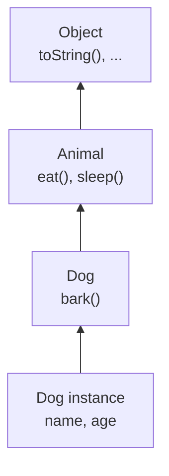
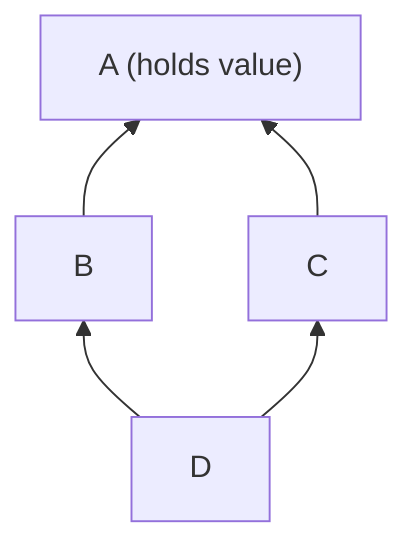

# Chapter 26 · Inheritance

[简体中文](./26-inheritance.md) ｜ **English**

---

> `Dog`, `Cat`, and `Bird` all have `name`, `age`, and `eat()` — must every class rewrite them? **Inheritance** answers directly: let a new class receive everything an existing class has, and write only what differs.
>
> The idea was so appealing that during object orientation's early boom, inheritance was applied everywhere it could be. Then the costs surfaced. This chapter has three measurements, each enough to make you reconsider the feature:
>
> **①** A class that merely wanted to count "how many elements were added" inherited `HashSet` and counted **6 instead of 3** — because the parent's `addAll` quietly called `add`. **②** Mathematically a square is a rectangle, yet making `Square` extend `Rectangle` made an ordinary stretch function compute **25 instead of 20**. **③** C++'s diamond inheritance duplicates the top-level field **for real**, and `d.value` fails to compile outright.
>
> All three share one root cause: **inheritance welds a subclass to its parent's implementation details**. This is why modern design converges on one recommendation — **favor composition over inheritance**.

## 1. Learning Objectives

By the end of this chapter, you will be able to:

- Explain what inheritance solves and its real relationship to code reuse;
- Explain the **fragile base class problem** and why discipline alone cannot avoid it;
- Use the **Liskov substitution principle** to judge whether an inheritance relationship is valid;
- Explain the **diamond problem** and the different answers each language gives (virtual inheritance / MRO / no multiple inheritance);
- Understand **why composition is preferred over inheritance**, and rewrite an inheritance design as composition.

---

## 2. Why This Concept Exists

### The starting point: duplicated code

```javascript
class Dog {
  constructor(name, age) { this.name = name; this.age = age; }
  eat() { return `${this.name} is eating`; }
  sleep() { return `${this.name} is sleeping`; }
  bark() { return "Woof!"; }
}

class Cat {
  constructor(name, age) { this.name = name; this.age = age; }   // identical
  eat() { return `${this.name} is eating`; }                      // identical
  sleep() { return `${this.name} is sleeping`; }                  // identical
  meow() { return "Meow~"; }
}
```

**Inheritance lifts the shared parts into a parent**:

```javascript
class Animal {
  constructor(name, age) { this.name = name; this.age = age; }
  eat() { return `${this.name} is eating`; }
  sleep() { return `${this.name} is sleeping`; }
}

class Dog extends Animal { bark() { return "Woof!"; } }
class Cat extends Animal { meow() { return "Meow~"; } }
```

### Inheritance gives you two things at once

This is the key to everything that follows:

| Inheritance gives you | Meaning |
|-----------------------|---------|
| **Code reuse** | No need to rewrite the parent's fields and methods |
| **A type relationship (is-a)** | `Dog` can be used as an `Animal` (the basis of polymorphism, Chapter 27) |

**The problem lies exactly here**: often you want only the first and are forced to accept the second.

```java
// I only wanted to reuse HashSet's storage
class CountingSet<E> extends HashSet<E> { ... }
// But I also declared "a CountingSet is a HashSet"
// → any code accepting a HashSet can take my object and use it by HashSet's rules
```

> **In one sentence**: inheritance = **reuse** + **an is-a promise**. When you need only reuse, that promise becomes a liability.

---

## 3. How It Works

### Method lookup: walking up the chain



When `dog.eat()` is called, the runtime **starts at the instance's class and walks up**, using the first match it finds. This is the same mechanism as JavaScript's prototype chain lookup from Chapter 24.

**Overriding** simply places a same-named method further down the chain so the search hits it earlier:

```javascript
class Dog extends Animal {
  eat() { return super.eat() + " (wolfing it down)"; }   // super calls the upstream version
}
```

### ⚠️ The fragile base class problem: the chapter's key point

This is inheritance's most famous trap, from *Effective Java* Item 18.

**The requirement**: a `Set` that counts how many elements have been added.

```java
class CountingSet<E> extends HashSet<E> {
    int addCount = 0;
    @Override public boolean add(E e) { addCount++; return super.add(e); }
    @Override public boolean addAll(Collection<? extends E> c) {
        addCount += c.size();
        return super.addAll(c);
    }
}
```

It looks airtight. **Measured result**:

```text
s.addAll(List.of("x", "y", "z"));
Expected addCount = 3, actual addCount = 6   ← doubled!
```

**The cause**: `HashSet.addAll` is implemented by **calling `add` for each element**. So:

```text
call addAll(3 elements)
  → subclass addAll: addCount += 3      (now 3)
  → super.addAll()
      → internally calls add() × 3
      → but method lookup finds the subclass's overridden add!
      → subclass add: addCount++ × 3     (now 6)
```

**The lethal part**: whether `HashSet.addAll` calls `add` internally is **the parent's implementation detail** — undocumented, and free to change in the next release. **Your subclass's correctness depends on something you cannot control or even discover.**

> **This is the "fragile base class"**: changes inside the base silently break subclasses. And it is **nearly impossible to avoid through discipline** — you cannot read and continually track every parent's internals.

### ⚠️ The Liskov substitution principle: when inheritance is valid

**The Liskov substitution principle (LSP)**: *anywhere the parent is used, a subclass must substitute without loss.*

The classic counterexample is "is a square a rectangle?" Mathematically, obviously yes. In code, no.

```python
class Square(Rectangle):
    def __init__(self, side): super().__init__(side, side)
    # A square's sides must match, so setting width must also set height
    width.setter  → self._w = self._h = v
    height.setter → self._w = self._h = v
```

```python
def stretch(rect):
    rect.width = 4
    rect.height = 5
    return rect.area        # any rectangle should return 20
```

**Measured result**:

```text
Rectangle(2, 3) → area = 20   ✓
Square(2)       → area = 25   ✗ expected 20!
```

**Why**: `Rectangle` implies a behavioral contract — **width and height are independently settable**. `Square` breaks it. So `stretch`, correct for every rectangle, becomes wrong for a square.

> **The key conclusion**: whether inheritance applies depends **not on conceptual similarity but on behavioral substitutability**. Mathematical is-a is not code-level is-a.

### ⚠️ Diamond inheritance: the core difficulty of multiple inheritance



`D` inherits `A` along two paths. So which `value` is `d.value`?

**C++ measured** (without virtual inheritance):

```text
d.value            → compile error: ambiguous
d.B::value = 1;  d.C::value = 2;
→ B::value=1  C::value=2      ← A's field genuinely exists twice!
sizeof(D) = 8 bytes (two ints)
```

**With virtual inheritance**:

```text
vd.value = 99     → ✓ unambiguous, one copy
sizeof(VD) = 24 bytes    ← but a virtual base pointer was added
```

**Three different answers across languages**:

| Approach | Languages | How |
|----------|-----------|-----|
| **Virtual inheritance** | C++ | Write `virtual` to keep one shared base |
| **MRO linearization** | Python | Flatten the graph into a linear order and search it |
| **No multiple inheritance** | Java / C# / JS | One base class only; use interfaces for the rest (Chapter 28) |

### Python's MRO: flattening the diamond into a line

Python uses **C3 linearization** to flatten the inheritance graph into one deterministic lookup order:

```text
class D(B, C) MRO: D → B → C → A → object
d.hello() = "B"        ← first match in order; no ambiguity, no duplicates
```

**But there is a counterintuitive part** — what `super()` really means:

```text
class W(Y, Z) MRO: W → Y → Z → X → object
W().who() = W → Y → Z → X

⚠️ Note: super() inside Y went to Z, not to Y's parent X!
```

> **`super()` means "the next entry in the MRO," not "my parent."** This is the most commonly misunderstood aspect of Python's multiple inheritance — the same `Y` class placed in a different hierarchy sends `super()` somewhere else entirely.

### Composition: the other path

Change "inherit a `HashSet`" into "**hold** a `Set`":

```java
class CountingSet<E> {
    private final Set<E> inner = new HashSet<>();   // composition: has-a
    private int addCount = 0;

    public boolean add(E e) { addCount++; return inner.add(e); }
    public boolean addAll(Collection<? extends E> c) {
        addCount += c.size();
        boolean changed = false;
        for (E e : c) changed |= inner.add(e);      // operate on inner directly
        return changed;
    }
}
```

**Measured result**:

```text
Composition version: addAll of 3 elements → addCount = 3   ✓ correct
```

**Why composition fixes it**:

```text
Inheritance: the subclass depends on the parent's implementation details
             → a detail changes, the subclass breaks
Composition: I depend only on inner's public interface
             → how it is implemented is none of my business
```

> That is the substance of **"favor composition over inheritance"**: it trades an uncontrollable dependency (implementation details) for a controllable one (a public contract).

---

## 4. JavaScript

JavaScript has single inheritance only, still built on prototype chains (Chapter 24).

```javascript
class Animal {
  constructor(name) { this.name = name; }
  speak() { return `${this.name} makes a sound`; }
}

class Dog extends Animal {
  constructor(name, breed) {
    super(name);              // ⚠️ must call super before using this
    this.breed = breed;
  }
  speak() { return super.speak() + ": Woof!"; }
}
```

**Measured**:

```text
new Dog("Rex").speak() = "Rex makes a sound: Woof!"
Prototype chain: d → Dog.prototype → Animal.prototype → Object.prototype
d instanceof Dog = true,  d instanceof Animal = true
```

### Mixins compensate for single inheritance

JavaScript has no multiple inheritance, but **functions that return classes** can stack capabilities:

```javascript
const Serializable = (Base) => class extends Base {
  toJSON() { return { ...this }; }
};
const Comparable = (Base) => class extends Base {
  equals(other) { return this.id === other.id; }
};

class Entity {}
class User extends Serializable(Comparable(Entity)) {}   // stacked capabilities
```

> **A mixin is essentially "lengthening the inheritance chain,"** not true multiple inheritance — so there is no diamond problem, but stacking order does determine which override wins.

### `extends` works on built-in types

```javascript
class MyArray extends Array {
  last() { return this[this.length - 1]; }
}
```

> **Note**: extending built-ins (`Array`, `Error`) misbehaves in older environments or after certain transpilation — transpilers cannot fully emulate native construction. Extending `Error` usually also requires fixing `name` and the prototype by hand.

---

## 5. Python

Python is the only language here with **full multiple inheritance**, at the cost of requiring you to understand the MRO.

```python
class Animal:
    def __init__(self, name): self.name = name
    def speak(self): return f"{self.name} makes a sound"

class Dog(Animal):
    def speak(self): return super().speak() + ": Woof!"
```

### The MRO and C3 linearization

```python
class A: ...
class B(A): ...
class C(A): ...
class D(B, C): ...

D.__mro__       # (D, B, C, A, object)
```

**The MRO guarantees three things**: subclasses precede parents, declared parent order is preserved, and the result is unique. When no order satisfies these, **Python raises at class definition time**:

```python
class X(A, B): ...    # if it conflicts → TypeError: Cannot create a consistent MRO
```

### ⚠️ `super()` is "the next in the MRO"

```python
class X:
    def who(self): return ["X"]
class Y(X):
    def who(self): return ["Y"] + super().who()
class Z(X):
    def who(self): return ["Z"] + super().who()
class W(Y, Z):
    def who(self): return ["W"] + super().who()
```

**Measured**:

```text
W's MRO: W → Y → Z → X → object
W().who() = W → Y → Z → X

⚠️ super() inside Y went to Z, not X
```

> This means **you cannot know where `super()` will go while writing `Y`** — it depends on the final hierarchy. That is both the power and the difficulty of cooperative multiple inheritance. **With multiple inheritance every class must call `super()`, or the chain breaks.**

### Method lookup happens at call time

```python
class Child(Base): pass
c = Child()
c.greet()                                  # "Base"
Child.greet = lambda self: "added at runtime"   # modify the class
c.greet()                                  # "added at runtime" ← existing instances changed too
```

> **Note**: Python has no `final`; you cannot stop anyone from subclassing your class or overriding your methods. "Please don't override" can only be expressed through documentation and naming conventions (the underscores of Chapter 25).

---

## 6. Java

Java's design choice is explicit: **single inheritance plus multiple interfaces**, sidestepping the diamond problem at the language level.

```java
public class Dog extends Animal implements Comparable<Dog>, Serializable {
    @Override                                  // the compiler verifies it really overrides
    public String speak() { return super.speak() + ": Woof!"; }
}
```

### Three key keywords

```java
public final class Immutable { }           // cannot be extended
public final void criticalMethod() { }     // cannot be overridden
public abstract class Shape {              // cannot be instantiated
    public abstract double area();          // subclasses must implement
}
```

### ⚠️ Construction order

```java
class Base {
    Base() { init(); }                      // ⚠️ dangerous: calls an overridable method
    void init() { }
}
class Derived extends Base {
    private int value = 42;
    @Override void init() { System.out.println(value); }   // prints 0, not 42!
}
```

**Why**: when the parent constructor runs, **the subclass's fields are not yet initialized**. The order is "parent fields → parent constructor body → subclass fields → subclass constructor body."

> **The rule**: **never call an overridable method from a constructor.** This is the heart of *Effective Java* Item 19.

### Why Java chose single inheritance

```text
The diamond problem stems from inheriting *state* (fields) twice.
Before Java 8, interfaces had no state, so implementing many was safe.
Java 8's default methods gave interfaces behavior but still no state;
when they conflict, the compiler forces you to disambiguate (Chapter 28).
```

> **Note**: `@Override` is not decoration — **it catches misspelled names and mismatched signatures**. Always write it.

---

## 7. C++

C++ supports full multiple inheritance and therefore must confront the diamond head-on.

### The diamond and virtual inheritance (measured)

```cpp
struct A     { int value = 42; };
struct B : A {};
struct C : A {};
struct D : B, C {};

D d;
// d.value;              // ✗ compile error: ambiguous
d.B::value = 1;          // the path must be stated explicitly
d.C::value = 2;
// sizeof(D) = 8         ← A's field really exists twice
```

**Virtual inheritance keeps one copy**:

```cpp
struct VA      { int value = 42; };
struct VB : virtual VA {};
struct VC : virtual VA {};
struct VD : VB, VC {};

VD vd;
vd.value = 99;           // ✓ unambiguous
// sizeof(VD) = 24       ← the cost: a virtual base pointer
```

### ⚠️ Virtual destructors: omit one and you leak

```cpp
class Base {
public:
    ~Base() { }                    // ✗ non-virtual destructor
};
class Derived : public Base {
    std::string data;               // this memory is never freed!
};

Base* p = new Derived();
delete p;                           // ⚠️ only ~Base() runs; ~Derived() is skipped
```

**The correct form**:

```cpp
class Base {
public:
    virtual ~Base() = default;      // ✓ any class with virtuals needs a virtual destructor
};
```

> **The rule**: **any class intended for inheritance must have a virtual destructor.** This is the C++ inheritance pitfall most likely to cause real damage.

### Three inheritance modes

```cpp
class D1 : public B { };      // is-a: B's public members stay public in D1
class D2 : protected B { };   // rare
class D3 : private B { };     // "implemented using B," not "is a B" — essentially composition
```

> `private` inheritance is semantically equivalent to composition; modern C++ usually prefers a plain member variable, which reads more clearly.

---

## 8. C#

C# is single inheritance plus interfaces like Java, but **overriding must be declared explicitly**.

```csharp
public class Animal
{
    public virtual string Speak() => "makes a sound";   // must be virtual to be overridden
    public void Walk() => "walks";                       // cannot be overridden
}

public class Dog : Animal
{
    public override string Speak() => base.Speak() + ": Woof!";   // override is required
}
```

### The key differences from Java

| | Java | C# |
|---|---|---|
| Overridable by default | **Yes** (unless `final`) | **No** (must be `virtual`) |
| Override marker | `@Override` (optional but advised) | `override` (**required**) |
| Prevent inheritance | `final class` | `sealed class` |
| Stop further overriding | `final` method | `sealed override` |

> **C#'s choice is safer**: non-overridable by default means **the base author must actively decide which methods are extension points** — exactly the remedy for the fragile base class problem. Java's default makes every public method a potential contract.

### The `new` keyword: hiding, not overriding

```csharp
public class Base { public virtual void M() => Console.WriteLine("Base"); }
public class Derived : Base { public new void M() => Console.WriteLine("Derived"); }

Base b = new Derived();
b.M();     // prints "Base" ← not polymorphism, just hiding
```

> **Note**: method hiding via `new` is almost always a design smell — the result depends on the **variable's static type** rather than the actual object, contrary to intuition. The compiler warns about unmarked hiding; **do not silence that warning by adding `new`** — reconsider the design instead.

### ⚠️ C#'s fragile base class: the opposite symptom from Java

Porting this chapter's `CountingSet` to C# reveals a different problem. `HashSet<T>.Add` is **not `virtual`**, so a subclass can only hide it with `new` — and `new` hiding has no effect through a base-typed variable (see the previous section).

**Measured**:

```text
CountingSetBad bad = new();
bad.Add("x"); bad.Add("y"); bad.Add("z");
→ AddCount = 3     ✓ correct when called directly

HashSet<string> asBase = bad;      // used as the base type
asBase.Add("w");                    // calls HashSet.Add, not mine
→ AddCount is still 3, yet the element count is 4  ← the count was missed!
```

**The two languages fail in opposite directions**:

| | Java | C# |
|---|---|---|
| Root cause | The parent's `addAll` internally calls the overridden `add` | `Add` is not `virtual`; `new` hiding is invisible through a base variable |
| Result | The count is **too high** (3 becomes 6) | The count is **too low** (4 elements recorded as 3) |

> **Yet the underlying cause is identical**: the subclass's correctness depends on the parent's design decisions — whether methods are `virtual`, whether they call one another internally — and **you control none of that, nor is it guaranteed to stay fixed**. This is the empirical case for "never inherit from a class that was not designed for inheritance." 

---

## 9. SQL

**The relational model has no inheritance** — the hardest part of the impedance mismatch from Chapter 23. Three strategies exist in practice.

### The scenario

An `Employee` parent, with `Manager` (adds `team_size`) and `Engineer` (adds `language`).

### ① Single table inheritance: everything in one table

```sql
CREATE TABLE employee (
    id        INTEGER PRIMARY KEY,
    type      TEXT NOT NULL,        -- 'manager' / 'engineer' discriminator
    name      TEXT NOT NULL,
    salary    INTEGER,
    team_size INTEGER,              -- managers only
    language  TEXT                  -- engineers only
);
```

| Pros | Cons |
|------|------|
| Simple queries, no JOINs | **Many NULL columns** |
| Fastest polymorphic queries | Cannot apply `NOT NULL` to subclass fields |

### ② Class table inheritance: parent table plus child tables

```sql
CREATE TABLE employee (
    id INTEGER PRIMARY KEY, name TEXT NOT NULL, salary INTEGER
);
CREATE TABLE manager (
    id INTEGER PRIMARY KEY REFERENCES employee(id),
    team_size INTEGER NOT NULL      -- constraints work normally
);
CREATE TABLE engineer (
    id INTEGER PRIMARY KEY REFERENCES employee(id),
    language TEXT NOT NULL
);
```

| Pros | Cons |
|------|------|
| Cleanest structure, full constraints | **Every query needs a JOIN** |
| No redundant NULLs | Polymorphic queries join every child |

### ③ Concrete table inheritance: one full table per subclass

```sql
CREATE TABLE manager  (id INTEGER PRIMARY KEY, name TEXT, salary INTEGER, team_size INTEGER);
CREATE TABLE engineer (id INTEGER PRIMARY KEY, name TEXT, salary INTEGER, language TEXT);
```

| Pros | Cons |
|------|------|
| Fastest single-subclass queries | **Shared columns duplicated** |
| No JOINs, no NULLs | Polymorphic queries need `UNION ALL`; adding a field touches every table |

### How to choose

```text
Subclasses differ little, frequent polymorphic queries  → single table
Subclasses differ a lot, strict constraints required    → class table
Subclasses are rarely queried together                  → concrete table
```

> **Practical note**: all three appear in major ORMs (Hibernate's `SINGLE_TABLE` / `JOINED` / `TABLE_PER_CLASS`). **Before choosing, ask whether you need inheritance at all.** Often a single table with a `type` column — or two entirely separate tables — reads far better than forcing a hierarchy. The same judgment as "composition over inheritance" in code.

---

## 10. Cross-Language Comparison

### ① Inheritance mechanisms

| Feature | JavaScript | Python | Java | C++ | C# |
|---------|-----------|--------|------|-----|-----|
| Multiple inheritance | ❌ | ✅ **full** | ❌ | ✅ **full** | ❌ |
| Diamond solution | N/A | **MRO / C3** | N/A | **virtual inheritance** | N/A |
| Alternative | mixins | — | interfaces | — | interfaces |
| Calling the parent | `super.m()` | `super().m()` | `super.m()` | `Base::m()` | `base.M()` |
| Overridable by default | ✅ | ✅ | ✅ | ❌ (needs `virtual`) | ❌ (needs `virtual`) |
| Override marker required | ❌ | ❌ | `@Override` optional | ❌ (`override` optional) | **`override` required** |
| Prevent inheritance | ❌ none | ❌ none | `final` | `final` (C++11) | `sealed` |
| Abstract classes | ❌ none natively | `ABC` | `abstract` | pure virtual | `abstract` |

### ② Three design disagreements

**Disagreement one: multiple inheritance or not**

```text
Supported (Python / C++): more expressive, but the diamond must be handled
Forbidden (Java / C# / JS): a simpler language, with interfaces filling the gap
```

**Root cause**: the real trouble with the diamond is **inheriting state more than once**. Java's and C#'s interfaces carry no state, so implementing many is safe.

**Disagreement two: are methods overridable by default**

```text
Yes by default (Java / Python / JS): freer subclasses, but the base author cannot control contracts
No by default (C++ / C#): the base must mark its extension points
```

> **C#'s non-overridable default is a direct response to the fragile base class problem** — it forces you to ask "is this method an extension point?"

**Disagreement three: can inheritance be forbidden**

```text
Java final / C# sealed / C++11 final  →  yes
Python / JavaScript                    →  no, convention only
```

### ③ Commonalities and the roots of the differences

**In common**: method lookup walks up the chain everywhere, every language offers a way to call the parent's implementation, and all suffer from the fragile base class problem — **an intrinsic property of inheritance, independent of language**.

**Roots of the differences**:

- **Python allows multiple inheritance** because its philosophy is to give you the capability rather than restrict you — at the cost of learning the MRO;
- **C++ allows it and adds virtual inheritance**, unwilling to trade away expressiveness for simplicity, leaving the complexity to the user;
- **Java and C# forbid it**, learning from C++'s experience — **interfaces split "reusing an implementation" from "declaring a type"** (Chapter 28);
- **C# requires explicit `virtual`/`override`**, learning from Java's experience — overridable-by-default makes base classes dangerous to evolve.

**A clear line of evolution**: C++ (everything) → Java (drops multiple inheritance) → C# (also drops override-by-default). **Each generation tightens inheritance further**, which is itself telling.

---

## 11. Implementation Comparison

| Language · Mechanism | How it works | Key cost |
|---------------------|-------------|----------|
| **JS inheritance** | Prototype chain (Chapter 24) | Deeper chains slow lookup |
| **JS mixins** | Generates intermediate classes, lengthening the chain | Stacking order decides overrides |
| **Python inheritance** | The class's `__mro__` tuple, searched in order | Every call walks the MRO (with caching) |
| **Java inheritance** | Method table (vtable) + a single chain | See Chapter 27 |
| **C++ plain inheritance** | The parent subobject is **embedded** in the child | Fields duplicate in a diamond (measured: 8 bytes, two copies) |
| **C++ virtual inheritance** | Adds a virtual base pointer, locating the shared subobject at runtime | Measured `sizeof` 8 → 24, plus indirection |
| **C# inheritance** | IL metadata + vtable | Same as Java |

**One implementation fact worth remembering**: **C++'s plain inheritance embeds the parent object inside the child** (echoing Chapter 24's layout discussion). So in a diamond, `A`'s fields genuinely exist twice — not a flaw but the inevitable result of zero-overhead embedded layout. Virtual inheritance eliminates the duplication only by introducing indirection, paying in both space and access speed.

---

## 12. Performance Analysis

### Runtime cost of inheritance

| Operation | Cost |
|-----------|------|
| Reading an inherited field | **Zero** — the offset is fixed at compile time (Chapter 24) |
| Calling a non-virtual method | **Zero** — bound at compile time |
| Calling a virtual method | One indirect jump (detailed in Chapter 27) |
| Python method lookup | Walks the MRO, with a type cache |
| JS property lookup | Walks the prototype chain; deeper is slower (engines use inline caches) |
| C++ virtual-base member access | **An extra indirection** |

### Two things worth noting

**① Hierarchy depth matters most in JS**:

```text
d.speak() walks two levels up the prototype chain (measured in Chapter 24)
The deeper the chain, the costlier an inline-cache miss
```

**② C++ virtual inheritance has a real space cost** (measured):

| | `sizeof` |
|---|---:|
| Plain diamond `D` | 8 bytes (two `int`s) |
| Virtual inheritance `VD` | **24 bytes** |

> ⚠️ This section gives no millisecond figures — inheritance overhead is usually within noise, and **what actually affects performance is virtual dispatch (Chapter 27) and memory layout (Chapter 24)**. Making performance decisions based on hierarchy depth is backwards; **what deserves attention is maintainability**.

---

## 13. Engineering Practice

| Scenario | ✅ Recommended | ❌ Not recommended | Why |
|----------|---------------|-------------------|-----|
| You only want reuse | **Composition** | Inheritance | Inheritance carries an is-a promise |
| A genuine, substitutable is-a | Inheritance | Composition | This is inheritance's proper use |
| Extending a third-party class | Composition / wrapping | Inheritance | Measured: fragile base makes the count 6 |
| Designing a class for extension | Document when overridable methods are called | Say nothing | Otherwise subclasses guess |
| A class not meant for extension | `final` / `sealed` | Leave it open | State the intent |
| C++ base classes | **`virtual ~Base()`** | Non-virtual destructor | Otherwise the subclass destructor is skipped |
| C# extension points | Mark `virtual` deliberately | Mark all or none | Decide the contract actively |
| Constructors | Initialization only | Calling overridable methods | Subclass fields are uninitialized |
| Hierarchy depth | **No more than 2–3 levels** | Deep hierarchies | Depth hurts comprehension and debugging |
| Database subclasses | Ask whether inheritance is needed | Force a hierarchy | A `type` column is often clearer |

### Three questions to decide whether to inherit

```text
① Is it is-a or has-a?
   "Dog is an Animal" ✓      "CountingSet is a HashSet" ✗ (it merely *uses* one)

② Does it satisfy LSP?
   Would every caller of the parent still be correct with the subclass?
   Measured counterexample: Square makes stretch compute 25 instead of 20

③ Will the parent change?
   Third-party classes can change internals anytime → fragile base risk
```

**If any answer is unsatisfying, use composition.**

---

## 14. Best Practices

- **Default to composition; use inheritance only for genuine is-a relationships.**
- **Test with the Liskov substitution principle**: if substitution loses correctness, it is not inheritance.
- **Never inherit from a third-party class to extend it**; wrap it instead.
- **Every extensible C++ base needs `virtual ~Base()`.**
- **Never call overridable methods from a constructor.**
- **Mark extension points explicitly**: `virtual` in C#, documented call contracts in Java.
- **Seal classes not meant for extension** — tightening later is far harder than starting tight.
- **Keep hierarchies to 2–3 levels**; beyond that, revisit the design.
- **In Python multiple inheritance, every class must call `super()`**, or the cooperative chain breaks.

---

## 15. Common Pitfalls

**Pitfall 1 · Inheriting a third-party class, hitting the fragile base**

```java
class CountingSet<E> extends HashSet<E> { ... }   // ✗ measured addCount = 6, expected 3
class CountingSet<E> { private Set<E> inner; }     // ✓ composition, measured = 3
```

**Pitfall 2 · Violating the Liskov substitution principle**

```python
class Square(Rectangle): ...     # ✗ measured: stretch computes 25, expected 20
```
**How to avoid**: have both implement a shared `Shape` interface rather than inheriting from each other.

**Pitfall 3 · Forgetting a virtual destructor in C++**

```cpp
class Base { ~Base(); };                   // ✗ deleting via a base pointer skips ~Derived
class Base { virtual ~Base() = default; }; // ✓
```

**Pitfall 4 · Calling an overridable method from a constructor**

```java
Base() { init(); }              // ✗ the overridden init sees default field values
```

**Pitfall 5 · Forgetting `super()` in Python multiple inheritance**

```python
class Y(X):
    def who(self): return ["Y"]                    # ✗ chain broken; Z and X never run
    def who(self): return ["Y"] + super().who()    # ✓
```

**Pitfall 6 · Hiding methods with C#'s `new`**

```csharp
public new void M() { }         // ⚠️ result depends on the static type, not polymorphism
```

**Pitfall 7 · Inheriting purely for reuse**

```java
class Stack<E> extends ArrayList<E> { }    // ✗ a Stack is not an ArrayList
// It inherits get(i), add(i, e), and others that break stack semantics (Chapter 18)
```
**How to avoid**: this was the real design mistake in Java's early `java.util.Stack`; `Deque` is recommended now.

---

## 16. Interview Questions

**Basic**

1. What does inheritance solve? Which two things does it provide simultaneously?
2. What does `super` do?
3. What is overriding, and how does it differ from overloading?

**Intermediate**

4. **What is the fragile base class problem?** Give a concrete example.
5. **What is the Liskov substitution principle?** Why does "Square extends Rectangle" violate it?
6. Why does Java forbid multiple inheritance while Python and C++ allow it?

**Advanced**

7. **What is diamond inheritance?** How do three different languages solve it?
8. What is Python's MRO, and why is `super()` not "the parent"?
9. **Why is composition preferred over inheritance?** Which specific problem does it solve?

---

## 17. Exercises

**Basic**

1. Write an `Animal` / `Dog` hierarchy in all six languages, calling the parent via `super`.
2. Build a three-level hierarchy and print the actual method lookup path.
3. Find one place in your own project where inheritance was used purely for reuse.

**Intermediate**

4. **Reproduce the fragile base class problem**: extend `HashSet` to count adds and verify the doubling.
5. Rewrite the previous exercise with composition and verify the count is correct.
6. Measure `sizeof` and the duplicated fields in a C++ diamond, then compare with virtual inheritance.

**Advanced**

7. Construct a Python hierarchy where a class's `super()` reaches a sibling rather than a parent, and explain via the MRO.
8. Write an inheritance that violates LSP, then fix it with composition or an interface.
9. Model the same subclasses with all three SQL strategies and compare query complexity.

---

## 18. Chapter Summary

**In one sentence**: inheritance hands you **code reuse** and an **is-a promise** together, and most trouble comes from wanting only the former while being forced to accept the latter; its three costs — the fragile base class, LSP violations, and the diamond — all trace to **a subclass being welded to its parent's implementation details**, whereas composition trades that uncontrollable dependency for a dependency on a public interface. That is the substance of "favor composition over inheritance."

**Key points**

- **Inheritance = reuse + is-a**; when you only need reuse, use composition.
- **Fragile base class** (measured): extending `HashSet` to count adds gives **6** for three elements, because the parent internally calls the overridden `add`.
- **Liskov substitution** (measured): `Square extends Rectangle` makes a stretch function compute **25 instead of 20** — mathematical is-a is not behavioral is-a.
- **Diamond inheritance** (measured): in C++, `A`'s field genuinely exists twice; virtual inheritance takes `sizeof` from 8 to **24**.
- **`super()` is "the next in the MRO"** (measured): in `W(Y, Z)`, `Y`'s `super()` reaches `Z`, not `X`.
- **Composition fixes it** (measured): holding a `Set` yields the correct count of **3**, because only the public interface is relied upon.
- **The line of evolution**: C++ (everything) → Java (no multiple inheritance) → C# (no override-by-default). **Each generation tightens inheritance further.**

**Checklist**

- [ ] I can name the two things inheritance provides and why that causes problems.
- [ ] I can give an example of the fragile base class problem.
- [ ] I test inheritance relationships with the Liskov substitution principle.
- [ ] I know how my language handles (or avoids) the diamond problem.
- [ ] I can rewrite an inheritance design as composition.

**Coming next**: this chapter kept saying inheritance provides an **is-a relationship**, without explaining where its value truly lies. When a variable of type `Animal` may hold a `Dog` or a `Cat`, **how does the runtime know which code `speak()` should execute?** That ability — one call, different behavior — is **polymorphism**, and it is the real core of object orientation. Chapter 27 lifts the lid on the **vtable**, showing how dynamic dispatch actually works and what it costs.

---

## 19. Further Reading

- <a href="https://en.wikipedia.org/wiki/Inheritance_(object-oriented_programming)" target="_blank" rel="noopener">Wikipedia: Inheritance (object-oriented programming)</a> — the concept, its varieties, and language differences.
- <a href="https://en.wikipedia.org/wiki/Composition_over_inheritance" target="_blank" rel="noopener">Wikipedia: Composition over inheritance</a> — the full argument for this design principle.
- <a href="https://en.wikipedia.org/wiki/Liskov_substitution_principle" target="_blank" rel="noopener">Wikipedia: Liskov substitution principle</a> — formal definition and classic counterexamples.
- <a href="https://en.wikipedia.org/wiki/Multiple_inheritance" target="_blank" rel="noopener">Wikipedia: Multiple inheritance</a> — the diamond problem and language responses.
- <a href="https://docs.python.org/3/howto/mro.html" target="_blank" rel="noopener">Python docs · The MRO and C3 linearization</a> — the official account of method resolution order.
- <a href="https://developer.mozilla.org/en-US/docs/Web/JavaScript/Reference/Classes/extends" target="_blank" rel="noopener">MDN · extends</a> — including caveats on extending built-ins.
- <a href="https://en.cppreference.com/w/cpp/language/derived_class" target="_blank" rel="noopener">cppreference · Derived classes</a> — authoritative reference on the three inheritance modes and virtual inheritance.
