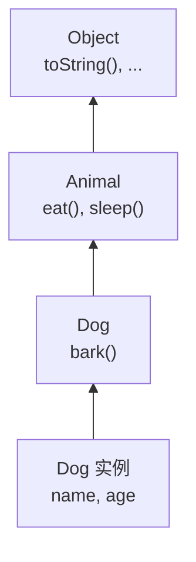
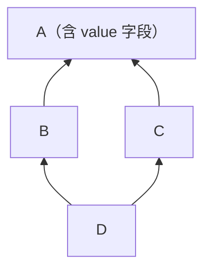

# 第 26 章 · 继承

**简体中文** ｜ [English](./26-inheritance.en-US.md)

---

> `Dog`、`Cat`、`Bird` 都有 `name`、`age` 和 `eat()`——难道每个类都要重写一遍？**继承**给出的答案很直接：让新类直接获得已有类的一切，只写不一样的部分。
>
> 这个想法太诱人了，以至于面向对象刚流行的那些年，继承被用在了一切能用的地方。然后代价开始显现。本章有三个实测，每一个都足以让人重新审视这个特性：
>
> **①** 一个只想统计"加过多少元素"的类，继承 `HashSet` 后计数变成了 **6 而不是 3**——因为父类的 `addAll` 内部悄悄调用了 `add`。**②** 数学上"正方形是长方形"，但让 `Square` 继承 `Rectangle` 后，一个正常的拉伸函数算出了 **25 而不是 20**。**③** C++ 的菱形继承会让顶层字段**真的存在两份**，`d.value` 直接编译报错。
>
> 三个问题的根源是同一个：**继承把子类和父类的实现细节焊死在了一起**。这就是为什么现代设计几乎一致推荐——**组合优于继承**。

## 1. 学习目标

本章结束后，你将能够：

- 说清继承解决了什么问题，以及它与"代码复用"的真正关系；
- 解释**脆弱基类问题**，并说明为什么它几乎无法靠纪律避免；
- 用**里氏替换原则**判断一个继承关系是否成立；
- 说清**菱形继承**问题，以及各语言给出的不同答案（虚继承 / MRO / 禁止多继承）；
- 理解**为什么"组合优于继承"**，并能把一个继承设计改写成组合。

---

## 2. 为什么会出现这个概念

### 起点：重复的代码

```javascript
class Dog {
  constructor(name, age) { this.name = name; this.age = age; }
  eat() { return `${this.name} 在吃东西`; }
  sleep() { return `${this.name} 在睡觉`; }
  bark() { return "汪！"; }
}

class Cat {
  constructor(name, age) { this.name = name; this.age = age; }   // 完全重复
  eat() { return `${this.name} 在吃东西`; }                       // 完全重复
  sleep() { return `${this.name} 在睡觉`; }                       // 完全重复
  meow() { return "喵～"; }
}
```

**继承把重复的部分提取到父类**：

```javascript
class Animal {
  constructor(name, age) { this.name = name; this.age = age; }
  eat() { return `${this.name} 在吃东西`; }
  sleep() { return `${this.name} 在睡觉`; }
}

class Dog extends Animal { bark() { return "汪！"; } }
class Cat extends Animal { meow() { return "喵～"; } }
```

### 继承同时提供了两样东西

这一点是理解后面所有问题的钥匙：

| 继承给了你 | 含义 |
|-----------|------|
| **代码复用** | 不用重写父类的字段和方法 |
| **类型关系（is-a）** | `Dog` 可以当成 `Animal` 用（第 27 章多态的基础）|

**问题恰恰出在这里**：很多时候你只想要前者，却被迫接受了后者。

```java
// 我只想复用 HashSet 的存储能力
class CountingSet<E> extends HashSet<E> { ... }
// 但同时也声明了「CountingSet 是一种 HashSet」
// → 任何接受 HashSet 的代码都能拿到我的对象，并按 HashSet 的规则使用它
```

> **一句话**：继承 = **复用** + **is-a 承诺**。当你只需要复用时，这个承诺就成了负担。

---

## 3. 底层原理

### 方法查找：沿继承链向上



调用 `dog.eat()` 时，运行时**从实例所属的类开始，沿链向上找**，找到第一个匹配的就用。这与第 24 章讲的 JavaScript 原型链查找是同一个机制。

**方法重写**（override）就是在链的下游放一个同名方法，让查找提前命中：

```javascript
class Dog extends Animal {
  eat() { return super.eat() + "（狼吞虎咽）"; }   // super 显式调用上游实现
}
```

### ⚠️ 脆弱基类问题：本章最重要的一点

这是继承最著名的陷阱，出自《Effective Java》Item 18。

**需求**：做一个 `Set`，能统计一共 `add` 过多少元素。

```java
class CountingSet<E> extends HashSet<E> {
    int addCount = 0;
    @Override public boolean add(E e) { addCount++; return super.add(e); }
    @Override public boolean addAll(Collection<? extends E> c) {
        addCount += c.size();
        return super.addAll(c);
    }
}
```

看起来无懈可击。**实测结果**：

```text
s.addAll(List.of("x", "y", "z"));
期望 addCount = 3，实际 addCount = 6   ← 翻倍了！
```

**原因**：`HashSet.addAll` 的内部实现是**逐个调用 `add`**。于是：

```text
调用 addAll(3 个元素)
  → 子类的 addAll：addCount += 3      （现在是 3）
  → super.addAll()
      → 内部调用 add() × 3
      → 但方法查找会找到子类重写的 add！
      → 子类的 add：addCount++ × 3     （现在是 6）
```

**致命之处在于**：`HashSet.addAll` 内部是否调用 `add`，是**父类的实现细节**——它没有写在文档里，也随时可能在下个版本改掉。**你的子类正确与否，取决于一件你无法控制、甚至无法得知的事。**

> **这就是"脆弱基类"**：基类的实现变化会悄无声息地破坏子类。而且这个问题**几乎无法靠纪律避免**——你不可能去读懂并持续跟踪所有父类的实现细节。

### ⚠️ 里氏替换原则：什么样的继承才成立

**里氏替换原则（LSP）**：*任何使用父类的地方，都应该能无损地换成子类。*

经典的反例是"正方形是长方形吗"。数学上显然是，代码上却不是。

```python
class Square(Rectangle):
    def __init__(self, side): super().__init__(side, side)
    # 正方形的宽高必须相等，所以改宽时必须同时改高
    width.setter  → self._w = self._h = v
    height.setter → self._w = self._h = v
```

```python
def stretch(rect):
    rect.width = 4
    rect.height = 5
    return rect.area        # 任何长方形都该返回 20
```

**实测结果**：

```text
传入 Rectangle(2, 3) → 面积 = 20   ✓
传入 Square(2)       → 面积 = 25   ✗ 期望 20！
```

**为什么**：`Rectangle` 隐含了一条行为约定——**宽和高可以独立设置**。`Square` 破坏了它。于是 `stretch` 这个"对所有长方形都正确"的函数，遇到正方形就错了。

> **关键结论**：判断能不能继承，**不看"概念上像不像"，而看"行为上能不能替换"**。数学上的 is-a 不等于代码里的 is-a。

### ⚠️ 菱形继承：多继承的核心难题



`D` 通过两条路径继承了 `A`。那么 `d.value` 到底是哪一个？

**C++ 的实测结果**（不用虚继承）：

```text
d.value            → 编译错误：ambiguous
d.B::value = 1;  d.C::value = 2;
→ B::value=1  C::value=2      ← A 的字段真的存在两份！
sizeof(D) = 8 字节（两个 int）
```

**用虚继承之后**：

```text
vd.value = 99     → ✓ 无歧义，只有一份
sizeof(VD) = 24 字节    ← 但多了虚基类指针的开销
```

**各语言给出了三种不同答案**：

| 方案 | 语言 | 做法 |
|------|------|------|
| **虚继承** | C++ | 显式写 `virtual`，让共同基类只保留一份 |
| **MRO 线性化** | Python | 把继承图算成一条线性顺序，按序查找 |
| **禁止多继承** | Java / C# / JS | 只能继承一个类，多实现用接口（第 28 章）|

### Python 的 MRO：把菱形拉成一条线

Python 用 **C3 线性化**算法，把继承图压平成一个确定的查找顺序：

```text
class D(B, C) 的 MRO: D → B → C → A → object
d.hello() = "B"        ← 按序找到第一个，不歧义、也不会有两份
```

**但有个反直觉的地方**——`super()` 的真实含义：

```text
class W(Y, Z) 的 MRO: W → Y → Z → X → object
W().who() = W → Y → Z → X

⚠️ 注意：Y 里的 super() 调到了 Z，而不是 Y 的父类 X！
```

> **`super()` 的意思是"MRO 里的下一个"，不是"我的父类"**。这是 Python 多继承里最容易搞错的一点——同一个 `Y` 类，放在不同的继承结构里，它的 `super()` 会指向不同的地方。

### 组合：另一条路

把"继承一个 `HashSet`"改成"**持有**一个 `Set`"：

```java
class CountingSet<E> {
    private final Set<E> inner = new HashSet<>();   // 组合：has-a
    private int addCount = 0;

    public boolean add(E e) { addCount++; return inner.add(e); }
    public boolean addAll(Collection<? extends E> c) {
        addCount += c.size();
        boolean changed = false;
        for (E e : c) changed |= inner.add(e);      // 直接操作 inner
        return changed;
    }
}
```

**实测结果**：

```text
组合版本: addAll 3 个元素 → addCount = 3   ✓ 正确
```

**为什么组合能解决问题**：

```text
继承：子类依赖父类的「实现细节」  →  细节一变，子类就坏
组合：我只依赖 inner 的「公开接口」→  它内部怎么实现与我无关
```

> 这就是"**组合优于继承**"的实质：它把一个不可控的依赖（实现细节），换成了一个可控的依赖（公开契约）。

---

## 4. JavaScript

JavaScript 只有单继承，底层仍是原型链（第 24 章）。

```javascript
class Animal {
  constructor(name) { this.name = name; }
  speak() { return `${this.name} 发出声音`; }
}

class Dog extends Animal {
  constructor(name, breed) {
    super(name);              // ⚠️ 必须先调 super 才能用 this
    this.breed = breed;
  }
  speak() { return super.speak() + "：汪！"; }
}
```

**实测**：

```text
new Dog("旺财").speak() = "旺财 发出声音：汪！"
原型链: d → Dog.prototype → Animal.prototype → Object.prototype
d instanceof Dog = true,  d instanceof Animal = true
```

### 用 mixin 弥补单继承

JavaScript 没有多继承，但可以用**函数返回类**的方式组合多份能力：

```javascript
const Serializable = (Base) => class extends Base {
  toJSON() { return { ...this }; }
};
const Comparable = (Base) => class extends Base {
  equals(other) { return this.id === other.id; }
};

class Entity {}
class User extends Serializable(Comparable(Entity)) {}   // 叠加多份能力
```

> **mixin 的本质是"把继承链拉长"**，而不是真正的多继承——所以它不会有菱形问题，但也意味着叠加顺序会影响方法覆盖关系。

### `extends` 可以继承内置类型

```javascript
class MyArray extends Array {
  last() { return this[this.length - 1]; }
}
```

> **注意事项**：继承内置类型（`Array`、`Error`）在旧环境或经过某些转译后行为会不正常——转译器难以完全模拟原生构造过程。继承 `Error` 时通常还要手动修 `name` 和原型。

---

## 5. Python

Python 是这几门语言里**唯一完整支持多继承**的，代价是需要理解 MRO。

```python
class Animal:
    def __init__(self, name): self.name = name
    def speak(self): return f"{self.name} 发出声音"

class Dog(Animal):
    def speak(self): return super().speak() + "：汪！"
```

### MRO 与 C3 线性化

```python
class A: ...
class B(A): ...
class C(A): ...
class D(B, C): ...

D.__mro__       # (D, B, C, A, object)
```

**MRO 保证三件事**：子类总在父类之前、多个父类保持声明顺序、结果唯一确定。若无法构造出满足条件的顺序，**Python 会在定义类时就报错**：

```python
class X(A, B): ...    # 若与其他继承关系冲突 → TypeError: Cannot create a consistent MRO
```

### ⚠️ `super()` 是"MRO 的下一个"

```python
class X:
    def who(self): return ["X"]
class Y(X):
    def who(self): return ["Y"] + super().who()
class Z(X):
    def who(self): return ["Z"] + super().who()
class W(Y, Z):
    def who(self): return ["W"] + super().who()
```

**实测**：

```text
W 的 MRO: W → Y → Z → X → object
W().who() = W → Y → Z → X

⚠️ Y 里的 super() 调到了 Z，而不是 X
```

> 这意味着**写 `Y` 时无法预知 `super()` 会去哪**——它取决于最终的继承结构。这既是协作式多继承（cooperative multiple inheritance）的威力，也是它难懂的原因。**多继承时所有类都必须调 `super()`，否则链会断。**

### 方法查找发生在调用时

```python
class Child(Base): pass
c = Child()
c.greet()                                  # "Base"
Child.greet = lambda self: "运行时加的"      # 动态修改类
c.greet()                                  # "运行时加的" ← 已存在的实例也变了
```

> **注意事项**：Python 没有 `final`，无法阻止别人继承你的类或重写你的方法。想表达"不要重写"只能靠文档和命名约定（第 25 章的下划线）。

---

## 6. Java

Java 的设计选择很明确：**单继承 + 多接口**，从语言层面回避菱形问题。

```java
public class Dog extends Animal implements Comparable<Dog>, Serializable {
    @Override                                  // 编译器会检查确实覆盖了父类方法
    public String speak() { return super.speak() + "：汪！"; }
}
```

### 三个关键关键字

```java
public final class Immutable { }           // 禁止被继承
public final void criticalMethod() { }     // 禁止被重写
public abstract class Shape {              // 不能实例化，必须被继承
    public abstract double area();          // 子类必须实现
}
```

### ⚠️ 构造顺序

```java
class Base {
    Base() { init(); }                      // ⚠️ 危险：调用了可被重写的方法
    void init() { }
}
class Derived extends Base {
    private int value = 42;
    @Override void init() { System.out.println(value); }   // 打印 0，不是 42！
}
```

**原因**：父类构造函数执行时，**子类的字段还没初始化**。构造顺序是"父类字段 → 父类构造体 → 子类字段 → 子类构造体"。

> **规则**：**永远不要在构造函数里调用可被重写的方法**。这是《Effective Java》Item 19 的核心建议。

### 为什么 Java 选择单继承

```text
菱形问题的根源是「状态（字段）被继承两份」。
接口在 Java 8 之前没有状态，所以多实现接口不会有这个问题。
Java 8 加了默认方法后，接口有了「行为」但仍无「状态」，
冲突时编译器会强制你显式指定用哪个（第 28 章）。
```

> **注意事项**：`@Override` 不是可选的装饰——**它能在你拼错方法名或签名不匹配时报错**，务必标注。

---

## 7. C++

C++ 支持完整的多继承，也因此必须直面菱形问题。

### 菱形与虚继承（实测）

```cpp
struct A     { int value = 42; };
struct B : A {};
struct C : A {};
struct D : B, C {};

D d;
// d.value;              // ✗ 编译错误：ambiguous
d.B::value = 1;          // 必须显式指定路径
d.C::value = 2;
// sizeof(D) = 8         ← A 的字段真的有两份
```

**虚继承让基类只保留一份**：

```cpp
struct VA      { int value = 42; };
struct VB : virtual VA {};
struct VC : virtual VA {};
struct VD : VB, VC {};

VD vd;
vd.value = 99;           // ✓ 无歧义
// sizeof(VD) = 24       ← 代价：多了虚基类指针
```

### ⚠️ 虚析构函数：不加会内存泄漏

```cpp
class Base {
public:
    ~Base() { }                    // ✗ 非虚析构
};
class Derived : public Base {
    std::string data;               // 这块内存不会被释放！
};

Base* p = new Derived();
delete p;                           // ⚠️ 只调用了 ~Base()，~Derived() 被跳过
```

**正确写法**：

```cpp
class Base {
public:
    virtual ~Base() = default;      // ✓ 只要有虚函数，就必须有虚析构
};
```

> **规则**：**任何打算被继承的类，析构函数必须是 virtual**。这是 C++ 继承里最容易造成实际损失的一个坑。

### 三种继承方式

```cpp
class D1 : public B { };      // is-a：B 的 public 成员在 D1 中仍是 public
class D2 : protected B { };   // 罕见
class D3 : private B { };     // 「用 B 实现」而非「是一个 B」——本质是组合
```

> `private` 继承在语义上等价于组合，现代 C++ 通常直接用成员变量代替它，更清晰。

---

## 8. C#

C# 与 Java 一样是单继承 + 多接口，但**重写必须显式声明**。

```csharp
public class Animal
{
    public virtual string Speak() => "发出声音";      // 必须标 virtual 才能被重写
    public void Walk() => "走路";                      // 不能被重写
}

public class Dog : Animal
{
    public override string Speak() => base.Speak() + "：汪！";   // 必须标 override
}
```

### 与 Java 的关键差异

| | Java | C# |
|---|---|---|
| 默认可否重写 | **可以**（除非 `final`） | **不可以**（必须标 `virtual`） |
| 重写标记 | `@Override`（可选但推荐） | `override`（**强制**） |
| 禁止继承 | `final class` | `sealed class` |
| 禁止继续重写 | `final` 方法 | `sealed override` |

> **C# 的选择更安全**：默认不可重写意味着**基类作者必须主动决定哪些方法是扩展点**——这正好对症脆弱基类问题。Java 的默认可重写让每个 public 方法都成了潜在的契约。

### `new` 关键字：方法隐藏（不是重写）

```csharp
public class Base { public virtual void M() => Console.WriteLine("Base"); }
public class Derived : Base { public new void M() => Console.WriteLine("Derived"); }

Base b = new Derived();
b.M();     // 输出 "Base" ← 不是多态！只是隐藏
```

> **注意事项**：`new` 造成的方法隐藏几乎总是设计错误的信号——调用结果取决于**变量的静态类型**而非实际对象，这与人的直觉相反。编译器会对未标 `new` 的隐藏发出警告，**不要用加 `new` 的方式消除这个警告**，应该反思设计。

### ⚠️ C# 的脆弱基类：与 Java 恰好相反的表现

把本章开头那个 `CountingSet` 搬到 C#，会遇到一个不同的问题。`HashSet<T>.Add` **不是 `virtual` 的**，所以子类只能用 `new` 隐藏它——而 `new` 隐藏对基类类型的变量完全无效（见上一节）。

**实测**：

```text
CountingSetBad bad = new();
bad.Add("x"); bad.Add("y"); bad.Add("z");
→ AddCount = 3     ✓ 直接调用时是对的

HashSet<string> asBase = bad;      // 当成基类使用
asBase.Add("w");                    // 调用的是 HashSet.Add，不是我的 Add
→ AddCount 仍是 3，但元素数已经是 4  ← 计数漏了！
```

**两种语言的表现恰好相反**：

| | Java | C# |
|---|---|---|
| 根源 | 父类 `addAll` 内部调用了被重写的 `add` | `Add` 不是 `virtual`，`new` 隐藏对基类变量无效 |
| 后果 | 计数**多算**（3 变成 6） | 计数**漏算**（4 个元素只记了 3） |

> **但根源是同一个**：子类的正确性取决于父类的设计决策——是否 `virtual`、内部是否互相调用——而这些**你既无法控制，也不保证不变**。这正是"不要继承没有为继承而设计的类"的实证。

---

## 9. SQL

**关系模型没有继承**——这是第 23 章提到的阻抗失配里最难处理的一项。实践中有三种建模策略。

### 建模数据

假设有 `Employee` 父类，以及 `Manager`（多一个 `team_size`）和 `Engineer`（多一个 `language`）两个子类。

### ① 单表继承：所有子类挤一张表

```sql
CREATE TABLE employee (
    id        INTEGER PRIMARY KEY,
    type      TEXT NOT NULL,        -- 'manager' / 'engineer' 区分子类
    name      TEXT NOT NULL,
    salary    INTEGER,
    team_size INTEGER,              -- 只有 manager 用
    language  TEXT                  -- 只有 engineer 用
);
```

| 优点 | 缺点 |
|------|------|
| 查询简单，无需 JOIN | **大量 NULL 列** |
| 多态查询最快 | 无法用 `NOT NULL` 约束子类字段 |

### ② 类表继承：父表 + 子表

```sql
CREATE TABLE employee (
    id INTEGER PRIMARY KEY, name TEXT NOT NULL, salary INTEGER
);
CREATE TABLE manager (
    id INTEGER PRIMARY KEY REFERENCES employee(id),
    team_size INTEGER NOT NULL      -- 可以正常加约束
);
CREATE TABLE engineer (
    id INTEGER PRIMARY KEY REFERENCES employee(id),
    language TEXT NOT NULL
);
```

| 优点 | 缺点 |
|------|------|
| 结构最规范，约束完整 | **每次查询都要 JOIN** |
| 没有冗余 NULL | 多态查询要 JOIN 所有子表 |

### ③ 具体表继承：每个子类一张完整的表

```sql
CREATE TABLE manager  (id INTEGER PRIMARY KEY, name TEXT, salary INTEGER, team_size INTEGER);
CREATE TABLE engineer (id INTEGER PRIMARY KEY, name TEXT, salary INTEGER, language TEXT);
```

| 优点 | 缺点 |
|------|------|
| 单个子类查询最快 | **公共字段重复定义** |
| 无 JOIN、无 NULL | 多态查询要 `UNION ALL`，加字段要改所有表 |

### 怎么选

```text
子类差异小、需要频繁多态查询   → 单表继承
子类差异大、约束要求严格       → 类表继承
子类几乎不一起查询             → 具体表继承
```

> **工程提醒**：这三种策略在各大 ORM 里都有对应实现（Hibernate 的 `SINGLE_TABLE` / `JOINED` / `TABLE_PER_CLASS`）。**选型前先问一句：真的需要继承吗？** 很多时候一张表加个 `type` 列、或者干脆拆成两个无关的表，比硬套继承层次更清晰——这与代码里"组合优于继承"是同一个判断。

---

## 10. 五语言横向对比

### ① 继承机制对比

| 特性 | JavaScript | Python | Java | C++ | C# |
|------|-----------|--------|------|-----|-----|
| 多继承 | ❌ | ✅ **完整支持** | ❌ | ✅ **完整支持** | ❌ |
| 菱形问题解法 | 不存在 | **MRO / C3** | 不存在 | **virtual 继承** | 不存在 |
| 替代方案 | mixin | — | 接口 | — | 接口 |
| 调用父类 | `super.m()` | `super().m()` | `super.m()` | `Base::m()` | `base.M()` |
| 默认可重写 | ✅ | ✅ | ✅ | ❌（需 `virtual`） | ❌（需 `virtual`） |
| 强制标记重写 | ❌ | ❌ | `@Override` 可选 | ❌（`override` 可选） | **`override` 强制** |
| 禁止继承 | ❌ 无 | ❌ 无 | `final` | `final`（C++11） | `sealed` |
| 抽象类 | ❌ 无原生 | `ABC` | `abstract` | 纯虚函数 | `abstract` |

### ② 三个设计分歧

**分歧一：要不要多继承**

```text
支持（Python / C++）：表达力强，但必须处理菱形问题
禁止（Java / C# / JS）：语言更简单，用接口弥补
```

**根源**：菱形问题的真正麻烦是**状态被继承多份**。Java/C# 的接口不含状态，所以"多实现"是安全的。

**分歧二：方法默认能不能被重写**

```text
默认可以（Java / Python / JS）：子类更自由，但基类作者难以控制契约
默认不可以（C++ / C#）：基类必须主动标记扩展点
```

> **C# 的默认不可重写是对脆弱基类问题的直接回应**——它逼着你思考"这个方法是不是扩展点"。

**分歧三：能不能禁止继承**

```text
Java final / C# sealed / C++11 final  →  可以
Python / JavaScript                    →  不能，只能靠约定
```

### ③ 共同点与差异根源

**共同点**：所有语言的方法查找都是"沿继承链向上"，都提供了调用父类实现的方式，也都受脆弱基类问题的困扰——**这是继承的固有属性，与语言无关**。

**差异根源**：

- **Python 支持多继承**，因为它的哲学是"给你能力，别限制你"——代价是必须理解 MRO；
- **C++ 支持多继承并给出虚继承**，因为它不愿意为了简化而砍掉表达力，宁可把复杂度留给使用者；
- **Java / C# 禁止多继承**，是从 C++ 的经验中吸取的教训——**用接口把"复用实现"和"声明类型"这两件事拆开**（第 28 章）；
- **C# 要求显式 `virtual`/`override`**，是从 Java 的经验中吸取的教训——默认可重写让基类演进变得危险。

**一条清晰的演进线**：C++（全都给你）→ Java（砍掉多继承）→ C# （再砍掉默认可重写）。**每一代都在收紧继承的自由度**，这本身就说明了问题。

---

## 11. 底层实现对比

| 语言 · 机制 | 实现方式 | 关键代价 |
|------------|---------|---------|
| **JS 继承** | 原型链（第 24 章） | 链越深，属性查找越慢 |
| **JS mixin** | 动态生成中间类，拉长原型链 | 叠加顺序影响覆盖关系 |
| **Python 继承** | 类的 `__mro__` 元组 + 逐个查找 | 每次调用都要沿 MRO 查（有缓存） |
| **Java 继承** | 方法表（vtable）+ 单继承链 | 见第 27 章多态 |
| **C++ 普通继承** | 子类对象内**内嵌**父类子对象 | 菱形时字段重复（实测 8 字节两份） |
| **C++ 虚继承** | 增加虚基类指针，运行时定位共享子对象 | 实测 `sizeof` 从 8 涨到 24，访问需间接寻址 |
| **C# 继承** | IL 元数据 + vtable | 同 Java |

**一个值得记住的实现事实**：**C++ 的普通继承是"把父类对象内嵌进子类"**（呼应第 24 章的内存布局）。所以菱形继承下 `A` 的字段真的存在两份——这不是语言的缺陷，而是"零开销"内嵌布局的必然结果。虚继承为了消除重复，不得不引入间接层，也就付出了空间和访问速度的代价。

---

## 12. 性能分析

### 继承带来的运行时开销

| 操作 | 开销 |
|------|------|
| 访问继承来的字段 | **零**——字段在编译期就确定了偏移（第 24 章） |
| 调用非虚方法 | **零**——编译期直接绑定 |
| 调用虚方法 | 一次间接跳转（第 27 章详述） |
| Python 方法查找 | 沿 MRO 查找，但有类型缓存 |
| JS 属性查找 | 沿原型链，链越深越慢（引擎有内联缓存） |
| C++ 虚继承访问基类成员 | **额外一次间接寻址** |

### 值得注意的两处

**① 继承层次深度对 JS 影响最明显**：

```text
d.speak() 要沿原型链往上找 2 层（第 24 章实测）
层次越深，未命中内联缓存时的代价越高
```

**② C++ 虚继承有实实在在的空间代价**（实测）：

| | `sizeof` |
|---|---:|
| 普通菱形继承 `D` | 8 字节（两份 `int`） |
| 虚继承 `VD` | **24 字节** |

> ⚠️ 本节不给毫秒数——继承本身的开销通常在噪声范围内，**真正影响性能的是第 27 章的虚函数派发和第 24 章的内存布局**。用继承层次深浅做性能决策是本末倒置；**该关心的是设计的可维护性**。

---

## 13. 工程实践

| 场景 | ✅ 推荐 | ❌ 不推荐 | 原因 |
|------|--------|----------|------|
| 只想复用代码 | **组合** | 继承 | 继承附带了 is-a 承诺 |
| 确实是 is-a 且行为可替换 | 继承 | 组合 | 这才是继承的正当用途 |
| 扩展第三方类 | 组合 / 包装 | 继承 | 实测：脆弱基类会让计数变成 6 |
| 设计打算被继承的类 | 文档写清可重写方法的调用时机 | 什么都不说 | 否则子类只能靠猜 |
| 不打算被继承的类 | `final` / `sealed` | 放任 | 明确表达意图 |
| C++ 基类 | **`virtual ~Base()`** | 非虚析构 | 否则子类析构被跳过，内存泄漏 |
| C# 扩展点 | 显式标 `virtual` | 全都不标或全都标 | 主动决定哪些是契约 |
| 构造函数 | 只做初始化 | 调用可重写方法 | 子类字段尚未初始化 |
| 继承层次 | **不超过 2–3 层** | 深层次继承 | 越深越难理解和调试 |
| 数据库子类 | 先问"真的需要继承吗" | 硬套继承层次 | 常常一张表加 type 列更清晰 |

### 判断该不该继承的三个问题

```text
① 是 is-a 还是 has-a？
   「Dog 是 Animal」✓        「CountingSet 是 HashSet」✗（它只是「用了」HashSet）

② 满足里氏替换吗？
   任何用父类的代码，换成子类还正确吗？
   实测反例：Square 让 stretch 算出 25 而不是 20

③ 父类会变吗？
   第三方库的类随时可能改实现 → 脆弱基类风险
```

**三个问题只要有一个答案不理想，就该用组合。**

---

## 14. 最佳实践

- **默认用组合，只在真正的 is-a 关系上用继承**。
- **用里氏替换原则检验**：不能无损替换，就不是继承关系。
- **不要继承第三方类来扩展功能**，用包装（组合）代替。
- **C++ 的可继承基类必须写 `virtual ~Base()`**。
- **构造函数里绝不调用可被重写的方法**。
- **明确标注扩展点**：C# 用 `virtual`，Java 用文档说明可重写方法的调用契约。
- **不打算被继承就 `final` / `sealed`**——事后收紧比一开始就收紧难得多。
- **继承层次控制在 2–3 层以内**，超过就该重新审视设计。
- **Python 多继承时所有类都要调 `super()`**，否则协作链会断。

---

## 15. 常见坑

**坑 1 · 继承第三方类导致脆弱基类**

```java
class CountingSet<E> extends HashSet<E> { ... }   // ✗ 实测 addCount = 6，期望 3
class CountingSet<E> { private Set<E> inner; }     // ✓ 组合，实测 = 3
```

**坑 2 · 违反里氏替换原则**

```python
class Square(Rectangle): ...     # ✗ 实测 stretch 算出 25，期望 20
```
**如何避免**：改成两者都实现同一个 `Shape` 接口，而不是互相继承。

**坑 3 · C++ 忘记虚析构函数**

```cpp
class Base { ~Base(); };                  // ✗ delete 基类指针时子类析构被跳过
class Base { virtual ~Base() = default; }; // ✓
```

**坑 4 · 构造函数调用可重写方法**

```java
Base() { init(); }              // ✗ 子类重写的 init 里看到的字段全是默认值
```

**坑 5 · Python 多继承时忘记调 `super()`**

```python
class Y(X):
    def who(self): return ["Y"]              # ✗ 链断了，Z 和 X 都不会被调用
    def who(self): return ["Y"] + super().who()   # ✓
```

**坑 6 · C# 用 `new` 隐藏方法**

```csharp
public new void M() { }         // ⚠️ 调用结果取决于变量的静态类型，不是多态
```

**坑 7 · 为了复用而继承**

```java
class Stack<E> extends ArrayList<E> { }    // ✗ Stack 不是 ArrayList
// 它继承来了 get(i)、add(i, e) 等破坏栈语义的方法（第 18 章）
```
**如何避免**：这正是 Java 早期 `java.util.Stack` 的真实设计错误，现在推荐用 `Deque`。

---

## 16. 面试题

**基础**

1. 继承解决了什么问题？它同时提供了哪两样东西？
2. `super` 的作用是什么？
3. 什么是方法重写？它与方法重载有什么区别？

**中级**

4. **什么是脆弱基类问题？** 举一个具体例子说明。
5. **什么是里氏替换原则？** 为什么"正方形继承长方形"违反了它？
6. 为什么 Java 不支持多继承，而 Python 和 C++ 支持？

**高级**

7. **什么是菱形继承？** 三种语言分别怎么解决？
8. Python 的 MRO 是什么？为什么说 `super()` 不等于"父类"？
9. **为什么说"组合优于继承"？** 组合具体解决了继承的哪个问题？

---

## 17. 练习

**基础**

1. 用六门语言各写一个 `Animal` / `Dog` 继承，并用 `super` 调用父类方法。
2. 实现一个三层继承，打印方法查找的实际路径。
3. 找出你项目里一处"为了复用而继承"的代码。

**提高**

4. **复现脆弱基类问题**：继承 `HashSet` 做计数，验证 `addAll` 后计数翻倍。
5. 把上一题改写成组合，验证计数正确。
6. 实测 C++ 菱形继承下 `sizeof` 和字段的两份副本，再用虚继承对比。

**挑战**

7. 构造一个 Python 多继承，让某个类的 `super()` 指向"兄弟"而非父类，并打印 MRO 解释。
8. 写一个违反里氏替换原则的继承，并给出用组合或接口的修复方案。
9. 用三种策略（单表 / 类表 / 具体表）分别为同一组子类建模，对比查询复杂度。

---

## 18. 本章总结

**一句话总结**：继承同时给了你**代码复用**和 **is-a 承诺**，而大多数问题源于"只想要前者却被迫接受后者"；它的三大代价——脆弱基类、违反里氏替换、菱形继承——根源都是**子类与父类的实现细节被焊死在一起**，而组合把这个不可控的依赖换成了对公开接口的依赖，这就是"组合优于继承"的实质。

**核心知识点**

- **继承 = 复用 + is-a**；只需要复用时，用组合。
- **脆弱基类**（实测）：继承 `HashSet` 做计数，`addAll` 3 个元素得到 **6**，因为父类内部调用了被重写的 `add`。
- **里氏替换原则**（实测）：`Square` 继承 `Rectangle` 让拉伸函数算出 **25 而非 20**——数学上的 is-a 不等于行为上的 is-a。
- **菱形继承**（实测）：C++ 中 `A` 的字段真的有两份，虚继承让 `sizeof` 从 8 涨到 **24**。
- **`super()` 是"MRO 的下一个"**（实测）：`W(Y, Z)` 中 `Y` 的 `super()` 调到了 `Z` 而非 `X`。
- **组合修复了问题**（实测）：改成持有 `Set` 后计数正确为 **3**——因为只依赖公开接口。
- **语言演进线**：C++（全给）→ Java（砍多继承）→ C#（再砍默认可重写），**每一代都在收紧继承的自由度**。

**检查清单**

- [ ] 我能说清继承提供的两样东西，以及为什么这会带来问题。
- [ ] 我能举例说明脆弱基类问题。
- [ ] 我会用里氏替换原则检验一个继承关系。
- [ ] 我知道所用语言如何处理（或回避）菱形问题。
- [ ] 我能把一个继承设计改写成组合。

**下一章预告**：本章我们一直在说继承提供了 **is-a 关系**，但还没讲这个关系真正的价值在哪。当你有一个 `Animal` 类型的变量，里面装的可能是 `Dog` 也可能是 `Cat`，调用 `speak()` 时**运行时怎么知道该执行哪份代码**？这个"同一个调用，不同的行为"的能力就是**多态**——它才是面向对象真正的核心。第 27 章将掀开 **vtable（虚函数表）** 的盖子，看看动态派发究竟是怎么实现的，以及它的代价是什么。

---

## 19. 延伸阅读

- <a href="https://en.wikipedia.org/wiki/Inheritance_(object-oriented_programming)" target="_blank" rel="noopener">Wikipedia：继承（面向对象）</a> — 概念、类型与各语言实现差异。
- <a href="https://en.wikipedia.org/wiki/Composition_over_inheritance" target="_blank" rel="noopener">Wikipedia：组合优于继承</a> — 这条设计原则的完整论证。
- <a href="https://en.wikipedia.org/wiki/Liskov_substitution_principle" target="_blank" rel="noopener">Wikipedia：里氏替换原则</a> — 形式化定义与经典反例。
- <a href="https://en.wikipedia.org/wiki/Multiple_inheritance" target="_blank" rel="noopener">Wikipedia：多重继承</a> — 菱形问题与各语言的应对方案。
- <a href="https://docs.python.org/3/howto/mro.html" target="_blank" rel="noopener">Python 文档 · MRO 与 C3 线性化</a> — 官方对方法解析顺序的完整说明。
- <a href="https://developer.mozilla.org/en-US/docs/Web/JavaScript/Reference/Classes/extends" target="_blank" rel="noopener">MDN · extends</a> — 含继承内置类型的注意事项。
- <a href="https://en.cppreference.com/w/cpp/language/derived_class" target="_blank" rel="noopener">cppreference · 派生类</a> — 三种继承方式与虚继承的权威说明。
