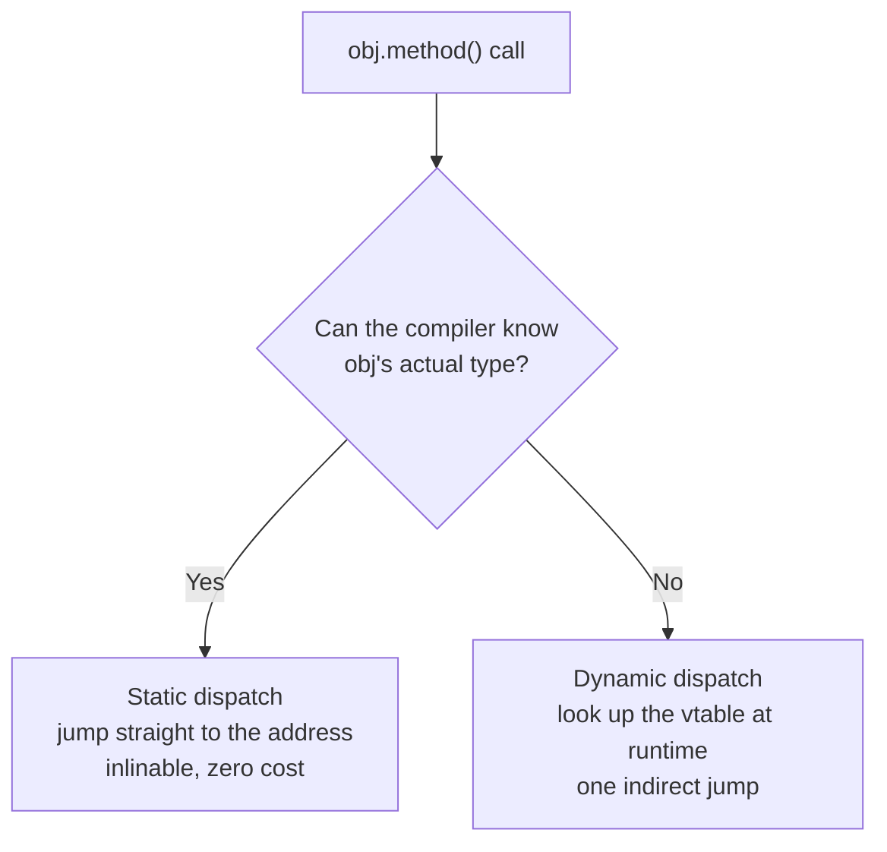

# Chapter 27 · Polymorphism

[简体中文](./27-polymorphism.md) ｜ **English**

---

> The previous chapter kept saying inheritance provides an **is-a relationship** without explaining where its value truly lies. Here it is: when a variable of type `Animal` may hold a `Dog` or a `Cat`, calling `speak()` makes the runtime **pick the right code automatically**.
>
> That is **polymorphism** — one call, different behavior. It is the real core of object orientation: **encapsulation governs data, inheritance governs reuse, and polymorphism makes "adding a new type" require no change to existing code**.
>
> This chapter lifts the lid on the **vtable**. Three measurements first: **①** Adding the first virtual function grows an object from 4 bytes to **16**; adding nine more leaves the size **completely unchanged**. **②** Virtual calls are slower than direct calls — but only by about **13% (one type) to 50% (types alternating)**, far less than the folklore suggests. **③** Most counterintuitively: **Java's JIT optimizes a single-implementation virtual call down to 1.00×**, more thoroughly than C++'s static compilation (1.13–1.15×).

## 1. Learning Objectives

By the end of this chapter, you will be able to:

- Distinguish **static dispatch** from **dynamic dispatch** and state when each binds;
- Draw the **vtable memory layout** and explain a virtual call end to end;
- State the **space cost** of virtual functions (one vptr) and the **time cost** (measured 13%–50%);
- Explain **devirtualization** and why a JIT sometimes beats a static compiler;
- Explain how **duck typing** differs fundamentally from inheritance-based polymorphism.

---

## 2. Why This Concept Exists

### Life without polymorphism

Suppose you must total the area of many shapes:

```java
double totalArea(List<Object> shapes) {
    double sum = 0;
    for (Object s : shapes) {
        if (s instanceof Circle)         sum += ((Circle) s).radius * ... ;
        else if (s instanceof Rectangle) sum += ((Rectangle) s).w * ((Rectangle) s).h;
        else if (s instanceof Triangle)  sum += ... ;
        // every new shape means coming back to edit this function
    }
    return sum;
}
```

**The problem is not that it is hard to write, but that every new type forces you to revisit every such check** — and they tend to be scattered across dozens of files.

### With polymorphism

```java
double totalArea(List<Shape> shapes) {
    double sum = 0;
    for (Shape s : shapes) sum += s.area();    // whatever the shape, the same call
    return sum;
}
```

**Adding a shape requires no edit to this function at all**:

```java
class Hexagon implements Shape {
    public double area() { return ... ; }       // just add this class
}
```

### This is the open-closed principle

> **Open for extension, closed for modification** — new functionality should come from *adding* code, not *editing* existing code.

| | Without polymorphism | With polymorphism |
|---|---|---|
| Adding a type | Edit every `if-else` branch | **Add one class** |
| Risk | Miss one spot and you have a bug | The compiler enforces the interface |
| Existing code | Repeatedly modified | **Untouched** |

> **In one sentence**: polymorphism reduces the cost of "adding a type" **from "edit the whole project" to "add one file."** That is object orientation's most valuable contribution.

### Three kinds of polymorphism

This chapter covers the first; the others come later:

| Kind | Meaning | Chapter |
|------|---------|---------|
| **Subtype polymorphism** | One interface, many implementations (`Dog` / `Cat`) | **This chapter** |
| **Parametric polymorphism** | One body of code across many types (generics) | Chapter 29 |
| **Ad-hoc polymorphism** | Same name dispatched by argument type (overloading) | Chapter 12 |

---

## 3. How It Works

### Static vs. dynamic dispatch

This is the first dividing line: **is "which code to call" decided at compile time or at run time?**



| | Static dispatch | Dynamic dispatch |
|---|---|---|
| Also called | Early binding | Late binding |
| Decided | **At compile time** | **At run time** |
| Inlinable | ✅ Yes | ⚠️ Usually not (unless devirtualized) |
| Cost | Zero | One indirect jump |
| C++ | Default | Requires `virtual` |
| Java | `static`/`private`/`final` | **Default** |

### The vtable: how dynamic dispatch works

**The mechanism is two sentences**:

1. **Each class has one vtable**, holding the actual addresses of all its virtual functions in a fixed order;
2. **Each object holds a vptr** pointing at its class's table.

```text
Dog object                  Dog's vtable                   Actual code
┌──────────────┐           ┌──────────────────┐
│ vptr    ●────┼──────────►│ [0] ~Dog()       │──────► destructor code
│ name         │           │ [1] speak()      │──────► Dog::speak code
│ age          │           │ [2] eat()        │──────► Animal::eat code (inherited, not overridden)
└──────────────┘           └──────────────────┘

Cat object                  Cat's vtable
┌──────────────┐           ┌──────────────────┐
│ vptr    ●────┼──────────►│ [0] ~Cat()       │──────► destructor code
│ name         │           │ [1] speak()      │──────► Cat::speak code ← the same slot 1
│ age          │           │ [2] eat()        │──────► Animal::eat code
└──────────────┘           └──────────────────┘
```

**What happens on `animal->speak()`**:

```text
① Read the vptr out of the object          ← one memory access
② Fetch the address from vtable slot 1     ← one memory access
③ Jump to that address                     ← one indirect jump
```

**The key is that the slot number is fixed at compile time**: the compiler knows `speak()` always occupies slot 1, so it emits "load the vptr, take entry 1" — **identical code whether the object is a `Dog` or a `Cat`**, yet the address retrieved differs. That is exactly how "one call, different behavior" is implemented.

### ⚠️ Space cost: one vptr (measured)

```text
struct NoVirtual  { int x; };                   sizeof = 4
struct OneVirtual { int x; virtual void f(); }; sizeof = 16
struct TenVirtual { int x; ten virtual funcs }; sizeof = 16
```

**Two points**:

**① The arithmetic behind 4 → 16**: `vptr(8) + int(4) = 12`, rounded up to a multiple of 8 → **16** (Chapter 24's alignment rules). So the real vptr cost is **8 bytes**; the other 4 are padding.

**② Going from 1 virtual function to 10 leaves the size unchanged** — because **the vtable exists once per class, and the object holds only a pointer to it**. This corrects a common misconception that more virtual functions mean larger objects.

### ⚠️ Time cost: much milder than the folklore (measured)

**C++ measured** (50 million calls; each input depends on the previous output to prevent the compiler from computing a closed form; 5 rounds per group, minimum taken):

| Call style | Time | Relative to direct |
|-----------|-----:|:------------------:|
| Direct call (non-virtual, inlinable) | 45 ms | 1.00× |
| Virtual · one actual type | 51–52 ms | **1.13–1.15×** |
| Virtual · two types alternating randomly | 65–68 ms | **1.43–1.50×** |

> ⚠️ **On microbenchmark methodology**: the "5 rounds, take the minimum" is not a formality. The first round runs noticeably slower because the CPU has not ramped up its clock and caches are cold — **a single-round measurement once produced the absurd result "direct call 73 ms, slower than the virtual call at 55 ms."** The minimum is the closest estimate of the true, undisturbed cost.

**Why alternating types are slower**:

```text
One type      → the CPU's indirect-branch predictor is always right; the pipeline flows
Alternating   → frequent mispredictions flush the pipeline, and different function
                bodies compete for the instruction cache
```

> **Conclusion**: virtual dispatch costs something real but bounded — roughly 13%–50%, and that was measured with a trivial function body. **The heavier the function, the smaller the proportion.** Citing "virtual functions are slow" as a design justification is almost never defensible.

### Devirtualization: when the compiler can prove the type

**Devirtualization** is when a compiler or JIT discovers "only one type can occur here," rewrites the virtual call as a direct call, and then inlines it.

**Java measured** (50 million calls, thoroughly warmed up so the JIT has compiled):

| Call style | Time | Relative to `final` |
|-----------|-----:|:-------------------:|
| `final` method on a `final` class | 45–47 ms | 1.00× |
| Interface call · only one implementer | 45–47 ms | **0.98–1.00×** |
| Interface call · two implementers alternating | 52–54 ms | 1.13–1.17× |

**⚠️ A counterintuitive result**:

```text
C++  monomorphic virtual call → 1.13–1.15×  (static compilation; the runtime type is unknowable)
Java monomorphic virtual call → 0.98–1.00×  (the JIT sees one implementer and fully devirtualizes)
```

**Java's JIT beats C++'s static compilation at this particular task.** The reason is **runtime information** — the JIT can observe "this call site has only ever seen type `A`," inline aggressively, and insert a type guard as insurance (if a `B` ever arrives, it falls back and recompiles). A static compiler cannot know which subclasses will be loaded in the future.

> **This also explains the value of `final` / `sealed`**: they tell the compiler outright that no other implementation is possible, making devirtualization decidable at compile time.

### Duck typing: polymorphism without inheritance

Python and JavaScript took another road: **at run time, only "does it have this method?" matters, never "is it the same type?"**

**Measured**:

```python
class Dog:   def speak(self): return "Woof!"
class Cat:   def speak(self): return "Meow~"
class Robot: def speak(self): return "Beep"     # no inheritance relation whatsoever

for obj in [Dog(), Cat(), Robot()]:
    obj.speak()        # all three work
```

```text
Common ancestors of the three classes: ['object']   ← nothing but object connects them
Yet having a speak() method is enough to use them identically
```

> **"If it walks like a duck and quacks like a duck, it is a duck."**
>
> **The essential difference**: statically typed polymorphism means **"declare the relationship, then use it"**; duck typing means **"just use it, and check at run time."** The former catches errors at compile time; the latter is more flexible but defers errors to runtime.

---

## 4. JavaScript

JavaScript's polymorphism rests naturally on **prototype chain lookup** (Chapter 24), and with dynamic typing it is essentially duck typing.

```javascript
class Animal {
  speak() { return "makes a sound"; }
}
class Dog extends Animal {
  speak() { return "Woof!"; }
}
class Cat extends Animal {
  speak() { return "Meow~"; }
}

// One function, any Animal
function makeSpeak(animals) {
  return animals.map((a) => a.speak());
}
makeSpeak([new Dog(), new Cat()]);    // ["Woof!", "Meow~"]
```

### But inheritance is not required at all

```javascript
const duck = { speak: () => "Quack" };            // a plain object
const robot = { speak: () => "Beep" };

makeSpeak([new Dog(), duck, robot]);              // works just as well
```

> **JS "polymorphism" is simply property lookup**: `a.speak` walks the prototype chain, calls the first `speak` it finds, and never checks what `a` is. That is both the source of its flexibility and the reason errors surface only at run time.

### How dispatch is implemented: inline caches

Engines do not dutifully walk the prototype chain every time; they use an **inline cache** to remember the result:

```text
First execution of a.speak()  → walk the chain, record "Dog shape → Dog.prototype.speak"
Later executions              → check the shape is still Dog, then use the cached address
```

| Cache state | Meaning | Speed |
|-------------|---------|-------|
| **Monomorphic** | This site has seen one shape | **Fastest** |
| **Polymorphic** | 2–4 shapes seen | Fairly fast |
| **Megamorphic** | More than 4; caching abandoned | Slow |

> **Practical consequence**, consistent with Chapter 24: **keep object shapes stable** so call sites stay monomorphic. This is why "a function that handles one or two object shapes" is usually far faster than one handling a dozen.

> **Note**: JS has no `abstract`; forcing subclasses to implement something means throwing from the base: `speak() { throw new Error("must implement speak()"); }`.

---

## 5. Python

Python's polymorphism is **entirely duck typing**; inheritance is optional.

```python
class Dog:
    def speak(self): return "Woof!"
class Cat:
    def speak(self): return "Meow~"
class Robot:
    def speak(self): return "Beep"

for obj in [Dog(), Cat(), Robot()]:      # no inheritance among them
    print(obj.speak())                    # handled uniformly anyway
```

**Measured**: the only common ancestor of the three is `object`.

### When a contract must be enforced: `ABC`

```python
from abc import ABC, abstractmethod

class Shape(ABC):
    @abstractmethod
    def area(self): ...                   # subclasses must implement

class Circle(Shape):
    def __init__(self, r): self.r = r
    def area(self): return 3.14159 * self.r ** 2

# Shape()                                 # TypeError: cannot instantiate an abstract class
```

> `ABC` moves the failure from "discovered at call time" to "raised at instantiation" — **still runtime, though, not compile time.**

### `Protocol`: statically checked duck typing

Python 3.8+ offers the best of both:

```python
from typing import Protocol

class Speaker(Protocol):
    def speak(self) -> str: ...           # declares a shape; nothing needs to inherit it

def make_speak(s: Speaker) -> str:
    return s.speak()

make_speak(Dog())                          # ✓ the type checker accepts it, and it runs fine
```

> **`Protocol` is structural subtyping**: any class that merely **looks like** `Speaker` (same method name and signature) satisfies the checker. **You keep duck typing's flexibility while catching errors before running** — one of the most valuable additions to Python's type system in recent years (echoing Chapter 07).

### Operators are polymorphic too

```python
class Vector:
    def __init__(self, x, y): self.x, self.y = x, y
    def __add__(self, other):              # give + meaning for Vector
        return Vector(self.x + other.x, self.y + other.y)
    def __repr__(self):
        return f"Vector({self.x}, {self.y})"

Vector(1, 2) + Vector(3, 4)                # Vector(4, 6)
```

> **Note**: Python looks up methods along the MRO every call (Chapter 26). Despite type caches, this remains an order of magnitude slower than a vtable. That is the intrinsic price of dynamism — **do not expect "using less inheritance" to fix it**.

---

## 6. Java

Java methods are **virtual by default** — unless marked `static`, `private`, or `final`.

```java
public class Animal {
    public String speak() { return "makes a sound"; }    // overridable by default (virtual)
    public final String id() { return "animal"; }         // final: static dispatch
    private void internal() { }                            // private: static dispatch
}

public class Dog extends Animal {
    @Override public String speak() { return "Woof!"; }
}

Animal a = new Dog();
a.speak();          // "Woof!" ← dispatched by the actual type at run time
```

### Interfaces are the more common vehicle

```java
interface Shape { double area(); }

record Circle(double r)     implements Shape { public double area() { return Math.PI*r*r; } }
record Rect(double w, double h) implements Shape { public double area() { return w*h; } }

double total = shapes.stream().mapToDouble(Shape::area).sum();   // indifferent to the concrete type
```

### ⚠️ JIT devirtualization: Java's distinctive advantage (measured)

| Call style | Time | Relative to `final` |
|-----------|-----:|:-------------------:|
| `final` method on a `final` class | 45–47 ms | 1.00× |
| Interface call · one implementer | 45–47 ms | **0.98–1.00×** |
| Interface call · two implementers | 52–54 ms | 1.13–1.17× |

**With a single implementation the JIT reduces virtual dispatch to essentially zero cost**, more thoroughly than C++'s static compilation (1.13–1.15×).

**What a JIT can do that a static compiler cannot**:

```text
① Monomorphic inline caching: this site has only seen A, so inline A's implementation
② Class hierarchy analysis: if the loaded hierarchy has exactly one implementer, devirtualize
③ Insurance: insert a type guard; if a B arrives, fall back and recompile
```

> **This is a concrete instance of "a JIT is sometimes faster than AOT"** (echoing Chapter 05): **it holds runtime information a static compiler can never obtain.**

### Fields are not polymorphic

```java
class Base { String name = "base"; }
class Derived extends Base { String name = "derived"; }   // shadowing, not overriding

Base b = new Derived();
b.name;              // "base" ← fields resolve by the variable's static type!
b.getName();         // a method would dispatch by the actual type
```

> **Note**: **field access is statically bound; only methods are polymorphic.** Never use a same-named field to "override" a parent's field — it produces nothing but confusion.

---

## 7. C++

C++ is the only language here that **requires an explicit `virtual`** for dynamic dispatch, because it insists you don't pay for what you don't use.

```cpp
class Animal {
public:
    virtual ~Animal() = default;                        // must be virtual (Chapter 26)
    virtual std::string speak() const { return "makes a sound"; }
    std::string id() const { return "animal"; }          // non-virtual: static dispatch
};

class Dog : public Animal {
public:
    std::string speak() const override { return "Woof!"; }
};
```

### ⚠️ Polymorphism requires a pointer or reference

```cpp
std::unique_ptr<Animal> a = std::make_unique<Dog>();
a->speak();                    // "Woof!" ✓ dynamic dispatch

Animal byValue = Dog();        // ⚠️ object slicing!
byValue.speak();               // "makes a sound" — the Dog part was sliced away
```

**Object slicing** is a C++-only trap (elsewhere objects live on the heap and variables are references, so it cannot occur):

```text
Dog object (16 bytes: vptr + Animal part + Dog part)
        ↓ assigned by value to an Animal variable
Animal variable (only Animal's size) — Dog's extra part is discarded and the vptr
                                        is replaced with Animal's
```

> **The rule**: **always use `Animal&`, `Animal*`, or a smart pointer for polymorphism; never pass polymorphic objects by value.**

### The measured cost of a vtable

```text
struct NoVirtual  { int x; };                   sizeof = 4
struct OneVirtual { int x; virtual void f(); }; sizeof = 16   ← vptr(8) + int(4) → padded to 16
struct TenVirtual { int x; ten virtual funcs }; sizeof = 16   ← unchanged!
```

### Three keywords in modern C++

```cpp
class Dog : public Animal {
public:
    std::string speak() const override;      // the compiler verifies it overrides something
};

class Cat final : public Animal { };          // no further subclassing
class Fox : public Animal {
    std::string speak() const final;          // no further overriding → devirtualizable
};
```

> **`final` is not just a design constraint but an optimization hint**: seeing `final`, the compiler knows no other implementation exists and can devirtualize and inline directly.

### Static polymorphism: CRTP

C++ also offers a zero-cost route — dispatch resolved by templates **at compile time**:

```cpp
template <typename Derived>
class Shape {
public:
    double area() const {
        return static_cast<const Derived*>(this)->areaImpl();   // resolved at compile time
    }
};

class Circle : public Shape<Circle> {
    friend class Shape<Circle>;
    double r;
    double areaImpl() const { return 3.14159 * r * r; }
};
```

> **CRTP (curiously recurring template pattern)** implements "polymorphism" with templates: **no vptr, no indirect jump, fully inlinable.** The cost is losing runtime flexibility — you cannot put different types in one container. A textbook trade of runtime for compile time (Chapter 29 covers generics in depth).

---

## 8. C#

C# requires **both `virtual` and `override` to be explicit**, the strictest of the group (echoing Chapter 26).

```csharp
public class Animal
{
    public virtual string Speak() => "makes a sound";     // virtual is required
    public string Id() => "animal";                        // unmarked → static dispatch
}

public class Dog : Animal
{
    public override string Speak() => "Woof!";             // override is required
}

Animal a = new Dog();
a.Speak();          // "Woof!"
```

### `abstract`: forcing subclasses to implement

```csharp
public abstract class Shape
{
    public abstract double Area();                    // no body; subclasses must supply one
    public virtual string Describe() => $"area {Area():F2}";   // default body, optionally overridden
}
```

### Default interface implementations (C# 8+)

```csharp
public interface ILogger
{
    void Log(string msg);
    void LogError(string msg) => Log($"[ERROR] {msg}");   // default implementation
}
```

> Same reasoning as Java 8's default methods: **let interfaces evolve without breaking existing implementers.**

### Pattern matching: a more modern type dispatch

```csharp
public static double Area(Shape s) => s switch
{
    Circle c    => Math.PI * c.R * c.R,
    Rect r      => r.W * r.H,
    Triangle t  => t.Base * t.Height / 2,
    _           => throw new ArgumentException("unknown shape")
};
```

> **⚠️ But this is anti-polymorphic** — it moves behavior out of the classes and reintroduces "adding a type means editing this function." **Use it only for external types you cannot modify, or when a decision genuinely spans several types at once.**

### `sealed` as an optimization hint

```csharp
public sealed class FastDog : Animal
{
    public override string Speak() => "Woof!";
}
```

> Like C++'s `final` and Java's `final`, `sealed` lets the JIT conclude "no further subclasses" and devirtualize.

> **Note**: Chapter 26 covered how `new` method hiding **is not polymorphism** — the result depends on the variable's static type. It is the C# feature most often confused with polymorphism.

---

## 9. SQL

Relational databases have no objects or virtual functions, yet the need for "one query, different results per type" is just as real.

### ① `CASE`: the most direct type dispatch

```sql
CREATE TABLE shape (
    id     INTEGER PRIMARY KEY,
    type   TEXT NOT NULL,          -- 'circle' / 'rect'
    a      REAL,                    -- circle: radius; rect: width
    b      REAL                     -- circle: unused; rect: height
);

SELECT id, type,
       CASE type
           WHEN 'circle' THEN 3.14159 * a * a
           WHEN 'rect'   THEN a * b
       END AS area
FROM shape;
```

> This is the SQL equivalent of `if-else` dispatch — **every new shape means editing this query**, exactly the anti-pattern from the start of the chapter.

### ② Views: encapsulating the "polymorphism"

```sql
CREATE VIEW shape_with_area AS
SELECT id, type,
       CASE type WHEN 'circle' THEN 3.14159*a*a WHEN 'rect' THEN a*b END AS area
FROM shape;

SELECT SUM(area) FROM shape_with_area;      -- the consumer never sees the arithmetic
```

> **The view plays the role of an interface** (Chapter 25): a new shape type changes only the view definition, and **every consuming query stays untouched** — precisely the "closed for modification" that polymorphism buys.

### ③ Polymorphic queries under class table inheritance

Using Chapter 26's model (parent table plus child tables):

```sql
SELECT e.id, e.name,
       COALESCE(m.team_size, 0)   AS team_size,
       COALESCE(g.language, '-')  AS language,
       CASE WHEN m.id IS NOT NULL THEN 'manager'
            WHEN g.id IS NOT NULL THEN 'engineer' END AS type
FROM employee e
LEFT JOIN manager  m ON e.id = m.id
LEFT JOIN engineer g ON e.id = g.id;
```

> **This is the relational model's "polymorphic query"** — `LEFT JOIN` every possible subtype, then use `CASE` to determine the actual one. **The cost is one more JOIN per subtype added.**

### ④ The database's own polymorphism: function overloading

```sql
-- One name, dispatched by argument type (ad-hoc polymorphism, Chapter 12)
LENGTH('hello')       -- 5     string length
ABS(-5)               -- 5     integer
ABS(-5.5)             -- 5.5   float — the same ABS handles different types
```

> **Practical note**: simulating polymorphism in a database costs far more than in code. **A long `CASE type WHEN ...` in your queries usually signals that the model needs rethinking** — or that the logic belongs back in the application, where real polymorphism can handle it.

---

## 10. Cross-Language Comparison

### ① Polymorphism mechanisms

| Feature | JavaScript | Python | Java | C++ | C# |
|---------|-----------|--------|------|-----|-----|
| Dispatch | Prototype chain + inline cache | MRO lookup | **vtable** | **vtable** | **vtable** |
| Virtual by default | All dynamic | All dynamic | **Yes** | ❌ needs `virtual` | ❌ needs `virtual` |
| Common base required | ❌ duck typing | ❌ duck typing | ✅ | ✅ | ✅ |
| Abstract methods | ❌ throw manually | `@abstractmethod` | `abstract` | pure virtual `= 0` | `abstract` |
| Structural typing | Native | `Protocol` | ❌ | Concepts (C++20) | ❌ |
| Prevent overriding | ❌ | ❌ | `final` | `final` | `sealed` |
| Compile-time polymorphism | ❌ | ❌ | Generics (erasure) | **Templates / CRTP** | Generics (reified) |

### ② Two fundamental disagreements

**Disagreement one: must the relationship be declared?**

```text
Nominal typing (Java / C++ / C#): implement/inherit first; checked at compile time
Structural typing (Python / JS) : only the method matters; checked at run time
```

| | Nominal | Structural |
|---|---|---|
| Errors surface | **At compile time** | At run time |
| Flexibility | The class definition must change to "join" | **Any object works directly** |
| Adapting third-party types | Needs an adapter | **Works as is** |
| Refactoring safety | **High** | Low |

> Python's `Protocol` and C++20's Concepts both **attempt to have both** — structural flexibility with static checking.

**Disagreement two: who decides what is virtual?**

```text
Virtual by default (Java)     : subclasses are free, but the base author loses control
                                (the fragile base class of Chapter 26)
Non-virtual by default (C++/C#): the base marks its extension points; safer but wordier
```

### ③ Commonalities and the roots of the differences

**In common**: every language provides "one call, different behavior," compiled languages all implement it with vtables, and all offer some way to forbid overriding.

**Roots of the differences**:

- **C++ requires explicit `virtual`** because you don't pay for what you don't use — a class needing no polymorphism should not carry a vptr;
- **Java is virtual by default** because programming to interfaces is its core idea, and **JIT devirtualization drives that default's cost to nearly zero** (measured 1.00×) — **language design and runtime optimization reinforcing each other**;
- **C# requires both `virtual` and `override`**, learning from Java's fragile base class problem;
- **Python and JS use duck typing**, the consistent choice of dynamic typing: **defer checking to run time in exchange for maximum flexibility.**

---

## 11. Implementation Comparison

| Language · Mechanism | How it works | Key cost |
|---------------------|-------------|----------|
| **C++ vtable** | Object holds a vptr; class holds the table | +8 bytes per object; one indirect jump |
| **C++ CRTP** | Templates expanded at compile time | **Zero runtime cost**, but code bloat and no runtime flexibility |
| **Java virtual method** | vtable + **JIT devirtualization** | Measured 1.00× when monomorphic |
| **Java interface call** | itable (interface method table), one level deeper | Slightly slower than a virtual method; the JIT optimizes it too |
| **C# virtual method** | vtable, similar to Java | As above |
| **Python** | MRO walk + type cache | An order of magnitude slower than a vtable |
| **JS** | Prototype chain + inline cache | Fastest when monomorphic; degrades when megamorphic |

**A pattern shared across languages**: **every implementation is some combination of table lookup and caching.** A vtable is a table built at compile time, an inline cache is a table learned at run time, and devirtualization is "the table has only one entry, so skip the lookup."

---

## 12. Performance Analysis

### Measured summary

**① The space cost of a vtable** (C++, deterministic):

| Definition | `sizeof` |
|------------|--------:|
| `struct { int x; }` | 4 |
| `struct { int x; virtual void f(); }` | **16** |
| `struct { int x; ten virtual funcs }` | **16** |

**Arithmetic**: `vptr(8) + int(4) = 12` → padded to **16**. **The number of virtual functions does not affect object size.**

**② The time cost of virtual calls** (C++, 50 million, serial dependency chain, 5 rounds minimum):

| Call style | Time | Ratio |
|-----------|-----:|:-----:|
| Direct call | 45 ms | 1.00× |
| Virtual · one type | 51–52 ms | **1.13–1.15×** |
| Virtual · two types | 65–68 ms | **1.43–1.50×** |

**③ JIT devirtualization** (Java, 50 million, thoroughly warmed, 5 rounds minimum):

| Call style | Time | Ratio |
|-----------|-----:|:-----:|
| `final` method | 45–47 ms | 1.00× |
| Interface · one implementer | 45–47 ms | **0.98–1.00×** |
| Interface · two implementers | 52–54 ms | 1.13–1.17× |

> **On methodology**: all three groups use "5 rounds, take the minimum." This is not ceremony — **a single round once produced the absurd result that a direct call was slower than a virtual one**, because the first round suffers from clock ramp-up and cold caches. A sound microbenchmark needs **both** the multi-round minimum **and** measures against compiler optimization (serial dependency chains, printed checksums).

### Three conclusions worth keeping

**① Virtual functions cost far less than the folklore claims**: 13%–50%, and **the heavier the function body, the smaller the share**. Refusing polymorphism because "virtuals are slow" is almost always wrong.

**② What really matters is whether the type is uniform**, not whether virtual functions are used:

```text
One type      → branch prediction hits + possible devirtualization → near-zero cost
Several types → mispredictions + instruction cache pressure        → the cost appears
```

**③ A JIT can beat static compilation here** (measured Java 0.98–1.00× vs. C++ 1.13–1.15×) — because it knows the runtime type distribution.

> ⚠️ **These numbers depend on the environment** (CPU, compiler version, optimization level). **Remember that the cost is bounded and correlates with type diversity; measure the specifics yourself** — the lesson Part 3 taught repeatedly.

---

## 13. Engineering Practice

| Scenario | ✅ Recommended | ❌ Not recommended | Why |
|----------|---------------|-------------------|-----|
| Handling "many things of a kind" | Polymorphism | Long `if-else`/`switch` | New types need no edits |
| C++ classes meant for inheritance | **`virtual ~Base()`** | Non-virtual destructor | The subclass destructor is skipped (Chapter 26) |
| Passing polymorphic C++ objects | `const Base&` / smart pointer | By value | Avoids object slicing |
| No subclasses expected | `final` / `sealed` | Leave it open | Both design constraint and optimization hint |
| Type known at compile time | Generics / CRTP | Virtual functions | Zero runtime cost |
| Python contracts | `Protocol` (static checking) | Documentation only | Flexible and safe |
| Python enforced implementation | `ABC` + `@abstractmethod` | Throwing `NotImplementedError` | Fails at instantiation |
| JS hot paths | Keep object shapes uniform | Mixing many shapes | Keeps inline caches monomorphic |
| Types you cannot modify | Pattern matching / visitor | Forcing a hierarchy | You can't edit someone else's class |
| SQL type dispatch | Encapsulate in a view | `CASE type WHEN` everywhere | New types change one place |

### When not to use polymorphism

```text
- The set of types is closed and rarely grows (like days of the week) → an enum + switch is clearer
- Only two cases with simple logic → one if beats a class hierarchy
- The difference is in data, not type → use a strategy parameter, not subclasses
```

> **A useful test**: if achieving polymorphism produced a pile of classes each with a single one-line method, it is probably over-engineering — **polymorphism serves the cost of adding types, not the appearance of being object-oriented.**

---

## 14. Best Practices

- **Program to interfaces**: declare with abstract types, instantiate with concrete ones.
- **Every extensible C++ base needs a virtual destructor**, and polymorphic values must travel by reference or pointer.
- **Mark what cannot be overridden**: `final` / `sealed` express intent and enable devirtualization.
- **Never justify a design with "virtual functions are slow"** — measured overhead is 13%–50% and is usually dwarfed by the actual work.
- **Prefer `Protocol` over bare duck typing in Python**, keeping flexibility while gaining static checks.
- **Keep JS object shapes stable** so call sites stay monomorphic (echoing Chapter 24).
- **Watch for polymorphism that degenerated into `if-else`**: if adding a type means editing several places, polymorphism was applied in the wrong spot.
- **Fields are not polymorphic** — never shadow a parent's field with the same name.

---

## 15. Common Pitfalls

**Pitfall 1 · C++ object slicing**

```cpp
Animal a = Dog();      // ✗ the Dog part is sliced off and the vptr becomes Animal's
a.speak();             // "makes a sound", not "Woof!"
const Animal& r = dog; // ✓ use a reference
```

**Pitfall 2 · Forgetting C++'s virtual destructor**

```cpp
class Base { ~Base(); };                   // ✗ deleting via a base pointer skips ~Derived
class Base { virtual ~Base() = default; }; // ✓
```

**Pitfall 3 · Calling a virtual function from a constructor**

```cpp
Base() { speak(); }    // ⚠️ C++: calls Base's version (the subclass isn't constructed yet)
                       // ⚠️ Java: calls the subclass version, but its fields are still
                       //     default-valued (Chapter 26)
```
**How to avoid**: the two languages behave differently but both dangerously — **never call virtuals from a constructor.**

**Pitfall 4 · Fields are not polymorphic**

```java
Base b = new Derived();
b.name;                // ✗ gets Base's name (static binding)
b.getName();           // ✓ only methods dispatch
```

**Pitfall 5 · Mistaking C#'s `new` hiding for overriding**

```csharp
public new void M() { }       // ✗ the result depends on the static type, not polymorphism
public override void M() { }  // ✓
```

**Pitfall 6 · Degenerating into `instanceof` / `isinstance` chains**

```java
for (Shape s : shapes) {
    if (s instanceof Circle) { ... }        // ✗ polymorphism wasted
    else if (s instanceof Rect) { ... }
}
for (Shape s : shapes) sum += s.area();     // ✓
```

**Pitfall 7 · Too many shapes at one JS call site**

```javascript
function process(obj) { return obj.value; }
// Pass a dozen differently shaped objects → the inline cache goes megamorphic → noticeably slower
```

---

## 16. Interview Questions

**Basic**

1. What is polymorphism and what problem does it solve?
2. What is the difference between static and dynamic dispatch?
3. Are Java methods virtual by default? What about C++?

**Intermediate**

4. **What is a vtable?** Draw the relationship among object, vtable, and function code.
5. How much larger does a virtual function make an object? Do additional virtuals grow it further?
6. **What is duck typing?** How does it fundamentally differ from inheritance-based polymorphism?

**Advanced**

7. **What is devirtualization?** Why can a JIT sometimes outperform a static compiler at it?
8. How does C++ object slicing happen? Why does Java not have this problem?
9. What is CRTP? What are its trade-offs against virtual functions?

---

## 17. Exercises

**Basic**

1. Implement a `Shape` hierarchy (circle, rectangle) in all six languages and total the areas.
2. Refactor an `if-else` type check into polymorphism.
3. Verify that fields are not polymorphic by shadowing a field and observing access.

**Intermediate**

4. **Measure the vtable's space cost**: compare `sizeof` with and without virtuals, and confirm the count does not matter.
5. **Measure virtual call overhead**, using a serial dependency chain to prevent closed-form evaluation and a multi-round minimum to exclude warm-up noise.
6. Implement structural subtyping in Python with `Protocol` and verify with a type checker.

**Advanced**

7. **Measure JIT devirtualization**: compare an interface call with one implementer against two.
8. Implement compile-time polymorphism with CRTP and compare its `sizeof` and speed with virtual functions.
9. Find a place in your project where polymorphism degenerated into `instanceof` and refactor it.

---

## 18. Chapter Summary

**In one sentence**: polymorphism reduces the cost of "adding a type" **from "edit the whole project" to "add one file"** — object orientation's most valuable contribution; it is implemented with a **vtable** (one table per class, one pointer per object, slot numbers fixed at compile time), costing **8 bytes per object** and **13%–50% per call**, while **JIT devirtualization drives that cost to nearly zero when only one implementation exists**.

**Key points**

- **Polymorphism implements the open-closed principle**: new types require no edits to existing code.
- **The vtable mechanism**: class holds the table, object holds the pointer, slot numbers fixed at compile time — that is how "one call, different behavior" works.
- **Space cost** (measured): the first virtual function takes 4 → **16 bytes** (vptr 8 + 4 padding); **ten virtual functions occupy the same size**.
- **Time cost** (measured): **1.13–1.15×** for one type, **1.43–1.50×** for alternating types — far milder than the folklore.
- **JIT devirtualization** (measured): Java hits **0.98–1.00×** with one implementer, beating C++'s static compilation (1.13–1.15×) — **because it has runtime information**.
- **Duck typing** (measured): three classes with no inheritance relation are handled uniformly — the structural vs. nominal divide.
- **A C++-only trap**: object slicing — polymorphism requires references or pointers.

**Checklist**

- [ ] I can state which cost polymorphism actually addresses.
- [ ] I can draw a vtable and trace a virtual call end to end.
- [ ] I know the rough magnitude of virtual functions' space and time cost.
- [ ] I can explain devirtualization and why `final`/`sealed` help.
- [ ] I understand how duck typing differs from inheritance-based polymorphism.

**Coming next**: all the polymorphism in this chapter rested on having a common parent class. But a parent class does two jobs at once — **defining a contract** and **providing an implementation** — and those two can be separated. What if you only want to say "anything that flies has a `fly()` method," without imposing any implementation or hierarchy? That is an **interface**: **contract only, no implementation.** Chapter 28 explains why this "less is more" design became the foundation of modern software architecture, and how Java 8's default methods muddied the water again.

---

## 19. Further Reading

- <a href="https://en.wikipedia.org/wiki/Polymorphism_(computer_science)" target="_blank" rel="noopener">Wikipedia: Polymorphism (computer science)</a> — the full taxonomy of the three forms.
- <a href="https://en.wikipedia.org/wiki/Virtual_method_table" target="_blank" rel="noopener">Wikipedia: Virtual method table</a> — vtable structure and implementation details.
- <a href="https://en.wikipedia.org/wiki/Dynamic_dispatch" target="_blank" rel="noopener">Wikipedia: Dynamic dispatch</a> — a comparison of dispatch mechanisms.
- <a href="https://en.wikipedia.org/wiki/Duck_typing" target="_blank" rel="noopener">Wikipedia: Duck typing</a> — where structural typing comes from.
- <a href="https://en.cppreference.com/w/cpp/language/virtual" target="_blank" rel="noopener">cppreference · Virtual functions</a> — authoritative reference on `virtual`/`override`/`final`.
- <a href="https://docs.python.org/3/glossary.html#term-duck-typing" target="_blank" rel="noopener">Python Glossary · Duck typing</a> — the official definition.
- <a href="https://learn.microsoft.com/en-us/dotnet/csharp/fundamentals/object-oriented/polymorphism" target="_blank" rel="noopener">Microsoft Learn · C# Polymorphism</a> — a full comparison of `virtual`/`override`/`new`.
