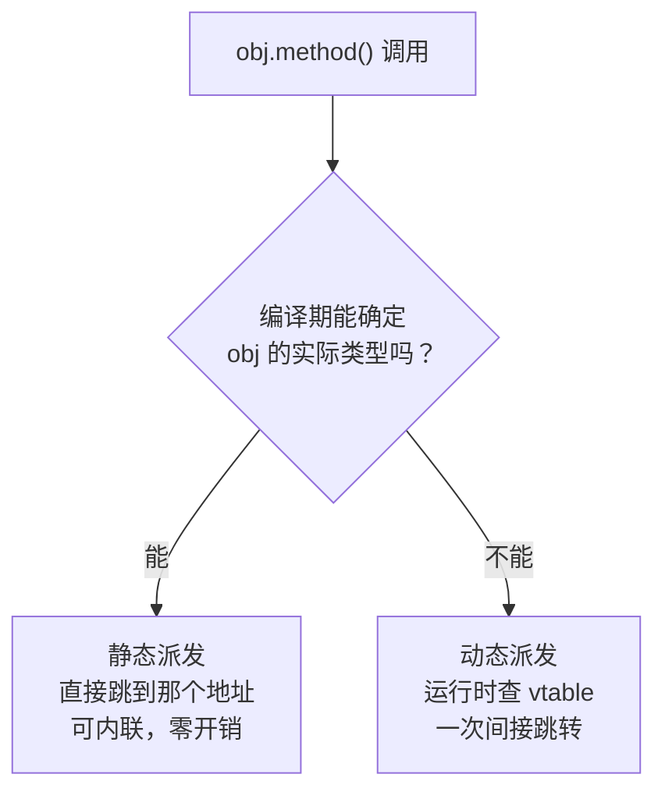

# 第 27 章 · 多态

**简体中文** ｜ [English](./27-polymorphism.en-US.md)

---

> 上一章反复说继承提供了 **is-a 关系**，却没讲这个关系真正的价值在哪。价值就在这里：当一个 `Animal` 类型的变量可能装着 `Dog` 也可能装着 `Cat`，调用 `speak()` 时**运行时会自动选对那份代码**。
>
> 这就是**多态**——同一个调用，不同的行为。它才是面向对象真正的核心：**封装管住了数据，继承管住了复用，而多态让"新增一种类型"不需要改动任何已有代码**。
>
> 本章掀开 **vtable（虚函数表）** 的盖子。三个实测值得先看：**①** 给类加第一个虚函数，对象从 4 字节涨到 **16 字节**；但从 1 个虚函数加到 10 个，**大小完全不变**。**②** 虚调用比直接调用慢——但只慢约 **13%（单一类型）到 50%（多种类型交替）**，远不像传说中那么可怕。**③** 最反直觉的是：**Java 的 JIT 在单一实现时把虚调用优化到了 1.00 倍**，比 C++ 的静态编译（1.13–1.15 倍）还彻底。

## 1. 学习目标

本章结束后，你将能够：

- 区分**静态派发**与**动态派发**，并说清各自的绑定时机；
- 画出 **vtable 的内存布局**，解释虚函数调用的完整过程；
- 说明虚函数的**空间代价**（一个 vptr）和**时间代价**（实测约 13%–50%）；
- 解释**去虚化**，以及为什么 JIT 有时比静态编译器做得更好；
- 说清**鸭子类型**与基于继承的多态有何本质区别。

---

## 2. 为什么会出现这个概念

### 没有多态时的样子

假设要计算一堆图形的总面积：

```java
double totalArea(List<Object> shapes) {
    double sum = 0;
    for (Object s : shapes) {
        if (s instanceof Circle)         sum += ((Circle) s).radius * ... ;
        else if (s instanceof Rectangle) sum += ((Rectangle) s).w * ((Rectangle) s).h;
        else if (s instanceof Triangle)  sum += ... ;
        // 每加一种图形，就要回来改这个函数
    }
    return sum;
}
```

**问题不在于难写，而在于每次新增类型都要回头改所有这类判断**——而它们往往散落在几十个文件里。

### 有了多态之后

```java
double totalArea(List<Shape> shapes) {
    double sum = 0;
    for (Shape s : shapes) sum += s.area();    // 不管是什么图形，调用同一个方法
    return sum;
}
```

**新增一种图形，这个函数一个字都不用改**：

```java
class Hexagon implements Shape {
    public double area() { return ... ; }       // 只需要新增这个类
}
```

### 这就是"开闭原则"

> **对扩展开放，对修改关闭**——增加新功能应该靠"新增代码"，而不是"修改已有代码"。

| | 没有多态 | 有多态 |
|---|---|---|
| 新增类型 | 修改所有 `if-else` 分支 | **只新增一个类** |
| 出错风险 | 漏改一处就有 bug | 编译器保证实现了接口 |
| 已有代码 | 被反复改动 | **一行不动** |

> **一句话**：多态把"新增一种类型"的成本，**从"改遍全项目"降为"加一个文件"**。这才是面向对象最核心的价值。

### 多态的三种形态

本章聚焦第一种，另外两种在后续章节：

| 形态 | 含义 | 章节 |
|------|------|------|
| **子类型多态** | 同一接口，不同实现（`Dog` / `Cat`） | **本章** |
| **参数化多态** | 同一份代码适配多种类型（泛型） | 第 29 章 |
| **特设多态** | 同名函数按参数类型分派（重载） | 第 12 章 |

---

## 3. 底层原理

### 静态派发 vs 动态派发

这是理解多态的第一个分水岭：**"调用哪份代码"是在编译期决定，还是运行期决定？**



| | 静态派发 | 动态派发 |
|---|---|---|
| 别名 | 早绑定 | 晚绑定 |
| 决定时机 | **编译期** | **运行期** |
| 能否内联 | ✅ 可以 | ⚠️ 通常不行（除非去虚化） |
| 开销 | 零 | 一次间接跳转 |
| C++ | 默认 | 需要 `virtual` |
| Java | `static`/`private`/`final` | **默认** |

### vtable：动态派发的实现

**核心机制只有两句话**：

1. **每个类有一张 vtable**（虚函数表），里面按固定顺序存放该类所有虚函数的实际地址；
2. **每个对象里存一个 vptr**，指向它所属类的那张表。

```text
Dog 对象                    Dog 的 vtable                  实际代码
┌──────────────┐           ┌──────────────────┐
│ vptr    ●────┼──────────►│ [0] ~Dog()       │──────► 析构函数代码
│ name         │           │ [1] speak()      │──────► Dog::speak 代码
│ age          │           │ [2] eat()        │──────► Animal::eat 代码（未重写，继承下来）
└──────────────┘           └──────────────────┘

Cat 对象                    Cat 的 vtable
┌──────────────┐           ┌──────────────────┐
│ vptr    ●────┼──────────►│ [0] ~Cat()       │──────► 析构函数代码
│ name         │           │ [1] speak()      │──────► Cat::speak 代码 ← 同样是槽位 1
│ age          │           │ [2] eat()        │──────► Animal::eat 代码
└──────────────┘           └──────────────────┘
```

**调用 `animal->speak()` 时发生的事**：

```text
① 从对象里读出 vptr                    ← 一次内存访问
② 从 vtable 的第 1 号槽位取出函数地址    ← 一次内存访问
③ 跳到那个地址执行                      ← 一次间接跳转
```

**关键在于"槽位号是编译期固定的"**：编译器知道 `speak()` 永远在第 1 槽，所以它生成的代码是"取 vptr 指向的表的第 1 项"——**无论对象实际是 `Dog` 还是 `Cat`，这段代码完全相同**，而拿到的地址却不同。这就是"同一个调用，不同的行为"的实现原理。

### ⚠️ 空间代价：一个 vptr（实测）

```text
struct NoVirtual  { int x; };                   sizeof = 4
struct OneVirtual { int x; virtual void f(); }; sizeof = 16
struct TenVirtual { int x; 10 个虚函数 };        sizeof = 16
```

**两个要点**：

**① 4 → 16 的算式**：`vptr(8) + int(4) = 12`，对齐到 8 的倍数 → **16**（呼应第 24 章的对齐规则）。所以真正的 vptr 开销是 **8 字节**，另外 4 字节是对齐填充。

**② 从 1 个虚函数加到 10 个，对象大小完全不变**——因为 **vtable 是每个类一份，对象里只存一个指向它的指针**。这是个常见误解：以为虚函数越多对象越大。

### ⚠️ 时间代价：比传说中温和得多（实测）

**C++ 实测**（5000 万次调用；每次输入依赖上次输出以防止编译器闭式求和；每组跑 5 轮取最小值）：

| 调用方式 | 耗时 | 相对直接调用 |
|---------|-----:|:-----------:|
| 直接调用（非虚，可内联） | 45 ms | 1.00× |
| 虚调用 · 单一实际类型 | 51–52 ms | **1.13–1.15×** |
| 虚调用 · 两种类型随机交替 | 65–68 ms | **1.43–1.50×** |

> ⚠️ **微基准测试的方法论**：这里的"跑 5 轮取最小值"不是可有可无的讲究。首轮测量常因 CPU 频率未爬升、缓存未预热而明显偏慢——**单轮测量曾得出"直接调用 73 ms 比虚调用 55 ms 还慢"这种荒谬结果**。最小值最接近"无干扰"的真实成本。

**为什么"多种类型交替"更慢**：

```text
单一类型  → CPU 的间接跳转预测器每次都猜对，流水线不中断
类型交替  → 预测器频繁猜错，流水线被冲刷；且不同函数体争抢指令缓存
```

> **结论**：虚调用的开销是**真实存在但有限的**——约 13%–50%，而且这还是在"函数体极简"的情况下测的。**函数体越重，这个比例越小**（因为固定的派发开销被摊薄了）。用"虚函数很慢"作为设计理由，几乎总是站不住脚的。

### 去虚化：当编译器能证明类型时

**去虚化（devirtualization）** 指编译器/JIT 发现"这里其实只可能是某一种类型"，于是把虚调用改写成直接调用，进而内联。

**Java 实测**（5000 万次，充分预热让 JIT 完成编译）：

| 调用方式 | 耗时 | 相对 final 方法 |
|---------|-----:|:--------------:|
| `final` 类的 `final` 方法 | 45–47 ms | 1.00× |
| 接口调用 · 只有一个实现类 | 45–47 ms | **0.98–1.00×** |
| 接口调用 · 两种实现交替 | 52–54 ms | 1.13–1.17× |

**⚠️ 这里有个反直觉的结论**：

```text
C++  单态虚调用 → 1.13–1.15×   （静态编译，无法确定运行时类型）
Java 单态虚调用 → 0.98–1.00×   （JIT 观察到只有一种实现，完全去虚化）
```

**Java 的 JIT 在这件事上反而比 C++ 的静态编译更彻底。** 原因是 JIT 掌握**运行时信息**——它能看到"这个调用点至今只遇到过 `A` 类型"，于是大胆内联，同时插入一个类型检查作为保险（如果哪天真的来了 `B`，就退回慢路径重新编译）。而静态编译器在编译时无法知道未来会加载哪些子类。

> **这也解释了 `final` / `sealed` 的价值**：它们等于直接告诉编译器"这里不可能有别的实现"，让去虚化在编译期就能确定。

### 鸭子类型：不需要继承的多态

Python 和 JavaScript 走了另一条路：**运行时只看"有没有这个方法"，不看"是不是同一个类型"**。

**实测**：

```python
class Dog:   def speak(self): return "汪！"
class Cat:   def speak(self): return "喵～"
class Robot: def speak(self): return "滴滴"     # 与前两者毫无继承关系

for obj in [Dog(), Cat(), Robot()]:
    obj.speak()        # 三个类都能用
```

```text
三个类的共同父类: ['object']    ← 除了 object，它们之间没有任何继承关系
但只要都有 speak() 方法，就能被同样使用
```

> **"如果它走起来像鸭子、叫起来像鸭子，那它就是鸭子。"**
>
> **本质区别**：静态类型语言的多态是"**先声明关系，再使用**"；鸭子类型是"**直接使用，运行时才检查**"。前者编译期就能发现错误，后者更灵活但错误推迟到运行时。

---

## 4. JavaScript

JavaScript 的多态天然基于**原型链查找**（第 24 章），加上动态类型，本质上是鸭子类型。

```javascript
class Animal {
  speak() { return "发出声音"; }
}
class Dog extends Animal {
  speak() { return "汪！"; }
}
class Cat extends Animal {
  speak() { return "喵～"; }
}

// 同一个函数，处理任意 Animal
function makeSpeak(animals) {
  return animals.map((a) => a.speak());
}
makeSpeak([new Dog(), new Cat()]);    // ["汪！", "喵～"]
```

### 但根本不需要继承

```javascript
const duck = { speak: () => "嘎嘎" };            // 普通对象
const robot = { speak: () => "滴滴" };

makeSpeak([new Dog(), duck, robot]);             // 照样能用
```

> **JS 的"多态"就是属性查找**：`a.speak` 沿原型链找到第一个 `speak` 就调用它，完全不检查 `a` 是什么类型。这既是灵活性的来源，也是错误推迟到运行时的原因。

### 派发的实现：内联缓存

引擎不会每次都老实地沿原型链查找，而是用**内联缓存**（inline cache）记住结果：

```text
第一次执行 a.speak()  → 沿原型链查找，记下「Dog 形状 → Dog.prototype.speak」
后续执行              → 先检查形状是否还是 Dog，是就直接用缓存的地址
```

| 缓存状态 | 含义 | 速度 |
|---------|------|------|
| **单态**（monomorphic） | 这个调用点只见过一种形状 | **最快** |
| **多态**（polymorphic） | 见过 2–4 种形状 | 较快 |
| **超多态**（megamorphic） | 超过 4 种，放弃缓存 | 慢 |

> **实践含义**：与第 24 章的建议一致——**保持对象形状稳定**，能让调用点维持在单态状态。这就是为什么"一个函数只处理一两种对象形状"通常比"处理十几种"快得多。

> **注意事项**：JS 没有 `abstract`，想强制子类实现某方法只能在基类里主动抛错：`speak() { throw new Error("必须实现 speak()"); }`。

---

## 5. Python

Python 的多态**完全基于鸭子类型**，继承是可选的。

```python
class Dog:
    def speak(self): return "汪！"
class Cat:
    def speak(self): return "喵～"
class Robot:
    def speak(self): return "滴滴"

for obj in [Dog(), Cat(), Robot()]:      # 三者毫无继承关系
    print(obj.speak())                    # 照样能统一处理
```

**实测确认**：三个类的共同祖先只有 `object`。

### 需要强制约定时：`ABC`

```python
from abc import ABC, abstractmethod

class Shape(ABC):
    @abstractmethod
    def area(self): ...                   # 子类必须实现

class Circle(Shape):
    def __init__(self, r): self.r = r
    def area(self): return 3.14159 * self.r ** 2

# Shape()                                 # TypeError: 不能实例化抽象类
```

> `ABC` 把"运行时才发现没实现"提前到了"实例化时就报错"——**但仍然是运行时，而非编译期**。

### `Protocol`：静态检查的鸭子类型

Python 3.8+ 提供了两全其美的方案：

```python
from typing import Protocol

class Speaker(Protocol):
    def speak(self) -> str: ...           # 只声明形状，不需要被继承

def make_speak(s: Speaker) -> str:
    return s.speak()

make_speak(Dog())                          # ✓ 类型检查器认可，运行时也正常
```

> **`Protocol` 是"结构化子类型"**：只要一个类**长得像** `Speaker`（有同名同签名的方法），类型检查器就认。**既保留了鸭子类型的灵活，又能在编译前（静态检查阶段）发现错误**——这是 Python 类型系统近年最有价值的补充之一（呼应第 07 章）。

### 运算符也是多态

```python
class Vector:
    def __init__(self, x, y): self.x, self.y = x, y
    def __add__(self, other):              # 让 + 对 Vector 有意义
        return Vector(self.x + other.x, self.y + other.y)
    def __repr__(self):
        return f"Vector({self.x}, {self.y})"

Vector(1, 2) + Vector(3, 4)                # Vector(4, 6)
```

> **注意事项**：Python 的方法查找每次都要走 MRO（第 26 章），虽然有类型缓存，但仍比编译型语言的 vtable 慢一个量级。这是动态性的固有代价，**不要指望靠"少用继承"来优化它**。

---

## 6. Java

Java 的方法**默认就是虚方法**——除非标了 `static`、`private` 或 `final`。

```java
public class Animal {
    public String speak() { return "发出声音"; }        // 默认可被重写（虚方法）
    public final String id() { return "animal"; }        // final：静态派发
    private void internal() { }                           // private：静态派发
}

public class Dog extends Animal {
    @Override public String speak() { return "汪！"; }
}

Animal a = new Dog();
a.speak();          // "汪！" ← 运行时按实际类型派发
```

### 接口是更常用的多态载体

```java
interface Shape { double area(); }

record Circle(double r)     implements Shape { public double area() { return Math.PI*r*r; } }
record Rect(double w, double h) implements Shape { public double area() { return w*h; } }

double total = shapes.stream().mapToDouble(Shape::area).sum();   // 不关心具体类型
```

### ⚠️ JIT 去虚化：Java 的独门优势（实测）

| 调用方式 | 耗时 | 相对 `final` |
|---------|-----:|:-----------:|
| `final` 类的 `final` 方法 | 45–47 ms | 1.00× |
| 接口调用 · 只有一个实现类 | 45–47 ms | **0.98–1.00×** |
| 接口调用 · 两种实现交替 | 52–54 ms | 1.13–1.17× |

**JIT 在"只有一种实现"时把虚调用优化到了几乎零开销**，比 C++ 的静态编译（1.13–1.15 倍）还彻底。

**JIT 能做而静态编译器做不到的事**：

```text
① 单态内联缓存：观察到这个调用点至今只见过 A，就内联 A 的实现
② 类层次分析：如果整个已加载的类层次里 Shape 只有一个实现，直接去虚化
③ 保险机制：插入类型检查，万一来了 B 就退回慢路径并重新编译
```

> **这就是"JIT 有时比 AOT 快"的一个具体例证**（呼应第 05 章）：**它掌握静态编译器永远拿不到的运行时信息**。

### 字段没有多态

```java
class Base { String name = "base"; }
class Derived extends Base { String name = "derived"; }   // 遮蔽，不是重写

Base b = new Derived();
b.name;              // "base" ← 字段按「变量的静态类型」访问！
b.getName();         // 若是方法，则按实际类型派发
```

> **注意事项**：**字段访问是静态绑定的，只有方法才有多态**。所以永远不要用同名字段来"覆盖"父类字段——这只会造成困惑。

---

## 7. C++

C++ 是唯一**必须显式声明 `virtual`** 才有动态派发的语言，因为它坚持"不用的东西不付代价"。

```cpp
class Animal {
public:
    virtual ~Animal() = default;                        // 必须虚析构（第 26 章）
    virtual std::string speak() const { return "发出声音"; }
    std::string id() const { return "animal"; }          // 非虚：静态派发
};

class Dog : public Animal {
public:
    std::string speak() const override { return "汪！"; }
};
```

### ⚠️ 多态必须通过指针或引用

```cpp
std::unique_ptr<Animal> a = std::make_unique<Dog>();
a->speak();                    // "汪！" ✓ 动态派发

Animal byValue = Dog();        // ⚠️ 对象切片（object slicing）！
byValue.speak();               // "发出声音" —— Dog 的部分被"切掉"了
```

**对象切片**是 C++ 独有的坑（其他语言的对象都在堆上，变量只是引用，不存在这个问题）：

```text
Dog 对象（16 字节：vptr + Animal 部分 + Dog 部分）
        ↓ 按值赋给 Animal 变量
Animal 变量（只有 Animal 的大小）—— Dog 特有的部分被丢弃，vptr 也被改成 Animal 的
```

> **规则**：**多态一律用 `Animal&`、`Animal*` 或智能指针，绝不按值传递多态对象**。

### vtable 的实测代价

```text
struct NoVirtual  { int x; };                   sizeof = 4
struct OneVirtual { int x; virtual void f(); }; sizeof = 16   ← vptr(8) + int(4) → 补到 16
struct TenVirtual { int x; 10 个虚函数 };        sizeof = 16   ← 不变！
```

### 现代 C++ 的三个关键字

```cpp
class Dog : public Animal {
public:
    std::string speak() const override;      // 编译器检查确实重写了父类虚函数
};

class Cat final : public Animal { };          // 禁止继续被继承
class Fox : public Animal {
    std::string speak() const final;          // 禁止子类继续重写 → 可去虚化
};
```

> **`final` 不只是设计约束，还是优化提示**：编译器看到 `final` 就知道"这里不可能有别的实现"，可以直接去虚化并内联。

### 静态多态：CRTP

C++ 还提供了一条零开销的路——用模板在**编译期**完成派发：

```cpp
template <typename Derived>
class Shape {
public:
    double area() const {
        return static_cast<const Derived*>(this)->areaImpl();   // 编译期确定
    }
};

class Circle : public Shape<Circle> {
    friend class Shape<Circle>;
    double r;
    double areaImpl() const { return 3.14159 * r * r; }
};
```

> **CRTP（奇异递归模板模式）** 用模板实现"多态"，**没有 vptr、没有间接跳转、可完全内联**。代价是失去了运行时的灵活性——不能把不同类型放进同一个容器。这是"用编译期换运行期"的典型交易（第 29 章泛型会详述）。

---

## 8. C#

C# 要求 `virtual` 与 `override` **都显式声明**，是这几门语言里最严格的（呼应第 26 章）。

```csharp
public class Animal
{
    public virtual string Speak() => "发出声音";     // 必须标 virtual
    public string Id() => "animal";                   // 不标 → 静态派发
}

public class Dog : Animal
{
    public override string Speak() => "汪！";         // 必须标 override
}

Animal a = new Dog();
a.Speak();          // "汪！"
```

### `abstract`：强制子类实现

```csharp
public abstract class Shape
{
    public abstract double Area();                    // 无实现，子类必须提供
    public virtual string Describe() => $"面积 {Area():F2}";   // 有默认实现，可选重写
}
```

### 接口默认实现（C# 8+）

```csharp
public interface ILogger
{
    void Log(string msg);
    void LogError(string msg) => Log($"[错误] {msg}");   // 默认实现
}
```

> 与 Java 8 的默认方法同理：**让接口能够演进而不破坏已有实现类**。

### 模式匹配：更现代的类型分派

```csharp
public static double Area(Shape s) => s switch
{
    Circle c    => Math.PI * c.R * c.R,
    Rect r      => r.W * r.H,
    Triangle t  => t.Base * t.Height / 2,
    _           => throw new ArgumentException("未知图形")
};
```

> **⚠️ 但这是"反多态"的写法**——它把行为从类里搬到了外面，重新引入了"新增类型要改这个函数"的问题。**只在处理外部类型（你无法修改的类）或需要跨多个类型做组合判断时才用它。**

### `sealed`：优化提示

```csharp
public sealed class FastDog : Animal
{
    public override string Speak() => "汪！";
}
```

> 与 C++ 的 `final`、Java 的 `final` 一样，`sealed` 让 JIT 可以确定"这里不会再有子类"，从而去虚化。

> **注意事项**：第 26 章讲过 `new` 关键字造成的方法隐藏**不是多态**——调用结果取决于变量的静态类型。这是 C# 里最容易与多态混淆的特性。

---

## 9. SQL

关系数据库没有对象和虚函数，但"同一个查询，按类型给出不同结果"的需求同样存在。

### ① `CASE`：最直接的类型分派

```sql
CREATE TABLE shape (
    id     INTEGER PRIMARY KEY,
    type   TEXT NOT NULL,          -- 'circle' / 'rect'
    a      REAL,                    -- 圆：半径；矩形：宽
    b      REAL                     -- 圆：不用；矩形：高
);

SELECT id, type,
       CASE type
           WHEN 'circle' THEN 3.14159 * a * a
           WHEN 'rect'   THEN a * b
       END AS area
FROM shape;
```

> 这相当于代码里的 `if-else` 分派——**新增一种图形就要改这个查询**，与本章开头的反面教材完全对应。

### ② 视图：把"多态"封装起来

```sql
CREATE VIEW shape_with_area AS
SELECT id, type,
       CASE type WHEN 'circle' THEN 3.14159*a*a WHEN 'rect' THEN a*b END AS area
FROM shape;

SELECT SUM(area) FROM shape_with_area;      -- 使用方不关心怎么算的
```

> **视图在这里扮演了"接口"的角色**（第 25 章）：新增图形类型时只改视图定义，**所有使用方的查询一行都不用动**——这正是多态带来的"对修改关闭"。

### ③ 类表继承下的多态查询

沿用第 26 章的建模（父表 + 子表）：

```sql
SELECT e.id, e.name,
       COALESCE(m.team_size, 0)   AS team_size,
       COALESCE(g.language, '-')  AS language,
       CASE WHEN m.id IS NOT NULL THEN 'manager'
            WHEN g.id IS NOT NULL THEN 'engineer' END AS type
FROM employee e
LEFT JOIN manager  m ON e.id = m.id
LEFT JOIN engineer g ON e.id = g.id;
```

> **这就是关系模型里的"多态查询"**——用 `LEFT JOIN` 把所有可能的子类型都连上，再用 `CASE` 判断实际类型。**代价是每增加一个子类型，就要多一个 JOIN**。

### ④ 数据库自身的多态：函数重载

```sql
-- 同一个函数名，按参数类型分派（这是「特设多态」，第 12 章）
LENGTH('hello')       -- 5     字符串长度
ABS(-5)               -- 5     整数
ABS(-5.5)             -- 5.5   浮点数 —— 同一个 ABS 处理不同类型
```

> **工程提醒**：数据库里模拟多态的代价远高于代码里。**如果你的查询里出现了很长的 `CASE type WHEN ...`，通常说明该重新审视建模**——或者干脆把这部分逻辑放回应用层，让真正的多态机制来处理。

---

## 10. 五语言横向对比

### ① 多态机制对比

| 特性 | JavaScript | Python | Java | C++ | C# |
|------|-----------|--------|------|-----|-----|
| 派发方式 | 原型链 + 内联缓存 | MRO 查找 | **vtable** | **vtable** | **vtable** |
| 默认是否虚 | 全是动态 | 全是动态 | **是** | ❌ 需 `virtual` | ❌ 需 `virtual` |
| 需要共同父类 | ❌ 鸭子类型 | ❌ 鸭子类型 | ✅ | ✅ | ✅ |
| 抽象方法 | ❌ 手动抛错 | `@abstractmethod` | `abstract` | 纯虚函数 `= 0` | `abstract` |
| 结构化类型 | 天然 | `Protocol` | ❌ | Concept（C++20） | ❌ |
| 禁止重写 | ❌ | ❌ | `final` | `final` | `sealed` |
| 编译期多态 | ❌ | ❌ | 泛型（擦除） | **模板 / CRTP** | 泛型（具化） |

### ② 两条根本分歧

**分歧一：多态要不要先声明关系**

```text
名义类型（Java / C++ / C#）：必须先 implements/继承，编译期检查
结构类型（Python / JS）    ：只看有没有这个方法，运行时检查
```

| | 名义类型 | 结构类型 |
|---|---|---|
| 错误发现时机 | **编译期** | 运行时 |
| 灵活性 | 需要修改类定义才能"加入" | **任何对象都能直接用** |
| 适配第三方类型 | 需要适配器 | **直接就能用** |
| 重构安全性 | **高** | 低 |

> Python 的 `Protocol` 和 C++20 的 Concept 都是在**试图兼得两者**——保留结构类型的灵活，同时获得静态检查。

**分歧二：虚不虚由谁决定**

```text
默认虚（Java）      ：子类自由重写，但基类作者失去控制（第 26 章脆弱基类）
默认非虚（C++/C#）  ：基类主动标记扩展点，更安全但更啰嗦
```

### ③ 共同点与差异根源

**共同点**：所有语言都提供了"同一调用、不同行为"的能力，编译型语言都用 vtable 实现，也都提供了禁止重写的手段。

**差异根源**：

- **C++ 要求显式 `virtual`**，因为"不用的东西不付代价"——不需要多态的类不该背 vptr 的开销；
- **Java 默认虚**，因为它把"面向接口编程"作为核心理念，且 **JIT 的去虚化让默认虚的代价降到几乎为零**（实测 1.00 倍）——**这是语言设计与运行时优化互相成就的例子**；
- **C# 要求 `virtual` + `override` 双显式**，是从 Java 的脆弱基类问题中吸取教训；
- **Python / JS 用鸭子类型**，源于动态类型的一贯选择：**把检查推迟到运行时，换取最大的灵活性**。

---

## 11. 底层实现对比

| 语言 · 机制 | 实现方式 | 关键代价 |
|------------|---------|---------|
| **C++ vtable** | 对象存 vptr，类存 vtable | 对象 +8 字节；一次间接跳转 |
| **C++ CRTP** | 模板在编译期展开 | **零运行时开销**，但代码膨胀、失去运行时灵活性 |
| **Java 虚方法** | vtable + **JIT 去虚化** | 单态时实测 1.00 倍（几乎无开销） |
| **Java 接口调用** | itable（接口方法表），比类方法多一层 | 比虚方法略慢，但 JIT 同样能优化 |
| **C# 虚方法** | vtable，与 Java 类似 | 同上 |
| **Python** | 沿 MRO 查找 + 类型缓存 | 比 vtable 慢一个量级 |
| **JS** | 原型链 + 内联缓存 | 单态最快；超多态时退化 |

**一个跨语言的共同模式**：**所有实现都在"查表"和"缓存"之间做文章**。vtable 是编译期建好的表，内联缓存是运行时学出来的表，JIT 去虚化则是"发现表里只有一项，干脆不查了"。

---

## 12. 性能分析

### 实测汇总

**① vtable 的空间代价**（C++，确定性结果）：

| 定义 | `sizeof` |
|------|--------:|
| `struct { int x; }` | 4 |
| `struct { int x; virtual void f(); }` | **16** |
| `struct { int x; 10 个虚函数 }` | **16** |

**算式**：`vptr(8) + int(4) = 12` → 对齐到 **16**。**虚函数数量不影响对象大小。**

**② 虚调用的时间代价**（C++，5000 万次，串行依赖链防优化，5 轮取最小值）：

| 调用方式 | 耗时 | 倍数 |
|---------|-----:|:----:|
| 直接调用 | 45 ms | 1.00× |
| 虚调用 · 单一类型 | 51–52 ms | **1.13–1.15×** |
| 虚调用 · 两类型交替 | 65–68 ms | **1.43–1.50×** |

**③ JIT 去虚化**（Java，5000 万次，充分预热，5 轮取最小值）：

| 调用方式 | 耗时 | 倍数 |
|---------|-----:|:----:|
| `final` 方法 | 45–47 ms | 1.00× |
| 接口 · 单一实现 | 45–47 ms | **0.98–1.00×** |
| 接口 · 两种实现 | 52–54 ms | 1.13–1.17× |

> **关于测量方法**：三组都采用"每组跑 5 轮取最小值"。这不是形式主义——**单轮测量曾产生"直接调用比虚调用还慢"的荒谬结果**，因为首轮受 CPU 频率爬升和缓存预热干扰。做微基准测试时，**多轮取最小值**与**防止编译器优化**（串行依赖链、输出校验值）缺一不可。

### 三个值得记住的结论

**① 虚函数的开销比传说中小得多**：13%–50%，且**函数体越重占比越小**。以"虚函数慢"为由拒绝多态，几乎总是错的。

**② 真正影响性能的是"类型是否单一"**，而不是"有没有用虚函数"：

```text
单一类型  → 分支预测命中 + 可能被去虚化 → 接近零开销
多种类型  → 预测失败 + 指令缓存竞争   → 开销显现
```

**③ JIT 在这件事上可能胜过静态编译**（实测 Java 0.98–1.00× vs C++ 1.13–1.15×）——因为它掌握运行时的类型分布信息。

> ⚠️ **这些数字依赖环境**（CPU、编译器版本、优化级别）。**记住"开销有限且与类型多样性相关"这个结论，具体数字请自己实测**——这是 Part 3 反复得到的教训。

---

## 13. 工程实践

| 场景 | ✅ 推荐 | ❌ 不推荐 | 原因 |
|------|--------|----------|------|
| 处理"多种同类事物" | 多态 | 长串 `if-else`/`switch` | 新增类型不用改已有代码 |
| C++ 打算被继承的类 | **`virtual ~Base()`** | 非虚析构 | 否则子类析构被跳过（第 26 章）|
| C++ 多态传参 | `const Base&` / 智能指针 | 按值传递 | 避免对象切片 |
| 确定不会有子类 | `final` / `sealed` | 放任 | 同时是设计约束和优化提示 |
| 编译期就能确定类型 | 泛型 / CRTP | 虚函数 | 零运行时开销 |
| Python 需要约定 | `Protocol`（静态检查） | 只写文档 | 兼得灵活与安全 |
| Python 强制实现 | `ABC` + `@abstractmethod` | 基类抛 `NotImplementedError` | 实例化时就报错 |
| JS 热点代码 | 保持对象形状一致 | 混入多种形状 | 维持单态内联缓存 |
| 处理无法修改的外部类型 | 模式匹配 / 访问者模式 | 强行套继承 | 你改不了别人的类 |
| SQL 里的类型分派 | 视图封装 | 到处写 `CASE type WHEN` | 新增类型只改一处 |

### 什么时候不该用多态

```text
- 类型是封闭的、且几乎不会新增（如「星期几」）→ 枚举 + switch 更清晰
- 只有两种情况且逻辑简单 → 一个 if 比一套类层次更易读
- 行为差异不在类型上，而在数据上 → 用策略参数，不用子类
```

> **一个判断标准**：如果你为了实现多态，写出了一堆"只有一个方法、且实现只有一行"的类，那多半是过度设计——**多态是为"新增类型的成本"服务的，不是为"看起来面向对象"服务的**。

---

## 14. 最佳实践

- **优先面向接口编程**：声明用抽象类型，实例化用具体类型。
- **C++ 中打算被继承的类必须有虚析构函数**，多态一律用引用或指针传递。
- **明确标记不可重写**：`final` / `sealed` 既表达设计意图，又帮助去虚化。
- **不要用"虚函数慢"作为设计理由**——实测开销仅 13%–50%，且通常被业务逻辑掩盖。
- **Python 用 `Protocol` 代替裸鸭子类型**，在保留灵活性的同时获得静态检查。
- **JS 保持对象形状稳定**，让调用点维持单态（呼应第 24 章）。
- **警惕退化成 `if-else` 的多态**：如果每加一个类型都要改多处代码，说明多态没用对地方。
- **字段没有多态**——不要用同名字段"覆盖"父类字段。

---

## 15. 常见坑

**坑 1 · C++ 对象切片**

```cpp
Animal a = Dog();      // ✗ Dog 的部分被切掉，vptr 也变成 Animal 的
a.speak();             // "发出声音"，不是 "汪！"
const Animal& r = dog; // ✓ 用引用
```

**坑 2 · C++ 忘记虚析构函数**

```cpp
class Base { ~Base(); };                   // ✗ delete 基类指针时子类析构被跳过
class Base { virtual ~Base() = default; }; // ✓
```

**坑 3 · 在构造函数里调用虚函数**

```cpp
Base() { speak(); }    // ⚠️ C++：调用的是 Base 版本（子类尚未构造）
                       // ⚠️ Java：调用子类版本，但子类字段还是默认值（第 26 章）
```
**如何避免**：两种语言的行为不同但都危险，**构造函数里绝不调虚函数**。

**坑 4 · 字段没有多态**

```java
Base b = new Derived();
b.name;                // ✗ 得到 Base 的 name（静态绑定）
b.getName();           // ✓ 方法才有多态
```

**坑 5 · C# 用 `new` 隐藏当成重写**

```csharp
public new void M() { }    // ✗ 调用结果取决于变量的静态类型，不是多态
public override void M() { }  // ✓
```

**坑 6 · 用 `instanceof` / `isinstance` 退化成 if-else**

```java
for (Shape s : shapes) {
    if (s instanceof Circle) { ... }        // ✗ 多态被浪费了
    else if (s instanceof Rect) { ... }
}
for (Shape s : shapes) sum += s.area();     // ✓
```

**坑 7 · JS 里调用点形状过多**

```javascript
function process(obj) { return obj.value; }
// 传入十几种不同形状的对象 → 内联缓存退化成超多态 → 明显变慢
```

---

## 16. 面试题

**基础**

1. 什么是多态？它解决了什么问题？
2. 静态派发和动态派发有什么区别？
3. Java 的方法默认是虚方法吗？C++ 呢？

**中级**

4. **什么是 vtable？** 画出对象、vtable 和函数代码之间的关系。
5. 虚函数会让对象变大多少？加更多虚函数会让对象继续变大吗？
6. **什么是鸭子类型？** 它与基于继承的多态有什么本质区别？

**高级**

7. **什么是去虚化？** 为什么 JIT 有时能比静态编译器做得更好？
8. C++ 的对象切片是怎么发生的？为什么 Java 没有这个问题？
9. CRTP 是什么？它与虚函数各有什么取舍？

---

## 17. 练习

**基础**

1. 用六门语言各实现一组 `Shape` 多态（圆形、矩形），计算总面积。
2. 把一段 `if-else` 类型判断重构成多态。
3. 验证"字段没有多态"：定义同名字段，观察访问结果。

**提高**

4. **实测 vtable 的空间代价**：对比有无虚函数的 `sizeof`，并验证虚函数数量不影响大小。
5. **实测虚调用开销**：注意用串行依赖链防止编译器闭式求和，并多轮取最小值排除预热干扰。
6. 在 Python 中用 `Protocol` 实现结构化子类型，并用类型检查器验证。

**挑战**

7. **实测 JIT 去虚化**：对比"只有一个实现类"和"两个实现类"的接口调用性能。
8. 用 CRTP 实现编译期多态，对比它与虚函数的 `sizeof` 和性能。
9. 找出你项目里一处"用 `instanceof` 退化成 if-else"的多态，重构它。

---

## 18. 本章总结

**一句话总结**：多态把"新增一种类型"的成本**从"改遍全项目"降为"加一个文件"**，这是面向对象最核心的价值；它靠 **vtable** 实现——每个类一张表、每个对象一个指针，调用时按编译期固定的槽位号查表跳转；代价是**每个对象 8 字节的 vptr** 和 **13%–50% 的调用开销**，而 **JIT 的去虚化能在单一实现时把这个开销降到几乎为零**。

**核心知识点**

- **多态 = 开闭原则的实现手段**：新增类型不改已有代码。
- **vtable 机制**：类持表、对象持指针、槽位号编译期固定——这就是"同一调用不同行为"的原理。
- **空间代价**（实测）：加第一个虚函数 4 → **16 字节**（vptr 8 + 对齐 4）；**加到 10 个虚函数大小不变**。
- **时间代价**（实测）：单一类型 **1.13–1.15×**，多类型交替 **1.43–1.50×**——比传说中温和得多。
- **JIT 去虚化**（实测）：Java 单一实现时 **0.98–1.00×**，比 C++ 静态编译（1.13–1.15×）更彻底——**因为它掌握运行时信息**。
- **鸭子类型**（实测）：三个无继承关系的类照样能统一处理——结构类型 vs 名义类型的根本分歧。
- **C++ 独有的坑**：对象切片——多态必须用引用或指针。

**检查清单**

- [ ] 我能说清多态解决的是什么成本问题。
- [ ] 我能画出 vtable 的结构并解释一次虚调用的完整过程。
- [ ] 我知道虚函数的空间和时间代价大概是多少量级。
- [ ] 我能解释去虚化，以及 `final`/`sealed` 为什么有助于它。
- [ ] 我理解鸭子类型与基于继承的多态的区别。

**下一章预告**：本章的多态都建立在"有一个共同父类"之上。但父类同时承担了两件事——**定义契约**和**提供实现**——而这两件事其实可以分开。如果只想说"凡是能飞的都有 `fly()` 方法"，却不想强加任何实现和继承层次呢？这就是**接口**：**只有契约，没有实现**。第 28 章将讲清楚为什么这个"少即是多"的设计，反而成了现代软件架构的基石，以及 Java 8 的默认方法为何又把水搅浑了。

---

## 19. 延伸阅读

- <a href="https://en.wikipedia.org/wiki/Polymorphism_(computer_science)" target="_blank" rel="noopener">Wikipedia：多态（计算机科学）</a> — 三种多态形态的完整分类。
- <a href="https://en.wikipedia.org/wiki/Virtual_method_table" target="_blank" rel="noopener">Wikipedia：虚函数表</a> — vtable 的结构与实现细节。
- <a href="https://en.wikipedia.org/wiki/Dynamic_dispatch" target="_blank" rel="noopener">Wikipedia：动态派发</a> — 各种派发机制的对比。
- <a href="https://en.wikipedia.org/wiki/Duck_typing" target="_blank" rel="noopener">Wikipedia：鸭子类型</a> — 结构化类型的思想来源。
- <a href="https://en.cppreference.com/w/cpp/language/virtual" target="_blank" rel="noopener">cppreference · 虚函数</a> — `virtual`/`override`/`final` 的权威说明。
- <a href="https://docs.python.org/3/glossary.html#term-duck-typing" target="_blank" rel="noopener">Python 术语表 · 鸭子类型</a> — 官方定义。
- <a href="https://learn.microsoft.com/en-us/dotnet/csharp/fundamentals/object-oriented/polymorphism" target="_blank" rel="noopener">Microsoft Learn · C# 多态</a> — 含 `virtual`/`override`/`new` 的完整对比。
