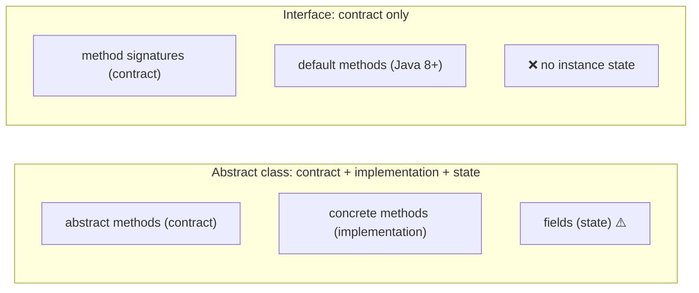
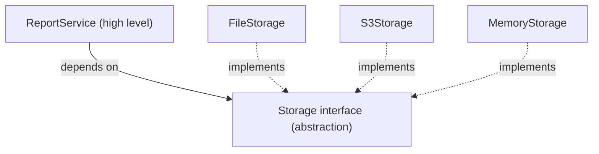

# Chapter 28 · Interfaces

[简体中文](./28-interface.md) ｜ **English**

---

> Inheritance in Chapter 26 hides a problem: **a parent class does two jobs at once** — defining a contract ("subclasses must have `speak()`") and providing an implementation ("here is the default `speak`"). Bundling them means taking the implementation whether you want it or not, and accepting the single-inheritance limit besides.
>
> **An interface separates them**: contract only, no implementation. This subtraction — less is more — buys a crucial capability: **a class may implement any number of interfaces.** A `Duck` can be `Flyable`, `Swimmable`, and `Walkable` all at once, while it can extend only one `Animal`.
>
> But the story is not that simple. **Java 8 added default methods, giving interfaces implementations — and diamond conflicts returned.** Measured: implementing two interfaces with the same-named default method fails to compile outright: `class C inherits unrelated defaults for hello() from types A and B`.
>
> So why is this not a step backwards? **Because interfaces still forbid instance state.** The genuinely unsolvable part of the diamond problem is "state inherited more than once"; a behavior conflict is something the compiler can force you to resolve. That distinction is the key to this whole chapter.

## 1. Learning Objectives

By the end of this chapter, you will be able to:

- Explain the **essential difference between interfaces and abstract classes**, and why "contract only" is more powerful;
- Explain **why you may implement many interfaces but extend only one class**;
- Explain what **Java 8's default methods** brought and why they did not repeat multiple inheritance's mistake;
- Use **C# explicit interface implementation** to resolve name conflicts, and contrast it with Java's approach;
- Apply **dependency inversion** and **interface segregation** to design testable, replaceable code.

---

## 2. Why This Concept Exists

### Inheritance's dilemma: contract and implementation are bundled

```java
abstract class Animal {
    abstract String speak();              // contract: subclasses must implement
    String eat() { return "is eating"; }   // implementation: inherited directly
}
```

Now a new requirement: **a duck both flies and swims.**

```java
class Bird   { String fly()  { return "flies"; } }
class Fish   { String swim() { return "swims"; } }
class Duck extends Bird, Fish { }        // ✗ Java forbids multiple inheritance
```

**Why forbid it?** Chapter 26 explained: the diamond problem stems from **state being inherited more than once**. If both `Bird` and `Fish` held an `int energy`, `Duck` would have two, and modifying either would be wrong.

### The interface answer: peel off the contract

```java
interface Flyable   { String fly(); }     // contract only: no fields, no implementation
interface Swimmable { String swim(); }
interface Walkable  { String walk(); }

class Duck extends Animal implements Flyable, Swimmable, Walkable {
    // extend one class (for implementation), implement many interfaces (for contracts)
}
```

**Measured**:

```text
class Duck extends Animal implements Flyable, Swimmable, Walkable
Donald can: fly swim walk
```

**Because interfaces have no state, implementing many never produces "two copies of a field"** — exactly why Java allows unlimited interfaces while firmly forbidding multiple class inheritance.

### The deeper value: programming to interfaces

```java
// ❌ depends on a concrete implementation
class ReportService {
    private MySQLDatabase db = new MySQLDatabase();   // welded in
}

// ✅ depends on a contract
class ReportService {
    private Database db;                               // an interface
    ReportService(Database db) { this.db = db; }       // swapping implementations needs no edit here
}
```

| | Depending on implementation | Depending on an interface |
|---|---|---|
| Changing databases | Edit `ReportService` | **No edit** |
| Unit testing | Requires a real database | **Inject a fake** |
| Parallel development | Wait for the data layer | **Agree on the interface and work in parallel** |

> **In one sentence**: interfaces separate **what something is** (contract) from **how it does it** (implementation), letting dependencies rest on stable contracts rather than volatile implementations.

---

## 3. How It Works

### Interface vs. abstract class: the core difference



| Feature | Abstract class | Interface |
|---------|---------------|-----------|
| How many | **One** (single inheritance) | **Any number** |
| Instance fields | ✅ Yes | ❌ **No** |
| Constructors | ✅ Yes | ❌ No |
| Method bodies | ✅ Yes | Java 8+ default methods |
| Relationship expressed | **is-a** | **can-do** |

**The choice is straightforward**:

```text
"A Dog is an Animal"        → abstract class (is-a, with shared state and implementation)
"A Dog can be serialized"   → interface (can-do, just a capability)
```

### ⚠️ Java 8 default methods: the diamond returns

Java 8 gave interfaces **default methods** for a very practical reason:

```java
interface Collection<E> {
    // Java 8 wanted to add stream() to every collection.
    // But adding a method to an interface breaks every existing implementer.
    default Stream<E> stream() { ... }    // default method: existing implementers unaffected
}
```

**This solved the "interfaces cannot evolve" problem** — and brought diamond conflicts back.

**Measured**:

```java
interface A { default String hello() { return "A"; } }
interface B { default String hello() { return "B"; } }
class C implements A, B { }               // ⚠️ what happens without hello()?
```

```text
Compile error: class C inherits unrelated defaults for hello() from types A and B
```

**The compiler forces you to resolve it explicitly**:

```java
class C implements A, B {
    public String hello() {
        return A.super.hello() + "+" + B.super.hello();   // syntax created for exactly this
    }
}
// Measured output: A+B
```

### Why this is not a step backwards

**The key is that interfaces still forbid instance state** (measured):

```java
interface Counter {
    int LIMIT = 100;        // ⚠️ not an instance field! automatically public static final (a constant)
}
```

**The two kinds of conflict are fundamentally different**:

| | Behavior conflict (default methods) | State conflict (inherited fields) |
|---|---|---|
| Symptom | Two same-named methods | Two copies of a field |
| Resolvable? | ✅ **The compiler forces a choice** | ❌ **Unsolvable** — either copy is wrong |
| Syntax support | `A.super.hello()` | C++ needs virtual inheritance, at real cost |

> **This is the interface's bottom line**: **behavior may have defaults; state absolutely may not.** Default-method conflicts have explicit resolution syntax; state conflicts have no correct answer at all. Java 8 walked a tightrope — and stayed on it.

### Structural vs. nominal: two styles of contract

```text
Nominal (Java / C# / C++ inheritance): you must declare "I implement this interface"
Structural (Python Protocol / Go / C++20 Concept): looking right is enough
```

**C++20 Concept measured**:

```cpp
template <typename T>
concept Speaker = requires(const T& t) {
    { t.speak() } -> std::convertible_to<std::string>;
};

struct Dog   { std::string speak() const { return "Woof!"; } };
struct Robot { std::string speak() const { return "Beep"; } };
struct Rock  { };                          // no speak()
```

```text
Speaker<Dog>   = true
Speaker<Robot> = true
Speaker<Rock>  = false      ← decided at compile time
makeSpeak(Rock{})           → compile error: constraint not satisfied
```

**Dog and Robot share no base class whatsoever**, yet both satisfy `Speaker`.

| | Nominal | Structural |
|---|---|---|
| Declaration required | ✅ must `implements` | ❌ not needed |
| Adapting third-party types | Needs an adapter | **Works as is** |
| Intent visible | ✅ design intent is obvious | Relies on naming and docs |
| Risk of false matches | Low | Same name, different meaning can slip through |

> **The trend is convergence**: Python's `Protocol` and C++20's `Concept` both add **compile-time or static checking** to structural contracts, aiming for flexibility and safety together (echoing Chapter 27's duck typing discussion).

### Dependency inversion: the interface's most important application

**The conventional direction**: high-level code calls low-level code, so it depends on it.

```text
ReportService  ──depends on──►  MySQLDatabase       ← changing databases edits ReportService
```

**After inversion**: both depend on an abstraction.



**Measured** (Python, contract defined with `Protocol`):

```text
The same ReportService with different Storage implementations:
  FileStorage     → written to file: report[monthly]
  S3Storage       → uploaded to S3: report[monthly]
  MemoryStorage   → stored in memory: report[monthly]

ReportService's code needed no changes at all
```

> **This is the foundation of unit testing**: inject `S3Storage` in production, `MemoryStorage` in tests. **Without interfaces, there is no way to test business logic without touching real resources.**

---

## 4. JavaScript

**JavaScript has no interface keyword** — it is a duck-typed language, and "contracts" live in convention and documentation.

### Three ways to express a contract

**① Pure convention** (most common):

```javascript
// Convention: any Storage must have a save method
class ReportService {
  constructor(storage) {
    this.storage = storage;      // having save is all that matters
  }
  generate(content) {
    return this.storage.save(content);
  }
}
```

**② Runtime checks**:

```javascript
function assertStorage(obj) {
  if (typeof obj?.save !== "function") {
    throw new TypeError("must implement save()");
  }
}
```

**③ TypeScript's `interface`** (structural, checked at compile time):

```typescript
interface Storage {
  save(data: string): string;
}

class FileStorage {                  // note: no implements needed
  save(data: string) { return `wrote: ${data}`; }
}

const s: Storage = new FileStorage();   // ✓ structural match is enough
```

> **TypeScript interfaces are purely compile-time** — they vanish entirely in the emitted JavaScript, leaving no runtime check. A fundamental difference from Java's interfaces.

### The language's built-in implicit contracts

JavaScript expresses contracts through **special method names**; implement one and you plug into a language feature:

```javascript
class Range {
  constructor(start, end) { this.start = start; this.end = end; }
  *[Symbol.iterator]() {                        // implements the iteration protocol
    for (let i = this.start; i < this.end; i++) yield i;
  }
}

[...new Range(1, 5)];        // [1, 2, 3, 4] ← for...of and spread now work
```

**Common built-in protocols**:

| Protocol | Method | Enables |
|----------|--------|---------|
| Iterable | `[Symbol.iterator]` | `for...of`, spread |
| Serialization | `toJSON()` | `JSON.stringify` |
| Stringification | `toString()` | String concatenation |
| Async iteration | `[Symbol.asyncIterator]` | `for await...of` |

> **Note**: JavaScript "interfaces" carry no enforcement whatsoever. For teamwork, **use TypeScript, or at minimum write thorough JSDoc** — otherwise the contract exists only as a verbal agreement.

---

## 5. Python

Python offers two interface mechanisms, one nominal and one structural.

### ① `ABC`: a nominal contract

```python
from abc import ABC, abstractmethod

class Storage(ABC):
    @abstractmethod
    def save(self, data: str) -> str: ...

class FileStorage(Storage):              # must inherit explicitly
    def save(self, data): return f"wrote: {data}"

# Storage()                              # TypeError: cannot instantiate an abstract class
```

### ② `Protocol`: a structural contract (Python 3.8+, preferred)

```python
from typing import Protocol

class Storage(Protocol):
    def save(self, data: str) -> str: ...

class FileStorage:                       # ⚠️ does not inherit Storage
    def save(self, data): return f"wrote: {data}"

def use(s: Storage): return s.save("data")
use(FileStorage())                        # ✓ the type checker accepts it
```

**Measured**:

```text
FileStorage's bases: ['object']    ← does not inherit Storage at all
Yet the type checker recognizes it as satisfying the Storage contract
```

### The full dependency-inversion measurement

```python
class ReportService:
    def __init__(self, storage: Storage):     # the contract is injected
        self.storage = storage
    def generate(self, content):
        return self.storage.save(f"report[{content}]")
```

```text
The same ReportService with different Storage implementations:
  FileStorage     → written to file: report[monthly]
  S3Storage       → uploaded to S3: report[monthly]
  MemoryStorage   → stored in memory: report[monthly]
```

### How to choose

| Scenario | Use `ABC` | Use `Protocol` |
|----------|:---------:|:--------------:|
| You control every implementer | ✅ | ✅ |
| Adapting third-party types | ❌ needs an adapter | ✅ |
| You want to supply partial implementation | ✅ | ❌ |
| You want failure at instantiation | ✅ | ❌ static checking only |
| Expressing "can do" | Adequate | ✅ **more apt** |

> **Note**: a plain `Protocol` **cannot be used with `isinstance`** (Chapter 27 measured the `TypeError`); it needs `@runtime_checkable`. And the runtime check only verifies **that the method name exists, not its signature**.

---

## 6. Java

Java's interfaces evolved three times, each answering "may an interface have implementation?"

```java
public interface Storage {
    String save(String data);                             // abstract method (Java 1.0)

    default String saveAll(List<String> items) {          // default method (Java 8)
        return items.stream().map(this::save).collect(joining("; "));
    }

    static Storage inMemory() { return d -> "memory: " + d; }  // static method (Java 8)

    private String log(String s) { return "[LOG] " + s; }       // private method (Java 9)
}
```

| Version | Added | Motivation |
|---------|-------|------------|
| 1.0 | Abstract methods + constants | Pure contract |
| **8** | **Default methods**, static methods | **Let interfaces evolve** (adding `stream()` to `Collection`) |
| 9 | Private methods | Let default methods share code |

### ⚠️ Default method conflicts (measured)

```java
interface A { default String hello() { return "A"; } }
interface B { default String hello() { return "B"; } }

class C implements A, B { }
// Compile error: class C inherits unrelated defaults for hello() from types A and B

class C implements A, B {
    public String hello() { return A.super.hello() + "+" + B.super.hello(); }
}
// Output: A+B
```

**Three resolution rules**:

```text
① A class implementation beats an interface default   (the concrete class always wins)
② A subinterface's default beats its parent's          (the more specific wins)
③ Peer conflicts → compile error, resolve explicitly   (the measured case)
```

### Functional interfaces and lambdas

```java
@FunctionalInterface                    // exactly one abstract method
interface Transformer { String apply(String s); }

Transformer upper = s -> s.toUpperCase();     // a lambda *is* the implementation
```

> **Java 8's most practical improvement**: `Runnable`, `Comparator`, and `Function` are all functional interfaces, giving Java a lightweight way to pass behavior around.

### Marker interfaces

```java
public class Data implements Serializable { }    // the interface has no methods at all
```

> A **marker interface** merely tags a class so the runtime can test its type. Modern Java prefers annotations (`@Entity`), but `Serializable` and `Cloneable` remain in wide use for historical reasons.

> **Note**: **do not treat interfaces as abstract classes just because they can now hold implementations.** Default methods exist for **interface evolution**, not to supply an implementation base. The criterion stands: shared state means abstract class; defining a capability means interface.

---

## 7. C++

C++ has no `interface` keyword but offers two ways to express contracts — one at run time, one at compile time.

### ① Pure virtual classes: a runtime contract

```cpp
class Storage {
public:
    virtual ~Storage() = default;                        // must be virtual (Chapter 26)
    virtual std::string save(const std::string& data) = 0;   // = 0 means pure virtual
};

class FileStorage : public Storage {
public:
    std::string save(const std::string& data) override {
        return "wrote: " + data;
    }
};
```

> **A class with only pure virtual functions and no data members is C++'s interface.** Because C++ supports multiple inheritance, you can inherit several such "interface classes" — and since they carry no state, no diamond problem arises (exactly Java's reasoning).

### ② Concepts: a compile-time contract (C++20)

```cpp
#include <concepts>

template <typename T>
concept Speaker = requires(const T& t) {
    { t.speak() } -> std::convertible_to<std::string>;
};

template <Speaker T>
std::string makeSpeak(const T& t) { return t.speak(); }
```

**Measured**:

```text
struct Dog   { std::string speak() const; };
struct Robot { std::string speak() const; };
struct Rock  { };                              // no speak()

Speaker<Dog>   = true
Speaker<Robot> = true
Speaker<Rock>  = false          ← decided at compile time
makeSpeak(Rock{})               → compile error: constraint not satisfied
```

**Dog and Robot share no base class**, yet both satisfy `Speaker` — a structural contract.

### The trade-off

| | Pure virtual class | Concept |
|---|---|---|
| Contract checked | At run time (vtable) | **At compile time** |
| Runtime cost | One indirect jump | **Zero** |
| Inheritance required | ✅ | ❌ |
| Storable in one container | ✅ `vector<unique_ptr<Storage>>` | ❌ types differ |
| Error messages | Clear | Pre-C++20 template errors were unreadable |

> **One of Concepts' greatest gifts is error messages.** Before C++20, an unsatisfied template parameter produced dozens of lines of incomprehensible output; now the compiler simply says the `Speaker` constraint is not satisfied.

> **Note**: a C++ "interface class" must declare `virtual ~Storage() = default` — otherwise deleting through a base pointer skips the derived destructor (the Chapter 26 pitfall).

---

## 8. C#

C# has the richest interface support, and **explicit interface implementation** is its unique contribution.

```csharp
public interface IStorage
{
    string Save(string data);
    string SaveAll(IEnumerable<string> items) =>          // default implementation (C# 8+)
        string.Join("; ", items.Select(Save));
}
```

### ⚠️ Explicit interface implementation: C#'s unique solution

**Measured**:

```csharp
interface IFlyable   { string Move(); }
interface ISwimmable { string Move(); }

class Duck : IFlyable, ISwimmable
{
    string IFlyable.Move()   => "flying";     // reachable only through IFlyable
    string ISwimmable.Move() => "swimming";   // reachable only through ISwimmable
    public string Move()     => "walking";    // the class's own public method
}
```

```text
((IFlyable)d).Move()   = flying
((ISwimmable)d).Move() = swimming
d.Move()               = walking

One object, three different results, depending on which interface you go through
```

**A sharp contrast with Java's approach**:

| | Java | C# |
|---|---|---|
| Same-name conflict | Only **one** implementation allowed | **Separate** implementations allowed |
| Resolution syntax | `A.super.hello()`, merged by hand | `string IFlyable.Move()`, implemented separately |
| At call time | One result | Depends on the interface used |

### Explicit implementation also hides methods

```csharp
class UserRepo : IDisposable
{
    void IDisposable.Dispose() { /* release resources */ }
}
```

**Measured**:

```text
repo.Dispose()                  → compile error (not in the class's public API)
((IDisposable)repo).Dispose()   → callable
```

> **This keeps "implementation detail" interfaces out of a class's public API.** Methods on `IDisposable` or `IEnumerator` usually should not be called directly, and explicit implementation fits perfectly.

### Other features

```csharp
// Generic interfaces with variance (Chapter 29)
public interface IReadOnly<out T> { T Get(); }

// An interface may extend several interfaces
public interface IRepository<T> : IReadable<T>, IWritable<T>, IDisposable { }
```

> **Note**: C# 8's default interface implementations resemble Java 8's, but **a default implementation is only reachable through the interface type** and never appears in the class's public API — a detail that makes it cleaner than Java's.

---

## 9. SQL

The database counterpart of an interface is a **view** — it separates a stable contract from a volatile table structure.

### ① A view is an interface

```sql
-- The underlying table (an implementation detail, subject to change)
CREATE TABLE student_v2 (
    id INTEGER PRIMARY KEY, full_name TEXT, score_raw INTEGER, deleted INTEGER DEFAULT 0
);

-- The view is the stable public contract
CREATE VIEW student AS
SELECT id, full_name AS name, score_raw AS score
FROM student_v2 WHERE deleted = 0;
```

**Application code queries only the view**:

```sql
SELECT name, score FROM student WHERE score >= 60;
```

> **Change the table (rename columns, add soft deletes, split it apart) and, as long as the view definition follows, every query stays untouched** — the same principle as depending on interfaces rather than implementations (echoing Chapter 25's encapsulation).

### ② Stored procedures: a stricter interface

```sql
-- Expose operations only; hide the table structure completely
CREATE PROCEDURE enroll_student(IN p_name TEXT, IN p_score INT)
BEGIN
    IF p_score < 0 OR p_score > 100 THEN
        SIGNAL SQLSTATE '45000' SET MESSAGE_TEXT = 'score must be within 0..100';
    END IF;
    INSERT INTO student_v2 (full_name, score_raw) VALUES (p_name, p_score);
END;
```

Combined with permissions, this becomes a genuinely enforced interface (Chapter 25: the only runtime-enforced encapsulation):

```sql
GRANT EXECUTE ON PROCEDURE enroll_student TO app_user;
REVOKE ALL ON student_v2 FROM app_user;      -- no direct table access
```

### ③ Dependency inversion in the data layer

```text
❌ The application writes SQL against tables  →  a schema change edits the app everywhere
✅ The application calls views/procedures      →  the database is free to refactor internally
```

| Layer | Contract | Implementation |
|-------|----------|----------------|
| Application code | Repository interface | The concrete SQL implementation |
| Database | View / stored procedure | The actual table structure |

> **Practical warning**: **views are not free.** Deeply nested views make query plans hard to optimize and hide the true cost of joins. **Keep the contract layer thin** — the same lesson as "don't over-engineer interfaces" in code.

---

## 10. Cross-Language Comparison

### ① Interface mechanisms

| Feature | JavaScript | Python | Java | C++ | C# |
|---------|-----------|--------|------|-----|-----|
| Interface keyword | ❌ (TS has one) | ❌ | `interface` | Pure virtual class / `concept` | `interface` |
| Contract style | Structural | **Both** | Nominal | Pure-virtual nominal / Concept structural | Nominal |
| How many | — | Any | **Any** | Any | **Any** |
| Default implementations | — | ❌ | **Java 8+** | ❌ | **C# 8+** |
| Name-conflict resolution | — | MRO | `A.super.m()` | Explicit qualification | **Separate implementations** |
| Checked | At run time | Static / runtime | **Compile time** | **Compile time** | **Compile time** |
| Static methods | — | ❌ | ✅ Java 8+ | ✅ | ✅ |

### ② Two design disagreements

**Disagreement one: should interfaces carry implementation?**

```text
Pure contract (Java 1–7 / C# 1–7): clean, but interfaces cannot evolve
With defaults (Java 8+ / C# 8+): they can evolve, but behavior conflicts appear
```

> **Reality forced the change**: Java 8 needed to add `stream()` to every `Collection`; without default methods, every implementer on earth would have failed to compile. **This design was driven by backward compatibility.**

**Disagreement two: must contracts be declared?**

```text
Nominal (Java / C#): implements is required — intent is clear, but third-party types can't join
Structural (Python Protocol / C++20 Concept / TS): looking right suffices — flexible but implicit
```

### ③ Commonalities and the roots of the differences

**In common**: every language provides a way to define capability contracts, allows one type to satisfy many, and is converging toward "structural plus static checking."

**Roots of the differences**:

- **Java and C# use an `interface` keyword** because they forbid multiple inheritance and needed a way to express multiple capabilities;
- **C++ uses pure virtual classes** because it already supports multiple inheritance — **stateless pure virtual classes are safe to multiply inherit**, so no special syntax is required;
- **Python offers both `ABC` and `Protocol`**, covering nominal and structural needs — its "give you the choice" philosophy;
- **JavaScript offers nothing**, because under duck typing contracts are implicit by nature — **one of the main reasons TypeScript took off**;
- **C#'s explicit interface implementation** is unique, a more thorough answer to the real problem of "same name, different meaning."

---

## 11. Implementation Comparison

| Language · Mechanism | How it works | Runtime cost |
|---------------------|-------------|--------------|
| **Java interface call** | itable (interface method table), one level beyond the class vtable | Slightly above a virtual call; JIT-optimizable (Chapter 27) |
| **Java default method** | Compiled into the interface's class file; linked when unimplemented | Same as a normal virtual method |
| **C# interface call** | Interface map | Similar to Java |
| **C# explicit implementation** | A specially named private method, visible only through the interface map | Same |
| **C++ pure virtual class** | An ordinary vtable (Chapter 27) | One indirect jump |
| **C++ Concept** | **Purely compile-time**, leaving no trace in generated code | **Zero** |
| **Python Protocol** | A static-checker concept, **nonexistent at run time** | **Zero** (no runtime check) |
| **TypeScript interface** | Purely compile-time, erased on emit | **Zero** |

**A notable divide**:

```text
Interfaces present at run time (Java/C#/C++ pure virtual) → instanceof works, one container holds them
Purely compile-time contracts (Concept/Protocol/TS)      → zero cost, but nothing to check at run time
```

> This maps onto Chapter 27's dynamic vs. static dispatch — **when a contract is checked determines whether it costs anything at run time.**

---

## 12. Performance Analysis

### The cost of interface calls

| Call style | Relative cost | Notes |
|-----------|--------------|-------|
| Direct non-virtual call | 1.00× | Compile-time bound, inlinable |
| Virtual method call | 1.13–1.15× (Chapter 27, measured) | One vtable jump |
| **Java interface call** | Slightly above a virtual call | itable adds a level over vtable |
| **Interface · one implementer** | **0.98–1.00×** (Chapter 27, measured) | JIT devirtualizes completely |
| C++ Concept / Python Protocol | **1.00×** | Purely compile-time, no runtime trace |

> **The conclusion matches Chapter 27**: **interface call cost depends on how many implementations a call site sees, not on "using an interface" as such.** With a single implementation, the JIT devirtualizes entirely.

### When interfaces genuinely slow things down

```text
① A call site sees several implementers → no devirtualization + branch mispredictions
   (Chapter 27 measured 1.13–1.17×)
② Extremely hot inner loops → the fixed overhead's share grows
③ Tiny interface method bodies → dispatch dominates
```

**The corresponding tools**:

```java
final class FastImpl implements Storage { }   // final/sealed enables devirtualization
```

> ⚠️ This is almost never a real bottleneck. **Citing "interfaces cost something" as a reason to avoid them is textbook premature optimization** — the testability and replaceability you lose are worth far more than those few percent.

---

## 13. Engineering Practice

| Scenario | ✅ Recommended | ❌ Not recommended | Why |
|----------|---------------|-------------------|-----|
| Expressing "can do" | Interface | Abstract class | A can-do relation, and multiply implementable |
| "Is a" + shared state | Abstract class | Interface | Interfaces cannot hold instance fields |
| Depending on external resources | **Define an interface, inject the implementation** | `new` a concrete class | Testable and replaceable |
| Adding a method to an interface | Default method | A new abstract method | Otherwise every implementer breaks |
| Adapting third-party types | `Protocol` / Concept | `ABC` / nominal interface | You cannot edit their classes |
| Same name, different meaning in C# | **Explicit interface implementation** | Merging into one method | The semantics genuinely differ |
| C++ interface classes | **`virtual ~Base() = default`** | Non-virtual destructor | Otherwise the derived destructor is skipped |
| One implementation that will not change | **Do not define an interface** | An interface per class | Over-engineering |
| Too many methods on an interface | Split into small interfaces | One fat interface | Interface segregation |

### The interface segregation principle

```java
// ❌ A fat interface forces implementers to supply methods they don't need
interface Worker {
    void work();
    void eat();
    void sleep();
}
class Robot implements Worker {
    public void eat() { throw new UnsupportedOperationException(); }   // robots don't eat
}

// ✅ Split into small interfaces
interface Workable { void work(); }
interface Feedable { void eat(); }
class Robot implements Workable { }                     // implements only what applies
class Human implements Workable, Feedable { }
```

> **The telltale sign**: a `throw new UnsupportedOperationException()` inside an implementer means the interface is too fat.

### When you do not need an interface

```text
- There is one implementation and no foreseeable second one
- Pure data structures (use record / dataclass)
- Internal utilities not used across modules
```

> **"An interface per class" is a common over-engineering pattern.** Interfaces earn their keep when there are multiple implementations or when implementations must be swapped for testing — **without those needs, an interface is just a meaningless layer of indirection.**

---

## 14. Best Practices

- **Program to interfaces**: declare parameters, return types, and fields with interface types.
- **Keep interfaces small**: one interface, one capability — interface segregation.
- **Shared state means abstract class; a capability means interface.**
- **Use default methods for interface evolution**, not as a substitute for abstract classes.
- **C++ interface classes need a virtual destructor.**
- **In C#, implement same-named but semantically different methods explicitly** rather than merging them.
- **Prefer `Protocol` in Python** — especially when adapting third-party types.
- **Do not define an interface for a class with one implementation**; that is over-engineering.
- **Adopt TypeScript in JavaScript projects**, or contracts exist only as verbal agreements.

---

## 15. Common Pitfalls

**Pitfall 1 · Java's default method diamond**

```java
class C implements A, B { }    // ✗ compile error: inherits unrelated defaults
class C implements A, B {
    public String hello() { return A.super.hello(); }   // ✓ resolve explicitly
}
```

**Pitfall 2 · Using an interface as an abstract class**

```java
interface Service {
    default void step1() { ... }     // ⚠️ stuffed with implementation
    default void step2() { ... }     // this should be an abstract class
}
```
**How to avoid**: default methods exist for **interface evolution**, not as an implementation base.

**Pitfall 3 · Forgetting the virtual destructor in a C++ interface class**

```cpp
class Storage { public: virtual void save() = 0; };            // ✗ no virtual destructor
class Storage { public: virtual ~Storage() = default; ... };   // ✓
```

**Pitfall 4 · Python's `Protocol` and `isinstance`**

```python
isinstance(obj, MyProtocol)     # ✗ TypeError (measured in Chapter 27)

@runtime_checkable              # ✓ add this decorator
class MyProtocol(Protocol): ...
```

**Pitfall 5 · Fat interfaces**

```java
class Robot implements Worker {
    public void eat() { throw new UnsupportedOperationException(); }   // ⚠️ the signal
}
```

**Pitfall 6 · An interface for every class**

```text
UserService / UserServiceImpl
OrderService / OrderServiceImpl      ← one implementation each, pure boilerplate
```
**How to avoid**: extract an interface when a second implementation actually appears, or when you genuinely need to mock.

**Pitfall 7 · TypeScript interfaces do not exist at run time**

```typescript
if (obj instanceof Storage) { }     // ✗ compile error: an interface is not a runtime value
if (typeof obj.save === "function") { }   // ✓ the only runtime check available
```

---

## 16. Interview Questions

**Basic**

1. How do interfaces and abstract classes differ, and when is each appropriate?
2. Why may you implement many interfaces but extend only one class?
3. What is programming to interfaces, and what does it buy you?

**Intermediate**

4. **What problem did Java 8's default methods solve, and what problem did they create?**
5. **If default methods gave interfaces implementations, why is this not a repeat of multiple inheritance?**
6. What is the dependency inversion principle? Show how it improves testability.

**Advanced**

7. **What can C#'s explicit interface implementation do that Java cannot?**
8. How do nominal and structural contracts differ, and what are their trade-offs?
9. What is the interface segregation principle? How do you tell an interface is too fat?

---

## 17. Exercises

**Basic**

1. Define a `Storage` contract and two implementations in all six languages.
2. Write a class that satisfies three different interfaces at once.
3. Refactor code that `new`s a concrete class into dependency injection.

**Intermediate**

4. **Reproduce Java's default method diamond** and resolve it with `A.super.m()`.
5. Use C#'s explicit interface implementation so one object gives different results through different interfaces.
6. Use Python's `Protocol` to adapt a third-party class you cannot modify.

**Advanced**

7. Define a C++20 Concept and inspect the compile error when a type fails it.
8. Find a fat interface in your project and split it per the segregation principle.
9. Design a data access layer: the application depends only on a Repository interface, with a database implementation and an in-memory one, and unit-test with the latter.

---

## 18. Chapter Summary

**In one sentence**: an interface splits the two jobs a parent class bundles — **defining a contract** and **providing an implementation** — keeping only the contract; precisely because it has **no instance state**, a class may implement any number of interfaces without a diamond problem; Java 8's default methods gave interfaces behavior (and thus the ability to evolve) and brought behavior conflicts back, but **the compiler forces resolution**, and **state remains forbidden** — that bottom line is why interfaces did not repeat multiple inheritance's mistake.

**Key points**

- **An interface is contract only**: it expresses can-do, while an abstract class expresses is-a.
- **Multiple implementation is possible because there is no state** (measured: interface fields are automatically `public static final` constants).
- **Java 8's default method conflict** (measured): implementing two interfaces with the same default fails to compile; `A.super.hello()` resolves it.
- **Behavior conflicts are solvable; state conflicts are not** — the interface's bottom line.
- **C# explicit interface implementation** (measured): one object gives **three different results** through different interfaces, which Java cannot do.
- **C++20 Concepts** (measured): `Speaker<Dog>=true`, `Speaker<Rock>=false` — a structural contract decided at compile time.
- **Dependency inversion** (measured): swapping three `Storage` implementations required no change to `ReportService` — the foundation of unit testing.

**Checklist**

- [ ] I can state the criterion for choosing an interface over an abstract class.
- [ ] I understand why "no state" is the precondition for multiple implementation.
- [ ] I know what default methods solved and what they introduced.
- [ ] I use dependency inversion to make code testable.
- [ ] I can tell when an interface has grown too fat.

**Coming next**: interfaces solved "different types, same capability." But another kind of duplication remains beyond their reach: `List<String>`, `List<Integer>`, `List<User>` — identical logic differing only in element type. Must you write one for each? **Generics** answer by making the type itself a parameter. Chapter 29 contrasts three fundamentally different routes — **C++ templates (generating separate code per type), Java erasure (runtime type information stripped away), and C# reification (full type information retained at run time)** — and measures the real differences in performance and capability.

---

## 19. Further Reading

- <a href="https://en.wikipedia.org/wiki/Interface_(object-oriented_programming)" target="_blank" rel="noopener">Wikipedia: Interface (object-oriented programming)</a> — the concept and its implementations.
- <a href="https://en.wikipedia.org/wiki/Dependency_inversion_principle" target="_blank" rel="noopener">Wikipedia: Dependency inversion principle</a> — the D in SOLID, interfaces' most important use.
- <a href="https://en.wikipedia.org/wiki/Interface_segregation_principle" target="_blank" rel="noopener">Wikipedia: Interface segregation principle</a> — the I in SOLID, on avoiding fat interfaces.
- <a href="https://docs.oracle.com/javase/tutorial/java/IandI/defaultmethods.html" target="_blank" rel="noopener">Oracle Tutorial · Default Methods</a> — the official account, including conflict resolution rules.
- <a href="https://dev.java/learn/interfaces/" target="_blank" rel="noopener">dev.java · Interfaces</a> — Oracle's official Java learning site.
- <a href="https://learn.microsoft.com/en-us/dotnet/csharp/fundamentals/types/interfaces" target="_blank" rel="noopener">Microsoft Learn · C# Interfaces</a> — including explicit interface implementation.
- <a href="https://en.cppreference.com/w/cpp/language/constraints" target="_blank" rel="noopener">cppreference · Constraints and concepts</a> — the authoritative C++20 Concept reference.
- <a href="https://docs.python.org/3/library/typing.html#typing.Protocol" target="_blank" rel="noopener">Python docs · typing.Protocol</a> — the official account of structural subtyping.
