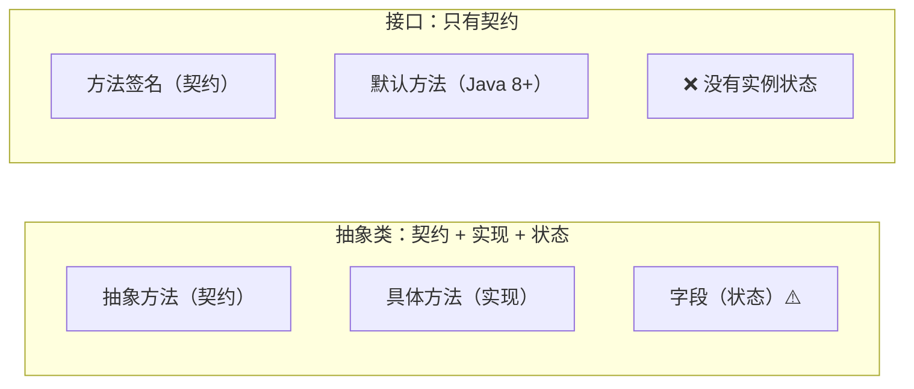
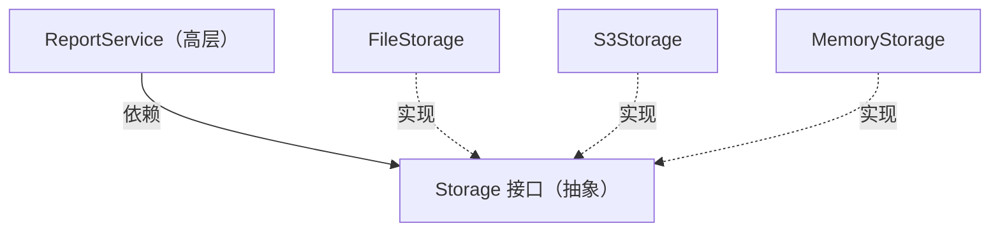

# 第 28 章 · 接口

**简体中文** ｜ [English](./28-interface.en-US.md)

---

> 第 26 章的继承有个隐藏问题：**父类同时干了两件事**——定义契约（"子类必须有 `speak()`"）和提供实现（"默认这样 `speak`"）。这两件事被绑在一起，于是你想要契约就得连实现一起收下，还得接受单继承的限制。
>
> **接口把它们拆开了**：只留契约，不给实现。这个"少即是多"的减法，换来了一个关键能力——**一个类可以实现任意多个接口**。`Duck` 可以同时是 `Flyable`、`Swimmable`、`Walkable`，而它只能继承一个 `Animal`。
>
> 但故事没那么简单。**Java 8 引入默认方法后，接口又有了实现，菱形冲突随之回归**——实测中，同时实现两个带同名默认方法的接口会直接编译报错：`类 C 从类型 A 和 B 中继承了 hello() 的不相关默认值`。
>
> 那为什么这不算走了回头路？**因为接口始终不允许实例状态**。菱形问题真正无解的部分是"状态被继承多份"，而行为冲突编译器可以强制你解决。这一条区分，是理解整章的钥匙。

## 1. 学习目标

本章结束后，你将能够：

- 说清**接口与抽象类的本质区别**，以及为什么"只有契约"反而更强大；
- 解释**为什么可以实现多个接口，却只能继承一个类**；
- 说明 **Java 8 默认方法**带来了什么、又为何没有重蹈多继承的覆辙；
- 使用 **C# 显式接口实现**解决同名冲突，并理解它与 Java 方案的差异；
- 用**依赖倒置**和**接口隔离**两条原则设计出可测试、可替换的代码。

---

## 2. 为什么会出现这个概念

### 继承的困境：契约与实现被捆绑

```java
abstract class Animal {
    abstract String speak();              // 契约：子类必须实现
    String eat() { return "在吃东西"; }    // 实现：子类直接继承
}
```

现在来了个新需求：**鸭子既能飞又能游**。

```java
class Bird   { String fly()  { return "飞"; } }
class Fish   { String swim() { return "游"; } }
class Duck extends Bird, Fish { }        // ✗ Java 不允许多继承
```

**为什么不允许**？第 26 章讲过——菱形问题的根源是**状态被继承多份**。如果 `Bird` 和 `Fish` 都有 `int energy` 字段，`Duck` 就会有两份，改哪个都不对。

### 接口的答案：把契约剥离出来

```java
interface Flyable   { String fly(); }     // 只有契约，没有字段、没有实现
interface Swimmable { String swim(); }
interface Walkable  { String walk(); }

class Duck extends Animal implements Flyable, Swimmable, Walkable {
    // 继承一个类（拿实现），实现多个接口（拿契约）
}
```

**实测**：

```text
class Duck extends Animal implements Flyable, Swimmable, Walkable
唐老鸭 能: 飞 游 走
```

**因为接口没有状态，多实现就不会产生"两份字段"的问题**——这就是 Java 敢让接口无限多实现、却坚决禁止多继承类的原因。

### 更深层的价值：面向接口编程

```java
// ❌ 依赖具体实现
class ReportService {
    private MySQLDatabase db = new MySQLDatabase();   // 焊死了
}

// ✅ 依赖契约
class ReportService {
    private Database db;                               // 接口
    ReportService(Database db) { this.db = db; }       // 换实现不用改这个类
}
```

| | 依赖具体实现 | 依赖接口 |
|---|---|---|
| 换数据库 | 改 `ReportService` | **不用改** |
| 单元测试 | 得连真数据库 | **注入假实现** |
| 并行开发 | 必须等数据库层写完 | **定好接口就能各写各的** |

> **一句话**：接口把"**是什么**"（契约）和"**怎么做**"（实现）分开，让依赖建立在稳定的契约上，而不是易变的实现上。

---

## 3. 底层原理

### 接口 vs 抽象类：核心差异



| 特性 | 抽象类 | 接口 |
|------|--------|------|
| 能有几个 | **1 个**（单继承） | **任意多个** |
| 实例字段 | ✅ 可以 | ❌ **不可以** |
| 构造函数 | ✅ 可以 | ❌ 不可以 |
| 方法实现 | ✅ 可以 | Java 8+ 默认方法 |
| 表达的关系 | **is-a**（是一种） | **can-do**（能做什么） |

**选择标准很直白**：

```text
「Dog 是一种 Animal」        → 抽象类（is-a，且需要共享状态和实现）
「Dog 能被序列化」           → 接口（can-do，只是一种能力）
```

### ⚠️ Java 8 默认方法：菱形问题的回归

Java 8 给接口加上了**默认方法**，动机很实际：

```java
interface Collection<E> {
    // Java 8 想给所有集合加上 stream() 方法
    // 但接口一旦加新方法，所有已有实现类都会编译失败
    default Stream<E> stream() { ... }    // 默认方法：已有实现类不受影响
}
```

**这解决了"接口无法演进"的老问题**——但也把菱形冲突带了回来。

**实测**：

```java
interface A { default String hello() { return "A"; } }
interface B { default String hello() { return "B"; } }
class C implements A, B { }               // ⚠️ 不写 hello() 会怎样？
```

```text
编译错误：类 C 从类型 A 和 B 中继承了 hello() 的不相关默认值
```

**编译器强制你显式解决**：

```java
class C implements A, B {
    public String hello() {
        return A.super.hello() + "+" + B.super.hello();   // 专为此而生的语法
    }
}
// 实测输出：A+B
```

### 为什么这不算走了回头路

**关键在于：接口仍然不允许实例状态**（实测）：

```java
interface Counter {
    int LIMIT = 100;        // ⚠️ 这不是实例字段！自动是 public static final（常量）
}
```

**两种冲突的性质完全不同**：

| | 行为冲突（默认方法） | 状态冲突（多继承字段） |
|---|---|---|
| 表现 | 两个同名方法 | 两份同名字段 |
| 能否解决 | ✅ **编译器强制你选一个** | ❌ **无解**——改哪份都不对 |
| 语法支持 | `A.super.hello()` | C++ 只能用虚继承，代价高昂 |

> **这就是接口的底线**：**行为可以有默认值，状态绝对不行**。默认方法带来的冲突有明确的解决语法，而状态冲突从根上就没有正确答案。Java 8 踩的是钢丝，但踩住了。

### 结构化 vs 名义化：两种契约风格

```text
名义化（Java / C# / C++ 继承）：必须显式声明「我实现了这个接口」
结构化（Python Protocol / Go / C++20 Concept）：长得像就算
```

**C++20 Concept 实测**：

```cpp
template <typename T>
concept Speaker = requires(const T& t) {
    { t.speak() } -> std::convertible_to<std::string>;
};

struct Dog   { std::string speak() const { return "汪！"; } };
struct Robot { std::string speak() const { return "滴滴"; } };
struct Rock  { };                          // 没有 speak()
```

```text
Speaker<Dog>   = true
Speaker<Robot> = true
Speaker<Rock>  = false      ← 编译期就能判断
makeSpeak(Rock{})           → 编译错误：constraint not satisfied
```

**Dog 和 Robot 没有任何共同基类**，却都满足 `Speaker`。

| | 名义化 | 结构化 |
|---|---|---|
| 是否需要声明 | ✅ 必须 `implements` | ❌ 不需要 |
| 适配第三方类型 | 需要适配器 | **直接就能用** |
| 意图是否明确 | ✅ 一眼看出设计意图 | 靠命名和文档 |
| 误匹配风险 | 低 | 同名不同义时会误判 |

> **趋势是两者融合**：Python 的 `Protocol`、C++20 的 `Concept` 都在给结构化契约加上**编译期/静态检查**，试图兼得灵活与安全（呼应第 27 章的鸭子类型讨论）。

### 依赖倒置：接口最重要的应用

**传统的依赖方向**：高层调用低层，于是高层依赖低层。

```text
ReportService  ──依赖──►  MySQLDatabase       ← 换数据库要改 ReportService
```

**依赖倒置后**：两者都依赖抽象。



**实测**（Python，用 `Protocol` 定义契约）：

```text
同一个 ReportService，换不同的 Storage：
  FileStorage     → 写入文件: 报表[月度]
  S3Storage       → 上传到 S3: 报表[月度]
  MemoryStorage   → 存进内存: 报表[月度]

ReportService 的代码一个字都不用改
```

> **这是单元测试的基础**：生产环境注入 `S3Storage`，测试时注入 `MemoryStorage`。**没有接口，就没法在不碰真实资源的前提下测试业务逻辑**。

---

## 4. JavaScript

**JavaScript 没有接口关键字**——它是鸭子类型语言，"契约"靠约定和文档维系。

### 三种表达契约的方式

**① 纯约定**（最常见）：

```javascript
// 约定：任何 Storage 都要有 save 方法
class ReportService {
  constructor(storage) {
    this.storage = storage;      // 只要有 save 就行
  }
  generate(content) {
    return this.storage.save(content);
  }
}
```

**② 运行时检查**：

```javascript
function assertStorage(obj) {
  if (typeof obj?.save !== "function") {
    throw new TypeError("需要实现 save() 方法");
  }
}
```

**③ TypeScript 的 `interface`**（结构化，编译期检查）：

```typescript
interface Storage {
  save(data: string): string;
}

class FileStorage {                  // 注意：不需要写 implements
  save(data: string) { return `写入: ${data}`; }
}

const s: Storage = new FileStorage();   // ✓ 结构匹配就通过
```

> **TypeScript 的接口是纯编译期的**——编译成 JavaScript 后完全消失，运行时不存在任何接口检查。这与 Java 的接口有本质区别。

### 语言内置的"隐式契约"

JavaScript 用**特殊方法名**定义契约，实现了就能接入语言特性：

```javascript
class Range {
  constructor(start, end) { this.start = start; this.end = end; }
  *[Symbol.iterator]() {                        // 实现迭代协议
    for (let i = this.start; i < this.end; i++) yield i;
  }
}

[...new Range(1, 5)];        // [1, 2, 3, 4] ← for...of、展开语法都能用
```

**常见的内置协议**：

| 协议 | 方法 | 作用 |
|------|------|------|
| 可迭代 | `[Symbol.iterator]` | `for...of`、展开语法 |
| 序列化 | `toJSON()` | `JSON.stringify` |
| 字符串化 | `toString()` | 字符串拼接 |
| 异步迭代 | `[Symbol.asyncIterator]` | `for await...of` |

> **注意事项**：JavaScript 的"接口"没有任何强制力。团队协作时，**用 TypeScript 或至少写清楚 JSDoc**——否则契约只存在于口头约定里。

---

## 5. Python

Python 有两套接口方案，分别对应名义化和结构化。

### ① `ABC`：名义化契约

```python
from abc import ABC, abstractmethod

class Storage(ABC):
    @abstractmethod
    def save(self, data: str) -> str: ...

class FileStorage(Storage):              # 必须显式继承
    def save(self, data): return f"写入: {data}"

# Storage()                              # TypeError: 不能实例化抽象类
```

### ② `Protocol`：结构化契约（Python 3.8+，推荐）

```python
from typing import Protocol

class Storage(Protocol):
    def save(self, data: str) -> str: ...

class FileStorage:                       # ⚠️ 不需要继承 Storage
    def save(self, data): return f"写入: {data}"

def use(s: Storage): return s.save("data")
use(FileStorage())                        # ✓ 类型检查器认可
```

**实测**：

```text
FileStorage 的父类: ['object']    ← 完全没继承 Storage
但类型检查器认可它满足 Storage 契约
```

### 依赖倒置的完整实测

```python
class ReportService:
    def __init__(self, storage: Storage):     # 注入的是契约
        self.storage = storage
    def generate(self, content):
        return self.storage.save(f"报表[{content}]")
```

```text
同一个 ReportService，换不同的 Storage：
  FileStorage     → 写入文件: 报表[月度]
  S3Storage       → 上传到 S3: 报表[月度]
  MemoryStorage   → 存进内存: 报表[月度]
```

### 怎么选

| 场景 | 用 `ABC` | 用 `Protocol` |
|------|:-------:|:------------:|
| 你控制所有实现类 | ✅ | ✅ |
| 要适配第三方类型 | ❌ 得写适配器 | ✅ |
| 需要提供部分实现 | ✅ | ❌ |
| 想在实例化时就报错 | ✅ | ❌ 只有静态检查 |
| 表达"能做什么" | 一般 | ✅ **更贴切** |

> **注意事项**：默认的 `Protocol` **不能用于 `isinstance`**（第 27 章实测过会抛 `TypeError`），需要加 `@runtime_checkable`。而且运行时检查**只看方法名是否存在，不检查签名**。

---

## 6. Java

Java 的接口经历了三次演进，每次都在回答"接口能不能有实现"。

```java
public interface Storage {
    String save(String data);                             // 抽象方法（Java 1.0）

    default String saveAll(List<String> items) {          // 默认方法（Java 8）
        return items.stream().map(this::save).collect(joining("; "));
    }

    static Storage inMemory() { return d -> "内存: " + d; }  // 静态方法（Java 8）

    private String log(String s) { return "[LOG] " + s; }   // 私有方法（Java 9）
}
```

| 版本 | 新增 | 动机 |
|------|------|------|
| 1.0 | 抽象方法 + 常量 | 纯契约 |
| **8** | **默认方法**、静态方法 | **让接口能演进**（给 `Collection` 加 `stream()`） |
| 9 | 私有方法 | 让多个默认方法能共享代码 |

### ⚠️ 默认方法冲突（实测）

```java
interface A { default String hello() { return "A"; } }
interface B { default String hello() { return "B"; } }

class C implements A, B { }
// 编译错误：类 C 从类型 A 和 B 中继承了 hello() 的不相关默认值

class C implements A, B {
    public String hello() { return A.super.hello() + "+" + B.super.hello(); }
}
// 输出：A+B
```

**冲突解决的三条规则**：

```text
① 类的实现 > 接口的默认方法          （具体类总是赢）
② 子接口的默认方法 > 父接口的         （更具体的赢）
③ 平级冲突 → 编译错误，必须显式指定    （实测的情况）
```

### 函数式接口与 lambda

```java
@FunctionalInterface                    // 只有一个抽象方法
interface Transformer { String apply(String s); }

Transformer upper = s -> s.toUpperCase();     // lambda 就是接口的实现
```

> **这是 Java 8 最大的实用改进**：`Runnable`、`Comparator`、`Function` 都是函数式接口，让 Java 有了轻量的"传递行为"能力。

### 标记接口

```java
public class Data implements Serializable { }    // 接口里一个方法都没有
```

> **标记接口**只用于给类"打标签"，让运行时能判断类型。现代 Java 更推荐用**注解**（`@Entity`）代替，但 `Serializable`、`Cloneable` 等历史遗留仍在广泛使用。

> **注意事项**：**不要因为"接口现在能有实现了"就把它当抽象类用**。默认方法的设计意图是**接口演进**，不是提供实现基类。判断标准仍然是：需要共享状态就用抽象类，只定义能力就用接口。

---

## 7. C++

C++ 没有 `interface` 关键字，但有两种表达契约的方式，分别对应运行期和编译期。

### ① 纯虚类：运行期契约

```cpp
class Storage {
public:
    virtual ~Storage() = default;                        // 必须虚析构（第 26 章）
    virtual std::string save(const std::string& data) = 0;   // = 0 表示纯虚
};

class FileStorage : public Storage {
public:
    std::string save(const std::string& data) override {
        return "写入: " + data;
    }
};
```

> **只含纯虚函数、没有数据成员的类，就是 C++ 版的接口。** 由于 C++ 支持多继承，可以同时继承多个这样的"接口类"——而且因为它们没有状态，不会引发菱形问题（与 Java 的推理完全一致）。

### ② Concept：编译期契约（C++20）

```cpp
#include <concepts>

template <typename T>
concept Speaker = requires(const T& t) {
    { t.speak() } -> std::convertible_to<std::string>;
};

template <Speaker T>
std::string makeSpeak(const T& t) { return t.speak(); }
```

**实测**：

```text
struct Dog   { std::string speak() const; };
struct Robot { std::string speak() const; };
struct Rock  { };                              // 没有 speak()

Speaker<Dog>   = true
Speaker<Robot> = true
Speaker<Rock>  = false          ← 编译期就能判断
makeSpeak(Rock{})               → 编译错误：constraint not satisfied
```

**Dog 和 Robot 没有共同基类**，却都满足 `Speaker`——这是结构化契约。

### 两者的取舍

| | 纯虚类 | Concept |
|---|---|---|
| 契约检查 | 运行期（vtable） | **编译期** |
| 运行时开销 | 一次间接跳转 | **零** |
| 需要继承 | ✅ | ❌ |
| 能放进同一容器 | ✅ `vector<unique_ptr<Storage>>` | ❌ 类型各异 |
| 错误信息 | 清晰 | C++20 前的模板错误极难读 |

> **Concept 的最大价值之一是错误信息**。C++20 之前，模板参数不满足要求时会喷出几十行不知所云的错误；有了 Concept，编译器能直接说"不满足 `Speaker` 约束"。

> **注意事项**：C++ 的"接口类"必须写 `virtual ~Storage() = default`——否则通过基类指针删除对象时子类析构不会被调用（第 26 章的坑）。

---

## 8. C#

C# 的接口能力最丰富，其中**显式接口实现**是它独有的解法。

```csharp
public interface IStorage
{
    string Save(string data);
    string SaveAll(IEnumerable<string> items) =>          // 默认实现（C# 8+）
        string.Join("; ", items.Select(Save));
}
```

### ⚠️ 显式接口实现：C# 独有的冲突解法

**实测**：

```csharp
interface IFlyable   { string Move(); }
interface ISwimmable { string Move(); }

class Duck : IFlyable, ISwimmable
{
    string IFlyable.Move()   => "飞行";      // 只能通过 IFlyable 访问
    string ISwimmable.Move() => "游泳";      // 只能通过 ISwimmable 访问
    public string Move()     => "走路";      // 类自己的公开方法
}
```

```text
((IFlyable)d).Move()   = 飞行
((ISwimmable)d).Move() = 游泳
d.Move()               = 走路

同一个对象，三种不同结果，取决于「通过哪个接口访问」
```

**这与 Java 的方案形成鲜明对比**：

| | Java | C# |
|---|---|---|
| 同名方法冲突 | 只能给**一个**实现 | 可以给**各自不同**的实现 |
| 解决语法 | `A.super.hello()` 手工合并 | `string IFlyable.Move()` 分别实现 |
| 调用时 | 结果唯一 | 取决于通过哪个接口访问 |

### 显式实现的另一个用途：隐藏方法

```csharp
class UserRepo : IDisposable
{
    void IDisposable.Dispose() { /* 释放资源 */ }
}
```

**实测**：

```text
repo.Dispose()                  → 编译错误（类的公开 API 里没有）
((IDisposable)repo).Dispose()   → 可以调用
```

> **让"实现细节型"接口不污染类的公开 API**。`IDisposable`、`IEnumerator` 这类接口的方法通常不希望用户直接调用，显式实现正好合适。

### 其他特性

```csharp
// 泛型接口 + 协变逆变（第 29 章详述）
public interface IReadOnly<out T> { T Get(); }

// 接口可以继承多个接口
public interface IRepository<T> : IReadable<T>, IWritable<T>, IDisposable { }
```

> **注意事项**：C# 8 的默认接口实现与 Java 8 类似，但**默认实现只能通过接口类型访问**，不会出现在类的公开 API 里——这个细节让它比 Java 的默认方法更"干净"。

---

## 9. SQL

数据库里"接口"的对应物是**视图**——它把稳定的契约与易变的表结构分开。

### ① 视图即接口

```sql
-- 底层表结构（实现细节，随时可能变）
CREATE TABLE student_v2 (
    id INTEGER PRIMARY KEY, full_name TEXT, score_raw INTEGER, deleted INTEGER DEFAULT 0
);

-- 视图 = 对外的稳定契约
CREATE VIEW student AS
SELECT id, full_name AS name, score_raw AS score
FROM student_v2 WHERE deleted = 0;
```

**应用代码只查视图**：

```sql
SELECT name, score FROM student WHERE score >= 60;
```

> **表结构改了（改列名、加软删除、拆表），只要视图定义跟着调整，所有查询一行都不用改**——这与代码里"依赖接口而非实现"是同一个道理（呼应第 25 章的封装）。

### ② 存储过程：更严格的接口

```sql
-- 只暴露操作，完全隐藏表结构
CREATE PROCEDURE enroll_student(IN p_name TEXT, IN p_score INT)
BEGIN
    IF p_score < 0 OR p_score > 100 THEN
        SIGNAL SQLSTATE '45000' SET MESSAGE_TEXT = '分数必须在 0..100';
    END IF;
    INSERT INTO student_v2 (full_name, score_raw) VALUES (p_name, p_score);
END;
```

配合权限，就是真正强制的接口（第 25 章讲过，这是唯一运行时强制的封装）：

```sql
GRANT EXECUTE ON PROCEDURE enroll_student TO app_user;
REVOKE ALL ON student_v2 FROM app_user;      -- 表本身不给权限
```

### ③ 依赖倒置在数据访问层

```text
❌ 应用直接写 SQL 操作表     →  表结构一变，应用到处改
✅ 应用调用视图/存储过程      →  数据库内部随便重构
```

| 层次 | 契约 | 实现 |
|------|------|------|
| 应用代码 | Repository 接口 | 具体的 SQL 实现 |
| 数据库 | 视图 / 存储过程 | 实际的表结构 |

> **工程提醒**：**视图不是免费的**。多层嵌套视图会让查询计划变得难以优化，也会掩盖真实的表关联复杂度。**契约层要薄**——这与代码里"接口不要过度设计"是同一条经验。

---

## 10. 五语言横向对比

### ① 接口机制对比

| 特性 | JavaScript | Python | Java | C++ | C# |
|------|-----------|--------|------|-----|-----|
| 接口关键字 | ❌（TS 有） | ❌ | `interface` | 纯虚类 / `concept` | `interface` |
| 契约风格 | 结构化 | **两者都有** | 名义化 | 纯虚类名义 / Concept 结构 | 名义化 |
| 能实现几个 | — | 任意 | **任意** | 任意 | **任意** |
| 默认实现 | — | ❌ | **Java 8+** | ❌ | **C# 8+** |
| 同名冲突解法 | — | MRO | `A.super.m()` | 显式限定 | **各自独立实现** |
| 检查时机 | 运行时 | 静态检查/运行时 | **编译期** | **编译期** | **编译期** |
| 静态方法 | — | ❌ | ✅ Java 8+ | ✅ | ✅ |

### ② 两条设计分歧

**分歧一：接口该不该有实现**

```text
纯契约（Java 1-7 / C# 1-7）：干净，但接口无法演进
带默认实现（Java 8+ / C# 8+）：能演进，但引入了行为冲突
```

> **推动改变的是现实压力**：Java 8 要给所有 `Collection` 加 `stream()`，若无默认方法，全世界的实现类都会编译失败。**这是"向后兼容"逼出来的设计**。

**分歧二：契约要不要显式声明**

```text
名义化（Java / C#）：必须写 implements，意图清晰，但无法适配第三方类型
结构化（Python Protocol / C++20 Concept / TS）：长得像就行，灵活但意图隐晦
```

### ③ 共同点与差异根源

**共同点**：所有语言都提供了"定义能力契约"的方式，都允许一个类型满足多个契约，也都在朝"结构化 + 静态检查"融合。

**差异根源**：

- **Java / C# 用 `interface` 关键字**，因为它们禁止多继承，必须提供一条表达"多能力"的路；
- **C++ 用纯虚类**，因为它本来就支持多继承——**无状态的纯虚类多继承是安全的**，不需要专门的语法；
- **Python 同时提供 `ABC` 和 `Protocol`**，覆盖名义化与结构化两种需求，反映了它"给你选择"的哲学；
- **JavaScript 什么都没有**，因为鸭子类型下契约本就是隐式的——**这也是 TypeScript 流行的核心原因之一**；
- **C# 的显式接口实现**是独有的，源于它对"同名不同义"这个真实问题给出的更彻底的答案。

---

## 11. 底层实现对比

| 语言 · 机制 | 实现方式 | 运行时开销 |
|------------|---------|-----------|
| **Java 接口调用** | itable（接口方法表），比类的 vtable 多一层查找 | 略高于虚方法调用，JIT 可优化（第 27 章） |
| **Java 默认方法** | 编译进接口的 `Class` 文件，实现类未覆盖时链接到它 | 与普通虚方法相同 |
| **C# 接口调用** | 接口映射表 | 与 Java 类似 |
| **C# 显式实现** | 生成特殊命名的私有方法，只在接口映射表里可见 | 相同 |
| **C++ 纯虚类** | 就是普通 vtable（第 27 章） | 一次间接跳转 |
| **C++ Concept** | **纯编译期检查**，代码生成后不留痕迹 | **零** |
| **Python Protocol** | 静态检查器的概念，运行时**完全不存在** | **零**（运行时无检查） |
| **TypeScript interface** | 纯编译期，编译后消失 | **零** |

**一个值得注意的分野**：

```text
运行时存在的接口（Java/C#/C++ 纯虚类）→ 可以 instanceof、可以放进同一容器
纯编译期的契约（Concept/Protocol/TS）  → 零开销，但运行时无从检查
```

> 这正好对应第 27 章的"动态派发 vs 静态派发"——**契约在哪个阶段检查，决定了它有没有运行时代价**。

---

## 12. 性能分析

### 接口调用的开销

| 调用方式 | 相对开销 | 说明 |
|---------|---------|------|
| 直接调用非虚方法 | 1.00× | 编译期绑定，可内联 |
| 虚方法调用 | 1.13–1.15×（第 27 章实测） | 一次 vtable 跳转 |
| **Java 接口调用** | 略高于虚方法 | itable 比 vtable 多一层 |
| **接口 · 单一实现** | **0.98–1.00×**（第 27 章实测） | JIT 完全去虚化 |
| C++ Concept / Python Protocol | **1.00×** | 纯编译期，无运行时痕迹 |

> **结论与第 27 章一致**：**接口调用的开销取决于实现类的多样性，而不是"用了接口"这件事本身**。单一实现时 JIT 能完全去虚化。

### 什么时候接口真的会拖慢

```text
① 调用点遇到多种实现类 → 无法去虚化 + 分支预测失败（第 27 章实测 1.13–1.17×）
② 极热的内层循环 → 固定开销占比被放大
③ 接口方法体极小 → 派发开销相对更显著
```

**对应的手段**：

```java
final class FastImpl implements Storage { }   // final/sealed 帮助去虚化
```

> ⚠️ 但这几乎从来不是真实项目的瓶颈。**用"接口有开销"作为不用接口的理由，是典型的过早优化**——你损失的可测试性和可替换性，远比那几个百分点值钱。

---

## 13. 工程实践

| 场景 | ✅ 推荐 | ❌ 不推荐 | 原因 |
|------|--------|----------|------|
| 表达"能做什么" | 接口 | 抽象类 | can-do 关系，且能多实现 |
| 表达"是一种" + 共享状态 | 抽象类 | 接口 | 接口不能有实例字段 |
| 依赖外部资源（DB/网络） | **定义接口，注入实现** | 直接 new 具体类 | 可测试、可替换 |
| 需要给接口加新方法 | 默认方法 | 直接加抽象方法 | 否则所有实现类编译失败 |
| 适配第三方类型 | `Protocol` / Concept | `ABC` / 名义接口 | 改不了别人的类 |
| C# 中同名不同义 | **显式接口实现** | 强行合并成一个方法 | 语义本来就不同 |
| C++ 接口类 | **`virtual ~Base() = default`** | 非虚析构 | 否则子类析构被跳过 |
| 只有一个实现且不会变 | **不要定义接口** | 为每个类配一个接口 | 过度设计 |
| 接口方法过多 | 拆成多个小接口 | 一个大而全的接口 | 接口隔离原则 |

### 接口隔离原则

```java
// ❌ 胖接口：实现类被迫实现用不到的方法
interface Worker {
    void work();
    void eat();
    void sleep();
}
class Robot implements Worker {
    public void eat() { throw new UnsupportedOperationException(); }   // 机器人不吃饭
}

// ✅ 拆成小接口
interface Workable { void work(); }
interface Feedable { void eat(); }
class Robot implements Workable { }                     // 只实现需要的
class Human implements Workable, Feedable { }
```

> **判断信号**：如果实现类里出现了 `throw new UnsupportedOperationException()`，说明接口太胖了。

### 什么时候不需要接口

```text
- 只有一个实现，且可预见不会有第二个
- 纯数据结构（用 record / dataclass）
- 内部工具类，不跨模块使用
```

> **"为每个类配一个接口"是常见的过度设计**。接口的价值在于"有多种实现"或"需要替换实现（测试）"——**没有这两个需求时，接口只是多了一层无意义的间接**。

---

## 14. 最佳实践

- **优先面向接口编程**：参数、返回值、字段声明用接口类型。
- **接口要小**：一个接口只描述一种能力，遵守接口隔离原则。
- **需要共享状态就用抽象类**，只定义能力就用接口。
- **默认方法用于接口演进**，不要拿它当抽象类的替代品。
- **C++ 的接口类必须有虚析构函数**。
- **C# 中语义不同的同名方法用显式接口实现**，而不是强行合并。
- **Python 优先用 `Protocol`**——尤其是需要适配第三方类型时。
- **不要为只有一个实现的类定义接口**，那是过度设计。
- **JavaScript 项目上 TypeScript**，否则契约只存在于口头约定里。

---

## 15. 常见坑

**坑 1 · Java 默认方法的菱形冲突**

```java
class C implements A, B { }    // ✗ 编译错误：继承了不相关的默认值
class C implements A, B {
    public String hello() { return A.super.hello(); }   // ✓ 显式指定
}
```

**坑 2 · 把接口当抽象类用**

```java
interface Service {
    default void step1() { ... }     // ⚠️ 塞了一堆实现
    default void step2() { ... }     // 这时候该用抽象类了
}
```
**如何避免**：默认方法是为**接口演进**准备的，不是提供实现基类。

**坑 3 · C++ 接口类忘记虚析构**

```cpp
class Storage { public: virtual void save() = 0; };            // ✗ 没有虚析构
class Storage { public: virtual ~Storage() = default; ... };   // ✓
```

**坑 4 · Python 的 `Protocol` 不能直接 `isinstance`**

```python
isinstance(obj, MyProtocol)     # ✗ TypeError（第 27 章实测）

@runtime_checkable              # ✓ 加这个装饰器
class MyProtocol(Protocol): ...
```

**坑 5 · 胖接口**

```java
class Robot implements Worker {
    public void eat() { throw new UnsupportedOperationException(); }   // ⚠️ 信号
}
```

**坑 6 · 为每个类配一个接口**

```text
UserService / UserServiceImpl
OrderService / OrderServiceImpl      ← 每个接口只有一个实现，纯粹的样板
```
**如何避免**：等到真的出现第二个实现，或真的需要 mock 时再提取接口。

**坑 7 · TypeScript 接口在运行时不存在**

```typescript
if (obj instanceof Storage) { }     // ✗ 编译错误：interface 不是运行时的值
if (typeof obj.save === "function") { }   // ✓ 运行时只能这样检查
```

---

## 16. 面试题

**基础**

1. 接口和抽象类有什么区别？分别在什么时候用？
2. 为什么可以实现多个接口，却只能继承一个类？
3. 什么是面向接口编程？它有什么好处？

**中级**

4. **Java 8 的默认方法解决了什么问题？又带来了什么问题？**
5. **既然默认方法让接口有了实现，为什么这不算重蹈多继承的覆辙？**
6. 什么是依赖倒置原则？举例说明它如何提升可测试性。

**高级**

7. **C# 的显式接口实现能做什么 Java 做不到的事？**
8. 名义化契约和结构化契约有什么区别？各有什么优劣？
9. 什么是接口隔离原则？如何判断一个接口是否太胖？

---

## 17. 练习

**基础**

1. 用六门语言各定义一个 `Storage` 契约和两个实现。
2. 实现一个类，让它同时满足三个不同的接口。
3. 把一段"直接 new 具体类"的代码改成依赖注入。

**提高**

4. **复现 Java 默认方法的菱形冲突**，并用 `A.super.m()` 解决它。
5. 用 C# 的显式接口实现，让同一个对象通过不同接口给出不同结果。
6. 用 Python 的 `Protocol` 适配一个你无法修改的第三方类。

**挑战**

7. 用 C++20 Concept 定义一个契约，验证不满足时的编译错误信息。
8. 找出你项目里一个"胖接口"，按接口隔离原则拆分它。
9. 设计一套数据访问层：应用只依赖 Repository 接口，分别提供数据库实现和内存实现，并用后者写单元测试。

---

## 18. 本章总结

**一句话总结**：接口把父类捆绑的两件事——**定义契约**与**提供实现**——拆开，只保留契约；正因为**没有实例状态**，一个类才能实现任意多个接口而不引发菱形问题；Java 8 的默认方法让接口有了行为（从而能够演进），也带回了行为冲突，但**编译器强制你解决**，且**状态始终被禁止**——这条底线是接口没有重蹈多继承覆辙的根本原因。

**核心知识点**

- **接口 = 只有契约**：表达 can-do，抽象类表达 is-a。
- **能多实现的原因是没有状态**（实测：接口字段自动是 `public static final` 常量）。
- **Java 8 默认方法的冲突**（实测）：同时实现两个带同名默认方法的接口会编译报错，须用 `A.super.hello()` 显式指定。
- **行为冲突可解，状态冲突无解**——这是接口的底线。
- **C# 显式接口实现**（实测）：同一对象通过不同接口给出**三种不同结果**，这是 Java 做不到的。
- **C++20 Concept**（实测）：`Speaker<Dog>=true`、`Speaker<Rock>=false`，编译期判断的结构化契约。
- **依赖倒置**（实测）：换三种 `Storage` 实现，`ReportService` 一个字不用改——这是单元测试的基础。

**检查清单**

- [ ] 我能说清接口与抽象类的选择标准。
- [ ] 我理解"没有状态"为什么是多实现的前提。
- [ ] 我知道默认方法解决了什么、又带来了什么。
- [ ] 我会用依赖倒置让代码可测试。
- [ ] 我能判断一个接口是不是太胖了。

**下一章预告**：接口解决了"不同类型、相同能力"的问题。但还有一类重复它管不了：`List<String>`、`List<Integer>`、`List<User>`——逻辑完全相同，只有元素类型不同，难道要为每种类型写一份？**泛型**给出的答案是把类型本身变成参数。第 29 章将对比三种截然不同的实现路线——**C++ 的模板（编译期生成多份代码）、Java 的擦除（运行时类型信息被抹掉）、C# 的具化（运行时保留完整类型）**——并实测它们在性能和能力上的真实差异。

---

## 19. 延伸阅读

- <a href="https://en.wikipedia.org/wiki/Interface_(object-oriented_programming)" target="_blank" rel="noopener">Wikipedia：接口（面向对象）</a> — 概念定义与各语言实现。
- <a href="https://en.wikipedia.org/wiki/Dependency_inversion_principle" target="_blank" rel="noopener">Wikipedia：依赖倒置原则</a> — SOLID 中的 D，接口最重要的应用。
- <a href="https://en.wikipedia.org/wiki/Interface_segregation_principle" target="_blank" rel="noopener">Wikipedia：接口隔离原则</a> — SOLID 中的 I，如何避免胖接口。
- <a href="https://docs.oracle.com/javase/tutorial/java/IandI/defaultmethods.html" target="_blank" rel="noopener">Oracle 教程 · 默认方法</a> — 含冲突解决规则的官方说明。
- <a href="https://dev.java/learn/interfaces/" target="_blank" rel="noopener">dev.java · Interfaces</a> — Oracle 官方 Java 学习站点。
- <a href="https://learn.microsoft.com/en-us/dotnet/csharp/fundamentals/types/interfaces" target="_blank" rel="noopener">Microsoft Learn · C# 接口</a> — 含显式接口实现的完整说明。
- <a href="https://en.cppreference.com/w/cpp/language/constraints" target="_blank" rel="noopener">cppreference · 约束与 Concept</a> — C++20 Concept 的权威参考。
- <a href="https://docs.python.org/3/library/typing.html#typing.Protocol" target="_blank" rel="noopener">Python 文档 · typing.Protocol</a> — 结构化子类型的官方说明。
