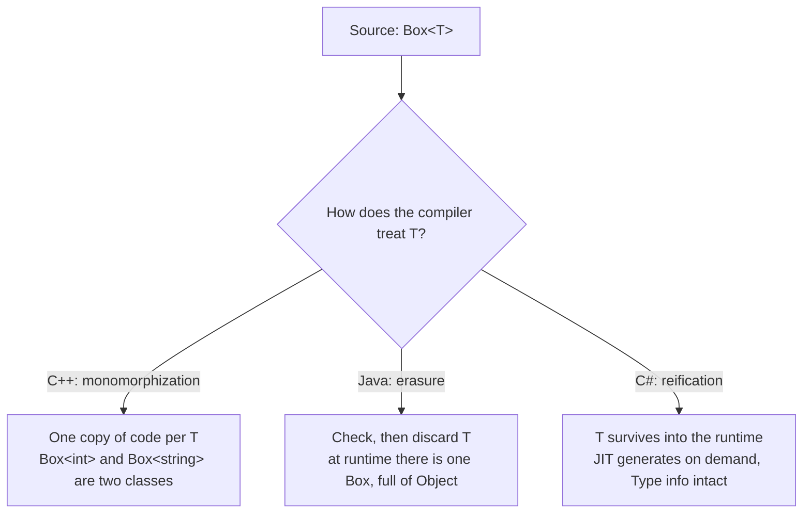

# Chapter 29 · Generics

[简体中文](./29-generics.md) ｜ **English**

---

> Chapter 28 ended with a question: `List<String>`, `List<Integer>`, `List<Student>` — identical logic, differing only in element type. Must we write it three times? Before generics, the Java answer was to stuff `Object` into a `List`: anything goes in, and getting it out relies on casts and luck.
>
> Generics answer differently: **make the type itself a parameter**. Write `List<T>` once; `T` is fixed at the point of use. Reuse and type safety, together for the first time.
>
> But our languages split three ways on the question "where does that type parameter end up?" **C++ spends it at compile time**, generating one dedicated copy of the code per type (templates); **Java checks it at compile time and then throws it away** (erasure); **C# carries it all the way into the runtime** (reification).
>
> One experiment sees through all three routes: add a static field to a generic class and count the copies. Measured — **Java: 1 copy; C#: one per type argument; C++: one per instantiation.** That experiment is the key to this entire chapter.

## 1. Learning Objectives

By the end of this chapter, you will be able to:

- State the problem generics solve: **without them, reuse and type safety are an either/or**;
- Use the "static field experiment" to tell apart the three implementation routes — **erasure, reification, monomorphization** — and explain each trade-off;
- Explain the whole family of limits erasure imposes on Java (no `new T()`, no `T[]`, boxing), and **why Java chose erasure knowing the cost**;
- Write Java wildcards correctly with **PECS**, and explain **why array covariance is dangerous and generics default to invariance**;
- Constrain template parameters with **C++20 Concepts**, and weigh monomorphization's performance gains against code bloat.

---

## 2. Why This Concept Exists

### The two old roads before generics

**Road one: copy the code for every type.**

```java
class IntList     { int get(int i) { ... } }
class StringList  { String get(int i) { ... } }
class StudentList { Student get(int i) { ... } }   // same logic, written three times
```

Fixing one bug means fixing it three times; adding a type means copying it all again — maintenance hell.

**Road two: an `Object` container** (standard practice before Java 1.4):

```java
List names = new ArrayList();       // elements are Object
names.add("Alice");
names.add(42);                      // the compiler doesn't object — anything goes

String s = (String) names.get(1);  // runtime explosion: ClassCastException
```

One copy of the code, but two costs:

| Cost | Symptom |
|------|---------|
| **No type safety** | Wrong types go in unchallenged; the cast blows up at runtime — possibly a hundred thousand lines from the scene of the crime |
| **Boxing** | An `int` must be wrapped into an `Integer` before entering an `Object` container (Chapter 24 covered object-header costs) |

### The generics answer: parameterize the type

```java
class Box<T> {                     // T is a type parameter, like a function's formal parameter
    private final T value;
    Box(T value) { this.value = value; }
    T get() { return value; }
}

Box<String> a = new Box<>("Alice"); // T is fixed at the use site, like passing an argument
Box<Integer> b = new Box<>(90);
String s = a.get();                 // no cast — the compiler knows T = String
Integer n = b.get();
```

**Functions parameterize values; generics parameterize types** — the same idea repeated one level up (echoing Chapter 12).

| | Copying code | `Object` container | Generics |
|---|---|---|---|
| Copies of code | One per type | One | **One source copy** |
| Type checking | ✅ compile time | ❌ blows up at runtime | ✅ **compile time** |
| Casts needed | No | On every read | **No** |

> **In one sentence**: generics free "same logic, different types" from having to choose between **reuse** and **safety**.

---

## 3. How It Works

At the source level our languages look alike. **The real split happens after compilation: where did the type parameter go?**



### The key experiment: how many copies of a static field?

Add a static counter to the generic class, create two `Box<int>` (or `Box<Integer>`) and one `Box<string>` (or `Box<String>`), then count:

**Java** (measured):

```text
Box.created = 2   <- there is no Box<String>.created vs Box<Integer>.created
```

**C#** (measured):

```text
Box<int>.Count = 2, Box<string>.Count = 1   <- the opposite of Java!
```

**C++** (measured):

```text
Box<int>::count = 2, Box<std::string>::count = 1   <- one static member per instantiation
```

Same experiment, three answers — because **the number of classes that exist at runtime differs at the root**: Java has exactly one `Box`; C# and C++ have as many as there are type arguments.

### Route one: Java's erasure

The compiler does all type checking at compile time, then **erases `T` to `Object`** (or to its bound), silently inserting a cast (`checkcast`) at every read site:

```java
// what you write                  // what is actually generated
class Box<T> {                     class Box {
    T value;                           Object value;
    T get() { return value; }          Object get() { return value; }
}                                  }
String s = box.get();              String s = (String) box.get();   // compiler-inserted cast
```

**Measured**:

```text
ArrayList<String> and ArrayList<Integer> are the same Class: true
getClass() = java.util.ArrayList
```

**Why choose erasure?** When Java 5 introduced generics in 2004, the world was full of Java 1.4 code. Erasure makes `List<String>` and the legacy `List` **the same class at the bytecode level** — old and new code interoperate without changing a line. **A design bought with backward compatibility, paid for with runtime amnesia**:

```text
Things erasure makes impossible (all because the runtime doesn't know T):
  new T()                     <- doesn't know whose constructor to call
  new T[10]                   <- doesn't know what array to make
  obj instanceof List<String> <- no such class exists at runtime
  T.class                     <- same reason
  int as a type argument      <- only List<Integer>, i.e. boxing (costs in §12)
```

**Erasure's patch: bridge methods.** When a subclass implements a generic interface, the signatures no longer line up after erasure (`set(String)` vs the erased `set(Object)`), so the compiler quietly generates a forwarding method. **Measured**:

```text
Methods of StringContainer:
  set(String)
  set(Object)   <- compiler-generated bridge method (isBridge() = true)
```

**Erasure is not total** — the most commonly misunderstood point. The type arguments on an object are gone, but **the declared signature stays in the bytecode** (the `Signature` attribute), readable via reflection. **Measured**:

```text
Field declared as List<String> names;
f.getType()        = interface java.util.List           <- erased
f.getGenericType() = java.util.List<java.lang.String>   <- the signature survives!
```

> This is exactly how frameworks like Gson and Jackson can deserialize a `List<Student>` — they read the **declaration-site** signature, not the object. The tool is reflection; Chapter 30 tells that story.

### Route two: C++'s monomorphization

Templates expand **on demand at compile time**: for each type argument used, the compiler emits a dedicated copy of the code. `Box<int>` and `Box<std::string>` are **two entirely unrelated classes**.

**Measured** (inspecting the binary's symbol table with `nm`):

```text
$ nm main | grep max_of | c++filt
0000000100000f84 T double max_of<double>(double, double)
0000000100000f40 T int max_of<int>(int, int)      <- the binary really contains two functions
```

```text
&max_of<int> == &max_of<double>: false             <- even the function addresses differ
typeid(Box<int>)         = 3BoxIiE
typeid(Box<std::string>) = 3BoxINSt3__112basic_...  <- two distinct types
```

**Gain**: inside `Box<int>`, `T` is a genuine `int` — no boxing, no casts, no runtime overhead of any kind, and everything can be inlined.
**Cost**: use 100 types, get 100 copies — **slower compiles, fatter binaries**; and template definitions must live in headers (the compiler needs the source to expand them).

Templates can also do two things generics cannot:

```cpp
std::array<int, 5> a5;   // values as parameters (non-type template parameters)
template <> class Box<bool> { ... };   // a dedicated implementation for one type (specialization)
```

**Measured**: `std::array<int,5>` and `std::array<int,8>` are different types (`typeid` differs) — the length is part of the type.

### Route three: C#'s reification

C# 2.0 (2005) carried no Java-sized compatibility burden — Microsoft **changed the CLR itself**. The bytecode has true generic instructions, and type parameters live on into the runtime.

**Measured**:

```text
typeof(List<int>) == typeof(List<string>): False    <- the opposite of Java
scores.GetType() = System.Collections.Generic.List`1[System.Int32]
```

With full runtime types, everything Java cannot do, C# can. **Measured**:

```csharp
static T Create<T>() where T : new() => new T();   // ✓ new T() just works
```

```text
Create<Student>() -> Name = unnamed, Score = 0
```

The JIT's code-generation strategy is clever (details in §11): **value types each get a dedicated copy of code** (inside `List<int>` it is a true `int`, zero boxing), while **reference types share one copy** (they are all pointers anyway) — C++'s performance and Java's compactness at once.

### Variance: the array lesson and the generics answer

`String` is a subtype of `Object`; is `List<String>` a subtype of `List<Object>`? **Java and C# arrays said "yes" (covariance) — and planted a runtime bomb.** Measured in both:

```java
Object[] arr = new String[1];    // array covariance: the compiler allows it
arr[0] = 42;                     // measured: ArrayStoreException (C#: ArrayTypeMismatchException)
```

Generics learned the lesson and default to **invariance**: `List<Object> l = new ArrayList<String>()` is a straight **compile error** — the same bug moved forward from runtime to compile time.

But total invariance is too rigid (`sum(List<Number>)` could not accept a `List<Integer>`), so the two languages opened two escape hatches:

```java
// Java: use-site variance (wildcards); mnemonic PECS — Producer Extends, Consumer Super
double sum(List<? extends Number> nums)   // read only  -> extends (producer)
void fill(List<? super Integer> sink)     // write only -> super  (consumer)
```

```csharp
// C#: declaration-site variance — the interface declares T as output-only (out) or input-only (in)
IEnumerable<string> strs = new List<string> { "Alice", "Bob" };
IEnumerable<object> objs = strs;    // ✓ measured: IEnumerable<out T> is covariant
```

> **Why does read-only permit covariance?** Whatever comes out of a `List<? extends Number>` is certainly a `Number` (safe); but writing into it, the compiler cannot know whether it is really a `List<Integer>` or a `List<Double>`, so any write might be wrong — hence covariant containers forbid writes. The array mistake was being **covariant and writable at the same time**.

---

## 4. JavaScript

**JavaScript has no generics — and needs none.** Variables carry no types, so one copy of code naturally works for every type (Chapter 27's duck typing, taken to its limit, is "generics for free").

### Dynamic typing = implicit generics

```javascript
const stack = [];
stack.push(90, "Alice", { name: "Bob" });   // one container holds everything

const first = (arr) => arr[0];
first([90, 85]);          // 90
first(["Alice", "Bob"]);  // "Alice"  <- same function, no T declared anywhere
```

### The price of freedom: no error, just silently wrong

**Measured**:

```javascript
const scores = [90, 85, "ninety-eight"];
const total = scores.reduce((a, b) => a + b, 0);
```

```text
sum of [90, 85, "ninety-eight"] = "175ninety-eight"  <- no error, but the result became a string!
```

Worse than Java's `ClassCastException` — **it doesn't even explode**. Wrong data keeps flowing through the system (`90 + 85 = 175`, then `175 + "ninety-eight"` triggers string concatenation; Chapter 10 covered `+` coercion).

### TypeScript: putting the type parameter back

```typescript
function first<T>(arr: T[]): T { return arr[0]; }

first<number>([90, 85]);            // ✓ return type inferred as number
first<number>([90, "eighty-five"]); // ✗ compile error: string is not assignable to number

// Constraint: T must have a length property (like Java's extends, C++'s concept)
function longest<T extends { length: number }>(a: T, b: T): T {
  return a.length >= b.length ? a : b;
}
```

> **Note**: as with `interface` in Chapter 28, **TypeScript generics are purely compile-time** — after compilation to JavaScript, `<T>` vanishes completely; the runtime checks nothing. Of our languages it has the most thorough "erasure": not even a `checkcast` remains.

---

## 5. Python

Python's generics sit in the same camp as TypeScript: **hints written for a type checker; the runtime does not enforce them.**

### `TypeVar` + `Generic`: a generic class

```python
from typing import Generic, TypeVar

T = TypeVar("T")

class Stack(Generic[T]):          # Python 3.12+ can write class Stack[T]: (PEP 695)
    def __init__(self) -> None:
        self._items: list[T] = []
    def push(self, item: T) -> None:
        self._items.append(item)
    def pop(self) -> T:
        return self._items.pop()
```

### The runtime does not check (measured)

```python
s: Stack[int] = Stack()
s.push(90)
s.push("ninety-eight")   # wrong type — the runtime does not care at all!
```

```text
Contents of Stack[int]: [90, 'ninety-eight']
```

Only a static checker (mypy / pyright) objects: `error: Argument 1 to "push" has incompatible type "str"`. **Type safety lives in the toolchain, not in the interpreter.**

### What `Stack[int]` is at runtime (measured)

```text
type(Stack[int]) = _GenericAlias         <- just a wrapper object recording the argument
instance __class__ is still Stack: True  <- erased even more thoroughly than Java
but __orig_class__ remembers: __main__.Stack[int]   <- recoverable if you ask
```

### Constraints and bounds

```python
Num = TypeVar("Num", int, float)          # constraint: only int or float

class Comparable(Protocol):               # bound: "comparable" as a Protocol
    def __lt__(self, other) -> bool: ...

C = TypeVar("C", bound=Comparable)        # like Java's <C extends Comparable>
def max_of(items: list[C]) -> C: ...
```

**Measured**: `max_of([90, 85, 98])` → `98`, `max_of(['Alice', 'Bob'])` → `Bob` — `bound=Comparable` plus Chapter 28's `Protocol` is exactly the "generics + structural contract" combination.

> **Note**: Python 3.9+ writes `list[int]`, `dict[str, int]` directly (PEP 585); no more `from typing import List`. But remember these are **hints only** — measured: `list[int]` happily accepts `append("ninety-eight")`. **Annotations without mypy in CI have zero enforcement power.**

---

## 6. Java

Every feature and every limitation of Java generics flows from the same fact: **erasure**.

### Basic syntax

```java
class Box<T> { ... }                                  // generic class
interface Container<T> { void set(T value); }         // generic interface
static <T extends Comparable<T>> T max(List<T> list)  // generic method + bounded type parameter
Pair<String, Integer> p;                              // multiple type parameters K, V
```

### ⚠️ Raw types: the back door erasure left open (measured)

For 1.4 compatibility Java allows the parameterless **raw type**, which bypasses all generic checks:

```java
List<String> names = new ArrayList<>();
List raw = names;              // raw type — only an unchecked warning
raw.add(42);                   // it went in!
String s = names.get(0);       // measured: ClassCastException
```

This is **heap pollution**: the mistake happens at `add`, the explosion at a faraway `get` — one raw type completely punctures the compile-time guarantee.

### Wildcards and PECS (measured)

```java
static double sum(List<? extends Number> nums) { ... }   // producer: you read  -> extends
static void fill(List<? super Integer> sink) { ... }     // consumer: you write -> super
```

```text
sum(List<Integer>) = 273.0        <- accepts List<Integer>, List<Double>, ...
sum(List<Double>)  = 180.5
fill(List<? super Integer>) -> [90, 85]   <- accepts List<Number>, List<Object>, ...
```

**How to remember**: look at the **parameter's** role — it produces elements for you (you read) → `extends`; it consumes your elements (you write) → `super`; both read and write → no wildcard.

### Erasure's limits and their escape hatches

| Impossible | Why | Escape hatch |
|-----------|-----|--------------|
| `new T()` | constructor unknown | pass a `Supplier<T>` or `Class<T>` |
| `new T[10]` | array type unknown | `(T[]) new Object[10]` or `Array.newInstance(clazz, 10)` |
| `instanceof List<String>` | no such runtime type | only `instanceof List<?>` |
| `List<int>` | type arguments must be reference types | box to `List<Integer>` (costs in §12) |
| per-type static fields | all parameterizations share one class | none — don't design around it (measured in §3) |

> **Note**: Project Valhalla aims to give the JVM value-type generics (`List<int>`), but it has not shipped as of this writing. For hot paths today, use primitive arrays or a dedicated library like fastutil.

---

## 7. C++

C++'s "generics" are **templates** — a decade older than Java/C# generics and far more powerful: not just type parameterization but a **compile-time code-generation machine**.

### Function and class templates

```cpp
template <typename T>
T max_of(T a, T b) { return a > b ? a : b; }

template <typename T>
class Box {
public:
    explicit Box(T v) : value_(std::move(v)) {}
    const T& get() const { return value_; }
private:
    T value_;
};

max_of(90, 85);                               // compiler deduces T = int, emits max_of<int>
max_of(std::string("a"), std::string("b"));   // emits another copy, max_of<string>
```

### Monomorphization: seeing is believing (measured)

```text
$ nm main | grep max_of | c++filt
0000000100000f84 T double max_of<double>(double, double)
0000000100000f40 T int max_of<int>(int, int)
```

**The binary really contains two functions** — direct evidence of "one copy of code per type". Consequently:

- **Template definitions must live in headers**: every use site needs the full source to expand (putting them in a `.cpp` causes link errors — a classic trap, see §15);
- **Heavy use bloats binaries and slows compiles**: the inherent cost of the monomorphization route.

### C++20 Concepts: a contract for template parameters

Before C++20, template parameters had no declared constraints, and an unsatisfied type produced bottomless error spew. Concepts (introduced in Chapter 28) state the contract up front. **Measured**:

```cpp
template <typename T>
concept Addable = requires(T a, T b) { { a + b } -> std::convertible_to<T>; };

template <Addable T>
T sum(T a, T b) { return a + b; }

sum(std::vector<int>{}, std::vector<int>{});   // vector has no operator+
```

```text
error: no matching function for call to 'sum'
note: candidate template ignored: constraints not satisfied [with T = std::vector<int>]
note: because 'std::vector<int>' does not satisfy 'Addable'   <- the reason in one line
```

### Two things only templates can do

```cpp
std::array<int, 5> a5;               // ① non-type template parameters: values as parameters
                                     //    measured: array<int,5> and array<int,8> are different types
template <> class Box<bool> { ... }; // ② specialization: a dedicated implementation for one type
```

The most famous specialization is `std::vector<bool>` — the standard library specializes it into bit-packed storage. **Measured**:

```text
vb[0] has type bool&: false   <- you get a proxy object, not a reference
```

Eight-fold memory savings, but `auto& r = vb[0];` no longer compiles — **specialization changed the interface's semantics**, widely considered a standard-library design mistake (see §15).

> **Note**: templates are Turing-complete (the compiler can compute anything at compile time; before `constexpr`, people really did), but **this chapter uses them only as generics**. The everyday rule: **add a Concept whenever you can** — post-C++20, it is the greatest kindness to your users and your error messages.

---

## 8. C#

C# generics are **first-class citizens of the runtime** — the essential difference from Java.

### Reification: type parameters survive into the runtime (measured)

```csharp
Console.WriteLine(typeof(List<int>) == typeof(List<string>));   // False
Console.WriteLine(scores.GetType());
// System.Collections.Generic.List`1[System.Int32]   <- type argument preserved verbatim
```

### What full runtime types enable (measured)

```csharp
static T Create<T>() where T : new() => new T();     // the new T() Java cannot have

Student s = Create<Student>();       // -> Name = unnamed, Score = 0
default(int);                        // 0 (value type: zero value)
default(string);                     // null (reference type)
```

### The constraint system: richer than Java's extends

```csharp
where T : new()              // must have a parameterless constructor
where T : struct             // must be a value type
where T : class              // must be a reference type
where T : IComparable<T>     // must implement an interface (Java's extends)
where T : Animal, IFlyable, new()   // combinable
```

### Declaration-site variance: out / in (measured)

```csharp
public interface IEnumerable<out T> { ... }   // out: T appears only in outputs -> covariant
public interface IComparer<in T> { ... }      // in:  T appears only in inputs  -> contravariant

IEnumerable<string> strs = new List<string> { "Alice", "Bob" };
IEnumerable<object> objs = strs;              // ✓ covariant conversion, measured OK
// List<object> l = new List<string>();       // ✗ List<T> declares no out — invariant
```

The contrast with Java is telling: **Java puts the variance decision at every use site** (wildcards — flexible, but you think about PECS every time); **C# puts it at the declaration** (decided once, applies everywhere — but only interfaces and delegates can use it).

### Value-type generics: zero boxing (measured)

```text
List<int> (no boxing)       sum:    5.0 ms
ArrayList (boxes elements)  sum:   23.4 ms    <- a 4.7x gap
```

In the JIT-compiled code of `List<int>`, `T` is a true `int` — reification's direct performance dividend (full analysis in §12).

> **Note**: C# still ships the pre-generics `ArrayList` / `Hashtable` (`System.Collections`); **never use them in new code** — they exist solely for .NET 1.x compatibility.

---

## 9. SQL

SQL has no generics — every column's type is fixed in the schema. But the **cost of losing types** is just as real in a database, and one classic anti-pattern corresponds exactly to the "`Object` container".

### ① SQLite's dynamic typing: one column, anything (measured)

```sql
CREATE TABLE flexible (val);            -- no declared type
INSERT INTO flexible VALUES (90), ('Alice'), (3.14), (NULL);
SELECT val, typeof(val) FROM flexible;
```

```text
90|integer
Alice|text
3.14|real
|null          <- one column, four types — SQLite's "dynamic typing" heritage
```

### ② STRICT tables: static typing recovered (measured, SQLite 3.37+)

```sql
CREATE TABLE student (id INTEGER, name TEXT, score INTEGER) STRICT;
INSERT INTO student VALUES (2, 'Bob', 'excellent');
```

```text
Runtime error: cannot store TEXT value in INTEGER column student.score
```

### ③ The EAV anti-pattern: the database's "Object container"

EAV (entity–attribute–value) stores every attribute as three columns, promising "new fields without schema changes" — **at the price of every value degrading to a string**, the very same mistake as stuffing `Object` into a `List`:

```sql
CREATE TABLE eav (entity_id INTEGER, attr TEXT, value TEXT);
INSERT INTO eav VALUES
    (1, 'name', 'Alice'), (1, 'score', '100'),
    (2, 'name', 'Bob'),   (2, 'score', '59'),
    (3, 'name', 'Carol'), (3, 'score', '65');

-- Students scoring above 60? value is TEXT, so this is string comparison!
SELECT entity_id, value AS score FROM eav WHERE attr = 'score' AND value > '60';
```

**Measured**:

```text
3|65        <- only Carol at 65; Alice's 100 has vanished! ('100' < '60' in string order)
```

Only an explicit `CAST` recovers numeric semantics:

```sql
SELECT entity_id, value FROM eav WHERE attr = 'score' AND CAST(value AS INTEGER) > 60;
-- measured: both 1|100 and 3|65 come back
```

> **Engineering note**: EAV's "flexibility" and the `Object` container's "flexibility" are the same illusion — **once type information is discarded, every read site must remember to restore it, and one missed site means silently wrong data** (the 100-point student simply doesn't show up; no error is raised). For genuinely dynamic attributes, a modern JSON column (with typed `json_extract`) is the safer choice.

---

## 10. Cross-Language Comparison

### ① Generics mechanisms

| Feature | JavaScript | Python | Java | C++ | C# |
|---------|-----------|--------|------|-----|-----|
| Form | ❌ (TS: compile-time) | type hints | generics (erasure) | **templates (monomorphization)** | **generics (reification)** |
| Checked when | — (TS: compile) | static checker | compile time | compile time | compile time |
| Runtime type arguments | ❌ | almost none (`__orig_class__` aside) | ❌ **erased** | ✅ each instantiation is a type | ✅ **fully preserved** |
| Copies of generated code | one | one | **one** (shared) | **one per instantiation** | one per value type / shared for reference types |
| Value types without boxing | — | — (everything is an object) | ❌ must box | ✅ | ✅ |
| `new T()` | — | ✅ (types are objects) | ❌ | ✅ | ✅ `where T : new()` |
| Variance | — | checker-supported | use-site (`? extends/super`) | — (instantiations unrelated) | declaration-site (`out` / `in`) |
| Constraints | — (TS: `extends`) | `TypeVar` constraints / `bound` | `extends` | **Concepts** (C++20) | `where` (richest) |

### ② Two design divides

**Divide one: how long does the type parameter live?**

```text
Spent at compile time (Java erasure / TS / Python hints): compatible with old runtimes, but runtime amnesia
Carried into the runtime (C# reification / C++ monomorphization): full power, but you must change the VM or accept bloat
```

> **Java and C# diverging was historical necessity**: Java 5 (2004) carried a mountain of 1.4 code and had to make `List<String>` the same class as the legacy `List`; C# 2.0 (2005) had a smaller installed base, so Microsoft dared to change the CLR and add generic instructions. **Same feature, one year later, lighter luggage — a more thorough design.** No better illustration of how much compatibility baggage weighs in language evolution.

**Divide two: one copy of code or many?**

```text
Share one (Java):       compact, but value types box
One per type (C++):     zero overhead, but binary bloat and slow compiles
Hybrid (C#):            monomorphize value types (speed) + share reference types (compactness)
```

### ③ Common ground and root causes

**Common ground**: all five languages (counting TS) can express parameterized types; all check constraints at compile time or in a static checker; generic containers default to invariance everywhere, with a covariance channel for read-only use.

**Root causes of the differences**:

- **C++ templates predate everything** (early 1990s); they are a compile-time code generator at heart, and generics are just one use;
- **Java was locked in by compatibility** — erasure was a deliberate compromise, not a lack of skill;
- **C# arrived one step later, saw Java's pain**, and paid the price of changing the VM for reification;
- **Python / JavaScript are dynamically typed** — "generic for free" — so their problem was never reuse but safety, and what they added was a **checker** (mypy / TypeScript), not a runtime mechanism.

---

## 11. Implementation Comparison

| Language · mechanism | Implementation | Key details |
|---------------------|----------------|-------------|
| **V8 (JavaScript)** | no generics; one copy of code for everything | hidden classes + inline caches optimize "dynamic" into "nearly static" (Chapter 24) |
| **CPython** | hints have zero runtime effect | `Stack[int]` is just a `_GenericAlias` wrapper (measured); the interpreter never reads annotations |
| **JVM (Java)** | erasure | generics exist only in the compiler; bytecode has `Object` + `checkcast`; declaration-site signatures survive in the `Signature` attribute (measured via reflection); bridge methods repair overriding (measured `isBridge()`) |
| **C++ (native)** | monomorphization | compile-time expansion, independent machine code per instantiation (measured: two symbols in `nm`); zero runtime overhead; the linker merges duplicate instantiations |
| **CLR (C#)** | reification | IL carries generic instructions; JIT generates on demand: **one dedicated copy per value type, one shared copy for reference types** (internal placeholder type `System.__Canon`); `typeof(T)` available at runtime (measured) |

**A distinction worth memorizing**:

```text
Generic info exists at runtime (C# / C++)   -> new T(), typeof(T), per-type statics all work
Generic info gone at runtime (Java / TS / Python) -> none of it works; frameworks fall back to reflecting declaration-site signatures
```

> This continues Chapter 28's theme of "which phase checks the contract" — **the phase a type parameter lives in determines which phase can use it**.

---

## 12. Performance Analysis

### Boxing: the hidden bill of the erasure route

One experiment: summing 10 million integers, generic container vs raw form (within-language comparison; the three languages were measured separately — absolute values are not comparable across languages):

| Language | Raw form | Generic/boxed container | Gap |
|----------|---------|------------------------|-----|
| Java | `int[]` 2.3–2.5 ms | `ArrayList<Integer>` 4.0–4.4 ms | **~1.8×** |
| C# | `List<int>` 5.0 ms | `ArrayList` (boxed) 23.4 ms | **~4.7×** |
| C++ | `vector<int>` 1.1 ms | — (templates have no boxed form) | baseline is optimal |

Three numbers, three stories:

- **Java's 1.8×**: each `List<Integer>` element is a heap object (16-byte header + 4-byte value, measured in Chapter 24) versus 4 bytes in an `int[]` — **roughly 5× the memory**, and a world of difference in cache hits while traversing. 1.8× is already the JIT's best effort (sequentially allocated `Integer`s happen to sit roughly contiguously); scattered objects or random access widen the gap considerably.
- **C#'s 4.7×**: not "generics are slow" but "*not* using generics is slow" — `ArrayList` boxes every `int` into a heap object; `List<int>` boxes nothing. This is reification's dividend: **generics are the performance optimization**.
- **C++'s 1.1 ms**: monomorphized code is identical to a hand-written `int` version — the template abstraction is **zero-cost** at runtime; the price is paid at compile time (duration) and in the binary (size).

### Performance profile of each route

| Route | Runtime overhead | Hidden costs |
|-------|-----------------|--------------|
| Java erasure | `checkcast` (usually eliminated by JIT) + **value-type boxing** | GC pressure from boxed objects, cache hostility |
| C# reification | zero for value types; shared code for reference types with an occasional type-handle lookup | JIT compilation on first use of an instantiation |
| C++ monomorphization | **zero** | compile time, binary size, instruction-cache pressure (too much code also hurts) |
| TS / Python hints | **zero** (nothing exists at runtime) | zero protection along with zero cost — checking lives entirely in tooling |

> ⚠️ The same caveat as the last two chapters: **these differences matter only on hot paths**. In everyday business code, replacing `ArrayList` with `List<T>` and avoiding obvious boxing loops captures most of the win; more extreme measures (fastutil in Java, hand-rolled primitive arrays) belong to bottlenecks a profiler has proven.

---

## 13. Engineering Practice

| Scenario | ✅ Recommended | ❌ Avoid | Why |
|----------|--------------|---------|-----|
| Collections and containers | always generic | raw types / `Object` containers | compile-time safety + no casts |
| Java public API collection params | `List<? extends T>` / `List<? super T>` | exact parameterized types | PECS; callers stay flexible |
| Expressing capability requirements | bounded type params / Concepts / `where` | verbal agreement in docs | constraints in the signature, compiler-enforced |
| C++ template parameters | **Concept-constrained** (C++20) | bare `typename` | error messages become human (measured) |
| New Python code | annotations + mypy in CI | annotations without a checker | hints don't enforce; unchecked = unwritten |
| Java hot-path `int` collections | primitive arrays / dedicated libs | `ArrayList<Integer>` | boxing + GC pressure (measured 1.8×) |
| C# collections | `List<T>` / `Dictionary<K,V>` | `ArrayList` / `Hashtable` | boxing measured 4.7×; legacy-only types |
| Only one type in use | the concrete type | premature generics | over-engineering — abstract when the second type arrives |

### Type-parameter naming conventions

```text
T — general type            E — collection element
K, V — key, value           R — result type
```

Single letters are the convention; descriptive names for complex cases (C# prefixes `T`: `TResult`, `TKey`).

### When not to use generics

```text
- The logic is genuinely meaningful for one type only (averaging Student scores needs no Repository<T>)
- Behavior differs so much per type that branches sprawl (that's polymorphism's job, Chapter 27)
- Generality for its own sake (YAGNI — until the second type shows up, generality is an illusion)
```

---

## 14. Best Practices

- **Parameterize every container**: `List<Student>`, never raw `List`; treat raw types as bugs.
- **Remember PECS in Java APIs**: `? extends` to read, `? super` to write, no wildcard for both.
- **Prefer declaration-site variance in C#**: mark interfaces `out` / `in` where possible; spare your callers the thinking.
- **Constrain every C++ template parameter with a Concept** (from C++20): constraints are documentation, and kindness in error messages.
- **Python annotations must come with CI checking**: without mypy / pyright they are merely comments.
- **Trade constraints for capabilities**: C#'s `where T : new()`, Java's `Class<T>` token, C++ concepts — write "what I need T to do" into the signature.
- **Watch for boxing on hot paths**: Java's `List<Integer>` loops and C#'s legacy containers are profiler regulars.
- **Don't write generics for a single type**: their value starts at the second type argument.

---

## 15. Common Pitfalls

**Pitfall 1 · Java raw types puncture generics (heap pollution)**

```java
List raw = names;        // ⚠️ raw type — warning only
raw.add(42);             // now inside a List<String>
String s = names.get(0); // measured: ClassCastException — far from the scene of the crime
```

**Avoid it**: treat `unchecked` warnings as errors (`-Werror`); raw types belong only at boundaries with 1.4-era code.

**Pitfall 2 · Array covariance + writability = runtime bomb (Java and C# alike)**

```java
Object[] arr = new String[1];   // compiler allows it
arr[0] = 42;                    // measured: ArrayStoreException / ArrayTypeMismatchException
```

**Avoid it**: when you need "a group of things upcast", use generic collections with `? extends` (compile-time protection), not arrays.

**Pitfall 3 · Static fields of a Java generic class are shared**

```java
class Cache<T> { static Map<String, T> data; }   // ✗ won't even compile: static can't mention T
class Counter<T> { static int count; }            // compiles, but all Counter<..> share one copy (measured)
```

**Avoid it**: after erasure, statics belong to the single class — for per-type state, manage a `Map<Class<?>, ...>` explicitly.

**Pitfall 4 · Believing Python / TypeScript type parameters protect you at runtime**

```python
s: Stack[int] = Stack()
s.push("ninety-eight")    # measured: the runtime does not react at all
```

**Avoid it**: these generics live only in the checker. Trusting them = running mypy / tsc in CI; boundary input (network, files) still needs runtime validation (pydantic / zod).

**Pitfall 5 · Putting C++ template definitions in a .cpp file**

```text
// template implementation in box.cpp, used from main.cpp
Undefined symbols: Box<int>::get() const   <- link error; every newcomer steps here
```

**Avoid it**: templates expand at compile time — every use site needs the full definition. **Keep implementations in headers** (or use explicit instantiation).

**Pitfall 6 · `std::vector<bool>` is not a vector of bool**

```cpp
std::vector<bool> vb(8, true);
// measured: vb[0] is not bool& — it's a bit-packed proxy object
auto& r = vb[0];              // ✗ compile error
```

**Avoid it**: for a real boolean array use `std::vector<char>` or `std::bitset`; keep it in mind as the cautionary tale of specialization changing interface semantics.

**Pitfall 7 · Wanting `new T()` / `T[]` / `instanceof List<String>` in Java**

```java
class Factory<T> {
    T create() { return new T(); }   // ✗ compile error: after erasure nobody knows T
}
```

**Avoid it**: pass the type information explicitly — a `Supplier<T>` factory or a `Class<T>` token (`Array.newInstance(clazz, n)`). This is not an ugly workaround; **it is the erasure route's official answer**.

---

## 16. Interview Questions

**Basic**

1. What problem do generics solve? What is wrong with an `Object` container?
2. At runtime, what is the relationship between Java's `List<String>` and `List<Integer>`? How would you verify it?
3. Why is `List<Integer>` slower and bigger than `int[]`?

**Intermediate**

4. **What is type erasure? What does it prevent Java from doing, and what are the workarounds?**
5. Explain PECS, and why read-only permits covariance while write-only permits contravariance.
6. **Why is array covariance a design mistake, and how does generic invariance correct it?**

**Advanced**

7. **Java chose erasure and C# chose reification — what were the historical reasons and technical costs of each?**
8. What code does the CLR generate for value-type vs reference-type generics? What is `System.__Canon`?
9. What are monomorphization's performance gains and engineering costs in C++? Which pain point do Concepts address?

---

## 17. Exercises

**Basic**

1. Implement a type-safe `Stack` in all six languages (a STRICT table for SQL) and verify at which phase each language rejects a wrong type.
2. Reproduce heap pollution in Java: use a raw type to sneak an `Integer` into a `List<String>` and observe which line throws.
3. Write `copy(List<? super T> dst, List<? extends T> src)` and feel both ends of PECS.

**Intermediate**

4. **Reproduce the "static field experiment" in Java / C# / C++** and see 1 copy, one per type, one per instantiation with your own eyes.
5. Use `nm` (or `objdump`) to count the copies your C++ template generated; add one more type argument and confirm one more symbol.
6. In C#, define a covariant `IProducer<out T>` and a contravariant `IConsumer<in T>`; write two conversions the compiler accepts and two it rejects.

**Challenge**

7. Constrain "sortable" with a C++20 Concept and compare the length of the compiler output for the same error with and without the Concept.
8. In Java, use a `Class<T>` token + `Array.newInstance` to build a factory that genuinely returns `T[]`.
9. Refactor §9's EAV table into a STRICT wide table, write the migration SQL, and verify that "students above 60" no longer needs a `CAST`.

---

## 18. Chapter Summary

**One sentence**: generics turn types into parameters so that "same logic, different types" no longer forces a choice between reuse and safety; the three implementation routes — **Java's erasure** (check at compile time, then discard: compatibility bought with amnesia), **C#'s reification** (type parameters live into the runtime: full power), and **C++'s monomorphization** (one copy per type: zero overhead bought with bloat) — are told apart by a single experiment, "how many copies of a static field?", and every capability difference (`new T()`, boxing, `typeof`) is a corollary of that root choice.

**Key takeaways**

- **The key experiment** (measured): static fields — Java 1 copy, C# one per type, C++ one per instantiation — hard evidence for the three routes.
- **Java erasure** (measured): `ArrayList<String>` and `ArrayList<Integer>` share one `Class`; bridge methods (`isBridge()`); yet declaration-site signatures survive for reflection (`getGenericType()`) — erasure is not total.
- **C# reification** (measured): `typeof(List<int>) != typeof(List<string>)`; `where T : new()` enables `new T()`; `List<int>` boxes nothing and beats the boxed container 4.7×.
- **C++ monomorphization** (measured): two `max_of` symbols under `nm`; Concepts turn error spew into one clear line; `vector<bool>` is the cautionary tale of specialization changing semantics.
- **Variance** (measured): array covariance is a runtime bomb in both Java and C#; generic invariance moves the bug to compile time; the safe openings are Java's PECS wildcards and C#'s `out` / `in`.
- **Dynamic languages** (measured): JS sums mixed types into `"175ninety-eight"` without an error; Python's `Stack[int]` is defenseless at runtime — what they add is a checker, not a runtime mechanism.
- **The EAV anti-pattern** (measured): string comparison makes the 100-point student vanish — losing types in the database is the same mistake as losing them in code.

**Checklist**

- [ ] I can explain erasure / reification / monomorphization via the static field experiment.
- [ ] I can list erasure's limits and give the escape hatch for each.
- [ ] I can write Java wildcards with PECS and explain why read-only permits covariance.
- [ ] I know why C#'s `List<int>` doesn't box while Java's `List<Integer>` must.
- [ ] I add Concepts to my C++ templates and know why template implementations live in headers.

**Next chapter**: one detail of this chapter deserves a second look — `f.getGenericType()` read `List<String>` *at runtime*. That ability to inspect type information at runtime is called **reflection**. It is the shared foundation of Spring's dependency injection, ORMs, and JSON serialization: creating objects, invoking methods, and reading fields without knowing the class at compile time. But the power and the danger share one source — reflection bypasses compile-time checks, pierces encapsulation (Chapter 25's `private` means nothing to it), and runs one to two orders of magnitude slower. Chapter 30 measures all of this and answers: **why frameworks cannot live without it, and why your business code should stay away from it**.

---

## 19. Further Reading

- <a href="https://en.wikipedia.org/wiki/Generic_programming" target="_blank" rel="noopener">Wikipedia: Generic programming</a> — concept survey and per-language mechanisms.
- <a href="https://docs.oracle.com/javase/tutorial/java/generics/" target="_blank" rel="noopener">Oracle Tutorial · Generics</a> — official Java generics tutorial, with chapters on wildcards and erasure.
- <a href="https://dev.java/learn/generics/" target="_blank" rel="noopener">dev.java · Generics</a> — the generics series on Oracle's official learning site.
- <a href="https://learn.microsoft.com/en-us/dotnet/csharp/fundamentals/types/generics" target="_blank" rel="noopener">Microsoft Learn · Generics in C#</a> — complete coverage including constraints and variance.
- <a href="https://learn.microsoft.com/en-us/dotnet/standard/generics/covariance-and-contravariance" target="_blank" rel="noopener">Microsoft Learn · Covariance and Contravariance</a> — the authoritative reference for `out` / `in`.
- <a href="https://en.cppreference.com/w/cpp/language/templates" target="_blank" rel="noopener">cppreference · Templates</a> — the authoritative C++ template reference.
- <a href="https://en.cppreference.com/w/cpp/language/constraints" target="_blank" rel="noopener">cppreference · Constraints and Concepts</a> — C++20 Concepts (also cited in Chapter 28).
- <a href="https://docs.python.org/3/library/typing.html" target="_blank" rel="noopener">Python Docs · typing</a> — official documentation for `TypeVar`, `Generic`, `Protocol`.
- <a href="https://www.typescriptlang.org/docs/handbook/2/generics.html" target="_blank" rel="noopener">TypeScript Handbook · Generics</a> — the official TS generics guide.
