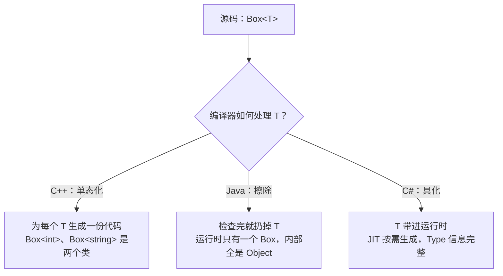

# 第 29 章 · 泛型

**简体中文** ｜ [English](./29-generics.en-US.md)

---

> 第 28 章末尾留了个问题：`List<String>`、`List<Integer>`、`List<Student>`——逻辑一模一样，只有元素类型不同，难道要写三份？没有泛型的年代，Java 程序员的答案是往 `List` 里装 `Object`：什么都能放，取出来全靠强转和运气。
>
> 泛型的答案是**把类型本身变成参数**：`List<T>` 只写一份，`T` 在使用时才确定。复用与类型安全，第一次可以兼得。
>
> 但六门语言在"这个类型参数最终去了哪"上走出了三条路：**C++ 把它用在编译期**，为每个类型生成一份专属代码（模板）；**Java 在编译期检查完就把它扔掉**（擦除）；**C# 把它一路带进运行时**（具化）。
>
> 一个实验就能看穿三条路线：给泛型类加一个静态字段，问它有几份。实测答案——**Java：1 份；C#：每个类型参数各 1 份；C++：每个实例化各 1 份**。这个实验是理解整章的钥匙。

## 1. 学习目标

本章结束后，你将能够：

- 说清泛型解决的问题：**没有它，复用和类型安全只能二选一**；
- 用"静态字段实验"分辨三条实现路线——**擦除、具化、单态化**——并解释各自的取舍；
- 解释 Java 擦除带来的一整组限制（不能 `new T()`、不能 `T[]`、装箱），以及**为什么 Java 明知有代价还是选了擦除**；
- 用 **PECS** 原则正确书写 Java 通配符，说清**数组协变为什么危险、泛型为什么默认不变**；
- 用 **C++20 Concept** 给模板参数立约束，并解释单态化的性能收益与代码膨胀代价。

---

## 2. 为什么会出现这个概念

### 没有泛型的两条老路

**老路一：为每种类型复制一份代码**。

```java
class IntList    { int get(int i) { ... } }
class StringList { String get(int i) { ... } }
class StudentList { Student get(int i) { ... } }   // 逻辑完全相同，写了三遍
```

修一个 bug 要改三处，加一种类型要再抄一遍——这是维护地狱。

**老路二：用 `Object` 装一切**（Java 1.4 之前的标准做法）：

```java
List names = new ArrayList();       // 元素类型是 Object
names.add("小明");
names.add(42);                      // 编译器不拦——什么都能放

String s = (String) names.get(1);  // 运行时爆炸：ClassCastException
```

一份代码是做到了，但付出两重代价：

| 代价 | 表现 |
|------|------|
| **类型不安全** | 错误类型放进去编译器不拦，取出来强转时才在运行时爆炸——离出错现场可能隔了十万八千行 |
| **装箱开销** | `int` 要先包成 `Integer` 才能进 `Object` 容器（第 24 章讲过对象头的代价） |

### 泛型的答案：把类型变成参数

```java
class Box<T> {                     // T 是类型参数，像函数的形参
    private final T value;
    Box(T value) { this.value = value; }
    T get() { return value; }
}

Box<String> a = new Box<>("小明");  // 使用时才把 T 定下来，像传实参
Box<Integer> b = new Box<>(90);
String s = a.get();                 // 不用强转，编译器知道 T = String
Integer n = b.get();
```

**函数把"值"参数化，泛型把"类型"参数化**——这是同一个思想在更高一层的重复（呼应第 12 章）。

| | 复制代码 | Object 容器 | 泛型 |
|---|---|---|---|
| 代码份数 | 每类型一份 | 一份 | **源码一份** |
| 类型检查 | ✅ 编译期 | ❌ 运行时才爆 | ✅ **编译期** |
| 需要强转 | 不需要 | 每次取出都要 | **不需要** |

> **一句话**：泛型让"同一份逻辑、不同的类型"不再需要在**复用**和**安全**之间二选一。

---

## 3. 底层原理

源码层面六门语言长得差不多，真正的分野在编译之后：**类型参数去了哪**？



### 钥匙实验：静态字段有几份

给泛型类加一个静态计数器，分别创建两个 `Box<int>`（或 `Box<Integer>`）和一个 `Box<string>`（或 `Box<String>`），然后数一数：

**Java**（实测）：

```text
Box.created = 2   ← 没有 Box<String>.created / Box<Integer>.created 之分
```

**C#**（实测）：

```text
Box<int>.Count = 2, Box<string>.Count = 1   ← 与 Java 相反！
```

**C++**（实测）：

```text
Box<int>::count = 2, Box<std::string>::count = 1   ← 静态成员各一份
```

同一个实验，三种结果——因为**运行时存在的"类"数量根本不同**：Java 只有一个 `Box`，C# 和 C++ 有几种类型参数就有几个类。

### 路线一：Java 的擦除（erasure）

编译器在编译期完成全部类型检查，然后**把 `T` 擦成 `Object`**（有边界时擦成边界类型），在取值处悄悄插入强转指令（`checkcast`）：

```java
// 你写的                          // 擦除后实际生成的
class Box<T> {                     class Box {
    T value;                           Object value;
    T get() { return value; }          Object get() { return value; }
}                                  }
String s = box.get();              String s = (String) box.get();   // 编译器插的强转
```

**实测**：

```text
ArrayList<String> 与 ArrayList<Integer> 是同一个 Class: true
getClass() = java.util.ArrayList
```

**为什么选擦除**？2004 年 Java 5 引入泛型时，全世界已有海量 Java 1.4 代码。擦除让 `List<String>` 和老代码里的 `List` **在字节码层面是同一个类**——新旧代码无缝互调，一行不用改。**这是"向后兼容"换来的设计，代价是运行时失忆**：

```text
擦除后做不到的事（都因为运行时不知道 T 是什么）：
  new T()                    ← 不知道调谁的构造函数
  new T[10]                  ← 不知道该造什么数组
  obj instanceof List<String> ← 运行时根本没有 List<String> 这个类
  T.class                    ← 同上
  int 直接做类型参数          ← 只能 List<Integer>，装箱（性能代价见第 12 节）
```

**擦除的补丁：桥方法**。子类实现泛型接口时签名对不上（`set(String)` vs 擦除后的 `set(Object)`），编译器会偷偷生成一个转发方法。**实测**：

```text
StringContainer 的方法：
  set(String)
  set(Object)   ← 编译器生成的桥方法（isBridge() = true）
```

**擦除并不彻底**——这是最常被误解的一点。对象身上的类型参数没了，但**声明处的签名还留在字节码里**（`Signature` 属性），反射可以读到。**实测**：

```text
字段声明 List<String> names;
f.getType()        = interface java.util.List      ← 擦掉了
f.getGenericType() = java.util.List<java.lang.String>  ← 签名还在！
```

> 这正是 Gson / Jackson 这类框架能反序列化 `List<Student>` 的原因——它们读的是**声明处**的签名，而不是对象。工具是反射，第 30 章详述。

### 路线二：C++ 的单态化（monomorphization）

模板在编译期**按需展开**：每用一种类型参数，编译器就生成一份专属代码。`Box<int>` 和 `Box<std::string>` 是**两个毫无关系的类**。

**实测**（用 `nm` 查看编译产物的符号表）：

```text
$ nm main | grep max_of | c++filt
0000000100000f84 T double max_of<double>(double, double)
0000000100000f40 T int max_of<int>(int, int)      ← 二进制里真的有两个函数
```

```text
&max_of<int> == &max_of<double>: false             ← 函数地址都不同
typeid(Box<int>)         = 3BoxIiE
typeid(Box<std::string>) = 3BoxINSt3__112basic_...  ← 两个不同的类型
```

**收益**：`Box<int>` 里的 `T` 就是真 `int`——没有装箱、没有强转、没有任何运行时开销，还能被内联优化。
**代价**：用 100 种类型就生成 100 份代码——**编译变慢、二进制膨胀**；模板定义必须放头文件（编译器要看到源码才能展开）。

C++ 模板还有两件泛型做不到的事：

```cpp
std::array<int, 5> a5;   // 值也能当参数（非类型模板参数）
template <> class Box<bool> { ... };   // 对特定类型给一份特殊实现（特化）
```

**实测**：`std::array<int,5>` 与 `std::array<int,8>` 是不同类型（`typeid` 不等）——长度是类型的一部分。

### 路线三：C# 的具化（reification）

C# 2.0（2005）没有背 Java 的兼容包袱——微软直接**修改了 CLR 虚拟机**，字节码里有真正的泛型指令，类型参数一路活到运行时。

**实测**：

```text
typeof(List<int>) == typeof(List<string>): False    ← 与 Java 相反
scores.GetType() = System.Collections.Generic.List`1[System.Int32]
```

运行时类型完整，Java 做不到的事 C# 都能做。**实测**：

```csharp
static T Create<T>() where T : new() => new T();   // ✓ new T() 没问题
```

```text
Create<Student>() -> Name = 未命名, Score = 0
```

JIT 的代码生成策略很聪明（细节见第 11 节）：**值类型每种生成一份专属代码**（`List<int>` 里就是真 `int`，零装箱），**引用类型共享一份代码**（反正都是指针）——同时拿到 C++ 的性能和 Java 的紧凑。

### 型变：数组的历史教训与泛型的选择

`String` 是 `Object` 的子类，那 `List<String>` 是 `List<Object>` 的子类吗？**Java 和 C# 的数组说"是"（协变），结果留下了一个运行时炸弹**。Java 与 C# 双双**实测**：

```java
Object[] arr = new String[1];    // 数组协变：编译器放行
arr[0] = 42;                     // 实测：ArrayStoreException（C#：ArrayTypeMismatchException）
```

泛型吸取了教训，默认**不变**（invariant）：`List<Object> l = new ArrayList<String>()` 直接**编译错误**——同样的 bug 从运行时提前到了编译期。

但"完全不变"太死板（`sum(List<Number>)` 就没法接收 `List<Integer>` 了），于是两门语言给了两种放开的方式：

```java
// Java：使用处型变（通配符），口诀 PECS——Producer Extends, Consumer Super
double sum(List<? extends Number> nums)   // 只读取 → extends（生产者）
void fill(List<? super Integer> sink)     // 只写入 → super（消费者）
```

```csharp
// C#：声明处型变，接口定义时就声明 T 只出不进（out）或只进不出（in）
IEnumerable<string> strs = new List<string> { "小明", "小红" };
IEnumerable<object> objs = strs;    // ✓ 实测：IEnumerable<out T> 是协变的
```

> **为什么只读才能协变**？从 `List<? extends Number>` 里取出来的一定是 `Number`（安全）；但往里放时，编译器不知道它到底是 `List<Integer>` 还是 `List<Double>`，放什么都可能错——所以协变容器禁止写入。数组的错误就在于**既协变、又可写**。

---

## 4. JavaScript

**JavaScript 没有泛型，也不需要**——变量本来就不带类型，一份代码天然适用于一切类型（第 27 章的鸭子类型，走到极致就是"天然泛型"）。

### 动态类型 = 隐式泛型

```javascript
const stack = [];
stack.push(90, "小明", { name: "小红" });   // 一个容器装一切

const first = (arr) => arr[0];
first([90, 85]);        // 90
first(["小明", "小红"]); // "小明"  ← 同一个函数，不用声明任何 T
```

### 自由的代价：错误不报，悄悄算错

**实测**：

```javascript
const scores = [90, 85, "九十八"];
const total = scores.reduce((a, b) => a + b, 0);
```

```text
[90, 85, "九十八"] 求和 = "175九十八"  ← 不报错，结果却成了字符串！
```

这比 Java 的 `ClassCastException` 更糟——**连炸都不炸**，错误的数据继续在系统里流淌（`90 + 85 = 175`，`175 + "九十八"` 触发字符串拼接，第 10 章讲过 `+` 的隐式转换）。

### TypeScript：把类型参数补回来

```typescript
function first<T>(arr: T[]): T { return arr[0]; }

first<number>([90, 85]);        // ✓ 返回类型推断为 number
first<number>([90, "八十五"]);  // ✗ 编译错误：string 不能赋给 number

// 约束：T 必须有 length 属性（类似 Java 的 extends、C++ 的 concept）
function longest<T extends { length: number }>(a: T, b: T): T {
  return a.length >= b.length ? a : b;
}
```

> **注意事项**：与第 28 章的 `interface` 一样，**TypeScript 的泛型是纯编译期的**——编译成 JavaScript 后 `<T>` 彻底消失，运行时没有任何检查。它是六门语言里"擦除"最彻底的：连 `checkcast` 都没有。

---

## 5. Python

Python 的泛型和 TypeScript 同一阵营：**写给类型检查器看的提示，运行时不强制**。

### `TypeVar` + `Generic`：泛型类

```python
from typing import Generic, TypeVar

T = TypeVar("T")

class Stack(Generic[T]):          # Python 3.12+ 可直接写 class Stack[T]:（PEP 695）
    def __init__(self) -> None:
        self._items: list[T] = []
    def push(self, item: T) -> None:
        self._items.append(item)
    def pop(self) -> T:
        return self._items.pop()
```

### 运行时不检查（实测）

```python
s: Stack[int] = Stack()
s.push(90)
s.push("九十八")        # 类型不对，但运行时完全不报错！
```

```text
Stack[int] 里的内容: [90, '九十八']
```

静态检查器（mypy / pyright）才会拦：`error: Argument 1 to "push" has incompatible type "str"`。**类型安全存在于工具链里，不在解释器里**。

### `Stack[int]` 在运行时是什么（实测）

```text
type(Stack[int]) = _GenericAlias        ← 只是个记录参数的包装对象
实例的 __class__ 还是 Stack: True        ← 比 Java 擦得还干净
但 __orig_class__ 记住了参数: __main__.Stack[int]   ← 想查还是能查到
```

### 约束与边界

```python
Num = TypeVar("Num", int, float)          # 约束：只能是 int 或 float

class Comparable(Protocol):               # 边界：用 Protocol 表达"可比较"
    def __lt__(self, other) -> bool: ...

C = TypeVar("C", bound=Comparable)        # 对应 Java 的 <C extends Comparable>
def max_of(items: list[C]) -> C: ...
```

**实测**：`max_of([90, 85, 98])` → `98`，`max_of(['小明', '小红'])` → `小红`——`bound=Comparable` 配合第 28 章的 `Protocol`，正是"泛型 + 结构化契约"的组合。

> **注意事项**：Python 3.9+ 直接用 `list[int]`、`dict[str, int]`（PEP 585），不再需要 `from typing import List`。但记住它们**只是提示**——实测 `list[int]` 照样能 `append("九十八")`。**没有 CI 里跑 mypy 的类型标注，约束力等于零**。

---

## 6. Java

Java 泛型的一切特性和一切限制，都源自同一个事实：**擦除**。

### 基本语法

```java
class Box<T> { ... }                                  // 泛型类
interface Container<T> { void set(T value); }         // 泛型接口
static <T extends Comparable<T>> T max(List<T> list)  // 泛型方法 + 有界类型参数
Pair<String, Integer> p;                              // 多个类型参数 K, V
```

### ⚠️ 原始类型：擦除留下的后门（实测）

为兼容 1.4 老代码，Java 允许不带参数的**原始类型**（raw type），它会绕过全部泛型检查：

```java
List<String> names = new ArrayList<>();
List raw = names;              // 原始类型，编译只有 unchecked 警告
raw.add(42);                   // 塞进去了！
String s = names.get(0);       // 实测：ClassCastException
```

这叫**堆污染**（heap pollution）：错误发生在 `add`，爆炸却在千里之外的 `get`——泛型的编译期保护被一个 raw type 完全击穿。

### 通配符与 PECS（实测）

```java
static double sum(List<? extends Number> nums) { ... }   // 生产者：读 → extends
static void fill(List<? super Integer> sink) { ... }     // 消费者：写 → super
```

```text
sum(List<Integer>) = 273.0        ← List<Integer>、List<Double> 都能收
sum(List<Double>)  = 180.5
fill(List<? super Integer>) -> [90, 85]   ← List<Number>、List<Object> 都能收
```

**记法**：站在**参数**的角度——它为你生产元素（你读它）用 `extends`；它消费你的元素（你写它）用 `super`；又读又写就别用通配符。

### 擦除的限制与逃生通道

| 做不到 | 原因 | 逃生通道 |
|--------|------|---------|
| `new T()` | 不知道构造函数 | 传 `Supplier<T>` 或 `Class<T>` |
| `new T[10]` | 不知道数组类型 | `(T[]) new Object[10]` 或 `Array.newInstance(clazz, 10)` |
| `instanceof List<String>` | 运行时无此类型 | 只能 `instanceof List<?>` |
| `List<int>` | 类型参数必须是引用类型 | 装箱成 `List<Integer>`（代价见第 12 节） |
| 静态字段按类型参数区分 | 全部参数化共享一个类 | 无——设计时别依赖它（实测见第 3 节） |

> **注意事项**：Project Valhalla 正在尝试让 JVM 支持值类型泛型（`List<int>`），但截至本章写作尚未落地。当前性能敏感场景用原始类型数组或 fastutil 这类专用库。

---

## 7. C++

C++ 的"泛型"叫**模板**（template），出现得比 Java/C# 泛型早十年，能力也大得多——它不只是类型参数化，而是一套**编译期代码生成机制**。

### 函数模板与类模板

```cpp
template <typename T>
T max_of(T a, T b) { return a > b ? a : b; }

template <typename T>
class Box {
public:
    explicit Box(T v) : value_(std::move(v)) {}
    const T& get() const { return value_; }
private:
    T value_;
};

max_of(90, 85);                  // 编译器推导 T = int，生成 max_of<int>
max_of(std::string("a"), std::string("b"));   // 再生成一份 max_of<string>
```

### 单态化：眼见为实（实测）

```text
$ nm main | grep max_of | c++filt
0000000100000f84 T double max_of<double>(double, double)
0000000100000f40 T int max_of<int>(int, int)
```

**二进制里真的有两个函数**——这就是"为每个类型生成一份代码"的直接证据。也因此：

- **模板定义必须放头文件**：编译器在每个使用点都要看到完整源码才能展开（放 `.cpp` 里会链接报错——经典坑，见第 15 节）；
- **重度使用会让二进制膨胀、编译变慢**：这是单态化路线的固有代价。

### C++20 Concept：给模板参数立契约

C++20 之前模板参数没有任何约束声明，类型不满足要求时错误信息深不见底。Concept（第 28 章介绍过）把契约提前写明。**实测**：

```cpp
template <typename T>
concept Addable = requires(T a, T b) { { a + b } -> std::convertible_to<T>; };

template <Addable T>
T sum(T a, T b) { return a + b; }

sum(std::vector<int>{}, std::vector<int>{});   // vector 没有 operator+
```

```text
error: no matching function for call to 'sum'
note: candidate template ignored: constraints not satisfied [with T = std::vector<int>]
note: because 'std::vector<int>' does not satisfy 'Addable'   ← 一句话说清原因
```

### 模板独有的两件事

```cpp
std::array<int, 5> a5;               // ① 非类型模板参数：值也能当参数
                                     //    实测：array<int,5> 与 array<int,8> 是不同类型
template <> class Box<bool> { ... }; // ② 特化：给特定类型单独一份实现
```

特化最著名的案例是 `std::vector<bool>`——标准库把它特化成了位压缩存储。**实测**：

```text
vb[0] 的类型是 bool&: false   ← 拿到的是代理对象，不是引用
```

省了 8 倍内存，却让 `auto& r = vb[0]` 编译不过——**特化改变了接口语义**，被普遍认为是标准库的设计失误（见第 15 节）。

> **注意事项**：模板是图灵完备的（编译期能算任意东西，`constexpr` 出现前大家真的这么干过），但**本章只把它当泛型用**。日常写模板的原则：**能加 concept 就加**——这是 C++20 之后对使用者和错误信息最大的善意。

---

## 8. C#

C# 的泛型是**运行时的一等公民**——这是它和 Java 最本质的区别。

### 具化：类型参数活到运行时（实测）

```csharp
Console.WriteLine(typeof(List<int>) == typeof(List<string>));   // False
Console.WriteLine(scores.GetType());
// System.Collections.Generic.List`1[System.Int32]   ← 类型参数原样保留
```

### 运行时类型完整带来的能力（实测）

```csharp
static T Create<T>() where T : new() => new T();     // Java 做不到的 new T()

Student s = Create<Student>();       // -> Name = 未命名, Score = 0
default(int);                        // 0（值类型：零值）
default(string);                     // null（引用类型）
```

### 约束系统：比 Java 的 extends 丰富

```csharp
where T : new()              // 必须有无参构造函数
where T : struct             // 必须是值类型
where T : class              // 必须是引用类型
where T : IComparable<T>     // 必须实现接口（对应 Java 的 extends）
where T : Animal, IFlyable, new()   // 可以组合
```

### 声明处型变：out / in（实测）

```csharp
public interface IEnumerable<out T> { ... }   // out：T 只出现在返回值 → 协变
public interface IComparer<in T> { ... }      // in：T 只出现在参数 → 逆变

IEnumerable<string> strs = new List<string> { "小明", "小红" };
IEnumerable<object> objs = strs;              // ✓ 协变转换，实测通过
// List<object> l = new List<string>();       // ✗ List<T> 没声明 out，不变
```

与 Java 的对比很有意思：**Java 把型变决策交给每个使用点**（通配符，灵活但每次都要想 PECS），**C# 把决策放在接口声明处**（一次声明，处处生效，但只有接口和委托能用）。

### 值类型泛型：零装箱（实测）

```text
List<int>（无装箱）    求和:    5.0 ms
ArrayList（元素装箱）  求和:   23.4 ms    ← 4.7 倍差距
```

`List<int>` 的 JIT 代码里 `T` 就是真 `int`——这是具化路线在性能上的直接回报（完整分析见第 12 节）。

> **注意事项**：C# 也保留了泛型出现前的 `ArrayList` / `Hashtable`（`System.Collections` 命名空间），**新代码永远不要用它们**——它们存在的唯一意义是兼容 .NET 1.x 老代码。

---

## 9. SQL

SQL 没有泛型——表结构里每一列的类型都是定死的。但**"类型丢失"的代价**在数据库里同样真实，而且有一个直接对应"Object 容器"的经典反模式。

### ① SQLite 的动态类型：一列装一切（实测）

```sql
CREATE TABLE flexible (val);            -- 不声明类型
INSERT INTO flexible VALUES (90), ('小明'), (3.14), (NULL);
SELECT val, typeof(val) FROM flexible;
```

```text
90|integer
小明|text
3.14|real
|null          ← 同一列，四种类型——SQLite 的"动态类型"传统
```

### ② STRICT 表：找回静态类型（实测，SQLite 3.37+）

```sql
CREATE TABLE student (id INTEGER, name TEXT, score INTEGER) STRICT;
INSERT INTO student VALUES (2, '小红', '优秀');
```

```text
Runtime error: cannot store TEXT value in INTEGER column student.score
```

### ③ EAV 反模式：数据库里的"Object 容器"

EAV（实体-属性-值）把所有属性存成三列，号称"不用改表结构就能加字段"——**代价是所有值都退化成字符串**，和往 `List` 里装 `Object` 是同一个错误：

```sql
CREATE TABLE eav (entity_id INTEGER, attr TEXT, value TEXT);
INSERT INTO eav VALUES
    (1, 'name', '小明'), (1, 'score', '100'),
    (2, 'name', '小红'), (2, 'score', '59'),
    (3, 'name', '小刚'), (3, 'score', '65');

-- 找 60 分以上的学生？value 是 TEXT，走字符串比较！
SELECT entity_id, value AS score FROM eav WHERE attr = 'score' AND value > '60';
```

**实测**：

```text
3|65        ← 只有 65 分的小刚；100 分的小明不见了！（'100' < '60' 字符串序）
```

必须显式 `CAST` 才能找回数值语义：

```sql
SELECT entity_id, value FROM eav WHERE attr = 'score' AND CAST(value AS INTEGER) > 60;
-- 实测：1｜100 和 3｜65 都回来了
```

> **工程提醒**：EAV 的"灵活"与 `Object` 容器的"灵活"是同一种幻觉——**类型信息一旦丢弃，每个读取点都要自己记得补回来，漏一处就是静默的错误数据**（100 分的学生查不出来，不报任何错）。真需要动态属性时，现代数据库的 JSON 列（带类型的 `json_extract`）是更安全的选择。

---

## 10. 五语言横向对比

### ① 泛型机制对比

| 特性 | JavaScript | Python | Java | C++ | C# |
|------|-----------|--------|------|-----|-----|
| 形态 | ❌（TS 编译期泛型） | 类型提示 | 泛型（擦除） | **模板**（单态化） | **泛型**（具化） |
| 检查时机 | —（TS：编译期） | 静态检查器 | 编译期 | 编译期 | 编译期 |
| 运行时类型参数 | ❌ | 近乎无（`__orig_class__` 除外） | ❌ **擦除** | ✅ 每实例化独立类型 | ✅ **完整保留** |
| 生成代码份数 | 一份 | 一份 | **一份**（共享） | **每实例化一份** | 值类型每种一份 / 引用类型共享 |
| 值类型免装箱 | — | —（一切皆对象） | ❌ 必须装箱 | ✅ | ✅ |
| `new T()` | — | ✅（类型是一等对象） | ❌ | ✅ | ✅ `where T : new()` |
| 型变 | — | 检查器支持 | 使用处（`? extends/super`） | —（实例化间无关系） | 声明处（`out` / `in`） |
| 约束表达 | —（TS：`extends`） | `TypeVar` 约束 / `bound` | `extends` | **Concept**（C++20） | `where`（最丰富） |

### ② 两条设计分歧

**分歧一：类型参数活到什么时候**

```text
编译期用完就扔（Java 擦除 / TS / Python 提示）：兼容旧运行时，但运行时失忆
带进运行时（C# 具化 / C++ 单态化）：       能力完整，但要改 VM 或接受代码膨胀
```

> **Java 和 C# 的分岔是历史的必然**：Java 5（2004）背着海量 1.4 代码，必须让 `List<String>` 与旧 `List` 是同一个类；C# 2.0（2005）的 .NET 用户基数还小，微软敢直接改 CLR 加泛型指令。**同一个功能，晚一年、轻装上阵，就能做出更彻底的设计**——这是语言演化里"兼容包袱"分量的最好例证。

**分歧二：一份代码还是多份代码**

```text
共享一份（Java）：      紧凑，但值类型要装箱
每类型一份（C++）：     零开销，但二进制膨胀、编译慢
混合（C#）：           值类型单态化（性能）+ 引用类型共享（紧凑）——各取所长
```

### ③ 共同点与差异根源

**共同点**：五门语言（算上 TS）都提供了"参数化类型"的表达；都在编译期或静态检查阶段做约束检查；泛型容器都默认不变，都为"只读"场景提供了协变通道。

**差异根源**：

- **C++ 模板先于一切**（1990 年代初），它本质是编译期代码生成器，泛型只是用途之一；
- **Java 被兼容性锁死**，擦除是深思熟虑的妥协，不是能力不足；
- **C# 晚一步看清了 Java 的痛**，用改 VM 的代价换了具化；
- **Python / JavaScript 是动态类型**，本就"天然泛型"，它们的问题不是复用而是安全——所以补的是**检查器**（mypy / TypeScript），不是运行时机制。

---

## 11. 底层实现对比

| 语言 · 机制 | 实现方式 | 关键细节 |
|------------|---------|---------|
| **V8**（JavaScript） | 无泛型，一份代码跑一切 | 靠隐藏类 + 内联缓存把"动态"优化成"准静态"（第 24 章） |
| **CPython** | 类型提示零运行时作用 | `Stack[int]` 只是 `_GenericAlias` 包装对象（实测）；解释器从不看注解 |
| **JVM**（Java） | 擦除 | 泛型只存在于编译器；字节码里 `T` 已是 `Object` + `checkcast`；声明处签名留在 `Signature` 属性（实测反射可读）；桥方法补齐重写关系（实测 `isBridge()`） |
| **C++**（原生） | 单态化 | 编译期展开，每实例化独立机器码（实测 `nm` 见两个符号）；零运行时开销；链接器负责合并重复实例化 |
| **CLR**（C#） | 具化 | IL 字节码含泛型指令；JIT 按需生成：**值类型每种一份专属代码，引用类型共享一份**（内部占位类型 `System.__Canon`）；`typeof(T)` 运行时可用（实测） |

**一个值得记住的分野**：

```text
泛型信息在运行时存在（C# / C++）→ 能 new T()、typeof(T)、按类型分静态字段
泛型信息运行时不存在（Java / TS / Python）→ 这些全做不到，框架只能靠反射读声明处签名
```

> 这与第 28 章"契约在哪个阶段检查"一脉相承——**类型参数活在哪个阶段，决定了哪个阶段能用它做事**。

---

## 12. 性能分析

### 装箱：擦除路线的隐藏账单

同一个实验：1000 万个整数求和，泛型容器 vs 原始形态（同语言内对比；三门语言分别实测，绝对值不可跨语言直接比较）：

| 语言 | 原始形态 | 泛型/装箱容器 | 差距 |
|------|---------|-------------|------|
| Java | `int[]` 2.3–2.5 ms | `ArrayList<Integer>` 4.0–4.4 ms | **约 1.8×** |
| C# | `List<int>` 5.0 ms | `ArrayList`（装箱） 23.4 ms | **约 4.7×** |
| C++ | `vector<int>` 1.1 ms | —（模板无装箱形态） | 基线即最优 |

三个数字讲三个故事：

- **Java 的 1.8×**：`List<Integer>` 每个元素是堆上一个对象（16 字节头 + 4 字节值，第 24 章实测过），`int[]` 只要 4 字节——**内存差约 5 倍**，遍历时缓存命中率天差地别。1.8× 已是 JIT 尽力优化后的结果（顺序分配的 `Integer` 恰好在堆上也大致连续）；乱序访问或对象分散时差距会显著拉大。
- **C# 的 4.7×**：不是泛型慢，是**没用泛型**慢——`ArrayList` 把每个 `int` 装箱成堆对象，`List<int>` 零装箱。这正是具化的价值：**泛型反而是性能优化**。
- **C++ 的 1.1 ms**：单态化生成的代码与手写 `int` 版本完全相同，模板抽象**零开销**——付出的代价在编译期（时间）和二进制（体积），不在运行期。

### 各路线的性能特征

| 路线 | 运行时开销 | 隐藏成本 |
|------|-----------|---------|
| Java 擦除 | `checkcast` 指令（JIT 通常能消除）+ **值类型装箱** | 装箱对象的 GC 压力、缓存不友好 |
| C# 具化 | 值类型零开销；引用类型共享代码，偶有一次类型句柄查找 | 首次使用某实例化时的 JIT 编译 |
| C++ 单态化 | **零** | 编译时间、二进制体积、指令缓存压力（代码太多也伤性能） |
| TS / Python 提示 | **零**（运行时根本不存在） | 零保护也零成本——检查全靠工具链 |

> ⚠️ 与前两章同样的提醒：**这些差异只在热路径上要紧**。日常业务代码里，先把 `ArrayList` 换成 `List<T>`、避免明显的装箱循环，就已经拿到了绝大部分收益；更极端的优化（Java 用 fastutil、手写原始类型数组）留给 profiler 证明过的瓶颈。

---

## 13. 工程实践

| 场景 | ✅ 推荐 | ❌ 不推荐 | 原因 |
|------|--------|----------|------|
| 集合与容器 | 一律泛型 | 原始类型 / `Object` 容器 | 编译期安全 + 免强转 |
| Java 公共 API 的集合参数 | `List<? extends T>` / `List<? super T>` | 精确参数化类型 | PECS，调用方更灵活 |
| 表达类型能力要求 | 有界类型参数 / Concept / `where` | 文档里口头约定 | 约束进签名，编译器帮你守 |
| C++ 模板参数 | **加 Concept 约束**（C++20） | 裸 `typename` | 错误信息从天书变人话（实测） |
| Python 新代码 | 类型标注 + CI 跑 mypy | 只写标注不跑检查 | 提示不强制，不跑等于没写 |
| Java 性能热点的 `int` 集合 | 原始类型数组 / 专用库 | `ArrayList<Integer>` | 装箱 + GC 压力（实测 1.8×） |
| C# 集合 | `List<T>` / `Dictionary<K,V>` | `ArrayList` / `Hashtable` | 装箱实测 4.7×；老容器仅为兼容存在 |
| 只有一种类型在用 | 具体类型 | 提前泛型化 | 过度设计——等第二种类型出现再抽 |

### 类型参数命名约定

```text
T — 一般类型（Type）        E — 集合元素（Element）
K, V — 键、值（Key/Value）   R — 返回类型（Result）
```

单字母是约定俗成；复杂场景可用描述性名字（C# 惯例加 `T` 前缀：`TResult`、`TKey`）。

### 什么时候不用泛型

```text
- 逻辑真的只对一种类型有意义（给 Student 算平均分，不必 Repository<T>）
- 类型之间行为差异大到分支满天飞（那是多态的活，第 27 章）
- 只是为了"看起来通用"（YAGNI——第二个类型出现之前，通用是幻觉）
```

---

## 14. 最佳实践

- **容器一律参数化**：`List<Student>` 而非 `List`；见到原始类型当 bug 处理。
- **Java API 记住 PECS**：读用 `? extends`，写用 `? super`，又读又写不用通配符。
- **C# 优先声明处型变**：接口能标 `out` / `in` 就标上，调用方免于思考。
- **C++ 模板参数一律加 Concept**（C++20 起）：约束即文档，错误信息即善意。
- **Python 类型标注必须配 CI 检查**：不跑 mypy / pyright 的标注只是注释。
- **利用约束换能力**：C# 的 `where T : new()`、Java 的 `Class<T>` 参数、C++ 的 concept——把"我需要 T 能做什么"显式写进签名。
- **热路径警惕装箱**：Java 的 `List<Integer>` 循环、C# 的老容器，都是 profiler 里的常客。
- **别为一个类型写泛型**：泛型的价值从第二个类型参数开始。

---

## 15. 常见坑

**坑 1 · Java 原始类型击穿泛型**（堆污染）

```java
List raw = names;        // ⚠️ 原始类型，只有警告
raw.add(42);             // 塞进 List<String> 了
String s = names.get(0); // 实测：ClassCastException——爆炸点离案发点十万八千里
```

**如何避免**：把 `unchecked` 警告当错误对待（`-Werror`）；raw type 只该出现在与 1.4 老代码的边界上。

**坑 2 · 数组协变 + 可写 = 运行时炸弹**（Java 与 C# 同款）

```java
Object[] arr = new String[1];   // 编译器放行
arr[0] = 42;                    // 实测：ArrayStoreException / ArrayTypeMismatchException
```

**如何避免**：需要"一组东西向上转型"时用泛型集合 + `? extends`（编译期拦截），别用数组。

**坑 3 · Java 泛型类的静态字段是共享的**

```java
class Cache<T> { static Map<String, T> data; }   // ✗ 编译都过不了：static 不能引用 T
class Counter<T> { static int count; }            // 能编译，但所有 Counter<..> 共享一份（实测）
```

**如何避免**：静态成员在擦除后属于唯一的那个类——需要按类型隔离的状态，用 `Map<Class<?>, ...>` 显式管理。

**坑 4 · 以为 Python / TypeScript 的类型参数在运行时保护你**

```python
s: Stack[int] = Stack()
s.push("九十八")          # 实测：运行时毫无反应
```

**如何避免**：这两家的泛型只活在检查器里。信任它 = 在 CI 里跑 mypy / tsc；边界输入（网络、文件）还得运行时校验（pydantic / zod）。

**坑 5 · C++ 模板定义放进 .cpp 文件**

```text
// box.cpp 里写模板实现，main.cpp 里使用
Undefined symbols: Box<int>::get() const   ← 链接错误，新人必踩
```

**如何避免**：模板是编译期展开的——使用点必须看到完整定义，**实现留在头文件里**（或用显式实例化）。

**坑 6 · `std::vector<bool>` 不是 bool 的 vector**

```cpp
std::vector<bool> vb(8, true);
// 实测：vb[0] 的类型不是 bool&，是位压缩的代理对象
auto& r = vb[0];              // ✗ 编译错误
```

**如何避免**：需要真正的布尔数组用 `std::vector<char>` 或 `std::bitset`；把它当成"特化改变接口语义"的反面教材。

**坑 7 · 在 Java 里想 `new T()` / `T[]` / `instanceof List<String>`**

```java
class Factory<T> {
    T create() { return new T(); }   // ✗ 编译错误：擦除后不知道 T 是谁
}
```

**如何避免**：显式把类型信息传进来——`Supplier<T>` 工厂、`Class<T>` 令牌（`Array.newInstance(clazz, n)`）。这不是丑陋的变通，**这就是擦除路线的官方答案**。

---

## 16. 面试题

**基础**

1. 泛型解决什么问题？没有泛型的 `Object` 容器差在哪？
2. Java 的 `List<String>` 和 `List<Integer>` 在运行时是什么关系？如何验证？
3. 为什么 `List<Integer>` 比 `int[]` 慢、占内存多？

**中级**

4. **什么是类型擦除？它让 Java 做不到哪些事？各自的替代方案是什么？**
5. 解释 PECS 原则，并说明为什么"只读"才能协变、"只写"才能逆变。
6. **数组协变为什么是设计失误？泛型的"不变"如何修正它？**

**高级**

7. **Java 选擦除、C# 选具化，各自的历史原因和技术代价是什么？**
8. CLR 对值类型和引用类型的泛型分别生成什么代码？`System.__Canon` 是什么？
9. C++ 单态化的性能收益和工程代价是什么？Concept 解决了其中哪个痛点？

---

## 17. 练习

**基础**

1. 用六门语言（SQL 用 STRICT 表）各实现一个类型安全的 `Stack`，验证放错类型时各语言分别在哪个阶段报错。
2. 在 Java 里复现堆污染：用原始类型把 `Integer` 塞进 `List<String>`，观察异常在哪一行抛出。
3. 写一个 `copy(List<? super T> dst, List<? extends T> src)` 方法，体会 PECS 两端的用法。

**提高**

4. **三语言复现"静态字段实验"**（Java / C# / C++），亲眼确认 1 份、每类型 1 份、每实例化 1 份。
5. 用 `nm`（或 `objdump`）观察你的 C++ 模板生成了几份代码；再增加一种类型参数，确认符号多了一个。
6. 在 C# 里定义一个协变接口 `IProducer<out T>` 和逆变接口 `IConsumer<in T>`，写出编译器允许与拒绝的转换各两例。

**挑战**

7. 用 C++20 Concept 约束"可排序"，对比有无 Concept 时同一个错误的编译器输出长度。
8. 在 Java 里用 `Class<T>` 令牌 + `Array.newInstance` 实现一个真正返回 `T[]` 的泛型数组工厂。
9. 把第 9 节的 EAV 表重构成 STRICT 的宽表，写出迁移 SQL，并验证"找 60 分以上学生"不再需要 `CAST`。

---

## 18. 本章总结

**一句话总结**：泛型把类型变成参数，让"同一份逻辑、不同的类型"不再需要在复用与安全之间二选一；而三条实现路线——**Java 的擦除**（编译期检查完就扔，兼容换来失忆）、**C# 的具化**（类型参数活到运行时，能力完整）、**C++ 的单态化**（每类型一份代码，零开销换膨胀）——用"静态字段有几份"一个实验就能分辨，它们的一切能力差异（`new T()`、装箱、`typeof`）都是这个根本选择的推论。

**核心知识点**

- **钥匙实验**（实测）：静态字段 Java 共 1 份、C# 每类型 1 份、C++ 每实例化 1 份——三条路线的铁证。
- **Java 擦除**（实测）：`ArrayList<String>` 与 `ArrayList<Integer>` 同一个 `Class`；桥方法 `isBridge()`；但声明处签名反射可读（`getGenericType()`）——擦除并不彻底。
- **C# 具化**（实测）：`typeof(List<int>) != typeof(List<string>)`；`where T : new()` 支持 `new T()`；`List<int>` 零装箱，比装箱容器快 4.7×。
- **C++ 单态化**（实测）：`nm` 看到两份 `max_of`；Concept 让错误信息一句话说清；`vector<bool>` 特化是接口语义被改变的反例。
- **型变**（实测）：数组协变在 Java/C# 都是运行时炸弹；泛型默认不变把错误提前到编译期；放开的通道是 Java 的 PECS 通配符与 C# 的 `out` / `in`。
- **动态语言**（实测）：JS 混型求和得 `"175九十八"` 不报错；Python 的 `Stack[int]` 运行时不设防——它们补的是检查器，不是运行时。
- **EAV 反模式**（实测）：字符串比较让 100 分学生"消失"——数据库里丢类型与代码里丢类型是同一个错误。

**检查清单**

- [ ] 我能用静态字段实验说清擦除 / 具化 / 单态化的区别。
- [ ] 我能列出擦除的四五条限制，并给出每条的逃生通道。
- [ ] 我会用 PECS 写 Java 通配符，能解释为什么只读才能协变。
- [ ] 我知道为什么 C# 的 `List<int>` 不装箱而 Java 的 `List<Integer>` 必须装箱。
- [ ] 我写 C++ 模板会加 Concept，并知道模板实现为什么要放头文件。

**下一章预告**：本章有个细节值得回味——`f.getGenericType()` 居然能在运行时读出 `List<String>`。这个"在运行时窥探类型信息"的能力叫**反射**。它是 Spring 依赖注入、ORM、JSON 序列化这些框架魔法的共同基石：不用在编译期知道类名，就能创建对象、调用方法、读写字段。但威力与危险同源——反射绕过编译期检查、击穿封装（第 25 章的 `private` 在它面前形同虚设）、慢一到两个数量级。第 30 章将实测这一切，并回答：**框架为什么离不开它，而你的业务代码为什么应该远离它**。

---

## 19. 延伸阅读

- <a href="https://en.wikipedia.org/wiki/Generic_programming" target="_blank" rel="noopener">Wikipedia：泛型编程</a> — 概念综述与各语言机制对照。
- <a href="https://docs.oracle.com/javase/tutorial/java/generics/" target="_blank" rel="noopener">Oracle 教程 · Generics</a> — Java 泛型官方教程，含通配符与擦除专章。
- <a href="https://dev.java/learn/generics/" target="_blank" rel="noopener">dev.java · Generics</a> — Oracle 官方学习站点的泛型系列。
- <a href="https://learn.microsoft.com/en-us/dotnet/csharp/fundamentals/types/generics" target="_blank" rel="noopener">Microsoft Learn · C# 泛型</a> — 含约束与型变的完整说明。
- <a href="https://learn.microsoft.com/en-us/dotnet/standard/generics/covariance-and-contravariance" target="_blank" rel="noopener">Microsoft Learn · 协变与逆变</a> — `out` / `in` 的权威参考。
- <a href="https://en.cppreference.com/w/cpp/language/templates" target="_blank" rel="noopener">cppreference · Templates</a> — C++ 模板的权威参考。
- <a href="https://en.cppreference.com/w/cpp/language/constraints" target="_blank" rel="noopener">cppreference · 约束与 Concept</a> — C++20 Concept（第 28 章亦引用）。
- <a href="https://docs.python.org/3/library/typing.html" target="_blank" rel="noopener">Python 文档 · typing</a> — `TypeVar`、`Generic`、`Protocol` 的官方说明。
- <a href="https://www.typescriptlang.org/docs/handbook/2/generics.html" target="_blank" rel="noopener">TypeScript Handbook · Generics</a> — TS 泛型官方手册。
