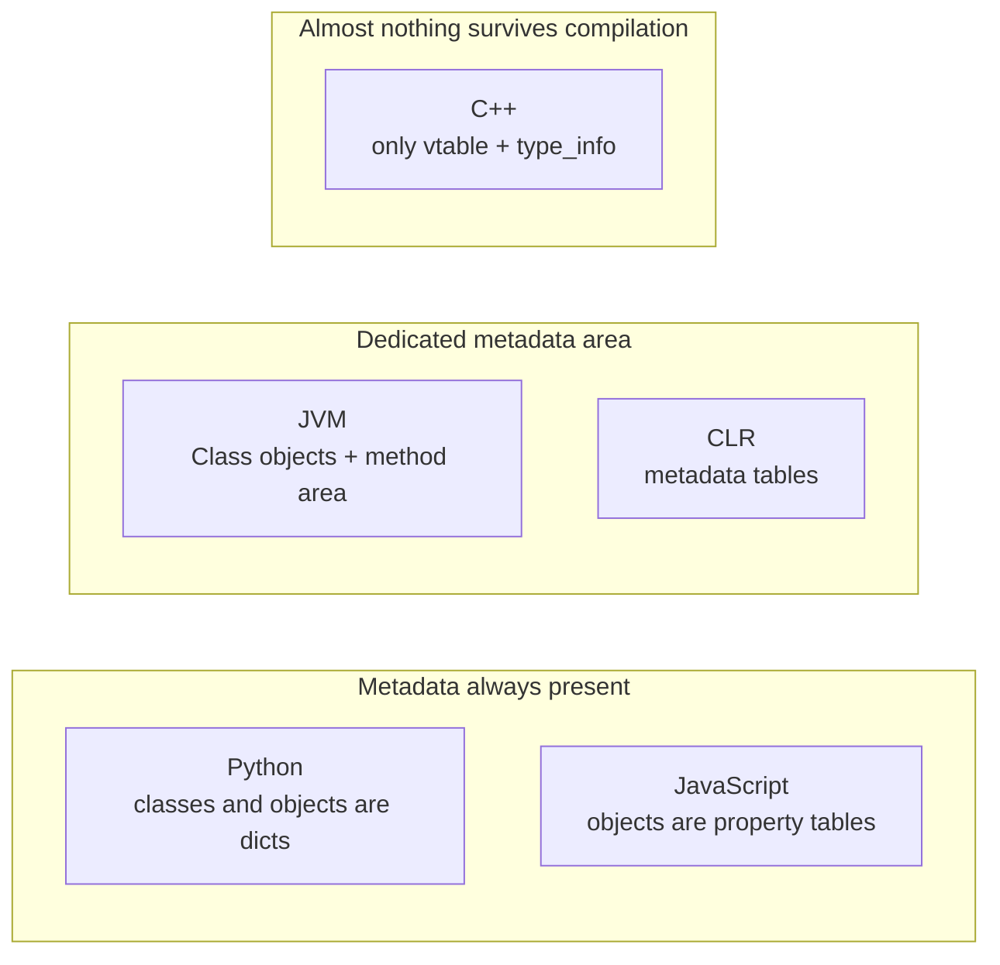

# Chapter 30 · Reflection

[简体中文](./30-reflection.md) ｜ **English**

---

> Chapter 29 planted a clue: `f.getGenericType()` read `List<String>` **at runtime** — type information does not live only inside the compiler; it sits in memory, queryable by the program itself.
>
> Push that ability to its limit and you get **reflection**: at runtime, a program treats *itself* as data — types, fields, and methods become objects you can enumerate, query, and invoke. One line of `Class.forName("Student")` and a **string** summons an entire type; one more line of `setAccessible(true)` and the `private` so carefully built in Chapter 25 means nothing.
>
> This is the entire trick behind framework magic: Spring has never heard of your class at compile time, yet creates and injects it; Jackson has never seen `Student`, yet serializes it to JSON. **Without reflection, the species called "framework" would not exist.**
>
> But the power and the danger share one source — reflection bypasses compile-time checks, pierces encapsulation, and starts at an order of magnitude slower (measured: Java 3.8×, C# 32×). Our languages spread across a spectrum on "how much of this to give": **Python / JavaScript treat reflection as everyday life, Java / C# ship complete reflection APIs, C++ gives almost nothing** — and the reasons trace back to each runtime's founding design.

## 1. Learning Objectives

By the end of this chapter, you will be able to:

- Explain reflection's three levels — **introspection**, **dynamic invocation**, **dynamic creation/modification** — and demonstrate each in all six languages;
- Explain **where metadata comes from**: why the JVM / CLR / Python / JS runtimes "remember" type structure while a compiled C++ binary remembers almost nothing;
- Measure the **limits of piercing encapsulation**: when Java's `setAccessible` works, when the module system stops it, and why JavaScript's `#private` is invisible even to `Reflect`;
- Use measured numbers (Java 3.8×, C# 32×, Python 1.8×) to explain **reflection's performance cost** and why the three gaps differ so wildly;
- Decide **which code should use reflection and which should stay away** — the boundary between frameworks and business code.

---

## 2. Why This Concept Exists

### The framework's dilemma: it has never met your class

Imagine writing a JSON serialization library. Users will feed it `Student`, `Order`, `Blog` — **classes that did not exist when you wrote the library**.

```java
// Your library must turn "any object" into JSON — without knowing its fields
String toJson(Object obj) {
    // What fields does obj have? Named what? Typed what?
    // Compile time cannot answer — you must ask at runtime
}
```

Without reflection there are only two roads, and the C++ ecosystem walks them to this day (§7):

| Old road | Approach | Cost |
|----------|----------|------|
| **Manual registration** | Every class writes its own `toJson()`, or hand-registers a field list | Boilerplate per class; one missed field is a bug |
| **Code generation** | A tool scans sources before compilation and emits the code | An extra build step — Qt's moc and protobuf live here |

### Reflection's answer: type information is itself an object

```java
Class<?> c = obj.getClass();               // the type's "manual"
for (Field f : c.getDeclaredFields()) {    // enumerate every field
    json.put(f.getName(), f.get(obj));     // names and values on demand
}
```

**Measured** (enumerating `Student`):

```text
field: String name
field: int score
method: secret / getScore / getName
```

One piece of code serializes every type — the core of Jackson / Gson. One step further, even *creating* objects can be handed to a string:

```java
Class<?> c = Class.forName("Main$Student");            // string -> type
Object obj = c.getDeclaredConstructor(String.class, int.class)
              .newInstance("Alice", 90);                // creation without new
```

> **In one sentence**: reflection turns "type" from a compile-time concept into a **first-class runtime object** — a program gains the power to describe and operate on itself. A class name in a config file, a marker on an annotation — both can become live objects. This is the shared foundation of dependency injection, ORMs, serialization, and test frameworks.

---

## 3. How It Works

### Where metadata comes from: the physical basis of reflection

Reflection is not magic — it reads **type metadata the runtime kept around anyway**. Whether a language offers reflection comes down to whether its runtime **kept that data**:



- **Python / JavaScript**: objects are property dictionaries to begin with (Chapter 24); "enumerating members" is just walking the dict — reflection is not a feature, it is the language's mode of existence;
- **Java / C#**: bytecode carries full type metadata (field tables, method tables, signatures), exposed after loading as `Class` / `Type` objects — reflection is a deliberately designed official API;
- **C++**: the monomorphization philosophy — don't pay for what you don't use (Chapter 29) — discards nearly all type information after compilation, leaving polymorphic classes just a vtable and a `type_info` (enough for `typeid` / `dynamic_cast`). **Field names and method names simply do not exist in the binary.**

### Reflection's three levels

| Level | What it does | Java representative |
|-------|-------------|---------------------|
| ① Introspection | enumerate fields/methods, query types, read signatures | `getDeclaredFields()` |
| ② Dynamic invocation | call methods by name, read/write fields | `Method.invoke()` |
| ③ Dynamic creation/modification | build objects from strings, forge classes at runtime | `Class.forName()` + `newInstance()` |

Each level is more dangerous than the last: introspection only *looks*, invocation starts *doing*, and dynamic creation lets **runtime data decide program behavior** — config files and network input can become executed code. That is the power, and the attack surface.

### Piercing encapsulation: mechanism and limits

Chapter 25 said `private` is a compile-time check — reflection goes around the compiler straight to the runtime, so:

**Java (measured)**:

```java
Field name = c.getDeclaredField("name");
name.setAccessible(true);                  // one line dissolves the protection
name.set(obj, "renamed");
```

```text
private field changed, private method called: renamed's real score is 90
```

But limits exist. **Java 9's module system walled off JDK internals** (measured):

```java
Field value = String.class.getDeclaredField("value");
value.setAccessible(true);
```

```text
InaccessibleObjectException: Unable to make field private final byte[]
java.lang.String.value accessi...
```

**Your own classes cannot stop reflection; modules that never opened themselves can** — Java's new boundary between "frameworks need reflection" and "the runtime needs integrity".

**JavaScript went further** (measured): ES2022 `#private` is **lexically** private — it is not in the property table, so reflection has nothing to grab:

```text
Object.keys cannot see #secret:   ["name","score","motto"]
Reflect.ownKeys cannot either:    ["name","score","motto"]
```

> Across our six languages, **only two kinds of privacy actually stop reflection**: JavaScript's `#field` (lexical — absent from the property table) and Java packages guarded by an unopened module. Every other `private` (Java/C# on your own classes, Python's `__name`) is transparent to reflection — never rest security on access modifiers (Chapter 25's conclusion now has a measured footnote).

### Reflection meets generics: two chapters converge

Chapter 29 said Java generics are compile-time checks plus erasure; reflection bypasses the compiler — multiply the two (measured):

```java
List<String> names = new ArrayList<>();
Method add = List.class.getMethod("add", Object.class);
add.invoke(names, 42);                     // the compiler cannot see reflection
```

```text
List<String> now contains: [42]
```

**Reflective calls happen in the post-erasure world**: the real signature of `add` is `add(Object)`, so anything goes — Chapter 29's heap pollution, manufactured in one line. Deserialization libraries must do their own type checking, which is exactly why they read `getGenericType()`.

---

## 4. JavaScript

**JavaScript objects are enumerable property tables to begin with** — reflection worked before any API existed; ES6 merely standardized it.

### Objects are dictionaries (measured)

```javascript
const s = new Student("Alice", 90);
Object.keys(s);          // ["name","score"]
s["score"];              // 90  <- a string is a member name
```

### Reshaping at runtime (measured)

```javascript
s.motto = "study hard";                            // add a field to an instance
Student.prototype.hello = function () {            // add a method to the "class"
  return `${this.name} says hi`;
};
s.hello();               // works — every instance has it instantly
```

### `Reflect`: the standardized API (ES6, measured)

```javascript
Reflect.ownKeys(s);                        // ["name","score","motto"]
Reflect.get(s, "name");                    // "Alice"
Reflect.construct(Student, ["Bob", 85]);   // same as new Student("Bob", 85)
```

### `Proxy`: from querying to intercepting (measured)

```javascript
const audited = new Proxy(s, {
  get(target, prop, receiver) {
    console.log(`[audit] someone read ${String(prop)}`);
    return Reflect.get(target, prop, receiver);
  },
});
audited.score;    // prints [audit] someone read score, then returns 90
```

`Proxy` intercepts an object's **meta-operations** (get, set, enumerate, delete…). Vue 3's reactivity system is built entirely on it — this crosses from reflection (reading metadata) into **metaprogramming** (changing semantics).

> **Note**: `#private` fields are the single exception (measured) — lexically private, invisible to `Object.keys` / `Reflect.ownKeys` / `JSON.stringify`, and accessing one from outside the class is a **syntax error**. After twenty years of total openness, JavaScript shipped one mechanism that is genuinely sealed — far harder than Java's `private`.

---

## 5. Python

**Python carries "everything is an object" all the way to types themselves** — classes are objects, methods are objects, modules are objects; reflection is ordinary syntax.

### Type information at your fingertips (measured)

```python
s = Student("Alice", 90)
type(s)                  # <class 'Student'>
s.__dict__               # {'name': 'Alice', 'score': 90}  <- the instance is a dict
[m for m in dir(s) if not m.startswith('_') and callable(getattr(s, m))]
                         # ['get_name']
```

### `getattr` / `setattr`: strings are member names (measured)

```python
getattr(s, "name")           # "Alice"
setattr(s, "score", 100)     # s.score = 100
method = getattr(s, "get_name")
method()                     # fetch a method by name, then call it
```

### The other face of `type()`: forging classes at runtime (measured)

```python
Dynamic = type("Dynamic", (Student,), {"motto": lambda self: f"{self.name}: study hard"})
d = Dynamic("Bob", 85)
d.motto()                    # "Bob: study hard"  <- a class with no source code
```

`type(name, bases, attrs)` is what the `class` statement actually calls — ORMs (Django models) and dataclasses use it to manufacture classes in bulk.

### Piercing "privacy" (measured)

```python
s._Student__secret()         # "Alice's real score is 100"
```

Chapter 25 covered this: `__secret` is merely renamed to `_Student__secret` (name mangling). Know the rule and you can call it by name — Python's "private" only ever deterred the polite.

### `inspect`: signatures and even source (measured)

```python
inspect.signature(Student.__init__)    # (self, name='unnamed', score=0)
```

> **Note**: `__slots__` is the only mechanism in Python that blocks "add a field at runtime" (measured: `locked.extra = ...` raises `AttributeError`). But it also deletes `__dict__` — serialization and debugging code that relies on `obj.__dict__` breaks with it. It is a trade; make it consciously.

---

## 6. Java

Java's reflection is the **textbook official API** — a single entry point, complete powers, explicit boundaries.

### The `Class` object: entry to everything (measured)

```java
Class<?> c1 = Student.class;                    // compile-time literal
Class<?> c2 = new Student().getClass();         // ask the object
Class<?> c3 = Class.forName("Main$Student");    // load from a string!
// measured: all three return the same Class object (c1 == c2 && c2 == c3 is true)
```

Each class has exactly one `Class` object per class loader — it is what the "type pointer" in Chapter 24's object header points to.

### The full three levels (measured)

```java
// ① introspection
for (Field f : c1.getDeclaredFields())  ...    // String name / int score
for (Method m : c1.getDeclaredMethods()) ...   // secret / getScore / getName

// ② dynamic creation
Object obj = c1.getDeclaredConstructor(String.class, int.class)
               .newInstance("Alice", 90);

// ③ dynamic invocation
Method getName = c1.getMethod("getName");
getName.invoke(obj);                            // "Alice"
```

### Piercing and its boundary (measured)

```java
name.setAccessible(true);       // ✓ your own class: private means nothing
value.setAccessible(true);      // ✗ String internals: InaccessibleObjectException
```

Since Java 9's module system, `setAccessible` works only on **modules opened to you**. Frameworks needing deep reflection require the user's explicit `--add-opens` — piercing encapsulation went from a default power to an explicit grant.

### Annotations + reflection: the standard framework recipe

```java
@Retention(RetentionPolicy.RUNTIME)             // keep the annotation at runtime
@interface JsonField { String value(); }

class Student {
    @JsonField("student_name") private String name;
}

// framework side: read the annotation, decide behavior
for (Field f : c.getDeclaredFields()) {
    JsonField tag = f.getAnnotation(JsonField.class);
    if (tag != null) json.put(tag.value(), f.get(obj));
}
```

**Annotations declare intent; reflection discovers and executes it** — Spring's `@Autowired`, JPA's `@Column`, JUnit's `@Test` are all this one recipe.

> **Note**: obtaining reflective objects is expensive (`getMethod` walks the method table), so **frameworks cache `Method` / `Field` objects** and keep only `invoke` on the hot path. For the last drop of performance use `MethodHandle` (JDK 7+) or generate bytecode at build time (the Lombok / MapStruct route).

---

## 7. C++

**C++ has no reflection** — not an omission but a philosophy: don't pay for what you don't use (the same principle as Chapter 29's monomorphization). Field and method names never make it into the binary.

### Everything the language gives: RTTI (measured)

```cpp
std::unique_ptr<Student> s = std::make_unique<GradStudent>();
const Student& ref = *s;
typeid(ref).name();                    // "11GradStudent" <- dynamic type recognized
typeid(ref) == typeid(GradStudent);    // true

if (auto* g = dynamic_cast<GradStudent*>(s.get())) { ... }   // checked downcast
dynamic_cast<GradStudent*>(&plain);    // nullptr (fails safely, no crash)
```

RTTI (runtime type identification) answers exactly one question: **what is this polymorphic object's dynamic type**. It reads a `type_info` pointer hung off the vtable — hence it works only for classes with virtual functions.

### RTTI's limits (measured output)

```text
Enumerate Student's fields/methods?   Impossible — the language has no such power
Call title() by its string name?      Impossible — function names vanish at compile time
```

### The ecosystem's substitute: build the metadata yourself

```cpp
std::map<std::string, std::function<std::unique_ptr<Student>()>> factory;
factory["GradStudent"] = [] { return std::make_unique<GradStudent>(); };
auto obj = factory["GradStudent"]();   // "create by string" — only what you registered
```

**Measured**: `factory["GradStudent"]() -> title() = grad student`.

This hand-built registry is daily life in C++ frameworks. Scaled up, it becomes tooling:

| Approach | Principle | Examples |
|----------|-----------|----------|
| Macro registration | macros register metadata as they expand | game engines' `REFLECT()` macros |
| Code generation | scan sources pre-build, emit registration code | Qt's moc, the protobuf compiler |
| Template introspection | probe members at compile time (SFINAE / Concepts) | serialization library cereal |

> **Note**: C++26 has adopted **static reflection** (`std::meta`) — enumerate members and read names **at compile time**, zero runtime cost, consistent with the monomorphization philosophy. As compilers catch up, much of the manual machinery above will retire; but "summon a type from a string at runtime" will still not exist — that requires metadata C++ refuses to pay for.

---

## 8. C#

C# reflection shares Java's ancestry and structure, with two traits of its own: **attributes woven deep into the ecosystem**, and a **much steeper performance bill** (measured 32×, analyzed in §12).

### The `Type` object and all three levels (measured)

```csharp
Type t1 = typeof(Student);                 // compile-time literal
Type t2 = new Student().GetType();         // ask the object
Type t3 = Type.GetType("Student");         // load from a string
// measured: all three return the same Type object (True)

object obj = Activator.CreateInstance(t1, "Alice", 90);     // dynamic creation
MethodInfo getName = t1.GetMethod("GetName");
getName.Invoke(obj, null);                                  // "Alice"
```

### ⚠️ `BindingFlags`: the classic trap (measured)

```csharp
t1.GetField("name");        // null! default searches public only — no exception, silent null
t1.GetField("name", BindingFlags.NonPublic | BindingFlags.Instance);   // ✓ found
```

**Measured**: omit the flags and you get `null` instead of an exception — the error is deferred to a later `NullReferenceException`, lines away from the real cause.

### Piercing encapsulation (measured)

```csharp
FieldInfo name = t1.GetField("name", BindingFlags.NonPublic | BindingFlags.Instance);
name.SetValue(obj, "renamed");
// measured: private field changed, private method called: renamed's real score is 90
```

C# has no Java-style module switch — `private` is uniformly transparent to reflection (AOT scenarios aside).

### Attributes + reflection: the foundation of .NET

```csharp
[Table("students")]                        // the ORM reads this for the table name
class Student {
    [JsonPropertyName("student_name")]     // the serializer reads this for the field name
    public string Name { get; set; }
}

var attr = typeof(Student).GetCustomAttribute<TableAttribute>();
```

Structurally identical to Java's annotation recipe. ASP.NET routing, Entity Framework mapping, xUnit test discovery — all of it.

> **Note**: reflection is the natural enemy of AOT compilation (iOS, Native AOT) — "summoning types from strings" defeats static trimming. .NET's new answer is the **Source Generator**: move "read metadata by reflection" to compile time and emit code; `System.Text.Json` already ships this mode. The direction converges with C++26 static reflection — **metaprogramming is migrating from runtime back to compile time**.

---

## 9. SQL

The database counterpart of reflection is the **metadata query** — the schema itself is data, and can be `SELECT`ed.

### ① `sqlite_master`: the database's "Class object" (measured)

```sql
SELECT type, name FROM sqlite_master ORDER BY type, name;
```

```text
index|idx_student_score
table|student
view|top_student          <- one row per table/index/view: the database's member list
```

### ② `PRAGMA table_info`: enumerating a table's "fields" (measured)

```sql
PRAGMA table_info(student);
```

```text
0|id|INTEGER|0||1
1|name|TEXT|1||0
2|score|INTEGER|0|0|0     <- name, type, not-null, default, primary key — all on demand
```

### ③ Even the CREATE statement is stored (measured)

```sql
SELECT sql FROM sqlite_master WHERE name = 'student';
-- CREATE TABLE student (id INTEGER PRIMARY KEY, name TEXT NOT NULL, ...)
```

Standard SQL's counterpart is `information_schema` (MySQL / PostgreSQL / SQL Server all ship it); same idea: **the schema is tables, so query it like tables**.

### Who uses the database's "reflection"

| User | Usage |
|------|-------|
| ORMs | read metadata at startup, build the table ↔ class mapping — meeting code-side reflection (§6) halfway |
| Migration tools | diff "current schema" against "target schema", emit `ALTER TABLE` |
| Database clients | table/column autocompletion is live metadata queries |

> **Engineering note**: when composing SQL dynamically from metadata (say, ordering by a user-chosen column), the column name must be validated against a metadata whitelist — splicing external strings into SQL is an injection hole (Chapter 58). **"Strings becoming executable things" is the same attack surface in every language** — identical to reflection's `Class.forName(userInput)`.

---

## 10. Cross-Language Comparison

### ① Reflection capability matrix

| Capability | JavaScript | Python | Java | C++ | C# |
|-----------|-----------|--------|------|-----|-----|
| Ask "what type is this" | `typeof` / `instanceof` | `type()` | `getClass()` | **`typeid` only (RTTI)** | `GetType()` |
| Enumerate fields/methods | `Object.keys` / `Reflect` | `dir()` / `__dict__` | `getDeclaredFields()` | ❌ | `GetFields()` |
| Call a member by string | `obj[name]` | `getattr()` | `Method.invoke()` | ❌ | `MethodInfo.Invoke()` |
| Create from a string | `Reflect.construct` | `type()` forging | `Class.forName()` | ❌ (manual registry) | `Activator` |
| Pierce private | — | ✅ `_Cls__x` | ✅ `setAccessible` | — | ✅ `BindingFlags.NonPublic` |
| Privacy that stops reflection | ✅ **`#field`** | ❌ | ✅ **unopened modules** | — (nothing to stop) | ❌ |
| Reshape classes at runtime | ✅ prototypes are open | ✅ | ❌ fixed after loading | ❌ | ❌ |
| Declarative metadata | decorators (proposal) | decorators | **annotations** | ❌ | **attributes** |

### ② Two design divides

**Divide one: keep metadata by default, or discard it by default**

```text
Keep everything (Python / JS):  reflection is everyday life, zero friction — but objects are open to all, optimization is hard
Keep deliberately (Java / C#):  a complete API with explicit borders — metadata is a formal part of the bytecode
Discard by default (C++):       pay nothing — want metadata, build it yourself (registries / moc / codegen)
```

**Divide two: does private stop reflection**

```text
No (Java's own classes / C# / Python):  private is a compile-time check, transparent at runtime
Yes (JS #field / Java module borders):  privacy is built into runtime semantics; reflection has no purchase
```

> Note the reversal: **the most dynamic language, JavaScript, owns the hardest privacy of all six** (`#field`, lexical); **Java, the great house of encapsulation, leaves its own classes naked before reflection**. Design is not a single dynamic-vs-static axis — every language is paying down its own history.

### ③ Common ground and root causes

**Common ground**: all five languages can answer "what type is this object" (everyone has at least RTTI); every language with reflection uses it to hold up its framework ecosystem (DI / ORM / serialization / test discovery); and all pay the same trio of costs — speed, static analyzability, encapsulation integrity.

**Root causes**:

- **Python / JS object models are dictionaries** — reflection is a free by-product; not offering it would take effort;
- **Java / C# were born into the framework era** — enterprise ecosystems demanded declarative programming (annotations/attributes + containers), so reflection is official strategy;
- **C++ users pay by the nanosecond** — metadata's space and load costs are unacceptable, so the problem is outsourced to tooling;
- **The trend is converging**: C++26 static reflection, C# Source Generators, Java annotation processors — **all three routes are moving metaprogramming from runtime back to compile time**, keeping the power without the runtime bill.

---

## 11. Implementation Comparison

| Language · mechanism | Where metadata lives | How reflection works |
|---------------------|---------------------|---------------------|
| **V8 (JavaScript)** | hidden classes (shapes) + property tables | `Object.keys` walks the property table; `Proxy` inserts a trap layer — **every meta-operation detours through the handler** (which is why Proxy is slow) |
| **CPython** | `__dict__` of objects/classes; types are `PyTypeObject` | `getattr` walks the MRO's dicts (Chapter 26) — the **same path as normal attribute access**, hence the small overhead |
| **JVM (Java)** | class metadata in the method area, exposed as `Class` objects | `Field`/`Method` wrap the metadata; `invoke` goes through JNI or generated bridge classes; the JIT can partially inline hot reflective calls |
| **C++ (native)** | only vtable + `type_info` (polymorphic classes only) | `typeid` reads the vtable pointer; `dynamic_cast` searches the inheritance graph — **names do not exist in the binary** |
| **CLR (C#)** | metadata tables in the assembly (part of ECMA-335) | `Type`/`MethodInfo` wrap the tables; `Invoke` boxes arguments and runs security checks **every call** — the highest bill (measured 32×) |

**A distinction worth memorizing**:

```text
Reflection on the "normal path" (Python getattr ≈ ordinary access)         -> small bill (measured 1.8×)
Reflection on a "detour" (Java/C# invoke with checks and boxing)           -> big bill (measured 3.8× / 32×)
```

---

## 12. Performance Analysis

### Measured: direct vs reflective calls (10 million iterations, within-language)

| Language | Direct | Reflective | Gap |
|----------|--------|-----------|-----|
| Java | `s.getScore()` 4.6–4.9 ms | `Method.invoke` 17.9–18.2 ms | **~3.8×** |
| C# | `s.GetScore()` 2.6 ms | `MethodInfo.Invoke` 82.4 ms | **~32×** |
| Python | `s.score` 156 ms | `getattr(s, "score")` 280 ms | **~1.8×** |

Three gaps, three mechanisms:

- **Python's 1.8×**: `s.score` is a dict lookup anyway; `getattr` is one extra hop on the same road — **on an already-slow baseline, reflection charges almost nothing extra**;
- **Java's 3.8×**: `invoke` packs arguments (`Object[]`), checks access, and adds an indirect jump, but the JIT generates bridge code for hot reflective call sites, keeping the bill within a few ×;
- **C#'s 32×**: `MethodInfo.Invoke` boxes the argument array and runs security checks on **every** call, and the CLR does not optimize it as aggressively as the JVM — the official advice is "keep `Invoke` off hot paths"; use `Delegate.CreateDelegate` or a Source Generator instead.

### What frameworks actually do: reflect once, execute many

```text
Startup (cold path): reflect over types -> read annotations -> build an execution plan (cache Method/Field/delegates)
Runtime (hot path):  execute the plan; no more reflection
```

This is why Spring boots slowly yet runs fast — **reflection's cost is amortized into startup**. Conversely: `getMethod` + `invoke` on every request moves the cold path's bill into the hot path.

### Two hidden bills beyond speed

| Bill | Symptom |
|------|---------|
| **Not statically analyzable** | AOT / tree-shaking / obfuscators cannot see inside `forName("...")` — GraalVM and .NET AOT both demand explicit reflection configuration |
| **Optimizations suppressed** | fields/methods touched by reflection resist inlining, escape analysis, and other aggressive JIT work |

---

## 13. Engineering Practice

| Scenario | ✅ Recommended | ❌ Avoid | Why |
|----------|--------------|---------|-----|
| Writing frameworks/libraries (DI, ORM, serialization) | reflection + annotations/attributes | making users hand-register | this is what reflection is for |
| Business code | direct calls, plain `new` | reflective calls "for flexibility" | slow + unanalyzable + refactor-hostile |
| Obtaining reflective objects | **once at startup, cached** | `getMethod` on the hot path | lookup costs far more than invocation (§12) |
| C# hot-path dynamic calls | `CreateDelegate` / Source Generator | `MethodInfo.Invoke` | the measured 32× |
| Class names from external input | whitelist, then `forName` | `forName(userInput)` directly | the classic deserialization-RCE entry |
| Unit-testing private methods | refactor to a testable interface | forcing them via reflection | tests couple to internals and shatter on refactor |
| Deep reflection on Java 9+ | explicit `--add-opens`, documented | opening every module globally | preserve the module system's integrity |
| C++ "create by name" | registry / code generation | waiting for language reflection | it isn't coming; C++26's is compile-time only |

### The rule of thumb

```text
You are writing code that handles ARBITRARY types (a framework)  -> reflection is the right tool
You know the type and just want to save a few lines              -> reflection is self-inflicted debt
```

---

## 14. Best Practices

- **Frameworks use reflection; business code does not**: seeing `Class.forName` / `getattr` chains in business logic, ask "the type is known — why the detour?"
- **Reflect once, execute many**: fetch and cache `Method` / `Field` / `PropertyInfo` at startup; hot paths only execute.
- **Annotations/attributes declare intent, reflection discovers and executes** — the recipe proven by Spring and .NET; don't invent a third way.
- **Treat external strings with hostility**: input to `forName` / `GetType(str)` must be whitelisted — "strings becoming code" is the universal shape of injection.
- **Don't test privates via reflection**: code testable only by reflection indicts its design first.
- **Inventory reflection for AOT targets**: GraalVM / .NET Native demand reflection manifests; whatever can move to Source Generators / annotation processors, move to compile time.
- **Use Python metaprogramming sparingly**: `getattr` chains and dynamic classes blind IDEs and type checkers — Chapter 29's annotations protect nothing against dynamic magic.
- **Need real privacy in JS? Use `#field`**: the only privacy in all six languages that even reflection cannot breach.

---

## 15. Common Pitfalls

**Pitfall 1 · C#'s `BindingFlags` fails silently (measured)**

```csharp
t1.GetField("name");        // null — default searches public only, no exception
```

**Avoid it**: for non-public members always spell out `BindingFlags.NonPublic | BindingFlags.Instance`; assert non-null on reflective lookups so failures explode at the scene.

**Pitfall 2 · Java 9+ module boundaries (measured)**

```text
String.class.getDeclaredField("value").setAccessible(true)
→ InaccessibleObjectException: Unable to make field private final byte[] ...
```

**Avoid it**: when a JDK upgrade floods old frameworks with this error, add the suggested `--add-opens`; new code should simply not depend on JDK internals.

**Pitfall 3 · Reflection bypasses generics and manufactures heap pollution (measured)**

```java
add.invoke(names, 42);       // an Integer now lives in a List<String>
```

**Avoid it**: data written via reflection needs its own type validation (frameworks read `getGenericType()` for exactly this); prefer an extra `instanceof` at the boundary.

**Pitfall 4 · String references blind refactoring**

```java
c.getDeclaredField("name");   // rename name -> fullName and this line silently rots
```

**Avoid it**: centralize reflected names as constants; back them with integration tests — **the compiler cannot protect strings**.

**Pitfall 5 · Repeated lookups on the hot path (measured scale)**

```text
getMethod + invoke per request -> the startup bill moved into the hot path (32× in C#)
```

**Avoid it**: cache reflective objects; switch C# to `CreateDelegate`; truly hot paths return to direct calls.

**Pitfall 6 · Python `__slots__` vs dynamic attributes (measured)**

```python
locked.extra = "no"          # AttributeError: 'Locked' object has no attribute 'extra'
```

**Avoid it**: `__slots__` saves memory by deleting `__dict__` — serialization, mocking, and monkey-patching that rely on it all break. It is a trade; choose deliberately.

**Pitfall 7 · Deserializing arbitrary class names = remote code execution**

```java
Class.forName(jsonInput.get("type"))    // the attacker names any class
```

**Avoid it**: this is a recurring real-world vulnerability class (Java deserialization, Jackson polymorphic typing). Class names from outside **must** be whitelisted; leave polymorphic deserialization off unless you truly need it.

---

## 16. Interview Questions

**Basic**

1. What is reflection? What are its three levels of capability?
2. How do `Class.forName` and `Student.class` differ? When is each used?
3. Why can frameworks like Spring and Jackson not live without reflection?

**Intermediate**

4. **Why can reflection bypass `private`? Which mechanisms genuinely stop it?**
5. Why are reflective calls slow, and how do frameworks amortize the cost?
6. **What happens when reflection meets type erasure? Why do deserializers read `getGenericType()`?**

**Advanced**

7. **Compare the measured reflection overheads — Java 3.8×, C# 32×, Python 1.8×. Why do they differ so much?**
8. Why does C++ offer no reflection? What does its ecosystem use instead, and what does C++26 static reflection change?
9. Why is reflection the enemy of AOT compilation, and how do Source Generators / annotation processors resolve the conflict?

---

## 17. Exercises

**Basic**

1. In all six languages, enumerate `Student`'s fields and methods (for C++, explain why it is impossible and simulate with a registry).
2. In Java and C#, create an object from a string class name and invoke a method on it.
3. Use Python's `type()` to forge a class with two methods at runtime.

**Intermediate**

4. **Measure the boundary of piercing**: call `setAccessible(true)` on your own class and on `java.lang.String`; observe both outcomes.
5. Build a mini JSON serializer (under 60 lines) with the "annotation/attribute + reflection" recipe, supporting `@JsonField("alias")`.
6. Reproduce "reflection bypasses generics": put an integer into a `List<String>`, then find the exact line that explodes on read.

**Challenge**

7. Re-run this chapter's performance table in Java / C# / Python, then add a C# series comparing `Delegate.CreateDelegate` against `Invoke`.
8. Use JS `Proxy` to build a minimal reactivity system: collect dependencies on reads, trigger callbacks on writes (Vue 3's core idea).
9. Write a SQL script that reads `sqlite_master` and `PRAGMA table_info` to generate a `SELECT` template for every table — a taste of what an ORM does at startup.

---

## 18. Chapter Summary

**One sentence**: reflection turns types from compile-time concepts into first-class runtime objects, letting programs query, invoke, and create types they never met at compile time — the shared foundation of frameworks (DI / ORM / serialization); but power and danger share one source: it bypasses compile-time checks (measured: manufacturing heap pollution), pierces encapsulation (measured: rewriting `private`; only JS's `#field` and Java's module borders hold), and costs around an order of magnitude (measured: Java 3.8×, C# 32×, Python 1.8×) — hence the rule: **frameworks use it to handle arbitrary types; business code calls known types directly**.

**Key takeaways**

- **Three levels**: introspection → dynamic invocation → dynamic creation/modification; each more powerful and more dangerous.
- **Metadata decides everything** (measured): Python/JS objects are dicts (reflection free), JVM/CLR keep dedicated metadata (official APIs), C++ keeps nothing (RTTI only; "impossible" measured).
- **The piercing boundary** (measured): your own classes fall everywhere (Java/C#/Python); only JS `#field` and unopened Java modules stand (`InaccessibleObjectException`).
- **Reflection × erasure** (measured): `add.invoke(names, 42)` — heap pollution in one line; reflection lives in the post-erasure world.
- **The performance spectrum** (measured): Python 1.8× (normal path), Java 3.8× (JIT-tamed), C# 32× (boxing + checks per call) — frameworks amortize via "reflect once, execute many".
- **The database is isomorphic** (measured): `sqlite_master` / `PRAGMA table_info` are schema reflection; dynamic SQL and `forName(userInput)` are the same attack surface.
- **The trend**: C++26 static reflection, C# Source Generators, Java annotation processors — metaprogramming is migrating back to compile time.

**Checklist**

- [ ] I can demonstrate reflection's three levels and state each level's risks.
- [ ] I know which kinds of "private" stop reflection and which do not.
- [ ] I can explain why the three languages' reflection overheads differ so widely.
- [ ] I know how frameworks dodge the hot-path cost via startup reflection + caching.
- [ ] I can describe the "strings become code" attack surface and why whitelists are mandatory.

**Next chapter**: with these eight chapters — classes, objects, encapsulation, inheritance, polymorphism, interfaces, generics, reflection — Part 4 closes, and the object's **logical form** is fully told. But a more basic question still hangs: where do these objects actually **live**? Where in memory does `new` put things? Why do some variables vanish with their function while others wait for the GC? Chapter 31 opens **Part 5 · Runtime** with the **panorama of memory** — code area, static area, Stack, Heap: what goes where and why — the final foundation for understanding the deepest differences among our five languages.

---

## 19. Further Reading

- <a href="https://en.wikipedia.org/wiki/Reflective_programming" target="_blank" rel="noopener">Wikipedia: Reflective programming</a> — concept survey and per-language support.
- <a href="https://docs.oracle.com/javase/tutorial/reflect/" target="_blank" rel="noopener">Oracle Tutorial · The Reflection API</a> — the official Java reflection tutorial.
- <a href="https://learn.microsoft.com/en-us/dotnet/fundamentals/reflection/reflection" target="_blank" rel="noopener">Microsoft Learn · Reflection in .NET</a> — the official guide to `Type` / `MethodInfo`.
- <a href="https://learn.microsoft.com/en-us/dotnet/csharp/roslyn-sdk/source-generators-overview" target="_blank" rel="noopener">Microsoft Learn · Source Generators</a> — .NET's "compile-time reflection".
- <a href="https://docs.python.org/3/library/inspect.html" target="_blank" rel="noopener">Python Docs · inspect</a> — signatures, sources, and frames, officially.
- <a href="https://developer.mozilla.org/en-US/docs/Web/JavaScript/Reference/Global_Objects/Reflect" target="_blank" rel="noopener">MDN · Reflect</a> — the ES6 standard reflection API.
- <a href="https://developer.mozilla.org/en-US/docs/Web/JavaScript/Reference/Global_Objects/Proxy" target="_blank" rel="noopener">MDN · Proxy</a> — the authoritative reference on meta-operation traps.
- <a href="https://en.cppreference.com/w/cpp/language/typeid" target="_blank" rel="noopener">cppreference · typeid</a> — the authoritative C++ RTTI reference.
- <a href="https://www.sqlite.org/schematab.html" target="_blank" rel="noopener">SQLite Docs · The Schema Table</a> — the official `sqlite_master` documentation.
