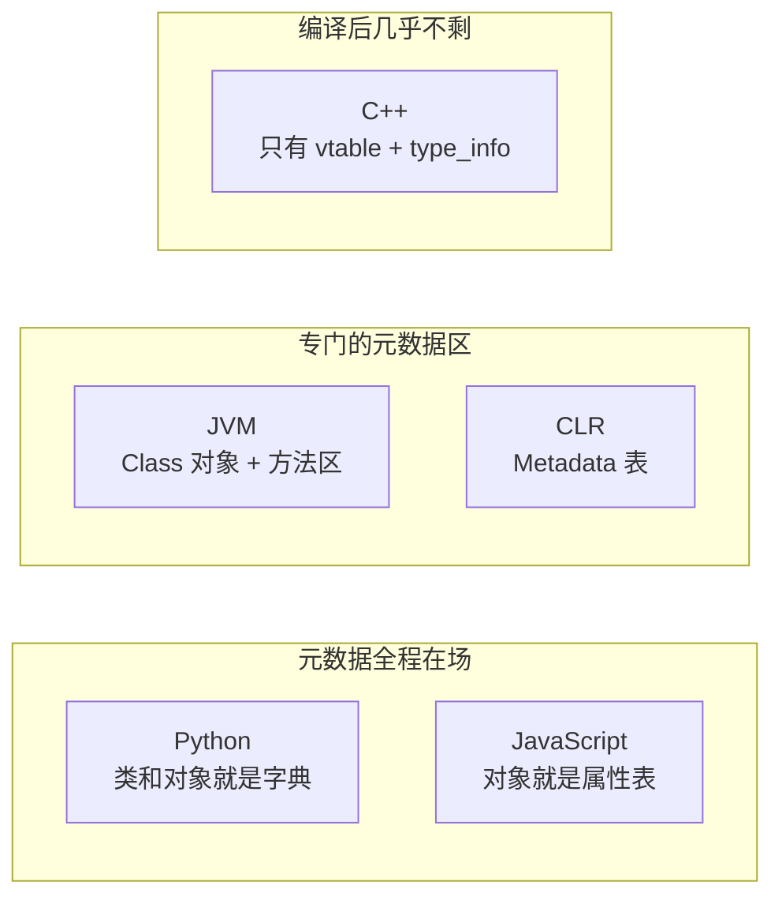

# 第 30 章 · 反射

**简体中文** ｜ [English](./30-reflection.en-US.md)

---

> 第 29 章埋了一个伏笔：`f.getGenericType()` 在**运行时**读出了 `List<String>`——类型信息不只活在编译器里，它就躺在内存中，可以被程序自己查询。
>
> 把这个能力推到极致，就是**反射**：程序在运行时把"自己"当成数据——类型、字段、方法都是可以枚举、查询、调用的对象。一行 `Class.forName("Student")`，一个**字符串**就能召唤出整个类型；再一行 `setAccessible(true)`，第 25 章苦心经营的 `private` 形同虚设。
>
> 这正是框架魔法的全部底牌：Spring 在编译期根本不知道你的类存在，却能创建它、注入它；Jackson 从没见过 `Student`，却能把它序列化成 JSON。**没有反射，就没有"框架"这个物种**。
>
> 但威力与危险同源——反射绕过编译期检查、击穿封装、慢一个数量级起步（实测 Java 3.8×、C# 32×）。六门语言在"给不给这个能力"上拉开了一条光谱：**Python / JavaScript 反射即日常，Java / C# 提供完整反射 API，C++ 几乎什么都不给**——这条光谱的成因，又回到了各自运行时的根本设计。

## 1. 学习目标

本章结束后，你将能够：

- 说清反射的三层能力——**查询**（introspection）、**动态调用**、**动态创建/修改**——并用六门语言各自演示；
- 解释**元数据从哪来**：为什么 JVM / CLR / Python / JS 运行时"记得"类型结构，而 C++ 编译后几乎什么都不剩；
- 实测**击穿封装的边界**：Java 的 `setAccessible` 何时有效、何时被模块系统拦下，JavaScript 的 `#private` 为什么连 `Reflect` 都拿不到；
- 用实测数据说明**反射的性能代价**（Java 3.8×、C# 32×、Python 1.8×），并解释三者差距悬殊的原因；
- 判断**什么代码该用反射、什么代码该远离它**——框架与业务代码的分界线。

---

## 2. 为什么会出现这个概念

### 框架的困境：它不认识你的类

想象你在写一个 JSON 序列化库。用户会拿它序列化 `Student`、`Order`、`Blog`——**这些类在你写库的时候根本不存在**。

```java
// 你的库要把"任何对象"变成 JSON——但你不知道它有哪些字段
String toJson(Object obj) {
    // obj 里有什么字段？叫什么名字？什么类型？
    // 编译期无从知晓——你需要在运行时问出答案
}
```

没有反射，只剩两条路，C++ 生态至今仍在走（第 7 节详述）：

| 老路 | 做法 | 代价 |
|------|------|------|
| **手工注册** | 每个类自己写 `toJson()`，或手工登记字段清单 | 每个类都要写样板代码，漏一个字段就是 bug |
| **代码生成** | 编译前用工具扫描源码，生成序列化代码 | 引入构建步骤，Qt 的 moc、protobuf 都是这条路 |

### 反射的答案：类型信息本身就是对象

```java
Class<?> c = obj.getClass();               // 拿到类型的"说明书"
for (Field f : c.getDeclaredFields()) {    // 枚举所有字段
    json.put(f.getName(), f.get(obj));     // 名字和值都问得到
}
```

**实测**（枚举 `Student` 的结构）：

```text
字段: String name
字段: int score
方法: secret / getScore / getName
```

一份代码序列化一切类型——这就是 Jackson / Gson 的核心原理。再往前一步，连"创建对象"都可以交给字符串：

```java
Class<?> c = Class.forName("Main$Student");            // 字符串 → 类型
Object obj = c.getDeclaredConstructor(String.class, int.class)
              .newInstance("小明", 90);                 // 不写 new 的创建
```

> **一句话**：反射把"类型"从编译期的概念变成**运行时的一等对象**——程序因此获得了描述自己、操作自己的能力。配置文件里的一行类名、注解上的一个标记，从此都能变成活的对象。这是依赖注入、ORM、序列化、测试框架的共同地基。

---

## 3. 底层原理

### 元数据从哪来：反射能力的物质基础

反射不是魔法——它读的是**运行时本来就留着的类型元数据**。各语言给不给反射，取决于它的运行时**留没留这份数据**：



- **Python / JavaScript**：对象本来就是属性字典（第 24 章），"枚举成员"就是遍历字典——反射不是附加功能，是语言的存在方式；
- **Java / C#**：字节码里带完整的类型元数据（字段表、方法表、签名），虚拟机加载后以 `Class` / `Type` 对象的形式暴露——反射是精心设计的官方 API；
- **C++**：单态化哲学"不为用不到的东西付费"（第 29 章）——编译后类型信息几乎全部丢弃，只给多态类留一张 vtable 和一个 `type_info`（够 `typeid` / `dynamic_cast` 用），**字段名、方法名在二进制里根本不存在**。

### 反射的三层能力

| 层次 | 能做什么 | Java 代表 API |
|------|---------|--------------|
| ① 查询（introspection） | 枚举字段/方法、问类型、读签名 | `getDeclaredFields()` |
| ② 动态调用 | 按名字调方法、读写字段 | `Method.invoke()` |
| ③ 动态创建/修改 | 从字符串造对象、运行时造类 | `Class.forName()` + `newInstance()` |

三层逐级危险：查询只是"看"，调用开始"做"，而动态创建让**程序的行为由运行时的数据决定**——配置文件、网络输入都可能变成被执行的代码，这是威力也是攻击面。

### 击穿封装：机制与边界

第 25 章说 `private` 是编译期检查——反射恰好绕开编译器直达运行时，于是：

**Java**（实测）：

```java
Field name = c.getDeclaredField("name");
name.setAccessible(true);                  // 一行破除保护
name.set(obj, "被改名");
```

```text
私有字段已改，私有方法照调: 被改名 的真实分数是 90
```

但边界存在。**Java 9 的模块系统把 JDK 内部类保护了起来**（实测）：

```java
Field value = String.class.getDeclaredField("value");
value.setAccessible(true);
```

```text
InaccessibleObjectException: Unable to make field private final byte[]
java.lang.String.value accessi...
```

**你自己的类挡不住反射，未显式开放的模块挡得住**——这是 Java 在"框架需要反射"和"运行时需要完整性"之间画的新边界。

**JavaScript 走得更绝**（实测）：ES2022 的 `#private` 是**词法层面**的私有，不在属性表里，反射根本无从下手：

```text
Object.keys 看不到 #secret: ["name","score","motto"]
Reflect.ownKeys 也看不到:   ["name","score","motto"]
```

> 六门语言里，**真正挡得住反射的私有只有两个**：JavaScript 的 `#field`（词法私有，属性表里没有）和 Java 模块系统保护的内部包。其余的 `private`（Java/C# 自己的类、Python 的 `__name`）在反射面前全部形同虚设——设计 API 时别把安全寄托在访问修饰符上（第 25 章的结论在这里有了实测注脚）。

### 反射与泛型：两章知识的交汇

第 29 章说 Java 泛型是编译期检查 + 擦除；反射恰好绕过编译器——两件事相乘（实测）：

```java
List<String> names = new ArrayList<>();
Method add = List.class.getMethod("add", Object.class);
add.invoke(names, 42);                     // 编译器管不到反射
```

```text
List<String> 里被塞进了: [42]
```

**反射调用发生在擦除后的世界**：`add` 的真实签名就是 `add(Object)`，塞什么都合法——第 29 章的堆污染，用反射一行就能制造。框架（如反序列化库）必须自己承担类型校验，这正是它们读 `getGenericType()` 的原因。

---

## 4. JavaScript

**JavaScript 的对象本来就是可枚举的属性表**——反射不需要专门的 API 也能做，ES6 只是把它标准化了。

### 对象即字典（实测）

```javascript
const s = new Student("小明", 90);
Object.keys(s);          // ["name","score"]
s["score"];              // 90  ← 字符串就是成员名
```

### 运行时改结构（实测）

```javascript
s.motto = "好好学习";                              // 给实例加字段
Student.prototype.hello = function () {            // 给"类"加方法
  return `${this.name} 说你好`;
};
s.hello();               // "小明 说你好" ← 所有实例立刻都有了
```

### `Reflect`：标准化的反射 API（ES6，实测）

```javascript
Reflect.ownKeys(s);                    // ["name","score","motto"]
Reflect.get(s, "name");                // "小明"
Reflect.construct(Student, ["小红", 85]);   // 等价 new Student("小红", 85)
```

### `Proxy`：从"查询"升级到"拦截"（实测）

```javascript
const audited = new Proxy(s, {
  get(target, prop, receiver) {
    console.log(`[审计] 有人读取了 ${String(prop)}`);
    return Reflect.get(target, prop, receiver);
  },
});
audited.score;    // 先打印 [审计] 有人读取了 score，再返回 90
```

`Proxy` 拦截对象的**元操作**（读、写、枚举、删除……），Vue 3 的响应式系统整个建立在它之上——这已经从反射（读元数据）跨入了**元编程**（改语义）。

> **注意事项**：`#private` 字段是唯一的例外（实测）——它是词法私有，`Object.keys` / `Reflect.ownKeys` / `JSON.stringify` 全都看不到，类外访问直接是**语法错误**。JavaScript 用二十年的"全开放"换来了一个真正封死的机制，比 Java 的 `private` 硬得多。

---

## 5. Python

**Python 把"一切皆对象"贯彻到了类型本身**——类是对象、方法是对象、模块是对象，反射就是日常语法。

### 类型信息随手可得（实测）

```python
s = Student("小明", 90)
type(s)                  # <class 'Student'>
s.__dict__               # {'name': '小明', 'score': 90} ← 实例就是字典
[m for m in dir(s) if not m.startswith('_') and callable(getattr(s, m))]
                         # ['get_name']
```

### `getattr` / `setattr`：字符串就是成员名（实测）

```python
getattr(s, "name")           # "小明"
setattr(s, "score", 100)     # s.score = 100
method = getattr(s, "get_name")
method()                     # 按名字拿方法再调用
```

### `type()` 的另一面：运行时造类（实测）

```python
Dynamic = type("Dynamic", (Student,), {"motto": lambda self: f"{self.name}：好好学习"})
d = Dynamic("小红", 85)
d.motto()                    # "小红：好好学习" ← 这个类没有任何源码
```

`type(名字, 基类元组, 属性字典)` 就是 `class` 语句背后真正干活的东西——ORM（Django Model）、dataclass 都在用它批量制造类。

### 击穿"私有"（实测）

```python
s._Student__secret()         # "小明 的真实分数是 100"
```

第 25 章讲过：`__secret` 只是被改名成 `_Student__secret`（name mangling），知道规则就能直呼其名——Python 的"私有"从来只防君子。

### `inspect`：签名与源码（实测）

```python
inspect.signature(Student.__init__)    # (self, name='未命名', score=0)
```

> **注意事项**：`__slots__` 是 Python 里唯一能挡住"运行时加字段"的机制（实测：`locked.extra = ...` 抛 `AttributeError`）。但它同时删掉了 `__dict__`——依赖 `obj.__dict__` 的序列化/调试代码会跟着失效，用之前想清楚这笔交换。

---

## 6. Java

Java 的反射是**教科书级的官方 API**——入口统一、能力完整、边界明确。

### `Class` 对象：一切的入口（实测）

```java
Class<?> c1 = Student.class;                    // 编译期字面量
Class<?> c2 = new Student().getClass();         // 从对象上问
Class<?> c3 = Class.forName("Main$Student");    // 从字符串加载！
// 实测：三种方式拿到同一个 Class 对象（c1 == c2 && c2 == c3 为 true）
```

每个类在 JVM 里只有一个 `Class` 对象（由类加载器保证）——它就是第 24 章对象头里那个"类型指针"指向的东西。

### 三层能力全套（实测）

```java
// ① 查询
for (Field f : c1.getDeclaredFields())  ...    // String name / int score
for (Method m : c1.getDeclaredMethods()) ...   // secret / getScore / getName

// ② 动态创建
Object obj = c1.getDeclaredConstructor(String.class, int.class)
               .newInstance("小明", 90);

// ③ 动态调用
Method getName = c1.getMethod("getName");
getName.invoke(obj);                            // "小明"
```

### 击穿与边界（实测）

```java
name.setAccessible(true);       // ✓ 自己的类：private 形同虚设
value.setAccessible(true);      // ✗ String 内部字段：InaccessibleObjectException
```

Java 9 模块系统之后，`setAccessible` 只对**向你开放的模块**有效。框架需要深反射时，用户要显式加 `--add-opens`——把"击穿封装"从默认能力变成了显式授权。

### 注解 + 反射：框架的标准配方

```java
@Retention(RetentionPolicy.RUNTIME)             // 注解保留到运行时
@interface JsonField { String value(); }

class Student {
    @JsonField("student_name") private String name;
}

// 框架侧：读注解，决定行为
for (Field f : c.getDeclaredFields()) {
    JsonField tag = f.getAnnotation(JsonField.class);
    if (tag != null) json.put(tag.value(), f.get(obj));
}
```

**注解负责"声明意图"，反射负责"发现并执行"**——Spring 的 `@Autowired`、JPA 的 `@Column`、JUnit 的 `@Test`，全是这一个配方。

> **注意事项**：反射对象的获取很贵（`getMethod` 要遍历方法表），**框架都会缓存 `Method` / `Field` 对象**，只把 `invoke` 留在热路径上。追求极致时用 `MethodHandle`（JDK 7+）或在构建期生成字节码（Lombok / MapStruct 的路线）。

---

## 7. C++

**C++ 没有反射**——这不是遗漏，是哲学：不为用不到的东西付费（第 29 章的单态化是同一条原则）。字段名、方法名在编译后根本不进二进制。

### 语言给的全部：RTTI（实测）

```cpp
std::unique_ptr<Student> s = std::make_unique<GradStudent>();
const Student& ref = *s;
typeid(ref).name();                    // "11GradStudent" ← 认出了动态类型
typeid(ref) == typeid(GradStudent);    // true

if (auto* g = dynamic_cast<GradStudent*>(s.get())) { ... }   // 带检查的向下转型
dynamic_cast<GradStudent*>(&plain);    // nullptr（安全失败，不会崩）
```

RTTI（运行时类型识别）只回答一个问题：**这个多态对象的动态类型是什么**。它依赖 vtable 里挂的 `type_info` 指针——所以只对有虚函数的类生效。

### RTTI 的边界（实测输出）

```text
枚举 Student 有哪些字段/方法？  做不到——语言里没有这个能力
按字符串名字调用 title()？      做不到——函数名编译后就消失了
```

### 生态的替代：把元数据自己造出来

```cpp
std::map<std::string, std::function<std::unique_ptr<Student>()>> factory;
factory["GradStudent"] = [] { return std::make_unique<GradStudent>(); };
auto obj = factory["GradStudent"]();   // "按字符串创建对象"——自己登记才有
```

**实测**：`factory["GradStudent"]() -> title() = 研究生`。

这张手工注册表就是 C++ 框架的日常。规模化之后就成了工具链：

| 方案 | 原理 | 例子 |
|------|------|------|
| 宏注册 | 宏展开时顺便登记元数据 | 各游戏引擎的 `REFLECT()` 宏 |
| 代码生成 | 构建前扫描源码生成注册代码 | Qt 的 moc、protobuf 编译器 |
| 模板内省 | 编译期探测成员是否存在（SFINAE / Concept） | 序列化库 cereal |

> **注意事项**：C++26 已纳入**静态反射**（`std::meta`）——在**编译期**枚举成员、读取名字，零运行时代价，与单态化哲学一致。等编译器普及后，上面这些手工方案会大量退役；但"运行时从字符串召唤类型"依然不会有——那需要付出 C++ 拒绝支付的元数据成本。

---

## 8. C#

C# 的反射与 Java 同源同构，但有两处自己的性格：**Attribute 深度融入生态**，以及**性能代价更陡峭**（实测 32×，第 12 节详析）。

### `Type` 对象与三层能力（实测）

```csharp
Type t1 = typeof(Student);                 // 编译期字面量
Type t2 = new Student().GetType();         // 从对象上问
Type t3 = Type.GetType("Student");         // 从字符串加载
// 实测：三种方式拿到同一个 Type 对象（True）

object obj = Activator.CreateInstance(t1, "小明", 90);      // 动态创建
MethodInfo getName = t1.GetMethod("GetName");
getName.Invoke(obj, null);                                  // "小明"
```

### ⚠️ `BindingFlags`：最常踩的坑（实测）

```csharp
t1.GetField("name");        // null！默认只找 public——不报错，静默返回 null
t1.GetField("name", BindingFlags.NonPublic | BindingFlags.Instance);   // ✓ 拿到了
```

**实测**：漏写 `BindingFlags` 拿到的是 `null` 而不是异常——错误被推迟到后面的 `NullReferenceException`，离案发现场又隔了几行。

### 击穿封装（实测）

```csharp
FieldInfo name = t1.GetField("name", BindingFlags.NonPublic | BindingFlags.Instance);
name.SetValue(obj, "被改名");
// 实测：私有字段已改，私有方法照调: 被改名 的真实分数是 90
```

C# 没有 Java 式模块开关——`private` 在反射面前一律透明（AOT 场景除外）。

### Attribute + 反射：.NET 生态的地基

```csharp
[Table("students")]                        // ORM 读它决定表名
class Student {
    [JsonPropertyName("student_name")]     // 序列化读它决定字段名
    public string Name { get; set; }
}

var attr = typeof(Student).GetCustomAttribute<TableAttribute>();
```

与 Java 的注解配方完全同构。ASP.NET 的路由、Entity Framework 的映射、xUnit 的测试发现，全部靠它。

> **注意事项**：反射是 AOT 编译（iOS、Native AOT）的天敌——运行时"从字符串召唤类型"让**静态裁剪无从下手**。.NET 的新答案是 **Source Generator**：把"反射读元数据"搬到编译期生成代码，`System.Text.Json` 已提供此模式。方向与 C++26 静态反射殊途同归——**元编程正在从运行时回迁编译期**。

---

## 9. SQL

数据库的反射对应物是**元数据查询**——schema 本身也是数据，可以被 `SELECT`。

### ① `sqlite_master`：整个库的"Class 对象"（实测）

```sql
SELECT type, name FROM sqlite_master ORDER BY type, name;
```

```text
index|idx_student_score
table|student
view|top_student          ← 每张表/索引/视图一行，这就是库的"成员列表"
```

### ② `PRAGMA table_info`：枚举一张表的"字段"（实测）

```sql
PRAGMA table_info(student);
```

```text
0|id|INTEGER|0||1
1|name|TEXT|1||0
2|score|INTEGER|0|0|0     ← 列名、类型、非空、默认值、主键，全问得到
```

### ③ 连建表语句都存着（实测）

```sql
SELECT sql FROM sqlite_master WHERE name = 'student';
-- CREATE TABLE student (id INTEGER PRIMARY KEY, name TEXT NOT NULL, ...)
```

标准 SQL 的对应物是 `information_schema`（MySQL / PostgreSQL / SQL Server 都支持），思想相同：**schema 也是表，用查表的方式查 schema**。

### 谁在用数据库的"反射"

| 使用者 | 用法 |
|--------|------|
| ORM | 启动时读元数据，自动建立"表 ↔ 类"映射——与代码侧反射（第 6 节）合流 |
| 迁移工具 | 对比"当前 schema"与"目标 schema"，生成 `ALTER TABLE` |
| 数据库客户端 | 表名/列名自动补全，全靠实时查元数据 |

> **工程提醒**：用元数据**动态拼 SQL** 时（比如按用户输入的列名排序），列名必须对照元数据白名单校验——把外部字符串直接拼进 SQL 就是注入漏洞（第 58 章详述）。**"字符串变成可执行的东西"在哪门语言里都是同一个攻击面**——与反射的 `Class.forName(userInput)` 一模一样。

---

## 10. 五语言横向对比

### ① 反射能力矩阵

| 能力 | JavaScript | Python | Java | C++ | C# |
|------|-----------|--------|------|-----|-----|
| 问"是什么类型" | `typeof` / `instanceof` | `type()` | `getClass()` | **仅 `typeid`**（RTTI） | `GetType()` |
| 枚举字段/方法 | `Object.keys` / `Reflect` | `dir()` / `__dict__` | `getDeclaredFields()` | ❌ | `GetFields()` |
| 按字符串调成员 | `obj[name]` | `getattr()` | `Method.invoke()` | ❌ | `MethodInfo.Invoke()` |
| 从字符串造对象 | `Reflect.construct` | `type()` 造类 | `Class.forName()` | ❌（手工注册表） | `Activator` |
| 击穿 private | — | ✅ `_Cls__x` | ✅ `setAccessible` | — | ✅ `BindingFlags.NonPublic` |
| 挡得住反射的私有 | ✅ **`#field`** | ❌ | ✅ **模块未开放时** | —（无反射可挡） | ❌ |
| 运行时改类结构 | ✅ 原型随便改 | ✅ | ❌ 类加载后结构固定 | ❌ | ❌ |
| 声明式元数据 | 装饰器（提案） | 装饰器 | **注解** | ❌ | **Attribute** |

### ② 两条设计分歧

**分歧一：元数据默认保留还是默认丢弃**

```text
默认全留（Python / JS）：   反射即日常，零门槛——但对象人人可拆，优化难做
专门保留（Java / C#）：     完整 API + 明确边界——元数据是字节码的正式组成部分
默认丢弃（C++）：           不付一分钱——想要元数据自己造（注册表 / moc / 代码生成）
```

**分歧二：私有挡不挡得住反射**

```text
挡不住（Java 自己的类 / C# / Python）：  private 只是编译期检查，运行时透明
挡得住（JS #field / Java 模块边界）：    私有做进了运行时语义，反射无从下手
```

> 注意一个反转：**最动态的 JavaScript，反而拥有六门语言里最硬的私有**（`#field` 词法私有）；**最讲封装的 Java，自己的类在反射面前全裸**。设计不是"动态 vs 静态"一条轴——每门语言都在按自己的历史还账。

### ③ 共同点与差异根源

**共同点**：五门语言都能回答"这个对象是什么类型"（最低限度的 RTTI 人人都有）；有反射的语言全都用它支撑框架生态（DI / ORM / 序列化 / 测试发现）；也全都付出了同一组代价——性能、可静态分析性、封装完整性。

**差异根源**：

- **Python / JS 的对象模型就是字典**——反射是免费副产品，想不提供都难；
- **Java / C# 生在"框架时代"**——企业级生态需要声明式编程（注解/Attribute + 容器），反射是官方战略；
- **C++ 的用户在为纳秒付费**——元数据的空间与加载成本不可接受，于是把问题外包给工具链；
- **趋势正在合流**：C++26 静态反射、C# Source Generator、Java 的注解处理器——**三条路线都在把元编程从运行时搬回编译期**，既要能力又不付运行时代价。

---

## 11. 底层实现对比

| 语言 · 机制 | 元数据存在哪 | 反射如何工作 |
|------------|------------|------------|
| **V8**（JavaScript） | 隐藏类（shape）+ 属性表 | `Object.keys` 遍历属性表；`Proxy` 在对象前插一层 trap，**所有元操作改走 handler**（这也是 Proxy 慢的原因） |
| **CPython** | 对象/类的 `__dict__`，类型是 `PyTypeObject` | `getattr` 沿 MRO 查字典（第 26 章）——与普通属性访问**同一条路径**，所以额外开销小 |
| **JVM**（Java） | 方法区的类元数据，暴露为 `Class` 对象 | `Field`/`Method` 是元数据的包装；`invoke` 走 JNI 或动态生成的桥接类，JIT 对热点反射调用可部分内联 |
| **C++**（原生） | 仅 vtable + `type_info`（多态类才有） | `typeid` 读 vtable 里的指针；`dynamic_cast` 沿继承图搜索——**字段名/方法名不存在于二进制** |
| **CLR**（C#） | 程序集里的 Metadata 表（ECMA-335 规范的一部分） | `Type`/`MethodInfo` 包装元数据表；`Invoke` 每次做参数装箱 + 安全检查，代价最高（实测 32×） |

**一个值得记住的分野**：

```text
反射走"正常路径"（Python getattr ≈ 普通属性访问）      → 代价小（实测 1.8×）
反射走"旁路"（Java/C# 的 invoke 有专门的检查与装箱）  → 代价大（实测 3.8× / 32×）
```

---

## 12. 性能分析

### 实测：直接调用 vs 反射调用（1000 万次，同语言内对比）

| 语言 | 直接调用 | 反射调用 | 差距 |
|------|---------|---------|------|
| Java | `s.getScore()` 4.6–4.9 ms | `Method.invoke` 17.9–18.2 ms | **约 3.8×** |
| C# | `s.GetScore()` 2.6 ms | `MethodInfo.Invoke` 82.4 ms | **约 32×** |
| Python | `s.score` 156 ms | `getattr(s, "score")` 280 ms | **约 1.8×** |

三个差距讲三个机制：

- **Python 的 1.8×**：`s.score` 本来就是字典查找，`getattr` 只是同一条路多绕一步——**在"本来就慢"的基线上，反射几乎不额外收费**；
- **Java 的 3.8×**：`invoke` 有参数打包（`Object[]`）、访问检查和一次间接跳转，但 JIT 会为热点反射调用生成桥接代码，把代价压到了几倍以内；
- **C# 的 32×**：`MethodInfo.Invoke` 每次都做完整的参数数组装箱 + 安全检查，且 CLR 不像 JVM 那样激进地优化它——官方的答案是"别在热路径用 `Invoke`"，用 `Delegate.CreateDelegate` 或 Source Generator 代替。

### 框架的真实做法：一次反射，多次执行

```text
启动期（冷路径）：反射扫描类型 → 读注解 → 构建执行计划（缓存 Method/Field/委托）
运行期（热路径）：只执行计划，不再反射
```

这就是 Spring 启动慢、跑起来不慢的原因——**反射的成本被摊销在启动期**。反过来说：如果你的代码在每次请求里都 `getMethod` + `invoke`，就是把冷路径的账单搬进了热路径。

### 除了慢，还有两笔隐性账

| 账单 | 表现 |
|------|------|
| **不可静态分析** | AOT / tree-shaking / 混淆工具看不见 `forName("...")` 里的字符串——GraalVM 与 .NET AOT 都要求显式的反射配置清单 |
| **优化被抑制** | 被反射触碰过的字段/方法，JIT 难以做内联与逃逸分析等激进优化 |

---

## 13. 工程实践

| 场景 | ✅ 推荐 | ❌ 不推荐 | 原因 |
|------|--------|----------|------|
| 写框架/库（DI、ORM、序列化） | 反射 + 注解/Attribute | 让用户手写注册代码 | 这正是反射存在的意义 |
| 业务代码 | 直接调用、正常 `new` | 反射调用"以求灵活" | 慢 + 不可静态分析 + 重构不安全 |
| 反射对象的获取 | **启动期做一次并缓存** | 热路径里反复 `getMethod` | 查找远贵于调用（第 12 节） |
| C# 热路径动态调用 | `CreateDelegate` / Source Generator | `MethodInfo.Invoke` | 实测 32× 的差距 |
| 处理外部输入的类名 | 白名单校验后再 `forName` | 直接 `forName(userInput)` | 反序列化 RCE 的经典入口 |
| 单元测试私有方法 | 重构暴露可测的接口 | 反射强测 private | 测试耦合实现细节，重构即碎 |
| Java 9+ 需要深反射 | 显式 `--add-opens` 并记录原因 | 全局开放所有模块 | 保留模块系统的完整性 |
| C++ 需要"按名字创建" | 注册表 / 代码生成 | 等语言给反射 | 语言不会给；C++26 静态反射也只在编译期 |

### 判断口诀

```text
你在写"处理任意类型"的代码（框架）    → 反射是正解
你知道类型是什么，只是想少写几行      → 反射是自找的债
```

---

## 14. 最佳实践

- **框架用反射，业务不用**：见到业务代码里的 `Class.forName` / `getattr` 链，先问"类型明明已知，为什么绕路"。
- **一次反射，多次执行**：`Method` / `Field` / `PropertyInfo` 在启动期取好、缓存好，热路径只执行。
- **注解/Attribute 声明意图，反射发现执行**——这是经过 Spring / .NET 验证的标准配方，别发明第三种。
- **对外部字符串保持敌意**：`forName` / `GetType(str)` 的输入必须白名单化——"字符串变代码"是注入攻击的通用形态。
- **别用反射测私有**：需要反射才能测的代码，先怀疑设计。
- **AOT 目标下清点反射**：GraalVM / .NET Native 都需要反射清单；能用 Source Generator / 注解处理器替代的，搬到编译期。
- **Python 元编程节制使用**：`getattr` 链和动态造类让 IDE 与类型检查器失明——29 章的类型标注在动态魔法面前保护力为零。
- **JS 需要真私有就用 `#field`**：它是六门语言里唯一连反射都挡得住的私有。

---

## 15. 常见坑

**坑 1 · C# 的 `BindingFlags` 静默失败**（实测）

```csharp
t1.GetField("name");        // null——默认只找 public，不报错
```

**如何避免**：找非公有成员必须写全 `BindingFlags.NonPublic | BindingFlags.Instance`；对反射结果做非空断言，让错误在案发现场爆炸。

**坑 2 · Java 9+ 模块边界**（实测）

```text
String.class.getDeclaredField("value").setAccessible(true)
→ InaccessibleObjectException: Unable to make field private final byte[] ...
```

**如何避免**：升级 JDK 后老框架大面积报此错的，按提示加 `--add-opens`；自己的新代码干脆别依赖 JDK 内部结构。

**坑 3 · 反射绕过泛型，制造堆污染**（实测）

```java
add.invoke(names, 42);       // List<String> 里塞进了 Integer
```

**如何避免**：反射写入的数据要自带类型校验（框架读 `getGenericType()` 就是为此）；边界处宁可多一次 `instanceof`。

**坑 4 · 字符串引用让重构失明**

```java
c.getDeclaredField("name");   // IDE 重命名 name → fullName 时，这里不会跟着改
```

**如何避免**：反射引用的名字用常量集中管理；配好集成测试兜底——**编译器保护不了字符串**。

**坑 5 · 热路径上反复查找**（实测量级）

```text
每次请求都 getMethod + invoke → 把启动期的账单搬进热路径（C# 下是 32× 的账单）
```

**如何避免**：缓存反射对象；C# 转 `CreateDelegate`；真热的路径回归直接调用。

**坑 6 · Python `__slots__` 与动态属性互斥**（实测）

```python
locked.extra = "不行"        # AttributeError: 'Locked' object has no attribute 'extra'
```

**如何避免**：`__slots__` 省内存的代价是删掉 `__dict__`——依赖 `obj.__dict__` 的序列化、mock、猴子补丁全部失效。二选一，想清楚。

**坑 7 · 反序列化任意类名 = 远程代码执行入口**

```java
Class.forName(jsonInput.get("type"))    // 攻击者指定任意类
```

**如何避免**：这是真实世界反复出现的漏洞形态（Java 反序列化、Jackson 多态类型）。类名来自外部时**必须**白名单；能不开多态反序列化就不开。

---

## 16. 面试题

**基础**

1. 反射是什么？它的三层能力分别是什么？
2. `Class.forName` 与 `Student.class` 有什么区别？各在什么场景用？
3. 为什么 Spring / Jackson 这类框架离不开反射？

**中级**

4. **反射为什么能绕过 `private`？哪些机制真正挡得住它？**
5. 反射调用为什么慢？框架如何把这个代价摊销掉？
6. **反射与泛型擦除相遇会发生什么？为什么反序列化库要读 `getGenericType()`？**

**高级**

7. **对比 Java 3.8×、C# 32×、Python 1.8× 的反射开销——三者差距为什么这么大？**
8. C++ 为什么不提供反射？它的生态用什么替代？C++26 的静态反射改变了什么？
9. 反射为什么是 AOT 编译的天敌？Source Generator / 注解处理器如何解决这个矛盾？

---

## 17. 练习

**基础**

1. 用六门语言各写一段代码，枚举 `Student` 的全部字段与方法（C++ 请说明为什么做不到，并用注册表模拟）。
2. 在 Java 和 C# 里分别用字符串类名创建对象并调用方法。
3. 用 Python 的 `type()` 在运行时造一个带两个方法的类。

**提高**

4. **实测击穿封装的边界**：对自己的类和 `java.lang.String` 分别 `setAccessible(true)`，观察两种结果。
5. 用"注解/Attribute + 反射"写一个 60 行以内的迷你 JSON 序列化器，支持 `@JsonField("别名")`。
6. 复现"反射绕过泛型"：往 `List<String>` 里塞一个整数，再找出取出时爆炸的那一行。

**挑战**

7. 三语言复测本章的性能表（Java / C# / Python），再给 C# 加一组 `Delegate.CreateDelegate` 对比 `Invoke` 的提升。
8. 用 JS 的 `Proxy` 实现一个极简响应式系统：属性被读时收集依赖，被写时触发回调（Vue 3 的核心原理）。
9. 写一个 SQL 脚本：读 `sqlite_master` 和 `PRAGMA table_info`，为库里每张表自动生成 `SELECT` 语句模板——体会 ORM 启动时做的事。

---

## 18. 本章总结

**一句话总结**：反射把类型从编译期概念变成运行时的一等对象，让程序能查询、调用、创建"编译时不认识"的类型——这是框架（DI / ORM / 序列化）的共同地基；但威力与危险同源：它绕过编译期检查（实测制造堆污染）、击穿封装（实测改写 `private`，仅 JS 的 `#field` 与 Java 模块边界挡得住）、慢一个量级上下（实测 Java 3.8×、C# 32×、Python 1.8×）——所以口诀是**框架用它处理"任意类型"，业务代码对已知类型直接调用**。

**核心知识点**

- **三层能力**：查询（introspection）→ 动态调用 → 动态创建/修改，逐级强大也逐级危险。
- **元数据决定一切**（实测）：Python/JS 对象即字典（反射免费）、JVM/CLR 专设元数据区（官方 API）、C++ 编译后不剩（只有 RTTI，实测"做不到"）。
- **击穿封装的边界**（实测）：自己的类挡不住（Java/C#/Python 全部沦陷）；挡得住的只有 JS `#field` 和 Java 未开放的模块（`InaccessibleObjectException`）。
- **反射 × 擦除**（实测）：`add.invoke(names, 42)` 一行制造堆污染——反射生活在擦除后的世界。
- **性能光谱**（实测）：Python 1.8×（反射走正常路径）、Java 3.8×（JIT 优化后）、C# 32×（每次装箱 + 检查）——框架靠"一次反射、多次执行"摊销。
- **数据库同构**（实测）：`sqlite_master` / `PRAGMA table_info` 就是 schema 的反射；动态拼 SQL 与 `forName(userInput)` 是同一个攻击面。
- **趋势**：C++26 静态反射、C# Source Generator、Java 注解处理器——元编程正从运行时回迁编译期。

**检查清单**

- [ ] 我能演示反射的三层能力，并说清每层的风险。
- [ ] 我知道哪些"私有"挡得住反射、哪些挡不住。
- [ ] 我能解释三门语言反射开销差距悬殊的原因。
- [ ] 我知道框架如何用"启动期反射 + 缓存"避开热路径代价。
- [ ] 我能说出"字符串变代码"的攻击面，以及白名单的必要性。

**下一章预告**：Part 4 的八章到此收官——类、对象、封装、继承、多态、接口、泛型、反射，我们把对象的**逻辑形态**讲完了。但一个更基础的问题始终悬着：这些对象到底**住在哪**？`new` 出来的东西在内存的什么位置？为什么有的变量随函数返回自动消失，有的却要等 GC 来收？第 31 章进入 **Part 5 · 运行时**，从**内存的全景图**开始——代码区、静态区、Stack、Heap 各自装什么、为什么这么分——这是理解五门语言"根本差异"的最后一块地基。

---

## 19. 延伸阅读

- <a href="https://en.wikipedia.org/wiki/Reflective_programming" target="_blank" rel="noopener">Wikipedia：反射式编程</a> — 概念综述与各语言支持对照。
- <a href="https://docs.oracle.com/javase/tutorial/reflect/" target="_blank" rel="noopener">Oracle 教程 · The Reflection API</a> — Java 反射官方教程。
- <a href="https://learn.microsoft.com/en-us/dotnet/fundamentals/reflection/reflection" target="_blank" rel="noopener">Microsoft Learn · .NET 反射</a> — `Type` / `MethodInfo` 的官方指南。
- <a href="https://learn.microsoft.com/en-us/dotnet/csharp/roslyn-sdk/source-generators-overview" target="_blank" rel="noopener">Microsoft Learn · Source Generators</a> — "编译期反射"的 .NET 方案。
- <a href="https://docs.python.org/3/library/inspect.html" target="_blank" rel="noopener">Python 文档 · inspect</a> — 签名、源码、栈帧的官方检查工具。
- <a href="https://developer.mozilla.org/en-US/docs/Web/JavaScript/Reference/Global_Objects/Reflect" target="_blank" rel="noopener">MDN · Reflect</a> — ES6 标准反射 API。
- <a href="https://developer.mozilla.org/en-US/docs/Web/JavaScript/Reference/Global_Objects/Proxy" target="_blank" rel="noopener">MDN · Proxy</a> — 元操作拦截的权威参考。
- <a href="https://en.cppreference.com/w/cpp/language/typeid" target="_blank" rel="noopener">cppreference · typeid</a> — C++ RTTI 的权威参考。
- <a href="https://www.sqlite.org/schematab.html" target="_blank" rel="noopener">SQLite 文档 · The Schema Table</a> — `sqlite_master` 的官方说明。
