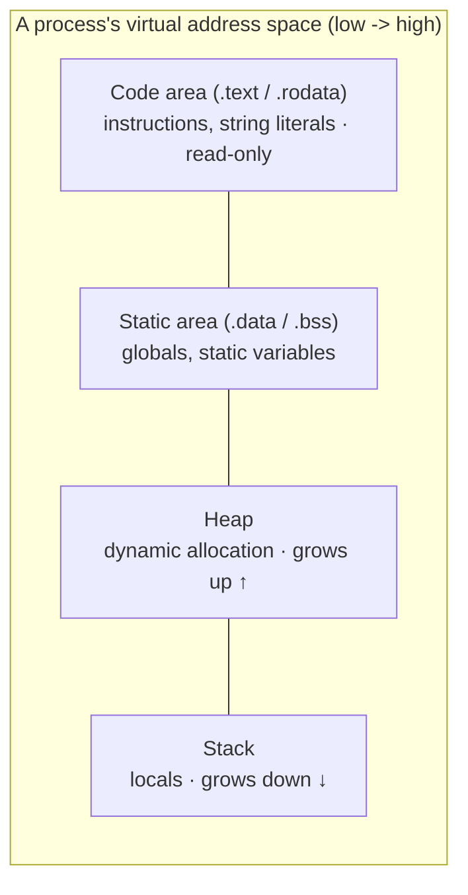

# Chapter 31 · Memory

[简体中文](./31-memory.md) ｜ **English**

---

> Part 4 told the object's **logical story** — classes, inheritance, polymorphism, generics. But a more basic question has been hanging all along: where do these objects actually **live**? Where in memory does `new` put things? Why do some variables vanish the moment their function returns, while others wait for the GC — and others still, if you forget to `delete`, leak forever?
>
> The answer starts with a map: **a program's memory is not one blank sheet but districts zoned by lifetime** — the code area houses instructions (alive as long as the process, read-only), the static area houses globals (same full-process lease), the **Stack** houses locals (evicted the moment the function returns), and the **Heap** houses whatever you `new` (it lives as long as you decide — the price being that someone must clean up).
>
> This chapter **measures** that map with C++: real addresses of all four districts lined up in order, the stack growing downward (each recursion level 64 bytes lower), the heap growing upward (consecutive `new`s 16 bytes apart). Then we watch managed languages lay their own map on top of the OS's — which is why the single question "where is the variable, where is the object" gets five different answers from five languages.
>
> And one experiment runs through the whole chapter: **the same infinite recursion dies five different deaths** — Python is stopped by its interpreter at 999 frames, Node throws a catchable RangeError at 9,182, Java throws a catchable Error at 43,054 (one `-Xss` flag stretches that to 400k), C# kills the process with no chance to catch, and C++ is undefined behavior. Five deaths, five runtime philosophies in miniature.

## 1. Learning Objectives

By the end of this chapter, you will be able to:

- Draw the **classic four-district memory map** (code / static / Stack / Heap) and explain the "zoned by lifetime" logic behind it;
- **Verify with C++** the real addresses of the four districts, the stack growing down and the heap growing up;
- Answer, for each of our five languages, "**where is the variable, where is the object**" — above all that in managed languages everything `new` lives on the heap and the stack holds only references;
- Compare **the five endings of a stack overflow** (measured: three catchable, two with no second chance) and explain where depth differences come from (`-Xss` measured 1,479 → 406,572);
- Use measured numbers to argue for **memory density**: `int[]` vs `Integer[]` differs ~5×, C# `struct[]` vs `class[]` ~7×.

---

## 2. Why This Concept Exists

### Suppose memory had no districts

Imagine memory as one flat field where everything lives together:

```text
instructions, global config, function temporaries, new-ed objects ... all in one pile
```

Three unsolvable problems appear immediately:

| Problem | Root cause |
|---------|-----------|
| When are temporaries reclaimed? | Locals are dead after their function returns — but nobody knows which ones |
| Can instructions be overwritten? | One out-of-bounds write could clobber code — a program rewriting its own next instruction |
| How long does an object live? | Some data lives the whole run, some lives one call, some "it depends" — one policy cannot serve three fates |

### The zoning answer: districts by lifetime

**Different lifetime → different reclamation policy → different address.** That is the entire logic of memory zoning:

| District | Residents | Lifetime | Reclamation |
|----------|-----------|----------|-------------|
| **Code area** | machine instructions, literals | process | never (and read-only — writing it is a segfault) |
| **Static area** | globals, `static` variables | process | reclaimed wholesale by the OS at exit |
| **Stack** | locals, parameters, return addresses | **per call** | popped **automatically** on return — free |
| **Heap** | whatever `new` / `malloc` creates | **up to you** | manual `delete` (C++) or GC (managed) |

```java
void enroll() {
    int year = 2026;                     // Stack: gone when the function returns
    Student s = new Student("Alice");    // object on the Heap: may outlive this call
}                                         // year is gone; the reference s is gone; the object awaits GC judgment
```

> **In one sentence**: zoning turns "how long does this memory live" from a per-case puzzle into **a property of the address itself** — live on the stack and you are call-scoped; live on the heap and you are custom-scoped. The next seven chapters (stack, heap, pointers, references, GC, RAII, smart pointers) all unfold from this map.

---

## 3. How It Works

### Premise: every process sees one big fake memory

Every address a program prints is a **virtual address** — the OS gives each process a complete, private address space, mapped to physical memory by the MMU. Two things follow at once: processes cannot see each other (isolation), and **every process's layout can look identical** (the diagram below holds for each one).

### The classic layout, in one picture



### Measured: C++ prints the map

One sentinel per district, addresses printed (**measured**, macOS ARM64):

```text
code     probe_stack function: 0x104cf45d0
consts   string literal:       0x104cf4eb9   <- adjacent to code (.rodata)
static   global (.data):       0x104cfc000
static   global (.bss):        0x104cfc008
static   static local:         0x104cfc004   <- static locals are NOT on the stack!
Heap     new int:              0x12ff04160
Stack    local variable:       0x16b10a21c
```

**Smallest to largest: code → constants → static → heap → stack** — the textbook picture holds verbatim on real hardware. Two details deserve note: the `static` local's address sits among the globals (it is just a scope-restricted resident of the static area — Chapter 13's foreshadowing cashed in); string literals sit beside the code (which is why writing to one is undefined behavior).

### Measured: two growth directions

**The stack grows down** — three recursion levels, each local's address:

```text
level 1 local: 0x16b10a1df
level 2 local: 0x16b10a19f   <- 64 bytes below the previous level
level 3 local: 0x16b10a15f   <- 64 bytes below the previous level
```

**The heap grows up** — two consecutive `new`s:

```text
first  new: 0x12ff04320
second new: 0x12ff04330   <- 16 bytes above the previous one
```

They grow toward each other with a gap between — **when the stack blows past its quota, that is a stack overflow** (the macOS main-thread default measured via `ulimit -s`: 8,176 KB, about 8 MB).

### Managed languages: a second map on top of the OS's

For C++, the picture above is the whole story. But the Java / C# / Python / JS runtimes are themselves native processes — each fences off the heap the OS gave it and runs its own zoning inside:

```text
The OS sees:  the JVM is one process with its own code/static/stack/heap
The JVM sees: I carve my memory into -> the Java heap (objects live here, GC rules)
                                     -> thread stacks (one per thread, -Xss sets the size)
                                     -> Metaspace (class metadata — what Chapter 30's reflection reads)
```

Likewise V8 (`new space` / `old space`), CPython (the pymalloc object allocator), and the CLR (small-object heap SOH / large-object heap LOH) — **detailed in §11**. This is what "managed" literally means: your objects do not live in the OS heap directly but in a heap-within-a-heap that the runtime manages for you.

### The key question: where is the variable, where is the object

| Language | Local variable | `new`-ed object | Your choice? |
|----------|---------------|-----------------|--------------|
| C++ | Stack | Heap | ✅ **entirely yours** (value semantics or `new`) |
| Java | reference on the Stack | **all on the Heap** | ❌ objects always heap (JIT escape analysis aside) |
| C# | `struct` on Stack / references on Stack | `class` on Heap | ⚖️ decided at declaration: `struct`/`class` |
| Python | a **name** in the frame | **everything on the heap** (even frames themselves — measured in §5) | ❌ |
| JavaScript | reference on the Stack | objects all in the V8 heap | ❌ (closure-captured variables aren't even stack references) |

> This table is the outline of the next seven chapters: C++'s "your choice" leads to pointers (34) and RAII (37); Java/JS/Python's "all heap" leads to GC (36); C#'s duality leads to value/reference semantics (35).

---

## 4. JavaScript

**JS gives you no addresses** — but V8's heap can be observed, and its stack overflow can be caught.

### V8's memory bill (measured)

```javascript
const m = process.memoryUsage();
```

```text
rss (whole process):   36.5 MB   <- the entire Node process as the OS sees it
heapTotal (V8 heap):   4.9 MB    <- the heap V8 fenced off
heapUsed:              3.6 MB
external (off-heap):   1.3 MB    <- Buffers etc., outside V8's jurisdiction
```

Note `rss` dwarfing `heapTotal` — **V8's heap is only one tenant of the process** — direct evidence of the heap-within-a-heap.

### Objects live in the V8 heap (measured)

```javascript
const arr = [];
for (let i = 0; i < 1_000_000; i++) arr.push({ id: i });
```

```text
heapUsed growth: 55.4 MB   <- a million small objects, ~55 bytes each (headers and pointers included)
```

### Stack overflow: a catchable RangeError (measured)

```text
RangeError: Maximum call stack size exceeded, depth = 9182
```

### Closures: locals that outlive their function (measured)

```javascript
function makeCounter() {
  let count = 0;              // should have died when the function returned
  return () => ++count;       // but the closure captured it — it escaped to the heap
}
```

```text
makeCounter returned long ago, yet count lives on: counter() = 2
```

**This is the memory truth behind Chapter 13's closures**: captured variables are not on the stack at all — the engine moves them into a heap-allocated environment whose lifetime follows the closure. Which is also why closures are both powerful and a top source of leaks (capture a large object by accident and it lives as long as the closure does).

> **Note**: `heapUsed` fluctuates with GC — read trends, not single points; `--max-old-space-size` adjusts V8's heap cap. For memory trouble in Node, these numbers are always the first crime scene.

---

## 5. Python

**Python carries "everything is an object" down to the memory level**: every value is a heap object; the "stack" holds only names.

### `id()` is CPython's heap address (measured)

```python
x = 10**9
def f():
    y = x          # the local "variable" is just a name in the frame
```

```text
id(x)          = 0x10124f570
inside f, id(y) = 0x10124f570   <- the same heap object; the frame holds only a reference
```

Assignment copies no object — it **gives the same heap object another name** (Chapter 8's conclusion, now with address-level evidence).

### Object weight: even an int carries a header (measured)

```text
sys.getsizeof(0)       = 24 bytes (a C int needs 4)
sys.getsizeof(10**9)   = 28 bytes
sys.getsizeof(10**100) = 72 bytes (big integers grow as needed)
sys.getsizeof([])      = 56 bytes (empty list)
```

24 bytes = refcount + type pointer + value — Chapter 24's object-header bill, paid in full even by the smallest `int`. **This is the root of Python's low memory density**: a million integers cost 4 MB in C and ~28 MB of object bodies in Python, before counting the list that holds them.

### Even stack frames are heap objects (measured)

```text
current frame: a frame object, id = 0x137e1a4f0
```

CPython's "call stack" is **a linked list of heap objects** — which is exactly why `sys._getframe()`, debuggers, and `traceback` can introspect it at any time (Chapter 30's reflection, again).

### The recursion limit is artificial (measured)

```text
sys.getrecursionlimit() = 1000
RecursionError, depth = 999: maximum recursion depth exceeded
```

**The interpreter counts frames and calls a halt** — the real C stack is nowhere near full. The fuse can be raised with `sys.setrecursionlimit`, but raise it far enough to blow the actual C stack and you get no exception — the interpreter simply crashes.

> **Note**: `del x` does not "free memory" — it unbinds a name; actual reclamation is refcounting's decision (Chapter 36). For real observation use `tracemalloc` (stdlib) rather than adding up `getsizeof`.

---

## 6. Java

Java's answer is the tidiest: **objects always live on the heap; the stack holds references and primitives** — and both heap and stack sizes are launch parameters.

### The JVM heap's three gauges (measured)

```java
Runtime rt = Runtime.getRuntime();
```

```text
maxMemory   (heap cap, -Xmx):        4096 MB   <- defaults to 1/4 of physical RAM
totalMemory (claimed from the OS):    260 MB   <- grows on demand up to max
freeMemory  (free within claimed):    256 MB
```

### The same million integers, two ways to live (measured)

```java
int[] prim = new int[1_000_000];          // one contiguous block
Integer[] boxed = new Integer[1_000_000]; // reference array + a million heap objects
```

```text
int[]     one block:                       4.1 MB
Integer[] reference array + 1M objects:   19.8 MB   <- about 5x
```

The ledger: `int[]` is 4 bytes × 1M; `Integer[]` = 8-byte references × 1M plus 16 bytes per object (12-byte header + 4-byte value, measured in Chapter 24) — **Chapter 29 measured boxing in time (1.8×); here is the space dimension (5×)**.

### Stack overflow: catchable, depth set by `-Xss` (measured)

```text
default:     StackOverflowError, depth = 43054
-Xss256k:    StackOverflowError, depth = 1479
-Xss16m:     StackOverflowError, depth = 406572
```

The same code, **a 270× spread in depth** — recursion depth is not a language constant; it is stack size divided by frame size. Each thread gets its own stack, which is why thread-heavy services often *shrink* `-Xss` to save memory.

### Heap overflow: also a catchable Error (measured)

```java
long[] huge = new long[Integer.MAX_VALUE - 2];   // requests ~16 GB
```

```text
OutOfMemoryError: Java heap space
```

> **Note**: catchable does not mean you should catch and continue — after SOE / OOM the stack and heap state are unreliable; **the legitimate uses are logging and a graceful exit**, not soldiering on. Also, JIT escape analysis can dismantle objects that never escape a method onto the stack (scalar replacement) — so "objects always on the heap" has optimizer exceptions, but that is the JIT's private business; semantically, always assume the heap.

---

## 7. C++

C++ is the only language that hands you the whole map: **where each object lives is written at its declaration**.

### Every declaration you write is a choice of address

```cpp
int global_init = 42;          // static area .data (initialized)
int global_uninit;             // static area .bss (zeroed at load)

void f() {
    int local = 1;             // Stack: reclaimed automatically on return
    static int calls = 0;      // static area: initialized once, lives the whole run
    int* p = new int(2);       // Heap: you new it, you delete it (Chapter 33)
    const char* s = "hello";   // constant area: read-only; writing it is UB
}
```

### The four-district address measurement (full data in §3)

```text
code 0x104cf45d0 < consts 0x104cf4eb9 < static 0x104cfc000
                 < Heap 0x12ff04160   < Stack 0x16b10a21c
```

### The stack quota is hard (shell measurement)

```text
$ ulimit -s
8176            <- macOS main-thread stack, about 8 MB
```

Two things follow: **keep large arrays off the stack** (`int buf[10'000'000]` blows the 8 MB quota before the first statement runs), and **recursion goes far deeper than in managed languages** (tens of bytes per frame → hundreds of thousands of levels) — but overflow brings no exception: it is a segfault, undefined behavior, process dead.

### Lifetime recap (measured output)

```text
local vanishes as main returns (stack frame popped)
heap must be deleted by hand — forget and it leaks (Chapter 33)
global_init lives until the process exits
```

> **Note**: `new`'s freedom comes with full liability — forgetting `delete` is a leak, deleting twice is a crash, using freed memory is undefined behavior. **These three accidents beget the rest of this Part**: RAII (37) manages by scope, smart pointers (38) write "who deletes" into the type. Until then, the siting rule: **if it can live on the stack, put it on the stack**.

---

## 8. C#

C# made the choice of address **part of the type declaration**: a `struct` is a value (stack-eligible, array-inlined), a `class` is a reference (heap, always).

### The same million points, two ways to live (measured)

```csharp
struct PointS { public int X, Y; }     // value type: 8 bytes of data, no header
class PointC { public int X, Y; }      // reference type: data + header, on the heap
```

```text
PointS[] (data inlined in the array):        7.6 MB
PointC[] (reference array + 1M heap objects): 53.4 MB   <- about 7x
```

`PointS[]` is one contiguous block; `PointC[]` is an 8 MB reference array plus a million scattered heap objects — **7× the memory, and a cache-hit gulf while traversing**. This is why games and high-performance .NET lean so hard on `struct`.

### `stackalloc`: an explicit stack array (measured)

```csharp
Span<int> onStack = stackalloc int[128];   // truly on the stack; gone at return; no GC involved
```

C# keeps a door here that is rare among managed languages — with `Span<T>`, hot paths can bypass heap allocation entirely.

### Boxing: values moved into the heap (measured)

```csharp
object[] boxes = new object[100_000];
for (int i = 0; i < boxes.Length; i++) boxes[i] = i;   // each assignment boxes one int
```

```text
100k boxings added: 5.4 MB (0.8 MB reference array + 24 bytes per box)
```

**A `struct`'s stack advantage holds only while it keeps its value identity** — assign it to `object` or an interface and it is boxed into the heap, advantage gone (Chapter 29's lesson, from a new angle).

### Stack overflow: no second chance

```text
StackOverflowException cannot be caught — the CLR terminates the process
(Java can catch StackOverflowError; C# stopped offering the chance in .NET 2.0)
```

.NET's position: after a stack overflow the process state cannot be trusted; better to die and restart than continue on the rubble — **a sharply different notch on the five-language spectrum from Java's "catchable"**.

> **Note**: `struct` is not "the more the better" — past ~16 bytes, pass-by-value copying costs overtake reference overhead; a `struct` boxed into `List<object>`, an interface, or a closure loses everything. **Use `struct` when it is small and flows as a value throughout.**

---

## 9. SQL

A database answers "where does data live" too — its answer is the **page**: the smallest unit exchanged between memory and disk, the database's own zoning system.

### The page: the smallest dwelling unit (measured)

```sql
PRAGMA page_size;      -- 4096: 4 KB per page
PRAGMA cache_size;     -- 2000: at most this many pages cached in memory
```

### Data lives in pages (measured)

```sql
CREATE TABLE student (id INTEGER PRIMARY KEY, name TEXT, score INTEGER);
-- after inserting ten thousand rows:
PRAGMA page_count;
```

```text
pages after CREATE:      2
pages after 10,000 rows: 56    <- data grows in pages, not rows
```

### The freelist: the database's own free list (measured)

```sql
DELETE FROM student WHERE id <= 5000;    -- delete half
PRAGMA freelist_count;
```

```text
freelist_count: 26   <- 26 pages emptied but NOT returned to the OS — kept for the next INSERT
```

**`DELETE` does not shrink the database file** — empty pages join the freelist for reuse (true reclamation needs `VACUUM`). Exactly like a runtime heap: after `free`/GC, memory usually stays in the allocator's free list rather than returning to the OS.

### The same blueprint

| Concept | Runtime (this chapter) | Database |
|---------|----------------------|----------|
| Allocation unit | page (OS virtual memory) | page (page_size) |
| Hot-data cache | CPU cache / runtime heap | page cache (buffer pool) |
| Free-but-not-returned | allocator free lists | freelist |
| Forced return | (rarely done) | `VACUUM` |

> **Engineering note**: MySQL's InnoDB buffer pool and PostgreSQL's shared_buffers are page caches at scale — **almost always the first knob in database tuning**. "Data moves between memory and disk in pages" is prerequisite knowledge for Chapter 49 (indexes) and why B+ trees look the way they do.

---

## 10. Cross-Language Comparison

### ① Memory models

| Feature | JavaScript | Python | Java | C++ | C# |
|---------|-----------|--------|------|-----|-----|
| Where objects live | V8 heap | **everything on the heap** | heap (references on stack) | **you decide** | `struct` stack / `class` heap |
| What a local variable is | a reference (closures move it to the heap) | a name (a reference in the frame) | a reference or primitive | **the value itself** | value or reference |
| Can you get an address | ❌ | `id()` (a CPython detail) | ❌ | ✅ **real addresses** | under `unsafe` |
| Stack size adjustable | `--stack-size` | artificial limit `setrecursionlimit` | `-Xss` | `ulimit -s` / linker | thread-creation parameter |
| Heap size adjustable | `--max-old-space-size` | ❌ (asks the OS until it dies) | `-Xmx` | ❌ (same) | various |
| Who reclaims | GC | refcounting + GC | GC | **you** (or RAII) | GC |

### ② The key experiment: five endings for one infinite recursion

| Language | Ending | Depth (measured) | Catchable? |
|----------|--------|-----------------|-----------|
| Python | `RecursionError` | **999** (artificial fuse, default 1000) | ✅ |
| JavaScript | `RangeError` | 9,182 | ✅ |
| Java | `StackOverflowError` | 43,054 (`-Xss256k` → 1,479; `-Xss16m` → 406,572) | ✅ |
| C# | `StackOverflowException` | — | ❌ **process terminated** |
| C++ | segfault | — (8 MB stack; hundreds of thousands of levels) | ❌ **undefined behavior** |

**One piece of code, five deaths** — all from runtime design: Python never lets the real stack fill, its interpreter counting frames and calling a halt; Java/JS detect overflow in the stacks they manage and throw catchable errors; C# deems post-overflow state untrustworthy and kills the process; C++ never sold you a runtime check in the first place.

### ③ Two design divides

**Divide one: who gets to choose the address**

```text
All yours (C++):            every declaration is a siting decision — highest ceiling, fullest catalog of accidents
Choose at declaration (C#): struct/class writes value-or-reference into the type system
No choice (Java/Python/JS): objects always heap — simplest mental model; density and locality left to GC and JIT
```

**Divide two: after a stack overflow, do you still trust the process**

```text
Trust it (Java / JS / Python): throw a catchable error; you may log and exit gracefully
Don't (C#):                    terminate — post-overflow state has no right to keep running
No position (C++):             undefined behavior — you never paid for a runtime check
```

### ④ Common ground and root causes

**Common ground**: beneath all five languages lies the same OS map (code/static/stack/heap); the division "stack is automatic, heap is managed" is universal; freed memory everywhere tends to stay in free lists rather than return to the OS (even SQLite's freelist is isomorphic).

**Root causes**:

- **C++ has no runtime layer** — the OS's map is the whole map: addresses visible, quotas hard, accidents yours;
- **Java/C#/JS runtimes are "an OS inside the process"** — their own heaps, their own stack quotas, their own overflow checks; that is what affords the luxury of a *catchable* overflow;
- **Python goes further** — even the call stack is simulated with heap objects: introspection maxed out (Chapter 30), density and speed the price;
- **C#'s `struct`** is a rare return of siting rights inside a managed world — with `stackalloc`/`Span`, a GC-free lane cut through GC country.

---

## 11. Implementation Comparison

| Runtime | Heap internals | Key points |
|---------|---------------|-----------|
| **V8 (JavaScript)** | new space (young) / old space + large object space | the generational hypothesis: most objects die young (Chapter 36's foundation); `heapTotal` is the sum of these spaces (measured) |
| **CPython** | pymalloc: small objects (≤512 B) via its own pools, large ones straight to `malloc` | headers from 16 bytes (measured: `int` = 24); small-int and short-string interning pools |
| **JVM (Java)** | generational heap (young/old) + Metaspace (class metadata) + per-thread stacks | `-Xmx`/`-Xss` measured adjustable; 12-byte object headers (Chapter 24); TLABs keep threads from contending on allocation |
| **C++ (native)** | the `malloc` allocator (libmalloc on macOS) running directly on the OS heap segment | no object headers (polymorphic classes: one 8-byte vptr); 16-byte allocation granularity (measured: consecutive `new`s 16 apart) |
| **CLR (C#)** | SOH (small object heap, three generations) + LOH (objects ≥ 85 KB) | `struct` inlined, zero header (measured 7.6 MB); `class` headers from 16 bytes (measured 53.4 MB); `stackalloc` bypasses it all |

**A distinction worth memorizing**:

```text
Native (C++):  one map — your new reaches malloc directly; the address is the virtual address
Managed (rest): two maps — your new lands in the runtime's own heap; the OS sees only one tenant: the runtime
```

> The two-map picture explains a lot: why Node's `rss` dwarfs `heapUsed` (measured 36.5 vs 3.6 MB), why the JVM "eats" hundreds of MB at startup (claiming land early), why memory does not return to the OS after GC (it is still the runtime's territory).

---

## 12. Performance Analysis

### Why the stack is fast

| | Stack | Heap |
|---|-------|------|
| Allocation | **bump the stack pointer** (one instruction) | find a free block, bookkeep, maybe trigger GC/syscall |
| Reclamation | free with the function return (**zero cost**) | `delete` / GC tracing |
| Layout | contiguous, hot (recently used = in cache) | scattered, may straddle cache lines |

### Memory-density measurements, summarized

| Experiment | Compact | Scattered | Gap |
|-----------|---------|-----------|-----|
| Java: a million ints | `int[]` 4.1 MB | `Integer[]` 19.8 MB | **~5×** |
| C#: a million points | `struct[]` 7.6 MB | `class[]` 53.4 MB | **~7×** |
| C#: 100k boxings | (0.8 MB references unboxed) | 5.4 MB | 24-byte header tax per box |
| JS: a million `{id}` | — | heapUsed +55.4 MB | ~55 bytes per object |

**Density is not just a memory bill**: Chapter 29 measured `ArrayList<Integer>` summing 1.8× slower than `int[]` and C#'s boxed container 4.7× slower — **the root cause is this layout**: compact arrays stream along cache lines; scattered objects risk a cache miss per access. Space and time are one ledger, written in memory layout.

### What allocation cost means in practice

```text
Stack allocation: one instruction  -> small locals and scratch buffers go on the stack (C++ locals, C# stackalloc)
Heap allocation:  tens to hundreds of ns + GC pressure -> new-per-iteration in a hot loop is self-harm
```

> ⚠️ The usual caveat: these gaps matter on hot paths and at scale. But **memory density is one of the few things worth doing right even in everyday code** — `Integer[]` → `int[]`, `class` → `struct` is often a one-line declaration change, and 5–7× density is free money.

---

## 13. Engineering Practice

| Scenario | ✅ Recommended | ❌ Avoid | Why |
|----------|--------------|---------|-----|
| C++ small locals | stack (plain declaration) | casual `new` | fast, zero reclamation, exception-safe |
| C++ big arrays/buffers | heap (`vector`) | large stack arrays | ~8 MB quota (measured), one strike |
| Java bulk numerics | `int[]` / primitives | `Integer[]` collections | measured 5× density + GC pressure |
| C# small hot data | `struct` (≤16 bytes) | `class` for everything | measured 7× density |
| C# hot-path scratch | `stackalloc` + `Span<T>` | `new byte[]` each time | zero GC involvement (measured) |
| JS long-lived closures | capture only needed fields | capture whole large objects | captured = heap-resident, lives with the closure (measured) |
| Python bulk numbers | `array` / NumPy | `list` of `int` | 24+ bytes per `int` (measured) |
| Service memory settings | explicit `-Xmx` / `--max-old-space-size` | ship with defaults | defaults are machine functions (measured: 1/4 of RAM), not app functions |
| Deep recursion | iterate with an explicit stack | raise the stack and hope | depth = stack ÷ frame (measured 270× spread), not a constant |

### The rule of thumb

```text
lifetime = within a call   -> stack (automatic, free)
lifetime > a call          -> heap (and immediately ask: who reclaims it?)
many items + small each    -> fight for compact layout (primitive arrays / structs)
```

---

## 14. Best Practices

- **Ask lifetime first, then choose the address**: within a call → stack; across calls → heap; process-wide → static. The wrong district is the wrong reclamation policy.
- **In managed languages, default to "object on heap, variable is a reference"** — which line has `new` matters less than who still references it.
- **Bulk data goes compact**: Java primitive arrays, C# `struct[]`, Python `array`/NumPy — the measured 5–7× is free.
- **The stack is a scarce resource**: big buffers to the heap, deep recursion to iteration; resizing the stack is a backstop for reasonable depth, not life support for unbounded recursion.
- **Catch SOE/OOM only to clean up**: log, alert, exit gracefully — do not keep serving from the rubble.
- **Set memory parameters explicitly before shipping**: `-Xmx`, `--max-old-space-size` — defaults are functions of the machine, not of your application.
- **Observe before optimizing**: `process.memoryUsage()`, the `Runtime` gauges, `GC.GetTotalMemory`, `tracemalloc` — this chapter's instruments are the first crime scene for any memory issue.
- **Remember the two maps**: process RSS ≠ runtime heap — when "memory is high," first find out which layer is high.

---

## 15. Common Pitfalls

**Pitfall 1 · Returning the address of a local (C/C++)**

```cpp
int* bad() {
    int local = 42;
    return &local;      // ⚠️ function returns, frame popped — the address is instantly invalid
}
```

**Avoid it**: stack residents' addresses do not survive the function (measured: popped on return). To outlive a call, live on the heap — or return by value.

**Pitfall 2 · Large arrays on the stack (C++)**

```cpp
void f() {
    int buf[10'000'000];    // 40 MB — the quota is 8 MB (measured ulimit -s = 8176)
}                            // segfaults before the first statement runs
```

**Avoid it**: large blocks always via `std::vector` (heap); the stack is for the small and short-lived.

**Pitfall 3 · Believing managed "local objects" live on the stack**

```java
void f() {
    Student s = new Student();   // s is on the stack; the object is on the heap
}                                 // what vanishes is the reference s; the object awaits the GC
```

**Avoid it**: memorize §3's table — in Java/JS/Python, everything `new`-ed is on the heap; "local" describes only the reference's scope.

**Pitfall 4 · C# `struct` boxed, advantage gone (measured)**

```csharp
object o = myPoint;            // boxing: the stack value copied into the heap (measured 24 bytes/box)
list.Add((object)point);       // List<object> of structs = one boxing each
```

**Avoid it**: keep `struct`s in generics (`List<PointS>`) and concrete types; treat `object` and non-generic interfaces as warnings.

**Pitfall 5 · Python: thinking `del` frees memory**

```python
big = [0] * 10_000_000
del big        # only unbinds the name — with other references alive, the object doesn't move
```

**Avoid it**: `del` deletes names, not objects; actual reclamation is refcounting (Chapter 36). Investigate with `tracemalloc`, not by adding `getsizeof`.

**Pitfall 6 · JS closures capturing large objects by accident (measured mechanism)**

```javascript
function handler(hugeData) {
  return () => console.log("done");   // ⚠️ if captured conservatively, hugeData lives as long as the callback
}
```

**Avoid it**: capture only what you need (`const n = hugeData.length`, then close over `n`); long-lived callbacks (listeners, timers) are leak scene number one.

**Pitfall 7 · Treating recursion depth as a language constant**

```text
Same code, measured: Python 999, Node 9,182, Java 43,054 (-Xss makes it 1,479 or 406,572)
```

**Avoid it**: depth = stack size ÷ frame size, and both vary. Algorithms needing deep recursion should iterate — don't bet on runtime defaults.

---

## 16. Interview Questions

**Basic**

1. Draw the four districts of process memory; state what lives in each and for how long.
2. Why is stack allocation faster than heap allocation — in both the allocate and reclaim steps?
3. In Java's `Student s = new Student()`, what is on the stack and what is on the heap?

**Intermediate**

4. **Why is `Integer[]` about 5× larger than `int[]`? Produce the ledger.**
5. How do C# `struct` and `class` differ in memory? When does a `struct` get boxed?
6. **Why does the stack grow down and the heap grow up? What happens when they meet?**

**Advanced**

7. **The same infinite recursion: why 999 frames in Python, 43,054 in Java, and instant process death in C#? Justify each design.**
8. What is the "two-map" picture? Why does a Node process's RSS dwarf V8's heapUsed?
9. What is escape analysis, and how does it create exceptions to "objects always on the heap"?

---

## 17. Exercises

**Basic**

1. Reproduce the C++ four-district measurement: print and sort the addresses of a function, a literal, a global, a `static` local, a `new`-ed object, and a local.
2. Use Java's `Runtime` gauges to watch `totalMemory`/`freeMemory` around a large allocation.
3. In Python, verify two names bound to one object share an `id()`, and rebinding changes it.

**Intermediate**

4. **Five-language recursion-depth measurement**: run the same infinite recursion everywhere, record depth and ending, and produce three different Java depths with `-Xss`.
5. Reproduce the C# `struct[]` vs `class[]` comparison, then grow `PointS` to 32 bytes and watch the gap change.
6. Build a Node memory watcher with `process.memoryUsage()`: print heapUsed every second and find an allocation spike in your own code.

**Challenge**

7. Write a C++ "stack prober": record each recursion level's address, estimate your platform's default stack size, and check against `ulimit -s`.
8. In Java, build a "references alive, memory never reclaimed" leak (a static `List` that only grows) and observe it with the `Runtime` gauges.
9. In SQLite: insert 100k rows → `DELETE` all → compare `page_count`/`freelist_count` → run `VACUUM` and look again — explain the file-size changes across all three stages.

---

## 18. Chapter Summary

**One sentence**: a program's memory is zoned by **lifetime** — code and static areas live the whole run, the Stack comes and goes with each call (measured growing down), the Heap is run by you or the GC (measured growing up); C++ hands you the whole map with real addresses, while managed languages lay their own heap-and-stacks over the OS map (measured: Node rss 36.5 MB vs heapUsed 3.6 MB) — so "where is the variable, where is the object" gets five answers from five languages, and the five endings of one infinite recursion (999 / 9,182 / 43,054 / process death / undefined behavior) are five runtime philosophies in miniature.

**Key takeaways**

- **The four-district map** (measured): real addresses sort code < consts < static < heap < stack; the stack drops 64 bytes per recursion level, the heap climbs 16 bytes per `new`.
- **Address is policy**: stack = automatic per-call, heap = custom lifetime + someone must reclaim, static = whole-run.
- **The managed two-map picture** (measured): a heap within a heap — `rss` ≠ `heapUsed`, the JVM's three gauges, GC'd memory not returned to the OS.
- **Where variables and objects live**: C++ your call; C# `struct`/`class`; Java/JS/Python heap-always with references/names on the stack (Python measured: even frames are heap objects).
- **Density measurements**: `int[]` vs `Integer[]` 5×, `struct[]` vs `class[]` 7×, 24 bytes per boxing — the same layout that caused Chapter 29's speed gaps.
- **The key experiment**: five stack-overflow endings — Python counts frames and stops (999), JS/Java throw catchable errors (9,182 / 43,054; `-Xss` spans 1,479–406,572), C# kills the process, C++ is undefined.
- **The database is isomorphic** (measured): pages as allocation units (2 → 56), the freelist as a free list (26 pages kept, not returned) — the same blueprint as a runtime heap.

**Checklist**

- [ ] I can draw the four-district map from memory, with each district's lifetime and reclamation.
- [ ] I can say where "`new` an object" happens in each of the five languages.
- [ ] I can produce the ledger for `Integer[]` being 5× `int[]`.
- [ ] I know what determines recursion depth and each language's overflow ending.
- [ ] I can tell process RSS from the runtime heap — and know which layer to check first.

**Next chapter**: the map is drawn; time to enter each district. First stop, **stack memory** — what exactly does a function call push? A **stack frame** holds more than locals: return addresses, saved registers, the traces of argument passing; how `call` and `ret` implement call-and-return by moving one pointer; why Chapter 12 said function calls have overhead, and how Chapter 13's scopes are realized at the frame level. Chapter 32 takes the call stack apart — including watching a real frame's layout live in a debugger.

---

## 19. Further Reading

- <a href="https://en.wikipedia.org/wiki/Data_segment" target="_blank" rel="noopener">Wikipedia: Data segment</a> — the standard description of program memory segments (.text/.data/.bss/heap/stack).
- <a href="https://en.wikipedia.org/wiki/Virtual_memory" target="_blank" rel="noopener">Wikipedia: Virtual memory</a> — address spaces and physical-memory mapping, surveyed.
- <a href="https://pages.cs.wisc.edu/~remzi/OSTEP/" target="_blank" rel="noopener">OSTEP · Operating Systems: Three Easy Pieces</a> — the free OS textbook; its memory-virtualization chapters are the best OS-side extension of this chapter.
- <a href="https://docs.oracle.com/javase/specs/jvms/se17/html/jvms-2.html" target="_blank" rel="noopener">JVM Specification · Run-Time Data Areas</a> — the authoritative definition of the Java heap, thread stacks, and method area.
- <a href="https://learn.microsoft.com/en-us/dotnet/standard/automatic-memory-management" target="_blank" rel="noopener">Microsoft Learn · Automatic Memory Management</a> — the official account of the CLR managed heap.
- <a href="https://developer.mozilla.org/en-US/docs/Web/JavaScript/Guide/Memory_management" target="_blank" rel="noopener">MDN · Memory management</a> — the JS memory life cycle and V8 heap, officially.
- <a href="https://docs.python.org/3/c-api/memory.html" target="_blank" rel="noopener">Python Docs · Memory Management</a> — CPython's allocator hierarchy (pymalloc), officially.
- <a href="https://en.cppreference.com/w/cpp/language/storage_duration" target="_blank" rel="noopener">cppreference · Storage duration</a> — the authoritative reference on C++ storage durations (automatic/static/dynamic).
- <a href="https://www.sqlite.org/fileformat2.html" target="_blank" rel="noopener">SQLite Docs · Database File Format</a> — pages and the freelist, officially defined.
