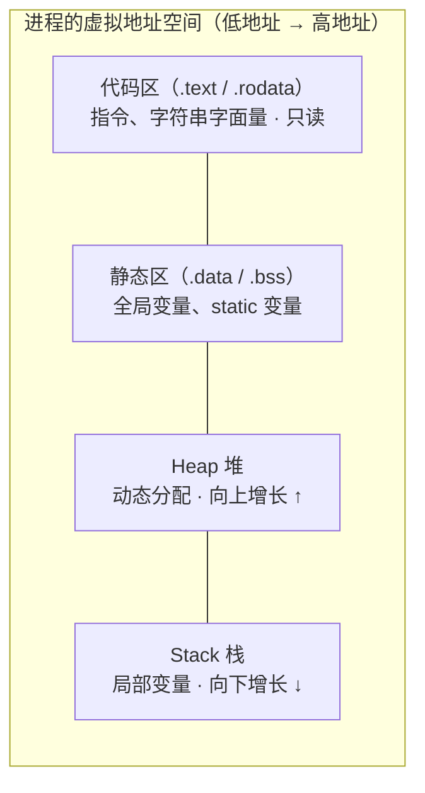

# 第 31 章 · 内存

**简体中文** ｜ [English](./31-memory.en-US.md)

---

> Part 4 讲完了对象的**逻辑形态**——类、继承、多态、泛型。但一个更基础的问题一直悬着：这些对象到底**住在哪**？`new` 出来的东西在内存的什么位置？为什么有的变量随函数返回自动消失，有的却要等 GC 来收，有的忘了 `delete` 就永远漏在那里？
>
> 答案从一张地图开始：**程序的内存不是一整块白纸，而是按"生命周期"划分的行政区**——代码区住指令（进程活多久它活多久，只读）、静态区住全局变量（同样活满全程）、**Stack** 住局部变量（函数返回即拆迁）、**Heap** 住 `new` 出来的对象（活多久你说了算——代价是得有人负责收尸）。
>
> 本章用 C++ 把这张地图**实测**给你看：四个区的真实地址一字排开，栈向下长（每层递归低 64 字节）、堆向上长（连续 `new` 高 16 字节）。再看托管语言如何在这张 OS 地图上叠一层自己的地图——于是同一个问题"变量在哪、对象在哪"，五门语言给出了五种答案。
>
> 还有一个贯穿全章的实测：**同一个无限递归，Python 在 999 层被解释器主动喊停，Node 在 9182 层抛可捕获的 RangeError，Java 在 43054 层抛可捕获的 Error（改一个 `-Xss` 参数能到 40 万层），C# 直接终止进程不给捕获机会，C++ 则是未定义行为**——五种死法，正是五种运行时设计的缩影。

## 1. 学习目标

本章结束后，你将能够：

- 画出**经典内存四区图**（代码区 / 静态区 / Stack / Heap），并说清"按生命周期分区"的设计逻辑；
- 用 C++ **实测**验证四区的真实地址、栈向下增长与堆向上增长；
- 回答五门语言各自的"**变量在哪、对象在哪**"——尤其是"托管语言里 `new` 的都在堆，栈里只有引用"；
- 对比**栈溢出在五门语言里的五种结局**（实测三家可捕获、两家没有第二次机会），并解释深度差异的来源（`-Xss` 实测 1479 → 406572）；
- 用实测数据说明**内存密度**的工程意义：`int[]` vs `Integer[]` 差约 5 倍，C# `struct[]` vs `class[]` 差约 7 倍。

---

## 2. 为什么会出现这个概念

### 假如内存不分区

想象内存就是一整块平地，所有东西混住：

```text
指令、全局配置、函数的临时变量、new 出来的对象……全堆在一起
```

马上会遇到三个无解的问题：

| 问题 | 根源 |
|------|------|
| 临时变量何时回收？ | 函数的局部变量在返回后就没用了，但"哪些没用了"没人知道 |
| 指令会被改写吗？ | 数据写越界就可能覆盖代码——程序改掉自己的下一条指令 |
| 对象能活多久？ | 有的数据要活满全程，有的只活一次调用，有的"说不准"——一种策略伺候不了三种命 |

### 分区的答案：按生命周期划行政区

**生命周期不同 → 回收策略不同 → 住的地方不同**。 这就是内存分区的全部逻辑：

| 区 | 住户 | 生命周期 | 回收方式 |
|----|------|---------|---------|
| **代码区** | 机器指令、常量 | 进程级 | 不回收（且只读——写它直接段错误） |
| **静态区** | 全局变量、static 变量 | 进程级 | 进程退出时由 OS 整体回收 |
| **Stack** | 局部变量、参数、返回地址 | **函数级** | 函数返回时**自动**弹出——零成本 |
| **Heap** | `new` / `malloc` 出来的对象 | **你说了算** | 手动 `delete`（C++）或 GC（托管语言） |

```java
void enroll() {
    int year = 2026;                    // Stack：函数返回即消失
    Student s = new Student("小明");     // 对象在 Heap：可以活过这次调用
}                                        // year 没了；s 这个引用没了；对象等 GC 判生死
```

> **一句话**：分区把"这块内存活多久"从需要逐个思考的问题，变成**住址自带的属性**——住在栈上就是函数级，住在堆上就是自定义。后面七章（栈、堆、指针、引用、GC、RAII、智能指针）全部围绕这张地图展开。

---

## 3. 底层原理

### 前提：每个进程都看到"整块假内存"

程序里打印的地址都是**虚拟地址**——OS 给每个进程一套完整、独立的地址空间，由 MMU 映射到真实物理内存。两个好处立刻成立：进程之间互不可见（隔离），以及**每个进程的内存布局可以长得一模一样**（下图对每个进程都成立）。

### 经典布局：一张图



### 实测：C++ 把地图印出来

四个区各放一个哨兵，打印地址（**实测**，macOS ARM64）：

```text
代码区   probe_stack 函数:   0x104cf45d0
常量区   字符串字面量:       0x104cf4eb9   ← 与代码区相邻（.rodata）
静态区   全局变量(.data):    0x104cfc000
静态区   全局变量(.bss):     0x104cfc008
静态区   static 局部变量:    0x104cfc004   ← static 局部变量不在栈上！
Heap     new int:            0x12ff04160
Stack    局部变量:           0x16b10a21c
```

**地址从小到大正好是：代码 → 常量 → 静态 → 堆 → 栈**——教科书的图在真机上原样成立。两处细节值得注意：`static` 局部变量的地址挤在全局变量中间（它只是作用域受限的静态区住户，第 13 章的伏笔在此兑现）；字符串字面量贴着代码区（所以改写它是未定义行为）。

### 实测：两个增长方向

**栈向下长**——递归三层，每层局部变量的地址：

```text
第 1 层局部变量地址: 0x16b10a1df
第 2 层局部变量地址: 0x16b10a19f   ← 比上一层低 64 字节
第 3 层局部变量地址: 0x16b10a15f   ← 比上一层低 64 字节
```

**堆向上长**——连续两次 `new`：

```text
第一次 new: 0x12ff04320
第二次 new: 0x12ff04330   ← 比上一次高 16 字节
```

两者相向而行、中间留白——**栈涨破自己的额度就是栈溢出**（macOS 主线程默认 `ulimit -s` 实测为 8176 KB，约 8 MB）。

### 托管语言：在 OS 地图上再叠一层

对 C++，上面那张图就是全部。但 Java / C# / Python / JS 的运行时**本身是个原生进程**——它把 OS 给它的堆圈起来，在里面经营自己的一套分区：

```text
OS 眼中：JVM 就是一个进程，有自己的代码区/静态区/栈/堆
JVM 眼中：我把拿到的内存划成 → Java 堆（对象住这，GC 管）
                              → 线程栈（每个线程一个，-Xss 定大小）
                              → Metaspace（类的元数据，第 30 章反射读的就是它）
```

V8（`new space` / `old space`）、CPython（对象分配器 pymalloc）、CLR（小对象堆 SOH / 大对象堆 LOH）同理——**第 11 节详列**。这就是"托管"的字面意思：你的对象不直接住 OS 的堆，而是住在运行时替你管理的堆中之堆。

### 钥匙问题：变量在哪、对象在哪

| 语言 | 局部变量 | `new` 的对象 | 你能决定吗 |
|------|---------|-------------|-----------|
| C++ | Stack | Heap | ✅ **完全由你决定**（值语义/`new` 二选一） |
| Java | 引用在 Stack | **全在 Heap** | ❌ 对象一律堆上（JIT 逃逸分析除外） |
| C# | `struct` 在 Stack / 引用在 Stack | `class` 在 Heap | ⚖️ 用 `struct`/`class` 声明时决定 |
| Python | **名字**在栈帧里 | **一切皆堆**（连栈帧本身都是堆对象，实测见第 5 节） | ❌ |
| JavaScript | 引用在 Stack | 对象全在 V8 堆 | ❌（被闭包捕获的连"栈上引用"都不是） |

> 这张表是后面七章的总纲：C++ 的"你决定"引出指针（34）与 RAII（37）；Java/JS/Python 的"全在堆"引出 GC（36）；C# 的二元引出值/引用语义（35）。

---

## 4. JavaScript

**JS 拿不到任何地址**——但 V8 的堆可以被观测，栈溢出可以被捕获。

### V8 的内存账单（实测）

```javascript
const m = process.memoryUsage();
```

```text
rss（进程总占用）:   36.5 MB   ← OS 眼中整个 Node 进程
heapTotal（V8 堆）:  4.9 MB    ← V8 圈起来的堆
heapUsed（已使用）:  3.6 MB
external（堆外）:    1.3 MB    ← Buffer 等不归 V8 管的内存
```

注意 `rss` 远大于 `heapTotal`——**V8 的堆只是进程内存的一部分**，这正是"堆中之堆"的直接证据。

### 对象住在 V8 堆上（实测）

```javascript
const arr = [];
for (let i = 0; i < 1_000_000; i++) arr.push({ id: i });
```

```text
heapUsed 增长: 55.4 MB   ← 一百万个小对象，每个平均 ~55 字节（含对象头与指针）
```

### 栈溢出：可以 catch 的 RangeError（实测）

```javascript
try { recurse(); } catch (e) { ... }
```

```text
RangeError: Maximum call stack size exceeded，深度 = 9182
```

### 闭包：让"局部变量"活过函数返回（实测）

```javascript
function makeCounter() {
  let count = 0;              // 本该随函数返回消失
  return () => ++count;       // 但被闭包捕获——逃到了堆上
}
```

```text
makeCounter 早已返回，count 却还活着: counter() = 2
```

**这是第 13 章闭包的内存真相**：被捕获的变量根本不在栈上——引擎把它放进堆上的环境对象里，生命周期跟着闭包走。这也是闭包既强大又是内存泄漏高发区的原因（不小心捕获大对象，它就跟着闭包活着）。

> **注意事项**：`heapUsed` 会被 GC 波动，观测时应取趋势而非单点；`--max-old-space-size` 可调 V8 堆上限（默认因版本/内存而异），Node 里内存问题的第一现场几乎都是这几个数字。

---

## 5. Python

**Python 把"一切皆对象"贯彻到了内存层**：所有值都是堆上的对象，"栈"里只有名字。

### `id()` 就是 CPython 的堆地址（实测）

```python
x = 10**9
def f():
    y = x          # 局部"变量"只是栈帧里的一个名字
```

```text
id(x)       = 0x10124f570
函数内 id(y) = 0x10124f570   ← 同一个堆对象，栈帧里只有引用
```

赋值不复制对象，只是**给同一个堆对象多起一个名字**（第 8 章的结论，这里看到了地址级证据）。

### 对象的体积：连 int 都背着对象头（实测）

```text
sys.getsizeof(0)       = 24 字节（C 的 int 只要 4 字节）
sys.getsizeof(10**9)   = 28 字节
sys.getsizeof(10**100) = 72 字节（大整数按需扩容）
sys.getsizeof([])      = 56 字节（空列表）
```

24 字节 = 引用计数 + 类型指针 + 值——第 24 章对象头的账单在最小的 `int` 上也一分不少。**这就是 Python 内存密度低的根源**：一百万个整数在 C 里 4 MB，在 Python 里光对象本体就 28 MB 上下，还不算装它们的列表。

### 连栈帧都是堆对象（实测）

```text
当前栈帧: frame 对象，id = 0x137e1a4f0
```

CPython 的"调用栈"是**堆对象串成的链表**——这就是 `sys._getframe()`、调试器和 `traceback` 能随时自省调用栈的原因（第 30 章反射的又一例）。

### 递归限制是人造的（实测）

```text
sys.getrecursionlimit() = 1000
RecursionError，深度 = 999：maximum recursion depth exceeded
```

**解释器数着帧数主动喊停**——真正的 C 栈远没满。这个保险丝可以用 `sys.setrecursionlimit` 调大，但调太大后真把 C 栈撑爆时，就不是异常而是解释器直接崩溃了。

> **注意事项**：`del x` 不是"释放内存"，只是解绑名字——对象何时真正回收由引用计数决定（第 36 章）。观测 Python 内存用 `tracemalloc`（标准库）比手工 `getsizeof` 可靠得多。

---

## 6. Java

Java 的答案最"整齐"：**对象一律住堆，栈里只有引用和原始类型**；堆和栈的大小都是启动参数。

### JVM 堆的三个刻度（实测）

```java
Runtime rt = Runtime.getRuntime();
```

```text
maxMemory   (堆上限, -Xmx 可调):  4096 MB   ← 默认取物理内存的 1/4
totalMemory (当前已向 OS 申请):    260 MB   ← 按需增长，到 max 为止
freeMemory  (已申请中的空闲):      256 MB
```

### 同样一百万个整数，两种住法（实测）

```java
int[] prim = new int[1_000_000];         // 一整块连续内存
Integer[] boxed = new Integer[1_000_000]; // 引用数组 + 一百万个堆对象
```

```text
int[]     一整块:              4.1 MB
Integer[] 引用数组 + 百万对象: 19.8 MB   ← 约 5 倍
```

账目：`int[]` 就是 4 字节 × 100 万；`Integer[]` = 8 字节引用 × 100 万 + 每个对象 16 字节（12 字节对象头 + 4 字节值，第 24 章实测过）——**第 29 章测过装箱的时间账——1.8×；这里补上空间账——5×**。

### 栈溢出：可捕获，深度由 `-Xss` 决定（实测）

```text
默认:        StackOverflowError，深度 = 43054
-Xss256k:    StackOverflowError，深度 = 1479
-Xss16m:     StackOverflowError，深度 = 406572
```

同一段代码，**深度差 270 倍**——递归深度不是语言常数，是"栈大小 ÷ 每帧大小"的商。每个线程一个栈，所以线程多的服务反而常调小 `-Xss` 省内存。

### 堆溢出：同样是可捕获的 Error（实测）

```java
long[] huge = new long[Integer.MAX_VALUE - 2];   // 请求约 16 GB
```

```text
OutOfMemoryError: Java heap space
```

> **注意事项**：能捕获不等于该捕获——SOE / OOM 之后堆栈状态已不可靠，**捕获的正当用途是记日志和优雅退场**，不是"接着跑"。另外 JIT 的逃逸分析会把"没逃出方法的对象"拆到栈上（标量替换），所以"对象一律在堆"在优化后有例外——但那是 JIT 的私事，语义上你永远当它在堆。

---

## 7. C++

C++ 是唯一把整张地图交给你的语言：**每个对象住哪，声明时就写定了**。

### 你写的每种声明，都是一次选址

```cpp
int global_init = 42;          // 静态区 .data（有初值）
int global_uninit;             // 静态区 .bss（无初值，加载时清零）

void f() {
    int local = 1;             // Stack：函数返回自动回收
    static int calls = 0;      // 静态区：只初始化一次，活满全程
    int* p = new int(2);       // Heap：你 new 的你 delete（第 33 章）
    const char* s = "hello";   // 常量区：只读，改写是未定义行为
}
```

### 四区地址实测（本章第 3 节的完整数据）

```text
代码区 0x104cf45d0 < 常量区 0x104cf4eb9 < 静态区 0x104cfc000
                   < Heap 0x12ff04160   < Stack 0x16b10a21c
```

### 栈的额度是硬的（shell 实测）

```text
$ ulimit -s
8176            ← macOS 主线程栈约 8 MB
```

于是两件事有了解释：**大数组别放栈上**（`int buf[10'000'000]` 直接把 8 MB 额度打穿，程序还没跑就崩）；**递归深度远超托管语言**（每帧几十字节的话能递归几十万层），但溢出时没有异常——是段错误，未定义行为，进程直接死。

### 生命周期对照（实测输出）

```text
local 随 main 返回自动消失（栈帧弹出）
heap 必须手动 delete——忘了就是内存泄漏（第 33 章）
global_init 活到进程结束
```

> **注意事项**：`new` 的自由伴随全责——忘 `delete` 是泄漏、`delete` 两次是崩溃、用已 `delete` 的指针是未定义行为。**这三种事故催生了本 Part 的后半程**：RAII（37）用作用域自动管理，智能指针（38）把"谁负责 delete"写进类型。在此之前，先记住选址原则：**能放栈上就放栈上**。

---

## 8. C#

C# 把选址权做成了**类型声明的一部分**：`struct` 是值（可住栈、可内联进数组），`class` 是引用（一律住堆）。

### 同样一百万个点，两种住法（实测）

```csharp
struct PointS { public int X, Y; }     // 值类型：8 字节数据，没有对象头
class PointC { public int X, Y; }      // 引用类型：数据 + 对象头，住在堆上
```

```text
PointS[]（数据内联在数组里）:        7.6 MB    ← 8 字节 × 100 万，一整块
PointC[]（引用数组 + 百万个堆对象）: 53.4 MB   ← 约 7 倍
```

`PointS[]` 是一整块连续内存（数据内联），`PointC[]` 是 8 MB 引用数组加一百万个散落的堆对象——**内存密度差 7 倍，遍历时的缓存命中率更是天壤之别**。这就是游戏和高性能 .NET 代码大量用 `struct` 的原因。

### `stackalloc`：显式的栈上数组（实测）

```csharp
Span<int> onStack = stackalloc int[128];   // 真正在栈上，方法返回即消失，无 GC 参与
```

C# 在托管语言里罕见地留了这扇门——配合 `Span<T>`，热路径可以完全绕开堆分配。

### 装箱：值类型被搬进堆（实测）

```csharp
object[] boxes = new object[100_000];
for (int i = 0; i < boxes.Length; i++) boxes[i] = i;   // 每次赋值装箱一个 int
```

```text
10 万次装箱新增堆内存: 5.4 MB（引用数组 0.8 MB + 每个箱子 24 字节）
```

**`struct` 的栈上优势只在它保持"值"身份时成立**——一旦赋给 `object` 或接口，就被装箱进堆，优势清零（第 29 章的教训换了个视角重现）。

### 栈溢出：没有第二次机会

```text
StackOverflowException 无法被 catch——CLR 直接终止进程
（Java 能 catch StackOverflowError，C# 从 .NET 2.0 起不给机会）
```

.NET 的立场：栈溢出后进程状态不可信，与其让你在废墟上继续，不如干脆重启——**与 Java "能捕获"形成五语言光谱上的鲜明一档**。

> **注意事项**：`struct` 不是越多越好——超过 16 字节左右的 `struct` 按值传递的拷贝成本会反超堆引用的开销；`struct` 放进 `List<object>`、被接口引用、被闭包捕获时都会装箱。**用 `struct` 的前提是它小、且一直以值的身份流动**。

---

## 9. SQL

数据库同样要回答"数据住哪"——它的答案是**页**（page）：内存与磁盘之间交换的最小单位，数据库自己的"分区制度"。

### 页：数据库的最小居住单元（实测）

```sql
PRAGMA page_size;      -- 4096：每页 4 KB
PRAGMA cache_size;     -- 2000：内存里最多缓存这么多页
```

### 数据住在页里（实测）

```sql
CREATE TABLE student (id INTEGER PRIMARY KEY, name TEXT, score INTEGER);
-- 插入一万行后：
PRAGMA page_count;
```

```text
建表后页数:   2
一万行之后:   56    ← 数据增长的单位是页，不是行
```

### freelist：数据库自己的空闲链表（实测）

```sql
DELETE FROM student WHERE id <= 5000;    -- 删掉一半
PRAGMA freelist_count;
```

```text
freelist_count: 26   ← 26 页被清空，但没有还给 OS——留着给下次 INSERT 复用
```

**`DELETE` 不缩小数据库文件**——空页进了 freelist 等复用（要真正归还得 `VACUUM`）。这与运行时的堆一模一样：`free`/GC 后内存通常也不还 OS，而是留在分配器的空闲链表里等复用。

### 同一张设计图

| 概念 | 运行时（本章） | 数据库 |
|------|--------------|--------|
| 分配单位 | 页（OS 虚拟内存）| 页（page_size） |
| 热数据缓存 | CPU cache / 运行时堆 | 页缓存（buffer pool） |
| 释放不归还 | 分配器空闲链表 | freelist |
| 强制归还 | （几乎不做） | `VACUUM` |

> **工程提醒**：MySQL 的 InnoDB buffer pool、PostgreSQL 的 shared_buffers 就是放大版的页缓存——**数据库调优的第一参数几乎总是它**。"数据以页为单位在内存与磁盘间流动"这张图，是第 49 章（索引）解释 B+ 树为什么长那样的前置知识。

---

## 10. 五语言横向对比

### ① 内存模型对比

| 特性 | JavaScript | Python | Java | C++ | C# |
|------|-----------|--------|------|-----|-----|
| 对象住哪 | V8 堆 | **一切皆堆** | 堆（引用在栈） | **你决定** | `struct` 栈 / `class` 堆 |
| 局部变量是什么 | 引用（可被闭包搬进堆） | 名字（栈帧里的引用） | 引用或原始值 | **值本身** | 值或引用 |
| 能拿到地址吗 | ❌ | `id()`（CPython 实现细节） | ❌ | ✅ **真地址** | `unsafe` 下可以 |
| 栈大小可调 | `--stack-size` | 人造限制 `setrecursionlimit` | `-Xss` | `ulimit -s` / 链接参数 | 线程创建参数 |
| 堆大小可调 | `--max-old-space-size` | ❌（向 OS 要到死） | `-Xmx` | ❌（同左） | 配置多样 |
| 谁负责回收 | GC | 引用计数 + GC | GC | **你**（或 RAII） | GC |

### ② 钥匙实测：同一个无限递归的五种结局

| 语言 | 结局 | 深度（实测） | 可捕获？ |
|------|------|------------|---------|
| Python | `RecursionError` | **999**（人造保险丝，默认 1000） | ✅ |
| JavaScript | `RangeError` | 9182 | ✅ |
| Java | `StackOverflowError` | 43054（`-Xss256k` → 1479，`-Xss16m` → 406572） | ✅ |
| C# | `StackOverflowException` | — | ❌ **进程直接终止** |
| C++ | 段错误 | —（栈 8 MB，能到几十万层） | ❌ **未定义行为** |

**同一段代码，五种死法**——差异全部来自运行时设计：Python 根本没等真栈满，解释器数着帧数主动喊停；Java/JS 在自己管理的栈里检测溢出并抛可捕获的错误；C# 认为溢出后状态不可信，宁可杀进程；C++ 压根没有运行时替你兜底。

### ③ 两条设计分歧

**分歧一：选址权给谁**

```text
全交给你（C++）：        每个声明都是选址——性能上限最高，事故种类也最全
声明时二选一（C#）：     struct/class 写定值或引用——把选择权做进类型系统
不给选（Java/Python/JS）：对象一律堆上——心智最简单，密度与局部性交给 GC 和 JIT 补救
```

**分歧二：栈溢出后还要不要信任这个进程**

```text
信（Java / JS / Python）：抛可捕获的错误，给你记日志、优雅退场的机会
不信（C#）：            直接终止——溢出后的状态没有资格继续运行
没有立场（C++）：       未定义行为——你没付"运行时检查"的钱
```

### ④ 共同点与差异根源

**共同点**：五门语言的底层都是同一张 OS 地图（代码/静态/栈/堆）；"栈上自动、堆上管理"的分工完全一致；释放的内存都倾向于留在空闲链表而非归还 OS（连 SQLite 的 freelist 都同构）。

**差异根源**：

- **C++ 不设运行时**，OS 给什么就是什么——地址可见、额度硬性、事故自负；
- **Java/C#/JS 的运行时是"进程中的 OS"**——自建堆、自建栈额度、自建溢出检测，于是才有"可捕获的溢出"这种奢侈品；
- **Python 更进一步**，连调用栈都用堆对象模拟——自省能力拉满（第 30 章），密度和速度是代价；
- **C# 的 `struct`** 是托管世界里少见的"选址权返还"——配合 `stackalloc`/`Span`，在 GC 世界里凿出了一条无 GC 通道。

---

## 11. 底层实现对比

| 运行时 | 堆的内部结构 | 要点 |
|--------|------------|------|
| **V8**（JavaScript） | new space（新对象）/ old space（老对象）+ large object space | 分代假设：多数对象朝生夕死（第 36 章 GC 的地基）；`heapTotal` 就是这些 space 的总和（实测） |
| **CPython** | pymalloc：小对象（≤512 B）走自建分配池，大对象直通 `malloc` | 对象头 16 字节起步（实测 `int` 24 字节）；小整数与短字符串有驻留池 |
| **JVM**（Java） | 分代堆（年轻代/老年代）+ Metaspace（类元数据）+ 每线程栈 | `-Xmx`/`-Xss` 实测可调；对象头 12 字节（第 24 章）；TLAB 让多线程分配不抢锁 |
| **C++**（原生） | `malloc` 分配器（macOS 为 libmalloc）直接经营 OS 的堆段 | 无对象头（多态类仅 vptr 8 字节）；分配粒度 16 字节（实测连续 `new` 差 16） |
| **CLR**（C#） | SOH（小对象堆，分三代）+ LOH（≥85 KB 大对象堆） | `struct` 内联零头部（实测 7.6 MB）、`class` 头 16 字节起（实测 53.4 MB）；`stackalloc` 绕开全部 |

**一个值得记住的分野**：

```text
原生（C++）：   一层地图——你的 new 直达 malloc，地址就是虚拟地址
托管（其余）：  两层地图——你的 new 落进运行时自建的堆，OS 只看见运行时这一个租户
```

> 两层地图解释了很多现象：为什么 Node 的 `rss` 远大于 `heapUsed`（实测 36.5 vs 3.6 MB）、为什么 JVM 启动就"吃"几百 MB（提前圈地）、为什么 GC 完内存不还 OS（还在运行时的地盘里）。

---

## 12. 性能分析

### 栈为什么快

| | Stack | Heap |
|---|-------|------|
| 分配动作 | **移动一下栈指针**（一条指令） | 找空闲块、记账、可能触发 GC/系统调用 |
| 回收动作 | 函数返回顺带完成（**零成本**） | `delete` / GC 扫描 |
| 数据布局 | 连续、热（刚用过的就在缓存里） | 分散、可能横跨多个缓存行 |

### 内存密度实测汇总

| 实验 | 紧凑方案 | 分散方案 | 差距 |
|------|---------|---------|------|
| Java：一百万个 int | `int[]` 4.1 MB | `Integer[]` 19.8 MB | **约 5×** |
| C#：一百万个点 | `struct[]` 7.6 MB | `class[]` 53.4 MB | **约 7×** |
| C#：十万次装箱 | （无装箱时 0.8 MB 引用数组） | 5.4 MB | 每箱 24 字节头税 |
| JS：一百万个 `{id}` | — | heapUsed +55.4 MB | 每对象 ~55 字节 |

**密度差不只是内存账**：第 29 章实测过 `ArrayList<Integer>` 求和比 `int[]` 慢 1.8×、C# 装箱容器慢 4.7×——**根源就是这里的布局**：紧凑数组顺着缓存行流，分散对象每次访问都可能 cache miss。空间和时间在内存布局上是同一笔账。

### 分配成本的工程含义

```text
栈分配：一条指令 → 局部小对象、临时缓冲区放栈上（C++ 局部变量、C# stackalloc）
堆分配：几十到几百纳秒 + GC 压力 → 热循环里每轮 new 是典型的自伤
```

> ⚠️ 与前几章一致的提醒：这些差距只在热路径和大数据量上要紧。但**内存密度是少数"业务代码也该顺手做对"的事**——`int[]` 换 `Integer[]`、`class` 换 `struct` 往往只是一次声明的差别，5–7 倍的密度不拿白不拿。

---

## 13. 工程实践

| 场景 | ✅ 推荐 | ❌ 不推荐 | 原因 |
|------|--------|----------|------|
| C++ 局部小对象 | 栈上（普通声明） | 随手 `new` | 快、零回收成本、异常安全 |
| C++ 大数组/缓冲区 | 堆上（`vector`） | 栈上大数组 | 栈额度约 8 MB（实测），一击即穿 |
| Java 数值批量存储 | `int[]` / 原始类型 | `Integer[]` 集合 | 实测 5× 密度差 + GC 压力 |
| C# 小型高频数据 | `struct`（≤16 字节） | 一律 `class` | 实测 7× 密度差 |
| C# 热路径临时缓冲 | `stackalloc` + `Span<T>` | 每次 `new byte[]` | 零 GC 参与（实测可用） |
| JS 长生命周期闭包 | 只捕获需要的字段 | 捕获整个大对象 | 被捕获即入堆，跟着闭包活（实测） |
| Python 大量数值 | `array` / NumPy | `list` 装 `int` | 每个 `int` 24 字节起（实测） |
| 服务的内存参数 | 显式设 `-Xmx` / `--max-old-space-size` | 用默认值上线 | 默认值取决于机器（实测 1/4 物理内存），换机器就变 |
| 深递归算法 | 改迭代 + 显式栈 | 调大栈硬扛 | 深度是"栈大小 ÷ 帧大小"的商（实测差 270×），不是常数 |

### 判断口诀

```text
生命周期 = 函数内   → 栈（自动、免费）
生命周期 > 函数     → 堆（然后立刻想清楚：谁负责回收？）
数量大 + 结构小     → 想尽办法紧凑排列（原始数组 / struct）
```

---

## 14. 最佳实践

- **先问生命周期，再选住址**：函数内 → 栈；跨调用 → 堆；进程级 → 静态区。选错区就是选错回收策略。
- **托管语言里默认"对象在堆、变量是引用"**——`new` 在哪一行不重要，重要的是谁还引用着它。
- **批量数据用紧凑布局**：Java 原始数组、C# `struct[]`、Python `array`/NumPy——实测 5–7 倍的密度是免费的。
- **栈是稀缺资源**：大缓冲区上堆，深递归改迭代；调栈大小是给"合理的深"兜底，不是给无限递归续命。
- **捕获 SOE/OOM 只为善后**：记日志、告警、优雅退出——不要在废墟上继续服务。
- **上线前显式设置内存参数**：`-Xmx`、`--max-old-space-size`——默认值是机器的函数，不是应用的函数。
- **观测先于优化**：`process.memoryUsage()`、`Runtime` 三刻度、`GC.GetTotalMemory`、`tracemalloc`——本章的观测工具就是内存问题的第一现场。
- **记住两层地图**：进程 RSS ≠ 运行时堆——排查"内存高"先分清是哪一层高。

---

## 15. 常见坑

**坑 1 · C/C++ 返回局部变量的地址**

```cpp
int* bad() {
    int local = 42;
    return &local;      // ⚠️ 函数返回，栈帧弹出——这个地址立刻作废
}
```

**如何避免**：栈上住户的地址活不过函数（本章实测：栈帧弹出即回收）。要跨调用就住堆，或按值返回。

**坑 2 · 把大数组放在栈上**（C++）

```cpp
void f() {
    int buf[10'000'000];    // 40 MB——栈额度才 8 MB（实测 ulimit -s = 8176）
}                            // 还没执行第一行就段错误
```

**如何避免**：大块内存一律 `std::vector`（堆）；栈只放小而短命的东西。

**坑 3 · 以为托管语言的"局部对象"在栈上**

```java
void f() {
    Student s = new Student();   // s 在栈上，但对象在堆上
}                                 // 消失的是引用 s，对象归 GC 判生死
```

**如何避免**：记住第 3 节的表——Java/JS/Python 里 `new` 的一律在堆，"局部"只是引用的作用域。

**坑 4 · C# 的 `struct` 被装箱，优势清零**（实测）

```csharp
object o = myPoint;            // 装箱：栈上的值被复制进堆（实测每箱 24 字节）
list.Add((object)point);       // List<object> 装 struct = 每个都装箱
```

**如何避免**：`struct` 全程走泛型（`List<PointS>`）与具体类型；见到 `object`/非泛型接口就警惕。

**坑 5 · Python 以为 `del` 释放了内存**

```python
big = [0] * 10_000_000
del big        # 只是解绑名字——若还有别的引用，对象纹丝不动
```

**如何避免**：`del` 删名字不删对象；真正的回收看引用计数（第 36 章）。排查用 `tracemalloc`，别数 `getsizeof`。

**坑 6 · JS 闭包无意间捕获大对象**（实测机制）

```javascript
function handler(hugeData) {
  return () => console.log("done");   // ⚠️ 若引擎保守捕获，hugeData 跟着回调活
}
```

**如何避免**：闭包只留需要的字段（`const n = hugeData.length` 后再闭包 `n`）；长寿回调（事件监听、定时器）是泄漏第一现场。

**坑 7 · 把递归深度当语言常数**

```text
同一段代码实测：Python 999 层、Node 9182 层、Java 43054 层（-Xss 一调就是 1479 或 406572）
```

**如何避免**：深度 = 栈大小 ÷ 帧大小，两个变量都会变。算法要深递归就改迭代，别赌运行时的默认值。

---

## 16. 面试题

**基础**

1. 画出进程内存布局的四个区，说明每个区住什么、活多久。
2. 栈上分配为什么比堆上快？"快"体现在分配和回收两个环节的哪里？
3. Java 里 `Student s = new Student()` 这行代码，什么在栈上、什么在堆上？

**中级**

4. **为什么 `Integer[]` 比 `int[]` 大约 5 倍？请把账算出来。**
5. C# 的 `struct` 和 `class` 在内存上有什么区别？`struct` 什么时候会被装箱？
6. **栈为什么向下增长、堆向上增长？两者相遇会发生什么？**

**高级**

7. **同一个无限递归，为什么 Python 999 层、Java 43054 层、C# 直接进程终止？三种设计各自的理由是什么？**
8. 什么是"两层地图"？为什么 Node 进程的 RSS 远大于 V8 的 heapUsed？
9. 逃逸分析是什么？它如何让"对象一律在堆"出现例外？

---

## 17. 练习

**基础**

1. 用 C++ 复现四区地址实测：打印函数、字面量、全局变量、`static` 局部变量、`new` 对象、局部变量的地址并排序。
2. 用 Java 的 `Runtime` 三刻度观察一次大数组分配前后 `totalMemory`/`freeMemory` 的变化。
3. 在 Python 里验证：两个名字绑定同一个对象时 `id()` 相同；重新赋值后 `id()` 改变。

**提高**

4. **五语言递归深度实测**：同一个无限递归在你机器上各语言的深度与结局，并用 `-Xss` 调出 3 个不同的 Java 深度。
5. 复现 C# 的 `struct[]` vs `class[]` 内存对比，再把 `PointS` 加大到 32 字节，观察差距如何变化。
6. 用 `process.memoryUsage()` 做一个 Node 内存观察器：每秒打印 heapUsed，找出你某段代码的分配尖峰。

**挑战**

7. 用 C++ 写一个"栈探测器"：递归时记录每层地址，估算你平台的默认栈大小，与 `ulimit -s` 对照。
8. 在 Java 里构造一个"引用还在，内存不回收"的泄漏（比如静态 `List` 越积越多），用 `Runtime` 刻度观测它。
9. 对 SQLite：插入十万行 → `DELETE` 全部 → 对比 `page_count`/`freelist_count` → `VACUUM` 后再看——写出这三个阶段文件大小变化的解释。

---

## 18. 本章总结

**一句话总结**：程序的内存按**生命周期**划分行政区——代码与静态区活满全程、Stack 随函数自动来去（实测向下增长）、Heap 由你或 GC 经营（实测向上增长）；C++ 把整张地图连真实地址一起交给你，托管语言则在 OS 地图上叠一层自己的堆与栈（实测 Node rss 36.5 MB vs heapUsed 3.6 MB），于是"变量在哪、对象在哪"五门语言五种答案，而同一个无限递归的五种结局（999 / 9182 / 43054 / 进程终止 / 未定义行为）正是五种运行时哲学的缩影。

**核心知识点**

- **四区地图**（实测）：代码 < 常量 < 静态 < 堆 < 栈的真实地址排序；栈每层递归低 64 字节，堆连续 `new` 高 16 字节。
- **选址即策略**：住栈=函数级自动回收，住堆=自定义生命周期+有人收尸，住静态区=活满全程。
- **托管的两层地图**（实测）：运行时自建堆中之堆——`rss` ≠ `heapUsed`、JVM 三刻度、GC 后不还 OS。
- **变量在哪对象在哪**：C++ 你定；C# `struct`/`class` 二选一；Java/JS/Python `new` 一律入堆，栈里只有引用/名字（Python 实测连栈帧都是堆对象）。
- **内存密度实测**：`int[]` vs `Integer[]` 5×、`struct[]` vs `class[]` 7×、每次装箱 24 字节——密度差同时是第 29 章速度差的根源。
- **钥匙实测**：五种栈溢出结局——Python 数帧数主动停（999）、JS/Java 可捕获（9182 / 43054，`-Xss` 调至 1479–406572）、C# 杀进程、C++ 未定义。
- **数据库同构**（实测）：页=分配单位（2→56 页）、freelist=空闲链表（删除后 26 页不还 OS）——与运行时堆同一张设计图。

**检查清单**

- [ ] 我能默画四区图，并说出每区的生命周期与回收方式。
- [ ] 我能说清五门语言里"`new` 一个对象"分别发生在哪。
- [ ] 我能算出 `Integer[]` 比 `int[]` 大 5 倍的账。
- [ ] 我知道递归深度由什么决定，以及五门语言溢出时各自的结局。
- [ ] 我分得清进程 RSS 和运行时堆——排查内存问题知道先看哪层。

**下一章预告**：地图画完了，该逐区深入。第一站是**栈内存**——函数调用到底压进去了什么？一个**栈帧**里除了局部变量，还有返回地址、保存的寄存器、参数传递的痕迹；`call` 与 `ret` 如何用栈指针一进一退实现"调用与返回"；为什么第 12 章说"函数调用有开销"、第 13 章的作用域在栈帧层面如何实现。第 32 章把调用栈拆开给你看——包括用调试器直接观察一个真实栈帧的内部布局。

---

## 19. 延伸阅读

- <a href="https://en.wikipedia.org/wiki/Data_segment" target="_blank" rel="noopener">Wikipedia：Data segment</a> — 程序内存分段（.text/.data/.bss/heap/stack）的标准描述。
- <a href="https://en.wikipedia.org/wiki/Virtual_memory" target="_blank" rel="noopener">Wikipedia：虚拟内存</a> — 地址空间与物理内存映射的概念综述。
- <a href="https://pages.cs.wisc.edu/~remzi/OSTEP/" target="_blank" rel="noopener">OSTEP · Operating Systems: Three Easy Pieces</a> — 免费在线操作系统教材，虚拟化内存部分是本章 OS 视角的最佳延伸。
- <a href="https://docs.oracle.com/javase/specs/jvms/se17/html/jvms-2.html" target="_blank" rel="noopener">JVM 规范 · Run-Time Data Areas</a> — Java 堆、线程栈、方法区的权威定义。
- <a href="https://learn.microsoft.com/en-us/dotnet/standard/automatic-memory-management" target="_blank" rel="noopener">Microsoft Learn · 自动内存管理</a> — CLR 托管堆的官方说明。
- <a href="https://developer.mozilla.org/en-US/docs/Web/JavaScript/Guide/Memory_management" target="_blank" rel="noopener">MDN · Memory management</a> — JS 内存生命周期与 V8 堆的官方概述。
- <a href="https://docs.python.org/3/c-api/memory.html" target="_blank" rel="noopener">Python 文档 · Memory Management</a> — CPython 分配器层次（pymalloc）的官方说明。
- <a href="https://en.cppreference.com/w/cpp/language/storage_duration" target="_blank" rel="noopener">cppreference · Storage duration</a> — C++ 存储期（automatic/static/dynamic）的权威参考。
- <a href="https://www.sqlite.org/fileformat2.html" target="_blank" rel="noopener">SQLite 文档 · Database File Format</a> — 页结构与 freelist 的官方定义。
