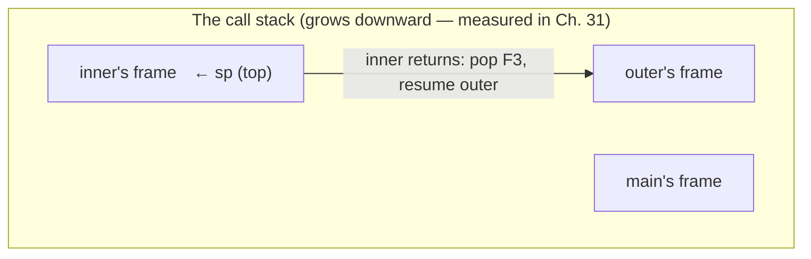
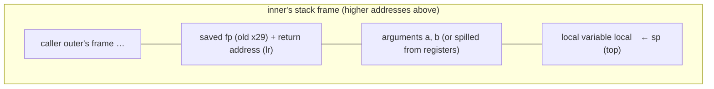

# Chapter 32 · Stack Memory

[简体中文](./32-stack-memory.md) ｜ **English**

---

> Chapter 31 drew the memory map and made a promise: take the call stack apart and watch a **real stack frame** in a debugger. This chapter keeps it.
>
> A function call is far more than "jump over there": the caller must deliver the **arguments** and file away the **return address**; the callee must **open its own frame**, do its work, and **hand everything back intact**. The whole ritual compresses into two instructions — `call` (`bl` on ARM64) and `ret` — powered by one stack pointer going down and up.
>
> The measurements here are as see-it-yourself as it gets: **lldb halts at a breakpoint**, `bt` lists a four-frame chain, `frame variable` reads out `a=1, b=2, local=3`, and the return address in the `lr` register is annotated by the debugger itself as `outer() + 20` — the return address is the caller's own next instruction. In assembly, a function's prologue is exactly three lines: `sub sp` to open the frame, `stp x29, x30` to save the frame pointer and return address, `add x29` to raise the new frame.
>
> The finale is the tail-call measurement: the same recursive function **segfaults at a hundred million levels under `-O0`** (exit code 139), while under `-O2` it not only survives — the compiler **collapses the entire recursion into two instructions**, `add x0, x1, x0; ret`: it derived the closed form. Meanwhile SQL's "recursive" CTE strolls through a million levels, because it never pushes a frame at all — **recursion is a way of writing, not necessarily a way of executing**. That reversal closes the chapter.

## 1. Learning Objectives

By the end of this chapter, you will be able to:

- Dissect a **stack frame**: where the arguments, locals, saved frame pointer, and return address live — verified with `__builtin_*` and a **live lldb session**;
- Read a function's **prologue / epilogue** assembly and explain how `call`/`ret` (`bl`/`ret`) implement call-and-return with the `sp`, `fp`, and `lr` registers;
- Describe **managed-language frames**: the JVM's local variable table + operand stack (measured `stack=2, locals=3` via `javap`), CPython's frame-object chain, C# async's heap-allocated state machine;
- Explain **tail-call optimization**: the same function measured segfaulting at `-O0` and reduced to two instructions at `-O2`, and why V8 refuses TCO;
- Answer "**how much does a function call cost**" with data (Python: ~23 ns per call) and know when it matters.

---

## 2. Why This Concept Exists

### Three problems inside every call

Chapter 12 called functions "reusable blocks of code," but the act of *calling* must solve three things:

| Problem | Concretely |
|---------|-----------|
| **Getting back** | when `add` finishes, how does the CPU know to resume at the instruction **after** the call site? |
| **Having room** | where do `add`'s arguments and locals live without trampling the caller's variables? |
| **Nesting deep** | `main → outer → inner` — each level's "return ticket + luggage" needs its own locker |

### The stack is the natural answer

The three problems share one structure: **the last one called returns first** — Chapter 18's LIFO. The solution follows:

```text
On every call:   pack「return address + arguments + locals」and push  — the pack is a stack frame
On every return: pop the top frame and jump to the return address inside it
```



> **In one sentence**: a stack frame packs the entire scene of one call — the return ticket (return address), the luggage (arguments and locals), and the previous level's address (saved frame pointer); `call` packs, `ret` unpacks, and calls may nest arbitrarily. Chapter 13's scopes and Chapter 31's "call-scoped lifetime" are physically this one pack.

---

## 3. How It Works

### Anatomy of a frame



### Measurement one: the function reports its own frame

C++ compiler intrinsics read the frame's key parts directly (**measured**, `-O0`):

```cpp
__attribute__((noinline))
void inner(int arg) {
    int local = 7;
    // __builtin_frame_address(0)  -> this frame's frame pointer
    // __builtin_return_address(0) -> this frame's return address
}
```

```text
== outer's frame ==
  frame pointer fp:   0x16f8ce1e0
  outer's entry:      0x10053060c

== inner's frame ==
  address of arg:     0x16f8ce1bc   <- both below inner's fp
  address of local:   0x16f8ce1b8
  frame pointer fp:   0x16f8ce1c0   <- 32 bytes below outer's fp (new frame beneath)
  return address:     0x100530684   <- outer's entry + 0x78 — inside outer's body!
```

**The return address is not outer's entry point but "the instruction after the call to inner" inside outer** — `ret` jumps there and outer resumes mid-body.

### Measurement two: lldb halted on a live frame (Chapter 31's promise, kept)

```text
(lldb) bt
  * frame #0: inner(a=1, b=2) at lldb-demo.cpp:4
    frame #1: outer() at lldb-demo.cpp:7
    frame #2: main at lldb-demo.cpp:8
    frame #3: dyld`start + 2840

(lldb) frame variable
  (int) a = 1
  (int) b = 2
  (int) local = 3        <- the debugger reads stack variables straight off the frame layout

(lldb) register read sp x29 x30
  sp = 0x000000016fdfe0b0
  fp = 0x000000016fdfe0c0
  lr = 0x000000010000039c  lldb-demo`outer() + 20   <- return address, annotated!
```

Three things in one shot: **the frame chain** (`bt` walks the saved-fp links), **frame variables** (the compiler recorded each variable's frame offset in debug info), and **the return address** (`lr`, which lldb itself resolves to `outer() + 20`).

### Measurement three: prologue and epilogue — three lines to open a frame, three to return it

A function that calls others, at `-O0` (ARM64, **measured**):

```text
inner:
    sub  sp, sp, #32            ; ① open a 32-byte frame (stack pointer down)
    stp  x29, x30, [sp, #16]    ; ② save old frame pointer (x29) + return address (x30/lr)
    add  x29, sp, #16           ; ③ raise this frame's frame pointer
    ...                         ;    work: spill args, compute
    bl   helper                 ;    calling someone — bl overwrites lr, hence ② first
    ldp  x29, x30, [sp, #16]    ; ②' restore frame pointer and return address
    add  sp, sp, #32            ; ①' return the frame
    ret                         ;    jump to lr — home
```

- **`bl`** (= x86 `call`): stores the next instruction's address in `lr`, then jumps;
- **`ret`**: jumps to the address in `lr` — **call-and-return is these two instructions plus one stack pointer's arithmetic**;
- Leaf functions (calling nobody) skip ②/②' entirely — `lr` is never clobbered, so it never touches the stack (measured: a pure-computation `inner`'s prologue was just `sub sp`).

### Measurement four: tail calls — the compiler dismantles the recursion

```cpp
long countdown(long n, long acc) {
    if (n == 0) return acc;
    return countdown(n - 1, acc + 1);   // tail call: nothing left for this frame to do
}
```

**Same function, one hundred million levels, two compilations (measured)**:

```text
-O0:  segfault (exit code 139) — one frame per level pierces the 8 MB quota instantly
-O2:  returns normally (exit code 0)
```

And `-O2`'s assembly is startling:

```text
countdown:
    add  x0, x1, x0     ; result = n + acc
    ret                 ; that's all — the compiler derived the closed form!
```

The essence of a tail call: **when the last act is a bare call, the current frame has no reason to exist** — it can be reused (recursion becomes a loop), or, as here, algebra-ed away entirely. But note: for C/C++ this is an **optional optimization**, not a language promise — a non-tail position or a destructor in the way and it vanishes.

---

## 4. JavaScript

The engine owns the call stack; your window into it is `Error.stack`.

### The stack, visible (measured)

```javascript
function level3() { console.log(new Error().stack); }
function level2() { level3(); }
function level1() { level2(); }
```

```text
 at level3
 at level2
 at level1      <- top of stack first — one line per frame
```

### "Tail recursion" does nothing in V8 (measured)

```javascript
function countdown(n, acc) {
  if (n === 0) return acc;
  return countdown(n - 1, acc + 1);   // a spec-blessed tail call
}
countdown(1_000_000, 0);
```

```text
RangeError — the tail call pushes frames all the same
```

**ES2015 mandates tail-call optimization; V8 refuses to implement it** (among major engines only Safari's JavaScriptCore did) — for exactly this chapter's reasons: TCO **reuses frames**, so `Error.stack` and debugger backtraces would "lose" frames. Debuggability beat the spec. Deep recursion in JS: rewrite as a loop.

### Async severs the call stack (measured)

```javascript
function caller() {
  setTimeout(function timeoutCallback() {
    // by now the stack no longer contains caller
  }, 0);
}
```

```text
stack depth inside the setTimeout callback: 3 frames — caller's frame is long gone
```

**The callback is not called by `caller`** — `caller` returned ages ago, frames all popped; the event loop re-invokes the callback on a nearly empty stack (Chapter 43's foreshadowing). This is why async errors have "beheaded" stacks, and why `async/await` implementations stitch logical stacks together.

> **Note**: for production async debugging, Node's `--async-stack-traces` (default-on in recent versions) lets V8 stitch broken stacks back together — at a recording cost; think twice on hot paths.

---

## 5. Python

CPython tears off the curtain: **frames are objects, and the chain is the stack** (Chapter 31 measured them living on the heap).

### `f_back`: a frame chain you can walk by hand (measured)

```python
frame = sys._getframe()
while frame is not None:
    print(frame.f_code.co_name, list(frame.f_locals.keys())[:3])
    frame = frame.f_back          # the caller's frame
```

```text
level3()  locals: ['frame', 'name']
level2()  locals: ['secret']       <- you can read other frames' locals!
level1()  locals: []
<module>()  locals: ['__name__', '__doc__', '__package__']
```

Debuggers (pdb), `traceback`, pytest's failure reports — all of them walk this chain. Chapter 30's reflection, once more.

### `dis`: the bytecode-level "local table + evaluation stack" (measured)

```python
def add(a, b):
    total = a + b
    return total
```

```text
LOAD_FAST    0 (a)      <- push from the locals table (an array, by index) onto the eval stack
LOAD_FAST    1 (b)
BINARY_ADD              <- pop two, push one
STORE_FAST   2 (total)  <- store from the eval stack back into the locals table
LOAD_FAST    2 (total)
RETURN_VALUE
```

A CPython frame has two compartments: the **locals table** (the "FAST" in `LOAD_FAST` means direct array indexing) and the **evaluation stack** (the workbench) — a mirror image of the JVM's design (next section).

### The price of a call (measured)

```text
calling an empty function:  258.7 ms (ten million times)
bare pass:                   29.8 ms
~23 ns per call   <- the cost of building, filling, and tearing down a frame
```

23 ns sounds small, but Python has no inlining — **small functions in hot loops are Python's number-one performance regular** (NumPy's vectorization is precisely "turn ten million Python calls into one C call").

> **Note**: in CPython `f_locals` is a **snapshot** of the frame's locals; writing to it usually does not write back. Read freely; don't count on writes.

---

## 6. Java

JVM frames are **explicit specifications** at the bytecode level: every method's frame size is computed at compile time.

### `javap` measurement: the frame's dimensions are in the bytecode

```java
static int add(int a, int b) {
    int sum = a + b;
    return sum;
}
```

```text
static int add(int, int);
  Code:
    stack=2, locals=3, args_size=2   <- operand stack max 2, locals table 3 slots — fixed at compile time
       0: iload_0        <- push locals[0] (a) onto the operand stack
       1: iload_1
       2: iadd           <- pop two, push one
       3: istore_2       <- store into locals[2] (sum)
       4: iload_2
       5: ireturn
```

A JVM frame = a **local variable table** (fixed-length array) + an **operand stack** (fixed-depth workbench). `stack=2, locals=3` means the JVM **never guesses** a frame's size — one foundation of Chapter 5's "verifiable bytecode," and a mirror of CPython's two compartments (there dynamic; here even the depth is statically verified).

### `StackWalker`: the stack as a stream (measured, Java 9+)

```java
StackWalker.getInstance().walk(s -> s.map(f -> f.getMethodName()).toList());
```

```text
level3 (line 14) → level2 (line 20) → level1 (line 21) → main (line 25)
```

More efficient than the old `Thread.getStackTrace()` (frames load lazily) — the standard tool for caller checks and log locating.

### Exceptions carry a stack snapshot (measured)

```text
the exception carries 3 frames; top three:
  at level2IntoTrouble:47 → level1IntoTrouble:46 → main:36
```

**An exception photographs the whole frame chain at construction** — the data behind `printStackTrace`, and the reason constructing an exception costs far more than a normal object (the snapshot walks the entire stack).

> **Note**: HotSpot **inlines** hot small methods — inlined calls have no frame of their own. The physical stack after JIT can be **shallower** than the bytecode-level logical stack; `-XX:MaxInlineSize` and friends govern exactly this (kin to Chapter 27's devirtualization). Deep recursion still goes through Chapter 31's `-Xss` (measured 1,479 → 406,572 levels).

---

## 7. C++

C++'s frame is this chapter's "prototype" — all four measurement suites (`__builtin`, lldb, assembly, tail calls) came from it. This section adds three engineering notes.

### How arguments travel: registers first, stack as fallback

```text
ARM64 calling convention (measured platform): the first 8 integer/pointer args ride registers x0–x7,
                                              the return value rides x0.
                                              Overflow args and oversized structs go to the stack.
```

So "arguments are pushed on the stack" is only half true on modern ABIs — **small arguments ride the register express**, one reason calls are cheaper than intuition says. In our measurement `arg` had a stack address because `-O0` **spills** register arguments to the stack (so debuggers can read them — precisely why lldb's `frame variable` works).

### Frame reuse: the breeding ground of undefined behavior

```cpp
int* dangling() {
    int local = 42;
    return &local;         // Chapter 31, pitfall 1
}
// call dangling(), then call anything else — the new frame overwrites the same memory
// the returned pointer may "still read 42 for now" — then silently rot
```

**The most insidious dangling pointer doesn't crash — it "still works"** — the old frame's memory survives until the next call overwrites it, so tests often pass by luck. Treat the compiler warning (`-Wreturn-stack-address`) as an error.

### Tail calls are not a promise

```text
Measured: countdown at -O2 became add + ret (not even a loop — the closed form)
However —
  · add a local with a destructor → it must run after the call → no longer a tail position → optimization gone
  · -O0 / debug builds → no optimization → a hundred million levels segfault (measured exit 139)
```

> **Note**: never rely on TCO for unbounded recursion in C++ — it is an optimization, not semantics (contrast Scheme, which wrote TCO into its spec). Depth you can't bound: iterate with an explicit stack (Chapter 18's moment).

---

## 8. C#

CLR frames are JVM-isomorphic, but C#'s `async` gives the "stack" a second form — **a state machine on the heap**.

### `StackTrace`: enumerating frames (measured)

```text
Level3 → Level2 → Level1 → Main   <- isomorphic to Java's StackWalker
```

### ⚠️ An async method's "stack" is not a stack (measured)

```csharp
static async Task AsyncMethod() {
    await Task.Delay(1);
    var top = new StackTrace().GetFrame(0)?.GetMethod();
    // who is top?
}
```

```text
top method after await: MoveNext   <- not AsyncMethod!
declared by type: <AsyncMethod>d__3  <- the compiler-generated state machine class
```

The truth: the compiler **rewrites an `async` method into a heap-allocated state machine object** whose fields are your locals; when `await` "suspends" the method, **the stack frame pops and returns normally**, and execution resumes via the state machine's `MoveNext()` on a (possibly entirely different) fresh stack. **In async, a method's stack lifetime and logical lifetime are fully decoupled** — the core mechanism of Chapter 42, with the hard evidence here first.

### struct arguments enter the frame by value (measured)

```csharp
var p = new Point { X = 1 };
Mutate(p);                    // void Mutate(Point q) => q.X = 99;
```

```text
after Mutate(p), p.X = 1   <- what traveled was a stack copy
```

Chapter 31 said `struct` is a value — **as an argument it is copied whole into the callee's frame**. Big structs passed often = a full copy per call (avoid with `in`/`ref`, Chapter 35).

> **Note**: C# exception traces along async chains are deliberately "beautified" (`AsyncMethodBuilder` stitches the logical stack) — logs usually show the **logical call chain**, not physical frames. Profile performance with physical stacks; debug business logic with logical ones. They are not the same thing.

---

## 9. SQL

SQL has no call stack — but it offers a beautiful control experiment: **written as recursion, executed as iteration**.

### A million levels of "recursion," unharmed (measured)

```sql
WITH RECURSIVE cnt(n) AS (
    SELECT 1
    UNION ALL
    SELECT n + 1 FROM cnt WHERE n < 1000000
)
SELECT MAX(n) AS depth FROM cnt;
```

```text
depth = 1000000    <- the same depth imperatively: Python stops at 999, JS blows at ~9k (Ch. 31 measured)
```

### Why it survives: no frames, just a queue

```text
How a recursive CTE actually runs:
  ① run the base query (SELECT 1), put the rows in a work queue
  ② take a row → plug into the recursive part → produce new rows → back on the queue
  ③ queue empty → done
No calls, no return addresses, no frames — the engine rewrote recursion into iteration
```

**This is the textbook demonstration of "deep recursion → iteration + explicit data structure"** — the advice §7 gave C++, performed by the SQL engine at the language level.

### Where the stack really gets pushed: the parser

```sql
SELECT ((((((1))))));   -- expression nesting: recursive-descent parsing (Chapter 3)
```

SQLite caps expression nesting with `SQLITE_MAX_EXPR_DEPTH` (default 1000) — **protecting the parser's C stack**. Same spirit as Python's `recursionlimit`: a runtime's fuse on its own C stack.

> **Engineering note**: a recursive CTE won't blow the stack, but **its result set occupies memory** — a million-row work queue isn't free; and always write the termination condition (`WHERE n < ...`), because without one it doesn't error — it iterates until resources run out.

---

## 10. Cross-Language Comparison

### ① Frame mechanics

| Feature | JavaScript | Python | Java | C++ | C# |
|---------|-----------|--------|------|-----|-----|
| Form of a frame | engine-internal | **heap frame object** | locals table + operand stack | **raw memory + fp/lr registers** | JVM-isomorphic |
| Frame size fixed when | JIT decides | runtime | **compile time** (`stack=`/`locals=`, measured) | compile time | compile time (JIT) |
| Stack-viewing tool | `Error.stack` | `sys._getframe` / `f_back` | `StackWalker` / exceptions | **lldb / `__builtin_*`** (measured) | `StackTrace` |
| Read another frame's locals | ❌ | ✅ **`f_locals`** (measured) | debugger only | debugger only (measured) | debugger only |
| Tail-call optimization | in the spec, **V8 refuses** (measured) | ❌ (Guido's explicit no) | ❌ (JIT rare cases) | ✅ **optimization level decides** (measured) | ❌ (IL `tail.` prefix, rarely used) |
| Async vs the stack | callbacks restart on an empty stack (measured: 3 frames) | coroutines keep their own frame chains | virtual threads keep their own stacks | — (no built-in async) | **async becomes a heap state machine** (measured) |

### ② The key experiment: four fates of one tail recursion

| Language/condition | Outcome at a million (or 100 million) levels |
|--------------------|--------------------------------------------|
| C++ `-O0` | **segfault** (measured: 100M levels, exit 139) |
| C++ `-O2` | **two instructions**: `add x0, x1, x0; ret` — recursion algebra-ed away (measured) |
| JavaScript (V8) | `RangeError` — the spec promised TCO, the engine declined (measured) |
| SQL recursive CTE | **a million levels, normal result** — recursive text, iterative execution (measured) |

**Same logic, fate decided by who executes it and under what rules** — the complete argument that recursion is a way of writing, not necessarily of executing.

### ③ Two design divides

**Divide one: is the frame a black box or a white box**

```text
Black box (C++ physical frames / V8 internals):  performance first; observation via debuggers
White box (Python frame objects):                frames are first-class; free introspection — at one heap object per call
Middle (Java/C# enumeration APIs):               run as black boxes, open a window on demand (StackWalker/StackTrace)
```

**Divide two: promise tail-call optimization or not**

```text
Promise it (Scheme / the ES2015 spec):   unbounded tail recursion is legitimate — but V8 voted no with its feet (debuggability)
Refuse it (Python / Java / C#):          deep recursion should iterate — trace integrity first
Whenever (C++):                          the optimizer decides — so never depend on it
```

### ④ Common ground and root causes

**Common ground**: every language's calls follow one abstraction — LIFO frames, return addresses, argument passing; every language offers some view of its stack (if only exception traces); recursion of unbounded depth should become iteration everywhere.

**Root causes**:

- **C++ uses the hardware mechanism directly** (`sp`/`fp`/`lr` + `bl`/`ret`) — fastest, barest;
- **JVM/CLR formalize frames into bytecode** (`stack=`/`locals=`) — verifiable and portable, with the JIT mapping back onto the hardware stack;
- **CPython makes frames objects** — introspection bought with density and speed (frame-chain walking is its native pastime);
- **V8 chose engineering over the spec** — refusing TCO to keep `Error.stack` whole;
- **C#'s async state machine** shows the endgame: **the logical structure of calls can fully decouple from the physical stack** — the door to Chapters 42/44 (async and coroutines).

---

## 11. Implementation Comparison

| Runtime | Physical frames | Key details |
|---------|----------------|-------------|
| **V8 (JavaScript)** | optimized frames on the hardware stack | post-JIT layout is the optimizer's; deopt must be able to "rebuild" interpreter frames — a brake on aggressive optimization and part of the TCO refusal |
| **CPython** | a chain of heap `PyFrameObject`s (measured `f_back`) | a heap frame readied per call — where the measured 23 ns largely goes; 3.11+ materializes frames lazily for speed |
| **JVM (Java)** | hardware-stack frames, specs from bytecode (measured `stack=2, locals=3`) | the bytecode verifier statically proves operand-stack balance at load time — "frames can't overflow" is proven, not checked |
| **C++ (native)** | `sub sp` + `stp x29, x30` (measured assembly) | args ride x0–x7; the fp chain is what `bt` walks; `-fomit-frame-pointer` can drop even the fp |
| **CLR (C#)** | hardware frames + async state machines (measured `MoveNext`) | at `await` the frame returns normally; locals live in state-machine fields on the heap; exception traces stitched by `AsyncMethodBuilder` |

**A distinction worth memorizing**:

```text
Frames on the hardware stack (C++/JVM/CLR/V8):  fast, but lifetime is LIFO-locked — function returns, frame dies
Frames allowed on the heap (CPython frame objects, C# async state machines, coroutines everywhere):
                                                a bit slower, but lifetime is free — the physical precondition
                                                for async and coroutines (Chapters 42/44)
```

---

## 12. Performance Analysis

### What a call actually costs (measured)

| Item | Data |
|------|------|
| Python empty-function call | **~23 ns each** (measured: ten million calls cost 229 ms extra) |
| C++/Java small functions | usually **near zero** — inlining erases the call (measured: `countdown` wasn't even a loop, it was algebra) |
| Non-inlined native call | a few ns: `bl`/`ret` + prologue/epilogue (measured: three instructions) |

**Three orders of magnitude, explained by frame construction cost**: a C++ frame is one `sp` bump (or vanishes with inlining); a CPython frame is a heap object plus two tables. This is among the biggest micro-reasons "Python is slow" — not slower interpretation per se, but **a frame tax on every call**.

### When to care, when not to

```text
Care:      small functions in Python hot loops (ten million calls = 230 ms of pure overhead)
           → vectorize / batch / drop to C
Don't:     thousands of business calls per second — nanosecond costs are noise in millisecond flows
```

### The stack itself is never the bottleneck

```text
Stack allocation = one sp bump (Ch. 31); frame reclamation = one sp bump back
The real costs are what the frame carries: big structs by value (measured copy semantics),
full-stack snapshots at exception construction (measured), GC scans across deep frame chains
```

> ⚠️ The usual reminder: measure first. Flame graphs from `perf` / `py-spy` / async-profiler are **high-frequency samples of call stacks** — the frame chains of this chapter are every profiler's raw material. Understand the stack and you can read a flame graph.

---

## 13. Engineering Practice

| Scenario | ✅ Recommended | ❌ Avoid | Why |
|----------|--------------|---------|-----|
| Recursion of unbounded depth | iterate with an explicit stack | betting on TCO / enlarging stacks | TCO is an optimization, not a promise (measured: `-O0` dies) |
| Python hot loops | vectorize, batch APIs | ten million tiny calls | 23 ns frame tax each (measured) |
| Returning local data in C++ | by value / smart pointers | returning a local's address | frame reuse makes danglers "work intermittently" |
| Big `struct` params (C#/C++) | `in` / `const&` | by value | a full copy into each callee frame (measured) |
| Deep recursion in JS | rewrite as loops | relying on ES2015 TCO | V8 won't (measured RangeError) |
| Debugging async | logical stacks (async traces) | puzzling over physical stacks | callbacks run on an empty stack (measured: 3 frames) |
| Finding your caller in Java | `StackWalker` | `new Throwable()` for the stack | lazy frames, far cheaper |
| Exceptions | for genuinely exceptional cases | as control flow | construction = full-stack snapshot (measured) |
| Hierarchies/graphs in SQL | recursive CTEs | app-level query loops | iterative engine, no stack to blow (measured: 1M levels) |

### The rule of thumb

```text
depth bounded and far below the quota    → recurse freely; clarity first
depth input-dependent / unbounded        → iterate, always (unless the language promises TCO)
calls in the tens of millions in Python  → start counting the frame tax
```

---

## 14. Best Practices

- **Before recursing, ask about depth**: bounded and small → recurse; unbounded → iterate. This judgment precedes all language differences.
- **Never rely on tail-call optimization** — unless the language wrote it into its spec (Scheme), it comes and goes with optimization levels (measured: life at `-O2`, death at `-O0`).
- **Understand your debugger**: `bt` walks the fp chain; `frame variable` reads by offset — knowing this explains why optimized builds say "variable unavailable" and inlining makes frames vanish.
- **In async worlds, trust the logical stack**: physical stacks sever at `await`/callbacks (measured `MoveNext`, empty-stack callbacks) — debug business with stitched traces, performance with physical stacks.
- **Recalibrate Python performance intuition**: calls aren't free (measured 23 ns) — "extract a helper for clarity" has a real price inside hot loops.
- **Spend exceptions dearly**: construction photographs the whole stack (measured) — hot paths use return values; exceptions are for the exceptional.
- **Learn frames before flame graphs**: every profiler samples the frame chains of this chapter — the y-axis of a flame graph *is* `bt`.

---

## 15. Common Pitfalls

**Pitfall 1 · Betting on tail-call optimization (measured: two fates)**

```text
The same countdown: two instructions for 100M levels at -O2; segfault exit 139 at -O0
```

**Avoid it**: TCO in C/C++/JS is never semantic. Deep recursion = iteration, no exceptions.

**Pitfall 2 · The dangling stack pointer that "still works"**

```cpp
int* p = dangling();   // returned a local's address
*p;                    // may still read 42 — the old frame just isn't overwritten yet
anyCall();             // a new frame overwrites that memory
*p;                    // silent rot — a hundred times harder to find than a crash
```

**Avoid it**: promote `-Wreturn-stack-address` (Clang) / `-Wreturn-local-addr` (GCC) to errors; when a value is "sometimes right," suspect frame reuse first.

**Pitfall 3 · Losing your caller inside async callbacks (measured)**

```text
stack depth in the setTimeout callback: 3 frames — caller long gone
```

**Avoid it**: not a bug — the mechanism. The event loop re-invokes on an empty stack. Turn on async stack traces to debug; never use `Error.stack` inside a callback to find "who scheduled me."

**Pitfall 4 · Reading `StackTrace` in C# async and meeting the state machine (measured)**

```text
top of stack after await: MoveNext (<AsyncMethod>d__3) — not your method name
```

**Avoid it**: that *is* the physical stack of async. For log context use `CallerMemberName` or exceptions' logical traces; don't parse physical frame names.

**Pitfall 5 · Exceptions as control flow**

```java
try { return map.get(key); } catch (NullPointerException e) { return def; }
```

**Avoid it**: exception construction snapshots the entire stack (measured) — orders of magnitude beyond an if on hot paths. Exceptions express the exceptional; branches express branches.

**Pitfall 6 · Splitting a Python hot loop into tiny functions**

```python
for i in range(10_000_000):
    process_one(i)          # 23 ns frame tax each (measured) — 230 ms of pure overhead
```

**Avoid it**: merge calls, batch, vectorize with NumPy. Extracting functions is a virtue — in Python's hot loops, price it first.

**Pitfall 7 · A recursive CTE without a termination condition**

```sql
WITH RECURSIVE cnt(n) AS (SELECT 1 UNION ALL SELECT n + 1 FROM cnt)  -- no WHERE!
```

**Avoid it**: it can't blow the stack (iterative, measured) — so it also **never stops on its own**; it iterates until resources die. The termination condition is a recursive CTE's lifeline; add a `LIMIT` as a backstop in SQLite.

---

## 16. Interview Questions

**Basic**

1. What lives inside a stack frame, and what happens to each part at return?
2. What do `call` (`bl`) and `ret` each do? Where does the return address live?
3. Why do function calls have overhead? On which steps is it spent?

**Intermediate**

4. **What do the three prologue instructions do? Why may a leaf function skip part of them?**
5. What does the JVM's `stack=2, locals=3` mean? When is it computed, and what does it buy?
6. **What is tail-call optimization, and why does the ES2015-mandated TCO not exist in V8?**

**Advanced**

7. **When a C# async method hits `await`, where do its stack frame and its locals each go? Why is `MoveNext` on top of the stack?**
8. Why does a million-level recursive CTE survive while the same depth of imperative recursion must die? What does that say about recursion's nature?
9. Where does a profiler's flame-graph data come from? How do inlining and optimization "distort" the stack you see?

---

## 17. Exercises

**Basic**

1. Print frame pointers and return addresses across three nested calls with `__builtin_frame_address` / `__builtin_return_address`; draw your machine's frame chain.
2. Run `javap -v` on a method of your own; explain its `stack=`, `locals=`, and each bytecode.
3. Walk and print a five-deep call chain with Python's `f_back`, including each frame's locals.

**Intermediate**

4. **Reproduce the tail-call measurement**: compile the same tail-recursive function at `-O0`/`-O2`, run 100M levels, then diff the two assemblies via `-S`.
5. Break inside a function with lldb/gdb: `bt` the chain, `frame variable` the locals, `register read` the return address — confirm it lands inside the caller.
6. Measure empty-function call cost in Python and JS on your machine (ten-million-call timing); compare the frame taxes.

**Challenge**

7. Rewrite a recursive tree traversal iteratively with an explicit stack; measure the maximum depth each version survives.
8. In C#, print `new StackTrace()` before and after an `await` in the same async method; explain the difference.
9. Implement the first 90 Fibonacci numbers with a recursive CTE; explain why there is no exponential blowup (hint: each row enters the work queue once).

---

## 18. Chapter Summary

**One sentence**: a stack frame packs one call's entire scene — return address, arguments, locals, the previous frame's pointer — and `bl`/`ret` plus one stack pointer's arithmetic implement arbitrarily deep call-and-return (measured: lldb resolves `lr` to `outer() + 20`; the prologue is `sub sp` / `stp x29, x30` / `add x29`); managed languages formalize the frame (JVM `stack=2, locals=3`), objectify it (CPython's `f_back` chain), or move it to the heap (C# async state machines — measured `MoveNext` on top); and the tail-call measurements (`-O0` segfault at 100M levels vs `-O2` two instructions) together with SQL's recursive CTE (a million levels, iteratively) prove the chapter's reversal: **recursion is a way of writing, not necessarily a way of executing**.

**Key takeaways**

- **Frame anatomy** (measured): args and locals below fp; the return address inside the caller (`outer() + 0x78`); each new frame 32 bytes beneath the last.
- **The debugger trio** (measured): `bt` walks the fp chain, `frame variable` reads by offset, `lr` is the return address.
- **Prologue/epilogue** (measured): `sub sp` opens, `stp x29, x30` saves fp+lr, `add x29` raises the frame; leaf functions may skip the save.
- **Managed frames, three forms** (measured): JVM sized at compile time (`stack=`/`locals=`); CPython frames as objects (`f_back`/`f_locals`); C# async frames as heap state machines (`MoveNext`).
- **Four fates of a tail call** (measured): C++ `-O0` segfault / `-O2` algebra into two instructions / V8 refuses TCO (RangeError) / SQL CTE iterates a million levels.
- **The price of calling** (measured): Python's 23 ns frame tax; exceptions snapshot the whole stack; async severs the physical stack (3-frame callbacks, `MoveNext`).
- **Flame-graph raw material**: profilers sample exactly these frame chains.

**Checklist**

- [ ] I can draw a stack frame's internal layout and name each part's role.
- [ ] I can read prologue/epilogue assembly and `javap` frame specs.
- [ ] I can locate a return address in a debugger and explain where it points.
- [ ] I know the real status of TCO in each language, and that deep recursion becomes iteration.
- [ ] I can explain why physical stacks are "beheaded" in async/callback code.

**Next chapter**: the stack's law is "function returns, frame dies" — but real programs are full of data that must **outlive its creator**: returned strings, cached objects, data handed to another thread. They can only live on the **heap**. And the heap's freedom has a bill: allocation must hunt for space (no more single `sp` bump), reclamation needs an owner, fragmentation accumulates. Chapter 33 enters heap memory — what `malloc`/`new` actually do, how free lists and arenas are organized, why heap allocation runs two orders of magnitude behind the stack, and the first crime scenes of leaks and fragmentation.

---

## 19. Further Reading

- <a href="https://en.wikipedia.org/wiki/Call_stack" target="_blank" rel="noopener">Wikipedia: Call stack</a> — the standard description of call stacks and frames.
- <a href="https://en.wikipedia.org/wiki/Calling_convention" target="_blank" rel="noopener">Wikipedia: Calling convention</a> — a survey of platform conventions.
- <a href="https://en.wikipedia.org/wiki/Tail_call" target="_blank" rel="noopener">Wikipedia: Tail call</a> — the concept and per-language status of TCO.
- <a href="https://github.com/ARM-software/abi-aa/blob/main/aapcs64/aapcs64.rst" target="_blank" rel="noopener">Arm ABI · AAPCS64</a> — the official ARM64 calling convention (x0–x7 argument passing; the roles of x29/x30).
- <a href="https://docs.oracle.com/javase/specs/jvms/se17/html/jvms-2.html#jvms-2.6" target="_blank" rel="noopener">JVM Specification · Frames</a> — the authoritative definition of the locals table and operand stack.
- <a href="https://docs.oracle.com/en/java/javase/17/docs/api/java.base/java/lang/StackWalker.html" target="_blank" rel="noopener">Java API · StackWalker</a> — the stack-walking API, officially.
- <a href="https://docs.python.org/3/library/dis.html" target="_blank" rel="noopener">Python Docs · dis</a> — CPython bytecode and the evaluation stack, officially.
- <a href="https://learn.microsoft.com/en-us/dotnet/csharp/asynchronous-programming/task-asynchronous-programming-model" target="_blank" rel="noopener">Microsoft Learn · The task asynchronous programming model</a> — async/await and the state-machine rewrite, officially.
- <a href="https://www.sqlite.org/lang_with.html" target="_blank" rel="noopener">SQLite Docs · WITH (recursive CTEs)</a> — the official description of the work-queue evaluation algorithm.
