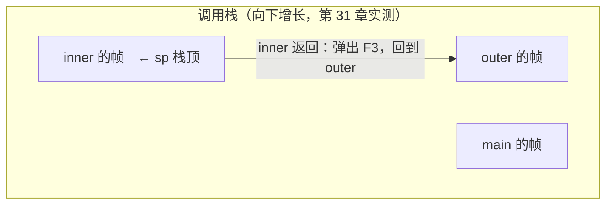
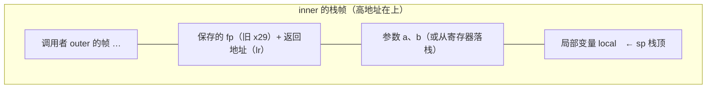

# 第 32 章 · 栈内存

**简体中文** ｜ [English](./32-stack-memory.en-US.md)

---

> 第 31 章画出了内存地图，也留了一个承诺：把调用栈拆开、用调试器看一个**真实栈帧**的内部。本章兑现它。
>
> 一次函数调用远不止"跳过去执行"：调用者要把**参数**送到位、把**返回地址**存好；被调函数要**开辟自己的帧**、干完活再**原样归还**。这一整套动作压缩在两条指令里——`call`（ARM64 上是 `bl`）与 `ret`——全靠一根栈指针一减一加。
>
> 本章的实测足够"眼见为实"：**lldb 停在断点上**，`bt` 列出四层帧链，`frame variable` 直接读出 `a=1, b=2, local=3`，`lr` 寄存器里的返回地址被调试器标注为 `outer() + 20`——返回地址就是调用者体内的下一条指令；汇编层面，一个函数的序幕恰好三条：`sub sp` 开帧、`stp x29, x30` 保存帧指针与返回地址、`add x29` 立新帧。
>
> 压轴的是尾调用实测：同一个递归函数，`-O0` 下一亿层**段错误**（退出码 139），`-O2` 下不仅没爆栈——编译器把整个递归**优化成了两条指令** `add x0, x1, x0; ret`：它直接推导出了闭式解。而 SQL 的"递归"CTE 一百万层安然跑完，因为它根本不压栈——**递归是写法，迭代是执行**，这是本章最后的反转。

## 1. 学习目标

本章结束后，你将能够：

- 解剖一个**栈帧**：参数、局部变量、保存的帧指针、返回地址各在什么位置，用 `__builtin_*` 与 **lldb 实测**验证；
- 读懂函数的**序幕与尾声**（prologue / epilogue）汇编，说清 `call`/`ret`（`bl`/`ret`）如何靠 `sp`、`fp`、`lr` 三个寄存器完成调用与返回；
- 说明**托管语言的栈帧长什么样**：JVM 的局部变量表 + 操作数栈（`javap` 实测 `stack=2, locals=3`）、CPython 的 frame 对象链、C# async 的堆上状态机；
- 解释**尾调用优化**：实测同一函数 `-O0` 段错误、`-O2` 两条指令，以及为什么 V8 不做 TCO；
- 用实测数据回答"**函数调用到底多贵**"（Python 每次约 23 ns），并知道什么时候需要在意。

---

## 2. 为什么会出现这个概念

### 函数调用的三个难题

第 12 章说过函数是"可复用的代码块"，但"调用"这个动作本身要解决三件事：

| 难题 | 具体问题 |
|------|---------|
| **回得去** | `add` 执行完，CPU 怎么知道该回到调用点的**下一条指令**？ |
| **放得下** | `add` 的参数和局部变量放哪？调用者的变量不能被覆盖 |
| **嵌得深** | `main → outer → inner` 层层嵌套，每层的"回程票 + 行李"都要各自保管 |

### 栈是天然答案

三个难题有一个共同结构：**最后调用的最先返回**——这正是第 18 章的 LIFO。于是解法水到渠成：

```text
每次调用：把「返回地址 + 参数 + 局部变量」打包压栈  ——这个包叫栈帧（stack frame）
每次返回：弹出栈顶的帧，按帧里的返回地址跳回去
```



> **一句话**：栈帧把一次调用的全部现场——回程票（返回地址）、行李（参数与局部变量）、上一层的地址（保存的帧指针）——打成一个包；`call` 压包、`ret` 拆包，函数调用因此可以任意嵌套。第 13 章的"作用域"、第 31 章的"函数级生命周期"，物理实现全是这一个包。

---

## 3. 底层原理

### 栈帧解剖图



### 实测一：不用调试器，让函数自报家门

C++ 的编译器内建函数能直接读出帧的关键部件（**实测**，`-O0`）：

```cpp
__attribute__((noinline))
void inner(int arg) {
    int local = 7;
    // __builtin_frame_address(0)  → 本帧的帧指针
    // __builtin_return_address(0) → 本帧的返回地址
}
```

```text
== outer 的栈帧 ==
  帧指针 fp:          0x16f8ce1e0
  outer 函数的起点:   0x10053060c

== inner 的栈帧 ==
  参数 arg 的地址:    0x16f8ce1bc   ← 都在 inner 的 fp 之下
  局部 local 的地址:  0x16f8ce1b8
  帧指针 fp:          0x16f8ce1c0   ← 比 outer 的 fp 低 32 字节（新帧压在下面）
  返回地址:           0x100530684   ← 落在 outer 起点 + 0x78 处——outer 体内！
```

**返回地址不是 outer 的入口，而是 outer 里"调用 inner 的下一条指令"**——`ret` 跳回去，outer 从断处继续。

### 实测二：lldb 停在活的栈帧上（兑现第 31 章的承诺）

```text
(lldb) bt
  * frame #0: inner(a=1, b=2) at lldb-demo.cpp:4
    frame #1: outer() at lldb-demo.cpp:7
    frame #2: main at lldb-demo.cpp:8
    frame #3: dyld`start + 2840

(lldb) frame variable
  (int) a = 1
  (int) b = 2
  (int) local = 3        ← 调试器按帧布局直接读出栈上的变量

(lldb) register read sp x29 x30
  sp = 0x000000016fdfe0b0
  fp = 0x000000016fdfe0c0
  lr = 0x000000010000039c  lldb-demo`outer() + 20   ← 返回地址被直接标注！
```

三件事同框：**帧链**（`bt` 就是沿保存的 fp 一路上溯）、**帧内变量**（编译器把每个变量的帧内偏移写进了调试信息）、**返回地址**（`lr` 寄存器，lldb 直接告诉你它指向 `outer() + 20`）。

### 实测三：序幕与尾声——三条指令开帧，三条指令还帧

一个"会调用别人"的函数，`-O0` 汇编（ARM64，**实测**）：

```text
inner:
    sub  sp, sp, #32            ; ① 开辟 32 字节栈帧（栈指针下移）
    stp  x29, x30, [sp, #16]    ; ② 保存旧帧指针(x29) + 返回地址(x30/lr)
    add  x29, sp, #16           ; ③ 立起本帧的帧指针
    ...                         ;    干活：参数落栈、计算
    bl   helper                 ;    调用别人 —— bl 会覆盖 lr，所以 ② 必须先存
    ldp  x29, x30, [sp, #16]    ; ②' 恢复帧指针与返回地址
    add  sp, sp, #32            ; ①' 归还栈帧
    ret                         ;    跳到 lr —— 回家
```

- **`bl`**（= x86 的 `call`）：把下一条指令的地址存进 `lr`，然后跳转；
- **`ret`**：跳到 `lr` 存的地址——**"调用与返回"就是这两条指令 + 一根栈指针的加减**；
- 叶子函数（不调用别人）连 ②/②' 都省——`lr` 不会被覆盖，无须落栈（实测过：纯计算的 `inner` 序幕只有 `sub sp`）。

### 实测四：尾调用——编译器把递归拆掉

```cpp
long countdown(long n, long acc) {
    if (n == 0) return acc;
    return countdown(n - 1, acc + 1);   // 尾调用：本帧再无未竟之事
}
```

**同一个函数、一亿层递归，两种编译**（实测）：

```text
-O0:  段错误（退出码 139）——每层压一帧，8 MB 栈额度瞬间穿透
-O2:  正常返回（退出码 0）
```

`-O2` 的汇编更惊人：

```text
countdown:
    add  x0, x1, x0     ; 结果 = n + acc
    ret                 ; 就这两条——编译器直接推出了闭式解！
```

尾调用的本质：**最后一步是纯调用时，本帧已无存在必要**——可以复用当前帧（变成循环），甚至像这里一样被彻底代数化。但注意：这是 C/C++ 编译器的**可选优化**，不是语言承诺——换个写法（非尾位置、有析构函数挡路）就不会发生。

---

## 4. JavaScript

JS 的调用栈由引擎全权管理，暴露给你的入口是 `Error.stack`。

### 调用栈可见（实测）

```javascript
function level3() { console.log(new Error().stack); }
function level2() { level3(); }
function level1() { level2(); }
```

```text
 at level3
 at level2
 at level1      ← 栈顶在前——每一行就是一帧
```

### "尾递归"在 V8 里不奏效（实测）

```javascript
function countdown(n, acc) {
  if (n === 0) return acc;
  return countdown(n - 1, acc + 1);   // 标准里的尾调用
}
countdown(1_000_000, 0);
```

```text
RangeError —— 尾调用照样压栈
```

**ES2015 明文规定了尾调用优化，但 V8 拒绝实现**（主流引擎里只有 Safari 的 JavaScriptCore 做了）——理由正是本章讲的机制：TCO 会**复用栈帧**，`Error.stack` 与调试器的 `bt` 会因此"丢帧"，工程上的可调试性赢了规范。深递归在 JS 里请改写为循环。

### 异步切断调用栈（实测）

```javascript
function caller() {
  setTimeout(function timeoutCallback() {
    // 此刻的调用栈里已经没有 caller
  }, 0);
}
```

```text
setTimeout 回调里的栈深: 3 帧 —— caller 的帧早已不在
```

**回调不是被 `caller` 调用的**——`caller` 早已返回、帧已弹光；事件循环在一个几乎全空的栈上重新调起回调（第 43 章的伏笔）。这就是异步代码报错时堆栈"断头"的原因，也是 `async/await` 要做"异步堆栈拼接"的动机。

> **注意事项**：生产环境排查异步问题，Node 可用 `--async-stack-traces`（新版本默认开启）让 V8 把断掉的栈拼回来——代价是记录开销，热路径慎开。

---

## 5. Python

CPython 把"栈帧是运行时内部结构"这层纸捅破了：**帧就是对象，链就是栈**（第 31 章实测过帧住在堆上）。

### `f_back`：一条能亲手遍历的帧链（实测）

```python
frame = sys._getframe()
while frame is not None:
    print(frame.f_code.co_name, list(frame.f_locals.keys())[:3])
    frame = frame.f_back          # 指向调用者的帧
```

```text
level3()  局部变量: ['frame', 'name']
level2()  局部变量: ['secret']       ← 连别人帧里的局部变量都能读！
level1()  局部变量: []
<module>()  局部变量: ['__name__', '__doc__', '__package__']
```

调试器（pdb）、`traceback`、pytest 的失败报告，全是在遍历这条链——第 30 章"反射"的又一实例。

### `dis`：字节码层的"局部变量表 + 求值栈"（实测）

```python
def add(a, b):
    total = a + b
    return total
```

```text
LOAD_FAST    0 (a)      ← 从局部变量表（数组，按下标）压入求值栈
LOAD_FAST    1 (b)
BINARY_ADD              ← 弹两个，压回一个
STORE_FAST   2 (total)  ← 从求值栈存回局部变量表
LOAD_FAST    2 (total)
RETURN_VALUE
```

CPython 的帧里有两个储物区：**局部变量表**（`LOAD_FAST` 的 "FAST" 就是"按下标直取数组"）和**求值栈**（运算的工作台）——与 JVM 的设计（下一节）如出一辙。

### 函数调用的价格（实测）

```text
调用空函数 :  258.7 ms（一千万次）
纯 pass    :   29.8 ms
每次调用约 23 ns   ← 建帧/压参/拆帧的成本
```

23 ns 听着不多，但 Python 没有内联——**热循环里的小函数调用是 Python 性能问题的头号常客**（NumPy 的向量化本质就是"把一千万次 Python 调用变成一次 C 调用"）。

> **注意事项**：`f_locals` 在 CPython 里是帧局部变量的**快照**，改它通常不会写回真正的局部变量——读随意，写别指望。

---

## 6. Java

JVM 的栈帧在字节码层面就是**显式规格**：每个方法的帧多大，编译期算得一清二楚。

### `javap` 实测：帧的尺寸写在字节码里

```java
static int add(int a, int b) {
    int sum = a + b;
    return sum;
}
```

```text
static int add(int, int);
  Code:
    stack=2, locals=3, args_size=2   ← 操作数栈最深 2、局部变量表 3 格——编译期定死
       0: iload_0        ← 局部变量表[0]（a）压入操作数栈
       1: iload_1
       2: iadd           ← 弹两个，压回一个
       3: istore_2       ← 存进局部变量表[2]（sum）
       4: iload_2
       5: ireturn
```

JVM 帧 = **局部变量表**（定长数组）+ **操作数栈**（定深工作台）。`stack=2, locals=3` 意味着 JVM 创建这个帧时**不用猜大小**——这是第 5 章"字节码可验证"的基础之一，也与 CPython 的两区设计互为镜像（那边是动态语言，这边连深度都静态验证）。

### `StackWalker`：把调用栈变成流（实测，Java 9+）

```java
StackWalker.getInstance().walk(s -> s.map(f -> f.getMethodName()).toList());
```

```text
level3 (行 14) → level2 (行 20) → level1 (行 21) → main (行 25)
```

比老的 `Thread.getStackTrace()` 更高效（懒加载帧），是框架做调用方检查、日志定位的标准工具。

### 异常携带栈快照（实测）

```text
异常携带了 3 帧，最上面三帧:
  at level2IntoTrouble:47 → level1IntoTrouble:46 → main:36
```

**异常对象在构造时就拍下整条帧链**——这就是 `printStackTrace` 的数据来源，也是"构造异常比构造普通对象贵得多"的原因（拍快照要遍历整个栈）。

> **注意事项**：HotSpot 会对热点小方法做**内联**——被内联的调用不再有独立栈帧。所以 JIT 之后的物理栈可能比字节码意义上的逻辑栈**浅**；`-XX:MaxInlineSize` 等参数影响的正是这件事（第 27 章去虚化的同门优化）。深递归依旧用第 31 章的 `-Xss` 调额度（实测 1479 → 406572 层）。

---

## 7. C++

C++ 的栈帧就是本章第 3 节的"原型机"——四组实测（`__builtin`、lldb、汇编、尾调用）全部来自它。本节补齐工程侧的三件事。

### 参数怎么传：寄存器优先，栈是后备

```text
ARM64 调用约定（实测平台）：前 8 个整型/指针参数走寄存器 x0–x7，返回值走 x0
                          超出的参数、过大的结构体才落栈
```

所以"参数压栈"在现代 ABI 里只说对了一半——**小参数坐寄存器的快车**，这也是函数调用比想象中便宜的原因之一。实测里 `inner` 的 `arg` 有栈地址，是因为 `-O0` 会把寄存器参数**落栈保存**（方便调试器读，正是 lldb `frame variable` 能工作的原因）。

### 栈帧的复用：未定义行为的温床

```cpp
int* dangling() {
    int local = 42;
    return &local;         // 第 31 章的坑 1
}
// 调用 dangling() 后再调用任何函数——新帧会覆写同一片内存
// 之前返回的指针可能"暂时还能读到 42"——然后悄无声息地变脏
```

**悬垂指针最阴险的形态不是崩溃，而是"看起来还能用"**——旧帧的内存要等下一次调用才被覆写，测试时常常"恰好没坏"。编译器警告（`-Wreturn-stack-address`）必须当错误处理。

### 尾调用不是承诺

```text
实测：countdown 在 -O2 被优化成 add + ret（连循环都不是，直接闭式解）
但是——
  · 加一个带析构函数的局部对象 → 析构必须在调用后执行 → 不再是尾位置 → 优化消失
  · -O0 / 调试构建 → 不优化 → 一亿层照样段错误（实测退出码 139）
```

> **注意事项**：C++ 里**不要**依赖尾调用优化写无界递归——它是优化不是语义（对比：Scheme 把 TCO 写进语言规范）。深度不可控的递归，改迭代 + 显式栈（第 18 章的用武之地）。

---

## 8. C#

CLR 的栈帧与 JVM 同构，但 C# 的 `async` 让"栈"有了第二种形态——**堆上的状态机**。

### `StackTrace`：帧的枚举（实测）

```csharp
new StackTrace().GetFrames();
```

```text
Level3 → Level2 → Level1 → Main   ← 与 Java StackWalker 同构
```

### ⚠️ async 方法的"栈"不是栈（实测）

```csharp
static async Task AsyncMethod() {
    await Task.Delay(1);
    var top = new StackTrace().GetFrame(0)?.GetMethod();
    // top 是谁？
}
```

```text
await 之后栈顶方法: MoveNext   ← 不是 AsyncMethod！
它属于类型: <AsyncMethod>d__3  ← 编译器生成的状态机类
```

真相：编译器把 `async` 方法**改写成一个堆上的状态机对象**，局部变量全部变成它的字段；`await` 让方法"暂停"时，**栈帧正常弹出归还**，恢复执行时由状态机的 `MoveNext()` 在（可能完全不同的）新栈上继续。**方法的"栈上生命周期"与"逻辑生命周期"在 async 里彻底分离**——这是第 42 章异步的核心机制，此处先看到铁证。

### struct 参数按值入栈（实测）

```csharp
var p = new Point { X = 1 };
Mutate(p);                    // void Mutate(Point q) => q.X = 99;
```

```text
Mutate(p) 之后 p.X = 1   ← 传的是栈上的副本
```

第 31 章说 `struct` 是值——**作为参数时整个复制进被调帧**。大 `struct` 频繁传参 = 每次调用都在栈上抄一遍（避免方式：`in`/`ref` 传引用，第 35 章）。

> **注意事项**：C# 的异常栈回溯在 async 链路上经过专门"美化"（`AsyncMethodBuilder` 拼接逻辑栈），日志里看到的往往是**逻辑调用链**而非物理帧——排查性能时用 profiler 看物理栈，排查业务时看异常的逻辑栈，两者不是一个东西。

---

## 9. SQL

SQL 没有函数调用栈，但它有一个漂亮的"对照实验"：**递归写法，迭代执行**。

### 一百万层"递归"，安然无恙（实测）

```sql
WITH RECURSIVE cnt(n) AS (
    SELECT 1
    UNION ALL
    SELECT n + 1 FROM cnt WHERE n < 1000000
)
SELECT MAX(n) AS depth FROM cnt;
```

```text
depth = 1000000    ← 同样深度在命令式语言里：Python 999 层就停、JS 万层爆栈（第 31 章实测）
```

### 为什么不爆：没有帧，只有队列

```text
递归 CTE 的真实执行：
  ① 跑一遍基础查询（SELECT 1），结果放进工作队列
  ② 从队列取一行 → 代入递归部分算出新行 → 放回队列
  ③ 队列空了就结束
没有函数调用、没有返回地址、没有栈帧——引擎把递归定义改写成了迭代
```

**这正是"深递归改迭代 + 显式数据结构"的教科书示范**——第 7 节给 C++ 的建议，SQL 引擎在语言层面替你做了。

### 真正压栈的地方：解析器

```sql
SELECT ((((((1))))));   -- 表达式嵌套：解析器递归下降（第 3 章）
```

SQLite 用 `SQLITE_MAX_EXPR_DEPTH`（默认 1000）限制表达式嵌套深度——**保护的正是解析器的 C 调用栈**。与 Python 的 `recursionlimit` 异曲同工：都是运行时给自己的 C 栈上的保险丝。

> **工程提醒**：递归 CTE 虽不爆栈，但**结果集会占内存**——一百万行的工作队列不是免费的；写递归 CTE 必须确保终止条件（`WHERE n < ...`），否则它会"迭代到天荒地老"而不是报错。

---

## 10. 五语言横向对比

### ① 栈帧机制对比

| 特性 | JavaScript | Python | Java | C++ | C# |
|------|-----------|--------|------|-----|-----|
| 帧的形态 | 引擎内部结构 | **堆上的 frame 对象** | 局部变量表 + 操作数栈 | **裸内存 + fp/lr 寄存器** | 与 JVM 同构 |
| 帧大小何时确定 | JIT 决定 | 运行时 | **编译期**（`stack=`/`locals=` 实测） | 编译期 | 编译期（JIT） |
| 看调用栈的工具 | `Error.stack` | `sys._getframe` / `f_back` | `StackWalker` / 异常 | **lldb / `__builtin_*`**（实测） | `StackTrace` |
| 能读别的帧的局部变量 | ❌ | ✅ **`f_locals`**（实测） | 调试器可以 | 调试器可以（实测） | 调试器可以 |
| 尾调用优化 | 规范有、**V8 不做**（实测） | ❌（Guido 明确拒绝） | ❌（JIT 偶有例外） | ✅ **优化级别决定**（实测） | ❌（IL 有 `tail.` 前缀，罕用） |
| 异步对栈的影响 | 回调在空栈重启（实测 3 帧） | 协程另有帧链 | 虚拟线程另有栈 | —（无内置异步） | **async 变堆上状态机**（实测） |

### ② 钥匙实测：同一个尾递归的四种命运

| 语言/条件 | 一百万层（或一亿层）的结局 |
|-----------|--------------------------|
| C++ `-O0` | **段错误**（实测一亿层退出码 139） |
| C++ `-O2` | **两条指令**：`add x0, x1, x0; ret`——递归被代数化（实测） |
| JavaScript (V8) | `RangeError`——规范承诺了 TCO，引擎拒绝实现（实测） |
| SQL 递归 CTE | **一百万层正常出结果**——递归写法、迭代执行（实测） |

**同一段逻辑，命运取决于"谁在执行、按什么规则"**——这张表是"递归是写法、不必是执行方式"的完整论证。

### ③ 两条设计分歧

**分歧一：帧是黑盒还是白盒**

```text
黑盒（C++ 物理帧 / V8 内部）：  性能第一，观察靠调试器
白盒（Python frame 对象）：     帧是一等对象，自省自由——每帧多付一个堆对象的代价
中间态（Java/C# 的枚举 API）：  平时黑盒跑，需要时 StackWalker/StackTrace 开窗
```

**分歧二：要不要承诺尾调用优化**

```text
承诺（Scheme / ES2015 规范）：   无界尾递归是合法写法——但 V8 用脚投了反对票（可调试性）
不承诺（Python / Java / C#）：   深递归请改迭代——栈回溯的完整性优先
看心情（C++）：                  优化级别说了算——所以永远别依赖它
```

### ④ 共同点与差异根源

**共同点**：五门语言的调用都遵循同一抽象——LIFO 的帧、返回地址、参数传递；都提供某种"看栈"的途径（哪怕只是异常回溯）；深度不可控的递归在所有语言里都该改写为迭代。

**差异根源**：

- **C++ 直接使用硬件机制**（`sp`/`fp`/`lr` 寄存器 + `bl`/`ret` 指令）——最快，也最裸；
- **JVM/CLR 把帧规格化进字节码**（`stack=`/`locals=`）——可验证、可移植，JIT 再映射回硬件栈；
- **CPython 把帧做成对象**——自省能力换密度与速度（帧链遍历是它独有的日常操作）；
- **V8 在规范与工程之间选了工程**——拒绝 TCO 保住 `Error.stack` 的完整性；
- **C# 的 async 状态机**展示了终极形态：**"调用的逻辑结构"与"物理栈"可以完全解耦**——这扇门通向第 42/44 章的异步与协程。

---

## 11. 底层实现对比

| 运行时 | 帧的物理实现 | 关键细节 |
|--------|------------|---------|
| **V8**（JavaScript） | 硬件栈上的优化帧 | JIT 后帧布局由优化器定；去优化（deopt）时要能"重建"解释器帧——这限制了激进优化，也是拒绝 TCO 的技术背景 |
| **CPython** | 堆上的 `PyFrameObject` 链（实测 `f_back`） | 每次调用都要在堆上备好帧——函数调用 23 ns（实测）的主要去处；3.11 起帧改为惰性物化以提速 |
| **JVM**（Java） | 硬件栈上的帧，规格来自字节码（实测 `stack=2, locals=3`） | 字节码验证器在加载时静态检查操作数栈平衡——"帧不会越界"是被证明的，不是被检查的 |
| **C++**（原生） | `sub sp` + `stp x29, x30`（实测汇编） | 参数走 x0–x7 寄存器；帧指针链就是 `bt` 的数据来源；`-fomit-frame-pointer` 可以连 fp 都省掉 |
| **CLR**（C#） | 硬件栈帧 + async 状态机（实测 `MoveNext`） | `await` 时帧正常归还，局部变量活在堆上状态机字段里；异常栈由 `AsyncMethodBuilder` 拼接逻辑链 |

**一个值得记住的分野**：

```text
帧在硬件栈上（C++/JVM/CLR/V8）：  快，但生命周期被 LIFO 锁死——函数返回帧必亡
帧可以在堆上（CPython 帧对象、C# async 状态机、各语言的协程）：
                                  慢一点，但生命周期自由——这是异步与协程的物理前提（第 42/44 章）
```

---

## 12. 性能分析

### 函数调用到底多贵（实测）

| 成本项 | 数据 |
|--------|------|
| Python 空函数调用 | **约 23 ns/次**（实测：一千万次多花 229 ms） |
| C++/Java 小函数 | 通常**接近 0**——内联后调用彻底消失（实测：`countdown` 连递归都被代数化） |
| 未内联的原生调用 | 几纳秒：`bl`/`ret` + 序幕尾声（实测序幕仅 3 条指令） |

**三个量级的差异来自"帧的建造成本"**：C++ 的帧是移动一下 `sp`（甚至被内联省掉）；CPython 的帧是一个堆对象加两张表。这就是"Python 慢"最主要的微观来源之一——不是解释慢一点，而是**每次调用都在付建帧税**。

### 什么时候在意、什么时候不在意

```text
在意：  Python 热循环里的小函数（一千万次 = 230 ms 纯开销）→ 向量化 / 合并调用 / 换 C 扩展
       C++ 跨编译单元的小函数高频调用 → LTO / 头文件内联
不在意：每秒几千次的业务调用——纳秒级成本在毫秒级业务里是噪音
```

### 栈本身永远不是瓶颈

```text
栈分配 = sp 减一下（第 31 章）；帧回收 = sp 加一下
真正的成本在「帧里装了什么」：大 struct 按值传参（实测副本语义）、
异常构造时的全栈快照（实测异常携带完整帧链）、深帧链上的 GC 扫描
```

> ⚠️ 惯例提醒：先测再优化。`perf` / `py-spy` / async-profiler 的火焰图本质就是**高频采样调用栈**——本章讲的帧链，正是所有 profiler 的数据来源。看懂栈，才看得懂火焰图。

---

## 13. 工程实践

| 场景 | ✅ 推荐 | ❌ 不推荐 | 原因 |
|------|--------|----------|------|
| 深度不可控的递归 | 改迭代 + 显式栈 | 赌 TCO / 调大栈 | TCO 是优化不是承诺（实测 `-O0` 即爆） |
| Python 热循环 | 向量化、批量接口 | 千万次小函数调用 | 每次 23 ns 建帧税（实测） |
| C++ 返回局部数据 | 按值返回 / 智能指针 | 返回局部变量地址 | 帧复用让悬垂指针"时好时坏" |
| 大 `struct` 传参（C#/C++） | `in` / `const&` | 按值硬传 | 每次调用全量复制进新帧（实测） |
| JS 深递归算法 | 循环改写 | 依赖 ES2015 TCO | V8 不实现（实测 RangeError） |
| 异步代码排错 | 用逻辑栈（async traces） | 盯物理栈困惑 | 回调跑在空栈上（实测 3 帧） |
| Java 获取调用方 | `StackWalker` | `new Throwable()` 取栈 | 前者懒加载帧，开销低得多 |
| 异常的使用 | 真异常才抛 | 用异常做流程控制 | 构造异常 = 全栈快照（实测帧链随身带） |
| SQL 层级/图遍历 | 递归 CTE | 应用层循环查询 | 引擎迭代执行不爆栈（实测百万层） |

### 判断口诀

```text
递归深度有上界、且远小于栈额度   → 递归随意，代码清晰优先
深度不可控 / 取决于输入          → 一律改迭代（或确认语言承诺 TCO）
调用频率上千万 / 语言是 Python   → 开始计较每次调用的建帧税
```

---

## 14. 最佳实践

- **递归之前先问深度**：有界且小 → 放心递归；不可控 → 改迭代。这条判断先于一切语言差异。
- **别依赖尾调用优化**——除非语言把它写进规范（Scheme），否则它随优化级别来去（实测 `-O0`/`-O2` 生死两重天）。
- **读懂你的调试器**：`bt` 是沿 fp 链上溯，`frame variable` 是按偏移读帧——知道原理，才知道优化后为什么"变量不可用"、内联后为什么"帧不见了"。
- **异步世界认逻辑栈**：物理栈在 `await`/回调处断裂（实测 `MoveNext`、空栈回调）——排业务错看拼接后的异步栈，排性能看物理栈。
- **Python 的性能直觉要重校**：函数调用不是免费的（23 ns/次实测）——热路径上"抽个小函数更清晰"的重构，代价真实存在。
- **异常要贵着用**：构造即全栈快照（实测）——高频路径用返回值/Result 模式，异常留给真异常。
- **看火焰图前先懂帧**：所有 profiler 都在采样本章的帧链——横轴是采样数，纵轴就是 `bt`。

---

## 15. 常见坑

**坑 1 · 赌尾调用优化**（实测两重天）

```text
同一个 countdown：-O2 两条指令跑一亿层；-O0 段错误退出码 139
```

**如何避免**：C/C++/JS 的 TCO 都不是语义承诺。深递归 = 改迭代，没有例外。

**坑 2 · 悬垂的栈指针"暂时还能用"**

```cpp
int* p = dangling();   // 返回了局部变量地址
*p;                    // 可能还是 42——旧帧没被覆写而已
anyCall();             // 新帧覆写同一片内存
*p;                    // 静默变脏——比崩溃难查一百倍
```

**如何避免**：把 `-Wreturn-stack-address`（Clang）/`-Wreturn-local-addr`（GCC）当错误；出现"时好时坏"的值，先怀疑栈帧复用。

**坑 3 · 异步回调里找不到调用者**（实测）

```text
setTimeout 回调栈深 3 帧——caller 早已返回
```

**如何避免**：这不是 bug，是机制——回调由事件循环在空栈调起。排错开 async stack traces；别在回调里靠 `Error.stack` 定位"谁安排了我"。

**坑 4 · C# async 里读 `StackTrace` 读到状态机**（实测）

```text
await 之后栈顶: MoveNext（<AsyncMethod>d__3）——不是你的方法名
```

**如何避免**：async 的物理栈就长这样。日志定位用 `CallerMemberName` 特性或异常的逻辑栈，别解析物理帧名。

**坑 5 · 用异常做流程控制**

```java
try { return map.get(key); } catch (NullPointerException e) { return def; }
```

**如何避免**：异常构造时拍全栈快照（实测帧链随身携带）——高频路径上比 if 判断贵几个数量级。异常表达"异常"，分支表达分支。

**坑 6 · Python 把热循环拆成小函数**

```python
for i in range(10_000_000):
    process_one(i)          # 每次 23 ns 建帧税（实测）——纯开销 230 ms 起
```

**如何避免**：热路径合并调用、批量处理、NumPy 向量化。抽函数是好习惯，但在 Python 的热循环里要先算这笔税。

**坑 7 · 递归 CTE 忘写终止条件**

```sql
WITH RECURSIVE cnt(n) AS (SELECT 1 UNION ALL SELECT n + 1 FROM cnt)  -- 没有 WHERE！
```

**如何避免**：它不爆栈（迭代执行，实测），所以也**不会自己停**——会一直迭代到耗尽资源。终止条件是递归 CTE 的生命线；SQLite 可再设 `LIMIT` 兜底。

---

## 16. 面试题

**基础**

1. 一个栈帧里有哪几样东西？函数返回时它们的命运如何？
2. `call`（`bl`）和 `ret` 各做了什么？返回地址存在哪？
3. 为什么"函数调用有开销"？开销花在哪几步？

**中级**

4. **序幕（prologue）的三条指令分别在做什么？叶子函数为什么可以省掉其中一部分？**
5. JVM 的 `stack=2, locals=3` 是什么意思？何时算出来的？有什么好处？
6. **什么是尾调用优化？为什么"标准规定了"的 ES2015 TCO 在 V8 里不存在？**

**高级**

7. **C# 的 async 方法在 `await` 时，它的栈帧和局部变量分别去了哪？为什么栈顶会是 `MoveNext`？**
8. 为什么 SQL 的递归 CTE 一百万层不爆栈，而同样深度的命令式递归必爆？这说明递归的本质是什么？
9. Profiler 的火焰图数据从哪来？内联和优化会怎样"扭曲"你看到的栈？

---

## 17. 练习

**基础**

1. 用 `__builtin_frame_address` / `__builtin_return_address` 打印三层嵌套调用的帧指针与返回地址，画出你机器上的帧链。
2. 用 `javap -v` 查看一个自己写的方法，解释它的 `stack=`、`locals=` 和每条字节码。
3. 用 Python 的 `f_back` 遍历并打印一次五层深调用的完整帧链与各层局部变量。

**提高**

4. **复现尾调用实测**：同一个尾递归函数分别以 `-O0`/`-O2` 编译跑一亿层，再用 `-S` 对比两版汇编。
5. 在 lldb/gdb 里断住一个函数：`bt` 看帧链、`frame variable` 读变量、`register read` 找到返回地址并确认它落在调用者体内。
6. 实测你机器上 Python 与 JS 的空函数调用成本（千万次计时），对比两者的建帧税。

**挑战**

7. 用显式栈把一个递归的树遍历改写成迭代版本，实测两者能处理的最大深度。
8. 在 C# 里写一个 async 方法，分别在 `await` 前后打印 `new StackTrace()`，解释两次输出的差异。
9. 用递归 CTE 实现斐波那契数列前 90 项，解释为什么它没有指数爆炸（提示：工作队列里每行只算一次）。

---

## 18. 本章总结

**一句话总结**：栈帧把一次调用的全部现场——返回地址、参数、局部变量、上一帧的指针——打成一个包，`bl`/`ret` 加一根栈指针的加减就实现了任意深度的调用与返回（实测：lldb 里 `lr` 直指 `outer() + 20`，序幕三条指令 `sub sp` / `stp x29, x30` / `add x29`）；托管语言把帧规格化（JVM `stack=2, locals=3`）、对象化（CPython `f_back` 链）甚至搬进堆里（C# async 状态机，实测栈顶是 `MoveNext`）；而尾调用实测（`-O0` 一亿层段错误 vs `-O2` 两条指令）与 SQL 递归 CTE（百万层迭代执行）共同证明：**递归是写法，不必是执行方式**。

**核心知识点**

- **帧的解剖**（实测）：参数与局部变量在 fp 之下、返回地址落在调用者体内（`outer() + 0x78`）、新帧压在旧帧之下 32 字节。
- **调试器三件套**（实测）：`bt` 沿 fp 链上溯、`frame variable` 按偏移读变量、`lr` 寄存器就是返回地址。
- **序幕与尾声**（实测）：`sub sp` 开帧、`stp x29, x30` 存 fp+lr、`add x29` 立帧；叶子函数可省存 lr。
- **托管帧三形态**（实测）：JVM 编译期定格（`stack=`/`locals=`）、CPython 帧即对象（`f_back`/`f_locals`）、C# async 帧变堆上状态机（`MoveNext`）。
- **尾调用四种命运**（实测）：C++ `-O0` 段错误 / `-O2` 代数化成两条指令 / V8 拒绝 TCO（RangeError）/ SQL CTE 迭代执行百万层。
- **调用的价格**（实测）：Python 23 ns/次建帧税；异常构造 = 全栈快照；异步让物理栈断裂（回调 3 帧、`MoveNext`）。
- **火焰图的原料**：profiler 采样的就是本章的帧链。

**检查清单**

- [ ] 我能画出一个栈帧的内部布局，并说出每部分的作用。
- [ ] 我能读懂 prologue/epilogue 汇编和 `javap` 的帧规格。
- [ ] 我能在调试器里找到返回地址并解释它指向哪。
- [ ] 我知道尾调用优化在各语言里的真实状态，深递归一律改迭代。
- [ ] 我能解释 async/回调场景下物理栈为什么"断头"。

**下一章预告**：栈的规矩是"函数返回帧必亡"——但真实程序里大量数据要**活过创造它的函数**：返回的字符串、缓存的对象、传给别的线程的数据。它们只能住进**堆**。可堆的自由有账单：分配要找空位（不再是 `sp` 减一下）、回收要人操心、碎片会积累。第 33 章进入堆内存——`malloc`/`new` 到底做了什么、空闲链表与 arena 如何组织、为什么堆分配慢于栈两个量级、以及内存泄漏与碎片化的第一现场。

---

## 19. 延伸阅读

- <a href="https://en.wikipedia.org/wiki/Call_stack" target="_blank" rel="noopener">Wikipedia：Call stack</a> — 调用栈与栈帧的标准描述。
- <a href="https://en.wikipedia.org/wiki/Calling_convention" target="_blank" rel="noopener">Wikipedia：Calling convention</a> — 各平台调用约定综述。
- <a href="https://en.wikipedia.org/wiki/Tail_call" target="_blank" rel="noopener">Wikipedia：Tail call</a> — 尾调用优化的概念与各语言支持状况。
- <a href="https://github.com/ARM-software/abi-aa/blob/main/aapcs64/aapcs64.rst" target="_blank" rel="noopener">Arm ABI · AAPCS64</a> — ARM64 调用约定官方规范（x0–x7 传参、x29/x30 的角色）。
- <a href="https://docs.oracle.com/javase/specs/jvms/se17/html/jvms-2.html#jvms-2.6" target="_blank" rel="noopener">JVM 规范 · Frames</a> — 局部变量表与操作数栈的权威定义。
- <a href="https://docs.oracle.com/en/java/javase/17/docs/api/java.base/java/lang/StackWalker.html" target="_blank" rel="noopener">Java API · StackWalker</a> — 栈遍历 API 官方文档。
- <a href="https://docs.python.org/3/library/dis.html" target="_blank" rel="noopener">Python 文档 · dis</a> — CPython 字节码与求值栈的官方参考。
- <a href="https://learn.microsoft.com/en-us/dotnet/csharp/asynchronous-programming/task-asynchronous-programming-model" target="_blank" rel="noopener">Microsoft Learn · 异步编程模型</a> — async/await 与状态机改写的官方说明。
- <a href="https://www.sqlite.org/lang_with.html" target="_blank" rel="noopener">SQLite 文档 · WITH（递归 CTE）</a> — 递归 CTE 的求值算法（工作队列）官方描述。
