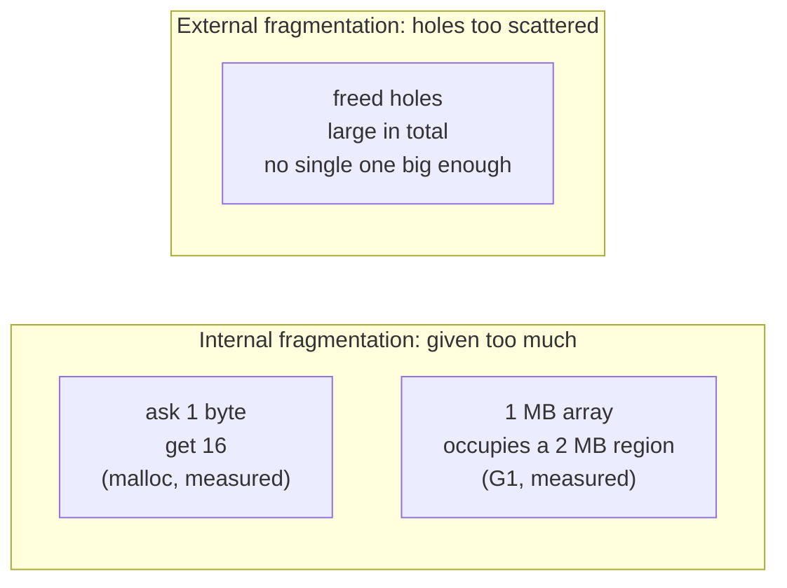

# Chapter 33 · Heap Memory

[简体中文](./33-heap-memory.md) ｜ **English**

---

> The stack's law is "function returns, frame dies" (Chapter 32) — yet real programs are full of data that must **outlive its creator**: returned strings, cached objects, data handed to another thread. There is only one place for them: the **heap**, the free market where lifetime is yours to decide.
>
> But freedom has a bill. Stack allocation is one `sub sp` instruction; heap allocation must **hunt for space** — measured on macOS, a `malloc/free` pair costs about **15.8 ns**, dozens of times the stack. And the allocator rounds up: measured, `malloc(1)` hands you 16 bytes and `malloc(100)` hands you 112 — the surplus is called **internal fragmentation**.
>
> One reversal deserves an early spoiler: **managed languages allocate faster than malloc** — Java measured **2.87 ns** per object (TLAB pointer bumping — essentially the heap edition of moving `sp`), and more striking still, non-escaping objects measured **0.24 ns**: the JIT's escape analysis eliminated the allocation altogether. The secret of cheapness is **cost transfer**: the GC compacts the heap so free space is always contiguous, which is what lets allocation be "bump a pointer" — the bill moved to the collection side (C# measured: ten million temporary objects rode on 38 GCs).
>
> As for the price of "forgetting to return what you rented," this chapter catches it red-handed with tools: macOS's `leaks` lists each of C++'s three deliberately leaked megabytes (`3 leaks for 3244032 total leaked bytes`); Java's static List accumulates 50 MB that `System.gc()` cannot touch — and it measured **100 MB**: a 1 MB array is a humongous object in G1, monopolizing an entire 2 MB region. **Modern GC heaps have internal fragmentation too**, echoing `malloc(1)` → 16 bytes across worlds.

## 1. Learning Objectives

By the end of this chapter, you will be able to:

- Explain **why the heap exists** (lifetimes beyond a function) and **why heap allocation is expensive** (space hunting, bookkeeping, thread synchronization);
- Describe malloc's internal organization — **size classes, free lists, arenas** — verified by measurement (granularity rounding, same-class adjacency);
- Explain why managed-heap allocation is cheap (**pointer bumping + GC compaction**) and narrate the "cost transfer" with three measured tiers (0.24 / 2.87 / 15.8 ns);
- Distinguish **internal from external fragmentation** with measured examples from three worlds: `malloc(1)`→16 bytes, G1 humongous 100 MB, SQLite pages that never shrink on DELETE;
- **Locate leaks** with each language's standard tools — `leaks`, `tracemalloc`, Runtime/heapUsed observation — and state what a leak really is in a GC language.

---

## 2. Why This Concept Exists

### Three kinds of data the stack cannot hold

```java
String buildReport() {
    String report = "...";     // if report lived only on the stack, it dies at return
    return report;             // then what does the caller receive?
}
```

| Need | Why the stack fails |
|------|---------------------|
| **Return values must outlive the call** | frame pops, data dies (Chapter 32's measured dangling pointer) |
| **Size known only at runtime** | frame sizes are fixed at compile time (measured `stack=2, locals=3`) |
| **Shared, with uncertain lifetime** | stacks are per-thread LIFO — shared data can belong to no frame |

### The heap's answer: a rental market

```text
Stack: dormitory assigned by the landlord — the function decides your stay; checkout is automatic
Heap:  the open rental market — any size, any duration
       cost ①: finding a room takes time (allocation is slow)
       cost ②: you must check out yourself (forget = leak; twice = crash)
       cost ③: churn shatters the market (fragmentation)
```

> **In one sentence**: the heap trades "expensive allocation + someone must reclaim" for the **free lifetime** the stack cannot give. This chapter covers both sides of the deal: how allocators drive down the cost of finding a room (size classes, pointer bumping), and the true price of not checking out (leaks) and of a shattered market (fragmentation).

---

## 3. How It Works

### Why heap allocation is inherently pricier than the stack

| Step | Stack | Heap (malloc route) |
|------|-------|---------------------|
| Find space | no search — the top is the space | **search** the free blocks for a fit |
| Bookkeep | nothing to record | record size and status (needed at free) |
| Thread safety | one stack per thread, no contention | the heap is shared — locks or arenas |
| Reclaim | bump `sp` back, whole frame at once | return block by block, **coalescing** with neighbors |

### malloc's three organizing tricks

**① Size classes: round up, bin by size** (measured):

```text
malloc(1)   actually yields 16 bytes
malloc(17)  actually yields 32 bytes
malloc(100) actually yields 112 bytes   <- rounded to the nearest tier; the surplus is internal fragmentation
```

**② Same class adjacent, different classes zoned apart** (measured):

```text
two malloc(32):   0x132605dc0 / 0x132605de0   32 bytes apart — shoulder to shoulder
two malloc(4096): 0x132809e00 / 0x13280ae00   4096 apart — a different district
```

Same-size blocks are carved from the same "grid field"; freed ones return to that class's **free list** for reuse — fast lookup, contained fragmentation (Chapter 31's SQLite freelist is the same idea).

**③ Arenas and large-block bypass**: threads get separate arenas to cut lock contention; huge blocks (MB-scale) skip everything and `mmap` pages straight from the OS, returned directly at free.

**The price of allocation** (measured, with an escape barrier so the compiler cannot delete the pairs):

```text
ten million malloc/free pairs of 32 bytes: 157.5 ms → ~15.8 ns per pair
```

### The managed-heap reversal: allocation beats malloc

Java / C# / V8 young-generation allocation is **pointer bumping**:

```text
malloc:       search the free list for a fit      →  ~16 ns (measured)
managed heap: alloc_ptr += size, done             →  ~3 ns (Java 2.87, C# 3.2, measured)
```

**What licenses such recklessness?** The GC **compacts** the heap — survivors are moved together, so free space is always one contiguous run, and "finding a spot" never involves finding. It is one of the prettiest cost transfers in the runtime world:

```text
malloc route: free leaves holes in place → allocation must steer around them → every allocation pays a search fee
GC route:     allocation sprints ahead → the collector periodically tidies the field → the bill is paid at collection time
```

**And the collection-side bill is real** (measured): C# allocating ten million temporaries quietly ran **38** gen-0 GCs; Java's ten million temporaries left the heap **-0.3 MB** — the GC collected them as fast as they were made.

### Faster than allocating: not allocating (measured)

```text
Java allocating ten million Students:
  non-escaping (use and discard):  0.24 ns each   <- escape analysis: object dissolved into registers; the heap never heard about it
  escaping (stored into an array): 2.87 ns each   <- the real TLAB pointer bump
```

Chapter 31's foreshadowing ("objects always heap — JIT escape analysis aside") pays off here: **an object that never leaves its method is never allocated at all**. That completes the story of cheap managed allocation — it is not just a fast allocator, but a compiler that skips allocation entirely.

### Fragmentation: two ways to shatter



- **Internal fragmentation** is the price of granularity — the same phenomenon measured in three worlds: `malloc(1)`→16 bytes, G1's 1 MB array monopolizing a 2 MB region (Java section below), SQLite deleting half its rows without freeing one page (SQL section below);
- **External fragmentation** is the price of freeing in place — managed heaps kill it by compacting; the malloc world can only coalesce neighbors; C#'s LOH, whose large objects never move, is the managed world's last stronghold of it.

---

## 4. JavaScript

V8's heap: cheap allocation, automatic collection — and "a reference still held" is still a leak.

### The price of allocation (measured)

```javascript
for (let i = 0; i < 10_000_000; i++) {
  const s = { name: "s", score: i };
  sum += s.score;
}
```

```text
total 6.2 ms — about 0.6 ns per object
```

Young-generation bump allocation plus engine optimizations for short-lived objects (V8 does escape analysis too) — the same order of magnitude as Java's measurement: **on a managed heap, allocation is not the worry; collection is**.

### The A/B experiment: same allocations, worlds apart (measured)

```text
A. ten million temporaries, no references kept: heap growth 0.0 MB    <- GC collects as you allocate
B. one million objects, all references kept:    heap growth 61.0 MB   <- references held, GC helpless
```

**This A/B pair is the entire doctrine of JS memory problems**: the GC never malfunctions; what malfunctions is "you thought it was garbage, but your reference says otherwise."

### The everyday shapes of a leak

```javascript
const cache = new Map();                 // a global Map that only grows
element.addEventListener("click", fn);   // removed the element, forgot removeEventListener
setInterval(poll, 1000);                 // component destroyed, forgot clearInterval
```

All variants of Experiment B. For "cache without pinning," use `WeakMap` / `WeakRef` — entries vanish when the key loses its other references.

> **Note**: the standard three steps for Node leaks — watch trends via `process.memoryUsage()` (measured in Ch. 31), take two heap snapshots via `--inspect`, diff for the retainer tree that only grows. In browsers, the same moves live in DevTools' Memory panel.

---

## 5. Python

CPython's allocator **reuses** obsessively where you can't see it — pools, interning, free lists: all ways to skip the trip to the heap.

### The small-integer pool: -5..256, one copy forever (measured)

```python
a, b = 256, 256
print(a is b)            # True — same object from the pool
e = 200 + 56
print(e is a)            # True — a computed 256 is still that object
f_ = int("257")
print(f_ is c)           # False — outside the pool, everyone is their own
```

Hot small integers are premade and never collected — saving oceans of allocations and refcount traffic (Chapter 31 measured every `int` at 24+ bytes).

### String interning: same content, one copy (measured)

```text
two "student_name" in one file:        True (compile-time constant folding)
two runtime-built 'student name!':     False  <- separate heap objects
after sys.intern:                      True   <- manual interning, one copy process-wide
```

Note the first True is **not interning** — the compiler merged identical literals within one code block. True runtime sharing needs `sys.intern` (a memory saver for masses of duplicate string keys).

### Free lists: a dead object's slot is reused instantly (measured)

```python
x = [1, 2, 3]; addr = id(x); del x
y = [4, 5, 6]
print(id(y) == addr)     # True — pymalloc kept the slot warm
```

pymalloc runs tiered pools for objects ≤512 bytes (isomorphic to malloc's size classes), and hot types (list, dict, frame) keep private free lists — **allocation is often just picking up what was thrown away**.

### `tracemalloc`: which line spent the memory (measured)

```text
main.py:35: size=10171 KiB, count=10001, average=1041 B   <- big spenders, named by line
main.py:36: size=639 KiB, count=10001, average=65 B
```

> **Note**: `tracemalloc` is the standard tool for Python memory work (stdlib, controlled overhead); diff two `take_snapshot()` calls to find what only grows. Don't paper over problems with `gc.collect()` — objects with live references are beyond any collector (Experiment B's logic again).

---

## 6. Java

The JVM perfected "fast allocation," reduced leaks to a pure question of references — and threw in a measured bonus about modern fragmentation.

### Two speeds of allocation (measured)

```text
non-escaping:  0.24 ns each   <- escape analysis eliminated the allocation!
escaping:      2.87 ns each   <- the real TLAB pointer bump
```

**TLAB** (Thread-Local Allocation Buffer): each thread pre-leases a private slice of the heap, so in-thread allocation is a lock-free pointer bump — no contention even under heavy threading (Chapter 31's table, foreshadowed).

### The bill is at the collection end (measured)

```text
ten million temporaries later, heap change: -0.3 MB — the GC took them
```

### The shape of a leak: references held, GC helpless (measured)

```java
static final List<byte[]> LEAK = new ArrayList<>();
for (int i = 0; i < 50; i++) LEAK.add(new byte[1024 * 1024]);   // a "cache" never cleaned
```

```text
after the static List hoards 50 MB, System.gc() recovers nothing: heap grew 100.0 MB
```

Java's leak trio: **static collections that only grow, listeners never unregistered, ThreadLocals never removed** — all sharing one trait: still reachable from a GC root.

### The bonus: 100 MB, not 50 — modern internal fragmentation (measured)

```text
default region (2 MB):             50 one-MB arrays → heap grew 100.0 MB
with -XX:G1HeapRegionSize=4m:      the same code    → heap grew 50.0 MB
```

**G1 slices the heap into equal regions (2 MB on this machine)**; any object larger than half a region is humongous and **monopolizes whole regions** — a 1 MB array just crosses the line, occupies 2 MB, and wastes 50%. This is `malloc(1)` → 16 bytes playing out in another world: **allocation granularity dictates internal fragmentation**.

> **Note**: in production, "batches of ~1 MB buffers" are a classic G1 minefield (humongous allocation also triggers extra GCs) — resize regions or pool the buffers. The standard leak path in Java: heap dump (`jmap` / auto-dump on OOM) → MAT/JProfiler dominator tree → find the biggest retained root.

---

## 7. C++

The C++ heap is a **fully manual market**: every entry in `malloc`/`new`'s ledger is visible — and every debt is yours.

### The allocator's ledger (measured)

```text
malloc(1) → 16 bytes      malloc(17) → 32      malloc(100) → 112
two malloc(32) shoulder to shoulder (32 bytes apart); malloc(4096) in another district
one malloc/free pair ≈ 15.8 ns (ten million measured)
```

### How `new` relates to `malloc`

```cpp
Student* s = new Student("Alice", 90);
// new does two things: ① operator new (malloc-class allocation underneath) gets memory
//                      ② the constructor runs on that memory (Chapter 23)
delete s;
// delete in reverse:   ① destructor runs  ② operator delete returns the memory
```

### Three accidents, one root: returning the room is on you

| Accident | Code | Consequence |
|----------|------|-------------|
| Leak | `new` without `delete` | memory only grows (tool measurement below) |
| Double free | `delete` twice | allocator ledger corrupted — crash or worse |
| Use after free | using the pointer after `delete` | that memory may be rented to someone else — silent corruption |

### Caught red-handed: the `leaks` tool (shell measurement)

```cpp
for (int i = 0; i < 3; ++i) {
    char* buf = (char*)malloc(1024 * 1024);   // leak 1 MB per lap
    memset(buf, i, 1024 * 1024);
}
```

```text
$ leaks --atExit -- ./leaky
Process 93109: 3 leaks for 3244032 total leaked bytes.
  1 (1.03M) ROOT LEAK: <malloc in main 0x120008000> [1081344]
  1 (1.03M) ROOT LEAK: <malloc in main 0x130008000> [1081344]
  1 (1.03M) ROOT LEAK: <malloc in main 0x130110000> [1081344]
```

`leaks` (built into macOS) scans at exit for **blocks still alive on the heap with no pointer anywhere referencing them**, and names each one. On Linux the counterparts are Valgrind and ASan (`-fsanitize=address`) — the latter also catches double frees and use-after-free on the spot.

> **Note**: modern C++'s answer is **never write bare `new`/`delete`** — containers (`vector`/`string`) manage their own memory; the rest goes to RAII (Chapter 37) and smart pointers (Chapter 38). This chapter priced out "manual" in full precisely so those two chapters' automation makes sense.

---

## 8. C#

The CLR heap is a tale of two cities: the small object heap (SOH) allocates at speed and tidies diligently; the large object heap (LOH) is fragmentation's last stronghold.

### LOH: 85 KB is a national border (measured)

```csharp
GC.GetGeneration(new byte[84_000]);   // 0 — ordinary SOH, born in gen 0
GC.GetGeneration(new byte[86_000]);   // 2 — straight into the LOH, treated as gen 2
```

**Why the split?** Compaction moves objects, and moving big ones is expensive — so the LOH by default **never compacts**: it allocates from a free list like malloc, and like malloc **it fragments** (.NET allows a manual LOH compaction, but that is a major operation).

### Allocation and its bill (measured)

```text
ten million objects allocated: 31.6 ms (~3.2 ns each)        <- SOH pointer bumping
ten million more temporaries: gen-0 GC ran 38 times           <- the bill, itemized
```

`GC.CollectionCount(n)` is a free observation post — behind the allocation spree, the collector keeps paying (each gen-0 collection pauses threads; Chapter 36 expands).

### C#'s own relief valves

```csharp
Span<int> buf = stackalloc int[256];          // small buffers onto the stack (measured, Ch. 31)
var pool = ArrayPool<byte>.Shared;            // rent large buffers from a pool
byte[] rented = pool.Rent(100_000);           // an LOH-class regular
try { /* use */ } finally { pool.Return(rented); }
```

`ArrayPool` is the standard cure for LOH fragmentation — **reuse large buffers instead of re-allocating** — the same prescription as the previous section's humongous advice (pooling).

> **Note**: `IDisposable`/`using` manage **unmanaged resources** (file handles, connections), not memory — forget `Dispose` and you leak handles; forget to drop references and *that* is the memory leak. Conflating the two is a classic C# interview trap.

---

## 9. SQL

A database's "heap" is its collection of pages (Chapter 31); this chapter watches its **fragmentation and defragmentation** — one complete measured cycle.

### Four steps: how fragmentation arises and is cured

```sql
-- ten thousand rows, baseline
step 1  page_count = 56, freelist = 0

-- delete every odd row: every page still holds live data
DELETE FROM student WHERE id % 2 = 1;
step 2  page_count = 56, freelist = 0     <- not one page freed!

-- delete the rest: whole pages empty out
DELETE FROM student;
step 3  page_count = 56, freelist = 54    <- empty pages join the freelist (reusable, not returned)

-- VACUUM: rebuild the database, squeeze out the holes
VACUUM;
step 4  page_count = 2, freelist = 0      <- the file truly shrank
```

### Three stages, three concepts

| Stage | Phenomenon | This chapter's concept |
|-------|-----------|------------------------|
| Half the rows deleted, page count unmoved | every page keeps live data; none reclaimable whole | **in-page fragmentation** (the database's internal fragmentation) |
| After deleting all, freelist=54 | empty pages held for reuse; the file stays large | **the free list** (malloc's free, verbatim) |
| VACUUM shrinks to 2 pages | rebuild and repack | **compaction** (the GC's moving collection, verbatim) |

**One table spanning three worlds**: SQLite's freelist ↔ malloc's free list ↔ the in-place holes G1 refuses to leave; `VACUUM` ↔ GC compaction ↔ the luxury malloc can never afford (pointers can't be rewritten, blocks can't move — precisely Chapter 34's opening theme).

> **Engineering note**: production `VACUUM` (PostgreSQL's `VACUUM FULL`, MySQL's `OPTIMIZE TABLE`) locks/rewrites — schedule windows; SQLite offers `auto_vacuum` for incremental return. When to bother: `freelist_count` runs high, or the file refuses to shrink after mass deletion.

---

## 10. Cross-Language Comparison

### ① Heap allocation mechanics

| Feature | JavaScript | Python | Java | C++ | C# |
|---------|-----------|--------|------|-----|-----|
| Allocation | young-gen bump | pymalloc pools + free lists | **TLAB pointer bump** | **malloc free lists** | SOH bump / LOH free list |
| Measured speed | ~0.6 ns/obj | — (mostly reuse; slot reuse measured) | **2.87 ns** (escaping) / 0.24 ns (eliminated) | **15.8 ns**/pair | 3.2 ns/obj |
| Who reclaims | GC | refcount + GC | GC | **you** | GC |
| Fragmentation cure | moving compaction | pooling mitigates | compaction (humongous excepted, measured) | coalesce free blocks (no moving) | SOH compacts / LOH doesn't |
| Leak form | references held (measured: B group 61 MB) | references held + C-extension leaks | references held (measured 100 MB) | **true leaks** (measured: leaks tool) | references held + undisposed handles |
| Locating tool | heap snapshots / `memoryUsage` | **`tracemalloc`** (measured) | heap dump + MAT | **`leaks` / ASan** (measured) | dotnet-gcdump |

### ② The key measurement: three allocation tiers and the cost transfer

```text
stack:            ~0 ns      one sub sp (Ch. 32) — reclamation free too (frame pop)
managed heap:     ~3 ns      pointer bump (Java 2.87 / C# 3.2 measured) — cost transferred to GC (38 runs per 10M objects, measured)
malloc heap:      ~16 ns     free-list search (measured) — cost paid on the spot, and free is your job
eliminated:       0.24 ns    escape analysis (measured) — the fastest allocation is none
```

**This table is the chapter's hub**: allocation-speed differences are not about who writes better code but about **where the cost settles** — malloc pays cash per transaction; the managed heap runs a credit card that the GC pays down periodically; escape analysis gets the fee waived.

### ③ Two design divides

**Divide one: who manages space after free**

```text
Holes in place (malloc / SQLite freelist / LOH):  free is fast, holes shatter — the allocation side pays search fees
Move and compact (GC compaction / VACUUM):        free space always contiguous — allocation bumps a pointer, collection pays the movers
```

Moving requires **the right to rewrite pointers** — a GC runtime knows where every reference lives and can update them all; C++'s raw pointers are scattered and unregistered, so no block can ever move (Chapter 34's core foreshadowing).

**Divide two: do large objects deserve an exception**

```text
Specialized (C# LOH's measured 85 KB line / G1 humongous at half a region, measured / malloc's mmap bypass)
— three worlds independently agree: big objects are too dear to move, too coarse to pool — each opens a separate account
— and pay the same price: the large-object zone is fragmentation's favorite haunt (LOH never compacts; humongous measured 50% waste)
```

### ④ Common ground and root causes

**Common ground**: every allocator bins by size (size classes / pools / regions); freed space is everywhere reused rather than returned to the OS (measured: pymalloc slot reuse, SQLite freelist, malloc likewise); large objects are special citizens in every world.

**Root causes**:

- **C++ forbids the runtime to touch user pointers** — so no moving, no compaction; holes-in-place is the only choice, and the allocation side pays in full;
- **Managed languages hold every reference** — daring to move objects is what keeps free space contiguous and allocation a pointer bump;
- **Python's refcounting kills objects young** — pools and free lists recycle at a ferocious rate; allocation often degenerates into "picking up what was just discarded";
- **The database transplants the same problems to disk scale** — pages are its size class, the freelist its free list, VACUUM its compacting GC.

---

## 11. Implementation Comparison

| Runtime | Allocator | Key details |
|---------|-----------|-------------|
| **V8 (JavaScript)** | young-gen semi-space bump + old-gen free lists | Scavenger evacuates survivors in bulk (die-young hypothesis); large objects go straight to large object space |
| **CPython** | pymalloc: ≤512 B through arena→pool→block tiers | private free lists for hot types (slot reuse measured); the small-int pool and interning (measured) intercept requests before allocation |
| **JVM (Java)** | TLAB pointer bump (measured 2.87 ns) + G1 regionized heap | escape analysis can erase allocation (measured 0.24 ns); humongous objects monopolize regions (measured 1 MB→2 MB) |
| **C++ (native)** | libmalloc: size-class bins (measured 16/32/112) + free lists + mmap for big blocks | measured 15.8 ns/pair; free feeds the free list, not the OS (Ch. 31's rule); allocated blocks can never move |
| **CLR (C#)** | SOH, three generations, pointer bump (measured 3.2 ns); LOH free list | LOH threshold 85 KB (measured 84/86 split); LOH never compacts by default — malloc's enclave in a managed world |

**A distinction worth memorizing**:

```text
Heaps that can move objects (V8 / JVM / CLR-SOH):     allocation = pointer bump; fragmentation compacted away
Heaps that cannot (malloc / LOH / SQLite pages):       allocation = free-list search; fragmentation only mitigated
Whether you can move depends on whether the runtime holds every pointer — Chapter 34 begins there
```

---

## 12. Performance Analysis

### The full allocation-cost picture (this chapter's measurements)

| Method | Measured cost | Note |
|--------|--------------|------|
| escape-analysis elimination | 0.24 ns/obj | the fastest allocation is none |
| managed pointer bump | 2.87–3.2 ns/obj | Java TLAB / C# SOH |
| malloc/free | 15.8 ns/pair | free-list search + bookkeeping |
| the hidden bill | 38 gen-0 GCs / 10M objects | the managed heap's cost sits at collection |

### But the real expense is usually not the allocation itself

```text
① GC pressure: allocation rate sets GC frequency — a service that news a pile of temporaries per request spends a tenth of its CPU on GC
② cache locality: heap objects scatter (Ch. 31 measured class[] at 7× memory) — traversal pays cache miss after cache miss
③ the fragmentation tax: LOH/humongous waste (measured 50%) shows up in no profiler's "time" column — only on the bill
```

### Standard relief, ranked by value

```text
1. Reuse: object pools / ArrayPool / buffer recycling — large objects above all (LOH + humongous, both measured minefields)
2. Stack it: small short-lived data via struct / stackalloc / value semantics (Ch. 31's 7× density)
3. Batch: one new int[1M] beats a million new Integer (measured twice, Ch. 29/31)
4. Trust the compiler: write non-escaping code (local, use-and-discard) and escape analysis waives the fee (measured 0.24 ns)
```

> ⚠️ The usual reminder: allocation tuning matters only on hot paths. In code running dozens of times a second, one malloc's 16 ns isn't even noise — first confirm with this chapter's instruments (`GC.CollectionCount`, `tracemalloc`, heap snapshots) that allocation is truly the bottleneck.

---

## 13. Engineering Practice

| Scenario | ✅ Recommended | ❌ Avoid | Why |
|----------|--------------|---------|-----|
| Everyday C++ memory | containers + RAII + smart pointers | bare `new`/`delete` | blocks all three accidents |
| Long-lived caches | bounded + eviction (LRU) | ever-growing Map/List | measured: a static collection *is* a leak (100 MB) |
| Large buffers (≥85 KB / ~1 MB) | pooling (ArrayPool etc.) | fresh allocation each time | LOH fragmentation + humongous waste (both measured) |
| Masses of duplicate Python string keys | `sys.intern` | tolerating duplicates | interning measured: one copy process-wide |
| Event/callback registration | write the unregister in pairs | register-only | listeners are a top-three leak source |
| "Memory only grows" hunts | snapshot diffs (tracemalloc / heap dump) | blind `gc()` calls / more RAM | references held, GC helpless (measured in two languages) |
| C++ before shipping | run tests under ASan/leaks | eyeball review | measured: leaks names every block, zero escapes |
| High-allocation services | watch GC frequency, cut allocation | GC parameter tuning alone | 38 runs per 10M objects — the source is the allocation side |

### The rule of thumb

```text
dies within the function          → stack (the compiler may even waive the fee)
lives long, modest volume         → heap, plain new — don't pre-optimize
large / frequent / hot            → pool, reuse, batch — all three allocator minefields live here
```

---

## 14. Best Practices

- **Go to the heap only to outlive the function** — Chapter 31's rule holds at the allocation site; leave small short-lived data to the stack and escape analysis.
- **Caches must have bounds**: cap, TTL, or LRU — an unbounded cache is a leak plus time (measured: 100 MB unrecoverable).
- **Pool all large buffers**: allocations near the 85 KB (LOH) and half-region (humongous) lines hurt most (both measured).
- **Think in pairs**: `new`/`delete`, register/unregister, `Rent`/`Return`, `start`/`stop` — a leak is the first half done without the second.
- **Tools before theories**: `leaks`/ASan (C++), `tracemalloc` (Python), heap snapshots (JS/Java/C#) — every one measured in this chapter; don't guess.
- **See the cost transfer**: cheap managed allocation has a GC invoice (measured: 38 runs) — cutting the allocation rate is the only move that saves both ends.
- **`Dispose`/`close` are not memory management**: they govern handles, not the heap — two different leaks, two different hunts.
- **Watch the database freelist**: when `freelist_count` climbs, schedule `VACUUM`/`OPTIMIZE` (measured: 56 pages back down to 2).

---

## 15. Common Pitfalls

**Pitfall 1 · C++ forgetting free/delete (measured, red-handed)**

```text
$ leaks --atExit -- ./leaky
Process 93109: 3 leaks for 3244032 total leaked bytes.
```

**Avoid it**: no bare `new` in modern C++; run CI tests under ASan — tools catch leaks deterministically, eyes don't.

**Pitfall 2 · Believing GC languages can't leak (refuted twice, measured)**

```text
Java static List: 100 MB, System.gc() helpless
JS kept references: 61 MB, GC helpless
```

**Avoid it**: GC reclaims only the *unreachable* — a zombie cache reachable from a root is the one and only form of a GC-language leak.

**Pitfall 3 · Casually allocating large objects (price measured twice)**

```text
C# 86 KB arrays go straight to the LOH (never compacted, fragments)
Java 1 MB arrays monopolize 2 MB regions (50% waste)
```

**Avoid it**: pool buffers near those two lines (ArrayPool / homemade) — or allocate once and reuse forever.

**Pitfall 4 · malloc/new in a tight loop**

```text
15.8 ns per malloc/free pair (measured) — ten million laps is 157 ms of pure overhead, plus the hidden GC/fragmentation bill
```

**Avoid it**: allocate outside the loop, reuse inside; `reserve` container capacity up front (Chapter 17's resizing lesson).

**Pitfall 5 · Python using `is` for `==`**

```python
a = 256; b = 256; a is b   # True — a small-int-pool coincidence
c = 257; d = int("257"); c is d   # False! (measured)
```

**Avoid it**: pools and interning are **optimizations**, not semantics — compare values with `==`; reserve `is` for singletons like `None`. This chapter's measurements are exactly why `is` "sometimes works."

**Pitfall 6 · Rows deleted, disk unchanged**

```text
Measured: delete half the rows — page_count doesn't move (in-page fragmentation); delete all — pages only reach the freelist (not the OS)
```

**Avoid it**: know the three levels — row deletes leave in-page holes, empty pages join the freelist, only `VACUUM` shrinks the file; plan capacity by high-water mark.

**Pitfall 7 · Double free and use-after-free (C++)**

```cpp
delete p;
delete p;      // allocator ledger corrupted — crash now, or a mine for ten minutes later
use(*p);       // that memory may already be rented out — silent corruption
```

**Avoid it**: nulling after `delete` is a painkiller; the cure is unique ownership — `unique_ptr` makes "who deletes" a fact of the type system (Chapter 38).

---

## 16. Interview Questions

**Basic**

1. Why does the heap exist? Which three kinds of data can't the stack hold?
2. How do `new` and `malloc` relate? `delete` and `free`?
3. Internal vs external fragmentation — define both, with one measured example each from this chapter.

**Intermediate**

4. **Why is malloc slower than stack allocation? What problems do size classes and free lists each solve?**
5. Why is managed-heap allocation faster than malloc? Where did the "cost transfer" move the cost?
6. **What form does a "memory leak" take in a GC language, and why can't `System.gc()` help?**

**Advanced**

7. **Why can a GC heap compact while a malloc heap can never move a block? What do pointers have to do with it?**
8. C#'s LOH and G1's humongous regions are two answers to one problem — what is the problem, and what price does each answer pay?
9. How does escape analysis achieve 0.24 ns "allocation"? What kind of code qualifies?

---

## 17. Exercises

**Basic**

1. Use `malloc_size` (or Linux's `malloc_usable_size`) to map your platform's granularity table from 1 to 1024 bytes — find every tier.
2. Reproduce the A/B leak experiment in Java/C#/JS: identical allocations, references kept vs not, heap observed.
3. Use `tracemalloc` to find the three biggest allocating lines in a Python program of yours.

**Intermediate**

4. **Reproduce the three-tier speed measurement**: malloc/free, managed allocation, escape-analysis elimination — remember escape barriers / making objects escape, so the compiler can't fool you.
5. Reproduce the G1 humongous measurement: heap usage of 50 one-MB arrays, default vs `-XX:G1HeapRegionSize=4m`.
6. Write a deliberately leaking C++ program; catch every block with `leaks` (macOS) or ASan (`-fsanitize=address`).

**Challenge**

7. Build a toy fixed-size allocator: malloc one big slab, carve/recycle 32-byte blocks through your own free list, and race it against plain malloc.
8. In C#, rewrite a hot path that allocates 100 KB buffers to use `ArrayPool`; compare `GC.CollectionCount` before and after.
9. Reproduce the four-step SQLite fragmentation cycle, then repeat with `auto_vacuum=INCREMENTAL` and explain how freelist behavior changes.

---

## 18. Chapter Summary

**One sentence**: the heap trades "pricier allocation and owned reclamation" for free lifetimes — the malloc route bins by size class and searches free lists (measured 15.8 ns/pair, `malloc(1)` yields 16 bytes), while the managed route lets GC compaction reduce allocation to a pointer bump (measured 2.87 ns, 0.24 ns under escape analysis), **transferring the cost from the allocation side to the collection side** (measured: 38 GCs per ten million objects); and the two failure modes each carry measured proof — `leaks` naming 3 MB block by block, a static List's 100 MB beyond `System.gc()`'s reach (with a 50% humongous surcharge), SQLite pages unmoved by DELETE until `VACUUM` — leaks and fragmentation, the two taxes of the free market.

**Key takeaways**

- **Why the heap**: outliving functions, runtime-sized data, cross-party sharing — the stack's three impossibilities.
- **malloc's toolkit** (measured): size-class rounding (1→16, 100→112), same-class adjacency, free-list reuse — 15.8 ns/pair.
- **The managed reversal** (measured): pointer bump 2.87 ns, escape analysis 0.24 ns — cheap because GC compaction keeps free space contiguous.
- **Cost transfer** (measured): ten million temporaries = 38 gen-0 GCs; heap change -0.3 MB — the bill sits with the collector.
- **Two worlds of leaks** (measured): C++ true leaks (3 blocks named); GC languages' held references (Java 100 MB / JS 61 MB).
- **Three worlds of fragmentation** (measured): `malloc(1)`→16 B, G1 humongous 1 MB→2 MB, SQLite pages unmoved — internal fragmentation is one phenomenon; the LOH is external fragmentation's stronghold.
- **Movable vs immovable**: GC holds every reference, so it can compact; malloc's pointers are scattered and unregistered — Chapter 34's doorway.

**Checklist**

- [ ] I can name the three steps that make heap allocation pricier than the stack.
- [ ] I can explain the mechanism and the price of cheap managed allocation.
- [ ] I can distinguish the two fragmentations with one measured example each.
- [ ] I know the single form of a GC-language leak and each language's locating tool.
- [ ] I know how all three runtimes special-case large objects, and where the minefields are.

**Next chapter**: one character haunted this whole chapter incognito — the **pointer**. malloc returns one; dangling and double-free wound one; GC can compact precisely because it holds them all; and malloc's heap can never move because it doesn't. Chapter 34 faces C/C++'s core concept head-on: the full power of address arithmetic (`*`, `&`, pointer math, function pointers), the pointer's entanglement with arrays, an anatomy of the three great accidents (null, wild, dangling) — and why the other four languages collectively chose to **hide pointers**, and what backdoors each left behind.

---

## 19. Further Reading

- <a href="https://en.wikipedia.org/wiki/C_dynamic_memory_allocation" target="_blank" rel="noopener">Wikipedia: C dynamic memory allocation</a> — malloc/free, standard description and implementation survey.
- <a href="https://en.wikipedia.org/wiki/Fragmentation_(computing)" target="_blank" rel="noopener">Wikipedia: Fragmentation</a> — internal/external fragmentation defined.
- <a href="https://sourceware.org/glibc/wiki/MallocInternals" target="_blank" rel="noopener">glibc Wiki · Malloc Internals</a> — the authoritative tour of glibc's allocator (arenas/bins/chunks).
- <a href="https://docs.oracle.com/en/java/javase/17/gctuning/" target="_blank" rel="noopener">Oracle · HotSpot GC Tuning Guide</a> — TLABs, G1 regions, and humongous objects, officially.
- <a href="https://learn.microsoft.com/en-us/dotnet/standard/garbage-collection/large-object-heap" target="_blank" rel="noopener">Microsoft Learn · The large object heap</a> — the LOH threshold, no-compaction policy, and tuning.
- <a href="https://learn.microsoft.com/en-us/dotnet/api/system.buffers.arraypool-1" target="_blank" rel="noopener">Microsoft Learn · ArrayPool&lt;T&gt;</a> — the standard API for pooling large buffers.
- <a href="https://docs.python.org/3/library/tracemalloc.html" target="_blank" rel="noopener">Python Docs · tracemalloc</a> — the stdlib tool for tracing allocations by line.
- <a href="https://v8.dev/blog/trash-talk" target="_blank" rel="noopener">V8 Blog · Trash talk</a> — V8's heap structure and collectors (Scavenger/Orinoco), officially.
- <a href="https://www.sqlite.org/lang_vacuum.html" target="_blank" rel="noopener">SQLite Docs · VACUUM</a> — database rebuild and space reclamation, officially.
