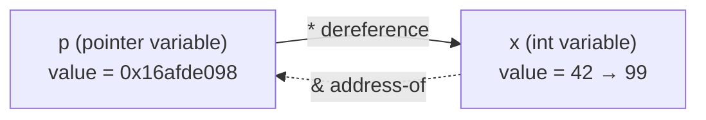

# Chapter 34 · Pointers

[简体中文](./34-pointers.md) ｜ **English**

---

> One character stayed invisible through the last three chapters: `malloc` returns one, dangling and double-free wound one, and the GC can compact the heap only because it "tracks every one of them." This chapter brings it on stage — **the pointer: a variable that stores an address**.
>
> Its entire secret fits in one formula: **pointer = address + type**. The address says *where*; the type says *how to read and how far to step* — measured: `int*` advances 4 bytes per `+1`, `double*` 8, `char*` 1; even `arr[i]` is mere sugar for `*(arr + i)` (measured: `2[ints]` is perfectly legal). With it you can walk through walls (`*(&x) = 99`) and pass functions as data (`qsort` + function pointer, measured) — and you can also manufacture the three great accidents: null, wild, and dangling pointers.
>
> So the other four languages all made the same decision — **hide the pointer** — but the backdoors they kept differ wildly, forming a spectrum: Java kept only "references with the address redacted" (`identityHashCode` is a shadow, not an address); JS granted one sandboxed block of self-managed bytes (`ArrayBuffer`, where the offset is your pointer and out-of-bounds reads return `undefined` instead of someone else's memory); Python left a side door (`ctypes` treats `id()` as a real address — measured reading an object's refcount straight out of memory); C# simply kept the whole C++ syntax (`unsafe` makes `*(&x) = 99` work verbatim, measured with the same 4-byte stride).
>
> And C#'s `fixed` keyword leaks the deep reason for the hiding: **a GC that moves objects cannot let raw addresses escape** (the closure of Chapter 33's "movable vs immovable"). Even SQL has a seat in this chapter: a foreign key is a cross-table pointer, and the database bans dangling at the system level — measured: deleting a referenced row simply fails, or `ON DELETE CASCADE` collects the references along with it.

## 1. Learning Objectives

By the end of this chapter, you will be able to:

- Explain all pointer behavior from the "**address + type**" model: dereferencing, stride (measured 4/8/1 bytes), and what casting really means;
- State the **array–pointer kinship**: `arr[i] ≡ *(arr+i)`, decay on parameter passing (measured `sizeof` dropping from 12 to 8);
- Dissect the **three great accidents** (null / wild / dangling) — their causes and each language's countermeasures;
- Draw the **hiding spectrum**: Java pure references → JS sandboxed memory → Python's ctypes side door → C# unsafe wide open, with the trade-off at each notch;
- Answer this Part's closing question: **why GC languages must hide pointers** (objects move; addresses must not leak — `fixed` being the sole temporary exemption).

---

## 2. Why This Concept Exists

### What a world without pointers lacks

What did Chapter 33's `malloc` return? The **location** of a block of heap memory. How does a function modify its caller's variable? It must know **where** it lives. How does a linked-list node find the next node? By remembering its **address**.

```text
Three needs, one answer: programs need "where" to be a value — storable, passable, computable
```

### The definition: a variable that stores an address

```cpp
int x = 42;        // x is an int, living somewhere on the stack
int* p = &x;       // p is also a variable — but its value is x's address
*p = 99;           // follow the address to x, rewrite it
```



> **In one sentence**: pointers make "location" a first-class citizen — storable, passable, computable. Indirection is its power (functions mutating outer variables, dynamic data structures, the machinery under polymorphic dispatch), and "an address you can compute is an address you can compute wrongly" is its original sin — the three accidents and four languages' seals all descend from it.

---

## 3. How It Works

### The formula: pointer = address + type

An address is just a number (Chapter 31 printed plenty); **the type is what gives a pointer behavior**:

| What the type decides | Example |
|----------------------|---------|
| **How many bytes a dereference reads, and how to interpret them** | `*(int*)addr` reads 4 bytes as two's complement; `*(double*)addr` reads 8 as IEEE 754 (Chapter 7) |
| **Arithmetic stride** | `p + 1` = address + `sizeof(pointee)` |
| **Which operations are legal** | function pointers can be called; `void*` can do nothing (store and cast only) |

### Measurement one: stride follows the type

```text
int*    +1: 0x16afde098 -> 0x16afde09c   stride 4 bytes
double* +1: 0x16afde080 -> 0x16afde088   stride 8 bytes
char*   +1: 0x16afde058 -> 0x16afde059   stride 1 byte
```

**`p + 1` never means "plus one byte" — it means "plus one width of the pointee type"** — which is array traversal's foundation: next slot = current address + element width (the final explanation of Chapter 16's O(1) random access).

### Measurement two: the array–pointer kinship

```text
ints[2] = 30, *(ints + 2) = 30, 2[ints] = 30   <- three spellings, one deed
sizeof(ints) inside main = 12 bytes (a true array)
inside the function      = 8 bytes   <- decayed into a pointer!
```

`arr[i]` is sugar for `*(arr + i)` — hence the absurd-but-legal `2[ints]` (i.e. `*(2 + ints)`). Passed as a parameter, an array **decays** to a pointer to its first element (12 bytes → 8) — the root of C/C++'s "arrays lose their length," and the reason `std::array`/`std::span` exist.

### Measurement three: function pointers — code has addresses too

```text
qsort + function pointer: 4 9 15 26 31
compare_int's address: 0x104e204e8 (in the code area — Chapter 31's address layering resurfaces)
```

A function's machine code lives in memory (the code area), so it has an address and can be pointed at — `qsort` calls back through the comparison function's address you hand it. **This is the physical prototype of callbacks**: Chapter 14's higher-order functions, Chapter 27's vtables (an array of function pointers), event systems — all of it, underneath.

### The three great accidents, dissected

| Accident | Cause | Danger |
|----------|-------|--------|
| **Null pointer** | points at address 0; dereference trips protection | ★ the luckiest — instant segfault, clean crime scene |
| **Wild pointer** | declared uninitialized, points somewhere random | ★★ garbage reads or random crashes |
| **Dangling pointer** | pointee freed / frame popped | ★★★ the most insidious — "still works for now" (measured, Ch. 32/33) |

One shared root: **a pointer's value and its pointee's lifetime are two separate ledgers** — the pointer has no idea whether its target still exists. The fixes fork from here: Java abolishes the first two outright (references must be initialized; no arithmetic) and tames the third-remaining one into NPE; Rust aligns the two ledgers at compile time with its borrow checker (Chapter 38 will mention it); C++'s answer is smart pointers (Chapter 38).

### Closing Chapter 33: GC and raw pointers cannot coexist

```text
GC wants to compact → objects move → every reference to them must be rewritten in sync
→ the runtime must know where every reference lives
→ once a raw address leaks into user code (stored in an int, written to a file), the runtime loses track
→ therefore: managed languages must hide pointers
```

C#'s `fixed` is this iron law's "temporary exemption clause": pin the object, GC defers moving it, the pointer is briefly legal — **the exception that proves the rule**.

---

## 4. JavaScript

JS stands at the spectrum's strictest end: **not even a shadow of an address** — but it grants one sandboxed block of self-managed bytes.

### Object variables are references (measured)

```javascript
const a = { name: "Ming" };
const b = a;                 // copies the reference, not the object
b.name = "Hong";             // a.name changed too — same object
a === b   // true (same reference)
a === c   // false — identical contents, still unequal: === compares "addresses"
```

**`===` on objects is reference comparison** — you can't see the address, yet every object comparison uses it.

### `ArrayBuffer`: the offset is your pointer (measured)

```javascript
const buf = new ArrayBuffer(16);        // 16 raw bytes, untyped
const view = new DataView(buf);
view.setInt32(0, 42, true);             // "pointer" offset=0, write as int32
view.setFloat64(8, 3.14, true);         // "pointer" offset=8, write as double
```

```text
offset 0 read as int32:   42
offset 8 read as float64: 3.14
```

Compute the offset yourself, choose the type yourself — **doing the "address + type" job by hand**. File parsing, WebGL, and WASM memory all run on this.

### TypedArray: many views over one memory (measured)

```text
Int32Array view of buf: nums[0] = 42        <- shares the same memory as the DataView
set nums[0] = 100, DataView reads: 100      <- proof of shared bytes
```

### The sandbox's edge (measured)

```text
nums[999] = undefined   <- out-of-bounds read returns undefined, not someone's memory
```

**C++'s out-of-bounds is undefined behavior; here it's an intercepted `undefined`** — capability traded for safety, the design rule of JS's backdoor (WASM linear memory likewise: compute freely inside, never escape the sandbox).

> **Note**: data inside an `ArrayBuffer` has no object identity — it stores bytes, not references; putting an object "into" a buffer requires serialization. `SharedArrayBuffer` + `Atomics` is its multithreaded sibling (Chapter 45) — and manual memory's concurrency problems will return with it.

---

## 5. Python

Python claims "no pointers," yet reference fingerprints are everywhere — and it left a `ctypes` side door where `id()` works as a real address.

### Variables are references; `is` compares addresses (measured)

```python
a = [1, 2, 3]
b = a                    # no copy — two names, one object
b.append(4)              # a becomes [1, 2, 3, 4] too
a is b                   # True — is compares id(), i.e. the address (measured, Ch. 31)
```

### The side door, measured: reading memory straight from `id()`

```python
import ctypes
x = 3141592653589
refcount = ctypes.c_ssize_t.from_address(id(x))   # object header field #1: the refcount
```

```text
read directly from address id(x): refcount = 3
after y = x, read again:          refcount = 4    <- one more reference, ledger updates live
cross-check sys.getrefcount(x) = 5 (it counts itself as one)
```

**`id()` in CPython is the object's heap address** (Chapter 31's foreshadowing), and `ctypes` lets you read process memory at that address — Chapter 24's object header and Chapter 36's refcounting, read *out of the address itself*. This door exists for C extensions and FFI; it also proves CPython objects **never move** (refcounting GC doesn't compact) — which is why `id()` dares to be stable.

### No pointer arithmetic (measured)

```text
reference + 1 -> TypeError
```

Addresses can't be computed on — which is what gives CPython internal freedom. Same logic as JS.

### The classic reference-semantics accident (measured)

```python
def enroll(name, roster=[]):    # the default is created ONCE — every call shares one list!
    roster.append(name)
    return roster
```

```text
enroll('Ming') = ['Ming']
enroll('Hong') = ['Ming', 'Hong']   <- last call's entry is still there!
```

**No pointer syntax ≠ no shared-mutable-state accidents** — the mutable default argument is Python's evergreen interview trap, and it is exactly "many names pointing at one object." Fix: default to `None`, create inside the body.

> **Note**: `ctypes` reads freely, writes dangerously — one wrong byte crashes the interpreter; it is an FFI tool, not an everyday API. Compare values with `==`; keep `is` for `None` (Chapter 33's small-int-pool lesson).

---

## 6. Java

Java is the spectrum's most complete seal: **a reference is a pointer with the address redacted — and there is no backdoor**.

### Three things a reference doesn't have (measured)

```java
Student a = new Student("Ming");
Student b = a;              // copies the reference — change b.name, a.name follows (measured)
a == b                      // true: == compares "addresses"
a == c                      // false: identical contents, still unequal
```

| Pointers have | References lack | Bought with it |
|---------------|-----------------|----------------|
| a readable address | ❌ no API exposes one | the GC moves objects freely (Ch. 33 compaction) |
| arithmetic (`p+1`) | ❌ | no walking into the neighbor's memory |
| may be uninitialized (wild) | ❌ a reference always has a value (even if null) | the wild-pointer class of accidents, abolished |

### `identityHashCode`: the address's shadow (measured)

```text
System.identityHashCode(a) = 0x7852e922
```

Generated from object identity, **constant for life** — while the object itself may have been moved by the GC. Were it a real address, Chapter 33's compaction would be impossible: the best evidence that Java references are not raw addresses.

### NPE: the tamed null pointer (measured)

```text
dereferencing null -> catchable NPE: Cannot read field "name" because "<local4>" is null
```

C++'s null pointer is a segfault and a dead process; Java tames the same accident into a **catchable exception** — with variable-precise messages (JDK 14+'s Helpful NullPointerExceptions). Of the three accidents, Java abolished wild and dangling (the GC keeps pointees alive); only null remains — hence its rank as Java's number-one runtime exception.

### Defensive works (measured)

```java
Objects.requireNonNull(nobody, "student must not be null");   // intercept early, fail clearly
Optional.ofNullable(nobody).map(s -> s.name).orElse("(anonymous)");  // nullability in the type
```

> **Note**: `Optional` is a semantic tool for return values — avoid it for fields/parameters (unfriendly to serialization and performance); the real cure is Kotlin/C#-style type-level null safety, which Java can only approximate via `@Nullable` + static analysis (Chapter 40).

---

## 7. C++

C++ is the only language that hands you the full pointer toolkit — all four measurement suites in §3 came from it. This section completes the capability list and the discipline tools.

### The capability list (measurements recapped)

```cpp
int* p = &x;  *p = 99;          // address-of / dereference (measured: x becomes 99)
p + 1;                          // arithmetic: stride by type (measured 4/8/1)
arr[i] == *(arr + i);           // array kinship (measured: three spellings, one value)
int** pp = &p;  **pp;           // double pointer: a door behind the door (measured)
int (*fp)(const void*, const void*) = compare_int;   // function pointer (measured qsort callback)
```

### `const`, in two directions

```cpp
const int* p1 = &x;     // pointer to const: no *p1 = ... (contents read-only)
int* const p2 = &x;     // const pointer: no p2 = ... (target fixed)
const int* const p3 = &x;   // both locked
```

Reading rule: **right to left** — `p2` is a const pointer (to int); `p1` is a pointer (to const int). In API design, a `const T*` parameter is the "look, don't touch" promise (Chapter 21's immutability, pointer edition).

### `void*` and casting: the edge of capability

```cpp
void* raw = malloc(64);         // malloc returns void* — an address without a type
int* typed = (int*)raw;         // casting = supplying the type — now it has stride and dereference
```

`void*` is "pure address": storable, passable — but no dereference, no arithmetic — **the type is where behavior comes from** (the formula, proven again). Modern C++ prefers `static_cast`/`reinterpret_cast` for explicit intent (extending Chapter 10).

### Modern C++'s stance: raw pointers observe, never own

```text
Owning a resource (responsible for delete) → unique_ptr / shared_ptr (Chapter 38)
Just looking (no lifetime responsibility)  → raw pointer / reference — nullable: pointer; non-null: reference (Chapter 35)
Array + length traveling together          → std::span (C++20) — repairing "decay loses length"
```

> **Note**: modern medicine for the three accidents — null via `nullptr` + checks; wild via "initialize at declaration" + compiler warnings; dangling via ownership rules (the owner frees; everyone else only borrows a look). The typed version of this discipline is Chapters 37/38.

---

## 8. C#

C# is the managed world's biggest backdoor: **under `unsafe`, the entire C++ pointer syntax works verbatim**.

### The same syntax (measured)

```csharp
unsafe {
    int x = 42;
    int* p = &x;         // address-of
    *p = 99;             // dereference and rewrite (measured: x = 99)
    // same arithmetic: measured int* +1 strides 4 bytes
}
```

### `fixed`: a temporary truce with the GC (measured)

```csharp
int[] arr = { 10, 20, 30, 40 };
fixed (int* pa = arr) {          // pin the array — GC may not move it for now
    *(pa + 2);                   // measured 30 — arithmetic as usual
}                                 // truce ends at the brace; GC free again
```

**The very existence of `fixed` leaks the secret**: normally the GC moves objects (Chapter 33's compaction), so a pointer into the managed heap is only legal after pinning — §3's "GC and raw pointers cannot coexist," stated in language syntax. `unsafe`'s tariff: explicit annotation, `AllowUnsafeBlocks` in the project, loss of verifiability — **the door is open, and the doorsill is clearly labeled**.

### `Span<T>`: pointer efficiency without pointer accidents (measured)

```csharp
Span<int> span = stackalloc int[4] { 1, 2, 3, 4 };
Span<int> tail = span.Slice(2);      // a slice = pointer + length
tail[0] = 99;                        // measured: writes through to span
// tail[5]                           // out of bounds throws — not undefined behavior
```

`Span` = **pointer + length + bounds check**: parsing, slicing, zero-copy passing all covered, with zero of the three accidents — the front door for performance work; `unsafe` is the back.

### The everyday layer: null-safety syntax (measured)

```csharp
string? maybe = null;
maybe?.Length ?? -1      // measured -1: ?. short-circuits, ?? provides the fallback
```

> **Note**: `unsafe`'s legitimate uses number exactly three — interop (P/Invoke into native APIs), extreme hot paths, custom memory layout; try `Span`/`Memory` first for everyday performance. With nullable reference types on by default, NRE moves from a runtime accident to a compile-time warning — Chapter 40.

---

## 9. SQL

The database's "pointers" are **rowid and foreign keys** — and its stance on dangling references is harder than any language's: **banned at the system level**.

### rowid: the row's "address" (measured)

```sql
SELECT rowid, name FROM student WHERE rowid = 2;    -- direct access by "address"
```

```text
2|Hong
```

SQLite organizes tables as B-trees keyed by rowid — a rowid lookup is addressing, not scanning (the foundation of Chapter 49's indexes).

### Foreign keys: cross-table pointers (measured)

```sql
CREATE TABLE enrollment (
    student_id INTEGER REFERENCES student(id) ON DELETE CASCADE,
    course TEXT
);
```

`student_id` stores a reference "pointing at a row of student" — a JOIN is **bulk dereferencing** (measured: three enrollment rows each found their student).

### Dangling references? The database just says no (measured twice)

```text
default (RESTRICT semantics): delete a referenced row →
    Runtime error: FOREIGN KEY constraint failed — refusing to create a dangler (shell measurement)

ON DELETE CASCADE: delete Ming →
    enrollment down to 1 row (his two courses cascaded away) — cascading collection (measured)
```

Against this chapter's theme, that is a third answer: C++ leaves dangling for you to prevent; GC languages make the pointee "unable to die" (reference alive → object alive); **the database inverts it — while references exist the target may not die, or its death collects the references too**. `ON DELETE SET NULL` is "auto-null the pointer."

> **Engineering note**: SQLite ships with foreign-key checking off — every connection needs `PRAGMA foreign_keys = ON` (historical baggage). The database-vs-application-validation debate is really "who guarantees referential integrity" — the database's version fears no bypass path.

---

## 10. Cross-Language Comparison

### ① Pointer capabilities

| Capability | JavaScript | Python | Java | C++ | C# |
|-----------|-----------|--------|------|-----|-----|
| See an address | ❌ | `id()` (a CPython detail) | ❌ (hash is a shadow, measured) | ✅ | ✅ under `unsafe` |
| Pointer arithmetic | offsets inside a buffer (measured) | ❌ (measured TypeError) | ❌ | ✅ (measured strides 4/8/1) | ✅ under `unsafe` (measured) |
| Function pointers | functions are values (Ch. 14) | same | method references (restricted) | ✅ raw (measured) | delegates (the safe kind) |
| Null-accident form | `TypeError` (catchable) | `AttributeError` (catchable) | **NPE** (catchable + precise message, measured) | **segfault** (process dies) | NRE (catchable) + compile-time `?` warnings |
| Backdoor | `ArrayBuffer` sandbox (measured) | `ctypes` side door (measured refcount read) | **none** | — (the real thing) | `unsafe`/`fixed` wide open (measured) |

### ② The key comparison: the hiding spectrum

```text
Tightest seal ◄──────────────────────────────────────────► Full power

Java              JavaScript            Python               C#                    C++
pure references   ArrayBuffer sandbox   ctypes side door     unsafe + fixed        the thing itself
no address trace  self-managed bytes    id() is an address   full syntax + truce   address+type+arith
(measured: hash   (measured: OOB =      (measured: direct    (measured: same       (measured: full
 is a shadow)      undefined)            refcount read)       4-byte stride)        capability)
```

**Each position reflects its ecosystem**: Java targets application development (no FFI need, no door); JS must run inside a browser sandbox (the door can only open inward); Python's C-extension ecosystem is its lifeline (the side door is oxygen); C# bills itself a systems-capable managed language (keep the full kit, fence it with `unsafe`).

### ③ Two design divides

**Divide one: what treatment does the null accident get**

```text
C++:                    none — segfault, undefined behavior (you never paid for runtime checks; Ch. 31's spectrum)
Java/C#/Python/JS:      tamed into exceptions — catchable, stack-traced (Java adds the variable name, measured)
C#/Kotlin, further:     nullability into the type — the accident moves to compile time (Ch. 40)
SQL:                    simply cannot happen — integrity guaranteed by the system (measured refusal)
```

**Divide two: does the runtime get to know where pointers are**

```text
C++: no — raw addresses can hide in an int or a file; the runtime is blind
     → price: the heap can never be compacted (Ch. 33); nobody can audit danglers
Managed: yes, fully — every reference's location is on the books
     → reward: the GC moves freely; references never dangle
     → C#'s fixed is the lone temporary exemption — with explicit start and end
```

### ④ Common ground and root causes

**Common ground**: object access in all five languages bottoms out in indirection (dereferencing a reference/pointer); `==`/`===`/`is` on objects are "address comparisons" everywhere (measured in three languages); functions can travel as values in all five (function pointers / first-class functions / delegates — three wrappers, one capability).

**Root causes**:

- **C++ treats addresses as ordinary numbers** — the capability ceiling is the hardware's, and so is the accident floor;
- **Managed languages treat addresses as runtime secrets** — buying GC and safety, venting FFI pressure through backdoors;
- **A backdoor's shape mirrors its ecosystem**: sandbox (JS), C-extension side door (Python), systems-programming full kit (C#);
- **SQL promotes references to constraints** — pointer problems become data-integrity problems, and the answer becomes declarative.

---

## 11. Implementation Comparison

| Runtime | The "pointer's" true form | Key details |
|---------|--------------------------|-------------|
| **V8 (JavaScript)** | tagged pointers: one word is either a small integer (SMI) or an object pointer | the low bit disambiguates — "everything is an object" without paying heap costs for small ints (Ch. 24 foreshadowing) |
| **CPython** | `PyObject*` everywhere — the C layer is raw pointers | objects never move (refcounting GC), which is why `id()` can be an address (measured via ctypes); also why a moving GC is so hard to retrofit |
| **JVM (Java)** | compressed OOPs: references squeezed to 32 bits under 32 GB heaps (base + offset) | the GC rewrites references in bulk when moving — the runtime tracks every reference's location (oop maps) |
| **C++ (native)** | the hardware address itself | no runtime registration — after compilation a pointer is an integer in a register (Ch. 32's x0–x7, measured) |
| **CLR (C#)** | tracked managed references + untracked `unsafe` pointers | `fixed` marks "immovable" in the GC info tables (measured); `Span` is a ref struct — stack-only by construction, escape forbidden |

**A distinction worth memorizing**:

```text
CPython chose "objects never move" — id() stays stable, ctypes reads directly, C extensions are easy; the heap is never compacted
JVM/CLR/V8 chose "objects may move" — references must be controlled, backdoors must be fenced (fixed); the reward is Ch. 33's pointer-bump allocation
One question, two answers — Chapter 36's GC settles the bill
```

---

## 12. Performance Analysis

### The price of indirection

```text
direct access:   mov x0, [sp+8]                      one memory access
pointer access:  read the pointer, then dereference   two accesses — and possibly two cache misses
```

Chapter 31 measured its macro version: `class[]` (an array of pointers) loses to `struct[]` (inlined data) precisely because **every element costs one extra hop**. Linked list vs array (Ch. 16/17), virtual vs direct calls (Ch. 27's 5.7×) — every "cost of indirection" measurement in this book is, micro-level, this hop.

### But pointers are also a performance tool

```text
Zero copy: pass a big struct's address (8 bytes) instead of copying it (Ch. 32 measured full-copy semantics)
In-place mutation: C++ functions writing the caller's variable, Span slices writing through (measured) — no copies made
Lists/trees/graphs: without "storing an address," dynamic data structures cannot exist
```

### Per-language performance notes

| Language | Note |
|----------|------|
| C++ | raw pointers cost zero — the expense is the dereference's cache miss, not the pointer |
| C# | `Span` ties raw pointers in common paths (JIT elides bounds checks) — `Span` first, `unsafe` later |
| Java | compressed OOPs halve reference memory (default under 32 GB) — reference-heavy structures benefit |
| Python | `ctypes` calls are slow (FFI marshalling) — it is an interface, not an accelerator |
| JS | numeric work on TypedArrays approaches native — the standard posture for bulk numerics (skip object references) |

> ⚠️ The usual reminder: pointer-level optimizations (data inlining, compressed references, zero copy) are hot-path tools — all of them work by **removing that one extra hop**, so the payoff always scales with access frequency.

---

## 13. Engineering Practice

| Scenario | ✅ Recommended | ❌ Avoid | Why |
|----------|--------------|---------|-----|
| C++ "may be absent" | pointer + null check / `optional` | a reference (non-nullable) | semantics into the type (Ch. 35) |
| C++ owning heap resources | smart pointers (Ch. 38) | bare `new` + raw pointer | the cure for all three accidents |
| C++ passing arrays | `std::span` / `vector&` | raw pointer + separate length | repairs decay (measured 12→8) |
| C# high-performance memory | `Span<T>` first | jumping to `unsafe` | equal speed + bounds checks (measured throw) |
| Python needing real addresses | `ctypes` confined to the FFI boundary | playing with `id()` in business code | the side door serves extensions, not apps |
| Java null handling | `requireNonNull` up front + `Optional` returns | nested `if (x != null)` | earlier failures, clearer semantics (measured) |
| JS binary data | `TypedArray`/`DataView` (measured) | string-spliced bytes | the only correct byte tool |
| Database referential integrity | FK constraints + explicit ON DELETE | app-layer checks alone | system-level, bypass-proof (measured twice) |
| Object equality | `==`/`equals` chosen by meaning | mixing reference and content comparison | measured thrice: reference compare reads "addresses" |

### The rule of thumb

```text
Need pointer semantics (sharing, nullability, retargeting)? → if not, use value semantics; accidents drop to zero
Need them → prefer the language's safe wrapper (references / Span / Optional / foreign keys)
Truly need raw → fence into the smallest scope (unsafe block / FFI boundary / one ctypes module); convert to safe types at the border
```

---

## 14. Best Practices

- **Formula first**: every pointer puzzle reduces to "address + type" — stride, casting, and `void*`'s limits all derive from it (measured 4/8/1).
- **Raw pointers observe, never own** (C++): ownership goes to smart pointers and containers; observers must not outlive the owner.
- **Make nullability explicit**: C++ `optional`/pointer, Java `Optional`, C# nullable reference types — move "maybe absent" out of comments and into types.
- **Layer your bounds defense**: prefer checked forms (`Span`, `at()`, TypedArrays) over raw arithmetic — measurements show the check's cost is routinely JIT-elided.
- **Know what `is`/`==`/`===` compares**: objects default to "address" (measured in three languages) — content equality has its own tools.
- **The FFI boundary is the safety boundary**: fence `ctypes`/`unsafe`/P-Invoke into minimal modules; convert to safe types on entry and exit.
- **Give references to constraints in databases**: FK + declared `ON DELETE` policy — integrity is the system's duty, not every caller's diligence (measured refusal/cascade).
- **Print addresses when teaching and debugging**: every measurement trick in Chapters 31–34 (`%p`, `id()`, `unsafe` prints) is a direct window into the runtime.

---

## 15. Common Pitfalls

**Pitfall 1 · Believing `p + 1` adds one byte**

```text
Measured: int* +1 = +4 bytes, double* +1 = +8 — the stride is the type's width
```

**Avoid it**: recall "address + type"; for byte-level offsets cast to `char*`/`byte*` first (exactly how our measurements did it).

**Pitfall 2 · `sizeof` on an array parameter**

```cpp
void f(int arr[]) { sizeof(arr); }   // measured: 8 bytes — the pointer's size, not the array's!
```

**Avoid it**: pass `std::span`/`std::array`/containers in C++; C-style APIs must carry the length separately.

**Pitfall 3 · Null check after the dereference**

```cpp
int len = s->length();      // if s is null, you're already dead here
if (s != nullptr) { ... }   // a check that arrived late
```

**Avoid it**: check first (Java's `requireNonNull`, measured, same idea); C# puts the short-circuit into syntax with `?.` (measured); enable nullability warnings.

**Pitfall 4 · Python/JS mistaking assignment for copying**

```text
Measured: after b = a, b.append(4) / b.name = "Hong" — a changes too; one object
```

**Avoid it**: internalize "assignment copies the reference"; copy explicitly (`list(a)`, `{...a}`, `copy.deepcopy`); beware mutable default arguments (measured accident).

**Pitfall 5 · Caching "addresses" in a GC language**

```python
addr = id(obj)          # stable in CPython by luck of design; PyPy (moving GC) breaks it instantly
```

**Avoid it**: neither `id()` nor `identityHashCode` is a persistable address (measured: the hash is a shadow); durable identity comes from business IDs.

**Pitfall 6 · C# pointers escaping `fixed`**

```csharp
int* p;
fixed (int* q = arr) { p = q; }
*p = 1;                 // fixed has ended — the GC may have moved arr! a dangling pointer reborn on the managed heap
```

**Avoid it**: pointers stay inside the `fixed` block; for long-term pinning use `GCHandle.Alloc(obj, GCHandleType.Pinned)` — and free it.

**Pitfall 7 · Forgetting to enable FK checks (SQLite)**

```sql
-- without PRAGMA foreign_keys = ON: constraints are decoration; danglers sail through
```

**Avoid it**: every SQLite connection needs the pragma (historically off); prove it works with a violation test before shipping (measured: refusal only happens when it's on).

---

## 16. Interview Questions

**Basic**

1. What memory do a pointer and its pointee each occupy? What do `*` and `&` do?
2. Why does `int* p; p + 1` advance 4 bytes rather than 1?
3. How do null, wild, and dangling pointers each arise? Which is most dangerous, and why?

**Intermediate**

4. **How do `arr[i]` and `*(arr + i)` relate? What happens ("decay") when an array is passed to a function?**
5. Name three key differences between a Java reference and a C++ pointer, and what each buys.
6. **Why does C#'s `fixed` keyword exist? What runtime mechanism does it betray?**

**Advanced**

7. **Why does CPython dare to let `id()` return a real address while the JVM never exposes one? What does this have to do with their GC strategies?**
8. How does `Span<T>` deliver "pointer efficiency without pointer accidents"? Why is it stack-only by design?
9. FK constraints and GC reachability each answer the dangling-reference problem — how? Is there a third answer?

---

## 17. Exercises

**Basic**

1. Print the strides of `short*`, `long*`, and a struct pointer in C++; confirm "stride = `sizeof(pointee)`."
2. Write the "assignment shares the object" demo in Python/JS/Java, then the correct copy in each.
3. Lay out "an int32 + a float64 + 4 bytes of string" in one `ArrayBuffer` via `DataView`, then read each field back.

**Intermediate**

4. **Reproduce the ctypes measurement**: read an object's refcount, grow it with new references, and explain the off-by-one versus `sys.getrefcount`.
5. Build a C-style "strategy table": an array of four arithmetic function pointers dispatched by index — then write the same in C++ `std::function` and Java method references.
6. Implement the same array-sum in C# with `unsafe` pointers and with `Span<T>`; race them with `Stopwatch` to confirm "Span barely loses."

**Challenge**

7. Write a minimal `observer_ptr` in C++: wraps a raw pointer, forbids `delete`, offers null checks — the typed form of "observe, don't own."
8. Deliberately commit §15's Pitfall 6 (a C# pointer escaping `fixed`), trigger GC with heavy allocation, observe the dangling aftermath; then fix it properly with `GCHandle`.
9. Design a three-table schema (students/courses/enrollment); choose `RESTRICT`/`CASCADE`/`SET NULL` for each FK with justification, then verify every constraint with violating operations.

---

## 18. Chapter Summary

**One sentence**: a pointer is **address + type** — the address locates, the type behaves (measured strides 4/8/1, `arr[i] ≡ *(arr+i)`, function-pointer callbacks); that full power lets C++ walk through walls and also mint the three great accidents; the other languages hid it behind wildly different doors — Java none (the hash is a shadow), JS a sandbox (`ArrayBuffer`, OOB = `undefined`), Python a side door (`ctypes` reading the refcount straight from `id()`), C# wide open (`unsafe`'s verbatim syntax plus the `fixed` truce) — and `fixed` names the deep reason: **a GC that moves objects cannot let addresses escape** (CPython proves the converse: only a non-moving heap dares a stable `id()`); SQL supplies the third answer: system-guaranteed referential integrity — refuse or cascade, never dangle (measured twice).

**Key takeaways**

- **The formula** (measured): pointer = address + type; stride = `sizeof(pointee)`; `void*` = address without behavior.
- **Array kinship** (measured): `arr[i] ≡ *(arr+i)` (even `2[ints]`); decay 12→8 bytes — where "arrays lose their length" comes from.
- **Function pointers** (measured): the code area has addresses too — the physical prototype of callbacks, vtables, and events.
- **Three accidents**: null (luckiest), wild (uninitialized), dangling (most insidious) — one root: two unsynchronized ledgers.
- **The hiding spectrum** (measured four ways): Java pure references → JS sandbox → Python ctypes → C# unsafe — placement mirrors ecosystem.
- **The GC iron law** (measured closure): movable objects ⇒ controlled addresses (`fixed` the exception that proves it); immovable objects ⇒ a stable `id()`.
- **SQL's third answer** (measured twice): FK refusal / CASCADE collection — dangling is the system's problem.

**Checklist**

- [ ] I can explain stride, casting, and `void*`'s limits from "address + type."
- [ ] I can describe array decay — phenomenon, consequence, and the modern repair (span).
- [ ] I can draw the five-language hiding spectrum with each position's rationale.
- [ ] I know how `fixed`/ctypes/ArrayBuffer each open their door, and where it ends.
- [ ] I can explain the three accidents and which ones each language abolished.

**Next chapter**: C++ has one more concept entangled with pointers — the **reference** (`int&`): never null, never retargeted, used exactly like the variable itself. What is it to a pointer? Why do function parameters come in four spellings — `T`, `T&`, `const T&`, `T*` — and when does each apply? The bigger picture is the watershed of **value semantics vs reference semantics**: C++ copies by default (the true stage of Chapter 23's copy constructor), Java/Python/JS share by default, C# lets you choose per type — Chapter 35 settles, for all five languages, exactly what happens at assignment and parameter passing.

---

## 19. Further Reading

- <a href="https://en.wikipedia.org/wiki/Pointer_(computer_programming)" target="_blank" rel="noopener">Wikipedia: Pointer</a> — the standard survey of the pointer concept.
- <a href="https://en.cppreference.com/w/cpp/language/pointer" target="_blank" rel="noopener">cppreference · Pointer declaration</a> — the authoritative reference for C++ pointer syntax and semantics.
- <a href="https://en.cppreference.com/w/cpp/container/span" target="_blank" rel="noopener">cppreference · std::span</a> — the modern repair for "pointer + length."
- <a href="https://learn.microsoft.com/en-us/dotnet/csharp/language-reference/unsafe-code" target="_blank" rel="noopener">Microsoft Learn · Unsafe code and pointers</a> — C# unsafe/fixed, officially.
- <a href="https://learn.microsoft.com/en-us/dotnet/standard/memory-and-spans/" target="_blank" rel="noopener">Microsoft Learn · Memory and Span</a> — the official guide to the Span/Memory family.
- <a href="https://docs.python.org/3/library/ctypes.html" target="_blank" rel="noopener">Python Docs · ctypes</a> — the official reference for Python's FFI side door.
- <a href="https://developer.mozilla.org/en-US/docs/Web/JavaScript/Guide/Typed_arrays" target="_blank" rel="noopener">MDN · Typed arrays</a> — ArrayBuffer/TypedArray/DataView, officially.
- <a href="https://docs.oracle.com/en/java/javase/17/docs/api/java.base/java/util/Optional.html" target="_blank" rel="noopener">Java API · Optional</a> — Java's standard null-defense tool.
- <a href="https://www.sqlite.org/foreignkeys.html" target="_blank" rel="noopener">SQLite Docs · Foreign Key Support</a> — FK constraints and ON DELETE policies, officially.
