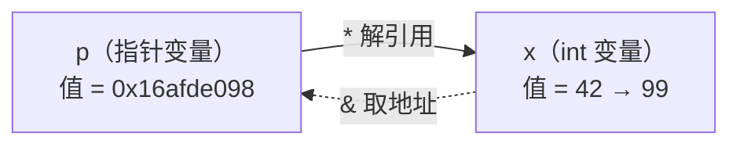

# 第 34 章 · 指针

**简体中文** ｜ [English](./34-pointers.en-US.md)

---

> 前三章里有个角色始终隐身：`malloc` 返回的是它、悬垂与双重释放伤的是它、GC 能压缩堆靠的是"掌握它的全部行踪"。本章让它出场——**指针：一个存着地址的变量**。
>
> 它的全部秘密只有一条公式：**指针 = 地址 + 类型**。地址说"在哪"，类型说"怎么读、走多远"——实测 `int*` 加 1 前进 4 字节、`double*` 加 1 前进 8 字节、`char*` 加 1 前进 1 字节；连 `arr[i]` 都只是 `*(arr + i)` 的糖（实测 `2[ints]` 照样合法）。有了它，你能穿墙改变量（`*(&x) = 99`）、能把函数当数据传（`qsort` + 函数指针实测）——也能制造空指针、野指针、悬垂指针三大事故。
>
> 于是其余四门语言做了同一个决定：**把指针藏起来**——但各自留的后门大小悬殊，构成一条光谱：Java 只留了"不给看地址的引用"（`identityHashCode` 只是影子）；JS 给了一块能自管字节的沙箱内存（`ArrayBuffer`，offset 就是你的指针，越界返回 `undefined` 而不是踩别人内存）；Python 留了侧门（`ctypes` 用 `id()` 当真地址，实测直接从内存读出对象的引用计数）；C# 干脆保留了整套 C++ 语法（`unsafe` 下 `*(&x) = 99` 原样可用，实测步长同款 4 字节）。
>
> 而 C# 的 `fixed` 关键字泄露了藏指针的根本原因：**GC 要搬对象，就不能让裸地址流散在外**（第 33 章"能搬 vs 不能搬"的收束）。连 SQL 都在本章有位置：外键就是跨表指针，且数据库系统级禁止悬垂——实测删除被引用的行直接报错，或者 `ON DELETE CASCADE` 级联回收。

## 1. 学习目标

本章结束后，你将能够：

- 用"**地址 + 类型**"模型解释指针的一切行为：解引用、步长（实测 4/8/1 字节）、类型转换的意义；
- 说清**数组与指针的血缘**：`arr[i] ≡ *(arr+i)`、传参退化（实测 `sizeof` 从 12 变 8）；
- 解剖**三大事故**（空指针 / 野指针 / 悬垂指针）的成因与各语言的对策；
- 画出**藏指针的光谱**：Java 纯引用 → JS 沙箱内存 → Python ctypes 侧门 → C# unsafe 全开，并解释每档的取舍；
- 回答本 Part 的核心收束题：**为什么 GC 语言必须藏指针**（对象要搬家，地址不能外流——`fixed` 是唯一的临时豁免）。

---

## 2. 为什么会出现这个概念

### 没有指针的世界缺什么

第 33 章的 `malloc` 返回了什么？一块堆内存的**位置**。函数怎么修改调用者的变量？得知道它**在哪**。链表的节点怎么找到下一个节点？记住它的**住址**。

```text
三个需求，一个答案：程序需要「在哪」成为一种可以存储、传递、计算的值
```

### 指针的定义：存地址的变量

```cpp
int x = 42;        // x 是一个 int，住在栈上某处
int* p = &x;       // p 也是变量——但它存的是 x 的地址
*p = 99;           // 通过地址找到 x，改写它
```



> **一句话**：指针把"位置"变成一等公民——可存、可传、可算。间接寻址是它的能力（函数改外部变量、动态数据结构、多态分发底层全靠它），而"地址一旦可算，就可能算错"是它的原罪——三大事故与四门语言的封印都由此而来。

---

## 3. 底层原理

### 公式：指针 = 地址 + 类型

地址只是个数字（第 31 章打印过一堆）；**让指针有行为的是类型**：

| 类型的作用 | 例子 |
|-----------|------|
| 决定**解引用读几个字节、怎么解释** | `*(int*)addr` 读 4 字节按补码；`*(double*)addr` 读 8 字节按 IEEE 754（第 7 章） |
| 决定**算术步长** | `p + 1` = 地址 + `sizeof(所指类型)` |
| 决定**允许的操作** | 函数指针能调用、`void*` 什么都不能做（只能存与转） |

### 实测一：步长由类型决定

```text
int*    +1: 0x16afde098 -> 0x16afde09c   步进 4 字节
double* +1: 0x16afde080 -> 0x16afde088   步进 8 字节
char*   +1: 0x16afde058 -> 0x16afde059   步进 1 字节
```

**`p + 1` 从来不是加 1 字节，是加一个"所指类型"的宽度**——这正是数组遍历的底层：下一格 = 当前地址 + 元素宽度（第 16 章数组 O(1) 随机访问的最终解释）。

### 实测二：数组与指针的血缘

```text
ints[2] = 30，*(ints + 2) = 30，2[ints] = 30   ← 三种写法同一件事
sizeof(ints) 在 main 里 = 12 字节（真数组）
函数内 sizeof(arr)      = 8 字节   ← 退化成指针了！
```

`arr[i]` 就是 `*(arr + i)` 的语法糖——所以 `2[ints]`（即 `*(2 + ints)`）荒诞但合法。数组作参数传递时**退化**为指向首元素的指针（12 字节变 8 字节），这是 C/C++ "数组传参丢长度"的根源，也是 C++ `std::array`/`span` 存在的理由。

### 实测三：函数指针——代码也有地址

```text
qsort + 函数指针排序: 4 9 15 26 31
compare_int 的地址: 0x104e204e8（在代码区——第 31 章的地址分层又现身）
```

函数的机器码也住在内存里（代码区），所以也有地址、也能被指——`qsort` 拿着你给的比较函数地址在排序中回调。**这是回调机制的物理原型**：第 14 章的高阶函数、第 27 章的虚函数表（vtable 就是函数指针数组）、事件系统，底层全是它。

### 三大事故解剖

| 事故 | 成因 | 危险度 |
|------|------|-------|
| **空指针** | 指向地址 0，解引用即触发保护 | ★ 最幸运——立刻段错误，现场清晰 |
| **野指针** | 声明未初始化，指向随机地址 | ★★ 读到垃圾或随机崩溃 |
| **悬垂指针** | 所指内存已释放/帧已弹出 | ★★★ 最阴险——"暂时还能用"（第 32/33 章实测） |

三者同源：**指针的值与所指内存的生命周期是两本账**——指针不知道它指的东西还在不在。修复思路也由此分岔：Java 干脆消灭前两种（引用必初始化、无算术）并把第一种驯化成 NPE；Rust 用借用检查器在编译期对齐两本账（第 38 章会提）；C++ 的答案是智能指针（第 38 章）。

### 收束第 33 章：GC 与裸指针不共戴天

```text
GC 要压缩堆 → 对象会搬家 → 所有指向它的引用必须同步改写
→ 运行时必须知道每一个引用在哪
→ 裸地址一旦泄露给用户代码（存进 int、写到文件），运行时就追踪不到了
→ 所以：托管语言必须藏指针
```

C# 的 `fixed` 是这条铁律的"临时豁免条款"：钉住对象、GC 暂缓搬它、指针短暂合法——**例外恰好证明了规则**。

---

## 4. JavaScript

JS 站在光谱最严的一端：**连地址的影子都不给**——但留了一块能自管字节的沙箱。

### 对象变量都是引用（实测）

```javascript
const a = { name: "小明" };
const b = a;                 // 复制引用，不复制对象
b.name = "小红";             // a.name 也变了——同一个对象
a === b   // true（同一引用）
a === c   // false——c 内容相同也不等：=== 比的就是"地址"
```

**`===` 对对象就是引用比较**——你摸不到地址，但每次比较对象都在用它。

### `ArrayBuffer`：offset 就是你的指针（实测）

```javascript
const buf = new ArrayBuffer(16);        // 16 字节裸内存，无类型
const view = new DataView(buf);
view.setInt32(0, 42, true);             // "指针" offset=0，按 int32 写
view.setFloat64(8, 3.14, true);         // "指针" offset=8，按 double 写
```

```text
offset 0 读 int32:   42
offset 8 读 float64: 3.14
```

手动算 offset、手动选类型——**这就是把"地址 + 类型"的工作自己做一遍**。文件解析、WebGL、WASM 内存全靠这套。

### TypedArray：同一块内存的多种视图（实测）

```text
Int32Array 视图看 buf: nums[0] = 42        ← 与 DataView 共享同一块内存
改 nums[0] = 100 后 DataView 再读: 100     ← 实锤同一块
```

### 沙箱的边界（实测）

```text
nums[999] = undefined   ← 越界读返回 undefined，不是别人的内存
```

**C++ 的越界是未定义行为，这里是被拦下的 `undefined`**——能力换安全，是 JS 后门的设计准则（WASM 的线性内存同理：内部随便算，出不了沙箱）。

> **注意事项**：`ArrayBuffer` 里的数据没有对象身份——存的是字节不是引用；把对象"放进" buffer 只能靠序列化。`SharedArrayBuffer` + `Atomics` 是它的多线程版（第 45 章），那时"手动内存"的并发问题也会原样回来。

---

## 5. Python

Python 嘴上说"没有指针"，身上却处处是引用的痕迹——而且留了一扇 `ctypes` 侧门，能用 `id()` 当真地址。

### 变量都是引用，`is` 就是地址比较（实测）

```python
a = [1, 2, 3]
b = a                    # 不复制——两个名字指向同一对象
b.append(4)              # a 也变成 [1, 2, 3, 4]
a is b                   # True——is 比的就是 id()，即地址（第 31 章实测）
```

### 侧门实测：从 `id()` 直接读内存

```python
import ctypes
x = 3141592653589
refcount = ctypes.c_ssize_t.from_address(id(x))   # 对象头第一个字段：引用计数
```

```text
从地址 id(x) 直接读内存: 引用计数 = 3
y = x 之后再读:          引用计数 = 4    ← 多了一个引用，账本实时变化
对照 sys.getrefcount(x) = 5（它自己也算一个引用）
```

**`id()` 在 CPython 里就是对象的堆地址**（第 31 章的伏笔），`ctypes` 允许你按这个地址直接读进程内存——第 24 章讲的对象头、第 36 章要讲的引用计数，在这里被"从地址里"直接读了出来。这扇门供 C 扩展与 FFI 使用；它也证明了 CPython 的对象**不搬家**（引用计数 GC 不整理堆），所以才敢让 `id()` 稳定。

### 没有指针算术（实测）

```text
引用 + 1 -> TypeError
```

地址不可算，CPython 内部才有管理自由——与 JS 同一逻辑。

### 引用语义的经典事故（实测）

```python
def enroll(name, roster=[]):    # 默认值只创建一次——所有调用共享同一个列表！
    roster.append(name)
    return roster
```

```text
enroll('小明') = ['小明']
enroll('小红') = ['小明', '小红']   ← 上一次的还在！
```

**没有指针语法 ≠ 没有共享可变状态的事故**——可变默认参数是 Python 面试的常青坑，本质就是"多个名字指着同一个对象"。修法：默认值用 `None`，函数体内新建。

> **注意事项**：`ctypes` 的读随意、写危险——改错一个字节就是解释器崩溃；它是 FFI 工具不是日常 API。判断相等用 `==`，`is` 只留给 `None`（第 33 章小整数池的教训同款）。

---

## 6. Java

Java 是光谱上最彻底的封印：**引用就是不给看地址的指针，且没有任何后门**。

### 引用的三个"指针没有"（实测）

```java
Student a = new Student("小明");
Student b = a;              // 复制引用——改 b.name，a.name 同变（实测）
a == b                      // true：== 比的是"地址"
a == c                      // false：内容相同也不等
```

| 指针有 | 引用没有 | 换来什么 |
|--------|---------|---------|
| 可读的地址值 | ❌ 无任何 API 暴露地址 | GC 自由搬对象（第 33 章压缩） |
| 算术（`p+1`） | ❌ | 不可能越界到邻居 |
| 可不初始化（野指针） | ❌ 引用必有值（哪怕是 null） | 消灭野指针这一整类事故 |

### `identityHashCode`：地址的影子（实测）

```text
System.identityHashCode(a) = 0x7852e922
```

它由对象身份生成、**终身不变**——而对象本身可能已被 GC 搬过家。若它真是地址，第 33 章的压缩整理就做不成了：这是"Java 引用不是裸地址"的最好证据。

### NPE：被驯化的空指针（实测）

```text
解引用 null -> 可捕获的 NPE: Cannot read field "name" because "<local4>" is null
```

C++ 的空指针是段错误、进程死；Java 把同一事故驯化成**可捕获的异常**，还附赠精确到变量名的提示（JDK 14+ 的 Helpful NullPointerExceptions）。三大事故里，Java 消灭了野指针与悬垂（GC 保证所指对象活着），只剩空指针——于是它成了 Java 头号运行时异常。

### 防御工事（实测）

```java
Objects.requireNonNull(nobody, "student 不能为空");   // 前置拦截，错误更早更清晰
Optional.ofNullable(nobody).map(s -> s.name).orElse("(无名氏)");  // 把可空写进类型
```

> **注意事项**：`Optional` 是返回值的语义工具，别用它做字段/参数（序列化与性能都不友好）；真正的一劳永逸是 Kotlin/C# 式的类型级空安全——Java 只能靠 `@Nullable` 注解 + 静态分析逼近（第 40 章展开）。

---

## 7. C++

C++ 是唯一把整套指针能力交给你的语言——本章第 3 节的四组实测全部来自它。本节补全能力清单与约束工具。

### 能力清单（实测汇总）

```cpp
int* p = &x;  *p = 99;          // 取地址 / 解引用（实测 x 变 99）
p + 1;                          // 算术：按类型步进（实测 4/8/1 字节）
arr[i] == *(arr + i);           // 数组血缘（实测三种写法同值）
int** pp = &p;  **pp;           // 二级指针：门后还有门（实测）
int (*fp)(const void*, const void*) = compare_int;   // 函数指针（实测 qsort 回调）
```

### const 的两个方向

```cpp
const int* p1 = &x;     // 指向 const：不能 *p1 = ...（内容只读）
int* const p2 = &x;     // const 指针：不能 p2 = ...（指向不变）
const int* const p3 = &x;   // 都锁死
```

读法口诀：**从右往左读**——`p2` 是 const 的指针（指向 int）；`p1` 是指针（指向 const int）。API 设计里 `const T*` 参数是"我只看不改"的承诺（第 21 章不可变性的指针版）。

### `void*` 与转型：能力的边界

```cpp
void* raw = malloc(64);         // malloc 返回 void*——只有地址没有类型
int* typed = (int*)raw;         // 转型 = 给地址补上类型——从此有步长、能解引用
```

`void*` 是"纯地址"：能存能传，不能解引用不能算术——**类型才是指针的行为来源**（本章公式再证）。C++ 里更推荐 `static_cast`/`reinterpret_cast` 显式表达意图（第 10 章类型转换的延伸）。

### 现代 C++ 的立场：裸指针只观察，不拥有

```text
拥有资源（要负责 delete）→ unique_ptr / shared_ptr（第 38 章）
只是看看（不负责生命周期）→ 裸指针 / 引用 —— 可以为空用指针，不可为空用引用（第 35 章）
数组 + 长度一起传        → std::span（C++20）——修复"退化丢长度"
```

> **注意事项**：三大事故的现代药方——空指针用 `nullptr` + 判空；野指针靠"声明即初始化"习惯 + 编译器警告；悬垂靠所有权规则（谁拥有谁释放，别人只借看）。这套纪律的类型化版本就是第 37/38 章。

---

## 8. C#

C# 是托管世界里最大的后门：**`unsafe` 之下，整套 C++ 指针语法原样可用**。

### 同一套语法（实测）

```csharp
unsafe {
    int x = 42;
    int* p = &x;         // 取地址
    *p = 99;             // 解引用改写（实测 x = 99）
    // 指针算术同款：实测 int* +1 步进 4 字节
}
```

### `fixed`：与 GC 的临时停战协议（实测）

```csharp
int[] arr = { 10, 20, 30, 40 };
fixed (int* pa = arr) {          // 钉住数组——GC 暂时不许搬它
    *(pa + 2);                   // 实测 30——算术照旧
}                                 // 出块即解除，GC 恢复自由
```

**`fixed` 的存在泄露了天机**：平时 GC 会搬对象（第 33 章压缩整理），所以指向托管堆的指针必须先"钉住"才合法——这正是第 3 节"GC 与裸指针不共戴天"的语言级证据。`unsafe` 的代价：代码要显式标注、项目要开 `AllowUnsafeBlocks`、失去可验证性——**门是开的，但门槛写得清清楚楚**。

### `Span<T>`：有指针的效率，没指针的事故（实测）

```csharp
Span<int> span = stackalloc int[4] { 1, 2, 3, 4 };
Span<int> tail = span.Slice(2);      // 切片 = 指针 + 长度
tail[0] = 99;                        // 实测：写穿到原 span
// tail[5]                           // 越界抛异常——不是未定义行为
```

`Span` = **指针 + 长度 + 边界检查**：解析、切片、零拷贝传递的场景全覆盖，而三大事故一个不剩——这是 C# 给"性能派"的正门，`unsafe` 才是后门。

### 日常层：空安全语法（实测）

```csharp
string? maybe = null;
maybe?.Length ?? -1      // 实测 -1：?. 短路、?? 兜底——防空指针进了语法
```

> **注意事项**：`unsafe` 的正当场景只有三类——互操作（P/Invoke 传 native API）、极端热路径、自定义内存布局；日常性能需求先试 `Span`/`Memory`。可空引用类型（`string?` 与编译器流分析）默认开启后，NRE 从运行时事故前移为编译警告——第 40 章展开。

---

## 9. SQL

数据库的"指针"是 **rowid 与外键**——而且它对悬垂引用的态度比任何语言都强硬：**系统级禁止**。

### rowid：行的"地址"（实测）

```sql
SELECT rowid, name FROM student WHERE rowid = 2;    -- 按"地址"直达一行
```

```text
2|小红
```

SQLite 的表按 rowid 组织成 B 树——rowid 查找就是"按地址寻址"，不用扫全表（第 49 章索引的地基）。

### 外键：跨表的指针（实测）

```sql
CREATE TABLE enrollment (
    student_id INTEGER REFERENCES student(id) ON DELETE CASCADE,
    course TEXT
);
```

`student_id` 存的是"指向 student 表某行"的引用——JOIN 就是**批量解引用**（实测三行选课各自找到了学生名）。

### 悬垂引用？数据库直接说不（双实测）

```text
默认（RESTRICT 语义）：删除被引用的行 →
    Runtime error: FOREIGN KEY constraint failed —— 拒绝制造悬垂（shell 实测）

ON DELETE CASCADE：删除小明 →
    enrollment 剩 1 行（他的两条选课级联消失）—— 级联回收（实测）
```

对照本章主题，这是第三种答案：C++ 把悬垂留给你自己防；GC 语言让所指对象"不可能死"（引用在，对象就在）；**数据库反过来——引用还在就不许死，或者死了连引用一起收**。`ON DELETE SET NULL` 则相当于"自动置空指针"。

> **工程提醒**：SQLite 的外键检查默认关闭，必须 `PRAGMA foreign_keys = ON`（历史包袱）；生产库设计中，外键约束与应用层校验之争的本质是"引用完整性由谁保证"——数据库保证的版本不怕任何绕过路径。

---

## 10. 五语言横向对比

### ① 指针能力对比

| 能力 | JavaScript | Python | Java | C++ | C# |
|------|-----------|--------|------|-----|-----|
| 看到地址 | ❌ | `id()`（CPython 细节） | ❌（hash 只是影子，实测） | ✅ | `unsafe` 下 ✅ |
| 指针算术 | buffer 内 offset（实测） | ❌（实测 TypeError） | ❌ | ✅（实测步长 4/8/1） | `unsafe` 下 ✅（实测） |
| 函数指针 | 函数本身是值（第 14 章） | 同左 | 方法引用（受限） | ✅ 裸函数指针（实测） | 委托（安全版） |
| 空值事故形态 | `TypeError`（可捕获） | `AttributeError`（可捕获） | **NPE**（可捕获+精确提示，实测） | **段错误**（进程死） | NRE（可捕获）+ 编译期 `?` 警告 |
| 后门 | `ArrayBuffer` 沙箱（实测） | `ctypes` 侧门（实测读 refcount） | **无** | —（本体即全权） | `unsafe`/`fixed` 全开（实测） |

### ② 钥匙对比：藏指针的光谱

```text
封印最严 ◄──────────────────────────────────────────► 全权开放

Java            JavaScript           Python              C#                  C++
纯引用无后门     ArrayBuffer 沙箱     ctypes 侧门         unsafe + fixed      本体
地址无影踪       字节可自管           id() 即地址          全套语法+停战协议    地址+类型+算术
（实测 hash     （实测越界=          （实测直读           （实测步长同 C++）   （实测全能力）
  只是影子）      undefined）          refcount）
```

**位置由用途决定**：Java 面向应用开发（不需要 FFI 就不开门）；JS 要跑在浏览器沙箱里（门只能开向沙箱内）；Python 靠 C 扩展生态吃饭（侧门是生命线）；C# 定位"系统级托管语言"（干脆保留全套，用 `unsafe` 圈起来）。

### ③ 两条设计分歧

**分歧一：空值事故给什么待遇**

```text
C++：不给待遇——段错误，未定义行为（你没付运行时检查的钱，第 31 章光谱同款）
Java/C#/Python/JS：驯化成异常——可捕获、带栈回溯（Java 还带精确变量名，实测）
C#/Kotlin 更进一步：可空性进类型——事故前移到编译期（第 40 章）
SQL：根本不许发生——引用完整性由系统保证（实测拒删）
```

**分歧二：指针的"知情权"给不给运行时**

```text
C++：不给——裸地址可以存进 int、写进文件，运行时两眼一抹黑
     → 代价：堆永远不能整理（第 33 章）、悬垂无人能查
托管语言：全给——每个引用的位置运行时都登记在册
     → 回报：GC 自由搬家、引用永不悬垂
     → C# 的 fixed 是唯一的临时豁免——且有明确的起止范围
```

### ④ 共同点与差异根源

**共同点**：五门语言的对象访问底层全是间接寻址（引用/指针解引用）；`==`/`===`/`is` 对对象都是"地址比较"（三语言实测）；函数都能作为值传递（函数指针/一等函数/委托——同一能力的三种包装）。

**差异根源**：

- **C++ 把地址当普通数值**——能力上限即硬件上限，事故下限也是；
- **托管语言把地址当运行时机密**——换来 GC 与安全，FFI 需求靠后门泄压；
- **后门的形状反映生态**：沙箱（JS）、C 扩展侧门（Python）、系统编程全开（C#）；
- **SQL 把引用升格为约束**——指针问题在它这里是数据完整性问题，答案自然也是声明式的。

---

## 11. 底层实现对比

| 运行时 | "指针"的真身 | 关键细节 |
|--------|-------------|---------|
| **V8**（JavaScript） | tagged pointer：一个字里既可能是小整数（SMI），也可能是对象指针 | 最低位做标记区分——所以 JS "一切是对象"却不为小整数付堆分配（第 24 章伏笔） |
| **CPython** | `PyObject*` 满天飞——C 层全是裸指针 | 对象不搬家（引用计数 GC），`id()` 才敢当地址用（实测 ctypes 直读）；这也是 CPython 难上移动式 GC 的原因 |
| **JVM**（Java） | 压缩 OOP：堆 <32 GB 时引用压成 32 位（基址+偏移） | GC 搬对象时批量改写引用——运行时全程掌握每个引用的位置（oop map） |
| **C++**（原生） | 硬件地址本身 | 无任何运行时登记——编译后指针就是寄存器里的一个整数（第 32 章 x0–x7 传参实测） |
| **CLR**（C#） | 托管引用（GC 追踪）+ `unsafe` 裸指针（不追踪） | `fixed` 在 GC 信息表里临时标记"此对象不可移动"（实测）；`Span` 是 ref struct——只许在栈上，杜绝逃逸 |

**一个值得记住的分野**：

```text
CPython 选择"对象不搬家"——于是 id() 稳定、ctypes 能直读、C 扩展好写，代价是堆永不整理
JVM/CLR/V8 选择"对象可搬家"——于是引用必须受控、后门必须设防（fixed），回报是第 33 章的指针碰撞分配
同一道选择题，两种答案——第 36 章 GC 会算清这笔账
```

---

## 12. 性能分析

### 间接寻址的代价

```text
直接访问:   mov x0, [sp+8]           一次内存访问
指针访问:   先读指针值，再按值寻址     两次内存访问——还可能两次 cache miss
```

第 31 章实测过它的宏观版本：`class[]`（指针数组）比 `struct[]`（数据内联）慢的根源就是**每个元素多一跳**。链表 vs 数组（第 16/17 章）、虚调用 vs 直调（第 27 章 5.7×）——本书所有"间接层的代价"实测，微观上都是这一跳。

### 但指针也是性能工具

```text
零拷贝：传大结构体的地址（8 字节）而不是复制它（第 32 章实测 struct 按值全量复制）
原位修改：C++ 函数改调用者变量、Span 切片写穿（实测）——不产生副本
跳表/树/图：没有"存地址"的能力，动态数据结构无从谈起
```

### 各语言的"指针性能"要点

| 语言 | 要点 |
|------|------|
| C++ | 裸指针零开销——贵的是解引用的 cache miss，不是指针本身 |
| C# | `Span` 与裸指针性能几乎持平（JIT 消除边界检查的常见路径）——先 `Span` 后 `unsafe` |
| Java | 压缩 OOP 省一半引用内存（堆 <32 GB 默认开）——引用密集结构受益 |
| Python | `ctypes` 调用本身很慢（FFI 封送）——它是接口不是加速器 |
| JS | TypedArray 上的数值运算接近原生——大数值计算的标准姿势（避开对象引用） |

> ⚠️ 惯例提醒：指针层面的优化（数据内联、压缩引用、零拷贝）都是热路径手段——它们的共同原理是**减少那"多一跳"**，收益永远与访问频率成正比。

---

## 13. 工程实践

| 场景 | ✅ 推荐 | ❌ 不推荐 | 原因 |
|------|--------|----------|------|
| C++ 表达"可能没有" | 指针 + 判空 / `optional` | 引用（不可为空） | 语义写进类型（第 35 章展开） |
| C++ 拥有堆资源 | 智能指针（第 38 章） | 裸 `new` + 裸指针 | 三大事故的根治 |
| C++ 传数组 | `std::span` / `vector&` | 裸指针 + 单独长度 | 修复退化丢长度（实测 12→8） |
| C# 高性能内存操作 | `Span<T>` 优先 | 直接上 `unsafe` | 同等性能 + 边界检查（实测越界抛异常） |
| Python 需要真地址 | 限定在 FFI 边界内用 `ctypes` | 业务代码里玩 `id()` | 侧门是给扩展生态的，不是给业务的 |
| Java 判空 | `requireNonNull` 前置 + `Optional` 返回值 | 层层 `if (x != null)` | 事故更早、语义更明（实测） |
| JS 二进制数据 | `TypedArray`/`DataView`（实测） | 字符串拼字节 | 唯一正确的字节操作方式 |
| 数据库引用完整性 | 外键约束 + 明确 ON DELETE 策略 | 纯应用层校验 | 系统级防悬垂不怕绕过（双实测） |
| 对象相等判断 | `==`/`equals` 按语义分清 | 混用引用比较与内容比较 | 三语言实测：引用比较看"地址" |

### 判断口诀

```text
要不要指针语义（共享、可空、可换指向）→ 不要就用值语义，事故清零
要指针语义 → 优先语言的安全包装（引用/Span/Optional/外键）
真要裸指针 → 圈进最小范围（unsafe 块 / FFI 边界 / ctypes 模块），出圈即转安全类型
```

---

## 14. 最佳实践

- **公式先行**：任何指针困惑回到"地址 + 类型"——步长、转型、`void*` 的一切行为都从这推得出（实测 4/8/1）。
- **裸指针只观察不拥有**（C++）：拥有权交给智能指针与容器；观察用裸指针/引用并保证不出所有者的生命期。
- **可空性显式化**：C++ 用 `optional`/指针、Java 用 `Optional`、C# 开可空引用类型——让"可能没有"离开注释、进入类型。
- **越界防御分层**：能用带检查的（`Span`、`at()`、TypedArray）就不用裸算术——实测证明检查的代价常被 JIT 消除。
- **`is`/`==`/`===` 想清楚比什么**：对象默认比"地址"（三语言实测）——内容相等另有其法（`equals`/`==` 重载/深比较）。
- **FFI 边界即安全边界**：`ctypes`/`unsafe`/P-Invoke 的代码圈在最小模块里，进出都转换成安全类型。
- **数据库引用交给约束**：外键 + `ON DELETE` 策略声明——引用完整性是系统责任，不是每个调用方的自觉（实测拒删/级联）。
- **教学与调试时打印地址**：本章与 31/32 章的所有实测手法（`%p`、`id()`、`unsafe` 打印）都是理解运行时的直接窗口。

---

## 15. 常见坑

**坑 1 · 以为 `p + 1` 是加 1 字节**

```text
实测：int* +1 = +4 字节，double* +1 = +8 字节——步长是类型宽度
```

**如何避免**：记住公式"地址 + 类型"；跨类型算偏移时先转 `char*`/`byte*`（实测中我们正是这么测的）。

**坑 2 · 数组传参后用 `sizeof` 算长度**

```cpp
void f(int arr[]) { sizeof(arr); }   // 实测 8 字节——指针的大小，不是数组的！
```

**如何避免**：C++ 用 `std::span`/`std::array`/容器传递；C 风格接口必须同时传长度。

**坑 3 · 空指针判断在解引用之后**

```cpp
int len = s->length();      // 若 s 为空这里已经死了
if (s != nullptr) { ... }   // 迟到的检查
```

**如何避免**：判空前置（Java 的 `requireNonNull` 实测同理）；C# 用 `?.` 让短路进语法（实测）；启用编译器/静态分析的空值警告。

**坑 4 · Python/JS 把赋值当拷贝**

```text
实测：b = a 后 b.append(4) / b.name = "小红"——a 同变，因为是同一个对象
```

**如何避免**：明确"赋值复制引用"；要副本就显式拷（`list(a)`、`{...a}`、`copy.deepcopy`）；警惕可变默认参数（实测事故）。

**坑 5 · 在 GC 语言里缓存"地址"**

```python
addr = id(obj)          # CPython 恰好稳定；换 PyPy（会搬对象）立刻失效
```

**如何避免**：`id()`/`identityHashCode` 都不是可持久化的地址（实测 hash 只是影子）；跨进程/持久化标识用业务 ID。

**坑 6 · C# 绕过 `fixed` 缓存指针**

```csharp
int* p;
fixed (int* q = arr) { p = q; }
*p = 1;                 // fixed 已结束——GC 可能已经搬走 arr！悬垂指针在托管堆重生
```

**如何避免**：指针不出 `fixed` 块；要长期"钉住"用 `GCHandle.Alloc(obj, GCHandleType.Pinned)` 并记得释放。

**坑 7 · 忘了开外键检查**（SQLite）

```sql
-- 没有 PRAGMA foreign_keys = ON：外键形同虚设，悬垂引用畅通无阻
```

**如何避免**：SQLite 每个连接都要显式 `PRAGMA foreign_keys = ON`（历史默认关）；上线前用约束违规测试验证它真的在工作（实测：开着才会拒删）。

---

## 16. 面试题

**基础**

1. 指针和它指向的变量各占什么内存？`*` 和 `&` 各做什么？
2. 为什么 `int* p; p + 1` 前进 4 字节而不是 1 字节？
3. 空指针、野指针、悬垂指针各是怎么产生的？哪个最危险，为什么？

**中级**

4. **`arr[i]` 与 `*(arr + i)` 什么关系？数组传参时发生了什么（“退化”）？**
5. Java 的引用和 C++ 的指针有哪三个关键区别？各换来了什么？
6. **C# 的 `fixed` 关键字为什么存在？它泄露了托管运行时的什么机制？**

**高级**

7. **为什么 CPython 敢让 `id()` 返回真地址，而 JVM 绝不暴露地址？这与两者的 GC 策略有什么关系？**
8. `Span<T>` 如何做到"有指针的效率、没指针的事故"？它为什么被设计成只能在栈上？
9. 数据库的外键约束与 GC 语言的引用可达性，分别如何回答"悬垂引用"问题？还有第三种答案吗？

---

## 17. 练习

**基础**

1. 用 C++ 打印 `short*`、`long*`、结构体指针的步长，验证"步长 = `sizeof(所指类型)`"。
2. 在 Python/JS/Java 各写一段"赋值共享对象"的演示，再写出各自的正确拷贝写法。
3. 用 `DataView` 在一个 `ArrayBuffer` 里布局"一个 int32 + 一个 float64 + 4 字节字符串"，再逐字段读回。

**提高**

4. **复现 ctypes 实测**：读出一个对象的引用计数，再构造几个引用观察它增长；解释与 `sys.getrefcount` 差 1 的原因。
5. 用函数指针实现一个 C 风格"策略表"：数组里存四个运算函数的指针，按下标分发——然后对比 C++ `std::function`、Java 方法引用的同款写法。
6. 在 C# 里分别用 `unsafe` 指针和 `Span<T>` 实现同一个"数组求和"，用 `Stopwatch` 对比性能，验证"Span 几乎不亏"。

**挑战**

7. 用 C++ 写一个最小 `observer_ptr`：包装裸指针、禁止 `delete`、提供判空——体会"观察不拥有"的类型化表达。
8. 故意制造第 15 节坑 6（C# 指针逃出 `fixed`），用大量分配触发 GC，观察悬垂后果；再用 `GCHandle` 正确修复。
9. 设计一个三表数据库（学生/课程/选课），为每个外键选择 `RESTRICT`/`CASCADE`/`SET NULL` 之一并说明理由，然后用违规操作逐一验证约束生效。

---

## 18. 本章总结

**一句话总结**：指针 = **地址 + 类型**——地址定位、类型定行为（实测步长 4/8/1、`arr[i] ≡ *(arr+i)`、函数指针回调），这份全权让 C++ 能穿墙改值也能造出三大事故；其余语言把它藏起来，但后门光谱迥异——Java 无门（hash 只是影子）、JS 沙箱（ArrayBuffer 越界=undefined）、Python 侧门（ctypes 从 `id()` 直读 refcount）、C# 全开（unsafe 同款语法 + `fixed` 停战协议）——而 `fixed` 恰好点破藏指针的根本原因：**GC 要搬对象，裸地址就不能外流**（CPython 反向印证：不搬家才敢让 `id()` 稳定）；SQL 则给出第三种答案：引用完整性系统保证——拒删或级联，绝不悬垂（双实测）。

**核心知识点**

- **公式**（实测）：指针 = 地址 + 类型；步长 = `sizeof(所指类型)`；`void*` = 有址无类型（不可解引用）。
- **数组血缘**（实测）：`arr[i] ≡ *(arr+i)`（连 `2[ints]` 都合法）；传参退化 12→8 字节——丢长度的根源。
- **函数指针**（实测）：代码区也有地址——回调、vtable、事件系统的物理原型。
- **三大事故**：空（最幸运）、野（未初始化）、悬垂（最阴险）——同源于"指针与所指生命周期是两本账"。
- **藏指针光谱**（四实测）：Java 纯引用 → JS 沙箱 → Python ctypes → C# unsafe——位置由生态用途决定。
- **GC 铁律**（实测收束）：能搬对象 ⇒ 地址必须受控（`fixed` 豁免证明规则）；不搬对象 ⇒ `id()` 才敢稳定。
- **SQL 的第三答案**（双实测）：外键约束拒删 / CASCADE 级联——悬垂引用是系统责任。

**检查清单**

- [ ] 我能用"地址 + 类型"解释步长、转型和 `void*` 的限制。
- [ ] 我能说清数组退化的现象、后果与现代修复（span）。
- [ ] 我能画出五门语言藏指针的光谱并说明各自理由。
- [ ] 我知道 `fixed`/ctypes/ArrayBuffer 各自"开门"的方式与边界。
- [ ] 我能解释三大事故的成因，以及每门语言消灭了哪几种。

**下一章预告**：C++ 里还有一个与指针纠缠不清的概念——**引用**（`int&`）：不能为空、不能改指向、用起来像变量本身。它和指针是什么关系？为什么函数参数有 `T`、`T&`、`const T&`、`T*` 四种写法、各在什么时候用？更大的图景是**值语义与引用语义**的分水岭：C++ 默认拷贝（第 23 章拷贝构造的真正舞台）、Java/Python/JS 默认共享、C# 让你二选一——第 35 章把"赋值和传参时到底发生了什么"这笔账，五门语言逐一算清。

---

## 19. 延伸阅读

- <a href="https://en.wikipedia.org/wiki/Pointer_(computer_programming)" target="_blank" rel="noopener">Wikipedia：Pointer</a> — 指针概念的标准综述。
- <a href="https://en.cppreference.com/w/cpp/language/pointer" target="_blank" rel="noopener">cppreference · Pointer declaration</a> — C++ 指针语法与语义的权威参考。
- <a href="https://en.cppreference.com/w/cpp/container/span" target="_blank" rel="noopener">cppreference · std::span</a> — "指针 + 长度"的现代修复。
- <a href="https://learn.microsoft.com/en-us/dotnet/csharp/language-reference/unsafe-code" target="_blank" rel="noopener">Microsoft Learn · Unsafe code and pointers</a> — C# unsafe/fixed 的官方文档。
- <a href="https://learn.microsoft.com/en-us/dotnet/standard/memory-and-spans/" target="_blank" rel="noopener">Microsoft Learn · Memory and Span</a> — Span/Memory 体系的官方指南。
- <a href="https://docs.python.org/3/library/ctypes.html" target="_blank" rel="noopener">Python 文档 · ctypes</a> — Python FFI 侧门的官方参考。
- <a href="https://developer.mozilla.org/en-US/docs/Web/JavaScript/Guide/Typed_arrays" target="_blank" rel="noopener">MDN · Typed arrays</a> — ArrayBuffer/TypedArray/DataView 的官方指南。
- <a href="https://docs.oracle.com/en/java/javase/17/docs/api/java.base/java/util/Optional.html" target="_blank" rel="noopener">Java API · Optional</a> — Java 空值防御的标准工具。
- <a href="https://www.sqlite.org/foreignkeys.html" target="_blank" rel="noopener">SQLite 文档 · Foreign Key Support</a> — 外键约束与 ON DELETE 策略的官方说明。
