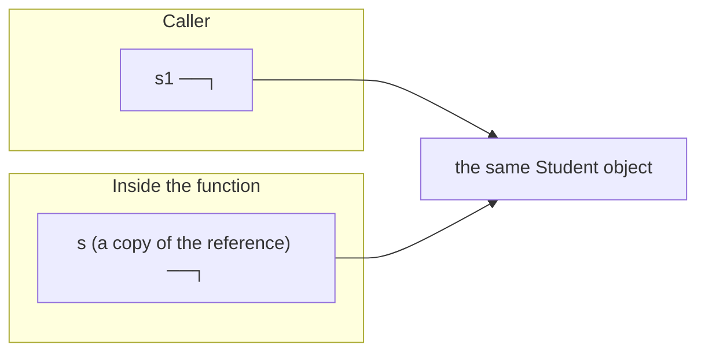

# Chapter 35 · References

[简体中文](./35-references.md) ｜ **English**

---

> Chapter 34's pointer was full power, full accident. C++ offers a tamed edition: **the reference (`int&`) — an alias for a variable**. Measured, the aliasing is total: `&r == &x` — taking the reference's address yields the original variable's address; a reference has no identity of its own. The assembly goes further: `by_ref(int&)` and `by_ptr(int*)` compile to **byte-identical machine code** (measured: `mov w8, #99; str w8, [x0]; ret`) — **a reference's true form is a pointer**, and every difference lives at compile time as discipline: must initialize, cannot rebind, cannot be null, no arithmetic.
>
> But "reference" means different things in our five languages, and this chapter measures them all with one **swap test**: write `swap(a, b)` — who can actually exchange the caller's two variables? Measured results — C++'s `int&` succeeds; Java, Python, and JS **fail across the board** (even passing objects fails, because **references themselves are passed by value**); C#'s `ref` succeeds — the only managed language that kept true pass-by-reference. This one test explodes the most popular terminology myth: "Java passes by reference" — no, it **passes references by value**: mutating contents leaks through, rebinding does not (both measured).
>
> The bigger picture is the watershed of **value vs reference semantics**: what exactly is copied at assignment and parameter passing? C++ copies the whole object by default (measured: pass-by-value fires one copy constructor; `const T&` fires zero); Java/Python/JS copy the reference (objects always shared); C# gives you two layers of choice (type-level `struct`/`class`, parameter-level `ref`/`out`/`in` — all four behaviors measured). Even SQL has the same watershed: **a VIEW is an alias for a query** (measured: change the table, the view follows; DROP the table, the view dangles with an error), while **`CREATE TABLE AS` is a snapshot** (measured: frozen solid).

## 1. Learning Objectives

By the end of this chapter, you will be able to:

- Explain the C++ reference's **alias nature** (measured `&r == &x`) and **true form** (measured identical assembly to a pointer), plus the safety bought by four rules;
- Use the **swap test** to diagnose any language's parameter semantics, and explain why Java/Python/JS "can't swap even objects" — **references passed by value**;
- Distinguish **mutating contents from rebinding** and their leak-through behavior (measured in five languages) — never again lost in the "is it pass-by-reference" terminology swamp;
- Choose fluently among C++'s four parameter forms (`T` / `T&` / `const T&` / `T*`, measured copy bill 1/0/0/0) and C#'s trio (`ref`/`out`/`in`);
- Draw the five-language **value-vs-reference map** and recognize its SQL counterpart (VIEW vs snapshot, both measured).

---

## 2. Why This Concept Exists

### Pointers too dangerous, copies too expensive

Chapter 34 ended on a dilemma:

```text
A function wants to operate on the caller's large object —
  Pass by value?   The whole object gets copied (measured: copy constructor fires) — a full copy wasted
  Pass a pointer?  Efficient, but buys a null-check duty + admission to the three great accidents (Ch. 34)
```

### The reference: a pointer under discipline

C++'s answer: four rules on the pointer, and a new name:

| Rule | Accident abolished |
|------|--------------------|
| must initialize at declaration | wild references cannot exist (vs wild pointers) |
| can never rebind | "quietly retargeted" surprises cannot exist |
| cannot be null | the null-check duty disappears — receiving a reference means receiving a live object |
| no arithmetic | walking into the neighbor is impossible |

```cpp
void raise(Student& s) { s.score += 10; }   // you hold the real thing — efficient, non-null, untargetable
```

> **In one sentence**: a reference = a pointer with four locks — capability trimmed to "access the real thing," and the accidents leave with the locks. But five languages each conscripted the word "reference" for different meanings — this chapter's swap test is the mirror that shows each one's true face.

---

## 3. How It Works

### Measurement one: aliased to the point of having no self

```cpp
int x = 42;
int& r = x;      // r is an alias of x
r = 99;          // x becomes 99
```

```text
&x = 0x16d3aa098
&r = 0x16d3aa098   <- taking r's address yields x's address
```

`r` is not "a thing pointing at x" — at the language level it **is** x. Even `r = y` is not retargeting; it assigns y's value to x (measured: x becomes 7, `&r == &x` stays true).

### Measurement two: the true form is a pointer

```cpp
void by_ref(int& r) { r = 99; }
void by_ptr(int* p) { *p = 99; }
```

`-O2` assembly (**measured**, byte-identical):

```text
by_ref:  mov w8, #99        by_ptr:  mov w8, #99
         str w8, [x0]                str w8, [x0]
         ret                         ret
```

**The two functions compile to the same code** — "write 99 at the address in x0." Every reference/pointer difference lives at compile time: sugar (no `*` to write) plus the four rules (compiler-enforced). At runtime, it's an address.

### The key experiment: the swap test

The shortest program that diagnoses a language's parameter semantics:

```text
Write swap(a, b). After the call, did the caller's a and b actually swap?
```

**Measured across five languages**:

| Language | Form | Result | Why |
|----------|------|--------|-----|
| C++ | `swap(int& a, int& b)` | ✅ **swapped** | true pass-by-reference — parameters alias the arguments |
| C# | `SwapRef(ref x, ref y)` | ✅ **swapped** | `ref` = C++'s `&` (unique among managed languages) |
| Java | `swap(int, int)` / `swap(Student, Student)` | ❌ both fail | values **and references** pass by value |
| Python | `swap(a, b)` | ❌ fails | rebinding parameter names never leaves the function |
| JavaScript | `swap(a, b)` | ❌ fails | same (destructuring `[x,y]=[y,x]` is the language-level consolation) |

### Terminology, corrected: passing references by value

Java/Python/JS behavior is routinely mislabeled "pass by reference." The measurements refute it:

```text
Pass a Student into a function —
  s.score = 100   → visible outside (measured: leaks through)  <- the copied reference targets the same object
  s = new ...     → invisible outside (measured: does not)     <- you retargeted the copy
```



**The one-line criterion**: true pass-by-reference = the function can replace the caller's variable itself (swap succeeds); passing references by value = it can only mutate the shared object (swap fails, mutate leaks through).

### The big picture: value vs reference semantics

What gets copied at `b = a` and at parameter passing is a design watershed:

| | Value semantics | Reference semantics |
|---|----------------|---------------------|
| What is copied | **the whole object** | **the reference** (8 bytes) |
| Relationship after | independent | sharing one object |
| Default in | C++ (all types); primitives & structs in C#/Java | objects in Java/Python/JS; classes in C# |
| Side-effect risk | none (isolation) | real (change once, seen everywhere — Ch. 34 measured) |
| Cost | the copy (measured: 1 copy construction) | the sharing (GC pressure, accidental aliasing) |

---

## 4. JavaScript

JS is pure reference semantics (for objects), plus a language-level consolation prize for swap.

### The swap test: parameters fail, destructuring succeeds (measured)

```javascript
function swap(a, b) { [a, b] = [b, a]; }   // swapped only the parameter names
swap(x, y);        // x = 1, y = 2 — no swap
[x, y] = [y, x];   // x = 2, y = 1 — the language does it for you
```

JS has no `ref`, but **destructuring assignment** performs the exchange directly in the caller's scope — the problem is dissolved by syntax rather than solved by parameter passing.

### Mutation leaks through, rebinding doesn't (measured)

```text
mutate(stu) (obj.score = 100) → leaks through
rebind(stu) (obj = {...})     → doesn't
```

### `const` locks the reference, not the contents (measured)

```text
const stu, field write: score = 61     <- legal! the reference didn't change
const stu, rebinding → TypeError       <- this is what const forbids
```

Chapter 6's `const` only becomes precise under reference semantics: **const binds the "name → reference" layer**. To lock contents, `Object.freeze` (measured in Chapter 21).

### Three depths of copying (measured)

```javascript
const shared = src;                 // sharing: same object
const shallow = { ...src };         // shallow: first level new, nested still shared
const deep = structuredClone(src);  // deep: fully new
```

```text
after mutating the shallow copy's tags, src.tags = [A,B,C]   <- level two still shared!
after mutating the deep copy's tags, src.tags unchanged      <- only deep copy truly isolates
```

**In a reference-semantics language, "copy" always begs the question: down to which level?** Shallow copies sharing nested objects are a prolific source of JS state-management bugs (React's immutable-update convention exists precisely for this).

> **Note**: `structuredClone` is the modern standard deep copy (replacing `JSON.parse(JSON.stringify(...))`, which drops functions, `undefined`, and cycles); it still can't clone functions or DOM nodes.

---

## 5. Python

Python officially calls its convention **pass by assignment** — the parameter name is "assigned" the argument's reference.

### The swap test: fails (measured)

```text
after swap(x, y): x = 1, y = 2   <- rebinding never leaves the function
the way out: x, y = y, x         <- tuple unpacking, same spirit as JS destructuring
```

### Mutation leaks, rebinding doesn't (measured)

```text
mutate(nums) (lst.append(99)) → leaks through
rebind(nums) (lst = [0])      → doesn't
```

### The one-character trap: `+=` vs `= +` (measured)

```python
def augmented(lst): lst += [7]       # __iadd__: in-place — leaks through!
def plain_add(lst): lst = lst + [8]  # __add__: builds new — doesn't
```

```text
lst += [7] inside:    a = [1, 2, 3, 7]   <- changed outside
lst = lst+[8] inside: b = [1, 2, 3]      <- unchanged outside
```

**`+=` mutates in place on mutable objects and rebinds on immutable ones** — one operator, two fates under reference semantics: among Python's stealthiest traps (a footnote to Chapter 9's operator overloading).

### Immutable objects make reference semantics *look like* value semantics (measured)

```text
t = s, then t = t.upper(): s is still 'hello'
```

Nothing copied the string — **an immutable object simply has no "being changed" path** (Chapter 21), so sharing is harmless. This resolves the common confusion "Python passes int/str by value and list/dict by reference": the mechanism is singular (a copy of the reference); **the difference is entirely the object's mutability**.

> **Note**: the three copy depths mirror JS — `b = a` (share), `a.copy()`/`a[:]` (shallow), `copy.deepcopy(a)` (deep); the nested-structure shallow-copy trap is identical.

---

## 6. Java

Java's stance is in the specification: **everything passes by value** — primitives as copies of the value, objects as copies of the reference.

### The swap test: fails across the board (measured)

```text
swapInt(x, y):        x = 1, y = 2   <- int copied by value
swapStudent(s1, s2):  s1 = Ming, s2 = Hong   <- objects didn't swap either!
```

**Objects failing too** is the most instructive blow: inside the function, `a = b` exchanges two **reference copies**; the caller's `s1`/`s2` never move. "Java passes by reference" ends here.

### Yet mutation leaks through (measured)

```text
mutate(s1) (s.score = 100) → leaks through (copied reference, same object)
rebind(s1) (s = new ...)   → doesn't
```

### The dual world (measured)

```text
int:     change q after q = p — p unchanged (value semantics)
Student: change u.score after u = s2 — s2 follows (reference semantics)
```

The primitives-vs-objects double track (the root of Chapter 24's boxing) resurfaces in parameter semantics — and wrapper types like `Integer`, being immutable, again "behave like" values (same logic as Python strings).

### Java's ways out (measured)

```text
swap via an array: pair = [2, 1]   <- arrays are objects; content mutation legally leaks through
```

A `ref`-less language has exactly two routes to "output parameters": **return new values** (records for multi-value returns) or **wrap in a mutable container** — the ecosystem's `AtomicInteger` and `int[]` idioms are the latter.

> **Note**: a `final` parameter only forbids rebinding the name — it never stops object mutation (same semantics as JS `const`: locks the name, not the object); rebinding parameters is a code smell anyway, so `final` changes nothing behaviorally.

---

## 7. C++

C++ is the only mainstream language with "true references" — both of §3's measurements (alias address, identical assembly) came from it. This section delivers the engineering decision table.

### The four parameter forms' copy bill (measured)

```text
by value   by_value(stu):       1 copy, can't touch the original (a replica)
reference  by_ref(stu):         0 copies, touches the real thing
const&     by_const_ref(stu):   0 copies, read-only
pointer    by_pointer(&stu):    0 copies, nullable, must check
```

**The decision table** (choosing a parameter form):

| Intent | Form | Reason |
|--------|------|--------|
| read-only small object (int-sized) | `T` | copying beats indirection |
| read-only large object | `const T&` | zero copies + immutable (measured 0) |
| mutate the caller's object | `T&` | non-null guarantee + clear intent |
| the object may be absent | `T*` | nullability into the signature (Ch. 34's rule) |
| take the object away (transfer ownership) | `T&&` / by value + move | move semantics — Chapter 38 |

### Pass-by-value = one copy construction (measured)

```cpp
Student(const Student& other) : name(other.name), score(other.score) { ++copies; }
```

Chapter 23 introduced constructors and destructors; here is the family's third member: the **copy constructor** — invoked on pass-by-value, return-by-value, and container insertion. Measured: `by_value(stu)` fires exactly one. Its existence is value semantics' runtime price, and the entire justification for the `const T&` idiom.

### The reference's own accident: dangling

```cpp
int& dangling() {
    int local = 42;
    return local;        // ⚠️ returning a reference to a local — dangles at frame pop (Ch. 32)
}
```

The four rules abolish null and wild but **not dangling** — a reference does not extend its target's life (contrast Chapter 38's `shared_ptr`, which does). Compilers warn on the blatant form, but one detour (returning a member reference, capturing by reference in a lambda) escapes detection.

> **Note**: reference members (`T&`) make a class unassignable and hide dangling risks — for a rebindable stored reference use `std::reference_wrapper` or a pointer; and in range-for always write `for (auto& x : v)` — omit the `&` and every element pays one copy (this chapter's bill, daily edition).

---

## 8. C#

C# makes the choice **two-layered**: type level (`struct`/`class`, Chapter 31) plus parameter level (`ref`/`out`/`in`) — the most complete semantics control panel among managed languages.

### The swap test: `ref` succeeds (measured)

```csharp
SwapPlain(x, y);          // x = 1, y = 2 — no swap
SwapRef(ref x, ref y);    // x = 2, y = 1 — success!
```

**`ref` is C++'s `&`** — and the call site must also write `ref`: intent confirmed on both ends; the code itself says "this call may modify my variable" (C++'s `f(x)` reveals nothing — this is C#'s improvement).

### The trio (measured)

| Keyword | Semantics | Measured |
|---------|-----------|----------|
| `ref` | read-write true reference | swap succeeds |
| `out` | must-write reference — multi-return as syntax | `Divide(17, 5, out quo, out rem)` → 3, 2 |
| `in` | read-only reference — big structs без copies | `SumIn(in ss)` no copy, no mutation |

`out` promotes "output parameter" from idiom to syntax (compiler-verified assignment); `in` is the counterpart of C++'s `const T&`.

### The two-layer combination matrix (four behaviors measured)

```text
class  by value:      leaks through   <- the reference was copied (Java-style)
struct by value:      doesn't         <- the whole value was copied (C++-style)
struct with ref:      leaks through   <- a true reference (C++ T&-style)
in read-only ref:     no copy, no mutation (C++ const T&-style)
```

**One matrix collects every behavior of C++ and Java** — the full meaning of "C# lets you choose": other languages picked defaults; C# hands you both switches.

> **Note**: `ref` returns and `ref` locals (`ref int r = ref arr[0]`) extend reference power to return values — high-performance code uses them for zero-copy element access; pair `in` with `readonly struct`, or defensive copies will silently negate the savings.

---

## 9. SQL

SQL's value/reference watershed is **views vs snapshots** — one `SELECT`, two ways to keep it, two fates.

### Both measured: alias vs snapshot

```sql
CREATE VIEW top_students AS SELECT ... WHERE score >= 80;         -- reference: stores the query
CREATE TABLE snapshot_students AS SELECT ... WHERE score >= 80;   -- value: stores the data
```

After inserting two rows and dropping one below the line:

```text
VIEW now: 3 rows (two in, one out — reflecting the table live)
snapshot now: 2 rows (frozen solid — that moment's copy)
```

### The correspondence table

| | VIEW (reference semantics) | CREATE TABLE AS (value semantics) |
|---|---------------------------|------------------------------------|
| Storage | zero — query text only | full data |
| Freshness | always current (re-executed per query) | frozen at creation |
| After dropping the base table | **dangles** (measured: `Error: no such table`) | unaffected — long independent |
| Runtime counterpart | C++ reference / Java object assignment | C++ copy / deep copy |

### The dangling view (shell measurement)

```sql
CREATE VIEW v AS SELECT * FROM t;
DROP TABLE t;
SELECT * FROM v;
-- Error: in prepare, no such table: main.t
```

**Reference semantics' dangling problem replays verbatim in the database** — a view holds no data; drop the table and it dangles. Contrast Chapter 34's foreign keys (system-level anti-dangling): SQLite grants views no such protection — the error waits until use, just like a C++ dangling reference that "only blows when touched."

> **Engineering note**: materialized views (PostgreSQL's `MATERIALIZED VIEW`) are the hybrid — data stored like a snapshot, refreshable like a view: a manually synchronized cache, a third option beyond value/reference (consistency on you).

---

## 10. Cross-Language Comparison

### ① Parameter semantics

| Feature | JavaScript | Python | Java | C++ | C# |
|---------|-----------|--------|------|-----|-----|
| Default passing | reference by value | reference by value (pass by assignment) | **everything by value** (references too) | **object copied** (measured: 1 copy ctor) | struct value / class reference |
| True pass-by-reference | ❌ | ❌ | ❌ | ✅ `T&` (measured swap) | ✅ `ref` (measured, explicit at call site) |
| Read-only reference | ❌ | ❌ | ❌ | `const T&` (measured 0 copies) | `in` |
| Multi-value return | destructuring | tuples | records / containers | structured bindings / out-params | **`out`** (in the syntax) |
| Can swap be written | ❌ (destructuring consoles, measured) | ❌ (unpacking consoles, measured) | ❌ (measured, twice) | ✅ (measured) | ✅ (measured) |

### ② The key measurement: the swap-test scoreboard

```text
Can swap(a, b) exchange the caller's variables?

C++  int&        ✅ yes   — parameters alias the arguments (measured &r == &x)
C#   ref         ✅ yes   — the managed world's only true pass-by-reference
Java values/objects ❌ no — references themselves pass by value (measured: even Student fails)
Python           ❌ no    — rebinding stays inside (consolation: x, y = y, x)
JavaScript       ❌ no    — same (consolation: destructuring)
```

**One test, three worlds**: true references (C++ / C# ref), references-by-value (Java/Python/JS), and the latter's language-level consolations (destructuring/unpacking — the problem dissolved, not solved).

### ③ Two design divides

**Divide one: what gets copied by default**

```text
Copy the object (C++):        isolation is default, sharing is explicit (&) — side effects controlled, copies cost (measured 1 ctor)
Copy the reference (Java/Py/JS): sharing is default, isolation is explicit (deep copy) — zero copies, side effects everywhere (measured shallow-copy trap)
Two switches (C#):            struct/class + ref/in/out — the measured matrix collects both worlds
```

**Divide two: whether to offer true pass-by-reference**

```text
Offer it (C++ implicitly / C# explicitly): swap writable, out-params usable — C# demands ref at the call site too, intent visible both ends
Withhold it (Java/Python/JS):              a function can never replace your variable — "no call-site surprises,"
                                           at the price of detours for multi-value returns
                                           (return new values / container wrapping / destructuring consolations)
```

### ④ Common ground and root causes

**Common ground**: "mutating the shared object" leaks through in all five languages (measured five times); "rebinding the parameter name" leaks through in none (measured five times) — **these two are cross-language invariants**; master them and you've mastered parameter passing everywhere.

**Root causes**:

- **C++ aims at zero overhead**: value semantics by default (stack, inlinable, no GC); references are the explicit sharing hatch — compiled down to bare pointers (measured identical assembly);
- **Java aims at simplicity**: "everything by value" is one rule — at the permanent cost of swap and out-params;
- **Python/JS aim at dynamism**: everything an object, names as bindings — passing is naturally "assignment";
- **C# aims at control**: two explicit switches — C++'s power reissued under managed discipline;
- **SQL's view/snapshot** proves this isn't memory management's private affair — **"store the computation or store the result" is every data system's watershed**.

---

## 11. Implementation Comparison

| Runtime | The "reference's" true form | Key details |
|---------|----------------------------|-------------|
| **V8 (JavaScript)** | tagged pointer (Ch. 34) | a parameter slot receives a copy of that tagged word — passing = copying one word |
| **CPython** | `PyObject*` + refcount | passing writes the pointer into the new frame's locals table, refcount +1 — "pass by assignment," physically |
| **JVM (Java)** | compressed OOPs (Ch. 34) | a parameter slot copies the 4/8-byte reference — `swapStudent` swapped exactly those two slots (why it doesn't leak) |
| **C++ (native)** | reference = pointer (measured same assembly) | a `T&` parameter occupies one pointer register (x0); binding `const T&` to a temporary spills it to the stack for an address |
| **CLR (C#)** | managed references + `ref`'s byref pointers | a `ref` parameter is a GC-tracked *interior pointer* (may target stack, object interiors, array elements) — more supervised than C++'s |

**A distinction worth memorizing**:

```text
Physically, parameter passing in all five languages is "copy one machine word":
  C++ passing a large object by value is the lone exception (a genuine full copy — measured ctor)
  Everything else — references, pointers, tagged words — copies 8 bytes
So "passing by reference is faster" really means: you skipped that one object copy;
the passing itself costs the same everywhere
```

---

## 12. Performance Analysis

### The copy bill (measurements gathered)

| Method | Copies (measured) | Fit |
|--------|-------------------|-----|
| C++ by value | 1 copy ctor per call | small objects (≤16 B) are actually fastest this way |
| C++ `const T&` / C# `in` | 0 | the standard for read-only large objects |
| Java/Python/JS object passing | 0 (an 8-byte reference) | efficient by default — the price is shared side effects |
| C# struct by value | whole struct copied (Ch. 32's Mutate measurement) | consider `in` past ~16 bytes |

### Value semantics' hidden dividends

```text
Copies cost, but buy:
  no aliasing → aggressive compiler optimization (nobody can change it behind your back)
  no sharing  → natural thread safety (Chapter 45's foreshadowing)
  stack layout → Chapter 31's measured 7× density and cache friendliness
Modern C++'s stance: copy small things gladly, const&/move the big ones — never trade aliasing in to save one copy
```

### Reference semantics' hidden costs

```text
Zero copies, but buy:
  pessimistic alias analysis → JIT/compilers dare not optimize (anyone might mutate it)
  escape and GC pressure     → Chapter 33's allocation bill
  defensive copies           → Java/JS libraries copy everywhere against outside mutation —
                               value-semantics patches forced by reference semantics (Ch. 25 measured)
```

> ⚠️ The usual reminder: `for (auto x : v)` vs `for (auto& x : v)` is one character and one copy constructor per element — this chapter's bill multiplied by N. Defaulting range-for to `auto&`/`const auto&` is C++'s cheapest performance habit.

---

## 13. Engineering Practice

| Scenario | ✅ Recommended | ❌ Avoid | Why |
|----------|--------------|---------|-----|
| C++ read-only large parameter | `const T&` | by value | measured 0 vs 1 copies |
| C++ small objects (int-sized) | by value | `const T&` | copying beats indirection, and no aliasing |
| C++ range-for | `for (const auto& x : v)` | `for (auto x : v)` | N fewer copy constructions |
| C# big read-only structs | `in` + `readonly struct` | bare by-value | no copies, no defensive copies |
| C# multi-value returns | tuples / `out` | `ref` params as returns | clearer intent |
| Java/JS/Python guarding internals | return immutable views/copies (Ch. 25) | expose internal collections | under reference semantics, exposure = loss of control |
| JS/Python state updates | immutable updates (replace with new objects) | mutating shared objects in place | measured shallow-copy trap; frameworks (React) rely on reference comparison |
| Signaling mutation intent | C# `ref` (visible at call site) / C++ `T&` + naming | documentation alone | the swap test shows semantics must be explicit |
| SQL derived data | VIEW by default; materialize only at bottlenecks | casual CREATE TABLE AS | snapshots silently go stale (measured: frozen) |

### The rule of thumb

```text
Does the function change the caller's things?
  No           → const& (C++) / in (C#) / pass freely (reference-semantics languages can't be read-only... so defend)
  Change contents → T& (C++) / ref (C#) / pass the object and mutate (Java/Py/JS — remember: shared)
  Replace the whole value → return a new value (universal, least ambiguous)
```

---

## 14. Best Practices

- **The swap test as a semantics probe**: on any new language, write swap first — three minutes to measure its parameter semantics (this chapter's five-language template).
- **Ground everything on the two invariants**: mutation leaks, rebinding doesn't (measured five times) — every "how does this language pass parameters" confusion resolves against them.
- **Memorize the C++ decision table**: small by value, read-only large `const T&`, mutating `T&`, nullable `T*` — four choices, no everyday fifth.
- **Make aliasing explicit**: C#'s call-site `ref` is good design — in C++, pointer parameters (`f(&x)`) advertise mutation better than references; teams can standardize.
- **Default to immutable updates in reference-semantics languages**: replace, don't mutate (spread / dataclass replace / record with) — reclaiming value semantics' isolation.
- **Ask "how deep" before every copy**: `{...obj}` / `.copy()` guard one level (measured trap) — nested structures need deep copies or immutability.
- **Prefer returning new values over out-params**: tuples/records/destructuring beat `ref`/`out`/wrappers for clarity (C#'s `TryParse` pattern being the honorable exception).
- **Views by default for derived data**: zero storage, always fresh (measured); materialization is a performance tool, not a default — document its refresh policy.

---

## 15. Common Pitfalls

**Pitfall 1 · Believing Java/Python/JS "pass by reference"**

```text
Measured: swapStudent(s1, s2) didn't swap — references themselves pass by value
```

**Avoid it**: memorize the criterion — only a working swap proves pass-by-reference; these three can only mutate shared objects.

**Pitfall 2 · C++ range-for without `&`**

```cpp
for (auto s : students) { ... }    // one copy construction per element (measured bill × N)
```

**Avoid it**: default to `const auto&`; `auto&` to mutate; bare `auto` only when a copy is the point.

**Pitfall 3 · Python's `+=` leaking out of functions**

```text
Measured: lst += [7] changed the outside; lst = lst + [8] didn't
```

**Avoid it**: no augmented assignment on parameters — mutate explicitly (`lst.extend`) or rebuild explicitly (`= +`); they differ in semantics, not style.

**Pitfall 4 · Shallow copies used as deep**

```text
Measured: after { ...src }, mutating tags changed src.tags — level two still shared
```

**Avoid it**: `structuredClone`/`copy.deepcopy` for nested structures; or immutable updates rebuilding every level from root to change.

**Pitfall 5 · C++ returning a reference to a local**

```cpp
int& f() { int local = 42; return local; }   // dangling — Chapter 32's frame pop
```

**Avoid it**: return by value (RVO makes it free); reference returns only for members/elements whose owner's lifetime is under the caller's control.

**Pitfall 6 · JS `const` as "constant object"**

```text
Measured: mutating a const object's field is legal — the reference is locked, not the contents
```

**Avoid it**: `const` only prevents rebinding; for immutable contents use `Object.freeze` (shallow) or immutable structures.

**Pitfall 7 · Snapshots mistaken for views (SQL)**

```text
Measured: two in, one out on the base table — the CREATE TABLE AS snapshot never moved
```

**Avoid it**: live derived data = VIEW; any snapshot/materialization must carry a refresh mechanism and an "as of" label — a stale snapshot is worse than none.

---

## 16. Interview Questions

**Basic**

1. Name the four differences between C++ references and pointers, and the accident each rule abolishes.
2. How do "mutating contents" and "rebinding a variable" differ in leak-through during parameter passing, and why?
3. What problem does a `const T&` parameter solve? When is by-value actually better?

**Intermediate**

4. **Write swap in both Java and C++; explain why one succeeds and the other fails.**
5. How do `lst += [1]` and `lst = lst + [1]` inside a Python function differ for the caller, and why?
6. **What do C#'s `ref`, `out`, and `in` each mean? Why must the call site repeat the keyword?**

**Advanced**

7. **What's wrong with "Java passes by reference"? Use the references-by-value model to explain why mutate leaks and rebind doesn't.**
8. What is a C++ reference at the assembly level? Given identical code to pointers, where are the four rules enforced?
9. How do SQL's VIEW and `CREATE TABLE AS` map onto value/reference semantics? What is a materialized view, and which runtime concept does it resemble?

---

## 17. Exercises

**Basic**

1. Run the swap test in all five languages; add the language-level fixes for JS/Python (destructuring/unpacking).
2. With the C++ copy counter, measure the copy-count gap between `for (auto s : v)` and `for (auto& s : v)` over 1000 elements.
3. Demonstrate the shallow-copy trap in Python and JS, then fix each with a deep copy.

**Intermediate**

4. **Reproduce the "reference = pointer, same assembly" measurement** with `-S` on `by_ref`/`by_ptr`, then add `by_value` and study the difference.
5. Write C#'s full four-cell matrix (class/struct × by-value/ref), predict each cell's leak-through, and verify by running.
6. Design three "multi-return" schemes for a Java class (record, array, out-object); compare readability.

**Challenge**

7. Implement swap three ways in C++ (pointer, reference, `std::swap` template); compare call-site safety and readability.
8. Write a Python decorator `@no_mutation` that deep-copies all arguments before calling — forcing value semantics onto reference-semantics functions; measure the cost.
9. On SQLite, create one VIEW and one snapshot; run 10,000 updates on the base table; compare query cost and freshness — then simulate a "materialized view" (snapshot + manual REFRESH script).

---

## 18. Chapter Summary

**One sentence**: a C++ reference is **a pointer with four locks** — an alias at the language level (measured `&r == &x`), byte-identical to a pointer in assembly (measured), all discipline enforced at compile time; the **swap test** measures what passing really passes: C++ `T&` and C# `ref` can truly exchange the caller's variables, while Java/Python/JS fail across the board — they **pass references by value** (mutation leaks through, rebinding doesn't: two invariants measured in five languages); the greater watershed is value semantics (C++ copies by default — measured one copy constructor) versus reference semantics (Java/Python/JS share by default), with C# collecting every behavior via two switches (matrix measured), and SQL proving the watershed transcends memory: a VIEW is a reference (measured live-and-danglable), `CREATE TABLE AS` a value (measured frozen).

**Key takeaways**

- **The four rules**: initialize, never rebind, never null, no arithmetic — null and wild abolished; dangling survives.
- **The true form** (measured): references compile to pointers (identical assembly) — discipline is compile-time; runtime sees no difference.
- **The swap criterion** (measured five ways): swappable = true pass-by-reference (C++ `&`, C# `ref`); unswappable = references by value (Java/Python/JS).
- **Two cross-language invariants** (measured five ways): mutation leaks through; rebinding doesn't.
- **C++'s four-form bill** (measured): by value 1 copy; `T&`/`const T&`/`T*` zero — choose by intent.
- **C#'s control panel** (measured): struct/class × ref/out/in — one matrix, both worlds.
- **Trap measurements**: Python `+=` leaks while `= +` doesn't; shallow copies share level two; JS `const` locks the reference, not the contents.
- **The SQL counterpart** (both measured): VIEW = reference (live, zero storage, danglable); CREATE TABLE AS = value (frozen, stored, independent).

**Checklist**

- [ ] I can produce and explain the five-language swap-test scoreboard.
- [ ] I can explain mutate-vs-rebind leak-through with the references-by-value model.
- [ ] I can pick correctly from C++'s four forms and C#'s trio by intent.
- [ ] I know the reference's assembly-level identity and where its rules are enforced.
- [ ] I can spot the shallow-copy and `+=` traps and state the fixes.

**Next chapter**: in the world of reference semantics, objects are shared everywhere — so who decides when an object **dies**? Chapter 33 saw the GC's invoice (38 collections), Chapter 34 its iron law (track every reference); now we take **garbage collection** itself apart: why refcounting cannot count cycles (Python's dual engine), where reachability analysis starts (the roots), what mark-sweep / copying / generational collection each pay, why stop-the-world pauses can only be amortized, never abolished — plus a measured tour of five collectors: CPython's `gc` module, V8's Scavenger, the JVM's G1, the CLR's three generations, and how C++'s "no collector at all" lives well on the strength of the next two chapters (RAII, smart pointers).

---

## 19. Further Reading

- <a href="https://en.wikipedia.org/wiki/Reference_(computer_science)" target="_blank" rel="noopener">Wikipedia: Reference</a> — the cross-language survey of the reference concept.
- <a href="https://en.wikipedia.org/wiki/Evaluation_strategy" target="_blank" rel="noopener">Wikipedia: Evaluation strategy</a> — the standard terminology for by-value/by-reference/by-sharing (call by sharing = this chapter's "references by value").
- <a href="https://en.cppreference.com/w/cpp/language/reference" target="_blank" rel="noopener">cppreference · Reference declaration</a> — the authoritative C++ reference reference.
- <a href="https://isocpp.github.io/CppCoreGuidelines/CppCoreGuidelines#S-functions" target="_blank" rel="noopener">C++ Core Guidelines · Functions</a> — the official parameter-passing guidance (F.15–F.21).
- <a href="https://learn.microsoft.com/en-us/dotnet/csharp/language-reference/keywords/method-parameters" target="_blank" rel="noopener">Microsoft Learn · Method parameters</a> — C# ref/out/in, officially.
- <a href="https://docs.python.org/3/faq/programming.html#how-do-i-write-a-function-with-output-parameters-call-by-reference" target="_blank" rel="noopener">Python FAQ · Output parameters and passing semantics</a> — the official account of pass by assignment.
- <a href="https://developer.mozilla.org/en-US/docs/Web/API/Window/structuredClone" target="_blank" rel="noopener">MDN · structuredClone</a> — JS's standard deep copy, officially.
- <a href="https://docs.oracle.com/javase/tutorial/java/javaOO/arguments.html" target="_blank" rel="noopener">Java Tutorials · Passing Information to a Method</a> — Java's parameter semantics, officially.
- <a href="https://www.sqlite.org/lang_createview.html" target="_blank" rel="noopener">SQLite Docs · CREATE VIEW</a> — view semantics, officially.
