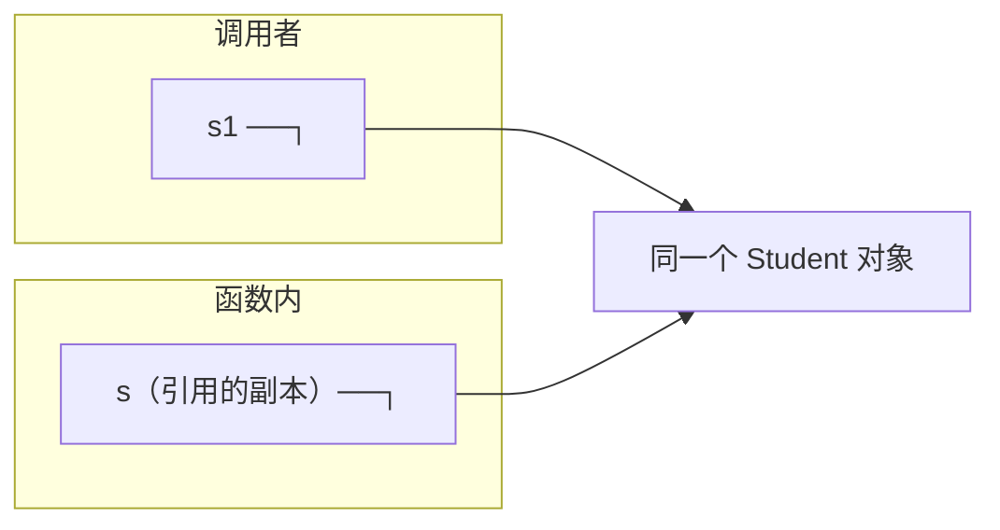

# 第 35 章 · 引用

**简体中文** ｜ [English](./35-references.en-US.md)

---

> 第 34 章的指针威力全开也事故全开。C++ 给了它一个驯化版：**引用（`int&`）——变量的别名**。实测它别名到什么程度：`&r == &x`，取引用的地址得到的就是原变量的地址——引用没有自己的身份。可汇编一看更彻底：`by_ref(int&)` 与 `by_ptr(int*)` 编译出**一字不差的机器码**（实测 `mov w8, #99; str w8, [x0]; ret`）——**引用的底层真身就是指针**，区别全在编译期的纪律：必须初始化、不能重绑定、不能为空、没有算术。
>
> 但"引用"这个词在五门语言里指的不是一件事，本章用一个**swap 测试**把它们全部量出来：写一个 `swap(a, b)`，谁能真正交换调用者的两个变量？实测结果——C++ 的 `int&` 成功；Java、Python、JS **全线失败**（连传对象都失败：因为**引用本身是按值传递的**）；C# 的 `ref` 成功——它是托管语言里唯一保留"真按引用传递"的。这一个测试拆穿了最流行的术语误会："Java 是按引用传递"——不，它是**按值传递引用**，改内容穿透、换指向不穿透（实测两条都验了）。
>
> 更大的图景是**值语义与引用语义**的分水岭：赋值和传参时，到底复制什么？C++ 默认复制整个对象（实测按值传参触发一次拷贝构造，`const T&` 零拷贝）；Java/Python/JS 默认复制引用（对象永远共享）；C# 让你两层选择（类型层 `struct`/`class`、传参层 `ref`/`out`/`in`，实测四种行为俱全）。连 SQL 都有同款分水岭：**VIEW 是查询的别名**（实测原表变、视图跟着变，DROP 原表后视图悬垂报错），**`CREATE TABLE AS` 是快照**（实测纹丝不动）。

## 1. 学习目标

本章结束后，你将能够：

- 说清 C++ 引用的**别名本质**（实测 `&r == &x`）与**底层真身**（实测与指针同汇编），以及四条纪律换来的安全；
- 用**swap 测试**判定任何语言的传参语义，并解释 Java/Python/JS 为什么"传对象也换不成"——**按值传递引用**；
- 区分**改内容与换指向**两种操作的穿透性（五语言实测），从此不再掉进"到底是不是引用传递"的术语泥潭；
- 熟练选择 C++ 传参四件套（`T` / `T&` / `const T&` / `T*`，实测拷贝账单 1/0/0/0）与 C# 三件套（`ref`/`out`/`in`）；
- 画出**值语义 vs 引用语义**的五语言地图，并识别它的 SQL 对应物（VIEW vs 快照，双实测）。

---

## 2. 为什么会出现这个概念

### 指针太危险，拷贝太昂贵

第 34 章末尾留下一个两难：

```text
函数想操作调用者的大对象——
  按值传？   整个对象复制一遍（实测触发拷贝构造）——大对象白付一次全量拷贝
  传指针？   高效，但换来判空义务 + 三大事故的入场券（第 34 章）
```

### 引用：受纪律约束的指针

C++ 的答案是给指针立四条规矩，换一个新名字：

| 纪律 | 消灭的事故 |
|------|-----------|
| 声明必须初始化 | 野引用不存在（对比野指针） |
| 终身不能重绑定 | "指着指着换了目标"的意外不存在 |
| 不能为空 | 判空义务消失——收到引用就是收到活对象 |
| 没有算术 | 不可能越界走到邻居 |

```cpp
void raise(Student& s) { s.score += 10; }   // 收到的就是本体——高效、必非空、改不了指向
```

> **一句话**：引用 = 上了四道锁的指针——能力砍到"访问本体"这一件事，三大事故随锁而去。但"引用"这个词被五门语言各自征用、含义悬殊——本章的 swap 测试就是照妖镜。

---

## 3. 底层原理

### 实测一：别名到没有自己的身份

```cpp
int x = 42;
int& r = x;      // r 是 x 的别名
r = 99;          // x 变成 99
```

```text
&x = 0x16d3aa098
&r = 0x16d3aa098   ← 取 r 的地址，得到的就是 x 的地址
```

`r` 不是"指向 x 的东西"，它在语言层面上**就是 x**——连 `r = y` 都不是改指向，而是把 `y` 的值赋给 `x`（实测 `x` 变 7、`&r == &x` 依然为 true）。

### 实测二：底层真身就是指针

```cpp
void by_ref(int& r) { r = 99; }
void by_ptr(int* p) { *p = 99; }
```

`-O2` 汇编（**实测**，一字不差）：

```text
by_ref:  mov w8, #99        by_ptr:  mov w8, #99
         str w8, [x0]                str w8, [x0]
         ret                         ret
```

**两个函数编译产物完全相同**——都是"往 x0 寄存器里的地址写 99"。引用与指针的全部区别都活在编译期：语法糖（不用写 `*`）+ 四条纪律（编译器替你验）。运行期，它就是个地址。

### 钥匙实验：swap 测试

判定一门语言传参语义的最短程序：

```text
写 swap(a, b)，问：调用后，调用者的 a、b 换了吗？
```

**五语言实测结果**：

| 语言 | 写法 | 结果 | 原因 |
|------|------|------|------|
| C++ | `swap(int& a, int& b)` | ✅ **换成了** | 真按引用传递——参数就是实参的别名 |
| C# | `SwapRef(ref x, ref y)` | ✅ **换成了** | `ref` = C++ 的 `&`（托管语言独一份） |
| Java | `swap(int, int)` / `swap(Student, Student)` | ❌ 都没换成 | 值与**引用都按值传** |
| Python | `swap(a, b)` | ❌ 没换成 | 重绑定参数名不出函数 |
| JavaScript | `swap(a, b)` | ❌ 没换成 | 同上（解构 `[x,y]=[y,x]` 是语言层补偿） |

### 术语正音：按值传递引用

Java/Python/JS 的行为常被误称"按引用传递"。实测拆穿：

```text
传 Student 对象进函数——
  s.score = 100   → 外面变了（实测穿透）    ← 副本引用与原引用指向同一对象
  s = new ...     → 外面没变（实测不穿透）  ← 你换的是副本引用的指向
```



**判据一句话**：真按引用传递 = 函数能换掉调用者变量本身（swap 成功）；按值传递引用 = 只能通过共享对象改内容（swap 失败、mutate 穿透）。

### 大图景：值语义 vs 引用语义

赋值（`b = a`）和传参时到底复制什么，是语言设计的分水岭：

| | 值语义 | 引用语义 |
|---|--------|---------|
| 复制什么 | **整个对象** | **引用**（8 字节） |
| 之后的关系 | 各是各的 | 共享同一对象 |
| 默认代表 | C++（一切类型）、C#/Java 的原始类型与 struct | Java/Python/JS 的对象、C# 的 class |
| 副作用风险 | 无（隔离） | 有（一处改、处处见——第 34 章 Python/JS 实测） |
| 成本 | 拷贝成本（实测拷贝构造 1 次） | 共享成本（GC 压力、意外别名） |

---

## 4. JavaScript

JS 是纯引用语义（对象层面）+ 一个语言级的 swap 补偿。

### swap 测试：传参失败，解构成功（实测）

```javascript
function swap(a, b) { [a, b] = [b, a]; }   // 只换了参数名
swap(x, y);        // x = 1, y = 2 —— 没换成
[x, y] = [y, x];   // x = 2, y = 1 —— 语言替你换
```

JS 没有 `ref`，但**解构赋值**在调用者作用域里直接完成交换——问题被语法消解而不是被传参机制解决。

### 改内容穿透，重绑定不穿透（实测）

```text
mutate(stu)（obj.score = 100） → 穿透
rebind(stu)（obj = {...}）     → 不穿透
```

### `const` 锁的是引用，不是内容（实测）

```text
const stu 改字段: score = 61     ← 合法！引用没变
const stu 重绑定 → TypeError    ← 这才是 const 禁止的
```

第 6 章 `const` 的精确含义在引用语义下才完整：**const 绑定的是"名字→引用"这一层**。真要锁内容用 `Object.freeze`（第 21 章实测过）。

### 拷贝的三个层次（实测）

```javascript
const shared = src;                 // 共享：同一对象
const shallow = { ...src };         // 浅拷贝：第一层新建，嵌套仍共享
const deep = structuredClone(src);  // 深拷贝：全新
```

```text
浅拷贝改 tags 后，src.tags = [A,B,C]   ← 第二层仍共享！
深拷贝改 tags 后，src.tags 不变        ← 深拷贝才真隔离
```

**引用语义的语言里"拷贝"永远要问一句：拷到第几层？**——浅拷贝共享嵌套对象是 JS 状态管理 bug 的高产区（React 的不可变更新惯例正是为此）。

> **注意事项**：`structuredClone` 是现代标准深拷贝（取代 `JSON.parse(JSON.stringify(...))`——后者丢函数、丢 `undefined`、丢循环引用）；但它也拷不了函数与 DOM 节点。

---

## 5. Python

Python 官方管传参叫 **pass by assignment**（按赋值传递）——参数名被"赋值"为实参的引用。

### swap 测试：失败（实测）

```text
swap(x, y) 之后: x = 1, y = 2   ← 重绑定不出函数
出路：x, y = y, x               ← 元组解包，与 JS 解构同理
```

### 改内容穿透，重绑定不穿透（实测）

```text
mutate(nums)（lst.append(99)）→ 穿透
rebind(nums)（lst = [0]）     → 不穿透
```

### 一字之差的陷阱：`+=` vs `= +`（实测）

```python
def augmented(lst): lst += [7]       # __iadd__：原地修改——穿透！
def plain_add(lst): lst = lst + [8]  # __add__：新建对象——不穿透
```

```text
函数内 lst += [7]:    a = [1, 2, 3, 7]   ← 外面变了
函数内 lst = lst+[8]: b = [1, 2, 3]      ← 外面没变
```

**`+=` 对可变对象是原地操作、对不可变对象是重绑定**——同一个运算符在引用语义下两种命运，是 Python 最隐蔽的坑之一（第 9 章运算符重载的注脚）。

### 不可变对象让引用语义"看起来像"值语义（实测）

```text
t = s 后 t = t.upper()：s 仍是 'hello'
```

不是拷贝了字符串——是**不可变对象根本没有"被改"这条路**（第 21 章），所以共享也无害。这解释了一个常见困惑："Python 传 int/str 像值传递、传 list/dict 像引用传递"——机制只有一种（传引用的副本），**差异全在对象可不可变**。

> **注意事项**：拷贝层次与 JS 同款三层——`b = a`（共享）、`a.copy()`/`a[:]`（浅）、`copy.deepcopy(a)`（深）；嵌套结构默认浅拷贝的坑一模一样。

---

## 6. Java

Java 的立场写进了规范：**一切皆按值传递**——原始类型传值的副本，对象传引用的副本。

### swap 测试：全线失败（实测）

```text
swapInt(x, y):        x = 1, y = 2   ← int 按值拷贝
swapStudent(s1, s2):  s1 = 小明, s2 = 小红   ← 对象也没换成！
```

**连传对象都换不成**是最有教学价值的一击：函数里 `a = b` 交换的是两个**引用副本**，调用者的 `s1`/`s2` 纹丝不动。"Java 是按引用传递"的说法到此为止。

### 但内容修改穿透（实测）

```text
mutate(s1)（s.score = 100）→ 穿透（副本引用指向同一对象）
rebind(s1)（s = new ...） → 不穿透
```

### 二元世界（实测）

```text
int:     q = p 后改 q，p 不变（值语义）
Student: u = s2 后改 u.score，s2 同变（引用语义）
```

原始类型与对象的双轨制（第 24 章装箱的根源）在传参语义上再次现身——`Integer` 等包装类型因为不可变，行为上又"像"值（与 Python 字符串同理）。

### swap 的出路（实测）

```text
装进数组交换: pair = [2, 1]   ← 数组是对象，内容修改合法穿透
```

没有 `ref` 的语言想"传出多个值"只有两条路：**返回新值**（record 多值返回）或**包一层可变容器**——Java 生态的 `AtomicInteger`、`int[]` 惯用法都是后者。

> **注意事项**：`final` 参数只禁止重绑定参数名，不阻止修改对象内容——与 JS 的 `const` 同款语义（锁名字不锁对象）；方法内重绑定参数本就是坏味道，`final` 与否行为无差。

---

## 7. C++

C++ 是唯一有"真引用"的主流语言——本章第 3 节两组实测（别名地址、同汇编）都来自它。本节交付工程决策表。

### 传参四件套的拷贝账单（实测）

```text
按值   by_value(stu):       拷贝 1 次，改不到本体（副本）
引用   by_ref(stu):         拷贝 0 次，改的就是本体
const& by_const_ref(stu):   拷贝 0 次，只读
指针   by_pointer(&stu):    拷贝 0 次，可空、要判
```

**决策表**（函数参数怎么选）：

| 意图 | 写法 | 理由 |
|------|------|------|
| 只读小对象（int、指针大小） | `T` | 拷贝比间接还便宜 |
| 只读大对象 | `const T&` | 零拷贝 + 不可改（实测 0 次） |
| 要修改调用者的对象 | `T&` | 非空保证 + 意图明确 |
| 对象可能不存在 | `T*` | 可空性进签名（第 34 章口诀） |
| 要拿走对象（转移所有权） | `T&&` / 按值 + move | 移动语义——第 38 章展开 |

### 按值传参 = 一次拷贝构造（实测）

```cpp
Student(const Student& other) : name(other.name), score(other.score) { ++copies; }
```

第 23 章讲了构造与析构，这里补上家族第三员：**拷贝构造函数**——按值传参、按值返回、放入容器时被调用。实测 `by_value(stu)` 恰好触发 1 次。它的存在就是值语义的运行时成本，也是 `const T&` 惯用法的全部理由。

### 引用的独有事故：悬垂引用

```cpp
int& dangling() {
    int local = 42;
    return local;        // ⚠️ 返回局部变量的引用——帧弹出即悬垂（第 32 章同款）
}
```

四条纪律防住了空与野，**防不住悬垂**——引用不延长所指对象的生命（对比第 38 章 `shared_ptr` 会延长）。编译器对这种直白写法会警告，但绕个弯（返回成员引用、lambda 捕获引用）就查不出来了。

> **注意事项**：成员变量存引用（`T&` 成员）会让类不可赋值且暗藏悬垂——想存"可重绑定的引用"用 `std::reference_wrapper` 或指针；范围 for 循环记得 `for (auto& x : v)`——漏了 `&` 每个元素白拷一次（本章拷贝账单的日常版）。

---

## 8. C#

C# 把选择权做成**两层**：类型层（`struct`/`class`，第 31 章）+ 传参层（`ref`/`out`/`in`）——托管语言里最完整的语义控制面板。

### swap 测试：`ref` 成功（实测）

```csharp
SwapPlain(x, y);          // x = 1, y = 2 —— 没换成
SwapRef(ref x, ref y);    // x = 2, y = 1 —— 成功！
```

**`ref` 就是 C++ 的 `&`**——而且调用处也必须写 `ref`：意图双向确认，看代码就知道"这个调用可能改我的变量"（C++ 的 `f(x)` 看不出传的是不是引用，这是 C# 的改进）。

### 三件套（实测）

| 关键字 | 语义 | 实测 |
|--------|------|------|
| `ref` | 可读写的真引用 | swap 成功 |
| `out` | 必写的引用——多返回值语法 | `Divide(17, 5, out quo, out rem)` → 3, 2 |
| `in` | 只读引用——大 `struct` 免拷贝 | `SumIn(in ss)` 不拷贝不许改 |

`out` 把"传出参数"从惯用法升格为语法（编译器验证必赋值）；`in` 是 C++ `const T&` 的对应物。

### 两层选择的组合矩阵（实测四种行为）

```text
class  按值传:      穿透     ← 复制的是引用（Java 同款）
struct 按值传:      不穿透   ← 复制的是整个值（C++ 按值同款）
struct 加 ref 传:   穿透     ← 真引用（C++ T& 同款）
in 只读引用:        不拷贝不许改（C++ const T& 同款）
```

**一张矩阵集齐了 C++ 与 Java 的所有行为**——这就是"C# 让你二选一"的完整含义：别的语言选好了默认，C# 把两层开关都交给你。

> **注意事项**：`ref` 返回与 `ref` 局部变量（`ref int r = ref arr[0]`）把引用能力扩展到返回值——高性能代码用它做"零拷贝取元素"；`record struct`/`readonly struct` 与 `in` 搭配才不会因防御性拷贝反而变慢。

---

## 9. SQL

SQL 的值/引用分水岭是**视图与快照**——同一个 `SELECT`，两种保存方式，两种命运。

### 双实测：别名 vs 快照

```sql
CREATE VIEW top_students AS SELECT ... WHERE score >= 80;         -- 引用：存的是查询
CREATE TABLE snapshot_students AS SELECT ... WHERE score >= 80;   -- 值：存的是数据
```

原表插入两人、一人跌出分数线之后：

```text
VIEW 现在: 3 行（小刚小强进来、小红出去——实时反映原表）
快照现在: 2 行（纹丝不动——那一刻的拷贝）
```

### 对照表：与运行时语义严丝合缝

| | VIEW（引用语义） | CREATE TABLE AS（值语义） |
|---|-----------------|--------------------------|
| 存储 | 零——只存查询文本 | 全量数据 |
| 新鲜度 | 永远最新（每次查询重新执行） | 凝固在创建时刻 |
| 原表删除后 | **悬垂**（实测：`Error: no such table`） | 无影响——早已独立 |
| 对应概念 | C++ 引用 / Java 对象赋值 | C++ 按值拷贝 / 深拷贝 |

### 视图悬垂（shell 实测）

```sql
CREATE VIEW v AS SELECT * FROM t;
DROP TABLE t;
SELECT * FROM v;
-- Error: in prepare, no such table: main.t
```

**引用语义的悬垂问题在数据库原样重演**——视图不持有数据，原表没了它就是悬垂引用。对比第 34 章外键的"系统级防悬垂"：SQLite 对视图没有同等保护（可以 DROP 被引用的表），报错推迟到使用时——像极了 C++ 的悬垂引用"用到才炸"。

> **工程提醒**：物化视图（PostgreSQL 的 `MATERIALIZED VIEW`）是两者的杂交——像快照一样存数据、像视图一样可 `REFRESH`：本质是"手动同步的缓存"，值/引用之外的第三种选择（与 C++ 的 `shared_ptr` 缓存类似，一致性由你负责）。

---

## 10. 五语言横向对比

### ① 传参语义对比

| 特性 | JavaScript | Python | Java | C++ | C# |
|------|-----------|--------|------|-----|-----|
| 默认传参 | 按值传引用 | 按值传引用（pass by assignment） | **一切按值**（引用也按值） | **按值拷贝对象**（实测 1 次拷贝构造） | struct 值 / class 引用 |
| 真按引用传递 | ❌ | ❌ | ❌ | ✅ `T&`（实测 swap 成功） | ✅ `ref`（实测成功，调用处显式） |
| 只读引用 | ❌ | ❌ | ❌ | `const T&`（实测 0 拷贝） | `in` |
| 多返回值 | 数组/对象解构 | 元组 | record / 容器 | 结构化绑定 / 出参 | **`out`**（语法级） |
| swap 能否写成 | ❌（解构补偿，实测） | ❌（解包补偿，实测） | ❌（实测双败） | ✅（实测） | ✅（实测） |

### ② 钥匙实测：swap 测试总表

```text
swap(a, b) 能换掉调用者的变量吗？

C++  int&        ✅ 成功    —— 参数就是实参的别名（实测 &r == &x）
C#   ref         ✅ 成功    —— 托管世界唯一的真引用传递
Java 值/对象     ❌ 双败    —— 引用本身按值传（实测连 Student 都换不成）
Python           ❌ 失败    —— 重绑定不出函数（补偿：x, y = y, x）
JavaScript       ❌ 失败    —— 同上（补偿：解构赋值）
```

**一个测试量出三个世界**：真引用（C++/C# ref）、按值传引用（Java/Python/JS）、以及后者的语言级补偿（解构/解包——问题不解决，而是消解）。

### ③ 两条设计分歧

**分歧一：默认复制什么**

```text
复制对象（C++）：       隔离是默认，共享要显式（&）——副作用可控，拷贝要付费（实测 1 次拷贝构造）
复制引用（Java/Py/JS）：共享是默认，隔离要显式（深拷贝）——零拷贝，副作用满天飞（实测浅拷贝陷阱）
两层开关（C#）：        struct/class + ref/in/out——矩阵实测集齐两个世界的所有行为
```

**分歧二：要不要"真按引用传递"**

```text
给（C++ 隐式 / C# 显式）：swap 可写、出参可用——C# 要求调用处也写 ref，意图双向可见
不给（Java/Python/JS）：  函数永远不能换掉你的变量——换来"调用无惊喜"，代价是多返回值只能绕路
                          （返回新值 / 容器包装 / 语言级解构补偿）
```

### ④ 共同点与差异根源

**共同点**：五门语言"改共享对象内容"全部穿透（实测五连）；"重绑定参数名"全部不穿透（实测五连）——**这两条是跨语言不变式**，掌握它们就掌握了任何语言的传参行为。

**差异根源**：

- **C++ 面向零开销**：值语义默认（栈上、可内联、无 GC），引用是给"要共享"开的口子——连引用都编译成裸指针（实测同汇编）；
- **Java 面向简单**："一切按值"一条规则讲完，代价是 swap/出参永久缺席；
- **Python/JS 面向动态**：一切皆对象 + 名字绑定，传参自然是"赋值"；
- **C# 面向控制**：两层显式开关，把 C++ 的能力用托管的纪律重新发行；
- **SQL 的视图/快照**证明这不是内存管理的私有问题——**"存计算还是存结果"是所有数据系统的分水岭**。

---

## 11. 底层实现对比

| 运行时 | "引用"的真身 | 关键细节 |
|--------|-------------|---------|
| **V8**（JavaScript） | tagged pointer（第 34 章） | 参数槽里复制的就是这个 tagged 值——传参 = 复制一个字 |
| **CPython** | `PyObject*` + 引用计数 | 传参把指针写进新帧的局部变量表，引用计数 +1——"按赋值传递"的物理形态 |
| **JVM**（Java） | 压缩 OOP（第 34 章） | 参数槽复制 4/8 字节引用——`swapStudent` 交换的正是这两个槽（实测不穿透的原因） |
| **C++**（原生） | 引用 = 指针（实测同汇编） | `T&` 参数占一个指针寄存器（x0）；`const T&` 绑定临时量时编译器自动落栈取地址 |
| **CLR**（C#） | 托管引用 + `ref` 的 byref 指针 | `ref` 参数是受 GC 追踪的"内部指针"（可指向栈、堆对象内部、数组元素）——比 C++ 引用更受管制 |

**一个值得记住的分野**：

```text
五门语言的参数传递物理上全是「复制一个机器字」：
  C++ 按值传大对象是唯一例外（真复制整个对象——实测拷贝构造）
  其余一切——引用、指针、tagged 值——都是复制 8 字节
所以「传引用更快」的真正含义是：避免了那次对象拷贝，传递本身谁都一样快
```

---

## 12. 性能分析

### 拷贝账单（实测汇总）

| 传法 | 拷贝次数（实测） | 适用 |
|------|----------------|------|
| C++ 按值 | 1 次拷贝构造/调用 | 小对象（≤16 字节）反而最快 |
| C++ `const T&` / C# `in` | 0 | 只读大对象标准姿势 |
| Java/Python/JS 对象传参 | 0（复制 8 字节引用） | 默认即高效——代价在共享副作用 |
| C# struct 按值 | 整个 struct 复制（第 32 章实测 Mutate 副本） | >16 字节考虑 `in` |

### 值语义的隐藏收益

```text
拷贝有价，但换来：
  无别名 → 编译器激进优化（不用担心谁在背后改）
  无共享 → 天然线程安全（第 45 章的伏笔）
  栈上布局 → 第 31 章实测的 7 倍密度与缓存友好
现代 C++ 的立场：小对象大方拷贝，大对象 const& / move——不要为省一次拷贝引入别名
```

### 引用语义的隐藏成本

```text
零拷贝，但换来：
  别名分析悲观 → JIT/编译器不敢优化（谁都可能改这对象）
  逃逸与 GC 压力 → 第 33 章的分配账单
  防御性拷贝 → Java/JS 库为防外部修改到处 copy——引用语义逼出来的值语义补丁（第 25 章封装实测）
```

> ⚠️ 惯例提醒：`for (auto x : v)` 与 `for (auto& x : v)` 一字之差，每元素一次拷贝构造——本章的拷贝账单在循环里乘以 N。范围 for 默认写 `auto&`/`const auto&`，是 C++ 最便宜的性能习惯。

---

## 13. 工程实践

| 场景 | ✅ 推荐 | ❌ 不推荐 | 原因 |
|------|--------|----------|------|
| C++ 只读大对象参数 | `const T&` | 按值 | 实测 0 拷贝 vs 1 拷贝 |
| C++ 小对象（int/指针大小） | 按值 | `const T&` | 拷贝比间接便宜，还没有别名 |
| C++ 范围 for | `for (const auto& x : v)` | `for (auto x : v)` | 少 N 次拷贝构造 |
| C# 大 struct 只读传参 | `in` + `readonly struct` | 裸按值 | 免拷贝且防防御性拷贝 |
| C# 多返回值 | 元组 / `out` | ref 参数当返回用 | 意图更清晰 |
| Java/JS/Python 防外部修改 | 返回不可变视图/拷贝（第 25 章） | 直接暴露内部集合 | 引用语义下暴露即失控 |
| JS/Python 状态更新 | 不可变更新（新对象替换） | 原地改共享对象 | 浅拷贝陷阱实测；框架（React）依赖引用比较 |
| 传出修改意图 | C# `ref`（调用处可见）/ C++ `T&` + 命名表意 | 靠文档说明 | swap 实测：语义差异必须显式 |
| SQL 派生数据 | 默认 VIEW；性能瓶颈才物化 | 随手 CREATE TABLE AS | 快照会悄悄过期（实测纹丝不动） |

### 判断口诀

```text
函数要改调用者的东西吗？
  不改 → const&（C++）/ in（C#）/ 随便传（引用语义语言天然只读不了……所以要防御）
  要改内容 → T&（C++）/ ref（C#）/ 传对象改字段（Java/Py/JS——注意这是共享）
  要换整个值 → 返回新值（全语言通用、最无歧义的方案）
```

---

## 14. 最佳实践

- **swap 测试当语义探针**：接手新语言先写 swap——三分钟量出它的传参语义（本章五语言实测模板）。
- **两条跨语言不变式打底**：改内容穿透、重绑定不穿透（五语言实测）——所有"这语言怎么传参"的困惑先套这两条。
- **C++ 参数决策表背下来**：小对象按值、只读大对象 `const T&`、要改 `T&`、可空 `T*`——四选一没有第五种日常。
- **别名要显式**：C# 的调用处 `ref` 是好设计——C++ 里用指针传参（`f(&x)`）比引用更能提醒读者"会被改"，团队可约定。
- **引用语义语言默认不可变更新**：新对象替换旧对象（spread / dataclass replace / record with）——把值语义的隔离找回来。
- **深浅拷贝先问层数**：`{...obj}` / `.copy()` 只保第一层（实测陷阱）——嵌套结构要深拷贝或不可变化。
- **返回新值优先于出参**：多返回值用元组/record/解构——比 `ref`/`out`/容器包装都清晰（唯一例外：C# 的 `TryParse` 模式）。
- **数据库派生数据默认视图**：零存储、永远新鲜（实测）；物化是性能手段不是默认——并给刷新策略留文档。

---

## 15. 常见坑

**坑 1 · 以为 Java/Python/JS 是"按引用传递"**

```text
实测：swapStudent(s1, s2) 没换成——引用本身按值传
```

**如何避免**：背判据——swap 能成才是按引用传递；这三门语言只能"通过共享对象改内容"。

**坑 2 · C++ 范围 for 忘写 `&`**

```cpp
for (auto s : students) { ... }    // 每个元素拷贝构造一次（实测账单 ×N）
```

**如何避免**：默认 `const auto&`；要改元素 `auto&`；明确要副本才裸 `auto`。

**坑 3 · Python 的 `+=` 在函数内穿透**

```text
实测：lst += [7] 外面变了；lst = lst + [8] 外面没变
```

**如何避免**：函数内不要对参数用增强赋值——想改就明说（`lst.extend`），想新建就 `= +`；两者语义不同不是风格问题。

**坑 4 · 浅拷贝当深拷贝用**

```text
实测：{ ...src } 之后改 tags，src.tags 跟着变——第二层仍共享
```

**如何避免**：嵌套结构用 `structuredClone`/`copy.deepcopy`；或者干脆不可变更新，从根到改动点每层换新。

**坑 5 · C++ 返回局部变量的引用**

```cpp
int& f() { int local = 42; return local; }   // 悬垂引用——第 32 章帧弹出同款
```

**如何避免**：返回值就按值返回（RVO 让它免费）；返回引用只用于"返回成员/元素"且调用者生命期受控。

**坑 6 · JS 的 `const` 当"常量对象"用**

```text
实测：const stu 改字段合法——锁的是引用不是内容
```

**如何避免**：`const` 只保证不重绑定；内容不可变要 `Object.freeze`（浅）或不可变数据结构。

**坑 7 · 把快照当视图用**（SQL）

```text
实测：原表进两人出一人，CREATE TABLE AS 的快照纹丝不动
```

**如何避免**：派生数据要实时就用 VIEW；用了快照/物化就必须有刷新机制与"数据截至"标注——过期的快照比没有更危险。

---

## 16. 面试题

**基础**

1. C++ 引用和指针有哪四条区别？各消灭了什么事故？
2. "改对象内容"和"重绑定变量"在传参时的穿透性有什么不同？为什么？
3. `const T&` 参数解决了什么问题？什么时候按值传参反而更好？

**中级**

4. **写一个 swap 函数分别在 Java 和 C++ 里，解释为什么一个成功一个失败。**
5. Python 函数内 `lst += [1]` 和 `lst = lst + [1]` 对调用者的影响有什么不同？为什么？
6. **C# 的 `ref`、`out`、`in` 各是什么语义？为什么调用处也要写关键字？**

**高级**

7. **"Java 是按引用传递"错在哪？用"按值传递引用"模型解释 mutate 穿透而 rebind 不穿透。**
8. C++ 引用在汇编层面是什么？既然和指针同码，四条纪律是在哪一层实施的？
9. SQL 的 VIEW 和 `CREATE TABLE AS` 如何对应值/引用语义？物化视图是什么、对应运行时的什么概念？

---

## 17. 练习

**基础**

1. 在五门语言各写一次 swap 测试，验证本章总表；给 JS/Python 补上语言级解法（解构/解包）。
2. 用 C++ 拷贝计数器实测 `for (auto s : v)` 与 `for (auto& s : v)` 遍历 1000 个元素的拷贝次数差。
3. 在 Python/JS 各演示一次浅拷贝陷阱，再用深拷贝修复。

**提高**

4. **复现"引用=指针同汇编"实测**：`-S` 对比 `by_ref`/`by_ptr`，再加一个 `by_value` 看差异。
5. 用 C# 写全四格矩阵（class/struct × 按值/ref）并预测每格的穿透性，运行验证。
6. 给一个 Java 类设计"多返回值"的三种方案（record、数组、出参对象），比较可读性。

**挑战**

7. 用 C++ 实现 `swap` 的三个版本（指针版、引用版、`std::swap` 模板版），对比调用处代码的安全性与可读性。
8. 写一个 Python 装饰器 `@no_mutation`：深拷贝所有参数再调用原函数——把引用语义函数强行变成值语义，测量代价。
9. 在 SQLite 上建 VIEW 与快照各一，对原表做 1 万次更新，对比两者的查询耗时与结果新鲜度；再模拟"物化视图"（快照 + 手动 REFRESH 脚本）。

---

## 18. 本章总结

**一句话总结**：C++ 的引用是**上了四道锁的指针**——语言层是别名（实测 `&r == &x`）、汇编层与指针一字不差（实测同码），纪律全在编译期；而"传参到底传什么"用 **swap 测试**一量便知：C++ `T&` 与 C# `ref` 能真正交换调用者的变量，Java/Python/JS 全线失败——它们是**按值传递引用**（改内容穿透、换指向不穿透，五语言实测两条不变式）；更大的分水岭是值语义（C++ 默认拷贝，实测 1 次拷贝构造）与引用语义（Java/Python/JS 默认共享）之别，C# 用两层开关集齐全部行为（矩阵实测），SQL 的 VIEW（实测实时+悬垂）与快照（实测凝固）证明"存计算还是存结果"是超越内存的普遍分水岭。

**核心知识点**

- **引用四纪律**：必初始化、不重绑定、不为空、无算术——消灭空与野，防不住悬垂。
- **底层真身**（实测）：引用编译成指针（同汇编）——纪律全在编译期，运行期零差别。
- **swap 判据**（五实测）：能换 = 真按引用传递（C++ `&`、C# `ref`）；不能换 = 按值传引用（Java/Python/JS）。
- **两条跨语言不变式**（五实测）：改内容穿透、重绑定不穿透。
- **C++ 四件套账单**（实测）：按值 1 拷贝、`T&`/`const T&`/`T*` 零拷贝——决策表按意图四选一。
- **C# 控制面板**（实测）：类型层 struct/class × 传参层 ref/out/in——一张矩阵集齐两个世界。
- **陷阱实测**：Python `+=` 穿透而 `= +` 不穿透；浅拷贝第二层共享；JS `const` 锁引用不锁内容。
- **SQL 对应**（双实测）：VIEW=引用（实时、零存储、可悬垂）；CREATE TABLE AS=值（凝固、占存储、独立）。

**检查清单**

- [ ] 我能写出并解释五门语言的 swap 测试结果。
- [ ] 我能用"按值传递引用"解释 mutate/rebind 的穿透差异。
- [ ] 我能按意图从 C++ 四件套 / C# 三件套里正确选型。
- [ ] 我知道引用的汇编真身，以及四条纪律在哪层实施。
- [ ] 我能识别浅拷贝陷阱与 `+=` 陷阱，并说出修法。

**下一章预告**：引用语义的世界里对象被到处共享——那么谁来决定一个对象**什么时候死**？第 33 章见过 GC 的账单（38 次回收）、第 34 章见过它的铁律（掌握全部引用），现在正面拆解**垃圾回收**本身：引用计数为什么数不清循环引用（Python 的双引擎）、可达性分析从哪些根出发、标记-清除/复制/分代三大算法各付什么代价、STW 停顿为什么无法根除只能摊薄——以及五门语言的回收器实测对比：CPython 的 `gc` 模块、V8 的 Scavenger、JVM 的 G1、CLR 的三代堆，和 C++ 的"没有回收器"如何靠下两章（RAII、智能指针）活得很好。

---

## 19. 延伸阅读

- <a href="https://en.wikipedia.org/wiki/Reference_(computer_science)" target="_blank" rel="noopener">Wikipedia：Reference</a> — 引用概念的跨语言综述。
- <a href="https://en.wikipedia.org/wiki/Evaluation_strategy" target="_blank" rel="noopener">Wikipedia：Evaluation strategy</a> — 按值/按引用/按共享传递的标准术语（call by sharing 即本章"按值传递引用"）。
- <a href="https://en.cppreference.com/w/cpp/language/reference" target="_blank" rel="noopener">cppreference · Reference declaration</a> — C++ 引用的权威参考。
- <a href="https://isocpp.github.io/CppCoreGuidelines/CppCoreGuidelines#S-functions" target="_blank" rel="noopener">C++ Core Guidelines · Functions</a> — 参数传递选型（F.15–F.21）的官方指南。
- <a href="https://learn.microsoft.com/en-us/dotnet/csharp/language-reference/keywords/method-parameters" target="_blank" rel="noopener">Microsoft Learn · Method parameters</a> — C# ref/out/in 的官方文档。
- <a href="https://docs.python.org/3/faq/programming.html#how-do-i-write-a-function-with-output-parameters-call-by-reference" target="_blank" rel="noopener">Python FAQ · 输出参数与传参语义</a> — 官方对 pass by assignment 的解释。
- <a href="https://developer.mozilla.org/en-US/docs/Web/API/Window/structuredClone" target="_blank" rel="noopener">MDN · structuredClone</a> — JS 标准深拷贝的官方文档。
- <a href="https://docs.oracle.com/javase/tutorial/java/javaOO/arguments.html" target="_blank" rel="noopener">Java Tutorials · Passing Information to a Method</a> — Java 传参语义的官方教程。
- <a href="https://www.sqlite.org/lang_createview.html" target="_blank" rel="noopener">SQLite 文档 · CREATE VIEW</a> — 视图语义的官方说明。
