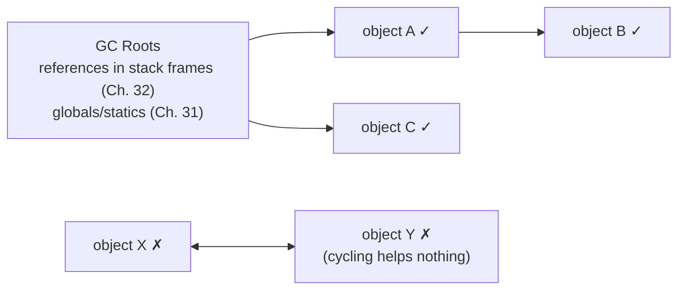

# Chapter 36 · Garbage Collection

[简体中文](./36-garbage-collection.md) ｜ **English**

---

> Debts from earlier chapters settle here: Chapter 33 saw the GC's invoice (ten million temporaries = 38 collections), Chapter 34 its iron law (track every reference or you cannot move objects), and Chapter 35 left the final question — **objects are shared everywhere, so who decides when one dies?**
>
> Automatic collection has two great schools, and this chapter measures their divide to the bottom with one **cyclic-reference test**: two objects pointing at each other (`x.partner = y; y.partner = x`), external references severed — **Python falls silent** (`__del__` never fires: each count stuck at 1 in the other's hands), until `gc.collect()` steps in and reaps 11 objects; **Java and C# don't care at all** (measured: weak references go null/False in unison) — reachability analysis marks from the roots, and however tightly a cycle embraces itself, unreachable is garbage. **Refcounting can't count cycles; tracing collectors don't fear them** — one experiment, both schools explained.
>
> The generational hypothesis (most objects die young) is measured throughout: C#'s object is **watched aging in real time** (gen0 → 1 → 2 → capped); five million temporaries disturb only the gen0 collector — 650 runs, with gen1/gen2 untouched; Java's G1 shows the same division of labor (Young +5 runs in 1 ms, Old motionless). And SQLite offers the most tangible version of pause amortization: `incremental_vacuum(100)` returns just 100 pages per call (measured 720 → 620 → 520), while the full sweep goes to the end in one stroke (→ 3 pages) — **incremental collection is one long pause split into many short ones**.
>
> At the other end stands C++: **no collector, and no uncertainty either** — destructors measured firing in strict reverse scope order, and the `delete` line *is* the death date. That determinism is the entire capital of the next two chapters (RAII, smart pointers).

## 1. Learning Objectives

By the end of this chapter, you will be able to:

- State the problem GC solves (**when is collection safe** = after the object can never be used again) and the two schools of judgment: **refcounting vs reachability tracing**;
- Demonstrate the schools' divide with the **cyclic-reference test**: Python's silent `__del__` (measured) vs Java/C#'s doubly-cleared weak references (measured);
- Explain the three collection algorithms (mark-sweep / copying / mark-compact) and how the **generational hypothesis** composes them (measured: gen0 650 runs vs gen2 zero);
- Understand why **stop-the-world pauses** can only be amortized, never abolished (generational / incremental / concurrent — with SQLite's `incremental_vacuum` as the measured analogue);
- Compare the five languages' collectors (CPython's dual engine / V8 / G1 / CLR's three generations / C++'s none), with each one's observation tools and tuning entry points.

---

## 2. Why This Concept Exists

### The manual-freeing dilemma

Chapter 33 measured both accidents of the manual world:

```text
forget delete   → leak (caught red-handed by the leaks tool)
delete too soon → dangling pointer (Chapter 32's "still works for now" time bomb)
```

Reference semantics (Chapter 35) makes it harder: **objects are shared everywhere, and nobody knows whether they are the last user** — can module A delete? Module B might still hold a reference.

### The core question of automatic collection

```text
When may an object be safely reclaimed?
Answer: when it can never be used again.
But how is "never again" decided? Two schools:

School one (refcounting):   count — track how many references point at me; zero means dead
School two (reachability):  search — start from the "roots" (stack, globals); whatever can't be reached is dead
```

> **In one sentence**: GC turns "when to free" from every programmer's daily judgment into the runtime's single algorithm — at the price of losing control over timing (measured: weak references only clear after a GC has run) and Chapter 33's collection invoice. This chapter examines both schools, the three algorithms, and their pause costs.

---

## 3. How It Works

### School one: refcounting — counting

```text
Every object carries a counter (Chapters 24/34 read it in CPython's object header)
+1: assignment, argument passing, container insertion
-1: del, scope exit, overwrite
zero → immediate reclamation (measured: __del__ prints on the very del line)
```

Strengths: **deterministic, dispersed timing** (each death handled at once, no collective pause). Weaknesses: a tax on every assignment — and the famous blind spot:

### The key experiment: the cycle

```python
x.partner = y
y.partner = x        # x ⇄ y embrace in a cycle
del x; del y         # all external references severed
```

**Python (measured)**:

```text
after del x, del y — not a single __del__ printed!
each count stuck at 1 (held by the other); neither can reach zero
gc.collect() steps in → both __del__ fire late; 11 objects reported reclaimed
```

**Java (same cycle, measured)**:

```text
after GC: wx.get() = null, wy.get() = null
```

**C# (same cycle, measured)**:

```text
wx.IsAlive = False, wy.IsAlive = False
```

**One experiment, two schools**: refcounting asks only "does anyone point at me" — inside a cycle, someone always does; reachability asks only "can the roots reach me" — however tight the embrace, unreachable is garbage.

### School two: reachability tracing — searching



Mark everything reachable from the roots; the rest is garbage. **The roots are old friends**: references in every stack frame (Chapter 32) and in the static area (Chapter 31) — which also explains Chapter 34's iron law: the runtime must know where every reference lives to perform this traversal (and to rewrite them after moving).

### Three algorithms: what to do once garbage is found

| Algorithm | Method | Cost |
|-----------|--------|------|
| **Mark-sweep** | mark the living, sweep the dead in place | fragmentation (Ch. 33's holes) |
| **Copying** | evacuate survivors to the other half-space; discard the old wholesale | half the space — but faster the fewer survive |
| **Mark-compact** | mark, then push survivors to one end | expensive moving — but kills fragmentation, enables pointer bumping (Ch. 33) |

### The generational hypothesis: an algorithm for each age

```text
Observation: most objects die young (Ch. 33's temporaries); whatever survives a few rounds tends to live long
Strategy: generations —
  young gen: small, collected often, copying algorithm (many dead → moving the living is cheap)
  old gen:   large, collected rarely, mark-sweep/compact
```

**The measured evidence chain**:

```text
C# promotion:      born gen0 → survives one GC gen1 → two GCs gen2 → capped
C# frequency:      five million temporaries → gen0 +650, gen1 +0, gen2 +0
Java G1 division:  same pressure → Young +5 runs (1 ms), Old +0
Python too:        gc.get_threshold() = (700, 10, 10) — gen 1 scanned once per 10 gen-0 scans
```

### STW: pauses can only be amortized

The object graph must not change during marking — the naive answer is **stopping the world**. The amortizers:

```text
Generational: collect only the young gen (small → short pause) — measured Young 5 runs, 1 ms total
Incremental:  split one big collection into many small steps interleaved with work
Concurrent:   mark alongside application threads (write barriers record concurrent changes — throughput is the fee)
```

**SQLite's tangible analogue (measured)**: `incremental_vacuum(100)` returns 100 pages per call (720 → 620 → 520), only the full sweep clears everything (→ 3 pages) — **incremental collection = one long pause split into N short ones**; databases and runtimes solve the same arithmetic.

---

## 4. JavaScript

V8 is fully automatic and non-forcible — you get exactly three observation windows.

### Window one: heapUsed breathing (measured)

```text
heapUsed after five rounds of 500k temporaries each: 3.7 / 4.4 / 4.1 / 4.4 / 3.7 MB
```

No growth — **the Scavenger (young-gen copying collector) removed the corpses between rounds**. The mechanism behind Chapter 33's A/B experiment: short-lived objects are naturally culled while ping-ponging between semi-spaces.

### Window two: WeakRef and a spec-level detail (shell measurement)

```javascript
const weak = new WeakRef(student);
student = null;
global.gc();                      // --expose-gc
weak.deref();                     // still the object?!
```

```text
reference severed + gc(): weak.deref() = [object Object]   <- uncollectable within the same job!
next event-loop turn + gc(): weak.deref() = undefined      <- now it's gone
```

**`deref()` carries keepDuringJob semantics**: a target deref'd in the current job is kept alive until the job ends — the spec deliberately prevents "here on one line, gone on the next" Schrödinger objects within synchronous code. Observing WeakRef requires crossing event-loop turns.

### Window three: FinalizationRegistry — obituaries without guarantees (measured)

```javascript
registry.register(student, "Ming's object");
```

In our run the obituary never arrived before process exit — **the spec explicitly guarantees neither when the callback runs nor whether it runs**. Use it for gratuitous cleanup only (evicting cache entries); no correctness logic may depend on it.

### The engineering staple: WeakMap (measured semantics)

```javascript
metadata.set(user, { lastSeen: "..." });   // tag someone else's object
user = null;                                // the key loses its last strong ref — entry auto-collectable
```

The mechanism behind Chapter 33's leak remedy: **WeakMap entries never extend their keys' lives** — the standard posture for caches, metadata, and DOM-associated data.

> **Note**: scripts cannot trigger V8's GC (`--expose-gc` is debug-only); long-running Node services observe GC via `--trace-gc` or `perf_hooks` GC entries — logs beat guesses.

---

## 5. Python

CPython runs a **dual engine**: refcounting as the workhorse (immediate, deterministic), a cycle collector as the sweeper (generational, periodic).

### The main engine: refcounting (measured)

```text
a = Student("Ming")   → count 1
b = a                 → count 2
del b                 → count 1
del a                 → count 0 — __del__ prints immediately; timing is deterministic
```

**"The del line is the death date"** — CPython's refcounting offers a determinism rare among managed languages (C++ programmers feel at home: it is nearly poor man's deterministic destruction). The price: every assignment touches a counter (part of Chapter 32's 23 ns call tax), and **counter updates must synchronize under threading — a core reason the GIL exists** (Chapter 45).

### The auxiliary engine: the cycle collector (measured)

```text
cycle after del: no __del__ — the main engine is blind
gc.collect():    11 objects reclaimed, __del__ fired late — the sweeper clears cycles by reachability
gc.get_threshold() = (700, 10, 10) — the sweeper is generational too
```

The sweeper counts nothing — it periodically runs reachability over "container objects," curing exactly the main engine's blindness. **Each engine to its trade**: 99% of objects die by count-zero (instantly); cycles wait for the generational scan (late).

### weakref: observing without detaining (measured)

```text
ref = weakref.ref(s); del s → ref() = None (__del__ printed first — zero count kills; weak refs don't count)
```

> **Note**: keep `__del__` simple — cycles containing `__del__` were uncollectable before Python 3.4 and still run in unspecified order; deterministic cleanup belongs to `with` (Chapter 37's Python RAII). Should you ever call `gc.collect()` by hand? Almost never — except right after releasing a large batch of cyclic objects under memory pressure.

---

## 6. Java

The JVM is tracing GC's grand institution — this chapter's measurement workhorse for reachability and generations.

### Reachability, measured

```text
strong ref alive + GC:  weak.get() = Ming    <- reachable from roots, kept
strong ref severed + GC: weak.get() = null   <- unreachable, collected
cycle + GC:             wx = null, wy = null <- cycles collected (the key experiment)
```

`WeakReference` is the standard GC probe: **it does not count as a root-reachable path** — an object with only weak references left is collectable.

### Generational division, measured (G1)

```text
after allocating five million temporaries:
  G1 Young Generation   +5 runs, 1 ms total   <- the young collector at work
  G1 Old Generation     +0 runs               <- the old gen untouched
```

`GarbageCollectorMXBean` exposes every collector's count and time for free — **the first data source for production monitoring** (with `-Xlog:gc`). G1's regionized design appeared in Chapter 33 (the humongous measurement); it assembles pause-target-sized collections by picking regions with the most garbage first — hence "Garbage-First."

### The four reference strengths

| Reference | Collected when | Use |
|-----------|----------------|-----|
| strong (default) | never (reachable = alive) | everything daily |
| soft `SoftReference` | under memory pressure | memory-sensitive caches |
| weak `WeakReference` | next GC (measured) | probes, WeakHashMap |
| phantom `PhantomReference` | only for post-mortem notification | finalize-replacement cleanup |

> **Note**: `System.gc()` is a suggestion (our measurements needed several calls plus sleeps to stabilize); `finalize()` is deprecated — resurrection, slow collection, no execution guarantee. Cleanup belongs to try-with-resources (Chapter 37) or `Cleaner`. Collector choice: G1 fits most services; for low latency, ZGC/Shenandoah (sub-millisecond pauses, throughput traded).

---

## 7. C++

C++'s answer is **no collection** — and what it buys is not chaos but another order: **determinism**.

### Deterministic destruction (measured)

```text
{
    Student a("Ming");    constructed: Ming
    Student b("Hong");    constructed: Hong
}                          destroyed: Hong   <- reverse construction order
                           destroyed: Ming   <- on the closing-brace line, to the letter
```

**Destruction timing and order are written into the code's structure**: scope end destroys, reverse order — no collector's mood involved. Compare the two measured timelines: Java/C#/JS's "weak references clear only after a GC has run" (nondeterministic), Python's "del is death" (deterministic, cycles excepted).

### Manual heap objects: determinism is your duty (measured)

```text
Student* p = new Student("Gang");
delete p;                  <- the line where you wrote delete is its death date
```

Freedom and duty together — omit it and you have Chapter 33's `leaks` catch; do it twice and you have Chapter 34's corrupted ledger.

### How a GC-less world lives

```text
① deterministic destruction + scope = RAII (Ch. 37): resources ride objects; scope collects
② refcounting on demand = shared_ptr (Ch. 38): CPython's main engine, shipped as a library
③ cycles persist: shared_ptr rings leak the same way — weak_ptr breaks them (Ch. 38)
```

**C++ did not escape GC's problems; it moved the solutions from the runtime into the type system** — that sentence is the roadmap for the next two chapters.

> **Note**: optional GC libraries exist (Boehm GC), as do arenas (free a whole block at once — game frame allocators) — "no GC" is a default, not a dogma; but mainstream practice is RAII + smart pointers, covering 99% of cases.

---

## 8. C#

The CLR's three-generation heap is the textbook build of the generational hypothesis — home of this chapter's "watch it age" measurement.

### Promotion, measured

```text
born:               gen 0
survives one GC:    gen 1
survives two GCs:   gen 2
survives three:     gen 2   <- capped (gen2 = old generation)
```

**`GC.GetGeneration` turns object aging into printable fact** — survive a collection, gain a generation, cap at gen2. Chapter 33's LOH giants are "born gen2" (measured 86 KB → gen2); the two measurements meet here.

### The frequency gradient, measured

```text
after five million temporaries:
  gen0 +650 runs   <- the nursery works hardest
  gen1 +0
  gen2 +0          <- the old gen barely moves
```

650 : 0 : 0 — **the entire economics of generations**: collecting gen0 is fast and lucrative (most are dead); collecting gen2 is slow with little to gain.

### The cycle, measured (with a JIT trap included)

```text
wx.IsAlive = False, wy.IsAlive = False   <- tracing collection; cycles fall
```

The measurement process itself taught a lesson: created directly in `Main`, the cycle **would not collect** (tier-0 JIT keeps locals alive to method end) — moving creation into a separate `NoInlining` method, letting the popped frame sever the references, made it work. **"When a reference dies" is decided by the JIT's liveness analysis, not by the source text** — required reading for anyone writing GC tests.

> **Note**: `GC.Collect()` has almost no place in production (it disrupts generational rhythm); observe with `GC.CollectionCount`/`GetTotalMemory` (measured) and `dotnet-counters`; pool large buffers via `ArrayPool` (Ch. 33) before touching GC knobs; Server vs Workstation GC is the first switch for server throughput.

---

## 9. SQL

Databases must reclaim dead data's space too — SQLite's `incremental_vacuum` is the most tangible specimen of **amortizing pauses incrementally**.

### Incremental collection, measured

```text
after 5000 rows:        720 pages, freelist=0
after deleting all:     720 pages, freelist=717   <- garbage created (Ch. 33: pages not returned)
incremental 100 pages:  620 pages, freelist=617   <- a little at a time
another 100:            520 pages, freelist=517
full sweep:               3 pages, freelist=0     <- the Full GC / Chapter 33's VACUUM
```

### The correspondence table

| Database | Runtime | Common ground |
|----------|---------|---------------|
| DELETE → pages to freelist | objects dead, awaiting collection | dead ≠ space returned |
| `incremental_vacuum(N)` | incremental GC | split one long pause into short ones (measured 100 pages/call) |
| full `VACUUM` | Full GC / STW | one stroke, long pause |
| PostgreSQL autovacuum | concurrent background GC | runs beside the workload, tuned by knobs |

**MVCC databases correspond even deeper**: every PostgreSQL UPDATE leaves an old row version (dead tuples); autovacuum is its background GC — falling behind means table bloat (the database's "heap that only grows"), and tuning autovacuum is the same craft as tuning a JVM collector.

> **Engineering note**: SQLite's `auto_vacuum` must be set before the tables exist (measured: pragma first); incremental mode fits pause-averse embedded scenarios — the same decision model as choosing ZGC over Parallel GC.

---

## 10. Cross-Language Comparison

### ① Collection mechanisms

| Feature | JavaScript | Python | Java | C++ | C# |
|---------|-----------|--------|------|-----|-----|
| School | tracing (generational) | **refcount + cycle sweeper** dual engine | tracing (generational) | **no GC** (deterministic destruction) | tracing (three gens) |
| Timing | V8 decides | count-zero **immediate** (measured); cycles late | GC decides | **scope / the delete line** (measured) | GC decides |
| Cycles | collected | **main engine blind** (measured silent `__del__`) | collected (measured double null) | shared_ptr leaks them (Ch. 38) | collected (measured double False) |
| Generational evidence | Scavenger (measured breathing) | (700,10,10) (measured) | Young/Old division (measured 5:0) | — | gen0/1/2 (measured 650:0:0 + promotion) |
| Observation tools | `--trace-gc`/WeakRef | `gc` module/`weakref` (measured) | MXBeans (measured)/`-Xlog:gc` | destructor prints / leaks | `GC.*` APIs (measured) |
| Forcing a GC | ❌ (--expose-gc debug only) | `gc.collect()` (measured) | `System.gc()` advisory | — (manual anyway) | `GC.Collect()` (discouraged) |

### ② The key measurement: the cycle-test scoreboard

```text
x ⇄ y in a cycle, external references severed —

Python:  __del__ silent (counts stuck at 1) → gc.collect() reaps 11 objects   <- refcounting's blind spot
Java:    weak.get() both null                                                  <- reachability ignores cycles
C#:      IsAlive both False (mind the JIT keep-alive trap)                     <- likewise
C++:     shared_ptr cycles truly leak (Ch. 38's weak_ptr breaks them)          <- library refcounting, same blind spot
JS:      collected (tracing) — but no probe can watch synchronously (keepDuringJob, measured)
```

**Cycles are refcounting's mirror**: whatever counts (CPython's main engine, C++ shared_ptr) fears them; whatever searches (JVM/CLR/V8) does not.

### ③ Two design divides

**Divide one: determinism vs throughput**

```text
Determinism first (C++ destructors / Python counts): death dates written in code (both measured) —
                                                     price: the counting tax (Python) or full manual (C++)
Throughput first (JVM/CLR/V8 tracing):               batch collection amortizes unit cost (the premise of Ch. 33's 3 ns allocation) —
                                                     price: unknowable death dates, pauses to manage
```

**Divide two: how to amortize the pause**

```text
Generational (all tracers + CPython's sweeper): collect only the young — measured 650:0:0 gradient
Incremental (SQLite incremental_vacuum):        split large into small — measured 100 pages/call
Concurrent (G1/ZGC/autovacuum):                 run beside the workload — throughput buys pause
The three stack: G1 = generational + incremental + concurrent
```

### ④ Common ground and root causes

**Common ground**: every automatic scheme rests on "can never be used again"; the generational hypothesis held in all four measured runtimes; the weak-reference family (weakref/WeakReference/WeakRef/weak_ptr) is the shared "observe, don't detain" device.

**Root causes**:

- **CPython chose refcounting** for its C-extension ecosystem: the count sits in the header, C code joins via `Py_INCREF` — the price is the GIL and cycles (both measured);
- **JVM/CLR chose tracing** for throughput: bump allocation (Ch. 33), batched collection — optimal for server workloads;
- **V8 chose tracing** also because it lives in a browser: pages must not freeze, so Orinoco went all-in on concurrency;
- **C++ chose nothing** on the zero-overhead principle: pay for nothing you don't use — and determinism became the foundation of resource management (Ch. 37);
- **SQLite's incremental option** proves the engineering is universal: pause-sensitive contexts always lean incremental.

---

## 11. Implementation Comparison

| Runtime | Collector architecture | Key details |
|---------|------------------------|-------------|
| **V8 (JavaScript)** | Orinoco: Scavenger (young copying) + main collector (concurrent mark-sweep-compact) | measured heapUsed breathing = the Scavenger; keepDuringJob is a spec-level rail for predictability |
| **CPython** | refcounting (in the header, read via ctypes in Ch. 34) + generational cycle collector | measured (700,10,10); only container objects enter the cycle lists; counting is a core GIL rationale |
| **JVM (Java)** | G1: regionized generations + concurrent marking + pause-target-driven | measured Young/Old division; Ch. 33's humongous is its region side effect; ZGC's colored pointers reach sub-ms pauses |
| **C++ (native)** | none — destructors + scope (measured reverse order) | the committee formally removed GC support interfaces in 2023 (never implemented); the ecosystem's answer is RAII/smart pointers |
| **CLR (C#)** | three generations + LOH (Ch. 33); Workstation/Server modes | measured promotion and 650:0:0; background GC collects gen2 concurrently; card tables record cross-gen references |

**A distinction worth memorizing**:

```text
The cross-generation problem: an old-gen object pointing into the young gen would be missed by a young-only scan —
  solution: write barriers + remembered sets (card tables) — every reference write may log an "old→young" entry
  this is why managed reference assignment can cost extra instructions —
  Chapter 33's cheap allocation (3 ns) and this write-barrier tax are two columns of one ledger
```

---

## 12. Performance Analysis

### GC's three cost dimensions (measurements threaded together)

| Dimension | Measured evidence | Meaning |
|-----------|-------------------|---------|
| Throughput | 10M temporaries = 38 gen0 runs (Ch. 33); 5M = 650 runs (here) | allocation rate sets GC frequency |
| Pause | Young 5 runs in 1 ms (here); incremental vacuum 100 pages/call (here) | generational + incremental + concurrent amortize |
| Memory | G1 humongous 50% waste (Ch. 33); copying costs half a space (here) | GC languages often need 2–4× the working set |

### Reducing GC pressure, by leverage

```text
1. Lower the allocation rate: pools/ArrayPool (Ch. 33); no temporaries in hot loops (Ch. 29's boxing)
2. Let objects die young: don't let long-lived structures grab short-lived objects (a caching reference = forced promotion)
3. Weak references for caches: WeakMap/WeakHashMap/weakref (measured thrice) — never extend a cache entry's life
4. Pool large objects: the LOH/humongous double minefield (Ch. 33, both measured)
5. Tune parameters last: heap size, pause targets, collector choice — after the first four
```

### Python's special ledger

```text
Counting tax: ±1 per assignment (a component of Ch. 32's 23 ns call cost)
Cycle tax:    generational scans of container objects
Tax relief:   __slots__ (fewer objects), tuples over lists (immutables skip the cycle lists),
              bulk numerics to NumPy (C-level arrays bypass the object sea)
```

> ⚠️ The usual reminder: tune GC from data — MXBeans / `GC.CollectionCount` / `gc.get_stats()` / `--trace-gc` (all four measured) — without a "GC time share" number, all tuning is astrology. Rule of thumb: act when GC exceeds 5–10% of CPU.

---

## 13. Engineering Practice

| Scenario | ✅ Recommended | ❌ Avoid | Why |
|----------|--------------|---------|-----|
| Caches | weak containers + bounded eviction | bare strong-ref Maps | Ch. 33's 100 MB leak + this chapter's WeakMap remedy |
| Python resource cleanup | `with` contexts (Ch. 37) | cleanup in `__del__` | cycle `__del__` timing unguaranteed (measured late) |
| Observing GC in Java/C# | MXBeans / CollectionCount (measured) | "feels too frequent" | the data is free and exact |
| Writing GC tests | separate methods to create unreachability (measured NoInlining fix) | null-then-test in one method | the JIT liveness trap (measured firsthand) |
| Observing JS reclamation | WeakRef across event-loop turns (measured) | deref within one job | keepDuringJob semantics (measured) |
| Forcing GC | almost never | `System.gc()`/`GC.Collect()` as firefighting | disrupts generational rhythm, usually worse |
| Short-lived objects | let them die inside functions (escape-analysis friendly) | hooking them onto long-lived structures | forced promotion = old-gen pressure |
| Pause-sensitive services | ZGC/Shenandoah/incremental modes | default collectors под hard | SQLite's incremental measurement, same decision |
| After mass DB deletion | planned VACUUM/OPTIMIZE windows | letting the freelist bloat | measured in Ch. 33/36 |

### The rule of thumb

```text
memory only grows       → hunt strong-reference leaks first (Ch. 33's tools) — not the GC's fault
pause spikes            → Full GC / large objects / promotion storms — locate with generational counters (measured)
high GC time share      → cut the allocation rate (first lever), then consider a different collector
```

---

## 14. Best Practices

- **Understand the judgment before the tuning**: reachability decides life (measured); refcounting is the exception (Python / C++ shared_ptr) — cyclic structures must be broken explicitly there (weak_ptr / manual unlinking).
- **Weak references are the standard probe**: WeakReference/weakref/WeakRef (all measured) — for GC tests and non-detaining caches alike.
- **Put the generational hypothesis to work**: allocate temporaries freely (gen0 is cheap — 650 unfelt runs measured); never let the long-lived grab the short-lived.
- **No cleanup logic in finalizers**: `__del__`/`finalize`/FinalizationRegistry all lack timing guarantees (two measured) — deterministic cleanup rides RAII/with/using (Ch. 37).
- **Forced GC is a test tool, not a production lever**: our `gc.collect()`/`System.gc()` calls exist for demonstration — in production they are band-aids over design problems.
- **Capacity-plan with breathing room**: heap = 2–4× the working set — copying and concurrency both need slack.
- **Carry the knowledge across runtimes**: generations = hot/cold data separation; incremental vacuum = incremental GC (measured); autovacuum tuning = GC tuning — one craft, two homes.

---

## 15. Common Pitfalls

**Pitfall 1 · Believing Python has no GC problems (measured refutation)**

```text
cycle after del: __del__ silent — the counting engine is blind until the generational sweep
```

**Avoid it**: break one side of cyclic structures (doubly linked lists, parent-child mutual pointers, observer mutual holds) with `weakref`; manual `gc.collect()` only in rare, explicit moments.

**Pitfall 2 · Critical cleanup in finalizers**

```text
Measured: FinalizationRegistry undelivered before exit; Python cycle __del__ delayed until gc.collect()
```

**Avoid it**: files/locks/connections release through deterministic channels (with/using/try-with-resources/RAII) — finalizers are for "someone forgot" last resorts plus alerting.

**Pitfall 3 · A cache pinning everything into the old generation**

```java
static Map<K, BigObj> cache = new HashMap<>();   // every entrant pinned by a strong reference
```

**Avoid it**: WeakHashMap/WeakMap (measured semantics) + bounded capacity; or a mature cache library (Caffeine) — weak/soft references and eviction, prepackaged.

**Pitfall 4 · Fooled by JIT keep-alive in GC tests (measured firsthand)**

```text
C# cycle built in Main → IsAlive = True (tier-0 keeps locals to method end)
moved into a NoInlining method → False
```

**Avoid it**: manufacture unreachability with scopes/method boundaries, not the literal `x = null`; same for Java (our measurements used repeated gc + sleep for stability).

**Pitfall 5 · Watching WeakRef within one job (measured firsthand)**

```text
a deref'd target stays alive through the current job — [object Object], not undefined
```

**Avoid it**: verify across `setTimeout`/event-loop turns (the corrected measurement); this is spec behavior, not a V8 bug.

**Pitfall 6 · Fixing memory with `System.gc()`**

```text
High memory is almost always strong-reference leakage (Ch. 33's measured 100 MB) — no forced GC collects the reachable
```

**Avoid it**: heap-dump the retained tree (Ch. 33's toolchain); `System.gc()` belongs in experiments only.

**Pitfall 7 · Assuming deleted rows return disk space**

```text
Measured: 5000 rows deleted, 720 pages unmoved (freelist=717) — space returns only via incremental_vacuum/VACUUM
```

**Avoid it**: schedule reclamation windows after mass deletions; or choose `auto_vacuum` at database creation (measured: must precede the tables).

---

## 16. Interview Questions

**Basic**

1. What are the two schools for deciding "this object may be collected," and how does each decide?
2. What are GC Roots? Give three examples (hint: earlier chapters' stack frames and static area).
3. What does each of mark-sweep, copying, and mark-compact cost?

**Intermediate**

4. **Why can't refcounting collect cycles? How does CPython compensate?**
5. State the generational hypothesis; use this chapter's measurements (650:0:0, the promotion chain) to show how it shapes design.
6. **What is a weak reference? What roles does it play in caching and in GC testing?**

**Advanced**

7. **The same cycle: Python's `__del__` stays silent while Java's weak references go null — explain both mechanisms' divide completely.**
8. Why can STW never be fully eliminated? How do generational, incremental, and concurrent collection each amortize it — and what do write barriers charge?
9. How does CPython's refcounting relate to the GIL? What would switching to tracing GC do to the C-extension ecosystem?

---

## 17. Exercises

**Basic**

1. Reproduce Python's dual-engine measurements: immediate count-zero reclamation, the silent cycle, the `gc.collect()` finisher.
2. Reproduce the reachability measurement with Java/C# weak references: GC behavior with the strong reference alive vs severed.
3. Read your machine's `gc.get_threshold()` and explain the three numbers.

**Intermediate**

4. **Reproduce the key experiment bilingually**: the same mutual-pointer structure in Python (`__del__` + gc.collect) and Java (WeakReference); write up the two schools' judgment difference.
5. Reproduce the C# promotion measurement, then use `GC.Collect(0)` (gen0 only) to verify gen1 objects survive gen0 collections.
6. With `node --expose-gc`, reproduce the keepDuringJob measurement: `deref()` within one job vs across jobs.

**Challenge**

7. Build a Python cache decorator on `weakref` that never blocks collection; verify entries vanish when objects die.
8. Write a Java program that deliberately manufactures a promotion storm (a long-lived list holding short-lived objects); watch Old GC trigger via MXBeans, then fix it.
9. Simulate table bloat on PostgreSQL (or SQLite): mass UPDATE/DELETE, then compare table size and query times before and after autovacuum/incremental_vacuum.

---

## 18. Chapter Summary

**One sentence**: GC's judgment has two schools — **refcounting** (count: immediate and deterministic, measured `del`-is-death, but cycles are its blind spot — measured silent `__del__`, `gc.collect()` reaping 11) and **reachability tracing** (search: from the roots in stack frames and statics, cycles fall regardless — measured Java/C# weak references clearing in unison); collection algorithms compose under the **generational hypothesis** (measured C# promotion gen0→1→2, the 650:0:0 gradient, G1's Young/Old division), **STW can only be amortized** (generational / incremental / concurrent — SQLite's `incremental_vacuum` measured at 100 pages a call, the same arithmetic); and C++ stands at the far end: **no collector, but determinism** (measured reverse-order destruction, the `delete` line as death date) — the foundation on which RAII (Ch. 37) and smart pointers (Ch. 38) build, where refcounting is reborn as `shared_ptr` and cycles meet their breaker in `weak_ptr`.

**Key takeaways**

- **Two schools** (key measurement): counters are immediate but cycle-blind (CPython's main engine, C++ shared_ptr); tracers are batched but cycle-proof (JVM/CLR/V8).
- **GC Roots**: stack-frame references (Ch. 32) + statics (Ch. 31) — the traversal's origin, the flip side of Ch. 34's iron law.
- **Three algorithms**: sweep leaves holes, copying costs half a space, compaction moves — generations give each its post.
- **The generational evidence chain**: promotion gen0→1→2; frequencies 650:0:0; G1's 5:0; Python's (700,10,10).
- **Three pause amortizers**: generational, incremental (SQLite measured), concurrent (write barriers are the tax).
- **The weak-reference family** (measured thrice): observe without detaining — the standard probe and cache part.
- **Two measured traps**: JIT keep-alive (C#'s NoInlining fix), keepDuringJob (JS's cross-job fix).
- **C++'s determinism** (measured): reverse-scope destruction — the entire order of the GC-less world.

**Checklist**

- [ ] I can explain both schools' divide via the cycle test.
- [ ] I can draw reachability judgment from the GC Roots.
- [ ] I can argue generational economics from the measured numbers.
- [ ] I know the weak reference's name and role in all five languages.
- [ ] I know why finalizers are unreliable and where deterministic cleanup lives.

**Next chapter**: GC tamed memory — but **resources are more than memory**: file handles, locks, network connections, database transactions all demand "return upon use," and the return must be deterministic (GC's "eventually" won't do — this chapter measured the finalizers' unreliability). Here C++'s deterministic destruction is promoted from feature to paradigm: **RAII — Resource Acquisition Is Initialization** — welding a resource's lifetime to an object's, so scope exit returns the resource automatically, and not even exceptions can intercept it. Chapter 37 tours C++'s native RAII, Python's `with`, Java's try-with-resources, C#'s `using`, and JS's explicit-resource-management proposal — five languages bowing to one idea.

---

## 19. Further Reading

- <a href="https://en.wikipedia.org/wiki/Garbage_collection_(computer_science)" target="_blank" rel="noopener">Wikipedia: Garbage collection</a> — the survey of GC concepts and algorithm families.
- <a href="https://en.wikipedia.org/wiki/Reference_counting" target="_blank" rel="noopener">Wikipedia: Reference counting</a> — refcounting and its cycle problem, standardly described.
- <a href="https://docs.python.org/3/library/gc.html" target="_blank" rel="noopener">Python Docs · the gc module</a> — the cycle collector's official interface (as measured).
- <a href="https://devguide.python.org/internals/garbage_collector/" target="_blank" rel="noopener">CPython Developer Guide · Garbage Collector</a> — the dual engine's official internals document.
- <a href="https://docs.oracle.com/en/java/javase/17/gctuning/garbage-first-g1-garbage-collector1.html" target="_blank" rel="noopener">Oracle · G1 Garbage Collector</a> — G1's official tuning documentation.
- <a href="https://learn.microsoft.com/en-us/dotnet/standard/garbage-collection/fundamentals" target="_blank" rel="noopener">Microsoft Learn · GC fundamentals</a> — the CLR's three generations and two modes, officially.
- <a href="https://v8.dev/blog/trash-talk" target="_blank" rel="noopener">V8 Blog · Trash talk</a> — the Orinoco collector's official architecture tour (shared with Ch. 33).
- <a href="https://developer.mozilla.org/en-US/docs/Web/JavaScript/Reference/Global_Objects/WeakRef" target="_blank" rel="noopener">MDN · WeakRef</a> — WeakRef and keepDuringJob semantics, officially.
- <a href="https://www.sqlite.org/pragma.html#pragma_incremental_vacuum" target="_blank" rel="noopener">SQLite Docs · incremental_vacuum</a> — incremental space reclamation, officially.
