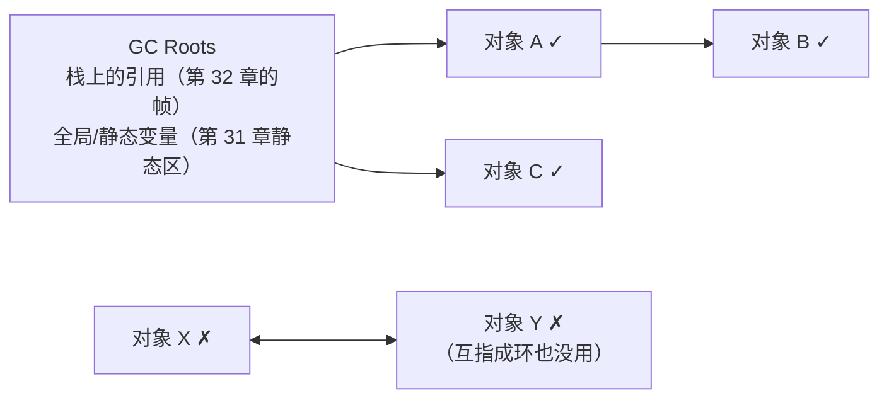

# 第 36 章 · 垃圾回收

**简体中文** ｜ [English](./36-garbage-collection.en-US.md)

---

> 前几章欠的账在这里结清：第 33 章见过 GC 的账单（一千万个临时对象 = 38 次回收）、第 34 章见过它的铁律（掌握全部引用才能搬对象）、第 35 章留下终极问题——**共享的对象，谁决定它什么时候死？**
>
> 自动回收有两大流派，本章用一个**循环引用测试**把它们的分野一测到底：两个对象互相指着（`x.partner = y; y.partner = x`），断掉外部引用后——**Python 沉默了**（`__del__` 不触发：引用计数各剩 1，谁也归不了零），直到 `gc.collect()` 出手才收走 11 个对象；**Java 和 C# 毫不在意**（实测弱引用双双变 null/False）：可达性分析从根出发标记，环内互指再紧，根到不了就是垃圾。**引用计数数不清环，追踪式回收不怕环**——一个实验讲清两大流派。
>
> 分代假设（多数对象朝生夕死）也全程实测：C# 的对象**亲眼看着晋升**（gen0 → 1 → 2 → 封顶）；五百万个临时对象只惊动 gen0 收集器 650 次，gen1/gen2 一次没动；Java 的 G1 双收集器同款分工（Young +5 次 1ms，Old 纹丝不动）。而 STW 停顿的摊薄之道，SQLite 给出了最直观的版本：`incremental_vacuum(100)` 一次只还 100 页（实测 720 → 620 → 520），全量回收才一步到底（→ 3 页）——**增量回收就是把一次大停顿拆成许多小停顿**。
>
> 还有一端是 C++：**没有回收器，但也没有不确定性**——实测析构严格按作用域逆序发生，`delete` 写在哪行哪行就是死期。这份"确定性"正是下两章（RAII、智能指针）的全部本钱。

## 1. 学习目标

本章结束后，你将能够：

- 说清 GC 要解决的问题（**何时回收才安全** = 不可能再被使用之后）与判定标准的两大流派：**引用计数 vs 可达性追踪**；
- 用**循环引用测试**演示两派分野：Python `__del__` 沉默（实测）vs Java/C# 弱引用双双清空（实测）；
- 解释三大回收算法（标记-清除 / 复制 / 标记-整理）各自的代价，以及**分代假设**如何组合它们（实测 gen0 650 次 vs gen2 0 次）；
- 理解 **STW 停顿**为什么无法根除、如何摊薄（增量/并发/分代——SQLite `incremental_vacuum` 实测对照）；
- 对比五门语言的回收器（CPython 双引擎 / V8 / G1 / CLR 三代 / C++ 无），并知道各自的观察工具与调优入口。

---

## 2. 为什么会出现这个概念

### 手动释放的两难

第 33 章实测过手动世界的两种事故：

```text
忘了 delete   → 泄漏（leaks 工具人赃并获）
删早了       → 悬垂指针（第 32 章"暂时还能用"的定时炸弹）
```

引用语义（第 35 章）让问题更难：**对象被到处共享，谁都不知道自己是不是最后一个使用者**——A 模块敢删吗？B 模块可能还留着引用。

### 自动回收的核心命题

```text
一个对象什么时候可以安全回收？
答：当它不可能再被使用的时候。
可"不可能再被使用"如何判定？两大流派：

流派一（引用计数）：数着——记录有多少引用指着我，归零即死
流派二（可达性）：  找着——从"根"（栈、全局变量）出发，走不到的就是死的
```

> **一句话**：GC 把"何时回收"从每个程序员的日常判断，变成运行时的统一算法——代价是回收时机不再由你掌控（实测：弱引用要等 GC 跑过才变 null），以及第 33 章算过的回收账单。本章看清两大流派、三大算法与它们的停顿代价。

---

## 3. 底层原理

### 流派一：引用计数——数着

```text
每个对象带一个计数器（第 24/34 章实测过 CPython 对象头里的它）
引用 +1：赋值、传参、入容器
引用 -1：del、离开作用域、被覆盖
归零 → 立刻回收（实测：del 的那一行 __del__ 就打印了）
```

优点：**回收时机确定且分散**（死一个收一个，无集中停顿）；缺点有二——每次赋值都要改计数（性能税），以及那个著名的死角：

### 钥匙实验：循环引用

```python
x.partner = y
y.partner = x        # x ⇄ y 互指成环
del x; del y         # 外部引用全断
```

**Python**（实测）：

```text
del x, del y 之后——没有任何 __del__ 打印！
计数各剩 1（对方手里），谁也归不了零
gc.collect() 出手 → 两个 __del__ 补发，报告回收 11 个对象
```

**Java**（实测同款环）：

```text
互指的两个对象 GC 后: wx.get() = null, wy.get() = null
```

**C#**（实测同款环）：

```text
wx.IsAlive = False, wy.IsAlive = False
```

**一个实验，两派分野**：引用计数只看"有没有人指着我"——环内互相指着，永远不归零；可达性分析只看"从根能不能走到"——环再紧密，根到不了就是垃圾。

### 流派二：可达性追踪——找着



从根出发标记一切可达对象，其余即垃圾。**根就是前几章的老朋友**：每个栈帧里的引用（第 32 章）、静态区的引用（第 31 章）——这也解释了第 34 章的铁律：运行时必须知道每个引用在哪，才能完成这次遍历（以及搬家后的改写）。

### 三大算法：找到垃圾之后怎么收

| 算法 | 做法 | 代价 |
|------|------|------|
| **标记-清除** | 标记存活，清扫死者原地留洞 | 碎片（第 33 章"就地留洞"）|
| **复制** | 把存活者整体搬到另半区，旧区整体作废 | 费一半空间——但存活者越少越快 |
| **标记-整理** | 标记后把存活者推到一端 | 搬家成本高——但消灭碎片、成全指针碰撞（第 33 章） |

### 分代假设：把三大算法各安其位

```text
观察：绝大多数对象朝生夕死（第 33 章的临时对象），活过头几轮的往往长命
策略：分代——
  新生代：小、收得勤、用复制算法（死者多 → 搬活人便宜）
  老年代：大、收得少、用标记-清除/整理
```

**实测证据链**：

```text
C# 晋升：       刚出生 gen0 → 熬过一次 GC gen1 → 两次 gen2 → 封顶
C# 频率梯度：   五百万临时对象 → gen0 +650 次、gen1 +0、gen2 +0
Java G1 分工：  同款压力 → Young +5 次(1 ms)、Old +0
Python 也分代： gc.get_threshold() = (700, 10, 10)——0 代扫 10 次才轮到 1 代一次
```

### STW：停顿无法根除，只能摊薄

标记时对象图不能被修改——最朴素的做法是**暂停所有业务线程**（Stop The World）。摊薄手段：

```text
分代：   每次只收新生代（小 → 停得短）——实测 Young 5 次共 1 ms
增量：   把一次大回收拆成许多小步，穿插在业务之间
并发：   标记与业务线程并行（写屏障记录并发期间的修改——代价是吞吐）
```

**SQLite 的直观对照**（实测）：`incremental_vacuum(100)` 一次还 100 页（720 → 620 → 520 页），全量才一步清空（→ 3 页）——**增量回收 = 把一次长暂停拆成 N 次短暂停**，数据库和运行时是同一道算术题。

---

## 4. JavaScript

V8 全自动、不可强制——你只有三个观察窗。

### 观察窗一：heapUsed 的呼吸（实测）

```text
五轮各 50 万临时对象后的 heapUsed: 3.7 / 4.4 / 4.1 / 4.4 / 3.7 MB
```

不涨——**Scavenger（新生代复制回收器）在轮次之间收走了全部尸体**。第 33 章 A/B 实验的机制版：朝生夕死的对象在 semi-space 之间来回复制中被自然淘汰。

### 观察窗二：WeakRef 与一个规范级细节（shell 实测）

```javascript
const weak = new WeakRef(student);
student = null;
global.gc();                      // --expose-gc
weak.deref();                     // 还是对象！？
```

```text
强引用断 + gc(): weak.deref() = [object Object]   ← 同一个 job 里收不掉！
换一个事件循环轮次再 gc(): weak.deref() = undefined   ← 这才收掉
```

**`deref()` 有 keepDuringJob 语义**：本轮 job 里 deref 过的对象会被保活到 job 结束——规范故意防止"同一段同步代码里前一行还在、后一行没了"的薛定谔对象。观察 WeakRef 必须跨事件循环轮次。

### 观察窗三：FinalizationRegistry——不保证送达的讣告（实测）

```javascript
registry.register(student, "小明的对象");
```

实测中进程退出前讣告并未送达——**规范明确不保证回调何时执行、甚至是否执行**。它只能做锦上添花的清理（如清缓存条目），任何正确性逻辑都不能依赖它。

### 工程正道：WeakMap（实测语义）

```javascript
metadata.set(user, { lastSeen: "..." });   // 给对象贴标签
user = null;                                // 键失去强引用——条目自动可回收
```

第 33 章泄漏药方的机制版：**WeakMap 的条目不为键续命**——缓存、元数据、DOM 关联数据的标准姿势。

> **注意事项**：V8 的 GC 不可从脚本触发（`--expose-gc` 仅限调试）；长时间运行的 Node 服务观察 GC 用 `--trace-gc` 或 `perf_hooks` 的 GC 性能条目——猜测 GC 行为不如打开日志。

---

## 5. Python

CPython 是**双引擎**：引用计数当主力（即时、确定），循环收集器补死角（分代、周期性）。

### 主引擎：引用计数（实测）

```text
a = Student("小明")   → 计数 1
b = a                → 计数 2
del b                → 计数 1
del a                → 计数 0 —— __del__ 立刻打印，回收时机确定
```

**"del 的那一行就是死期"**——CPython 的引用计数给了托管语言里罕见的确定性（C++ 程序员会觉得亲切：这几乎是穷人版的确定性析构）。代价：每次赋值/传参都在改计数（第 32 章 23 ns 调用税的一部分），且**多线程下计数操作必须同步——这正是 GIL 存在的核心理由之一**（第 45 章）。

### 副引擎：循环收集器（实测）

```text
循环引用 del 后：无 __del__ —— 主引擎失明
gc.collect()：   回收 11 个对象，__del__ 补发 —— 副引擎按可达性清环
gc.get_threshold() = (700, 10, 10) —— 副引擎也分代
```

副引擎不数引用——它周期性地对"容器对象"做可达性分析，专治主引擎的环。**双引擎各司其职**：99% 的对象死于计数归零（即时），环留给分代扫描（滞后）。

### weakref：观察而不挽留（实测）

```text
ref = weakref.ref(s); del s → ref() = None（__del__ 先打印——计数归零即死，弱引用不算数）
```

> **注意事项**：`__del__` 尽量别写复杂逻辑——循环里的 `__del__` 曾让对象不可回收（Python 3.4 前），现在虽能收但执行顺序无保证；资源清理的正道是 `with` 上下文管理器（第 37 章 RAII 的 Python 版）。判断"要不要手动 `gc.collect()`"：几乎永远不要——除非刚释放了一大批成环对象且内存紧张。

---

## 6. Java

JVM 是追踪式 GC 的集大成者——本章可达性与分代的实测主力。

### 可达性实测

```text
强引用在 + GC:  weak.get() = 小明   ← 从根可达，不收
强引用断 + GC:  weak.get() = null   ← 从根不可达，收
循环引用 + GC:  wx = null, wy = null ← 环照收（钥匙实验）
```

`WeakReference` 是观察 GC 的标准探针：**它不算"根出发的可达路径"**——对象只剩弱引用时即可回收。

### 分代分工实测（G1）

```text
分配五百万个临时对象之后：
  G1 Young Generation   +5 次，共 1 ms   ← 新生代收集器在干活
  G1 Old Generation     +0 次            ← 老年代纹丝不动
```

`GarbageCollectorMXBean` 免费暴露每台收集器的次数与耗时——**生产监控的第一数据源**（配合 `-Xlog:gc` 日志）。G1 的 region 化设计第 33 章见过（humongous 实测），它按"回收收益最大的 region 优先"（Garbage-First 之名的由来）凑出目标停顿时长。

### 引用四强度

| 引用 | 回收时机 | 用途 |
|------|---------|------|
| 强（默认） | 永不（可达即活） | 一切日常 |
| 软 `SoftReference` | 内存吃紧时 | 内存敏感缓存 |
| 弱 `WeakReference` | 下次 GC（实测） | 探针、WeakHashMap |
| 虚 `PhantomReference` | 仅用于回收通知 | 替代 finalize 的清理 |

> **注意事项**：`System.gc()` 只是建议（实测中配合 sleep 多次调用才稳定生效）；`finalize()` 已弃用——复活对象、拖慢回收、执行无保证三宗罪，清理用 `try-with-resources`（第 37 章）或 `Cleaner`。选收集器：默认 G1 适合大多数服务；低延迟找 ZGC/Shenandoah（亚毫秒停顿，换吞吐）。

---

## 7. C++

C++ 的答案是**不回收**——但换来的不是混乱，而是另一种秩序：**确定性**。

### 确定性析构（实测）

```text
{
    Student a("小明");    构造: 小明
    Student b("小红");    构造: 小红
}                          析构: 小红   ← 构造的逆序
                           析构: 小明   ← 块结束的这一行，分毫不差
```

**析构时机与顺序都写在代码结构里**：作用域结束即析构、构造逆序析构——不等任何回收器的心情。对比实测过的另外两种时序：Java/C#/JS 的"弱引用要等 GC 跑过才变 null"（不确定），Python 的"del 即死"（确定但循环例外）。

### 手动堆对象：确定性由你负责（实测）

```text
Student* p = new Student("小刚");
delete p;                  ← 你写 delete 的这一行就是它的死期
```

自由与义务同在——忘写就是第 33 章 `leaks` 抓到的泄漏，写两次就是第 34 章的账本损坏。

### 没有 GC 的世界靠什么活

```text
① 确定性析构 + 作用域 = RAII（第 37 章）：资源跟着对象走，作用域替你收
② 引用计数按需引入 = shared_ptr（第 38 章）：CPython 的主引擎做成了库
③ 循环引用依然存在：shared_ptr 成环同样漏——weak_ptr 拆环（第 38 章）
```

**C++ 没有逃过 GC 的问题，只是把解决方案从运行时搬进了类型系统**——这句话是下两章的路线图。

> **注意事项**：C++ 也有可选的 GC 库（Boehm GC）与自建 arena（一次性整块释放，游戏帧分配器常用）——"没有 GC"是默认而非教条；但主流工程实践是 RAII + 智能指针，覆盖 99% 的场景。

---

## 8. C#

CLR 的三代堆是分代假设的教科书实现——本章"亲眼看晋升"的实测主场。

### 晋升实测

```text
刚出生:       第 0 代
熬过一次 GC:  第 1 代
熬过两次 GC:  第 2 代
熬过三次 GC:  第 2 代   ← 封顶（gen2 = 老年代）
```

**GC.GetGeneration 让"对象变老"变成可打印的事实**——活过一轮回收就晋升一级，gen2 到顶。第 33 章的 LOH 大对象直接"出生即 gen2"（实测 86 KB → gen2），两条实测在此汇合。

### 频率梯度实测

```text
五百万个临时对象之后：
  gen0 +650 次   ← 新生代最忙
  gen1 +0 次
  gen2 +0 次     ← 老年代几乎不动
```

650 : 0 : 0——**分代假设的全部经济学**：收 gen0 又快又有赚头（死者多），收 gen2 又慢又没多少可收。

### 循环引用实测（附一个 JIT 陷阱）

```text
wx.IsAlive = False, wy.IsAlive = False   ← 追踪式回收，环照收
```

实测过程本身埋着一课：环在 `Main` 里直接创建时 **收不掉**（tier0 JIT 让局部变量活到方法尾）——把创建移进独立方法（`NoInlining`）、靠栈帧弹出斩断引用才成功。**"引用何时算断"由 JIT 的活跃性分析决定，不由源码字面决定**——写 GC 相关测试时的必修课。

> **注意事项**：`GC.Collect()` 生产代码几乎永远不该调（打乱分代节奏）；观察用 `GC.CollectionCount`/`GetTotalMemory`（实测）与 `dotnet-counters`；大缓冲区走 `ArrayPool`（第 33 章）比调 GC 参数有效得多；Server GC vs Workstation GC 是服务端吞吐的第一开关。

---

## 9. SQL

数据库同样要回收"死数据"的空间——SQLite 的 `incremental_vacuum` 是**增量回收摊薄停顿**的最直观标本。

### 增量回收实测

```text
插入 5000 行后:  720 页, freelist=0
删光后:          720 页, freelist=717   ← 垃圾产生（第 33 章：空页不还 OS）
增量回收 100 页: 620 页, freelist=617   ← 一次只还一点
再回收 100 页:   520 页, freelist=517
全部回收后:        3 页, freelist=0     ← 对应 Full GC / 第 33 章的 VACUUM
```

### 对照表：数据库回收 ↔ 运行时回收

| 数据库 | 运行时 | 共同点 |
|--------|--------|--------|
| DELETE 后页进 freelist | 对象死后待回收 | 死了 ≠ 空间已归还 |
| `incremental_vacuum(N)` | 增量 GC | 拆大停顿为小停顿（实测 100 页/次） |
| 全量 `VACUUM` | Full GC / STW | 一步到位，代价是长暂停 |
| PostgreSQL 的 autovacuum | 后台并发 GC | 与业务并行，靠参数调频 |

**MVCC 数据库的对应更深**：PostgreSQL 每次 UPDATE 都留下旧版本行（死元组），autovacuum 就是它的后台 GC——回收不及时会表膨胀（数据库版的"堆只增不减"），`autovacuum` 参数调优与 JVM GC 调优是同一门手艺。

> **工程提醒**：SQLite 的 `auto_vacuum` 必须建库前设置（实测放在建表前）；增量模式适合"不能接受长暂停"的嵌入式场景——与选 ZGC 而不是 Parallel GC 是同一个决策模型。

---

## 10. 五语言横向对比

### ① 回收机制对比

| 特性 | JavaScript | Python | Java | C++ | C# |
|------|-----------|--------|------|-----|-----|
| 流派 | 追踪（分代） | **引用计数 + 循环收集**双引擎 | 追踪（分代） | **无 GC**（确定性析构） | 追踪（三代） |
| 回收时机 | V8 决定 | 计数归零**即时**（实测）；环滞后 | GC 决定 | **作用域/delete 行**（实测） | GC 决定 |
| 循环引用 | 能收 | **主引擎收不了**（实测 `__del__` 沉默） | 能收（实测双 null） | shared_ptr 会漏（38 章） | 能收（实测双 False） |
| 分代证据 | Scavenger（实测呼吸） | (700,10,10)（实测） | Young/Old 分工（实测 5:0） | — | gen0/1/2（实测 650:0:0 + 晋升） |
| 观察工具 | `--trace-gc`/WeakRef | `gc` 模块/`weakref`（实测） | MXBean（实测）/`-Xlog:gc` | 析构打印/leaks | `GC.*` API（实测） |
| 强制回收 | ❌（--expose-gc 仅调试） | `gc.collect()`（实测） | `System.gc()` 仅建议 | —（本来就手动） | `GC.Collect()`（不建议） |

### ② 钥匙实测：循环引用测试总表

```text
x ⇄ y 互指成环，断掉外部引用后——

Python:  __del__ 沉默（计数各剩 1）→ gc.collect() 才收 11 个对象   ← 引用计数的死角
Java:    weak.get() 双双 = null                                     ← 可达性不在乎环
C#:      IsAlive 双双 = False（需防 JIT 保活陷阱）                  ← 同上
C++:     shared_ptr 成环会真漏（第 38 章 weak_ptr 拆环）            ← 库级引用计数，同款死角
JS:      能收（追踪式）——但没有探针能同步观察（keepDuringJob 实测）
```

**环是引用计数的照妖镜**：数数的（CPython 主引擎、C++ shared_ptr）都怕环；找路的（JVM/CLR/V8）都不怕。

### ③ 两条设计分歧

**分歧一：确定性与吞吐怎么选**

```text
确定性优先（C++ 析构 / Python 计数）：  死期写在代码里（实测两家）——代价：计数税（Python）或全手动（C++）
吞吐优先（JVM/CLR/V8 追踪式）：       批量回收摊薄单位成本（第 33 章 3ns 分配的前提）——代价：死期不可知、停顿要管理
```

**分歧二：停顿怎么摊**

```text
分代（全体追踪式 + CPython 副引擎）： 只收年轻的——实测 650:0:0 的频率梯度
增量（SQLite incremental_vacuum）：  拆大为小——实测 100 页/次
并发（G1/ZGC/autovacuum）：          和业务一起跑——换吞吐买停顿
三者常常叠加：G1 = 分代 + 增量 + 并发
```

### ④ 共同点与差异根源

**共同点**：所有自动回收都基于"不可能再被使用"的判定；分代假设在四个运行时全部成立（实测四家）；弱引用家族（weakref/WeakReference/WeakRef/weak_ptr）是五门语言共同的"观察而不挽留"方案。

**差异根源**：

- **CPython 选引用计数**是为 C 扩展生态：计数嵌在对象头里，C 代码手动 `Py_INCREF` 即可参与——代价是 GIL 与环（双双实测过）；
- **JVM/CLR 选追踪式**是为吞吐：分配指针碰撞（33 章）、回收批量摊销，服务端工作负载的最优解；
- **V8 选追踪式**还因为嵌入浏览器：不能让页面卡死，Orinoco 全力并发化；
- **C++ 不选**是零开销原则：不用的东西不付费——确定性析构反而成了资源管理的地基（37 章）；
- **SQLite 的增量选项**证明这是通用工程学：停顿敏感的场景（嵌入式/交互式）永远偏向增量。

---

## 11. 底层实现对比

| 运行时 | 回收器架构 | 关键细节 |
|--------|-----------|---------|
| **V8**（JavaScript） | Orinoco：Scavenger（新生代复制）+ 主收集器（标记-清除-整理，并发） | 实测 heapUsed 呼吸即 Scavenger 工作；keepDuringJob 是规范层为可预测性设的栏 |
| **CPython** | 引用计数（对象头，34 章 ctypes 读过）+ 分代循环收集器 | 实测 (700,10,10)；只有容器对象进循环收集名单；计数操作是 GIL 的核心理由 |
| **JVM**（Java） | G1：region 化分代 + 并发标记 + 停顿目标驱动 | 实测 Young/Old 分工；33 章 humongous 是它的 region 副作用；ZGC 用染色指针做亚毫秒停顿 |
| **C++**（原生） | 无——析构函数 + 作用域（实测逆序） | 标准委员会 2023 年正式移除了 GC 支持接口（无人实现）；生态答案是 RAII/智能指针 |
| **CLR**（C#） | 三代 + LOH（33 章）；Workstation/Server 两模式 | 实测晋升与 650:0:0；后台 GC 并发收 gen2；卡表（card table）记录跨代引用 |

**一个值得记住的分野**：

```text
跨代引用问题：老年代对象指向新生代对象时，只扫新生代会误杀——
  解法是写屏障 + 记忆集（卡表）：每次写引用都记一笔"老指新"的账
  这就是"托管语言每次引用赋值都可能多几条指令"的原因——
  第 33 章的分配便宜（3 ns）与这里的写屏障税，是同一张收支表的两栏
```

---

## 12. 性能分析

### GC 的三个成本维度（本书实测串联）

| 维度 | 实测证据 | 说明 |
|------|---------|------|
| 吞吐 | 一千万临时对象 = 38 次 gen0（33 章）；五百万 = 650 次（本章） | 分配率直接决定 GC 频率 |
| 停顿 | Young 5 次共 1 ms（本章）；增量 vacuum 100 页/次（本章） | 分代+增量+并发三板斧摊薄 |
| 内存 | G1 humongous 50% 浪费（33 章）；复制算法费半区（本章） | GC 语言常需 2–4× 工作集的堆 |

### 降低 GC 压力的手段（按杠杆排序）

```text
1. 降分配率：对象池/ArrayPool（33 章）、避免热循环里的临时对象（29 章装箱实测）
2. 让对象死在新生代：短命对象别被长命结构引住（缓存引用临时对象 = 强行晋升）
3. 弱引用做缓存：WeakMap/WeakHashMap/weakref（三家实测）——不为缓存续命
4. 大对象池化：LOH/humongous 双雷区（33 章双实测）
5. 最后才是调参：堆大小、停顿目标、收集器选型——前四条做完再动它
```

### Python 的特殊账

```text
引用计数税：每次赋值 ±1（32 章 23ns 调用成本的组成部分）
环收集税：  容器对象的分代扫描
省税方式：  __slots__ 减对象、元组代列表（不可变不进环名单）、
            大批量数据交给 NumPy（C 层数组绕过对象海）
```

> ⚠️ 惯例提醒：GC 调优先看数据——MXBean/`GC.CollectionCount`/`gc.get_stats()`/`--trace-gc`（四家实测工具）——没有"GC 时间占比"数据之前，一切调参都是玄学。经验阈值：GC 时间超过 CPU 的 5–10% 才值得动手。

---

## 13. 工程实践

| 场景 | ✅ 推荐 | ❌ 不推荐 | 原因 |
|------|--------|----------|------|
| 缓存 | 弱引用容器 + 上限淘汰 | 强引用 Map 裸缓存 | 33 章 100 MB 泄漏实测 + 本章 WeakMap 药方 |
| Python 资源清理 | `with` 上下文（37 章） | `__del__` 里做清理 | 环中 `__del__` 时序无保证（实测滞后） |
| Java/C# 观察 GC | MXBean / CollectionCount（实测） | 凭感觉说"GC 太频繁" | 数据免费且精确 |
| 写 GC 相关测试 | 独立方法制造不可达（实测 NoInlining 修正） | 同方法内 null 后立测 | JIT 活跃性陷阱（实测踩过） |
| JS 观察对象回收 | WeakRef 跨事件循环轮次（实测） | 同一 job 内 deref 判断 | keepDuringJob 语义（实测） |
| 强制 GC | 几乎从不 | `System.gc()`/`GC.Collect()` 救火 | 打乱分代节奏，通常更糟 |
| 短命对象 | 让它们死在函数里（逃逸分析友好） | 挂到长命结构上"复用" | 强行晋升 = 老年代压力 |
| 停顿敏感服务 | ZGC/Shenandoah/增量模式 | 默认收集器硬扛 | SQLite 增量实测同款决策 |
| 数据库大量删除后 | 计划内 VACUUM/OPTIMIZE 窗口 | 放任 freelist 膨胀 | 33/36 两章实测 |

### 判断口诀

```text
内存只增不减    → 先查强引用泄漏（33 章工具），不是 GC 的锅
停顿尖峰       → 看是不是 Full GC / 大对象 / 晋升风暴——分代计数器定位（实测）
GC 时间占比高  → 降分配率（第一杠杆），再考虑换收集器
```

---

## 14. 最佳实践

- **先懂判定再谈调优**：可达性决定生死（实测），引用计数是特例（Python/C++ shared_ptr）——环形结构在后者手里必须显式拆（weak_ptr/手动断链）。
- **弱引用是标准观察探针**：WeakReference/weakref/WeakRef 三家实测——测 GC 行为、做不续命缓存都靠它。
- **让分代假设为你打工**：临时对象放心造（gen0 回收便宜，实测 650 次无感）；但别让长命结构抓住短命对象。
- **清理逻辑绝不进 finalizer**：`__del__`/`finalize`/FinalizationRegistry 三家的执行时机都无保证（两家实测）——确定性清理走 RAII/with/using（37 章）。
- **强制 GC 是测试工具不是生产手段**：实测里 `gc.collect()`/`System.gc()` 只用于演示——生产代码出现它们通常是设计问题的创可贴。
- **GC 语言的容量规划留呼吸空间**：堆 = 工作集的 2–4 倍——复制算法与并发回收都需要余量。
- **跨运行时的知识迁移**：分代=数据库的冷热分离、增量 vacuum=增量 GC（实测）、autovacuum 调优=GC 调优——一门手艺两处用。

---

## 15. 常见坑

**坑 1 · 以为 Python 没有 GC 问题**（实测反驳）

```text
循环引用 del 后 __del__ 沉默——计数引擎失明，等分代收集才回收
```

**如何避免**：成环的结构（双向链表、父子互指、观察者互持）用 `weakref` 断一边；或确保及时 `gc.collect()` 的场景极少且明确。

**坑 2 · 在 finalizer 里做关键清理**

```text
实测：FinalizationRegistry 进程退出前未送达；Python 环中 __del__ 滞后到 gc.collect()
```

**如何避免**：文件/锁/连接的释放走确定性通道（with/using/try-with-resources/RAII）——finalizer 只做"忘了关时的最后补救 + 告警"。

**坑 3 · 缓存把对象全部钉在老年代**

```java
static Map<K, BigObj> cache = new HashMap<>();   // 每个进来的对象都被强引用钉住
```

**如何避免**：WeakHashMap/WeakMap（实测语义）+ 容量上限；或成熟缓存库（Caffeine）——它们把弱/软引用与淘汰策略打包好了。

**坑 4 · 测 GC 时被 JIT 保活骗了**（实测踩坑）

```text
C# 环在 Main 里创建 → IsAlive = True（tier0 让局部变量活到方法尾）
移进 NoInlining 方法 → False
```

**如何避免**：制造"不可达"要靠作用域/方法边界，不靠 `x = null` 的字面意思；Java 同理（实测里我们用了多次 gc + sleep 增稳）。

**坑 5 · 同一个 job 里观察 WeakRef**（实测踩坑）

```text
deref 过的对象在本轮 job 内被保活——[object Object] 而不是 undefined
```

**如何避免**：跨 `setTimeout`/事件循环轮次再验证（实测修正版）；这是规范行为不是 V8 bug。

**坑 6 · 用 `System.gc()` 修内存问题**

```text
内存高的根因几乎总是强引用泄漏（33 章实测 100 MB gc 不动）——强制 GC 收不走可达对象
```

**如何避免**：堆 dump 找保留树（33 章工具链）；`System.gc()` 只出现在实验代码里。

**坑 7 · 数据库删了数据以为空间回来了**

```text
实测：删光 5000 行，720 页纹丝不动（freelist=717）——要 incremental_vacuum/VACUUM 才归还
```

**如何避免**：大删除后安排回收窗口；或建库时就选 `auto_vacuum`（实测：必须建表前设置）。

---

## 16. 面试题

**基础**

1. GC 判定"对象可以回收"的两大流派是什么？各自怎么判？
2. 什么是 GC Roots？举三个例子（提示：前几章的栈帧与静态区）。
3. 标记-清除、复制、标记-整理三种算法各有什么代价？

**中级**

4. **为什么引用计数收不了循环引用？CPython 怎么补救？**
5. 分代假设是什么？用本章的实测数据（650:0:0、晋升链）说明它如何指导设计。
6. **弱引用是什么？它在缓存与 GC 测试里各扮演什么角色？**

**高级**

7. **同一个循环引用，Python 的 `__del__` 沉默而 Java 的弱引用变 null——请完整解释两种机制的分野。**
8. STW 为什么无法彻底消除？分代、增量、并发各从什么角度摊薄它？写屏障在其中付了什么代价？
9. CPython 的引用计数和 GIL 有什么关系？如果换成追踪式 GC，C 扩展生态会发生什么？

---

## 17. 练习

**基础**

1. 用 Python 复现双引擎实测：引用计数的即时回收、循环引用的沉默、`gc.collect()` 的补刀。
2. 用 Java/C# 的弱引用复现可达性实测：强引用在/断两种状态下的 GC 行为。
3. 观察你机器上 `gc.get_threshold()` 并解释三个数字的含义。

**提高**

4. **复现钥匙实验的双语言对照**：同一个互指结构，在 Python（`__del__` + gc.collect）与 Java（WeakReference）各测一遍，写出两派判定逻辑的差异。
5. 复现 C# 晋升实测，再用 `GC.Collect(0)`（只收 gen0）验证"gen1 对象不受 gen0 回收影响"。
6. 用 `node --expose-gc` 复现 keepDuringJob 实测：同 job 内与跨 job 的 `deref()` 差异。

**挑战**

7. 用 Python 的 `weakref` 实现一个不阻止回收的缓存装饰器，验证对象死后缓存条目自动失效。
8. 写一个 Java 程序故意制造"晋升风暴"（长命列表持有短命对象），用 MXBean 观察 Old GC 被触发，再修复它。
9. 在 PostgreSQL（或 SQLite）上模拟"表膨胀"：大量 UPDATE/DELETE 后对比 autovacuum/incremental_vacuum 前后的表大小与查询耗时。

---

## 18. 本章总结

**一句话总结**：GC 的判定有两大流派——**引用计数**（数着：即时确定，实测 `del` 即死，但环是死角——实测 `__del__` 沉默、`gc.collect()` 补刀）与**可达性追踪**（找着：从栈帧与静态区的根出发，环照收——实测 Java/C# 弱引用双清）；回收算法靠**分代假设**组合（实测 C# 晋升链 gen0→1→2 与频率梯度 650:0:0、G1 的 Young/Old 分工），**STW 只能摊薄不能根除**（分代/增量/并发——SQLite `incremental_vacuum` 实测 100 页/次的同款算术）；而 C++ 站在另一端：**没有回收器但有确定性**（实测析构逆序、`delete` 行即死期）——这份确定性是 RAII（37 章）与智能指针（38 章）的地基，那里引用计数将以 `shared_ptr` 之名重生，环也将以 `weak_ptr` 之名被拆。

**核心知识点**

- **两大流派**（钥匙实测）：计数派即时但怕环（Python 双引擎、C++ shared_ptr）；追踪派批量但不怕环（JVM/CLR/V8）。
- **GC Roots**：栈帧引用（32 章）+ 静态区（31 章）——可达性遍历的起点，34 章铁律的另一面。
- **三大算法**：标记-清除留洞、复制费半区、标记-整理搬家——分代把它们各安其位。
- **分代实测证据链**：晋升 gen0→1→2、频率 650:0:0、G1 分工 5:0、Python (700,10,10)。
- **停顿摊薄三板斧**：分代、增量（SQLite 实测对照）、并发（写屏障是税）。
- **弱引用家族**（三家实测）：观察而不挽留——探针与缓存的标准件。
- **实测防坑二连**：JIT 保活（C# NoInlining 修正）、keepDuringJob（JS 跨 job 修正）。
- **C++ 的确定性**（实测）：作用域逆序析构——无 GC 世界的全部秩序来源。

**检查清单**

- [ ] 我能用循环引用测试说清两大流派的分野。
- [ ] 我能画出从 GC Roots 出发的可达性判定图。
- [ ] 我能用实测数据解释分代假设的经济学。
- [ ] 我知道弱引用在五门语言里的名字与用途。
- [ ] 我知道 finalizer 为什么不可靠，确定性清理走哪条路。

**下一章预告**：GC 管住了内存，可**资源不止内存**——文件句柄、锁、网络连接、数据库事务，个个都要"用完即还"，而且还的时机必须确定（GC 的"总有一天"不够用，本章实测过 finalizer 的不可靠）。C++ 的确定性析构在这里从"特色"升格为"范式"：**RAII——资源获取即初始化**，把资源的生命周期焊在对象的生命周期上，作用域一结束资源自动归还，连异常都拦不住。第 37 章看 C++ 的原生 RAII、Python 的 `with`、Java 的 try-with-resources、C# 的 `using`、JS 的显式资源管理提案——五门语言向同一个思想的集体致敬。

---

## 19. 延伸阅读

- <a href="https://en.wikipedia.org/wiki/Garbage_collection_(computer_science)" target="_blank" rel="noopener">Wikipedia：Garbage collection</a> — GC 概念与算法流派综述。
- <a href="https://en.wikipedia.org/wiki/Reference_counting" target="_blank" rel="noopener">Wikipedia：Reference counting</a> — 引用计数及其循环引用问题的标准描述。
- <a href="https://docs.python.org/3/library/gc.html" target="_blank" rel="noopener">Python 文档 · gc 模块</a> — 循环收集器的官方接口（实测所用）。
- <a href="https://devguide.python.org/internals/garbage_collector/" target="_blank" rel="noopener">CPython 开发者指南 · Garbage Collector</a> — 双引擎设计的官方内幕文档。
- <a href="https://docs.oracle.com/en/java/javase/17/gctuning/garbage-first-g1-garbage-collector1.html" target="_blank" rel="noopener">Oracle · G1 Garbage Collector</a> — G1 的官方调优文档。
- <a href="https://learn.microsoft.com/en-us/dotnet/standard/garbage-collection/fundamentals" target="_blank" rel="noopener">Microsoft Learn · GC 基础</a> — CLR 三代堆与两种模式的官方说明。
- <a href="https://v8.dev/blog/trash-talk" target="_blank" rel="noopener">V8 Blog · Trash talk</a> — Orinoco 回收器架构的官方介绍（33 章共用）。
- <a href="https://developer.mozilla.org/en-US/docs/Web/JavaScript/Reference/Global_Objects/WeakRef" target="_blank" rel="noopener">MDN · WeakRef</a> — WeakRef 与 keepDuringJob 语义的官方文档。
- <a href="https://www.sqlite.org/pragma.html#pragma_incremental_vacuum" target="_blank" rel="noopener">SQLite 文档 · incremental_vacuum</a> — 增量空间回收的官方说明。
