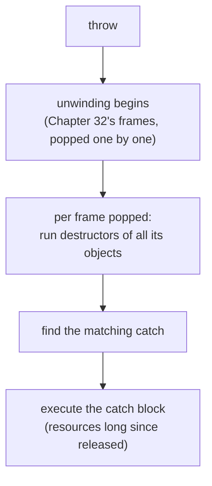

# Chapter 37 · RAII

[简体中文](./37-raii.md) ｜ **English**

---

> Chapter 36's GC tamed memory — but **resources are more than memory**. File handles, locks, network connections, database transactions: each must be returned when done, and the timing must be **deterministic**. GC's "eventually" won't do (last chapter measured it: the FinalizationRegistry obituary never arrived; `__del__` inside a cycle waited for `gc.collect()`).
>
> C++'s deterministic destruction (measured in Chapter 36: destruction at scope exit, in reverse construction order) is here promoted from feature to **paradigm**: **RAII — Resource Acquisition Is Initialization** — welding a resource's lifetime to an object's. One **exception-safety test** measures its power: throw while holding a resource — the manual style's release statement **never executes** (measured in all five languages: not one `[release]` printed; handle leaked), while the RAII style's release **happens anyway** (measured: `[release]` prints *before* the exception is caught — stack unwinding passes through every destructor).
>
> So five languages bow to one idea: C++'s destructors, Python's `with`, Java's try-with-resources, C#'s `using` — **different syntax, three identical laws** (measured three times over): scope-bound, reverse-order release, and the exception path too. The lone absentee is JavaScript: the proposal reached Stage 3 and `Symbol.dispose` is already a standard symbol (measured `typeof` = symbol), but on this machine's Node 22 the **syntax needs a flag, and even behind the flag the semantics are unimplemented** (measured: a non-disposable object raises no TypeError) — so JS still hand-writes `try/finally`, nesting three levels deep for three resources.
>
> And a harder question: **what if the release itself fails?** The five answers split into a gradient (all measured): Java **suppresses** the close exception and keeps the primary intact (the only one that loses nothing); Python leaves a trail via `__context__`; C# and JS lose the primary **entirely**; and C++ is the most extreme — a destructor throwing during unwinding calls `std::terminate`, killing the process on the spot (measured exit code 134).

## 1. Learning Objectives

By the end of this chapter, you will be able to:

- State RAII's core formula (**resource lifetime = object lifetime**) and why it beats "remember to call close";
- Prove RAII's value with the **exception-safety test**: manual release skipped vs automatic release still happening (measured in five languages);
- Name the RAII family's three shared laws (scope-bound, reverse-order, exception path — measured three times) and its four syntaxes (destructor / `with` / try-with-resources / `using`);
- Answer "**what if the release fails**" and draw the five-language gradient (measured: Java suppresses → Python traceable → C#/JS lost → C++ process death);
- Recognize JS's current absence (Stage 3 proposal, `Symbol.dispose` present, semantics unimplemented — measured) and its three present-day substitutes.

---

## 2. Why This Concept Exists

### The half GC cannot solve

Chapter 36's conclusion had a premise: GC manages **memory**. Programs hold plenty else:

| Resource | Why it can't wait for GC |
|----------|--------------------------|
| File handles | the OS caps handles per process — exhaust them and no file opens |
| Locks | not released = everyone else waits forever (deadlock) |
| Database connections | the pool is finite; hoarding blocks the whole system |
| Network sockets | the peer waits for your close, holding until timeout |
| Database transactions | uncommitted/unrolled-back = locks held + sessions blocked (this chapter's SQL section) |

**What they share: scarcity, and a release time that must be certain.** GC promises only "eventually" — and Chapter 36 measured how unreliable that is.

### Why "remember to call close" isn't enough

```cpp
FileHandle* f = new FileHandle("data.txt");
process(f);          // ⚠️ if this throws...
delete f;            // ...this line never runs
```

**Measured five times** (this chapter's key experiment): every language's manual style falls to an exception — not one `[release]` printed. And exceptions are merely the most visible path; there are also `return`, `break`, `continue`, multiple exits… **every additional way out of a scope is another chance to forget**.

### RAII's answer: weld release onto destruction

```cpp
class FileHandle {
    FileHandle(name)  { open the file; }    // construction = acquisition
    ~FileHandle()     { close the file; }   // destruction = release
};
{
    FileHandle f("data.txt");                // acquire
    process(f);                              // whatever happens
}                                             // scope ends → destructor → release (guaranteed)
```

> **In one sentence**: RAII turns "remember to release" from **programmer discipline** into a **language guarantee** — because every route out of a scope (normal end, return, exception) must pass through the destructor. Chapter 36's "deterministic destruction" cashes in its full value here.

---

## 3. How It Works

### The core formula

```text
resource lifetime = object lifetime
acquire → in the constructor (failed acquisition = failed construction; no half-built object exists)
release → in the destructor (object dies, resource returns)
```

**The name stresses the first half** (acquisition into construction), but RAII's real value is the second (release into destruction) — hence its alternative name SBRM (Scope-Bound Resource Management), which is arguably more accurate.

### The key experiment: the exception-safety test

```text
Throw while holding a resource. Does release still happen?
```

**Manual style (five languages measured, all fail)**:

```text
[acquire] open manual.txt
caught: something went wrong   <- not one [release] printed! handle leaked
```

**RAII style (five languages measured, all safe)**:

```text
[acquire] open raii.txt
[release] close raii.txt        <- note the order: release precedes the catch
caught: something went wrong
```

**The ordering is the key evidence**: `[release]` prints before `caught`, so release happened **during stack unwinding** — as the exception propagates upward, every scope it passes runs the destructors of the objects inside it, and only then does the catch block execute.

### Stack unwinding: the physical mechanism of exception safety



Chapter 32 dissected frame construction and popping; exception propagation is **controlled consecutive popping**, and RAII rides that mechanism — hanging cleanup on the unavoidable event of "the frame goes away."

### Three shared laws (measured three times)

Whatever the syntax, the RAII family obeys:

| Law | Measured evidence |
|-----|-------------------|
| **Scope-bound** | block ends, release happens, no explicit call (five languages, measurement ①) |
| **Reverse order** | three resources measured releasing 3-2-1 (reverse of construction/declaration) |
| **Exception path too** | release still happens mid-propagation (key experiment, five languages) |

**Why must it be reverse?** Because later resources may depend on earlier ones (open the connection, then the transaction) — the dependent must go back before its dependency. Same principle, same machinery, as Chapter 32's last-in-first-out frames.

### The second key: when the release itself fails

In the real world `close()` can fail too (disk full, network down). Now a business exception collides with a release exception — who survives? **The measured five-language gradient**:

| Language | Mechanism | Fate of the primary exception |
|----------|-----------|-------------------------------|
| **Java** | suppressed exceptions (`getSuppressed()`) | ✅ **fully preserved** (measured: both present) |
| **Python** | exception chaining (`__context__`) | ⚠️ replaced, but the original is **traceable** (measured `__context__` = the business error) |
| **C#** | none | ❌ **lost entirely** (measured `InnerException` empty) |
| **JavaScript** | none | ❌ **lost entirely** (measured `cause` empty) |
| **C++** | throwing during unwinding is forbidden | 💀 **process death** (measured `std::terminate`, exit code 134) |

**Java's suppression is the best answer to this question** — the only design where neither exception is lost. C++'s extremity has its logic: with unwinding already underway, the runtime cannot decide which exception to honor, so terminating beats undefined behavior — hence C++'s iron law: **destructors must never throw** (they are `noexcept` by default since C++11).

---

## 4. JavaScript

JS is the **only one of the five without scope-bound resource management** — the proposal is on its way, but not here yet.

### The one reliable tool today: `try/finally` (measured)

```javascript
const f = new FileHandle("data.txt");
try {
  use(f);
} finally {
  f.close();          // you must write it — the language won't
}
```

Same conclusion as the key experiment (measured): bare style leaks, `try/finally` is safe.

### Multiple resources: the ugliness of nesting (measured)

```javascript
const a = new FileHandle("first");
try {
  const b = new FileHandle("second");
  try {
    const c = new FileHandle("third");
    try { use(a, b, c); }
    finally { c.close(); }
  } finally { b.close(); }
} finally { a.close(); }
```

The release order really is 3-2-1 (measured correct), but **the code nests three deep** — against Python's one-line `with a, b, c:` and Java's single semicolon-separated group. That is the true cost of "no language support."

### Proposal status: the symbol landed, the semantics didn't (shell measurement)

```text
typeof Symbol.dispose = symbol        <- the well-known symbol is standard
using declaration (no flag): SyntaxError
using declaration (--js-explicit-resource-management): parses, but —
  probe 1: a non-disposable object raises no TypeError → semantics unimplemented
  probe 2: the dispose method is never called
```

**The Explicit Resource Management proposal (TC39 Stage 3)** plans this final form:

```javascript
{
  using f = openFile("data.txt");     // block end auto-calls f[Symbol.dispose]()
  await using conn = connect();       // the async flavor
}
```

`Symbol.dispose` is already standard (measured) and TypeScript 5.2+ can downlevel it, but **this machine's Node 22.21.1 V8 implementation is still "in progress / experimental"** — the syntax parses, the semantics are hollow. Library authors can **implement `[Symbol.dispose]()` today** and benefit automatically when engines catch up.

### The stopgap: wrap resources in a higher-order function (measured)

```javascript
function withResource(name, fn) {
  const res = new FileHandle(name);
  try { return fn(res); }
  finally { res.close(); }      // written once; callers get no chance to forget
}
```

**Package the `finally` inside the library** — the mainstream JS approach (the `fs.promises` idioms, test frameworks' `beforeEach/afterEach`, React's `useEffect` cleanup are all this pattern).

> **Note**: throwing inside `finally` **completely replaces** the primary exception (measured `cause` empty) — so always wrap `close()` in `try { } catch { log }`. `try/finally` works with `await` too, but an `await` inside `finally` delays exception propagation.

---

## 5. Python

Python's answer is the **`with` statement plus the context-manager protocol** — one of RAII's most elegant transplants.

### The protocol: `__enter__` / `__exit__` (measured)

```python
class FileHandle:
    def __enter__(self):
        print("[acquire] open"); return self       # bound to the name after as
    def __exit__(self, exc_type, exc_val, exc_tb):
        print("[release] close"); return False      # False = don't swallow
```

**`__exit__` receives the exception info** (measured):

```text
[release] close raii.txt   <- exiting with exception info RuntimeError
```

This is an **advantage** over C++ destructors: cleanup knows whether this was a normal or exceptional exit, and can decide to commit or roll back accordingly (the standard shape of a database-transaction context manager).

### Multiple resources and reverse order (measured)

```python
with FileHandle("first"), FileHandle("second"), FileHandle("third"):
    raise RuntimeError("failure")
```

```text
[release] third / second / first   <- 3-2-1, each receiving the exception info
```

### `contextlib`: context managers from generators (measured)

```python
@contextlib.contextmanager
def managed(name):
    print(f"[acquire] {name}")
    try:
        yield name          # before yield = __enter__, after = __exit__
    finally:
        print(f"[release] {name}")     # finally covers the exception path
```

One decorator compresses "write a class with two methods" into "write a function with a `yield`" — the most common form in the Python ecosystem (`contextlib.suppress`, `redirect_stdout`, `ExitStack` are siblings).

### The dangerous feature: `__exit__` returning `True` swallows exceptions (measured)

```text
[release] and swallowed the exception
execution continues — the exception was eaten by __exit__
```

**None of the other four languages can do this** — a Python context manager may declare "the exception stops here." Legitimate use is limited to deliberate cases like `contextlib.suppress(FileNotFoundError)`; returning `True` from a general resource class is a major incident source (exceptions vanish silently).

> **Note**: throwing inside `__exit__` replaces the primary exception, but Python's chaining preserves the original (measured `__context__` = the business error) — better than C#/JS's total loss, still less clear than Java's suppression. For a dynamic number of resources use `contextlib.ExitStack` (register in a loop, release in reverse on exit).

---

## 6. Java

Java's **try-with-resources** (Java 7) is the **most complete** of the RAII transplants — above all for suppressed exceptions.

### The protocol: `AutoCloseable` (measured)

```java
try (FileHandle f = new FileHandle("data.txt")) {
    use(f);
}   // f.close() runs automatically, exception path included
```

### Multiple resources, reverse order (measured)

```java
try (FileHandle a = new FileHandle("first");
     FileHandle b = new FileHandle("second");
     FileHandle c = new FileHandle("third")) {
    throw new RuntimeException("failure");
}
```

```text
[release] third / second / first   <- 3-2-1
```

### Java's exclusive: suppressed exceptions (key experiment two, measured)

**Business fails and closing fails — who wins?**

```text
try-with-resources' answer (measured):
  primary:    business logic failed (the real culprit)   <- preserved!
  suppressed: closing double-fault.txt also failed        <- not lost either!
```

**Against hand-written `finally` (measured)**:

```text
final exception seen: closing finally.txt also failed
suppressed list length: 0   <- the primary vanished entirely; only close's exception remains
```

**This is try-with-resources' deepest justification**: not mere sugar, but a fix for a real defect of hand-written `finally` — **close's exception buries the real culprit**. Seeing "failed to close connection" in production while the actual business error has evaporated is among the most demoralizing debugging scenarios. Java is the only one of the five to solve it systematically.

> **Note**: resources must be **declared** inside try's parentheses (Java 9+ allows referencing effectively-final existing variables); design `close()` to be idempotent and non-throwing (throwing routes through suppression — not lost, but noisy); `Cleaner` (Java 9+) backstops "forgot to close," but it rides the GC channel and can only be insurance, never the primary (Chapter 36 measured finalizers' unreliability).

---

## 7. C++

C++ is RAII's **birthplace** — here it isn't a syntax feature but the language's whole philosophy of resource management.

### The basic shape (measured)

```cpp
class FileHandle {
    FileHandle(std::string n) { std::cout << "[acquire] open\n"; }
    ~FileHandle()             { std::cout << "[release] close\n"; }
};
{
    FileHandle f("data.txt");
    use(f);
}   // destructor runs here — measured, with no close call anywhere
```

### Every exit covered (measured)

```text
normal end     → destructor (measurement ①)
early return   → destructor (measurement ⑤: [release] printed after the early return)
exception      → destructor (measurement ②: stack unwinding)
```

**This is what sets RAII apart from the other languages**: it needs no dedicated syntax (`with`/`using`/try-with-resources), because **any way of leaving the scope** necessarily triggers destruction. The other four languages' resource syntax is, at bottom, simulating this natural C++ behavior.

### The standard library is RAII throughout (measured mention)

```cpp
std::lock_guard<std::mutex> guard(m);   // construct locks, destruct unlocks (measured)
std::unique_ptr<T> p(new T);            // destructor deletes (Chapter 38)
std::ofstream file("out.txt");          // destructor closes the file
std::scoped_lock lk(m1, m2);            // multi-lock RAII, deadlock-avoiding
```

**Modern C++ has almost no bare `new`/`delete` or `lock`/`unlock`** — not because they're forbidden, but because the RAII versions are strictly better: one line less, one exception-safety guarantee more.

### The iron law: destructors must never throw (shell measurement)

```cpp
struct Bad { ~Bad() noexcept(false) { throw std::runtime_error("thrown in destructor"); } };
try {
    Bad b;
    throw std::runtime_error("business error");   // during unwinding b's destructor throws too
} catch (...) { /* never reached */ }
```

```text
libc++abi: terminating due to uncaught exception
exit code: 134 (SIGABRT — std::terminate)
```

**Throwing from a destructor mid-unwind = instant process death** — the runtime cannot choose between two live exceptions, so it terminates. Hence destructors are `noexcept` by default since C++11 (throwing requires the explicit `noexcept(false)` used in the experiment above). The engineering law: **every fallible operation inside a destructor must `try/catch` itself**.

> **Note**: RAII classes must consider copy semantics (Chapter 35) — a default copy releases the same resource twice; the standard cure is deleting the copy (`= delete`) or implementing moves (Chapter 38's `unique_ptr` does exactly this); `std::lock_guard` vs `std::unique_lock` differ precisely in the latter being movable and early-unlockable.

---

## 8. C#

C#'s **`using` + `IDisposable`** shares Java's approach, plus one thing unique among the five: **asynchronous RAII**.

### Two forms (measured)

```csharp
using (var f = new FileHandle("data.txt")) { ... }   // using statement: braces delimit the scope
using var f = new FileHandle("data.txt");            // using declaration (C# 8): scope to method end
```

The latter removes a level of indentation — with several resources declared in sequence the code is far flatter (measured ③: three resources still release 3-2-1).

### C#'s exclusive: `await using` (measured)

```csharp
class AsyncFileHandle : IAsyncDisposable {
    public async ValueTask DisposeAsync() {
        await Task.Delay(1);            // genuinely async cleanup: flush, send close frame, graceful shutdown
        Console.WriteLine("[release] async close");
    }
}
await using (var af = new AsyncFileHandle("async.txt")) { ... }
```

```text
[acquire] async open async.txt
async work...
[release] async close async.txt      <- measured: the release itself is awaited
```

**Why this matters**: C++ destructors, Java's `close()`, and Python's `__exit__` **cannot await** — facing a resource that needs asynchronous cleanup (graceful network shutdown, async buffer flush), they must block or give up. C#'s `IAsyncDisposable` is the only proper answer among the five (JS's proposal plans `await using` too, but as measured above it hasn't landed).

### When release fails: the primary is lost (shell measurement)

```text
final exception seen: thrown in Dispose
can we still find the original? no — replaced by Dispose's exception
```

On par with JS, behind Java's suppression and Python's chaining — **a regrettable gap in C#'s `using` design**. The engineering countermeasure: `try/catch` inside `Dispose()` and log; never let it throw.

> **Note**: `IDisposable` governs **unmanaged resources** (handles, connections), not memory — the distinction Chapter 33 stressed; `Dispose()` should be idempotent; when a type implements both `IDisposable` and `IAsyncDisposable`, `await using` prefers the async path; never `.Result`/`.Wait()` inside `DisposeAsync` (deadlock risk, Chapter 42).

---

## 9. SQL

The database's RAII counterpart is the **transaction** — `BEGIN` acquires, `COMMIT`/`ROLLBACK` releases, with all-or-nothing guaranteed at the system level.

### The transaction as a scope-bound resource (measured)

```sql
BEGIN;
UPDATE account SET balance = balance - 30 WHERE id = 1;
UPDATE account SET balance = balance + 30 WHERE id = 2;
COMMIT;
```

```text
① after a successful transfer: Ming=70, Hong=130
```

### The key experiment, database edition: error means rollback (measured)

```sql
BEGIN;
UPDATE account SET balance = balance - 50 WHERE id = 1;
-- business validation fails
ROLLBACK;
```

```text
② after rollback: Ming=70 (the debit fully undone — no half-finished state exists)
```

**This is exception safety's database version**: on error you don't "release the resource," you "undo everything" — **atomicity is the database's exception safety**. Application code stacks the two:

```python
with connection.transaction():      # in __exit__: normal → COMMIT, exception → ROLLBACK
    transfer()
```

Context manager plus transaction is RAII's handshake across two worlds.

### `SAVEPOINT`: nested scopes (measured)

```sql
BEGIN;
UPDATE ... ;                        -- outer change
SAVEPOINT inner_scope;
UPDATE ... ;                        -- inner change
ROLLBACK TO inner_scope;            -- undo only the inner
COMMIT;                             -- outer commits as usual
```

```text
③ after nested rollback: Ming=1070 (+1000 kept, +9999 undone — the inner scope rolled back independently)
```

**`SAVEPOINT` is a nested RAII scope** — an inner scope may fail and roll back without disturbing the outer. Structurally identical to C++'s nested blocks and Python's nested `with`.

### Forgetting to end a transaction

Exactly parallel to a forgotten `delete` in C++ or `close()` in Java: **locks held, other sessions blocked, until timeout or disconnect**. ORM frameworks (SQLAlchemy, Hibernate, EF Core) universally wrap transactions in context managers / using blocks — **making "forgetting" syntactically impossible**, RAII's core promise.

> **Engineering note**: long transactions are a production-incident hotspot (lock time = block time) — keep transaction scope minimal, never make network calls or await user input inside one; pooled connections are RAII resources too and must be returned via `with`/`using`.

---

## 10. Cross-Language Comparison

### ① Resource-management mechanisms

| Feature | JavaScript | Python | Java | C++ | C# |
|---------|-----------|--------|------|-----|-----|
| Syntax | **none** (`try/finally`) | `with` | try-with-resources | **destructor** (no syntax needed) | `using` |
| Protocol | `Symbol.dispose` (inert) | `__enter__`/`__exit__` | `AutoCloseable` | destructor | `IDisposable` |
| Scope-bound | ❌ by hand | ✅ | ✅ | ✅ **any exit** | ✅ |
| Reverse release | hand-nested (measured) | ✅ (measured 3-2-1) | ✅ (measured 3-2-1) | ✅ (measured 3-2-1) | ✅ (measured 3-2-1) |
| Exception path | hand-written `finally` (measured) | ✅ (measured) | ✅ (measured) | ✅ **unwinding** (measured) | ✅ (measured) |
| Cleanup sees the exception | ❌ | ✅ **`__exit__` params** (measured) | ❌ | ❌ | ❌ |
| Async release | proposed | ❌ (`__aexit__` needs async with) | ❌ | ❌ | ✅ **`await using`** (measured) |
| Can swallow exceptions | ❌ | ✅ **return True** (measured) | ❌ | ❌ | ❌ |

### ② Key measurement one: the exception-safety scoreboard

```text
Throw while holding a resource. Does [release] still print?

Manual style: C++ ❌ / Python ❌ / Java ❌ / C# ❌ / JS ❌   <- all five fall (measured)
RAII style:   C++ ✅ / Python ✅ / Java ✅ / C# ✅ / JS ✅   <- all before the catch (measured)
                                                              (JS requires hand-written try/finally)
```

**One experiment proves one thing**: RAII is not "a prettier way to write it" but **the only reliable route to exception safety**.

### ③ Key measurement two: five fates when release fails

```text
Business exception and release exception collide —

Java:    primary preserved + close exception in getSuppressed()   <- ✅ the best answer; nothing lost (measured)
Python:  primary replaced, __context__ keeps the original         <- ⚠️ traceable (measured)
C#:      primary replaced, InnerException empty                   <- ❌ lost entirely (measured)
JS:      primary replaced, cause empty                            <- ❌ lost entirely (measured)
C++:     std::terminate, process dies (exit code 134)             <- 💀 the most extreme (measured)
```

**There is no free answer here**: Java paid in API complexity (few developers ever check `getSuppressed()`), C++ chose "die now rather than be undefined," and C#/JS simply overlooked it. The engineering conclusion is unanimous: **never let an exception escape release code**.

### ④ Two design divides

**Divide one: is dedicated syntax necessary**

```text
Unnecessary (C++):        destructors are the language's natural behavior — every exit triggers them
                          (measured: early return, exception)
                          price: you need an object as the vehicle; pure functional style has nowhere to put it
Necessary (Python/Java/C#): in GC languages object death is indeterminate (Chapter 36, measured),
                          so syntax must mark "release when this scope ends"
```

**Divide two: should cleanup know the context**

```text
Yes (Python's __exit__ takes exception args): cleanup can branch — commit normally, roll back on error
                                              (the standard transaction shape)
No (C++/Java/C#):                             cleanup stays simpler and purer, but you must track success yourself
                                              (the C++ way: a committed flag checked in the destructor)
```

### ⑤ Common ground and root causes

**Common ground**: all five (including JS's hand-rolled version) implement the same three laws (measured three times); all abstract a "resource" into an object with definite acquire/release points; all concede that GC cannot manage non-memory resources — even in the most GC-capable languages.

**Root causes**:

- **C++ has deterministic destruction** (Chapter 36, measured), so RAII comes free — and conversely, having no GC, it **had to** perfect this;
- **Python/Java/C# have GC**, so object death is indeterminate (Chapter 36, measured) and only syntax can mark a scope — **`with`/`using`/try-with-resources all rebuild determinism inside a GC world**;
- **JS's absence** is historical: no block scoping early on (the `var` era), a single-threaded event loop that weakens "scope," and browsers holding few scarce resources — until server-side Node made the need urgent (hence the proposal);
- **SQL's transaction** proves this transcends languages: **anything that must come in pairs should have its pairing guaranteed by a scope**.

---

## 11. Implementation Comparison

| Runtime | How RAII is implemented | Key details |
|---------|-------------------------|-------------|
| **V8** (JavaScript) | none — `try/finally` via bytecode exception tables | once the proposal lands it compiles to implicit `try/finally` + `Symbol.dispose` calls (measured: syntax parses, semantics hollow) |
| **CPython** | `with` compiles to `SETUP_WITH`/`WITH_EXCEPT_START` bytecodes | `__exit__`'s three parameters come from the exception state (measured receiving `RuntimeError`); `ExitStack` keeps a list of cleanup callbacks |
| **JVM** (Java) | try-with-resources is **pure syntactic sugar** | expanded at compile time into nested `try/finally` + `addSuppressed()` — visible via `javap` (Chapter 32's tool); which is why suppression is "free" |
| **C++** (native) | destructor call sites inserted by the compiler | the compiler knows at compile time which destructors each scope exit must run (Chapter 32's frame info); the exception table (.eh_frame) records the unwinding call sequence |
| **CLR** (C#) | `using` expands to `try/finally` + `Dispose()` | visible at the IL level; `await using` expands into a `finally` inside the async state machine (Chapter 32's measured `MoveNext`) |

**A distinction worth memorizing**:

```text
C++'s RAII is a runtime mechanism (table-driven destructor calls during unwinding) — zero cost, fully compile-time determined
The other four are syntactic sugar (compiled to try/finally) — equally zero runtime cost, but you must write the syntax
So the real difference isn't performance but "the possibility of forgetting":
  in C++ a stack object cannot be forgotten; elsewhere, forget the with/using and you're back to manual mode (measured: leak)
```

---

## 12. Performance Analysis

### RAII itself is nearly free

```text
C++:        destructor calls are compile-time-determined direct calls — inlinable, no runtime lookup
The others: try/finally costs approximately nothing on the normal path (table-driven; you pay only if you throw)
```

**The "zero-cost exception" model** (C++/Java/C# all use it): when nothing throws, a `try` block costs nothing — the price is concentrated entirely in actual throws (table lookup, unwinding, possibly thousands of nanoseconds). That is the performance basis for "exceptions only for exceptional cases" (Chapter 36 covered Java's full-stack snapshot on construction).

### The real costs are elsewhere

| Cost | Explanation |
|------|-------------|
| Acquisition itself | opening files and connections is milliseconds — RAII's overhead is negligible beside it |
| Scope granularity | **hold time is what matters**: transactions and locks want the smallest possible scope (the SQL section's long-transaction warning) |
| Object construction | RAII needs an object vehicle — nearly free on the C++ stack (Chapter 31), a heap allocation in managed languages (Chapter 33's 3 ns) |

### The antipattern: enlarging a scope for RAII's sake

```cpp
{
    std::lock_guard<std::mutex> guard(m);   // lock acquired here
    readData();
    lotsOfComputationUnrelatedToSharedState();   // ⚠️ the lock is held for nothing
    networkCall();                               // ⚠️⚠️ disaster
}
```

**RAII automates release, but acquisition timing is still yours** — moving unprotected code out of the scope is concurrency performance lesson one (Chapter 45).

> ⚠️ The usual reminder: this chapter's performance topic isn't "is RAII fast" (it's nearly free) but "is your scope drawn correctly." Lock and transaction hold times decide system throughput — an order of magnitude more important than any micro-optimization.

---

## 13. Engineering Practice

| Scenario | ✅ Recommended | ❌ Avoid | Why |
|----------|--------------|---------|-----|
| Files/connections/locks | the language's RAII syntax | manual close + remembering finally | measured: all five manual styles fall to exceptions |
| C++ resource classes | delete the copy or implement moves (Ch. 38) | default copy constructor | the same resource released twice |
| C++ destructors | `try/catch` everything internally | letting exceptions escape | measured `std::terminate`, process death |
| Java close implementations | idempotent, non-throwing | throwing and hoping | suppression saves it but adds noise |
| Python general resource classes | `__exit__` returns `False`/`None` | returning `True` | silent exception swallowing (measured) |
| Python dynamic resource counts | `contextlib.ExitStack` | hand-nested `with` | register in a loop, release in reverse |
| C# async resources | `IAsyncDisposable` + `await using` | `.Wait()` inside `Dispose()` | deadlock risk (Ch. 42) |
| JS resource management | `try/finally` or higher-order wrappers (measured) | bare close calls | no language guarantee; only encapsulation helps |
| JS future-proofing | implement `[Symbol.dispose]()` now | wait for the proposal | the symbol is standard (measured); early adoption is free |
| Database transactions | wrap in a context manager/using | hand-written BEGIN/COMMIT | forgetting the rollback = locks held (SQL section) |
| Lock/transaction scope | **as small as possible** | enlarging for convenience | hold time = block time |

### The rule of thumb

```text
Does this thing need to be "returned when done"?
  yes → find the language's RAII syntax; don't hand-write close
  the language has none (JS) → try/finally, or wrap it so callers cannot forget
Must acquisition and release come in pairs?
  yes → let a scope guarantee the pairing — that is all RAII is
```

---

## 14. Best Practices

- **Wrap every scarce resource in RAII**: files, locks, connections, transactions, temp directories, performance timers — anything that must come in pairs (measured: manual styles fall across the board).
- **Release code must never throw**: C++ terminates (measured exit 134); C#/JS lose the primary (measured) — `try/catch` and log inside release logic.
- **Draw scopes as small as possible**: RAII guarantees *that* you release, not *when* — especially for locks and transactions (long transactions are an incident hotspot).
- **Remember Python's `ExitStack`**: never hand-nest a dynamic number of resources; `@contextmanager` makes a custom manager ten lines.
- **Don't ignore Java's `getSuppressed()`**: when debugging "close failed," the real culprit is usually on the suppressed list (measured: the only design that keeps the primary).
- **Use `IAsyncDisposable` for C# async resources**: the only awaitable cleanup path among the five (measured) — never block inside a synchronous `Dispose`.
- **Implement `[Symbol.dispose]()` in JS today**: the symbol is standard (measured); your library benefits the moment semantics land. Meanwhile use `try/finally` or higher-order wrappers.
- **RAII does not replace explicit error handling**: it guarantees release, not success — `close()`'s return value or exception still matters where data integrity does (writing files, committing transactions).

---

## 15. Common Pitfalls

**Pitfall 1 · Forgetting the `with`/`using`, sliding back to manual mode**

```text
Measured: all five languages' manual styles fall to exceptions — not one [release] printed
```

**Avoid it**: static analyzers catch unreleased resources (Python's `flake8-bugbear`, Java's SpotBugs, C#'s CA2000); C++ prevents it at the source — no bare `new`.

**Pitfall 2 · A throwing C++ destructor (measured process death)**

```text
libc++abi: terminating due to uncaught exception   exit code 134
```

**Avoid it**: destructors are `noexcept` by default (C++11+); `try/catch` every fallible operation inside; for cleanup that must report failure, expose an explicit `close()` for callers to invoke (exactly how `std::ofstream` is designed).

**Pitfall 3 · Hand-written `finally` letting close bury the primary (measured)**

```text
final exception: close failed   suppressed list length: 0   <- the culprit vanished
```

**Avoid it**: Java uses try-with-resources (suppression channel automatic); elsewhere wrap `finally`'s close in `try { close() } catch { log }` — **never let cleanup exceptions eclipse business ones**.

**Pitfall 4 · Python `__exit__` returning `True` and swallowing silently (measured)**

```python
def __exit__(self, *args):
    self.close()
    return True        # ⚠️ every exception stops here; the caller never knows
```

**Avoid it**: general resource classes return `False`/`None` (just omit the return); only deliberate cases (`contextlib.suppress`) return `True`.

**Pitfall 5 · Copying an RAII object, releasing twice (C++)**

```cpp
FileHandle a("data.txt");
FileHandle b = a;          // ⚠️ default copy — both destructors close the same handle
```

**Avoid it**: delete the copy (`FileHandle(const FileHandle&) = delete;`) or implement move semantics (Chapter 38) — this is exactly why `unique_ptr` is movable but not copyable.

**Pitfall 6 · Treating the GC as a resource manager**

```text
Chapter 36 measured: the FinalizationRegistry obituary never arrived; cycle __del__ waited for gc.collect()
```

**Avoid it**: memory to the GC, **everything else to RAII**; finalizers/`Cleaner`/`FinalizationRegistry` are last-ditch alarms for "someone forgot," never the primary channel.

**Pitfall 7 · Oversized transaction scope (SQL)**

```python
with transaction():
    data = query()
    result = call_external_api(data)      # ⚠️ locks held throughout a network call
    write_back(result)
```

**Avoid it**: keep only database work inside; move external calls out (use compensating transactions / eventual consistency where needed) — hold time directly determines concurrent throughput.

---

## 16. Interview Questions

**Basic**

1. What does RAII stand for and what is its core idea? Why is it also called SBRM?
2. Why is "remember to call close()" unreliable? Name three ways to leave a scope.
3. What laws do `with`, `using`, and try-with-resources share?

**Intermediate**

4. **When an exception is thrown, why does RAII's release still happen? Explain via stack unwinding, and state the order of release versus the catch block.**
5. Why must multiple resources be released in reverse order? Which property of the stack does this match?
6. **Beyond brevity, what real defect does try-with-resources fix compared with hand-written try/finally?**

**Advanced**

7. **When the release itself throws, how does each of the five languages behave? Why does C++ choose to terminate the process?**
8. Why does C++'s RAII need no dedicated syntax while Java/C#/Python must introduce some? What does this have to do with GC?
9. Why does JavaScript still lack scope-bound resource management? What does the `Symbol.dispose` proposal solve, and where does it stand?

---

## 17. Exercises

**Basic**

1. Write a "timer" RAII class in all five languages: record the start time on construction, print the elapsed time on release.
2. Reproduce the key experiment in your language of choice: manual vs RAII behavior under an exception.
3. Use Python's `@contextlib.contextmanager` to wrap "temporarily change the working directory."

**Intermediate**

4. **Reproduce the five-language "release fails" comparison**: make close/Dispose/`__exit__`/the destructor throw, and observe the primary exception's fate.
5. Manage a dynamic number of files with `contextlib.ExitStack` (open every file in a directory) and verify reverse-order closing.
6. Write a double-fault scenario in Java, dig out the culprit with `getSuppressed()`, and compare with the hand-written finally version.

**Challenge**

7. Implement a general `scope_guard` in C++ (runs an arbitrary lambda on destruction) with a `dismiss()` for "committed, don't run" — the classic transactional-RAII pattern.
8. Write a JS `withResources(...resources, fn)` higher-order function: any number of resources, guaranteed reverse release, and release exceptions that never bury the primary.
9. Implement an RAII wrapper for a database connection pool: acquire on borrow, release on return, handling "the connection is broken at return time" (i.e. release failure).

---

## 18. Chapter Summary

**One sentence**: GC handles memory only — **every other scarce resource needs deterministic release**; RAII welds resource lifetime to object lifetime so that every route out of a scope (normal, return, exception) must pass through release. The key experiment proves it irreplaceable (measured in five languages: manual styles all fall to exceptions, RAII styles all hold, with release preceding the catch), and three laws hold across languages (scope-bound, reverse-order, exception path — measured three times). C++'s destructor is both the birthplace and the only one needing no dedicated syntax (no GC, so death timing is certain); Python/Java/C# rebuild determinism inside GC worlds with `with`/try-with-resources/`using`; JS is the lone absentee (Stage 3 proposal, `Symbol.dispose` standard, semantics unimplemented — measured); and "what if release fails" splits into a gradient: Java suppresses and keeps both, Python stays traceable via `__context__`, C#/JS lose the primary, and C++ calls `std::terminate` outright (measured exit code 134).

**Key takeaways**

- **The core formula**: resource lifetime = object lifetime; acquire in the constructor, release in the destructor.
- **Key experiment one** (five languages measured): the exception-safety test — manual all fail, RAII all hold, release preceding the catch (stack unwinding).
- **Three shared laws** (measured three times): scope-bound, reverse-order release (3-2-1), exception path included.
- **Key experiment two** (five languages measured): the release-failure gradient — Java suppresses ✅ → Python traceable ⚠️ → C#/JS lost ❌ → C++ process death 💀.
- **Four syntaxes**: C++ destructors (no syntax) / Python `with` (`__exit__` sees the exception) / Java try-with-resources (suppression) / C# `using` (the only awaitable one).
- **JS status measured**: `Symbol.dispose` is a standard symbol; `using` needs a flag and its semantics are hollow — today it's `try/finally` or higher-order wrappers.
- **The SQL counterpart** (measured): transaction = scope-bound resource, atomicity = exception safety, `SAVEPOINT` = nested scope.
- **The iron law**: release code must never throw (C++ terminates; the others lose the primary).

**Checklist**

- [ ] I can explain why "remember to close" is unreliable and name three exits from a scope.
- [ ] I can explain RAII's exception safety via stack unwinding, including release-versus-catch ordering.
- [ ] I can write the RAII form in all five languages (including JS's substitutes).
- [ ] I know each language's behavior when release fails, and the "never throw from release" law.
- [ ] I can spot the oversized-scope antipattern (long transactions, coarse locks).

**Next chapter**: RAII solved "resources within a scope," but one class of resource **outlives any single scope by nature**: objects shared in many places — who is the last user, and who releases? Chapter 36 showed GC languages answering with reachability; C++ has no GC. Chapter 38 shows how it answers inside the type system with **smart pointers**: `unique_ptr` writes "sole ownership" into the type (movable, never copyable), `shared_ptr` ships refcounting as a library (Chapter 36's CPython main engine, this time opted into by hand), and `weak_ptr` exists precisely to break refcounting's blind spot — **cyclic references** (Chapter 36's key experiment, which will reappear in C++ as a real, measured leak, and then be cured by `weak_ptr`). It is Part 5's final chapter, and the complete answer to "how to live well without a GC."

---

## 19. Further Reading

- <a href="https://en.wikipedia.org/wiki/Resource_acquisition_is_initialization" target="_blank" rel="noopener">Wikipedia: RAII</a> — the concept and its cross-language counterparts.
- <a href="https://en.cppreference.com/w/cpp/language/raii" target="_blank" rel="noopener">cppreference · RAII</a> — RAII in the official C++ reference.
- <a href="https://isocpp.github.io/CppCoreGuidelines/CppCoreGuidelines#S-resource" target="_blank" rel="noopener">C++ Core Guidelines · Resource management</a> — the official guidance (R.1–R.13).
- <a href="https://docs.python.org/3/reference/datamodel.html#context-managers" target="_blank" rel="noopener">Python Docs · The context-manager protocol</a> — the language reference for `__enter__`/`__exit__`.
- <a href="https://docs.python.org/3/library/contextlib.html" target="_blank" rel="noopener">Python Docs · contextlib</a> — `@contextmanager` and `ExitStack`, officially.
- <a href="https://docs.oracle.com/javase/tutorial/essential/exceptions/tryResourceClose.html" target="_blank" rel="noopener">Java Tutorials · try-with-resources</a> — the official tutorial, including suppressed exceptions.
- <a href="https://learn.microsoft.com/en-us/dotnet/csharp/language-reference/statements/using" target="_blank" rel="noopener">Microsoft Learn · The using statement</a> — statement and declaration forms, officially.
- <a href="https://learn.microsoft.com/en-us/dotnet/standard/garbage-collection/implementing-disposeasync" target="_blank" rel="noopener">Microsoft Learn · Implementing DisposeAsync</a> — the official `IAsyncDisposable` guide.
- <a href="https://github.com/tc39/proposal-explicit-resource-management" target="_blank" rel="noopener">TC39 · Explicit Resource Management</a> — the JS `using` proposal (source of this chapter's measured status).
