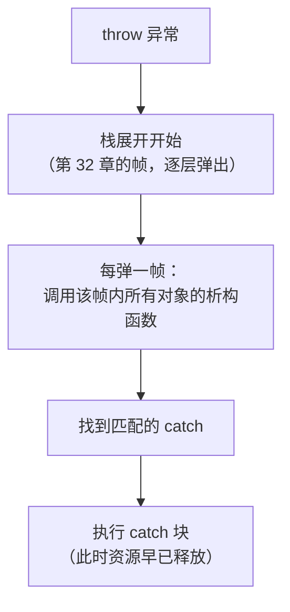

# 第 37 章 · RAII

**简体中文** ｜ [English](./37-raii.en-US.md)

---

> 第 36 章的 GC 管住了内存——可**资源不止内存**。文件句柄、锁、网络连接、数据库事务，个个都要"用完即还"，而且还的时机必须**确定**：GC 的"总有一天"不够用（上一章实测过 FinalizationRegistry 的讣告根本没送达、Python 环里的 `__del__` 要等 `gc.collect()`）。
>
> C++ 的确定性析构（第 36 章实测：作用域结束即析构、构造逆序）在这里从"特色"升格为**范式**：**RAII——资源获取即初始化**，把资源的生命周期焊死在对象的生命周期上。它的威力用一个**异常安全测试**就能量出来：在持有资源时抛异常——手动风格的释放语句**永远执行不到**（五门语言实测：全都没有 `[释放]` 打印，句柄泄漏），而 RAII 风格的释放**照常发生**（实测：`[释放]` 在异常被捕获之前就打印了——栈展开会经过每一个析构函数）。
>
> 于是五门语言向同一个思想集体致敬：C++ 的析构函数、Python 的 `with`、Java 的 try-with-resources、C# 的 `using`——**语法各异，三条规律完全一致**（实测三连）：作用域绑定、逆序释放、异常路径也走。唯一的缺席者是 JavaScript：提案已到 Stage 3、`Symbol.dispose` 已是标准符号（实测 `typeof` 为 symbol），但本机 Node 22 上**语法要开 flag、开了 flag 语义也没实现**（实测：非 disposable 对象不抛 TypeError）——所以 JS 至今只能手写 `try/finally`，三个资源就要嵌三层。
>
> 还有一个更狠的问题：**释放本身失败了怎么办？** 五门语言的答案分裂成一条梯度（全部实测）：Java 把 close 的异常**抑制**起来、主异常完好保留（唯一不丢的）；Python 用 `__context__` 留下原异常的线索；C# 和 JS 让主异常**彻底丢失**；而 C++ 最极端——栈展开中析构再抛异常直接 `std::terminate`，**进程当场死亡**（实测退出码 134）。

## 1. 学习目标

本章结束后，你将能够：

- 说清 RAII 的核心公式（**资源生命周期 = 对象生命周期**）以及它为什么优于"记得调用 close"；
- 用**异常安全测试**证明 RAII 的价值：手动释放被跳过 vs 自动释放照常发生（五语言实测）；
- 说出 RAII 家族的三条共同规律（作用域绑定、逆序释放、异常路径也走——实测三连）与四种语法（析构函数 / `with` / try-with-resources / `using`）；
- 回答"**释放本身失败怎么办**"，并画出五语言的处理梯度（实测：Java 抑制 → Python 可追溯 → C#/JS 丢失 → C++ 进程死）；
- 识别 JS 的缺席现状（提案 Stage 3、`Symbol.dispose` 就位、语义未实现——实测）与当下的三种替代写法。

---

## 2. 为什么会出现这个概念

### GC 解决不了的那一半

第 36 章的结论有个前提：GC 管的是**内存**。可程序还持有大量别的东西：

| 资源 | 为什么不能等 GC |
|------|----------------|
| 文件句柄 | 操作系统给每个进程的句柄数有上限——耗尽就打不开新文件了 |
| 锁 | 不释放 = 别人永远等下去（死锁） |
| 数据库连接 | 连接池就那么大，攥着不放全线阻塞 |
| 网络套接字 | 对端在等你关闭，超时前一直占着 |
| 数据库事务 | 不提交/回滚 = 持锁 + 其他会话阻塞（本章 SQL 节） |

**这些资源的共同点：稀缺、且释放时机必须确定**。 而 GC 的承诺只有"总有一天"——第 36 章实测过它有多不可靠（FinalizationRegistry 的讣告未送达、循环里的 `__del__` 要等分代扫描）。

### "记得调用 close" 为什么不够

```cpp
FileHandle* f = new FileHandle("data.txt");
process(f);          // ⚠️ 如果这里抛异常……
delete f;            // ……这一行永远执行不到
```

**实测五连**（本章钥匙实验）：五门语言的手动风格在异常面前全部失守——没有任何 `[释放]` 打印。而且异常只是最显眼的那条路，还有 `return`、`break`、`continue`、多重出口……**每增加一条离开作用域的路径，就多一个忘记释放的机会**。

### RAII 的答案：把释放焊在析构上

```cpp
class FileHandle {
    FileHandle(name)  { 打开文件; }    // 构造 = 获取资源
    ~FileHandle()     { 关闭文件; }    // 析构 = 释放资源
};
{
    FileHandle f("data.txt");           // 获取
    process(f);                         // 出任何事都不怕
}                                        // 作用域结束 → 析构 → 释放（必然发生）
```

> **一句话**：RAII 把"记得释放"从**程序员的纪律**变成**语言的保证**——因为离开作用域的每一条路（正常结束、return、异常）都必须经过析构函数。第 36 章 C++ 的"确定性析构"在这里兑现了它的全部价值。

---

## 3. 底层原理

### 核心公式

```text
资源生命周期 = 对象生命周期
获取资源 → 写在构造函数里（获取失败就构造失败，对象不会以半残状态存在）
释放资源 → 写在析构函数里（对象一死，资源必还）
```

**"资源获取即初始化"这个名字强调的是前半句**（获取写进构造），但 RAII 真正的价值在后半句（释放写进析构）——所以它也常被叫作 SBRM（Scope-Bound Resource Management，作用域绑定的资源管理），后者其实更准确。

### 钥匙实验：异常安全测试

```text
在持有资源时抛异常，释放还会发生吗？
```

**手动风格**（五语言实测，全部失守）：

```text
[获取] 打开 manual.txt
捕获: 中途出错   ← 没有任何 [释放] 打印！句柄泄漏
```

**RAII 风格**（五语言实测，全部安全）：

```text
[获取] 打开 raii.txt
[释放] 关闭 raii.txt      ← 注意顺序：释放发生在异常被捕获之前
捕获: 中途出错
```

**顺序是关键证据**：`[释放]` 打印在 `捕获` 之前，说明释放发生在**栈展开途中**——异常从抛出点一路向上传播时，每经过一个作用域就调用其中所有对象的析构函数，然后才轮到 catch 块执行。

### 栈展开：异常安全的物理机制



第 32 章拆解过栈帧的构造与弹出；异常传播就是**受控的连续弹帧**，而 RAII 正是搭在这个机制上——把清理代码挂到"帧弹出"这个必经事件上。

### 三条共同规律（实测三连）

无论语法长什么样，RAII 家族都遵守：

| 规律 | 实测证据 |
|------|---------|
| **作用域绑定** | 块结束即释放，无需任何显式调用（五语言实测 ①） |
| **逆序释放** | 三个资源实测全部按 3-2-1 释放（构造/声明的逆序） |
| **异常路径也走** | 异常传播中释放照常发生（钥匙实验，五语言实测） |

**为什么必须逆序？** 因为后获取的资源可能依赖先获取的（比如先开连接、再开事务）——释放时必须先还依赖方，才能还被依赖方。这与第 32 章"栈帧后进先出"是同一个道理，也是同一套机制。

### 第二钥匙：释放本身失败时

真实世界里 `close()` 也会失败（磁盘满、网络断）。此时业务异常和释放异常撞在一起，谁保留？**五语言实测的梯度**：

| 语言 | 机制 | 主异常的下场 |
|------|------|-------------|
| **Java** | 抑制异常（`getSuppressed()`） | ✅ **完好保留**（实测：主异常 + 被抑制异常都在） |
| **Python** | 异常链（`__context__`） | ⚠️ 被顶替，但**原异常可追溯**（实测 `__context__` = 业务异常） |
| **C#** | 无机制 | ❌ **彻底丢失**（实测 `InnerException` 为空） |
| **JavaScript** | 无机制 | ❌ **彻底丢失**（实测 `cause` 为空） |
| **C++** | 栈展开中禁止再抛 | 💀 **进程死亡**（实测 `std::terminate`，退出码 134） |

**Java 的抑制异常是这道题的最优解**——它是唯一"两个异常都不丢"的设计。而 C++ 的极端处理有其道理：栈展开进行中再抛异常，运行时无法决定该处理哪一个，与其未定义不如立刻终止——**所以 C++ 的铁律是"析构函数绝不抛异常"**（C++11 起析构函数默认 `noexcept`）。

---

## 4. JavaScript

JS 是五门语言里**唯一没有作用域绑定资源管理的**——提案在路上，但还没到。

### 当下唯一可靠的手段：`try/finally`（实测）

```javascript
const f = new FileHandle("data.txt");
try {
  使用(f);
} finally {
  f.close();          // 必须自己写——语言不帮你
}
```

钥匙实验同款结论（实测）：裸风格泄漏、`try/finally` 安全。

### 多个资源：嵌套的丑陋（实测）

```javascript
const a = new FileHandle("第一个");
try {
  const b = new FileHandle("第二个");
  try {
    const c = new FileHandle("第三个");
    try { 使用(a, b, c); }
    finally { c.close(); }
  } finally { b.close(); }
} finally { a.close(); }
```

释放顺序确实是 3-2-1（实测正确），但**代码嵌了三层**——对比 Python 的 `with a, b, c:` 一行、Java 的 try-with-resources 一组分号。这就是"没有语言支持"的真实成本。

### 提案现状：符号就位，语义未到（shell 实测）

```text
typeof Symbol.dispose = symbol        ← well-known symbol 已进标准
using 声明（无 flag）：SyntaxError
using 声明（--js-explicit-resource-management）：语法通过，但——
  探针1：非 disposable 对象不抛 TypeError → 语义未实现
  探针2：dispose 方法根本没被调用
```

**Explicit Resource Management 提案**（TC39 Stage 3）规划的最终形态：

```javascript
{
  using f = openFile("data.txt");     // 块结束自动调用 f[Symbol.dispose]()
  await using conn = connect();       // 异步版
}
```

`Symbol.dispose` 已经是标准符号（实测），TypeScript 5.2 起可用（编译期降级），但**本机 Node 22.21.1 的 V8 实现仍是"in progress / experimental"**——语法能解析，语义是空的。写库时可以**提前实现 `[Symbol.dispose]()` 方法**，将来引擎跟上就自动受益。

### 折中方案：高阶函数包住资源（实测）

```javascript
function withResource(name, fn) {
  const res = new FileHandle(name);
  try { return fn(res); }
  finally { res.close(); }      // 释放逻辑写一次，调用方没有忘记的机会
}
```

**把 `finally` 封进库里**——这是 JS 生态的主流做法（`fs.promises` 的用法惯例、测试框架的 `beforeEach/afterEach`、React 的 `useEffect` 清理函数，本质都是它）。

> **注意事项**：`finally` 里若抛出异常会**彻底顶掉**主异常（实测 `cause` 为空）——所以 `close()` 一定要包一层 `try { } catch { 记日志 }`；异步资源用 `try/finally` + `await` 同样有效，但要注意 `finally` 里的 `await` 会延后异常传播。

---

## 5. Python

Python 的答案是 **`with` 语句 + 上下文管理器协议**——RAII 思想最优雅的移植之一。

### 协议：`__enter__` / `__exit__`（实测）

```python
class FileHandle:
    def __enter__(self):
        print("[获取] 打开"); return self       # 返回值绑定到 as 后的名字
    def __exit__(self, exc_type, exc_val, exc_tb):
        print("[释放] 关闭"); return False       # False = 不吞异常
```

**`__exit__` 收得到异常信息**（实测）：

```text
[释放] 关闭 raii.txt   ← 带着异常信息 RuntimeError 退出
```

这是 Python 相对 C++ 析构函数的一个**优势**：清理逻辑能知道"这次是正常退出还是异常退出"，可以据此决定是提交还是回滚（数据库事务上下文管理器的标准写法）。

### 多资源与逆序（实测）

```python
with FileHandle("第一个"), FileHandle("第二个"), FileHandle("第三个"):
    raise RuntimeError("出错了")
```

```text
[释放] 关闭 第三个 / 第二个 / 第一个   ← 3-2-1，且每个都收到了异常信息
```

### `contextlib`：用生成器写上下文管理器（实测）

```python
@contextlib.contextmanager
def managed(name):
    print(f"[获取] {name}")
    try:
        yield name          # yield 之前 = __enter__，之后 = __exit__
    finally:
        print(f"[释放] {name}")     # finally 保证异常路径也执行
```

一个装饰器把"写类实现两个方法"压缩成"写一个带 `yield` 的函数"——这是 Python 生态里最常见的写法（`contextlib.suppress`、`redirect_stdout`、`ExitStack` 同族）。

### 危险特性：`__exit__` 返回 `True` 会吞异常（实测）

```text
[释放] 并且吞掉了异常
程序继续运行——异常被 __exit__ 吞了
```

**其他四门语言都没有这个能力**——Python 的上下文管理器可以决定"异常到此为止"。合法用途只有 `contextlib.suppress(FileNotFoundError)` 这类明确意图的场景；在通用资源类里返回 `True` 是重大事故源（异常无声消失）。

> **注意事项**：`__exit__` 里抛异常会顶替主异常，但 Python 的异常链会保留原异常（实测 `__context__` = 业务异常）——比 C#/JS 的彻底丢失好，但仍不如 Java 的抑制机制清晰。多个动态数量的资源用 `contextlib.ExitStack`（可以在循环里注册，退出时统一逆序释放）。

---

## 6. Java

Java 的 **try-with-resources**（Java 7 引入）是 RAII 移植里**设计最完备**的一个——尤其是抑制异常。

### 协议：`AutoCloseable`（实测）

```java
try (FileHandle f = new FileHandle("data.txt")) {
    使用(f);
}   // 自动调用 f.close()，异常路径也走
```

### 多资源逆序（实测）

```java
try (FileHandle a = new FileHandle("第一个");
     FileHandle b = new FileHandle("第二个");
     FileHandle c = new FileHandle("第三个")) {
    throw new RuntimeException("出错了");
}
```

```text
[释放] 关闭 第三个 / 第二个 / 第一个   ← 3-2-1
```

### Java 独有：抑制异常（钥匙实验二，实测）

**业务出错 + 关闭也出错，谁赢？**

```text
try-with-resources 的答案（实测）：
  主异常: 业务逻辑出错（主异常）           ← 保留！
  被抑制: 关闭 双重故障.txt 时也出错了     ← 也没丢！
```

**对比手写 `finally`**（实测）：

```text
最终看到的异常: 关闭 finally.txt 时也出错了
被抑制列表长度: 0   ← 主异常彻底消失了，只剩 close 的异常
```

**这就是 try-with-resources 存在的最深理由**：它不只是语法糖，而是修复了手写 `finally` 的一个真实缺陷——**close 的异常会"顶掉"真凶**。排查生产问题时，看到的是"关闭连接失败"而真正的业务错误已经消失，是最令人绝望的场景之一。Java 是五门语言里唯一系统性解决它的。

> **注意事项**：资源必须在 try 的括号内**声明**（Java 9 起可以引用 effectively final 的既有变量）；`close()` 应设计成幂等且不抛异常（抛了就走抑制通道，虽不丢失但增加噪音）；`Cleaner`（Java 9+）用于兜底"忘了 close"的场景，但它属于 GC 通道，只能当保险不能当主力（第 36 章实测过 finalizer 的不可靠）。

---

## 7. C++

C++ 是 RAII 的**发源地**——这里它不是一个语法特性，而是整门语言的资源管理哲学。

### 基础形态（实测）

```cpp
class FileHandle {
    FileHandle(std::string n) { std::cout << "[获取] 打开\n"; }
    ~FileHandle()             { std::cout << "[释放] 关闭\n"; }
};
{
    FileHandle f("data.txt");
    使用(f);
}   // 析构在这里执行——实测无需任何 close 调用
```

### 每一条出口都被覆盖（实测）

```text
正常结束 → 析构（实测 ①）
提前 return → 析构（实测 ⑤：提前 return 后 [释放] 照常打印）
抛出异常 → 析构（实测 ②：栈展开）
```

**这是 RAII 相对其他语言的独特之处**：它不需要专门的语法（`with`/`using`/try-with-resources），因为**任何离开作用域的方式**都必然触发析构。其他四门语言的资源管理语法，本质都是在模拟 C++ 的这个自然行为。

### 标准库处处是 RAII（实测提及）

```cpp
std::lock_guard<std::mutex> guard(m);   // 构造上锁，析构解锁（实测）
std::unique_ptr<T> p(new T);            // 析构 delete（第 38 章）
std::ofstream file("out.txt");          // 析构关闭文件
std::scoped_lock lk(m1, m2);            // 多锁 RAII，还防死锁
```

**现代 C++ 几乎没有裸 `new`/`delete`、裸 `lock`/`unlock`** ——不是因为它们不能用，而是因为 RAII 版本严格更好：少写一行、多一份异常安全保证。

### 铁律：析构函数绝不抛异常（shell 实测）

```cpp
struct Bad { ~Bad() noexcept(false) { throw std::runtime_error("析构里抛的"); } };
try {
    Bad b;
    throw std::runtime_error("业务异常");   // 栈展开中 b 的析构又抛 → 双异常
} catch (...) { /* 永远到不了这里 */ }
```

```text
libc++abi: terminating due to uncaught exception
退出码: 134（SIGABRT —— std::terminate）
```

**栈展开途中析构再抛异常 = 进程当场死亡**——运行时无法决定该处理哪个异常，索性终止。所以 C++11 起**析构函数默认就是 `noexcept`**（要抛得显式写 `noexcept(false)`，如上面的实验）。工程铁律：**析构函数里的所有可能失败的操作都必须自己 `try/catch` 掉**。

> **注意事项**：RAII 类需要考虑拷贝语义（第 35 章）——默认拷贝会导致同一资源被释放两次；标准做法是禁用拷贝（`= delete`）或实现移动语义（第 38 章的 `unique_ptr` 正是如此）；`std::lock_guard` 与 `std::unique_lock` 的区别就在于后者可移动、可提前解锁。

---

## 8. C#

C# 的 **`using` + `IDisposable`** 与 Java 的 try-with-resources 是同一思路，但多了一件五门语言里独一份的东西：**异步 RAII**。

### 两种写法（实测）

```csharp
using (var f = new FileHandle("data.txt")) { ... }   // using 语句：花括号界定作用域
using var f = new FileHandle("data.txt");            // using 声明（C# 8）：作用域到方法末尾
```

后者去掉了一层缩进——多个资源顺序声明时，代码扁平得多（实测 ③ 三个资源仍按 3-2-1 释放）。

### C# 独有：`await using`（实测）

```csharp
class AsyncFileHandle : IAsyncDisposable {
    public async ValueTask DisposeAsync() {
        await Task.Delay(1);            // 真正的异步清理：刷盘、发关闭帧、优雅断连
        Console.WriteLine("[释放] 异步关闭");
    }
}
await using (var af = new AsyncFileHandle("async.txt")) { ... }
```

```text
[获取] 异步打开 async.txt
异步使用中……
[释放] 异步关闭 async.txt      ← 实测：释放过程本身是 await 的
```

**为什么这很特殊**：C++ 的析构函数、Java 的 `close()`、Python 的 `__exit__` 都**不能 await**——遇到需要异步清理的资源（网络连接的优雅关闭、缓冲区异步刷盘），它们只能阻塞等待或放弃。C# 的 `IAsyncDisposable` 是五门语言里唯一的正解（JS 的提案里也规划了 `await using`，但如上节实测尚未落地）。

### 释放失败时：主异常丢失（shell 实测）

```text
最终看到: Dispose 里抛的异常
原异常还找得到吗: 找不到——被 Dispose 的异常顶替
```

与 JS 同级、不如 Java 的抑制机制与 Python 的异常链——**这是 C# `using` 设计上的一个遗憾**。工程对策：`Dispose()` 内部自行 `try/catch` 并记日志，绝不让它抛出。

> **注意事项**：`IDisposable` 管的是**非托管资源**（句柄、连接），不是内存——第 33 章强调过这个区别；`Dispose()` 应幂等（可重复调用）；同时实现 `IDisposable` 与 `IAsyncDisposable` 时，`await using` 优先走异步版本；`DisposeAsync` 里不要 `.Result`/`.Wait()`（死锁风险，第 42 章）。

---

## 9. SQL

数据库的 RAII 对应物是**事务**——`BEGIN` 获取、`COMMIT`/`ROLLBACK` 释放，而且它把"全有或全无"做成了系统级保证。

### 事务即作用域绑定的资源（实测）

```sql
BEGIN;
UPDATE account SET balance = balance - 30 WHERE id = 1;
UPDATE account SET balance = balance + 30 WHERE id = 2;
COMMIT;
```

```text
① 转账成功后: 小明=70, 小红=130
```

### 钥匙实验的数据库版：出错即回滚（实测）

```sql
BEGIN;
UPDATE account SET balance = balance - 50 WHERE id = 1;
-- 业务校验失败
ROLLBACK;
```

```text
② 回滚之后: 小明=70（扣款被完整撤销——半途而废的状态不存在）
```

**这正是 RAII 异常安全的数据库版本**：出错时不是"释放资源"，而是"撤销一切"——**原子性就是数据库的异常安全**。应用层的标准写法把两者叠在一起：

```python
with connection.transaction():      # __exit__ 里：正常 → COMMIT，异常 → ROLLBACK
    转账()
```

上下文管理器 + 事务的组合，是 RAII 思想跨越两个世界的握手。

### `SAVEPOINT`：嵌套作用域（实测）

```sql
BEGIN;
UPDATE ... ;                        -- 外层改动
SAVEPOINT inner_scope;
UPDATE ... ;                        -- 内层改动
ROLLBACK TO inner_scope;            -- 只撤内层
COMMIT;                             -- 外层照常提交
```

```text
③ 嵌套回滚后: 小明=1070（+1000 保留，+9999 撤销——内层作用域独立回滚）
```

**`SAVEPOINT` 就是嵌套的 RAII 作用域**——内层作用域可以独立失败回滚，不影响外层。与 C++ 的嵌套块、Python 的嵌套 `with` 结构完全同构。

### 忘了结束事务的后果

与 C++ 忘了 `delete`、Java 忘了 `close()` 完全对应：**连接持锁、其他会话阻塞、直到超时或断连**。ORM 框架（SQLAlchemy、Hibernate、EF Core）无一例外地把事务包进上下文管理器/using 块——**让"忘记"在语法上不可能发生**，正是 RAII 的核心承诺。

> **工程提醒**：长事务是生产事故高发区（持锁时间 = 阻塞时间）——事务作用域应尽可能小，绝不要在事务里做网络调用或等待用户输入；连接池的连接同样是 RAII 资源，必须用 `with`/`using` 归还。

---

## 10. 五语言横向对比

### ① 资源管理机制对比

| 特性 | JavaScript | Python | Java | C++ | C# |
|------|-----------|--------|------|-----|-----|
| 语法 | **无**（`try/finally`） | `with` | try-with-resources | **析构函数**（无需语法） | `using` |
| 协议 | `Symbol.dispose`（未生效） | `__enter__`/`__exit__` | `AutoCloseable` | 析构函数 | `IDisposable` |
| 作用域绑定 | ❌ 手写 | ✅ | ✅ | ✅ **任何出口** | ✅ |
| 逆序释放 | 手写嵌套（实测） | ✅（实测 3-2-1） | ✅（实测 3-2-1） | ✅（实测 3-2-1） | ✅（实测 3-2-1） |
| 异常路径 | 手写 `finally`（实测） | ✅（实测） | ✅（实测） | ✅ **栈展开**（实测） | ✅（实测） |
| 清理知道异常信息 | ❌ | ✅ **`__exit__` 收参**（实测） | ❌ | ❌ | ❌ |
| 异步释放 | 提案中 | ❌（`__aexit__` 需 async with） | ❌ | ❌ | ✅ **`await using`**（实测） |
| 能吞掉异常 | ❌ | ✅ **返回 True**（实测） | ❌ | ❌ | ❌ |

### ② 钥匙实测一：异常安全测试总表

```text
持有资源时抛异常，[释放] 还会打印吗？

手动风格：C++ ❌ / Python ❌ / Java ❌ / C# ❌ / JS ❌   ← 五语言全部失守（实测）
RAII 风格：C++ ✅ / Python ✅ / Java ✅ / C# ✅ / JS ✅   ← 且都在 catch 之前完成（实测）
                                                          （JS 需手写 try/finally）
```

**一个实验证明一件事**：RAII 不是"更漂亮的写法"，而是**异常安全的唯一可靠途径**。

### ③ 钥匙实测二：释放本身失败时的五种下场

```text
业务异常 + 释放异常同时发生——

Java:    主异常保留 + close 异常进 getSuppressed()      ← ✅ 最优解，两个都不丢（实测）
Python:  主异常被顶替，但 __context__ 保存原异常        ← ⚠️ 可追溯（实测）
C#:      主异常被顶替，InnerException 为空              ← ❌ 彻底丢失（实测）
JS:      主异常被顶替，cause 为空                       ← ❌ 彻底丢失（实测）
C++:     std::terminate，进程当场死亡（退出码 134）     ← 💀 最极端（实测）
```

**这道题没有免费的答案**：Java 付出了 API 复杂度（`getSuppressed()` 很少有人查），C++ 选择了"宁可立刻死也不要未定义行为"，C#/JS 则是设计上的疏漏。工程结论一致：**释放代码里绝不要让异常逃出来**。

### ④ 两条设计分歧

**分歧一：需不需要专门语法**

```text
不需要（C++）：      析构函数是语言的自然行为——任何离开作用域的路都触发（实测早返回、异常）
                     代价：需要"对象"这个载体，纯函数式风格无处安放
需要（Python/Java/C#）：GC 语言的对象死亡时机不确定（第 36 章实测），
                     所以必须用语法标记"这个作用域结束时释放"
```

**分歧二：清理该不该知道上下文**

```text
知道（Python __exit__ 收异常参数）：清理可以分情况——正常提交、异常回滚（事务的标准写法）
不知道（C++/Java/C#）：              清理逻辑更简单纯粹，但要区分成败得自己记状态
                                     （C++ 的做法：用一个 committed 标志位 + 析构里判断）
```

### ⑤ 共同点与差异根源

**共同点**：五门语言（含 JS 的手写版）都实现了同样的三条规律（实测三连）；都把"资源"抽象成一个有明确获取/释放点的对象；都承认 GC 管不了非内存资源（哪怕是 GC 最强的 Java/C#）。

**差异根源**：

- **C++ 有确定性析构**（第 36 章实测），所以 RAII 是免费的副产品——反过来说，正因为没有 GC，它**必须**把这件事做到极致；
- **Python/Java/C# 有 GC**，对象死期不确定（第 36 章实测），只能用语法显式标出作用域——**`with`/`using`/try-with-resources 都是在 GC 世界里重建确定性**；
- **JS 缺席**是历史原因：早期没有块级作用域（`var` 时代）、单线程 + 事件循环让"作用域"概念更弱、且浏览器环境里稀缺资源较少——直到 Node 的服务端场景才让需求变得迫切（提案因此推进）；
- **SQL 的事务**证明这是超越语言的设计模式：**一切"必须成对出现"的操作，都应该由作用域来保证配对**。

---

## 11. 底层实现对比

| 运行时 | RAII 的实现机制 | 关键细节 |
|--------|----------------|---------|
| **V8**（JavaScript） | 无——`try/finally` 由字节码的异常表实现 | 提案落地后将编译为隐式 `try/finally` + `Symbol.dispose` 调用（实测：语法已可解析，语义未实现） |
| **CPython** | `with` 编译为 `SETUP_WITH`/`WITH_EXCEPT_START` 字节码 | `__exit__` 的三个参数由异常状态填充（实测收到 `RuntimeError`）；`ExitStack` 用列表维护动态数量的清理回调 |
| **JVM**（Java） | try-with-resources 是**纯语法糖** | 编译期展开为嵌套 `try/finally` + `addSuppressed()` 调用——`javap` 可见（第 32 章工具）；这解释了为何抑制机制是"免费"的 |
| **C++**（原生） | 析构函数调用点由编译器插入 | 编译期就知道每个作用域出口该调哪些析构（第 32 章的帧信息）；异常表（.eh_frame）记录栈展开时的析构调用序列 |
| **CLR**（C#） | `using` 展开为 `try/finally` + `Dispose()` | IL 层面可见；`await using` 展开为异步状态机（第 32 章实测过 `MoveNext`）里的 `finally` |

**一个值得记住的分野**：

```text
C++ 的 RAII 是运行时机制（栈展开表驱动的析构调用）——零成本，编译期完全确定
其余四家的 RAII 是语法糖（编译为 try/finally）——同样零运行时成本，但需要程序员写出那个语法
所以真正的区别不在性能，而在「忘记的可能性」：
  C++ 只要对象在栈上就不可能忘；其余语言忘了写 with/using 就退化成手动模式（实测：泄漏）
```

---

## 12. 性能分析

### RAII 本身几乎零成本

```text
C++：    析构调用是编译期确定的直接调用——可内联，无运行时查找
其余四家：try/finally 的正常路径开销接近零（异常表驱动，不进 catch 就不花钱）
```

**"零成本异常"模型**（C++/Java/C# 都采用）：不抛异常时，`try` 块的开销为零——代价全部集中在真的抛出时（查表、栈展开，可能上千纳秒）。这就是**"异常只用于异常情况"**这条建议的性能依据（第 36 章讲过 Java 异常构造要拍全栈快照）。

### 真正的成本在别处

| 成本 | 说明 |
|------|------|
| 资源获取本身 | 打开文件、建连接是毫秒级——RAII 的开销与之相比可以忽略 |
| 作用域粒度 | **持有时间才是关键**：事务/锁的作用域越小越好（SQL 节的长事务警告） |
| 对象构造 | RAII 需要一个对象载体——C++ 栈对象几乎免费（第 31 章），托管语言则是一次堆分配（第 33 章 3 ns） |

### 反模式：为了 RAII 而放大作用域

```cpp
{
    std::lock_guard<std::mutex> guard(m);   // 锁在这里获取
    读数据();
    做一堆与共享数据无关的计算();            // ⚠️ 锁被白白持有
    网络调用();                             // ⚠️⚠️ 灾难
}
```

**RAII 让释放变自动，但获取时机仍要你决定**——把不需要保护的代码移出作用域，是并发性能的第一课（第 45 章展开）。

> ⚠️ 惯例提醒：本章的性能话题不是"RAII 快不快"（它几乎免费），而是"作用域画得对不对"。锁和事务的持有时长直接决定系统吞吐——这比任何微优化都重要一个数量级。

---

## 13. 工程实践

| 场景 | ✅ 推荐 | ❌ 不推荐 | 原因 |
|------|--------|----------|------|
| 文件/连接/锁 | 语言的 RAII 语法（`with`/`using`/try-with-resources/栈对象） | 手动 close + 记得写 finally | 异常路径实测五语言全部失守 |
| C++ 资源类 | 禁用拷贝或实现移动（第 38 章） | 用默认拷贝构造 | 同一资源被释放两次 |
| C++ 析构函数 | 内部 `try/catch` 吃掉所有异常 | 让异常逃出析构 | 实测 `std::terminate`，进程死 |
| Java close 实现 | 幂等 + 尽量不抛 | 抛出并依赖调用方处理 | 走抑制通道虽不丢但增噪音 |
| Python 通用资源类 | `__exit__` 返回 `False`/`None` | 返回 `True` | 静默吞异常（实测特性） |
| Python 动态数量资源 | `contextlib.ExitStack` | 手写嵌套 `with` | 循环里注册，退出时统一逆序释放 |
| C# 异步资源 | `IAsyncDisposable` + `await using` | 在 `Dispose()` 里 `.Wait()` | 死锁风险（第 42 章） |
| JS 资源管理 | `try/finally` 或高阶函数封装（实测） | 裸调用 close | 语言无保障，只能靠封装 |
| JS 面向未来 | 顺手实现 `[Symbol.dispose]()` | 等提案落地再改 | 符号已标准（实测），提前实现零成本 |
| 数据库事务 | 上下文管理器/using 包住 | 手写 BEGIN/COMMIT | 忘记回滚 = 持锁阻塞（SQL 节） |
| 锁与事务的作用域 | **越小越好** | 为方便而放大 | 持有时长 = 阻塞时长 |

### 判断口诀

```text
这个东西需要"用完还回去"吗？
  是 → 找语言的 RAII 语法，不要手写 close
  语言没有（JS）→ try/finally，或封装成高阶函数让调用方无从遗忘
获取和释放必须成对吗？
  是 → 让作用域来保证配对，这就是 RAII 的全部
```

---

## 14. 最佳实践

- **一切稀缺资源都用 RAII 包装**：文件、锁、连接、事务、临时目录、性能计时器——凡是"必须成对"的操作都适用（实测：手动风格在异常前全线失守）。
- **释放代码永不抛异常**：C++ 会 `terminate`（实测退出码 134）、C#/JS 会丢失主异常（实测）——释放逻辑里自己 `try/catch` 并记日志。
- **作用域画到最小**：RAII 保证了"一定释放"，但"何时释放"仍由你决定——锁和事务尤其（长事务是生产事故高发区）。
- **Python 记得 `ExitStack`**：动态数量的资源不要手写嵌套；`@contextmanager` 让自定义上下文管理器只需十行。
- **Java 别忽略 `getSuppressed()`**：排查"关闭失败"类问题时，真凶往往在被抑制列表里（实测：唯一不丢主异常的设计）。
- **C# 异步资源用 `IAsyncDisposable`**：这是五门语言里唯一能 `await` 的清理路径（实测）——别在同步 `Dispose` 里阻塞等待。
- **JS 现在就实现 `[Symbol.dispose]()`**：符号已标准（实测），语义落地后你的库自动受益；当下用 `try/finally` 或高阶函数封装。
- **RAII 不能替代显式的错误处理**：它保证资源被释放，不保证操作成功——`close()` 的返回值/异常在数据完整性场景（写文件、提交事务）仍需检查。

---

## 15. 常见坑

**坑 1 · 忘了写 `with`/`using`，退化成手动模式**

```text
实测：五门语言的手动风格在异常前全部失守——没有任何 [释放] 打印
```

**如何避免**：静态检查工具（Python 的 `flake8-bugbear`、Java 的 SpotBugs、C# 的 CA2000）都能检出"未释放的资源"；C++ 则从源头杜绝——不要裸 `new`。

**坑 2 · C++ 析构函数抛异常**（实测进程死）

```text
libc++abi: terminating due to uncaught exception   退出码 134
```

**如何避免**：析构函数默认 `noexcept`（C++11 起），内部所有可能失败的操作都要 `try/catch` 吃掉；需要报告失败的清理操作，提供一个显式的 `close()` 方法让调用方主动调（`std::ofstream` 就是这么设计的）。

**坑 3 · 手写 `finally` 让 close 顶掉主异常**（实测）

```text
最终看到的异常: 关闭时出错   被抑制列表长度: 0   ← 真凶消失了
```

**如何避免**：Java 用 try-with-resources（自动走抑制通道）；其他语言在 `finally` 里包一层 `try { close() } catch { 记日志 }`——**绝不让清理异常盖过业务异常**。

**坑 4 · Python `__exit__` 返回 `True` 静默吞异常**（实测）

```python
def __exit__(self, *args):
    self.close()
    return True        # ⚠️ 所有异常到此为止，调用方一无所知
```

**如何避免**：通用资源类一律返回 `False`/`None`（不写 return 即可）；只有明确意图的场景（`contextlib.suppress`）才返回 `True`。

**坑 5 · RAII 对象被拷贝，资源释放两次**（C++）

```cpp
FileHandle a("data.txt");
FileHandle b = a;          // ⚠️ 默认拷贝——两个对象析构时都会关同一个句柄
```

**如何避免**：资源类禁用拷贝（`FileHandle(const FileHandle&) = delete;`）或实现移动语义（第 38 章）；这也是 `unique_ptr` 只可移动不可拷贝的原因。

**坑 6 · 把 GC 当资源管理器**

```text
第 36 章实测：FinalizationRegistry 讣告未送达；循环里的 __del__ 要等 gc.collect()
```

**如何避免**：内存交给 GC，**其他一切交给 RAII**；finalizer/`Cleaner`/`FinalizationRegistry` 只能当"忘了关"的兜底告警，不能当主力。

**坑 7 · 事务作用域过大**（SQL）

```python
with transaction():
    数据 = 查询()
    结果 = 调用外部API(数据)      # ⚠️ 网络调用期间一直持锁
    写回(结果)
```

**如何避免**：事务内只做数据库操作；外部调用移到事务外（必要时用补偿事务/最终一致性模式）——持锁时长直接决定并发吞吐。

---

## 16. 面试题

**基础**

1. RAII 的全称和核心思想是什么？为什么它也被叫作 SBRM？
2. 为什么"记得调用 close()"不够可靠？列举三条离开作用域的路径。
3. `with`、`using`、try-with-resources 三者的共同规律是什么？

**中级**

4. **异常抛出时，RAII 的释放为什么还能发生？请用栈展开解释，并说明释放与 catch 块的先后顺序。**
5. 为什么多个资源要逆序释放？这与栈的什么特性一致？
6. **try-with-resources 相比手写 try/finally，除了少写代码还解决了什么真实缺陷？**

**高级**

7. **释放过程本身抛出异常时，五门语言分别如何处理？为什么 C++ 选择直接终止进程？**
8. C++ 的 RAII 为什么不需要专门语法，而 Java/C#/Python 必须引入语法？这与 GC 有什么关系？
9. 为什么 JavaScript 至今没有作用域绑定的资源管理？`Symbol.dispose` 提案解决了什么、现状如何？

---

## 17. 练习

**基础**

1. 在五门语言中各写一个"计时器"RAII 类：构造记录开始时间，析构/释放时打印耗时。
2. 复现钥匙实验：在你熟悉的语言里对比手动风格与 RAII 风格在异常下的行为。
3. 用 Python 的 `@contextlib.contextmanager` 把一个"临时切换工作目录"的操作封装成上下文管理器。

**提高**

4. **复现"释放失败"的五语言对照**：让 close/Dispose/`__exit__`/析构都抛异常，观察主异常的下场。
5. 用 `contextlib.ExitStack` 管理动态数量的文件（打开一个目录下的所有文件），验证逆序关闭。
6. 在 Java 里写一个双重故障场景，用 `getSuppressed()` 把真凶挖出来，并与手写 finally 版本对比。

**挑战**

7. 用 C++ 实现一个通用的 `scope_guard`（析构时执行任意 lambda），并支持"提交后不执行"（`dismiss()`）——这是事务型 RAII 的经典模式。
8. 给 JS 写一个 `withResources(...resources, fn)` 高阶函数：支持任意多个资源、保证逆序释放、且释放异常不覆盖主异常。
9. 实现一个数据库连接池的 RAII 包装：借出时获取、归还时释放，并处理"归还时连接已损坏"的情况（对应释放失败）。

---

## 18. 本章总结

**一句话总结**：GC 只管内存，**其余一切稀缺资源都需要确定性释放**——RAII 把资源生命周期焊在对象生命周期上，让"离开作用域的每一条路"（正常、return、异常）都必然经过释放；钥匙实验证明了它的不可替代性（五语言实测：手动风格在异常前全线失守、RAII 风格全部安全且释放先于 catch），三条规律跨语言一致（作用域绑定、逆序释放、异常路径也走——实测三连）；C++ 的析构函数是发源地也是唯一无需专门语法的（因为没有 GC，对象死期确定），Python/Java/C# 用 `with`/try-with-resources/`using` 在 GC 世界里重建确定性，JS 是唯一缺席者（提案 Stage 3、`Symbol.dispose` 已标准、语义未实现——实测）；而"释放本身失败"这道题分裂出一条梯度：Java 抑制异常两个都保留、Python 靠 `__context__` 可追溯、C#/JS 彻底丢失、C++ 直接 `std::terminate`（实测退出码 134）。

**核心知识点**

- **核心公式**：资源生命周期 = 对象生命周期；获取写进构造，释放写进析构。
- **钥匙实验一**（五语言实测）：异常安全测试——手动全败、RAII 全胜，且释放发生在 catch 之前（栈展开）。
- **三条共同规律**（实测三连）：作用域绑定、逆序释放（3-2-1）、异常路径也走。
- **钥匙实验二**（五语言实测）：释放失败梯度——Java 抑制 ✅ → Python 可追溯 ⚠️ → C#/JS 丢失 ❌ → C++ 进程死 💀。
- **语法四态**：C++ 析构（无需语法）/ Python `with`（`__exit__` 收异常信息）/ Java try-with-resources（抑制异常）/ C# `using`（唯一支持 `await`）。
- **JS 现状实测**：`Symbol.dispose` 已是标准符号，`using` 语法需 flag 且语义未实现——当下靠 `try/finally` 或高阶函数封装。
- **SQL 对应**（实测）：事务 = 作用域绑定资源、原子性 = 异常安全、`SAVEPOINT` = 嵌套作用域。
- **铁律**：释放代码永不抛异常（C++ 会 terminate，其余会丢主异常）。

**检查清单**

- [ ] 我能解释为什么"记得 close"不可靠，并说出三条离开作用域的路径。
- [ ] 我能用栈展开解释 RAII 的异常安全，包括释放与 catch 的顺序。
- [ ] 我能写出五门语言各自的 RAII 写法（含 JS 的替代方案）。
- [ ] 我知道释放失败时各语言的下场，以及"释放代码不抛异常"的铁律。
- [ ] 我能识别作用域过大的反模式（长事务、大锁）。

**下一章预告**：RAII 解决了"作用域内的资源"，但还有一类资源**天生活得比任何一个作用域都长**：被多处共享的对象——谁是最后一个使用者？谁负责释放？第 36 章讲过 GC 语言用可达性回答这个问题，而 C++ 没有 GC。第 38 章看它如何用**智能指针**在类型系统里回答：`unique_ptr` 把"唯一所有权"写进类型（不可拷贝只可移动）、`shared_ptr` 把引用计数做成库（第 36 章 CPython 的主引擎，这次是你手动引入的）、`weak_ptr` 专门拆解引用计数的死角——**循环引用**（第 36 章的钥匙实验，将在 C++ 里以真实泄漏的形式重现，然后被 `weak_ptr` 治好）。这是 Part 5 的最后一章，也是"没有 GC 如何活得很好"的完整答案。

---

## 19. 延伸阅读

- <a href="https://en.wikipedia.org/wiki/Resource_acquisition_is_initialization" target="_blank" rel="noopener">Wikipedia：RAII</a> — RAII 概念与跨语言对应物的综述。
- <a href="https://en.cppreference.com/w/cpp/language/raii" target="_blank" rel="noopener">cppreference · RAII</a> — C++ 官方参考中的 RAII 说明。
- <a href="https://isocpp.github.io/CppCoreGuidelines/CppCoreGuidelines#S-resource" target="_blank" rel="noopener">C++ Core Guidelines · Resource management</a> — 资源管理规范（R.1–R.13）的官方指南。
- <a href="https://docs.python.org/3/reference/datamodel.html#context-managers" target="_blank" rel="noopener">Python 文档 · 上下文管理器协议</a> — `__enter__`/`__exit__` 的语言参考。
- <a href="https://docs.python.org/3/library/contextlib.html" target="_blank" rel="noopener">Python 文档 · contextlib</a> — `@contextmanager` 与 `ExitStack` 的官方文档。
- <a href="https://docs.oracle.com/javase/tutorial/essential/exceptions/tryResourceClose.html" target="_blank" rel="noopener">Java Tutorials · try-with-resources</a> — 官方教程，含抑制异常说明。
- <a href="https://learn.microsoft.com/en-us/dotnet/csharp/language-reference/statements/using" target="_blank" rel="noopener">Microsoft Learn · using 语句</a> — `using` 语句与声明的官方文档。
- <a href="https://learn.microsoft.com/en-us/dotnet/standard/garbage-collection/implementing-disposeasync" target="_blank" rel="noopener">Microsoft Learn · 实现 DisposeAsync</a> — `IAsyncDisposable` 的官方指南。
- <a href="https://github.com/tc39/proposal-explicit-resource-management" target="_blank" rel="noopener">TC39 · Explicit Resource Management</a> — JS `using` 声明提案（本章实测的现状来源）。
