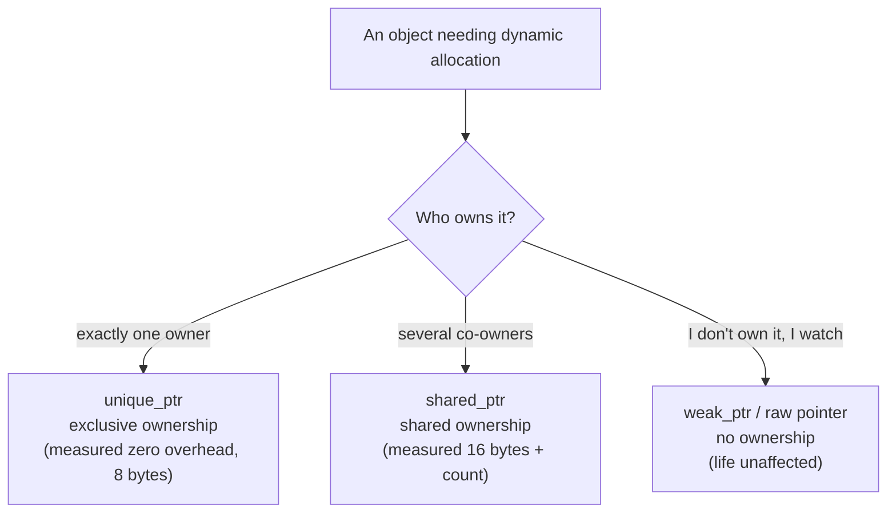
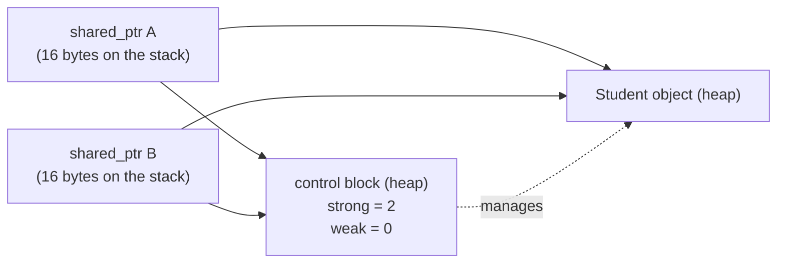

# Chapter 38 · Smart Pointers

[简体中文](./38-smart-pointers.md) ｜ **English**

---

> Chapter 37's RAII solved "resources within a scope," but one class of resource **outlives any single scope by nature**: objects shared in many places — who is the last user, and who releases? Chapter 36 showed GC languages answering with reachability; C++ has no GC.
>
> C++'s answer is to move the question **into the type system**: **smart pointers** — different types expressing different **ownership semantics**. `unique_ptr` says "only I may delete" (measured: copying it is a **compile error**, `call to implicitly-deleted copy constructor` — sole ownership enforced by the compiler), and its `sizeof` measures **8 bytes, identical to a raw pointer** — zero-overhead abstraction, literally. `shared_ptr` says "we hold it together; last one out turns off the lights" — measured `use_count` going 1 → 2 → 1, at the price of `sizeof` becoming **16 bytes** (one extra control-block pointer).
>
> But refcounting has the blind spot Chapter 36 identified, and this chapter makes it reappear in C++ **as a real, measurable leak**: two `shared_ptr`s pointing at each other, measured `use_count` of 2 apiece, and after the scope ends **not one `[destructor]` printed**; the `leaks` tool catches it red-handed — **6 leaks for 6488064 total leaked bytes**. This is the same scenario as Chapter 36's silent Python `__del__`, with one difference: **Python has a second engine as backstop (`gc.collect()` measured reclaiming 9 objects); C++ has nothing**.
>
> The cure is the third pointer: `weak_ptr` — **observe without counting**. Same structure, one side switched to weak: measured `use_count` no longer incremented, both `[destructor]`s printing normally. And `lock()` to promote, `expired()` to ask, is the same pattern spelled four ways alongside Python's `weakref`, Java's `WeakReference`, and JS's `WeakRef` (measured in four languages).
>
> The final surprise comes from SQL: a foreign key's three `ON DELETE` policies **map exactly onto the three ownership semantics** (measured three times) — `CASCADE` is `unique_ptr` (owner dies, owned dies with it), `RESTRICT` is `shared_ptr` (still referenced, may not die), `SET NULL` is `weak_ptr` (the reference nulls out without preventing death). **Ownership is not a C++ invention; it is every resource system's shared language.**

## 1. Learning Objectives

By the end of this chapter, you will be able to:

- State the **ownership semantics** each of the three smart pointers expresses, and choose among them (exclusive / shared / observing);
- Explain `unique_ptr`'s zero overhead (measured 8 bytes = raw pointer) and its compile-time ownership guarantee (measured: copying is a compile error);
- Read `shared_ptr`'s control block and reference count (measured 16 bytes, `use_count` changes), and know what makes it costlier than `unique_ptr`;
- Reproduce and explain the **cyclic-reference leak** (measured: `leaks` catching 6 MB), and cure it with `weak_ptr` (measured: both destructors run);
- Draw the five-language ownership-expressiveness comparison and recognize SQL's foreign-key policies as the three pointers (measured three times).

---

## 2. Why This Concept Exists

### What remains after RAII

Chapter 37's RAII welds resources onto objects, but assumes one thing: **the resource belongs to some scope**. Real programs are full of objects that don't:

```cpp
std::vector<Student*> roster;          // the roster holds students
Classroom* room = findRoom(student);   // a classroom references the same student
cache[id] = student;                   // and a cache references it again
// Question: who deletes? Delete early and others dangle; delete never and it leaks
```

| Scenario | The ownership question |
|----------|------------------------|
| A factory returns an object | does the caller take ownership, or does the factory keep it? |
| A container of pointers | should the container delete its elements on destruction? |
| Observer pattern | does an observer holding the subject prevent its destruction? |
| Bidirectional association | parent holds child, child points back — who dies first? |

**Raw pointers answer none of these** (Chapter 34: a raw pointer carries an address and no ownership information). "The caller frees it" written in a comment is the most fragile of contracts — no compiler check, no runtime guarantee.

### Smart pointers' answer: ownership into the type

```cpp
std::unique_ptr<Student> makeStudent();     // signature as documentation: ownership transfers to you
void observe(Student* s);                   // raw pointer: I only look, I don't free
void share(std::shared_ptr<Student> s);     // shared ownership: I count as one holder too
std::weak_ptr<Student> watcher;             // observe without detaining
```

> **In one sentence**: smart pointers turn "who frees this" from **a convention in comments** into **a fact in the type system** — a signature tells you how ownership flows, and the compiler checks it for you (measured: copying a `unique_ptr` fails to compile). This is RAII's complete answer for memory.

---

## 3. How It Works

### Three pointers, three ownership semantics



### `unique_ptr`: exclusivity at zero cost

**Measured evidence**:

```text
sizeof(unique_ptr) = 8 bytes, sizeof(raw pointer) = 8 bytes   <- identical
```

**"Zero-overhead abstraction" is literally verifiable here**: a `unique_ptr` is a raw pointer plus a promise to delete on destruction, with no runtime data added. All its magic is at compile time:

```text
$ clang++ copy-unique.cpp
error: call to implicitly-deleted copy constructor of 'unique_ptr<int>'
note: copy constructor is implicitly deleted because 'unique_ptr<int>'
      has a user-declared move constructor
```

**The compiler forbids copying** (measured) — sole ownership rests on types, not diligence. To transfer, say `std::move` explicitly (Chapter 35's move semantics, cashed in):

```text
after move, a is empty; b holds Hong   <- measured: ownership genuinely transferred, source nulled
```

### `shared_ptr`: reference counts and the control block

**Measured evidence**:

```text
after creation, use_count = 1
after one copy,  use_count = 2      <- copying increments
inner scope ends, use_count = 1     <- destruction decrements; the object lives on
sizeof(shared_ptr) = 16 bytes       <- twice a raw pointer
```

Those 16 bytes: **an object pointer (8) plus a control-block pointer (8)**. The control block lives on the heap, holding the strong count, weak count, deleter, and more:



**This is the library edition of Chapter 36's CPython main engine** — the difference being that CPython keeps the count in every object header (measured in Chapters 24/34), while C++ keeps it in a separate control block (the object itself doesn't know a smart pointer manages it).

### The key experiment: the cyclic-reference leak, in C++

Chapter 36's key experiment returns — **and this time it really leaks**:

```cpp
auto x = std::make_shared<Student>("cycle-A");
auto y = std::make_shared<Student>("cycle-B");
x->partner = y;      // A →strong→ B
y->partner = x;      // B →strong→ A (a cycle!)
```

**Measured output**:

```text
after the cycle, use_count: A=2, B=2
(leaving the scope — watch for [destructor] below)
↑ nothing printed! neither object will ever be destroyed — leaked
```

**Caught red-handed by the tool** (shell measurement, three rounds each making a 1 MB pair):

```text
$ leaks --atExit -- ./cycle-leak
Process 68654: 6 leaks for 6488064 total leaked bytes.
```

**Why it leaks**: as the scope ends, the stack's `x` and `y` are destroyed and each count drops to 1 — but the copy each object holds of the other will never be released, because release requires the other to die first. **Mutual waiting, forever.**

**Against Chapter 36**:

```text
Python, same cycle: __del__ silent (measured) → but gc.collect() reclaimed 9 objects (measured backstop)
C++, same cycle:    destructors silent (measured) → no second engine; permanent leak (measured 6 MB)
Java/C#/JS:         reachability doesn't care about cycles (measured: all three cleared their weak refs)
```

**This is the sharpest comparison yet between the two schools of Chapter 36** — C++ chose refcounting, so it must handle refcounting's blind spot itself.

### `weak_ptr`: the antidote

```cpp
x->partner = y;              // A →strong→ B (keep the strong reference)
y->weak_partner = x;         // B ⇢weak⇢ A (switch to weak)
```

**Measured output**:

```text
after breaking the cycle, use_count: A=1, B=2   <- A's count was never incremented
[destructor] A
[destructor] B                                    <- both reclaimed normally
```

**`weak_ptr`'s two operations** (measured):

```text
lock()     → promote to shared_ptr (count +1 if alive, empty if dead)
             measured: use_count = 2 after promotion
expired()  → ask whether the object has died
             measured: expired() = true after death, lock() = empty
```

**Why `lock()` rather than direct use**: under threading, the object may be destroyed between "check it's alive" and "use it" — `lock()` makes checking and promoting one atomic step, and holding the resulting `shared_ptr` guarantees it won't die while you use it.

### Which side is strong: judging ownership direction

```text
parent →strong→ child   (the parent owns the child; parent dies, child dies)
child  ⇢weak⇢  parent   (the child merely knows where the parent is; it doesn't own it)

Rule: strong along the "owns" direction, weak on the back-references
      — trees are naturally safe (only downward strong references); graphs need care
```

---

## 4. JavaScript

JS has exactly **one** kind of reference (equivalent to `shared_ptr`), plus two weak-reference tools.

### A reference is shared ownership (measured)

```javascript
let student = { name: "Ming" };
const weak = new WeakRef(student);       // the only "weak" option
```

No `delete`, no `use_count` — **ownership as a concept simply doesn't exist in JS**, because the GC carries the entire judgment (Chapter 36).

### The key experiment: same cycle, no trouble (measured)

```javascript
function makeCycle() {
  const x = { name: "cycle-A" }, y = { name: "cycle-B" };
  x.partner = y; y.partner = x;          // a cycle (C++ leaks 6 MB here)
  return [new WeakRef(x), new WeakRef(y)];
}
```

A tracing GC marks from the roots — **however tight the cycle, unreachable is garbage** (Chapter 36 measured both refs going `undefined` across event-loop turns). What C++ needs `weak_ptr` to solve, JS never has to consider.

### `WeakRef.deref()` ≈ `weak_ptr::lock()`

```text
weak_ptr::lock() → shared_ptr (empty or not)
WeakRef.deref()  → the object or undefined
```

One pattern, two spellings: **don't detain, but ask safely**. (Chapter 36 measured `deref()`'s keepDuringJob semantics — a target deref'd in the current job stays alive until the job ends.)

### `WeakMap`: something C++ lacks (measured)

```javascript
const metadata = new WeakMap();
metadata.set(user, { role: "admin" });   // tag someone else's object
user = null;                             // the entry becomes collectable automatically
```

**C++ would need its own `map<weak_ptr, T>` plus periodic pruning to simulate it** — `WeakMap` builds that logic into the language.

> **Note**: JS lacks two things: **sole ownership** (assignment is sharing, Chapter 35) and **deterministic release** (Chapter 36 measured the GC deciding); non-memory resources rely on `try/finally` (Chapter 37 measured JS as the only language without scope-bound resource management).

---

## 5. Python

Python has no concept called "smart pointer" — **because its references are `shared_ptr` by birth**.

### Reference counting = `use_count` (measured)

```text
after creation, count = 1
one more name,  count = 2      <- exactly synonymous with shared_ptr::use_count
after del,      count = 1
(zero means destruction)
```

**Chapter 36's main engine is the language-native edition of C++'s `shared_ptr`** — except Python forces it on every object, while C++ lets you opt in (the zero-overhead principle: don't share, don't pay for counting).

### The key experiment: same cycle, same leak — but with a backstop (measured)

```text
del x, del y ——
↑ nothing printed! refcounting can't save a cycle (same as C++ shared_ptr cycles)
calling gc.collect() ——
[destructor] cycle-A / cycle-B
↑ the auxiliary engine reclaimed 9 objects   <- Python has a backstop; C++ has only weak_ptr
```

**This is the chapter's most important contrast**: the same blind spot, and Python covers it with a second engine (the generational cycle collector) while C++ hands responsibility back to the programmer — **a language design trade-off laid bare** (Python pays runtime overhead for peace of mind; C++ keeps zero overhead but requires you to understand ownership).

### `weakref` = `weak_ptr` (measured)

```python
b.partner = weakref.ref(a)         # B ⇢weak⇢ A (uncounted)
```

```text
A's refcount = 1   <- the weak reference did not increment it
[destructor] A / B   <- the cycle broke (same conclusion as C++ weak_ptr)
after death: observer() = None   <- synonymous with lock() returning empty
```

**Even the cure is identical** — because the problem is identical.

### Python has no `unique_ptr` counterpart

```text
Python cannot express "sole ownership" — every assignment creates another reference
C++ distinguishes exclusive from shared via types; Python has one sharing semantics (Chapter 35's divide)
```

> **Note**: `weakref` works only on weak-referenceable objects (a `__slots__` class needs an explicit `__weakref__`, as this chapter's example does); built-ins like `list`/`dict` cannot be weakly referenced directly — subclass them.

---

## 6. Java

Java's references **approximate `shared_ptr` without counting** — the GC tracks reachability (Chapter 36).

### The key experiment: cycles? no trouble (measured)

```text
after GC: wx=null, wy=null
(reachability doesn't count references — C++ needs weak_ptr, Java needs nothing)
```

### Four reference strengths ≈ the smart-pointer family (measured)

| Java | C++ counterpart | Semantics |
|------|-----------------|-----------|
| strong (default) | `shared_ptr` | reachable = alive (measured) |
| `SoftReference` | **none** | collected only under memory pressure (measured surviving) |
| `WeakReference` | `weak_ptr` | collected at the next GC (measured cleared) |
| `PhantomReference` | none (≈ custom deleter) | post-mortem notification only |

**`SoftReference` is a fourth tier C++ lacks** — "keep it while memory allows, drop it when it doesn't" is a global-pressure policy only a GC with a global view can implement; `shared_ptr`'s count is purely local.

### `Cleaner` ≈ a custom deleter, but nondeterministic (measured)

```java
cleaner.register(resource, () -> System.out.println("[cleanup] callback fired"));
```

```text
cleanup registered — but the GC decides when (Chapters 36/37 measured: unreliable)
(C++'s unique_ptr<T, Deleter> is deterministic; Cleaner is not)
```

C++'s deleter can customize release logic (closing files, returning connections) and **is guaranteed to run the instant the count hits zero**; `Cleaner` must wait for the GC — **another confirmation of Chapter 37's conclusion: non-memory resources cannot ride the GC channel**.

### What Java lacks: sole ownership

```text
every reference assignment is sharing — there's no type-level way to say "only I may delete"
upside: no ownership to think about; price: object death time is unknowable (Chapter 36, measured)
```

> **Note**: `WeakHashMap` is the counterpart of JS's `WeakMap`, but with a twist — its **keys** are weak while values stay strong (a value referencing its key makes the entry immortal, the classic trap).

---

## 7. C++

C++ is this chapter's protagonist — every measurement in §3 came from it. This section delivers the decision table and modern idioms.

### The decision table

| Scenario | Use | Reason |
|----------|-----|--------|
| Exclusive dynamic object (the default) | `unique_ptr` | zero overhead (measured 8 bytes), compile-time uniqueness |
| Factory return value | `unique_ptr` | the signature says "ownership transfers to you" |
| Genuinely shared by several parties | `shared_ptr` | the count governs life (measured use_count) |
| Observing without owning (may expire) | `weak_ptr` | uncounted, safely questionable (measured expired/lock) |
| Observing without owning (guaranteed valid) | raw pointer / reference | zero cost; lifetime guaranteed by the caller (Chapters 34/35) |
| Arrays | `vector` / `unique_ptr<T[]>` | prefer containers |

**Default to `unique_ptr`, upgrade to `shared_ptr` only when sharing is real** — the modern C++ posture. Abusing `shared_ptr` costs 16 bytes, atomic counting (cache-line contention under threads), and this chapter's measured cycle-leak risk.

### `make_shared` vs `shared_ptr<T>(new T)`

```cpp
auto a = std::make_shared<Student>("Ming");        // ✅ one allocation: object and control block adjacent
std::shared_ptr<Student> b(new Student("Hong"));   // ❌ two allocations: object, then control block
```

`make_shared` **fuses object and control block into a single heap allocation** (Chapter 33 measured allocation at 15.8 ns/pair) — faster, cache-friendlier, and it closes the "new succeeded but constructing the shared_ptr threw" leak window. The one exception: a custom deleter requires the constructor form.

### Custom deleters: smart pointers beyond memory

```cpp
std::unique_ptr<FILE, decltype(&fclose)> file(fopen("data.txt", "r"), &fclose);
std::unique_ptr<Connection, PoolReturner> conn(pool.acquire(), PoolReturner{pool});
```

**Chapter 37's RAII, generalized into a template** — any acquire/release pair can live inside a `unique_ptr` with a custom release action. This is what Java's `Cleaner` wants to do but cannot do deterministically (measured comparison).

### A common misuse: `shared_ptr` parameters

```cpp
void process(std::shared_ptr<Student> s);        // ❌ an atomic count change per call
void process(const std::shared_ptr<Student>& s); // ⚠️ only if you might store a copy
void process(Student& s);                        // ✅ just using it — pass a reference (Chapter 35)
```

**A function that merely *uses* an object should not demand ownership** — pass a reference or raw pointer (Chapter 35's parameter table, continued). Requiring a `shared_ptr` parameter forces every caller to manage the object that way too: an interface smell.

> **Note**: `shared_ptr`'s **count is thread-safe; the pointee is not** — sharing an object across threads still needs your own locking (Chapter 41); `enable_shared_from_this` handles "an object needs its own shared_ptr from inside" (a bare `shared_ptr<T>(this)` creates a second control block and a double free).

---

## 8. C#

C# mirrors Java: **memory entirely to the GC, non-memory resources to `IDisposable`** — two toolsets, where C++ governs both with one.

### The key experiment: cycles? no trouble (measured)

```text
after GC: wx.IsAlive = False, wy.IsAlive = False
(tracing GC doesn't count references — C++ needs weak_ptr, C# needs nothing)
```

**The measurement hit Chapter 36's JIT keep-alive trap again**: after `s = null` in `Main`, `IsAlive` still read `True` (tier-0 JIT keeps locals alive to method end); moving creation into a `[MethodImpl(MethodImplOptions.NoInlining)]` method, letting the popped frame sever the reference, produced `False` — **"when a reference dies" is decided by the JIT's liveness analysis, not the source text**.

### `WeakReference` ≈ `weak_ptr` (measured)

```text
alive: Target = the-observed
dead:  Target = null   <- synonymous with weak_ptr::lock() returning empty
```

C# also offers `WeakReference<T>` (generic, type-safe) and `ConditionalWeakTable<TKey, TValue>` (the counterpart of JS's `WeakMap`).

### Closest to `unique_ptr`: `IDisposable` + `using` (measured)

```csharp
using (var r = new OwnedResource("exclusive resource")) { ... }   // deterministic release (Chapter 37)
```

```text
(deterministic release achieved, but "sole ownership" is unchecked —
 copying a C++ unique_ptr is a compile error; a C# reference copies freely)
```

**The gap is narrowing**: C#'s `ref struct` (stack-only, uncapturable, unboxable) and Rust-style ownership-checking proposals both lean toward compile-time ownership; but today C# still cannot stop you from copying an `IDisposable` reference elsewhere and disposing twice (only an idempotent implementation saves you — this chapter's example adds a `_disposed` flag).

### The division of the two worlds (measured summary)

```text
Memory              -> the GC, fully automatic (cycles included, measurement ②)
Non-memory resources -> IDisposable + using, manually scoped (Chapter 37)
C++ governs both with one toolset (smart pointers)
```

> **Note**: `SafeHandle` is .NET's closest thing to "a unique_ptr with a custom deleter" (wrapping an OS handle, guaranteeing release, thread-safe) — prefer it over a bare `IntPtr` in interop.

---

## 9. SQL

The chapter's prettiest correspondence: **a foreign key's three `ON DELETE` policies are exactly the three ownership semantics** (measured three times).

### Three policies = three pointers (measured)

```sql
-- ① CASCADE ≈ unique_ptr: owner dies, owned dies with it
homework.student_id REFERENCES student(id) ON DELETE CASCADE

-- ② RESTRICT ≈ shared_ptr: still referenced, may not die
enrollment.student_id REFERENCES student(id) ON DELETE RESTRICT

-- ③ SET NULL ≈ weak_ptr: owner dies, the reference nulls out (without preventing death)
locker.owner_id REFERENCES student(id) ON DELETE SET NULL
```

**Measured after deleting Ming**:

```text
① CASCADE:  0 homework rows remain (deleted along with the owner = unique_ptr)
③ SET NULL: locker owner_id = NULL (reference nulled, locker survives = weak_ptr)
② RESTRICT: Hong is still referenced by 1 enrollment -> deletion will be refused
```

**RESTRICT's refusal (shell measurement)**:

```text
$ sqlite3 ... DELETE FROM s WHERE id=1;
Error: stepping, FOREIGN KEY constraint failed (19)
```

### The correspondence table

| SQL policy | C++ pointer | Semantics | Measured evidence |
|-----------|-------------|-----------|-------------------|
| `ON DELETE CASCADE` | `unique_ptr` | ownership: I die, you die | 0 homework rows |
| `ON DELETE RESTRICT` | `shared_ptr` | sharing: someone uses it, it may not die | deletion refused (`FOREIGN KEY constraint failed`) |
| `ON DELETE SET NULL` | `weak_ptr` | observing: you die, I null out | `owner_id = NULL`, locker survives |

**This is no coincidence** — ownership is a question **every resource system must answer**: databases answer with declarative constraints, C++ with the type system, GC languages with reachability (Chapter 36). Three answers, one question.

> **Engineering note**: choosing an `ON DELETE` policy at design time *is* ownership modeling — deciding whether a record is owned (CASCADE), depended upon (RESTRICT), or merely referenced (SET NULL) matters far more than bolting on compensating logic later.

---

## 10. Cross-Language Comparison

### ① Ownership expressiveness

| Capability | JavaScript | Python | Java | C++ | C# |
|-----------|-----------|--------|------|-----|-----|
| Sole ownership | ❌ | ❌ | ❌ | ✅ **`unique_ptr`** (compile-enforced, measured) | ⚠️ convention + `IDisposable` |
| Shared ownership | default (GC) | default (refcount, measured) | default (GC) | ✅ `shared_ptr` (measured use_count) | default (GC) |
| Weak reference | `WeakRef` (measured) | `weakref` (measured) | `WeakReference` (measured) | `weak_ptr` (measured) | `WeakReference` (measured) |
| Soft reference (memory-sensitive) | ❌ | ❌ | ✅ **`SoftReference`** | ❌ | ❌ |
| Weak-keyed map | ✅ **`WeakMap`** | `WeakValueDictionary` | `WeakHashMap` | ❌ (roll your own) | `ConditionalWeakTable` |
| Custom release logic | ❌ | `__del__` (unreliable) | `Cleaner` (nondeterministic, measured) | ✅ **deleters** (deterministic) | `SafeHandle`/`Dispose` |
| Deterministic release | ❌ | ✅ count-zero (measured) | ❌ | ✅ **scope** (measured) | only `using` (Chapter 37) |

### ② Key measurement: one cycle, five fates

```text
x ⇄ y in a cycle, external references severed —

C++ shared_ptr:  ❌ genuine leak (measured: no destructors + leaks caught 6,488,064 bytes)
                    → must break it by hand with weak_ptr (measured: both destructors)
Python:          ⚠️ main engine blind (measured silent __del__)
                    → but the auxiliary engine backstops (measured gc.collect() reclaiming 9)
Java / C# / JS:  ✅ no trouble (measured: all weak references cleared)
                    → reachability doesn't care about cycles (Chapter 36)
```

**This table is the final verdict on Chapter 36's schools**: refcounting (C++ `shared_ptr`, CPython's main engine) inevitably has the cycle blind spot; the only difference is **whether a second engine backstops it** — Python has one, C++ does not, so C++ hands the duty back to the programmer, along with `weak_ptr` as the tool.

### ③ Two design divides

**Divide one: should ownership enter the type system**

```text
Yes (C++):        unique_ptr/shared_ptr/weak_ptr — three types, three promises
                  gains: signature as documentation, compile-time checks (measured), optional zero overhead
                  price: the programmer must understand the ownership model — C++'s steepest learning curve
No (the others):  one kind of reference; the GC adjudicates ownership
                  gains: zero mental overhead
                  price: "exclusive" is inexpressible; release timing is uncontrollable (Chapter 36, measured)
```

**Divide two: should refcounting have a backstop**

```text
Yes (CPython): counting + generational cycle collector — cycles collected too (measured 9 objects)
               price: runtime overhead, the GIL (Chapter 36)
No (C++):      counting only; cycles necessarily leak (measured 6 MB)
               price: the programmer must draw the ownership graph
               gain: zero overhead — don't share, don't pay (measured unique_ptr at 8 bytes)
```

### ④ Common ground and root causes

**Common ground**: all five languages have a "weak" tier (measured in four, plus C++), used with striking uniformity — **observe without detaining, always ask before using** (`lock()`/`deref()`/`get()`/`ref()`: four spellings, one pattern); every language faces "who is the last user," differing only in the layer that answers.

**Root causes**:

- **C++ has no GC** (Chapter 36), so ownership must be explicit — smart pointers are the optimum of the "zero overhead + safety" tension;
- **CPython chose refcounting** (Chapter 36), so its references are natively equivalent to `shared_ptr` — cycle blind spot included, plus an auxiliary engine;
- **Java/C#/JS chose tracing GC**, so cycles are a non-issue (measured in three), at the price of inexpressible ownership and unknowable release times;
- **SQL expresses ownership declaratively** (measured across three policies), proving this is **a universal problem spanning programming languages and data systems**.

---

## 11. Implementation Comparison

| Runtime | How ownership is implemented | Key details |
|---------|------------------------------|-------------|
| **V8** (JavaScript) | no ownership concept — tagged pointers + tracing GC | `WeakRef` registers in the GC's weak tables; `WeakMap` uses the ephemeron algorithm (value lives while key lives) |
| **CPython** | `ob_refcnt` in the object header (read via ctypes in Chapter 34) | the count is embedded per object; `weakref` requires a `__weakref__` slot (declared explicitly in this chapter's example) |
| **JVM** (Java) | GC reachability + reference queues | the four `Reference` subclasses get special GC treatment; `WeakHashMap` prunes stale entries via `ReferenceQueue` |
| **C++** (native) | `unique_ptr` has no extra field (measured 8 bytes); `shared_ptr` holds two pointers (measured 16) + a heap control block | the control block holds strong/weak counts (atomic), deleter, allocator; `make_shared` fuses object and block into one allocation (Chapter 33's costs) |
| **CLR** (C#) | GC reachability + handle tables | `WeakReference` is a GC handle; `ConditionalWeakTable` is likewise an ephemeron table |

**A distinction worth memorizing**:

```text
The counting school (C++ shared_ptr / CPython): ownership info lives in the object or control block — local, immediate, pinpointable to a line
The tracing school (JVM/CLR/V8):                ownership info lives in the reference graph — global, batched, not pinpointable
So only the counting school can offer deterministic release, and only it gets stuck on cycles — two sides of one coin (both measured here)
```

---

## 12. Performance Analysis

### The three pointers' costs (measured)

| Pointer | Size (measured) | Copy cost | Use for |
|---------|----------------|-----------|---------|
| raw pointer | 8 bytes | copy 8 bytes | observing, not owning |
| `unique_ptr` | **8 bytes** (zero overhead) | ❌ not copyable (measured compile error) | the default |
| `shared_ptr` | **16 bytes** | **atomic increment** (priciest under threads) | genuine sharing |
| `weak_ptr` | 16 bytes | atomic weak-count increment | observing with possible expiry |

### `shared_ptr`'s hidden costs

```text
① Atomics: count changes must be atomic (thread safety) — several times a plain increment,
   and threads copying the same shared_ptr contend for cache lines (Chapter 41)
② Double size: 16 vs 8 bytes (measured) — a million in a container costs 8 MB extra (Chapter 31's density measurements)
③ Control-block allocation: without make_shared that's two heap allocations (Chapter 33's measured 15.8 ns/pair)
④ Cycle-leak risk: measured 6 MB here — someone must draw the ownership graph
```

**Conclusion: `shared_ptr` is not "the safer pointer" but "the tool for expressing shared ownership"** — using it without sharing is pure waste.

### Against GC languages

```text
C++ unique_ptr: 15.8 ns to allocate (Chapter 33) + zero management overhead + deterministic release
C++ shared_ptr: allocation + atomic counting (on every copy)
Managed:        2.87 ns to allocate (Chapter 33's TLAB) + amortized GC cost (Chapter 36's 650 runs per 5M objects)

No free lunch: C++ front-loads cost into allocation and mental effort; GC languages defer it to the collector
```

> ⚠️ The usual reminder: smart-pointer performance matters only on hot paths and large data structures. The common real problem isn't "we used `shared_ptr`" but "we pass `shared_ptr` everywhere instead of references" (§7's misuse) — one atomic operation per call, which adds up considerably.

---

## 13. Engineering Practice

| Scenario | ✅ Recommended | ❌ Avoid | Why |
|----------|--------------|---------|-----|
| C++ dynamic objects by default | `unique_ptr` + `make_unique` | bare `new`/`delete` | zero overhead (measured 8 bytes) + compile-time guarantee |
| Creating a shared object | `make_shared<T>()` | `shared_ptr<T>(new T)` | one allocation, no leak window |
| A function only using an object | `T&` / `const T&` (Chapter 35) | a `shared_ptr<T>` parameter | avoids pointless atomic counting |
| Parent/child or bidirectional links | parent→child strong, child→parent weak (measured) | `shared_ptr` both ways | cycle leak (measured 6 MB) |
| Observer pattern | store observers as `weak_ptr` | store them as `shared_ptr` | observers shouldn't keep subjects alive |
| Caches | `weak_ptr` / `WeakMap` / `weakref` | strong-reference containers | the leak sources measured in Chapters 33/36 |
| Non-memory resources (C++) | `unique_ptr` + custom deleter | hand-written close | RAII generalized (Chapter 37) |
| Java cache keys | `WeakHashMap`, values not referencing keys | strong-reference Maps | a value referencing its key makes entries immortal |
| Database foreign keys | decide ownership, then pick ON DELETE | uniformly RESTRICT or CASCADE | three policies = three semantics (measured) |
| Sharing objects across threads | `shared_ptr` + the object's own lock | assuming `shared_ptr` is thread-safe | count safety ≠ object safety |

### The rule of thumb

```text
How many owners does this object have?
  one    → unique_ptr (the default answer, zero overhead)
  several → shared_ptr (make sure sharing is real)
  none (I only look) → raw pointer/reference; weak_ptr if it may expire

Are there back-references? (parent/child, observers, graphs)
  yes → the back direction is always weak — otherwise it leaks (measured)
```

---

## 14. Best Practices

- **Default to `unique_ptr`, upgrade only when sharing**: zero overhead (measured 8 bytes = raw pointer) with compiler-enforced uniqueness (measured copy error).
- **Prefer `make_shared`/`make_unique`**: one allocation, exception-safe, shorter code.
- **Be able to draw the ownership flow**: trees are naturally safe; wherever back-references appear (parent/child, observers, graphs), the back direction must be `weak_ptr` (measured: without it, 6 MB leaks).
- **Don't demand ownership in parameters needlessly**: use-don't-store means pass a reference (Chapter 35's table) — a `shared_ptr` parameter forces the same on callers.
- **The weak-reference idiom is identical in four languages**: promote or ask via `lock()`/`deref()`/`get()`, then use — never assume it's still alive (measured four times).
- **Smart pointers aren't only for memory**: custom deleters let `unique_ptr` own files, connections, handles — Chapter 37's RAII, generalized.
- **Guard GC tests against JIT keep-alive**: this chapter's C# measurement hit it again (same as Chapter 36) — manufacture unreachability with method boundaries, not the literal `x = null`.
- **Database foreign keys are ownership modeling**: choosing `CASCADE`/`RESTRICT`/`SET NULL` asks the same question — "who owns this record" (measured three times).

---

## 15. Common Pitfalls

**Pitfall 1 · `shared_ptr` cycles leaking permanently** (this chapter's key experiment)

```text
Measured: use_count 2 apiece, no destructors after the scope; leaks caught 6,488,064 bytes
```

**Avoid it**: give every bidirectional association a direction — owner holds `shared_ptr`, the back-reference is `weak_ptr` (measured: both destructors after breaking the cycle); C++ has no Python-style backstop.

**Pitfall 2 · Passing `shared_ptr` everywhere**

```cpp
void process(std::shared_ptr<Student> s);   // one atomic increment + decrement per call
```

**Avoid it**: use-don't-store → pass `const T&` or `T*`; pass a `shared_ptr` only when you actually extend the lifetime.

**Pitfall 3 · Two `shared_ptr`s from one raw pointer**

```cpp
Student* raw = new Student("Ming");
std::shared_ptr<Student> a(raw);
std::shared_ptr<Student> b(raw);   // ⚠️ two independent control blocks → double free
```

**Avoid it**: always use `make_shared`; when constructing from a raw pointer is unavoidable, do it once and copy that `shared_ptr`; inside a class, use `enable_shared_from_this`.

**Pitfall 4 · Thinking `shared_ptr` makes the object thread-safe**

```text
The count is atomic (thread-safe); the pointee has no protection whatsoever
```

**Avoid it**: shared objects still need mutual exclusion (Chapter 41) — `shared_ptr` only guarantees "it won't be destroyed while you hold it."

**Pitfall 5 · A Java `WeakHashMap` whose values reference the keys**

```java
map.put(key, new Holder(key));   // ⚠️ value strongly references key → key always reachable → entry immortal
```

**Avoid it**: never store a strong reference to the key in the value; wrap it weakly if you must.

**Pitfall 6 · Using a weak reference without checking**

```python
observer().name        # ⚠️ the object may be dead → AttributeError on None
```

**Avoid it**: in all four languages, promote or ask first (measured: `lock()`/`deref()`/`get()`/`ref()` all return empty) — write it as `if (auto p = w.lock())`.

**Pitfall 7 · Choosing the wrong foreign-key policy**

```sql
student_id REFERENCES student(id)     -- default RESTRICT: deleting a student errors, baffling the caller
```

**Avoid it**: write the `ON DELETE` policy explicitly at table creation, with a comment explaining why — it is an ownership declaration, not optional decoration (measured: the three behave radically differently).

---

## 16. Interview Questions

**Basic**

1. What ownership semantics do `unique_ptr`, `shared_ptr`, and `weak_ptr` each express?
2. Why can't `unique_ptr` be copied? How do you transfer what it holds?
3. Why must a `weak_ptr` be `lock()`ed before use?

**Intermediate**

4. **Why is `unique_ptr` a "zero-overhead abstraction"? Show it with `sizeof`. What do `shared_ptr`'s extra 8 bytes hold?**
5. What two advantages does `make_shared` have over `shared_ptr<T>(new T)`?
6. **Why does a `shared_ptr` cycle leak? Trace the count changes, and explain how `weak_ptr` fixes it.**

**Advanced**

7. **The same cycle leaks forever in C++ but is reclaimed in Python — both use refcounting, so where is the difference?**
8. What do C++'s ownership model and Java/C#/JS's GC model each gain and pay? Why doesn't C++ just adopt a GC?
9. How do SQL's three `ON DELETE` policies map onto the three smart pointers? What does that say about what kind of problem ownership is?

---

## 17. Exercises

**Basic**

1. Rewrite a `new`/`delete`-managed snippet with `unique_ptr`; verify no `delete` is needed anywhere.
2. Print `sizeof` for `unique_ptr`, `shared_ptr`, `weak_ptr`, and a raw pointer; explain the differences.
3. Watch `use_count()` change as a `shared_ptr` is copied, passed, and stored in a container.

**Intermediate**

4. **Reproduce the key experiment**: build a `shared_ptr` cycle, confirm the leak with `leaks` (or ASan), then fix it with `weak_ptr` and verify destruction.
5. Implement the observer pattern: the subject managed by `shared_ptr`, the observer list holding `weak_ptr`s; verify observers auto-expire after destruction.
6. Give `unique_ptr` a custom deleter that owns a `FILE*`; verify automatic `fclose` at scope exit.

**Challenge**

7. Implement a simplified `shared_ptr` (control block, strong/weak counts, `lock()`), then verify with this chapter's cycle experiment that yours leaks identically.
8. Implement "a cache that doesn't prevent collection" in four languages: C++ `map<K, weak_ptr>`, Python `WeakValueDictionary`, Java `WeakHashMap`, JS `WeakMap` — compare APIs and semantics.
9. Design a three-table schema (users/documents/comments); choose an `ON DELETE` policy per foreign key with a written ownership rationale, then verify each constraint with violating operations.

---

## 18. Chapter Summary

**One sentence**: smart pointers turn "who frees this" from a convention in comments into **a fact in the type system** — `unique_ptr` for exclusivity (measured 8 bytes, zero overhead; copying is a compile error), `shared_ptr` for sharing (measured 16 bytes, `use_count` visible), `weak_ptr` for observing without counting; and Chapter 36's refcounting blind spot reappears here as a **genuine leak** (measured: `use_count` 2 apiece inside the cycle, no destructors, `leaks` catching 6,488,064 bytes), cured by `weak_ptr` (measured: both destructors) — **the same cycle that Python's auxiliary engine backstops and that Java/C#/JS's reachability ignores entirely, leaving only C++ to depend on the programmer drawing the ownership graph correctly**; while SQL's `CASCADE`/`RESTRICT`/`SET NULL` map one-to-one onto the three pointers (measured three times), proving **ownership is every resource system's shared language, not a C++ dialect**.

**Key takeaways**

- **Three ownership semantics**: exclusive (`unique_ptr`), shared (`shared_ptr`), observing (`weak_ptr`/raw pointer).
- **Zero overhead measured**: `unique_ptr` = 8 bytes = raw pointer; the magic is entirely compile-time (measured deleted copy constructor).
- **Sharing's cost measured**: `shared_ptr` = 16 bytes (object + control-block pointers), atomic counting, observable `use_count`.
- **The key experiment** (this chapter's core): a `shared_ptr` cycle = a genuine leak (measured no destructors + `leaks` 6 MB) → `weak_ptr` breaks it (measured both destructors).
- **Five fates for one cycle** (measured): C++ leaks ❌ / Python backstopped ⚠️ / Java·C#·JS untroubled ✅.
- **The weak reference, four spellings** (measured in four languages): `lock()` / `deref()` / `get()` / `ref()` — one pattern: don't detain, ask before use.
- **The SQL correspondence** (measured three times): `CASCADE`=`unique_ptr`, `RESTRICT`=`shared_ptr`, `SET NULL`=`weak_ptr`.
- **The engineering default**: `unique_ptr` + `make_unique` by default; upgrade only to share; back-references always weak.

**Checklist**

- [ ] I can pick the right pointer from "how many owners does it have."
- [ ] I can explain `unique_ptr`'s zero overhead and `shared_ptr`'s 16 bytes.
- [ ] I can reproduce a cycle leak and fix it with `weak_ptr`.
- [ ] I know the weak reference's name and shared idiom across five languages.
- [ ] I can describe foreign-key ON DELETE policies as an ownership model.

---

### 🎉 Part 5 · Runtime, complete

Eight chapters took us from **the map of memory** to **ownership made typed**:

```text
31 Memory      → zoned by lifetime (measured four districts, stack down, heap up)
32 Stack       → frames dissected (lldb bt/lr, three-instruction prologue, two-instruction tail call)
33 Heap        → allocators and cost transfer (measured malloc 15.8ns vs TLAB 2.87ns vs elided 0.24ns)
34 Pointers    → address + type (measured strides 4/8/1; the four-notch hiding spectrum)
35 References  → the swap test diagnoses passing semantics (measured C++/C# succeed, three fail)
36 GC          → two schools (measured cycles: counters blind, tracers indifferent)
37 RAII        → deterministic release as paradigm (measured exception safety ×5, five fates on failure)
38 Smart ptrs  → ownership into the type system (measured 6 MB cycle leak and weak_ptr's cure)
```

**This Part's through-line**: one question ran across eight chapters — **"when is this memory/resource safe to release?"** The stack answers with scope (32), the heap hands the question to you (33), GC answers with reachability (36), RAII answers with object lifetime (37), and smart pointers write the answer into types (38). Chapters 34 and 35 explain why the answers must differ: **whether addresses are visible decides whether the runtime may move objects; whether addresses are controlled decides whether GC is possible at all.**

**Next Part**: Part 6 · Concurrency (39–45). Everything so far — frames, heap allocation, GC, ownership — assumed **a single thread of execution**. Add a second and everything reshuffles: what happens when two threads mutate one variable (Chapter 40's measured data race), how locks coordinate and deadlock (41), why CPython has a GIL (the refcount atomicity mentioned repeatedly here gets its full explanation in 40), how single-threaded JS achieves "concurrency" (43, the event loop), and what makes coroutines lighter than threads (44 — where Chapter 32's "frames may live on the heap" cashes in completely).

---

## 19. Further Reading

- <a href="https://en.wikipedia.org/wiki/Smart_pointer" target="_blank" rel="noopener">Wikipedia: Smart pointer</a> — the concept and its history.
- <a href="https://en.cppreference.com/w/cpp/memory/unique_ptr" target="_blank" rel="noopener">cppreference · unique_ptr</a> — the authoritative reference for exclusive ownership.
- <a href="https://en.cppreference.com/w/cpp/memory/shared_ptr" target="_blank" rel="noopener">cppreference · shared_ptr</a> — shared ownership and the control block, officially.
- <a href="https://en.cppreference.com/w/cpp/memory/weak_ptr" target="_blank" rel="noopener">cppreference · weak_ptr</a> — weak references and `lock()` semantics.
- <a href="https://isocpp.github.io/CppCoreGuidelines/CppCoreGuidelines#S-resource" target="_blank" rel="noopener">C++ Core Guidelines · Resource management</a> — smart-pointer selection rules (R.20–R.37).
- <a href="https://docs.python.org/3/library/weakref.html" target="_blank" rel="noopener">Python Docs · weakref</a> — weak references and `WeakValueDictionary`, officially.
- <a href="https://docs.oracle.com/en/java/javase/17/docs/api/java.base/java/lang/ref/package-summary.html" target="_blank" rel="noopener">Java API · java.lang.ref</a> — the four reference strengths, officially.
- <a href="https://developer.mozilla.org/en-US/docs/Web/JavaScript/Reference/Global_Objects/WeakMap" target="_blank" rel="noopener">MDN · WeakMap</a> — weak-keyed maps, officially.
- <a href="https://www.sqlite.org/foreignkeys.html#fk_actions" target="_blank" rel="noopener">SQLite Docs · ON DELETE actions</a> — the three foreign-key policies (the source of this chapter's ownership correspondence).
