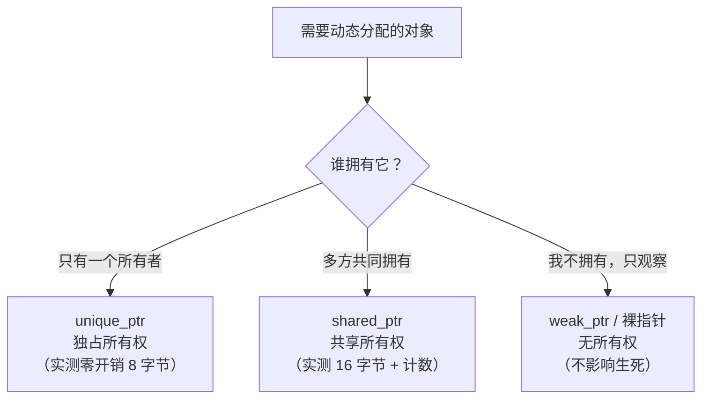
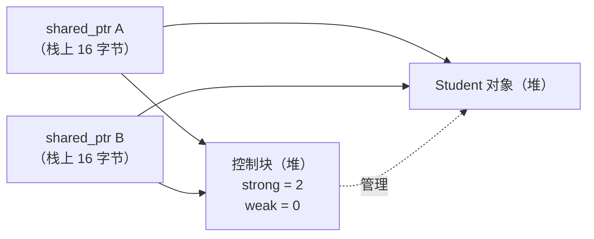

# 第 38 章 · 智能指针

**简体中文** ｜ [English](./38-smart-pointers.en-US.md)

---

> 第 37 章的 RAII 解决了"作用域内的资源"，但还有一类资源**天生活得比任何一个作用域都长**：被多处共享的对象——谁是最后一个使用者？谁负责释放？第 36 章讲过 GC 语言用可达性回答这个问题，而 C++ 没有 GC。
>
> C++ 的答案是把问题**搬进类型系统**：**智能指针**——用不同的类型表达不同的**所有权语义**。`unique_ptr` 说"只有我能删"（实测：拷贝它直接**编译报错** `call to implicitly-deleted copy constructor`，所有权唯一由编译器强制保证），而且 `sizeof` 实测 **8 字节，与裸指针完全相同**——零开销抽象名副其实。`shared_ptr` 说"大家一起持有，最后一个走的关灯"——实测 `use_count` 从 1 到 2 再回到 1，代价是 `sizeof` 变成 **16 字节**（多一个控制块指针）。
>
> 但引用计数有个第 36 章就讲过的死角，本章让它在 C++ 里**以真实泄漏的形式重现**：两个 `shared_ptr` 互指成环，实测 `use_count` 双双为 2，离开作用域后**一个 `[析构]` 都没打印**；`leaks` 工具当场抓获——**6 leaks for 6488064 total leaked bytes**。这正是第 36 章 Python `__del__` 沉默的同款场景，区别在于**Python 有副引擎兜底（`gc.collect()` 实测回收 9 个对象），C++ 什么都没有**。
>
> 治法是第三种指针：`weak_ptr`——**只观察，不计数**。同样的结构、只把一边换成弱引用，实测 `use_count` 不再被加、两个 `[析构]` 正常打印。而 `lock()` 提升、`expired()` 询问，与 Python 的 `weakref`、Java 的 `WeakReference`、JS 的 `WeakRef` 是同一个模式的四种拼写（四语言实测）。
>
> 最后一个惊喜来自 SQL：外键的三种 `ON DELETE` 策略，**正好对应三种所有权语义**（实测三连）——`CASCADE` 是 `unique_ptr`（拥有者死，被拥有者跟着死）、`RESTRICT` 是 `shared_ptr`（还有人引用就不许死）、`SET NULL` 是 `weak_ptr`（引用自动置空，不阻止死亡）。**所有权模型不是 C++ 的发明，而是所有资源系统的共同语言**。

## 1. 学习目标

本章结束后，你将能够：

- 说清三种智能指针各自表达的**所有权语义**，并据此选型（独占 / 共享 / 观察）；
- 解释 `unique_ptr` 的零开销（实测 8 字节 = 裸指针）与编译期所有权保证（实测拷贝即编译错误）；
- 读懂 `shared_ptr` 的控制块与引用计数（实测 16 字节、`use_count` 变化），并知道它比 `unique_ptr` 贵在哪；
- 复现并解释**循环引用泄漏**（实测 `leaks` 抓获 6 MB），用 `weak_ptr` 治好它（实测双析构）；
- 画出五语言的所有权表达能力对比，并识别 SQL 外键策略与三种指针的对应（实测三连）。

---

## 2. 为什么会出现这个概念

### RAII 之后剩下的问题

第 37 章的 RAII 把资源焊在对象上，但它假设了一件事：**资源属于某一个作用域**。真实程序里大量对象不满足这个假设：

```cpp
std::vector<Student*> roster;          // 花名册持有学生
Classroom* room = findRoom(student);   // 教室也引用同一个学生
cache[id] = student;                   // 缓存又引用一次
// 问题：谁 delete？删早了别人悬垂，都不删就泄漏
```

| 场景 | 所有权问题 |
|------|-----------|
| 工厂返回对象 | 调用者接管所有权吗？还是工厂保留？ |
| 容器存指针 | 容器析构时该不该 delete 元素？ |
| 观察者模式 | 观察者持有被观察者，会不会阻止它析构？ |
| 双向关联 | 父持有子、子指回父——谁先死？ |

**这些问题裸指针一个都答不了**（第 34 章：裸指针只有地址，不带任何所有权信息）。文档里写"调用者负责释放"是最脆弱的约定——没有编译器检查，也没有运行时保障。

### 智能指针的答案：把所有权写进类型

```cpp
std::unique_ptr<Student> makeStudent();     // 签名即文档：所有权转移给你
void observe(Student* s);                   // 裸指针：我只看，不负责释放
void share(std::shared_ptr<Student> s);     // 共享所有权：我也算一份
std::weak_ptr<Student> watcher;             // 观察但不挽留
```

> **一句话**：智能指针把"谁负责释放"从**注释里的约定**变成**类型系统里的事实**——函数签名一看就知道所有权怎么走，编译器还会替你检查（实测：拷贝 `unique_ptr` 直接编译失败）。这是 RAII 应用于内存的完整答案。

---

## 3. 底层原理

### 三种指针，三种所有权语义



### `unique_ptr`：零开销的独占

**实测证据**：

```text
sizeof(unique_ptr) = 8 字节，sizeof(裸指针) = 8 字节   ← 完全相同
```

**"零开销抽象"在这里可以字面验证**：`unique_ptr` 就是一个裸指针加一个"析构时 delete"的承诺，没有任何运行时额外数据。它的全部魔法在编译期：

```text
$ clang++ copy-unique.cpp
error: call to implicitly-deleted copy constructor of 'unique_ptr<int>'
note: copy constructor is implicitly deleted because 'unique_ptr<int>'
      has a user-declared move constructor
```

**拷贝被编译器禁止**（实测）——所有权唯一不是靠自觉，是靠类型。想转移就显式 `std::move`（第 35 章的移动语义在此兑现）：

```text
move 之后 a 已置空，b 持有 小红   ← 实测：所有权确实转移了，源指针自动置空
```

### `shared_ptr`：引用计数与控制块

**实测证据**：

```text
创建后 use_count = 1
拷贝一份 use_count = 2      ← 拷贝即计数 +1
内层结束 use_count = 1      ← 析构即计数 -1，对象还活着
sizeof(shared_ptr) = 16 字节 ← 裸指针的两倍
```

16 字节的构成：**对象指针 8 字节 + 控制块指针 8 字节**。控制块住在堆上，存着强引用计数、弱引用计数、删除器等：



**这就是第 36 章 CPython 主引擎的库版本**——区别在于 CPython 把计数放在每个对象头里（第 24/34 章实测过），而 C++ 放在独立的控制块里（因为对象本身不知道自己被智能指针管着）。

### 钥匙实验：循环引用在 C++ 里的真实泄漏

第 36 章的钥匙实验在这里重现——**这次是真的漏了**：

```cpp
auto x = std::make_shared<Student>("环-甲");
auto y = std::make_shared<Student>("环-乙");
x->partner = y;      // 甲 →强→ 乙
y->partner = x;      // 乙 →强→ 甲（成环！）
```

**实测输出**：

```text
成环后 use_count: 甲=2, 乙=2
（离开作用域——注意下面有没有 [析构] 打印）
↑ 什么都没打印！两个对象永远不会被析构——泄漏
```

**工具当场抓获**（shell 实测，三轮循环各造一对 1 MB 的环）：

```text
$ leaks --atExit -- ./cycle-leak
Process 68654: 6 leaks for 6488064 total leaked bytes.
```

**为什么漏**：离开作用域时，栈上的 `x`、`y` 析构，计数各减 1 变成 1——但对方手里那一份永远不会释放，因为释放的前提是对方先死。**互相等待，永远僵持**。

**与第 36 章的对照**：

```text
Python 同款环：__del__ 沉默（实测）→ 但 gc.collect() 副引擎回收 9 个对象（实测兜底）
C++ 同款环：   析构沉默（实测）  → 没有副引擎，永久泄漏（leaks 实测 6 MB）
Java/C#/JS：   可达性分析根本不在乎环（实测三家弱引用全部清空）
```

**这是"引用计数 vs 追踪式"两大流派最锋利的一次对比**——C++ 选了引用计数，就必须自己处理它的死角。

### `weak_ptr`：拆环的解药

```cpp
x->partner = y;              // 甲 →强→ 乙（保持强引用）
y->weak_partner = x;         // 乙 ⇢弱⇢ 甲（换成弱引用）
```

**实测输出**：

```text
拆环后 use_count: 甲=1, 乙=2   ← 甲的计数没被加（弱引用不计数）
[析构] 拆环-甲
[析构] 拆环-乙                  ← 两个都正常回收
```

**`weak_ptr` 的两个操作**（实测）：

```text
lock()     → 提升为 shared_ptr（对象活着则计数 +1，死了则返回空）
             实测：提升后 use_count = 2
expired()  → 询问对象是否已死
             实测：对象死后 expired() = true，lock() = 空指针
```

**为什么必须 `lock()` 而不能直接用**：多线程下"检查还活着"和"使用它"之间对象可能被析构——`lock()` 把检查与提升做成一个原子操作，拿到 `shared_ptr` 就保证在你用完之前不会死。

### 谁强谁弱：所有权方向的判断

```text
父 →强→ 子   （父拥有子，父死子亡）
子 ⇢弱⇢ 父   （子只是知道父在哪，不拥有）

规则：沿着"拥有"的方向用 shared_ptr，回指的方向用 weak_ptr
     ——树是天然安全的（只有向下的强引用），图才需要小心
```

---

## 4. JavaScript

JS 只有**一种**引用（相当于 `shared_ptr`），外加两件弱引用工具。

### 引用即共享所有权（实测）

```javascript
let student = { name: "小明" };
const weak = new WeakRef(student);       // 唯一的"弱"选项
```

没有 `delete`、没有 `use_count`——**所有权概念在 JS 里根本不存在**，因为 GC 承担了全部判定（第 36 章）。

### 钥匙实验：同样的环，毫无压力（实测）

```javascript
function makeCycle() {
  const x = { name: "环-甲" }, y = { name: "环-乙" };
  x.partner = y; y.partner = x;          // 成环（C++ 在这里泄漏 6 MB）
  return [new WeakRef(x), new WeakRef(y)];
}
```

追踪式 GC 从根出发标记——**环内互指再紧，根到不了就是垃圾**（第 36 章实测过跨事件循环轮次后双双 `undefined`）。C++ 需要 `weak_ptr` 才能解决的问题，JS 完全不需要考虑。

### `WeakRef.deref()` ≈ `weak_ptr::lock()`

```text
weak_ptr::lock() → shared_ptr（空或非空）
WeakRef.deref()  → 对象或 undefined
```

同一个模式的两种拼写：**不挽留，但可以安全询问**。（第 36 章实测过 `deref()` 的 keepDuringJob 语义——同一 job 内 deref 过的对象会被保活到 job 结束。）

### `WeakMap`：C++ 没有的东西（实测）

```javascript
const metadata = new WeakMap();
metadata.set(user, { role: "admin" });   // 给别人的对象贴标签
user = null;                             // 条目自动可回收
```

**C++ 要模拟它得自己用 `map<weak_ptr, T>` + 定期清理过期项**——`WeakMap` 把这套逻辑做进了语言。

> **注意事项**：JS 缺席的两样东西是**唯一所有权**（赋值即共享，第 35 章）与**确定性释放**（第 36 章实测 GC 决定时机）；非内存资源只能靠 `try/finally`（第 37 章实测：JS 是五门语言里唯一缺席作用域绑定资源管理的）。

---

## 5. Python

Python 没有"智能指针"这个概念——**因为它的引用天生就是 `shared_ptr`**。

### 引用计数 = `use_count`（实测）

```text
创建后引用计数 = 1
多一个名字后 = 2      ← 与 shared_ptr::use_count 完全同义
del 之后 = 1
（计数归零即析构）
```

**第 36 章的主引擎，就是 C++ `shared_ptr` 的语言内置版**——区别在于 Python 强制所有对象都用它，而 C++ 让你按需选择（这正是"零开销原则"：不用共享就不付计数的钱）。

### 钥匙实验：同样的环，同样的泄漏——但有兜底（实测）

```text
del x, del y ——
↑ 什么都没打印！引用计数救不了环（与 C++ shared_ptr 成环同款）
调用 gc.collect() ——
[析构] 环-甲 / 环-乙
↑ 副引擎回收了 9 个对象   ← Python 有兜底，C++ 只能靠 weak_ptr
```

**这是本章最重要的对照**：同一个死角，Python 用第二台引擎（分代循环收集器）兜底，C++ 则把责任交还给程序员——**语言设计的取舍在此暴露无遗**（Python 付出运行时开销换省心，C++ 保持零开销但要你懂所有权）。

### `weakref` = `weak_ptr`（实测）

```python
b.partner = weakref.ref(a)         # 乙 ⇢弱⇢ 甲（不计数）
```

```text
甲的引用计数 = 1   ← 弱引用没有让它 +1
[析构] 拆环-甲 / 拆环-乙   ← 环被拆开（与 C++ weak_ptr 同款结论）
对象死后: observer() = None   ← 与 lock() 返回空指针同义
```

**连解法都一模一样**——因为问题一模一样。

### Python 没有 `unique_ptr` 的对应物

```text
因为 Python 无法表达「唯一所有权」——任何赋值都会产生新引用
C++ 用类型系统区分独占/共享；Python 只有一种共享语义（第 35 章的分野）
```

> **注意事项**：`weakref` 只能作用于支持弱引用的对象（`__slots__` 类需要显式加 `__weakref__`，本章示例就是这么做的）；`list`/`dict` 等内置类型不支持直接弱引用——需要子类化。

---

## 6. Java

Java 的引用**近似 `shared_ptr`，但不数数**——由 GC 追踪可达性（第 36 章）。

### 钥匙实验：环？毫无压力（实测）

```text
成环对象 GC 后: wx=null, wy=null
（可达性分析不数引用——C++ 需要 weak_ptr，Java 什么都不用做）
```

### 引用四强度 ≈ 智能指针家族（实测）

| Java | C++ 对应 | 语义 |
|------|---------|------|
| 强引用（默认） | `shared_ptr` | 可达即活（实测） |
| `SoftReference` | **无对应物** | 内存紧张才回收（实测存活） |
| `WeakReference` | `weak_ptr` | 下次 GC 即回收（实测清空） |
| `PhantomReference` | 无（近似自定义删除器） | 仅用于回收通知 |

**`SoftReference` 是 C++ 没有的第四档**——"内存够就留着，不够就丢"这种基于全局内存压力的策略，只有掌握全局视野的 GC 才能实现；`shared_ptr` 的计数是纯局部的。

### `Cleaner` ≈ 自定义删除器，但不确定（实测）

```java
cleaner.register(resource, () -> System.out.println("[清理] 回调触发"));
```

```text
注册了清理动作——但触发时机由 GC 决定（第 36/37 章实测：不可靠）
（C++ 的 unique_ptr<T, Deleter> 是确定性的，Cleaner 不是）
```

C++ 的删除器可以定制释放逻辑（关文件、还连接池）且**保证在计数归零那一刻执行**；`Cleaner` 只能等 GC——**又一次印证第 37 章的结论：非内存资源不能交给 GC 通道**。

### Java 没有的：唯一所有权

```text
任何引用赋值都是共享——无法在类型层面表达「只有我能删」
好处：不用想所有权；代价：对象何时死不可知（第 36 章实测）
```

> **注意事项**：`WeakHashMap` 是 JS `WeakMap` 的对应物，但语义有别——它的**键**是弱引用，值仍是强引用（值间接引用键会导致条目永不回收，是经典陷阱）。

---

## 7. C++

C++ 是本章的主角——第 3 节的全部实测都来自它。本节交付工程决策表与现代惯用法。

### 选型决策表

| 场景 | 用什么 | 理由 |
|------|--------|------|
| 独占动态对象（默认选择） | `unique_ptr` | 零开销（实测 8 字节）、编译期保证唯一 |
| 工厂函数返回值 | `unique_ptr` | 签名即"所有权转移给你" |
| 真正需要多方共享 | `shared_ptr` | 计数管理生死（实测 use_count） |
| 观察但不拥有（可能失效） | `weak_ptr` | 不计数、可安全询问（实测 expired/lock） |
| 观察但不拥有（保证有效） | 裸指针 / 引用 | 零成本；生命周期由调用者保证（第 34/35 章） |
| 数组 | `vector` / `unique_ptr<T[]>` | 优先容器 |

**默认用 `unique_ptr`，需要共享时再升级为 `shared_ptr`**——这是现代 C++ 的默认姿势。滥用 `shared_ptr` 的代价：16 字节、原子计数（多线程下的缓存行争抢）、以及本章实测的环泄漏风险。

### `make_shared` vs `shared_ptr<T>(new T)`

```cpp
auto a = std::make_shared<Student>("小明");        // ✅ 一次分配：对象与控制块相邻
std::shared_ptr<Student> b(new Student("小红"));   // ❌ 两次分配：对象一次、控制块一次
```

`make_shared` 把对象与控制块**合并成一次堆分配**（第 33 章实测过分配成本 15.8 ns/对）——更快、缓存更友好，还避免了"new 成功但构造 shared_ptr 时抛异常"的泄漏窗口。唯一的例外：需要自定义删除器时只能用构造函数形式。

### 自定义删除器：智能指针不只管内存

```cpp
std::unique_ptr<FILE, decltype(&fclose)> file(fopen("data.txt", "r"), &fclose);
std::unique_ptr<Connection, PoolReturner> conn(pool.acquire(), PoolReturner{pool});
```

**第 37 章的 RAII 被泛化成了一个模板**——任何"获取/释放成对"的资源都能塞进 `unique_ptr`，释放动作由删除器定制。这也是 Java `Cleaner` 想做但做不确定的事（实测对比）。

### 常见误用：`shared_ptr` 传参

```cpp
void process(std::shared_ptr<Student> s);        // ❌ 每次调用都改原子计数
void process(const std::shared_ptr<Student>& s); // ⚠️ 除非要拷贝一份存起来
void process(Student& s);                        // ✅ 只是用一下——传引用（第 35 章）
```

**函数只是"使用"对象时，不该要求所有权**——传引用或裸指针即可（第 35 章的参数决策表在这里延续）。要求 `shared_ptr` 参数等于强迫调用者也必须用 `shared_ptr` 管理，是接口设计的坏味道。

> **注意事项**：`shared_ptr` 的**计数是线程安全的，指向的对象不是**——多线程共享对象仍需自己加锁（第 41 章）；`enable_shared_from_this` 用于"对象内部需要拿到自己的 shared_ptr"的场景（直接 `shared_ptr<T>(this)` 会造出第二个控制块，双重释放）。

---

## 8. C#

C# 与 Java 同构：**内存全交 GC，非内存资源用 `IDisposable`**——两套工具，C++ 则用同一套统管。

### 钥匙实验：环？毫无压力（实测）

```text
成环对象 GC 后: wx.IsAlive = False, wy.IsAlive = False
（追踪式 GC 不数引用——C++ 需要 weak_ptr，C# 什么都不用做）
```

**实测中再次踩到第 36 章的 JIT 保活陷阱**：在 `Main` 里 `s = null` 之后立即测 `IsAlive` 仍为 `True`（tier-0 JIT 让局部变量活到方法尾），把创建移进 `[MethodImpl(MethodImplOptions.NoInlining)]` 方法、靠栈帧弹出斩断引用才得到 `False`——**"引用何时算断"由 JIT 活跃性分析决定，不由源码字面决定**。

### `WeakReference` ≈ `weak_ptr`（实测）

```text
对象活着: Target = 被观察者
对象死后: Target = null   ← 与 weak_ptr::lock() 返回空同义
```

C# 还有 `WeakReference<T>`（泛型版，类型安全）与 `ConditionalWeakTable<TKey, TValue>`（对应 JS 的 `WeakMap`）。

### 最接近 `unique_ptr` 的：`IDisposable` + `using`（实测）

```csharp
using (var r = new OwnedResource("独占资源")) { ... }   // 确定性释放（第 37 章）
```

```text
（确定性释放做到了，但「唯一所有权」编译器不检查——
  C++ 的 unique_ptr 拷贝会编译报错，C# 的引用随便复制）
```

**差距正在缩小**：C# 的 `ref struct`（只能在栈上，不能被捕获或装箱）与 Rust 式的所有权检查提案，都在向"编译期所有权"靠拢；但目前 C# 仍无法阻止你把一个 `IDisposable` 引用复制到别处然后重复 `Dispose`（只能靠幂等实现兜底，本章示例就加了 `_disposed` 标志）。

### 两种世界的分工（实测总结）

```text
内存       -> GC 全自动（连环都不怕，实测 ②）
非内存资源 -> IDisposable + using 手动界定（第 37 章）
C++ 则是同一套工具（智能指针）统管两者
```

> **注意事项**：`SafeHandle` 是 .NET 里最接近"带自定义删除器的 unique_ptr"的类型（封装 OS 句柄，保证释放且线程安全），互操作场景优先用它而非裸 `IntPtr`。

---

## 9. SQL

本章最漂亮的对应：**外键的三种 `ON DELETE` 策略，正好是三种所有权语义**（实测三连）。

### 三种策略 = 三种指针（实测）

```sql
-- ① CASCADE ≈ unique_ptr：拥有者死，被拥有者跟着死
homework.student_id REFERENCES student(id) ON DELETE CASCADE

-- ② RESTRICT ≈ shared_ptr：还有人引用着，就不许死
enrollment.student_id REFERENCES student(id) ON DELETE RESTRICT

-- ③ SET NULL ≈ weak_ptr：拥有者死了，引用自动置空（不阻止死亡）
locker.owner_id REFERENCES student(id) ON DELETE SET NULL
```

**删除小明之后的实测**：

```text
① CASCADE:  作业剩 0 条（随拥有者一起删除 = unique_ptr）
③ SET NULL: 储物柜 owner_id = NULL（引用置空，储物柜还在 = weak_ptr）
② RESTRICT: 小红仍被 1 条选课引用 -> 删除会被拒绝
```

**RESTRICT 的拒绝**（shell 实测）：

```text
$ sqlite3 ... DELETE FROM s WHERE id=1;
Error: stepping, FOREIGN KEY constraint failed (19)
```

### 对应表：一张图讲清所有权模型

| SQL 策略 | C++ 指针 | 语义 | 实测证据 |
|---------|---------|------|---------|
| `ON DELETE CASCADE` | `unique_ptr` | 拥有：我死你也死 | 作业剩 0 条 |
| `ON DELETE RESTRICT` | `shared_ptr` | 共享：有人用就不许死 | 删除被拒绝（`FOREIGN KEY constraint failed`） |
| `ON DELETE SET NULL` | `weak_ptr` | 观察：你死我置空 | `owner_id = NULL`，储物柜还在 |

**这不是巧合**——所有权是**任何资源系统都必须回答的问题**：数据库用声明式约束回答，C++ 用类型系统回答，GC 语言用可达性回答（第 36 章）。三种答案，同一个问题。

> **工程提醒**：数据库设计时选 `ON DELETE` 策略，本质就是在做所有权建模——想清楚"这条记录是被拥有的（CASCADE）、是被依赖的（RESTRICT）、还是只是被参考的（SET NULL）"，比事后加补偿逻辑重要得多。

---

## 10. 五语言横向对比

### ① 所有权表达能力对比

| 能力 | JavaScript | Python | Java | C++ | C# |
|------|-----------|--------|------|-----|-----|
| 唯一所有权 | ❌ | ❌ | ❌ | ✅ **`unique_ptr`**（实测编译期强制） | ⚠️ 约定 + `IDisposable` |
| 共享所有权 | 默认（GC） | 默认（引用计数，实测 refcount） | 默认（GC） | ✅ `shared_ptr`（实测 use_count） | 默认（GC） |
| 弱引用 | `WeakRef`（实测） | `weakref`（实测） | `WeakReference`（实测） | `weak_ptr`（实测） | `WeakReference`（实测） |
| 软引用（内存敏感） | ❌ | ❌ | ✅ **`SoftReference`** | ❌ | ❌ |
| 弱键映射 | ✅ **`WeakMap`** | `WeakValueDictionary` | `WeakHashMap` | ❌（需自建） | `ConditionalWeakTable` |
| 自定义释放逻辑 | ❌ | `__del__`（不可靠） | `Cleaner`（不确定，实测） | ✅ **删除器**（确定） | `SafeHandle`/`Dispose` |
| 确定性释放 | ❌ | ✅ 计数归零（实测） | ❌ | ✅ **作用域**（实测） | 仅 `using`（第 37 章） |

### ② 钥匙实测：同一个环，五种命运

```text
x ⇄ y 互指成环，断掉外部引用后——

C++ shared_ptr:  ❌ 真实泄漏（实测无析构 + leaks 抓获 6488064 字节）
                    → 必须用 weak_ptr 手动拆环（实测双析构）
Python:          ⚠️ 主引擎失明（实测 __del__ 沉默）
                    → 但副引擎兜底（实测 gc.collect() 回收 9 个对象）
Java / C# / JS:  ✅ 毫无压力（实测弱引用全部清空）
                    → 可达性分析根本不在乎环（第 36 章）
```

**这张表是第 36 章两大流派之争的最终判决**：引用计数（C++ `shared_ptr`、CPython 主引擎）必然有环的死角，区别只在于**有没有第二台引擎兜底**——Python 有，C++ 没有，所以 C++ 把责任明确交还给了程序员，并给了他 `weak_ptr` 这把工具。

### ③ 两条设计分歧

**分歧一：所有权该不该进类型系统**

```text
进（C++）：      unique_ptr/shared_ptr/weak_ptr 三种类型 = 三种承诺
                 收益：签名即文档、编译期检查（实测拷贝报错）、零开销可选
                 代价：程序员必须理解所有权模型——这是 C++ 学习曲线最陡的一段
不进（其余四家）：只有一种引用，所有权由 GC 统一裁决
                 收益：心智负担为零
                 代价：无法表达"独占"、释放时机不可控（第 36 章实测）
```

**分歧二：引用计数要不要兜底**

```text
兜底（CPython）：计数 + 分代循环收集器双引擎——环也能收（实测 9 个对象）
                 代价：运行时开销、GIL（第 36 章）
不兜底（C++）：   只有计数，环必漏（实测 6 MB）
                 代价：程序员要会画所有权图
                 收益：零开销——不用共享就不付钱（unique_ptr 实测 8 字节）
```

### ④ 共同点与差异根源

**共同点**：五门语言都有"弱引用"这一档（实测四家 + C++），且用法惊人一致——**观察而不挽留、用前必须询问**（`lock()`/`deref()`/`get()`/`ref()` 四种拼写，一个模式）；所有语言都要面对"谁是最后一个使用者"的问题，只是回答的层次不同。

**差异根源**：

- **C++ 没有 GC**（第 36 章），所以必须把所有权显式化——智能指针是"零开销 + 安全"这对矛盾的最优解；
- **CPython 选了引用计数**（第 36 章），所以它的引用天生等价于 `shared_ptr`——连环的死角都一模一样，只是多了副引擎；
- **Java/C#/JS 选了追踪式 GC**，环根本不是问题（实测三家），代价是所有权无法表达、释放时机不可知；
- **SQL 用声明式约束**表达所有权（实测三种策略），证明这是**跨越编程语言与数据系统的普遍问题**。

---

## 11. 底层实现对比

| 运行时 | 所有权机制的实现 | 关键细节 |
|--------|----------------|---------|
| **V8**（JavaScript） | 无所有权概念——tagged pointer + 追踪 GC | `WeakRef` 在 GC 的弱引用表里注册；`WeakMap` 用 ephemeron 算法（键活值才活） |
| **CPython** | 对象头里的 `ob_refcnt`（第 34 章 ctypes 实测读过） | 引用计数嵌在每个对象里；`weakref` 需要对象支持 `__weakref__` 槽（实测示例显式声明） |
| **JVM**（Java） | GC 可达性 + 引用队列 | 四种 `Reference` 子类由 GC 特殊处理；`WeakHashMap` 靠 `ReferenceQueue` 清理失效条目 |
| **C++**（原生） | `unique_ptr` 零字段（实测 8 字节）；`shared_ptr` 双指针（实测 16 字节）+ 堆上控制块 | 控制块含强/弱计数（原子操作）、删除器、分配器；`make_shared` 把对象与控制块合并为一次分配（第 33 章的分配成本） |
| **CLR**（C#） | GC 可达性 + 句柄表 | `WeakReference` 用 GC 句柄实现；`ConditionalWeakTable` 同样是 ephemeron |

**一个值得记住的分野**：

```text
计数派（C++ shared_ptr / CPython）：所有权信息存在「对象或控制块」里——局部、即时、可精确到行
追踪派（JVM/CLR/V8）：             所有权信息存在「引用图」里——全局、批量、不可精确定位
所以只有计数派能做「确定性释放」，也只有计数派会被环卡住——一枚硬币的两面（本章双实测）
```

---

## 12. 性能分析

### 三种指针的成本（实测）

| 指针 | 大小（实测） | 拷贝成本 | 适用 |
|------|------------|---------|------|
| 裸指针 | 8 字节 | 复制 8 字节 | 只观察，不拥有 |
| `unique_ptr` | **8 字节**（零开销） | ❌ 不可拷贝（实测编译错误） | 默认选择 |
| `shared_ptr` | **16 字节** | **原子递增**（多线程下最贵） | 真正需要共享时 |
| `weak_ptr` | 16 字节 | 原子递增弱计数 | 观察 + 可能失效 |

### `shared_ptr` 的隐藏成本

```text
① 原子操作：计数增减必须原子（多线程安全）——比普通自增贵数倍，
   且多个线程频繁拷贝同一个 shared_ptr 会造成缓存行争抢（第 41 章）
② 两倍大小：16 字节 vs 8 字节（实测）——容器里存百万个就是 8 MB 额外开销（第 31 章密度实测同理）
③ 控制块分配：不用 make_shared 就是两次堆分配（第 33 章实测 15.8 ns/对）
④ 环泄漏风险：本章实测 6 MB——需要人来画所有权图
```

**结论：`shared_ptr` 不是"更安全的指针"，而是"表达共享所有权的工具"**——不需要共享却用它，是纯粹的浪费。

### 与 GC 语言的对比

```text
C++ unique_ptr：分配 15.8 ns（第 33 章）+ 零管理开销 + 确定性释放
C++ shared_ptr：分配 + 原子计数（每次拷贝）
托管语言：      分配 2.87 ns（第 33 章 TLAB 实测）+ GC 摊销成本（第 36 章 650 次/五百万对象）

没有免费午餐：C++ 把成本前移到分配与程序员心智，GC 语言把成本后移到回收器
```

> ⚠️ 惯例提醒：智能指针的性能讨论只在热路径与大规模数据结构上有意义。真正常见的性能问题不是"用了 `shared_ptr`"，而是"到处传 `shared_ptr` 而不是引用"（本章第 7 节的误用）——每次传参一次原子操作，累积起来相当可观。

---

## 13. 工程实践

| 场景 | ✅ 推荐 | ❌ 不推荐 | 原因 |
|------|--------|----------|------|
| C++ 动态对象默认 | `unique_ptr` + `make_unique` | 裸 `new`/`delete` | 零开销（实测 8 字节）+ 编译期保证 |
| C++ 创建 shared | `make_shared<T>()` | `shared_ptr<T>(new T)` | 一次分配、无泄漏窗口 |
| 函数只使用对象 | `T&` / `const T&`（第 35 章） | `shared_ptr<T>` 参数 | 避免无谓的原子计数 |
| 父子/双向关联 | 父→子强、子→父弱（实测拆环） | 双向 `shared_ptr` | 环泄漏（实测 leaks 6 MB） |
| 观察者模式 | `weak_ptr` 存观察者 | `shared_ptr` 存观察者 | 观察者不该阻止被观察者析构 |
| 缓存 | `weak_ptr` / `WeakMap` / `weakref` | 强引用容器 | 第 33/36 章实测的泄漏源 |
| 非内存资源（C++） | `unique_ptr` + 自定义删除器 | 手写 close | RAII 泛化（第 37 章） |
| Java 缓存键 | `WeakHashMap` + 注意值不引用键 | 强引用 Map | 值引用键 = 条目永不回收 |
| 数据库外键 | 想清楚所有权再选 ON DELETE | 一律 RESTRICT 或一律 CASCADE | 三种策略 = 三种语义（实测） |
| 多线程共享对象 | `shared_ptr` + 对象自己的锁 | 以为 `shared_ptr` 线程安全 | 计数安全 ≠ 对象安全 |

### 判断口诀

```text
这个对象有几个所有者？
  一个   → unique_ptr（默认答案，零开销）
  多个   → shared_ptr（想清楚是否真需要）
  零个（我只看）→ 裸指针/引用；可能失效则 weak_ptr

有没有回指的引用？（父子、观察者、图）
  有 → 回指方向一律 weak_ptr —— 否则实测泄漏
```

---

## 14. 最佳实践

- **默认 `unique_ptr`，需要共享再升级**：零开销（实测 8 字节 = 裸指针），且编译器保证唯一（实测拷贝报错）。
- **`make_shared`/`make_unique` 优先**：一次分配、异常安全、代码更短。
- **所有权走向要画得出来**：树形结构天然安全；只要出现回指（父子、观察者、图），回指方向就必须是 `weak_ptr`（实测：不拆环就泄漏 6 MB）。
- **函数参数不要无谓地要求所有权**：只用不存就传引用（第 35 章决策表）——传 `shared_ptr` 等于强制调用者也用它。
- **弱引用四语言同款用法**：先 `lock()`/`deref()`/`get()` 提升或询问，再使用——绝不假设它还活着（四语言实测）。
- **智能指针不只管内存**：自定义删除器让 `unique_ptr` 接管文件、连接、句柄——第 37 章 RAII 的泛化形态。
- **写 GC 相关测试要防 JIT 保活**：本章 C# 实测再次踩到（第 36 章同款）——用方法边界制造不可达，别信 `x = null` 的字面意思。
- **数据库外键即所有权建模**：`CASCADE`/`RESTRICT`/`SET NULL` 三选一时，问的是同一个问题——"谁拥有这条记录"（实测三连）。

---

## 15. 常见坑

**坑 1 · `shared_ptr` 成环，永久泄漏**（本章钥匙实验）

```text
实测：use_count 双双为 2，离开作用域无任何析构；leaks 抓获 6488064 字节
```

**如何避免**：任何双向关联都要指定方向——拥有方 `shared_ptr`、回指方 `weak_ptr`（实测拆环后双析构）；C++ 没有 Python 的副引擎兜底。

**坑 2 · 到处传 `shared_ptr`**

```cpp
void process(std::shared_ptr<Student> s);   // 每次调用一次原子递增+递减
```

**如何避免**：只使用不存储 → 传 `const T&` 或 `T*`；需要延长生命周期时才传 `shared_ptr`。

**坑 3 · 用同一个裸指针构造两个 `shared_ptr`**

```cpp
Student* raw = new Student("小明");
std::shared_ptr<Student> a(raw);
std::shared_ptr<Student> b(raw);   // ⚠️ 两个独立控制块 → 双重释放
```

**如何避免**：永远用 `make_shared`；确需从裸指针构造时，只构造一次然后拷贝该 `shared_ptr`；类内部要用 `enable_shared_from_this`。

**坑 4 · 以为 `shared_ptr` 让对象线程安全**

```text
计数是原子的（线程安全）；指向的对象没有任何保护
```

**如何避免**：共享对象的读写仍需互斥（第 41 章）——`shared_ptr` 只保证"对象不会在你用的时候被析构"。

**坑 5 · Java `WeakHashMap` 的值引用了键**

```java
map.put(key, new Holder(key));   // ⚠️ 值强引用键 → 键永远可达 → 条目永不回收
```

**如何避免**：值里不要存键的强引用；必要时值也用弱引用包装。

**坑 6 · 弱引用用之前不检查**

```python
observer().name        # ⚠️ 对象可能已死 → AttributeError on None
```

**如何避免**：四门语言一律先提升/询问再用（实测 `lock()`/`deref()`/`get()`/`ref()` 都会返回空）——写成 `if (auto p = w.lock())` 这样的惯用法。

**坑 7 · 数据库外键策略选错**

```sql
student_id REFERENCES student(id)     -- 默认 RESTRICT：删学生时报错，业务方一脸茫然
```

**如何避免**：建表时就明确写出 `ON DELETE` 策略并注释理由——它是所有权声明，不是可选装饰（实测三种策略行为迥异）。

---

## 16. 面试题

**基础**

1. `unique_ptr`、`shared_ptr`、`weak_ptr` 各表达什么所有权语义？
2. 为什么 `unique_ptr` 不能拷贝？如何转移它持有的对象？
3. `weak_ptr` 为什么必须先 `lock()` 才能使用？

**中级**

4. **`unique_ptr` 为什么是"零开销抽象"？用 `sizeof` 说明。`shared_ptr` 的额外 8 字节存了什么？**
5. `make_shared` 相比 `shared_ptr<T>(new T)` 有哪两个优势？
6. **`shared_ptr` 循环引用为什么会泄漏？请画出计数变化过程，并说明 `weak_ptr` 如何解决。**

**高级**

7. **同一个循环引用，C++ 永久泄漏而 Python 能被回收——两者都用引用计数，差别在哪？**
8. C++ 的所有权模型与 Java/C#/JS 的 GC 模型，各自的收益与代价是什么？为什么 C++ 不直接引入 GC？
9. SQL 外键的三种 `ON DELETE` 策略如何对应三种智能指针？这说明所有权是什么层面的问题？

---

## 17. 练习

**基础**

1. 用 `unique_ptr` 重写一段用 `new`/`delete` 管理对象的代码，验证不需要写任何 `delete`。
2. 打印 `unique_ptr`、`shared_ptr`、`weak_ptr` 与裸指针的 `sizeof`，解释差异。
3. 用 `use_count()` 观察 `shared_ptr` 在拷贝、传参、进容器时的计数变化。

**提高**

4. **复现钥匙实验**：构造 `shared_ptr` 环，用 `leaks`（或 ASan）确认泄漏，再用 `weak_ptr` 修复并验证析构发生。
5. 实现一个观察者模式：被观察者用 `shared_ptr` 管理，观察者列表存 `weak_ptr`，验证观察者析构后自动失效。
6. 给 `unique_ptr` 写一个自定义删除器接管 `FILE*`，验证离开作用域自动 `fclose`。

**挑战**

7. 实现一个简易的 `shared_ptr`（含控制块、强弱计数、`lock()`），并用本章的环实验验证你的实现同样会泄漏。
8. 用四门语言各实现一次"缓存不阻止对象回收"：C++ `map<K, weak_ptr>`、Python `WeakValueDictionary`、Java `WeakHashMap`、JS `WeakMap`——对比 API 与语义差异。
9. 设计一个三表 schema（用户/文档/评论），为每个外键选择 `ON DELETE` 策略并写清所有权理由，然后用违规操作验证每条约束。

---

## 18. 本章总结

**一句话总结**：智能指针把"谁负责释放"从注释里的约定变成**类型系统里的事实**——`unique_ptr` 独占（实测 8 字节零开销、拷贝即编译错误）、`shared_ptr` 共享（实测 16 字节、`use_count` 计数）、`weak_ptr` 只观察不计数；而第 36 章引用计数的死角在这里以**真实泄漏**重现（实测环内 `use_count` 双双为 2、无任何析构、`leaks` 抓获 6488064 字节），并被 `weak_ptr` 治好（实测双析构）——**同一个环，Python 有副引擎兜底、Java/C#/JS 的可达性分析根本不在乎、只有 C++ 必须靠程序员画对所有权图**；而 SQL 外键的 `CASCADE`/`RESTRICT`/`SET NULL` 三策略与三种指针一一对应（实测三连），证明**所有权是所有资源系统的共同语言，不是 C++ 的方言**。

**核心知识点**

- **三种所有权语义**：独占（`unique_ptr`）、共享（`shared_ptr`）、观察（`weak_ptr`/裸指针）。
- **零开销实测**：`unique_ptr` = 8 字节 = 裸指针；魔法全在编译期（实测拷贝构造被删除）。
- **共享的代价实测**：`shared_ptr` = 16 字节（对象指针 + 控制块指针）、原子计数、`use_count` 可观察。
- **钥匙实验**（本章核心）：`shared_ptr` 成环 = 真实泄漏（实测无析构 + `leaks` 6 MB）→ `weak_ptr` 拆环（实测双析构）。
- **五语言环命运**（实测）：C++ 泄漏 ❌ / Python 副引擎兜底 ⚠️ / Java·C#·JS 毫无压力 ✅。
- **弱引用四拼写**（四语言实测）：`lock()` / `deref()` / `get()` / `ref()`——同一个模式：不挽留、用前询问。
- **SQL 对应**（实测三连）：`CASCADE`=`unique_ptr`、`RESTRICT`=`shared_ptr`、`SET NULL`=`weak_ptr`。
- **工程默认**：默认 `unique_ptr` + `make_unique`；共享才升级；回指一律弱引用。

**检查清单**

- [ ] 我能根据"有几个所有者"选出正确的指针类型。
- [ ] 我能解释 `unique_ptr` 零开销与 `shared_ptr` 16 字节的构成。
- [ ] 我能复现环泄漏并用 `weak_ptr` 修复。
- [ ] 我知道弱引用在五门语言里的名字与统一用法。
- [ ] 我能把外键的 ON DELETE 策略讲成所有权模型。

---

### 🎉 Part 5 · 运行时 完结

八章走完，我们从**内存的地图**一路走到了**所有权的类型化**：

```text
31 内存    → 按生命周期分区（实测四区地址、栈向下堆向上）
32 栈内存  → 栈帧解剖（lldb 实测 bt/lr、序幕三指令、尾调用两指令）
33 堆内存  → 分配器与费用转移（实测 malloc 15.8ns vs TLAB 2.87ns vs 逃逸消除 0.24ns）
34 指针    → 地址 + 类型（实测步长 4/8/1、藏指针的四档光谱）
35 引用    → swap 测试判定传参语义（实测 C++/C# 成功、其余三家全败）
36 垃圾回收 → 两大流派（实测循环引用：计数派失明、追踪派不在乎）
37 RAII    → 确定性释放升格为范式（实测异常安全五连、释放失败五种下场）
38 智能指针 → 所有权进类型系统（实测环泄漏 6 MB 与 weak_ptr 解药）
```

**这一 Part 的主线**：一个问题贯穿八章——**"这块内存/资源何时能安全释放？"** 栈用作用域回答（32），堆把问题交给你（33），GC 用可达性回答（36），RAII 用对象生命周期回答（37），智能指针把答案写进类型（38）。而第 34/35 章解释了为什么答案必须不同：**能不能看见地址，决定了运行时能不能搬对象；地址是否受控，决定了 GC 是否可能**。

**下一 Part 预告**：Part 6 · 并发（39–45）。到目前为止我们讨论的一切——栈帧、堆分配、GC、所有权——都默认只有**一条执行线**。当第二条线出现，一切重新洗牌：两个线程同时改一个变量会发生什么（第 40 章的数据竞争实测）、锁如何协调又如何死锁（41）、为什么 CPython 有 GIL（本章反复提到的引用计数原子性，将在第 40 章得到完整解释）、单线程的 JS 如何做到"并发"（43 事件循环）、协程凭什么比线程轻量（44 —— 第 32 章的"帧可以住在堆上"将在这里兑现全部价值）。

---

## 19. 延伸阅读

- <a href="https://en.wikipedia.org/wiki/Smart_pointer" target="_blank" rel="noopener">Wikipedia：Smart pointer</a> — 智能指针概念与历史综述。
- <a href="https://en.cppreference.com/w/cpp/memory/unique_ptr" target="_blank" rel="noopener">cppreference · unique_ptr</a> — 独占所有权指针的权威参考。
- <a href="https://en.cppreference.com/w/cpp/memory/shared_ptr" target="_blank" rel="noopener">cppreference · shared_ptr</a> — 共享所有权与控制块的官方说明。
- <a href="https://en.cppreference.com/w/cpp/memory/weak_ptr" target="_blank" rel="noopener">cppreference · weak_ptr</a> — 弱引用与 `lock()` 语义的权威参考。
- <a href="https://isocpp.github.io/CppCoreGuidelines/CppCoreGuidelines#S-resource" target="_blank" rel="noopener">C++ Core Guidelines · Resource management</a> — 智能指针选型规范（R.20–R.37）。
- <a href="https://docs.python.org/3/library/weakref.html" target="_blank" rel="noopener">Python 文档 · weakref</a> — 弱引用与 `WeakValueDictionary` 官方文档。
- <a href="https://docs.oracle.com/en/java/javase/17/docs/api/java.base/java/lang/ref/package-summary.html" target="_blank" rel="noopener">Java API · java.lang.ref</a> — 引用四强度的官方文档。
- <a href="https://developer.mozilla.org/en-US/docs/Web/JavaScript/Reference/Global_Objects/WeakMap" target="_blank" rel="noopener">MDN · WeakMap</a> — 弱键映射的官方说明。
- <a href="https://www.sqlite.org/foreignkeys.html#fk_actions" target="_blank" rel="noopener">SQLite 文档 · ON DELETE 动作</a> — 三种外键删除策略的官方定义（本章所有权对应的来源）。
