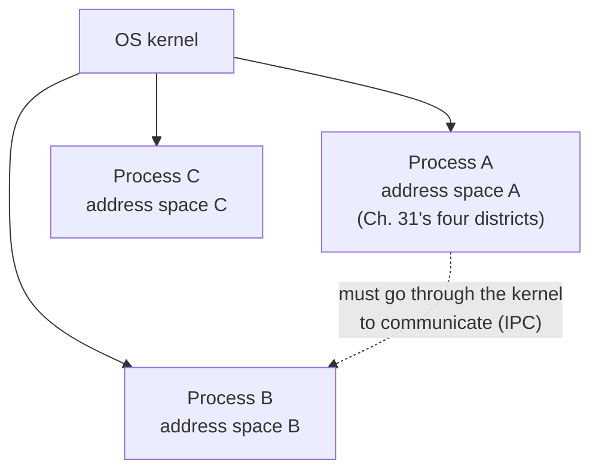

# Chapter 39 · Process

[简体中文](./39-process.md) ｜ **English**

---

> Everything Part 5 discussed — frames, heap allocation, GC, ownership — assumed **a single line of execution**. Now a second one appears, and everything reshuffles: should the two lines share memory? If they share, how do we keep them from colliding? If they don't, how do they cooperate?
>
> Part 6 opens with the most conservative answer: **the process — share nothing at all**. Chapter 31 said "the OS gives each process a complete, private address space"; this chapter **measures** that sentence: after `fork`, parent and child each mutate their own global, and the measured child reads `global=101` while the parent still reads `100` — yet both print **exactly the same address** (`0x102794000`). Same virtual address; the physical memory behind it has already parted ways.
>
> The parting happens by **copy-on-write**: measured, a parent fills 300 MB (RSS = 301 MB), the freshly forked child shows RSS = **0 MB** (not one byte copied), and only when it actually writes does it climb to 300 MB. **`fork` is clever, but still not cheap** — measured at **256.6 μs** per `fork + wait`, against **12.2 μs** for `pthread_create + join`: **creating a process costs 21× a thread**. That number is the next chapter's opening.
>
> Python delivers the sharpest proof of isolation's payoff: a CPU-bound workload across four processes measured **935 ms → 321 ms, a 2.85–3.02× speedup** — **multiprocessing is CPython's only route around the GIL to true parallelism** (the same work on threads measures a speedup of about 1×, Chapter 40).
>
> The price is that data must travel **explicitly**. C++ uses raw pipes, Python a pickle-serializing Queue, Node a structured-clone IPC channel — **the more thorough the isolation, the pricier the conversation**. Even databases face the same question: PostgreSQL gives each connection a process, MySQL a thread; and SQLite's multi-process write lock measured a flat `database is locked (5)`, succeeding only after `busy_timeout` blocked for 2,188 ms.

## 1. Learning Objectives

By the end of this chapter, you will be able to:

- State what a **process** fundamentally is (a private address space plus a private resource table) and what isolation buys and costs;
- Verify **memory isolation** with `fork` (same address, different physical pages) and **copy-on-write** (measured 0 MB → 300 MB);
- Quantify **process creation cost** (measured 256.6 μs vs a thread's 12.2 μs = 21×) and judge when a process is warranted;
- Explain why **CPython must use processes for CPU parallelism** (measured 2.85× speedup) and why I/O-bound work need not;
- Compare the five languages' process APIs (`fork` / `multiprocessing` / `ProcessBuilder` / `Process` / `child_process`) and three IPC shapes.

---

## 2. Why This Concept Exists

### One line of execution isn't enough

```text
① One program crashes and the whole machine's services stop  — we need fault isolation
② One user's program can read another's memory               — we need security isolation
③ Ten CPU cores, and the program uses one                    — we need parallelism
④ Nothing gets done while waiting on the network             — we need concurrency
```

### The OS's first answer: the process

**A process = one running instance of a program + a full set of resources it owns exclusively**:

| Each process owns | Contents |
|-------------------|----------|
| **Address space** | a complete virtual memory layout (Chapter 31's four districts, one set each) |
| File descriptor table | open files and sockets, privately |
| Identity and permissions | PID, user, group, environment variables |
| Signal handler table | its own decisions about interrupts |



> **In one sentence**: a process trades **sharing nothing** for total isolation — a crash, a corrupted write, a compromise, none of it reaches the neighbors (Chapter 34's wild pointer can only hurt itself). The price is expensive creation (measured 21× a thread) and expensive conversation (data must be serialized and carried). **That axis is Part 6's entire tension**: more isolation is safer, more sharing is faster.

---

## 3. How It Works

### `fork`: one call, two returns

POSIX creates processes by **copying yourself**:

```cpp
pid_t pid = fork();     // after this line, two processes run the same code
if (pid == 0) {
    // child: fork returned 0
} else {
    // parent: fork returned the child's PID
}
```

**Measured output**:

```text
I am process 93770, my parent is 93755
in the parent, fork returned the child's PID (93786 this run)
in the child, fork returned 0 — the only way to tell them apart
```

### The key experiment: same address, two memories

```cpp
int global_counter = 100;       // a global
// after fork, the child adds 1; the parent doesn't
```

**Measured output**:

```text
before fork, global_counter = 100, address = 0x102794000
[child 93786]  after change: global=101, heap=201, address=0x102794000
[parent 93770] mine: global=100, heap=200, address=0x102794000
```

**Two processes print identical addresses and read different values** — the most direct evidence of Chapter 31's virtual addressing:

```text
virtual address 0x102794000 (parent) → physical page X (value 100)
virtual address 0x102794000 (child)  → physical page Y (value 101)
                                        ↑ one virtual address, two physical pages via the MMU
```

**Heap data is isolated identically** (measured heap 201 vs 200) — the whole address space is isolated, stack and heap alike.

### Copy-on-write: why fork is still fast

If `fork` truly copied the address space, a process using 8 GB could never fork. The real mechanism is **copy-on-write (COW)**: only the page tables are copied, with every page marked read-only and shared; whoever writes triggers a page fault, and only then does the kernel copy that one page.

**Measured evidence** (the parent fills 300 MB first):

```text
parent after filling 300 MB:      RSS = 301 MB
  [child] freshly forked:         RSS = 0 MB     <- not one byte copied!
  [child] after filling the same: RSS = 300 MB   <- now it really copies
```

**`fork`'s cost is nearly independent of memory size, depending only on page-table size** — which is how it finishes in the 256 μs range.

### What process creation really costs (measured)

```text
fork + wait   :   256.6 us each
pthread + join:    12.2 us each
creating a process costs 21.1x a thread
```

What is 256 μs? Chapter 33 measured a `malloc/free` pair at 15.8 ns, Chapter 32 a Python call at 23 ns — **creating one process ≈ sixteen thousand mallocs**. So processes were never "create and discard": the era of forking a worker per HTTP request is long past; today it is **process pools with long-lived reuse** (Node's cluster, Python's Pool, PostgreSQL's connection pools all follow this).

### Isolation's price: conversation must be explicit

Processes cannot read each other's variables; all data is **carried through the kernel**:

| IPC method | Character | Measured here |
|-----------|-----------|---------------|
| **pipe** | one-way byte stream, simplest between parent and child | C++ |
| **message queue** | bounded messages, needs serialization | Python `mp.Queue` (pickle), Node IPC (structured clone) |
| **stdin/stdout** | cross-language universal, a higher form of the pipe | Java/C# (feeding `grep`) |
| **shared memory** | fastest (no copy) but needs your own locking — degenerating into threading's problem | Chapter 41 |
| **socket / file** | works across machines | the basis of distributed systems |

```text
Threads sharing data: change a variable, the other line sees it instantly (zero cost, zero protection — Ch. 40)
Processes sharing data: serialize → kernel buffer → deserialize (real cost, real protection)
```

---

## 4. JavaScript

Node is a **single-threaded event loop** (Chapter 43); using multiple cores leaves exactly one road: **multiple processes**.

### Identity and fork (measured)

```javascript
const { fork } = require("child_process");
const child = fork(childScript);
```

```text
I am process 92929, parent 92927
CPU cores = 10, platform = darwin
[child 92930] my counter = 101, parent is 92929
child exit code = 0, parent counter still 100   <- unmoved
```

Note that Node's `fork()` **is not POSIX fork** — it starts a new Node process running a given script, with no memory snapshot, but with an IPC channel attached.

### IPC: structured clone (measured)

```javascript
process.send({ from: process.pid, text: "..." });   // child sends
child.on("message", (msg) => { ... });              // parent receives
```

```text
parent received IPC message: "isolated we may be, but we still talk" (from process 92930)
```

A level above C++'s raw pipe: **Node packages the serialization for you** (the structured clone algorithm handles objects, arrays, Maps — but not functions or class instances).

### `cluster`: Node's standard way to fill the cores

```javascript
// the primary forks N workers (N = cores); the kernel load-balances connections among them
```

Each worker is an **independent process**: isolated memory, crashes that don't spread, restartable individually (the basis of rolling updates). It is also the shared model of PM2, Node's own cluster module, and most serverless runtimes.

> **Note**: `worker_threads` (Node 12+) offers genuine threads, suited to CPU-bound work that shares large buffers (with `SharedArrayBuffer`, measured in Chapter 34); but most Node services still use processes — **the operational simplicity of isolation usually outweighs the memory saved**.

---

## 5. Python

Python's multiprocessing has a hard justification no other language shares: **escaping the GIL**.

### The key experiment: memory isolation (measured)

```text
parent counter = 100
[child 90717] after change, counter = 101, parent is 90707
after the child finished, parent counter = 100   <- unmoved (each holds its own)
```

### True parallelism: the measured speedup (this chapter's key number)

```python
def cpu_task(n):
    total = 0
    for i in range(n): total += i * i
    return total

with mp.Pool(4) as pool:
    pool.map(worker, [8_000_000] * 4)
```

```text
4 tasks serially:  935 ms
4 processes:       321 ms
speedup = 2.85x   <- close to the core count (true parallelism)
```

**Why processes are mandatory**: CPython's GIL guarantees only one thread executes bytecode at a time — Chapter 36 explained its cause (the atomicity of reference counting). **Threads running CPU-bound work reach a speedup of about 1** (measured in Chapter 40). Each process, however, has its own interpreter and its own GIL — so **multiprocessing is CPython's only path to true parallelism**.

### IPC: pickle serialization (measured)

```python
q = mp.Queue()
p = mp.Process(target=producer, args=(q,))
```

```text
parent received: a message from process 93899
(data crosses processes via pickle — the price of isolation)
```

### Start methods: spawn vs fork

```text
Measured here: start method = spawn (the macOS/Windows default)
```

| Method | Behavior | Platform |
|--------|----------|----------|
| **fork** | copies the parent (COW) — fast, but may inherit lock state and deadlock | Linux default |
| **spawn** | starts a fresh interpreter and re-imports modules — slow, but clean | macOS/Windows default |

**Spawn imposes a hard constraint** (hit while developing this chapter): everything sent to a child must be **picklable**, and functions must live at **module top level** — defining `producer` inside `if __name__ == "__main__"` makes the child raise `AttributeError: Can't get attribute 'producer'`.

> **Note**: the `if __name__ == "__main__":` guard is **not style but necessity** under spawn — without it, the child re-executes the process-creating code on import and recurses forever.

---

## 6. Java

Java **cannot fork** — the JVM's multithreaded state cannot be copied safely. It can only start **entirely new processes**.

### `ProcessBuilder` (measured)

```java
ProcessBuilder pb = new ProcessBuilder("sh", "-c", "...");
Process child = pb.start();
```

```text
I am process 93919, parent 93906
[child 93920] I am an independent process; I cannot see Java's counter
child exit code = 0, parent counter still 100
```

**Isolation more thorough than fork's**: not even a memory snapshot is shared — the child is a different program started from scratch.

### `ProcessHandle`: a view of the process tree (Java 9+, measured)

```text
my child processes = 0
visible processes on this system = 490
```

`ProcessHandle.allProcesses()` lets Java enumerate the whole system — handy for monitoring and daemon management.

### IPC: standard streams (measured)

```java
Process grep = new ProcessBuilder("grep", "concurrency").start();
grep.getOutputStream().write("...".getBytes("UTF-8"));
```

```text
grep returned: Part 6 concurrency
```

**The same lineage as C++'s `pipe()`** — merely wrapped as `InputStream`/`OutputStream`.

### `onExit()`: awaiting asynchronously (measured)

```java
quick.onExit().get(...);   // a CompletableFuture you can await (Chapter 42)
```

> **Note**: the Java ecosystem **prefers threads to processes** — JVM startup is expensive (Chapter 5), its thread model is mature, and its concurrency library is strong (Chapter 45). `ProcessBuilder` is mainly for invoking external commands, not for parallel computation. Forgetting to drain a child's output stream makes the child **hang once the buffer fills** — Java's most classic external-command trap.

---

## 7. C++

C++ exposes the POSIX primitives directly — every measurement in §3 came from it.

### Three system calls hold up the whole model

```cpp
fork();      // copy yourself (COW) — measured 256.6 μs
exec*();     // replace your address space with another program (usually right after fork)
waitpid();   // wait for a child to finish and reclaim its resources
```

**The `fork` + `exec` pair is classic Unix philosophy**: `fork` creates an execution context, `exec` swaps in a program — separating the two lets you insert arbitrary setup in between (redirections, permission changes, environment tweaks). Windows' `CreateProcess` fuses them, hence its long parameter list.

### Zombies and orphans

```text
Zombie: the child exited but the parent never waited — exit status lingers in the kernel, the PID stays taken
Orphan: the parent exited first — the child is adopted by init/launchd (PID 1)
```

**You must `waitpid`** (every fork in this chapter's example is paired with one) — otherwise a long-running service accumulates zombies and eventually exhausts PIDs.

### Pipe IPC (measured)

```cpp
int fd[2];
pipe(fd);                    // fd[0] read end, fd[1] write end
// after fork: the parent closes the write end and reads; the child closes the read end and writes
```

```text
parent read from the pipe: "isolated we may be, but we still talk"
```

### `fork`'s two real traps

**① stdio buffers get copied** (hit while developing this chapter):

```cpp
printf("...");        // sitting in the buffer, not yet flushed
fork();               // ⚠️ the buffer is duplicated → the same line prints twice
```

The cure: `fflush(stdout)` before forking; have the child call `_exit()` rather than `exit()` (`_exit` skips flushing and atexit) — but then buffered content is lost, so flush manually before exiting too.

**② forking a multithreaded program is extremely dangerous**: only the calling thread is copied into the child; locks held by other threads are **never released** — the child deadlocks the moment it touches one. POSIX permits only async-signal-safe calls after fork, which in practice means "exec or `_exit` immediately."

> **Note**: modern C++ prefers `posix_spawn` (an atomic fork+exec that sidesteps the multithreaded-fork problem) or plain threads (Chapter 40); `std::system()` is simple but exposes command injection (Chapter 58).

---

## 8. C#

.NET's `System.Diagnostics.Process` **flattens the Windows and Unix process models into one API**.

### A unified API (measured)

```csharp
var psi = new ProcessStartInfo("sh", "-c \"...\"") {
    RedirectStandardOutput = true, UseShellExecute = false
};
using var child = Process.Start(psi)!;
```

```text
I am process 94202, process name csapp
processors = 10, working set = 31 MB
[child 94232] I cannot see C#'s counter
child exit code = 0, parent counter still 100
```

**Windows has no `fork`** — `CreateProcess` can only "start a new program." .NET targets that intersection, so C# (like Java) has an inherently "start fresh" process model, with no COW story.

### The process as an observable object (measured)

```csharp
Process.GetProcesses();          // 495 visible processes on this system
self.WorkingSet64;               // working set 31 MB
DateTime.Now - self.StartTime;   // running for 1580 ms
```

The `Process` class is both a **control interface** and a **monitoring interface** — .NET's abstraction advantage over raw POSIX primitives.

### Awaiting asynchronously (measured)

```csharp
await child.WaitForExitAsync();   // even waiting for a child is awaitable (Chapter 42)
```

> **Note**: `UseShellExecute = false` is a prerequisite for redirecting standard streams (already the default in .NET Core); `Process` implements `IDisposable` (Chapter 37) and must be `using`-scoped or it leaks handles; cross-platform code must mind that `ProcessStartInfo`'s argument-escaping rules differ between Windows and Unix.

---

## 9. SQL

Databases face the same question: **should each client connection ride a process or a thread?**

### Three server models

| Database | Model | Trade-off |
|----------|-------|-----------|
| **PostgreSQL** | **one OS process per connection** | strong isolation (one connection's crash spares the rest), expensive creation → connection pooling is mandatory |
| **MySQL** | **one thread per connection** | lightweight, shared buffer pool, but thread safety everywhere |
| **SQLite** | **no server process at all** | the connection lives inside your process; multiple processes coordinate via **file locks** |

**This is precisely this chapter's theme, mapped onto the data layer** — PostgreSQL chose isolation (paying creation cost), MySQL chose sharing (paying concurrency complexity).

### Two processes writing one SQLite database (shell measurement)

Two `sqlite3` processes writing at once:

```text
[process A] BEGIN IMMEDIATE; UPDATE ...     ← holds the write lock
[process B] attempting a write with the default busy_timeout=0:
    Error: stepping, database is locked (5)      ← immediate failure
[process B] retrying with busy_timeout=5000:
    succeeded after waiting 2188 ms              ← blocked until A committed
```

**SQLite's concurrency model = file locks serializing writers**: one writer at a time, many readers allowed. `busy_timeout` decides how long to wait before giving up.

### WAL mode (measured)

```sql
PRAGMA journal_mode = WAL;      -- measured: returns wal
```

Under the default DELETE mode, writes block reads; **under WAL, readers are not blocked by writers** — the key setting for multi-process concurrency in SQLite (Chapter 48 expands on transactions).

### Transaction isolation = process isolation, at the data layer (measured)

```text
② inside the transaction (uncommitted): 70
   after commit, all connections see: 70
```

**Uncommitted changes are invisible to other connections** — the same idea as "one process's memory is invisible to another": **give every execution unit a private world that looks complete** (Chapter 31's virtual memory, Chapter 48's MVCC snapshots — the same thing at heart).

> **Engineering note**: PostgreSQL's process-per-connection means **connections are an expensive resource** — 1,000 connections is 1,000 processes, requiring a pooler like PgBouncer. That is the same ledger as this chapter's measured 256 μs per process.

---

## 10. Cross-Language Comparison

### ① Process APIs

| Feature | JavaScript | Python | Java | C++ | C# |
|---------|-----------|--------|------|-----|-----|
| Creation | `child_process.fork/spawn` | `mp.Process` | `ProcessBuilder` | **`fork` + `exec`** | `Process.Start` |
| Can copy memory | ❌ starts new | ✅ fork mode (Linux) | ❌ | ✅ **COW** (measured 0→300 MB) | ❌ |
| Default method | spawn a new script | **spawn** (macOS/Win, measured) | new process | fork | new process |
| Built-in IPC | ✅ structured clone (measured) | ✅ pickle Queue/Pipe (measured) | standard streams | raw pipe (measured) | standard streams |
| Primary use | **cluster for multicore** | **escaping the GIL** (measured 2.85×) | invoking commands | systems programming | invoking commands |
| Process enumeration | `process` global | `psutil` (third-party) | ✅ `ProcessHandle` (measured 490) | `/proc`, `ps` | ✅ `GetProcesses` (measured 495) |

### ② Key measurements: three numbers for isolation and its price

```text
① Memory isolation (measured identically in all five languages):
   child sets counter → 101; parent still reads 100
   C++ adds proof: both print the same address (0x102794000) — virtual addressing fooled you

② Copy-on-write (C++ measured):
   parent fills 300 MB → RSS 301 MB
   child freshly forked → RSS 0 MB      <- nothing copied
   child after writing  → RSS 300 MB    <- now copied

③ Creation cost (C++ measured):
   fork + wait    256.6 μs
   pthread + join  12.2 μs
   processes cost 21.1× more  <- Chapter 40's opening
```

### ③ Two design divides

**Divide one: is a process a parallelism tool or only an isolation tool**

```text
A parallelism tool (Python / Node):
  because the language has a single-threaded bottleneck (GIL / event loop) — processes are the only road to multicore
  measured: Python's 4 processes → 2.85× speedup
An isolation tool (Java / C# / C++):
  the language has mature threading; processes serve external commands and fault isolation
  measured: Java's and C#'s APIs are built around "start a command and read its output"
```

**Divide two: should fork's copy semantics be exposed**

```text
Exposed (C++ / Python on Linux): inherit parent state, start fast (COW)
                                 price: forking a multithreaded program is treacherous (inherited lock state)
Hidden (Java / C# / Node / Python on macOS): only fresh processes
                                 price: slower startup, re-initialization
                                 gain: clean semantics, no "half a parent" weirdness
```

**The direction of this divide is clear**: even Python changed Linux's default start method to the safer `forkserver` in 3.14 — **fork's copy semantics are being retired by history**.

### ④ Common ground and root causes

**Common ground**: process isolation behaves identically in all five languages (measured five times: children cannot touch the parent's variables); all provide some IPC (pipes/queues/standard streams); all treat processes as heavyweight resources to be pooled.

**Root causes**:

- **C++ maps POSIX directly** — it is the systems language, and `fork`/`exec`/`wait` are its mother tongue;
- **Python treats processes as a parallelism tool** — the GIL blocked the threading road (Chapter 36 explained its cause; Chapter 40 measures its effect);
- **Node treats processes as a scaling device** — the event loop is single-threaded (Chapter 43), and cluster is its one standard answer for multicore;
- **Java/C# treat processes as an external-invocation interface** — their thread models are strong enough (Chapter 45's thread pools) that processes serve only isolation and external programs;
- **Databases split the same way** (PostgreSQL processes / MySQL threads), proving the trade-off is language-independent — **a universal fork in concurrency design**.

---

## 11. Implementation Comparison

| Runtime | How processes are created | Key details |
|---------|--------------------------|-------------|
| **V8** (Node) | `uv_spawn` (libuv) → `posix_spawn`/`fork+exec` | `child_process.fork` adds an IPC pipe; cluster shares a port via `SO_REUSEPORT` or primary-side distribution |
| **CPython** | `os.fork()` or `subprocess` + `spawn` | measured spawn here: restarts the interpreter and re-imports modules, hence the picklability requirement; `forkserver` is the middle ground (pre-fork one clean server process) |
| **JVM** (Java) | `ProcessImpl` → `vfork`/`posix_spawn` | the JVM never forks itself (multithreaded state can't be copied); `vfork` is cheaper than `fork` because an exec follows immediately — not even page tables need copying |
| **C++** (native) | direct system calls (measured 256.6 μs) | COW implemented in kernel page tables (measured 0→300 MB); `vfork`/`posix_spawn` are faster variants |
| **CLR** (C#) | Windows `CreateProcess` / Unix `fork+exec` | the cross-platform layer hides the difference; `ProcessStartInfo`'s escaping rules differ per platform |

**A distinction worth memorizing**:

```text
The fork model (classic Unix): copy first, replace later — flexible (arbitrary setup in between), dangerous under threads
The spawn model (Windows / modern defaults): start a new program in one step — safe, but every setting must go through parameters
The modern trend: posix_spawn has both (fork+exec inside the kernel, atomic to the user)
```

---

## 12. Performance Analysis

### Three orders of magnitude (measurements across this book)

| Operation | Cost | Source |
|-----------|------|--------|
| Python function call | 23 ns | Chapter 32 |
| `malloc`/`free` pair | 15.8 ns | Chapter 33 |
| Thread creation + join | **12.2 μs** | this chapter |
| **Process creation + wait** | **256.6 μs** | this chapter |

**Creating a process ≈ sixteen thousand mallocs ≈ ten thousand Python calls** — a magnitude that mandates **pooling**, never per-request creation.

### Multiprocessing's payoff and its threshold

```text
Measured: 4 CPU-bound tasks, 935 ms serially → 321 ms across 4 processes (2.85×)

But note 2.85 < 4:
  ① process creation (4 × 256 μs — a small share)
  ② serialization: arguments and results are pickled (here, one integer — cheap)
  ③ scheduling and memory-bandwidth contention
If each task ran only 10 ms, serialization alone would eat the entire gain — too fine a grain doesn't pay
```

**The criterion: a task's own compute time must far exceed "process creation + data round trip"** for multiprocessing to pay.

### Memory cost

```text
COW makes fork's initial memory cost near zero (measured child RSS = 0 MB)
But the moment the child writes, the cost arrives (measured climb to 300 MB)
Python's spawn mode is dearer still: every child is a full interpreter (tens of MB each)
  → hence Pool sizes track core counts, not task counts
```

> ⚠️ The usual reminder: this chapter's performance question isn't "are processes slow" but **"process or thread?"** — the next chapter supplies the threading side (shared memory's zero cost vs data races' price), and only together do they form the full decision basis.

---

## 13. Engineering Practice

| Scenario | ✅ Recommended | ❌ Avoid | Why |
|----------|--------------|---------|-----|
| Python CPU-bound | processes / `ProcessPoolExecutor` | threads | the GIL blocks threads (measured 2.85× vs ≈1×) |
| Python I/O-bound | threads or asyncio (Chapter 42) | processes | process overhead wasted; the GIL is released during I/O |
| Node using all cores | `cluster` / multiple instances behind a balancer | heavy computation on the main thread | blocking the event loop freezes the service (Chapter 43) |
| Fault isolation needed | processes | threads | one thread's segfault kills the whole process |
| High-frequency short tasks | a process pool | creating a process each time | 256 μs each (measured) becomes the bottleneck |
| Invoking external commands | `ProcessBuilder`/`Process`/`subprocess` | string-concatenating into a shell | command injection (Chapter 58) |
| Inside a multithreaded program | `posix_spawn` | `fork` | other threads' lock state is inherited → deadlock |
| Reading child output | drain promptly or redirect | ignoring the stream | a full buffer hangs the child (the classic trap) |
| PostgreSQL connections | a pooler (PgBouncer) | a new connection per request | one process per connection at this chapter's measured cost |
| Child management | pair every fork with a `wait` | forking and forgetting | zombies accumulate and exhaust PIDs |

### The rule of thumb

```text
Do I need a process?
  true parallelism + a single-threaded language bottleneck (Python/Node) → yes
  fault isolation / a security boundary                                   → yes
  merely concurrent work in a language with good threads                  → no, use threads (Chapter 40)

Once you use processes:
  pool them (256 μs isn't paid for free)
  budget for communication (serialization plus copying)
```

---

## 14. Best Practices

- **Ask "isolation or sharing?" first**: fault isolation, a security boundary, or a single-threaded bottleneck → processes; otherwise threads pay better (next chapter has the comparison data).
- **Always pool processes**: the measured 256.6 μs per creation mandates reuse — `mp.Pool`, `cluster`, and connection pools are all the same idea.
- **Budget communication into the design**: before shipping a large object between processes, ask whether a reference will do (a file path, a database key) — serialization round trips often cost more than the computation.
- **Three things to remember in Python**: the `if __name__ == "__main__"` guard, picklable arguments, and module-top-level functions (a trap hit while developing this chapter).
- **Never bare-fork a multithreaded program**: use `posix_spawn`, or fork before starting any threads — inherited lock state is the hardest deadlock to diagnose.
- **Reap every child**: otherwise zombies accumulate; Node uses `child.on('exit')`, Java `onExit()`, C++ `waitpid`.
- **Always handle a child's output streams**: drain, redirect, or discard — leaving them unread blocks the child once the buffer fills.
- **Treat database connections as processes**: especially in PostgreSQL — a connection pool isn't an optimization but a necessity.

---

## 15. Common Pitfalls

**Pitfall 1 · Forking without flushing stdio** (hit while developing this chapter)

```cpp
printf("...");   // still buffered
fork();          // ⚠️ the buffer is duplicated → the line prints twice; or _exit loses it
```

**Avoid it**: `fflush(stdout)` before forking; flush manually before the child's `_exit` (which skips stdio flushing).

**Pitfall 2 · Python functions defined inside the `__main__` block** (hit while developing this chapter)

```text
AttributeError: Can't get attribute 'producer' on <module '__mp_main__'>
```

**Avoid it**: under spawn the child imports the target by name — every function handed to `Process`/`Pool` must live at **module top level**.

**Pitfall 3 · Ignoring a child's output stream**

```java
Process p = new ProcessBuilder("a chatty command").start();
p.waitFor();     // ⚠️ waits forever: the child blocked after filling the pipe buffer
```

**Avoid it**: drain `getInputStream()` promptly, or use `redirectOutput()` to a file or discard; Java's `inheritIO()` is the easiest.

**Pitfall 4 · Forking a multithreaded program**

```cpp
// thread A holds malloc's internal lock while thread B forks
// → the child inherits a lock that is held and will never be released → the first malloc deadlocks
```

**Avoid it**: use `posix_spawn`; or complete all forking before creating any threads; after forking, call only async-signal-safe functions and exec immediately.

**Pitfall 5 · Not reaping children (zombies)**

```text
the child exited but the parent never waited — the PID and exit status linger, exhausting PIDs over time
```

**Avoid it**: pair every fork with `waitpid`; or install a `SIGCHLD` handler; Node/Java/C#'s high-level APIs usually handle it.

**Pitfall 6 · Expecting processes to share variables**

```python
counter = 0
# counter += 1 in the child — the parent never sees it (measured identically in five languages)
```

**Avoid it**: cross-process state needs explicit machinery — `mp.Value`/`mp.Array` (shared memory), `Queue`, or external storage (Redis, a database).

**Pitfall 7 · Creating a process per request**

```text
forking per HTTP request → 256 μs each (measured) plus memory → throughput stalls
```

**Avoid it**: a process pool with long-lived reuse (cluster, Pool, PostgreSQL's connection pool all follow this model).

---

## 16. Interview Questions

**Basic**

1. How does a process differ from a program? Which resources does a process own exclusively?
2. Why does `fork` "return twice"? How do you distinguish parent from child?
3. What is a zombie process? An orphan? How do you avoid or handle each?

**Intermediate**

4. **What is copy-on-write? How does it keep forking an 8 GB process fast? (Use this chapter's measurements.)**
5. What forms of IPC exist? What are their costs and fitting scenarios?
6. **Why must Python's CPU-bound work use processes rather than threads? Roughly what speedup results?**

**Advanced**

7. **Parent and child print the same variable address yet read different values — explain via virtual memory.**
8. Why is calling `fork` in a multithreaded program dangerous? How does `posix_spawn` solve it?
9. PostgreSQL uses one process per connection, MySQL one thread — what does each model buy and cost? Which of this chapter's trade-offs does that mirror?

---

## 17. Exercises

**Basic**

1. Write a program where the parent prints 1–5 and the child prints 6–10; observe how the output interleaves.
2. Verify "the child changes a variable, the parent is unaffected" in all five languages.
3. Inspect your machine's process tree with `ps -ef` or `ProcessHandle.allProcesses()`; find out what PID 1 is.

**Intermediate**

4. **Reproduce this chapter's three measurements**: memory isolation (same address, different values), COW (RSS 0 → 300 MB), creation cost (fork vs pthread).
5. With Python's `ProcessPoolExecutor`, measure speedup across task granularities (1 ms / 10 ms / 100 ms / 1 s) and find the point where fine grain stops paying.
6. Implement bidirectional parent-child communication with two pipes (one each way).

**Challenge**

7. Build a minimal process pool: pre-fork N workers, dispatch tasks and collect results over pipes, and compare its throughput with one-process-per-task.
8. Write a program demonstrating the multithreaded-fork hazard: fork while another thread holds a mutex, and observe the child deadlock.
9. Reproduce this chapter's write-lock measurement with two SQLite processes, then repeat under WAL mode and explain the difference in read/write concurrency.

---

## 18. Chapter Summary

**One sentence**: a process is the OS's **strongest isolation unit** — one full address space per process (measured: parent and child print the same address `0x102794000` yet read 100 and 101) and one private resource table; creation goes through `fork`'s **copy-on-write** (measured: a freshly forked child shows RSS = 0 MB, climbing to 300 MB only after it writes), yet still costs **21×** a thread (measured 256.6 μs vs 12.2 μs); isolation's greatest payoff is **true parallelism and fault containment** — Python escapes the GIL through processes, measuring a **2.85×** speedup on CPU-bound work (threads measure about 1×); the price is that **conversation must be explicit** (pipes / pickle / structured clone — the more thorough the isolation, the pricier the talk); and databases face the same question — PostgreSQL one process per connection, MySQL one thread, while SQLite's multi-process write lock measured a flat `database is locked (5)`.

**Key takeaways**

- **A process = a private address space + a private resource table**: crashes, corrupted writes, and compromises never reach the neighbors.
- **The key experiment** (identical in five languages): children cannot touch the parent's variables; C++ adds the same-address/different-value proof.
- **Copy-on-write** (measured): fork copies page tables only; RSS 0 MB → 300 MB after writing — fork's cost barely depends on memory size.
- **Creation cost** (measured): processes 256.6 μs vs threads 12.2 μs = **21×** — hence mandatory pooling.
- **Python's hard requirement** (measured): processes are the only route around the GIL, at a 2.85× speedup.
- **Three IPC shapes**: raw pipes (C++), serializing queues (Python pickle / Node structured clone), standard streams (Java/C#).
- **Fork's two traps** (both hit here): duplicated stdio buffers, inherited lock state under threads.
- **The database parallel** (measured): PostgreSQL processes / MySQL threads; SQLite's `database is locked (5)`, succeeding after `busy_timeout` blocked 2,188 ms.

**Checklist**

- [ ] I can explain "same address, different values" via virtual memory.
- [ ] I can describe how COW makes fork cheap and when it starts costing.
- [ ] I know the order-of-magnitude gap between process and thread creation (21×).
- [ ] I can judge whether a task deserves a process or a thread.
- [ ] I know why forking a multithreaded program is dangerous.

**Next chapter**: process isolation is safe — but **21× costlier to create and requiring serialized conversation**. What if two execution units genuinely want to cooperate closely over shared data? The answer is the **thread**: several lines of execution inside one process, **sharing the address space** (Chapter 31's heap and static area entirely shared), with only the stack private (Chapter 32's frames). Sharing buys extreme efficiency — passing data is passing a pointer, zero copies, zero serialization. It also buys concurrency's most famous disaster: **two threads mutating one variable produce a wrong answer, and a differently wrong one each run**. Chapter 40 measures that data race — the same increment loop run a million times, with a different answer every time — and gives the GIL its full explanation (the lock mentioned repeatedly here, and why Python's threaded CPU speedup stalls at 1×).

---

## 19. Further Reading

- <a href="https://en.wikipedia.org/wiki/Process_(computing)" target="_blank" rel="noopener">Wikipedia: Process</a> — the concept and lifecycle, surveyed.
- <a href="https://en.wikipedia.org/wiki/Copy-on-write" target="_blank" rel="noopener">Wikipedia: Copy-on-write</a> — the standard description of COW.
- <a href="https://pages.cs.wisc.edu/~remzi/OSTEP/cpu-api.pdf" target="_blank" rel="noopener">OSTEP · Process API (fork/exec/wait)</a> — the clearest free chapter on fork.
- <a href="https://man7.org/linux/man-pages/man2/fork.2.html" target="_blank" rel="noopener">man 2 fork</a> — the authoritative page (including multithreading caveats).
- <a href="https://docs.python.org/3/library/multiprocessing.html" target="_blank" rel="noopener">Python Docs · multiprocessing</a> — start methods, Pool, and Queue, officially.
- <a href="https://nodejs.org/api/cluster.html" target="_blank" rel="noopener">Node.js Docs · cluster</a> — Node's official multicore module.
- <a href="https://docs.oracle.com/en/java/javase/17/docs/api/java.base/java/lang/ProcessBuilder.html" target="_blank" rel="noopener">Java API · ProcessBuilder</a> — starting external processes, officially.
- <a href="https://learn.microsoft.com/en-us/dotnet/api/system.diagnostics.process" target="_blank" rel="noopener">Microsoft Learn · System.Diagnostics.Process</a> — the .NET process API.
- <a href="https://www.sqlite.org/lockingv3.html" target="_blank" rel="noopener">SQLite Docs · File Locking And Concurrency</a> — SQLite's multi-process locking, officially.
