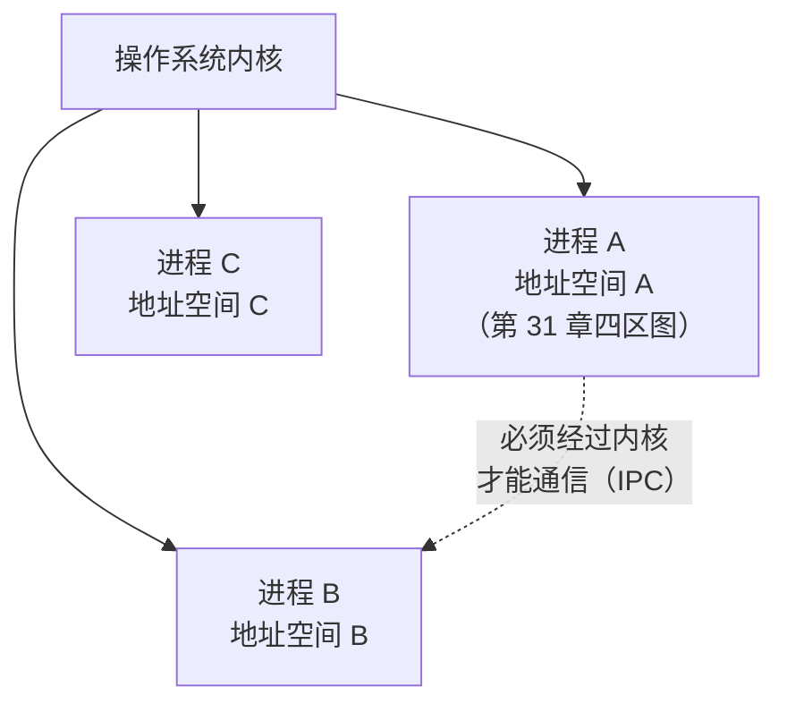

# 第 39 章 · 进程

**简体中文** ｜ [English](./39-process.en-US.md)

---

> Part 5 讨论的一切——栈帧、堆分配、GC、所有权——都默认只有**一条执行线**。现在第二条线出现了，一切重新洗牌：两条线要不要共享内存？共享了怎么保证不打架？不共享又怎么协作？
>
> Part 6 从最保守的答案开始：**进程——彻底不共享**。第 31 章说过"OS 给每个进程一套完整、独立的地址空间"，本章把这句话**实测**出来：`fork` 之后父子各改各的全局变量，实测子进程 `global=101`、父进程仍是 `100`，而两者打印出的**地址完全相同**（`0x102794000`）——虚拟地址一样，映射到的物理内存已经分家。
>
> 分家的方式是**写时复制**：实测父进程写满 300 MB（RSS = 301 MB），子进程刚 `fork` 出来 RSS = **0 MB**（一个字节都没复制），直到它真的写入才涨到 300 MB。**fork 很聪明，但仍然不便宜**——实测 `fork + wait` 每次 **256.6 μs**，而 `pthread_create + join` 只要 **12.2 μs**：**进程创建是线程的 21 倍贵**。这个数字是下一章的引子。
>
> 隔离带来的最大收益，Python 给出了最锋利的证明：CPU 密集任务用四个进程跑，实测 **935 ms → 321 ms，加速比 2.85–3.02x**——**多进程是 CPython 绕开 GIL 实现真并行的唯一手段**（同样的任务换多线程加速比约等于 1，第 40 章实测）。
>
> 代价则是：数据必须**显式传递**。C++ 用裸管道、Python 用 pickle 序列化的 Queue、Node 用结构化克隆的 IPC——**隔离越彻底，通信越贵**。连数据库都在做同一道选择题：PostgreSQL 每连接一个进程、MySQL 每连接一个线程；而 SQLite 的多进程写锁实测直接报 `database is locked (5)`，加上 `busy_timeout` 才阻塞等待 2188 ms 后成功。

## 1. 学习目标

本章结束后，你将能够：

- 说清**进程的本质**（独立地址空间 + 独立资源表）以及隔离带来的收益与代价；
- 用 `fork` 实测验证**内存隔离**（同一地址、不同物理页）与**写时复制**（实测 0 MB → 300 MB）；
- 量化**进程的创建成本**（实测 256.6 μs vs 线程 12.2 μs = 21 倍）并据此判断何时该用进程；
- 解释为什么 **CPython 必须靠多进程实现 CPU 并行**（实测加速比 2.85x），以及 I/O 密集场景为何不必；
- 对比五门语言的进程 API（`fork` / `multiprocessing` / `ProcessBuilder` / `Process` / `child_process`）与三种 IPC 形态。

---

## 2. 为什么会出现这个概念

### 一条执行线不够用

```text
① 一个程序崩了，整台机器的服务都停了 —— 需要故障隔离
② 一个用户的程序能读另一个用户的内存 —— 需要安全隔离
③ 十核 CPU，程序只用得上一核        —— 需要并行
④ 等网络响应的时候什么都干不了       —— 需要并发
```

### 操作系统的第一个答案：进程

**进程 = 一个正在运行的程序实例 + 它独占的一整套资源**：

| 每个进程独占 | 内容 |
|-------------|------|
| **地址空间** | 完整的虚拟内存布局（第 31 章的四区图，每个进程一份） |
| 文件描述符表 | 打开的文件、socket 各归各的 |
| 身份与权限 | PID、用户、组、环境变量 |
| 信号处理表 | 各自决定如何响应中断 |



> **一句话**：进程用"**什么都不共享**"换来了彻底的隔离——一个进程崩溃、内存写坏、被攻破，都伤不到邻居（第 34 章的野指针只能伤自己）。代价是创建贵（实测 21 倍于线程）、通信贵（数据必须序列化搬运）。**Part 6 的全部张力就在这条轴上**：隔离越多越安全，共享越多越高效。

---

## 3. 底层原理

### `fork`：一次调用，两次返回

POSIX 的进程创建方式是**复制自己**：

```cpp
pid_t pid = fork();     // ← 这一行之后，有两个进程在跑同一份代码
if (pid == 0) {
    // 子进程：fork 返回 0
} else {
    // 父进程：fork 返回子进程的 PID
}
```

**实测输出**：

```text
我是进程 93770，我的父进程是 93755
在父进程里返回子进程的 PID（本次 = 93786）
在子进程里返回 0 —— 这是区分父子的唯一手段
```

### 钥匙实验：同一个地址，两份内存

```cpp
int global_counter = 100;       // 全局变量
// fork 之后，子进程 +1，父进程不动
```

**实测输出**：

```text
fork 之前 global_counter = 100，地址 = 0x102794000
[子进程 93786] 改后 global=101, heap=201, 地址=0x102794000
[父进程 93770] 我的 global=100, heap=200, 地址=0x102794000
```

**两个进程打印出完全相同的地址，值却不同**——这是第 31 章"虚拟地址"最直观的证据：

```text
虚拟地址 0x102794000（父） → 物理页 X（值 100）
虚拟地址 0x102794000（子） → 物理页 Y（值 101）
                              ↑ 同一个虚拟地址，MMU 映射到不同物理页
```

**堆上的数据同样隔离**（实测 heap 201 vs 200）——隔离的是整个地址空间，不分栈堆。

### 写时复制：fork 为什么还能这么快

如果 `fork` 真的复制整个地址空间，一个占 8 GB 内存的进程就没法 fork 了。实际做法是**写时复制**（COW）：只复制页表，把所有页标记为只读共享；谁写谁触发缺页异常，内核这时才真复制那一页。

**实测证据**（父进程先写满 300 MB）：

```text
父进程写满 300 MB 后:          RSS = 301 MB
  [子进程] 刚 fork 出来:       RSS = 0 MB     ← 一个字节都没复制！
  [子进程] 写满同一块内存之后: RSS = 300 MB   ← 这时才真的复制
```

**`fork` 的开销与内存大小几乎无关，只与页表大小有关**——这就是它能在 256 μs 量级完成的原因。

### 进程创建到底多贵（实测）

```text
fork + wait   :   256.6 us/次
pthread + join:    12.2 us/次
进程创建是线程的 21.1 倍贵
```

256 μs 是什么概念？第 33 章实测过 `malloc/free` 一对是 15.8 ns，第 32 章实测 Python 函数调用是 23 ns——**创建一个进程约等于一万六千次 malloc**。所以进程从来不是"用完就扔"的东西：Web 服务器 fork 一个 worker 处理一个请求的年代早就过去了，现在都是**进程池 + 长期复用**（Node 的 cluster、Python 的 Pool、PostgreSQL 的连接池，全是这个思路）。

### 隔离的代价：通信必须显式

进程之间不能直接读对方的变量，所有数据都要**经过内核搬运**：

| IPC 方式 | 特点 | 本章实测 |
|---------|------|---------|
| **管道 pipe** | 单向字节流，父子进程间最简单 | C++ 实测 |
| **消息队列** | 带边界的消息，需序列化 | Python `mp.Queue`（pickle）、Node IPC（结构化克隆） |
| **标准输入输出** | 跨语言通用，管道的高层形态 | Java/C# 实测（喂给 `grep`） |
| **共享内存** | 最快（不拷贝），但要自己加锁——退化成线程的难题 | 第 41 章 |
| **socket / 文件** | 可跨机器 | 分布式系统的基础 |

```text
线程共享数据：改一个变量，另一条线立刻看见（零成本，也零保护 —— 第 40 章）
进程共享数据：序列化 → 内核缓冲区 → 反序列化（有成本，也有保护）
```

---

## 4. JavaScript

Node 是**单线程事件循环**（第 43 章），想用多核只有一条路：**多进程**。

### 进程身份与 fork（实测）

```javascript
const { fork } = require("child_process");
const child = fork(childScript);
```

```text
我是进程 92929，父进程 92927
CPU 核数 = 10，平台 = darwin
[子进程 92930] 我的 counter = 101，父进程是 92929
子进程退出码 = 0，父进程 counter 仍是 100   ← 纹丝不动
```

注意 Node 的 `fork()` **不是 POSIX 的 fork**——它是"启动一个新的 Node 进程跑指定脚本"，没有内存快照复制，但自带一条 IPC 通道。

### IPC：结构化克隆（实测）

```javascript
process.send({ from: process.pid, text: "..." });   // 子进程发
child.on("message", (msg) => { ... });              // 父进程收
```

```text
父进程收到 IPC 消息: "隔离归隔离，话还是要讲的"（来自进程 92930）
```

比 C++ 的裸管道高一层：**Node 把序列化封装好了**（结构化克隆算法，能传对象、数组、Map，但传不了函数与类实例）。

### `cluster`：Node 吃满多核的标准姿势

```javascript
// 主进程 fork 出 N 个 worker（N = 核数），内核把连接负载均衡地分给它们
```

每个 worker 是**独立进程**：内存隔离、崩溃不互相拖累、可以单独重启（滚动更新的基础）。这也是 PM2、Node 官方 cluster 模块、以及各种 serverless 运行时的共同模型。

> **注意事项**：`worker_threads`（Node 12+）提供了真正的多线程，适合 CPU 密集且需要共享大块内存的场景（配合 `SharedArrayBuffer`，第 34 章实测过）；但绝大多数 Node 服务仍用多进程——**隔离带来的运维简单性，通常比省下的那点内存更值钱**。

---

## 5. Python

Python 的多进程有一个别的语言没有的**刚需理由**：**绕开 GIL**。

### 钥匙实验：内存隔离（实测）

```text
父进程 counter = 100
[子进程 90717] 改后 counter = 101，父进程是 90707
子进程改完之后，父进程 counter = 100   ← 纹丝不动（各持一份）
```

### 真并行：多进程的加速比（本章最重要的实测）

```python
def cpu_task(n):
    total = 0
    for i in range(n): total += i * i
    return total

with mp.Pool(4) as pool:
    pool.map(worker, [8_000_000] * 4)
```

```text
串行 4 个任务:      935 ms
4 进程并行:         321 ms
加速比 = 2.85x   ← 接近核数（真并行）
```

**为什么必须用进程**：CPython 的 GIL（全局解释器锁）保证同一时刻只有一个线程执行字节码——第 36 章解释过它的成因（引用计数的原子性）。**多线程跑 CPU 密集任务，加速比约等于 1**（第 40 章实测）。而每个进程有自己的解释器、自己的 GIL，所以**多进程是 CPython 唯一的真并行手段**。

### IPC：pickle 序列化（实测）

```python
q = mp.Queue()
p = mp.Process(target=producer, args=(q,))
```

```text
父进程收到: 来自进程 93899 的消息
（数据经 pickle 序列化后跨进程传输——隔离的代价）
```

### 启动方式：spawn vs fork

```text
本机实测: 启动方式 = spawn（macOS/Windows 默认）
```

| 方式 | 行为 | 平台 |
|------|------|------|
| **fork** | 复制父进程（COW）——快，但可能继承锁状态导致死锁 | Linux 默认 |
| **spawn** | 启动全新解释器，重新 import 模块——慢，但干净 | macOS/Windows 默认 |

**spawn 模式有个硬性约束**（本章开发时实测踩到）：传给子进程的一切都必须**可 pickle**，且函数必须定义在**模块顶层**——把 `producer` 定义在 `if __name__ == "__main__"` 块里，子进程会报 `AttributeError: Can't get attribute 'producer'`。

> **注意事项**：`if __name__ == "__main__":` 保护在 spawn 模式下**不是风格而是必需**——没有它，子进程 import 模块时会再次执行创建进程的代码，无限递归下去。

---

## 6. Java

Java **不能 fork**——JVM 的多线程状态无法安全复制。它只能启动**全新进程**。

### `ProcessBuilder`（实测）

```java
ProcessBuilder pb = new ProcessBuilder("sh", "-c", "...");
Process child = pb.start();
```

```text
我是进程 93919，父进程 93906
[子进程 93920] 我是独立进程，看不到 Java 的 counter 变量
子进程退出码 = 0，父进程 counter 仍是 100
```

**隔离比 fork 更彻底**：连内存快照都不共享——子进程是从零启动的另一个程序。

### `ProcessHandle`：进程树视野（Java 9+，实测）

```text
我的子进程数 = 0
系统上共有 490 个可见进程
```

`ProcessHandle.allProcesses()` 让 Java 能枚举整个系统的进程——做监控、守护进程管理时很实用。

### IPC：标准流（实测）

```java
Process grep = new ProcessBuilder("grep", "并发").start();
grep.getOutputStream().write("...".getBytes("UTF-8"));
```

```text
grep 返回: Part 6 并发
```

**与 C++ 的 `pipe()` 同源**——只是包装成了 `InputStream`/`OutputStream`。

### `onExit()`：异步等待（实测）

```java
quick.onExit().get(...);   // 返回 CompletableFuture，可以 await（第 42 章）
```

> **注意事项**：Java 生态**偏爱线程而非进程**——JVM 启动成本高（第 5 章）、线程模型成熟、且有强大的并发库（第 45 章）。`ProcessBuilder` 主要用于调用外部命令，不是并行计算的手段。忘记读取子进程的输出流会导致**缓冲区填满后子进程卡死**——这是 Java 调外部命令最经典的坑。

---

## 7. C++

C++ 直接暴露 POSIX 原语——本章第 3 节的全部实测都来自它。

### 三个系统调用撑起整个模型

```cpp
fork();      // 复制自己（COW）——实测 256.6 μs
exec*();     // 用另一个程序替换自己的地址空间（fork 之后常配合使用）
waitpid();   // 等子进程结束，回收它的资源
```

**`fork` + `exec` 的组合是 Unix 哲学的经典体现**：`fork` 负责"创建一个执行上下文"，`exec` 负责"换一个程序去执行"——两件事分开，于是可以在中间插入任意设置（重定向、改权限、设环境变量）。Windows 的 `CreateProcess` 把两者合一，参数因此有一长串。

### 僵尸进程与孤儿进程

```text
僵尸进程：子进程已退出，但父进程没 wait —— 退出码等信息滞留在内核，PID 不释放
孤儿进程：父进程先退出 —— 子进程被 init/launchd（PID 1）收养
```

**必须 `waitpid`**（本章示例每次 fork 都配对了 wait）——否则长期运行的服务会积累僵尸进程，最终耗尽 PID。

### 管道 IPC（实测）

```cpp
int fd[2];
pipe(fd);                    // fd[0] 读端，fd[1] 写端
// fork 之后：父进程关写端读数据，子进程关读端写数据
```

```text
父进程从管道读到: 子进程说：隔离归隔离，话还是要讲的
```

### `fork` 的两个真实陷阱

**① stdio 缓冲会被复制**（本章开发时实测踩到）：

```cpp
printf("...");        // 进了缓冲区还没输出
fork();               // ⚠️ 缓冲区被复制两份 → 同一行输出两次
```

修法：`fork` 前 `fflush(stdout)`；子进程用 `_exit()` 而非 `exit()`（`_exit` 不刷新缓冲、不跑 atexit）——但那样缓冲里的内容会丢，所以退出前也要手动 `fflush`。

**② 多线程程序里 fork 极其危险**：只有调用 `fork` 的那条线程会被复制到子进程，其他线程持有的锁**永远不会被释放**——子进程一旦碰到那把锁就死锁。POSIX 规定 fork 后的子进程只能调用 async-signal-safe 函数，实践中就是"立刻 exec 或立刻 _exit"。

> **注意事项**：现代 C++ 更推荐 `posix_spawn`（fork+exec 的原子封装，避免多线程 fork 问题）或直接用线程（第 40 章）；`std::system()` 简单但有命令注入风险（第 58 章安全）。

---

## 8. C#

.NET 的 `System.Diagnostics.Process` 把 Windows 与 Unix 的进程模型**抹平成一套 API**。

### 统一 API（实测）

```csharp
var psi = new ProcessStartInfo("sh", "-c \"...\"") {
    RedirectStandardOutput = true, UseShellExecute = false
};
using var child = Process.Start(psi)!;
```

```text
我是进程 94202，进程名 csapp
处理器数 = 10，工作集 = 31 MB
[子进程 94232] 我看不到 C# 的 counter 变量
子进程退出码 = 0，父进程 counter 仍是 100
```

**Windows 没有 `fork`**——`CreateProcess` 只能"启动新程序"。.NET 选择了这个交集，所以 C#（和 Java）的进程模型天然就是"启动全新进程"，没有 COW 那一套。

### 进程作为可观测对象（实测）

```csharp
Process.GetProcesses();          // 系统上共有 495 个可见进程
self.WorkingSet64;               // 工作集 31 MB
DateTime.Now - self.StartTime;   // 已运行 1580 ms
```

`Process` 类同时是**控制接口**和**监控接口**——这是 .NET 相对 POSIX 原语的抽象层次优势。

### 异步等待（实测）

```csharp
await child.WaitForExitAsync();   // 等子进程也能 await（第 42 章）
```

> **注意事项**：`UseShellExecute = false` 是重定向标准流的前提（默认值在 .NET Core 里已改为 `false`）；`Process` 实现了 `IDisposable`（第 37 章），必须 `using` 否则泄漏句柄；跨平台代码要注意 `ProcessStartInfo` 的参数转义规则在 Windows 与 Unix 上不同。

---

## 9. SQL

数据库面对的是同一道题：**每个客户端连接，用进程还是线程承载？**

### 三种服务端模型

| 数据库 | 模型 | 取舍 |
|--------|------|------|
| **PostgreSQL** | **每连接一个 OS 进程** | 隔离强（一个连接崩溃不影响其他）、创建贵 → 必须配连接池 |
| **MySQL** | **每连接一个线程** | 轻量、共享缓冲池、但需处处线程安全 |
| **SQLite** | **没有服务端进程** | 连接就在调用方进程里，多进程靠**文件锁**协调 |

**这正是本章主题在数据库层的映射**——PostgreSQL 选了隔离（付出创建成本），MySQL 选了共享（付出并发复杂度）。

### 多进程写同一个 SQLite 库（shell 实测）

两个 `sqlite3` 进程同时写：

```text
[进程A] BEGIN IMMEDIATE; UPDATE ...     ← 持有写锁
[进程B] 默认 busy_timeout=0 时尝试写入：
    Error: stepping, database is locked (5)      ← 直接失败
[进程B] busy_timeout=5000 重试：
    等待 2188 ms 后 成功                          ← 阻塞到 A 提交
```

**SQLite 的并发模型 = 文件锁串行化写者**：同一时刻只允许一个写者，读者可以有多个。`busy_timeout` 决定"拿不到锁时等多久再放弃"。

### WAL 模式（实测）

```sql
PRAGMA journal_mode = WAL;      -- 实测返回 wal
```

默认的 DELETE 模式下写会阻塞读；**WAL 模式下读者不被写者阻塞**——这是 SQLite 支撑多进程并发访问的关键配置（第 48 章事务会展开）。

### 事务隔离 = 进程隔离在数据层的映射（实测）

```text
② 事务内（未提交）看到: 70
   提交之后所有连接看到: 70
```

**未提交的修改对别的连接不可见**——与"进程内存对别的进程不可见"是同一个思想：**给每个执行单元一个私有的、看似完整的世界**（第 31 章的虚拟内存、第 48 章的 MVCC 快照，本质都是这件事）。

> **工程提醒**：PostgreSQL 的"每连接一进程"意味着**连接是昂贵资源**——1000 个连接就是 1000 个进程，必须用 PgBouncer 之类的连接池收敛；这与"进程创建 256 μs"（本章实测）是同一笔账。

---

## 10. 五语言横向对比

### ① 进程 API 对比

| 特性 | JavaScript | Python | Java | C++ | C# |
|------|-----------|--------|------|-----|-----|
| 创建方式 | `child_process.fork/spawn` | `mp.Process` | `ProcessBuilder` | **`fork` + `exec`** | `Process.Start` |
| 能否复制内存 | ❌ 启动新进程 | ✅ fork 模式（Linux） | ❌ | ✅ **COW**（实测 0→300 MB） | ❌ |
| 默认启动方式 | spawn 新脚本 | **spawn**（macOS/Win，实测） | 新进程 | fork | 新进程 |
| IPC 内建 | ✅ 结构化克隆（实测） | ✅ pickle Queue/Pipe（实测） | 标准流 | 裸管道（实测） | 标准流 |
| 主要用途 | **cluster 吃多核** | **绕 GIL 真并行**（实测 2.85x） | 调外部命令 | 系统编程基石 | 调外部命令 |
| 进程枚举 | `process` 全局 | `psutil`（第三方） | ✅ `ProcessHandle`（实测 490 个） | `/proc`、`ps` | ✅ `GetProcesses`（实测 495 个） |

### ② 钥匙实测：隔离与代价的三组数字

```text
① 内存隔离（C++/Python/Java/C#/JS 五语言实测一致）：
   子进程改 counter → 101，父进程仍是 100
   C++ 额外证明：两个进程打印的地址完全相同（0x102794000）—— 虚拟地址骗了你

② 写时复制（C++ 实测）：
   父写满 300 MB → RSS 301 MB
   子刚 fork      → RSS 0 MB      ← 没复制
   子写入之后    → RSS 300 MB    ← 才复制

③ 创建成本（C++ 实测）：
   fork + wait    256.6 μs
   pthread + join  12.2 μs
   进程贵 21.1 倍  ← 第 40 章的引子
```

### ③ 两条设计分歧

**分歧一：进程是并行手段，还是仅仅是隔离手段**

```text
是并行手段（Python / Node）：
  因为语言本身有单线程瓶颈（GIL / 事件循环）——多进程是吃满多核的唯一路
  实测：Python 4 进程加速比 2.85x
是隔离手段（Java / C# / C++）：
  语言有成熟的多线程，进程主要用于调外部程序与故障隔离
  实测：Java/C# 的 API 都围绕"启动外部命令 + 读它的输出"设计
```

**分歧二：要不要暴露 fork 的复制语义**

```text
暴露（C++ / Python-Linux）：能继承父进程状态，启动快（COW）
                            代价：多线程下 fork 极其危险（锁状态被继承）
不暴露（Java / C# / Node / Python-macOS）：只能启动全新进程
                            代价：启动慢、要重新初始化
                            收益：语义干净，没有"半个父进程"的诡异状态
```

**这条分歧的走向很明确**：连 Python 都在 3.14 把 Linux 上的默认启动方式从 `fork` 改成了更安全的 `forkserver`——**fork 的复制语义正在被历史淘汰**。

### ④ 共同点与差异根源

**共同点**：五门语言的进程隔离表现完全一致（实测五连：子进程改不动父进程的变量）；都提供某种 IPC（管道/队列/标准流）；都把"进程"当作重量级资源来管理（池化复用）。

**差异根源**：

- **C++ 直接映射 POSIX**——因为它就是系统编程语言，`fork`/`exec`/`wait` 是它的母语；
- **Python 把进程当并行工具**——因为 GIL 堵死了线程这条路（第 36 章讲过 GIL 的成因，第 40 章实测它的影响）；
- **Node 把进程当扩展手段**——因为事件循环是单线程的（第 43 章），cluster 是它吃多核的唯一标准答案；
- **Java/C# 把进程当外部调用接口**——因为它们的线程模型足够强大（第 45 章线程池），进程只用于隔离与调用外部程序；
- **数据库在同一道题上分了两派**（PostgreSQL 进程 / MySQL 线程），证明这个取舍与语言无关，是**并发模型的普遍分歧**。

---

## 11. 底层实现对比

| 运行时 | 进程创建的实现 | 关键细节 |
|--------|--------------|---------|
| **V8**（Node） | `uv_spawn`（libuv）→ `posix_spawn`/`fork+exec` | `child_process.fork` 额外建一条 IPC 管道；cluster 用 `SO_REUSEPORT` 或主进程分发让多进程共享端口 |
| **CPython** | `os.fork()` 或 `subprocess` + `spawn` | 实测本机为 spawn：重新启动解释器并 import 模块，因此要求可 pickle；`forkserver` 是折中方案（预先 fork 一个干净的服务进程） |
| **JVM**（Java） | `ProcessImpl` → `vfork`/`posix_spawn` | JVM 自身不 fork（多线程状态无法安全复制）；`vfork` 比 `fork` 更省——因为马上要 exec，连页表都不必复制 |
| **C++**（原生） | 直接系统调用（实测 256.6 μs） | COW 由内核页表实现（实测 0→300 MB）；`vfork`/`posix_spawn` 是更快的变体 |
| **CLR**（C#） | Windows `CreateProcess` / Unix `fork+exec` | 跨平台抽象层抹平差异；`ProcessStartInfo` 的参数转义在两个平台上规则不同 |

**一个值得记住的分野**：

```text
fork 模型（Unix 传统）：先复制再替换 —— 灵活（中间可插入任意设置），但多线程下危险
spawn 模型（Windows / 现代默认）：一步到位启动新程序 —— 安全，但要通过参数表达所有设置
现代趋势：posix_spawn 兼得两者（内核内部做 fork+exec，对用户是原子的）
```

---

## 12. 性能分析

### 三个量级的成本（本书实测串联）

| 操作 | 成本 | 出处 |
|------|------|------|
| 函数调用（Python） | 23 ns | 第 32 章 |
| `malloc`/`free` 一对 | 15.8 ns | 第 33 章 |
| 线程创建 + join | **12.2 μs** | 本章实测 |
| **进程创建 + wait** | **256.6 μs** | 本章实测 |

**进程创建 ≈ 一万六千次 malloc ≈ 一万次 Python 函数调用**——这个量级决定了进程必须被**池化复用**，绝不能按请求创建。

### 多进程并行的收益与门槛

```text
实测：4 个 CPU 密集任务，串行 935 ms → 4 进程 321 ms（2.85x）

但要注意加速比 2.85 < 4：
  ① 进程创建开销（4 × 256 μs，占比很小）
  ② 数据序列化：任务参数与返回值都要 pickle（本例返回一个整数，成本低）
  ③ 调度与内存带宽竞争
如果任务本身只跑 10 ms，序列化成本就会吃掉全部收益 —— 粒度太细不划算
```

**判据：单个任务的计算时间要远大于"进程创建 + 数据往返"的成本**，多进程才划算。

### 内存成本

```text
COW 让 fork 的初始内存成本接近零（实测子进程 RSS = 0 MB）
但只要子进程开始写，成本就上来（实测涨到 300 MB）
Python 的 spawn 模式更贵：每个子进程都是完整的解释器（几十 MB 起）
  → 所以 Pool 的进程数通常设为核数，而不是任务数
```

> ⚠️ 惯例提醒：本章的性能话题不是"进程慢不慢"，而是**"该用进程还是线程"**——下一章会给出线程侧的数据（共享内存的零成本 vs 数据竞争的代价），两章合起来才是完整的决策依据。

---

## 13. 工程实践

| 场景 | ✅ 推荐 | ❌ 不推荐 | 原因 |
|------|--------|----------|------|
| Python CPU 密集 | 多进程 / `ProcessPoolExecutor` | 多线程 | GIL 堵死线程（实测 2.85x vs ≈1x） |
| Python I/O 密集 | 线程或 asyncio（第 42 章） | 多进程 | 进程开销白付，I/O 等待期间 GIL 会释放 |
| Node 吃满多核 | `cluster` / 多实例 + 负载均衡 | 在主线程做重计算 | 阻塞事件循环 = 整个服务卡死（第 43 章） |
| 需要故障隔离 | 多进程 | 多线程 | 一个线程崩溃（段错误）整个进程死 |
| 高频短任务 | 进程池复用 | 每次创建进程 | 256 μs/次（实测）会成为瓶颈 |
| 调外部命令 | `ProcessBuilder`/`Process`/`subprocess` | 拼字符串给 shell | 命令注入风险（第 58 章） |
| 多线程程序里 | `posix_spawn` | `fork` | 其他线程的锁状态被继承 → 死锁 |
| 读子进程输出 | 及时读或重定向到文件 | 忽略输出流 | 缓冲区满 → 子进程卡死（经典坑） |
| PostgreSQL 连接 | 连接池（PgBouncer） | 每请求新建连接 | 每连接一进程，创建成本高（本章实测量级） |
| 子进程管理 | 每个 fork 配对 `wait` | fork 完不管 | 僵尸进程累积耗尽 PID |

### 判断口诀

```text
要不要用进程？
  需要真并行 + 语言有单线程瓶颈（Python/Node）→ 要
  需要崩溃隔离 / 安全边界               → 要
  只是想并发做点事，且语言线程好用      → 不要，用线程（第 40 章）

用了进程之后：
  一定池化（256 μs 不是白付的）
  通信一定要算成本（序列化 + 拷贝）
```

---

## 14. 最佳实践

- **先问"要隔离还是要共享"**：需要故障隔离、安全边界、或语言有单线程瓶颈 → 进程；否则线程更划算（下一章给出对照数据）。
- **进程一律池化**：实测 256.6 μs/次的创建成本决定了它必须复用——`mp.Pool`、`cluster`、连接池都是同一个思路。
- **通信成本要计入设计**：进程间传大对象前先想想能不能只传引用（文件路径、数据库主键）——序列化往返常常比计算本身还贵。
- **Python 记住三件事**：`if __name__ == "__main__"` 保护、传给子进程的对象必须可 pickle、函数必须在模块顶层（本章开发时实测踩过这个坑）。
- **绝不在多线程程序里裸 fork**：用 `posix_spawn` 或在启动线程之前 fork 完——继承的锁状态是最难查的死锁。
- **每个子进程都要 wait/回收**：否则僵尸进程累积；Node 用 `child.on('exit')`、Java 用 `onExit()`、C++ 用 `waitpid`。
- **子进程的输出流必须处理**：读走、重定向或丢弃——不处理会让子进程写满缓冲区后永久阻塞。
- **数据库连接当进程看待**：PostgreSQL 尤其如此——连接池不是优化，是必需品。

---

## 15. 常见坑

**坑 1 · fork 前没刷新 stdio 缓冲**（本章开发时实测踩到）

```cpp
printf("...");   // 还在缓冲区里
fork();          // ⚠️ 缓冲区被复制 → 同一行输出两次；或子进程 _exit 后输出丢失
```

**如何避免**：`fork` 前 `fflush(stdout)`；子进程 `_exit` 前也要手动 `fflush`（`_exit` 不刷新 stdio）。

**坑 2 · Python 的函数定义在 `__main__` 块里**（本章开发时实测踩到）

```text
AttributeError: Can't get attribute 'producer' on <module '__mp_main__'>
```

**如何避免**：spawn 模式下子进程要按名字 import 目标函数——所有传给 `Process`/`Pool` 的函数必须定义在**模块顶层**。

**坑 3 · 忽略子进程的输出流**

```java
Process p = new ProcessBuilder("大量输出的命令").start();
p.waitFor();     // ⚠️ 永远等不到：子进程写满管道缓冲区后阻塞了
```

**如何避免**：及时读取 `getInputStream()`，或用 `redirectOutput()` 重定向到文件/丢弃；Java 的 `inheritIO()` 最省事。

**坑 4 · 多线程程序里 fork**

```cpp
// 线程 A 持有 malloc 的内部锁时，线程 B 调用 fork
// → 子进程继承了"已锁住但永远不会解锁"的状态 → 子进程一 malloc 就死锁
```

**如何避免**：用 `posix_spawn`；或在创建任何线程之前完成所有 fork；fork 后的子进程只调用 async-signal-safe 函数并立刻 exec。

**坑 5 · 不回收子进程**（僵尸）

```text
子进程退出了，但父进程没 wait —— PID 与退出状态滞留内核，长期运行会耗尽 PID
```

**如何避免**：每个 fork 配对 `waitpid`；或注册 `SIGCHLD` 处理器；Node/Java/C# 的高层 API 通常已经代劳。

**坑 6 · 以为多进程能共享内存变量**

```python
counter = 0
# 子进程里 counter += 1 —— 父进程永远看不到（实测五语言一致）
```

**如何避免**：跨进程共享状态必须用显式机制——`mp.Value`/`mp.Array`（共享内存）、`Queue`、或外部存储（Redis、数据库）。

**坑 7 · 按请求创建进程**

```text
每个 HTTP 请求 fork 一个进程 → 256 μs/次（实测）+ 内存开销 → QPS 上不去
```

**如何避免**：进程池 + 长期复用（cluster、Pool、PostgreSQL 连接池全是这个模型）。

---

## 16. 面试题

**基础**

1. 进程和程序有什么区别？一个进程独占哪些资源？
2. `fork` 为什么会"返回两次"？如何区分父子进程？
3. 什么是僵尸进程？什么是孤儿进程？各自如何避免/处理？

**中级**

4. **什么是写时复制？它如何让 fork 一个占 8 GB 内存的进程仍然很快？（用本章实测数据说明）**
5. 进程间通信有哪几种方式？各自的成本与适用场景？
6. **为什么 Python 的 CPU 密集任务必须用多进程而不是多线程？加速比大约是多少？**

**高级**

7. **父子进程打印出相同的变量地址却读到不同的值——请用虚拟内存机制解释这个现象。**
8. 为什么在多线程程序里调用 `fork` 是危险的？`posix_spawn` 如何解决？
9. PostgreSQL 每连接一进程、MySQL 每连接一线程——两种模型各自的收益与代价是什么？这与本章的哪个取舍对应？

---

## 17. 练习

**基础**

1. 用 `fork` 写一个程序：父进程打印 1–5，子进程打印 6–10，观察输出交错的顺序。
2. 在五门语言里各写一次"子进程改变量、父进程不受影响"的验证。
3. 用 `ps -ef` 或 `ProcessHandle.allProcesses()` 观察你机器上的进程树，找出 PID 1 是谁。

**提高**

4. **复现本章的三组实测**：内存隔离（地址相同值不同）、COW（RSS 0 → 300 MB）、创建成本（fork vs pthread）。
5. 用 Python 的 `ProcessPoolExecutor` 测量不同任务粒度下的加速比（任务耗时 1 ms / 10 ms / 100 ms / 1 s），找出"粒度太细不划算"的拐点。
6. 用管道实现一个双向通信的父子进程（两个 pipe：一个父→子、一个子→父）。

**挑战**

7. 实现一个最小进程池：预先 fork N 个 worker，用管道分发任务、收集结果，对比它与"每任务一进程"的吞吐。
8. 写一个程序验证"多线程里 fork 的危险"：一个线程持有互斥锁时另一个线程 fork，观察子进程死锁。
9. 用两个 SQLite 进程复现本章的写锁实测，再打开 WAL 模式重测——解释读写并发行为的差异。

---

## 18. 本章总结

**一句话总结**：进程是操作系统给的**最强隔离单元**——每个进程一套完整的地址空间（实测：父子打印相同地址 `0x102794000` 却读到 100 与 101）、一套独立的资源表；创建它靠 `fork` 的**写时复制**（实测：子进程刚 fork 时 RSS = 0 MB，写入后才涨到 300 MB），但仍比线程贵 **21 倍**（实测 256.6 μs vs 12.2 μs）；隔离的最大收益是**真并行与故障隔离**——Python 靠多进程绕开 GIL，实测 CPU 密集任务加速 **2.85x**（多线程约等于 1x）；代价则是**通信必须显式**（管道 / pickle / 结构化克隆，隔离越彻底越贵）；连数据库都在做同一道选择题——PostgreSQL 每连接一进程、MySQL 每连接一线程，而 SQLite 的多进程写锁实测直接抛 `database is locked (5)`。

**核心知识点**

- **进程 = 独立地址空间 + 独立资源表**：崩溃、内存写坏、被攻破都伤不到邻居。
- **钥匙实验**（五语言实测一致）：子进程改不动父进程的变量；C++ 额外证明地址相同而值不同（虚拟内存）。
- **写时复制**（实测）：fork 只复制页表；RSS 0 MB → 写入后 300 MB——`fork` 成本与内存大小几乎无关。
- **创建成本**（实测）：进程 256.6 μs vs 线程 12.2 μs = **21 倍**——所以必须池化复用。
- **Python 的刚需**（实测）：多进程是绕开 GIL 的唯一真并行手段，加速比 2.85x。
- **IPC 三形态**：裸管道（C++）、序列化队列（Python pickle / Node 结构化克隆）、标准流（Java/C#）。
- **fork 的两个陷阱**（实测踩过）：stdio 缓冲被复制、多线程下继承锁状态。
- **数据库同题**（实测）：PostgreSQL 进程 / MySQL 线程；SQLite 多进程写锁 `database is locked (5)`，`busy_timeout` 阻塞 2188 ms 后成功。

**检查清单**

- [ ] 我能解释"相同地址不同值"背后的虚拟内存机制。
- [ ] 我能说清写时复制如何让 fork 变便宜，以及它何时开始付费。
- [ ] 我知道进程与线程的创建成本量级差异（21 倍）。
- [ ] 我能判断一个任务该用进程还是线程。
- [ ] 我知道 fork 在多线程程序里为什么危险。

**下一章预告**：进程的隔离很安全，但**创建贵 21 倍、通信要序列化**——如果两个执行单元本来就想紧密协作、共享大量数据呢？答案是**线程**：同一个进程里的多条执行线，**共享地址空间**（第 31 章的堆、静态区全部共享），只有栈是各自的（第 32 章的帧）。共享带来了极致的效率——传数据就是传个指针，零拷贝零序列化。但也带来了并发编程最著名的灾难：**两个线程同时改一个变量，结果会错，而且错得不确定**。第 40 章将实测这个"数据竞争"——同一段自增代码跑一百万次，答案每次都不一样；并给出 CPython GIL 的完整解释（本章反复提到的那把锁，它如何让 Python 的多线程 CPU 加速比停在 1x）。

---

## 19. 延伸阅读

- <a href="https://en.wikipedia.org/wiki/Process_(computing)" target="_blank" rel="noopener">Wikipedia：Process</a> — 进程概念与生命周期综述。
- <a href="https://en.wikipedia.org/wiki/Copy-on-write" target="_blank" rel="noopener">Wikipedia：Copy-on-write</a> — 写时复制机制的标准描述。
- <a href="https://pages.cs.wisc.edu/~remzi/OSTEP/cpu-api.pdf" target="_blank" rel="noopener">OSTEP · Process API（fork/exec/wait）</a> — 免费教材中讲 fork 最清楚的一章。
- <a href="https://man7.org/linux/man-pages/man2/fork.2.html" target="_blank" rel="noopener">man 2 fork</a> — fork 的权威手册页（含多线程注意事项）。
- <a href="https://docs.python.org/3/library/multiprocessing.html" target="_blank" rel="noopener">Python 文档 · multiprocessing</a> — 启动方式、Pool、Queue 的官方文档。
- <a href="https://nodejs.org/api/cluster.html" target="_blank" rel="noopener">Node.js 文档 · cluster</a> — Node 多进程吃满多核的官方模块。
- <a href="https://docs.oracle.com/en/java/javase/17/docs/api/java.base/java/lang/ProcessBuilder.html" target="_blank" rel="noopener">Java API · ProcessBuilder</a> — Java 启动外部进程的官方文档。
- <a href="https://learn.microsoft.com/en-us/dotnet/api/system.diagnostics.process" target="_blank" rel="noopener">Microsoft Learn · System.Diagnostics.Process</a> — .NET 进程 API 官方文档。
- <a href="https://www.sqlite.org/lockingv3.html" target="_blank" rel="noopener">SQLite 文档 · File Locking And Concurrency</a> — SQLite 多进程锁机制的官方说明。
