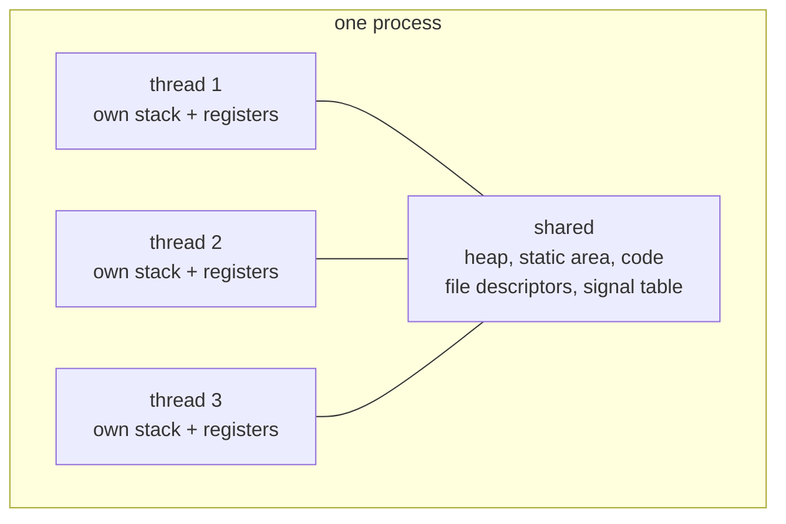
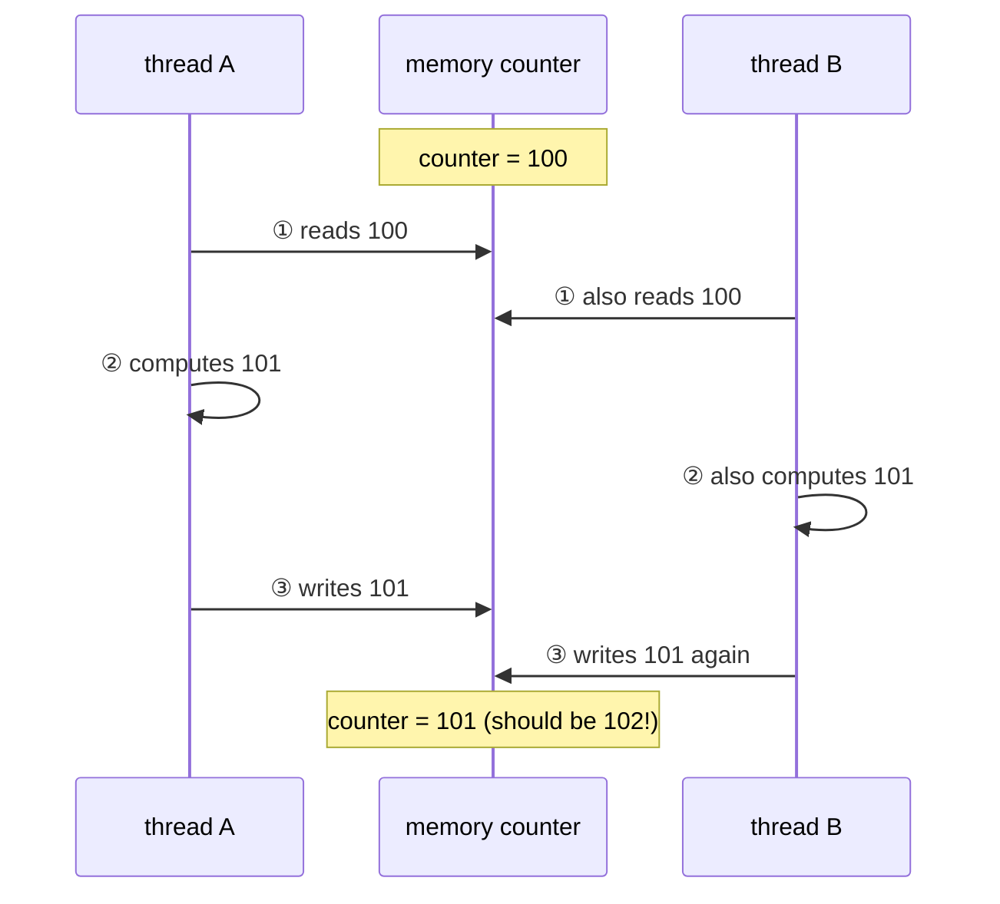

# Chapter 40 · Thread

[简体中文](./40-thread.md) ｜ **English**

---

> Chapter 39's process traded "share nothing" for total isolation, at the price of being **21× costlier** to create and needing serialized conversation. What if two lines of execution genuinely want to cooperate closely over shared data?
>
> The answer is the **thread**: several lines of execution inside one process, **sharing the address space** — Chapter 31's heap and static area entirely shared, with only the stack private (measured: two threads print different local-variable addresses `0x16d85af8c` / `0x16d8e6f8c` but identical global addresses `0x102634008`). Sharing buys extreme efficiency: passing data is passing a pointer, zero copies, zero serialization.
>
> It also buys concurrency's most famous disaster. This chapter's **key experiment** is one line of code — two threads each incrementing the same counter a million times — and **all five languages fail**: C++ expected 2,000,000 and got **1,015,193**; Java **1,009,414**; C# **1,013,551**; JS (SharedArrayBuffer) expected 400,000 and got **226,923**; Python **267,622**. And **every run yields a different answer**. Nearly half the increments vanished.
>
> The cause: `counter++` is not one step but **read–modify–write**, and either thread can slip in anywhere between. The C++ measurement also punctures a classic myth — the variable was declared `volatile` **and still failed**: `volatile` guarantees visibility, not atomicity.
>
> The fix is simple (atomic operations, measured exactly correct in all five languages) but **not free**: the atomic version measured **6.4× slower**. And Python wears one more shackle: the **GIL** — measured, four CPU-bound tasks on four threads reach a speedup of **1.04×** (Chapter 39's same work on four processes reached **2.85×**); yet switch to I/O-bound work and the same four threads measure **3.96×**.
>
> Finally, the database delivers an isomorphic measurement: two sessions each "read, add 10, write back," both read 100 and both write 110 — **expected 120, got 110**. That is the **lost update**, the data race replayed verbatim at the data layer.

## 1. Learning Objectives

By the end of this chapter, you will be able to:

- State the thread/process boundary: **what is shared (heap, static area) and what is not (the stack)**, verified by measured addresses;
- Reproduce and explain the **data race** (five languages measured losing nearly half their increments), and why `counter++`'s read–modify–write is dangerous;
- Refute the classic myth that `volatile` fixes races (C++ measured: a volatile variable failed anyway);
- Fix races with **atomic operations** and quantify their price (measured 6.4× slower) — correctness is not free;
- Explain the **GIL**'s scope and consequences (measured CPU speedup 1.04× vs I/O speedup 3.96×) and choose processes or threads accordingly.

---

## 2. Why This Concept Exists

### The process's two pain points

Chapter 39's measurements lead straight to threads:

```text
Creation:      process 256.6 μs vs thread 12.2 μs   → processes cost 21×
Communication: processes serialize + kernel copying → threads change a variable and the other sees it
```

**Many workloads are inherently tightly coupled**: a web server's request handlers share one cache, one connection pool, one configuration. Doing that across processes would mean serializing all of it back and forth — absurd and slow.

### Threads: separating "execution" from "resources"



**A process is a container of resources; a thread is a unit of scheduling.** Threads in one process share nearly everything, with three exceptions:

| Each thread owns | Why |
|------------------|-----|
| **Stack** | each line of execution has its own call chain (Chapter 32's frames) — measured different addresses |
| **Registers / program counter** | where each line currently is, is its own business |
| Thread-local storage (TLS) | explicitly declared "one per thread" variables |

> **In one sentence**: threads trade **sharing everything** for ultimate cooperation efficiency (passing a pointer is passing the data), at the price that **every shared datum becomes a battlefield** — and this chapter's key experiment shows that price is higher than most people imagine.

---

## 3. How It Works

### Measurement one: what is shared, what is not

```cpp
void show_addresses(int id) {
    int local_var = id;                    // on the stack
    printf("local=%p, global=%p", &local_var, &global_marker);
}
```

**Measured output**:

```text
thread 1: local address = 0x16d85af8c, global address = 0x102634008
thread 2: local address = 0x16d8e6f8c, global address = 0x102634008
```

**Locals differ by about 0x8C000 (separate stacks); globals are identical (one memory)** — a perfect mirror of Chapter 39:

```text
Processes: same address, different physical memory (Ch. 39 measured 0x102794000 → 100 vs 101)
Threads:   same address, same physical memory  ← genuinely shared; change one and the other sees it
```

### The key experiment: the data race

```cpp
shared_counter = shared_counter + 1;      // two threads, a million times each
```

**Measured in five languages** (three runs each):

| Language | Expected | Measured | Loss |
|----------|----------|----------|------|
| **C++** | 2,000,000 | 1,021,586 / 1,016,344 / 1,015,193 | ~49% |
| **Java** | 2,000,000 | 1,011,515 / 1,009,414 / 1,303,944 | ~40% |
| **C#** | 2,000,000 | 1,013,551 / 1,029,656 / 1,029,066 | ~49% |
| **JavaScript** | 400,000 | 229,484 / 311,722 / 226,923 | ~35% |
| **Python** | 400,000 | 267,622 / 270,811 / 267,852 | ~33% |

**Two key observations**: results are **always below** expectation, and **every run differs** — the classic fingerprint of a data race (a nondeterministic bug, hardest to reproduce and to debug).

### Why increments vanish: `counter++` is three steps

```text
counter = counter + 1 actually executes:
  ① LOAD  counter → register
  ② ADD   register + 1
  ③ STORE register → counter
```

When two threads interleave:



**One increment vanishes** — and since both threads spend most of their time overwriting each other, nearly half go missing.

### `volatile` is not atomic (the myth C++ measurements puncture)

This chapter's C++ example deliberately declares the variable `volatile int`:

```cpp
volatile int shared_counter = 0;    // forces a real read and real write every time
```

**It fails anyway** (measured ~49% loss). Because:

```text
volatile guarantees:  no register caching, no reordering → solves visibility
volatile does not:    prevent interruption between read and write → does not solve atomicity
```

**Java's `volatile` is the same** (visibility and ordering, but `count++` remains unsafe) — one of concurrency's most common misconceptions, nailed shut here by measurement.

### Atomic operations: three steps compressed into one

```cpp
std::atomic<int> counter;   counter++;        // C++
AtomicInteger.incrementAndGet();              // Java
Interlocked.Increment(ref counter);           // C#
Atomics.add(view, 0, 1);                      // JavaScript
with lock: counter += 1                       // Python (a lock — it has no atomic integers)
```

**All five measured exactly correct** (2,000,000 / 400,000, not one lost). At the hardware level this rests on CAS (compare-and-swap) and friends, making read–modify–write indivisible.

### The price of correctness (measured)

```text
non-atomic (wrong)   1.1 ms
atomic (correct)     6.8 ms
the atomic version is 6.4× slower
```

**This is concurrency's central tension**: stronger synchronization means more assured correctness and worse performance. Chapter 41's mutexes cost more than atomics — and express more.

---

## 4. JavaScript

JS holds a distinctive position: **single-threaded by default, hence race-free by default** — but the moment memory is genuinely shared, races return.

### The main world is single-threaded

```text
CPU cores = 10, but the main thread is one (Chapter 43's event loop)
worker_threads offers real threads — sharing nothing by default (message passing)
```

Objects between workers travel by **structured clone** (a copy, like Chapter 39's process IPC) — **copies mean no sharing, and no sharing means no races**.

### The key experiment on the one shared channel: `SharedArrayBuffer` (measured)

```javascript
const buffer = new SharedArrayBuffer(4);   // the only genuinely shared thing
const view = new Int32Array(buffer);
view[0] = view[0] + 1;                     // ⚠️ read-modify-write
```

```text
run 1: expected 400000, got 229484   (lost 170516)
run 2: expected 400000, got 311722   (lost 88278)
run 3: expected 400000, got 226923   (lost 173077)
```

**Once memory is genuinely shared, JS cannot escape data races either** — proving races are not a language defect but **an inherent property of shared mutable state**.

### `Atomics` fixes it (measured)

```javascript
Atomics.add(view, 0, 1);        // ✅ atomic
```

```text
run 1: expected 400000, got 400000   ✅
```

`Atomics` also provides `compareExchange` (CAS) and `wait`/`notify` (blocking and waking) — JS's closest thing to low-level concurrency primitives.

### The design philosophy: safe by default, dangerous on request

```text
Java/C++/C#: shared by default → dangerous by default → you must lock proactively
JavaScript:  copied by default → safe by default → you must reach for SharedArrayBuffer to get hurt
```

**This is JS's most commendable concurrency decision** — danger is opt-in rather than opt-out. The price is paying copy costs (structured clone) when sharing large data.

> **Note**: `SharedArrayBuffer` was disabled in browsers after Spectre and now requires COOP/COEP headers (no such restriction in Node); the main thread must never run heavy computation — a stalled event loop freezes the whole service (Chapter 43).

---

## 5. Python

Python has **real threads** (OS-level, not simulated) — and one unique shackle: the **GIL**.

### The key experiment: the GIL doesn't prevent races (measured)

```python
counter += 1        # two threads, 200,000 times each
```

```text
run 1: expected 400000, got 267622   (lost 132378)
run 2: expected 400000, got 270811   (lost 129189)
```

**Many believe "the GIL makes Python threads inherently safe" — the measurement says otherwise.** Because:

```text
The GIL guarantees: only one thread executes bytecode at a time (protecting interpreter internals such as refcounts)
The GIL does not:   make one line of your Python atomic
counter += 1 compiles to several bytecodes (LOAD_FAST / BINARY_ADD / STORE_FAST),
and the GIL can switch threads between them → races happen all the same
```

### Key experiment two: the GIL forbids CPU parallelism (measured)

```text
4 CPU tasks serially: 476 ms
4 threads:            460 ms
speedup = 1.04x   ← about 1! threads didn't help at all
```

**Against Chapter 39's same work on 4 processes: 2.85×.** This pair of numbers is the complete proof of "why Python must use processes for CPU parallelism."

### But for I/O-bound work, threads shine (measured)

```text
4 I/O waits serially: 414 ms
4 threads:            105 ms
speedup = 3.96x   ← close to 4!
```

**The key mechanism: the GIL is released while waiting on I/O** — when thread A blocks in `read()`, the GIL passes to thread B. Hence:

```text
CPU-bound → threads are useless (measured 1.04×) → use processes (Ch. 39's 2.85×)
I/O-bound → threads work well (measured 3.96×)   → or asyncio (Ch. 42, cheaper still)
```

### The GIL's origin and future

Chapter 36 explained its cause: **the atomicity of reference counting** — every CPython object header holds a counter (read via ctypes in Chapter 34), touched on every assignment; without the GIL, each increment would need a lock, at unacceptable cost.

**Python 3.13 ships an experimental free-threaded build** (`--disable-gil`) replacing the GIL with fine-grained locking and biased reference counting — at the cost of single-threaded performance, with ecosystem adaptation ongoing.

> **Note**: `sys.setswitchinterval()` tunes GIL switching (this chapter's example shortens it to expose races); `threading.Lock` is the standard fix; for CPU-bound work prefer `multiprocessing`, `ProcessPoolExecutor`, or hot spots in C extensions (NumPy releases the GIL).

---

## 6. Java

Java's threads are **genuinely parallel** (no GIL), so races bite harder than Python's.

### The key experiment (measured)

```text
run 1: expected 2000000, got 1011515   (lost 988485)
run 3: expected 2000000, got 1303944   (lost 696056)
```

### The payoff of true parallelism (measured)

```text
4 tasks serially: 38 ms
4 threads:        11 ms
speedup = 3.52x   ← against Python threads' 1.04x
```

**Same code shape, Java 3.52× and Python 1.04×** — that pair is the GIL's entire cost.

### `AtomicInteger` fixes it (measured)

```java
atomicCounter.incrementAndGet();      // a CAS loop underneath
```

All three runs measured exactly 2,000,000.

### The Java Memory Model (JMM) and `volatile`

```text
volatile guarantees: writes become visible immediately + no reordering (happens-before)
volatile does not:   make count++ atomic ← same conclusion as the C++ measurement
```

**The JMM is a major Java contribution over C++**: it wrote multithreaded visibility into the language spec (C++ only got a memory model in C++11).

### The weight of platform threads (measured — leading to Chapter 44)

```text
creating and running 2000 platform threads: 51 ms (about 25 μs each)
each platform thread reserves about 1 MB of stack (-Xss, measured in Chapter 31)
→ a million threads would reserve about 1000 GB of virtual address space
```

**This is why Java 21 introduced virtual threads**: move thread stacks from the OS stack onto the JVM heap (Chapter 32's "frames may live on the heap," cashed in by Chapter 44).

> **Note**: modern Java rarely writes `new Thread` — use `ExecutorService`/thread pools (Chapter 45); `synchronized` and `java.util.concurrent`'s locks are Chapter 41's topic; concurrent containers like `ConcurrentHashMap` beat "a HashMap you locked yourself" on both speed and safety.

---

## 7. C++

C++ only standardized threads in C++11 (pthreads before that) — but once standardized, it delivered the most complete memory model.

### The key experiment and the volatile myth (measured — this chapter's core)

```cpp
volatile int shared_counter = 0;
shared_counter = shared_counter + 1;      // still loses ~49%
```

**C++'s `volatile` has nothing to do with threads** — it exists for memory-mapped hardware registers, and the standard never promised it any multithreaded semantics. Thread safety requires `std::atomic`.

### `std::atomic` and memory ordering

```cpp
std::atomic<int> counter{0};
counter++;                                        // default seq_cst (strongest, slowest)
counter.fetch_add(1, std::memory_order_relaxed);  // atomicity only, no ordering
```

**Memory ordering is C++'s unique fine-grained control**:

| Ordering | Guarantee | Use |
|----------|-----------|-----|
| `seq_cst` (default) | one global order | safest, slowest |
| `acquire`/`release` | establishes synchronization points | locks, lock-free queues |
| `relaxed` | atomicity only | counters where order doesn't matter |

**The measured 6.4× is `seq_cst`'s price** — `relaxed` is markedly faster, if you can prove order doesn't matter.

### RAII and threads (Chapter 37, continued)

```cpp
std::thread t(work);
t.join();          // ⚠️ forget to join or detach → std::terminate
std::jthread jt(work);   // ✅ C++20: joins on destruction (RAII for threads)
```

**`std::jthread` applies Chapter 37's RAII to threads** — and supports `stop_token` for cooperative cancellation.

### A data race is undefined behavior

```text
The C++ standard declares data races UB —
not "an uncertain result" but "the whole program's behavior is undefined."
Compilers optimize assuming no races; break that contract and anything may happen.
```

**Far graver than Java/C#'s "uncertain but memory-safe" outcome** — this chapter's measured "lost half" is a mild manifestation.

> **Note**: detect races with ThreadSanitizer (`-fsanitize=thread`), which reports them before they manifest; `std::thread` copies arguments by default — use `std::ref` for references; exceptions cannot cross thread boundaries (they terminate) — use `std::promise`/`std::future`.

---

## 8. C#

C#'s thread model closely resembles Java's, but **everyday code rarely touches `Thread` directly**.

### The key experiment (measured)

```text
run 1: expected 2000000, got 1013551   (lost 986449)
```

### `Interlocked` fixes it (measured)

```csharp
Interlocked.Increment(ref atomicCounter);
```

All three runs measured exactly correct. The `Interlocked` family also offers `CompareExchange` (CAS), `Add`, and `Exchange` — .NET's lightest synchronization primitives.

### True parallelism (measured)

```text
4 tasks serially: 44 ms
4 threads:        12 ms
speedup = 3.59x
```

### Modern C#: almost never `new Thread`

```csharp
Parallel.For(0, 4, i => CpuTask(...));    // data parallelism (measured IsCompleted = True)
await Task.Run(() => ...);                 // asynchronous tasks (Chapter 42)
ThreadPool.QueueUserWorkItem(...);         // the thread pool (Chapter 45)
```

**The framework allocates, balances, and reuses threads for you** — hand-written `Thread` is warranted only for fine control (priority, stack size, foreground/background). The same evolutionary direction as Java's `ExecutorService`.

### `volatile`'s semantics in C#

```csharp
volatile int flag;    // visibility + no reordering (as in Java)
// but flag++ is still not atomic — the same conclusion as C++ and Java
```

> **Note**: the `lock` statement (Chapter 41) is C#'s most common synchronization; a `Task` is not a thread (one thread runs many tasks, Chapters 42/45); `async void` is asynchronous programming's number-one trap (its exceptions cannot be caught).

---

## 9. SQL

The data race has a dedicated name in databases: the **lost update** — and it behaves identically.

### The key experiment, database edition (shell measurement)

Two sessions each doing "read → add 10 in the application → write back":

```text
initial balance = 100
  [session A] read 100, wrote 110
  [session B] read 100, wrote 110
  final balance = 110   ← lost update! (expected 120)
```

**Exactly parallel to `counter++`'s three steps**:

```text
Threads:  LOAD counter → ADD 1 → STORE counter
Database: SELECT balance → +10 in the app → UPDATE balance
          ↑ two sessions interleave; the later write overwrites the earlier
```

### Three cures, matching concurrency's three (measured)

**① An atomic statement** (= `atomic++` / `Interlocked`):

```sql
UPDATE account SET balance = balance + 10 WHERE id = 1;   -- read-modify-write in one statement
```

```text
② after the atomic form: 110      ← the database takes a row lock internally; naturally atomic
```

**② An explicit lock** (= a mutex, Chapter 41):

```sql
BEGIN IMMEDIATE;  UPDATE ...;  COMMIT;
```

```text
③ after the locked transactional update: 120
```

**③ Optimistic locking / CAS** (= `compareExchange` / `Atomics.compareExchange`):

```sql
UPDATE doc SET content='draft 2', version = version + 1
  WHERE id = 1 AND version = 1;      -- no update if the version doesn't match
```

```text
④ optimistic (CAS) update: rows affected = 1, current version = 2
   retrying with the stale version: rows affected = 0 (0 = someone else changed it; retry)
```

**"Rows affected = 0, so retry" is the database's CAS spin loop** — exactly what `AtomicInteger.incrementAndGet()` does internally.

### One table, three worlds, one problem

| Problem | Threaded programming | Database |
|---------|---------------------|----------|
| Race form | data race (measured losing ~half) | lost update (measured 120→110) |
| Cure one | atomic operations (measured exact) | atomic UPDATE statements |
| Cure two | mutexes (Chapter 41) | row locks / `BEGIN IMMEDIATE` (Chapter 50) |
| Cure three | CAS spinning | optimistic version numbers (measured rows 0/1) |

> **Engineering note**: an ORM's "load the entity → modify a property → save()" is the dangerous read-modify-write by default — under contention, use atomic UPDATEs or enable optimistic locking (JPA's `@Version`, EF Core's `IsConcurrencyToken`).

---

## 10. Cross-Language Comparison

### ① Thread models

| Feature | JavaScript | Python | Java | C++ | C# |
|---------|-----------|--------|------|-----|-----|
| Main-world threads | **1** (event loop) | many | many | many | many |
| True parallelism | worker_threads ✅ | ❌ **GIL** (measured 1.04×) | ✅ (measured 3.52×) | ✅ | ✅ (measured 3.59×) |
| Shared memory by default | ❌ message passing | ✅ | ✅ | ✅ | ✅ |
| Sharing channel | `SharedArrayBuffer` | every global object | every heap object | all memory | every heap object |
| Atomic primitives | `Atomics` | none (use Lock) | `AtomicInteger` | `std::atomic` + orderings | `Interlocked` |
| Memory model | yes (ES2017+) | the GIL covers it | **JMM** (the earliest) | C++11 model (the finest) | the CLR model |
| Everyday style | workers / async | `threading` / asyncio | `ExecutorService` | `std::jthread` | `Task`/`Parallel` |

### ② Key measurement one: the five-language race scoreboard

```text
Two threads incrementing; expected vs measured (three runs each, all different):

C++         2,000,000 → 1,021,586 / 1,016,344 / 1,015,193   ~49% lost
Java        2,000,000 → 1,011,515 / 1,009,414 / 1,303,944   ~40% lost
C#          2,000,000 → 1,013,551 / 1,029,656 / 1,029,066   ~49% lost
JavaScript    400,000 →   229,484 /   311,722 /   226,923   ~35% lost
Python        400,000 →   267,622 /   270,811 /   267,852   ~33% lost

Conclusion: no language escapes data races by luck —
            not GIL-bearing Python, not single-threaded-by-default JS (once SharedArrayBuffer appears)
```

### ③ Key measurement two: the GIL's full cost

```text
The same 4 CPU-bound tasks:
  Python, 4 threads:   speedup 1.04x   ← the GIL queues bytecode execution
  Python, 4 processes: speedup 2.85x   ← Chapter 39; one GIL per process
  Java,   4 threads:   speedup 3.52x   ← no GIL, true parallelism
  C#,     4 threads:   speedup 3.59x

The same 4 I/O-bound tasks:
  Python, 4 threads:   speedup 3.96x   ← the GIL is released while waiting; threads shine
```

**Three lines that answer every Python concurrency selection question.**

### ④ Two design divides

**Divide one: shared by default or isolated by default**

```text
Shared by default (Java/C++/C#/Python): maximal efficiency, but every shared datum is a minefield
                                        → measured: all five failed
Isolated by default (JavaScript):       objects between workers are copies; races impossible
                                        → sharing requires explicit SharedArrayBuffer (measured: instantly failed)
```

**JS's "safe by default, dangerous on request" is becoming the mainstream choice for new languages** (Rust's ownership, Go's "do not communicate by sharing memory" point the same way).

**Divide two: one big lock or not**

```text
Yes (CPython's GIL): simpler interpreter, easier C extensions, better single-threaded performance
                     price: threads are useless for CPU work (measured 1.04×)
No (the other four): true parallelism
                     price: every shared runtime structure needs its own fine-grained synchronization
```

**Python 3.13's experimental free-threaded build is trying "no"** — at the cost of single-threaded performance and ecosystem adaptation.

### ⑤ Common ground and root causes

**Common ground**: threads in all five languages share heap and static area while owning their stacks (measured by address); `x++` is atomic in none of them; all provide atomic primitives, all slower than the non-atomic form (measured 6.4×); the race manifests identically — results low and different every run.

**Root causes**:

- **C++ exposes memory ordering** — because it targets ultimate performance and lets you pick weaker guarantees;
- **Java defined a memory model first (JMM)** — because "write once, run anywhere" demands identical cross-platform behavior (Chapter 5);
- **Python has the GIL** — because reference counting (Chapter 36) needs atomicity, and one big lock is the cheapest way;
- **JS shares nothing by default** — because it was born single-threaded in browsers and chose conservatism when adding threads;
- **C# moved to high-level abstractions fastest** — `Task`/`Parallel`/`async` keep developers away from raw threads (Chapters 42/45).

---

## 11. Implementation Comparison

| Runtime | Thread implementation | Key details |
|---------|----------------------|-------------|
| **V8** (Node) | worker_threads = a separate V8 Isolate + a libuv thread | each worker has its own heap and GC (Chapter 36) — hence objects cannot be shared directly; only `SharedArrayBuffer` is truly shared memory |
| **CPython** | real OS threads (pthreads) + a global GIL | the GIL switches every 5 ms (measured via `getswitchinterval`) or on I/O; refcount updates need no atomic instructions under the GIL — its core benefit |
| **JVM** (Java) | platform threads = 1:1 OS threads (measured 25 μs each) | ~1 MB stack each (`-Xss`, Chapter 31); the JMM defines visibility via happens-before; Java 21's virtual threads are M:N (Chapter 44) |
| **C++** (native) | `std::thread` wraps pthreads directly (Ch. 39 measured 12.2 μs) | data races are UB; memory orderings map to CPU memory-barrier instructions |
| **CLR** (C#) | 1:1 OS threads + a thread pool | `Interlocked` maps to `lock cmpxchg` and friends; a `Task` is a work item on the pool, not a thread (Chapter 45) |

**A distinction worth memorizing**:

```text
V8's worker = an independent Isolate (own heap, own GC) → more like "a process inside the process"
The other four's threads = shared heap → true thread semantics
So JS workers cost closer to processes while sharing closer to threads — a deliberate middle ground
```

---

## 12. Performance Analysis

### The cost ladder of concurrency primitives (measurements across chapters)

| Operation | Cost | Source |
|-----------|------|--------|
| Plain increment | ~0.5 ns (measured 1.1 ms / 2M) | this chapter |
| Atomic increment | ~3.4 ns (measured 6.8 ms / 2M, 6.4× slower) | this chapter |
| Mutex lock/unlock | tens of ns (uncontended) to microseconds (contended) | Chapter 41 |
| Thread creation | **12.2 μs** | Chapter 39 |
| Process creation | **256.6 μs** | Chapter 39 |

### Cache-line contention: the invisible killer

```text
Two threads hammering the same atomic variable → that cache line ping-pongs between cores
Most of the measured 6.4× comes from here, not from the atomic instruction itself
```

**Remedies**: sharded counting (one counter per thread, summed at the end), cache-line alignment (`alignas(64)`) — the standard recipe for high-performance concurrent counters.

### The real ceiling on parallel speedup

```text
Measured: Java 3.52× and C# 3.59× on 4 threads (neither reaches 4)
Losses: thread creation, task distribution, memory-bandwidth contention, cache invalidation

Amdahl's law: speedup ≤ 1 / (serial fraction + parallel fraction / cores)
Even at 95% parallelizable, ten cores cap out at 6.9×
```

> ⚠️ The usual reminder: multithreading is not free speed — the complexity it introduces (races, deadlocks, debugging pain) often exceeds the gain. First ask "is this I/O-bound?" (then async is cheaper, Chapter 42), then "can it be parallel without sharing?" (data sharding), and only then consider sharing plus locks.

---

## 13. Engineering Practice

| Scenario | ✅ Recommended | ❌ Avoid | Why |
|----------|--------------|---------|-----|
| Python CPU-bound | processes (Ch. 39's 2.85×) | threads | the GIL measures 1.04× |
| Python I/O-bound | threads (measured 3.96×) or asyncio | processes | threads suffice and cost less |
| Shared counters | atomic types | a plain variable + volatile | volatile doesn't solve atomicity (measured) |
| High-frequency counting | shard, then sum | one atomic variable | cache-line contention (the main cause of the measured 6.4×) |
| Creating threads | a thread pool (Chapter 45) | `new Thread` per task | 12.2 μs each + 1 MB stacks |
| Shared Java collections | `ConcurrentHashMap` | `HashMap` + manual locking | concurrent containers are faster and safer |
| C++ thread objects | `std::jthread` (C++20) | `std::thread` you forget to join | forgetting means `std::terminate` |
| Heavy JS computation | worker_threads / child processes | on the main thread | a blocked event loop freezes the service |
| Detecting races | ThreadSanitizer / Helgrind | hoping tests catch them | races are nondeterministic; tests usually miss them |
| ORM updates | atomic UPDATEs or optimistic locking | load → modify → save | lost updates (measured 120→110) |

### The rule of thumb

```text
Do I want concurrency?
  mostly waiting on I/O → threads or async (Python threads measured 3.96×; async cheaper still, Ch. 42)
  mostly computing      → depends on the language: with a GIL use processes (2.85×), without, threads (3.52×)

Is there shared mutable state?
  no  → congratulations, inherently safe (sharding, message passing, immutable data)
  yes → atomics (if sufficient) → locks (Chapter 41) → concurrent containers
```

---

## 14. Best Practices

- **Eliminate sharing before synchronizing**: sharding, message passing, and immutable data (Chapter 21) prevent races from existing — more reliable than any lock.
- **`x++` is never atomic**: measured identically in five languages; count with atomic types or locks, not with "it probably won't interleave."
- **Don't count on `volatile`**: the measured volatile variable still lost 49%; Java's and C#'s `volatile` govern visibility, not atomicity.
- **Choose Python's model by workload**: processes for CPU-bound (2.85×), threads or asyncio for I/O-bound (3.96×) — the measurements draw a clear line.
- **Always pool threads**: 12.2 μs each plus 1 MB stacks (Java measured 2,000 threads in 51 ms) — use `ExecutorService`/`ThreadPool`/`Pool`.
- **Shard high-frequency counters**: cache-line contention on one atomic is the main cause of the measured 6.4× — one counter per thread, summed at the end.
- **Detect races with tools**: ThreadSanitizer (C++/Go), Java's concurrency diagnostics, .NET's analyzers — nondeterministic bugs are not caught by luck.
- **Update databases atomically**: `SET balance = balance + 10` rather than "read, compute, write back" (measured lost update 120→110).

---

## 15. Common Pitfalls

**Pitfall 1 · Believing `x++` is atomic** (this chapter's key experiment)

```text
Five languages measured: expected 2M, got ~1M, differently every run
```

**Avoid it**: any mutable variable touched by multiple threads needs atomic read-modify-write or a lock.

**Pitfall 2 · Fixing races with `volatile`** (punctured by the C++ measurement)

```cpp
volatile int counter;   counter = counter + 1;   // still loses ~49%
```

**Avoid it**: `volatile` handles visibility, `atomic` handles atomicity — different problems.

**Pitfall 3 · Believing the GIL makes Python thread-safe** (refuted by measurement)

```text
Python measured: expected 400000, got 267622 — the GIL protects the interpreter, not your logic
```

**Avoid it**: Python's shared state needs `threading.Lock` all the same.

**Pitfall 4 · Using threads for Python CPU parallelism** (measured 1.04×)

```python
threads = [Thread(target=cpu_task) for _ in range(4)]   # wasted effort
```

**Avoid it**: use `ProcessPoolExecutor` (Ch. 39's measured 2.85×), or push hot spots into GIL-releasing C extensions (NumPy).

**Pitfall 5 · One thread per task**

```text
12.2 μs each (Ch. 39) + 1 MB stacks → ten thousand threads reserve 10 GB of address space
```

**Avoid it**: thread pools (Chapter 45); on Java 21+, virtual threads (Chapter 44).

**Pitfall 6 · Forgetting to join in C++**

```cpp
std::thread t(work);
// the function returns; t is destroyed neither joined nor detached → std::terminate
```

**Avoid it**: use `std::jthread` (C++20 auto-joins — Chapter 37's RAII for threads).

**Pitfall 7 · The ORM read-modify-write** (SQL measured)

```python
account = session.query(Account).get(1)
account.balance += 10          # ⚠️ two concurrent sessions → lost update (measured 120→110)
session.commit()
```

**Avoid it**: atomic UPDATE (`balance = balance + 10`) or optimistic version numbers (retry when rows affected is 0).

---

## 16. Interview Questions

**Basic**

1. How do threads differ from processes? What do threads share and what do they own?
2. What is a data race? Why is `counter++` unsafe under threads?
3. How do atomic operations differ from locks? When does each apply?

**Intermediate**

4. **Can `volatile` fix a data race? What exactly does it guarantee? (Use this chapter's measurement.)**
5. What is the GIL? What does it protect and not protect? What are its effects on CPU-bound versus I/O-bound work?
6. **Why are atomic operations slower than plain ones? Where does the cost sit (hint: cache lines)?**

**Advanced**

7. **The same four CPU-bound tasks measure 1.04× on Python threads, 2.85× on Python processes, and 3.52× on Java threads — explain all three numbers.**
8. What is a memory model? How does Java's JMM differ from C++'s memory orderings, and why are both needed?
9. How does a database's lost update relate to a thread data race? How do the three cures correspond?

---

## 17. Exercises

**Basic**

1. Reproduce a data race in your language of choice: two threads incrementing, ten runs, record the spread.
2. Fix it with an atomic type and verify every run is exactly correct.
3. Print several threads' local and global variable addresses to verify "private stacks, shared heap."

**Intermediate**

4. **Reproduce this chapter's GIL trio**: Python threads on CPU work (≈1×), on I/O work (≈4×), and processes on CPU work (≈3×).
5. Implement a sharded counter (a local count per thread, summed at the end) and compare it against a single atomic variable.
6. Compile this chapter's C++ example under ThreadSanitizer (`-fsanitize=thread`) and see it report the race before it manifests.

**Challenge**

7. Hand-write `atomic_increment` as a CAS loop, and explain why it is lock-free but not wait-free.
8. Reproduce the SQL lost update, then fix it three ways: atomic UPDATE, `BEGIN IMMEDIATE`, and optimistic locking.
9. Demonstrate false sharing: two threads writing adjacent variables, measured with and without `alignas(64)`.

---

## 18. Chapter Summary

**One sentence**: a thread is one of several lines of execution inside a process, **sharing the address space** (measured: identical global addresses `0x102634008`, distinct local ones) — sharing buys zero-copy cooperation and concurrency's most famous disaster, the **data race** (the key experiment failed in all five languages: 2 million expected, about 1 million measured, different every run, nearly half lost); the cause is `counter++`'s **read–modify–write**, interruptible anywhere, while `volatile` guarantees only visibility (measured: a volatile variable still lost 49%); the fix is **atomic operations** (all five measured exactly correct) at a **6.4×** price; Python wears the extra shackle of the **GIL** — measured CPU-bound speedup **1.04×** (processes 2.85×, Java threads 3.52×) yet I/O-bound speedup **3.96×**; and the database's **lost update** (measured: two sessions both read 100 and wrote 110, expected 120, got 110) proves this is inherent to all shared mutable state, its three cures mapping one-to-one onto atomics, locks, and CAS.

**Key takeaways**

- **The sharing boundary** (measured): heap and static area shared (same address), stacks private (different addresses) — the mirror image of Chapter 39's processes.
- **Key experiment one** (five languages): 33%–49% of increments lost, different every run — the fingerprint of nondeterministic bugs.
- **The three-step truth**: `counter++` = LOAD + ADD + STORE; interleaving means overwriting.
- **The volatile myth** (punctured by C++): visibility ≠ atomicity; Java and C# alike.
- **The price of atomicity** (measured): 6.4× slower, mostly from cache lines ping-ponging between cores — shard high-frequency counters.
- **Key experiment two** (measured trio): Python threads CPU 1.04× / processes 2.85× / Java threads 3.52×; Python threads I/O 3.96×.
- **The GIL's boundary**: protects interpreter internals (refcounting, Chapter 36), not your business logic (measured races anyway).
- **The database isomorphism** (measured): lost update 120→110; three cures = atomic statements / row locks / optimistic versions.

**Checklist**

- [ ] I can state what threads share and own, and verify it by address.
- [ ] I can reproduce a data race and explain why read-modify-write is dangerous.
- [ ] I know what `volatile` and `atomic` each solve.
- [ ] I can choose processes or threads from the workload type and the language's GIL status.
- [ ] I can map a database lost update onto a thread data race.

**Next chapter**: atomic operations protect **a single variable's single operation**. But real invariants span several variables — "debit 100 from A and credit 100 to B" must be atomic **as a whole**, and two atomics cannot do it. That calls for **locks**: exclusive access for a stretch of time, turning arbitrary code into a critical section. Chapter 41 measures a lock's cost (above atomics), the granularity trade-off (coarse locks are simple but serialize; fine locks scale but invite mistakes), and concurrency's most terrifying failure — **deadlock**: two threads each holding one lock and waiting for the other, stopped forever. We will manufacture a deadlock deliberately, catch it with `jstack`, and lay out the four conditions that must all hold for it to occur.

---

## 19. Further Reading

- <a href="https://en.wikipedia.org/wiki/Thread_(computing)" target="_blank" rel="noopener">Wikipedia: Thread</a> — the concept and its models.
- <a href="https://en.wikipedia.org/wiki/Race_condition#In_software" target="_blank" rel="noopener">Wikipedia: Race condition</a> — race conditions and data races, standardly described.
- <a href="https://pages.cs.wisc.edu/~remzi/OSTEP/threads-intro.pdf" target="_blank" rel="noopener">OSTEP · Concurrency: An Introduction</a> — the clearest free chapter on data races.
- <a href="https://docs.python.org/3/library/threading.html" target="_blank" rel="noopener">Python Docs · threading</a> — threads and locks, officially.
- <a href="https://peps.python.org/pep-0703/" target="_blank" rel="noopener">PEP 703 · Making the GIL optional</a> — the official free-threaded CPython proposal.
- <a href="https://docs.oracle.com/javase/specs/jls/se17/html/jls-17.html" target="_blank" rel="noopener">JLS · The Java Memory Model</a> — the authoritative JMM and happens-before definition.
- <a href="https://en.cppreference.com/w/cpp/atomic/memory_order" target="_blank" rel="noopener">cppreference · memory_order</a> — the authoritative C++ memory-ordering reference.
- <a href="https://developer.mozilla.org/en-US/docs/Web/JavaScript/Reference/Global_Objects/Atomics" target="_blank" rel="noopener">MDN · Atomics</a> — JS atomic operations, officially.
- <a href="https://learn.microsoft.com/en-us/dotnet/api/system.threading.interlocked" target="_blank" rel="noopener">Microsoft Learn · Interlocked</a> — .NET atomic operations, officially.
