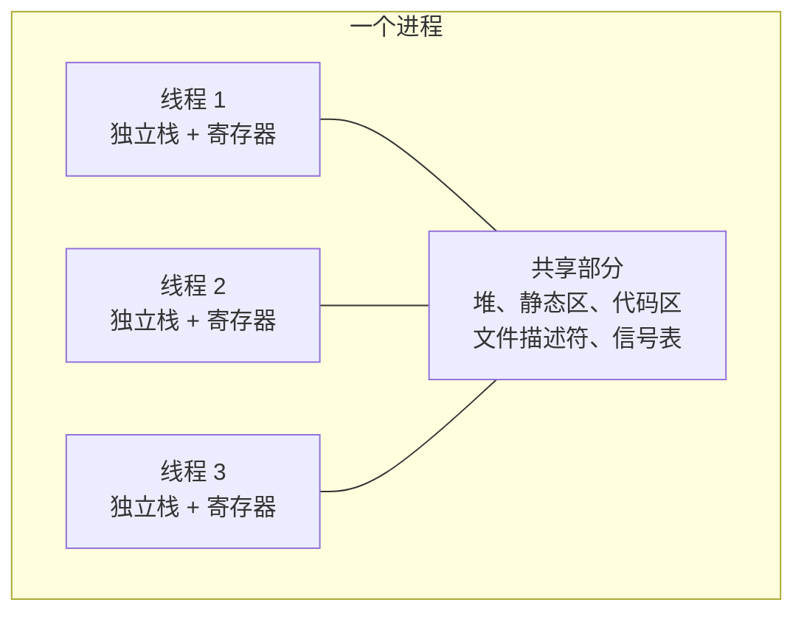
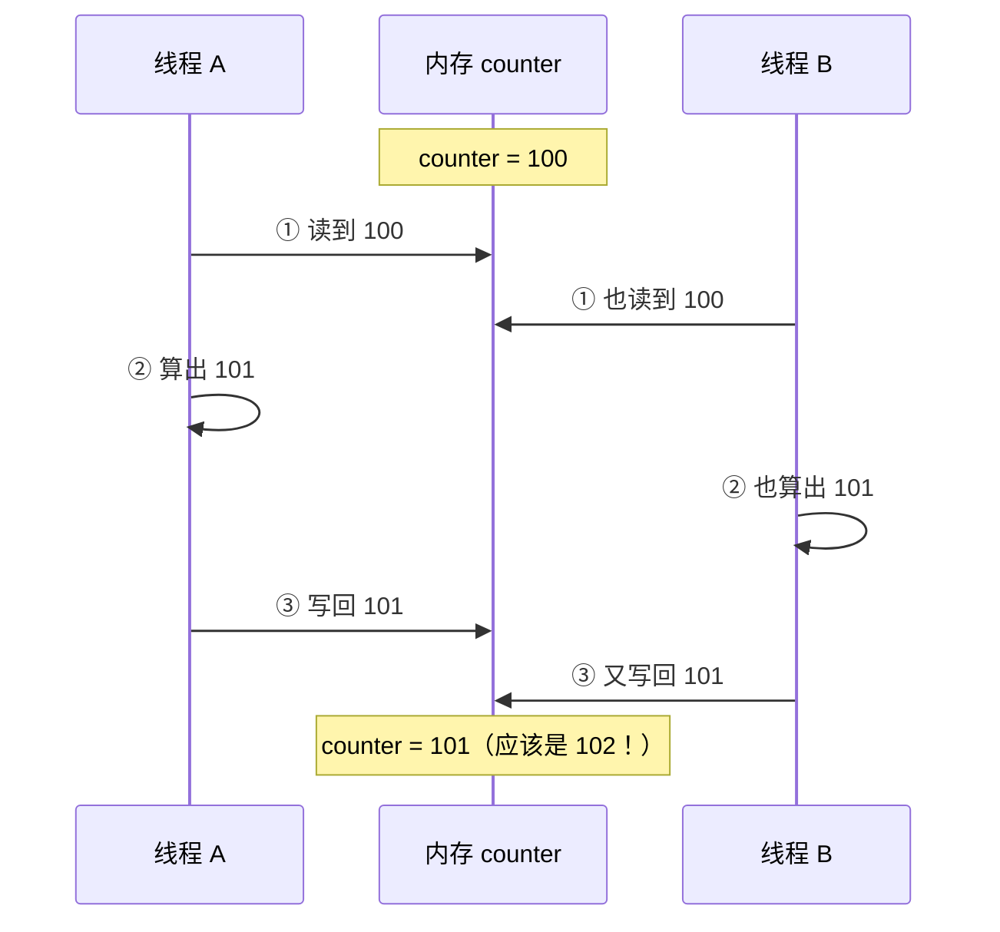

# 第 40 章 · 线程

**简体中文** ｜ [English](./40-thread.en-US.md)

---

> 第 39 章的进程用"什么都不共享"换来了彻底隔离，代价是创建贵 **21 倍**、通信要序列化。如果两条执行线本来就想紧密协作、共享大量数据呢？
>
> 答案是**线程**：同一进程内的多条执行线，**共享地址空间**——第 31 章的堆与静态区全部共享，只有栈各自独立（实测：两个线程打印的局部变量地址不同 `0x16d85af8c` / `0x16d8e6f8c`，全局变量地址完全相同 `0x102634008`）。共享带来了极致的效率：传数据就是传个指针，零拷贝零序列化。
>
> 也带来了并发编程最著名的灾难。本章的**钥匙实验**只有一行代码——两个线程各对同一个计数器自增一百万次——**五门语言全部翻车**：C++ 期望 2000000 实得 **1015193**、Java 实得 **1009414**、C# 实得 **1013551**、JS（SharedArrayBuffer）期望 400000 实得 **226923**、Python 期望 400000 实得 **267622**。而且**每次运行结果都不一样**。近一半的自增凭空消失了。
>
> 原因是 `counter++` 根本不是一步：它是**读—改—写**三步，两个线程可以在中间任何位置插进来。C++ 那份实测还顺带戳破了一个经典误解——**变量已经声明为 `volatile`，照样出错**：`volatile` 保证的是可见性，不是原子性。
>
> 修复很简单（原子操作，五语言实测全部精确正确），但**不免费**：实测原子版比非原子版慢 **6.4 倍**。而 Python 还有一层独有的枷锁：**GIL**——实测四个 CPU 密集任务用四个线程跑，加速比 **1.04x**（第 39 章同样的任务用四个进程是 **2.85x**）；可换成 I/O 密集任务，同样的四个线程加速比 **3.96x**。
>
> 最后，数据库给出了同构的实测：两个会话各自"读出来、加 10、写回去"，都读到 100、都写回 110——**期望 120，实得 110**。这就是**丢失更新**，数据竞争在数据层的原样重演。

## 1. 学习目标

本章结束后，你将能够：

- 说清线程与进程的边界：**共享什么**（堆、静态区）、**不共享什么**（栈），并用地址实测验证；
- 复现并解释**数据竞争**（五语言实测丢失近半自增），说清 `counter++` 的读—改—写三步为何危险；
- 反驳"`volatile` 能解决竞争"这一经典误解（C++ 实测：volatile 变量照样出错）；
- 用**原子操作**修复竞争并量化其代价（实测慢 6.4 倍），理解"正确性不免费"；
- 解释 **GIL** 的作用范围与后果（实测 CPU 加速比 1.04x vs I/O 加速比 3.96x），并据此选择进程还是线程。

---

## 2. 为什么会出现这个概念

### 进程的两个痛点

第 39 章的实测数字直接推出了线程的存在理由：

```text
创建成本：进程 256.6 μs vs 线程 12.2 μs   → 进程贵 21 倍
通信成本：进程要序列化 + 内核搬运          → 线程改个变量对方立刻看见
```

**很多任务本来就是紧耦合的**：一个 Web 服务器的多个请求处理器要共享同一份缓存、同一个连接池、同一份配置。用进程就得把这些东西全部序列化搬来搬去——荒谬且低效。

### 线程：把"执行"从"资源"里剥离出来



**进程是资源的容器，线程是调度的单位**。同一进程内的线程共享几乎一切，只有三样东西各自独立：

| 每个线程独占 | 为什么 |
|-------------|--------|
| **栈** | 每条执行线有自己的调用链（第 32 章的帧）——实测地址不同 |
| **寄存器 / 程序计数器** | 每条线执行到哪一行是各自的事 |
| 线程局部存储（TLS） | 显式声明的"每线程一份"变量 |

> **一句话**：线程用"**共享一切**"换来了极致的协作效率（传指针即传数据），代价是**所有共享数据都成了竞争的战场**——本章的钥匙实验会证明，这个代价比大多数人想象的更大。

---

## 3. 底层原理

### 实测一：共享什么，不共享什么

```cpp
void show_addresses(int id) {
    int local_var = id;                    // 栈上
    printf("局部=%p，全局=%p", &local_var, &global_marker);
}
```

**实测输出**：

```text
线程 1: 局部变量地址 = 0x16d85af8c，全局变量地址 = 0x102634008
线程 2: 局部变量地址 = 0x16d8e6f8c，全局变量地址 = 0x102634008
```

**局部变量地址相差约 0x8C000**（各有各的栈），**全局变量地址完全相同**（同一块内存）——这与第 39 章形成完美镜像：

```text
进程：地址相同，物理内存不同（第 39 章实测 0x102794000 → 值 100 vs 101）
线程：地址相同，物理内存也相同 ← 真共享，改一个另一个立刻看见
```

### 钥匙实验：数据竞争

```cpp
shared_counter = shared_counter + 1;      // 两个线程各做一百万次
```

**五门语言实测**（每种都跑三次）：

| 语言 | 期望 | 实测结果 | 丢失比例 |
|------|------|---------|---------|
| **C++** | 2,000,000 | 1,021,586 / 1,016,344 / 1,015,193 | ~49% |
| **Java** | 2,000,000 | 1,011,515 / 1,009,414 / 1,303,944 | ~40% |
| **C#** | 2,000,000 | 1,013,551 / 1,029,656 / 1,029,066 | ~49% |
| **JavaScript** | 400,000 | 229,484 / 311,722 / 226,923 | ~35% |
| **Python** | 400,000 | 267,622 / 270,811 / 267,852 | ~33% |

**两个关键观察**：结果**总是小于**期望值，且**每次运行都不同**——这是数据竞争的典型指纹（不确定性 bug，最难复现、最难调试）。

### 为什么会丢：`counter++` 是三步

```text
counter = counter + 1  实际执行：
  ① LOAD  counter → 寄存器
  ② ADD   寄存器 + 1
  ③ STORE 寄存器 → counter
```

两个线程交错时：



**一次自增凭空消失**——这就是丢失近一半的原因：两个线程绝大部分时间都在互相覆盖。

### `volatile` 不等于原子（C++ 实测戳破的误解）

本章的 C++ 示例特意把变量声明成 `volatile int`：

```cpp
volatile int shared_counter = 0;    // 强制每次真读内存、真写内存
```

**结果照样错**（实测丢失 ~49%）。原因：

```text
volatile 保证：不缓存到寄存器、不重排序 → 解决「可见性」
volatile 不保证：读和写之间不被打断     → 不解决「原子性」
```

**`volatile` 在 Java 里同理**（保证可见性与禁止重排，但 `count++` 依然不安全）——这是并发编程最常见的误解之一，本章用实测直接钉死。

### 原子操作：把三步压成一步

```cpp
std::atomic<int> counter;   counter++;        // C++
AtomicInteger.incrementAndGet();              // Java
Interlocked.Increment(ref counter);           // C#
Atomics.add(view, 0, 1);                      // JavaScript
with lock: counter += 1                       // Python（锁，因为没有原子整数）
```

**五语言实测全部精确正确**（2,000,000 / 400,000，一次不差）。硬件层面靠的是 CAS（compare-and-swap）等指令，保证读—改—写不可分割。

### 正确性的代价（实测）

```text
非原子(错的)     1.1 ms
原子(对的)       6.8 ms
原子版慢 6.4 倍
```

**这就是并发编程的核心张力**：同步机制越强，正确性越有保障，性能越差。第 41 章的互斥锁比原子操作更贵，但表达能力也更强。

---

## 4. JavaScript

JS 的立场很特别：**默认单线程，所以默认没有数据竞争**——但一旦真共享内存，竞争照样发生。

### 主世界是单线程

```text
CPU 核数 = 10，但主线程只有一条（第 43 章事件循环）
worker_threads 提供真线程——但默认「什么都不共享」（消息传递）
```

Worker 之间传对象走**结构化克隆**（拷贝，与第 39 章的进程 IPC 同款）——**拷贝就没有共享，没有共享就没有竞争**。

### 钥匙实验：唯一的共享通道 `SharedArrayBuffer`（实测）

```javascript
const buffer = new SharedArrayBuffer(4);   // 唯一能真共享的东西
const view = new Int32Array(buffer);
view[0] = view[0] + 1;                     // ⚠️ 读-改-写三步
```

```text
第 1 次运行: 期望 400000，实际 229484   （丢了 170516 次）
第 2 次运行: 期望 400000，实际 311722   （丢了 88278 次）
第 3 次运行: 期望 400000，实际 226923   （丢了 173077 次）
```

**一旦真的共享内存，JS 也逃不掉数据竞争**——这证明竞争不是某门语言的缺陷，而是**共享可变状态的固有属性**。

### `Atomics` 修复（实测）

```javascript
Atomics.add(view, 0, 1);        // ✅ 原子
```

```text
第 1 次运行: 期望 400000，实际 400000   ✅
```

`Atomics` 还提供 `compareExchange`（CAS）、`wait`/`notify`（线程阻塞与唤醒）——这是 JS 里最接近底层并发原语的一套 API。

### 设计哲学：默认安全，按需危险

```text
Java/C++/C#：默认共享 → 默认危险 → 你必须主动加锁
JavaScript： 默认拷贝 → 默认安全 → 你必须主动 SharedArrayBuffer 才会危险
```

**这是 JS 最值得称道的并发设计**——把危险变成"opt-in"而非"opt-out"。代价是共享大数据时要付拷贝成本（结构化克隆）。

> **注意事项**：`SharedArrayBuffer` 因 Spectre 漏洞一度被浏览器禁用，现在需要设置 COOP/COEP 响应头才能使用（Node 里无此限制）；主线程绝不能跑重计算——事件循环停转 = 整个服务卡死（第 43 章）。

---

## 5. Python

Python 有**真线程**（OS 级线程，不是模拟的），但有一把独一无二的锁：**GIL**。

### 钥匙实验：有 GIL 也照样竞争（实测）

```python
counter += 1        # 两个线程各 20 万次
```

```text
第 1 次运行: 期望 400000，实际 267622   （丢了 132378 次）
第 2 次运行: 期望 400000，实际 270811   （丢了 129189 次）
```

**很多人以为"GIL 让 Python 多线程天然安全"——实测直接否定**。原因：

```text
GIL 保证的是：同一时刻只有一个线程执行字节码（保护解释器内部状态，如引用计数）
GIL 不保证的是：你的一行 Python 代码是原子的
counter += 1 编译成多条字节码（LOAD_FAST / BINARY_ADD / STORE_FAST），
GIL 可以在字节码之间切换线程 → 竞争照样发生
```

### 钥匙实验二：GIL 让 CPU 密集任务无法并行（实测）

```text
串行 4 个 CPU 任务:     476 ms
4 线程并发:             460 ms
加速比 = 1.04x   ← 约等于 1！线程完全没帮上忙
```

**对比第 39 章同样的任务用 4 个进程：加速比 2.85x**。这一对数字是"Python 为什么必须用多进程做 CPU 并行"的完整证明。

### 但 I/O 密集任务，线程非常有效（实测）

```text
串行 4 次 I/O 等待:     414 ms
4 线程并发:             105 ms
加速比 = 3.96x   ← 接近 4！
```

**关键机制：等待 I/O 时 GIL 会被释放**——线程 A 阻塞在 `read()` 上时，GIL 交给线程 B。所以：

```text
CPU 密集 → 线程无用（加速比 1.04x 实测）→ 用多进程（第 39 章 2.85x）
I/O 密集 → 线程非常有效（加速比 3.96x 实测）→ 或用 asyncio（第 42 章，更省资源）
```

### GIL 的来历与去向

第 36 章解释过它的成因：**引用计数的原子性**——CPython 每个对象头里都有计数器（第 34 章 ctypes 实测读过），每次赋值都要改它；如果没有 GIL，每次计数增减都得加锁，代价高到无法接受。

**Python 3.13 起提供了实验性的 free-threaded 构建**（`--disable-gil`），用细粒度锁与偏向引用计数替代 GIL——但单线程性能会下降，生态适配仍在进行中。

> **注意事项**：`sys.setswitchinterval()` 调整 GIL 切换频率（本章示例调小以让竞争更容易复现）；`threading.Lock` 是修复竞争的标准手段；CPU 密集场景优先 `multiprocessing`、`concurrent.futures.ProcessPoolExecutor` 或把热点交给 NumPy/C 扩展（它们会主动释放 GIL）。

---

## 6. Java

Java 的线程是**真并行**（无 GIL），竞争因此比 Python 更凶。

### 钥匙实验（实测）

```text
第 1 次运行: 期望 2000000，实际 1011515   （丢了 988485 次）
第 3 次运行: 期望 2000000，实际 1303944   （丢了 696056 次）
```

### 真并行的收益（实测）

```text
串行 4 个任务:      38 ms
4 线程并行:         11 ms
加速比 = 3.52x   ← 对比 Python 线程的 1.04x
```

**同样的代码结构，Java 3.52x、Python 1.04x**——这一组对照就是 GIL 的全部代价。

### `AtomicInteger` 修复（实测）

```java
atomicCounter.incrementAndGet();      // 底层是 CAS 循环
```

三次运行全部精确等于 2,000,000。

### Java 内存模型（JMM）与 `volatile`

```text
volatile 保证：写对其他线程立刻可见 + 禁止指令重排（happens-before）
volatile 不保证：count++ 的原子性 ← 与 C++ 实测同款结论
```

**JMM 是 Java 相对 C++ 的一大贡献**：它把"多线程下内存可见性"写进了语言规范（C++ 到 C++11 才有对应的内存模型）。

### 平台线程的重量（实测，引出第 44 章）

```text
创建并运行 2000 个平台线程: 51 ms（约 25 μs/个）
每个平台线程默认保留约 1 MB 栈空间（-Xss，第 31 章实测过）
→ 1000000 个线程就要预留约 1000 GB 虚拟地址空间
```

**这就是 Java 21 引入虚拟线程的理由**：把线程栈从 OS 栈搬到 JVM 堆上（第 32 章的"帧可以住在堆上"，第 44 章兑现）。

> **注意事项**：现代 Java 很少直接 `new Thread`——用 `ExecutorService`/线程池（第 45 章）；`synchronized` 与 `java.util.concurrent` 的锁是第 41 章的主题；`ConcurrentHashMap` 等并发容器比"自己加锁的 HashMap"更快也更安全。

---

## 7. C++

C++11 才把线程写进标准（此前只能用 pthread）——但一旦写进来，就给了最完整的内存模型。

### 钥匙实验与 volatile 误解（实测，本章核心）

```cpp
volatile int shared_counter = 0;
shared_counter = shared_counter + 1;      // 依然丢失 ~49%
```

**C++ 的 `volatile` 与线程完全无关**——它的设计目的是"访问内存映射的硬件寄存器"，标准从未承诺它有任何多线程语义。想要线程安全必须用 `std::atomic`。

### `std::atomic` 与内存序

```cpp
std::atomic<int> counter{0};
counter++;                                    // 默认 seq_cst（最强，最慢）
counter.fetch_add(1, std::memory_order_relaxed);  // 只保证原子性，不保证顺序
```

**内存序（memory order）是 C++ 独有的精细控制**：

| 内存序 | 保证 | 用途 |
|--------|------|------|
| `seq_cst`（默认） | 全局一致的顺序 | 最安全，性能最差 |
| `acquire`/`release` | 建立同步点 | 实现锁、无锁队列 |
| `relaxed` | 仅保证原子性 | 计数器等不需要顺序的场景 |

**实测的 6.4 倍代价是 `seq_cst` 的代价**——换成 `relaxed` 会显著更快，但要求你能证明顺序无关。

### RAII 与线程（第 37 章的延续）

```cpp
std::thread t(work);
t.join();          // ⚠️ 忘了 join 或 detach → std::terminate
std::jthread jt(work);   // ✅ C++20：析构时自动 join（RAII 的线程版）
```

**`std::jthread` 是第 37 章 RAII 思想在线程上的应用**——它还支持 `stop_token` 协作式取消。

### 数据竞争 = 未定义行为

```text
C++ 标准规定：数据竞争是 UB（未定义行为）
不是"结果不确定"，而是"整个程序的行为不确定"——
编译器可以基于"没有数据竞争"的假设做优化，一旦你违约，任何事都可能发生
```

**这比 Java/C# 的"结果不确定但内存安全"严重得多**——本章 C++ 实测的"丢失近半"已经算是温和的表现。

> **注意事项**：用 ThreadSanitizer（`-fsanitize=thread`）检测数据竞争，它能在竞争实际发生前就报告出来；`std::thread` 传参默认拷贝，传引用要用 `std::ref`；线程函数抛出的异常无法跨线程传播（会 terminate），要用 `std::promise`/`std::future` 传递。

---

## 8. C#

C# 的线程模型与 Java 高度相似，但**日常写法更少直接用 `Thread`**。

### 钥匙实验（实测）

```text
第 1 次运行: 期望 2000000，实际 1013551   （丢了 986449 次）
```

### `Interlocked` 修复（实测）

```csharp
Interlocked.Increment(ref atomicCounter);
```

三次运行全部精确正确。`Interlocked` 家族还有 `CompareExchange`（CAS）、`Add`、`Exchange`——是 .NET 最轻量的同步原语。

### 真并行（实测）

```text
串行 4 个任务:      44 ms
4 线程并行:         12 ms
加速比 = 3.59x
```

### 现代 C# 的写法：几乎不直接 `new Thread`

```csharp
Parallel.For(0, 4, i => CpuTask(...));    // 数据并行（实测 IsCompleted = True）
await Task.Run(() => ...);                 // 异步任务（第 42 章）
ThreadPool.QueueUserWorkItem(...);         // 线程池（第 45 章）
```

**框架帮你分配线程、负载均衡、复用**——手写 `Thread` 只在需要精细控制（优先级、栈大小、前台/后台）时才有必要。这与 Java 的 `ExecutorService` 是同一个演进方向。

### `volatile` 在 C# 里的语义

```csharp
volatile int flag;    // 保证可见性 + 禁止重排（与 Java 同）
// 但 flag++ 依然不是原子的 —— 与 C++/Java 三家同款结论
```

> **注意事项**：`lock` 语句（第 41 章）是 C# 最常用的同步手段；`Task` 不等于线程（一个线程可以跑很多 Task，第 42/45 章）；`async void` 是异步编程的头号坑（异常无法捕获）。

---

## 9. SQL

数据竞争在数据库里有一个专门的名字：**丢失更新**（lost update）——而且实测行为完全同构。

### 钥匙实验的数据库版（shell 实测）

两个会话各自做"读出来 → 应用层 +10 → 写回去"：

```text
初始余额 = 100
  [会话A] 读到 100，写回 110
  [会话B] 读到 100，写回 110
  最终余额 = 110   ← 丢失更新！（期望 120）
```

**与 `counter++` 的三步完全对应**：

```text
线程：LOAD counter → ADD 1 → STORE counter
数据库：SELECT balance → 应用层 +10 → UPDATE balance
        ↑ 两个会话在中间交错，后写的覆盖先写的
```

### 三种解法，与并发编程一一对应（实测）

**① 原子语句**（= `atomic++` / `Interlocked`）：

```sql
UPDATE account SET balance = balance + 10 WHERE id = 1;   -- 读改写压成一条
```

```text
② 原子写法之后: 110      ← 数据库内部加行锁，天然原子
```

**② 显式加锁**（= mutex，第 41 章）：

```sql
BEGIN IMMEDIATE;  UPDATE ...;  COMMIT;
```

```text
③ 事务内加锁更新之后: 120
```

**③ 乐观锁 / CAS**（= `compareExchange` / `Atomics.compareExchange`）：

```sql
UPDATE doc SET content='二稿', version = version + 1
  WHERE id = 1 AND version = 1;      -- 版本对不上就不更新
```

```text
④ 乐观锁（CAS）更新: 影响行数 = 1，当前版本 = 2
   用旧版本号再更新: 影响行数 = 0（0 = 被别人改过，需重试）
```

**"影响行数 = 0 就重试"正是 CAS 自旋循环的数据库版**——`AtomicInteger.incrementAndGet()` 内部干的就是这件事。

### 一张表：三个世界的同一道题

| 问题 | 线程编程 | 数据库 |
|------|---------|--------|
| 竞争形态 | 数据竞争（实测丢失近半） | 丢失更新（实测 120→110） |
| 解法一 | 原子操作（实测精确正确） | 原子 UPDATE 语句 |
| 解法二 | 互斥锁（第 41 章） | 行锁 / `BEGIN IMMEDIATE`（第 50 章） |
| 解法三 | CAS 自旋 | 乐观锁版本号（实测影响行数 0/1） |

> **工程提醒**：ORM 的"读取实体 → 修改属性 → save()"默认就是危险的读—改—写模式——高并发场景要么用原子 UPDATE，要么开乐观锁（JPA 的 `@Version`、EF Core 的 `IsConcurrencyToken`）。

---

## 10. 五语言横向对比

### ① 线程模型对比

| 特性 | JavaScript | Python | Java | C++ | C# |
|------|-----------|--------|------|-----|-----|
| 主世界线程数 | **1**（事件循环） | 多 | 多 | 多 | 多 |
| 真并行 | worker_threads ✅ | ❌ **GIL**（实测 1.04x） | ✅（实测 3.52x） | ✅ | ✅（实测 3.59x） |
| 默认共享内存 | ❌ 消息传递 | ✅ | ✅ | ✅ | ✅ |
| 共享通道 | `SharedArrayBuffer` | 一切全局对象 | 一切堆对象 | 一切内存 | 一切堆对象 |
| 原子原语 | `Atomics` | 无（用 Lock） | `AtomicInteger` | `std::atomic` + 内存序 | `Interlocked` |
| 内存模型 | 有（ES2017+） | GIL 兜底 | **JMM**（最早） | C++11 内存模型（最细） | CLR 内存模型 |
| 日常写法 | worker / 异步 | `threading` / asyncio | `ExecutorService` | `std::jthread` | `Task`/`Parallel` |

### ② 钥匙实测一：五语言数据竞争总表

```text
两个线程各自自增，期望值 vs 实测值（各跑三次，结果均不相同）：

C++         2,000,000 → 1,021,586 / 1,016,344 / 1,015,193   丢失 ~49%
Java        2,000,000 → 1,011,515 / 1,009,414 / 1,303,944   丢失 ~40%
C#          2,000,000 → 1,013,551 / 1,029,656 / 1,029,066   丢失 ~49%
JavaScript    400,000 →   229,484 /   311,722 /   226,923   丢失 ~35%
Python        400,000 →   267,622 /   270,811 /   267,852   丢失 ~33%

结论：没有任何一门语言能靠"运气"避开数据竞争
      连有 GIL 的 Python、默认单线程的 JS（一旦用 SharedArrayBuffer）都不例外
```

### ③ 钥匙实测二：GIL 的完整代价

```text
同样的 4 个 CPU 密集任务：
  Python 4 线程:   加速比 1.04x   ← GIL 让线程排队执行字节码
  Python 4 进程:   加速比 2.85x   ← 第 39 章实测，每进程一个 GIL
  Java   4 线程:   加速比 3.52x   ← 无 GIL，真并行
  C#     4 线程:   加速比 3.59x

同样的 4 个 I/O 密集任务：
  Python 4 线程:   加速比 3.96x   ← 等 I/O 时 GIL 释放，线程照样香
```

**这三行数字回答了 Python 并发的全部选型问题**。

### ④ 两条设计分歧

**分歧一：默认共享还是默认隔离**

```text
默认共享（Java/C++/C#/Python）：效率最高，但所有共享数据都是雷区
                                 → 实测：五语言全部翻车
默认隔离（JavaScript）：          worker 间传对象是拷贝，天然无竞争
                                 → 想共享必须显式 SharedArrayBuffer（实测：一用就翻车）
```

**JS 的"默认安全、按需危险"正在成为新语言的主流选择**（Rust 的所有权、Go 的 channel 哲学"不要通过共享内存通信"都是同一方向）。

**分歧二：要不要一把大锁**

```text
要（CPython 的 GIL）：解释器实现简单、C 扩展好写、单线程性能好
                      代价：CPU 密集任务线程无用（实测 1.04x）
不要（其余四家）：     真并行
                      代价：运行时内部所有共享结构都要自己做细粒度同步
```

**Python 3.13 的实验性 free-threaded 构建正在尝试"不要"**——代价是单线程性能下降与生态适配成本。

### ⑤ 共同点与差异根源

**共同点**：五门语言的线程都共享堆与静态区、独立栈（实测地址证据）；`x++` 在所有语言里都不是原子的；所有语言都提供原子原语，且都比非原子版慢（实测 6.4 倍）；数据竞争的表现完全一致——结果偏小且每次不同。

**差异根源**：

- **C++ 把内存序暴露给你**——因为它面向极致性能，允许你为特定场景选择更弱的保证；
- **Java 最早定义内存模型**（JMM）——因为"一次编写到处运行"要求跨平台行为一致（第 5 章）；
- **Python 有 GIL**——因为引用计数（第 36 章）需要原子性，一把大锁最省事；
- **JS 默认不共享**——因为它诞生于浏览器单线程环境，后来加线程时选择了保守设计；
- **C# 最快走向高层抽象**——`Task`/`Parallel`/`async` 让开发者远离裸线程（第 42/45 章）。

---

## 11. 底层实现对比

| 运行时 | 线程的实现 | 关键细节 |
|--------|-----------|---------|
| **V8**（Node） | worker_threads = 独立的 V8 Isolate + libuv 线程 | 每个 worker 有自己的堆与 GC（第 36 章）——所以对象不能直接共享；只有 `SharedArrayBuffer` 走真共享内存 |
| **CPython** | 真 OS 线程（pthread）+ 全局 GIL | GIL 每 5 ms（实测 `getswitchinterval`）或遇 I/O 时切换；引用计数操作在 GIL 保护下无需原子指令——这是 GIL 的核心收益 |
| **JVM**（Java） | 平台线程 = 1:1 映射 OS 线程（实测 25 μs/个） | 每线程约 1 MB 栈（`-Xss`，第 31 章）；JMM 用 happens-before 定义可见性；Java 21 的虚拟线程是 M:N 模型（第 44 章） |
| **C++**（原生） | `std::thread` 直接包装 pthread（第 39 章实测 12.2 μs） | 数据竞争是 UB；内存序直接映射到 CPU 的内存屏障指令 |
| **CLR**（C#） | 1:1 OS 线程 + 线程池 | `Interlocked` 映射到 `lock cmpxchg` 等指令；`Task` 是线程池上的工作项，不等于线程（第 45 章） |

**一个值得记住的分野**：

```text
V8 的 worker = 独立 Isolate（独立堆、独立 GC）→ 更像"进程内的进程"
其余四家的线程 = 共享堆 → 真正的线程语义
所以 JS 的 worker 创建成本更接近进程，而共享能力接近线程——一个折中产物
```

---

## 12. 性能分析

### 并发原语的成本阶梯（本章与前后章实测串联）

| 操作 | 成本 | 出处 |
|------|------|------|
| 普通变量自增 | ~0.5 ns（实测 1.1 ms / 200 万次） | 本章 |
| 原子自增 | ~3.4 ns（实测 6.8 ms / 200 万次，慢 6.4 倍） | 本章 |
| 互斥锁加解锁 | 数十 ns（无争用）到微秒级（有争用） | 第 41 章 |
| 线程创建 | **12.2 μs** | 第 39 章 |
| 进程创建 | **256.6 μs** | 第 39 章 |

### 缓存行竞争：看不见的杀手

```text
两个线程频繁写同一个原子变量 → 该缓存行在核间来回弹跳（false sharing 的极端形态）
实测的 6.4 倍慢，大部分就来自这里，而非原子指令本身
```

**优化手段**：分片计数（每线程一个计数器，最后汇总）、缓存行对齐（`alignas(64)`）——这是高性能并发计数器的标准做法。

### 并行加速比的现实上限

```text
实测：Java 4 线程加速 3.52x、C# 3.59x（都不到 4）
损耗来自：线程创建、任务分配、内存带宽竞争、缓存失效

阿姆达尔定律：加速比上限 = 1 / (串行部分比例 + 并行部分/核数)
即使 95% 的代码可并行，10 核的加速比上限也只有 6.9x
```

> ⚠️ 惯例提醒：多线程不是"免费加速"——它引入的复杂度（竞争、死锁、调试困难）常常超过收益。先问"是不是 I/O 密集"（那用异步更省，第 42 章），再问"能不能无共享地并行"（数据分片），最后才考虑共享 + 锁。

---

## 13. 工程实践

| 场景 | ✅ 推荐 | ❌ 不推荐 | 原因 |
|------|--------|----------|------|
| Python CPU 密集 | 多进程（第 39 章 2.85x） | 多线程 | GIL 实测加速比 1.04x |
| Python I/O 密集 | 线程（实测 3.96x）或 asyncio | 多进程 | 线程足够且更省资源 |
| 共享计数器 | 原子类型 | 普通变量 + volatile | volatile 不解决原子性（实测） |
| 高频计数 | 分片计数后汇总 | 单个原子变量 | 缓存行竞争（实测慢 6.4 倍的主因） |
| 创建线程 | 线程池（第 45 章） | 每任务 `new Thread` | 12.2 μs/个 + 1 MB 栈 |
| Java 集合共享 | `ConcurrentHashMap` | `HashMap` + 手工加锁 | 并发容器更快也更不易错 |
| C++ 线程对象 | `std::jthread`（C++20） | `std::thread` 忘 join | 忘 join 直接 `std::terminate` |
| JS 重计算 | worker_threads / 子进程 | 主线程执行 | 阻塞事件循环 = 服务卡死 |
| 检测竞争 | ThreadSanitizer / Helgrind | 靠测试碰运气 | 竞争是不确定性 bug，测试常测不出 |
| ORM 更新 | 原子 UPDATE 或乐观锁 | 读实体→改属性→save | 丢失更新（实测 120→110） |

### 判断口诀

```text
要并发吗？
  I/O 等待为主 → 线程或异步（Python 线程实测 3.96x；异步更省，第 42 章）
  CPU 计算为主 → 看语言：有 GIL 用进程（2.85x），无 GIL 用线程（3.52x）

有共享可变状态吗？
  没有 → 恭喜，天然安全（数据分片、消息传递、不可变数据）
  有   → 原子操作（够用就好）→ 锁（第 41 章）→ 并发容器
```

---

## 14. 最佳实践

- **先消除共享，再考虑同步**：数据分片、消息传递、不可变数据（第 21 章）都能让竞争根本不发生——这比任何锁都可靠。
- **`x++` 永远不是原子的**：五语言实测一致；需要计数就用原子类型或锁，别靠"应该不会那么巧"。
- **别指望 `volatile`**：C++ 实测的 volatile 变量照样丢失 49%；Java/C# 的 `volatile` 只管可见性不管原子性。
- **Python 按负载选模型**：CPU 密集用进程（2.85x），I/O 密集用线程（3.96x）或 asyncio——这是实测给出的明确分界。
- **线程一定池化**：12.2 μs/个 + 每个 1 MB 栈（Java 实测 2000 个线程 51 ms）——用 `ExecutorService`/`ThreadPool`/`Pool`。
- **高频计数要分片**：单个原子变量的缓存行竞争是实测 6.4 倍代价的主因——每线程一个计数器最后汇总。
- **用工具检测竞争**：ThreadSanitizer（C++/Go）、Java 的 `-XX:+PrintConcurrentLocks`、.NET 的并发分析器——竞争是不确定 bug，靠测试碰运气不可靠。
- **数据库更新用原子语句**：`SET balance = balance + 10` 而非"读出来算好再写回"（实测丢失更新 120→110）。

---

## 15. 常见坑

**坑 1 · 以为 `x++` 是原子的**（本章钥匙实验）

```text
五语言实测：期望 200 万，实得 100 万上下，且每次都不同
```

**如何避免**：任何被多线程访问的可变变量，读—改—写都必须原子化或加锁。

**坑 2 · 用 `volatile` 修复竞争**（C++ 实测戳破）

```cpp
volatile int counter;   counter = counter + 1;   // 依然丢失 ~49%
```

**如何避免**：`volatile` 管可见性，`atomic` 管原子性——两者解决的是不同问题。

**坑 3 · 以为 GIL 让 Python 线程安全**（实测否定）

```text
Python 实测：期望 400000，实得 267622 —— GIL 保护解释器，不保护你的逻辑
```

**如何避免**：Python 的共享状态同样需要 `threading.Lock`。

**坑 4 · 用线程做 Python 的 CPU 并行**（实测 1.04x）

```python
threads = [Thread(target=cpu_task) for _ in range(4)]   # 白忙一场
```

**如何避免**：改用 `ProcessPoolExecutor`（第 39 章实测 2.85x），或把热点交给会释放 GIL 的 C 扩展（NumPy）。

**坑 5 · 每个任务创建一个线程**

```text
12.2 μs/个（第 39 章实测）+ 每个 1 MB 栈 → 一万个线程就是 10 GB 虚拟地址
```

**如何避免**：线程池（第 45 章）；Java 21+ 可用虚拟线程（第 44 章）。

**坑 6 · C++ 忘记 join**

```cpp
std::thread t(work);
// 函数返回，t 析构时既没 join 也没 detach → std::terminate
```

**如何避免**：用 `std::jthread`（C++20 自动 join，RAII 的线程版，第 37 章思想）。

**坑 7 · ORM 的读—改—写**（SQL 实测）

```python
account = session.query(Account).get(1)
account.balance += 10          # ⚠️ 两个会话并发 → 丢失更新（实测 120→110）
session.commit()
```

**如何避免**：原子 UPDATE（`balance = balance + 10`）或乐观锁版本号（实测影响行数 0 时重试）。

---

## 16. 面试题

**基础**

1. 线程和进程的区别是什么？线程之间共享哪些资源、独占哪些？
2. 什么是数据竞争？为什么 `counter++` 在多线程下不安全？
3. 原子操作和加锁有什么区别？各适用什么场景？

**中级**

4. **`volatile` 能解决数据竞争吗？它到底保证了什么？（用本章实测说明）**
5. 什么是 GIL？它保护什么、不保护什么？对 CPU 密集与 I/O 密集任务的影响分别是什么？
6. **为什么原子操作比普通操作慢？慢在哪（提示：缓存行）？**

**高级**

7. **同样的四个 CPU 密集任务，Python 线程加速比 1.04x、进程 2.85x、Java 线程 3.52x——请完整解释这三个数字。**
8. 什么是内存模型？Java 的 JMM 与 C++ 的内存序有什么区别？为什么需要它们？
9. 数据库的"丢失更新"与线程的数据竞争是什么关系？三种解法如何一一对应？

---

## 17. 练习

**基础**

1. 在你熟悉的语言里复现数据竞争：两个线程各自自增，跑十次记录结果分布。
2. 用原子类型修复它，验证结果每次都精确正确。
3. 打印多个线程的局部变量地址与全局变量地址，验证"栈独立、堆共享"。

**提高**

4. **复现本章的 GIL 三连**：Python 线程做 CPU 任务（≈1x）、做 I/O 任务（≈4x）、进程做 CPU 任务（≈3x）。
5. 实现分片计数器（每线程一个局部计数，最后汇总），对比它与单个原子变量的性能差距。
6. 用 ThreadSanitizer（`-fsanitize=thread`）编译本章的 C++ 示例，看它如何在竞争发生前就报告。

**挑战**

7. 用 CAS 循环手工实现一个 `atomic_increment`，并解释为什么它是无锁（lock-free）而非无等待（wait-free）。
8. 复现 SQL 的丢失更新实测，然后分别用原子 UPDATE、`BEGIN IMMEDIATE`、乐观锁三种方式修复。
9. 写一个程序演示"缓存行伪共享"：两个线程分别写相邻的两个变量，对比加 `alignas(64)` 前后的性能。

---

## 18. 本章总结

**一句话总结**：线程是同一进程内的多条执行线，**共享地址空间**（实测：全局变量地址完全相同 `0x102634008`，局部变量地址各异）——共享带来了零拷贝的协作效率，也带来了并发编程最著名的灾难：**数据竞争**（钥匙实验五语言全部翻车，期望 200 万实得 100 万上下且每次不同，丢失近半）；根源是 `counter++` 的**读—改—写三步**可被任意打断，而 `volatile` 只保证可见性不保证原子性（C++ 实测：volatile 变量照样丢失 49%）；修复靠**原子操作**（五语言实测全部精确正确）但要付 **6.4 倍**的代价；Python 还多一层 **GIL**——实测 CPU 密集任务线程加速比 **1.04x**（进程 2.85x、Java 线程 3.52x），但 I/O 密集任务加速比 **3.96x**；而数据库的**丢失更新**（实测两会话都读 100 都写 110，期望 120 实得 110）证明这是所有共享可变状态的固有问题，其三种解法与并发编程的原子操作、锁、CAS 一一对应。

**核心知识点**

- **共享的边界**（实测）：堆与静态区共享（地址相同），栈独立（地址不同）——与第 39 章进程"地址相同物理不同"形成镜像。
- **钥匙实验一**（五语言实测）：数据竞争丢失 33%–49%，且每次运行结果都不同——不确定性 bug 的典型指纹。
- **三步真相**：`counter++` = LOAD + ADD + STORE，两线程交错即互相覆盖。
- **volatile 误解**（C++ 实测戳破）：保证可见性 ≠ 保证原子性，Java/C# 同理。
- **原子的代价**（实测）：慢 6.4 倍，主因是缓存行在核间弹跳——高频计数要分片。
- **钥匙实验二**（实测三连）：Python 线程 CPU 1.04x / 进程 2.85x / Java 线程 3.52x；Python 线程 I/O 3.96x。
- **GIL 的边界**：保护解释器内部（引用计数，第 36 章），不保护你的业务逻辑（实测竞争照发）。
- **数据库同构**（实测）：丢失更新 120→110；三种解法 = 原子语句 / 行锁 / 乐观锁版本号。

**检查清单**

- [ ] 我能说清线程共享什么、独占什么，并用地址验证。
- [ ] 我能复现数据竞争并解释读—改—写为何危险。
- [ ] 我知道 `volatile` 与 `atomic` 各解决什么问题。
- [ ] 我能根据负载类型（CPU/IO）与语言（有无 GIL）选择进程还是线程。
- [ ] 我能把数据库的丢失更新与线程竞争对应起来。

**下一章预告**：原子操作只能保护**单个变量**的单次操作。可现实中的不变式往往横跨多个变量——"从 A 账户扣 100，给 B 账户加 100"必须**整体原子**，两个 `atomic` 加起来做不到这件事。这时需要的是**锁**：一段时间内独占访问权，把任意长的代码段变成"临界区"。第 41 章将实测锁的成本（比原子操作更贵）、锁的粒度权衡（粗锁简单但并发度低、细锁高效但易出错），以及并发编程最恐怖的故障——**死锁**：两个线程各持一把锁、各等对方的锁，程序永远停在那里；我们会亲手制造一次死锁并用 `jstack` 把它抓出来，再讲清破解它的四个必要条件。

---

## 19. 延伸阅读

- <a href="https://en.wikipedia.org/wiki/Thread_(computing)" target="_blank" rel="noopener">Wikipedia：Thread</a> — 线程概念与模型综述。
- <a href="https://en.wikipedia.org/wiki/Race_condition#In_software" target="_blank" rel="noopener">Wikipedia：Race condition</a> — 竞态条件与数据竞争的标准描述。
- <a href="https://pages.cs.wisc.edu/~remzi/OSTEP/threads-intro.pdf" target="_blank" rel="noopener">OSTEP · Concurrency: An Introduction</a> — 免费教材里讲数据竞争最清楚的一章。
- <a href="https://docs.python.org/3/library/threading.html" target="_blank" rel="noopener">Python 文档 · threading</a> — 线程与锁的官方文档。
- <a href="https://peps.python.org/pep-0703/" target="_blank" rel="noopener">PEP 703 · 让 GIL 可选</a> — free-threaded CPython 的官方提案。
- <a href="https://docs.oracle.com/javase/specs/jls/se17/html/jls-17.html" target="_blank" rel="noopener">JLS · Java 内存模型</a> — JMM 与 happens-before 的权威定义。
- <a href="https://en.cppreference.com/w/cpp/atomic/memory_order" target="_blank" rel="noopener">cppreference · memory_order</a> — C++ 内存序的权威参考。
- <a href="https://developer.mozilla.org/en-US/docs/Web/JavaScript/Reference/Global_Objects/Atomics" target="_blank" rel="noopener">MDN · Atomics</a> — JS 原子操作 API 官方文档。
- <a href="https://learn.microsoft.com/en-us/dotnet/api/system.threading.interlocked" target="_blank" rel="noopener">Microsoft Learn · Interlocked</a> — .NET 原子操作官方文档。
