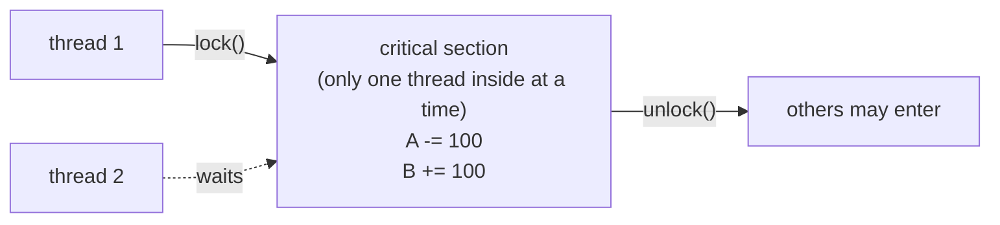
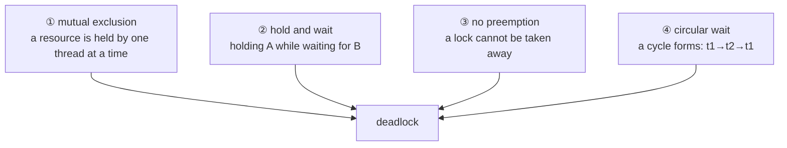

# Chapter 41 · Locks

[简体中文](./41-lock.md) ｜ **English**

---

> Chapter 40 fixed data races with atomic operations — but an atomic protects only **one variable's single operation**. Real invariants span several variables: **"debit 100 from A and credit 100 to B" must be atomic as a whole**, and two `atomic`s together cannot do it: between the debit and the credit there exists an instant where "the total is 1900," and anyone reading then reads something wrong.
>
> That calls for a **lock** — exclusive access for a stretch of time, turning **arbitrarily long code** into an indivisible critical section. The price shows up immediately: locks measured **1.6–10.3× slower** than atomics (C++ 4.4×, Java 10.3×, C# 1.6×, Python 4.4×) — **more expressive, more expensive**.
>
> And locks bring concurrency's most terrifying failure. This chapter's **key experiment** manufactures a deadlock by hand: two threads each holding one lock and waiting for the other — C++ measured both `try_lock`s **failing simultaneously** ("t1 holds m1 and cannot get m2; t2 holds m2 and cannot get m1," reproduced stably across three runs); Java let it deadlock for real and then caught it with the JVM's built-in `findDeadlockedThreads()`, **naming both waiting threads on the spot**; and `jstack` caught it from outside the process, printing **`Found one Java-level deadlock`** with the full waiting chain.
>
> The cure follows from deadlock's **four necessary conditions** — mutual exclusion, hold-and-wait, no preemption, circular wait — **all four must hold, so breaking any one suffices**. The most practical is breaking circular wait: **always take locks in the same order** (Java/C# sorting by account name, C++ using `scoped_lock` to take several at once), with 1,000 bidirectional transfers measured conserving the total and never deadlocking.
>
> Locks have one more performance dimension: **granularity**. For the same 400,000 increments, one big lock measured **11.8 ms** and eight sharded locks **4.0 ms** — **finer locks mean more concurrency and more complex code**. Databases take this theory further still: they not only lock but **automatically detect deadlocks and roll back the cheaper transaction** — something programming languages still cannot do.

## 1. Learning Objectives

By the end of this chapter, you will be able to:

- Explain **why atomics are not enough**: invariants spanning variables need critical sections, not point atomicity;
- Quantify **the cost of locks** (measured 1.6–10.3× atomics) and understand the expressiveness-for-performance trade;
- Manufacture a **deadlock** by hand and catch it two ways — `findDeadlockedThreads()` and `jstack` (both measured);
- Recite deadlock's **four necessary conditions** and break them (measured: bidirectional transfers never deadlock under a global lock order);
- Weigh **lock granularity** (measured coarse 11.8 ms vs sharded 4.0 ms) and know each language's lock family.

---

## 2. Why This Concept Exists

### The ceiling of atomic operations

Chapter 40's atomics solved `counter++`, but consider:

```java
accountA.balance -= 100;    // even if this step is atomic
accountB.balance += 100;    // and this step is atomic
```

**A gap remains between two atomic operations** (measured hint):

```text
total before transfer = 2000
between A's debit of 100 and B's credit of 100 lies an instant where "total = 1900"
to make that instant invisible to the outside, both steps must be locked together (a critical section)
```

**The invariant is "the total is always 2000"** — it spans two variables, and no amount of single-variable atomicity protects it.

### Locks: making arbitrary code indivisible



| Mechanism | Scope protected | Cost (measured) |
|-----------|-----------------|-----------------|
| Atomic operation | **one variable, one operation** | baseline |
| **Lock** | **arbitrarily long code** | 1.6–10.3× slower |

> **In one sentence**: a lock extends mutual exclusion from a single variable to an arbitrary block of code — the only general way to protect cross-variable invariants. The price is performance (measured up to 10×) and an entirely new class of failure: **deadlock**.

---

## 3. How It Works

### The cost of locks (measured in four languages)

Two threads each incrementing 200,000 times:

| Language | Lock | Atomic | Ratio |
|----------|------|--------|-------|
| **Java** | 38.5 ms | 3.7 ms | **10.3×** |
| **C++** | 7.7 ms | 1.7 ms | **4.4×** |
| **Python** | 145.3 ms | 33.0 ms (unlocked, wrong result) | **4.4×** |
| **C#** | 3.2 ms | 2.0 ms | **1.6×** |

**The spread reflects implementation quality**: C#'s `lock` (Monitor) and Java's `synchronized` both optimize the uncontended path, but heavy contention degrades both into OS-level blocking.

### A lock's skeleton: from spinning to sleeping

The JS measurement hand-built an entire lock (`Atomics` + `SharedArrayBuffer`), displaying every mechanism:

```javascript
while (Atomics.compareExchange(view, LOCK, 0, 1) !== 0) {   // ① CAS to grab
  Atomics.wait(view, LOCK, 1, 1);                           // ② failed? sleep (no CPU burn)
}
view[COUNTER] = view[COUNTER] + 1;                          // ③ critical section
Atomics.store(view, LOCK, 0);                               // ④ release
Atomics.notify(view, LOCK, 1);                              // ⑤ wake one waiter
```

**Measured**: unlocked 55,557 (expected 100,000) ❌; the spin lock 100,000 ✅.

**This is precisely how an OS mutex is built** (Linux's futex): try a fast CAS first (no kernel entry when uncontended), and only sleep in the kernel when that fails — hence **uncontended locks are cheap and contended locks are dear**.

### The key experiment: manufacturing a deadlock

```text
thread 1: lock A → then lock B
thread 2: lock B → then lock A      ⚠️ opposite order
```

**C++ measured** (two barriers ensure both hold a lock before either tries; stable across three runs):

```text
t2: holds m2, failed to grab m1 — t1 is clutching it
t1: holds m1, failed to grab m2 — t2 is clutching it
↑ both failing = each holds what the other wants: the deadlock scene
```

**Java measured** (a real deadlock plus JVM detection):

```text
d1 state = BLOCKED, d2 state = BLOCKED
findDeadlockedThreads() detected 2 deadlocked threads:
  "deadlock-thread-1" holds 1 lock, waiting on java.lang.Object@7adf9f5f (held by "deadlock-thread-2")
  "deadlock-thread-2" holds 1 lock, waiting on java.lang.Object@3f99bd52 (held by "deadlock-thread-1")
```

**Caught from outside with `jstack`** (shell measurement):

```text
Found one Java-level deadlock:
=============================
"worker-A":
  waiting to lock monitor 0x0000000104b04080 (object 0x000000070fe1b300, a java.lang.Object),
  which is held by "worker-B"

"worker-B":
  waiting to lock monitor 0x0000000104c04080 (object 0x000000070fe1b2f0, a java.lang.Object),
  which is held by "worker-A"
```

**The JVM is the only one of our five runtimes with built-in deadlock detection** — `ThreadMXBean.findDeadlockedThreads()` from inside, `jstack` for live production processes. C++/C#/Python have no equivalent.

### Deadlock's four necessary conditions



**All four are necessary — so breaking any one prevents deadlock**:

| Break which | Method | Measured here |
|-------------|--------|---------------|
| ② hold and wait | `try_lock` / `tryAcquire`: give up what you hold on failure | C++/C#/Python |
| ③ no preemption | timed locks: let go and retry | Python `acquire(timeout=)` |
| ④ **circular wait** | **a global lock order**: everyone acquires in the same sequence | Java/C# name sorting, C++ `scoped_lock` |

### Breaking it, measured: a global lock order

```java
// whatever the transfer direction, take locks sorted by account name
Account first  = from.name.compareTo(to.name) < 0 ? from : to;
Account second = (first == from) ? to : from;
```

**Java measured**: after bidirectional transfers A=950, B=1050, total = 2000 (conserved ✅)
**C# measured**: after 1,000 bidirectional transfers A=1000, B=1000, total = 2000 ✅
**C++ measured** (`std::scoped_lock` takes both at once with an "all or nothing, release and retry" algorithm): 1,000 bidirectional transfers conserve the total and never deadlock.

**Why it works**: everyone requests in the same order, so no cycle can form — the industry's most common deadlock prevention.

### Granularity: the concurrency dial

**C++ measured** (4 threads, 400,000 increments total):

```text
one big lock:      11.8 ms
8 sharded locks:    4.0 ms      ← 3× faster
```

```text
Coarse: simple and hard to get wrong, but every thread queues → concurrency = 1
Fine:   high concurrency, but complex code (and more chances to deadlock)
```

**`ConcurrentHashMap`'s striping, a database's row locks, and this chapter's sharded counter are the same idea** — split one big lock into N small ones so unrelated operations never block each other.

---

## 4. JavaScript

JS's position is distinctive: **the main thread needs no locks at all**, while two other scenarios each need a different kind.

### Why the main thread needs no locks

```text
A single-threaded event loop (Chapter 43): synchronous code runs uninterrupted
→ no preemption means no "interrupted mid-read" — the precondition for data races is absent
```

**This is JS's greatest cognitive advantage**: business logic needs no mutual exclusion at all.

### Scenario one: shared memory needs a real lock (measured)

Once `SharedArrayBuffer` appears (Chapter 40 measured the races it brings), you must hand-build a lock:

```text
unlocked:  result = 55557 (expected 100000) ❌
spin lock: result = 100000 (expected 100000) ✅
```

The implementation rests entirely on the `Atomics` quartet (see §3) — **JS ships no mutex but gives you the atomic bricks to build one**.

### Scenario two: async flows need serialization, not mutexes (measured)

```javascript
async function deposit(n) {
  const cur = balance;
  await fetch(...);        // ⚠️ yields control here
  balance = cur + n;       // on return, balance may already have changed
}
```

**This is Chapter 40's lost update, asynchronously**: both deposits read 100, and the result is 110 instead of 120.

**But the cure is not a mutex** — because `await` **yields** rather than being **preempted**, and a mutex would deadlock (the holder yields, and the waiter can never proceed). The correct cure is **serialization**:

```javascript
let chain = Promise.resolve();
const mutex = (fn) => (chain = chain.then(fn, fn));   // queue via a promise chain
```

```text
after serializing through the promise chain, balance = 120 (expected 120) ✅
```

> **Note**: JS's three scenarios need three different tools — nothing on the main thread, `Atomics`-built locks for workers with SharedArrayBuffer, queue-based serialization for async flows. **Using a mutex on an async flow is a classic misuse** (the same reason C#'s `lock` cannot cross `await`).

---

## 5. Python

Python's lock family is complete, and since the GIL does not protect business logic (Chapter 40), **these locks are mandatory**.

### Correctness and its price (measured)

```text
unlocked: result = 267429 (expected 400000) ❌ lost 132571, took 33.0 ms
locked:   result = 400000 (expected 400000) ✅, took 145.3 ms
the lock made it 4.4× slower — the price of correctness
```

### `with`: RAII-style locking (Chapter 37 applied)

```python
with big_lock:          # ✅ locks on entry, unlocks on exit (exception paths included)
    counter += 1
```

**This is Chapter 37's RAII applied to locks** — `with` guarantees release even on exceptions, far safer than manual `acquire()`/`release()` (a forgotten `release()` is a permanent deadlock).

### Deadlock and timeouts (measured)

```text
worker_2: holds B, timed out waiting for A — the other holds A
worker_1: holds A, timed out waiting for B — the other holds B
did a deadlock occur: True
(remove the timeout and it becomes a real deadlock — Python has no JVM-style detection)
```

`acquire(timeout=0.5)` breaks the "no preemption" condition — **timeouts are the simplest deadlock self-rescue**, at the cost of handling retries.

### `RLock`: the reentrant lock (measured)

```text
RLock: the same thread may acquire it repeatedly ✅
a plain Lock acquired twice: blocks itself → self-deadlock
(verified: after plain.acquire(), plain.acquire(timeout=0.1) = False)
```

**Self-deadlock** is a beginner's favorite trap: a locked method calling another method that takes the same lock. `RLock` tracks the owner and recursion count; Java's `synchronized`/`ReentrantLock` and C#'s `lock` are **reentrant by default**, while Python makes you choose.

### The lock family

| Type | Use |
|------|-----|
| `Lock` | the basic mutex (non-reentrant) |
| `RLock` | reentrant (measured: same thread may re-acquire) |
| `Semaphore` | allow N threads in at once (rate limiting) |
| `Condition` | wait for a predicate (producer-consumer) |
| `Event` | a one-shot broadcast (used here to record the deadlock) |

> **Note**: prefer `with` over manual `acquire`/`release`; `queue.Queue` is already internally locked and is the first choice for passing data between threads; no amount of locking helps CPU-bound work — the GIL is the problem (Chapter 40's measured 1.04×).

---

## 6. Java

Java has the most complete lock system, and it is the **only runtime with built-in deadlock detection**.

### `synchronized`: the simplest critical section (measured)

```java
synchronized (bigLock) { counter++; }
```

```text
locked result = 400000 (expected 400000) ✅, took 38.5 ms
atomic result = 400000, took 3.7 ms
the lock is 10.3× slower — more expressive, more expensive
```

### The key experiment: deadlock and automatic detection (measured twice)

**In-process detection**:

```java
ThreadMXBean mx = ManagementFactory.getThreadMXBean();
long[] deadlocked = mx.findDeadlockedThreads();     // returns deadlocked thread IDs
```

```text
findDeadlockedThreads() detected 2 deadlocked threads:
  "deadlock-thread-1" holds 1 lock, waiting on java.lang.Object@7adf9f5f (held by "deadlock-thread-2")
  "deadlock-thread-2" holds 1 lock, waiting on java.lang.Object@3f99bd52 (held by "deadlock-thread-1")
```

**External diagnosis** (`jstack`, shell measurement):

```text
Found one Java-level deadlock:
"worker-A": waiting to lock monitor ..., which is held by "worker-B"
"worker-B": waiting to lock monitor ..., which is held by "worker-A"
```

**This is Java operations' signature skill**: when a production service "hangs," `jstack <pid>` is the first diagnostic — it reports deadlocks *and* prints every thread's full stack (Chapter 32's frame chains).

### `synchronized` vs `ReentrantLock`

| | `synchronized` | `ReentrantLock` |
|---|---------------|-----------------|
| Syntax | a keyword, auto-released | explicit `lock()`/`unlock()`, needs `finally` |
| Interruptible | ❌ | ✅ `lockInterruptibly()` |
| Timeout | ❌ | ✅ `tryLock(timeout)` |
| Fairness | ❌ | ✅ constructor flag |
| Condition variables | one (`wait`/`notify`) | many `Condition`s |

**Default to `synchronized`** (simple, JVM-optimized, impossible to forget releasing); reach for `ReentrantLock` when you need timeouts, interruption, or fairness (this chapter's transfer example uses it).

### Breaking deadlock: a global lock order (measured)

```text
after bidirectional transfers A=950, B=1050, total = 2000 (conserved ✅)
the trick: always acquire in the same order (here, sorted by name) → no cycle can form
```

> **Note**: `synchronized` is reentrant; lock objects should be `final` and inaccessible from outside (locking `this` or a `String` constant is a classic error — external code may lock the same object); `java.util.concurrent`'s concurrent containers (`ConcurrentHashMap`) beat "a HashMap you locked yourself."

---

## 7. C++

C++'s locks are a showcase of RAII (Chapter 37), and C++17 added an elegant deadlock antidote.

### `lock_guard`: the RAII lock (measured)

```cpp
{ std::lock_guard<std::mutex> g(big_lock); counter++; }   // unlocks at scope exit
```

```text
mutex:  result = 400000 ✅, took 7.7 ms
atomic: result = 400000, took 1.7 ms
the lock is 4.4× slower
```

**Forgetting `unlock()` is catastrophic in C++** (Chapter 37's key experiment: exception paths skip it) — which is why the standard library never offers a bare `lock()/unlock()` idiom and always wraps it in RAII.

### `scoped_lock`: many locks at once, deadlock-free (C++17, measured)

```cpp
std::scoped_lock lk(from.lock, to.lock);    // ✅ locks both simultaneously
```

```text
after 1000 bidirectional transfers: A=1000, B=1000, total = 2000 (conserved ✅, no deadlock)
scoped_lock uses "acquire all or release everything and retry" internally
```

**This is C++'s uniquely elegant answer**: `scoped_lock` uses `std::lock`'s deadlock-avoidance algorithm (try to acquire all; on failure release everything acquired and retry) — **breaking the "hold and wait" condition** without the programmer sorting anything by hand.

### Granularity, measured

```text
one big lock:      11.8 ms
8 sharded locks:    4.0 ms      ← 3× faster
```

The sharded implementation uses `alignas(64)` for **cache-line alignment** — avoiding Chapter 40's false sharing (two locks in one cache line interfere with each other).

### The C++ lock family

```cpp
std::mutex              // basic mutex (non-reentrant)
std::recursive_mutex    // reentrant (Python's RLock)
std::timed_mutex        // supports try_lock_for / try_lock_until
std::shared_mutex       // reader-writer lock (C++17): parallel reads, exclusive writes
std::lock_guard         // RAII, simplest
std::unique_lock        // RAII + movable, early-unlockable, pairs with condition variables
std::scoped_lock        // RAII + multi-lock deadlock avoidance (C++17, the default choice)
```

> **Note**: `std::mutex` is non-reentrant — re-locking on the same thread is undefined behavior (unlike Python, which merely blocks); condition variables require `unique_lock` (because `wait` must temporarily unlock); if `std::atomic` suffices, skip the lock (measured 4.4× faster).

---

## 8. C#

C#'s `lock` statement is sugar, and its lock family includes one member the others lack: **a lock that works with `async`**.

### The `lock` statement (measured)

```csharp
lock (bigLock) { counter++; }
```

```text
locked result = 400000 ✅, took 3.2 ms
atomic result = 400000, took 2.0 ms
the lock is 1.6× slower
(the lock statement is sugar for Monitor.Enter/Exit + try-finally)
```

**1.6× is the smallest of the five** — .NET's `Monitor` is nearly free when uncontended (thin-lock optimization).

### Deadlock and its cure (measured)

```text
w2: holds B, timed out waiting for A — the other holds A
w1: holds A, timed out waiting for B — the other holds B
(swap TryEnter for lock and it becomes a real deadlock — .NET has no built-in detection)

after bidirectional transfers A=1000, B=1000, total = 2000 (conserved ✅)
```

**.NET has no counterpart to `findDeadlockedThreads()`** — production diagnosis means `dotnet-dump` plus WinDbg's `!syncblk`, considerably more work than `jstack`.

### ⚠️ `lock` cannot cross `await`

```csharp
lock (obj) {
    await SomethingAsync();   // ❌ compile error!
}
```

**A deliberate design decision**: `await` may resume on a different thread, while `Monitor` is **thread-affine** (whoever locks must unlock) — crossing `await` would fail to release.

**Async code uses `SemaphoreSlim`**:

```csharp
await semaphore.WaitAsync();      // ✅ waiting occupies no thread
try { await SomethingAsync(); }
finally { semaphore.Release(); }
```

The same insight as JS's "serialize, don't mutex" (§4) — **synchronization in an async world must be non-blocking**.

### Reader-writer locks (measured)

```text
4 readers reading in parallel, 1 writer writing exclusively, final value = 42
```

`ReaderWriterLockSlim` lets **reads run in parallel** (a large win for read-heavy workloads) while writes stay exclusive. C++'s `std::shared_mutex` and Java's `ReentrantReadWriteLock` do the same.

> **Note**: never `lock (this)` or `lock ("a string constant")` (outsiders may lock the same object); `lock` is reentrant; `SemaphoreSlim(1,1)` is the standard async mutex; if `Interlocked` suffices, skip the lock (measured 1.6× here, and the gap widens under contention).

---

## 9. SQL

A database's locks share the same theory as a thread's — but databases go further on deadlocks.

### A transaction is a critical section (measured)

```sql
BEGIN IMMEDIATE;                       -- equivalent to lock()
UPDATE account SET balance = balance - 100 WHERE id = 1;
UPDATE account SET balance = balance + 100 WHERE id = 2;
COMMIT;                                -- equivalent to unlock()
```

```text
① after the transfer A=900, B=1100, total = 2000 (conserved ✅)
```

**A transaction protects exactly the cross-row invariant this chapter opened with** — isomorphic to a critical section protecting a cross-variable invariant.

### Granularity: the same trade-off (measured hint)

```text
SQLite's granularity = the whole database file (coarsest)
PostgreSQL/MySQL = row-level locks (finest, highest concurrency)
Finer means more concurrency and more lock-management overhead — the sharded-lock trade-off exactly
```

**The same phenomenon as C++'s measured "one big lock 11.8 ms vs sharded 4.0 ms"**: SQLite's single database-wide write lock serializes multi-process writes (Chapter 39 measured `database is locked`).

### Databases do one thing languages don't: detect and roll back

```text
The classic deadlock: transaction 1 locks A and waits for B; transaction 2 locks B and waits for A
Databases go further: detect it automatically and roll back the cheaper transaction
(PostgreSQL reports deadlock detected; MySQL reports Deadlock found)
```

| | Programming languages | Databases |
|---|----------------------|-----------|
| Detect deadlocks | only the JVM (measured `findDeadlockedThreads`) | PostgreSQL/MySQL **all do** |
| After detection | **human intervention** (restart, change code) | **auto-rollback one transaction**, the other proceeds |

**Why databases can**: they own the complete picture of lock holdings and waits (the lock manager maintains a wait-for graph) and can periodically detect and break cycles; a language's locks are scattered and its runtime cannot see the whole (even the JVM's detection covers only `synchronized`/`ReentrantLock`).

### Pessimistic vs optimistic (measured)

```sql
-- Pessimistic: lock first, then modify (SELECT ... FOR UPDATE) — the mutex
-- Optimistic: verify a version on write — CAS (measured in Chapter 40)
UPDATE doc SET content='draft 2', version=version+1 WHERE id=1 AND version=1;
```

```text
④ optimistic update: rows affected = 1 (1 = we won)
⑤ busy_timeout = 3000 ms — the equivalent of Java's tryLock(3, SECONDS)
```

> **Engineering note**: database deadlocks are **routine, not exceptional**, in high-concurrency systems — applications must catch the deadlock error and **retry** (another reason transactions should be short: the longer you hold locks, the likelier a deadlock).

---

## 10. Cross-Language Comparison

### ① Lock mechanisms

| Feature | JavaScript | Python | Java | C++ | C# |
|---------|-----------|--------|------|-----|-----|
| Primary lock | **none** (single-threaded) | `Lock`/`RLock` | `synchronized`/`ReentrantLock` | `mutex` + `lock_guard` | `lock`/`Monitor` |
| RAII style | — | `with` (measured) | keyword auto-release | **`lock_guard`** (measured) | the `lock` statement |
| Reentrant by default | — | ❌ (needs `RLock`; measured self-deadlock) | ✅ | ❌ (needs `recursive_mutex`) | ✅ |
| Multi-lock deadlock avoidance | manual | manual ordering (measured) | manual ordering (measured) | ✅ **`scoped_lock`** (measured) | manual ordering (measured) |
| Timed acquisition | `Atomics.wait` timeout | `acquire(timeout=)` (measured) | `tryLock(timeout)` | `timed_mutex` | `TryEnter(timeout)` (measured) |
| Reader-writer lock | — | none built in | `ReentrantReadWriteLock` | `shared_mutex` | `ReaderWriterLockSlim` (measured) |
| Async-friendly lock | promise chains (measured) | `asyncio.Lock` | — | — | **`SemaphoreSlim`** |
| Deadlock detection | ❌ | ❌ | ✅ **`findDeadlockedThreads` + `jstack`** (measured twice) | ❌ | ❌ |

### ② Key measurement one: what locks cost

```text
Two threads each locking and incrementing 200,000 times (lock vs atomic):
  Java   38.5 ms vs  3.7 ms  → 10.3× slower
  C++     7.7 ms vs  1.7 ms  →  4.4×
  Python 145.3 ms vs 33.0 ms →  4.4×
  C#      3.2 ms vs  2.0 ms  →  1.6×

Conclusion: locks always cost more than atomics but protect arbitrary code —
            choose by need, and never lock a single-variable increment
```

### ③ Key measurement two: three ways to catch a deadlock

```text
① C++: two barriers + try_lock → both fail simultaneously (a stable deadlock scene)
② Java: a real deadlock + findDeadlockedThreads() → the waiting relationship, in-process
③ jstack: from outside the process → "Found one Java-level deadlock" with the full chain

Only the JVM can do ② and ③ — a marked operational advantage for Java
```

### ④ Two design divides

**Divide one: should locks be reentrant by default**

```text
Reentrant (Java/C#):     methods calling methods never self-deadlock; low cognitive load
                         price: it hides "the lock scope is too wide" design problems
Non-reentrant (C++/Python): explicit semantics, marginally faster
                         price: beginners self-deadlock (Python measured acquire returning False)
```

**Divide two: who avoids multi-lock deadlock**

```text
The language (C++ scoped_lock): take several at once with an avoidance algorithm — measured no deadlock
The programmer (Java/C#/Python): agree on a global lock order — measured effective by name sorting
The runtime (databases):        detect and roll back — something languages still cannot do
```

### ⑤ Common ground and root causes

**Common ground**: every language's locks (including JS's hand-built one) rest on the same primitives (CAS plus sleep/wake); all cost more than atomics (measured 1.6–10.3×); all face the four deadlock conditions; and the cures (ordering, timeouts, multi-acquire) are universal.

**Root causes**:

- **JS's main thread needs no locks** — a single-threaded event loop abolishes preemption (Chapter 43); but shared memory and async flows each need a different tool;
- **Java has deadlock detection** — the JVM knows every monitor's holder (a managed runtime, Chapter 5);
- **C++ has `scoped_lock`** — with no runtime to fall back on, the avoidance algorithm had to live in the library;
- **C#'s `lock` cannot cross `await`** — Monitor is thread-affine while `await` may switch threads (Chapter 42);
- **Databases can roll back** — they have a global lock manager and an "undo" semantic (languages have no way to un-execute code).

---

## 11. Implementation Comparison

| Runtime | Lock implementation | Key details |
|---------|--------------------|-------------|
| **V8** (Node) | no built-in lock; `Atomics` maps to CPU atomics + futex | the measured spin lock is entirely hand-built from `compareExchange`/`wait`/`notify` — the textbook mutex skeleton |
| **CPython** | `threading.Lock` = a thin wrapper over a system semaphore | independent of the GIL; `with` compiles to `SETUP_WITH` (measured in Chapter 37) |
| **JVM** (Java) | biased → lightweight (CAS spinning) → heavyweight (OS mutex) | a three-stage inflation strategy: nearly free uncontended, kernel only under contention; monitor state lives in the object header (Chapter 24's Mark Word) |
| **C++** (native) | `std::mutex` wraps pthread_mutex (futex) | `scoped_lock`'s avoidance lives in the library; `lock_guard` is a zero-overhead abstraction (compiles to plain lock/unlock calls) |
| **CLR** (C#) | `Monitor` via sync blocks with thin-lock optimization (measured 1.6×, the smallest) | also spins before blocking; `SemaphoreSlim` implements async waiting with a `Task` queue (Chapter 42) |

**A distinction worth memorizing**:

```text
An uncontended lock: one CAS, tens of nanoseconds (every runtime optimizes this path)
A contended lock:    kernel sleep plus wake, microseconds (the measured 1.6–10.3× spread lives here)
→ so "reduce contention" matters far more than "optimize the lock": shard, shrink the critical section, go lock-free
```

---

## 12. Performance Analysis

### The complete cost ladder (measurements across this Part)

| Operation | Cost | Source |
|-----------|------|--------|
| Plain increment (wrong) | ~0.5 ns | Chapter 40 |
| Atomic increment | ~3.4 ns | Chapter 40 |
| **Uncontended lock** | **tens of ns** | this chapter (fast path) |
| **Contended lock** | **microseconds** | this chapter (measured Java 10.3×) |
| Thread creation | 12.2 μs | Chapter 39 |
| Process creation | 256.6 μs | Chapter 39 |

### Three levels of lock optimization, by payoff

```text
① Eliminate sharing: sharding, immutable data, message passing — no lock needed at all
② Reduce contention: sharded locks (measured 11.8 → 4.0 ms), reader-writer locks, smaller critical sections
③ Optimize the lock itself: spin vs block, fair vs unfair — least payoff, usually the runtime's job
```

### The iron law of critical-section size

```cpp
// ❌ the critical section is too large
{ std::lock_guard g(m); readData(); heavyCompute(); networkCall(); writeData(); }

// ✅ lock only what must be locked
auto data = [&] { std::lock_guard g(m); return readData(); }();
auto result = heavyCompute(data);      // no lock held
{ std::lock_guard g(m); writeData(result); }
```

**Hold time equals block time** — the same law as Chapter 37's "keep transaction scope minimal."

> ⚠️ The usual reminder: lock contention is the hardest performance problem to catch in unit tests — it appears only under load. During load testing, watch "thread blocked time" (Java's `jstack` on BLOCKED threads, .NET's `dotnet-counters`) rather than CPU utilization.

---

## 13. Engineering Practice

| Scenario | ✅ Recommended | ❌ Avoid | Why |
|----------|--------------|---------|-----|
| Single-variable counting | atomics | a lock | measured 1.6–10.3× slower |
| Cross-variable invariants | a lock | several atomics | intermediate states leak (measured the 1900 instant) |
| Acquiring several locks | `scoped_lock` (C++) / a global order | whatever order is convenient | deadlock (measured mutual failure) |
| Releasing locks | RAII (`with`/`lock_guard`/`lock`) | manual `unlock` | exception paths skip it (Chapter 37 measured) |
| Recursive calls in a locked method | reentrant locks (`RLock`/`recursive_mutex`) | a plain lock | self-deadlock (Python measured `False`) |
| Read-heavy workloads | reader-writer locks (measured 4 parallel readers) | a plain mutex | reads could have run in parallel |
| Async code | `SemaphoreSlim`/`asyncio.Lock`/promise chains | a plain `lock` | crossing `await` fails or deadlocks (C# won't even compile) |
| High-contention counting | shard it (measured 3× faster) | one big lock | every thread queues |
| Diagnosing a hung service | `jstack` (measured, caught the deadlock) | guessing | the JVM prints "Found one Java-level deadlock" |
| Database concurrency | short transactions + deadlock retry | long transactions | hold time equals deadlock probability |

### The rule of thumb

```text
What am I protecting?
  one variable, one operation → an atomic (cheapest)
  a block of code / several variables → a lock
  mostly reads → a reader-writer lock

Do I need several locks?
  yes → a fixed global order, or scoped_lock (C++)
  can I need only one? → prefer refactoring down to one
```

---

## 14. Best Practices

- **Avoid locks where you can**: sharding, immutable data, message passing (Chapter 40's conclusion holds here too) — the fastest lock is the one that doesn't exist.
- **Atomics for one variable, locks for several**: measured 1.6–10.3× costlier, but atomics cannot protect cross-variable invariants (measured the 1900 instant).
- **Always wrap locks in RAII**: `with`/`lock_guard`/`lock` — a hand-written `unlock` skipped by an exception is a permanent deadlock (Chapter 37's key experiment).
- **Multiple locks require a global order**: sort by ID or name (measured effective), or let C++'s `scoped_lock` handle avoidance for you.
- **Keep critical sections small**: move computation, I/O, and network calls outside — hold time directly determines throughput.
- **Async needs async locks**: `SemaphoreSlim`/`asyncio.Lock`/promise chains — a plain mutex across `await` fails or deadlocks.
- **`jstack` first when a Java service hangs**: the ecosystem's signature advantage (measured: "Found one Java-level deadlock" with the full chain).
- **Retry on database deadlocks**: routine under load — applications need retry logic and short-transaction discipline.

---

## 15. Common Pitfalls

**Pitfall 1 · Protecting a cross-variable invariant with several atomics**

```java
balanceA.decrementAndGet(100);   // atomic
balanceB.incrementAndGet(100);   // also atomic
// ⚠️ but between them the total is 1900 — anyone reading is wrong (measured hint)
```

**Avoid it**: an invariant spanning variables needs one lock covering them all.

**Pitfall 2 · Inconsistent lock ordering** (this chapter's key experiment)

```text
Measured: t1 holds m1 and cannot get m2; t2 holds m2 and cannot get m1 — stable across three runs
```

**Avoid it**: a global lock order (measured by name sorting) or `scoped_lock` (C++ measured deadlock-free).

**Pitfall 3 · Hand-written `unlock` and an exception**

```cpp
m.lock();
mayThrow();      // ⚠️ throws → unlock never runs → every thread blocks forever
m.unlock();
```

**Avoid it**: always RAII (`lock_guard`/`with`/`lock`) — Chapter 37's key experiment proved how treacherous exception paths are.

**Pitfall 4 · Self-deadlock on a plain lock** (Python measured)

```python
with plain_lock:
    helper()      # helper also does `with plain_lock` → waiting on itself
```

```text
Measured: after plain.acquire(), plain.acquire(timeout=0.1) = False
```

**Avoid it**: use `RLock`/`recursive_mutex`; or refactor into "a locking public method plus a lock-free private one."

**Pitfall 5 · Holding a plain lock across `await`**

```csharp
lock (obj) { await FooAsync(); }    // ❌ C# refuses to compile
```

```python
with lock:                          # ⚠️ Python compiles it — and may deadlock
    await foo()
```

**Avoid it**: async work uses `SemaphoreSlim`/`asyncio.Lock`, whose waiting is non-blocking.

**Pitfall 6 · Locking the wrong object**

```java
synchronized (this) { ... }           // ⚠️ outside code can lock this too
synchronized ("LOCK") { ... }         // ⚠️ string constants are globally shared!
```

**Avoid it**: `private final Object lock = new Object();` — a dedicated lock object.

**Pitfall 7 · Slow operations inside the critical section**

```java
synchronized (lock) {
    var data = db.query();      // ⚠️ every thread waits through the network round trip
}
```

**Avoid it**: lock only in-memory work; move I/O, computation, and network calls out (the same source as Chapter 37's long-transaction warning).

---

## 16. Interview Questions

**Basic**

1. Why do we need locks when we have atomics? Give an example atomics cannot solve.
2. What is a critical section? What problem does RAII-style locking (`lock_guard`/`with`) solve?
3. What is a reentrant lock, and why is it needed?

**Intermediate**

4. **What are deadlock's four necessary conditions, and why does breaking any one prevent deadlock?**
5. What are the pros and cons of coarse versus fine lock granularity? What is the sharded-lock idea (use this chapter's measurements)?
6. **Why can't C#'s `lock` cross `await`? What should async code use instead?**

**Advanced**

7. **How do you diagnose a hung Java service? What does `jstack` tell you? (Use this chapter's measured output.)**
8. Describe `synchronized`'s lock inflation (biased → lightweight → heavyweight). Why is an uncontended lock cheap?
9. Why can databases detect and resolve deadlocks automatically while programming languages (JVM detection aside) cannot?

---

## 17. Exercises

**Basic**

1. Protect a "transfer" function with a lock; verify the total is conserved under concurrent transfers.
2. Convert hand-written `lock()`/`unlock()` into RAII form, then throw an exception to verify the lock still releases.
3. Reproduce Python's self-deadlock, then fix it with `RLock`.

**Intermediate**

4. **Reproduce this chapter's deadlock trio**: C++'s double try_lock failure, Java's `findDeadlockedThreads()`, and `jstack` from outside.
5. Implement a sharded counter (8 shards) and compare its throughput with a single lock (measured 11.8 → 4.0 ms).
6. Rewrite a read-heavy cache with a reader-writer lock and measure the read-concurrency gain.

**Challenge**

7. Hand-build a spin lock with `Atomics` (JS) or `std::atomic` (C++), adding backoff so waiting doesn't burn CPU.
8. Implement a simplified banker's algorithm: before acquiring multiple locks, check whether a cycle would form and refuse if so.
9. Deliberately create a database deadlock (two transactions updating two rows in opposite order) and observe PostgreSQL/MySQL's automatic rollback and error code.

---

## 18. Chapter Summary

**One sentence**: atomics protect only a single variable, so invariants spanning variables need a **lock** turning arbitrary code into a critical section — at a measured **1.6–10.3×** premium over atomics; locks bring concurrency's most terrifying failure, the **deadlock**, which this chapter manufactured and caught three ways (C++'s double-barrier `try_lock` reproducing mutual failure stably, Java's in-process `findDeadlockedThreads()`, and `jstack` printing `Found one Java-level deadlock` from outside); the cure follows from deadlock's **four necessary conditions, all of which must hold** — the most practical being to break circular wait with a global lock order (measured: bidirectional transfers conserve the total; C++'s `scoped_lock` goes further and lets the library do it); locks also have a **granularity** dial (measured one big lock 11.8 ms vs eight sharded 4.0 ms); and databases go one step beyond languages — **automatically detecting deadlocks and rolling back the cheaper transaction**, because they own a global lock manager and an undo semantic.

**Key takeaways**

- **Why locks exist**: when an invariant spans variables, the gap between atomics exposes intermediate state (measured the 1900 instant).
- **The cost of locks** (four languages): Java 10.3× / C++ 4.4× / Python 4.4× / C# 1.6× — differences come from each runtime's fast path.
- **A lock's skeleton** (hand-built in JS): CAS to grab, sleep on failure, wake on release — exactly the OS futex.
- **The key experiment, three catches**: C++ double barriers, Java `findDeadlockedThreads()`, `jstack` from outside.
- **The four conditions**: mutual exclusion, hold and wait, no preemption, circular wait — break any one.
- **Cures measured**: a global lock order (Java/C# name sorting), `scoped_lock` (C++ library-level avoidance), timeouts (Python `acquire(timeout=)`).
- **The granularity trade** (measured): coarse 11.8 ms vs sharded 4.0 ms — the same trade as a database's table versus row locks.
- **The async exception**: `lock` cannot cross `await` (C# won't compile) — async needs `SemaphoreSlim`/`asyncio.Lock`/promise-chain serialization.

**Checklist**

- [ ] I can state what atomics and locks each protect.
- [ ] I can manufacture a deadlock and catch it with tools.
- [ ] I can recite the four conditions and name at least three cures.
- [ ] I know how granularity affects throughput and what sharded locks do.
- [ ] I know why async code cannot use a plain mutex.

**Next chapter**: this chapter's locks secured correctness for shared data, but they carry a fatal side effect — **blocking**: a thread waiting on a lock does nothing but sleep. The far more common wait, though, is **I/O**: one network request takes tens of milliseconds while the thread simply idles — Chapter 40 measured four serial I/O tasks at 414 ms. The traditional cure is more threads (measured down to 105 ms on four), but threads cost (12.2 μs plus a 1 MB stack), and ten thousand of them is a catastrophe. Chapter 42 covers **asynchrony**: handling thousands of concurrent I/O operations on **one thread** — how `async`/`await` turns "waiting" into "yielding," where Chapter 32's "stack frames may live on the heap" cashes in for the first time (C# measured `MoveNext` at the top of the stack after `await`), and why `async` "infects" an entire call chain.

---

## 19. Further Reading

- <a href="https://en.wikipedia.org/wiki/Lock_(computer_science)" target="_blank" rel="noopener">Wikipedia: Lock</a> — the concept and its taxonomy.
- <a href="https://en.wikipedia.org/wiki/Deadlock" target="_blank" rel="noopener">Wikipedia: Deadlock</a> — the four conditions and handling strategies.
- <a href="https://pages.cs.wisc.edu/~remzi/OSTEP/threads-locks.pdf" target="_blank" rel="noopener">OSTEP · Locks</a> — the clearest free chapter on lock implementation (spin → futex).
- <a href="https://man7.org/linux/man-pages/man2/futex.2.html" target="_blank" rel="noopener">man 2 futex</a> — Linux's underlying lock primitive (the prototype for this chapter's hand-built JS lock).
- <a href="https://docs.oracle.com/en/java/javase/17/docs/api/java.management/java/lang/management/ThreadMXBean.html" target="_blank" rel="noopener">Java API · ThreadMXBean</a> — the official `findDeadlockedThreads()` documentation (used in this chapter).
- <a href="https://en.cppreference.com/w/cpp/thread/scoped_lock" target="_blank" rel="noopener">cppreference · scoped_lock</a> — the authoritative reference for C++17 multi-lock avoidance.
- <a href="https://docs.python.org/3/library/threading.html#lock-objects" target="_blank" rel="noopener">Python Docs · Lock and RLock</a> — the official lock family documentation.
- <a href="https://learn.microsoft.com/en-us/dotnet/csharp/language-reference/statements/lock" target="_blank" rel="noopener">Microsoft Learn · The lock statement</a> — C# lock semantics and limits (including the await restriction).
- <a href="https://www.postgresql.org/docs/current/explicit-locking.html" target="_blank" rel="noopener">PostgreSQL Docs · Explicit Locking</a> — lock modes and automatic deadlock detection, officially.
