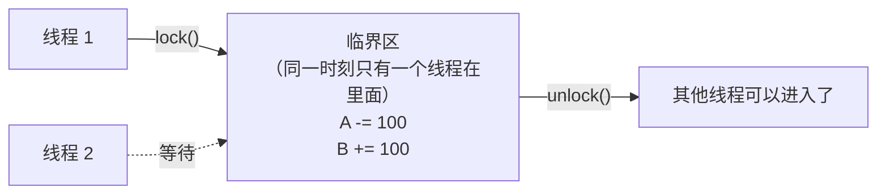
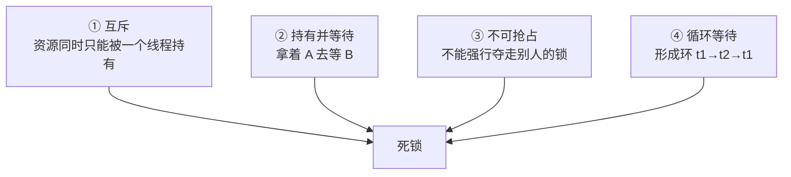

# 第 41 章 · 锁

**简体中文** ｜ [English](./41-lock.en-US.md)

---

> 第 40 章用原子操作修好了数据竞争——但原子操作只能保护**单个变量的单次操作**。现实中的不变式往往横跨多个变量：**"从 A 账户扣 100，给 B 账户加 100"必须整体原子**，两个 `atomic` 加起来做不到这件事：在扣款与入账之间，存在一个"总额 = 1900"的瞬间，任何人在此刻读到都是错的。
>
> 这时需要的是**锁**——一段时间内独占访问权，把**任意长的代码段**变成不可分割的临界区。代价立竿见影：实测锁比原子操作慢 **1.6–10.3 倍**（C++ 4.4x、Java 10.3x、C# 1.6x、Python 4.4x）——**表达力更强，价格也更高**。
>
> 而锁带来了并发编程最恐怖的故障。本章的**钥匙实验**是亲手制造一次死锁：两个线程各持一把锁、各等对方的锁——C++ 实测两边的 `try_lock` **同时失败**（"t1 持有 m1 抢不到 m2，t2 持有 m2 抢不到 m1"，三次运行稳定复现）；Java 直接让它真死锁，然后用 JVM 内置的 `findDeadlockedThreads()` **当场检出两个互等线程**；再用 `jstack` 从进程外部抓，输出赫然写着 **`Found one Java-level deadlock`** 并列出完整的互等关系。
>
> 破解之道来自死锁的**四个必要条件**——互斥、持有并等待、不可抢占、循环等待，**缺一不可，所以破解任意一条即可**。实测最实用的是破坏"循环等待"：**永远按同一顺序取锁**（Java/C# 按账户名排序、C++ 用 `scoped_lock` 一次锁多把），双向转账 1000 次总额守恒且从不死锁。
>
> 锁还有一个性能维度：**粒度**。实测同样的 40 万次自增，一把大锁 **11.8 ms**、8 把分段锁 **4.0 ms**——**锁越细并发越高，代价是代码越复杂**。而数据库把这套理论走得更远：它不仅有锁，还会**自动检测死锁并回滚代价小的那个事务**——这是编程语言至今没做到的。

## 1. 学习目标

本章结束后，你将能够：

- 说清**为什么原子操作不够**：跨多变量的不变式需要临界区，而非单点原子性；
- 量化**锁的代价**（实测比原子慢 1.6–10.3 倍）并理解"表达力换性能"的交换；
- 亲手复现**死锁**，用 `findDeadlockedThreads()` 与 `jstack` 两种方式抓出它（均实测）；
- 背出死锁的**四个必要条件**，并用"全局锁顺序"等手段破解（实测双向转账不死锁）；
- 权衡**锁粒度**（实测粗锁 11.8 ms vs 分段锁 4.0 ms）并了解各语言的锁家族。

---

## 2. 为什么会出现这个概念

### 原子操作的天花板

第 40 章的原子操作解决了 `counter++`，但看这段代码：

```java
accountA.balance -= 100;    // 即使这一步是原子的
accountB.balance += 100;    // 这一步也是原子的
```

**两个原子操作之间仍有缝隙**（实测提示）：

```text
转账前总额 = 2000
A 扣 100 与 B 加 100 之间，存在「总额 = 1900」的瞬间
要让外界永远看不到这个瞬间，必须把两步锁在一起（临界区）
```

**不变式（invariant）是"总额恒为 2000"**——它横跨两个变量，任何单变量的原子性都保护不了它。

### 锁：把任意代码段变成不可分割的整体



| 同步手段 | 保护范围 | 成本（实测） |
|---------|---------|-------------|
| 原子操作 | **一个变量的一次操作** | 基准 |
| **锁** | **任意长的代码段** | 比原子慢 1.6–10.3 倍 |

> **一句话**：锁把"互斥"从单个变量扩展到任意代码段——这是保护跨变量不变式的唯一通用手段。代价是性能（实测最高慢 10 倍）与一类全新的故障：**死锁**。

---

## 3. 底层原理

### 锁的成本（五语言实测）

同样是两个线程各自自增 20 万次：

| 语言 | 锁 | 原子 | 倍数 |
|------|-----|------|------|
| **Java** | 38.5 ms | 3.7 ms | **10.3x** |
| **C++** | 7.7 ms | 1.7 ms | **4.4x** |
| **Python** | 145.3 ms | 33.0 ms（无锁但结果错） | **4.4x** |
| **C#** | 3.2 ms | 2.0 ms | **1.6x** |

**倍数差异来自锁的实现质量**：C# 的 `lock`（Monitor）与 Java 的 `synchronized` 都有"偏向锁/轻量级锁"优化，但争用严重时都会退化为操作系统级的阻塞。

### 锁的实现骨架：从自旋到阻塞

JS 那份实测把一把锁完整地手搓了出来（`Atomics` + `SharedArrayBuffer`），恰好展示了锁的全部机制：

```javascript
while (Atomics.compareExchange(view, LOCK, 0, 1) !== 0) {   // ① CAS 抢锁
  Atomics.wait(view, LOCK, 1, 1);                           // ② 抢不到就睡（不烧 CPU）
}
view[COUNTER] = view[COUNTER] + 1;                          // ③ 临界区
Atomics.store(view, LOCK, 0);                               // ④ 释放
Atomics.notify(view, LOCK, 1);                              // ⑤ 唤醒一个等待者
```

**实测结果**：无锁 55557（期望 100000）❌，自旋锁 100000 ✅。

**这正是操作系统里 mutex 的实现骨架**（Linux 的 futex）：先用 CAS 尝试快速抢占（无争用时不进内核），抢不到才陷入内核睡眠——所以**无争用的锁很便宜，有争用的锁很贵**。

### 钥匙实验：亲手制造死锁

```text
线程 1: 先锁 A → 再锁 B
线程 2: 先锁 B → 再锁 A      ⚠️ 顺序相反
```

**C++ 实测**（用两道屏障确保两边都持锁后才尝试，三次运行稳定复现）：

```text
t2: 持有 m2，抢 m1 失败——m1 被 t1 攥着
t1: 持有 m1，抢 m2 失败——m2 被 t2 攥着
↑ 两边都失败 = 互相持有对方想要的锁，这就是死锁的现场
```

**Java 实测**（真死锁 + JVM 自动检测）：

```text
d1 状态 = BLOCKED，d2 状态 = BLOCKED
findDeadlockedThreads() 检测到 2 个死锁线程：
  「死锁线程-1」持有 1 把锁，正在等待 java.lang.Object@7adf9f5f（被「死锁线程-2」持有）
  「死锁线程-2」持有 1 把锁，正在等待 java.lang.Object@3f99bd52（被「死锁线程-1」持有）
```

**`jstack` 从外部抓**（shell 实测）：

```text
Found one Java-level deadlock:
=============================
"worker-A":
  waiting to lock monitor 0x0000000104b04080 (object 0x000000070fe1b300, a java.lang.Object),
  which is held by "worker-B"

"worker-B":
  waiting to lock monitor 0x0000000104c04080 (object 0x000000070fe1b2f0, a java.lang.Object),
  which is held by "worker-A"
```

**JVM 是五门语言里唯一内置死锁检测的**——`ThreadMXBean.findDeadlockedThreads()` 可在程序内调用，`jstack` 可从外部诊断线上进程。C++/C#/Python 都没有对应能力。

### 死锁的四个必要条件



**四个条件缺一不可——所以破解任意一条即可**：

| 破解哪条 | 手段 | 本章实测 |
|---------|------|---------|
| ② 持有并等待 | `try_lock` / `tryAcquire`：抢不到就放弃已有的 | C++/C#/Python 实测 |
| ③ 不可抢占 | 带超时的锁：等不到就放手重来 | Python `acquire(timeout=)` 实测 |
| ④ **循环等待** | **全局锁顺序**：所有人按同一顺序取锁 | Java/C# 按名排序、C++ `scoped_lock`（均实测） |

### 破解实测：全局锁顺序

```java
// 无论转账方向如何，都按账户名排序取锁
Account first  = from.name.compareTo(to.name) < 0 ? from : to;
Account second = (first == from) ? to : from;
```

**Java 实测**：双向转账后 A=950, B=1050，总额 = 2000（守恒 ✅）
**C# 实测**：双向转账 1000 次后 A=1000, B=1000，总额 = 2000（守恒 ✅）
**C++ 实测**（`std::scoped_lock` 一次锁两把，内部用"全拿到才算成功、否则全放开重试"的算法）：双向转账 1000 次总额守恒且不死锁。

**为什么有效**：所有线程都按同一顺序申请，环就不可能形成——这是工业界最常用的死锁预防手段。

### 锁粒度：并发度的关键旋钮

**C++ 实测**（4 个线程，共 40 万次自增）：

```text
一把大锁:      11.8 ms
分段锁(8):      4.0 ms      ← 快 3 倍
```

```text
粗锁：简单、不易错，但所有线程排队 → 并发度 = 1
细锁：并发度高，但代码复杂、易出错（更容易写出死锁）
```

**`ConcurrentHashMap` 的分段锁、数据库的行级锁、本章的分片计数器，全是同一个思路**——把一把大锁拆成 N 把小锁，让不相关的操作互不阻塞。

---

## 4. JavaScript

JS 的立场很独特：**主线程根本不需要锁**，但另外两个场景各需要一种不同的"锁"。

### 主线程为什么不需要锁

```text
单线程事件循环（第 43 章）：一段同步代码执行时不会被打断
→ 没有抢占，就没有「读到一半被插队」——数据竞争的前提不成立
```

**这是 JS 相对其他语言最大的心智优势**：写业务逻辑时完全不必考虑互斥。

### 场景一：共享内存需要真锁（实测）

一旦用上 `SharedArrayBuffer`（第 40 章实测过它会带来竞争），就必须手搓一把锁：

```text
无锁:   结果 = 55557（期望 100000）❌
自旋锁: 结果 = 100000（期望 100000）✅
```

实现全靠 `Atomics` 四件套（见第 3 节）——**JS 没有内置的 mutex，但给了你造锁的原子积木**。

### 场景二：异步流程需要"串行化"而非互斥锁（实测）

```javascript
async function deposit(n) {
  const cur = balance;
  await fetch(...);        // ⚠️ 这里会让出控制权
  balance = cur + n;       // 回来时 balance 可能已被别人改了
}
```

**这是第 40 章丢失更新的异步版**：两个 `deposit` 都读到 100，结果是 110 而非 120。

**但解法不是互斥锁**——因为 `await` 会**让出**控制权而非**被抢占**，用互斥锁反而会死锁（持锁的协程让出后，等锁的协程永远等不到）。正确解法是**串行化**：

```javascript
let chain = Promise.resolve();
const mutex = (fn) => (chain = chain.then(fn, fn));   // 用 Promise 链排队
```

```text
Promise 链串行化后余额 = 120（期望 120）✅
```

> **注意事项**：JS 的三种场景要用三种不同工具——主线程什么都不用、worker + SharedArrayBuffer 用 `Atomics` 手搓锁、异步流程用队列串行化。**把互斥锁用在异步流程上是典型的误用**（C# 的 `lock` 不能跨 `await` 是同一个道理）。

---

## 5. Python

Python 的锁家族齐全，而且因为 GIL 保护不了业务逻辑（第 40 章实测），**这些锁都是刚需**。

### 锁的正确性与代价（实测）

```text
无锁: 结果 = 267429（期望 400000）❌ 丢了 132571 次，耗时 33.0 ms
加锁: 结果 = 400000（期望 400000）✅，耗时 145.3 ms
锁让它慢了 4.4 倍——正确性的价格
```

### `with` 语句：RAII 风格的锁（第 37 章的应用）

```python
with big_lock:          # ✅ 进入即加锁，离开（含异常路径）即解锁
    counter += 1
```

**这是第 37 章 RAII 思想在锁上的应用**——`with` 保证异常时锁也会释放，比手写 `acquire()`/`release()` 安全得多（忘记 `release()` 就是永久死锁）。

### 死锁与超时（实测）

```text
worker_2: 持有 B，等 A 超时——对方正持有 A
worker_1: 持有 A，等 B 超时——对方正持有 B
死锁发生了吗: True
（把 timeout 去掉就是真死锁——Python 没有 JVM 那样的自动检测）
```

`acquire(timeout=0.5)` 破坏了"不可抢占"条件——**超时是最简单的死锁自救手段**，代价是要处理失败重试。

### `RLock`：可重入锁（实测）

```text
RLock: 同一线程可以重复获取 ✅
普通 Lock 重复获取会怎样: 立即阻塞自己 → 自我死锁
（验证: plain.acquire() 后再 plain.acquire(timeout=0.1) = False）
```

**自我死锁**是新手最容易踩的坑：一个加了锁的方法调用了另一个加同一把锁的方法。`RLock` 记录持有者与重入次数，同一线程可以反复获取——Java 的 `synchronized`/`ReentrantLock` 与 C# 的 `lock` **默认就是可重入的**，Python 需要显式选择。

### 锁家族

| 类型 | 用途 |
|------|------|
| `Lock` | 最基本的互斥锁（不可重入） |
| `RLock` | 可重入（实测同线程可多次获取） |
| `Semaphore` | 允许 N 个线程同时进入（限流） |
| `Condition` | 等待某个条件成立（生产者-消费者） |
| `Event` | 一次性广播信号（本章示例用它记录死锁） |

> **注意事项**：优先用 `with` 而非手工 `acquire`/`release`；`queue.Queue` 内部已加好锁，是线程间传数据的首选（避免自己造轮子）；CPU 密集场景锁再多也没用，问题在 GIL（第 40 章实测 1.04x）。

---

## 6. Java

Java 的锁体系最完整，而且是**唯一内置死锁检测**的运行时。

### `synchronized`：最简单的临界区（实测）

```java
synchronized (bigLock) { counter++; }
```

```text
加锁结果 = 400000（期望 400000）✅，耗时 38.5 ms
原子结果 = 400000，耗时 3.7 ms
锁比原子慢 10.3 倍——表达力更强，代价也更高
```

### 钥匙实验：死锁与自动检测（双实测）

**程序内检测**：

```java
ThreadMXBean mx = ManagementFactory.getThreadMXBean();
long[] deadlocked = mx.findDeadlockedThreads();     // 返回死锁线程 ID
```

```text
findDeadlockedThreads() 检测到 2 个死锁线程：
  「死锁线程-1」持有 1 把锁，正在等待 java.lang.Object@7adf9f5f（被「死锁线程-2」持有）
  「死锁线程-2」持有 1 把锁，正在等待 java.lang.Object@3f99bd52（被「死锁线程-1」持有）
```

**外部诊断**（`jstack`，shell 实测）：

```text
Found one Java-level deadlock:
"worker-A": waiting to lock monitor ..., which is held by "worker-B"
"worker-B": waiting to lock monitor ..., which is held by "worker-A"
```

**这是 Java 运维的看家本领**：线上服务"卡住不响应"时，`jstack <pid>` 是第一诊断动作——它不仅报死锁，还给出所有线程的完整栈（第 32 章的帧链）。

### `synchronized` vs `ReentrantLock`

| | `synchronized` | `ReentrantLock` |
|---|---------------|-----------------|
| 语法 | 关键字，自动释放 | 显式 `lock()`/`unlock()`，必须 `finally` |
| 可中断 | ❌ | ✅ `lockInterruptibly()` |
| 超时 | ❌ | ✅ `tryLock(timeout)` |
| 公平锁 | ❌ | ✅ 构造参数 |
| 条件变量 | 单一（`wait`/`notify`） | 多个 `Condition` |

**默认用 `synchronized`**（简单、JVM 优化好、不会忘记释放）；需要超时、可中断、公平性时才用 `ReentrantLock`（本章的转账示例用了它）。

### 破解死锁：全局锁顺序（实测）

```text
双向转账后 A=950, B=1050，总额 = 2000（守恒 ✅）
秘诀：永远按同一顺序获取锁（这里按 name 排序）→ 环等待不可能形成
```

> **注意事项**：`synchronized` 是可重入的（同一线程可重复进入）；锁对象要用 `final` 且不可被外部访问（锁 `this` 或锁 `String` 常量是经典错误——外部代码可能锁同一个对象）；`java.util.concurrent` 的并发容器（`ConcurrentHashMap`）比"自己给 `HashMap` 加锁"更快也更安全。

---

## 7. C++

C++ 的锁是 RAII 的典范应用（第 37 章），而且 C++17 给了一个漂亮的死锁解药。

### `lock_guard`：RAII 锁（实测）

```cpp
{ std::lock_guard<std::mutex> g(big_lock); counter++; }   // 离开作用域自动解锁
```

```text
互斥锁: 结果 = 400000 ✅，耗时 7.7 ms
原子操作: 结果 = 400000，耗时 1.7 ms
锁比原子慢 4.4 倍
```

**忘记 `unlock()` 在 C++ 里是灾难性的**（第 37 章的钥匙实验：异常路径会跳过 `unlock`）——所以标准库从不提供裸的 `lock()/unlock()` 惯用法，一律用 RAII 包装。

### `scoped_lock`：一次锁多把且不死锁（C++17，实测）

```cpp
std::scoped_lock lk(from.lock, to.lock);    // ✅ 同时锁两把
```

```text
双向转账 1000 次后: A=1000, B=1000，总额 = 2000（守恒 ✅，且不死锁）
scoped_lock 内部用「全部拿到才算成功，否则全放开重试」的算法
```

**这是 C++ 独有的优雅解法**：`scoped_lock` 内部用 `std::lock` 的死锁避免算法（尝试获取全部，失败则释放所有已获取的再重试）——**破坏了"持有并等待"条件**，无需程序员手工排序。

### 锁粒度实测

```text
一把大锁:      11.8 ms
分段锁(8):      4.0 ms      ← 快 3 倍
```

分段锁的实现用了 `alignas(64)` **缓存行对齐**——避免第 40 章讲的伪共享（两把锁挤在同一缓存行里会互相干扰）。

### C++ 锁家族

```cpp
std::mutex              // 基本互斥锁（不可重入）
std::recursive_mutex    // 可重入（对应 Python 的 RLock）
std::timed_mutex        // 支持 try_lock_for / try_lock_until
std::shared_mutex       // 读写锁（C++17）：多读并行、写独占
std::lock_guard         // RAII，最简单
std::unique_lock        // RAII + 可移动、可提前解锁、配合条件变量
std::scoped_lock        // RAII + 多锁死锁避免（C++17，首选）
```

> **注意事项**：`std::mutex` 不可重入——同一线程重复 `lock()` 是未定义行为（不像 Python 会阻塞，C++ 直接 UB）；条件变量必须配 `unique_lock`（因为 `wait` 需要临时解锁）；`std::atomic` 够用时别上锁（实测慢 4.4 倍）。

---

## 8. C#

C# 的 `lock` 语句是语法糖，而它的锁家族里有一个别人没有的关键成员：**支持 `async` 的锁**。

### `lock` 语句（实测）

```csharp
lock (bigLock) { counter++; }
```

```text
加锁结果 = 400000 ✅，耗时 3.2 ms
原子结果 = 400000，耗时 2.0 ms
锁比原子慢 1.6 倍
（lock 语句实际是 Monitor.Enter/Exit + try-finally 的语法糖）
```

**1.6 倍是五门语言里最小的**——.NET 的 `Monitor` 在无争用时几乎无开销（薄锁优化）。

### 死锁与破解（实测）

```text
w2: 持有 B，等 A 超时——对方正持有 A
w1: 持有 A，等 B 超时——对方正持有 B
（把 TryEnter 换成 lock 就是真死锁——.NET 无内置死锁检测）

双向转账后 A=1000, B=1000，总额 = 2000（守恒 ✅）
```

**`.NET 没有 `findDeadlockedThreads()` 的对应物**——线上诊断要靠 `dotnet-dump` + WinDbg 的 `!syncblk`，比 `jstack` 麻烦得多。

### ⚠️ `lock` 不能跨 `await`

```csharp
lock (obj) {
    await SomethingAsync();   // ❌ 编译错误！
}
```

**这是 C# 刻意的设计**：`await` 可能在不同线程上恢复，而 `Monitor` 是**线程亲和**的（谁加锁谁解锁）——跨 `await` 会导致解锁失败。

**异步场景要用 `SemaphoreSlim`**：

```csharp
await semaphore.WaitAsync();      // ✅ 等待时不占用线程
try { await SomethingAsync(); }
finally { semaphore.Release(); }
```

这与 JS 的"异步要串行化而非互斥"是同一个洞察（第 4 节）——**异步世界的同步机制必须是非阻塞的**。

### 读写锁（实测）

```text
4 个读者并行读取、1 个写者独占写入，最终值 = 42
```

`ReaderWriterLockSlim` 让**读操作并行**（读多写少场景吞吐大增），写操作独占。C++ 的 `std::shared_mutex`、Java 的 `ReentrantReadWriteLock` 同理。

> **注意事项**：绝不 `lock (this)` 或 `lock ("字符串常量")`（外部可能锁同一对象）；`lock` 是可重入的；`SemaphoreSlim(1,1)` 是异步互斥锁的标准做法；`Interlocked` 够用时别上锁（实测慢 1.6 倍，但在高争用下差距会拉大）。

---

## 9. SQL

数据库的锁与线程锁是**同一套理论**，但数据库在死锁处理上走得更远。

### 事务 = 临界区（实测）

```sql
BEGIN IMMEDIATE;                       -- 相当于 lock()
UPDATE account SET balance = balance - 100 WHERE id = 1;
UPDATE account SET balance = balance + 100 WHERE id = 2;
COMMIT;                                -- 相当于 unlock()
```

```text
① 转账后 A=900, B=1100，总额 = 2000（守恒 ✅）
```

**事务保护的正是本章开头那个"跨多行的不变式"**——与临界区保护"跨多变量的不变式"完全同构。

### 锁粒度：数据库的同一道权衡（实测提示）

```text
SQLite 锁粒度 = 整个数据库文件（最粗）
PostgreSQL/MySQL = 行级锁（最细，并发度最高）
粒度越细并发越好，但锁管理开销越大——与分段锁同一权衡
```

**这与本章 C++ 实测的"一把大锁 11.8 ms vs 分段锁 4.0 ms"是同一个现象**：SQLite 因为整库一把写锁，多进程写入必然串行（第 39 章实测过 `database is locked`）。

### 数据库比编程语言多做了一步：自动死锁检测与回滚

```text
经典死锁: 事务1 锁住 A 等 B，事务2 锁住 B 等 A
数据库比编程语言更进一步：自动检测死锁并回滚代价小的那个
（PostgreSQL 报 deadlock detected；MySQL 报 Deadlock found）
```

| | 编程语言 | 数据库 |
|---|---------|--------|
| 检测死锁 | 仅 JVM 能检测（实测 `findDeadlockedThreads`） | PostgreSQL/MySQL **全都能** |
| 死锁后怎么办 | **人工介入**（重启、改代码） | **自动回滚一个事务**，另一个继续 |

**为什么数据库能做到**：它掌握全部锁的持有与等待关系（锁管理器维护等待图），可以定期检测环并主动打破；而编程语言的锁分散在各处，运行时无法全局掌握（JVM 的检测也只覆盖 `synchronized`/`ReentrantLock`）。

### 悲观锁 vs 乐观锁（实测）

```sql
-- 悲观：先加锁再改（SELECT ... FOR UPDATE）—— 对应 mutex
-- 乐观：改时校验版本 —— 对应 CAS（第 40 章实测过）
UPDATE doc SET content='二稿', version=version+1 WHERE id=1 AND version=1;
```

```text
④ 乐观锁更新: 影响行数 = 1（1 = 成功抢到）
⑤ busy_timeout = 3000 ms —— 相当于 Java 的 tryLock(3, SECONDS)
```

> **工程提醒**：数据库死锁在高并发系统里是**常态而非异常**——应用层必须准备好捕获死锁错误并**重试**（这也是为什么事务应该短小：持锁时间越长，撞上死锁的概率越大）。

---

## 10. 五语言横向对比

### ① 锁机制对比

| 特性 | JavaScript | Python | Java | C++ | C# |
|------|-----------|--------|------|-----|-----|
| 主要锁 | **无**（单线程） | `Lock`/`RLock` | `synchronized`/`ReentrantLock` | `mutex` + `lock_guard` | `lock`/`Monitor` |
| RAII 风格 | — | `with`（实测） | 关键字自动释放 | **`lock_guard`**（实测） | `lock` 语句 |
| 默认可重入 | — | ❌（需 `RLock`，实测自我死锁） | ✅ | ❌（需 `recursive_mutex`） | ✅ |
| 多锁死锁避免 | 手工 | 手工排序（实测） | 手工排序（实测） | ✅ **`scoped_lock`**（实测） | 手工排序（实测） |
| 超时获取 | `Atomics.wait` 超时 | `acquire(timeout=)`（实测） | `tryLock(timeout)` | `timed_mutex` | `TryEnter(timeout)`（实测） |
| 读写锁 | — | 无内置 | `ReentrantReadWriteLock` | `shared_mutex` | `ReaderWriterLockSlim`（实测） |
| 异步友好锁 | Promise 链（实测） | `asyncio.Lock` | — | — | **`SemaphoreSlim`** |
| 死锁检测 | ❌ | ❌ | ✅ **`findDeadlockedThreads` + `jstack`**（双实测） | ❌ | ❌ |

### ② 钥匙实测一：锁的代价

```text
两个线程各自加锁自增 20 万次（锁 vs 原子）：
  Java   38.5 ms vs  3.7 ms  → 慢 10.3x
  C++     7.7 ms vs  1.7 ms  → 慢  4.4x
  Python 145.3 ms vs 33.0 ms → 慢  4.4x
  C#      3.2 ms vs  2.0 ms  → 慢  1.6x

结论：锁永远比原子贵，但能保护任意代码段——按需选择，别用锁做单变量自增
```

### ③ 钥匙实测二：死锁的三种抓法

```text
① C++：两道屏障 + try_lock → 两边同时失败（稳定复现死锁现场）
② Java：真死锁 + findDeadlockedThreads() → 程序内自动检出互等关系
③ jstack：从进程外部抓 → "Found one Java-level deadlock" + 完整等待链

只有 JVM 能做 ② 和 ③——这是 Java 运维相对其他语言的显著优势
```

### ④ 两条设计分歧

**分歧一：锁该不该可重入**

```text
默认可重入（Java/C#）：方法互相调用时不会自我死锁，心智负担低
                       代价：掩盖了「锁范围过大」的设计问题
默认不可重入（C++/Python）：语义明确、性能略好
                       代价：新手容易自我死锁（Python 实测 acquire 返回 False）
```

**分歧二：谁来避免多锁死锁**

```text
语言帮你（C++ scoped_lock）：一次锁多把，内部用避免算法——实测双向转账不死锁
程序员自己（Java/C#/Python）：必须约定全局锁顺序——实测按名排序有效
运行时兜底（数据库）：自动检测并回滚——编程语言至今没做到
```

### ⑤ 共同点与差异根源

**共同点**：五门语言（含 JS 手搓的）的锁都建立在同一套原语上（CAS + 睡眠/唤醒）；都比原子操作贵（实测 1.6–10.3 倍）；都面临死锁四条件；破解手段（顺序、超时、一次多锁）通用。

**差异根源**：

- **JS 主线程不需要锁**——单线程事件循环消灭了抢占（第 43 章）；但共享内存与异步流程各需一种不同工具；
- **Java 有死锁检测**——因为 JVM 掌握所有 monitor 的持有关系（运行时是"托管"的，第 5 章）；
- **C++ 有 `scoped_lock`**——因为它没有运行时兜底，只能在库层面把避免算法做进去；
- **C# 的 `lock` 不能跨 `await`**——因为 Monitor 是线程亲和的，而 `await` 会换线程（第 42 章）；
- **数据库能自动回滚**——因为它有全局锁管理器与"回滚"这个语义（编程语言没有"撤销已执行代码"的能力）。

---

## 11. 底层实现对比

| 运行时 | 锁的实现 | 关键细节 |
|--------|---------|---------|
| **V8**（Node） | 无内置锁；`Atomics` 映射到 CPU 原子指令 + futex | 实测的自旋锁完全由 `compareExchange`/`wait`/`notify` 手搓——正是 mutex 的教科书骨架 |
| **CPython** | `threading.Lock` = 系统信号量的薄封装 | GIL 之外的独立机制；`with` 语句编译为 `SETUP_WITH`（第 37 章实测过） |
| **JVM**（Java） | 偏向锁 → 轻量级锁（CAS 自旋）→ 重量级锁（OS 互斥量） | 三级膨胀策略：无争用时几乎零开销，争用后才进内核；monitor 信息存在对象头里（第 24 章的 Mark Word） |
| **C++**（原生） | `std::mutex` 直接包装 pthread_mutex（futex） | `scoped_lock` 的避免算法在库层实现；`lock_guard` 是零开销抽象（编译后就是 lock/unlock 调用） |
| **CLR**（C#） | `Monitor` 用 sync block + 薄锁优化（实测慢 1.6 倍最小） | 同样有"先自旋再阻塞"的策略；`SemaphoreSlim` 用 `Task` 队列实现异步等待（第 42 章） |

**一个值得记住的分野**：

```text
无争用的锁：一次 CAS，几十纳秒（各家都有快速路径优化）
有争用的锁：陷入内核睡眠 + 唤醒，微秒级（实测的 1.6–10.3 倍差距主要来自这里）
→ 所以「减少争用」比「优化锁本身」重要得多：分段、缩小临界区、无锁数据结构
```

---

## 12. 性能分析

### 同步原语的完整成本阶梯（本 Part 实测串联）

| 操作 | 成本 | 出处 |
|------|------|------|
| 普通变量自增（错的） | ~0.5 ns | 第 40 章 |
| 原子自增 | ~3.4 ns | 第 40 章 |
| **无争用的锁** | **数十 ns** | 本章（快速路径） |
| **有争用的锁** | **微秒级** | 本章（实测 Java 慢 10.3 倍） |
| 线程创建 | 12.2 μs | 第 39 章 |
| 进程创建 | 256.6 μs | 第 39 章 |

### 锁优化的三个层次（按收益排序）

```text
① 消除共享：数据分片、不可变数据、消息传递 —— 根本不需要锁
② 减少争用：分段锁（实测 11.8 → 4.0 ms）、读写锁（读并行）、缩小临界区
③ 优化锁本身：自旋 vs 阻塞、公平 vs 非公平 —— 收益最小，通常交给运行时
```

### 临界区大小的铁律

```cpp
// ❌ 临界区过大
{ std::lock_guard g(m); 读数据(); 复杂计算(); 网络调用(); 写数据(); }

// ✅ 只锁必要部分
auto data = [&] { std::lock_guard g(m); return 读数据(); }();
auto result = 复杂计算(data);          // 不持锁
{ std::lock_guard g(m); 写数据(result); }
```

**持锁时间 = 阻塞时间**——这与第 37 章"事务作用域越小越好"是同一条铁律。

> ⚠️ 惯例提醒：锁竞争是最难通过单元测试发现的性能问题——它只在高并发下暴露。压测时观察"线程阻塞时间"（Java 的 `jstack` 抓 BLOCKED 线程、.NET 的 `dotnet-counters`）比看 CPU 使用率更能说明问题。

---

## 13. 工程实践

| 场景 | ✅ 推荐 | ❌ 不推荐 | 原因 |
|------|--------|----------|------|
| 单变量计数 | 原子操作 | 加锁 | 实测锁慢 1.6–10.3 倍 |
| 跨多变量不变式 | 锁 | 多个原子操作 | 中间状态会被看到（实测总额 1900 的瞬间） |
| 获取多把锁 | `scoped_lock`（C++）/ 全局顺序 | 随手按需要的顺序 | 死锁（实测两边互抢失败） |
| 释放锁 | RAII（`with`/`lock_guard`/`lock`） | 手工 `unlock` | 异常路径会跳过（第 37 章实测） |
| 同方法递归调用 | 可重入锁（`RLock`/`recursive_mutex`） | 普通锁 | 自我死锁（Python 实测返回 False） |
| 读多写少 | 读写锁（实测 4 读者并行） | 普通互斥锁 | 读操作本可并行 |
| 异步代码 | `SemaphoreSlim`/`asyncio.Lock`/Promise 链 | 普通 `lock` | 跨 `await` 会失效或死锁（C# 直接编译错误） |
| 高争用计数 | 分段/分片（实测快 3 倍） | 一把大锁 | 所有线程排队 |
| 线上诊断卡死 | `jstack`（实测抓到死锁） | 猜 | JVM 直接报 "Found one Java-level deadlock" |
| 数据库并发 | 短事务 + 捕获死锁重试 | 长事务 | 持锁时间 = 撞死锁概率 |

### 判断口诀

```text
需要保护什么？
  单个变量的单次操作 → 原子操作（最便宜）
  一段代码/多个变量  → 锁
  只读为主           → 读写锁

要拿多把锁吗？
  是 → 全局固定顺序，或用 scoped_lock（C++）
  能不能只拿一把？→ 优先重构成只需一把
```

---

## 14. 最佳实践

- **能不用锁就不用**：数据分片、不可变数据、消息传递（第 40 章的结论在这里同样成立）——最快的锁是不存在的锁。
- **单变量用原子，多变量才用锁**：实测锁贵 1.6–10.3 倍，但原子保护不了跨变量不变式（实测总额 1900 的瞬间）。
- **锁一律用 RAII 包装**：`with`/`lock_guard`/`lock` 语句——手写 `unlock` 遇异常就是永久死锁（第 37 章的钥匙实验）。
- **多把锁必须有全局顺序**：按 ID/名称排序（实测有效），或用 C++ 的 `scoped_lock` 让库替你避免。
- **临界区越小越好**：把计算、I/O、网络调用移出锁外——持锁时间直接决定并发吞吐。
- **异步用异步锁**：`SemaphoreSlim`/`asyncio.Lock`/Promise 链——普通互斥锁跨 `await` 会失效甚至死锁。
- **线上卡死先 `jstack`**：Java 生态的独门优势（实测直接输出 "Found one Java-level deadlock" 与完整等待链）。
- **数据库死锁要重试**：高并发下它是常态，应用层必须有重试逻辑与短事务纪律。

---

## 15. 常见坑

**坑 1 · 用多个原子操作保护跨变量不变式**

```java
balanceA.decrementAndGet(100);   // 原子
balanceB.incrementAndGet(100);   // 也原子
// ⚠️ 但两步之间总额 = 1900，任何人读到都是错的（实测提示）
```

**如何避免**：不变式横跨几个变量，就得用一把锁把它们罩住。

**坑 2 · 取锁顺序不一致导致死锁**（本章钥匙实验）

```text
实测：t1 持有 m1 抢不到 m2，t2 持有 m2 抢不到 m1 —— 三次运行稳定复现
```

**如何避免**：全局锁顺序（实测按名排序）或 `scoped_lock`（C++ 实测双向转账不死锁）。

**坑 3 · 手写 `unlock` 遇到异常**

```cpp
m.lock();
mayThrow();      // ⚠️ 抛异常 → unlock 永远执行不到 → 所有线程永久阻塞
m.unlock();
```

**如何避免**：一律 RAII（`lock_guard`/`with`/`lock`）——第 37 章的钥匙实验证明过异常路径的凶险。

**坑 4 · 普通锁的自我死锁**（Python 实测）

```python
with plain_lock:
    helper()      # helper 内部也 with plain_lock → 自己等自己
```

```text
实测: plain.acquire() 后再 plain.acquire(timeout=0.1) = False
```

**如何避免**：用 `RLock`/`recursive_mutex`；或重构成"加锁的公开方法 + 不加锁的私有方法"。

**坑 5 · 在 `await` 上持有普通锁**

```csharp
lock (obj) { await FooAsync(); }    // ❌ C# 直接编译错误
```

```python
with lock:                          # ⚠️ Python 不报错，但可能死锁
    await foo()
```

**如何避免**：异步用 `SemaphoreSlim`/`asyncio.Lock`——它们的等待是非阻塞的。

**坑 6 · 锁的对象选错**

```java
synchronized (this) { ... }           // ⚠️ 外部代码也能锁住 this
synchronized ("LOCK") { ... }         // ⚠️ 字符串常量是全局共享的！
```

**如何避免**：用 `private final Object lock = new Object();` 专用锁对象。

**坑 7 · 临界区里做慢操作**

```java
synchronized (lock) {
    var data = db.query();      // ⚠️ 网络往返期间所有线程都在等
}
```

**如何避免**：只锁内存操作；I/O、计算、网络调用移到锁外（与第 37 章的长事务警告同源）。

---

## 16. 面试题

**基础**

1. 为什么有了原子操作还需要锁？举一个原子操作解决不了的例子。
2. 什么是临界区？RAII 风格的锁（`lock_guard`/`with`）解决了什么问题？
3. 什么是可重入锁？为什么需要它？

**中级**

4. **死锁的四个必要条件是什么？破坏其中任意一条为什么就能避免死锁？**
5. 锁粒度粗细各有什么利弊？分段锁的思路是什么（用本章实测数据说明）？
6. **为什么 C# 的 `lock` 不能跨 `await`？异步场景该用什么？**

**高级**

7. **如何诊断一个"卡住不响应"的 Java 服务？`jstack` 能给出什么信息？（用本章实测输出说明）**
8. `synchronized` 的锁膨胀过程是怎样的（偏向锁 → 轻量级 → 重量级）？为什么无争用的锁很便宜？
9. 为什么数据库能自动检测并解决死锁，而编程语言（除 JVM 检测外）做不到？

---

## 17. 练习

**基础**

1. 用锁保护一个"转账"函数，验证并发转账后总额守恒。
2. 把手写 `lock()`/`unlock()` 改成 RAII 风格，并制造一个异常验证锁仍会释放。
3. 复现 Python 的自我死锁，再用 `RLock` 修复。

**提高**

4. **复现本章的死锁三连**：C++ 的 try_lock 双失败、Java 的 `findDeadlockedThreads()`、`jstack` 外部抓取。
5. 实现分段锁计数器（8 个分片），对比它与单锁的吞吐（本章实测 11.8 → 4.0 ms）。
6. 用读写锁改写一个"读多写少"的缓存，测量读并发度的提升。

**挑战**

7. 用 `Atomics`（JS）或 `std::atomic`（C++）手工实现一把自旋锁，加上退避策略（backoff）避免忙等烧 CPU。
8. 实现"银行家算法"的简化版：在获取多把锁前先检查是否会形成环，若会则拒绝。
9. 在数据库里故意制造死锁（两个事务交叉更新两行），观察 PostgreSQL/MySQL 的自动回滚行为与错误码。

---

## 18. 本章总结

**一句话总结**：原子操作只能保护单个变量，跨多变量的不变式必须用**锁**把任意代码段变成临界区——代价是实测比原子慢 **1.6–10.3 倍**；而锁带来了并发最恐怖的故障**死锁**，本章亲手制造并用三种方式抓出（C++ 双屏障 try_lock 稳定复现两边互抢失败、Java 的 `findDeadlockedThreads()` 程序内检出、`jstack` 从外部输出 `Found one Java-level deadlock`）；破解靠死锁的**四个必要条件缺一不可**——最实用的是破坏"循环等待"（全局锁顺序，实测双向转账总额守恒；C++ 的 `scoped_lock` 更进一步由库代劳）；锁还有**粒度**这个性能旋钮（实测一把大锁 11.8 ms vs 8 把分段锁 4.0 ms）；而数据库比编程语言多走一步——**自动检测死锁并回滚代价小的事务**，因为它有全局锁管理器与"撤销"语义。

**核心知识点**

- **为什么需要锁**：不变式横跨多个变量时，原子操作之间的缝隙会暴露中间状态（实测总额 1900 的瞬间）。
- **锁的代价**（四语言实测）：Java 10.3x / C++ 4.4x / Python 4.4x / C# 1.6x——差异来自各家的快速路径优化。
- **锁的骨架**（JS 手搓实测）：CAS 抢锁 → 抢不到就睡 → 释放后唤醒，正是 OS 里 futex 的实现。
- **钥匙实验·死锁三抓**：C++ 双屏障复现、Java `findDeadlockedThreads()`、`jstack` 外部诊断。
- **四个必要条件**：互斥、持有并等待、不可抢占、循环等待——破解任意一条即可。
- **破解实测**：全局锁顺序（Java/C# 按名排序）、`scoped_lock`（C++ 库级避免）、超时（Python `acquire(timeout=)`）。
- **粒度权衡**（实测）：粗锁 11.8 ms vs 分段锁 4.0 ms——与数据库的库锁 vs 行锁同一权衡。
- **异步的例外**：`lock` 不能跨 `await`（C# 编译报错）——异步要用 `SemaphoreSlim`/`asyncio.Lock`/Promise 链串行化。

**检查清单**

- [ ] 我能说清原子操作与锁各自的保护范围。
- [ ] 我能亲手制造一次死锁，并用工具把它抓出来。
- [ ] 我能背出死锁四条件并说出至少三种破解手段。
- [ ] 我知道锁粒度对吞吐的影响，以及分段锁的思路。
- [ ] 我知道异步代码为什么不能用普通互斥锁。

**下一章预告**：本章的锁解决了"共享数据的正确性"，但它有一个致命的副作用——**阻塞**：等锁的线程什么都干不了，只能睡着。而更常见的等待是 **I/O**：一次网络请求几十毫秒，线程就在那里干等——第 40 章实测过，四个 I/O 任务串行要 414 ms。传统解法是多开线程（实测 4 线程降到 105 ms），但线程有成本（12.2 μs + 1 MB 栈），开一万个就是灾难。第 42 章讲**异步**：用**一条线程**处理成千上万个并发 I/O——`async`/`await` 如何把"等待"变成"让出"，第 32 章的"栈帧可以住在堆上"将在这里第一次兑现（C# 实测过 `await` 之后栈顶是 `MoveNext`），以及为什么 `async` 会"传染"整个调用链。

---

## 19. 延伸阅读

- <a href="https://en.wikipedia.org/wiki/Lock_(computer_science)" target="_blank" rel="noopener">Wikipedia：Lock</a> — 锁的概念与分类综述。
- <a href="https://en.wikipedia.org/wiki/Deadlock" target="_blank" rel="noopener">Wikipedia：Deadlock</a> — 死锁四条件与处理策略的标准描述。
- <a href="https://pages.cs.wisc.edu/~remzi/OSTEP/threads-locks.pdf" target="_blank" rel="noopener">OSTEP · Locks</a> — 免费教材里讲锁实现（自旋→futex）最清楚的一章。
- <a href="https://man7.org/linux/man-pages/man2/futex.2.html" target="_blank" rel="noopener">man 2 futex</a> — Linux 锁的底层原语（本章 JS 手搓锁的原型）。
- <a href="https://docs.oracle.com/en/java/javase/17/docs/api/java.management/java/lang/management/ThreadMXBean.html" target="_blank" rel="noopener">Java API · ThreadMXBean</a> — `findDeadlockedThreads()` 的官方文档（本章实测所用）。
- <a href="https://en.cppreference.com/w/cpp/thread/scoped_lock" target="_blank" rel="noopener">cppreference · scoped_lock</a> — C++17 多锁死锁避免的权威参考。
- <a href="https://docs.python.org/3/library/threading.html#lock-objects" target="_blank" rel="noopener">Python 文档 · Lock 与 RLock</a> — Python 锁家族官方文档。
- <a href="https://learn.microsoft.com/en-us/dotnet/csharp/language-reference/statements/lock" target="_blank" rel="noopener">Microsoft Learn · lock 语句</a> — C# lock 语义与限制（含不能跨 await）。
- <a href="https://www.postgresql.org/docs/current/explicit-locking.html" target="_blank" rel="noopener">PostgreSQL 文档 · 显式锁定</a> — 数据库锁模式与死锁自动检测的官方说明。
