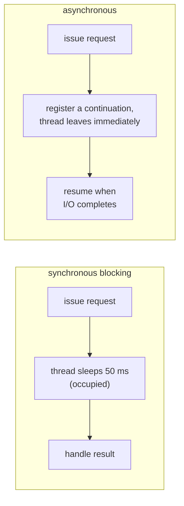

# Chapter 42 · Asynchrony

[简体中文](./42-async.md) ｜ **English**

---

> Chapter 41's locks secured correctness for shared data, but they carry a fatal side effect — **blocking**: a thread waiting on a lock does nothing at all. The far more common wait is **I/O**: one network request takes tens of milliseconds while the thread simply idles.
>
> The traditional cure is more threads. But threads cost (Chapter 39 measured 12.2 μs plus a 1 MB stack each), and ten thousand of them is a catastrophe. **Asynchrony offers a third road: handle thousands of concurrent I/O operations on one thread.**
>
> This chapter's **key experiment** puts all three side by side — 20 I/O tasks of 50 ms each: **serial 1067 ms, 20 threads 83 ms, asyncio 53 ms** (a 20.0× speedup), with the async version measured using **exactly one thread**. At scale the gap widens dramatically: Python runs **5,000 concurrent tasks in 34 ms** and JS **10,000 concurrent in 27 ms** — while the same number of threads would cost 61 ms / 122 ms just to create, plus 5 GB / 10 GB of stack.
>
> The secret is that `await` turns "waiting" into "**yielding**": the function pauses at `await`, packages its remainder as a continuation, and the thread immediately goes elsewhere. That requires **moving the stack frame from the stack to the heap** — Chapter 32's foreshadowing cashes in completely here: C# measured `MoveNext` on top of the stack both before and after `await` (the compiler rewrote the whole method into a heap-allocated state machine, `<ShowStateMachine>d__4`), and Python measured an `async` call returning a **coroutine object** with a `cr_frame`, not a result.
>
> Two costs follow. First, **a blocking call destroys the entire event loop**: three `await asyncio.sleep(0.1)` measured 101 ms concurrently, while three `time.sleep(0.1)` became 309 ms serially; in C#, 200 tasks using `.Result` measured **8.2× slower** than `await`, and when this chapter's development capped the thread pool at four, the program **deadlocked outright**. Second, **contagion**: `async` can only be called by `async` — "functions have colors," and red spreads up the entire call chain.

## 1. Learning Objectives

By the end of this chapter, you will be able to:

- State **what asynchrony solves**: I/O waits occupy no thread, letting one thread carry tens of thousands of concurrent operations (measured 5,000/10,000);
- Explain `await`'s mechanism — **pause → yield → resume** — and why it requires frames on the heap (measured in C# and Python);
- Compare serial/threaded/async with the **key experiment** (measured 1067 / 83 / 53 ms) and explain where the speedup comes from;
- Recognize and avoid asynchrony's **two great traps**: blocking calls destroying the event loop (measured 101 → 309 ms) and `.Result`/`.Wait()` causing thread starvation or deadlock (measured 8.2× slower);
- Understand **async's contagion** (the colored-function problem) and each language's response (including Java's different road, virtual threads).

---

## 2. Why This Concept Exists

### A waiting thread is pure waste

```text
One network request, 50 ms:
  actual CPU work   < 1 ms
  pure waiting      > 49 ms   ← the thread is occupied, doing nothing
```

Chapter 40 measured it: four serial I/O tasks took 414 ms; four threads brought it to 105 ms. **But threads are not free** (Chapter 39):

```text
12.2 μs each to create + 1 MB of stack each
→ ten thousand concurrent connections = ten thousand threads = 122 ms of creation + 10 GB of stack
→ this is the famous C10K problem
```

### Asynchrony's insight: give the thread back while waiting



| | Synchronous | Asynchronous |
|---|-------------|--------------|
| While waiting | thread occupied | **thread released** |
| Ten thousand concurrent | ten thousand threads | **one thread + ten thousand continuations** |
| Where continuations live | thread stacks (1 MB each) | **small heap objects** (tens of bytes) |

> **In one sentence**: asynchrony trades "moving the paused execution state onto the heap" for "handling enormous concurrency with very few threads" — measured, one thread carried 10,000 concurrent tasks in 27 ms. The price is a changed programming model: functions acquire colors, and blocking becomes taboo.

---

## 3. How It Works

### The key experiment: all three approaches

20 I/O tasks of 50 ms each:

| Approach | Python | C# | Java | C++ |
|----------|--------|-----|------|-----|
| **Serial** | 1067 ms | 1075 ms | 1062 ms | 1061 ms |
| **Threads** | 83 ms (12.9×) | 52 ms (20.5×) | 62 ms (17.1×) | 55 ms (19.2×, `std::async`) |
| **Async** | **53 ms (20.0×)** | **54 ms (20.1×)** | 67 ms (15.9×, `CompletableFuture`) | — |
| Threads used by async | **1** (measured) | unchanged (measured 21→21) | 1 scheduler thread | — |

**The point is not "async beats threads"** (with 20 tasks they tie) but **resource consumption**:

```text
Python: 5000 concurrent async tasks = 34 ms, still 1 thread
        (5000 threads would need 61 ms to create + ~5000 MB of stack)
JS:     10000 concurrent = 27 ms, single-threaded throughout
        (10000 OS threads would need ~122 ms + 10000 MB of stack)
C#:     10000 concurrent = 16 ms, thread count 21 → 21 (far below 10000)
```

**This is asynchrony's home ground**: the larger the concurrency, the wider the margin.

### What `await` does: pause, yield, resume

```text
async function f() {
    A();                  // ① runs synchronously
    await someIO();       // ② issues I/O, registers "the rest" as a continuation, then returns!
    B();                  // ③ resumes here once the I/O completes
}
```

**The key insight: the function genuinely returns at `await`** — the caller receives an "unfinished receipt" (Promise/Task/Future/coroutine), and the thread is fully released. When the I/O finishes, the runtime schedules `B()` back for execution.

### Frames on the heap: Chapter 32, fully cashed in

To return at `await` and later continue from the same spot, **the locals must survive** — but the frame has already popped (Chapter 32's law: function returns, frame dies). The only way out is **moving them to the heap**.

**C# measured** (the compiler rewrites the whole async method into a state machine class):

```text
before await, top-of-stack method = MoveNext
after await,  top-of-stack method = MoveNext (type <ShowStateMachine>d__4)
```

**Note that `MoveNext` is already on top *before* the `await`** — the entire async body runs inside the state machine object's `MoveNext()` from its first line, and the locals are that heap object's fields all along.

**Python measured** (coroutines are first-class objects):

```text
calling an async function returns: a coroutine object, not a result
it carries its own state: cr_frame = True (a frame object on the heap, Chapter 32)
only wrapping it in a Task schedules it: Task
```

**Chapter 32 said "frames may live on the heap — the physical precondition for async and coroutines." Here is the payoff**:

```text
Ch. 32: CPython's frames were already heap objects (the f_back chain)
Ch. 32: C#'s async frames pop normally at await, with state stored in a heap state machine
Ch. 42: because that state lives on the heap, ten thousand "paused functions" cost a few MB, not 10 GB
```

### Trap one: a blocking call destroys the event loop

**Python measured**:

```text
3 × await asyncio.sleep(0.1): 101 ms (concurrent ✅)
3 × time.sleep(0.1):          309 ms (serial ❌ — the event loop is pinned)
```

**JS measured**:

```text
3 × await sleep(100):  100 ms (concurrent ✅)
3 × 100 ms busy-wait:  300 ms (serial ❌ and no event can be handled meanwhile)
```

**All of asynchrony's efficiency rests on "nobody occupies the thread for long"** — one blocking call stalls the whole loop and degrades every concurrent operation to serial.

### Trap two: `.Result` / `.Wait()` cause thread starvation

**C# measured** (200 tasks):

```text
200 tasks fully awaited:  51 ms ✅ (waiting occupies no thread)
200 tasks using .Result: 420 ms ❌ (each pins a pool thread)
8.2× slower — the pool is forced to grow, and growth is throttled
```

**A fiercer measurement** (hit while developing this chapter): cap the thread pool at four and run 24 `.Result` tasks — **the program deadlocks outright**:

```text
all 4 threads blocked in .Result
→ when await Task.Delay completes, its continuation needs a pool thread to resume
→ but the pool has no free thread left
→ the continuation never runs, .Result never completes — circular wait (Chapter 41's four conditions)
```

### Trap three: async's contagion (colored functions)

```text
An async function can only be awaited by an async function — every layer of the call chain must be async
A sync function wanting to call async: only asyncio.run() (which blocks) or hand it to an executor
Hence "functions have colors": async is red, plain is blue, and red spreads up the entire chain
```

**The consequence**: making one low-level library async forces the whole call chain to change; the sync and async ecosystems split (Python's `requests` vs `httpx`, `psycopg2` vs `asyncpg`).

---

## 4. JavaScript

Asynchrony is JS's **mother tongue** — single-threaded with an event loop from birth (Chapter 43 covers the loop itself).

### The key experiment: the most common performance trap (measured)

```javascript
for (let i = 0; i < TASKS; i++) serial.push(await asyncIo(i));   // ⚠️ serial!
const parallel = await Promise.all(tasks.map(asyncIo));           // ✅ concurrent
```

```text
await inside a loop (serial):  1020 ms
Promise.all (concurrent):        51 ms (20.0× speedup)
```

**This is async/await's most common misuse**: `await` makes code "look synchronous," so people await one item at a time in a loop, turning concurrent work into serial.

### Scale (measured)

```text
10000 concurrent timers: 27 ms, single-threaded throughout
(10000 OS threads would need ~122 ms to create + 10000 MB of stack)
```

### Promises: continuations on the heap (measured)

```text
calling an async function returns immediately: a Promise (not a result)
the body pauses at await; the remainder hangs off the Promise as a callback
```

### Blocking the main thread freezes the service (measured)

```text
3 × await sleep(100):  100 ms (concurrent ✅)
3 × 100 ms busy-wait:  300 ms (serial ❌ and no event can be handled meanwhile)
```

**The consequence is gravest in JS**: there is only one main thread, and blocking it means events cannot even be processed (Chapter 43). CPU-bound work must go to `worker_threads` or child processes (Chapters 39/40).

### Error handling: `await`'s hidden value (measured)

```javascript
try { await Promise.reject(new Error("async failure")); }
catch (e) { /* caught! */ }
```

```text
try/catch caught: async failure   ← impossible in the callback era
allSettled doesn't lose everything to one failure: fulfilled, rejected
```

**This is `async/await`'s greatest advance over callbacks**: asynchronous errors become catchable again (Chapter 37's exception safety, extended into the async world).

### The concurrency quartet (measured `race`)

| API | Semantics |
|-----|-----------|
| `Promise.all` | all must succeed (any failure fails immediately) |
| `Promise.allSettled` | wait for all, success or not (measured `fulfilled, rejected`) |
| `Promise.race` | first to settle wins (timeout control; the measured winner was "fast") |
| `Promise.any` | first to succeed wins |

> **Note**: `for await...of` handles async iterators (streaming); an unhandled Promise rejection terminates a Node process (`unhandledRejection`); an `async` function always returns a Promise, even without any `await`.

---

## 5. Python

Python's `asyncio` was added later, which brings one problem the others lack: **a split ecosystem**.

### The key experiment (measured)

```text
20 I/O tasks serially:  1067 ms
20 threads:               83 ms (12.9×)
asyncio (1 thread):       53 ms (20.0×)
current thread count = 1  ← async used exactly one thread throughout
```

**Note asyncio beat 20 threads** (53 vs 83 ms) — it skipped 20 thread creations (12.2 μs each) and their scheduling overhead.

### Scale (measured)

```text
5000 concurrent async tasks: 34 ms, thread count still 1
```

### Coroutines are first-class objects (measured)

```python
coro = async_io(1)          # calling an async function: creates a coroutine, runs nothing
task = asyncio.ensure_future(coro)   # only a Task gets scheduled
```

```text
calling an async function returns: a coroutine object, not a result
it carries its own state: cr_frame = True (a frame object on the heap, Chapter 32)
```

**`cr_frame` is exactly the kind of frame object Chapter 32 measured** — CPython's frames were always on the heap, which is why implementing coroutines came more "naturally" to it than to C# (no whole-method rewrite required).

### The price of blocking (measured)

```text
3 × await asyncio.sleep(0.1): 101 ms (concurrent ✅)
3 × time.sleep(0.1):          309 ms (serial ❌ — the event loop is pinned)
```

**The fallback** when a blocking library is unavoidable: `loop.run_in_executor()` hands it to a thread pool (isolating the blocking behind threads).

### The split ecosystem: Python asyncio's sorest point

```text
sync library     async library
requests    →    httpx / aiohttp
psycopg2    →    asyncpg
redis-py    →    redis.asyncio
open()      →    aiofiles
```

**One synchronous library can ruin an entire async program** (it blocks the loop) — contagion at the ecosystem level, and the main reason Python's async adoption trails JS's and C#'s.

### Structured concurrency (Python 3.11+)

```python
async with asyncio.TaskGroup() as tg:      # any failure cancels the whole group
    tg.create_task(...)
```

```text
this machine's Python is older; using gather instead: [1, 2]
```

**`TaskGroup` fixes a real `gather` problem**: when one gathered task fails, the others keep running in the background (potentially leaking); `TaskGroup` guarantees the group completes together or cancels together.

> **Note**: `asyncio.run()` is the one proper door from the sync world into the async one; an un-awaited coroutine never runs (with a "coroutine was never awaited" warning); `asyncio.sleep(0)` is the idiom for yielding voluntarily.

---

## 6. Java

Java took a **markedly different road**: no `async/await`, but making blocking itself cheap.

### `CompletableFuture`: callback composition (measured)

```text
20 I/O tasks serially:  1062 ms
20 threads:               62 ms (17.1×)
CompletableFuture:        67 ms (15.9×, one scheduler thread)
```

### Assembling pipelines instead of awaiting (measured)

```java
CompletableFuture.supplyAsync(() -> "step one")
    .thenApply(s -> s + " → step two")                    // synchronous transform
    .thenCompose(s -> CompletableFuture.supplyAsync(...))  // chain another async
    .exceptionally(e -> "failed: " + e.getMessage());      // error handling
```

```text
step one → step two → step three
(no async/await keywords, only method chains — readability is Java's async pain point)
```

**A method-name crosswalk**:

| CompletableFuture | JS/C# counterpart |
|-------------------|-------------------|
| `thenApply` | `.then(syncFn)` |
| `thenCompose` | `.then(fnReturningPromise)` / continuing after `await` |
| `thenCombine` | `Promise.all` of two (measured 10+20=30) |
| `anyOf` | `Promise.race` (measured 99) |
| `exceptionally` | `.catch` |
| `orTimeout` | timeouts (measured: 10 ms made a 50 ms task throw `TimeoutException`) |

### Java's other road: virtual threads (Java 21+)

```text
CompletableFuture: callback composition, no await syntax (measured here)
Virtual threads (Java 21+): a different road — make blocking code itself cheap
  → write plain blocking code; the runtime turns "blocking" into "yielding"
  → no async contagion (Chapter 44)
this machine's Java version = 17.0.18
```

**This is the chapter's most important contrast**:

```text
The async/await road (JS/C#/Python): change the programming model — functions get colors, ecosystems rewrite
The virtual-thread road (Java 21+ / Go): change the runtime — code stays synchronous, the runtime yields for you
```

Virtual threads make `Thread.sleep()`, `socket.read()`, and friends **yield automatically when run on a virtual thread** — the same code, the same readability, with asynchronous performance. Chapter 44 develops this fully.

> **Note**: `CompletableFuture`'s default executor is `ForkJoinPool.commonPool()` (Chapter 45) — blocking inside it drags down the whole JVM; `join()` and `get()` both block and should be avoided mid-chain; Java 17 users can use Loom previews or third-party libraries (Reactor, Vert.x).

---

## 7. C++

C++'s async story is the most tortuous: **coroutines arrived only in C++20, and the standard library still has no supporting machinery**.

### `std::async`: a misleading name (measured)

```text
20 I/O tasks serially:  1061 ms
std::async:               55 ms (19.2×)
⚠️ but std::async(launch::async) starts one thread per task —
   it isn't real asynchrony, only blocking moved onto another thread (Ch. 39: 12.2 μs per thread)
```

**This is C++ asynchrony's biggest misconception**: `std::async`'s name implies asynchrony, but the implementation is one thread per task — **it solves parallelism, not asynchrony**. Ten thousand tasks means ten thousand threads.

### `future`/`promise`: asynchrony's skeleton (measured)

```cpp
std::promise<int> p;
std::future<int> f = p.get_future();
// producer: p.set_value(42);  consumer: f.get();
```

```text
got the future's value: 42
(promise writes, future reads — the same abstraction as JS Promise / C# Task)
```

**But `f.get()` blocks** — that is synchronous waiting, not asynchrony:

```text
f.get() blocks the current thread until the result is ready — synchronous waiting, not asynchrony
Real asynchrony requires: pausing the function, yielding the thread, resuming in place when ready
→ which requires moving the function's frame to the heap (Chapter 32) — exactly what C++20 coroutines do
```

### C++20 coroutines: mechanism without policy

```cpp
co_await   // pause and wait (the await of JS/C#/Python)
co_yield   // produce a value and pause (generators)
co_return  // a coroutine's return
```

**But the standard library ships no coroutine types** — you must implement `promise_type` (the coroutine's driver) yourself or lean on third-party libraries (cppcoro, Boost.Asio, folly, libunifex).

**This is C++ async's greatest pain**: the language-level mechanism is complete (indeed more flexible than others' — custom scheduling and allocation), but with no unified high-level abstraction, libraries remain mutually incompatible. C++26's `std::execution` is attempting to unify this layer.

### Async maturity across five languages (measured output)

```text
JavaScript : Promise + async/await (native, one unified ecosystem)
C#         : Task + async/await (earliest, most complete design)
Python     : asyncio + async/await (split ecosystem: sync libraries cannot be used directly)
Java       : CompletableFuture (no await) → virtual threads take another road (Chapter 44)
C++        : future (blocking) + C++20 coroutines (no standard-library support)
```

> **Note**: a discarded `std::async` future **blocks in its destructor** (a famous trap); `std::future::get()` may be called only once; for genuine async I/O use Boost.Asio or liburing (Linux).

---

## 8. C#

C# **invented** `async/await` (C# 5.0, 2012), and its design remains the most complete.

### The key experiment (measured)

```text
20 I/O tasks serially: 1075 ms
20 threads:              52 ms (20.5×)
async:                   54 ms (20.1×)

10000 concurrent tasks: 16 ms
thread count 21 → 21 (far below 10000)
```

### The state machine: Chapter 32 cashed in (measured)

```text
before await, top-of-stack method = MoveNext
after await,  top-of-stack method = MoveNext (type <ShowStateMachine>d__4)
```

**The compiler rewrites the entire async method into a state machine class**:

```text
locals      → fields of the state machine object (on the heap)
method body → a switch inside MoveNext() (each await is a case)
await       → save state, register the continuation, return
```

### The trap: `.Result` / `.Wait()` (measured)

```text
200 tasks fully awaited:  51 ms ✅ (waiting occupies no thread)
200 tasks using .Result: 420 ms ❌ (each pins a pool thread)
8.2× slower — the pool is forced to grow, and growth is throttled
```

**A fiercer consequence measured during this chapter's development**: capping the pool at four and running 24 `.Result` tasks **deadlocks the program outright** — all four threads blocked, with no thread left to resume the `await` continuations (a textbook case of Chapter 41's four conditions).

**The iron law: async all the way** — asynchronous from entry to exit, never `.Result`/`.Wait()` in between.

### `Task` is not a thread (measured output)

```text
Task.Delay occupies no thread — the wait is driven by the OS I/O completion port
Task.Run is what borrows a thread-pool thread (Chapter 45)
ValueTask: zero allocation when completing synchronously (hot-path optimization)
```

**The beginner's biggest misconception**: a `Task` is "a receipt for a future result," not "a thread." Ten thousand `Task.Delay`s measured leaving the thread count at 21.

### Cancellation: cooperative, not forced (measured)

```csharp
using var cts = new CancellationTokenSource(30);
await Task.Delay(5000, cts.Token);      // throws OperationCanceledException after 30 ms
```

```text
cancelled a 5-second wait after 30 ms ✅ (cooperative cancellation, not thread killing)
```

**`CancellationToken` is .NET's standard cancellation mechanism** — cooperative: the callee must check the token. Killing threads (`Thread.Abort`) was removed in .NET Core because it leaves state inconsistent (Chapter 37's resource-leak problem).

> **Note**: `async void` belongs only in event handlers (its exceptions cannot be caught); `ConfigureAwait(false)` in library code avoids capturing the synchronization context (the classic UI deadlock culprit); `SemaphoreSlim` is the async-world lock (Chapter 41).

---

## 9. SQL

A database's "asynchrony" has two faces: **whether writes wait for the disk**, and **the driver's connection model**.

### Writing: `synchronous` is the sync/async choice (measured)

```sql
PRAGMA synchronous = FULL;     -- 2: every commit waits for disk confirmation (synchronous)
PRAGMA synchronous = NORMAL;   -- 1: commits return immediately, batching flushes (asynchronous)
PRAGMA synchronous = OFF;      -- 0: no waiting at all, left to the OS
```

**Shell measurement** (300 individual commits):

```text
synchronous=FULL    55 ms
synchronous=NORMAL  50 ms
synchronous=OFF     37 ms
```

**Note the gap here is only about 1.5×** — because SQLite on macOS defaults to `F_BARRIERFSYNC` rather than a full `F_FULLFSYNC` (which would wait for the drive cache to flush); **on Linux, FULL and OFF often differ by an order of magnitude**.

**The same trade-off as asynchronous programming**:

```text
Waiting for completion (FULL / blocking await): deterministic, slow
Not waiting (OFF / async):                      fast, but needs other mechanisms for eventual consistency
```

### The driver layer: synchronous vs asynchronous database drivers

```text
Traditional drivers: a query pins one thread until results return (synchronous blocking)
Async drivers:       the thread leaves the moment the query is issued (asyncpg / node-postgres / R2DBC)
→ one thread can carry thousands of in-flight queries — isomorphic to this chapter's async I/O
```

**One of asynchrony's biggest wins**: a web service spends most of its time waiting on the database, and async drivers let the same machine carry several times the concurrency.

### But beware: the connection pool is the real bottleneck

```text
Async makes "waiting on the database" free of thread cost, but connections are finite
(Ch. 39: PostgreSQL uses one process per connection)
→ 10000 concurrent requests ≠ 10000 concurrent queries
→ they queue at the connection pool
```

**Asynchrony cannot conjure downstream capacity** — it only stops waiting from wasting local threads.

> **Engineering note**: `synchronous = OFF` is acceptable only where data is reconstructible (caches, logs, replayable imports); production databases stay on FULL or NORMAL + WAL; async drivers need sensible pool sizes and timeouts, or concurrency pressure merely moves from threads to the pool.

---

## 10. Cross-Language Comparison

### ① Async mechanisms

| Feature | JavaScript | Python | Java | C++ | C# |
|---------|-----------|--------|------|-----|-----|
| `async/await` syntax | ✅ native | ✅ (3.5+) | ❌ | `co_await` (C++20) | ✅ **earliest (2012)** |
| The async vehicle | `Promise` | `coroutine`/`Task` | `CompletableFuture` | no standard type | `Task`/`ValueTask` |
| Where continuations live | heap closures | **coroutine objects** (measured `cr_frame`) | callback chains | custom | **state machines** (measured `MoveNext`) |
| Measured speedup (20 tasks) | 20.0× | 20.0× | 15.9× | 19.2× (really threads) | 20.1× |
| Ten-thousand concurrency | **27 ms** (single-threaded) | 5000 in 34 ms (1 thread) | — | — | **16 ms** (threads 21→21) |
| Ecosystem unity | ✅ fully unified | ⚠️ sync/async split | ⚠️ several approaches | ❌ no standard library | ✅ fully unified |
| The other road | worker_threads | — | **virtual threads** (Ch. 44) | — | — |

### ② Key measurement: the three approaches

```text
20 I/O tasks of 50 ms each:

              serial     threads          async
Python      1067 ms      83 ms (12.9×)   53 ms (20.0×)  ← 1 thread
C#          1075 ms      52 ms (20.5×)   54 ms (20.1×)  ← thread count unchanged
Java        1062 ms      62 ms (17.1×)   67 ms (15.9×)
C++         1061 ms      55 ms (19.2×)   — (std::async is really threads)

At scale (the real watershed):
JS      10000 concurrent =  27 ms, single-threaded
C#      10000 concurrent =  16 ms, threads 21 → 21
Python   5000 concurrent =  34 ms, thread count = 1
Against: the same number of threads costs 122 ms / 61 ms just to create, plus 10 GB / 5 GB of stack
```

### ③ Key measurement two: the price of blocking

```text
Python  3 × await sleep(0.1) = 101 ms  vs  3 × time.sleep(0.1) = 309 ms (serial)
JS      3 × await sleep(100) = 100 ms  vs  3 × 100 ms busy-wait = 300 ms (serial)
C#      200 awaits = 51 ms             vs  200 .Result = 420 ms (8.2× slower)
C#      pool capped at 4 + 24 .Result tasks = outright deadlock (measured during development)
```

### ④ Two design divides

**Divide one: change the programming model or change the runtime**

```text
Change the model (JS/C#/Python): introduce async/await
  gains: explicit, controllable, expressive for complex concurrency composition
  price: colored functions (contagion), split ecosystems, blocking becomes taboo
Change the runtime (Java 21 virtual threads / Go goroutines): make blocking cheap
  gains: code stays synchronous, no contagion, existing libraries benefit immediately
  price: far more runtime complexity, deeper debugging stacks, some cases (e.g. synchronized) still pin threads
```

**Java chose the latter** (Chapter 44), the advantage of arriving late — it could watch others' experience before deciding.

**Divide two: what waiting means by default**

```text
Async by default (JS): every I/O API is async; the synchronous version is the exception (readFileSync)
Sync by default (Python/Java/C#/C++): synchronous is native, async is a separate API set
→ this determines how badly the ecosystem splits: JS never split; Python split worst
```

### ⑤ Common ground and root causes

**Common ground**: every language's asynchrony rests on "continuations on the heap" (measured C# state machines, Python coroutine objects, JS Promises); all suffer "one blocking call ruins everything" (measured in three); speedups match threads at small scale and diverge only at large scale (measured).

**Root causes**:

- **JS was born asynchronous** — a single-threaded event loop is its factory setting; async is infrastructure, not an add-on;
- **C# introduced async/await first** — Windows desktop apps demanded that the UI never freeze, and this syntax was the answer;
- **Python added asyncio later** — with a huge existing ecosystem, sync and async now coexist on two tracks (the worst split);
- **Java sidestepped async/await** — it has vast amounts of synchronous blocking library code, too expensive to rewrite, so it changed the runtime instead (virtual threads);
- **C++ gives mechanism, not policy** — consistent with its "zero overhead, impose no abstraction" philosophy, at the cost of a fragmented ecosystem.

---

## 11. Implementation Comparison

| Runtime | How asynchrony is implemented | Key details |
|---------|------------------------------|-------------|
| **V8** (Node) | a microtask queue + libuv's event loop (Chapter 43) | `await` compiles to a Promise `.then`; Promise callbacks enter the microtask queue, which outranks macrotasks |
| **CPython** | an extension of the generator machinery (`yield from` → `await`) | coroutine objects carry `cr_frame` (measured), heap objects from the start (Chapter 32); the loop uses `selectors` (epoll/kqueue) |
| **JVM** (Java) | `CompletableFuture` callback chains plus executors | no language-level continuations; virtual threads (21+) capture and resume continuations at the JVM level (Chapter 44) |
| **C++** (native) | C++20 coroutines: a compiler-generated coroutine frame (heap-allocated) | frame size fixed at compile time; `promise_type` decides allocation — can be elided onto the stack (HALO) |
| **CLR** (C#) | a compiler-generated state machine (measured `<ShowStateMachine>d__4`) | a switch inside `MoveNext()`; `ValueTask` avoids heap allocation when completing synchronously; I/O completion ports drive resumption |

**A distinction worth memorizing**:

```text
Explicit continuations (C++/C#): compiler-generated state machines, size and layout fixed at compile time → optimizable to the limit
Implicit continuations (Python/JS): runtime objects (coroutine/Promise), flexible but heap-allocated every time
→ which explains why C#'s ValueTask and C++'s HALO optimization can achieve "zero-allocation async"
```

---

## 12. Performance Analysis

### Where asynchrony's benefit comes from

```text
❌ Not "async is faster" — a single task's latency is unchanged (still 50 ms)
✅ But "async is cheaper" — waiting occupies no thread, so vastly more tasks can be suspended at once

Measured evidence: with 20 tasks, async (53 ms) merely ties threads (83 ms)
                   with 10000 tasks, async runs 27 ms on one thread while the thread approach cannot start
```

### The full cost table (measurements across this Part)

| Unit of concurrency | Creation cost | Memory | Source |
|--------------------|---------------|--------|--------|
| Process | 256.6 μs | its own address space | Chapter 39 |
| Thread | 12.2 μs | ~1 MB stack | Chapter 39 |
| **Async task** | **microseconds** | **tens to hundreds of bytes** (a heap continuation) | this chapter |

**This is why 10,000 concurrent operations are feasible**: ten thousand continuations cost a few MB; ten thousand threads cost 10 GB.

### What asynchrony cannot solve

```text
① CPU-bound work: async merely waits without a thread; it does not make computation faster
   → measured: JS busy-waiting ran 300 ms fully serially; Python's time.sleep likewise
② Downstream capacity: connection pools and API rate limits do not grow because you went async
③ Single-request latency: a 50 ms round trip is still 50 ms
```

### Optimization checklist

```text
① Concurrent, not serial: use Promise.all / gather / WhenAll; never await inside a loop (measured 1020 → 51 ms)
② Eliminate blocking calls: use async libraries; failing that, hand them to an executor (run_in_executor / Task.Run)
③ Bound the concurrency: unbounded fan-out floods downstream — use a semaphore
④ Reduce continuation allocation: C#'s ValueTask; don't mark a function async when it never awaits
```

> ⚠️ The usual reminder: async performance problems usually aren't in the asynchrony but in "a blocking call slipped in." Diagnostics: Python's asyncio debug mode (`PYTHONASYNCIODEBUG=1` warns about slow callbacks), Node's `--trace-sync-io`, and .NET's thread-pool starvation counters.

---

## 13. Engineering Practice

| Scenario | ✅ Recommended | ❌ Avoid | Why |
|----------|--------------|---------|-----|
| Heavy concurrent I/O | asynchrony | one thread per request | measured: ten-thousand concurrency on one thread |
| Batches of independent requests | `Promise.all`/`gather`/`WhenAll` | awaiting one at a time in a loop | measured 1020 → 51 ms (20×) |
| Blocking libraries in async code | `run_in_executor`/`Task.Run` | calling them directly | destroys the event loop (measured 101 → 309 ms) |
| Sync calling async | one `asyncio.run` at the entry point | `.Result`/`.Wait()` everywhere | thread starvation (measured 8.2×) and deadlock |
| CPU-bound work | processes/workers/thread pools | inside the event loop | asynchrony doesn't speed computation |
| Unbounded concurrency | a semaphore | gathering ten thousand at once | floods downstream (pools, rate limits) |
| Mutual exclusion in async | `asyncio.Lock`/`SemaphoreSlim` | a plain lock | fails across `await` (Chapter 41) |
| Timeouts | `Promise.race`/`orTimeout`/`CancellationToken` | no timeout | one slow request drags down the chain |
| Async task errors | `allSettled`/`exceptionally`/`try-catch` | ignoring them | an unhandled rejection kills a Node process |
| New Java projects | virtual threads (21+) | hand-orchestrated `CompletableFuture` | no contagion, better readability (Chapter 44) |

### The rule of thumb

```text
What is this code waiting for?
  I/O (network, disk, database) → asynchrony (measured: ten-thousand concurrency on one thread)
  the CPU to finish computing   → processes/threads (Chapters 39/40); async cannot help
  a lock                        → first ask whether sharing is avoidable (Chapter 41)

While writing async code:
  Does this line block? → swap in the async version, or hand it to an executor
  Are these tasks independent? → then run them concurrently, not with serial awaits
```

---

## 14. Best Practices

- **Async all the way**: asynchronous from entry to exit, never `.Result`/`.Wait()` in between (measured 8.2× slower; a capped pool deadlocks outright).
- **Always run independent tasks concurrently**: `Promise.all`/`gather`/`WhenAll` — awaiting in a loop is the most common performance trap (measured 20× difference).
- **No blocking calls inside async code**: verify every library is async; isolate the unavoidable via `run_in_executor`/`Task.Run` (measured: blocking degrades concurrency to serial).
- **Bound your concurrency**: unbounded `gather` floods downstream — use `Semaphore`/`SemaphoreSlim`.
- **Every wait needs a timeout**: `Promise.race`/`orTimeout`/`CancellationToken` — an async call without one is a time bomb.
- **Async code needs async locks**: `asyncio.Lock`/`SemaphoreSlim` (Chapter 41 measured what plain locks do across `await`).
- **Understand Task ≠ thread**: measured 10,000 `Task.Delay`s left the count at 21 — never estimate threads from task counts.
- **Prefer virtual threads in new Java projects**: no contagion, existing code benefits (Chapter 44) — unless you need fine-grained concurrency orchestration.

---

## 15. Common Pitfalls

**Pitfall 1 · Awaiting one at a time in a loop** (JS measured)

```javascript
for (const url of urls) results.push(await fetch(url));   // ⚠️ serial
```

```text
Measured: 1020 ms in a loop vs 51 ms with Promise.all (20×)
```

**Avoid it**: `await Promise.all(urls.map(fetch))` — serialize only when each request depends on the previous result.

**Pitfall 2 · A blocking call inside async code** (measured in Python and JS)

```python
async def handler():
    time.sleep(1)          # ⚠️ the whole event loop stalls for a second
    requests.get(url)      # ⚠️ likewise (a synchronous library)
```

```text
Measured: 3 × time.sleep(0.1) = 309 ms (serial) vs 3 × await asyncio.sleep(0.1) = 101 ms
```

**Avoid it**: use async libraries (`httpx`/`aiohttp`); with no async version, `await loop.run_in_executor(None, blocking_fn)`.

**Pitfall 3 · `.Result` / `.Wait()` causing starvation or deadlock** (C# measured)

```text
Measured: 200 .Result calls ran 8.2× slower than awaits
Measured during development: pool capped at 4 + 24 .Result tasks → outright deadlock
```

**Avoid it**: async all the way; a synchronous entry point uses `asyncio.run()`/`GetAwaiter().GetResult()` exactly once, at the outermost layer.

**Pitfall 4 · Forgetting to await (a coroutine that never runs)**

```python
async_io(1)        # ⚠️ only creates a coroutine object; nothing happens
```

```text
Measured hint: calling an async function returns a coroutine object, not a result
```

**Avoid it**: Python warns "coroutine was never awaited"; in JS it becomes an ignored Promise (which may swallow errors).

**Pitfall 5 · Unbounded concurrency flooding downstream**

```python
await asyncio.gather(*(fetch(u) for u in ten_thousand_urls))   # ⚠️ ten thousand concurrent requests
```

**Avoid it**: bound it with a semaphore:

```python
sem = asyncio.Semaphore(50)
async def limited(u):
    async with sem: return await fetch(u)
```

**Pitfall 6 · Swallowed async exceptions**

```javascript
somePromise();           // ⚠️ neither awaited nor caught → unhandledRejection
```

**Avoid it**: either `await` it or `.catch()` it; in Node, log via `process.on('unhandledRejection')`.

**Pitfall 7 · `async void` (C#)**

```csharp
async void Handler() { await Foo(); }   // ⚠️ its exceptions cannot be caught; the process crashes
```

**Avoid it**: only event handlers may be `async void`; everything else returns `async Task`.

---

## 16. Interview Questions

**Basic**

1. What problem does asynchrony solve? How is it better than multithreading, and how is it worse?
2. What is the thread doing during an `await`? Where do the function's locals live?
3. Why is calling a blocking function inside async code a disaster?

**Intermediate**

4. **Why must `await` move the stack frame onto the heap? (Explain via C#'s state machine or Python's coroutine object.)**
5. What is async contagion (the colored-function problem)? What ecosystem consequences follow?
6. **How do `Task`s relate to threads? How many threads do 10,000 `Task.Delay`s create? (Answer with measurements.)**

**Advanced**

7. **With 20 I/O tasks, async and threads take similar time — so why use async? (Answer with the scale data.)**
8. Why can `.Result`/`.Wait()` deadlock? Explain via the thread pool and continuation scheduling.
9. Why did Java choose virtual threads over async/await? What does each road cost?

---

## 17. Exercises

**Basic**

1. Reproduce the key experiment: run N simulated I/O tasks serially, with threads, and asynchronously; record the times.
2. Convert a "loop with await" into a concurrent version and measure the speedup.
3. Deliberately add a blocking call inside an async function and watch concurrency degrade to serial.

**Intermediate**

4. **Reproduce the scale measurement**: run 10,000 concurrent async tasks and record time and thread count; then try the same with 10,000 threads (and watch it fail).
5. Bound unbounded concurrency with a semaphore and compare downstream pressure before and after.
6. In C#, print `StackTrace` before and after an `await` and find the state machine's class name (measured `<ShowStateMachine>d__4`).

**Challenge**

7. Hand-build a minimal event loop: a task queue plus a "due time" heap, supporting `sleep(ms)` and `run_until_complete`.
8. Implement a minimal `Task<T>` with C++20 coroutines (including `promise_type`) to feel what "mechanism without policy" means.
9. Reproduce C#'s thread-pool deadlock: cap the pool at four, run 24 `.Result` tasks, and capture thread states with `dotnet-dump`.

---

## 18. Chapter Summary

**One sentence**: asynchrony trades **moving paused execution state onto the heap** for **handling enormous concurrency with very few threads** — the key experiment measured 20 I/O tasks at 1067 ms serially, 83 ms across 20 threads, and 53 ms with asyncio **on a single thread**, with the real divergence appearing at scale (JS 10,000 concurrent in 27 ms single-threaded, C# 10,000 concurrent with threads 21→21, Python 5,000 in 34 ms); the mechanism is `await` turning waiting into yielding, which requires frames on the heap — **Chapter 32's foreshadowing, fully cashed in** (measured C# state machine `<ShowStateMachine>d__4`, measured Python coroutine `cr_frame`); the costs are two traps (blocking calls destroying the event loop, measured 101 → 309 ms; `.Result` causing thread starvation, measured 8.2× slower and an outright deadlock with a capped pool) plus **contagion** (functions acquire colors, splitting Python's ecosystem); and Java took an entirely different road — **change the runtime, not the model** (virtual threads, Chapter 44).

**Key takeaways**

- **Asynchrony's benefit**: not faster, but cheaper — waiting occupies no thread (measured: ten-thousand concurrency on one thread).
- **The key experiment** (four languages): serial ~1065 ms / threads 52–83 ms / async 53–67 ms; scale is the watershed.
- **`await`'s three steps**: pause → yield (the function genuinely returns) → resume in place when I/O completes.
- **Frames on the heap** (Chapter 32 cashed in): C# state machines (measured `MoveNext`), Python coroutine objects (measured `cr_frame`), JS Promise closures.
- **Trap one** (measured twice): a blocking call degrades concurrency to serial (101 → 309 ms, 100 → 300 ms).
- **Trap two** (C# measured): `.Result` runs 8.2× slower; a pool capped at four deadlocks outright.
- **Contagion**: async can only be called by async — the root of ecosystem splits (worst in Python, absent in JS).
- **Two roads**: change the model (async/await) versus change the runtime (virtual threads/goroutines, Chapter 44).

**Checklist**

- [ ] I can state where asynchrony and threading each apply, and what each costs.
- [ ] I can explain where the thread goes during an `await` and where locals live.
- [ ] I can spot the "await in a loop" and "blocking inside async" traps.
- [ ] I know why `.Result`/`.Wait()` is dangerous.
- [ ] I understand async contagion and its ecosystem effects.

**Next chapter**: this chapter kept invoking "the event loop" — the engine that lets one thread carry ten-thousand concurrency. How does it actually turn? Given a `setTimeout(fn, 0)` and a `Promise.resolve().then(fn)`, which runs first? Why is the answer always the latter? Chapter 43 opens the event loop: the two-tier macrotask and microtask queues, libuv's six phases, `process.nextTick`'s queue-jumping privilege, and the classic interview question — why a program mixing synchronous code, `setTimeout`, `Promise`, and `queueMicrotask` prints in exactly that order. We will nail every rule with measurements and explain why "microtasks starving macrotasks" is a real production incident.

---

## 19. Further Reading

- <a href="https://en.wikipedia.org/wiki/Asynchronous_I/O" target="_blank" rel="noopener">Wikipedia: Asynchronous I/O</a> — the concept and its models.
- <a href="https://en.wikipedia.org/wiki/Continuation" target="_blank" rel="noopener">Wikipedia: Continuation</a> — continuations, asynchrony's theoretical basis.
- <a href="https://journal.stuffwithstuff.com/2015/02/01/what-color-is-your-function/" target="_blank" rel="noopener">What Color is Your Function?</a> — the classic essay on colored functions (the source of this chapter's contagion section).
- <a href="https://developer.mozilla.org/en-US/docs/Web/JavaScript/Reference/Statements/async_function" target="_blank" rel="noopener">MDN · async function</a> — JS async/await, officially.
- <a href="https://docs.python.org/3/library/asyncio.html" target="_blank" rel="noopener">Python Docs · asyncio</a> — the official documentation (including TaskGroup and debug mode).
- <a href="https://learn.microsoft.com/en-us/dotnet/csharp/asynchronous-programming/async-scenarios" target="_blank" rel="noopener">Microsoft Learn · Async scenarios</a> — the official C# async/await guide.
- <a href="https://docs.oracle.com/en/java/javase/17/docs/api/java.base/java/util/concurrent/CompletableFuture.html" target="_blank" rel="noopener">Java API · CompletableFuture</a> — Java's async composition, officially.
- <a href="https://en.cppreference.com/w/cpp/language/coroutines" target="_blank" rel="noopener">cppreference · Coroutines</a> — the authoritative C++20 coroutine reference.
- <a href="https://www.sqlite.org/pragma.html#pragma_synchronous" target="_blank" rel="noopener">SQLite Docs · synchronous</a> — synchronization levels and the durability trade-off, officially.
