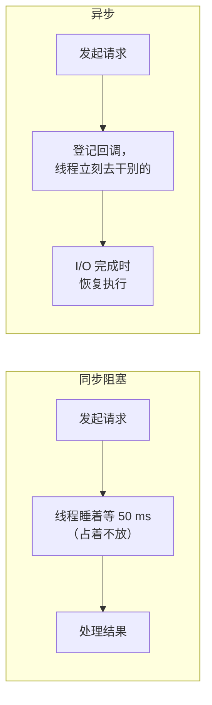

# 第 42 章 · 异步

**简体中文** ｜ [English](./42-async.en-US.md)

---

> 第 41 章的锁保证了共享数据的正确性，但它有个致命副作用——**阻塞**：等锁的线程什么都干不了。而更常见的等待是 **I/O**：一次网络请求几十毫秒，线程就在那里干等。
>
> 传统解法是多开线程。可线程有成本（第 39 章实测 12.2 μs + 每个 1 MB 栈），开一万个就是灾难。**异步给出了第三条路：用一条线程处理成千上万个并发 I/O**。
>
> 本章的**钥匙实验**把三种做法摆在一起——20 个各耗时 50 ms 的 I/O 任务：**串行 1067 ms、20 个线程 83 ms、asyncio 53 ms**（加速比 20.0x），而异步版本实测**全程只用了 1 条线程**。规模拉大时差距更悬殊：Python 跑 **5000 个并发任务只要 34 ms**、JS 跑 **10000 个并发只要 27 ms**——而同样数量的线程光创建就要 61 ms / 122 ms，还要吃掉 5 GB / 10 GB 栈空间。
>
> 秘密在于 `await` 把"等待"变成了"**让出**"：函数在 `await` 处暂停，把剩余部分打包成续体挂起来，线程立刻去干别的活。这需要**把栈帧从栈搬到堆上**——第 32 章埋的伏笔在此完整兑现：C# 实测 `await` 前后栈顶都是 `MoveNext`（编译器把整个方法改写成了堆上的状态机 `<ShowStateMachine>d__4`），Python 实测 `async` 函数返回的是带 `cr_frame` 的 **coroutine 对象**而非结果。
>
> 代价有两个。一是**阻塞调用会毁掉整个事件循环**：实测 3 个 `await asyncio.sleep(0.1)` 并发跑完只要 101 ms，换成 3 个 `time.sleep(0.1)` 就变成 309 ms 的串行；C# 里 200 个任务用 `.Result` 比 `await` **慢 8.2 倍**，而本章开发时把线程池掐到 4 条再跑，程序**直接死锁**。二是**传染性**：`async` 只能被 `async` 调用——"函数有了颜色"，红色会沿调用链一路向上传染。

## 1. 学习目标

本章结束后，你将能够：

- 说清**异步解决的问题**：I/O 等待期间不占用线程，用一条线程扛住上万并发（实测 5000/10000 并发）；
- 解释 `await` 的机制：**暂停 → 让出 → 恢复**，以及为什么这要求栈帧住在堆上（C#/Python 双实测）；
- 用**钥匙实验**对比串行/多线程/异步三种做法（实测 1067 / 83 / 53 ms）并解释加速比的来源；
- 识别并避免**异步的两大陷阱**：阻塞调用毁事件循环（实测 101 → 309 ms）、`.Result`/`.Wait()` 造成线程饥饿甚至死锁（实测慢 8.2 倍）；
- 理解 **async 的传染性**（红蓝函数问题）以及各语言的应对（含 Java 虚拟线程这条不同的路）。

---

## 2. 为什么会出现这个概念

### 线程在等待时是纯浪费

```text
一次网络请求 50 ms：
  CPU 实际工作      < 1 ms
  纯粹等待          > 49 ms   ← 线程被占着，但什么都没干
```

第 40 章实测过：4 个 I/O 任务串行 414 ms，开 4 个线程降到 105 ms。**但线程不是免费的**（第 39 章实测）：

```text
创建成本 12.2 μs/个 + 每个 1 MB 栈
→ 一万个并发连接 = 一万个线程 = 122 ms 创建开销 + 10 GB 栈空间
→ 这就是著名的 C10K 问题
```

### 异步的洞察：等待时把线程还回去



| | 同步 | 异步 |
|---|------|------|
| 等待期间 | 线程被占用 | **线程被释放** |
| 一万并发 | 一万个线程 | **一条线程 + 一万个续体** |
| 续体存放 | 线程栈（1 MB/个） | **堆上的小对象**（几十字节） |

> **一句话**：异步用"把等待中的执行状态搬到堆上"换来了"用极少的线程处理极多的并发"——实测一条线程扛住 10000 个并发任务只要 27 ms。代价是编程模型的改变：函数有了颜色，阻塞成了禁忌。

---

## 3. 底层原理

### 钥匙实验：三种做法的完整对比

20 个各耗时 50 ms 的 I/O 任务：

| 做法 | Python | C# | Java | C++ |
|------|--------|-----|------|-----|
| **串行** | 1067 ms | 1075 ms | 1062 ms | 1061 ms |
| **多线程** | 83 ms（12.9x） | 52 ms（20.5x） | 62 ms（17.1x） | 55 ms（19.2x，`std::async`） |
| **异步** | **53 ms**（20.0x） | **54 ms**（20.1x） | 67 ms（15.9x，`CompletableFuture`） | — |
| 异步用了几条线程 | **1 条**（实测） | 线程数不变（实测 21→21） | 1 个调度线程 | — |

**关键不在于"异步比线程快"**（20 个任务时两者相当），而在于**资源消耗**：

```text
Python: 5000 个并发异步任务 = 34 ms，线程数仍是 1
        （5000 个线程要 61 ms 创建 + 约 5000 MB 栈）
JS:     10000 个并发 = 27 ms，全程单线程
        （10000 个 OS 线程要约 122 ms 创建 + 10000 MB 栈）
C#:     10000 个并发 = 16 ms，线程数 21 → 21（远小于 10000）
```

**这才是异步的主场**：并发规模越大，优势越悬殊。

### `await` 做了什么：暂停、让出、恢复

```text
async function f() {
    A();                  // ① 同步执行
    await someIO();       // ② 发起 I/O，把「剩余部分」注册为回调，然后 return！
    B();                  // ③ I/O 完成后，从这里恢复
}
```

**关键洞察：`await` 处函数真的返回了**——调用者拿到的是一个"未完成的凭证"（Promise/Task/Future/coroutine），线程被彻底释放。等 I/O 完成，运行时再把 `B()` 这部分调度回来执行。

### 栈帧搬到堆上：第 32 章的完整兑现

要在 `await` 处返回、之后又能从原地继续，**局部变量必须活下来**——但栈帧已经弹出了（第 32 章的铁律：函数返回帧必亡）。唯一的出路是**把它们搬到堆上**。

**C# 实测**（编译器把 async 方法整个改写成状态机类）：

```text
await 之前，栈顶方法 = MoveNext
await 之后，栈顶方法 = MoveNext（类型 <ShowStateMachine>d__4）
```

**注意 `await` 之前栈顶就已经是 `MoveNext`** ——说明整个 async 方法体从第一行起就运行在状态机对象的 `MoveNext()` 里，局部变量早已是这个堆对象的字段。

**Python 实测**（协程是一等对象）：

```text
async 函数调用返回的是: coroutine 对象，而不是结果
它有自己的状态: cr_frame = True（帧对象在堆上，第 32 章）
包装成 Task 后才会被调度执行: Task
```

**第 32 章说过"帧可以住在堆上，这是异步与协程的物理前提"——这里就是兑现**：

```text
第 32 章：CPython 的帧本来就是堆对象（f_back 链）
第 32 章：C# 的 async 方法在 await 时栈帧正常弹出，状态存进堆上的状态机
第 42 章：正因为状态在堆上，一万个「暂停中的函数」才只占几 MB 而非 10 GB
```

### 陷阱一：阻塞调用毁掉整个事件循环

**Python 实测**：

```text
3 个 await asyncio.sleep(0.1): 101 ms（并发 ✅）
3 个 time.sleep(0.1):          309 ms（串行 ❌ 事件循环被占死）
```

**JS 实测**：

```text
3 个 await sleep(100):  100 ms（并发 ✅）
3 段 100ms 忙等:        300 ms（串行 ❌ 且期间无法响应任何事件）
```

**异步的全部效率建立在"没人长期占用线程"这一前提上**——一个阻塞调用就能让整个事件循环停转，所有并发退化为串行。

### 陷阱二：`.Result` / `.Wait()` 造成线程饥饿

**C# 实测**（200 个任务）：

```text
200 个任务全程 await:   51 ms ✅（等待完全不占线程）
200 个任务用 .Result:  420 ms ❌（每个都占住一条池线程）
慢了 8.2 倍——线程池被迫扩容，而扩容是有节流的
```

**更凶的实测**（本章开发时踩到）：把线程池上限掐到 4 条再跑 24 个 `.Result` 任务——**程序直接死锁**：

```text
4 条线程全被 .Result 阻塞
→ await Task.Delay 完成后，续体需要一条池线程来恢复
→ 但线程池里已经没有空闲线程了
→ 续体永远排不上队，.Result 永远等不到结果 —— 循环等待（第 41 章的死锁四条件）
```

### 陷阱三：async 的传染性（红蓝函数）

```text
async 函数只能被 async 函数 await —— 调用链上每一层都得是 async
同步函数想调 async：只能 asyncio.run()（会阻塞）或丢进 executor
这就是「函数有颜色」：async 是红色，普通是蓝色，红色会向上传染整条调用链
```

**后果**：一个底层库改成异步，整个调用链都要改；同步与异步的生态会分裂（Python 的 `requests` vs `httpx`、`psycopg2` vs `asyncpg`）。

---

## 4. JavaScript

异步是 JS 的**母语**——它从诞生起就是单线程 + 事件循环（第 43 章讲循环本身）。

### 钥匙实验：最常见的性能坑（实测）

```javascript
for (let i = 0; i < TASKS; i++) serial.push(await asyncIo(i));   // ⚠️ 串行！
const parallel = await Promise.all(tasks.map(asyncIo));           // ✅ 并发
```

```text
循环里 await（串行）:  1020 ms
Promise.all（并发）:     51 ms（加速比 20.0x）
```

**这是 async/await 最常见的误用**：`await` 让代码"看起来像同步"，于是很多人在循环里逐个 `await`，把本可并发的操作变成了串行。

### 规模（实测）

```text
10000 个并发定时器: 27 ms，全程单线程
（10000 个 OS 线程需要约 122 ms 创建 + 10000 MB 栈）
```

### Promise：堆上的续体（实测）

```text
async 函数调用立刻返回: Promise（不是结果）
函数体在 await 处暂停，剩余部分作为回调挂在 Promise 上
```

### 阻塞主线程 = 服务卡死（实测）

```text
3 个 await sleep(100):  100 ms（并发 ✅）
3 段 100ms 忙等:        300 ms（串行 ❌ 且期间无法响应任何事件）
```

**JS 里这个后果最严重**：只有一条主线程，阻塞它意味着连事件都无法处理（第 43 章）。CPU 密集活儿必须交给 `worker_threads` 或子进程（第 39/40 章）。

### 错误处理：`await` 的隐藏价值（实测）

```javascript
try { await Promise.reject(new Error("异步失败")); }
catch (e) { /* 捕获到了！ */ }
```

```text
try/catch 捕获到: 异步失败   ← 回调时代做不到这件事
allSettled 不会因单个失败而全盘皆输: fulfilled, rejected
```

**这是 `async/await` 相对回调最大的进步**：异步错误重新变得可以用 `try/catch` 处理（第 37 章的异常安全在异步世界的延续）。

### 并发原语四件套（实测 `race`）

| API | 语义 |
|-----|------|
| `Promise.all` | 全部成功才成功（任一失败立即失败） |
| `Promise.allSettled` | 等全部结束，不管成败（实测 `fulfilled, rejected`） |
| `Promise.race` | 第一个结束的说了算（做超时控制，实测赢家是"快"） |
| `Promise.any` | 第一个成功的说了算 |

> **注意事项**：`for await...of` 用于异步迭代器（流式处理）；未捕获的 Promise rejection 在 Node 里会导致进程退出（`unhandledRejection`）；`async` 函数总是返回 Promise，即使里面没有 `await`。

---

## 5. Python

Python 的 `asyncio` 是"后加"的异步，因此有一个别人没有的问题：**生态分裂**。

### 钥匙实验（实测）

```text
串行 20 个 I/O:         1067 ms
20 个线程并发:            83 ms（加速比 12.9x）
asyncio 并发（1 线程）:    53 ms（加速比 20.0x）
当前线程数 = 1   ← 异步全程只用一条线程
```

**注意 asyncio 比 20 个线程还快**（53 vs 83 ms）——因为省掉了 20 次线程创建（12.2 μs × 20）与调度开销。

### 规模（实测）

```text
5000 个并发异步任务: 34 ms，线程数仍是 1
```

### 协程是一等对象（实测）

```python
coro = async_io(1)          # 调用 async 函数：不执行，只创建协程对象
task = asyncio.ensure_future(coro)   # 包装成 Task 才会被调度
```

```text
async 函数调用返回的是: coroutine 对象，而不是结果
它有自己的状态: cr_frame = True（帧对象在堆上，第 32 章）
```

**`cr_frame` 就是第 32 章实测过的那种帧对象**——CPython 的帧本来就在堆上，所以它实现协程比 C# 更"自然"（不需要编译器改写整个方法）。

### 阻塞的代价（实测）

```text
3 个 await asyncio.sleep(0.1): 101 ms（并发 ✅）
3 个 time.sleep(0.1):          309 ms（串行 ❌ 事件循环被占死）
```

**兜底方案**：非要调阻塞库时用 `loop.run_in_executor()` 丢给线程池（本质是"用线程隔离阻塞"）。

### 生态分裂：Python 异步最痛的地方

```text
同步库          异步库
requests    →   httpx / aiohttp
psycopg2    →   asyncpg
redis-py    →   redis.asyncio
open()      →   aiofiles
```

**一个同步库就能毁掉整个异步程序**（它会阻塞事件循环）——这是 async 传染性在生态层面的表现，也是 Python 异步采用率不如 JS/C# 的主要原因。

### 结构化并发（Python 3.11+）

```python
async with asyncio.TaskGroup() as tg:      # 组内任一失败则全组取消
    tg.create_task(...)
```

```text
本机 Python 版本较早，用 gather 代替: [1, 2]
```

**`TaskGroup` 解决了 `gather` 的一个真实问题**：`gather` 中某个任务失败时，其他任务仍在后台运行（可能泄漏）；`TaskGroup` 保证组内任务要么全部完成、要么全部取消。

> **注意事项**：`asyncio.run()` 是同步世界进入异步世界的唯一正门；协程对象不 `await` 就不会执行（会有 "coroutine was never awaited" 警告）；`asyncio.sleep(0)` 是主动让出控制权的惯用法。

---

## 6. Java

Java 走了一条**与众不同的路**：它没有 `async/await`，而是选择让阻塞本身变廉价。

### `CompletableFuture`：回调式组合（实测）

```text
串行 20 个 I/O:        1062 ms
20 个线程并发:           62 ms（加速比 17.1x）
CompletableFuture:      67 ms（加速比 15.9x，仅 1 个调度线程）
```

### 拼装管道而非 `await`（实测）

```java
CompletableFuture.supplyAsync(() -> "第一步")
    .thenApply(s -> s + " → 第二步")                    // 同步变换
    .thenCompose(s -> CompletableFuture.supplyAsync(...))  // 串联异步
    .exceptionally(e -> "出错了: " + e.getMessage());   // 错误处理
```

```text
第一步 → 第二步 → 第三步
（没有 async/await 关键字，全靠方法链——可读性是 Java 异步的痛点）
```

**方法名对照表**（帮助记忆）：

| CompletableFuture | JS/C# 对应 |
|-------------------|-----------|
| `thenApply` | `.then(同步函数)` |
| `thenCompose` | `.then(返回 Promise 的函数)` / `await` 后继续 |
| `thenCombine` | `Promise.all` 两个（实测 10+20=30） |
| `anyOf` | `Promise.race`（实测取到 99） |
| `exceptionally` | `.catch` |
| `orTimeout` | 超时（实测 10ms 让 50ms 任务抛 `TimeoutException`） |

### Java 的另一条路：虚拟线程（Java 21+）

```text
CompletableFuture: 回调式组合，无 await 语法（本节实测）
虚拟线程（Java 21+）: 换一条路——让阻塞代码本身变廉价
  → 写同步风格的阻塞代码，运行时自动把「阻塞」变成「让出」
  → 没有 async 传染性问题（第 44 章展开）
本机 Java 版本 = 17.0.18
```

**这是本章最重要的对照**：

```text
async/await 路线（JS/C#/Python）：改变编程模型 —— 函数有颜色，生态要重写
虚拟线程路线（Java 21+ / Go）：  改变运行时 —— 代码照旧写同步，运行时替你让出
```

虚拟线程让 `Thread.sleep()`、`socket.read()` 这些阻塞调用**在虚拟线程上自动变成让出**——同样的代码，同样的可读性，却有异步的性能。第 44 章会完整展开这条路线。

> **注意事项**：`CompletableFuture` 的默认执行器是 `ForkJoinPool.commonPool()`（第 45 章）——在里面做阻塞操作会拖累整个 JVM；`join()` 与 `get()` 都会阻塞，异步链条中应避免；Java 17 用户可以用 Loom 的预览版或第三方库（Reactor、Vert.x）。

---

## 7. C++

C++ 的异步故事最曲折：**直到 C++20 才有协程，而且标准库至今没有配套设施**。

### `std::async`：名不副实（实测）

```text
串行 20 个 I/O:  1061 ms
std::async:       55 ms（加速比 19.2x）
⚠️ 但 std::async(launch::async) 是「每个任务开一条线程」——
   它不是真异步，只是把阻塞挪到了别的线程上（第 39 章：线程 12.2 μs/个）
```

**这是 C++ 异步最大的误解**：`std::async` 的名字暗示异步，实现却是"每个任务一条线程"——**它解决的是并行，不是异步**。开一万个任务就是一万条线程。

### `future`/`promise`：异步的骨架（实测）

```cpp
std::promise<int> p;
std::future<int> f = p.get_future();
// 生产者：p.set_value(42);  消费者：f.get();
```

```text
拿到 future 的值: 42
（promise 写、future 读——这正是 JS Promise / C# Task 的同一抽象）
```

**但 `f.get()` 是阻塞的**——这不是异步，是同步等待：

```text
f.get() 会「阻塞当前线程」直到结果就绪 —— 这不是异步，是同步等待
真正的异步需要：暂停当前函数、让出线程、结果就绪时从原地恢复
→ 这要求把「函数的栈帧」搬到堆上（第 32 章）——C++20 协程做的就是这件事
```

### C++20 协程：给了机制，没给策略

```cpp
co_await   // 暂停并等待（对应 JS/C#/Python 的 await）
co_yield   // 产出一个值并暂停（对应生成器）
co_return  // 协程的返回
```

**但标准库没有配套的协程类型**——你必须自己实现 `promise_type`（协程的"驱动器"），或依赖第三方库（cppcoro、Boost.Asio、folly、libunifex）。

**这是 C++ 异步生态最大的痛点**：语言层面的机制是完备的（甚至比其他语言更灵活——可以自定义调度、内存分配），但没有统一的高层抽象，导致各家库互不兼容。C++26 的 `std::execution` 正在试图统一这一层。

### 五门语言的异步成熟度（实测输出）

```text
JavaScript : Promise + async/await（原生，生态统一）
C#         : Task + async/await（最早引入，设计最完整）
Python     : asyncio + async/await（生态分裂：同步库无法直接用）
Java       : CompletableFuture（无 await）→ 虚拟线程另辟蹊径（第 44 章）
C++        : future（阻塞）+ C++20 协程（无标准库支持）
```

> **注意事项**：`std::async` 的返回值 future 若不保存，析构时会**阻塞等待**（一个著名的坑）；`std::future::get()` 只能调用一次；需要真异步 I/O 时用 Boost.Asio 或 liburing（Linux）。

---

## 8. C#

C# 是 `async/await` 的**发明者**（2012 年的 C# 5.0），设计也最完整。

### 钥匙实验（实测）

```text
串行 20 个 I/O:    1075 ms
20 个线程并发:       52 ms（加速比 20.5x）
async 并发:          54 ms（加速比 20.1x）

10000 个并发任务: 16 ms
线程数 21 → 21（远小于 10000）
```

### 状态机：第 32 章的兑现（实测）

```text
await 之前，栈顶方法 = MoveNext
await 之后，栈顶方法 = MoveNext（类型 <ShowStateMachine>d__4）
```

**编译器把整个 async 方法改写成一个状态机类**：

```text
局部变量 → 状态机对象的字段（住在堆上）
方法体   → MoveNext() 里的一个 switch（每个 await 是一个 case）
await    → 保存状态、注册续体、return
```

### 陷阱：`.Result` / `.Wait()`（实测）

```text
200 个任务全程 await:   51 ms ✅（等待完全不占线程）
200 个任务用 .Result:  420 ms ❌（每个都占住一条池线程）
慢了 8.2 倍——线程池被迫扩容，而扩容是有节流的
```

**本章开发时实测到更凶的后果**：把线程池上限掐到 4 条再跑 24 个 `.Result` 任务，**程序直接死锁**——4 条线程全在阻塞，`await` 的续体没有线程可恢复（第 41 章死锁四条件的完美案例）。

**铁律：async all the way**——从入口到出口全链路 async，绝不中途 `.Result`/`.Wait()`。

### `Task` 不等于线程（实测输出）

```text
Task.Delay 期间不占任何线程——等待由操作系统的 I/O 完成端口驱动
Task.Run 才会借用线程池的线程（第 45 章）
ValueTask：同步完成时零分配（热路径优化）
```

**这是初学者最大的误解**：`Task` 是"一个未来会有结果的凭证"，不是"一条线程"。10000 个 `Task.Delay` 实测只让线程数从 21 变成 21。

### 取消：协作式而非强制（实测）

```csharp
using var cts = new CancellationTokenSource(30);
await Task.Delay(5000, cts.Token);      // 30 ms 后抛 OperationCanceledException
```

```text
30 ms 后取消了一个 5 秒的等待 ✅（协作式取消，不是强杀线程）
```

**`CancellationToken` 是 .NET 的标准取消机制**——它是协作式的：被取消方必须主动检查 token。强杀线程（`Thread.Abort`）在 .NET Core 里已被移除，因为它会让状态不一致（第 37 章的资源泄漏问题）。

> **注意事项**：`async void` 只应用于事件处理器（其异常无法被 `catch`）；`ConfigureAwait(false)` 在库代码里避免捕获同步上下文（UI 程序的死锁元凶）；`SemaphoreSlim` 是异步场景的锁（第 41 章）。

---

## 9. SQL

数据库的"异步"有两面：**写盘时等不等**，以及**驱动层的连接模型**。

### 写盘：`synchronous` 就是同步/异步的选择（实测）

```sql
PRAGMA synchronous = FULL;     -- 2：每次提交都等磁盘确认（同步）
PRAGMA synchronous = NORMAL;   -- 1：提交立刻返回，攒一批再落盘（异步）
PRAGMA synchronous = OFF;      -- 0：完全不等，交给操作系统
```

**shell 实测**（300 次单独提交）：

```text
synchronous=FULL    55 ms
synchronous=NORMAL  50 ms
synchronous=OFF     37 ms
```

**注意本机差距只有约 1.5 倍**——因为 macOS 上 SQLite 默认使用 `F_BARRIERFSYNC` 而非完整的 `F_FULLFSYNC`（后者会等磁盘缓存真正刷新）；**Linux 上 FULL 与 OFF 常常相差一个数量级**。

**这与异步编程是同一道权衡**：

```text
等待完成（FULL / await 阻塞式）：确定性强，慢
不等待（OFF / 异步）：          快，但需要额外机制保证最终一致
```

### 驱动层：同步 vs 异步数据库驱动

```text
传统驱动：一次查询占住一条线程直到结果返回（同步阻塞）
异步驱动：查询发出后线程立刻去干别的（asyncpg / node-postgres / R2DBC）
→ 一条线程可以同时挂着上千个未完成的查询，与本章的异步 I/O 完全同构
```

**这是异步收益最大的场景之一**：Web 服务的绝大部分时间在等数据库返回，异步驱动能让同样的机器扛住数倍的并发。

### 但要小心：连接池才是真正的瓶颈

```text
异步让「等待数据库」不占线程，但数据库连接本身是有限的（第 39 章：PostgreSQL 每连接一进程）
→ 10000 个并发请求 ≠ 10000 个并发查询
→ 它们会在连接池那里排队
```

**异步不能凭空创造下游容量**——它只是让"等待"不再浪费本机线程。

> **工程提醒**：`synchronous = OFF` 只在"数据可重建"的场景可接受（缓存、日志、可重放的导入）；生产数据库一律 FULL 或 NORMAL + WAL；异步驱动要配合合理的连接池大小与超时设置，否则并发压力只是从线程转移到了连接池。

---

## 10. 五语言横向对比

### ① 异步机制对比

| 特性 | JavaScript | Python | Java | C++ | C# |
|------|-----------|--------|------|-----|-----|
| `async/await` 语法 | ✅ 原生 | ✅（3.5+） | ❌ | `co_await`（C++20） | ✅ **最早**（2012） |
| 异步的载体 | `Promise` | `coroutine`/`Task` | `CompletableFuture` | 无标准类型 | `Task`/`ValueTask` |
| 续体存放 | 堆上闭包 | **coroutine 对象**（实测 `cr_frame`） | 回调链 | 自定义 | **状态机对象**（实测 `MoveNext`） |
| 实测加速比（20 任务） | 20.0x | 20.0x | 15.9x | 19.2x（实为多线程） | 20.1x |
| 万级并发实测 | **27 ms**（单线程） | 5000 个 34 ms（1 线程） | — | — | **16 ms**（线程 21→21） |
| 生态统一度 | ✅ 完全统一 | ⚠️ 同步/异步分裂 | ⚠️ 多套方案 | ❌ 无标准库 | ✅ 完全统一 |
| 另一条路 | worker_threads | — | **虚拟线程**（第 44 章） | — | — |

### ② 钥匙实测：三种做法总表

```text
20 个各 50 ms 的 I/O 任务：

              串行      多线程            异步
Python      1067 ms    83 ms (12.9x)   53 ms (20.0x)  ← 1 条线程
C#          1075 ms    52 ms (20.5x)   54 ms (20.1x)  ← 线程数不变
Java        1062 ms    62 ms (17.1x)   67 ms (15.9x)
C++         1061 ms    55 ms (19.2x)   —（std::async 实为多线程）

规模拉大后（真正的分水岭）：
JS      10000 并发 =  27 ms，单线程
C#      10000 并发 =  16 ms，线程数 21 → 21
Python   5000 并发 =  34 ms，线程数 = 1
对比：同样数量的线程光创建就要 122 ms / 61 ms，还要 10 GB / 5 GB 栈
```

### ③ 钥匙实测二：阻塞的代价

```text
Python  3 个 await sleep(0.1) = 101 ms  vs  3 个 time.sleep(0.1) = 309 ms（串行）
JS      3 个 await sleep(100) = 100 ms  vs  3 段 100 ms 忙等 = 300 ms（串行）
C#      200 个 await = 51 ms            vs  200 个 .Result = 420 ms（慢 8.2 倍）
C#      线程池掐到 4 条 + 24 个 .Result = 直接死锁（开发时实测）
```

### ④ 两条设计分歧

**分歧一：改编程模型 vs 改运行时**

```text
改编程模型（JS/C#/Python）：引入 async/await
  收益：显式、可控、能表达复杂的并发组合
  代价：函数有颜色（传染性）、生态分裂、阻塞调用成禁忌
改运行时（Java 21 虚拟线程 / Go goroutine）：让阻塞变廉价
  收益：代码照旧写同步风格，无传染性，老库直接受益
  代价：运行时复杂度大增，调试栈更深，某些场景（如 synchronized）仍会钉住线程
```

**Java 选了后者**（第 44 章展开），这是它作为"后来者"的优势——可以观察前人的经验再做选择。

**分歧二：等待的默认语义**

```text
默认异步（JS）：所有 I/O API 都是异步的，同步版本才是特例（readFileSync）
默认同步（Python/Java/C#/C++）：同步是原生，异步是另一套 API
→ 这决定了生态分裂的严重程度：JS 没有分裂，Python 分裂最严重
```

### ⑤ 共同点与差异根源

**共同点**：五门语言的异步都基于"把续体存到堆上"（实测 C# 状态机、Python coroutine 对象、JS Promise）；都面临"阻塞调用毁一切"的问题（三语言实测）；加速比在小规模时与多线程相当，规模拉大后才拉开差距（实测）。

**差异根源**：

- **JS 天生异步**——单线程事件循环是它的出厂设置，异步不是附加功能而是基础设施；
- **C# 最早引入 async/await**——因为 Windows 桌面应用对"UI 不能卡"有强需求，催生了这套语法；
- **Python 后加 asyncio**——生态已经庞大，导致同步/异步双轨并存（最痛的分裂）；
- **Java 绕过 async/await**——它有海量的同步阻塞代码库，改造成本太高，于是选择改运行时（虚拟线程）；
- **C++ 给机制不给策略**——符合它一贯的"零开销 + 不强加抽象"哲学，代价是生态碎片化。

---

## 11. 底层实现对比

| 运行时 | 异步的实现 | 关键细节 |
|--------|-----------|---------|
| **V8**（Node） | 微任务队列 + libuv 事件循环（第 43 章） | `await` 编译为 Promise 的 `.then`；Promise 回调进微任务队列，优先于宏任务 |
| **CPython** | 生成器机制的扩展（`yield from` → `await`） | 协程对象带 `cr_frame`（实测），本来就是堆对象（第 32 章）；事件循环用 `selectors`（epoll/kqueue） |
| **JVM**（Java） | `CompletableFuture` 的回调链 + 执行器 | 无语言级续体；虚拟线程（21+）在 JVM 层做续体捕获与恢复（第 44 章） |
| **C++**（原生） | C++20 协程：编译器生成 coroutine frame（堆分配） | 帧大小编译期确定；`promise_type` 决定分配策略——可定制到栈上（HALO 优化） |
| **CLR**（C#） | 编译器生成状态机（实测 `<ShowStateMachine>d__4`） | `MoveNext()` 里的 switch；`ValueTask` 在同步完成时避免堆分配；I/O 完成端口驱动恢复 |

**一个值得记住的分野**：

```text
显式续体（C++/C#）：编译器生成状态机对象，大小与布局编译期确定 → 可优化到极致
隐式续体（Python/JS）：运行时对象（coroutine/Promise），灵活但每次都有堆分配
→ 这解释了为什么 C# 的 ValueTask 与 C++ 的 HALO 优化能做到「零分配异步」
```

---

## 12. 性能分析

### 异步的收益从哪来

```text
❌ 不是「异步更快」—— 单个任务的延迟一点没变（还是 50 ms）
✅ 是「异步更省」—— 等待期间不占线程，所以能同时挂起极多的任务

实测佐证：20 个任务时异步（53 ms）与多线程（83 ms）相当
          10000 个任务时异步 27 ms 单线程，而线程方案根本跑不起来
```

### 完整成本对照（本 Part 实测串联）

| 并发单位 | 创建成本 | 内存 | 出处 |
|---------|---------|------|------|
| 进程 | 256.6 μs | 独立地址空间 | 第 39 章 |
| 线程 | 12.2 μs | ~1 MB 栈 | 第 39 章 |
| **异步任务** | **~微秒级** | **几十~几百字节**（堆上的续体） | 本章 |

**这就是能扛住 10000 并发的原因**：一万个续体只要几 MB，一万个线程要 10 GB。

### 异步不能解决什么

```text
① CPU 密集：异步只是不占线程地等待，不会让计算变快
   → 实测 JS 忙等 300 ms 完全串行，Python time.sleep 同理
② 下游容量：数据库连接池、外部 API 限流不会因为你异步而变大
③ 单个请求的延迟：50 ms 的网络往返还是 50 ms
```

### 优化要点

```text
① 并发而非串行：用 Promise.all / gather / WhenAll，别在循环里 await（实测 1020 → 51 ms）
② 消灭阻塞调用：用异步库；实在不行丢 executor（run_in_executor / Task.Run）
③ 控制并发度：无限并发会打爆下游——用信号量限流（Semaphore/SemaphoreSlim）
④ 减少续体分配：C# 用 ValueTask；避免不必要的 async（没有 await 的函数别标 async）
```

> ⚠️ 惯例提醒：异步的性能问题往往不在异步本身，而在"某处混进了阻塞调用"。诊断手段：Python 的 `asyncio` 调试模式（`PYTHONASYNCIODEBUG=1` 会警告慢回调）、Node 的 `--trace-sync-io`、C# 的线程池饥饿计数器。

---

## 13. 工程实践

| 场景 | ✅ 推荐 | ❌ 不推荐 | 原因 |
|------|--------|----------|------|
| 大量并发 I/O | 异步 | 一请求一线程 | 实测万级并发只需一条线程 |
| 批量独立请求 | `Promise.all`/`gather`/`WhenAll` | 循环里逐个 await | 实测 1020 → 51 ms（20 倍） |
| 异步中的阻塞库 | `run_in_executor`/`Task.Run` | 直接调用 | 毁掉事件循环（实测 101 → 309 ms） |
| 同步调异步 | 入口处 `asyncio.run` 一次 | 到处 `.Result`/`.Wait()` | 线程饥饿（实测慢 8.2 倍）甚至死锁 |
| CPU 密集任务 | 进程/worker/线程池 | 塞进事件循环 | 异步不加速计算 |
| 无限并发 | 信号量限流 | 直接 gather 一万个 | 打爆下游（连接池、API 限流） |
| 异步中的互斥 | `asyncio.Lock`/`SemaphoreSlim` | 普通锁 | 跨 await 会失效（第 41 章） |
| 超时控制 | `Promise.race`/`orTimeout`/`CancellationToken` | 无超时 | 一个慢请求拖垮整条链路 |
| 异步任务的错误 | `allSettled`/`exceptionally`/`try-catch` | 忽略 | 未捕获的 rejection 会终止 Node 进程 |
| Java 新项目 | 虚拟线程（21+） | `CompletableFuture` 手工编排 | 无传染性、可读性好（第 44 章） |

### 判断口诀

```text
这段代码在等什么？
  等 I/O（网络、磁盘、数据库）→ 异步（实测万级并发一条线程）
  等 CPU 算完                 → 进程/线程（第 39/40 章），异步帮不上忙
  等锁                        → 先想能不能不共享（第 41 章）

写异步代码时：
  这一行会阻塞吗？→ 会就换异步版本，换不了就丢 executor
  这些任务独立吗？→ 独立就并发（all/gather/WhenAll），别串行 await
```

---

## 14. 最佳实践

- **async all the way**：从入口到出口全链路异步，绝不中途 `.Result`/`.Wait()`（实测慢 8.2 倍，掐小线程池直接死锁）。
- **独立任务一定并发**：`Promise.all`/`gather`/`WhenAll` —— 循环里逐个 `await` 是最常见的性能坑（实测 20 倍差距）。
- **异步代码里没有阻塞调用**：查清每个库是不是异步版；不得已用 `run_in_executor`/`Task.Run` 隔离（实测阻塞会让并发退化为串行）。
- **并发要限流**：无限 `gather` 会打爆下游——用 `Semaphore`/`SemaphoreSlim` 控制在合理并发度。
- **一切等待都要有超时**：`Promise.race`/`orTimeout`/`CancellationToken`——没有超时的异步调用是定时炸弹。
- **异步的锁用异步版**：`asyncio.Lock`/`SemaphoreSlim`（第 41 章实测过普通锁跨 `await` 的问题）。
- **理解 Task ≠ 线程**：实测 10000 个 `Task.Delay` 只让线程数 21→21——别用"任务数"去估算线程数。
- **Java 新项目优先虚拟线程**：无传染性、老代码直接受益（第 44 章）——除非要精细控制并发编排。

---

## 15. 常见坑

**坑 1 · 循环里逐个 `await`**（JS 实测）

```javascript
for (const url of urls) results.push(await fetch(url));   // ⚠️ 串行
```

```text
实测：循环里 await 1020 ms vs Promise.all 51 ms（20 倍差距）
```

**如何避免**：`await Promise.all(urls.map(fetch))` —— 只有当后一个请求依赖前一个结果时才该串行。

**坑 2 · 异步里混入阻塞调用**（Python/JS 双实测）

```python
async def handler():
    time.sleep(1)          # ⚠️ 整个事件循环停转 1 秒
    requests.get(url)      # ⚠️ 同上（同步库）
```

```text
实测：3 个 time.sleep(0.1) = 309 ms（串行）vs 3 个 await asyncio.sleep(0.1) = 101 ms
```

**如何避免**：用异步库（`httpx`/`aiohttp`）；无异步版时 `await loop.run_in_executor(None, blocking_fn)`。

**坑 3 · `.Result` / `.Wait()` 造成线程饥饿甚至死锁**（C# 实测）

```text
实测：200 个 .Result 比 await 慢 8.2 倍
开发时实测：线程池掐到 4 条 + 24 个 .Result → 程序直接死锁
```

**如何避免**：async all the way；同步入口只在最外层用一次 `asyncio.run()`/`GetAwaiter().GetResult()`。

**坑 4 · 忘记 await**（协程从未执行）

```python
async_io(1)        # ⚠️ 只创建了协程对象，什么都没发生
```

```text
实测提示：async 函数调用返回的是 coroutine 对象，而不是结果
```

**如何避免**：Python 会给 "coroutine was never awaited" 警告；JS 里则是一个被忽略的 Promise（可能吞掉错误）。

**坑 5 · 无限并发打爆下游**

```python
await asyncio.gather(*(fetch(u) for u in ten_thousand_urls))   # ⚠️ 一万个并发请求
```

**如何避免**：信号量限流：

```python
sem = asyncio.Semaphore(50)
async def limited(u):
    async with sem: return await fetch(u)
```

**坑 6 · 异步任务的异常被吞掉**

```javascript
somePromise();           // ⚠️ 没有 await 也没有 .catch → unhandledRejection
```

**如何避免**：要么 `await`，要么 `.catch()`；Node 里给 `process.on('unhandledRejection')` 加日志。

**坑 7 · `async void`**（C#）

```csharp
async void Handler() { await Foo(); }   // ⚠️ 异常无法被 catch，会直接崩进程
```

**如何避免**：只有事件处理器可以用 `async void`，其余一律 `async Task`。

---

## 16. 面试题

**基础**

1. 异步解决了什么问题？它比多线程好在哪、不如多线程在哪？
2. `await` 时线程在做什么？函数的局部变量存在哪？
3. 为什么在异步代码里调用阻塞函数是灾难？

**中级**

4. **为什么 `await` 要求把栈帧搬到堆上？（用 C# 状态机或 Python coroutine 对象说明）**
5. 什么是 async 的传染性（红蓝函数问题）？它带来了什么生态后果？
6. **`Task` 和线程是什么关系？10000 个 `Task.Delay` 会创建多少线程？（用实测数据回答）**

**高级**

7. **同样是 20 个 I/O 任务，异步与多线程的耗时相近，为什么还要用异步？（用规模数据说明）**
8. `.Result`/`.Wait()` 为什么可能导致死锁？请用线程池与续体调度解释。
9. Java 为什么不引入 async/await 而选择虚拟线程？两条路线各自的代价是什么？

---

## 17. 练习

**基础**

1. 复现钥匙实验：串行、多线程、异步三种方式跑 N 个模拟 I/O，记录耗时。
2. 把一段"循环里 await"的代码改成并发版，测量加速比。
3. 在异步函数里故意加一个阻塞调用，观察并发如何退化为串行。

**提高**

4. **复现规模实测**：跑 10000 个并发异步任务，记录耗时与线程数；再试着用 10000 个线程做同样的事（观察它如何失败）。
5. 用信号量给无限并发限流，对比限流前后对下游的压力。
6. 在 C# 里打印 `await` 前后的 `StackTrace`，找出状态机类名（实测 `<ShowStateMachine>d__4`）。

**挑战**

7. 手工实现一个最小的事件循环：一个任务队列 + 一个"到期时间"堆，支持 `sleep(ms)` 与 `run_until_complete`。
8. 用 C++20 协程实现一个最小的 `Task<T>` 类型（含 `promise_type`），体会"给机制不给策略"的含义。
9. 复现 C# 的线程池死锁：把线程池上限掐到 4，跑 24 个 `.Result` 任务，用 `dotnet-dump` 抓出线程状态。

---

## 18. 本章总结

**一句话总结**：异步用"**把等待中的执行状态搬到堆上**"换来了"用极少的线程处理极多的并发"——钥匙实验实测 20 个 I/O 任务串行 1067 ms、20 线程 83 ms、asyncio 53 ms 且**全程一条线程**，而规模拉大后差距才真正显现（JS 一万并发 27 ms 单线程、C# 一万并发线程数 21→21、Python 五千并发 34 ms）；机制是 `await` 把"等待"变成"让出"，这要求栈帧住在堆上——**第 32 章的伏笔在此完整兑现**（C# 实测状态机 `<ShowStateMachine>d__4`、Python 实测 coroutine 对象的 `cr_frame`）；代价是两大陷阱（阻塞调用毁事件循环，实测 101 → 309 ms；`.Result` 造成线程饥饿，实测慢 8.2 倍，掐小线程池直接死锁）与**传染性**（函数有了颜色，Python 生态因此分裂）；而 Java 选了完全不同的路——**不改编程模型，改运行时**（虚拟线程，第 44 章）。

**核心知识点**

- **异步的收益**：不是更快，是更省——等待期间不占线程（实测万级并发一条线程）。
- **钥匙实验**（四语言）：串行 ~1065 ms / 多线程 52–83 ms / 异步 53–67 ms；规模拉大才是分水岭。
- **`await` 三步**：暂停 → 让出（函数真的返回了）→ I/O 完成后从原地恢复。
- **栈帧上堆**（第 32 章兑现）：C# 状态机对象（实测 `MoveNext`）、Python coroutine 对象（实测 `cr_frame`）、JS Promise 闭包。
- **陷阱一**（双实测）：阻塞调用让并发退化为串行（101 → 309 ms、100 → 300 ms）。
- **陷阱二**（C# 实测）：`.Result` 慢 8.2 倍；线程池掐到 4 条时直接死锁。
- **传染性**：async 只能被 async 调用——生态分裂的根源（Python 最严重，JS 没有）。
- **两条路线**：改编程模型（async/await）vs 改运行时（虚拟线程/goroutine，第 44 章）。

**检查清单**

- [ ] 我能说清异步与多线程各自的适用场景与成本。
- [ ] 我能解释 `await` 时线程去了哪、局部变量存在哪。
- [ ] 我能识别"循环里 await"与"异步里阻塞"这两个高频坑。
- [ ] 我知道 `.Result`/`.Wait()` 为什么危险。
- [ ] 我理解 async 传染性及其生态影响。

**下一章预告**：本章反复提到"事件循环"——那台让单线程扛住万级并发的引擎，究竟是怎么转的？一个 `setTimeout(fn, 0)` 和一个 `Promise.resolve().then(fn)` 谁先执行？为什么答案永远是后者？第 43 章拆开事件循环：宏任务与微任务的两级队列、libuv 的六个阶段、`process.nextTick` 的插队特权，以及最经典的面试题——一段混杂了同步代码、`setTimeout`、`Promise`、`queueMicrotask` 的程序，输出顺序为什么是那样。我们会用实测把每一条规则钉死，并解释为什么"微任务饿死宏任务"是真实存在的生产事故。

---

## 19. 延伸阅读

- <a href="https://en.wikipedia.org/wiki/Asynchronous_I/O" target="_blank" rel="noopener">Wikipedia：Asynchronous I/O</a> — 异步 I/O 的概念与模型综述。
- <a href="https://en.wikipedia.org/wiki/Continuation" target="_blank" rel="noopener">Wikipedia：Continuation</a> — 续体（continuation）概念，异步的理论基础。
- <a href="https://journal.stuffwithstuff.com/2015/02/01/what-color-is-your-function/" target="_blank" rel="noopener">What Color is Your Function?</a> — 红蓝函数问题的经典文章（本章"传染性"一节的来源）。
- <a href="https://developer.mozilla.org/en-US/docs/Web/JavaScript/Reference/Statements/async_function" target="_blank" rel="noopener">MDN · async function</a> — JS async/await 官方文档。
- <a href="https://docs.python.org/3/library/asyncio.html" target="_blank" rel="noopener">Python 文档 · asyncio</a> — asyncio 官方文档（含 TaskGroup 与调试模式）。
- <a href="https://learn.microsoft.com/en-us/dotnet/csharp/asynchronous-programming/async-scenarios" target="_blank" rel="noopener">Microsoft Learn · 异步编程场景</a> — C# async/await 官方指南。
- <a href="https://docs.oracle.com/en/java/javase/17/docs/api/java.base/java/util/concurrent/CompletableFuture.html" target="_blank" rel="noopener">Java API · CompletableFuture</a> — Java 异步组合的官方文档。
- <a href="https://en.cppreference.com/w/cpp/language/coroutines" target="_blank" rel="noopener">cppreference · Coroutines</a> — C++20 协程的权威参考。
- <a href="https://www.sqlite.org/pragma.html#pragma_synchronous" target="_blank" rel="noopener">SQLite 文档 · synchronous</a> — 同步级别与持久性权衡的官方说明。
