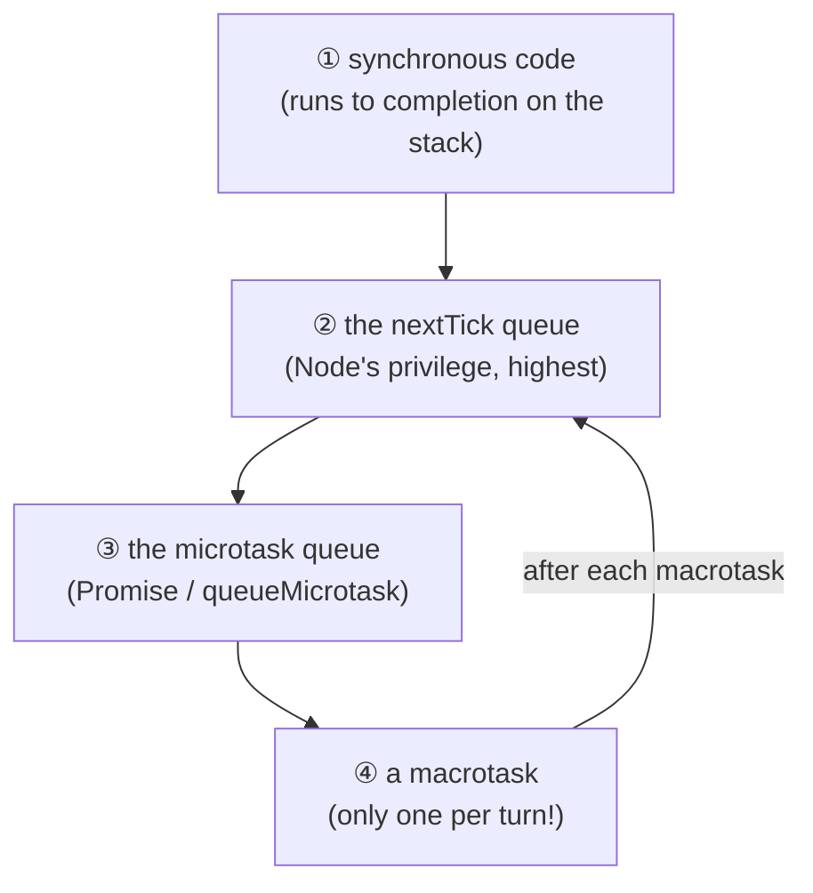

# Chapter 43 · The Event Loop

[简体中文](./43-event-loop.md) ｜ **English**

---

> Chapter 42 kept invoking "the event loop" — the engine that lets one thread carry ten-thousand concurrency (measured: JS 10,000 concurrent in 27 ms, Python 5,000 in 34 ms). How does it actually turn?
>
> This chapter's **key experiment** is the classic interview question: mix synchronous code, `setTimeout`, `Promise`, `queueMicrotask`, and `process.nextTick` — what is the output order? The measured answer is **sync → sync → nextTick → Promise → queueMicrotask → setImmediate → setTimeout** — the `setTimeout` written on line two runs last, while the `nextTick` written second-to-last comes third. This is not mysticism but the necessary consequence of **two-tier queues plus six phases**.
>
> One sentence holds every rule: **take one task → run it to completion (no preemption) → drain the microtasks → take the next**. Measurements confirm two corollaries: when two macrotasks each schedule a microtask, the order is **A, microA, B, microB** rather than A, B, microA, microB; and inside an I/O callback `setImmediate` **always precedes** `setTimeout` (measured), because it belongs to the check phase that immediately follows poll.
>
> And "drain the microtasks first" hides a real production incident — **microtasks starving macrotasks**: measured, a chain of **200,000 microtasks completed in just 6 ms**, and during that window the `0ms` `setTimeout` **never ran once**. A recursive `Promise.then` can leave timers and I/O callbacks waiting forever, with the service alive on paper and dead in practice.
>
> Finally, a cross-language discovery: **this engine has only three parts** (a ready queue, a timer heap, and I/O multiplexing). This chapter hand-builds one in C++, Java, and C# — and **all four languages produce identical execution order** (1, 2, 4, 3 — a task scheduled from within a task always lands at the tail). JS merely built it into the language; Java/C++/C# left it to libraries (Netty, Boost.Asio).

## 1. Learning Objectives

By the end of this chapter, you will be able to:

- Recite and explain the event loop's core rule: **take one task → run to completion → drain microtasks → take the next**;
- Derive the classic ordering puzzle independently (seven measured lines) and state the three-tier priority of `nextTick`/microtasks/macrotasks;
- Describe the responsibilities of **libuv's six phases** and explain why `setImmediate` precedes `setTimeout` inside I/O callbacks (measured);
- Reproduce and explain **microtask starvation** (measured: zero macrotask executions across 200,000 microtasks);
- Hand-build a minimal event loop (three parts) and understand why JS/asyncio embed one while Java/C++/C# leave it to libraries.

---

## 2. Why This Concept Exists

### How does one thread do many things at once?

Chapter 42 proved asynchrony's power (one thread carrying ten-thousand concurrency) but left a question: **with only one thread, who decides "what runs next"?**

```text
Ten thousand pending operations:
  some await the network (not ready)
  some timers just expired (due now)
  some I/O just completed (their callbacks should run)
→ we need a scheduler: repeatedly ask "what can run now" and run it
```

### The event loop: a scheduling loop that never stops

```text
while (there is work) {
    ① any expired timers?  → move their callbacks into the ready queue
    ② any completed I/O?   → move their callbacks into the ready queue (may block waiting here)
    ③ run the ready queue's callbacks in order (each to completion)
}
```

**The key design decision: no preemption.** Once a callback starts, it must finish before the next one runs — no time slices, no forced switching.

| This decision brings | Benefit | Price |
|---------------------|---------|-------|
| No preemption | **inherently race-free** (Chapters 40/41's problems vanish) | one long callback stalls everyone |
| Single thread | lock-free, minimal cognitive load | cannot fill multiple cores (needs multiprocessing, Chapter 39) |

> **In one sentence**: the event loop trades **single-threaded, non-preemptive execution** for concurrency's scarcest commodity — **determinism**. The price is zero tolerance for long tasks: Chapter 42 measured how one blocking call degrades concurrency to serial.

---

## 3. How It Works

### The key experiment: the classic ordering puzzle

```javascript
console.log("1. sync");
setTimeout(() => console.log("6. setTimeout 0ms"), 0);
setImmediate(() => console.log("7. setImmediate"));
Promise.resolve().then(() => console.log("4. Promise.then"));
queueMicrotask(() => console.log("5. queueMicrotask"));
process.nextTick(() => console.log("3. process.nextTick"));
console.log("2. sync");
```

**Measured output**:

```text
1. sync (runs directly on the stack)
2. sync (synchronous code always finishes first)
3. process.nextTick (Node's privileged queue, ahead of microtasks)
4. Promise.then (microtask)
5. queueMicrotask (microtask, same queue as Promise)
7. setImmediate (macrotask: the check phase)
6. setTimeout 0ms (macrotask: the timers phase)
```

**Three priority tiers** (derived from the measurement):



**Note the last two lines**: `setImmediate` (written on line 7) preceded `setTimeout` (line 2) — a consequence of libuv's phase order (below).

### The core rule: take one → run to completion → drain microtasks

**Second measurement** (two macrotasks, each scheduling a microtask):

```text
macrotask A → ↳A's microtask → macrotask B → ↳B's microtask
↑ not A, B, microA, microB — but A, microA, B, microB
```

**This rule is the key to everything**: macrotasks are taken one at a time, while microtasks are drained completely.

### libuv's six phases

```text
   ┌─────────────┐
┌─>│   timers    │  expired setTimeout / setInterval callbacks
│  ├─────────────┤
│  │   pending   │  system callbacks deferred from the last turn (e.g. TCP errors)
│  ├─────────────┤
│  │ idle/prepare│  internal use
│  ├─────────────┤      ┌───────────────┐
│  │    poll     │<─────┤  I/O arrives   │  ⭐ blocks here when necessary
│  ├─────────────┤      └───────────────┘
│  │    check    │  setImmediate callbacks
│  ├─────────────┤
└──┤    close    │  close events (socket.on('close'))
   └─────────────┘
   Between phases and after every callback, the nextTick and microtask queues are drained
```

**Measured phase order** (two timers registered inside an I/O callback):

```text
setImmediate (this turn's check phase, right after poll) ← runs first
setTimeout (next turn's timers phase) ← runs second
```

**Why `setImmediate` always wins inside I/O callbacks**: I/O callbacks run in the **poll phase**, and check comes immediately after — so `setImmediate` runs this same turn, while `setTimeout` must wait for the **next** turn's timers phase.

(In the main module, however, the order of `setTimeout(0)` and `setImmediate` is **nondeterministic** — it depends on how long startup took before entering the loop, which is why they appeared "backwards" in this chapter's measurement.)

### Key experiment two: microtasks starving macrotasks

```javascript
setTimeout(() => (macroRan = true), 0);       // a macrotask: due after 0 ms
function greedyMicrotask() {
  microCount++;
  if (microCount === 200_000) { /* check */ return; }
  Promise.resolve().then(greedyMicrotask);    // a microtask scheduling another microtask
}
greedyMicrotask();
```

**Measured output**:

```text
after 200000 microtasks in 6 ms,
did that 0ms setTimeout run? false ❌
```

**The microtask queue must empty completely before any macrotask runs** — a chained microtask extends that queue indefinitely, and macrotasks never get their turn.

**This is a real production failure mode**:

```text
recursive Promise.then / recursive async calls
→ the microtask queue is never empty
→ timers never fire, I/O callbacks never run, health checks time out
→ CPU at 100%, memory normal, and the process answers nothing (a hung service)
```

**By contrast**: Node has partial protection for `process.nextTick` (the legacy `--max-tick-depth`), but **the microtask queue has no depth limit at all**. Amusingly, databases do provide a backstop — SQLite's `SQLITE_MAX_TRIGGER_DEPTH` defaults to 1000 (this chapter's SQL section).

### The engine's three parts

This chapter hand-built event loops in C++, Java, and C#; all share one skeleton:

```text
① a ready queue (FIFO)        : callbacks that can run right now
② a timer heap (min-heap)     : ordered by deadline; take the nearest
③ I/O multiplexing            : epoll (Linux) / kqueue (macOS) / IOCP (Windows) — the only place that sleeps
```

**The loop body**:

```text
① compute the nearest timer's deadline → use it as select's timeout
② selector.select(timeout) — block waiting on I/O (the only sleeping point)
③ move ready I/O callbacks and expired timers into the ready queue
④ run every callback in the ready queue (each to completion)
```

**All four languages produced identical output**:

```text
1. the first task
2. the rest of the first task (no preemption, it must finish)
4. the second task
3. the task scheduled from inside a task (goes to the tail)
```

**Note that 3 comes after 4** — a task scheduled from within a task always lands at the tail, a necessary consequence of the FIFO queue and the source of its fairness.

---

## 4. JavaScript

The event loop is JS's **core runtime model** — both key experiments came from it.

### Two-tier queues (seven measured lines)

| Queue | Who enters | When drained |
|-------|-----------|--------------|
| **nextTick queue** | `process.nextTick` (Node only) | after every phase/callback, **first** |
| **microtask queue** | `Promise.then`, `queueMicrotask`, post-`await` | right after nextTick, **entirely** |
| **macrotask queue** | `setTimeout`, `setImmediate`, I/O callbacks | **one per turn** |

**Browser vs Node differences**:

```text
Browser: no process.nextTick, no setImmediate
         macrotasks also include UI rendering and requestAnimationFrame (after microtasks, before the next frame)
Node:    a privileged nextTick queue; macrotasks split across libuv's six phases
```

### Microtasks starving macrotasks (measured)

```text
after 200000 microtasks in 6 ms, did that 0ms setTimeout run? false
```

### Deterministic order inside I/O callbacks (measured)

```text
setImmediate (this turn's check phase) ← first
setTimeout (next turn's timers phase) ← second
```

### Three practical corollaries

```text
① "as soon as possible but yield once" → queueMicrotask (far faster than setTimeout(0))
② "on the next turn"                   → setImmediate (Node) / setTimeout(0) (browser)
③ "jump ahead of all microtasks"       → process.nextTick (Node's privilege, use sparingly)
```

> **Note**: recursive `process.nextTick` starves everything too (and it outranks microtasks, making it more dangerous); in browsers, long tasks block rendering (Lighthouse flags Long Tasks over 50 ms); split long work with `scheduler.yield()` (a new API) or `setTimeout(0)`.

---

## 5. Python

`asyncio`'s loop is **isomorphic to JS's but simpler** — it has only one tier.

### Execution order (measured)

```text
1. synchronous code
3. call_soon (the ready queue)
2. the coroutine is scheduled (also in the ready queue)
4. after await sleep(0)
5. call_later(0) (the timer queue)
```

### The key difference from JS: no microtasks

```text
JS:      a macrotask queue + a microtask queue (two tiers; microtasks outrank)
asyncio: one ready queue (_ready) + one timer heap (_scheduled)
→ asyncio has no "microtasks starving macrotasks" problem (all callbacks queue as equals)
→ but it shares "one long callback stalls the whole loop"
```

**This is a design advantage of asyncio over JS**: a single tier means **every callback queues fairly**, and no class of task can starve another by jumping ahead indefinitely. The cost is losing microtasks' fine-grained priority control.

### The loop's true form (measured)

```text
this machine's selector = KqueueSelector (kqueue on macOS, epoll on Linux)
loop body: ① compute the nearest timer deadline
           ② selector.select(timeout) — block waiting on I/O (the only sleeping point)
           ③ move ready I/O callbacks and expired timers into the ready queue
           ④ run every callback in the ready queue
```

### Blocking callbacks stall the loop (measured)

```text
3 concurrent await sleep(0.05): 51 ms ✅
3 blocking callbacks:          201 ms (including a 200 ms wait; 150 ms actually serialized) ❌
```

### Debug mode: production triage's first tool (measured)

```python
loop.set_debug(True)
loop.slow_callback_duration = 0.02      # warn on callbacks over 20 ms
```

**Measured output** (it really caught one):

```text
Executing <Handle main.<locals>.<lambda>() at main.py:57 created at main.py:57> took 0.035 seconds
```

**This is Python async's most effective diagnostic** — it names the exact line whose callback ran too long (that is, who is stalling the loop). In production, enable it with `PYTHONASYNCIODEBUG=1`.

> **Note**: a thread may host only one running loop; `asyncio.run()` creates a loop and closes it at the end; `loop.run_in_executor()` hands blocking work to a thread pool (the one correct fallback); `uvloop` (a libuv-based replacement) markedly raises throughput.

---

## 6. Java

Java has **no built-in event loop** — its biggest model difference from JS/Python.

### Hand-building one (measured)

```java
BlockingQueue<Runnable> tasks;    // the ready queue
DelayQueue<DelayedTask> timers;   // the timer queue
while (running) {
    while ((due = timers.poll()) != null) due.task.run();   // ① expired timers
    Runnable task = tasks.poll(5, MILLISECONDS);            // ② ordinary tasks
    if (task != null) task.run();                           // ③ run to completion
}
```

**Measured output** (identical to JS/C++/C#):

```text
1. the first task (thread event-loop)
2. the rest of the first task (no preemption, it must finish)
4. the second task
3. the task scheduled from inside a task (goes to the tail)
5. the delayed task (from the timer queue)
```

### Blocking tasks stall the loop (measured)

```text
3 tasks each blocking 30 ms: 105 ms (serial ❌ — the single-threaded loop is pinned)
→ Netty's iron law: never block on an EventLoop thread (hand it to a business thread pool)
```

### Netty's model: many event loops

```text
bossGroup   : 1 loop, accepting new connections only
workerGroup : N loops (N = cores × 2), each bound to one thread
a connection belongs to one loop for life → all its events run on the same thread
→ no data races within a connection (JS's benefit) while filling every core
```

**An important improvement on JS's single-loop model**: it keeps the cognitive advantage of "no contention within a connection" while using every core through multiple loops. Vert.x, Undertow, and Nginx's multi-worker design follow the same idea.

### Java's other road (Chapter 44 preview)

```text
The event-loop model: few threads + callbacks/async → high throughput, but the code style changes
The virtual-thread model: many cheap threads + blocking code → high throughput, and the style stays
→ new Java 21+ projects may no longer need Netty-style event-loop programming
```

> **Note**: blocking on a Netty `EventLoop` thread is the most common performance incident; slow logic in a `ChannelHandler` should go to a `DefaultEventExecutorGroup`; Swing/JavaFX's EDT (event dispatch thread) is the UI flavor of an event loop, equally intolerant of blocking.

---

## 7. C++

C++ likewise has no built-in event loop — but **fifty lines build one** (measured).

### The minimal three-part implementation (measured)

```cpp
std::queue<std::function<void()>> ready_;                                // ① ready queue
std::priority_queue<Timer, std::vector<Timer>, std::greater<>> timers_;  // ② timer min-heap
// ③ I/O multiplexing (a real implementation needs epoll/kqueue)
```

**Measured output** (identical to the other three languages):

```text
1. the first task
2. the rest of the first task (no preemption)
4. the second task
3. the task scheduled from inside a task (goes to the tail)
5. the task delayed by 20 ms
```

### Boost.Asio: C++'s de facto standard

```cpp
io_context ctx;                    // this example's EventLoop
ctx.post([]{ ... });               // post a task
socket.async_read(..., handler);   // register an I/O callback
ctx.run();                         // run the loop
```

**With C++20 coroutines** (Chapter 42's "mechanism from the language, policy from the library," cashed in):

```cpp
co_await socket.async_read(..., use_awaitable);   // asynchronous code finally reads well
```

### Multithreaded loops: `io_context` may be `run()` by many threads

```text
Single-threaded run(): like JS — no data races, but one core
Multithreaded run():   several threads pull from one io_context → all cores, but callbacks may run concurrently
                       → strands (serializing executors) preserve ordering for a group of callbacks
```

**`strand` is Asio's elegant touch**: it carves "logically single-threaded" regions out of a multithreaded loop — multicore throughput with local freedom from contention.

> **Note**: `io_context::run()` returns when no work remains (use a `work_guard` to keep it alive); exceptions thrown in callbacks propagate to the `run()` call site; Qt's `QEventLoop` and GLib's `GMainLoop` are the GUI counterparts.

---

## 8. C#

.NET has **no built-in event loop** (console/server), but it has a more abstract concept: the **synchronization context**.

### No context in a console app (measured)

```text
a console app's SynchronizationContext = null (straight to the thread pool)
thread before await = 1, thread after await = 5 (different)
```

**This explains a Chapter 42 observation**: threads may change across an `await` — with no context, the continuation goes to any thread-pool thread.

### Where contexts do exist

| Scenario | Synchronization context | Where `await` resumes |
|----------|------------------------|----------------------|
| Console / ASP.NET Core | `null` | **any thread-pool thread** (measured 1 → 5) |
| WinForms / WPF | the UI message loop | **always the UI thread** |
| Legacy ASP.NET | the request context | back on the request context |

**A UI message loop *is* an event loop**: `Application.Run()` is internally "take a Windows message → dispatch → take the next," isomorphic to JS's loop.

### Hand-building one (measured)

```csharp
class SingleThreadLoop : SynchronizationContext {
    public override void Post(SendOrPostCallback d, object? state) => _queue.Add((d, state));
    public void Run() { foreach (var (cb, state) in _queue.GetConsumingEnumerable()) cb(state); }
}
```

**Measured output** (identical to the other three languages):

```text
1. the first task (thread 8)
2. the rest of the first task (no preemption, it must finish)
4. the second task
3. the task scheduled from inside a task (goes to the tail)
```

**`SynchronizationContext` is .NET's abstraction of "the event loop"** — it turns "where should the continuation run" into a replaceable policy.

### `ConfigureAwait(false)`: why library code needs it

```text
Library code should use ConfigureAwait(false):
  ① avoid needless context switches (performance)
  ② avoid UI deadlocks (a caller's .Result plus a continuation that must return to the UI thread → mutual waiting)
```

**This is the Chapter 42 deadlock in another form**: the UI thread blocks itself with `.Result` while the `await` continuation must run on that very UI thread — **circular wait** (Chapter 41's four conditions).

### .NET's choice: a thread pool rather than a single loop (measured)

```text
JS/asyncio: one thread, one loop → inherently race-free, but one core
.NET:       a thread pool with work stealing → all cores, but you manage synchronization (Chapter 41)
current process thread count = 17
```

> **Note**: ASP.NET Core removed the synchronization context (for performance), so `ConfigureAwait(false)` matters less there, though library code should still use it; `Task.Yield()` forces a yield (measured 1000 iterations in 0 ms); `TaskScheduler` is a lower-level scheduling abstraction than `SynchronizationContext`.

---

## 9. SQL

A database's event-driven behavior has three layers: **trigger phases, recursion limits, and the server's main loop**.

### Trigger phases = event-loop phases (measured)

```sql
CREATE TRIGGER before_update BEFORE UPDATE ON account ...
CREATE TRIGGER after_update  AFTER  UPDATE ON account ...
```

```text
① trigger phase order:
   1. BEFORE — old=100, new=200
   2. AFTER — effective=200
```

**The same design as libuv's six phases**: hang callbacks on well-defined points in time so ordering stays predictable.

### Recursive triggers = microtask chains (measured)

```text
② recursive trigger switch: recursive_triggers = 0 (0 = off: changes inside a trigger fire no further triggers)
```

**A trigger modifying a table fires more triggers** — isomorphic to "a microtask scheduling a microtask."

### Databases do what JS did not: impose a depth limit

```text
③ SQLite has SQLITE_MAX_TRIGGER_DEPTH (default 1000) as a backstop
   JS's microtask queue has no depth limit — a recursive Promise can make macrotasks wait forever
```

**The chapter's most interesting contrast**:

| | Recursion depth limit | Consequence |
|---|----------------------|-------------|
| SQLite triggers | ✅ default 1000 | error on exceeding, transaction rolls back |
| **JS microtasks** | ❌ **none** | **macrotask starvation (measured 200,000)** |
| Python asyncio | no microtask concept | one tier, inherently fair |

**The database's conservative design wins here** — it assumes infinite recursion is a bug rather than a feature and imposes a hard ceiling.

### The server's main loop

```text
④ a PostgreSQL backend's main loop: read a command → run it to completion → read the next
   the same iron law: one slow query pins that backend and everything else queues
```

**Isomorphic to an event loop** — including that law: **run to completion, no preemption, so long tasks block what follows**.

### `LISTEN`/`NOTIFY`: event-driven beyond the database

```sql
LISTEN channel;   -- the application subscribes
NOTIFY channel;   -- the database publishes; the subscriber's connection is notified asynchronously
```

**This lets applications wait on database events rather than poll** — a lightweight foundation for real-time features (push notifications, cache invalidation).

> **Engineering note**: slow work inside a trigger (especially calling external services) drags down the whole transaction — the same error class as blocking inside an event loop; `LISTEN`/`NOTIFY` messages are lost when a connection drops, so it is not a reliable message queue.

---

## 10. Cross-Language Comparison

### ① Event-loop support

| Feature | JavaScript | Python | Java | C++ | C# |
|---------|-----------|--------|------|-----|-----|
| Built-in loop | ✅ **language core** | ✅ `asyncio` | ❌ frameworks | ❌ libraries | ⚠️ UI/abstraction only |
| Queue tiers | **two** (macro + micro) | one (ready queue) | custom | custom | custom |
| Privileged queue | `process.nextTick` (Node) | none | none | none | none |
| Phase division | **libuv's six** | none (one loop) | framework-defined | library-defined | none |
| I/O multiplexing | libuv (epoll/kqueue/IOCP) | selectors (measured kqueue) | NIO Selector | epoll/kqueue | IOCP |
| Mainstream implementation | Node/browsers | asyncio/uvloop | **Netty/Vert.x** | **Boost.Asio** | thread pool (not a loop) |
| Microtask starvation risk | ✅ **yes** (measured) | ❌ none (one tier) | implementation-dependent | implementation-dependent | — |

### ② Key measurement one: the classic ordering

```text
Code order: sync1 → setTimeout → setImmediate → Promise → queueMicrotask → nextTick → sync2
Actual:     sync1 → sync2 → nextTick → Promise → queueMicrotask → setImmediate → setTimeout
            └─ sync ─┘   └ privileged ┘  └─── microtasks ───┘   └──────── macrotasks ────────┘
```

### ③ Key measurement two: microtasks starving macrotasks

```text
after 200000 microtasks in 6 ms, did that 0ms setTimeout run? false ❌

By contrast: SQLite's recursive triggers have SQLITE_MAX_TRIGGER_DEPTH (default 1000) as a backstop
             JS's microtask queue has no depth limit whatsoever
```

### ④ Key measurement three: four languages, one engine

```text
C++ / Java / C# each hand-built an event loop, and all produced identical order:
  1. the first task
  2. the rest of the first task (no preemption)
  4. the second task
  3. the task scheduled from inside a task (goes to the tail)

→ the event loop is not one language's feature but a universal pattern with three parts
```

### ⑤ Two design divides

**Divide one: built in or bolted on**

```text
Built in (JS/Python): the language/standard library provides it → one ecosystem, all async APIs share one loop
                      price: the model is locked (JS needs processes/workers for multicore)
Bolted on (Java/C++/C#): frameworks and libraries provide it → flexible (Netty's many loops, Asio's multithreaded run)
                      price: a fragmented ecosystem (Netty's and Vert.x's loops are incompatible)
```

**Divide two: tiered queues or not**

```text
Tiered (JS): microtasks outrank macrotasks → expresses "as soon as possible but yield once"
             price: microtasks can starve macrotasks (measured)
Flat (asyncio): all callbacks queue FIFO as equals → inherently fair, no starvation
             price: no priority control (jumping ahead means queueing earlier yourself)
```

### ⑥ Common ground and root causes

**Common ground**: every event loop has three parts (ready queue + timer heap + I/O multiplexing); all obey "take one → run to completion → take the next"; all are intolerant of blocking (measured in four languages); newly scheduled tasks always go to the tail (identical order measured in four languages).

**Root causes**:

- **JS built it in and tiered it** — born in browsers, it must prioritize among rendering, user input, and network events;
- **Python built it in but kept one tier** — asyncio arrived in 2014 and could simplify by learning from predecessors;
- **Java left it to frameworks** — its core model is the thread pool (Chapter 45); event loops are Netty's choice, not the language's;
- **C++ left it to libraries** — consistent with "the standard library provides mechanism only" (as with Chapter 42's coroutines);
- **C# abstracted it into `SynchronizationContext`** — serving both UI message loops and the thread pool required making "where continuations run" a replaceable policy.

---

## 11. Implementation Comparison

| Runtime | Event-loop implementation | Key details |
|---------|--------------------------|-------------|
| **V8 + libuv** (Node) | six-phase loop + two-tier queues | microtasks live in V8 (`MicrotaskQueue`), phases in libuv; `nextTick` is Node's added third tier |
| **CPython** | `BaseEventLoop` + `selectors` | measured `KqueueSelector`; a `_ready` deque plus a `_scheduled` heap; `uvloop` (libuv-backed) is 2–4× faster |
| **JVM** (Netty) | `NioEventLoop` = Selector + task queue | each EventLoop binds one thread and one Selector; `ioRatio` splits time between I/O and tasks |
| **C++** (Boost.Asio) | `io_context` + a reactor (epoll/kqueue) or proactor (IOCP) | may `run()` on many threads; `strand` provides local serialization |
| **CLR** (C#) | no unified loop; the `SynchronizationContext` abstraction | UI uses the Windows message loop; servers use the thread pool + IOCP (Chapter 45) |

**A distinction worth memorizing**:

```text
The reactor pattern (epoll/kqueue, Linux/macOS): "readiness notification" — you're told you may read; you read
The proactor pattern (IOCP, Windows):           "completion notification" — the data is already in your buffer
→ this is why libuv/Asio must do so much cross-platform adaptation
```

---

## 12. Performance Analysis

### The loop's own overhead

```text
One task dispatch: enqueue + dequeue + one indirect call → nanoseconds (measured C# 1000 Task.Yields in 0 ms)
One selector.select(): a syscall, microseconds (but it handles thousands of fds at once)
→ the loop is virtually never the bottleneck; the bottleneck is always "one callback ran too long"
```

### Three real performance killers

```text
① Long callbacks (measured in four languages): one 30–100 ms synchronous operation serializes all concurrency
② Microtask chains (JS measured): 200,000 microtasks left macrotasks with zero executions
③ Timer storms: many setIntervals make every turn's timers phase heavy
```

### Diagnostic tools (measured/official)

| Language | Tool | Purpose |
|----------|------|---------|
| Python | `loop.set_debug(True)` + `slow_callback_duration` | **measured: caught a 0.035-second callback** |
| Node | `--trace-sync-io`, `perf_hooks` event loop delay | measure loop lag |
| Node | `blocked-at` / `event-loop-lag` libraries | production monitoring of loop stalls |
| Java | Netty's `ioRatio`, JFR events | observe EventLoop thread occupancy |
| C# | `dotnet-counters` thread-pool queue length | thread-pool starvation (measured in Chapter 42) |

### Splitting long tasks

```javascript
// ❌ one million items at once stalls the loop for hundreds of milliseconds
for (const item of millionItems) process(item);

// ✅ chunked, yielding between chunks
async function chunked(items, size = 1000) {
  for (let i = 0; i < items.length; i += size) {
    items.slice(i, i + size).forEach(process);
    await new Promise((r) => setTimeout(r, 0));   // yield so other callbacks get a turn
  }
}
```

> ⚠️ The usual reminder: event-loop performance problems are almost always "one callback ran too long," never the loop itself. Diagnose in order: measure loop lag first, then locate the callback (Python's debug mode is the most direct — measured, it printed the file and line).

---

## 13. Engineering Practice

| Scenario | ✅ Recommended | ❌ Avoid | Why |
|----------|--------------|---------|-----|
| CPU-bound work in the loop | workers/thread pools/child processes | running it inline | stalls the loop (measured in four languages) |
| Processing large arrays | chunking plus explicit yields | one full pass | a long task blocks all concurrency |
| "Run as soon as possible" | `queueMicrotask` | `setTimeout(0)` | microtasks need not wait for the next turn |
| "Run next turn" | `setImmediate` (Node) | `setTimeout(0)` | clearer semantics and faster (measured inside I/O callbacks) |
| Recursive async | break with `setTimeout(0)` | recursive `Promise.then` | microtasks starve macrotasks (measured 200,000) |
| Netty handlers | submit blocking logic to a business pool | blocking on the EventLoop | measured: three 30 ms tasks serialized into 105 ms |
| C# library code | `ConfigureAwait(false)` | capturing the context by default | avoids UI deadlocks and pointless switches |
| Python triage | `loop.set_debug(True)` | guessing | measured: it prints the slow callback's file and line |
| Using multiple cores | multiprocessing / multiple loops (Netty) | expecting one loop to scale | one loop is inherently single-threaded |
| Database triggers | keep them lightweight | calling external services | the same error class as blocking in a loop |

### The rule of thumb

```text
How long will this callback run?
  < 1 ms   → schedule it in the loop freely
  1–50 ms  → consider chunking or yielding
  > 50 ms  → it must go to a thread pool/worker/child process

Want some code to "run later"?
  same turn, as soon as possible → a microtask (queueMicrotask)
  next turn                      → setImmediate / setTimeout(0)
  never a recursive microtask chain → it starves everything (measured)
```

---

## 14. Best Practices

- **Keep only short tasks in the loop**: anything beyond tens of milliseconds gets outsourced (workers, thread pools, child processes) — all four languages measured how destructive long tasks are.
- **Chunk long loops**: process large datasets in slices with explicit yields so no single callback monopolizes the loop.
- **Beware recursive microtasks**: recursive `Promise.then`/`async` starves macrotasks (measured: zero timer executions across 200,000 microtasks) — break recursion with `setTimeout(0)`.
- **Know which loop you are in**: browsers (with rendering), Node (six phases + nextTick), asyncio (one tier), Netty (many loops) — the rules differ.
- **Use tools, not guesses**: Python's debug mode measured the exact slow callback; Node has event-loop lag monitoring.
- **Write `ConfigureAwait(false)` in library code** (C#): avoid capturing the synchronization context and deadlocking callers.
- **Netty's iron law**: never block an `EventLoop` thread — submit business logic to a separate `EventExecutorGroup`.
- **Keep triggers light** (SQL): the same discipline as "never block in the loop."

---

## 15. Common Pitfalls

**Pitfall 1 · Believing `setTimeout(fn, 0)` runs immediately** (refuted by measurement)

```text
Measured order: sync → nextTick → microtasks → … → setTimeout
It must wait for: the current synchronous code, every nextTick, every microtask, and the timers phase
```

**Avoid it**: for "as soon as possible" use `queueMicrotask`; `setTimeout(0)` means "next turn," not "now."

**Pitfall 2 · Recursive microtasks starving macrotasks** (this chapter's key experiment)

```javascript
function loop() { Promise.resolve().then(loop); }   // ⚠️ timers and I/O never fire again
```

```text
Measured: across 200,000 microtasks, the 0ms setTimeout ran 0 times
```

**Avoid it**: break recursive async with `setTimeout(0)`/`setImmediate`, or force a yield via a counter.

**Pitfall 3 · Blocking on the event-loop thread** (measured in four languages)

```text
Python: 3 blocking callbacks → 150 ms serialized
Java:   3 tasks blocking 30 ms → 105 ms
```

**Avoid it**: `run_in_executor` (Python), business thread pools (Netty), `worker_threads` (Node).

**Pitfall 4 · Assuming `setTimeout(0)` beats `setImmediate` in the main module**

```text
In the main module their order is nondeterministic (it depends on startup time)
Only inside an I/O callback does setImmediate reliably win (measured)
```

**Avoid it**: never build logic on that ordering; express real dependencies explicitly.

**Pitfall 5 · UI thread deadlock** (C#)

```csharp
// on the UI thread:
var result = FooAsync().Result;    // ⚠️ blocks the UI thread
// while FooAsync's await continuation must return to the UI thread → mutual waiting
```

**Avoid it**: async all the way (Chapter 42's law); `ConfigureAwait(false)` in library code.

**Pitfall 6 · Calling external services inside a trigger** (SQL)

```sql
CREATE TRIGGER ... BEGIN /* call an HTTP API */ END;   -- ⚠️ drags down the whole transaction
```

**Avoid it**: triggers do lightweight validation and auditing only; external interaction goes through a message queue (or `LISTEN`/`NOTIFY` to the application).

**Pitfall 7 · Timer storms from many `setInterval`s**

```javascript
items.forEach(i => setInterval(() => poll(i), 100));   // ⚠️ a thousand timers all due every 100 ms
```

**Avoid it**: merge into one timer that processes in batches, or back off exponentially.

---

## 16. Interview Questions

**Basic**

1. What is the event loop's core rule? Why is it described as non-preemptive?
2. How do macrotasks and microtasks differ? Give three examples of each.
3. Why can single-threaded JS serve tens of thousands of connections?

**Intermediate**

4. **Given a program mixing synchronous code, `setTimeout`, `Promise`, `queueMicrotask`, and `process.nextTick`, state the output order and why.**
5. Why does `setImmediate` precede `setTimeout` inside I/O callbacks? What about in the main module?
6. **What is "microtask starvation"? Write code that triggers it and state the consequences.**

**Advanced**

7. **What three parts does a hand-built event loop need? Why does "newly scheduled tasks go to the tail" matter?**
8. Why does asyncio have no microtask starvation problem? What does its single tier cost?
9. How does Netty's multi-EventLoop model obtain both freedom from data races and full multicore usage?

---

## 17. Exercises

**Basic**

1. Reproduce the key experiment: write mixed-task code, predict the output order, then verify.
2. Reproduce the "two macrotasks each with a microtask" experiment and verify the A, microA, B, microB order.
3. Compare `setImmediate` and `setTimeout(0)` inside an I/O callback.

**Intermediate**

4. **Reproduce microtask starvation**: use a recursive `Promise.then` so a `setTimeout` never fires, then fix it with `setTimeout(0)`.
5. Catch a slow callback with Python's `loop.set_debug(True)` and observe the file and line it prints.
6. Convert a synchronous loop over a million records into a chunked, yielding version and measure the improvement in loop lag.

**Challenge**

7. Hand-build a minimal event loop with I/O: `selectors` (Python) or `epoll` (C++) plus a timer heap, and run an echo server on it.
8. Add a microtask queue to your loop, replicating JS's two tiers, and implement a depth limit to prevent starvation.
9. Write a Netty echo server, deliberately block in the handler, and watch EventLoop thread occupancy with JFR.

---

## 18. Chapter Summary

**One sentence**: the event loop's entire rulebook is one sentence — **take one task → run it to completion (no preemption) → drain the microtasks → take the next**; the key experiment nailed the three priority tiers with seven measured lines (sync → `nextTick` → microtasks → macrotasks) and confirmed two corollaries: two macrotasks with microtasks run **A, microA, B, microB**, and inside I/O callbacks `setImmediate` **always precedes** `setTimeout` (libuv's check phase follows poll); "drain the microtasks first" hides a real production incident — **200,000 chained microtasks completed in 6 ms while the `0ms` `setTimeout` never ran once** (databases, by contrast, do impose a backstop: SQLite's trigger recursion defaults to a depth of 1000); and finally, this engine has only **three parts** (ready queue + timer heap + I/O multiplexing), hand-built here in C++/Java/C# with **identical output order in all four languages** — the event loop is not one language's feature but a universal pattern: JS/Python built it into the language, Java/C++ left it to libraries (Netty/Asio), and C# abstracted it into `SynchronizationContext`.

**Key takeaways**

- **The core rule**: take one → run to completion → drain microtasks → take the next ("no preemption" is the source of both benefit and cost).
- **Three priority tiers** (seven measured lines): synchronous code > `process.nextTick` > microtasks > macrotasks (one per turn).
- **libuv's six phases**: timers → pending → idle/prepare → **poll** → check → close; measured `setImmediate` before `setTimeout` inside I/O callbacks.
- **Key experiment two** (measured): 200,000 microtasks in 6 ms with zero macrotask executions — recursive microtasks are the real culprit behind hung services.
- **Three parts** (isomorphic across four measured languages): a FIFO ready queue + a timer heap + I/O multiplexing (epoll/kqueue/IOCP).
- **asyncio's difference**: one tier → no starvation risk, but no priority control; measured selector `KqueueSelector`.
- **Netty's improvement**: many loops, each bound to one thread → no contention within a connection plus full multicore usage.
- **Triage tools** (measured): Python's `set_debug(True)` prints the slow callback's file and line directly.

**Checklist**

- [ ] I can derive a mixed-task output order and explain why.
- [ ] I can explain why `setImmediate` wins inside I/O callbacks.
- [ ] I can write code that starves macrotasks and know how to fix it.
- [ ] I can name the event loop's three parts and its loop body's four steps.
- [ ] I know each language's event-loop triage tools.

**Next chapter**: this chapter's event loop let one thread carry ten-thousand concurrency, at the price of **a changed programming model** — callbacks, `async` contagion, and the "never block" discipline (Chapter 42 measured those costs). Could we have **asynchrony's performance with synchronous code's readability**? Yes — **coroutines**: moving "pause and resume" from compiler rewriting (C#'s state machine) down into a **runtime capability**, so one real thread can run thousands of execution flows that all "look like they're blocking." Chapter 44 measures how Java 21's virtual threads turn `Thread.sleep()` into an automatic yield, why Go's goroutines can number in the millions, how Python's `greenlet` and C++20's `co_await` each implement it — and the most complete payoff yet of Chapter 32's "frames may live on the heap."

---

## 19. Further Reading

- <a href="https://en.wikipedia.org/wiki/Event_loop" target="_blank" rel="noopener">Wikipedia: Event loop</a> — the concept, surveyed.
- <a href="https://en.wikipedia.org/wiki/Reactor_pattern" target="_blank" rel="noopener">Wikipedia: Reactor pattern</a> — the design pattern behind event loops.
- <a href="https://nodejs.org/en/learn/asynchronous-work/event-loop-timers-and-nexttick" target="_blank" rel="noopener">Node.js · The event loop, timers, and nextTick</a> — the authoritative six-phase description (the basis for this chapter's measurements).
- <a href="https://developer.mozilla.org/en-US/docs/Web/JavaScript/Event_loop" target="_blank" rel="noopener">MDN · The event loop</a> — the browser's model.
- <a href="https://html.spec.whatwg.org/multipage/webappapis.html#event-loops" target="_blank" rel="noopener">HTML Standard · Event loops</a> — the normative browser definition (including rendering timing).
- <a href="https://docs.python.org/3/library/asyncio-eventloop.html" target="_blank" rel="noopener">Python Docs · Event Loop</a> — the asyncio loop API and debug mode (used in this chapter).
- <a href="https://docs.libuv.org/en/v1.x/design.html" target="_blank" rel="noopener">libuv Docs · Design overview</a> — the official design of the library behind Node's loop.
- <a href="https://netty.io/wiki/user-guide-for-4.x.html" target="_blank" rel="noopener">Netty User Guide</a> — the official documentation for Java's event-loop framework.
- <a href="https://www.boost.org/doc/libs/latest/doc/html/boost_asio/overview.html" target="_blank" rel="noopener">Boost.Asio · Overview</a> — the official account of C++'s event loop (io_context/strand).
