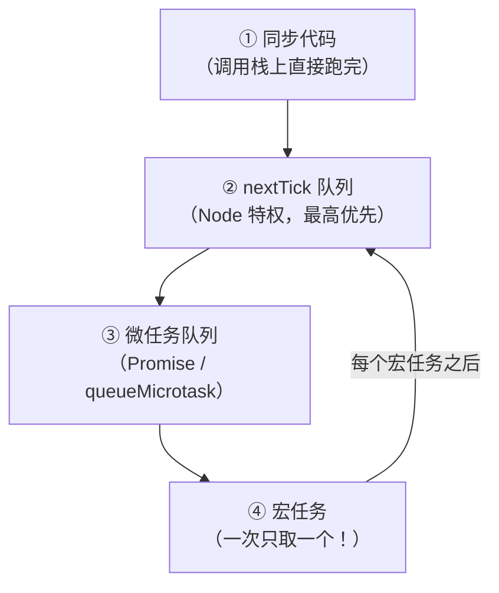

# 第 43 章 · 事件循环

**简体中文** ｜ [English](./43-event-loop.en-US.md)

---

> 第 42 章反复提到"事件循环"——那台让单线程扛住万级并发的引擎（实测 JS 一万并发 27 ms、Python 五千并发 34 ms），究竟是怎么转的？
>
> 本章的**钥匙实验**是那道最经典的面试题：把同步代码、`setTimeout`、`Promise`、`queueMicrotask`、`process.nextTick` 混在一起，输出顺序是什么？实测答案是 **同步 → 同步 → nextTick → Promise → queueMicrotask → setImmediate → setTimeout**——代码里写在第二行的 `setTimeout` 最后才跑，写在倒数第二行的 `nextTick` 反而排在第三。这不是玄学，是**两级队列 + 六个阶段**的必然结果。
>
> 规则只有一句：**取一个任务 → 执行到底（不可抢占）→ 清空微任务 → 取下一个**。实测验证了它的两个推论：两个宏任务各带一个微任务时，顺序是 **A、微A、B、微B** 而非 A、B、微A、微B；在 I/O 回调里 `setImmediate` **永远先于** `setTimeout`（实测），因为前者属于紧跟 poll 的 check 阶段。
>
> 而"清空微任务才继续"这条规则藏着一个真实的生产事故——**微任务饿死宏任务**：实测排了 **20 万个链式微任务、耗时仅 6 ms**，期间那个 `0ms` 的 `setTimeout` **一次都没执行**。递归的 `Promise.then` 能让定时器与 I/O 回调永远等不到，服务表面活着实则假死。
>
> 最后是一个跨语言的发现：**这台引擎的骨架只有三个零件**（就绪队列 + 定时器堆 + I/O 多路复用），本章用 C++、Java、C# 各手工搭了一个——**四种语言给出了完全一致的执行顺序**（1、2、4、3——任务里新排的任务一定排到队尾）。JS 只是把它做进了语言，而 Java/C++/C# 把它留给了库（Netty、Boost.Asio）。

## 1. 学习目标

本章结束后，你将能够：

- 背出并解释事件循环的核心规则：**取一个任务 → 执行到底 → 清空微任务 → 取下一个**；
- 独立推导经典输出顺序题（实测七行输出），说清 `nextTick`/微任务/宏任务的三级优先关系；
- 说明 **libuv 六个阶段**的职责，并解释为何 I/O 回调里 `setImmediate` 先于 `setTimeout`（实测）；
- 复现并解释**微任务饿死宏任务**（实测 20 万微任务期间宏任务零执行）；
- 手工实现一个最小事件循环（三个零件），并理解为何 JS/asyncio 内置而 Java/C++/C# 交给库。

---

## 2. 为什么会出现这个概念

### 单线程如何同时做很多事

第 42 章证明了异步的威力（一条线程扛住万级并发），但留了个问题：**只有一条线程，谁来决定"下一步执行什么"？**

```text
一万个待处理的操作：
  有的在等网络（还没就绪）
  有的定时器到点了（该跑了）
  有的 I/O 刚完成（回调该执行了）
→ 需要一个调度器：不断地问「现在有什么可以跑」，然后跑它
```

### 事件循环：一个永不停止的调度循环

```text
while (还有事情可做) {
    ① 有到期的定时器吗？ → 把回调放进就绪队列
    ② 有完成的 I/O 吗？   → 把回调放进就绪队列（这里可能阻塞等待）
    ③ 依次执行就绪队列里的回调（每个都执行到底）
}
```

**关键设计决策：不可抢占**。一个回调开始执行，就必须跑完才轮到下一个——没有时间片，没有强制切换。

| 这个决策带来 | 收益 | 代价 |
|-------------|------|------|
| 无抢占 | **天然无数据竞争**（第 40/41 章的所有问题消失） | 一个长回调卡死所有人 |
| 单线程 | 无锁、心智负担极低 | 吃不满多核（要靠多进程，第 39 章） |

> **一句话**：事件循环用"**单线程 + 不可抢占**"换来了并发编程最稀缺的东西——**确定性**。代价是它对"长任务"零容忍：第 42 章实测过，一个阻塞调用就让并发退化为串行。

---

## 3. 底层原理

### 钥匙实验：经典输出顺序题

```javascript
console.log("1. 同步代码");
setTimeout(() => console.log("6. setTimeout 0ms"), 0);
setImmediate(() => console.log("7. setImmediate"));
Promise.resolve().then(() => console.log("4. Promise.then"));
queueMicrotask(() => console.log("5. queueMicrotask"));
process.nextTick(() => console.log("3. process.nextTick"));
console.log("2. 同步代码");
```

**实测输出**：

```text
1. 同步代码（栈上直接执行）
2. 同步代码（同步永远先跑完）
3. process.nextTick（Node 特权队列，优先于微任务）
4. Promise.then（微任务）
5. queueMicrotask（微任务，与 Promise 同队列）
7. setImmediate（宏任务：check 阶段）
6. setTimeout 0ms（宏任务：timers 阶段）
```

**三级优先关系**（由实测推出）：



**注意最后两行**：`setImmediate`（第 7 行代码）竟然先于 `setTimeout`（第 2 行代码）——这与 libuv 的阶段顺序有关（见下文）。

### 核心规则：取一个 → 跑到底 → 清空微任务

**实测二**（两个宏任务各带一个微任务）：

```text
宏任务A → ↳A的微任务 → 宏任务B → ↳B的微任务
↑ 不是 A、B、微A、微B，而是 A、微A、B、微B
```

**这条规则是理解一切的钥匙**：宏任务是"一次取一个"，而微任务是"取完就清空"。

### libuv 的六个阶段

```text
   ┌─────────────┐
┌─>│   timers    │  setTimeout / setInterval 到期回调
│  ├─────────────┤
│  │   pending   │  上一轮延后的系统回调（如 TCP 错误）
│  ├─────────────┤
│  │ idle/prepare│  内部使用
│  ├─────────────┤      ┌───────────────┐
│  │    poll     │<─────┤  I/O 事件到达  │  ⭐ 必要时在这里阻塞等待
│  ├─────────────┤      └───────────────┘
│  │    check    │  setImmediate 回调
│  ├─────────────┤
└──┤    close    │  close 事件（socket.on('close')）
   └─────────────┘
   每个阶段之间、每个回调之后，都会清空 nextTick + 微任务队列
```

**实测验证阶段顺序**（在 I/O 回调内部注册两个定时器）：

```text
setImmediate（本轮的 check 阶段，紧跟 poll）← 先跑
setTimeout（下一轮的 timers 阶段）← 后跑
```

**为什么 I/O 回调里 `setImmediate` 一定更快**：I/O 回调运行在 **poll 阶段**，而 check 阶段就在 poll 之后——`setImmediate` 本轮就能执行；`setTimeout` 则要等到**下一轮**的 timers 阶段。

（而在主模块里，`setTimeout(0)` 与 `setImmediate` 的顺序**是不确定的**——取决于进程启动到进入循环耗时多久，这也是本章实测中它们顺序"反常"的原因。）

### 钥匙实验二：微任务饿死宏任务

```javascript
setTimeout(() => (macroRan = true), 0);       // 宏任务：0ms 后就该跑
function greedyMicrotask() {
  microCount++;
  if (microCount === 200_000) { /* 检查 */ return; }
  Promise.resolve().then(greedyMicrotask);    // 微任务里再排微任务
}
greedyMicrotask();
```

**实测输出**：

```text
排完 200000 个微任务、耗时 6 ms 之后，
那个 0ms 的 setTimeout 执行了吗: false ❌
```

**微任务队列必须彻底清空才轮到宏任务**——链式微任务无限延长这个队列，宏任务就永远排不上。

**这是真实的生产事故形态**：

```text
递归的 Promise.then / 递归的 async 调用
→ 微任务队列永不为空
→ 定时器不触发、I/O 回调不执行、健康检查超时
→ 进程 CPU 100%、内存正常、但对外完全无响应（假死）
```

**对比**：Node 对 `process.nextTick` 有部分保护（`--max-tick-depth` 历史遗留），但**微任务队列没有任何深度限制**。有趣的是数据库反而做了兜底——SQLite 的 `SQLITE_MAX_TRIGGER_DEPTH` 默认 1000（本章 SQL 节）。

### 引擎的三个零件

本章用 C++、Java、C# 各手工搭了一个事件循环，它们的骨架完全一致：

```text
① 就绪队列（FIFO）        : 立刻可以跑的回调
② 定时器堆（小顶堆）      : 按到期时间排序，取最近的
③ I/O 多路复用            : epoll(Linux)/kqueue(macOS)/IOCP(Windows) —— 唯一「睡觉」的地方
```

**循环体**：

```text
① 算出最近定时器的到期时间 → 用它当 select 的 timeout
② selector.select(timeout) —— 阻塞等 I/O（唯一睡觉的地方）
③ 把就绪的 I/O 回调 + 到期的定时器回调放进就绪队列
④ 依次执行就绪队列里的所有回调（每个执行到底）
```

**四种语言的实测输出完全一致**：

```text
1. 第一个任务
2. 第一个任务的剩余部分（不可抢占，必须跑完）
4. 第二个任务
3. 任务里排的新任务（排到队尾）
```

**注意 3 排在 4 后面**——任务里新排的任务一定排到队尾，这是 FIFO 队列的必然结果，也是"公平"的来源。

---

## 4. JavaScript

事件循环是 JS 的**核心运行时模型**——本章的两个钥匙实验都来自它。

### 两级队列（实测七行输出）

| 队列 | 谁进来 | 何时清空 |
|------|--------|---------|
| **nextTick 队列** | `process.nextTick`（Node 独有） | 每个阶段/回调之后，**最先** |
| **微任务队列** | `Promise.then`、`queueMicrotask`、`await` 之后 | 紧随 nextTick 之后，**全部清空** |
| **宏任务队列** | `setTimeout`、`setImmediate`、I/O 回调 | 每轮**只取一个** |

**浏览器与 Node 的差异**：

```text
浏览器: 没有 process.nextTick、没有 setImmediate
        宏任务还包括 UI 渲染、requestAnimationFrame（在微任务之后、下一帧之前）
Node:   有 nextTick 特权队列；宏任务按 libuv 六阶段细分
```

### 微任务饿死宏任务（实测）

```text
排完 200000 个微任务、耗时 6 ms 之后，那个 0ms 的 setTimeout 执行了吗: false
```

### I/O 回调里的确定顺序（实测）

```text
setImmediate（本轮的 check 阶段）← 先跑
setTimeout（下一轮的 timers 阶段）← 后跑
```

### 三条实用推论

```text
① 想「尽快但让出一次」→ queueMicrotask（比 setTimeout(0) 快得多）
② 想「下一轮循环再跑」→ setImmediate（Node）/ setTimeout(0)（浏览器）
③ 想「插队到所有微任务之前」→ process.nextTick（Node 特权，慎用）
```

> **注意事项**：`process.nextTick` 的递归同样会饿死一切（且它比微任务优先级更高，更危险）；浏览器里长任务会阻塞渲染（Long Task > 50 ms 会被 Lighthouse 标红）；用 `scheduler.yield()`（新 API）或 `setTimeout(0)` 主动切分长任务。

---

## 5. Python

`asyncio` 的循环与 JS **同构但更简单**——它只有一级队列。

### 执行顺序（实测）

```text
1. 同步代码
3. call_soon（就绪队列）
2. 协程被调度（也在就绪队列里）
4. await sleep(0) 之后
5. call_later(0)（定时器队列）
```

### 与 JS 的关键差异：没有微任务

```text
JS:      宏任务队列 + 微任务队列（两级，微任务优先级更高）
asyncio: 只有一个就绪队列（_ready）+ 一个定时器堆（_scheduled）
→ asyncio 没有「微任务饿死宏任务」的问题（所有回调平权排队）
→ 但同样有「一个长回调卡死整个循环」的问题
```

**这是 asyncio 相对 JS 的一个设计优势**：单级队列意味着**所有回调公平排队**，不存在某类任务能无限插队饿死另一类。代价是失去了"微任务"这种精细的优先级控制。

### 循环的真身（实测）

```text
本机 selector = KqueueSelector（macOS 上是 kqueue，Linux 上是 epoll）
循环体: ① 算出最近的定时器到期时间
        ② selector.select(timeout) —— 阻塞等 I/O（这是唯一睡觉的地方）
        ③ 把就绪的 I/O 回调 + 到期的定时器回调放进就绪队列
        ④ 依次执行就绪队列里的所有回调
```

### 阻塞回调卡死循环（实测）

```text
3 个 await sleep(0.05) 并发: 51 ms ✅
3 个阻塞回调:               201 ms（含 200ms 等待，实际串行了 150ms）❌
```

### 调试模式：生产排查的第一工具（实测）

```python
loop.set_debug(True)
loop.slow_callback_duration = 0.02      # 超过 20ms 的回调会告警
```

**实测输出**（真的抓到了）：

```text
Executing <Handle main.<locals>.<lambda>() at main.py:57 created at main.py:57> took 0.035 seconds
```

**这是 Python 异步排障最有效的手段**——它会直接指出哪一行的回调跑得太久（也就是"谁在卡循环"）。生产环境可用 `PYTHONASYNCIODEBUG=1` 开启。

> **注意事项**：一个线程只能有一个运行中的循环；`asyncio.run()` 创建循环并在结束时关闭；`loop.run_in_executor()` 把阻塞活儿丢给线程池（唯一正确的兜底方式）；`uvloop`（基于 libuv 的替代实现）能显著提升吞吐。

---

## 6. Java

Java **没有内置事件循环**——这是它与 JS/Python 最大的模型差异。

### 手工搭一个（实测）

```java
BlockingQueue<Runnable> tasks;    // 就绪队列
DelayQueue<DelayedTask> timers;   // 定时器队列
while (running) {
    while ((due = timers.poll()) != null) due.task.run();   // ① 到期定时器
    Runnable task = tasks.poll(5, MILLISECONDS);            // ② 普通任务
    if (task != null) task.run();                           // ③ 执行到底
}
```

**实测输出**（与 JS/C++/C# 完全一致）：

```text
1. 第一个任务（线程 event-loop）
2. 第一个任务的剩余部分（不可抢占，必须跑完）
4. 第二个任务
3. 任务里排的新任务（排到队尾）
5. 延时任务（定时器队列）
```

### 阻塞任务卡死循环（实测）

```text
3 个各阻塞 30ms 的任务: 105 ms（串行 ❌ 单线程循环被占死）
→ Netty 的铁律：EventLoop 线程上绝不做阻塞操作（丢给业务线程池）
```

### Netty 的模型：多个事件循环

```text
bossGroup   : 1 个循环，只负责 accept 新连接
workerGroup : N 个循环（N = 核数×2），每个绑定一条线程
一个连接固定归属一个循环 → 该连接的所有事件都在同一条线程上
→ 单个连接内无数据竞争（与 JS 同款收益），整体又能吃满多核
```

**这是对 JS 单循环模型的重要改进**：既保留了"单个连接内无竞争"的心智优势，又通过多个循环吃满多核。Vert.x、Undertow、以及 Nginx 的多 worker 模型都是同一思路。

### Java 的另一条路（第 44 章预告）

```text
事件循环模型: 少量线程 + 回调/异步 → 高吞吐，但代码风格被改变
虚拟线程模型: 海量廉价线程 + 阻塞代码 → 高吞吐，且代码风格不变
→ Java 21+ 的新项目可以不再需要 Netty 式的事件循环编程
```

> **注意事项**：Netty 的 `EventLoop` 线程上执行阻塞操作是最常见的性能事故；`ChannelHandler` 里的耗时逻辑应提交到 `DefaultEventExecutorGroup`；Swing/JavaFX 的 EDT（事件分发线程）是 UI 版的事件循环，同样不能阻塞。

---

## 7. C++

C++ 同样没有内置事件循环——但**五十行就能搭一个**（实测）。

### 三个零件的最小实现（实测）

```cpp
std::queue<std::function<void()>> ready_;                                // ① 就绪队列
std::priority_queue<Timer, std::vector<Timer>, std::greater<>> timers_;  // ② 定时器小顶堆
// ③ I/O 多路复用（真实实现需要 epoll/kqueue）
```

**实测输出**（与其他三种语言完全一致）：

```text
1. 第一个任务
2. 第一个任务的剩余部分（不可抢占）
4. 第二个任务
3. 任务里排的新任务（排到队尾）
5. 延时 20ms 的任务
```

### Boost.Asio：C++ 的事实标准

```cpp
io_context ctx;                    // 就是本例的 EventLoop
ctx.post([]{ ... });               // 投递任务
socket.async_read(..., handler);   // 注册 I/O 回调
ctx.run();                         // 跑循环
```

**与 C++20 协程配合**（第 42 章"语言给机制、库给策略"的兑现）：

```cpp
co_await socket.async_read(..., use_awaitable);   // 异步代码终于可读了
```

### 多线程事件循环：`io_context` 可以被多线程 `run()`

```text
单线程 run()   : 与 JS 同款——无数据竞争，但吃不满多核
多线程 run()   : 多条线程从同一个 io_context 取任务 → 吃满多核，但回调可能并发执行
                 → 需要 strand（串行化执行器）来保证特定回调组的顺序
```

**`strand` 是 Asio 的精妙设计**：它让你在多线程循环里划出"逻辑上单线程"的区域——既要多核，又要局部无竞争。

> **注意事项**：`io_context::run()` 在没有任务时会返回（需要 `work_guard` 保活）；异常从回调里抛出会传播到 `run()` 调用处；Qt 的 `QEventLoop`、GLib 的 `GMainLoop` 是 GUI 场景的对应物。

---

## 8. C#

.NET **没有内置事件循环**（控制台/服务端），但有一个更抽象的概念：**同步上下文**。

### 控制台里没有上下文（实测）

```text
控制台程序的 SynchronizationContext = null（直接用线程池）
await 前线程 = 1，await 后线程 = 5（不同）
```

**这解释了第 42 章的一个现象**：`await` 之后可能换线程——因为控制台没有上下文，续体被丢给线程池的任意线程。

### 有上下文的场景

| 场景 | 同步上下文 | `await` 之后回到哪 |
|------|-----------|-------------------|
| 控制台 / ASP.NET Core | `null` | **任意线程池线程**（实测 1 → 5） |
| WinForms / WPF | UI 消息循环 | **一定回到 UI 线程** |
| 旧版 ASP.NET | 请求上下文 | 回到请求上下文 |

**UI 消息循环就是事件循环**：`Application.Run()` 内部就是"取一条 Windows 消息 → 分发 → 取下一条"，与 JS 的循环同构。

### 手工搭一个（实测）

```csharp
class SingleThreadLoop : SynchronizationContext {
    public override void Post(SendOrPostCallback d, object? state) => _queue.Add((d, state));
    public void Run() { foreach (var (cb, state) in _queue.GetConsumingEnumerable()) cb(state); }
}
```

**实测输出**（与其他三种语言一致）：

```text
1. 第一个任务（线程 8）
2. 第一个任务的剩余部分（不可抢占，必须跑完）
4. 第二个任务
3. 任务里排的新任务（排到队尾）
```

**`SynchronizationContext` 就是 .NET 对"事件循环"的抽象**——它把"续体该在哪执行"这件事变成了可替换的策略。

### `ConfigureAwait(false)`：为什么库代码需要它

```text
库代码应该用 ConfigureAwait(false)：
  ① 避免不必要的上下文切换（性能）
  ② 避免 UI 线程死锁（调用方 .Result + 续体要回 UI 线程 → 互等）
```

**这正是第 42 章那个死锁的另一种形态**：UI 线程调用 `.Result` 阻塞自己，而 `await` 的续体又必须回到 UI 线程执行——**循环等待**（第 41 章的死锁四条件）。

### .NET 的选择：线程池而非单线程循环（实测）

```text
JS/asyncio: 一条线程 + 一个循环 → 天然无数据竞争，但吃不满多核
.NET:       线程池 + 工作窃取 → 能吃满多核，但要自己管同步（第 41 章）
当前进程线程数 = 17
```

> **注意事项**：ASP.NET Core 移除了同步上下文（性能考虑），所以 `ConfigureAwait(false)` 在其中意义不大，但库代码仍应保留；`Task.Yield()` 强制让出（实测 1000 次仅 0 ms）；`TaskScheduler` 是比 `SynchronizationContext` 更底层的调度抽象。

---

## 9. SQL

数据库的"事件驱动"有三个层次：**触发器的阶段、递归的深度限制、以及服务端的主循环**。

### 触发器的阶段 = 事件循环的阶段（实测）

```sql
CREATE TRIGGER before_update BEFORE UPDATE ON account ...
CREATE TRIGGER after_update  AFTER  UPDATE ON account ...
```

```text
① 触发器阶段顺序:
   1. BEFORE — 旧值=100，新值=200
   2. AFTER — 已生效=200
```

**与 libuv 六阶段是同一种设计**：把回调挂到确定的时间点上，保证执行顺序可预测。

### 递归触发器 = 微任务链（实测）

```text
② 递归触发器开关: recursive_triggers = 0（0=关闭：触发器内的修改不再触发触发器）
```

**触发器里再改表 → 又触发新的触发器**——与"微任务里再排微任务"完全同构。

### 数据库做了 JS 没做的事：深度限制

```text
③ SQLite 有 SQLITE_MAX_TRIGGER_DEPTH（默认 1000）兜底
   而 JS 的微任务队列没有深度限制——递归 Promise 能让宏任务永远等待
```

**这是本章最有意思的对照**：

| | 递归深度限制 | 后果 |
|---|-------------|------|
| SQLite 触发器 | ✅ 默认 1000 | 超限报错，事务回滚 |
| **JS 微任务** | ❌ **无限制** | **饿死宏任务**（实测 20 万个） |
| Python asyncio | 无微任务概念 | 单级队列，天然公平 |

**数据库的保守设计在这里胜出**——它假设"无限递归是 bug 而非特性"，直接给了硬上限。

### 服务端主循环

```text
④ PostgreSQL backend 主循环: 读命令 → 执行到底 → 回到读命令
   同样的铁律：一条慢查询会占住这个 backend，其他命令只能排队
```

**与事件循环完全同构**——包括那条铁律：**执行到底、不可抢占，所以长任务会阻塞后续**。

### `LISTEN`/`NOTIFY`：把事件驱动延伸到数据库外

```sql
LISTEN channel;   -- 应用订阅
NOTIFY channel;   -- 数据库发布，订阅方的连接收到异步通知
```

**这让应用可以"等数据库的事件"而非轮询**——是构建实时功能（消息推送、缓存失效）的轻量方案。

> **工程提醒**：触发器里做慢操作（尤其是调用外部服务）会拖垮整个事务，与"事件循环里阻塞"是同一类错误；`LISTEN`/`NOTIFY` 的通知在连接断开时会丢失，不能当可靠消息队列用。

---

## 10. 五语言横向对比

### ① 事件循环支持对比

| 特性 | JavaScript | Python | Java | C++ | C# |
|------|-----------|--------|------|-----|-----|
| 内置事件循环 | ✅ **语言核心** | ✅ `asyncio` | ❌ 靠框架 | ❌ 靠库 | ⚠️ 仅 UI/抽象层 |
| 队列层级 | **两级**（宏+微） | 一级（就绪队列） | 自定义 | 自定义 | 自定义 |
| 特权队列 | `process.nextTick`（Node） | 无 | 无 | 无 | 无 |
| 阶段划分 | **libuv 六阶段** | 无（单一循环） | 框架定义 | 库定义 | 无 |
| I/O 多路复用 | libuv（epoll/kqueue/IOCP） | selectors（实测 kqueue） | NIO Selector | epoll/kqueue | IOCP |
| 主流实现 | Node/浏览器 | asyncio/uvloop | **Netty/Vert.x** | **Boost.Asio** | 线程池（非循环） |
| 微任务饿死风险 | ✅ **存在**（实测） | ❌ 无（单级队列） | 看实现 | 看实现 | — |

### ② 钥匙实测一：经典输出顺序

```text
代码顺序: 同步1 → setTimeout → setImmediate → Promise → queueMicrotask → nextTick → 同步2
实际顺序: 同步1 → 同步2 → nextTick → Promise → queueMicrotask → setImmediate → setTimeout
          └─ 同步 ─┘   └ 特权 ┘  └──── 微任务 ────┘   └──────── 宏任务 ────────┘
```

### ③ 钥匙实测二：微任务饿死宏任务

```text
排完 200000 个微任务、耗时 6 ms 之后，那个 0ms 的 setTimeout 执行了吗: false ❌

对照：SQLite 的触发器递归有 SQLITE_MAX_TRIGGER_DEPTH（默认 1000）兜底
      JS 的微任务队列没有任何深度限制
```

### ④ 钥匙实测三：四种语言，同一台引擎

```text
C++ / Java / C# 各手工搭一个事件循环，输出顺序完全一致：
  1. 第一个任务
  2. 第一个任务的剩余部分（不可抢占）
  4. 第二个任务
  3. 任务里排的新任务（排到队尾）

→ 事件循环不是某门语言的特性，而是一个只有三个零件的通用模式
```

### ⑤ 两条设计分歧

**分歧一：内置还是外置**

```text
内置（JS/Python）：语言/标准库直接提供 → 生态统一，所有异步 API 共用一个循环
                   代价：模型被锁定（JS 想要多核只能多进程/worker）
外置（Java/C++/C#）：交给框架与库 → 灵活（Netty 多循环、Asio 多线程 run）
                   代价：生态分裂（Netty 与 Vert.x 的循环互不兼容）
```

**分歧二：要不要分级队列**

```text
分级（JS）：微任务优先于宏任务 → 能表达「尽快但让出一次」的精细语义
            代价：微任务可以饿死宏任务（实测）
不分级（asyncio）：所有回调平权 FIFO → 天然公平，无饥饿
            代价：失去优先级控制（想插队只能自己排在前面）
```

### ⑥ 共同点与差异根源

**共同点**：所有事件循环都是三个零件（就绪队列 + 定时器堆 + I/O 多路复用）；都遵守"取一个 → 执行到底 → 取下一个"；都对阻塞零容忍（四语言实测阻塞让并发退化为串行）；新排的任务都进队尾（四语言实测顺序一致）。

**差异根源**：

- **JS 内置且分级**——它诞生于浏览器，必须处理"渲染、用户输入、网络"多类事件的优先级；
- **Python 内置但单级**——asyncio 是 2014 年的后来者，可以借鉴前人经验做简化；
- **Java 交给框架**——它的核心模型是线程池（第 45 章），事件循环只是 Netty 等框架的选择；
- **C++ 交给库**——符合"标准库只提供机制"的一贯哲学（第 42 章协程同理）；
- **C# 抽象成 SynchronizationContext**——它要同时服务 UI 消息循环与线程池两种模型，于是把"续体在哪执行"抽象成可替换策略。

---

## 11. 底层实现对比

| 运行时 | 事件循环实现 | 关键细节 |
|--------|-------------|---------|
| **V8 + libuv**（Node） | 六阶段循环 + 两级队列 | 微任务在 V8 里（`MicrotaskQueue`），阶段在 libuv 里；`nextTick` 是 Node 加的第三级 |
| **CPython** | `BaseEventLoop` + `selectors` | 实测 `KqueueSelector`；`_ready` 双端队列 + `_scheduled` 堆；`uvloop` 用 libuv 替换后快 2–4 倍 |
| **JVM**（Netty） | `NioEventLoop` = Selector + 任务队列 | 每个 EventLoop 绑定一条线程与一个 Selector；`ioRatio` 控制 I/O 与任务的时间配比 |
| **C++**（Boost.Asio） | `io_context` + reactor（epoll/kqueue）或 proactor（IOCP） | 可多线程 `run()`；`strand` 提供局部串行化 |
| **CLR**（C#） | 无统一循环；`SynchronizationContext` 抽象 | UI 用 Windows 消息循环；服务端用线程池 + IOCP（第 45 章） |

**一个值得记住的分野**：

```text
Reactor 模式（epoll/kqueue，Linux/macOS）：「就绪通知」——告诉你可以读了，你自己去读
Proactor 模式（IOCP，Windows）：           「完成通知」——数据已经读好放你缓冲区了
→ 这是 libuv/Asio 要在跨平台层做大量适配的根本原因
```

---

## 12. 性能分析

### 事件循环的开销

```text
一次任务调度：入队 + 出队 + 一次间接调用 → 纳秒级（实测 C# 1000 次 Task.Yield 仅 0 ms）
一次 selector.select()：系统调用，微秒级（但它同时处理成千上万个 fd）
→ 循环本身几乎不是瓶颈；瓶颈永远是「某个回调跑太久」
```

### 三个真实的性能杀手

```text
① 长回调（实测四语言）：一个 30–100 ms 的同步操作就让所有并发退化为串行
② 微任务链（JS 实测）：20 万个微任务让宏任务零执行
③ 定时器风暴：大量 setInterval 让 timers 阶段每轮都很重
```

### 诊断工具（各语言实测/官方）

| 语言 | 工具 | 作用 |
|------|------|------|
| Python | `loop.set_debug(True)` + `slow_callback_duration` | **实测抓到 0.035 秒的慢回调** |
| Node | `--trace-sync-io`、`perf_hooks` 的 event loop delay | 测量循环延迟（lag） |
| Node | `blocked-at` / `event-loop-lag` 类库 | 生产监控循环阻塞 |
| Java | Netty 的 `ioRatio`、JFR 事件 | 观察 EventLoop 线程占用 |
| C# | `dotnet-counters` 的 ThreadPool 队列长度 | 线程池饥饿（第 42 章实测过） |

### 长任务的切分

```javascript
// ❌ 一次处理 100 万条，循环卡死几百毫秒
for (const item of millionItems) process(item);

// ✅ 分片处理，每片之间让出一次
async function chunked(items, size = 1000) {
  for (let i = 0; i < items.length; i += size) {
    items.slice(i, i + size).forEach(process);
    await new Promise((r) => setTimeout(r, 0));   // 让出，让其他回调有机会跑
  }
}
```

> ⚠️ 惯例提醒：事件循环的性能问题几乎总是"某个回调太久"，而不是循环本身。诊断顺序：先测循环延迟（lag），再定位是哪个回调（Python 的 debug 模式最直接，实测能打出文件名与行号）。

---

## 13. 工程实践

| 场景 | ✅ 推荐 | ❌ 不推荐 | 原因 |
|------|--------|----------|------|
| 循环里的 CPU 密集任务 | worker/线程池/子进程 | 直接跑 | 卡死循环（四语言实测） |
| 处理大数组 | 分片 + 主动让出 | 一次性遍历 | 长任务阻塞所有并发 |
| 需要"尽快执行" | `queueMicrotask` | `setTimeout(0)` | 微任务不用等下一轮 |
| 需要"下轮再跑" | `setImmediate`（Node） | `setTimeout(0)` | 语义明确且更快（实测 I/O 回调内） |
| 递归异步 | 用 `setTimeout(0)` 打断 | 递归 `Promise.then` | 微任务饿死宏任务（实测 20 万个） |
| Netty handler | 阻塞逻辑提交到业务线程池 | 在 EventLoop 上阻塞 | 实测 3 个 30ms 任务串行成 105ms |
| C# 库代码 | `ConfigureAwait(false)` | 默认捕获上下文 | 避免 UI 死锁与无谓切换 |
| Python 排障 | `loop.set_debug(True)` | 猜 | 实测能打出慢回调的文件行号 |
| 多核利用 | 多进程/多循环（Netty） | 指望单循环 | 单循环天生单线程 |
| 数据库触发器 | 只做轻量校验 | 调用外部服务 | 与"循环里阻塞"同类错误 |

### 判断口诀

```text
这个回调会跑多久？
  < 1 ms   → 放心排进循环
  1–50 ms  → 考虑切分或让出
  > 50 ms  → 必须丢给线程池/worker/子进程

想让某段代码"稍后跑"？
  同一轮、尽快      → 微任务（queueMicrotask）
  下一轮            → setImmediate / setTimeout(0)
  别用递归微任务链  → 会饿死一切（实测）
```

---

## 14. 最佳实践

- **循环里只放短任务**：超过几十毫秒的活儿一律外包（worker、线程池、子进程）——四语言实测都证明了长任务的破坏性。
- **切分长循环**：处理大数据集时分片并主动让出，避免单个回调独占循环。
- **警惕递归微任务**：递归的 `Promise.then`/`async` 会饿死宏任务（实测 20 万个微任务期间定时器零执行）——递归异步要用 `setTimeout(0)` 打断。
- **理解你所在的循环**：浏览器（有渲染）、Node（六阶段 + nextTick）、asyncio（单级队列）、Netty（多循环）——规则各不相同。
- **用工具而非猜测**：Python 的 debug 模式实测能直接打出慢回调的位置；Node 用 event loop lag 监控。
- **库代码写 `ConfigureAwait(false)`**（C#）：避免捕获同步上下文，防止调用方死锁。
- **Netty 的铁律**：`EventLoop` 线程绝不阻塞——业务逻辑提交到独立的 `EventExecutorGroup`。
- **触发器保持轻量**（SQL）：与"循环里不阻塞"同一条纪律。

---

## 15. 常见坑

**坑 1 · 以为 `setTimeout(fn, 0)` 会立刻执行**（实测反驳）

```text
实测顺序：同步 → nextTick → 微任务 → …… → setTimeout
它至少要等：当前同步代码跑完 + 所有 nextTick + 所有微任务 + 进入 timers 阶段
```

**如何避免**：想"尽快"用 `queueMicrotask`；`setTimeout(0)` 的语义是"下一轮"而非"立刻"。

**坑 2 · 递归微任务饿死宏任务**（本章钥匙实验）

```javascript
function loop() { Promise.resolve().then(loop); }   // ⚠️ 定时器与 I/O 永远不再触发
```

```text
实测：20 万个微任务期间，0ms 的 setTimeout 执行次数 = 0
```

**如何避免**：递归异步用 `setTimeout(0)`/`setImmediate` 打断；或加计数器强制让出。

**坑 3 · 在事件循环线程上阻塞**（四语言实测）

```text
Python: 3 个阻塞回调 → 串行 150ms
Java:   3 个 30ms 阻塞任务 → 105ms
```

**如何避免**：`run_in_executor`（Python）、业务线程池（Netty）、`worker_threads`（Node）。

**坑 4 · 以为主模块里 `setTimeout(0)` 一定先于 `setImmediate`**

```text
主模块里两者顺序不确定（取决于进程启动耗时）
只有在 I/O 回调内部，setImmediate 才一定更快（实测）
```

**如何避免**：不要依赖这个顺序写逻辑；需要确定顺序时用显式的依赖关系。

**坑 5 · UI 线程死锁**（C#）

```csharp
// UI 线程上：
var result = FooAsync().Result;    // ⚠️ 阻塞 UI 线程
// 而 FooAsync 内部的 await 续体需要回到 UI 线程 → 互等
```

**如何避免**：async all the way（第 42 章铁律）；库代码用 `ConfigureAwait(false)`。

**坑 6 · 触发器里调用外部服务**（SQL）

```sql
CREATE TRIGGER ... BEGIN /* 调用 HTTP 接口 */ END;   -- ⚠️ 拖垮整个事务
```

**如何避免**：触发器只做轻量校验与审计；外部交互走消息队列（或 `LISTEN`/`NOTIFY` 通知应用）。

**坑 7 · 大量 `setInterval` 造成定时器风暴**

```javascript
items.forEach(i => setInterval(() => poll(i), 100));   // ⚠️ 一千个定时器每 100ms 全部到期
```

**如何避免**：合并成一个定时器批量处理；或用指数退避降低频率。

---

## 16. 面试题

**基础**

1. 事件循环的核心规则是什么？为什么说它"不可抢占"？
2. 宏任务与微任务有什么区别？各举三个例子。
3. 为什么单线程的 JS 能同时处理上万个连接？

**中级**

4. **给出一段混合了同步代码、`setTimeout`、`Promise`、`queueMicrotask`、`process.nextTick` 的程序，说明输出顺序及原因。**
5. 为什么在 I/O 回调里 `setImmediate` 一定先于 `setTimeout`？主模块里呢？
6. **什么是"微任务饿死宏任务"？请写出一段会触发它的代码，并说明后果。**

**高级**

7. **手工实现一个事件循环需要哪三个零件？为什么"新排的任务进队尾"很重要？**
8. asyncio 为什么没有微任务饥饿问题？它的单级队列有什么代价？
9. Netty 的多 EventLoop 模型如何同时获得"无数据竞争"与"吃满多核"？

---

## 17. 练习

**基础**

1. 复现钥匙实验：写一段混合任务的代码，先预测输出顺序再运行验证。
2. 复现"两个宏任务各带一个微任务"的实验，验证顺序是 A、微A、B、微B。
3. 在 I/O 回调内部对比 `setImmediate` 与 `setTimeout(0)` 的顺序。

**提高**

4. **复现微任务饿死实验**：用递归 `Promise.then` 让 `setTimeout` 永不执行，再用 `setTimeout(0)` 打断修复它。
5. 用 Python 的 `loop.set_debug(True)` 抓出一个慢回调，观察它打印的文件名与行号。
6. 把一个处理 100 万条数据的同步循环改造成分片 + 让出的版本，测量循环延迟的改善。

**挑战**

7. 手工实现一个支持 I/O 的最小事件循环：用 `selectors`（Python）或 `epoll`（C++）加上定时器堆，跑通一个 echo 服务器。
8. 给你的事件循环加上"微任务队列"，复现 JS 的两级调度，并实现一个深度限制来防止饥饿。
9. 用 Netty 写一个 echo 服务器，故意在 handler 里阻塞，用 JFR 观察 EventLoop 线程的占用变化。

---

## 18. 本章总结

**一句话总结**：事件循环的全部规则只有一句——**取一个任务 → 执行到底（不可抢占）→ 清空微任务 → 取下一个**；钥匙实验用七行实测输出钉死了三级优先关系（同步 → `nextTick` → 微任务 → 宏任务），并验证了两个推论：两个宏任务各带微任务时顺序是 **A、微A、B、微B**，I/O 回调里 `setImmediate` **永远先于** `setTimeout`（libuv 的 check 阶段紧跟 poll）；而"清空微任务才继续"藏着真实的生产事故——**20 万个链式微任务仅耗时 6 ms，期间 `0ms` 的 `setTimeout` 一次都没跑**（数据库反而给了兜底：SQLite 的触发器递归深度默认限 1000）；最后，这台引擎只有**三个零件**（就绪队列 + 定时器堆 + I/O 多路复用），本章用 C++/Java/C# 各手工搭了一个，**四种语言输出顺序完全一致**——事件循环不是某门语言的特性，而是一个通用模式：JS/Python 把它做进语言，Java/C++ 把它留给库（Netty/Asio），C# 则抽象成了 `SynchronizationContext`。

**核心知识点**

- **核心规则**：取一个 → 执行到底 → 清空微任务 → 取下一个（"不可抢占"是收益与代价的共同来源）。
- **三级优先**（实测七行）：同步代码 > `process.nextTick` > 微任务 > 宏任务（一次一个）。
- **libuv 六阶段**：timers → pending → idle/prepare → **poll** → check → close；实测 I/O 回调里 `setImmediate` 先于 `setTimeout`。
- **钥匙实验二**（实测）：20 万微任务 6 ms 期间宏任务零执行——递归微任务是服务假死的真凶。
- **三个零件**（四语言实测同构）：就绪队列（FIFO）+ 定时器堆 + I/O 多路复用（epoll/kqueue/IOCP）。
- **asyncio 的差异**：单级队列 → 无饥饿风险，但失去优先级控制；实测 selector 为 `KqueueSelector`。
- **Netty 的改进**：多个循环各绑一条线程 → 单连接内无竞争 + 整体吃满多核。
- **排障工具**（实测）：Python 的 `set_debug(True)` 直接打出慢回调的文件与行号。

**检查清单**

- [ ] 我能独立推导混合任务的输出顺序并说明原因。
- [ ] 我能解释为什么 I/O 回调里 `setImmediate` 更快。
- [ ] 我能写出一段饿死宏任务的代码，并知道如何修复。
- [ ] 我能说出事件循环的三个零件与循环体的四个步骤。
- [ ] 我知道各语言的事件循环排障工具。

**下一章预告**：本章的事件循环让单线程扛住了万级并发，代价是**编程模型被改变**——回调、`async` 传染、"绝不阻塞"的纪律（第 42 章实测过这些代价）。有没有可能**既要异步的性能，又要同步代码的可读性**？有——**协程**：把"暂停与恢复"从编译器改写（C# 状态机）下沉为**运行时能力**，让一条真实线程上跑成千上万个"看起来在阻塞"的执行流。第 44 章将实测：Java 21 的虚拟线程如何让 `Thread.sleep()` 自动变成"让出"、Go 的 goroutine 为什么能开百万个、Python 的 `greenlet` 与 C++20 协程的 `co_await` 各自如何实现，以及第 32 章那句"帧可以住在堆上"最彻底的一次兑现。

---

## 19. 延伸阅读

- <a href="https://en.wikipedia.org/wiki/Event_loop" target="_blank" rel="noopener">Wikipedia：Event loop</a> — 事件循环概念综述。
- <a href="https://en.wikipedia.org/wiki/Reactor_pattern" target="_blank" rel="noopener">Wikipedia：Reactor pattern</a> — 事件循环背后的设计模式。
- <a href="https://nodejs.org/en/learn/asynchronous-work/event-loop-timers-and-nexttick" target="_blank" rel="noopener">Node.js 官方 · 事件循环、定时器与 nextTick</a> — 六阶段的权威说明（本章实测的依据）。
- <a href="https://developer.mozilla.org/en-US/docs/Web/JavaScript/Event_loop" target="_blank" rel="noopener">MDN · 事件循环</a> — 浏览器视角的事件循环模型。
- <a href="https://html.spec.whatwg.org/multipage/webappapis.html#event-loops" target="_blank" rel="noopener">HTML 规范 · Event loops</a> — 浏览器事件循环的规范定义（含渲染时机）。
- <a href="https://docs.python.org/3/library/asyncio-eventloop.html" target="_blank" rel="noopener">Python 文档 · 事件循环</a> — asyncio 循环 API 与调试模式（本章实测所用）。
- <a href="https://docs.libuv.org/en/v1.x/design.html" target="_blank" rel="noopener">libuv 文档 · 设计概览</a> — Node 事件循环底层库的官方设计文档。
- <a href="https://netty.io/wiki/user-guide-for-4.x.html" target="_blank" rel="noopener">Netty 用户指南</a> — Java 事件循环框架的官方文档。
- <a href="https://www.boost.org/doc/libs/latest/doc/html/boost_asio/overview.html" target="_blank" rel="noopener">Boost.Asio · 概览</a> — C++ 事件循环（io_context/strand）的官方说明。
