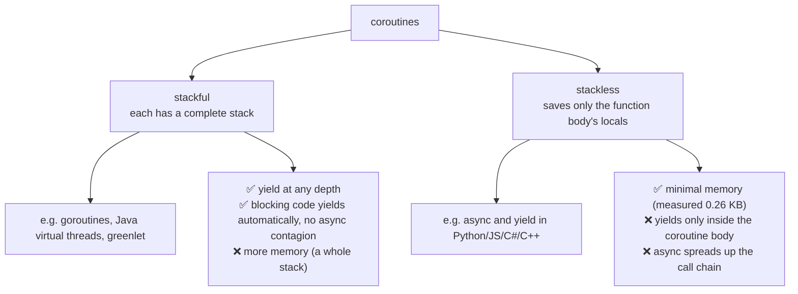

# Chapter 44 · Coroutines

[简体中文](./44-coroutine.md) ｜ **English**

---

> Chapter 43's event loop let one thread carry ten-thousand concurrency, at the price of **a changed programming model** — callbacks, `async` contagion, and the "never block" discipline. Could we have **asynchrony's performance with synchronous code's readability**?
>
> The answer is the **coroutine** — definable in one sentence: **a function that can pause midway and later resume in place**. Implementing it requires breaking exactly one of Chapter 32's laws ("function returns, frame dies"): **leave the frame on the heap**.
>
> This chapter's **key experiment** builds a thirty-line coroutine scheduler in five languages — and **all five produce identical output** (coroutine A step 0 → coroutine B step 0 → A 1 → B 1 → A 2): two execution flows advancing alternately on one thread, with no threads, no locks, and no data races. That proves coroutines are not one language's feature but the inevitable product of the "pause/resume" capability.
>
> Evidence that frames live on the heap is everywhere: Python measured a generator's `gi_frame` holding `{'name': 'A', 'n': 3, 'total': 1}`; C# measured the iterator's true identity as the compiler-generated state machine class `Program+<Counter>d__0`; C++ measured coroutine locals living in a **coroutine frame** allocated by `operator new`. **This is the most complete payoff yet of Chapter 32's "frames may live on the heap."**
>
> And the scale it buys is an order-of-magnitude rout: measured, **100,000 suspended JS generators occupy 25.3 MB — 0.26 KB each, 3,948× smaller than one OS thread (1 MB)**; C# 0.33 KB each (3,072× smaller); Python 2.2 KB each. That is the entire reason one can open a hundred thousand coroutines but not ten thousand threads.
>
> Finally, the divide between two roads: **stackless coroutines** (Python/JS/C#/C++'s `async`/`yield`) have the compiler rewrite functions — minimal memory, but `async` spreads; **stackful coroutines** (Go's goroutines, Java 21's virtual threads) have the runtime relocate entire stacks — the code style never changes and existing libraries benefit immediately. Java measured this machine's 17 as unsupported, but the mechanism deserves a full account: **on blocking, stack frames are copied from the platform thread's stack to the heap, and the platform thread immediately runs something else**.

## 1. Learning Objectives

By the end of this chapter, you will be able to:

- Define a coroutine in one sentence (**a function that can pause and resume**) and state its only difference from an ordinary function;
- Explain why coroutines must **keep their frames on the heap**, and point to that heap object in three languages (Python's `gi_frame`, C#'s state-machine class, C++'s coroutine frame — all measured);
- Hand-build a coroutine scheduler (measured identical across five languages) and understand why cooperative concurrency is inherently lock-free;
- Quantify coroutines' scale advantage from measurements (**0.26–2.2 KB each vs a thread's 1 MB, a 3,000–4,000× gap**);
- Distinguish **stackful from stackless** coroutines and state each one's price (`async` contagion vs runtime complexity).

---

## 2. Why This Concept Exists

### What Chapters 42/43 left behind

```text
Asynchrony delivered performance (Ch. 42 measured: one thread, ten-thousand concurrency)
but took away readability:
  ① functions acquired colors (async spreads up the call chain)
  ② the ecosystem split (Python's requests vs httpx)
  ③ "never block" became a discipline (Ch. 43 measured concurrency degrading to serial)
```

**The root problem**: we want an execution flow to "yield the thread while waiting," but an ordinary function cannot — once started, it can only run to `return`.

### Coroutines: letting a function come out midway

```text
Ordinary function: call → run straight to return → the frame is destroyed, locals gone (Ch. 32)
Coroutine:         call → run to yield → the frame【stays on the heap】→ resume in place next time
```

**That is the only difference** — but the capability it unlocks is revolutionary:

| With pause/resume | You can build |
|-------------------|---------------|
| Pause and yield the thread | asynchronous I/O (Ch. 42), event loops (Ch. 43) |
| Pause after producing a value | generators, streaming, lazy evaluation |
| Pause and switch to another coroutine | cooperative multitasking (this chapter's key experiment) |

> **In one sentence**: coroutines break "a function must run to completion in one go" with a single change — **moving the frame from the stack to the heap**. Chapter 32 said heap frames are the physical precondition for asynchrony and coroutines; this chapter is the full payoff.

---

## 3. How It Works

### Definition and its cost

```text
A coroutine = a function that can pause and resume
The precondition = its state (locals, which line it reached) must survive that pause
                 → the frame cannot die with the function's return → it must live on the heap
```

**Measured evidence in three languages**:

| Language | The heap object | What was measured |
|----------|----------------|-------------------|
| **Python** | a generator's `gi_frame` | `{'name': 'A', 'n': 3, 'total': 1}` — locals, plain as day |
| **C#** | a compiler-generated state machine class | `Program+<Counter>d__0` (kin to Chapter 42's `<ShowStateMachine>d__4`) |
| **C++** | the coroutine frame | the compiler allocates it with `operator new` (Chapter 33's heap costs) |

### The key experiment: a thirty-line coroutine scheduler

```python
def scheduler(tasks):
    queue = list(tasks)
    while queue:
        task = queue.pop(0)
        try:
            print(next(task))      # resume it, run to the next yield
            queue.append(task)     # not finished? back to the tail
        except StopIteration:
            pass                   # this coroutine is done
```

**All five languages measured identical output**:

```text
coroutine A: step 0, total 0
coroutine B: step 0, total 0
coroutine A: step 1, total 1
coroutine B: step 1, total 1
coroutine A: step 2, total 3
```

**Three key observations**:

```text
① two execution flows advance alternately — "concurrency" on one thread
② no threads, no locks — every problem from Chapters 40/41 is absent
③ the scheduler is "take one → advance one step → back to the tail" — isomorphic to Chapter 43's event loop
```

**This also explains "cooperative"**: a coroutine yields only by **choice**, and the scheduler cannot interrupt it (unlike an OS thread's preemptive scheduling). The benefit is no contention; the price is that one non-yielding coroutine starves everyone (as with Chapter 43's long callbacks).

### Scale: why a hundred thousand is feasible

**Measured** (memory held by suspended coroutines/generators):

| Language | Count | Total | Each | Versus a thread (1 MB) |
|----------|-------|-------|------|------------------------|
| **JavaScript** | 100,000 | 25.3 MB | **0.26 KB** | **3,948× smaller** |
| **C#** | 100,000 | 32.6 MB | **0.33 KB** | **3,072× smaller** |
| **Python** | 50,000 | 109.2 MB | 2.2 KB | 465× smaller |

**Against Chapters 39/40's thread data**:

```text
Threads:    12.2 μs to create + 1 MB of reserved stack
            → 50,000 threads need 610 ms of creation + 50 GB of stack (extrapolated; simply impossible)
Coroutines: a few microseconds to create + 0.26–2.2 KB
            → 50,000 coroutines measured finishing in 1341 ms (including a 10 ms sleep), 109 MB peak, thread count 1
```

**Why coroutines can be this small**: a thread must reserve a whole stack (for calls of any depth), while a stackless coroutine **saves only that function body's locals** — usually tens to hundreds of bytes.

### Two schools: stackful vs stackless



**This divide explains Chapter 42's colored-function problem**:

```text
Stackless: the compiler rewrites only functions marked async/yield → unmarked functions cannot yield → contagion
Stackful:  the runtime can relocate stacks of any depth → any function can yield → no contagion
```

### How stackful coroutines work: mounting and unmounting

Taking Java 21's virtual threads (**measured unsupported on this machine's Java 17, but the mechanism is worth explaining**):

```text
A virtual thread【mounts】onto a platform thread (the carrier thread) while running
On blocking (sleep / socket read):
  ① the JVM copies its【stack frames from the platform thread's stack to the heap】← the crucial step
  ② the platform thread is【unmounted】and immediately runs another virtual thread
  ③ when the I/O is ready, the frames are copied back and execution continues
→ to your code, Thread.sleep() still looks like blocking; in reality it yields
```

**This is the answer to "asynchrony's performance with synchronous readability"** — not a line of code changes, and the runtime performs the yield for you.

---

## 4. JavaScript

JS's `function*` generators are `async/await`'s **foundation** — measurements here unearthed that relationship.

### Generators: pause and resume (measured)

```javascript
function* counter(name, n) {
  let total = 0;
  for (let i = 0; i < n; i++) { total += i; yield `${name}: step ${i}, total ${total}`; }
}
```

```text
calling a generator function returns: a Generator object (not one line of the body ran)
first next(): A: step 0, total 0
second next(): A: step 1, total 1   ← resumes on the line after yield, with total intact
```

### Bidirectional communication: `yield` goes both ways (measured)

```javascript
const received = yield "awaiting input…";   // yield's value = whatever next(x) sends in
```

```text
first next():         awaiting input…
next("hello") sends:  received: hello
```

**A coroutine and its caller are bidirectional** — this is where it surpasses callbacks: data flows both ways and control passes back and forth.

### `async/await` is "a generator plus an automatic driver" (measured)

Hand-write a driver that awaits each yielded Promise and sends the result back:

```javascript
function drive(genFn) {
  const g = genFn();
  return new Promise((resolve) => {
    (function step(input) {
      const { value, done } = g.next(input);
      if (done) return resolve(value);
      Promise.resolve(value).then(step);   // ← this one line is the essence of await
    })();
  });
}
```

```text
hand-driving a generator to emulate await, result = 3 (1 + 2)
→ async/await merely built this driver into the language (the co library did exactly this)
```

**This is the chapter's most important demystification**: `await` is no magic — it is "yield a Promise plus an automatic driving loop." Before ES2017, the community emulated async/await this way with the `co` library for years.

### Scale, measured

```text
100000 suspended generators: 25.3 MB
about 0.26 KB each — against an OS thread's 1024 KB
→ roughly 3948× smaller, which is why a hundred thousand coroutines is feasible
```

### Async generators: streaming (measured)

```javascript
async function* ticker(n) { for (let i = 1; i <= n; i++) { await sleep(5); yield i; } }
for await (const v of ticker(3)) got.push(v);
```

```text
for await...of received: [1,2,3] (each passed through one await plus one yield)
→ data is produced and consumed together, never fully loaded into memory
```

> **Note**: JS has **no stackful coroutines** — it cannot yield at arbitrary depth (explicit `yield`/`await` required); generators are not thread-safe (irrelevant in single-threaded JS); `yield*` delegates to another generator, the basis of coroutine composition.

---

## 5. Python

Python's generators are among the **earliest and most complete** coroutine implementations — `async` grew directly out of them.

### The frame object is visible and tangible (measured)

```text
its frame object: gi_frame = True (alive on the heap, Chapter 32)
locals inside the frame: {'name': 'A', 'n': 3, 'total': 1}
```

**The book's most direct demonstration of "frames on the heap"** — `gi_frame.f_locals` prints a suspended coroutine's locals outright (Chapter 32 measured that CPython's frames were always heap objects).

### `async` shares generators' machinery (measured)

```text
an async function returns: coroutine (same lineage as generators; Ch. 42 measured cr_frame)
in CPython, async def reuses the generator bytecode machinery (yield from → await)
generators and coroutines share send/throw/close: ['send', 'throw', 'close']
```

**The historical thread**:

```text
Python 2.2  generators (yield)
Python 2.5  generators can receive values (send) → proto-coroutines
Python 3.3  yield from (delegation) → coroutine composition
Python 3.4  asyncio (generator-based coroutines + an event loop)
Python 3.5  the async/await keywords (sugar; the machinery is still generators)
```

### Scale, measured

```text
50000 coroutines: 1341 ms, peak memory 109.2 MB, thread count 1
50000 threads: 610 ms just to create + 50000 MB of stack → simply impossible
→ coroutines about 2.2 KB each, threads 1 MB each — three orders of magnitude apart
```

(Python's 2.2 KB exceeds JS's 0.26 KB because CPython's frame object carries full interpreter state — the price of being introspectable, the same bill as Chapter 30's reflection.)

### Python's coroutine family

| Form | Description |
|------|-------------|
| `yield` | the original pause/resume (measured in ①③) |
| `yield from` | delegate to another generator (the basis of composition) |
| `async/await` | generator machinery + event-loop scheduling (Chapters 42/43) |
| `greenlet` (third-party) | **stackful coroutines**, yielding at any depth |

**`greenlet` is Python's stackful option** — gevent uses it to monkey-patch the standard library's blocking I/O into cooperative form, achieving "async without changing code" (the same idea as virtual threads, delivered by a library).

> **Note**: a generator iterates only once (exhausted, `next()` raises `StopIteration`); with `yield` inside `try/finally`, `close()` raises `GeneratorExit`; `contextlib.contextmanager` (Chapter 37) is implemented with generators — before the `yield` is `__enter__`, after it is `__exit__`.

---

## 6. Java

Java is the only one of the five **without a `yield` keyword** — it chose an entirely different road.

### The price of no `yield` (measured)

```java
static class Counter implements Iterator<String> {
    private int i = 0;          // ← the state machine you are forced to maintain by hand
    private int total = 0;
    public String next() { total += i; return "..." + i++; }
}
```

```text
you can only hand-write an Iterator, promoting i and total to object fields
second next(): A: step 1, total 1   ← state lives in the object, not on the stack
↑ other languages have the compiler generate this state machine; Java makes you write it
```

**Against C#'s measurement**: C# writes `yield return` and the compiler generates `Program+<Counter>d__0`; Java requires promoting every local into a field by hand. **Exactly the difference between "the compiler does it" and "you do it."**

### Why Java never added `yield`

```text
Because it chose another road: rather than make functions pausable, make threads cheap
→ virtual threads (Java 21+): thousands of virtual threads on one real thread
→ blocking code yields automatically, no async/yield rewrite (Chapter 42's contagion does not arise)
```

### Virtual-thread availability (measured)

```text
❌ this machine's Java 17.0.18 does not support virtual threads (21+ required)
```

**The control group: platform threads' weight (measured)**:

```text
5000 platform threads: 155 ms (about 31.0 μs each)
each reserves ~1 MB of stack → 1000000 would reserve 1000 GB of address space (Ch. 31)
were virtual threads available: the same 5000 would take milliseconds, a few hundred bytes each
```

### How virtual threads work

```text
A virtual thread【mounts】onto a platform thread (the carrier) while running
On blocking (sleep/socket read):
  ① the JVM copies its【stack frames from the platform thread's stack to the heap】← the crucial step
  ② the platform thread is【unmounted】and immediately runs another virtual thread
  ③ when I/O is ready, the frames come back from the heap and execution continues
→ to your code, Thread.sleep() still looks like blocking; in reality it yields
```

**This is the most dramatic payoff of Chapter 32's "frames may live on the heap"**: not decided at compile time (like C#'s state machine) but **relocated dynamically at runtime** — copied to the heap when yielding, copied back when resuming.

### Two traps with virtual threads (Java 21+)

```text
① synchronized "pins" the carrier thread — the virtual thread cannot unmount
   → use ReentrantLock instead (Chapter 41 covered their differences)
② ThreadLocal explodes memory across a million virtual threads
   → use ScopedValue (a Java 21 preview feature)
```

> **Note**: virtual threads suit I/O-bound work; CPU-bound work still needs a platform thread pool (Chapter 45); `Executors.newVirtualThreadPerTaskExecutor()` is the standard usage ("thread per task" becomes viable again); Kotlin's coroutines are a different scheme (compiler rewriting plus suspend functions — the stackless school).

---

## 7. C++

C++20 finally got coroutine keywords — but **the standard library shipped no supporting code** (Chapter 42's conclusion, confirmed again).

### `co_yield`: pause and resume (measured)

```cpp
Generator<std::string> counter(std::string name, int n) {
    int total = 0;
    for (int i = 0; i < n; ++i) { total += i; co_yield "..."; }
}
```

```text
after creating the coroutine, not one line of the body has run (initial_suspend pauses immediately)
second resume: A: step 1, total 1   ← resumes after the co_yield, with total intact
locals i and total live in the【coroutine frame】— allocated on the heap by the compiler (Chapter 32)
```

### C++'s peculiarity: you write `promise_type` yourself (measured)

```text
the Generator<T> above needs 40 lines of boilerplate; the standard library provides none
you must implement: get_return_object / initial_suspend / final_suspend
                    yield_value / return_void / unhandled_exception
→ only C++23 added std::generator, finally retiring this boilerplate
```

**This is C++ coroutines' most off-putting aspect**: the language provides a complete mechanism (more flexible than others' — custom allocators, scheduling policies, exception handling) but no ready-made type. Chapter 42 said "the language provides mechanism, libraries provide policy" — this is the second confirmation.

### The coroutine frame: the stack frame really moved to the heap

```text
the compiler packs a coroutine's locals, parameters, and suspend-point index into a frame
the frame is allocated with operator new by default (Chapter 33's allocation costs)
handle.resume()  : resume execution from the frame
handle.destroy() : destroy the frame (done in the destructor here — RAII, Chapter 37)
```

**Note that `handle.destroy()` sits in the destructor** — Chapter 37's RAII applied to coroutines: a coroutine frame is also a resource needing deterministic release.

### HALO: C++'s exclusive "coroutines without allocation"

```text
if the compiler can prove the coroutine outlives nothing beyond its caller, the frame goes【on the stack】
→ zero-heap-allocation coroutines (HALO: Heap Allocation eLision Optimization)
→ a C++ exclusive over JS/Python/C# (whose coroutines must allocate on the heap)
```

**Another expression of the zero-overhead philosophy**: other languages' coroutines always pay one heap allocation (Chapter 33 measured 15.8 ns), while C++ can skip it entirely when safety is provable.

### Three keywords

```text
co_yield  : produce a value and pause (generators, this section's focus)
co_await  : await an awaitable (asynchrony, Chapter 42)
co_return : end the coroutine and return
Any of these in a body makes that function a coroutine (no special marker — unlike the async keyword)
```

**A notable design**: C++ needs no `async` annotation; the compiler recognizes `co_*`. **Which means a signature cannot tell you whether a function is a coroutine** (a mixed blessing: callers need no changes, but readability suffers).

> **Note**: dangling reference parameters are a common trap (the frame stores parameter copies, and a referenced temporary may already be destroyed); `co_await`'s operand must satisfy the Awaitable concept; Boost.Asio and cppcoro provide production-ready coroutine types (mentioned in Chapter 43).

---

## 8. C#

C#'s iterators (C# 2.0, 2005) **paved the way for async** — measurements here unearthed that historical link.

### `yield return`: a compiler-generated state machine (measured)

```text
calling the iterator method returns: <Counter>d__0 (not one line of the body ran)
its true identity: Program+<Counter>d__0
↑ a compiler-generated state machine class — locals became its fields (on the heap, Chapter 32)
```

### The same machinery as async (measured output)

```text
yield return  → the compiler generates an IEnumerator state machine (a switch inside MoveNext)
await         → the compiler generates an IAsyncStateMachine (MoveNext again)
→ Ch. 42 measured <ShowStateMachine>d__4 — the same compiler machinery
→ C# 2.0's iterators (2005) paved the road for C# 5.0's async (2012)
```

**A clear technological lineage**: C# first built "the compiler rewrites a method into a state machine" for iterators, then applied the same machinery to `async` seven years later. Chapter 42's measured `<ShowStateMachine>d__4` and this chapter's `<Counter>d__0` share a naming convention because they share a compiler mechanism.

### Scale, measured

```text
100000 suspended iterators: 32.6 MB
about 0.33 KB each — against an OS thread's 1024 KB
→ roughly 3072× smaller
```

### Async iterators: `yield` plus `await` (measured)

```csharp
static async IAsyncEnumerable<int> Ticker(int n) {
    for (int i = 1; i <= n; i++) { await Task.Delay(5); yield return i; }
}
await foreach (var v in Ticker(3)) got.Add(v);
```

```text
await foreach received: [1, 2, 3]
→ IAsyncEnumerable<T>: the standard streaming form (JS's async function* counterpart)
```

### Unity's coroutines: iterators' classic application

```csharp
IEnumerator MyCoroutine() {
    yield return new WaitForSeconds(1);   // pause one second
    yield return null;                    // pause until the next frame
}
```

**The engine calls `MoveNext()` once per frame, producing "execution flows across frames"** — precisely the commercial-grade version of this chapter's hand-built scheduler. An entire generation of Unity developers learned coroutines through it.

> **Note**: C# has **no stackful coroutines** (no yielding at arbitrary depth); an iterator method's argument validation is deferred to the first `MoveNext()` (a common trap — split it into two methods); `IAsyncEnumerable` supports cancellation via `WithCancellation`.

---

## 9. SQL

The database's coroutine is called a **cursor** — a query that can pause and resume.

### A cursor is a pausable, resumable query (measured)

```text
① an ordinary query: returns all 1000 rows at once (fully loaded into memory)
   a cursor: FETCH resumes execution, producing one row then pausing — isomorphic to yield
```

**A correspondence table**:

| Concept | Programming languages | Databases |
|---------|----------------------|-----------|
| Return everything at once | an ordinary `return` | `SELECT *` |
| Produce one, then pause | `yield` | a cursor's `FETCH` |
| The saved state | a frame/state machine (heap) | the cursor position (database side) |
| Streaming | generators / `IAsyncEnumerable` | server-side cursors |

### Pagination is a hand-rolled cursor (measured)

```text
② page 1: student-1, student-2, student-3
   page 2: student-4, student-5, student-6
   ↑ each "resume" continues from the last position — but OFFSET rescans the preceding rows (slow)

③ keyset page 1 (id > 0): student-1, student-2, student-3
   keyset page 2 (id > 3): student-4, student-5, student-6
   ↑ remembering "where we were" rather than "how many to skip" — the correct cursor posture
```

**The difference between `OFFSET` and keyset pagination is exactly the difference between "re-execute" and "resume"**: `OFFSET 1000000` rescans a million rows before returning anything (like rerunning a coroutine from the top), while keyset pagination's `WHERE id > lastId` continues from the breakpoint (a genuine resume).

### Why cursors matter: memory

```text
④ streaming: a hundred million rows cost one row's memory with a cursor
   the counterpart of JS's async function* / C#'s IAsyncEnumerable / Python's generators
```

### Server-side vs client-side cursors

```text
Server-side (DECLARE CURSOR): state lives in the database process (Ch. 39: one process per connection)
Client-side:                  the driver pulls every row locally and hands them over one by one (a fake cursor)
→ large result sets require server-side cursors, or "streaming" is streaming in name only
```

**A real production trap**: many ORMs' "iterate the result set" is a client-side cursor — it looks like streaming while a hundred million rows already sit in memory. PostgreSQL needs an explicit `DECLARE CURSOR` or a configured `fetch_size`.

> **Engineering note**: cursors hold database-side resources (Ch. 39: one process per connection), and long-lived open cursors drag down an instance; prefer keyset pagination over `OFFSET` in ORMs; recursive CTEs (Ch. 32 measured a million levels without stack overflow) are another "produce-and-resume" pattern.

---

## 10. Cross-Language Comparison

### ① Coroutine capabilities

| Feature | JavaScript | Python | Java | C++ | C# |
|---------|-----------|--------|------|-----|-----|
| Generator syntax | `function*` + `yield` | `yield` | ❌ **none** (hand-written Iterator) | `co_yield` (C++20) | `yield return` |
| Async coroutines | `async/await` | `async/await` | ❌ (`CompletableFuture`) | `co_await` | `async/await` |
| Async generators | `async function*` | `async def` + `yield` | ❌ | third-party | `IAsyncEnumerable` |
| Stackless | ✅ | ✅ | ❌ | ✅ (HALO can stack-allocate) | ✅ |
| **Stackful** | ❌ | `greenlet` (third-party) | ✅ **virtual threads** (21+) | third-party (Boost.Context) | ❌ |
| Where state lives | engine heap object | **`gi_frame`** (measured, visible) | hand-written fields / virtual-thread stack | **coroutine frame** (measured) | **state machine class** (measured `<Counter>d__0`) |
| Memory per coroutine (measured) | **0.26 KB** | 2.2 KB | — (virtual threads: a few hundred bytes) | frame size fixed at compile time | **0.33 KB** |
| Standard-library support | ✅ complete | ✅ complete | — | ❌ **std::generator only in C++23** | ✅ complete |

### ② Key measurement one: five languages, one scheduler

```text
Python / JS / Java / C++ / C# each built a thirty-line coroutine scheduler with identical output:

  coroutine A: step 0, total 0
  coroutine B: step 0, total 0
  coroutine A: step 1, total 1
  coroutine B: step 1, total 1
  coroutine A: step 2, total 3

→ coroutines are not one language's feature but the inevitable product of "pause/resume"
→ the scheduler is "take one → advance one step → back to the tail" — isomorphic to Chapter 43's event loop
```

### ③ Key measurement two: a rout in scale

```text
Memory held by suspended coroutines:
  JavaScript  100,000 = 25.3 MB → 0.26 KB each → 3948× smaller than a thread
  C#          100,000 = 32.6 MB → 0.33 KB each → 3072× smaller
  Python       50,000 = 109.2 MB → 2.2 KB each → 465× smaller

Against Chapters 31/39:
  OS threads: 12.2 μs to create + 1 MB reserved stack
  → 50,000 threads = 610 ms of creation + 50 GB of stack → impossible
  → 50,000 coroutines = measured 1341 ms total, 109 MB, thread count 1
```

### ④ Two design divides

**Divide one: stackful or stackless**

```text
Stackless (Python/JS/C#/C++): the compiler rewrites functions, saving only the needed locals
  ✅ minimal memory (measured 0.26 KB), predictable, optimizable (C++'s HALO even elides allocation)
  ❌ yields only inside the coroutine body → async spreads up the call chain (Ch. 42)
Stackful (Go/Java virtual threads/greenlet): the runtime relocates whole stacks
  ✅ yields at any depth → blocking code yields automatically → no contagion, existing libraries benefit
  ❌ more memory, more runtime complexity, some cases still pin threads (synchronized)
```

**Divide two: compile-time rewriting or runtime relocation**

```text
Compile time (C#'s state machine, C++'s frame): which variables to save is fixed at compile time → efficient, optimizable
                                                price: the function's signature changes (colors)
Runtime (Java's virtual threads):               stacks are copied to the heap only when blocking → zero code changes
                                                price: copying costs, and debugging stacks run deeper
```

### ⑤ Common ground and root causes

**Common ground**: every coroutine's essence is "the frame on the heap" (visible in three measured languages); all coroutines are **cooperative** (they must yield voluntarily and cannot be preempted); the scheduler skeleton is identical (five languages measured with identical output); coroutines are three orders of magnitude smaller than threads (measured 465–3,948×).

**Root causes**:

- **JS's and Python's generators predate async** — so async is "generators plus a driver" (JS measured a hand-built driver working);
- **C#'s iterators paved async's road** — the same compiler machinery seven years apart (measured `<Counter>d__0` and `<ShowStateMachine>d__4` sharing a naming convention);
- **Java skipped `yield`** — with vast amounts of synchronous blocking code, rewriting was too costly, so it relocates stacks at runtime (virtual threads);
- **C++ gives mechanism, not policy** — consistent with zero-overhead philosophy, at the cost of 40 lines of boilerplate (measured) until C++23's `std::generator`;
- **The database's cursor** proves the pattern transcends programming languages — "produce one and pause" is every streaming system's shared answer.

---

## 11. Implementation Comparison

| Runtime | Coroutine implementation | Key details |
|---------|-------------------------|-------------|
| **V8** (JS) | generators compiled to state machines + a heap `JSGeneratorObject` | saves registers and the suspend point; `async` reuses the same machinery plus Promise driving |
| **CPython** | `PyGenObject` holding a `PyFrameObject` (measured `gi_frame`) | frames were already on the heap (Ch. 32) → coroutines needed almost no extra machinery; 3.11+ materializes frames lazily for speed |
| **JVM** (virtual threads) | `Continuation` + stack copying (mount/unmount) | Project Loom; blocking copies frames from the platform stack to the heap; `synchronized` pins the carrier |
| **C++** (native) | a compiler-generated coroutine frame allocated by `operator new` | size fixed at compile time; HALO can elide the allocation; `coroutine_handle` is a raw pointer (destroy manually or wrap in RAII) |
| **CLR** (C#) | a compiler-generated state machine class (measured `<Counter>d__0`) | iterators and async share the machinery; `MoveNext()` contains a switch |

**A distinction worth memorizing**:

```text
CPython had the easiest time — its frames were already on the heap (Ch. 32 measured the f_back chain)
C#/C++ rely on the compiler rewriting functions into state machines — their frames were on the stack
Java relies on the runtime copying stacks — it wanted neither to rewrite functions nor to give up arbitrary-depth yielding
→ three implementation paths, matching three different histories of "where the frame originally lived"
```

---

## 12. Performance Analysis

### Coroutines' three costs

| Cost | Magnitude | Measured/source |
|------|-----------|-----------------|
| Creation | microseconds (one heap allocation) | Chapter 33's 15.8 ns and up |
| Memory each | **0.26–2.2 KB** (stackless) | measured in three languages here |
| Switching | **nanoseconds** (a function call plus state restoration) | no syscall, no context switch |

**Against threads** (Chapters 39/40):

```text
Thread creation: 12.2 μs (10–100× a coroutine's)
Thread memory:   1 MB (465–3948× a coroutine's)
Thread switch:   microseconds (kernel entry, TLB flush, possibly a different core)
```

**Why coroutine switching is so fast**: it is an ordinary function return and call — no kernel entry, no page-table change, no cache flush. That is the fundamental advantage of user-space scheduling over kernel scheduling.

### But coroutines are not a cure-all

```text
① no parallelism: coroutines are cooperative; only one runs at a time on one thread
   → multicore still needs threads/processes (Go's GMP model combines coroutines with threads)
② one non-yielding coroutine starves everyone (as with Chapter 43's long callbacks)
③ stackful coroutines pay for stack copying (visible in extreme Java virtual-thread scenarios)
```

### Where coroutines pay off most

```text
✅ heavy concurrent I/O waiting (web services, crawlers, proxies) — measured ten-thousand concurrency on one thread
✅ streaming (generators save memory; a hundred million rows cost one row)
✅ code needing pause/resume semantics (game logic across frames, state machines, parsers)
❌ CPU-bound work (coroutines don't speed computation)
❌ small concurrency (a few dozen) — threads are simpler and more direct
```

> ⚠️ The usual reminder: coroutines' advantage lives at **scale** (Chapter 42 measured async tying threads at 20 tasks and routing them at ten thousand). Introducing coroutines for small workloads can be a pessimization — extra cognitive load for negligible savings.

---

## 13. Engineering Practice

| Scenario | ✅ Recommended | ❌ Avoid | Why |
|----------|--------------|---------|-----|
| Heavy concurrent I/O | coroutines (async / virtual threads) | one thread per request | measured 3000× less memory each |
| Processing large datasets | generators/cursors (streaming) | loading everything | a hundred million rows cost one row |
| Cross-frame/cross-step logic | coroutines (Unity's IEnumerator) | hand-written state machines | linear, readable code (versus Java's hand-written Iterator) |
| New Java projects (21+) | virtual threads | Netty-style callbacks | no contagion; existing libraries benefit |
| Locks under virtual threads | `ReentrantLock` | `synchronized` | the latter pins the carrier thread |
| Context under virtual threads | `ScopedValue` | `ThreadLocal` | a million virtual threads explode memory |
| C++ coroutines | Boost.Asio / cppcoro | hand-written `promise_type` | measured 40 lines of boilerplate; no standard type before C++23 |
| Blocking libraries in Python | `greenlet`/gevent or `run_in_executor` | calling them inside a coroutine | stalls the event loop (Ch. 43 measured) |
| Large database result sets | server-side cursors / keyset pagination | deep `OFFSET` pagination | OFFSET rescans every preceding row |
| CPU-bound work | processes/thread pools (Ch. 39/45) | coroutines | coroutines don't speed computation |

### The rule of thumb

```text
Does this execution flow need to "come out midway"?
  to produce values → a generator (yield)
  to wait on I/O    → async coroutines (Ch. 42) or stackful ones (virtual threads)
  across frames/steps → coroutines (the Unity pattern)

Which kind?
  the language has virtual threads/goroutines (Java 21+/Go) → use them; no code changes
  only async (JS/C#/Python) → accept the contagion and go async all the way
  C++ → use Boost.Asio or cppcoro; don't hand-write promise_type
```

---

## 14. Best Practices

- **Understand coroutine = frame on the heap**: every puzzle (why it pauses, why it's small, why switching is fast) follows from that one sentence (visible in three measured languages).
- **Prefer generators for streaming**: a hundred million rows through a cursor cost one row's memory — coroutines' most underrated use.
- **Scale is coroutines' home ground**: measured, small workloads (20) tie threads while ten-thousand routs them — don't add coroutine complexity for a few dozen concurrent operations.
- **Prefer virtual threads on Java 21+**: no `async` contagion and existing libraries benefit; but mind that `synchronized` pins the carrier (use `ReentrantLock`).
- **Don't hand-write `promise_type` in C++**: measured 40 lines of error-prone boilerplate — use Boost.Asio/cppcoro or await C++23's `std::generator`.
- **Never block inside a coroutine**: the same discipline as Chapter 43's event loop — one non-yielding coroutine starves everyone.
- **Use server-side cursors plus keyset pagination**: client-side cursors are fake streaming (measured OFFSET rescanning).
- **Know that `await` is not magic**: JS measured a hand-built driver in eight lines — understanding it dissolves every confusion about async's behavior.

---

## 15. Common Pitfalls

**Pitfall 1 · A generator iterates only once**

```python
gen = counter("A", 3)
list(gen)     # exhausted
list(gen)     # ⚠️ returns an empty list (not a fresh run)
```

**Avoid it**: materialize a list when you need repeated traversal, or call the generator function again for a fresh object.

**Pitfall 2 · Forgetting generators are lazy**

```python
gen = (expensive(x) for x in items)   # ⚠️ nothing has run yet
# if items changes later, iteration uses the changed values
```

**Avoid it**: use a list comprehension when you need eager evaluation; with lazy evaluation, watch for captured variables changing.

**Pitfall 3 · C# iterator argument validation is deferred**

```csharp
IEnumerable<int> Foo(int n) {
    if (n < 0) throw new ArgumentException();   // ⚠️ not thrown until the first MoveNext()
    yield return n;
}
```

**Avoid it**: split into two methods — a plain outer one for validation, an inner iterator for production.

**Pitfall 4 · Dangling reference parameters in C++ coroutines**

```cpp
Generator<int> gen(const std::string& s) { co_yield s.size(); }
auto g = gen("a temporary");   // ⚠️ the temporary is gone; the frame's reference dangles
```

**Avoid it**: pass coroutine parameters by value (the frame stores copies) — C++ coroutines' most insidious trap.

**Pitfall 5 · `synchronized` under Java virtual threads**

```java
synchronized (lock) { socket.read(); }   // ⚠️ the virtual thread is pinned and cannot unmount
```

**Avoid it**: use `ReentrantLock` (Chapter 41 covered its extra capabilities); Java 24 partly relaxes this restriction.

**Pitfall 6 · CPU-heavy computation inside a coroutine**

```python
async def handler():
    heavy_compute()      # ⚠️ never yields → starves every other coroutine (Ch. 43's measurement)
```

**Avoid it**: hand CPU work to a process/thread pool; or `await asyncio.sleep(0)` inside long loops to yield.

**Pitfall 7 · Assuming ORM iteration is streaming**

```python
for row in session.query(HugeTable):    # ⚠️ many drivers pull everything into memory first
    process(row)
```

**Avoid it**: verify server-side cursor support (PostgreSQL needs `stream_results=True` or `yield_per`); prefer keyset pagination for large result sets.

---

## 16. Interview Questions

**Basic**

1. What is a coroutine's only difference from an ordinary function? Why must its frame live on the heap?
2. How do generators relate to coroutines? How does `async/await` relate to generators?
3. Why do coroutines use less memory than threads? Give the order of magnitude.

**Intermediate**

4. **What steps does a hand-built coroutine scheduler need? Why is it isomorphic to an event loop?**
5. How do stackful and stackless coroutines differ? What are each one's pros and cons?
6. **Why does `async` "spread" while virtual threads do not? (Answer from the stackful/stackless angle.)**

**Advanced**

7. **What exactly happens when a Java virtual thread blocks? Why does `synchronized` pin the carrier thread?**
8. How do C#'s iterators relate to its async state machines? Answer using the compiler-generated class names.
9. How does a database cursor correspond to a language's generator? Why is deep `OFFSET` pagination slow while keyset pagination is fast?

---

## 17. Exercises

**Basic**

1. Implement Fibonacci with a generator and verify it can produce infinitely without growing memory.
2. Print the "heap state" of a coroutine in three languages (Python's `gi_frame`, C#'s state-machine class name, C++'s frame explanation).
3. Implement a simple state machine (a traffic light cycle) with `yield`.

**Intermediate**

4. **Reproduce the key experiment**: hand-write a coroutine scheduler in your language of choice and verify the output matches this chapter's.
5. Reproduce the scale measurement: create 100,000 suspended generators and measure total and per-coroutine memory.
6. Hand-write an `await` driver in JS (measured at eight lines) and use it to run a generator that "looks like async."

**Challenge**

7. Implement a cooperative producer-consumer with generators (no queues, no locks) and feel the power of bidirectional communication.
8. Implement a lazy infinite sequence (a prime generator) with C++20 coroutines and measure the frame's actual size.
9. Compare `OFFSET` pagination against keyset pagination on a million-row table (observe scanned rows with `EXPLAIN QUERY PLAN`).

---

## 18. Chapter Summary

**One sentence**: a coroutine is **a function that can pause midway and resume in place** — implementing it requires only breaking Chapter 32's law ("function returns, frame dies") by **leaving the frame on the heap** (visible in three measured languages: Python's `gi_frame` holding `{'name': 'A', 'total': 1}`, C#'s state machine `Program+<Counter>d__0`, C++'s coroutine frame); this chapter built a thirty-line scheduler in five languages with **identical output**, proving this is not one language's feature but the inevitable product of pause/resume; the scale it buys is an order-of-magnitude rout (measured **JS 0.26 KB, C# 0.33 KB, Python 2.2 KB each, 465–3,948× smaller than a 1 MB thread**); and implementations split into two schools — **stackless** (the compiler rewrites functions; minimal memory but `async` spreads) and **stackful** (the runtime relocates whole stacks; zero code changes, as with Java 21 virtual threads copying stack frames from the platform stack to the heap on blocking); finally, even databases share the design: **a cursor is a pausable query** (measured: keyset pagination truly resumes while `OFFSET` reruns).

**Key takeaways**

- **The one-sentence definition**: a coroutine is a pausable, resumable function; its only precondition is a frame on the heap (Chapter 32's ultimate payoff).
- **Key experiment one** (identical output in five languages): a thirty-line scheduler = take one → advance one step → back to the tail (isomorphic to Chapter 43's event loop).
- **Key experiment two** (three languages): 0.26–2.2 KB per coroutine vs 1 MB per thread — a 465–3,948× gap.
- **Demystifying `await`** (JS measured): the hand-built driver is eight lines — `await` = yield a Promise + drive automatically.
- **C#'s historical chain** (measured): `<Counter>d__0` and Chapter 42's `<ShowStateMachine>d__4` are kin — iterators (2005) paved async's road (2012).
- **Two schools**: stackless (memory-lean, async spreads) vs stackful (zero code changes, runtime complexity).
- **Virtual-thread mechanics**: mount → copy frames to the heap on blocking → unmount the platform thread → copy back when ready.
- **The SQL counterpart** (measured): a cursor is a pausable query; keyset pagination resumes, `OFFSET` reruns.

**Checklist**

- [ ] I can define a coroutine in one sentence and explain why it needs a heap frame.
- [ ] I can hand-write a coroutine scheduler and relate it to the event loop.
- [ ] I can state the order-of-magnitude memory gap between coroutines and threads.
- [ ] I can distinguish stackful from stackless and explain async's contagion.
- [ ] I know what the runtime does when a virtual thread blocks.

**Next chapter**: Part 6's final chapter returns to the most practical question — the **thread pool**. Coroutines are light, but CPU-bound work ultimately needs real threads (coroutines cannot run in parallel); and Chapters 39/40 measured thread creation at 12.2 μs with 1 MB of stack each, so they must never be created per task. Chapter 45 explains how to **reuse** them: how many core threads (two different formulas for CPU-bound and I/O-bound work), whether a full queue should reject or block (the real consequences of four rejection policies), why "an unbounded queue plus a fixed pool" is the classic recipe for OOM, and how work stealing lets a ForkJoinPool rout ordinary pools on divide-and-conquer workloads — with each parameter's effect measured.

---

## 19. Further Reading

- <a href="https://en.wikipedia.org/wiki/Coroutine" target="_blank" rel="noopener">Wikipedia: Coroutine</a> — the concept and its history (dating to 1958).
- <a href="https://en.wikipedia.org/wiki/Continuation" target="_blank" rel="noopener">Wikipedia: Continuation</a> — continuations, coroutines' theoretical basis.
- <a href="https://docs.python.org/3/reference/expressions.html#yield-expressions" target="_blank" rel="noopener">Python Docs · Yield expressions</a> — the language reference for generators and coroutines.
- <a href="https://developer.mozilla.org/en-US/docs/Web/JavaScript/Reference/Statements/function*" target="_blank" rel="noopener">MDN · function*</a> — JS generators, officially.
- <a href="https://openjdk.org/jeps/444" target="_blank" rel="noopener">JEP 444 · Virtual Threads</a> — the official Java proposal (the source of this chapter's mechanism description).
- <a href="https://en.cppreference.com/w/cpp/language/coroutines" target="_blank" rel="noopener">cppreference · Coroutines</a> — the authoritative C++20 coroutine and `promise_type` reference.
- <a href="https://learn.microsoft.com/en-us/dotnet/csharp/language-reference/statements/yield" target="_blank" rel="noopener">Microsoft Learn · yield</a> — C# iterators, officially.
- <a href="https://go.dev/doc/effective_go#goroutines" target="_blank" rel="noopener">Effective Go · Goroutines</a> — stackful coroutines' most successful practice.
- <a href="https://www.postgresql.org/docs/current/plpgsql-cursors.html" target="_blank" rel="noopener">PostgreSQL Docs · Cursors</a> — database cursors, officially.
