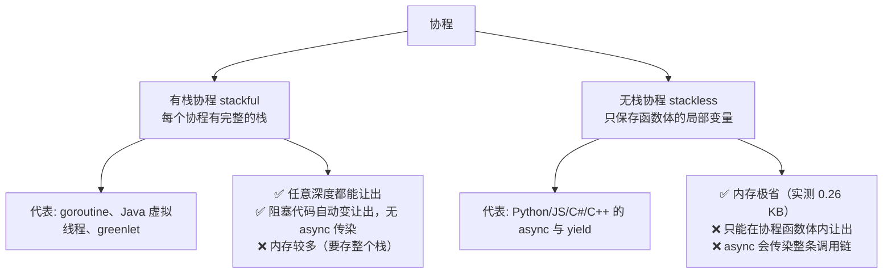

# 第 44 章 · 协程

**简体中文** ｜ [English](./44-coroutine.en-US.md)

---

> 第 43 章的事件循环让单线程扛住了万级并发，代价是**编程模型被改变**——回调、`async` 传染、"绝不阻塞"的纪律。有没有可能**既要异步的性能，又要同步代码的可读性**？
>
> 答案是**协程**——一句话就能定义它：**可以中途暂停、之后从原地恢复的函数**。而实现它只需要打破第 32 章的一条铁律（"函数返回，帧必亡"）：**把栈帧留在堆上**。
>
> 本章的**钥匙实验**用五种语言各搭了一个三十行的协程调度器——**五种语言输出完全一致**（协程甲 0 → 协程乙 0 → 甲 1 → 乙 1 → 甲 2）：两个执行流在单线程上交替推进，没有线程、没有锁、没有数据竞争。这证明协程不是某门语言的特性，而是"暂停/恢复"这一能力的必然产物。
>
> 帧住在堆上的证据处处可见：Python 实测生成器的 `gi_frame` 里存着 `{'name': 'A', 'n': 3, 'total': 1}`；C# 实测迭代器的真身是编译器生成的状态机类 `Program+<Counter>d__0`；C++ 实测协程的局部变量住在 `operator new` 分配的 **coroutine frame** 里。**这是第 32 章那句"帧可以住在堆上"最彻底的一次兑现**。
>
> 而它换来的规模是数量级的碾压：实测 **JS 十万个暂停中的生成器只占 25.3 MB，平均每个 0.26 KB——比一条 OS 线程（1 MB）小 3948 倍**；C# 每个 0.33 KB（小 3072 倍）、Python 每个 2.2 KB。这就是"能开十万个协程却开不出一万个线程"的全部原因。
>
> 最后是两条路线的分野：**无栈协程**（Python/JS/C#/C++ 的 `async`/`yield`）由编译器改写函数，内存最省但 `async` 会传染；**有栈协程**（Go 的 goroutine、Java 21 的虚拟线程）由运行时搬运整个栈，代码风格完全不变、老库直接受益——Java 实测本机 17 尚不支持，但它的机制值得完整讲清：**阻塞时把栈帧从平台线程栈复制到堆，平台线程立刻去跑别的**。

## 1. 学习目标

本章结束后，你将能够：

- 用一句话定义协程（**可暂停、可恢复的函数**）并说清它与普通函数的唯一区别；
- 解释协程为何必须**把帧放在堆上**，并在三种语言里指出这个堆对象（Python `gi_frame`、C# 状态机类、C++ coroutine frame，均实测）；
- 手工实现一个协程调度器（实测五语言输出一致），理解"协作式并发"为何天然无锁；
- 用实测数据说明协程的规模优势（**每个 0.26–2.2 KB vs 线程 1 MB，相差 3000–4000 倍**）；
- 区分**有栈协程与无栈协程**两条路线，说清各自的代价（`async` 传染 vs 运行时复杂度）。

---

## 2. 为什么会出现这个概念

### 第 42/43 章留下的遗憾

```text
异步给了性能（第 42 章实测：一条线程扛住万级并发）
但也拿走了可读性：
  ① 函数有了颜色（async 传染整条调用链）
  ② 生态分裂（Python 的 requests vs httpx）
  ③ 「绝不阻塞」成了纪律（第 43 章实测：一个阻塞调用让并发退化为串行）
```

**问题的根源**：我们想让一个执行流"等待时让出线程"，但普通函数做不到——它一旦开始，就只能一路跑到 `return`。

### 协程：让函数能中途出来

```text
普通函数: 调用 → 一路执行到 return → 栈帧销毁，局部变量全没了（第 32 章）
协程:     调用 → 执行到 yield → 栈帧【保留在堆上】→ 下次从原地继续
```

**这是唯一的区别**——但它带来的能力是革命性的：

| 有了"暂停/恢复" | 就能实现 |
|----------------|---------|
| 暂停后让出线程 | 异步 I/O（第 42 章）、事件循环（第 43 章） |
| 暂停后产出一个值 | 生成器、流式处理、惰性求值 |
| 暂停后切给另一个协程 | 协作式多任务（本章钥匙实验） |

> **一句话**：协程用"**把栈帧从栈搬到堆**"这一个改动，打破了"函数必须一口气跑完"的限制——第 32 章说过帧住在堆上是异步与协程的物理前提，本章就是它的完整兑现。

---

## 3. 底层原理

### 协程的定义与代价

```text
协程 = 可暂停、可恢复的函数
实现前提 = 它的状态（局部变量、执行到哪一行）必须活过"暂停"这段时间
         → 栈帧不能随函数返回而销毁 → 必须放在堆上
```

**三种语言的实测证据**：

| 语言 | 堆上的那个对象 | 实测内容 |
|------|---------------|---------|
| **Python** | 生成器的 `gi_frame` | `{'name': 'A', 'n': 3, 'total': 1}` —— 局部变量清清楚楚 |
| **C#** | 编译器生成的状态机类 | `Program+<Counter>d__0`（与第 42 章的 `<ShowStateMachine>d__4` 同族） |
| **C++** | coroutine frame | 编译器用 `operator new` 分配（第 33 章的堆分配成本） |

### 钥匙实验：三十行搭一个协程调度器

```python
def scheduler(tasks):
    queue = list(tasks)
    while queue:
        task = queue.pop(0)
        try:
            print(next(task))      # 恢复它，跑到下一个 yield
            queue.append(task)     # 没结束就排回队尾
        except StopIteration:
            pass                   # 这个协程跑完了
```

**五种语言实测输出完全一致**：

```text
协程甲: 第 0 步，累计 0
协程乙: 第 0 步，累计 0
协程甲: 第 1 步，累计 1
协程乙: 第 1 步，累计 1
协程甲: 第 2 步，累计 3
```

**三个关键观察**：

```text
① 两个执行流交替推进 —— 单线程上实现了「并发」
② 没有线程、没有锁 —— 第 40/41 章的所有问题不存在
③ 调度器就是「取一个 → 推进一步 → 排回队尾」—— 与第 43 章的事件循环完全同构
```

**这也解释了"协作式"的含义**：协程必须**主动** `yield` 才会让出，调度器无法强行打断它（对比 OS 线程的抢占式调度）。收益是无竞争，代价是一个不让出的协程会饿死所有人（与第 43 章的长回调同理）。

### 规模：为什么能开十万个

**实测数据**（暂停中的协程/生成器占多少内存）：

| 语言 | 数量 | 总内存 | 每个 | 相比线程（1 MB） |
|------|------|--------|------|-----------------|
| **JavaScript** | 100,000 | 25.3 MB | **0.26 KB** | **小 3948 倍** |
| **C#** | 100,000 | 32.6 MB | **0.33 KB** | **小 3072 倍** |
| **Python** | 50,000 | 109.2 MB | 2.2 KB | 小 465 倍 |

**对照第 39/40 章的线程数据**：

```text
线程: 创建 12.2 μs/个 + 保留 1 MB 栈
      → 5 万个线程需要 610 ms 创建 + 50 GB 栈空间（实测推算，根本开不出来）
协程: 创建约几微秒 + 占用 0.26–2.2 KB
      → 5 万个协程实测 1341 ms 跑完（含 10ms 的 sleep），峰值内存 109 MB，线程数 1
```

**为什么协程能这么小**：线程必须预留一整个栈（应对任意深度的调用），而无栈协程**只保存那个函数体里的局部变量**——通常几十到几百字节。

### 两大流派：有栈 vs 无栈



**这条分野决定了第 42 章那个"函数有颜色"的问题**：

```text
无栈：编译器只改写标了 async/yield 的函数 → 没标的函数无法让出 → 传染
有栈：运行时能搬运任意深度的栈 → 任何函数都能让出 → 不传染
```

### 有栈协程的机制：挂载与卸载

以 Java 21 的虚拟线程为例（**本机 Java 17 实测不支持，但机制值得讲清**）：

```text
虚拟线程运行时【挂载】到一条平台线程（carrier thread）上
遇到阻塞（sleep / socket read）时：
  ① JVM 把它的【栈帧从平台线程栈复制到堆】← 关键的一步
  ② 平台线程被【卸载】，立刻去跑别的虚拟线程
  ③ I/O 就绪时，栈帧从堆复制回来，继续执行
→ 对你的代码来说，Thread.sleep() 看起来还是阻塞，实际上是让出
```

**这就是"既要异步性能又要同步可读性"的答案**——代码一行不改，运行时替你完成了让出。

---

## 4. JavaScript

JS 的 `function*` 生成器是 `async/await` 的**地基**——本章实测把这层关系挖了出来。

### 生成器：暂停与恢复（实测）

```javascript
function* counter(name, n) {
  let total = 0;
  for (let i = 0; i < n; i++) { total += i; yield `${name}: 第 ${i} 步，累计 ${total}`; }
}
```

```text
调用生成器函数返回: Generator 对象（函数体一行都没执行）
第一次 next(): A: 第 0 步，累计 0
第二次 next(): A: 第 1 步，累计 1   ← 从上次 yield 的下一行继续，total 还在
```

### 双向通信：`yield` 既能出也能进（实测）

```javascript
const received = yield "等待输入……";   // yield 的返回值 = 外部 next(x) 送进来的东西
```

```text
第一次 next():        等待输入……
next("你好") 送入值:  收到了: 你好
```

**协程与调用者是双向的**——这是它比"回调"强大的地方：数据可以来回传递，控制权可以来回交接。

### `async/await` 就是"生成器 + 自动驱动"（实测）

手工写一个驱动器，把 `yield` 出来的 Promise 等好了再 `send` 回去：

```javascript
function drive(genFn) {
  const g = genFn();
  return new Promise((resolve) => {
    (function step(input) {
      const { value, done } = g.next(input);
      if (done) return resolve(value);
      Promise.resolve(value).then(step);   // ← await 的本质就是这一行
    })();
  });
}
```

```text
手工驱动生成器模拟 await，结果 = 3（1 + 2）
→ async/await 只是把这个驱动器做进了语言（co 库当年就这么干的）
```

**这是本章最重要的祛魅**：`await` 不是魔法，它就是"`yield` 一个 Promise + 一个自动驱动循环"。ES2017 之前，社区用 `co` 库以这种方式模拟 async/await 多年。

### 规模实测

```text
100000 个暂停中的生成器: 占用 25.3 MB
平均每个约 0.26 KB —— 而一条 OS 线程要 1024 KB
→ 相差约 3948 倍，这就是能开十万个协程的原因
```

### 异步生成器：流式处理（实测）

```javascript
async function* ticker(n) { for (let i = 1; i <= n; i++) { await sleep(5); yield i; } }
for await (const v of ticker(3)) got.push(v);
```

```text
for await...of 收到: [1,2,3]（每个都经过了一次 await + yield）
→ 数据边产生边消费，不必全部载入内存
```

> **注意事项**：JS **没有有栈协程**——无法在任意深度让出（必须显式 `yield`/`await`）；生成器不是线程安全的（但 JS 单线程所以无所谓）；`yield*` 委托给另一个生成器，是组合协程的基础。

---

## 5. Python

Python 的生成器是**最早也最完整**的协程实现之一——`async` 就是在它之上长出来的。

### 帧对象看得见摸得着（实测）

```text
它的帧对象: gi_frame = True（活在堆上，第 32 章）
帧里的局部变量: {'name': 'A', 'n': 3, 'total': 1}
```

**这是全书最直白的一次"帧住在堆上"实证**——`gi_frame.f_locals` 直接把暂停中的局部变量打印了出来（第 32 章实测过 CPython 的帧本来就是堆对象）。

### `async` 与生成器同源（实测）

```text
async 函数返回: coroutine（与生成器同源，第 42 章实测过 cr_frame）
CPython 里 async def 复用了生成器的字节码机制（yield from → await）
send/throw/close 三个方法生成器与协程都有: ['send', 'throw', 'close']
```

**历史脉络**：

```text
Python 2.2  生成器（yield）
Python 2.5  生成器可接收值（send）→ 协程雏形
Python 3.3  yield from（委托）→ 协程组合
Python 3.4  asyncio（基于生成器的协程 + 事件循环）
Python 3.5  async/await 关键字（语法糖，底层仍是生成器机制）
```

### 规模实测

```text
50000 个协程: 1341 ms，峰值内存 109.2 MB，线程数 1
50000 个线程: 光创建就要约 610 ms + 50000 MB 栈 → 根本开不出来
→ 协程每个约 2.2 KB，线程每个 1 MB —— 相差三个数量级
```

（Python 的 2.2 KB 比 JS 的 0.26 KB 大，因为 CPython 的帧对象携带了完整的解释器状态——这也是它能被自省的代价，第 30 章反射的同源账单。）

### Python 的协程家族

| 形态 | 说明 |
|------|------|
| `yield` | 最原始的暂停/恢复（本章 ①③ 实测） |
| `yield from` | 委托给另一个生成器（协程组合的基础） |
| `async/await` | 生成器机制 + 事件循环调度（第 42/43 章） |
| `greenlet`（第三方） | **有栈协程**，可在任意深度让出 |

**`greenlet` 是 Python 生态里的"有栈"选项**——gevent 用它把整个标准库的阻塞 I/O 猴子补丁成协作式的，实现了"代码不改也能异步"（与虚拟线程同一思路，但用第三方库实现）。

> **注意事项**：生成器只能迭代一次（耗尽后再 `next()` 抛 `StopIteration`）；`yield` 在 `try/finally` 里时，`close()` 会触发 `GeneratorExit`；`contextlib.contextmanager`（第 37 章）正是用生成器实现的——`yield` 之前是 `__enter__`，之后是 `__exit__`。

---

## 6. Java

Java 是五门语言里**唯一没有 `yield` 关键字**的——它选了一条完全不同的路。

### 没有 `yield` 的代价（实测）

```java
static class Counter implements Iterator<String> {
    private int i = 0;          // ← 这就是「被迫手工维护的状态机」
    private int total = 0;
    public String next() { total += i; return "..." + i++; }
}
```

```text
只能手工写 Iterator，把 i 和 total 提升为对象字段
第二次 next(): A: 第 1 步，累计 1   ← 状态存在对象里，不是栈上
↑ 别的语言由编译器生成这个状态机，Java 要你亲手写
```

**对比 C# 的实测**：C# 写 `yield return`，编译器自动生成 `Program+<Counter>d__0` 这个状态机类；Java 则要你亲手把每个局部变量提升为字段。**这正是"编译器代劳"与"程序员手工"的差别**。

### 为什么 Java 一直没加 `yield`

```text
因为它选了另一条路：与其让「函数」可暂停，不如让「线程」变廉价
→ 虚拟线程（Java 21+）：一条真实线程上跑成千上万个虚拟线程
→ 阻塞代码自动变让出，无需 async/yield 改写（第 42 章的传染性问题不存在）
```

### 虚拟线程可用性（实测）

```text
❌ 本机 Java 17.0.18 不支持虚拟线程（需要 21+）
```

**对照组：平台线程的重量（实测）**：

```text
5000 个平台线程: 155 ms（每个约 31.0 μs）
每个保留约 1 MB 栈 → 1000000 个就要 1000 GB 虚拟地址（第 31 章实测）
虚拟线程若可用: 同样 5000 个只需几毫秒，每个约几百字节
```

### 虚拟线程的核心机制

```text
虚拟线程运行时【挂载】到一条平台线程（carrier thread）上
遇到阻塞（sleep/socket read）时：
  ① JVM 把它的【栈帧从平台线程栈复制到堆】← 关键的一步
  ② 平台线程被【卸载】，立刻去跑别的虚拟线程
  ③ I/O 就绪时，栈帧从堆复制回来，继续执行
→ 对你的代码来说，Thread.sleep() 看起来还是阻塞，实际上是让出
```

**这是第 32 章"帧可以住在堆上"最戏剧性的兑现**：不是编译期决定的（像 C# 的状态机），而是**运行时动态搬运**——需要让出时才把栈复制到堆，恢复时再复制回来。

### 虚拟线程的两个坑（Java 21+ 需注意）

```text
① synchronized 会「钉住」（pin）载体线程 —— 虚拟线程无法卸载
   → 用 ReentrantLock 替代（第 41 章讲过两者差异）
② ThreadLocal 在百万虚拟线程下会爆内存
   → 用 ScopedValue（Java 21 预览特性）替代
```

> **注意事项**：虚拟线程适合 I/O 密集，CPU 密集仍要用平台线程池（第 45 章）；`Executors.newVirtualThreadPerTaskExecutor()` 是标准用法（"每任务一线程"重新变得可行）；Kotlin 的协程是另一套方案（编译器改写 + 挂起函数，属无栈流派）。

---

## 7. C++

C++20 终于有了协程关键字——但**标准库一行配套代码都没给**（第 42 章结论的再次印证）。

### `co_yield`：暂停与恢复（实测）

```cpp
Generator<std::string> counter(std::string name, int n) {
    int total = 0;
    for (int i = 0; i < n; ++i) { total += i; co_yield "..."; }
}
```

```text
创建协程后函数体一行都没执行（initial_suspend 立刻暂停）
第二次 resume: A: 第 1 步，累计 1   ← 从上次 co_yield 的下一行继续，total 还在
局部变量 i、total 存在【coroutine frame】里——编译器在堆上分配的（第 32 章）
```

### C++ 的特殊之处：要自己写 `promise_type`（实测）

```text
上面的 Generator<T> 有 40 行样板代码，标准库一行都没给
必须实现: get_return_object / initial_suspend / final_suspend
          yield_value / return_void / unhandled_exception
→ C++23 才加入 std::generator，这个样板终于可以省掉
```

**这是 C++ 协程最劝退的一点**：语言给了完备的机制（甚至比其他语言更灵活——可自定义分配器、调度策略、异常处理），但没有开箱即用的类型。第 42 章说过"语言给机制，库给策略"——这里是同一句话的第二次印证。

### coroutine frame：栈帧真的搬到了堆上

```text
编译器把协程的局部变量、参数、暂停点编号打包成一个 frame
frame 默认用 operator new 分配在堆上（第 33 章的分配成本）
handle.resume()  : 从 frame 恢复执行
handle.destroy() : 销毁 frame（本例在析构里做，RAII，第 37 章）
```

**注意 `handle.destroy()` 放在了析构函数里**——这是第 37 章 RAII 在协程上的应用：协程 frame 也是一种需要确定性释放的资源。

### HALO 优化：C++ 独有的"协程不分配"

```text
若编译器能证明协程的生命周期不超过调用者，可把 frame 分配到【栈上】
→ 零堆分配的协程（HALO: Heap Allocation eLision Optimization）
→ 这是 C++ 相对 JS/Python/C# 的独有优势（它们的协程必然堆分配）
```

**这是"零开销抽象"哲学的又一次体现**：其他语言的协程必然付出一次堆分配（第 33 章实测 15.8 ns），而 C++ 在能证明安全时可以完全省掉。

### 三个关键字

```text
co_yield  : 产出一个值并暂停（生成器，本节主角）
co_await  : 等待一个可等待对象（异步，第 42 章）
co_return : 协程结束并返回
函数体里出现任意一个，这个函数就变成协程（无需特殊标注——与 async 关键字不同）
```

**这个设计很特别**：C++ 不需要 `async` 标注，编译器看到 `co_*` 就知道这是协程——**这意味着函数签名上看不出它是不是协程**（有利有弊：调用方无需改写，但可读性下降）。

> **注意事项**：协程的引用参数悬垂是常见坑（frame 只存参数副本，引用指向的临时量可能已析构）；`co_await` 的对象必须满足 Awaitable 概念；Boost.Asio 与 cppcoro 提供了生产可用的协程类型（第 43 章提过）。

---

## 8. C#

C# 的迭代器（2005 年的 C# 2.0）**为 async 铺好了路**——本章实测把这层历史关系挖了出来。

### `yield return`：编译器生成状态机（实测）

```text
调用迭代器方法返回: <Counter>d__0（函数体一行都没执行）
它的真身: Program+<Counter>d__0
↑ 编译器生成的状态机类——局部变量成了它的字段（住在堆上，第 32 章）
```

### 与 async 状态机同源（实测输出）

```text
yield return  → 编译器生成 IEnumerator 状态机（MoveNext 里的 switch）
await         → 编译器生成 IAsyncStateMachine（同样是 MoveNext）
→ 第 42 章实测过 <ShowStateMachine>d__4 —— 两者是同一套编译器机制
→ C# 2.0（2005）的迭代器，为 C# 5.0（2012）的 async 铺好了路
```

**这是一条清晰的技术演进链**：C# 先为迭代器实现了"编译器把方法改写成状态机"的能力，七年后把同一套机制用在了 `async` 上。第 42 章实测的 `<ShowStateMachine>d__4` 与本章的 `<Counter>d__0` 命名规则完全一致，正是同一套编译器机制的产物。

### 规模实测

```text
100000 个暂停中的迭代器: 占用 32.6 MB
平均每个约 0.33 KB —— 而一条 OS 线程要 1024 KB
→ 相差约 3072 倍
```

### 异步迭代器：`yield` + `await` 的合体（实测）

```csharp
static async IAsyncEnumerable<int> Ticker(int n) {
    for (int i = 1; i <= n; i++) { await Task.Delay(5); yield return i; }
}
await foreach (var v in Ticker(3)) got.Add(v);
```

```text
await foreach 收到: [1, 2, 3]
→ IAsyncEnumerable<T>：流式处理的标准写法（对应 JS 的 async function*）
```

### Unity 的协程：迭代器的经典应用

```csharp
IEnumerator MyCoroutine() {
    yield return new WaitForSeconds(1);   // 暂停 1 秒
    yield return null;                    // 暂停到下一帧
}
```

**游戏引擎每帧调一次 `MoveNext()`，就实现了"跨帧的执行流"**——这正是本章钥匙实验里那个手工调度器的商业级版本。整整一代 Unity 开发者是通过它理解协程的。

> **注意事项**：C# **没有有栈协程**（不能在任意深度让出）；迭代器方法的参数校验会被延迟到第一次 `MoveNext()`（常见坑，需拆成两个方法）；`IAsyncEnumerable` 配合 `WithCancellation` 支持取消。

---

## 9. SQL

数据库的协程叫**游标**——一个可暂停、可恢复的查询。

### 游标 = 可暂停恢复的查询（实测）

```text
① 普通查询: 一次性返回 1000 行（全部载入内存）
   游标: 每次 FETCH 恢复执行，产出一行就暂停 —— 与 yield 完全同构
```

**对照表**：

| 概念 | 编程语言 | 数据库 |
|------|---------|--------|
| 一次性返回全部 | 普通函数 `return` | `SELECT *` |
| 产出一个就暂停 | `yield` | 游标 `FETCH` |
| 保存的状态 | 帧/状态机（堆上） | 游标位置（数据库端） |
| 流式处理 | 生成器/`IAsyncEnumerable` | 服务端游标 |

### 分页就是手工版的游标（实测）

```text
② 第 1 页: student-1, student-2, student-3
   第 2 页: student-4, student-5, student-6
   ↑ 每次「恢复」都从上次的位置继续 —— 但 OFFSET 会重扫前面的行（低效）

③ 键集分页第 1 页（id > 0）: student-1, student-2, student-3
   键集分页第 2 页（id > 3）: student-4, student-5, student-6
   ↑ 保存「上次到哪」而非「跳过多少」—— 这才是游标的正确姿势
```

**`OFFSET` 与键集分页的差异，正是"重新执行"与"恢复执行"的差异**：`OFFSET 1000000` 要重扫一百万行才能开始返回（相当于每次从头跑一遍协程），而键集分页 `WHERE id > 上次的id` 直接从断点继续（真正的"恢复"）。

### 为什么游标很重要：内存

```text
④ 流式处理: 一亿行用游标只占一行的内存
   对应 JS 的 async function* / C# 的 IAsyncEnumerable / Python 的生成器
```

### 服务端游标 vs 客户端游标

```text
服务端游标（DECLARE CURSOR）: 状态保存在数据库进程里（第 39 章：每连接一进程）
客户端游标:                   驱动把全部结果拉到本地再逐行给你（假游标）
→ 大结果集必须用服务端游标，否则「流式」名存实亡
```

**这是一个真实的生产陷阱**：很多 ORM 的"迭代查询结果"其实是客户端游标——看起来在流式处理，实际上早已把一亿行拉进了内存。PostgreSQL 需要显式 `DECLARE CURSOR` 或设置 `fetch_size`。

> **工程提醒**：游标会占住数据库端的资源（第 39 章：PostgreSQL 每连接一进程），长时间不关闭的游标会拖累整个实例；ORM 里优先用键集分页而非 `OFFSET`；递归 CTE（第 32 章实测百万层不爆栈）也是"产出-恢复"模式的一种。

---

## 10. 五语言横向对比

### ① 协程能力对比

| 特性 | JavaScript | Python | Java | C++ | C# |
|------|-----------|--------|------|-----|-----|
| 生成器语法 | `function*` + `yield` | `yield` | ❌ **无**（手工 Iterator） | `co_yield`（C++20） | `yield return` |
| 异步协程 | `async/await` | `async/await` | ❌（`CompletableFuture`） | `co_await` | `async/await` |
| 异步生成器 | `async function*` | `async def` + `yield` | ❌ | 需第三方 | `IAsyncEnumerable` |
| 无栈协程 | ✅ | ✅ | ❌ | ✅（可 HALO 到栈上） | ✅ |
| **有栈协程** | ❌ | `greenlet`（第三方） | ✅ **虚拟线程**（21+） | 第三方（Boost.Context） | ❌ |
| 状态存放 | 引擎堆对象 | **`gi_frame`**（实测可见） | 手工字段 / 虚拟线程栈 | **coroutine frame**（实测） | **状态机类**（实测 `<Counter>d__0`） |
| 每个协程内存（实测） | **0.26 KB** | 2.2 KB | —（虚拟线程约几百字节） | frame 大小编译期定 | **0.33 KB** |
| 标准库支持 | ✅ 完整 | ✅ 完整 | — | ❌ **C++23 才有 generator** | ✅ 完整 |

### ② 钥匙实测一：五语言，同一个调度器

```text
Python / JS / Java / C++ / C# 各搭一个三十行的协程调度器，输出完全一致：

  协程甲: 第 0 步，累计 0
  协程乙: 第 0 步，累计 0
  协程甲: 第 1 步，累计 1
  协程乙: 第 1 步，累计 1
  协程甲: 第 2 步，累计 3

→ 协程不是某门语言的特性，而是「暂停/恢复」这一能力的必然产物
→ 调度器就是「取一个 → 推进一步 → 排回队尾」——与第 43 章的事件循环同构
```

### ③ 钥匙实测二：规模碾压

```text
暂停中的协程占多少内存：
  JavaScript  100,000 个 = 25.3 MB → 每个 0.26 KB → 比线程小 3948 倍
  C#          100,000 个 = 32.6 MB → 每个 0.33 KB → 比线程小 3072 倍
  Python       50,000 个 = 109.2 MB → 每个 2.2 KB → 比线程小 465 倍

对照（第 31/39 章实测）：
  OS 线程：创建 12.2 μs + 保留 1 MB 栈
  → 5 万个线程 = 610 ms 创建 + 50 GB 栈 → 开不出来
  → 5 万个协程 = 实测 1341 ms 跑完，109 MB，线程数 1
```

### ④ 两条设计分歧

**分歧一：有栈还是无栈**

```text
无栈（Python/JS/C#/C++）：编译器改写函数，只存必要的局部变量
  ✅ 内存极省（实测 0.26 KB）、可预测、可优化（C++ 的 HALO 甚至零分配）
  ❌ 只能在协程函数体内让出 → async 传染整条调用链（第 42 章）
有栈（Go/Java 虚拟线程/greenlet）：运行时搬运整个栈
  ✅ 任意深度让出 → 阻塞代码自动变让出 → 无传染、老库直接受益
  ❌ 内存较多、运行时复杂度大、某些场景仍会钉住线程（synchronized）
```

**分歧二：编译期改写还是运行时搬运**

```text
编译期（C# 状态机、C++ frame）：编译时就确定了要保存哪些变量 → 高效、可优化
                                 代价：函数签名被改变（有颜色）
运行时（Java 虚拟线程）：        阻塞时才把栈复制到堆 → 代码零改动
                                 代价：复制栈有开销，调试栈更深
```

### ⑤ 共同点与差异根源

**共同点**：所有协程的本质都是"把帧放在堆上"（三语言实测可见）；所有协程都是**协作式**的（必须主动让出，无法被抢占）；协程调度器的骨架完全一致（五语言实测输出相同）；协程都比线程小三个数量级（实测 465–3948 倍）。

**差异根源**：

- **JS/Python 的生成器先于 async 出现**——所以 async 是"生成器 + 驱动器"（JS 实测手工驱动成功）；
- **C# 的迭代器为 async 铺路**——同一套编译器机制，相隔七年（实测 `<Counter>d__0` 与 `<ShowStateMachine>d__4` 命名同族）；
- **Java 跳过了 yield**——它有海量同步阻塞代码，改写成本太高，于是选择运行时搬栈（虚拟线程）；
- **C++ 给机制不给策略**——符合零开销哲学，代价是要写 40 行样板（实测），直到 C++23 才有 `std::generator`；
- **数据库的游标**证明这个模式跨越了编程语言——"产出一个就暂停"是所有流式处理的共同答案。

---

## 11. 底层实现对比

| 运行时 | 协程实现 | 关键细节 |
|--------|---------|---------|
| **V8**（JS） | 生成器编译为状态机 + 堆上的 `JSGeneratorObject` | 保存寄存器与暂停点；`async` 复用同一机制加 Promise 驱动 |
| **CPython** | `PyGenObject` 持有 `PyFrameObject`（实测 `gi_frame`） | 帧本来就在堆上（第 32 章）→ 实现协程几乎零额外机制；3.11 起帧惰性物化提速 |
| **JVM**（虚拟线程） | `Continuation` + 栈复制（挂载/卸载） | Loom 项目；阻塞时把栈帧从平台线程栈复制到堆；`synchronized` 会 pin 住载体线程 |
| **C++**（原生） | 编译器生成 coroutine frame，`operator new` 分配 | 大小编译期确定；HALO 可省掉分配；`coroutine_handle` 是裸指针（要手工 destroy 或 RAII 包装） |
| **CLR**（C#） | 编译器生成状态机类（实测 `<Counter>d__0`） | 迭代器与 async 共用同一机制；`MoveNext()` 里是一个 switch |

**一个值得记住的分野**：

```text
CPython 实现协程最"轻松"——因为它的帧本来就在堆上（第 32 章实测 f_back 链）
C#/C++ 要靠编译器把函数改写成状态机——因为它们的帧本来在栈上
Java 要靠运行时复制栈——因为它既不想改写函数，又要支持任意深度让出
→ 三种实现路径，对应三种"帧原本住在哪"的历史包袱
```

---

## 12. 性能分析

### 协程的三项成本

| 成本项 | 数量级 | 实测/出处 |
|--------|--------|----------|
| 创建 | 微秒级（一次堆分配） | 第 33 章分配成本 15.8 ns 起 |
| 每个的内存 | **0.26–2.2 KB**（无栈） | 本章实测三语言 |
| 切换 | **纳秒级**（就是一次函数调用 + 状态恢复） | 无系统调用、无上下文切换 |

**对照线程**（第 39/40 章实测）：

```text
线程创建: 12.2 μs（比协程贵 10–100 倍）
线程内存: 1 MB（比协程贵 465–3948 倍）
线程切换: 微秒级（要进内核、刷 TLB、可能换核）
```

**协程切换为什么这么快**：它就是一次普通的函数返回与调用——不进内核、不换页表、不刷缓存。这是"用户态调度"相对"内核态调度"的根本优势。

### 但协程不是万能的

```text
① 不能并行：协程是协作式的，单线程上永远只有一个在跑
   → 要用多核仍需多线程/多进程（Go 的 GMP 模型是协程 + 多线程的组合）
② 一个不让出的协程饿死所有人（与第 43 章的长回调同理）
③ 有栈协程的栈复制有成本（Java 虚拟线程在极端场景下可见）
```

### 什么时候协程收益最大

```text
✅ 大量并发的 I/O 等待（Web 服务、爬虫、代理）—— 实测万级并发一条线程
✅ 流式处理（生成器省内存，一亿行只占一行）
✅ 需要"暂停/恢复"语义（游戏的跨帧逻辑、状态机、解析器）
❌ CPU 密集（协程不加速计算）
❌ 并发量很小（几十个）时，线程更简单直接
```

> ⚠️ 惯例提醒：协程的性能优势在**规模**上体现（实测 20 个任务时异步与线程相当，一万个时天差地别，第 42 章）。小规模场景引入协程可能是负优化——多了心智负担，省不下多少资源。

---

## 13. 工程实践

| 场景 | ✅ 推荐 | ❌ 不推荐 | 原因 |
|------|--------|----------|------|
| 大量并发 I/O | 协程（async / 虚拟线程） | 一请求一线程 | 实测每个省 3000 倍内存 |
| 处理大数据集 | 生成器/游标（流式） | 一次性载入 | 一亿行只占一行内存 |
| 跨帧/跨步骤逻辑 | 协程（Unity 的 IEnumerator） | 手工状态机 | 代码线性可读（对比 Java 手写 Iterator） |
| Java 新项目（21+） | 虚拟线程 | Netty 式回调 | 无传染、老库直接受益 |
| Java 虚拟线程下的锁 | `ReentrantLock` | `synchronized` | 后者会 pin 住载体线程 |
| Java 虚拟线程下的上下文 | `ScopedValue` | `ThreadLocal` | 百万虚拟线程会爆内存 |
| C++ 协程 | Boost.Asio / cppcoro | 手写 `promise_type` | 实测 40 行样板，C++23 前无标准类型 |
| Python 阻塞库 | `greenlet`/gevent 或 `run_in_executor` | 直接在协程里调 | 卡死事件循环（第 43 章实测） |
| 数据库大结果集 | 服务端游标 / 键集分页 | `OFFSET` 深分页 | OFFSET 会重扫前面所有行 |
| CPU 密集任务 | 多进程/线程池（第 39/45 章） | 协程 | 协程不加速计算 |

### 判断口诀

```text
这个执行流需要"中途出来"吗？
  需要产出值 → 生成器（yield）
  需要等 I/O → async 协程（第 42 章）或有栈协程（虚拟线程）
  需要跨帧/跨步骤 → 协程（Unity 模式）

用哪种协程？
  语言有虚拟线程/goroutine（Java 21+/Go）→ 用它，代码不必改
  只有 async（JS/C#/Python）→ 接受传染性，全链路 async
  C++ → 用 Boost.Asio 或 cppcoro，别手写 promise_type
```

---

## 14. 最佳实践

- **理解协程 = 堆上的帧**：所有困惑（为什么能暂停、为什么省内存、为什么切换快）都从这一句推得出（三语言实测可见）。
- **流式处理优先用生成器**：一亿行用游标只占一行内存——这是协程最被低估的用途。
- **规模才是协程的主场**：实测小规模（20 个）时异步与线程相当，万级时才碾压——别为几十个并发引入协程复杂度。
- **Java 21+ 优先虚拟线程**：无 `async` 传染、老库直接受益；但注意 `synchronized` 会 pin 住线程（改用 `ReentrantLock`）。
- **C++ 别手写 `promise_type`**：实测 40 行样板且极易出错——用 Boost.Asio/cppcoro，或等 C++23 的 `std::generator`。
- **协程里绝不阻塞**：与第 43 章的事件循环同一条纪律——一个不让出的协程饿死所有人。
- **数据库用服务端游标 + 键集分页**：客户端游标是"假流式"（实测 OFFSET 会重扫）。
- **知道 `await` 不是魔法**：JS 实测手工驱动器只有 8 行——理解它就不会再被 async 的行为困惑。

---

## 15. 常见坑

**坑 1 · 生成器只能迭代一次**

```python
gen = counter("A", 3)
list(gen)     # 耗尽
list(gen)     # ⚠️ 返回空列表（而非重新开始）
```

**如何避免**：需要多次遍历就返回列表，或每次重新调用生成器函数创建新对象。

**坑 2 · 忘记生成器是惰性的**

```python
gen = (expensive(x) for x in items)   # ⚠️ 一行都还没执行
# 若之后 items 被修改，gen 迭代时用的是修改后的值
```

**如何避免**：需要立即求值就用列表推导；惰性求值时注意闭包捕获的变量可能变化。

**坑 3 · C# 迭代器的参数校验被延迟**

```csharp
IEnumerable<int> Foo(int n) {
    if (n < 0) throw new ArgumentException();   // ⚠️ 直到第一次 MoveNext() 才抛
    yield return n;
}
```

**如何避免**：拆成两个方法——外层普通方法做校验，内层迭代器方法做产出。

**坑 4 · C++ 协程的引用参数悬垂**

```cpp
Generator<int> gen(const std::string& s) { co_yield s.size(); }
auto g = gen("临时字符串");   // ⚠️ 临时量已析构，frame 里的引用悬垂
```

**如何避免**：协程参数一律按值传递（frame 会保存副本）；这是 C++ 协程最阴险的坑。

**坑 5 · Java 虚拟线程下用 `synchronized`**

```java
synchronized (lock) { socket.read(); }   // ⚠️ 虚拟线程被 pin 住，无法卸载
```

**如何避免**：改用 `ReentrantLock`（第 41 章讲过它的额外能力）；Java 24 起部分改善了这个限制。

**坑 6 · 协程里做 CPU 密集运算**

```python
async def handler():
    heavy_compute()      # ⚠️ 不让出 → 饿死所有其他协程（第 43 章实测同款）
```

**如何避免**：CPU 活儿丢给进程池/线程池；或在长循环中主动 `await asyncio.sleep(0)` 让出。

**坑 7 · 以为 ORM 的迭代是流式的**

```python
for row in session.query(HugeTable):    # ⚠️ 很多驱动会先把全部结果拉到内存
    process(row)
```

**如何避免**：确认驱动是否支持服务端游标（PostgreSQL 需 `stream_results=True` 或 `yield_per`）；大结果集优先键集分页。

---

## 16. 面试题

**基础**

1. 协程和普通函数的唯一区别是什么？为什么它需要把帧放在堆上？
2. 生成器与协程是什么关系？`async/await` 与生成器有什么联系？
3. 为什么协程比线程省内存？给出数量级。

**中级**

4. **手工实现一个协程调度器需要哪几步？为什么说它与事件循环同构？**
5. 有栈协程与无栈协程有什么区别？各自的优缺点是什么？
6. **为什么 `async` 会"传染"，而虚拟线程不会？（从有栈/无栈的角度解释）**

**高级**

7. **Java 虚拟线程遇到阻塞时具体发生了什么？为什么 `synchronized` 会 pin 住载体线程？**
8. C# 的迭代器与 async 状态机是什么关系？请用编译器生成的类名说明。
9. 数据库的游标与编程语言的生成器有何对应？为什么 `OFFSET` 深分页低效而键集分页高效？

---

## 17. 练习

**基础**

1. 用生成器实现一个斐波那契数列，验证它可以无限产出而不占内存。
2. 在三种语言里各打印一次协程的"堆上状态"（Python `gi_frame`、C# 状态机类名、C++ frame 说明）。
3. 用 `yield` 实现一个简单的状态机（如红绿灯循环）。

**提高**

4. **复现钥匙实验**：在你熟悉的语言里手写一个协程调度器，验证输出与本章一致。
5. 复现规模实测：创建 10 万个暂停中的生成器，测量内存占用与每个的平均大小。
6. 用 JS 手写一个 `await` 驱动器（实测 8 行），用它跑通一段"看起来像 async"的生成器代码。

**挑战**

7. 用生成器实现一个协作式的生产者-消费者（不用队列、不用锁），体会"双向通信"的威力。
8. 用 C++20 协程实现一个惰性的无限序列（如素数生成器），并测量 frame 的实际大小。
9. 对比 `OFFSET` 分页与键集分页在百万行表上的性能差异（用 `EXPLAIN QUERY PLAN` 观察扫描行数）。

---

## 18. 本章总结

**一句话总结**：协程就是**可以中途暂停、之后从原地恢复的函数**——实现它只需打破第 32 章的铁律（"函数返回，帧必亡"），**把栈帧留在堆上**（三语言实测可见：Python 的 `gi_frame` 里存着 `{'name': 'A', 'total': 1}`、C# 的状态机类 `Program+<Counter>d__0`、C++ 的 coroutine frame）；本章用五种语言各搭了三十行的协程调度器，**输出完全一致**，证明这不是某门语言的特性而是"暂停/恢复"能力的必然产物；它换来的规模是数量级碾压（实测 **JS 每个 0.26 KB、C# 0.33 KB、Python 2.2 KB，比 1 MB 的线程小 465–3948 倍**）；而实现路线分成两派——**无栈协程**（编译器改写函数，省内存但 `async` 传染）与**有栈协程**（运行时搬运整个栈，代码零改动，如 Java 21 虚拟线程的"阻塞时把栈帧从平台线程栈复制到堆"）；最后连数据库都有同款设计：**游标就是可暂停的查询**（实测键集分页才是"恢复"，`OFFSET` 是"重跑"）。

**核心知识点**

- **一句话定义**：协程 = 可暂停可恢复的函数；唯一前提是帧住在堆上（第 32 章的终极兑现）。
- **钥匙实验一**（五语言实测输出一致）：三十行调度器 = 取一个 → 推进一步 → 排回队尾（与第 43 章事件循环同构）。
- **钥匙实验二**（三语言实测）：每个协程 0.26–2.2 KB vs 线程 1 MB —— 相差 465–3948 倍。
- **`await` 祛魅**（JS 实测）：手工驱动器只有 8 行——`await` = `yield` 一个 Promise + 自动驱动。
- **C# 的历史链**（实测）：`<Counter>d__0` 与第 42 章的 `<ShowStateMachine>d__4` 同族——迭代器（2005）为 async（2012）铺路。
- **两大流派**：无栈（内存省、async 传染）vs 有栈（代码零改动、运行时复杂）。
- **虚拟线程机制**：挂载 → 阻塞时把栈帧复制到堆 → 卸载平台线程 → 就绪时复制回来。
- **SQL 对应**（实测）：游标 = 可暂停查询；键集分页是"恢复"，`OFFSET` 是"重跑"。

**检查清单**

- [ ] 我能用一句话定义协程并解释它为何需要堆上的帧。
- [ ] 我能手写一个协程调度器并说明它与事件循环的关系。
- [ ] 我能说出协程与线程的内存差距量级。
- [ ] 我能区分有栈/无栈协程并解释 `async` 传染的根源。
- [ ] 我知道虚拟线程遇到阻塞时运行时做了什么。

**下一章预告**：Part 6 的最后一章回到最实际的问题——**线程池**。本章的协程虽轻，但 CPU 密集任务终究需要真线程（协程不能并行）；而第 39/40 章实测过线程创建要 12.2 μs、每个占 1 MB 栈，绝不能按任务创建。第 45 章讲清如何**复用**它们：核心线程数该设多少（CPU 密集与 I/O 密集的两个不同公式）、任务队列满了该拒绝还是该阻塞（四种拒绝策略的真实后果）、为什么"无界队列 + 固定线程池"是 OOM 的经典配方，以及工作窃取（work-stealing）如何让 ForkJoinPool 在分治任务上碾压普通线程池——我们会用实测把每个参数的影响量出来。

---

## 19. 延伸阅读

- <a href="https://en.wikipedia.org/wiki/Coroutine" target="_blank" rel="noopener">Wikipedia：Coroutine</a> — 协程概念与历史（1958 年就有了）。
- <a href="https://en.wikipedia.org/wiki/Continuation" target="_blank" rel="noopener">Wikipedia：Continuation</a> — 续体：协程的理论基础。
- <a href="https://docs.python.org/3/reference/expressions.html#yield-expressions" target="_blank" rel="noopener">Python 文档 · yield 表达式</a> — 生成器与协程的语言参考。
- <a href="https://developer.mozilla.org/en-US/docs/Web/JavaScript/Reference/Statements/function*" target="_blank" rel="noopener">MDN · function*</a> — JS 生成器官方文档。
- <a href="https://openjdk.org/jeps/444" target="_blank" rel="noopener">JEP 444 · Virtual Threads</a> — Java 虚拟线程的官方提案（本章机制说明的来源）。
- <a href="https://en.cppreference.com/w/cpp/language/coroutines" target="_blank" rel="noopener">cppreference · Coroutines</a> — C++20 协程与 `promise_type` 的权威参考。
- <a href="https://learn.microsoft.com/en-us/dotnet/csharp/language-reference/statements/yield" target="_blank" rel="noopener">Microsoft Learn · yield</a> — C# 迭代器官方文档。
- <a href="https://go.dev/doc/effective_go#goroutines" target="_blank" rel="noopener">Effective Go · Goroutines</a> — 有栈协程最成功的实践。
- <a href="https://www.postgresql.org/docs/current/plpgsql-cursors.html" target="_blank" rel="noopener">PostgreSQL 文档 · 游标</a> — 数据库游标的官方说明。
