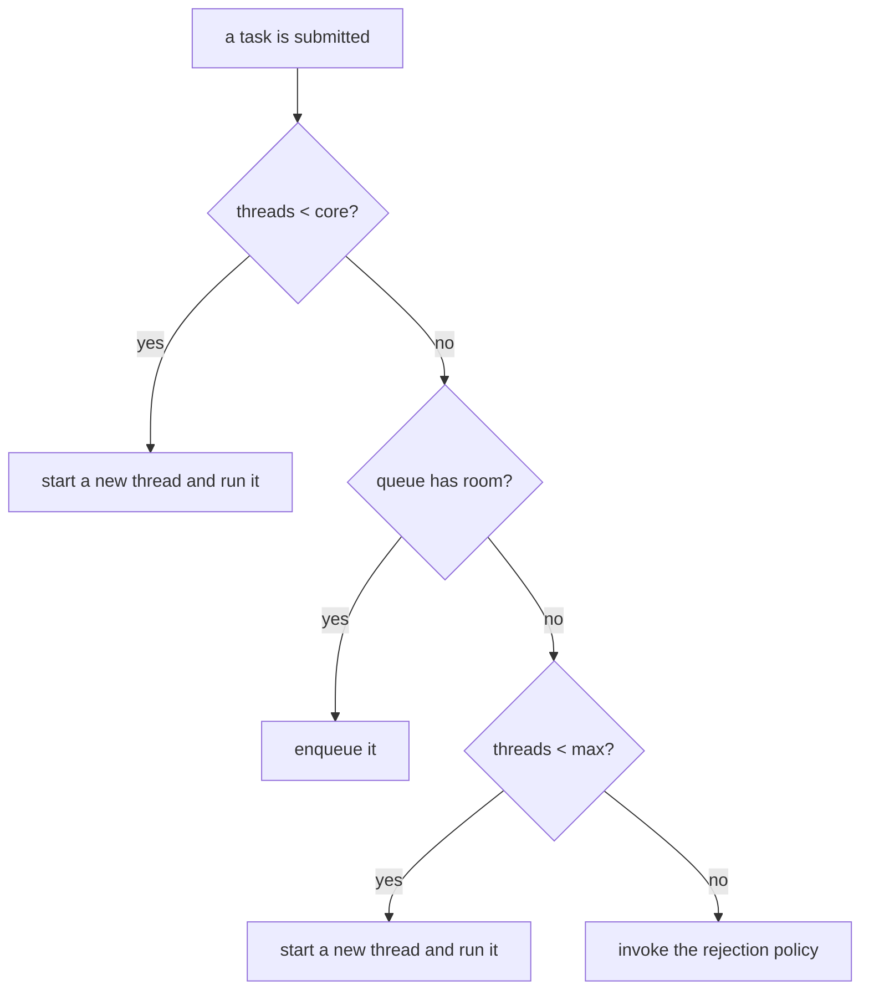

# Chapter 45 · Thread Pools

[简体中文](./45-thread-pool.md) ｜ **English**

---

> Chapter 44's coroutines got down to 0.26 KB apiece, but they hit one boundary they cannot cross: **coroutines cannot run in parallel**. CPU-bound work still lands on real threads. And Chapter 40 measured what threads cost — **12.2 μs to create, 1 MB of reserved stack each**. Hence the bind: we cannot do without threads, and we cannot afford one per task.
>
> **The thread pool is the only way out**: build the expensive thing once, use it ten thousand times. This chapter measured that bill in four languages, and the gap is consistently large: **C# 88.8× (27.2 μs → 0.31 μs per task), Java 15.3× (22.5 μs → 1.48 μs), C++ 7.1×, Python 4.5×**.
>
> But using a pool is only the entry ticket; the real difficulty is **the parameters**. This chapter's **key experiment** produced the curve every language converges on — for CPU-bound work, going from 1 thread up to the core count is nearly linear, and past the core count the **return is exactly zero**: Java `98.4 → 14.8 ms`, C++ `714 → 97 ms`, C# `698 → 97 ms`. Three languages, three runtimes, and the knee lands **at 10 (this machine's core count) in all of them**. I/O-bound work draws the opposite curve: Python measured 64 tasks each waiting 10 ms, and growing the pool from 1 to 32 took `777.7 → 28.8 ms` — **thread count must far exceed the core count to pay off**. Two curves, two formulas.
>
> Then comes the sharpest measurement in the chapter — **the real consequences of the four rejection policies**. Submitting the same 6 tasks to a "1 thread + 1 queue slot" pool: `Abort` ran **[0, 1]** and threw 4 exceptions; `CallerRuns` ran **[0,1,2,3,4,5]** losing nothing (the main thread personally ran 2 and 4); `Discard` ran **[0, 1]** and **said nothing at all**; `DiscardOldest` ran **[0, 5]** — **the same count as Discard, but entirely different survivors**. Those four lines are the shapes of four different production incidents.
>
> Two more measured traps: `Executors.newFixedThreadPool(2)`'s queue is a **LinkedBlockingQueue with 2147463649 remaining capacity**, and 20,000 submitted tasks left **19,998 backlogged** — the classic "unbounded queue + fixed pool = OOM" recipe; and **thread starvation deadlock**: 2 threads both occupied by parent tasks, children queued forever, still unfinished after 600 ms (measured `true`) — **not a lock problem, but the thread resource exhausting itself**.
>
> Finally, two pool philosophies side by side: Java hands you all 7 parameters (misconfigure one and it's an incident), .NET gives one global self-tuning pool (measured thread-injection rate — past `min` it grants **only one new thread every 500 ms**: start times `0×10, 1000, 1501`), and C++ gives you **nothing at all** (40 lines of hand-written boilerplate, the third confirmation of "mechanism, not policy").

## 1. Learning Objectives

By the end of this chapter, you will be able to:

- State the **two** reasons thread pools exist (saving creation cost + capping concurrent resource use) and quantify the first from measurements;
- Write the **two pool-sizing formulas** for CPU-bound and I/O-bound work, and explain why they point in opposite directions (measured curves in three languages);
- Recite `ThreadPoolExecutor`'s growth order, especially the counterintuitive step ② (**never open a new thread while the queue has room**);
- Name each rejection policy's consequence and know why `DiscardPolicy` is the most dangerous (measured survivor task IDs);
- Recognize two classic incidents — **unbounded-queue OOM** and **thread starvation deadlock** — and give the fix for each.

---

## 2. Why This Concept Exists

### The bill Chapters 39/40/44 left behind

```text
Ch. 40 measured: 12.2 μs to create a thread, 1 MB of reserved stack each
Ch. 44 measured: 0.26 KB per coroutine, but【coroutines cannot run in parallel】
                 → CPU-bound work still lands on real threads
→ hence: we cannot do without threads, and cannot afford one per task
```

**How large that bill is** (identical empty tasks, thread-per-task vs a reused pool):

| Language | Tasks | Thread per task | Pooled | Ratio |
|----------|-------|----------------|--------|-------|
| **C#** | 5000 | 136 ms (27.2 μs each) | **2 ms (0.31 μs each)** | **88.8×** |
| **Java** | 5000 | 113 ms (22.5 μs each) | **7 ms (1.48 μs each)** | **15.3×** |
| **C++** | 2000 | 44 ms (22.0 μs each) | **6 ms (3.12 μs each)** | **7.1×** |
| **Python** | 2000 | 54 ms (27.1 μs each) | **12 ms (6.0 μs each)** | **4.5×** |

**Note how consistent the absolute per-task cost is (22–27 μs)** — because they all bottom out in the same `pthread_create`, the same order of magnitude as Chapter 40's measured 12.2 μs (the surplus is each language's object wrapping and join overhead).

### But saving money is only the **first** reason

```text
Reason one (cost):  build the expensive thing once, use it ten thousand times — 4–89× above
Reason two (limit): pool size = concurrency ceiling =【resource protection】
```

**JS measured the second reason**:

```text
unlimited: peak concurrency 200, 11 ms
limit 4:   peak concurrency 4, 551 ms (50.1× slower)
→ you spend 50× the time to guarantee peak concurrency never exceeds 4
→ 200 concurrent database connections will flatten the database; 4 will not
```

**This is the biggest misconception about thread pools**: that they exist only for speed. In most production incidents, the pool's **throttling** matters far more than its savings — it is the system's fuse.

---

## 3. How It Works

### The pool's five parts

```text
① a set of worker threads —— built in advance, looping "take task → run → take again"
② a task queue           —— where tasks wait when every thread is busy
③ a rejection policy     —— what to do when the queue is full too
④ growth/shrink rules    —— when to add threads, when to reclaim idle ones
⑤ a shutdown protocol    —— how to drain in-flight work before exiting
```

The C++ example hand-writes all five — **40 lines in total**, which is the direct price of "the standard library has no thread pool."

### Key experiment one: the CPU-bound pool-size curve

**Three languages, three runtimes, one curve** (40 blocks of computation, 10 cores):

| Pool size | Java | C++ | C# |
|-----------|------|-----|-----|
| 1 | 98.4 ms | 714.1 ms | 697.6 ms |
| 2 | 48.8 ms | 369.6 ms | 318.2 ms |
| 4 | 27.2 ms | 225.0 ms | 194.9 ms |
| 8 | 17.9 ms | 120.8 ms | 118.9 ms |
| **10 (= cores)** | **14.8 ms** | **97.3 ms** | **97.1 ms** |
| 20 | 14.9 ms | 86.7 ms | 87.6 ms |
| 40 | 15.3 ms | 93.8 ms | 87.3 ms |

**Three observations**:

```text
① 1 up to the core count: near-linear (Java 6.6× / C++ 7.3× / C# 7.2×; the loss is scheduling and memory bandwidth)
② past the core count: the return is【exactly zero】—— 10 → 40 threads bought not one millisecond
③ the curve's shape is language-independent: what limits it is the【physical core count】, not the runtime
```

**Why nothing is gained past the core count**: every thread in a CPU-bound workload runs flat out, and 10 cores can run at most 10 of them at once. The 11th thread can only wait to be scheduled, while its existence adds context switches (Chapter 40: microseconds, including TLB flushes and cache pollution) and 1 MB of stack.

### Key experiment two: I/O-bound work draws the **opposite** curve

**Measured in Python** (64 tasks each sleeping 10 ms):

| Pool size | Time | Theoretical floor |
|-----------|------|-------------------|
| 1 | 777.7 ms | 640 ms |
| 2 | 384.3 ms | 320 ms |
| 4 | 196.2 ms | 160 ms |
| 8 | 98.1 ms | 80 ms |
| 16 | 51.8 ms | 40 ms |
| 32 | 28.8 ms | 20 ms |
| **64** | **24.8 ms** | 10 ms |

```text
64 threads >> 10 cores, yet it accelerates all the way
because those threads are【asleep】—— consuming no CPU, only 1 MB of stack and a kernel object
```

**Hence the two formulas**:

```text
CPU-bound: threads ≈ core count            (10 here)
I/O-bound: threads ≈ cores × (1 + wait time / compute time)
           e.g. 90 ms waiting, 10 ms computing → 10 × (1 + 9) = 100 threads
```

**Note the 24.8 ms at size 64 against a 10 ms floor**: the extra 14.8 ms is precisely **the cost of creating 64 threads** (64 × 27 μs ≈ 1.7 ms, plus scheduling and GIL contention). A reminder that **an oversized pool has its own cost**, even for I/O work.

### `ThreadPoolExecutor`'s growth order (the most counterintuitive part)

**Measured in Java** (core=2, queue capacity 2, max=4, submitting 10 tasks):

```text
6 accepted, 4 rejected
→ the pool's total capacity = max + queue = 4 + 2 = 6
```

**The growth order**:



**Step ② is the one everybody trips over**:

```text
While the queue has room,【no】new thread is ever started —— even with max set to 1000
→ so with an unbounded queue and max=200, the max parameter is【never used】
→ the pool stays at core threads forever while tasks pile up in the queue
```

**This explains a common puzzle**: "I set max to 200 — why does load testing show only 8 threads running?" Because your queue is unbounded, and it will never be full.

### Key experiment three: the four rejection policies' real consequences

**Measured in Java** (1 thread + a 1-slot queue, submitting 6 tasks numbered 0–5):

| Policy | Tasks actually run | Exceptions | Real consequence |
|--------|-------------------|------------|------------------|
| `AbortPolicy` (default) | **[0, 1]** | 4 | The caller learns immediately — the only default that loses no data |
| `CallerRunsPolicy` | **[0,1,2,3,4,5]** | 0 | Nothing lost; the main thread personally ran 2 and 4 |
| `DiscardPolicy` | **[0, 1]** | 0 | **Silently drops 4, with no log line at all** |
| `DiscardOldestPolicy` | **[0, 5]** | 0 | Same count as Discard, but **the newest survive** |

**The last two rows are the chapter's most worth-remembering contrast**: `Discard` and `DiscardOldest` both ran 2 tasks, but the former left **[0, 1]** (earliest survive) and the latter **[0, 5]** (newest survives). **The same "dropping" with opposite semantics** — one is first-come-first-served, the other is last-in-wins.

**`CallerRunsPolicy` deserves its own note**: it makes the **submitting thread run** the rejected task itself, which buys a free benefit — **backpressure**:

```text
producer submits → pool is full → the producer is forced to【run the task itself】
→ during which it submits nothing new → the queue stops growing → the system self-throttles
→ the only policy that loses no data, throws nothing, and rate-limits automatically
```

The price: if the submitter is an HTTP accept thread, it stops accepting requests while running a task — **degrading to serial, but better than crashing**.

### Incident one: unbounded queue + fixed pool = OOM

**Measured in Java**:

```text
Executors.newFixedThreadPool(2)'s queue type: LinkedBlockingQueue
after submitting 20000 tasks, backlog in the queue: 19998
queue remaining capacity: 2147463649 (≈ Integer.MAX_VALUE, i.e. unbounded)
```

```text
producer faster than consumer → the queue grows forever → every task object stays reachable
(Ch. 36: reachable means never collected) → the heap is exhausted → OOM
```

**Python and .NET share the disease**: Python measured "998 backlogged after submitting 1000 tasks to a 2-thread pool," and its `ThreadPoolExecutor` queue is likewise unbounded; .NET's global queue has no capacity limit either. **All three languages' defaults put you on the road to OOM** — not a bug, but the inevitable result of defaults that optimize for ease of use.

### Incident two: thread starvation deadlock

**Measured in Java** (a 2-thread fixed pool where parent tasks submit and await children):

```java
Future<Long> child = small.submit(() -> 1L);   // the parent holds a thread while awaiting the child
return 1L + child.get();                       // ← the child is queued, and will never get a thread
```

```text
both threads occupied by "parent" tasks, children queued → still unfinished after 600 ms: true
```

**It is entirely unlike Chapter 41's deadlock**:

```text
Ch. 41's deadlock: two threads each waiting on the other's【lock】
this chapter's:    threads wait for tasks while tasks wait for threads —— the exhausted resource is【the thread itself】
→ jstack shows no lock cycle, and findDeadlockedThreads() detects nothing
   (Chapter 41's measured tooling fails here)
```

**Two fixes**:

```text
A. Use ForkJoinPool for divide-and-conquer —— on join it【goes and executes other tasks】instead of idling
B. Use different pools for parents and children —— bulkhead isolation (a fine-grained Ch. 39 "process isolation")
```

### Work stealing: why ForkJoinPool suits divide-and-conquer

**Measured in Java** (recursive sum of 0..400000000, parallelism 10):

```text
ForkJoinPool: 18 ms
single thread: 102 ms
speedup 5.78×, steal count 75
```

**The algorithm**:

```text
each thread has【its own double-ended queue】
  its own tasks: taken from the【head】(LIFO —— the just-forked child is still in cache, fastest)
  stealing:      taken from someone's【tail】(FIFO —— the tail holds the earliest fork, the largest chunk)
→ the two ends are separate, so the vast majority of task fetches【need no lock】
  (Chapter 41's lock contention nearly vanishes)
→ steal big, steal rarely
```

**C#'s Task uses the same algorithm** (measured: parallelism 1 → 695 ms, unrestricted → 84 ms, a **8.30×** speedup), except .NET made it **the default scheduler** — writing `Task.Run` already puts you on work stealing.

---

## 4. JavaScript

Node is the odd one out: **you never create threads, yet a thread pool decides your throughput** — because the pool hides inside libuv.

### Pool size 4, printed straight onto the timeline (measured)

```text
this machine's CPU cores: 10
UV_THREADPOOL_SIZE default: 4 (unrelated to the core count!)
8 pbkdf2 tasks, total: 42 ms
each task's completion time (ms): 19, 20, 20, 21, 39, 40, 40, 42
```

**The first 4 finish together at ~20 ms, the next 4 together at ~40 ms** — the pool size printed straight onto the timeline. This is the most direct picture for understanding Node performance problems.

### One environment variable changes throughput (measured)

```text
the same 8 tasks with UV_THREADPOOL_SIZE=8: 30 ms (42 ms at the default 4)
→ 1.40× faster
```

**⚠️ Who shares this pool**:

```text
crypto (pbkdf2/scrypt/randomBytes), zlib (compression), dns.lookup, most fs operations
→ one slow pbkdf2 will slow your file reads, because they contend for the same 4 threads
→ Chapter 43's "libuv six phases" — the poll phase is waiting on this pool's callbacks
```

**One of Node's most insidious performance traps**: the code is asynchronous, yet throughput is stuck at 4 — because CPU-heavy async operations (encryption, compression) filled the pool.

### worker_threads: real threads, three orders of magnitude dearer (measured)

```text
creating 4 Workers, each (ms): 12, 10, 10, 10
average 10.5 ms each
→ against an OS thread (Ch. 40 measured 12.2 μs), that is【three orders of magnitude】more
```

**Why so expensive**: each Worker is an **independent V8 isolate** — a new heap, a new event loop, new built-ins. It is closer to Chapter 39's process than to Chapter 40's thread.

```text
→ conclusion: Workers【must】be pooled; never one per task
→ in production use a worker-pool library such as piscina
```

### A concurrency limiter: JS's thread pool (measured)

```javascript
async function withLimit(makeTask, count, limit) {
  let inFlight = 0, peak = 0, idx = 0;
  async function runner() {
    while (idx < count) { idx++; inFlight++; peak = Math.max(peak, inFlight);
                          await makeTask(); inFlight--; }
  }
  await Promise.all(Array.from({ length: limit }, runner));   // ← `limit` "worker threads"
  return { peak };
}
```

```text
unlimited: peak concurrency 200, 11 ms
limit 4:   peak concurrency 4, 551 ms (50.1× slower)
```

**Note this code's shape**: `limit` runners concurrently pulling from one shared index — **exactly a thread pool's structure**, with "threads" replaced by coroutines (Chapter 44). JS has no thread pool, but **it still needs the pooling pattern**.

> **Note**: `p-limit` / `p-queue` are the community standards; `UV_THREADPOOL_SIZE` must be set **before the pool is first used** (changing `process.env` at runtime has no effect); Node 18+'s `AbortSignal` can cancel queued tasks.

---

## 5. Python

Python's first pooling question is not "how big" but **"threads or processes"** — because of the GIL (Chapter 41).

### The GIL makes a CPU-bound thread pool pointless (measured)

```text
4 pure-compute tasks, serial:        363 ms
4 pure-compute tasks, 4-thread pool: 334 ms (1.09× speedup) ← the GIL blocks it
4 pure-compute tasks, 4-process pool: 106 ms (3.41× speedup) ← real parallelism
(the process pool's startup cost, measured separately: 54 ms —— macOS uses spawn, so each child re-imports the module)
```

**1.09× versus 3.41× is the GIL's entire price**. It is also why the standard library ships two pools:

```text
ThreadPoolExecutor  : for I/O-bound work (a thread waiting on I/O releases the GIL)
ProcessPoolExecutor : for CPU-bound work (each process has its own GIL — Chapter 39's isolation)
→ the two APIs are identical; switching means changing one class name
  —— concurrent.futures' best design decision
```

### Default pool sizes (measured)

```text
ThreadPoolExecutor default max_workers = min(32, cpu+4) = 14
ProcessPoolExecutor default max_workers = cpu = 10
```

**These two defaults embody the two formulas**: the thread pool defaults to `cpu+4` (assuming you are doing I/O, so grant a few extra), the process pool to `cpu` (CPU-bound, more is useless). The `min(32, ...)` ceiling prevents spawning 100 threads on a 96-core machine.

### The unbounded queue (measured)

```text
after submitting 1000 tasks to a 2-thread pool, backlog: 998
Python's ThreadPoolExecutor queue has【no limit】—— it piles up as fast as you submit
```

**Python has no rejection policies**, so you build your own:

```python
sem = threading.Semaphore(100)          # at most 100 in-flight tasks
def submit(fn, *a):
    sem.acquire()                        # when full,【block the submitter】—— equivalent to CallerRuns backpressure
    fut = ex.submit(fn, *a)
    fut.add_done_callback(lambda _: sem.release())
    return fut
```

### 3.13's free-threaded mode

```text
Python 3.13 ships a "free-threaded" build (PEP 703) that can disable the GIL
→ with it off, ThreadPoolExecutor【finally works】for CPU-bound tasks
→ but it is experimental, costs ~5% single-threaded performance, and C extensions need porting
```

> **Note**: a `ProcessPoolExecutor` task function must live at module top level (Chapter 39's measured pickle trap); process-pool arguments are serialized, so large arrays want `shared_memory`; `executor.map`'s exceptions are deferred until you iterate the results.

---

## 6. Java

Java's thread pool is the most complete of the five — **and the easiest to misconfigure**, since all seven parameters are yours.

### The seven parameters

```java
new ThreadPoolExecutor(
    corePoolSize,      // ① core threads: resident, never reclaimed
    maximumPoolSize,   // ② max threads: only reached once the queue is full
    keepAliveTime,     // ③ idle lifetime of non-core threads
    unit,              // ④ time unit
    workQueue,         // ⑤ the task queue ← the decisive one
    threadFactory,     // ⑥ thread factory (naming, daemon flag, priority)
    handler);          // ⑦ rejection policy
```

**Parameter ⑤ decides whether the others mean anything** (as measured: with an unbounded queue, `max` is never used).

### The three queues' personalities

| Queue | Behavior | Consequence |
|-------|----------|-------------|
| `LinkedBlockingQueue` (unbounded) | Never full | **`max` disabled + OOM risk** (measured 19,998 backlogged) |
| `ArrayBlockingQueue` (bounded) | Full → growth → rejection | The only correct production choice |
| `SynchronousQueue` (stores nothing) | Triggers growth immediately | Used by `newCachedThreadPool` — **threads can grow to Integer.MAX_VALUE** |

**Each of `Executors`' three factory methods carries a trap**:

```text
newFixedThreadPool      : unbounded queue → OOM (measured)
newCachedThreadPool     : SynchronousQueue + max=MAX_VALUE → thread explosion
newSingleThreadExecutor : likewise an unbounded queue → OOM
→ Alibaba's Java standard【bans】all three, requiring a hand-written ThreadPoolExecutor
```

### The rejection policies, measured (key experiment three)

```text
AbortPolicy (default)   ran 2 (task IDs [0, 1]), threw 4 times
CallerRunsPolicy        ran 6 (task IDs [0,1,2,3,4,5]), threw 0 times, main personally ran 2 4
DiscardPolicy           ran 2 (task IDs [0, 1]), threw 0 times
DiscardOldestPolicy     ran 2 (task IDs [0, 5]), threw 0 times
```

### ForkJoinPool and work stealing (measured)

```text
parallelism (default = cores-1): 10
divide-and-conquer sum 0..400000000: ForkJoinPool 18 ms, single thread 102 ms (5.78×)
results agree: true, steal count: 75
```

**Three differences from an ordinary pool**:

```text
① each thread has its own deque (an ordinary pool has one shared queue → every thread fights one lock)
② on join it does not idle but【executes other tasks】—— naturally immune to starvation deadlock
③ default parallelism = cores-1 (one is left for the submitting thread, which also helps out while joining)
```

**`parallelStream()` uses the common ForkJoinPool** — meaning your parallel stream and everyone else's **share one pool**, and a single slow task drags the whole process. In production, submit explicitly to your own `ForkJoinPool`.

> **Note**: exceptions in pool tasks are swallowed by the `Future` (use `execute` rather than `submit` for them to reach the `UncaughtExceptionHandler`); `ThreadLocal` **persists across tasks** on pooled threads (always `remove()` in a `finally`, or you get both a memory leak and cross-user data bleed); Java 21+'s virtual threads (Chapter 44) mean I/O-bound scenarios **no longer need pool sizing** — one virtual thread per task suffices.

---

## 7. C++

The C++ standard library has **no thread pool** — after Chapter 42 (no standard-library async support) and Chapter 44 (write your own `promise_type`), this is the **third confirmation of "mechanism, not policy."**

### Hand-writing one: 40 lines (measured)

```cpp
void submit(std::function<void()> task) {
    { std::lock_guard<std::mutex> lk(m_); queue_.push(std::move(task)); }
    cv_.notify_one();                     // wake one idle thread (Chapter 41)
}
void worker() {
    for (;;) {
        std::function<void()> task;
        {
            std::unique_lock<std::mutex> lk(m_);
            cv_.wait(lk, [this] { return stop_ || !queue_.empty(); });
            if (stop_ && queue_.empty()) return;
            task = std::move(queue_.front()); queue_.pop();
        }
        task();                           // ⚠️ no try/catch —— a throwing task kills this worker
    }
}
```

```text
2000 empty tasks, thread per task: 44 ms (22.0 μs each)
2000 empty tasks, 8-thread pool:    6 ms (3.12 μs each)
→ pooling is 7.1× faster
```

### What the standard library gives and withholds

```text
std::thread (C++11)     : a thin wrapper over an OS thread; no reuse
std::async (C++11)      : implementations【may choose】whether to pool → unportable behavior
std::jthread (C++20)    : auto-join + stop token, still not a pool
std::execution (C++26)  : finally, standard executors and schedulers
```

**`std::async` is the worst trap**: the standard permits pooling and permits not pooling. MSVC uses the Windows thread pool while libstdc++ creates a fresh thread every time — **the same code differs by an order of magnitude across platforms**.

### Queue backlog, directly visible (measured)

```text
2000 tasks submitted to a 2-thread pool, peak queue backlog: 1994
each std::function is at least 32 bytes → a million backlogged tasks = tens of MB out of nowhere
```

### Six questions a hand-written pool must answer

```text
① How many threads?      CPU-bound ≈ cores; I/O-bound ≈ cores × (1 + wait/compute)
② How big a queue?       unbounded = OOM risk; bounded = you must define rejection
③ What when it's full?   throw / let the submitter run it (backpressure) / drop
④ What if a thread dies? a throwing task() kills the worker —— it must be wrapped in try/catch
⑤ How to shut down?      stop flag + notify_all + join
⑥ Can tasks submit tasks? a parent awaiting a child causes【thread starvation deadlock】(measured in Java)
```

**Question ④ is the one hand-written pools most often miss**: a task throws → the exception escapes `worker()`'s `for(;;)` → that thread is gone for good → the pool quietly drops from 8 threads to 7, to 6, … to 0, and then the whole pool "hangs."

> **Note**: in production use Intel TBB (`task_arena` + work stealing), Boost.Asio (`io_context` + a thread group), or OpenMP (`#pragma omp parallel for`) rather than hand-rolling; `std::packaged_task` adds return-value support to a hand-written pool.

---

## 8. C#

.NET's philosophy is Java's opposite: **one global pool that tunes itself** — you should almost never build your own.

### The global pool's parameters (measured)

```text
this machine's cores: 10
worker threads min/max: 10 / 32767   (min defaults to the core count)
I/O threads min/max: 1 / 1000
```

**`min` is a "no-wait allowance"**: the first `min` threads are available on demand; beyond that, **you wait for injection**.

### The thread injection rate (measured — this section's key data)

```text
16 blocking tasks submitted at once (min=10)
started within 1.5 s: 12 / 16
each task's start time (ms): 0, 0, 0, 0, 0, 0, 0, 0, 0, 0, 1000, 1501
→ the first 10 (= min) start immediately; the 11th waits until 1000 ms to get a thread
→ past min, the pool【injects】roughly one new thread every 500 ms
```

**These numbers explain Chapter 42's 240-second deadlock**:

```text
Ch. 42 measured: pool capped at 4 + 24 .Result tasks → hung for 240 seconds
the cause: all 4 threads blocked in .Result → the pool sees "no progress" and injects slowly
           → one thread per 500 ms → filling out 24 threads takes 10 seconds
           → and each new thread is immediately blocked by another .Result → worse still
→ not "occasional jitter" but the inevitable result of【hill climbing + blocking】
```

**Hill climbing**: .NET does not naively "add a thread when busy." It adds one, watches whether throughput improves, then decides whether to continue. That is clever for CPU-bound work (it avoids over-provisioning) but misjudges **blocking tasks** — a blocked thread produces no throughput, so the algorithm sees "adding threads didn't help."

### Work stealing is the default (measured)

```text
40 blocks of computation, parallelism 1: 695 ms; unrestricted: 84 ms (8.30× speedup)
Task.Run's tasks go into a【local queue】(LIFO, cache-friendly); idle threads steal from others' tails
```

**Versus Java**: Java requires an explicit `ForkJoinPool` for work stealing; .NET's `Task.Run` **has it by default**. That is a clear design advantage of the .NET pool.

### When **not** to use the pool (measured)

```text
inside Task.Run, IsThreadPoolThread = True
inside LongRunning,  IsThreadPoolThread = False   ← it opened a dedicated thread
```

```text
Long-lived work (consumer loops, listeners, background polling) must use TaskCreationOptions.LongRunning
otherwise it permanently occupies a pool thread → effective capacity drops by one
→ with ten such tasks, the pool is ruined
```

> **Note**: `ThreadPool.SetMinThreads` is often used to "relieve" blocking-induced hangs, but that treats the symptom — the fix is not to block on pool threads (Chapter 42); .NET's global queue is likewise **unbounded**, so backpressure needs `Channel<T>` or `SemaphoreSlim`; ASP.NET Core requests run on this pool too, so one blocking endpoint drags down the whole site.

---

## 9. SQL

The database world's thread pool is called a **connection pool** — the same idea, an order of magnitude more expensive.

### Why databases **must** pool

```text
PostgreSQL: one connection = one OS process (Ch. 39's measured fork cost)
MySQL:      one connection = one OS thread (Ch. 40's measured 1 MB stack)
establishing one also needs a TCP handshake + authentication + session setup —— typically 10–100 ms
→ a new connection per request = a new thread per request + a network round trip (the most expensive pooling case)
```

**10–100 ms against the thread pool's saved 22 μs** — connection pooling pays off **three orders of magnitude** more.

### The connection-pool formula: far smaller than you think

```text
The HikariCP / PostgreSQL formula: connections = (cores × 2) + spindles

 4 cores →  9 connections
 8 cores → 17 connections
16 cores → 33 connections
```

**The most counterintuitive line in the chapter**: a 16-core database wants **~33 connections, not 200**. The reason is that **the database side is the bottleneck** — more connections do not create more cores or spindles. The extra ones merely move queuing from the client into the database, while adding lock contention (Chapter 41) and context switches (Chapter 40).

### Pool exhaustion = a site-wide avalanche

```text
one slow query holding a connection for 10 s × 20 connections all held → request 21 starts queuing
requests time out → clients retry → the queue grows → avalanche
(structurally identical to a thread pool's head-of-line blocking)
→ three lines of defense: ① connection timeouts ② statement_timeout ③ split pools by purpose (bulkheads)
```

### Transactions pin a connection

```text
during a transaction the connection cannot return to the pool —— the transaction state lives in it
→ a long transaction occupies a pool slot indefinitely, more insidiously than a slow query
```

**The same class of problem as Chapter 44's "virtual thread pinned by `synchronized`"**: some state is bound to a resource, so the resource cannot be reused.

### Prepared statements: a second layer of pooling

```text
A prepared statement is pooling too: parse + plan once, then send only parameters
Note: prepared statements are【bound to a connection】—— swap connections and you must prepare again
→ which is exactly why PgBouncer's transaction mode cannot use prepared statements
```

> **Engineering note**: the pool size should be **smaller** than the database's `max_connections`, leaving a few for operators; middleware like PgBouncer turns "one pool per application" into "one pool globally," standard at high concurrency; with read/write splitting the read pool can be much larger than the write pool.

---

## 10. Cross-Language Comparison

### ① Thread-pool capabilities

| Feature | JavaScript | Python | Java | C++ | C# |
|---------|-----------|--------|------|-----|-----|
| Standard thread pool | ❌ (only libuv's internal one) | ✅ `ThreadPoolExecutor` | ✅ `ThreadPoolExecutor` | ❌ **none** | ✅ global `ThreadPool` |
| Process pool | manual `child_process` | ✅ `ProcessPoolExecutor` | ❌ | ❌ | ❌ |
| Tunable parameters | 1 (`UV_THREADPOOL_SIZE`) | 1 (`max_workers`) | **7** | all yours | 2 (min/max) |
| Bounded queue | — | ❌ unbounded | optional (factories default unbounded) | your choice | ❌ unbounded |
| Rejection policies | ❌ | ❌ (roll your own semaphore) | ✅ **4 built in** | write your own | ❌ |
| Work stealing | ❌ | ❌ | ✅ `ForkJoinPool` | via TBB | ✅ **default** |
| Pooling payoff (measured) | Worker 10.5 ms each | **4.5×** | **15.3×** | **7.1×** | **88.8×** |
| CPU-bound knee (measured) | — | — | **10 = cores** | **10 = cores** | **10 = cores** |

### ② Key experiment one: one curve in three languages

```text
CPU-bound work, pool size 1 → 40 (10 cores):
  Java: 98.4 → 48.8 → 27.2 → 17.9 → 【14.8】→ 14.9 → 15.3 ms
  C++ : 714  → 370  → 225  → 121  → 【 97 】→  87  →  94  ms
  C#  : 698  → 318  → 195  → 119  → 【 97 】→  88  →  87  ms
                                       ↑ the knee lands on 10 cores in all three
→ three runtimes, three memory models, identical curve shape
→ because the limit is the【physical core count】, not the language
```

### ③ Key experiment two: I/O-bound is the opposite curve

```text
Python, 64 tasks each waiting 10 ms:
  pool 1  → 777.7 ms
  pool 8  →  98.1 ms
  pool 32 →  28.8 ms   ← 32 threads >> 10 cores, still accelerating
  pool 64 →  24.8 ms   (floor is 10 ms; the surplus is creating 64 threads)
```

### ④ Key experiment three: the four rejection policies (Java)

```text
Abort        → ran [0, 1], threw 4 times          (loses nothing; the caller must retry)
CallerRuns   → ran [0,1,2,3,4,5], main ran 2 4    (loses nothing + automatic backpressure)
Discard      → ran [0, 1], silent                 (most dangerous: data vanishes with no log)
DiscardOldest→ ran [0, 5], silent                 (same count, opposite survivors)
```

### ⑤ Common ground and root causes

**Common ground**: every language's pool is built from the same three parts (workers + queue + rejection/throttling); the CPU-bound knee lands on the core count everywhere (measured in three languages); and **nearly every default queue is unbounded** (Java, Python, and .NET all included) — because defaults optimize for "no errors" rather than "no incidents."

**Root causes**:

- **Java gives you seven parameters** — born on the server, it treats tuning as the user's job; the price is that a misconfiguration is a production incident, to the point where large companies ban the convenience factories;
- **.NET gives one global pool plus hill climbing** — it assumes the runtime understands the current load better than you; the price is misjudging blocking work (measured: one thread injected per 500 ms, the cause of Chapter 42's 240-second hang);
- **Python provides two pools** — because the GIL makes "threads or processes" a mandatory question (measured 1.09× vs 3.41×);
- **C++ provides nothing** — the inevitable result of zero-overhead philosophy, exactly as with Chapter 42's coroutines and Chapter 44's `promise_type`;
- **Node hides its pool** — because JS is single-threaded (Chapter 43), so the pool serves only C++-layer blocking operations; the price is that it becomes the most invisible bottleneck (measured at 4 threads by default, unrelated to 10 cores).

---

## 11. Implementation Comparison

| Runtime | Pool implementation | Key details |
|---------|--------------------|-------------|
| **libuv** (Node) | a fixed thread array + one shared queue | default 4, `UV_THREADPOOL_SIZE` up to 1024; immutable after startup |
| **CPython** | `queue.SimpleQueue` + threads created on demand | threads are created lazily; `atexit` waits for all tasks on shutdown |
| **JVM** | `ThreadPoolExecutor`: one `AtomicInteger` `ctl` packing "run state + thread count" | 3 high bits for state, 29 low bits for the count → one CAS changes both (Chapter 41's lock-free trick) |
| **ForkJoinPool** | one `WorkQueue` deque per thread + a global steal index | head LIFO, tail FIFO; `join` executes other tasks instead of blocking |
| **CLR** | a global queue + per-thread local queues + hill climbing | local queues are LIFO; injection ≈ 2 threads/second (measured 1000 ms, 1501 ms) |

**One implementation detail worth remembering**: the JVM stores both the pool's run state and its thread count in **a single 32-bit integer**, changing both atomically with one CAS — the standard library's most elegant application of Chapter 41's lock-free programming.

---

## 12. Performance Analysis

### What pooling saves

| Item | Per-task cost (measured) | Notes |
|------|-------------------------|-------|
| Creating a thread | **22–27 μs** | Highly consistent across four languages (the same `pthread_create`) |
| After pooling | **0.31–6.0 μs** | C# 0.31, Java 1.48, C++ 3.12, Python 6.0 |
| Stack memory | **1 MB per thread** | Chapter 31's measurement; the total is fixed once pooled |

### But a pool is not free

```text
① the queue itself costs memory: C++ measured a peak backlog of 1994 std::functions (≥32 bytes each)
② the task objects cost memory: Java measured 19998 backlogged task objects → the real source of OOM
③ context switching persists: past the core count the return is zero or【negative】(Java 14.8 → 15.3 ms)
④ ThreadLocal lingers: pooled threads are reused across tasks → the previous task's ThreadLocal is still there
```

### Sizing, quantified

```text
CPU-bound: N = core count
  evidence: three languages' curves all knee at 10 (this machine's cores); past it, zero return

I/O-bound: N = cores × (1 + wait time / compute time)
  evidence: Python's 64 tasks of 10 ms waiting still accelerate at pool 32 (32 >> 10 cores)
  e.g. 90 ms waiting, 10 ms computing → 10 × 10 = 100 threads

Mixed: split into two pools (CPU + I/O) rather than picking a middle value
```

> ⚠️ **The formulas are a starting point.** Real sizing comes from load testing — the wait/compute ratio shifts with production load, and memory bandwidth, GC pressure (Chapter 36), and lock contention (Chapter 41) all pull the real knee earlier. The fact that C++ and C# were still ~10% faster at pool 20 than at pool 10 shows this machine's actual knee sits slightly above the core count.

---

## 13. Engineering Practice

| Scenario | ✅ Recommended | ❌ Avoid | Why |
|----------|--------------|---------|-----|
| Building a Java pool | a hand-written `ThreadPoolExecutor` | the three `Executors` factories | measured 19,998 backlogged on an unbounded queue |
| Choosing a queue | `ArrayBlockingQueue` (bounded) | `LinkedBlockingQueue` (unbounded) | bounded gives backpressure; unbounded gives only OOM |
| Rejection policy | `CallerRunsPolicy`, or `Abort` + retry | `DiscardPolicy` | measured silent dropping with no log |
| CPU-bound pool size | the core count | cores × 10 | measured zero return past the core count |
| I/O-bound pool size | cores × (1 + wait/compute) | the core count | measured still accelerating at pool 32 |
| Divide-and-conquer | `ForkJoinPool` | a fixed pool | measured thread starvation deadlock |
| Long-running tasks | C# `LongRunning` / a dedicated thread | the shared pool | they occupy a pool thread permanently |
| Node CPU-heavy async | raise `UV_THREADPOOL_SIZE` | the default 4 | measured 1.40× between 4 and 8 |
| Node Workers | a worker pool such as piscina | one Worker per task | measured 10.5 ms to create |
| Python CPU-bound | `ProcessPoolExecutor` | `ThreadPoolExecutor` | measured only 1.09× under the GIL |
| Database connections | cores × 2 + spindles (a few dozen) | 200+ connections | the database side is the bottleneck |
| `ThreadLocal` on pooled threads | `remove()` in a `finally` | leaving it set | memory leak + cross-user data bleed |
| Mixed workloads | split pools by purpose (bulkheads) | one big pool | slow tasks cause head-of-line blocking |

### The rule of thumb

```text
Is the work CPU-bound or I/O-bound? → decides【how big】(the two formulas)
Do tasks wait on each other?        → if so, split pools or use ForkJoinPool (else starvation deadlock)
Can submission outpace consumption? → if so, a bounded queue plus backpressure is mandatory (else OOM)
Will a task occupy a thread long-term? → if so, keep it out of the shared pool
```

---

## 14. Best Practices

- **Always bound the queue**: it is the only measure that actually prevents OOM; measured, all three languages' defaults are unbounded.
- **Prefer `CallerRunsPolicy`**: measured, it is the only policy that loses no data, throws nothing, and throttles automatically; if the caller must not block, use `Abort` plus retry at a higher layer.
- **Never use `DiscardPolicy`**: measured, it drops silently and leaves no trace — you will discover it months later in a reconciliation mismatch.
- **Name your pool's threads**: set names in the `ThreadFactory`, or `jstack` (Chapter 41) prints nothing but `pool-1-thread-7` and you cannot tell which pool failed.
- **Cores for CPU-bound, the formula for I/O-bound, split pools for mixed**: measured, the knee is at the core count, and a middle value for mixed work pleases neither side.
- **Always use `ForkJoinPool` for divide-and-conquer**: measured, an ordinary pool deadlocks by starvation — and `findDeadlockedThreads()` cannot see it.
- **Clear `ThreadLocal` in a `finally` on pooled threads**: threads are reused, so the previous task's data bleeds into the next.
- **Load-test the final value**: the formula gives a starting point, measurement gives the answer — on this machine C++ and C# were still 10% faster at pool 20 than at pool 10.

---

## 15. Common Pitfalls

**Pitfall 1 · An unbounded queue makes `maximumPoolSize` decorative**

```java
new ThreadPoolExecutor(8, 200, 60, SECONDS, new LinkedBlockingQueue<>());
// ⚠️ the queue is never full → threads stay at 8 forever → max=200 is never used once
```

**Avoid it**: use a bounded queue such as `ArrayBlockingQueue(1000)` so `max` takes effect.

**Pitfall 2 · `newCachedThreadPool`'s thread explosion**

```java
ExecutorService ex = Executors.newCachedThreadPool();
// ⚠️ SynchronousQueue + max=Integer.MAX_VALUE → thousands of threads at peak → OOM
```

**Avoid it**: hand-write a `ThreadPoolExecutor` and give `max` a real ceiling.

**Pitfall 3 · `submit` swallows exceptions**

```java
pool.submit(() -> { throw new RuntimeException("boom"); });
// ⚠️ the exception is stored in the Future; if nobody get()s, it never surfaces — the logs stay spotless
```

**Avoid it**: use `execute` (exceptions reach the `UncaughtExceptionHandler`), or `get()` every `Future`, or try/catch inside the task body.

**Pitfall 4 · `ThreadLocal` lingering on pooled threads**

```java
pool.submit(() -> { userContext.set(currentUser); doWork(); });
// ⚠️ no remove() → the next task on this thread reads the【previous user's】identity
```

**Avoid it**: `try { ... } finally { userContext.remove(); }` — this is both a memory leak and a security incident.

**Pitfall 5 · Blocking on a pool thread for a task in the same pool**

```java
pool.submit(() -> pool.submit(other).get());
// ⚠️ thread starvation deadlock (measured: still unfinished after 600 ms)
```

**Avoid it**: use a `ForkJoinPool`, or give parents and children separate pools.

**Pitfall 6 · CPU-heavy async operations hogging Node's libuv pool**

```javascript
crypto.pbkdf2(...)   // ⚠️ fills all 4 pool threads → every fs.readFile in the process queues up
```

**Avoid it**: raise `UV_THREADPOOL_SIZE` (measured 1.40× from 4 to 8), or move encryption/compression into a Worker pool.

**Pitfall 7 · An oversized connection pool**

```text
maxPoolSize = 200   # ⚠️ the database has 16 cores; 200 connections only fight each other for locks
```

**Avoid it**: start from `cores × 2 + spindles` (16 cores ≈ 33), then load-test to refine.

---

## 16. Interview Questions

**Basic**

1. What are the two reasons thread pools exist? Why is "saving creation cost" an incomplete answer?
2. What are the pool-sizing formulas for CPU-bound and I/O-bound work? Why do they point in opposite directions?
3. How do `corePoolSize` and `maximumPoolSize` differ? When is `max` never used?

**Intermediate**

4. **Describe `ThreadPoolExecutor`'s growth order completely. Why is the second step the most counterintuitive?**
5. What is each rejection policy's consequence? Why does `CallerRunsPolicy` produce backpressure?
6. **`DiscardPolicy` and `DiscardOldestPolicy` both "drop tasks" — how do they differ? (Answer with the measured survivor IDs.)**

**Advanced**

7. **What is thread starvation deadlock? How does it differ fundamentally from an ordinary deadlock (Chapter 41)? Why can deadlock detectors not find it?**
8. Why does work stealing use a deque? Why take from your own head but steal from another's tail?
9. What is .NET's thread injection rate? How does it explain a "pool capped at 4 + `.Result`" hanging for minutes?

---

## 17. Exercises

**Basic**

1. Measure the thread-per-task vs pooled ratio in your language of choice and compare it with this chapter's four.
2. Plot your machine's CPU-bound pool-size curve, find the knee, and verify it equals the core count.
3. Run the same batch of I/O tasks at several pool sizes and verify the I/O curve runs opposite to the CPU one.

**Intermediate**

4. **Reproduce key experiment three**: submit 6 numbered tasks to a `core=1, queue=1` pool and record which survive under each of the four rejection policies.
5. Reproduce the unbounded-queue backlog: submit 100,000 tasks to a 2-thread pool and watch heap growth (with Chapter 36's tooling).
6. Build a backpressured batch processor with `CallerRunsPolicy` and verify the producer self-throttles.

**Challenge**

7. **Reproduce thread starvation deadlock**, then observe it with `jstack` — confirming that `findDeadlockedThreads()` genuinely cannot see it.
8. Hand-write a C++ thread pool with a **bounded queue + rejection policy + exception safety** (adding question ④ that this chapter's measured version lacks).
9. Run the same divide-and-conquer task on a `ForkJoinPool` and a fixed pool, measuring work stealing's speedup and steal count.

---

## 18. Chapter Summary

**One sentence**: thread pools exist to **build the expensive thread once and use it ten thousand times** (measured C# 88.8× / Java 15.3× / C++ 7.1× / Python 4.5×), but the real difficulty is **the parameters** — this chapter measured one identical CPU-bound curve in three languages (near-linear from 1 up to the core count, **exactly zero return past it**, with the knee at 10 in all three) and one opposite I/O-bound curve (Python still accelerating at pool 32, three times the core count), yielding two formulas; the four rejection policies' consequences were nailed down by measurement (`Abort` left **[0,1]** and threw 4 times, `CallerRuns` lost nothing and self-throttled, `Discard` left **[0,1]** silently, `DiscardOldest` left **[0,5]** — same count, opposite survivors); the two classic incidents each have measured evidence too — `newFixedThreadPool`'s unbounded queue backlogging **19,998** tasks (the classic OOM recipe) and **thread starvation deadlock** (2 threads held by parents, still unfinished after 600 ms, invisible to deadlock detectors); and finally the three pool philosophies diverge — Java hands over seven parameters (misconfigure one and it's an incident), .NET gives one self-tuning global pool (measured: one thread injected per 500 ms past `min`, precisely the cause of Chapter 42's 240-second hang), and C++ gives nothing at all (40 lines of hand-written boilerplate, the third confirmation of "mechanism, not policy").

**Key takeaways**

- **Two reasons**: saving creation cost (measured 4.5–88.8×) plus **capping concurrency to protect resources** (JS measured: limit 4 is 50× slower but guarantees peak concurrency never exceeds 4).
- **Key experiment one** (three languages): the CPU-bound knee is at 10 cores everywhere; past it, zero return.
- **Key experiment two** (Python): the I/O-bound curve is the opposite — pool 32 >> 10 cores and still accelerating.
- **Key experiment three** (Java): the rejection policies' survivor IDs — `Discard` [0,1] vs `DiscardOldest` [0,5].
- **Growth order**: core → **fill the queue** → max → reject; step two is why an unbounded queue disables `max`.
- **Two incidents**: 19,998 backlogged → OOM; starvation deadlock unfinished after 600 ms and invisible to tooling.
- **Work stealing**: a deque, own head (LIFO, cache-friendly), others' tails (FIFO, coarse-grained); Java measured 5.78×, C# 8.30×.
- **Connection pools**: `cores × 2 + spindles` (16 cores ≈ 33, not 200) — the database side is the bottleneck.

**Checklist**

- [ ] I can state the two reasons for thread pools and cite a measurement for each.
- [ ] I can write both sizing formulas and explain why they point in opposite directions.
- [ ] I can recite the growth order and explain why an unbounded queue disables `max`.
- [ ] I know each rejection policy's consequence, especially `Discard` versus `DiscardOldest`.
- [ ] I can recognize thread starvation deadlock and say why it goes undetected.

**Part 6 complete**: from Chapter 39's processes (isolated but expensive), Chapter 40's threads (cheap but dangerous), Chapter 41's locks (safe but deadlock-prone), Chapter 42's asynchrony (efficient but colored), Chapter 43's event loop (ten-thousand concurrency on one thread), Chapter 44's coroutines (0.26 KB apiece), to this chapter's thread pools (reusing the expensive thing) — **concurrency's seven concepts are seven layers of one question: how to make finite execution resources serve unbounded work**.

**Next chapter**: Part 7 turns to **databases**. Chapter 46 answers a deceptively simple question — **beyond memory and files, why do we need a database at all?** The first six parts covered memory thoroughly (Chapters 31–38) and concurrency thoroughly (Chapters 39–45); databases solve exactly what neither can: **data outliving the process** (durability — we will measure `fsync`'s real cost, and Chapter 43's accidental `F_BARRIERFSYNC` finding will finally get its full explanation), **many processes modifying the same data without corrupting it** (concurrency control — Chapter 41's locks graduate into MVCC here), and **finding one row among a hundred million without scanning a hundred million** (indexes, Chapter 49's subject). We will implement the same dataset twice — once with "files plus hand-written code" and once with a database — and measure the gap.

---

## 19. Further Reading

- <a href="https://docs.oracle.com/en/java/javase/17/docs/api/java.base/java/util/concurrent/ThreadPoolExecutor.html" target="_blank" rel="noopener">Java API · ThreadPoolExecutor</a> — the authoritative definition of the seven parameters and four rejection policies.
- <a href="https://docs.oracle.com/en/java/javase/17/docs/api/java.base/java/util/concurrent/ForkJoinPool.html" target="_blank" rel="noopener">Java API · ForkJoinPool</a> — work stealing, officially.
- <a href="https://docs.python.org/3/library/concurrent.futures.html" target="_blank" rel="noopener">Python Docs · concurrent.futures</a> — the unified interface over thread and process pools.
- <a href="https://learn.microsoft.com/en-us/dotnet/standard/threading/the-managed-thread-pool" target="_blank" rel="noopener">Microsoft Learn · The managed thread pool</a> — min/max and the thread injection mechanism.
- <a href="https://docs.libuv.org/en/v1.x/threadpool.html" target="_blank" rel="noopener">libuv Docs · Thread pool work scheduling</a> — where Node's four threads come from.
- <a href="https://github.com/brettwooldridge/HikariCP/wiki/About-Pool-Sizing" target="_blank" rel="noopener">HikariCP · About Pool Sizing</a> — the original argument behind the connection-pool formula.
- <a href="https://en.wikipedia.org/wiki/Work_stealing" target="_blank" rel="noopener">Wikipedia · Work stealing</a> — the algorithm's theoretical background.
- <a href="https://en.wikipedia.org/wiki/Little%27s_law" target="_blank" rel="noopener">Wikipedia · Little's law</a> — the source of "concurrency = throughput × latency."
- <a href="https://en.cppreference.com/w/cpp/thread" target="_blank" rel="noopener">cppreference · Thread support library</a> — confirming the standard library really has no thread pool.
