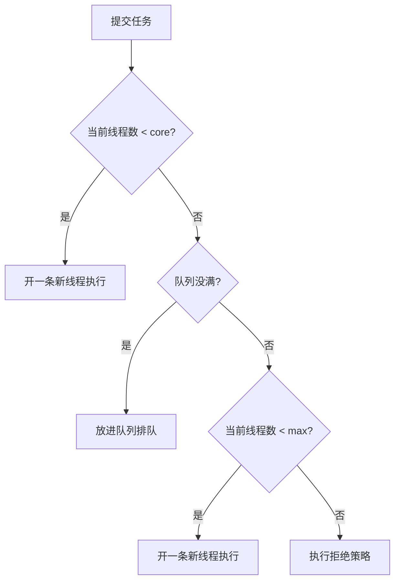

# 第 45 章 · 线程池

**简体中文** ｜ [English](./45-thread-pool.en-US.md)

---

> 第 44 章的协程轻到 0.26 KB 一个，但它有一个无法绕过的边界：**协程不能并行**。CPU 密集的活最终还得落到真线程上。而第 40 章实测过线程的价钱——**创建 12.2 μs、每条保留 1 MB 栈**。于是矛盾出现了：既离不开线程，又付不起「每任务一条线程」的账。
>
> **线程池就是这个矛盾的唯一解**：把昂贵的东西建一次，用一万次。本章实测了四种语言的这笔账，差距一致地大：**Java 15.3x（22.5 μs → 1.48 μs 每任务）、C# 88.8x（27.2 μs → 0.31 μs）、C++ 7.1x、Python 4.5x**。
>
> 但「用池」只是入场券，真正的难题是**参数**。本章的**钥匙实验**给出了那条所有语言都收敛的曲线——CPU 密集任务的池大小从 1 加到核心数时几乎线性加速，越过核心数后**收益完全归零**：Java `98.4 → 14.8 ms`、C++ `714 → 97 ms`、C# `698 → 97 ms`，三种语言、三套运行时，拐点**都在 10（本机核心数）**。而 I/O 密集任务是另一条曲线：Python 实测 64 个 10 ms 的等待型任务，池从 1 加到 32，耗时 `777.7 → 28.8 ms` 一路下降——**线程数远大于核心数才划算**。两条曲线，两个公式。
>
> 然后是本章最锋利的一组实测——**四种拒绝策略的真实后果**。同样提交 6 个任务给一个「1 线程 + 1 队列」的池：`Abort` 执行 **[0, 1]** 并抛 4 次异常；`CallerRuns` 执行 **[0,1,2,3,4,5]** 一个不丢（主线程亲自跑了 2 和 4）；`Discard` 执行 **[0, 1]** 且**一声不吭**；`DiscardOldest` 执行 **[0, 5]**——**数量与 Discard 相同，活下来的任务却完全不同**。这四行输出就是四种生产事故的形状。
>
> 还有两个实测出来的陷阱：`Executors.newFixedThreadPool(2)` 的队列是 **LinkedBlockingQueue，剩余容量 2147463649**，提交两万个任务后**积压 19998 个**——这就是「无界队列 + 固定线程池 = OOM」的经典配方；以及**线程饥饿死锁**：2 条线程被父任务占满、子任务永远排在队列里，600 ms 后仍未完成（实测 `true`）——**不是锁的问题，是线程这个资源被自己耗尽了**。
>
> 最后是两种池哲学的对照：Java 把 7 个参数全交给你（配错就是事故），.NET 只给一个全局池自动调参（实测线程注入速率——超过 min 之后**每 500 ms 才多给一条线程**：开始时刻 `0×10, 1000, 1501`），而 C++ 依然**什么都不给**（40 行手写样板，第三次印证「给机制不给策略」）。

## 1. 学习目标

学完本章，你将能够：

- 说清线程池存在的**两个**理由（省创建成本 + 限并发资源），并用实测数据量化第一个；
- 写出 CPU 密集与 I/O 密集的**两个池大小公式**，并解释为什么它们方向相反（三语言实测曲线）；
- 复述 `ThreadPoolExecutor` 的扩容顺序，尤其是最反直觉的第 ② 步（**队列没满绝不开新线程**）；
- 说出四种拒绝策略各自的后果，并知道为什么 `DiscardPolicy` 最危险（实测存活任务号）；
- 识别两个经典事故：**无界队列 OOM** 与**线程饥饿死锁**，并给出各自的解法。

---

## 2. 为什么会出现这个概念

### 第 39/40/44 章留下的账

```text
第 40 章实测: 创建一条线程 12.2 μs，每条保留 1 MB 栈
第 44 章实测: 协程 0.26 KB 一个，但【协程不能并行】——CPU 密集的活还得落到真线程上
→ 于是: 既离不开线程，又付不起「每任务一条线程」
```

**实测这笔账有多大**（同样的空任务，每任务新建线程 vs 复用池）：

| 语言 | 任务数 | 每任务一线程 | 线程池复用 | 倍数 |
|------|--------|-------------|-----------|------|
| **C#** | 5000 | 136 ms（27.2 μs/个） | **2 ms（0.31 μs/个）** | **88.8x** |
| **Java** | 5000 | 113 ms（22.5 μs/个） | **7 ms（1.48 μs/个）** | **15.3x** |
| **C++** | 2000 | 44 ms（22.0 μs/个） | **6 ms（3.12 μs/个）** | **7.1x** |
| **Python** | 2000 | 54 ms（27.1 μs/个） | **12 ms（6.0 μs/个）** | **4.5x** |

**注意每任务的绝对成本高度一致（22~27 μs）**——因为它们最终都是同一个 `pthread_create`，与第 40 章实测的 12.2 μs 同一个数量级（多出的部分是各语言的对象包装与 join 开销）。

### 但省成本只是【第一个】理由

```text
理由一（省钱）: 昂贵的东西建一次，用一万次 —— 上表的 4~89 倍
理由二（限流）: 池大小 = 并发上限 = 【资源保护】
```

**JS 实测的第二个理由**：

```text
不限流: 峰值并发 200，耗时 11 ms
限流 4: 峰值并发 4，耗时 551 ms（慢 50.1x）
→ 你用 50 倍的时间，换来了「峰值并发永远不超过 4」
→ 200 个并发数据库连接会打垮数据库；4 个不会
```

**这是很多人对线程池的最大误解**：以为池只是为了快。其实在多数生产事故里，池的**限流**作用比省钱重要得多——它是系统的保险丝。

---

## 3. 底层原理

### 池的五个部件

```text
① 工作线程集合    —— 预先建好，循环「取任务 → 执行 → 再取」
② 任务队列        —— 线程都忙时，任务在这里排队
③ 拒绝策略        —— 队列也满了怎么办
④ 扩容/缩容规则   —— 什么时候多开线程、什么时候回收空闲线程
⑤ 停机协议        —— 如何优雅地把在途任务跑完再退出
```

C++ 版实测手写了这五件套，**一共 40 行**——这也是「标准库没有线程池」的直接代价。

### 钥匙实验一：CPU 密集任务的池大小曲线

**三种语言、三套运行时，同一条曲线**（40 块计算，本机 10 核）：

| 池大小 | Java | C++ | C# |
|--------|------|-----|-----|
| 1 | 98.4 ms | 714.1 ms | 697.6 ms |
| 2 | 48.8 ms | 369.6 ms | 318.2 ms |
| 4 | 27.2 ms | 225.0 ms | 194.9 ms |
| 8 | 17.9 ms | 120.8 ms | 118.9 ms |
| **10（= 核心数）** | **14.8 ms** | **97.3 ms** | **97.1 ms** |
| 20 | 14.9 ms | 86.7 ms | 87.6 ms |
| 40 | 15.3 ms | 93.8 ms | 87.3 ms |

**三个观察**：

```text
① 从 1 加到核心数: 近线性加速（Java 6.6x / C++ 7.3x / C# 7.2x，损耗来自调度与内存带宽）
② 越过核心数: 收益【完全归零】——10 → 40 条线程，一毫秒都没快
③ 曲线形状与语言无关: 因为限制它的是【物理核心数】，不是运行时
```

**为什么越过核心数就没用了**：CPU 密集任务的每条线程都在满负荷跑，10 个核心同时最多跑 10 条。第 11 条线程只能等着被调度，而它的存在还额外带来了上下文切换（第 40 章：微秒级，含 TLB 刷新与缓存污染）与 1 MB 栈。

### 钥匙实验二：I/O 密集任务是【相反】的曲线

**Python 实测**（64 个各睡 10 ms 的任务）：

| 池大小 | 耗时 | 理论下限 |
|--------|------|---------|
| 1 | 777.7 ms | 640 ms |
| 2 | 384.3 ms | 320 ms |
| 4 | 196.2 ms | 160 ms |
| 8 | 98.1 ms | 80 ms |
| 16 | 51.8 ms | 40 ms |
| 32 | 28.8 ms | 20 ms |
| **64** | **24.8 ms** | 10 ms |

```text
线程数 64 >> 核心数 10，却一路加速到底
因为这些线程【在睡觉】——不占 CPU，只占 1 MB 栈和一个内核对象
```

**两个公式由此而来**：

```text
CPU 密集: 线程数 ≈ 核心数            （本机 10）
I/O 密集: 线程数 ≈ 核心数 × (1 + 等待时间/计算时间)
          例：等待 90ms、计算 10ms → 10 × (1 + 9) = 100 条
```

**注意 64 那一行的 24.8 ms vs 理论 10 ms**：多出的 14.8 ms 正是**创建 64 条线程的成本**（64 × 27 μs ≈ 1.7 ms，加上调度与 GIL 争用）。这提醒我们：**池太大本身也有代价**，即使任务是 I/O 型。

### ThreadPoolExecutor 的扩容顺序（最反直觉的一段）

**Java 实测**（core=2、队列容量 2、max=4，提交 10 个任务）：

```text
被接受 6 个，被拒绝 4 个
→ 池的总容量 = max + 队列 = 4 + 2 = 6
```

**扩容顺序**：



**第 ② 步是所有人都会踩的坑**：

```text
队列没满时【绝不】开新线程 —— 哪怕 max 设成 1000
→ 所以「无界队列 + max=200」时，max 这个参数【永远用不上】
→ 池会永远停在 core 条线程，任务全在队列里堆着
```

**这解释了一个常见困惑**：「我把 max 设成 200，为什么压测时只看到 8 条线程在跑？」——因为你的队列是无界的，它永远不会满。

### 钥匙实验三：四种拒绝策略的真实后果

**Java 实测**（1 条线程 + 容量 1 的队列，提交 6 个编号 0~5 的任务）：

| 策略 | 实际执行的任务号 | 抛异常 | 真实后果 |
|------|----------------|--------|---------|
| `AbortPolicy`（默认） | **[0, 1]** | 4 次 | 调用方立刻知道——唯一不丢数据的默认 |
| `CallerRunsPolicy` | **[0,1,2,3,4,5]** | 0 次 | 一个不丢；主线程亲自跑了 2 和 4 |
| `DiscardPolicy` | **[0, 1]** | 0 次 | **静默丢弃 4 个，无任何日志** |
| `DiscardOldestPolicy` | **[0, 5]** | 0 次 | 数量与 Discard 相同，**活下来的却是最新的** |

**最后两行是本章最值得记住的对比**：`Discard` 与 `DiscardOldest` 都执行了 2 个任务，但前者留下 **[0, 1]**（最早的活），后者留下 **[0, 5]**（最新的活）。**同样的"丢弃"，语义完全相反**——一个是"先到先得"，一个是"后来居上"。

**`CallerRunsPolicy` 值得单独说**：它让**提交者线程亲自执行**被拒绝的任务。这带来一个免费的好处——**反压（backpressure）**：

```text
生产者提交 → 池满 → 生产者【自己】被迫去跑任务 → 它这段时间没法提交新任务
→ 队列自然停止增长，系统自动降速
→ 这是唯一「不丢数据 + 不抛异常 + 自动限流」的策略
```

代价是：如果提交者是 HTTP 接收线程，它跑任务时就不接收新请求了——**降级为串行，但比崩溃好**。

### 事故一：无界队列 + 固定线程池 = OOM

**Java 实测**：

```text
Executors.newFixedThreadPool(2) 的队列类型: LinkedBlockingQueue
提交 20000 个任务后，队列里积压: 19998 个
队列剩余容量: 2147463649（≈ Integer.MAX_VALUE，等于无界）
```

```text
生产者比消费者快 → 队列一直涨 → 任务对象全都可达（第 36 章：可达即不回收）
→ 堆被撑爆 → OOM
```

**Python 与 .NET 同病**：Python 实测「向 2 线程的池提交 1000 个任务后积压 998 个」，其 `ThreadPoolExecutor` 队列同样无上限；.NET 的全局队列也没有容量上限。**三种语言的默认配置都把你放在 OOM 的轨道上**——这不是 bug，是「默认值优先照顾易用性」的必然结果。

### 事故二：线程饥饿死锁

**Java 实测**（2 条线程的固定池，父任务提交子任务并等待）：

```java
Future<Long> child = small.submit(() -> 1L);   // 父任务占着线程，等子任务
return 1L + child.get();                       // ← 子任务排在队列里，永远等不到线程
```

```text
2 条线程都被「父任务」占据，子任务排在队列里 → 600 ms 后仍未完成: true
```

**它与第 41 章的死锁完全不同**：

```text
第 41 章的死锁: 两个线程互相等对方的【锁】
本章的死锁:     线程在等任务，而任务在等线程 —— 耗尽的是【线程这个资源】本身
→ jstack 里看不到任何锁的环，findDeadlockedThreads() 也检测不到（第 41 章实测的工具在这里失灵）
```

**两个解法**：

```text
A. 分治任务用 ForkJoinPool —— join 时它会【去帮忙执行别的任务】而不是干等
B. 父任务与子任务用不同的池 —— 舱壁隔离（第 39 章「进程隔离」的细粒度版）
```

### 工作窃取：ForkJoinPool 为什么更适合分治

**Java 实测**（分治求和 0..400000000，并行度 10）：

```text
ForkJoinPool: 18 ms
单线程:       102 ms
加速 5.78x，窃取次数 75
```

**算法**：

```text
每条线程有【自己的双端队列】
  自己的任务: 从【队头】取（LIFO —— 刚 fork 的子任务还在缓存里，最快）
  偷别人的:   从【队尾】偷（FIFO —— 队尾是最早 fork 的，粒度最大）
→ 两端分离，绝大多数取任务【不需要加锁】（第 41 章的锁竞争几乎消失）
→ 偷就偷个大的，一次偷够本，减少偷的频率
```

**C# 的 Task 用的是同一个算法**（实测并行度 1 → 695 ms，不限并行度 → 84 ms，加速 **8.30x**），只不过 .NET 把它做成了**默认调度器**——你写 `Task.Run` 就已经在用工作窃取了。

---

## 4. JavaScript

Node 最特别：**你不创建线程，但线程池决定你的吞吐**——因为池藏在 libuv 里。

### 池大小 4 直接印在时间轴上（实测）

```text
本机 CPU 核心数: 10
UV_THREADPOOL_SIZE 默认值: 4（与核心数无关！）
8 个 pbkdf2 任务总耗时: 42 ms
各任务完成时刻(ms): 19, 20, 20, 21, 39, 40, 40, 42
```

**前 4 个在 ~20 ms 一起完成，后 4 个在 ~40 ms 一起完成**——池大小 4 就这样直接印在了时间轴上。这是理解 Node 性能问题最直观的一张图。

### 一个环境变量改变吞吐（实测）

```text
同样 8 个任务，UV_THREADPOOL_SIZE=8: 30 ms（默认 4 时 42 ms）
→ 加速 1.40x
```

**⚠️ 这个池被谁共用**：

```text
crypto（pbkdf2/scrypt/randomBytes）、zlib（压缩）、dns.lookup、大部分 fs 操作
→ 一个慢的 pbkdf2 会拖慢你的文件读取，因为它们抢同一个 4 线程的池
→ 第 43 章「libuv 六阶段」里的 poll 阶段等的就是这个池的回调
```

**这是 Node 最隐蔽的性能陷阱之一**：明明是异步代码，吞吐却卡在 4——因为 CPU 型的异步操作（加密、压缩）把池占满了。

### worker_threads：真线程，但贵三个数量级（实测）

```text
创建 4 个 Worker 各耗时(ms): 12, 10, 10, 10
平均 10.5 ms/个
→ 对比 OS 线程（第 40 章实测 12.2 μs）贵【三个数量级】
```

**为什么这么贵**：每个 Worker 是一个**独立的 V8 隔离区**——新堆、新事件循环、新的内置对象。它更接近第 39 章的「进程」而非第 40 章的「线程」。

```text
→ 结论: Worker【必须】池化，绝不能每任务一个
→ 生产中用 piscina 这类 worker 池库
```

### 并发限流器：JS 世界的线程池（实测）

```javascript
async function withLimit(makeTask, count, limit) {
  let inFlight = 0, peak = 0, idx = 0;
  async function runner() {
    while (idx < count) { idx++; inFlight++; peak = Math.max(peak, inFlight);
                          await makeTask(); inFlight--; }
  }
  await Promise.all(Array.from({ length: limit }, runner));   // ← limit 个「工作线程」
  return { peak };
}
```

```text
不限流: 峰值并发 200，耗时 11 ms
限流 4: 峰值并发 4，耗时 551 ms（慢 50.1x）
```

**注意这段代码的形状**：`limit` 个 `runner` 并发地从同一个索引取任务——**这正是线程池的结构**，只是"线程"换成了协程（第 44 章）。JS 没有线程池，但**池化这个模式照样需要**。

> **注意**：`p-limit` / `p-queue` 是社区标准方案；`UV_THREADPOOL_SIZE` 必须在**第一次用到池之前**设置（`process.env` 在运行时改无效）；Node 18+ 的 `AbortSignal` 可以取消排队中的任务。

---

## 5. Python

Python 的池化第一问不是「多大」，而是**「线程还是进程」**——因为 GIL（第 41 章）。

### GIL 让 CPU 密集的线程池毫无意义（实测）

```text
4 个纯计算任务，串行:       363 ms
4 个纯计算任务，4 线程池:   334 ms（加速 1.09x）← GIL 卡死
4 个纯计算任务，4 进程池:   106 ms（加速 3.41x）← 真并行
（进程池的启动成本单独计: 54 ms —— macOS 用 spawn，每个子进程要重新导入模块）
```

**1.09x 与 3.41x 就是 GIL 的全部代价**。这也是为什么 Python 的标准库同时提供了两个池：

```text
ThreadPoolExecutor  : I/O 密集用它（线程在等 I/O 时会释放 GIL）
ProcessPoolExecutor : CPU 密集用它（每个进程有自己的 GIL，第 39 章的隔离）
→ 两者 API 完全一致，切换只需改一个类名 —— 这是 concurrent.futures 最好的设计
```

### 默认池大小（实测）

```text
ThreadPoolExecutor 默认 max_workers = min(32, cpu+4) = 14
ProcessPoolExecutor 默认 max_workers = cpu = 10
```

**这两个默认值本身就是两个公式的体现**：线程池默认给 `cpu+4`（假设你在做 I/O，多给几条），进程池默认给 `cpu`（CPU 密集，多了没用）。`min(32, ...)` 的上限是为了防止在 96 核机器上一口气建 100 条线程。

### 无界队列（实测）

```text
向 2 线程的池提交 1000 个任务后，队列里积压: 998 个
Python 的 ThreadPoolExecutor 队列【无上限】——提交多快就堆多快
```

**Python 没有拒绝策略**，只能自己造：

```python
sem = threading.Semaphore(100)          # 最多 100 个在途任务
def submit(fn, *a):
    sem.acquire()                        # 队列满了就【阻塞提交者】——等价于 CallerRuns 的反压
    fut = ex.submit(fn, *a)
    fut.add_done_callback(lambda _: sem.release())
    return fut
```

### 3.13 的自由线程模式

```text
Python 3.13 开始提供「free-threaded」构建（PEP 703），可以关掉 GIL
→ 关掉后 ThreadPoolExecutor 对 CPU 密集任务【终于有效】
→ 但目前是实验特性，单线程性能有 ~5% 损失，C 扩展需要重新适配
```

> **注意**：`ProcessPoolExecutor` 的任务函数必须在模块顶层（第 39 章实测的 pickle 陷阱）；进程池传参会走序列化，大数组要用 `shared_memory`；`executor.map` 的异常会推迟到迭代结果时才抛出。

---

## 6. Java

Java 的线程池是五种语言里**最完整、也最容易配错**的——七个参数全交给你。

### 七个参数

```java
new ThreadPoolExecutor(
    corePoolSize,      // ① 核心线程数：常驻，不回收
    maximumPoolSize,   // ② 最大线程数：队列满了才会用上
    keepAliveTime,     // ③ 非核心线程的空闲存活时间
    unit,              // ④ 时间单位
    workQueue,         // ⑤ 任务队列 ← 最关键的一个
    threadFactory,     // ⑥ 线程工厂（起名字、设守护、设优先级）
    handler);          // ⑦ 拒绝策略
```

**第 ⑤ 个参数决定其他参数是否有意义**（实测已证：无界队列时 max 永远用不上）。

### 三种队列的性格

| 队列 | 行为 | 后果 |
|------|------|------|
| `LinkedBlockingQueue`（无界） | 永远不满 | **max 失效 + OOM 风险**（实测积压 19998） |
| `ArrayBlockingQueue`（有界） | 满了触发扩容→拒绝 | 唯一正确的生产选择 |
| `SynchronousQueue`（不存储） | 立刻触发扩容 | `newCachedThreadPool` 用它——**线程数可涨到 Integer.MAX_VALUE** |

**`Executors` 的三个工厂方法各有一个坑**：

```text
newFixedThreadPool     : 无界队列 → OOM（实测）
newCachedThreadPool    : SynchronousQueue + max=MAX_VALUE → 线程数爆炸
newSingleThreadExecutor: 同样无界队列 → OOM
→ 阿里巴巴 Java 开发规范【禁用】这三个方法，要求手写 ThreadPoolExecutor
```

### 拒绝策略实测（本章钥匙实验三）

```text
AbortPolicy（默认）        执行 2 个（任务号 [0, 1]），抛异常 4 次
CallerRunsPolicy       执行 6 个（任务号 [0,1,2,3,4,5]），抛异常 0 次，主线程亲自跑了 2 4
DiscardPolicy          执行 2 个（任务号 [0, 1]），抛异常 0 次
DiscardOldestPolicy    执行 2 个（任务号 [0, 5]），抛异常 0 次
```

### ForkJoinPool 与工作窃取（实测）

```text
并行度（默认 = 核心数-1）: 10
分治求和 0..400000000: ForkJoinPool 18 ms，单线程 102 ms（加速 5.78x）
结果一致: true，窃取次数: 75
```

**它与普通池的三个不同**：

```text
① 每条线程有自己的双端队列（普通池是一个共享队列 → 所有线程抢同一把锁）
② join 时不干等，而是【去执行别的任务】—— 天然免疫线程饥饿死锁
③ 默认并行度 = 核心数-1（留一个给提交者线程，因为它 join 时也会帮忙干活）
```

**`parallelStream()` 用的就是公共 ForkJoinPool**——这意味着你的并行流和别人的并行流**共用一个池**，一个慢任务会拖累全进程。生产中应显式提交到自己的 `ForkJoinPool`。

> **注意**：线程池里的异常会被 `Future` 吞掉（用 `execute` 而非 `submit` 才会打到 `UncaughtExceptionHandler`）；`ThreadLocal` 在池化线程上**会跨任务残留**（必须在 `finally` 里 `remove()`，否则既是内存泄漏也是数据串号）；Java 21+ 的虚拟线程（第 44 章）让 I/O 密集场景**不再需要调池大小**——每任务一个虚拟线程即可。

---

## 7. C++

C++ 标准库**没有线程池**——第 42 章（协程无标准库支持）、第 44 章（要自己写 `promise_type`）之后，**第三次印证「给机制不给策略」**。

### 手写一个：40 行（实测）

```cpp
void submit(std::function<void()> task) {
    { std::lock_guard<std::mutex> lk(m_); queue_.push(std::move(task)); }
    cv_.notify_one();                     // 唤醒一条空闲线程（第 41 章）
}
void worker() {
    for (;;) {
        std::function<void()> task;
        {
            std::unique_lock<std::mutex> lk(m_);
            cv_.wait(lk, [this] { return stop_ || !queue_.empty(); });
            if (stop_ && queue_.empty()) return;
            task = std::move(queue_.front()); queue_.pop();
        }
        task();                           // ⚠️ 没有 try/catch —— 任务抛异常会终结这条 worker
    }
}
```

```text
2000 个空任务，每任务新建线程: 44 ms（22.0 μs/个）
2000 个空任务，8 线程池复用    : 6 ms（3.12 μs/个）
→ 池化快 7.1x
```

### 标准库给了什么、没给什么

```text
std::thread（C++11）    : 只是 OS 线程的薄封装，没有复用
std::async（C++11）     : 实现【可以自由选择】用不用池 → 行为不可移植
std::jthread（C++20）   : 自动 join + 停止令牌，仍然不是池
std::execution（C++26） : 终于有了标准的执行器/调度器
```

**`std::async` 是最坑的一个**：标准允许实现用池也允许不用。MSVC 用了 Windows 线程池，libstdc++ 每次都新建线程——**同一份代码在两个平台上性能差一个数量级**。

### 队列积压直接可见（实测）

```text
向 2 线程的池提交 2000 个任务，队列峰值积压: 1994 个
每个 std::function 至少 32 字节 → 百万任务积压 = 几十 MB 凭空占用
```

### 手写池必须回答的六个问题

```text
① 几条线程？          CPU 密集≈核心数；I/O 密集≈核心数×(1+等待/计算)
② 队列多大？          无界=OOM 风险；有界=必须定拒绝策略
③ 队列满了怎么办？    抛异常 / 提交者自己跑（反压）/ 丢弃
④ 线程死了怎么办？    task() 抛异常会终结 worker —— 必须 try/catch 包住
⑤ 怎么优雅停机？      stop 标志 + notify_all + join
⑥ 任务里能提交任务吗？父任务等子任务会【线程饥饿死锁】（Java 版实测）
```

**第 ④ 条是手写池最常漏的**：一个任务抛出异常 → `worker()` 的 `for(;;)` 被异常穿透 → 这条线程永久消失 → 池悄悄地从 8 条变成 7 条、6 条……直到 0 条，然后整个池"假死"。

> **注意**：生产中用 Intel TBB（`task_arena` + 工作窃取）、Boost.Asio（`io_context` + thread group）或 OpenMP（`#pragma omp parallel for`），而不是手写；`std::packaged_task` 可以给手写池加上返回值支持。

---

## 8. C#

.NET 的哲学与 Java 相反：**一个全局池 + 自动调参**，你几乎不该自己建池。

### 全局池的参数（实测）

```text
本机核心数: 10
工作线程 min/max: 10 / 32767   （min 默认 = 核心数）
I/O 线程 min/max: 1 / 1000
```

**`min` 是"免等待额度"**：池里前 `min` 条线程随叫随到，超过之后**要等注入**。

### 线程注入速率（实测——本节最重要的数据）

```text
一次性提交 16 个「会阻塞」的任务（min=10）
1.5 秒内真正开始执行的: 12 / 16 个
各任务开始时刻(ms): 0, 0, 0, 0, 0, 0, 0, 0, 0, 0, 1000, 1501
→ 前 10 个（= min）立刻开始；第 11 个等到 1000 ms 才拿到线程
→ 超过 min 之后，池大约每 500 ms 才【注入】一条新线程
```

**这组数字解释了第 42 章那个 240 秒的死锁**：

```text
第 42 章实测: 池限到 4 条 + 24 个 .Result 任务 → 挂死 240 秒
成因: 4 条线程全被 .Result 阻塞 → 池发现"没进展"才慢慢注入 → 每 500ms 一条 → 补齐 24 条要 10 秒
      而每条新线程一来又立刻被新的 .Result 阻塞 → 雪上加霜
→ 这不是"偶发卡顿"，是【爬山算法 + 阻塞】的必然结果
```

**爬山算法（hill climbing）**：.NET 不是简单地"忙就加线程"，而是加一条、观察吞吐是否提升、再决定要不要继续加。这在 CPU 密集场景下很聪明（避免超发），但遇到**阻塞型任务**就会误判——因为阻塞线程不产生吞吐，算法看到的是"加了线程也没变快"。

### 工作窃取是默认的（实测）

```text
40 块计算，并行度 1: 695 ms；不限并行度: 84 ms（加速 8.30x）
Task.Run 的任务先进【本地队列】（LIFO，缓存友好），空闲线程从别人队列尾部窃取
```

**与 Java 的对比**：Java 要显式用 `ForkJoinPool` 才有工作窃取，.NET 的 `Task.Run` **默认就是**。这是 .NET 线程池设计上的一个明显优势。

### 什么时候【不】该用池（实测）

```text
Task.Run 里 IsThreadPoolThread = True
LongRunning 里 IsThreadPoolThread = False   ← 专门开了一条独立线程
```

```text
长期占用的任务（消费者循环、监听器、后台轮询）必须用 TaskCreationOptions.LongRunning
否则它会永久占住一条池线程 → 池的有效容量减一 → 若这类任务有 10 个，池就废了
```

> **注意**：`ThreadPool.SetMinThreads` 常被用来"缓解"阻塞导致的假死，但那是治标——正确做法是别在池线程上阻塞（第 42 章）；.NET 的全局队列同样**无界**，反压要靠 `Channel<T>` 或 `SemaphoreSlim`；ASP.NET Core 的请求也跑在这个池上，一个阻塞的接口会拖垮全站。

---

## 9. SQL

数据库世界的线程池叫**连接池**——同一个思想，代价高一个数量级。

### 为什么数据库【必须】池化

```text
PostgreSQL: 每条连接 = 一个 OS 进程（第 39 章实测 fork 成本）
MySQL:      每条连接 = 一条 OS 线程（第 40 章实测 1MB 栈）
建立连接还要 TCP 握手 + 认证 + 会话初始化 —— 通常 10~100 ms
→ 每请求新建连接 = 每请求新建一条线程 + 一次网络往返（最贵的池化场景）
```

**10~100 ms 对比线程池省下的 22 μs**——连接池的收益比线程池大**三个数量级**。

### 连接池公式：比你想的小得多

```text
HikariCP/PostgreSQL 官方公式: connections = (核心数 × 2) + 磁盘数

核心数  4 → 推荐  9 条
核心数  8 → 推荐 17 条
核心数 16 → 推荐 33 条
```

**这是全章最反直觉的一条**：16 核的数据库推荐 **~33 条连接，不是 200 条**。原因是**数据库端才是瓶颈**——连接再多，能同时干活的还是那些核心和磁盘。多出来的连接只是把排队从客户端搬到了数据库里，还额外增加了锁竞争（第 41 章）与上下文切换（第 40 章）。

### 池耗尽 = 全站雪崩

```text
一个慢查询占住连接 10 秒 × 20 条连接被占满 → 第 21 个请求开始排队
请求超时 → 客户端重试 → 队列更长 → 雪崩（与线程池的队头阻塞完全同构）
→ 三道防线: ① 连接超时 ② 语句超时（statement_timeout）③ 按用途拆池（舱壁）
```

### 事务把连接【钉死】

```text
事务期间连接不能还给池 —— 事务状态就住在这条连接里
→ 长事务 = 长期霸占池里一个名额，比慢查询更隐蔽
```

**这与第 44 章"虚拟线程被 synchronized 钉住"是同一类问题**：某个状态绑在资源上，导致资源无法复用。

### 预编译语句：第二层池化

```text
预编译语句(prepared statement)也是池化: 解析+优化只做一次，之后只传参数
注意: 预编译语句【绑定在连接上】——池里换了连接就得重新准备
→ 这也是 PgBouncer 的 transaction 模式不能用预编译语句的原因
```

> **工程提示**：连接池大小应当**小于**数据库的 `max_connections`，且要为运维预留几条；PgBouncer 这类连接池中间件把"每应用一个池"变成"全局一个池"，是高并发下的标配；读写分离时读池可以比写池大得多。

---

## 10. 五语言横向对比

### ① 线程池能力对照

| 特性 | JavaScript | Python | Java | C++ | C# |
|------|-----------|--------|------|-----|-----|
| 标准线程池 | ❌（只有 libuv 内部池） | ✅ `ThreadPoolExecutor` | ✅ `ThreadPoolExecutor` | ❌ **无** | ✅ 全局 `ThreadPool` |
| 进程池 | `child_process` 手工管 | ✅ `ProcessPoolExecutor` | ❌ | ❌ | ❌ |
| 可配参数数量 | 1（`UV_THREADPOOL_SIZE`） | 1（`max_workers`） | **7 个** | 全靠自己 | 2（min/max） |
| 队列是否有界 | — | ❌ 无界 | 可选（默认工厂无界） | 自己决定 | ❌ 无界 |
| 拒绝策略 | ❌ | ❌（自己用信号量） | ✅ **4 种内置** | 自己写 | ❌ |
| 工作窃取 | ❌ | ❌ | ✅ `ForkJoinPool` | 靠 TBB | ✅ **默认** |
| 池化成本收益（实测） | Worker 10.5 ms/个 | **4.5x** | **15.3x** | **7.1x** | **88.8x** |
| CPU 密集拐点（实测） | — | — | **10 = 核心数** | **10 = 核心数** | **10 = 核心数** |

### ② 钥匙实验一：三语言同一条曲线

```text
CPU 密集任务，池大小 1 → 40（本机 10 核）:
  Java: 98.4 → 48.8 → 27.2 → 17.9 → 【14.8】→ 14.9 → 15.3 ms
  C++ : 714  → 370  → 225  → 121  → 【 97 】→  87  →  94  ms
  C#  : 698  → 318  → 195  → 119  → 【 97 】→  88  →  87  ms
                                       ↑ 核心数 10，拐点完全一致
→ 三套运行时、三种内存模型，曲线形状一模一样
→ 因为限制它的是【物理核心数】，与语言无关
```

### ③ 钥匙实验二：I/O 密集是相反的曲线

```text
Python，64 个 10ms 的等待型任务:
  池 1 → 777.7 ms
  池 8 →  98.1 ms
  池 32 → 28.8 ms   ← 线程数 32 >> 核心数 10，仍在加速
  池 64 → 24.8 ms   （理论下限 10 ms，多出的是 64 条线程的创建成本）
```

### ④ 钥匙实验三：四种拒绝策略（Java 实测）

```text
Abort        → 执行 [0, 1]，抛 4 次异常          （不丢数据，调用方负责重试）
CallerRuns   → 执行 [0,1,2,3,4,5]，主线程跑了 2 4 （一个不丢 + 自动反压）
Discard      → 执行 [0, 1]，静默                  （最危险：数据消失且无日志）
DiscardOldest→ 执行 [0, 5]，静默                  （数量同上，存活的却是最新的）
```

### ⑤ 共性与根因

**共性**：所有语言的池都由「工作线程 + 队列 + 拒绝/限流」三件套构成；CPU 密集的拐点都在核心数（实测三语言一致）；**默认队列几乎都是无界的**（Java/Python/.NET 全中招）——因为默认值优先照顾"不出错"，而不是"不出事故"。

**根因**：

- **Java 给你七个参数**——它诞生于服务端，认为调优是使用者的责任；代价是配错就是生产事故，以至于大厂规范直接禁用便捷工厂方法；
- **.NET 只给一个全局池 + 爬山算法**——它认为运行时比你更懂当前负载；代价是遇到阻塞型任务会误判（实测每 500 ms 才注入一条，第 42 章 240 秒死锁的成因）；
- **Python 提供两个池**——因为 GIL 让"线程还是进程"成了必答题（实测 1.09x vs 3.41x）；
- **C++ 什么都不给**——零开销哲学的必然结果，与第 42 章的协程、第 44 章的 `promise_type` 完全一致；
- **Node 把池藏起来**——因为 JS 单线程（第 43 章），池只服务 C++ 层的阻塞操作；代价是它成了最隐蔽的性能瓶颈（实测默认只有 4 条，与 10 核无关）。

---

## 11. 底层实现对比

| 运行时 | 池的实现 | 关键细节 |
|--------|---------|---------|
| **libuv**（Node） | 固定大小的线程数组 + 一个共享队列 | 默认 4，`UV_THREADPOOL_SIZE` 最大 1024；启动后不可变 |
| **CPython** | `queue.SimpleQueue` + 空闲线程按需创建 | 线程直到有任务才创建（懒建）；退出时 `atexit` 等待所有任务 |
| **JVM** | `ThreadPoolExecutor`：`ctl` 一个 AtomicInteger 打包「运行状态 + 线程数」 | 高 3 位状态、低 29 位计数 → 一次 CAS 同时改两者（第 41 章的无锁技巧） |
| **ForkJoinPool** | 每线程一个 `WorkQueue` 双端数组 + 全局窃取索引 | 队头 LIFO、队尾 FIFO；`join` 时执行别的任务而非阻塞 |
| **CLR** | 全局队列 + 每线程本地队列 + 爬山算法调线程数 | 本地队列 LIFO；注入速率约 2 条/秒（实测 1000ms、1501ms） |

**一个值得记住的实现细节**：JVM 用**一个 32 位整数**同时存储线程池的运行状态和线程数量，靠一次 CAS 原子地修改两者——这是第 41 章"无锁编程"在标准库里最经典的应用。

---

## 12. 性能分析

### 池化省下了什么

| 项目 | 每任务成本（实测） | 说明 |
|------|------------------|------|
| 创建线程 | **22~27 μs** | 四语言高度一致（同一个 `pthread_create`） |
| 池化后 | **0.31~6.0 μs** | C# 0.31、Java 1.48、C++ 3.12、Python 6.0 |
| 栈内存 | **1 MB/条** | 第 31 章实测；池化后总量固定 |

### 但池不是免费的

```text
① 队列本身要内存: 实测 C++ 队列峰值积压 1994 个 std::function（每个 ≥32 字节）
② 任务对象要内存: Java 实测积压 19998 个任务对象 → OOM 的真正来源
③ 线程切换仍在: 池大小超过核心数后，实测收益归零甚至【倒退】（Java 14.8 → 15.3 ms）
④ ThreadLocal 残留: 池化线程跨任务复用 → 上一个任务的 ThreadLocal 还在
```

### 池大小的量化决策

```text
CPU 密集: N = 核心数
  实测依据: 三语言曲线拐点都在 10（本机核心数），越过后收益归零

I/O 密集: N = 核心数 × (1 + 等待时间/计算时间)
  实测依据: Python 64 个 10ms 等待型任务，池 32 仍在加速（32 >> 核心数 10）
  例：等待 90ms、计算 10ms → 10 × 10 = 100 条

混合型: 拆成两个池（CPU 池 + I/O 池），而不是取中间值
```

> ⚠️ **公式只是起点**。真正的池大小要靠压测确定——因为"等待/计算比"在生产中随负载变化，而内存带宽、GC 压力（第 36 章）、锁竞争（第 41 章）都会让实际拐点比公式更早到来。实测里 C++/C# 在池 20 时还比池 10 快 10%，就说明本机的实际拐点略高于核心数。

---

## 13. 工程实践

| 场景 | ✅ 推荐 | ❌ 避免 | 原因 |
|------|--------|--------|------|
| Java 建池 | 手写 `ThreadPoolExecutor` | `Executors` 三个工厂方法 | 实测无界队列积压 19998 |
| 队列选择 | `ArrayBlockingQueue`（有界） | `LinkedBlockingQueue`（无界） | 有界才有反压，无界只有 OOM |
| 拒绝策略 | `CallerRunsPolicy` 或 `Abort` + 重试 | `DiscardPolicy` | 实测静默丢弃且无日志 |
| CPU 密集池大小 | 核心数 | 核心数 × 10 | 实测越过核心数收益归零 |
| I/O 密集池大小 | 核心数 × (1+等待/计算) | 核心数 | 实测池 32 仍在加速 |
| 分治任务 | `ForkJoinPool` | 固定线程池 | 实测线程饥饿死锁 |
| 长期运行的任务 | C# `LongRunning` / 独立线程 | 丢进公共池 | 会永久占住池线程 |
| Node CPU 型异步 | 调大 `UV_THREADPOOL_SIZE` | 用默认 4 | 实测 4 vs 8 差 1.40x |
| Node Worker | piscina 等 worker 池 | 每任务一个 Worker | 实测创建成本 10.5 ms |
| Python CPU 密集 | `ProcessPoolExecutor` | `ThreadPoolExecutor` | 实测 GIL 下只有 1.09x |
| 数据库连接 | 核心数×2 + 磁盘数（约几十） | 200+ 条连接 | 数据库端才是瓶颈 |
| 池化线程的 ThreadLocal | `finally` 里 `remove()` | 用完不清 | 内存泄漏 + 数据串号 |
| 多种任务混跑 | 按用途拆池（舱壁） | 一个大池 | 慢任务会队头阻塞 |

### 一句话决策

```text
任务是 CPU 密集还是 I/O 密集？→ 决定池【多大】（两个公式）
任务会不会互相等待？        → 会的话必须拆池或用 ForkJoinPool（否则饥饿死锁）
提交速度会不会超过消费速度？→ 会的话必须有界队列 + 反压（否则 OOM）
任务会不会长期占住线程？    → 会的话别放公共池
```

---

## 14. 最佳实践

- **永远给队列设上界**：这是唯一能防住 OOM 的措施；实测三种语言的默认队列全是无界的。
- **拒绝策略优先选 `CallerRunsPolicy`**：实测它是唯一"不丢数据 + 不抛异常 + 自动反压"的策略；如果调用方不能被阻塞，就用 `Abort` + 上层重试。
- **绝不用 `DiscardPolicy`**：实测它静默丢弃且不留任何痕迹——你会在几个月后才从对账差异里发现。
- **给线程池里的线程起名字**：`ThreadFactory` 里设名字，否则 `jstack`（第 41 章）打出来全是 `pool-1-thread-7`，出事时无法定位是哪个池。
- **CPU 密集用核心数，I/O 密集用公式，混合型拆池**：实测拐点在核心数，但混合型取中间值等于两头都不讨好。
- **分治任务永远用 `ForkJoinPool`**：实测普通池会线程饥饿死锁，而且 `findDeadlockedThreads()` 检测不到。
- **池化线程的 `ThreadLocal` 必须在 `finally` 里清理**：线程被复用，上一个任务的数据会串到下一个任务。
- **压测确定最终值**：公式给起点，实测给答案——本机 C++/C# 在池 20 时还比池 10 快 10%。

---

## 15. 常见坑

**坑 1 · 无界队列让 `maximumPoolSize` 变成摆设**

```java
new ThreadPoolExecutor(8, 200, 60, SECONDS, new LinkedBlockingQueue<>());
// ⚠️ 队列永远不满 → 线程数永远停在 8 → max=200 一次都用不上
```

**避免**：用 `ArrayBlockingQueue(1000)` 这类有界队列，`max` 才会生效。

**坑 2 · `newCachedThreadPool` 的线程数爆炸**

```java
ExecutorService ex = Executors.newCachedThreadPool();
// ⚠️ SynchronousQueue + max=Integer.MAX_VALUE → 高峰时能开出几千条线程 → OOM
```

**避免**：同样手写 `ThreadPoolExecutor`，给 `max` 一个真实的上限。

**坑 3 · `submit` 吞掉异常**

```java
pool.submit(() -> { throw new RuntimeException("boom"); });
// ⚠️ 异常被存进 Future，没人 get() 就永远不会浮现——日志里干干净净
```

**避免**：用 `execute`（异常会走 `UncaughtExceptionHandler`），或每个 `Future` 都 `get()`，或在任务体里自己 try/catch。

**坑 4 · `ThreadLocal` 在池化线程上残留**

```java
pool.submit(() -> { userContext.set(currentUser); doWork(); });
// ⚠️ 没 remove() → 下一个任务复用这条线程时，读到的是【上一个用户】的身份
```

**避免**：`try { ... } finally { userContext.remove(); }`——这既是内存泄漏，更是安全事故。

**坑 5 · 在池线程上阻塞等待同池的任务**

```java
pool.submit(() -> pool.submit(other).get());
// ⚠️ 线程饥饿死锁（本章实测 600ms 仍未完成）
```

**避免**：用 `ForkJoinPool`，或让父子任务用不同的池。

**坑 6 · Node 里 CPU 型异步操作抢占 libuv 池**

```javascript
crypto.pbkdf2(...)   // ⚠️ 占满 4 条池线程 → 同一进程的 fs.readFile 全部排队
```

**避免**：调大 `UV_THREADPOOL_SIZE`（实测 4→8 提速 1.40x），或把加密/压缩挪进 Worker 池。

**坑 7 · 连接池设得太大**

```text
maxPoolSize = 200   # ⚠️ 数据库只有 16 核，200 条连接只会互相争锁
```

**避免**：用 `核心数×2 + 磁盘数` 起步（16 核 ≈ 33 条），再压测微调。

---

## 16. 面试题

**基础**

1. 线程池存在的两个理由分别是什么？只答"省创建成本"为什么不完整？
2. CPU 密集与 I/O 密集的池大小公式分别是什么？为什么方向相反？
3. `corePoolSize` 与 `maximumPoolSize` 的区别是什么？什么情况下 `max` 永远用不上？

**中级**

4. **完整描述 `ThreadPoolExecutor` 的扩容顺序。第二步为什么最反直觉？**
5. 四种拒绝策略各自的后果是什么？为什么 `CallerRunsPolicy` 能实现反压？
6. **`DiscardPolicy` 和 `DiscardOldestPolicy` 都"丢任务"，区别在哪？（用实测的存活任务号回答）**

**高级**

7. **什么是线程饥饿死锁？它与普通死锁（第 41 章）有什么本质不同？为什么死锁检测工具发现不了？**
8. 工作窃取算法为什么用双端队列？为什么自己从队头取、偷别人从队尾偷？
9. .NET 的线程注入速率是多少？它如何解释"池限到 4 条 + `.Result`"会挂死几分钟？

---

## 17. 练习

**基础**

1. 用你熟悉的语言测出「每任务一线程 vs 线程池」的倍数，与本章四语言的数据对比。
2. 画出你机器上 CPU 密集任务的池大小曲线，找出拐点，验证它是否等于核心数。
3. 把同一批 I/O 任务用不同池大小跑一遍，验证 I/O 曲线与 CPU 曲线方向相反。

**中级**

4. **复现钥匙实验三**：用 `core=1, 队列=1` 的池提交 6 个编号任务，分别测四种拒绝策略下哪些任务活了下来。
5. 复现无界队列的积压：向 2 线程的池提交 10 万个任务，观察堆内存增长（配合第 36 章的工具）。
6. 用 `CallerRunsPolicy` 实现一个带反压的批量处理器，验证生产者会自动降速。

**挑战**

7. **复现线程饥饿死锁**，然后用 `jstack` 观察——确认 `findDeadlockedThreads()` 确实检测不到它。
8. 手写一个带**有界队列 + 拒绝策略 + 异常安全**的 C++ 线程池（补上本章实测版缺的第 ④ 条）。
9. 用 `ForkJoinPool` 与固定线程池分别跑同一个分治任务，测出工作窃取的加速比与窃取次数。

---

## 18. 本章总结

**一句话**：线程池的存在是为了**把昂贵的线程建一次、用一万次**（实测 C# 88.8x / Java 15.3x / C++ 7.1x / Python 4.5x），但它真正的难点在**参数**——本章用三种语言实测出同一条 CPU 密集曲线（池大小 1→核心数近线性加速，**越过核心数收益完全归零**，拐点都在 10）和一条方向相反的 I/O 曲线（Python 池 32 时线程数已是核心数的三倍，仍在加速），由此得出两个公式；四种拒绝策略的后果被实测钉死（`Abort` 留 **[0,1]** 抛 4 次异常、`CallerRuns` 一个不丢且自动反压、`Discard` 留 **[0,1]** 静默、`DiscardOldest` 留 **[0,5]** ——数量相同存活相反）；两个经典事故也各有实测证据：`newFixedThreadPool` 的无界队列积压 **19998** 个任务（OOM 的经典配方），以及**线程饥饿死锁**（2 条线程被父任务占满，600 ms 后仍未完成，且死锁检测工具发现不了）；最后是三种池哲学的分野——Java 给七个参数（配错即事故）、.NET 给一个自动调参的全局池（实测超过 min 后每 500 ms 才注入一条线程，正是第 42 章 240 秒假死的成因）、C++ 什么都不给（40 行手写样板，第三次印证"给机制不给策略"）。

**关键要点**

- **两个理由**：省创建成本（实测 4.5~88.8 倍）+ **限并发保护资源**（JS 实测：限流 4 慢 50 倍，换来峰值并发永不超过 4）。
- **钥匙实验一**（三语言）：CPU 密集曲线拐点都在核心数 10，越过后收益归零。
- **钥匙实验二**（Python）：I/O 密集曲线相反，池 32 >> 核心数 10 仍在加速。
- **钥匙实验三**（Java）：四种拒绝策略的存活任务号 —— `Discard` [0,1] vs `DiscardOldest` [0,5]。
- **扩容顺序**：core → **填队列** → max → 拒绝；第二步导致"无界队列时 max 永远失效"。
- **两个事故**：无界队列积压 19998 → OOM；线程饥饿死锁 600 ms 未完成且检测工具失灵。
- **工作窃取**：双端队列，自己队头取（LIFO 缓存友好）、偷别人队尾（FIFO 粒度大）；Java 实测 5.78x，C# 8.30x。
- **连接池**：`核心数×2 + 磁盘数`（16 核 ≈ 33 条，不是 200 条）——数据库端才是瓶颈。

**自查清单**

- [ ] 我能说出线程池的两个理由，并各举一个实测数据。
- [ ] 我能写出两个池大小公式，并解释为什么方向相反。
- [ ] 我能复述扩容顺序，并说明为什么无界队列会让 `max` 失效。
- [ ] 我知道四种拒绝策略的后果，尤其是 `Discard` 与 `DiscardOldest` 的区别。
- [ ] 我能识别线程饥饿死锁，并说出它为什么检测不到。

**Part 6 完结**：从第 39 章的进程（隔离但昂贵）、第 40 章的线程（廉价但危险）、第 41 章的锁（安全但会死锁）、第 42 章的异步（高效但有颜色）、第 43 章的事件循环（单线程万级并发）、第 44 章的协程（0.26 KB 一个），到本章的线程池（把昂贵的东西复用起来）——**并发的七个概念其实在回答同一个问题的七个层面：如何让有限的执行资源服务无限的任务**。

**下一章预告**：Part 7 转向**数据库**。第 46 章回答一个看似简单的问题——**内存与文件之外，为什么还需要数据库**？前六个 Part 已经把内存讲透了（第 31~38 章）、把并发讲透了（第 39~45 章），而数据库要解决的恰恰是这两者都解决不了的事：**进程死了数据还在**（持久化，我们会实测 `fsync` 的真实代价——第 43 章那次 `F_BARRIERFSYNC` 的意外发现将在这里得到完整解释）、**多个进程同时改同一份数据不会乱**（并发控制，第 41 章的锁在这里升级成了 MVCC）、**一亿行里找一行不用扫一亿行**（索引，第 49 章的主题）。我们会用同一份数据分别用"文件 + 手写代码"和"数据库"实现一遍，把差距量出来。

---

## 19. 延伸阅读

- <a href="https://docs.oracle.com/en/java/javase/17/docs/api/java.base/java/util/concurrent/ThreadPoolExecutor.html" target="_blank" rel="noopener">Java API · ThreadPoolExecutor</a> —— 七个参数与四种拒绝策略的权威定义。
- <a href="https://docs.oracle.com/en/java/javase/17/docs/api/java.base/java/util/concurrent/ForkJoinPool.html" target="_blank" rel="noopener">Java API · ForkJoinPool</a> —— 工作窃取的官方说明。
- <a href="https://docs.python.org/3/library/concurrent.futures.html" target="_blank" rel="noopener">Python 文档 · concurrent.futures</a> —— 线程池与进程池的统一接口。
- <a href="https://learn.microsoft.com/en-us/dotnet/standard/threading/the-managed-thread-pool" target="_blank" rel="noopener">Microsoft Learn · 托管线程池</a> —— min/max 与线程注入机制。
- <a href="https://docs.libuv.org/en/v1.x/threadpool.html" target="_blank" rel="noopener">libuv 文档 · Thread pool work scheduling</a> —— Node 那 4 条线程的出处。
- <a href="https://github.com/brettwooldridge/HikariCP/wiki/About-Pool-Sizing" target="_blank" rel="noopener">HikariCP · About Pool Sizing</a> —— 连接池公式的原始论证。
- <a href="https://en.wikipedia.org/wiki/Work_stealing" target="_blank" rel="noopener">Wikipedia · Work stealing</a> —— 工作窃取算法的理论背景。
- <a href="https://en.wikipedia.org/wiki/Little%27s_law" target="_blank" rel="noopener">Wikipedia · Little's law</a> —— 排队论里"并发 = 吞吐 × 延迟"的来源。
- <a href="https://en.cppreference.com/w/cpp/thread" target="_blank" rel="noopener">cppreference · Thread support library</a> —— 确认标准库确实没有线程池。
