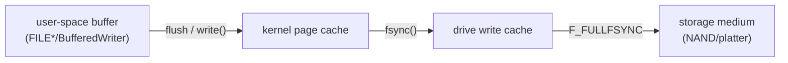

# Chapter 46 · Databases

[简体中文](./46-database.md) ｜ **English**

---

> Part 5 covered memory thoroughly and Part 6 covered concurrency thoroughly — yet there are three things they cannot deliver even together: **data outliving a dead process**, **two processes modifying the same data without corrupting it**, and **finding one row among a hundred thousand without scanning a hundred thousand**. The industrial-grade answer to all three is called a database.
>
> This chapter's **key experiment** implements the same requirements twice — once with "files plus hand-written code," once with a database — and measures the gap item by item. It is worse than expected: **durability** has three price tiers (measured: write 1.86 μs → fsync 26 μs → `F_FULLFSYNC` 4,399 μs, one order of magnitude per tier, and macOS's fsync **does not survive power loss**); on **atomicity**, the file-based transfer crashing midway left `'id=1,balance=40\nid=2,bal'` — money vanished and the format was destroyed, while the database rolled back to the cent; on **concurrency**, the most counterintuitive result comes from JS: 50 coroutines incrementing a file counter — **single-threaded, no data race, and the result is 1** — the culprit behind lost updates was never multithreading but the non-atomic read-modify-write; on **queries**, finding one row in a hundred thousand by file scan is **551× slower** than a sqlite primary-key lookup.
>
> Along the way we hit a five-language-level discovery: **the same API named fsync makes two different promises across five runtimes**. C/Python/Java's fsync is the raw syscall (26 μs, may lose data on power loss); Node's `fsyncSync` measured 4.0 ms and C#'s `Flush(true)` measured 4.4 ms — libuv and .NET **silently upgrade them to `F_FULLFSYNC`** on macOS. This also closes Chapter 43's open case: SQLite's `synchronous=FULL` was only 1.5× slower because on macOS it takes the `F_BARRIERFSYNC` tier; the real thing requires `PRAGMA fullfsync=ON`.
>
> How does a database make durability this expensive usable? **WAL (write-ahead logging)**: measured, 100 records flushed one `F_FULLFSYNC` at a time cost ~440 ms; batched into one flush, **4.1 ms — 107× faster**. The Java example goes further and hand-writes a 60-line TinyDB (append-only log + in-memory index + CRC32 checksums); after injecting half a corrupted record and restarting, **the recovery protocol correctly identified and truncated it** — you will see with your own eyes that stitching together the hand-written code for durability, atomicity, concurrency control, indexing, and querying *is* the embryo of a database.

## 1. Learning Objectives

By the end of this chapter, you will be able to:

- Name the **five layers of promises** a database adds over files (durability, atomicity, consistency, isolation, a query engine), citing one measurement for each;
- Draw the **three-tier durability ladder** (page cache → drive cache → storage medium) with each tier's measured price and crash semantics;
- Explain why **even a single thread loses updates** (JS measured: 50 coroutines incrementing → 1) and how transactions cure it;
- Recite **WAL's three-step protocol** and why group commit cuts flush cost by a measured 107×;
- Implement a minimal crash-recovery protocol yourself (`[length][data][checksum]` + replay-and-truncate, working and measured in the Java example).

---

## 2. Why This Concept Exists

### Three holes the first six Parts left open

```text
Hole 1 (durability):  Ch. 31 put variables in memory — a dead process loses everything;
                      files then? This chapter measured: a successful write() ≠ data on disk
Hole 2 (concurrency): Ch. 41's locks only govern threads【within one process】—
                      two processes editing one piece of data are beyond any lock's reach
Hole 3 (querying):    Ch. 20's O(1) hash lookup lives only in memory —
                      a hundred thousand rows on disk can only be scanned front to back
```

**What does patching those holes with files and hand-written code cost? Measured, item by item:**

| Requirement | Files + hand-written code | Database | Gap |
|-------------|--------------------------|----------|-----|
| 20 lookups in 100k rows | 399.8 ms (full scan each) | **0.726 ms** (primary-key B-tree) | **551×** |
| 100 records truly on disk | ~440 ms (one `F_FULLFSYNC` each) | **4.1 ms** (WAL group commit) | **107×** |
| 2 processes × 200 increments | 280 (**120 updates lost**) | **400** ✓ | wrong vs right |
| Transfer crashing midway | `'id=1,balance=40\nid=2,bal'` (money gone + format ruined) | rolled back, to the cent | hopeless vs saved |
| A different aggregation | rewrite 15 lines of parsing | change one SQL clause | night and day |

### The one-sentence definition

```text
A database = software that does these five things on disk at industrial grade, for you:
  D durability  (written means never lost)   A atomicity (all or nothing)
  C consistency (bad data cannot get in)     I isolation (concurrency behaves like serial)
  + a declarative query engine (say WHAT you want, not HOW to find it)
```

> **In one sentence**: a file gives you nothing but "a stretch of readable, writable bytes"; on top of those bytes, a database re-solves Part 5's memory question (where does data live) and Part 6's concurrency question (who may touch it) — on **disk**, and far better than your hand-rolled version (every section below is evidence).

---

## 3. How It Works

### Key experiment one: the three price tiers of durability

"Writing a file" is not one action but a journey. Data passes four stations between your code and never-lost:



**C++ measured every station** (Python's numbers are nearly identical):

| Where data stops | Syscall | Measured (each) | Process crash | Kernel crash | Power loss |
|-----------------|---------|----------------|:---:|:---:|:---:|
| Page cache | `write()` only | **1.86 μs** | ✓ safe | ✗ lost | ✗ lost |
| Drive cache | `write` + `fsync` | **26.2 μs** | ✓ safe | ✓ safe | ⚠️ may lose |
| Medium | `write` + `F_FULLFSYNC` | **4,398.6 μs** | ✓ safe | ✓ safe | ✓ safe |

**Three takeaways**:

```text
① a successful write() only means the data reached the【kernel】— it sits in page cache and dies with the power
② macOS's fsync only guarantees "handed to the drive," not "written into the medium" (POSIX permits this!)
   → data in the drive's write cache can still vanish on power loss — which is why SQLite has F_FULLFSYNC
③ every step down the ladder costs an order of magnitude more: 1.86 → 26 → 4,399 μs
```

### The five-language discovery: one fsync, two promises

**The most unexpected measurement in this chapter.** Each runtime's "fsync" API:

| Runtime | API | Measured (each) | What it actually does |
|---------|-----|----------------|----------------------|
| C/C++ | `fsync(fd)` | 26.2 μs | raw fsync (drive-cache tier) |
| Python | `os.fsync(fd)` | 27.8 μs | raw fsync |
| Java | `FileDescriptor.sync()` | ~17 μs | raw fsync |
| **Node** | `fs.fsyncSync(fd)` | **4.0 ms** | **libuv upgrades it to `F_FULLFSYNC`** |
| **C#** | `FileStream.Flush(true)` | **4.4 ms** | **.NET's PAL upgrades it to `F_FULLFSYNC`** |

```text
libuv's source comment says it plainly: Apple's fsync does not flush the drive's write cache,
so it tries F_FULLFSYNC first, falls back to F_BARRIERFSYNC, then to raw fsync
.NET's PAL made the same call
→ C/Python/Java hand you the【cheap but power-unsafe】fsync
  Node/.NET hand you the one that is【150× dearer but truly durable】
→ your runtime already made a durability decision on your behalf — and most people never know
```

**Chapter 43's cold case, closed**: back then SQLite's `synchronous=FULL` measured only 1.5× slower than `OFF`, far less than expected. The answer: on macOS, SQLite's FULL tier defaults to `F_BARRIERFSYNC` (a barrier write between the two tiers); the real `F_FULLFSYNC` needs a separate `PRAGMA fullfsync=ON` — that is the 4.4 ms tier measured in this chapter.

### Key experiment two: WAL — making the expensive thing cheap

One true flush costs 4.4 ms — does that cap us at ~200 commits per second? **The database's answer is group commit**:

```text
C++ measured:
  100 records, one F_FULLFSYNC each: ~440 ms
  100 records, one flush for the batch: 4.1 ms      ← 107× faster
```

**WAL's (write-ahead log) three-step protocol**:

```text
① append "here is what I intend to change" to the log file, fsync once
② return "commit successful" to the user          ← note: the data file is untouched at this point!
③ later, apply the changes to the data file at leisure (checkpoint)

After a crash: replay committed transactions from the log, discard half-written ones
              (identified by each record's【checksum】— the Java example implements this by hand)
```

**Why writing the log first is actually faster**:

```text
appending to a log = sequential I/O (the access pattern disks love)
updating a B-tree in place = random I/O (a little here, a little there)
→ pay a sequential log write for an immediate return, do the random writes in the background — best of both
→ N concurrent transactions' fsyncs can merge into one (group commit — the source of the measured 107×)
```

### Key experiment three: a minimal crash-recovery protocol (60 lines of Java)

```text
Record format: [4-byte length][data][8-byte CRC32 checksum]
Recovery:      read records front to back → checksum matches: rebuild the index
               → mismatch: it's a half record → truncate and discard

Measured: after injecting half a corrupt record the file was 77 bytes
          restart → recovery identified it → truncated to 68 bytes
          intact records get(42) = zhang,40 ✓   the half record get(44) = null ✓
```

**These 60 lines are the Bitcask model** (the storage engine of the Riak database): an append-only log for durability, an in-memory hash for indexing, checksums for crash recovery. Databases hold no magic — only these plain protocols engineered to the limit.

### Why concurrency must be handed to the database

**Four measurements, one conclusion**:

```text
JS    : 50 coroutines incrementing a file counter → result 1 (single-threaded, all lost!)
Python: 2 processes × 200 increments             → 280, 120 lost
Java  : 2 threads × 150 increments               → 149, 151 lost
C#    : 2 threads × 150 increments               → 174, 126 lost + 26 reads of an【empty file】
```

```text
There is exactly one culprit: "read → modify → write" is three steps, and anyone can cut in between
Chapter 41's locks save threads but not【processes】; a Mutex saves processes but not【another machine】
→ a transaction compresses the three steps into one atomic operation — and it crosses processes
  and machines by construction
→ measured: under the same concurrent pressure, sqlite's UPDATE n = n + 1 returned exactly 400 and 50
```

---

## 4. JavaScript

The Node measurements contributed this chapter's two most counterintuitive results.

### A single thread loses updates too (measured)

```javascript
const incr = async () => {
  const v = Number(await fsp.readFile(p, 'utf8'));   // read
  await sleep(1);                                    // ← one await = one yield (Ch. 43)
  await fsp.writeFile(p, String(v + 1));             // write
};
await Promise.all(Array.from({ length: 50 }, incr));
```

```text
50 concurrent increments, expected 50, actual 1
```

**No threads, no data race, and everything is lost anyway** — all 50 coroutines read 0 before anyone wrote back. Chapter 40 said data races need multithreading; this proves **lost updates do not**: any yield point (`await`) inside a read-modify-write is enough. The event loop cannot save you; a transaction can:

```text
the same 50 concurrent increments via UPDATE counter SET n = n + 1: actual 50 ✓
→ "read the old value, add one, write back" is compressed into one atomic statement
  inside the database — nobody can cut in
```

### fsyncSync's true identity (measured)

```text
writeSync only, 2000 times: 14 ms; write+fsyncSync 200 times: 808 ms
→ each "fsync" is 4.0 ms — yet the raw fsync syscall costs ~26 μs
→ the 150× is libuv's doing: on macOS it silently upgrades fsync to F_FULLFSYNC
```

**libuv chose "expensive but correct" for you.** Every `fs.fsyncSync` in Node is a true flush to the medium — not knowing this sends a logging-system performance investigation in the wrong direction.

### node:sqlite: a database built into Node 22.5+ (measured)

```javascript
const { DatabaseSync } = require('node:sqlite');
const db = new DatabaseSync('app.db');
```

```text
after the transfer crashed midway: [{"id":1,"balance":100},{"id":2,"balance":100}]   ← rolled back
1000 primary-key lookups: 9 ms (9 μs each, straight down the B-tree)
pulling the whole table into a JS Map: 109 ms + 46 MB of heap
```

**Note the API is synchronous** — a 9 μs point lookup is not worth a thread-pool round trip (Chapter 43 measured libuv's pool queuing). This is also better-sqlite3's philosophy.

**That last measurement quantifies an important habit**: "pull 100k rows into JS and search" costs 109 ms and 46 MB of heap; "let the database find it and return one row" costs 9 μs. **Send the computation to the data, don't haul the data to the computation** — the entire point of Chapter 47's SQL.

> **Note**: `node:sqlite` is still experimental in 22.x (prints a warning; silence it with `process.removeAllListeners('warning')`); server databases (pg/mysql2) traverse the network and are therefore async APIs (Chapter 42); the embedded-vs-server split is exactly Chapter 39's process boundary — a library lives in your process, a server lives in another.

---

## 5. Python

The Python example is the key experiment's main arena — "files + hand-written code vs database," head to head.

### Three durability tiers (measured)

```text
write() only, 2000 times:            6.9 ms（   3.5 μs each）← still in the【page cache】
write+fsync, 200 times:              5.6 ms（  27.8 μs each）← reached the【drive cache】
write+F_FULLFSYNC, 50 times:       201.9 ms（4037.8 μs each）← truly on the【medium】
```

Python is the only one of the five that can **touch all three tiers directly**: `os.write` / `os.fsync` / `fcntl.fcntl(fd, fcntl.F_FULLFSYNC)` — the standard library even ships the macOS fcntl constant.

### The crash duel (measured)

```text
Files:    killed mid-rewrite → file contents 'id=1,balance=40\nid=2,bal'
          → A lost 60, B's record is half a line — money vanished, format ruined
Database: exception mid-transaction → [(1, 100), (2, 100)]
          → automatic rollback, both balances intact at 100
```

`with con:` is the habit worth building for sqlite in Python — entering opens a transaction, a clean exit commits, an exception rolls back (Chapter 37's RAII, database edition).

### The cross-process duel (measured)

```text
Files:  2 processes × 200 increments, expected 400, actual 280 (120 updates lost)
sqlite: 2 processes × 200 increments, expected 400, actual 400 ✓
```

The file version also hit a second phenomenon: at the instant one process's `open(path, "w")` truncated the file before writing, the other process read an **empty string** (the example catches and retries it). `"w"`-mode's truncate-then-write is not atomic for readers — the C# example hit the same thing (26 times).

### The query and aggregation duels (measured)

```text
20 lookups in 100k rows:
  file sequential scan: 399.8 ms (each lookup reads all 100000 lines, O(n))
  sqlite primary key:   0.726 ms (B-tree, O(log n)) → 551× (one-time load: 106 ms)

A different question — which score has the most people:
  hand-written file aggregation: 173.7 ms + 15 lines of parsing/grouping code
  one GROUP BY clause:            19.0 ms (change one sentence)
```

> **Note**: `sqlite3` ships in the standard library (every Python measurement here is dependency-free); connections default to non-autocommit — forget `commit()` and the data never lands (the most common beginner trap); the `timeout` parameter controls how long to wait when another writer holds the lock (default 5 s); multi-process sqlite writes queue on its internal file lock — measured correct, but limited throughput; heavy write concurrency wants a server database.

---

## 6. Java

The Java example does the most ambitious thing in this chapter: **it writes a database by hand.**

### TinyDB: Bitcask in 60 lines (measured, working)

```java
static class TinyDB implements AutoCloseable {
    private final RandomAccessFile log;                 // append-only log = durability
    private final Map<String, Long> index = new HashMap<>();  // key → log offset = the index

    void put(String key, String value) throws Exception {
        byte[] payload = (key + "=" + value).getBytes(UTF_8);
        CRC32 crc = new CRC32(); crc.update(payload);
        long pos = log.length();
        log.seek(pos);
        log.writeInt(payload.length);                   // [length][data][checksum]
        log.write(payload);
        log.writeLong(crc.getValue());
        index.put(key, pos);                            // old versions stay; the index just moves on
    }
}
```

```text
after two put(42) calls, get(42) = zhang,40   ← the new version is read
the old version is still in the log — append-only never rewrites, all sequential I/O:
exactly how a WAL writes
```

### Crash recovery, measured

```text
inject half a record (only 5 bytes written before the "power cut") → file is 77 bytes
restart recover(): verify CRC32 record by record → the half record fails → truncate to 68 bytes
get(42) = zhang,40 (all intact records present)   get(44) = null (the half record discarded)
```

**`[length][data][checksum]` plus replay-and-truncate is the minimal viable crash-recovery protocol** — a real database's WAL recovery is its industrial-grade edition.

### The distance from TinyDB to a real database

```text
Have:    durability (append log) + crash recovery (checksums) + point lookup (in-memory index)
Missing: range queries (needs a B-tree, Ch. 49)   transactions (Ch. 48)   concurrency control (Ch. 50)
         SQL (Ch. 47)   log compaction (or the file grows forever)   a network protocol   permissions…
→ each item starts at thousands of lines — "using a database" means outsourcing all of it
```

### Java's two durability tiers (measured)

```text
write only, 2000 times: 2.6 ms; write+sync 200 times: 3.5 ms (each flush 14× dearer)
→ FileDescriptor.sync() / FileChannel.force() are both raw fsync (the ~17 μs tier)
→ F_FULLFSYNC is【unreachable】from pure Java (JNI required) —
  the JVM alone cannot promise power-loss safety
```

> **Note**: production uses JDBC (`java.sql.*`, one interface, per-vendor drivers) plus a HikariCP connection pool (Chapter 45 measured its sizing formula); `DriverManager.getConnection` establishes a real connection every call and must never sit on a request path; this example avoids third-party jars, hence files — a JDBC driver is itself a jar dependency.

---

## 7. C++

The C++ example owns this chapter's most important numbers: **the exact price of each durability tier.**

### The three tiers, measured

```text
5000 × write():          9.3 ms（   1.86 μs each）
300 × write+fsync:       7.9 ms（   26.2 μs each）
50 × write+F_FULLFSYNC: 219.9 ms（ 4398.6 μs each）
→ the ladder: 1.86 → 26 → 4399 μs per write (an order of magnitude per step)
```

```cpp
write(fd, rec, len);              // ① page cache: survives a process crash (kernel holds it), dies with power
fsync(fd);                        // ② drive cache: survives a kernel crash; may still die with power (macOS semantics)
fcntl(fd, F_FULLFSYNC);           // ③ medium: survives power loss — SQLite's fullfsync option lands here
```

**POSIX permits fsync not to flush the drive's write cache** — and macOS does exactly that (Apple's man page says so outright). On Linux fsync usually implies a cache flush, but ultimately it depends on whether the drive's firmware lies. **Database engineers' distrust of the storage stack is well documented**: SQLite's *How To Corrupt An SQLite Database File* is an entire page of such betrayals.

### Group commit, measured

```text
100 records, one F_FULLFSYNC each: ~440 ms (extrapolated from the 4.4 ms/flush above)
100 records, one flush for the batch: 4.1 ms
→ 107× faster — WAL's essence: merge N transactions' flushes into one sequential write + one fsync
```

**This is why every database uses a WAL**: not because it is profound, but because these 107× can be saved nowhere else.

### C++'s special relationship with databases

```text
SQLite itself is C (~150k lines); MySQL/PostgreSQL/RocksDB are C/C++
→ C++ is the language for【writing】databases; the others are languages for【using】them
→ embedded side: #include "sqlite3.h", zero dependencies
  client side:   libpq (PostgreSQL) / MySQL Connector — C APIs at the bottom;
                 other languages' drivers largely wrap them
```

> **Note**: `FILE*`/`iostream` buffer in user space — a successful `fwrite` hasn't even reached the page cache; `fflush` first, then `fsync` (the same family as Chapter 39's lost fork output); `O_DIRECT` (Linux) bypasses the page cache — databases use it to run their own caches; at database-grade rigor, fsyncing the **directory** matters too (a rename's durability requires the parent directory on disk).

---

## 8. C#

The .NET example supplies the second piece of "same-name API, different promise" evidence — plus a phenomenon only truncate-style writes can expose.

### Flush(true)'s true identity (measured)

```text
Flush(false), 2000 times: 3.8 ms    ← only drains the user-space buffer; data in page cache
Flush(true),  200 times: 875.0 ms (4.4 ms each)
→ raw fsync costs ~26 μs; .NET's PAL implements Flush(true) on macOS directly as【F_FULLFSYNC】
→ the same choice libuv made: power-loss safety — C/Python/Java give you the cheap one,
  Node/.NET the truly durable one
```

### Reading an empty file: truncation is not atomic (measured)

```text
2 threads × 150 increments, expected 300, actual 174 (126 lost)
worse: 26 reads hit an【empty file】— WriteAllText truncates then writes, and readers landed in between
```

**More insidious than lost updates**: `File.WriteAllText` = truncate + write, two steps, and a reader can meet the empty intermediate state. In production, "the config file occasionally reads back empty" is this, nine times out of ten. The manual fix is **temp file + atomic rename** (measured):

```csharp
File.WriteAllText(tmp, newContent);    // write the new content fully into a temp file
File.Replace(tmp, cfg, null);          // rename is atomic (POSIX guarantees it)
// → readers only ever see the complete old or complete new version, never a half-written one
```

**But it protects only "whole-file replacement of a single file"** — atomicity across files or across rows comes only from transactions.

### Where lock ends (measured)

```text
with lock added: 300 ✓ — but lock governs only【this process】(Ch. 41)
→ cross-process needs a Mutex; cross-machine has no API at all —
  a database's locks cross processes and machines by construction
```

### The essence of an index (measured)

```text
20 lookups by repeated scan: 742.1 ms
build a Dictionary once (6 ms), then look up: 0.389 ms
→ an index = "one-time preprocessing traded for N fast lookups"
→ a database persists that Dictionary【on disk】and maintains it on every write — Chapter 49's B-tree
```

> **Note**: production uses ADO.NET (`DbConnection`/`DbCommand`, one interface) with `Microsoft.Data.Sqlite`/Npgsql; EF Core is the ORM (Chapter 51); `Pooling=true` is on by default in connection strings — Chapter 45's connection pool hides right there.

---

## 9. SQL

The first eight sections stood on the file user's side; this one switches to the database's side and reads its promises.

### A: atomicity (measured)

```sql
BEGIN;
UPDATE account SET balance = balance - 60 WHERE id = 1;
-- "crash"
ROLLBACK;
```

```text
① after the transfer crashed midway: A=100 B=100 (not a cent lost)
   after a full commit:              A=40  B=160
```

### C: consistency — constraints as gatekeepers (measured)

```sql
CREATE TABLE account2 (
  id      INTEGER PRIMARY KEY,
  balance INTEGER NOT NULL CHECK (balance >= 0)   -- balances may not go negative
);
```

```text
② attempting to set balance to -999: changes=0 (CHECK constraint blocked it)
   attempting to insert duplicate id=1: changes=0 (primary key blocked it)
→ the file version must repeat these validations in【every program that writes it】;
  the database states them once and every writer shares them
```

**A constraint is validation "written once, enforced everywhere."** With files, a Python script, a Java service, and hand-edited vim can each bypass your checks; inside the database, no path around a CHECK exists.

### D: the durability dial (cross-referencing this chapter's measurements)

```text
③ PRAGMA synchronous = OFF    → write() only; process or kernel crash may lose data (the 1.86 μs tier)
   PRAGMA synchronous = NORMAL → the usual choice under WAL; power loss may drop the last transaction
   PRAGMA synchronous = FULL   → flush on every commit (macOS defaults to F_BARRIERFSYNC)
   PRAGMA fullfsync = ON       → the real F_FULLFSYNC (the 4399 μs tier, measured in C++)
→ Chapter 43's answer: on macOS, FULL ≠ F_FULLFSYNC — there is one more tier above it
```

### Declarative queries and the plan (measured)

```text
④ the same 100k rows asked three questions — point lookup / aggregate / top-1, one clause each
⑤ EXPLAIN QUERY PLAN SELECT * FROM users WHERE score = 42;
   without an index: SCAN users                                   ← full table scan
   after CREATE INDEX: SEARCH users USING INDEX idx_score          ← index search
→ the same SQL, not one character changed — the optimizer swapped the algorithm for you
```

**This is the entire dividend of being declarative**: imperative code hard-wires "how to find" into loops, so changing the algorithm means changing code; SQL declares only "what," and adding an index lets the optimizer swap algorithms automatically (Chapters 47/49).

### The chapter's outline, as printed by the SQL example

```text
⑥ a file gives you: a stretch of readable, writable bytes. The database adds five layers —
   D durability:  WAL + fsync tiers (three prices measured in C++)
   A atomicity:   transactions + rollback
   C consistency: constraints at the gate
   I isolation:   cross-process concurrency control (lost updates vs none, measured in Python)
   query engine:  declarative SQL + indexes + an optimizer
```

> **Note**: sqlite constraint violations normally make the statement error (and the script exit non-zero) — the demo uses `UPDATE OR IGNORE`/`INSERT OR IGNORE` to reject silently and observes `changes()`; server databases raise the violation to the client as an exception, same semantics.

---

## 10. Cross-Language Comparison

### ① Database access capabilities

| Capability | JavaScript | Python | Java | C++ | C# |
|-----------|-----------|--------|------|-----|-----|
| sqlite in the standard library | ✅ `node:sqlite` (22.5+, experimental) | ✅ `sqlite3` (since forever) | ❌ | ❌ (but sqlite *is* C) | ❌ |
| Unified DB interface | ❌ (each driver its own API) | DB-API 2.0 (PEP 249) | **JDBC** | ❌ | **ADO.NET** |
| Mainstream drivers | pg / mysql2 / better-sqlite3 | psycopg / PyMySQL | per-vendor JDBC | libpq / MySQL C API | Npgsql / SqlClient |
| Flagship ORM (Ch. 51) | Prisma / TypeORM | SQLAlchemy / Django ORM | Hibernate / JPA | ❌ (none mainstream) | **EF Core** |
| "fsync"'s real tier (measured) | **F_FULLFSYNC (4.0 ms)** | raw fsync (27.8 μs) | raw fsync (~17 μs) | your pick (all three reachable) | **F_FULLFSYNC (4.4 ms)** |
| Can reach F_FULLFSYNC | it *is* the default | `fcntl` stdlib | ❌ JNI required | direct `fcntl` | it *is* the default |

### ② Key experiment one: the durability tiers (C++/Python measured)

```text
page cache (write)       1.86 μs each   process crash ✓  kernel crash ✗  power loss ✗
drive cache (fsync)      26.2 μs each   process crash ✓  kernel crash ✓  power loss ⚠️
medium (F_FULLFSYNC)     4399 μs each   all ✓
group commit (WAL):      100 records in 4.1 ms vs ~440 ms one by one → 107×
```

### ③ Key experiment two: the lost-update family portrait

```text
JS     50 coroutines (single-threaded!)  → result 1 (expected 50)    ← most counterintuitive
Java   2 threads × 150                   → 149/300, 151 lost
C#     2 threads × 150                   → 174/300, 126 lost + 26 empty-file reads
Python 2 processes × 200                 → 280/400, 120 lost
—— switching to the database's atomic UPDATE ——
JS     50 coroutines                     → 50 ✓
Python 2 processes × 200                 → 400 ✓
```

### ④ Key experiment three: the query duel (the same 100k rows)

```text
20 point lookups:   file scan 399.8 ms  vs  sqlite 0.726 ms   → 551× (Python)
1000 point lookups: sqlite 9 μs each   vs  pull-all-build-Map 109 ms + 46 MB heap (JS)
aggregation:        15 hand-written lines, 173.7 ms  vs  one GROUP BY, 19.0 ms (Python)
the plan:           SCAN → SEARCH after adding an index; the SQL unchanged (SQL example)
```

### ⑤ Common ground and root causes

**Common ground**: no language's file API grants atomicity (crashes leave half records), isolation (concurrency loses updates everywhere), or querying (only full scans); every "fsync" costs at least an order of magnitude over write; **no standard library replaces a database** — at best it hands you a ticket to embedded sqlite.

**Root causes**:

- **File APIs are a literal translation of POSIX** — POSIX promises byte-stream semantics only; ACID was never in the contract;
- **Node/.NET upgrade fsync** — runtime philosophy: "better slow than blamed." A user writing `fsync` expects "not lost," so give them the real thing. C/Python/Java's philosophy is "stay close to the syscall": faithful semantics, traps left to you;
- **Python ships sqlite** because batteries are included; **Node 22 caught up** by admitting the same reality: modern applications all touch a database;
- **Java/C# each define a unified interface (JDBC/ADO.NET)** — big-vendor ecosystem thinking: the interface goes into the standard, implementations go to vendors;
- **C++ doesn't connect to databases — it implements them**: SQLite/MySQL/RocksDB are C/C++; zero-overhead philosophy is mandatory in a storage engine.

---

## 11. Implementation Comparison

| Storage engine | Durability scheme | Key details |
|---------------|-------------------|-------------|
| **SQLite** (rollback mode) | copy the【old page】into a rollback journal before changing it | recovery = copy old pages back; a commit costs two fsyncs |
| **SQLite** (WAL mode) | 【append】new data to the WAL; readers read old versions | one fsync per commit; readers don't block writers (Ch. 50) |
| **PostgreSQL** | WAL + checkpoints + group commit | `synchronous_commit` is a dial — mapping onto this chapter's tiers |
| **MySQL/InnoDB** | redo log (WAL) + doublewrite buffer | doublewrite defends against【torn pages】— a lower-level tear than our half record |
| **Bitcask** (this chapter's TinyDB) | append log + in-memory hash index + CRC | reproduced in 60 lines of Java; Riak's production engine |

**A layering worth remembering**:

```text
Every engine's durability is the same three acts:
  ① sequentially write the intent to a log and fsync (expensive — but paid once; group commit amortizes)
  ② immediately promise "success" to the user
  ③ apply the changes to the real data structure (B-tree/LSM) in the background
→ the differences are details: old pages or new values in the log, when to checkpoint,
  how to defend against torn pages
```

---

## 12. Performance Analysis

### Where a database is "slower" than files, and where faster

| Operation | Files | Database | Winner |
|-----------|-------|----------|--------|
| Append one record (no flush) | 1.86 μs | ~10 μs (transaction overhead) | files |
| Append one record, guaranteed durable | 4,399 μs (`F_FULLFSYNC`) | ~44 μs (WAL group commit amortized, 107×) | **database** |
| Point lookup in 100k rows | 20 ms each (full scan) | 9–36 μs each (B-tree) | **database, 551×** |
| Full sequential read | fastest (no page parsing) | slightly slower | files |
| Concurrent read-modify-write | **wrong** (loses updates) | correct | not comparable |

**Conclusion**: files win at "single writer, append-only, full reads" — which is why log files don't go into databases; the database wins at everything else.

### This chapter's numbers at a glance

```text
durability: 1.86 → 26 → 4399 μs (three tiers, an order of magnitude each)
group commit: 107× (100 records, 4.1 ms vs ~440 ms)
point lookup: 551× (0.726 ms vs 399.8 ms)
aggregation: 9.1× (19.0 ms vs 173.7 ms) + one clause vs 15 lines of code
lost updates: files lose everywhere (1/50, 149/300, 174/300, 280/400); the database is exact
```

> ⚠️ sqlite's write concurrency is **queued** (a database-level write lock, Chapter 50) — the 2-process increment came out exact through queuing, not parallelism. For high write throughput, move to PostgreSQL/MySQL's row locks + MVCC; but **correctness and throughput are separate questions**, and this chapter argues only the first.

---

## 13. Engineering Practice

| Scenario | ✅ Recommended | ❌ Avoid | Why |
|----------|--------------|---------|-----|
| Application state | a database (even sqlite) | hand-rolled JSON files | measured: crashes leave half records, concurrency loses updates |
| Config file updates | temp file + atomic rename | in-place WriteAllText | measured 26 empty-file reads |
| Counters / balances | `UPDATE n = n + 1` / transactions | read into memory, modify, write back | measured: all four languages lose updates |
| Logs / metrics streams | append-only files | row-per-write into a database | single-writer sequential append is the file's home turf |
| Must-not-lose single-node data | sqlite WAL + `synchronous=NORMAL` to start | hand-rolled fsync | group commit measured 107×; tier semantics verified |
| Power-loss-proof on macOS | `PRAGMA fullfsync=ON` | assuming fsync suffices | measured: fsync stops at the drive-cache tier |
| Embedded / single node / edge | SQLite | standing up PostgreSQL | sqlite is a library, not a process; zero ops |
| Data shared by services | a server database | a shared sqlite file (NFS especially) | file locks over the network are unreliable (officially stated) |
| Java/C# access | JDBC / ADO.NET + a pool | a new connection per request | Ch. 45 measured 10–100 ms per connection |
| Node single-node storage | node:sqlite / better-sqlite3 (sync APIs) | wrapping sqlite in async | 9 μs lookups aren't worth a thread-pool round trip |

### The rule of thumb

```text
Is the data a【stream】or【state】?
  stream (logs/metrics; append-only, single writer) → files
  state (updated, concurrently accessed, queried)   → a database
unsure → a database; every trap of the file route was measured in this chapter
```

---

## 14. Best Practices

- **State goes in a database, always**: four languages of measurement show hand-rolled files lose against crashes and concurrency; sqlite is zero-ops — there is no excuse.
- **Updates go through atomic statements or transactions**: `UPDATE n = n + 1`, never read-modify-write — JS measured a single thread losing everything.
- **Know which tier your fsync is**: C/Python/Java sit at the drive-cache tier (power loss can bite); Node/.NET at the medium tier (150× dearer) — check before writing storage code.
- **Write config files via temp + rename**: the only atomic file write; overwriting in place shows readers empty files (measured 26 times).
- **Don't haul data to the application to compute**: measured, pull-and-build-a-Map costs four orders of magnitude more memory and three more time than letting the database look it up.
- **Turn on WAL for sqlite**: `PRAGMA journal_mode=WAL`, one line — readers stop blocking writers, commits take one fsync.
- **Put constraints in the schema, not application code**: CHECK/UNIQUE/NOT NULL is validation written once and shared by every write path (measured blocking -999 and a duplicate key).
- **Respect the file's home turf**: append-only streams — logs, metrics, exports — don't belong in a database.

---

## 15. Common Pitfalls

**Pitfall 1 · Believing a successful write means safe data**

```python
f.write(data)          # ⚠️ data in the user-space buffer
f.flush()              # ⚠️ now merely in the page cache — dies with the power
```

**Avoid it**: hand must-not-lose data to a database; when hand-rolling, `fsync` — and know it doesn't survive power loss on macOS.

**Pitfall 2 · Read-modify-write on a shared file**

```javascript
const v = Number(await fsp.readFile(p));   // ⚠️ a single thread loses too — measured: 50 coroutines → 1
await fsp.writeFile(p, String(v + 1));
```

**Avoid it**: switch to the database's atomic `UPDATE`; the file route needs `flock` with dubious cross-platform semantics.

**Pitfall 3 · Overwriting config files in place**

```csharp
File.WriteAllText(cfg, json);   // ⚠️ truncate + write, two steps; readers can see an empty file (measured 26×)
```

**Avoid it**: write a temp file, then `File.Replace`/`rename`.

**Pitfall 4 · Forgetting commit in Python sqlite**

```python
con.execute("INSERT ...")       # ⚠️ non-autocommit by default — exit the process and it's gone
```

**Avoid it**: use a `with con:` block (commit/rollback on exit) or call `con.commit()` explicitly.

**Pitfall 5 · Sharing a sqlite file over a network mount**

```text
NFS/SMB file locking is unreliable → sqlite's docs explicitly warn of database corruption
```

**Avoid it**: multi-machine sharing means a server database — Chapter 39's process boundary, extended.

**Pitfall 6 · Connecting like it's free** (Chapter 45 redux)

```java
DriverManager.getConnection(...)   // ⚠️ 10–100 ms per connection, plus a database-side process
```

**Avoid it**: a connection pool (HikariCP etc.), sized by Chapter 45's `cores × 2 + spindles`.

**Pitfall 7 · Doing the database's job outside it**

```text
SELECT * then filter/sort/count in the app   # ⚠️ measured 109 ms + 46 MB vs 9 μs
```

**Avoid it**: push WHERE/GROUP BY/ORDER BY down to the database — Chapter 47's subject.

---

## 16. Interview Questions

**Basic**

1. After write() returns success, in which four places can the data be? What level of crash does each fear?
2. What five layers does a database promise over files? Cite one measurement from this chapter for each.
3. Why does read-modify-write lose updates even in single-threaded JS? How does a transaction cure it?

**Intermediate**

4. **What are WAL's three steps? Why is "write the log first" actually faster? (The reason behind the measured 107× group commit.)**
5. How do macOS's fsync and F_FULLFSYNC differ? Which tier does each of the five runtimes' "fsync" APIs land on?
6. **Design a minimal crash-recovery protocol: how do checksums identify a half-written record? (The Java example's 60-line approach.)**

**Advanced**

7. **How do SQLite's rollback-journal and WAL modes differ in crash-recovery strategy? How many fsyncs does each commit cost?**
8. Why does InnoDB need a doublewrite buffer? How does a "torn page" relate to this chapter's "half record"?
9. What data belongs in files? Argue along three axes: writer count, append-only-ness, access pattern.

---

## 17. Exercises

**Basic**

1. Reproduce the three-tier durability measurement on your machine (write/fsync/F_FULLFSYNC, or Linux's fdatasync) and plot the price ladder.
2. Reproduce the JS single-threaded lost-update experiment with 5 coroutines instead of 50 — is the result still 1? Explain.
3. Write a file-based transfer that "crashes midway," inspect the corrupted file, then redo it with a sqlite transaction.

**Intermediate**

4. **Add `delete(key)` to the Java TinyDB** (hint: append a tombstone record; recognize it during recovery).
5. Measure your language's "fsync" API and determine which tier it is — raw fsync or F_FULLFSYNC.
6. Build a config writer with temp-file + rename that can never be read half-written, and verify it under two-process stress.

**Challenge**

7. **Add log compaction to TinyDB**: rewrite the log with only each key's latest value into a new file, switch atomically (rename), and lose nothing even if you crash mid-switch.
8. Use `EXPLAIN QUERY PLAN` to watch five query shapes (point/range/aggregate/sort/join) change plans with and without indexes.
9. Reproduce group commit: N concurrent "transactions" each demanding durability; build a commit thread that merges their fsyncs into one, and measure the throughput gain.

---

## 18. Chapter Summary

**One sentence**: a file gives you nothing but a stretch of readable, writable bytes, while applications need **state** — crashing processes, concurrent writers, and shifting queries all threaten it, and this chapter's four-language measurements show the hand-rolled file route failing across the board (a crash leaving `'id=1,balance=40\nid=2,bal'`, 50 single-threaded coroutines incrementing to 1, two processes losing 120 updates, point lookups 551× slower) while the database answers every attack correctly; its means are unmysterious — **durability** is a precise choice on a three-tier ladder (measured 1.86 → 26 → 4,399 μs, with the five runtimes' "fsync" landing on different tiers: Node/.NET silently upgrade to `F_FULLFSYNC`, closing Chapter 43's 1.5×-only case), **atomicity and recovery** come from WAL's three steps plus checksums (the 60-line Java TinyDB measured truncating an injected half record), **the expensive flush** is amortized by group commit (measured 107×), and **queries** ride disk-persisted indexes plus a declarative optimizer (`SCAN → SEARCH` without touching the SQL) — stitch the hand-written versions of those five things together and you have the embryo of a database, which SQLite finishes to industrial grade in ~150k lines of C.

**Key takeaways**

- **Three holes**: memory isn't durable, process locks don't cross boundaries, disk lookups can only scan — files can't patch them; databases exist for them.
- **Three durability tiers** (measured): page cache 1.86 μs / drive cache 26 μs / medium 4,399 μs; macOS fsync does not survive power loss.
- **The five-runtime fsync split** (measured): C/Python/Java raw fsync; Node 4.0 ms and C# 4.4 ms = runtime-upgraded `F_FULLFSYNC`.
- **A single thread loses updates** (measured): 50 JS coroutines → 1; the culprit is non-atomic read-modify-write, not threads.
- **WAL's three steps**: sequential log write + fsync → promise success → background checkpoint; group commit measured 107×.
- **The minimal recovery protocol** (measured): `[length][data][checksum]` + replay-and-truncate — Bitcask in 60 lines.
- **The query duel** (measured): 551× (point lookups), 9.1× and 15 lines → 1 clause (aggregation), `SCAN → SEARCH` (index added, SQL untouched).
- **The file's home turf**: single-writer, append-only, full-read streams (logs/metrics) — don't force them into a database.

**Checklist**

- [ ] I can draw the four stations from code to medium with each one's measured price and crash semantics.
- [ ] I can explain why single-threaded JS loses updates and write the SQL that cures it.
- [ ] I can recite WAL's three steps and the reason behind group commit's 107×.
- [ ] I know which tier my language's "fsync" lands on.
- [ ] I can implement the length+data+checksum recovery protocol.

**Next chapter**: the database is here — how do we talk to it? Chapter 47 covers **SQL**, the only **declarative** language among our six: you state *what* you want and the optimizer decides *how* to find it. We will measure how different phrasings of the same query converge in the optimizer's hands, the real gaps among JOIN's three physical implementations (nested loop / hash / merge), and why `SELECT *` and functions inside `WHERE` disarm the optimizer — dismantling the illusion that "SQL is just string concatenation" once and for all.

---

## 19. Further Reading

- <a href="https://www.sqlite.org/atomiccommit.html" target="_blank" rel="noopener">SQLite · Atomic Commit In SQLite</a> — the finest long-form treatment of atomic commit in the database literature; the authoritative version of this chapter's WAL protocol.
- <a href="https://www.sqlite.org/wal.html" target="_blank" rel="noopener">SQLite · Write-Ahead Logging</a> — the official WAL-mode documentation.
- <a href="https://www.sqlite.org/howtocorrupt.html" target="_blank" rel="noopener">SQLite · How To Corrupt An SQLite Database File</a> — the complete list of ways the storage stack betrays you (including drives that lie about fsync).
- <a href="https://www.sqlite.org/whentouse.html" target="_blank" rel="noopener">SQLite · Appropriate Uses For SQLite</a> — the embedded-vs-server boundary, officially argued.
- <a href="https://en.wikipedia.org/wiki/ACID" target="_blank" rel="noopener">Wikipedia · ACID</a> — the origin and formal definitions of the four letters.
- <a href="https://www.postgresql.org/docs/current/wal-intro.html" target="_blank" rel="noopener">PostgreSQL Docs · WAL Introduction</a> — a server database's WAL and the `synchronous_commit` dial.
- <a href="https://en.wikipedia.org/wiki/Bitcask" target="_blank" rel="noopener">Wikipedia · Bitcask</a> — the prototype of this chapter's TinyDB: append-only log + in-memory hash index.
- <a href="https://nodejs.org/api/sqlite.html" target="_blank" rel="noopener">Node.js Docs · node:sqlite</a> — the official documentation for Node 22.5+'s built-in sqlite.
- <a href="https://dataintensive.net/" target="_blank" rel="noopener">Designing Data-Intensive Applications</a> — its storage-engines chapter (Chapter 3) is the best continuation of this one.
