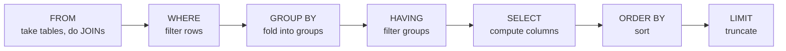

# Chapter 47 · SQL

[简体中文](./47-sql.md) ｜ **English**

---

> Among this book's six languages, SQL is the only **declarative** one. The other five ask you to write *how* — loops, conditions, assignments; SQL asks only *what*, and **the optimizer decides how to find it**. That one-word difference is this entire chapter.
>
> How large is the declarative dividend? This chapter's **key experiment** hand-implements all three of JOIN's physical algorithms and runs them over the same data (50k orders × 5k users): **nested loop 414 ms, hash join 2.6 ms (159×), merge join 4.1 ms (102×)** — with identical results from all three. Yet you write only one thing: `JOIN ... ON`. **The optimizer picks among the three based on statistics**, and that is what declarative means. The C# and Java measurements confirm it from the other side: LINQ's `Join` is 342× faster and a hand-built Java `Set` is 146× faster — but in those languages, **the one choosing the algorithm is you**.
>
> This chapter also **disproves a widely repeated claim**. "The optimizer normalizes `IN`, `EXISTS`, and `JOIN` into the same plan, so write whichever" — measured false: for one question returning the same 1000 rows, `JOIN` took 0.7 ms, `IN` 1.2 ms, and `EXISTS` **31.9 ms, 46× slower**. `EXPLAIN` gives the reason: `IN`/`JOIN` use a `LIST SUBQUERY` (materialized once), while the **correlated** subquery in `EXISTS` becomes a `CORRELATED SCALAR SUBQUERY` — re-run for every outer row. The optimizer normalizes many phrasings, but it cannot normalize away correlation.
>
> The declarative model has boundaries too, and they are narrower than you'd think. Four measured ways to disarm the optimizer: wrapping a column in `+ 0` turned a point lookup from 1.39 ms into **1779 ms (1283× slower)**; `LIKE '%-4200'` is **420× slower** than `LIKE 'user-4200%'`; and most insidiously — **having an index is not enough**: with an ordinary index on `name`, a prefix `LIKE` still planned as **SCAN**, because LIKE is case-insensitive by default while the index uses BINARY collation; only a `COLLATE NOCASE` index turns it into SEARCH.
>
> Finally, two costs incurred every day: `SELECT *` permanently disables **covering indexes** (measured 4.4× slower, with `COVERING INDEX` vanishing from the plan); and the **N+1 query** — that perfectly natural-looking "for each user { fetch its orders }" loop — measured **1001 SQL statements in 391.7 ms**, versus **7.6 ms for one `JOIN + GROUP BY`, 51× faster**. And that is in-process sqlite; add 0.5 ms of network round trip each and N+1 becomes lethal.

## 1. Learning Objectives

By the end of this chapter, you will be able to:

- Articulate the **declarative/imperative divide** and use the three-JOIN-algorithm measurement (159×) to explain the optimizer's value;
- Recite SQL's **logical execution order** (`FROM → WHERE → GROUP BY → HAVING → SELECT → ORDER BY → LIMIT`) and derive the alias rules from it;
- Judge whether a query can be served by an index — recognizing the **four ways to disarm the optimizer** (expressions on columns, leading wildcards, collation mismatch, `SELECT *`);
- Recognize an **N+1 query** and rewrite it via the "N+1 → IN → JOIN" ladder (measured 51×);
- Explain the three things parameterized queries buy at once (**injection safety + statement reuse + correct typing**).

---

## 2. Why This Concept Exists

### The question Chapter 46 left open

```text
Ch. 46 proved you must use a database, but not: how do we talk to it?
Two possible interface designs:
  imperative:  openTable("users"); while (row = next()) { if (row.score > 90) ... }
  declarative: SELECT * FROM users WHERE score > 90
```

**Codd's 1970 relational model chose the latter, on an observation that still holds**:

```text
Data's【physical organization】changes (indexes added, engines swapped, volume ×10000)
but the【questions】you ask do not ("users with score above 90")
→ separate "what to ask" from "how to find it"; the former goes in the application,
  the latter stays with the database
→ adding an index can speed things up ten-thousand-fold with【not one character】of application change
```

### That promise, measured

**The same SQL, before and after adding an index** (measured in Chapter 46):

```text
no index: SCAN users                                   ← full table scan
indexed:  SEARCH users USING INDEX idx_score (score=?)  ← index search
→ your SQL didn't change one character; the optimizer swapped algorithms
```

**And for one JOIN, the optimizer holds three cards** (measured in C++ here):

| Algorithm | Measured | Complexity | Requires |
|-----------|----------|-----------|----------|
| Nested loop | 414 ms | O(N×M) | nothing |
| **Hash join** | **2.6 ms (159×)** | O(N+M) | equality join |
| Merge join | 4.1 ms (102×) | O(N log N) | sortability |

**In an imperative language those three algorithms are three entirely different programs**; in SQL they are one sentence.

> **In one sentence**: SQL's declarativeness is not "nicer syntax" — it **transfers the choice of algorithm from the programmer to an optimizer that can see the data's statistics**. When distribution shifts, indexes appear, or volume grows, the optimizer changes strategy while your code stays constant.

---

## 3. How It Works

### Key experiment one: JOIN's three physical implementations

There is one way to write a JOIN and three ways to execute it. The C++ example implements all three by hand (50k orders JOIN 5k users):

**① Nested Loop Join**

```cpp
for (const auto& o : orders)
    for (const auto& u : users)          // scan users once per order row
        if (o.user_id == u.id) { ... break; }
```

```text
414 ms (worst case 50,000 × 5,000 = 250 million comparisons)
→ no index, no sorting,【any】join condition works — the database's fallback algorithm
```

**② Hash Join**

```cpp
for (const auto& u : users) ht.emplace(u.id, &u);      // build phase: small table into a hash
for (const auto& o : orders) ht.find(o.user_id);       // probe phase: large table row by row
```

```text
2.6 ms — 159× faster
→ only works for【equality】joins (=); build from the small side, probe with the large
→ this is where the "small table drives the large table" rule of thumb actually comes from
```

**③ Merge Join**

```cpp
while (i < so.size() && j < su.size()) {               // two-pointer merge
    if (so[i].user_id < su[j].id) ++i;
    else if (so[i].user_id > su[j].id) ++j;
    else { ...; ++i; }
}
```

```text
4.1 ms — 102× faster (including the sort; when both sides are already sorted it's the fastest of the three)
→ suits equality and range joins; output is naturally ordered — a free sort when ORDER BY uses the same key
```

**The optimizer's selection table**:

| Algorithm | Complexity | Requires | When the database picks it |
|-----------|-----------|----------|---------------------------|
| Nested loop | O(N×M) | nothing | small tables, or an indexed inner table |
| Hash join | O(N+M) | equality join | large equality joins with enough memory |
| Merge join | O(N log N + M log M) | sortability | both sides already sorted/indexed |

**The fourth card**: with an index on the inner table, nested loop becomes an **Index Nested Loop** — O(log M) per row, king of small result sets.

**Echoes of earlier chapters** (databases invented no new data structures):

```text
hash join  = Chapter 20's hash table (O(1) lookup) applied between two tables
merge join = Chapter 19's two-pointer / merge sort's merge step
Index NLJ  = Chapter 21's B-tree (O(log n)) descended row by row
→ the database invented no new data structures — only an optimizer that pushes the old ones to their limits
```

### Logical execution order: SELECT is written first and executed second-to-last



**This order directly explains two rules people usually memorize**:

```text
① WHERE【cannot】use aliases from SELECT — SELECT hasn't run when WHERE does
② ORDER BY【can】use them             — ORDER BY comes after SELECT
③ WHERE filters rows, HAVING filters groups — they sit before and after GROUP BY
→ remember this diagram and the rules need no memorizing
```

### Key experiment two: "all roads lead to the same plan" is a myth

**The widely repeated claim**: "`IN`, `EXISTS`, and `JOIN` all get normalized into the same plan, so it doesn't matter which you write."

**Measured false** (Python, a 100k-row table, one question, all returning 1000 rows):

```text
IN subquery:  1.2 ms
EXISTS     : 31.9 ms      ← 46× slower
JOIN       :  0.7 ms
```

**`EXPLAIN` gives the reason**:

```text
IN's plan:     |--SEARCH users USING INTEGER PRIMARY KEY
               `--LIST SUBQUERY 1        ← the subquery is【materialized once】and reused

EXISTS's plan: |--SCAN u                 ← full scan of the outer table
               `--CORRELATED SCALAR SUBQUERY 1   ← re-run for【every outer row】
                  `--SCAN o
```

**The crux is correlation**:

```text
uncorrelated subquery: doesn't reference outer columns → can be【computed once, stored, reused】
correlated subquery:   references outer columns (e.g. s.id = u.id) → it【differs per outer row】
                       → it must be evaluated row by row; N rows means N evaluations
→ the optimizer normalizes many phrasings but cannot normalize correlation away —
  a logical hard boundary, not an implementation shortcoming
```

**This does not mean `EXISTS` is always slow**: with a small outer table, or when the subquery can use an index, `EXISTS` short-circuits (returns on the first match) and can win. **The lesson is "read the plan, don't memorize slogans."**

### Four ways to disarm the optimizer

**① An expression on the column** (Python measured)

```text
WHERE id = ?     200 times:     1.39 ms (primary-key B-tree SEARCH)
WHERE id + 0 = ? 200 times:   1779.3 ms (wrapped in an expression → full SCAN)
→ 1283× slower
```

```text
Why: an index stores an ordered structure over the【column's values】;
     the optimizer cannot invert f(column) to know which range to search
Same family: WHERE DATE(created_at) = '2026-08-11'   WHERE UPPER(name) = 'ABC'
Correct form: WHERE created_at >= '2026-08-11' AND created_at < '2026-08-12'
```

**② A leading wildcard** (Python measured)

```text
LIKE 'user-4200%' (prefix):        0.007 ms  → SEARCH ... (name>? AND name<?)
LIKE '%-4200' (leading wildcard):  2.996 ms  → SCAN
→ 420× slower
```

**A B-tree is ordered by prefix (Chapter 21)**: knowing the prefix locates a range (`name >= 'user-4200' AND name < 'user-4201'`); a leading `%` leaves that ordering with nothing to grip.

**③ Collation mismatch — the most insidious one** (Python measured)

```text
ordinary index + prefix LIKE: SCAN users USING COVERING INDEX idx_name     ← still SCAN!
NOCASE index + prefix LIKE:   SEARCH users USING COVERING INDEX (name>? AND name<?)
```

```text
Why: sqlite's LIKE is【case-insensitive】by default, while CREATE INDEX defaults to BINARY collation
     the semantics disagree → the index is useless for this LIKE
Fix: CREATE INDEX idx ON users(name COLLATE NOCASE)  or  PRAGMA case_sensitive_like=ON
→ one of the top answers to "I built an index, why is it still slow?"
```

**④ `SELECT *` closes the covering index** (Python measured, same `WHERE score = 42`)

```text
SELECT id (all columns in the index):    0.13 ms  → SEARCH ... USING COVERING INDEX
SELECT id, name (fetch name from table): 0.41 ms (3.1× slower) → SEARCH ... USING INDEX
SELECT * (table lookup + 200B payload):  0.57 ms (4.4× slower)
```

```text
A covering index means the query's columns are【all in the index】—
reading the index suffices, no table lookup
The word COVERING vanishing from the plan means every matched row requires a table lookup
→ SELECT * closes this optimization【permanently】—
  it always asks for a column the index lacks
```

### N+1: the most expensive "perfectly natural" loop

**JS measured** (1000 users, 20000 orders):

```javascript
const users = db.prepare('SELECT id, name FROM users').all();
for (const u of users) {
  perUserStmt.get(u.id);          // ← one query per user
}
```

```text
① N+1: 1001 SQL statements issued (1 + 1000), 391.7 ms
② one JOIN + GROUP BY: 7.6 ms   ← 51× faster
③ IN batch (fetch everything at once): 4.5 ms
```

**The three-step ladder**:

```text
N+1  → query inside the loop, 1 + N round trips (worst)
IN   → collect the ids, one IN query (this is exactly ORM DataLoader / eager loading)
JOIN → let the database correlate internally, one round trip (best, no parameter limit)
```

**⚠️ And this is in-process sqlite.** Over a network database, each round trip adds ~0.5 ms of RTT — 1000 of them is half a second of pure network waiting. N+1 is lethal in production.

---

## 4. JavaScript

The JS example owns the N+1 measurement and parameterization's third dividend.

### N+1's three-step ladder (measured)

```text
① N+1 query: 1001 SQL statements, 391.7 ms
② JOIN + GROUP BY: 1 statement, 7.6 ms (51× faster, identical results)
③ IN batch: 1 statement with 1000 placeholders, 4.5 ms
```

**Why N+1 is so easy to write**:

```javascript
for (const u of users) { u.orders = getOrders(u.id); }   // reads as perfectly natural
```

In pure memory this is entirely normal code — **the problem is that each `getOrders` is a database round trip**. ORMs make it worse: `user.orders` looks like a property access while hiding a SQL statement (lazy loading).

### Placeholders have a ceiling (measured)

```text
sqlite's default parameter limit is 999 (SQLITE_MAX_VARIABLE_NUMBER) — a long IN list hits the wall
→ truly large correlations must return to JOIN (done inside the database, no parameter limit)
```

**This caps the "IN batch" approach**: it compresses N round trips into one, but parameter counts are bounded (PostgreSQL 65535, Oracle's IN list 1000). Past a certain size, only JOIN works.

### Parameterization solves injection along the way (measured)

```text
malicious input "'; DROP TABLE users; --" through a parameter: 0 rows matched, users table intact
verified still there: 1000 users
```

**Note "along the way"**: your motivation for `prepare` may have been statement reuse, but it bought injection safety too — placeholders **separate values from structure** by construction.

> **Note**: `node:sqlite`'s `prepare` returns a reusable statement object (`run`/`get`/`all`); server-database drivers (pg/mysql2) use different placeholder syntax (`$1` vs `?`) with identical semantics; template literals concatenating SQL are extremely dangerous in JS — a `sql` tagged-template library (like `postgres.js`) makes interpolation parameterize automatically.

---

## 5. Python

The Python example is the main arena for disarming the optimizer — all four anti-patterns measured.

### Injection: concatenation hands the query's【structure】to the user (measured)

```python
evil = "' OR '1'='1"
sql = f"SELECT COUNT(*) FROM users WHERE name = '{evil}'"
```

```text
what the concatenated version actually ran: SELECT COUNT(*) FROM users WHERE name = '' OR '1'='1'
concatenated returned 100000 rows (the whole table leaked!); parameterized returned 0 ✓
```

**Injection is not about "special characters" but about structure being rewritten**: the input `' OR '1'='1` stopped being data and became **syntax** — an extra `OR` clause. Parameterization pins the input to "one value," and no content can become syntax.

### Parameterization's second dividend: parse once, execute ten thousand times (measured)

```text
20000 point lookups, new SQL text each time: 312.7 ms (re-parse + re-plan every time)
20000 point lookups, parameterized and reused: 192.3 ms
→ 1.6× faster — the gap is larger on server databases (hard parses avoided across the network too)
```

The sqlite3 module caches statements by **SQL text** (128 by default); the f-string version produces 20,000 distinct texts and misses every time.

### The four disarming patterns (measured, summarized)

| Anti-pattern | Measured | Plan change |
|-------------|----------|-------------|
| `WHERE id + 0 = ?` | 1779 ms vs 1.39 ms (**1283×**) | SEARCH → SCAN |
| `LIKE '%-4200'` | 2.996 ms vs 0.007 ms (**420×**) | SEARCH → SCAN |
| Collation mismatch | prefix LIKE still SCAN | needs `COLLATE NOCASE` to become SEARCH |
| `SELECT *` | 0.57 ms vs 0.13 ms (**4.4×**) | COVERING INDEX → INDEX (table lookup) |

### Disproving "all roads lead to the same plan" (measured)

```text
IN subquery:  1.2 ms → 1000 rows
EXISTS     : 31.9 ms → 1000 rows     ← 46× slower
JOIN       :  0.7 ms → 1000 rows
```

> **Note**: `sqlite3`'s placeholder is `?` (named `:name` also works); `executemany` is far faster than a loop of `execute` (one transaction); `cur.execute("... WHERE id IN (?)", (list,))` is wrong — an IN list needs that many placeholders generated; Python 3.12+ adds an `autocommit` attribute with clearer semantics than the old `isolation_level`.

---

## 6. Java

The Java example takes a different angle: **SQL's declarative thinking flowed back into imperative languages** — Stream is "SQL in memory."

### Five verbs, one-to-one

```text
WHERE → filter    SELECT → map    ORDER BY → sorted
LIMIT → limit     GROUP BY → Collectors.groupingBy
```

```java
users.stream()
     .filter(u -> u.score() >= 95)                             // WHERE
     .sorted(Comparator.comparingInt(User::score).reversed())  // ORDER BY DESC
     .limit(3)                                                 // LIMIT 3
     .collect(Collectors.toList());
```

```text
imperative, 12 lines: 2.62 ms; declarative, 4 lines: 2.96 ms (identical results: true)
→ "how" hard-wired into a loop vs "what" handed to a pipeline
```

### But Stream exposes what SQL hides for you (measured)

```text
nested-loop phrasing with anyMatch: 545 ms
build a Set first, then contains:   3.7 ms (146× faster, identical results)
```

**This is the chapter's core argument**:

```text
In Stream,【you】decide between nested loop and hashing — one wrong anyMatch costs 146×
In SQL, the【optimizer】decides — you write JOIN and it picks by statistics
   (all three algorithms implemented in the C++ example)
→ the declarative win isn't syntax, it's【who chooses the algorithm】
```

### Lazy evaluation: an execution model shared with SQL (measured)

```text
findFirst touched only 100 rows before matching (out of 10000)
→ SQL's LIMIT 1 equivalent: the optimizer also stops when it has enough,
  rather than computing everything and truncating
```

### Why Stream cannot replace a database

```text
Stream operates on collections【already in memory】—
  the data must be fetched first (Ch. 46 measured: 109 ms + 46 MB)
SQL operates on tables【on disk】—
  only results come back, plus indexes, transactions, and durability
→ Stream borrowed SQL's【declarative expression】; it cannot borrow its【storage and optimization】
```

> **Note**: production uses JDBC's `PreparedStatement` (placeholder `?`), never a string-concatenating `Statement`; `PreparedStatement` parameters are 1-indexed (not 0); bulk inserts use `addBatch`/`executeBatch`; close `ResultSet` in try-with-resources (Chapter 37); Java cannot translate a lambda into SQL — the fundamental gap versus C#'s LINQ.

---

## 7. C++

The C++ example owns this chapter's key experiment: **hand-implementing the optimizer's three cards**.

### The three algorithms, measured

```text
nested loop:  414 ms
hash join:    2.6 ms (159× faster)
merge join:   4.1 ms (102× faster, sort included)
identical results: true (50000 rows matched, amounts summing to 12475000)
```

**Writing all three gives you a visceral sense**: in an imperative language these are **three entirely different programs** — different data structures, different loop shapes, different prerequisites. In SQL they are one `JOIN ... ON`.

### Why this experiment matters

```text
Writing SQL feels like "describing data" — really you are【surrendering control】:
  surrender the right to choose algorithms → gain【automatic】algorithm changes
  as volume, indexes, and distribution shift
→ that trade always pays off when data scale can change (and it always can)
→ but it also means: when the optimizer picks wrong, you must read EXPLAIN to intervene
```

### C++'s relationship with databases (continuing Chapter 46)

```text
SQLite/MySQL/PostgreSQL optimizers are all written in C/C++
→ this chapter's three functions are the teaching edition of their internal join operators
→ a real optimizer also does: cost estimation, statistics sampling,
  join-order enumeration (N tables have N! orders)
```

**Join ordering is the optimizer's hardest part**: 3 tables have 12 orderings, 10 tables have 300 million — real optimizers use dynamic programming plus heuristic pruning to find something good enough in bounded time. This is also why "the optimizer may choose badly with too many tables."

> **Note**: on the C++ side, use the sqlite3 C API (`sqlite3_prepare_v2` + `sqlite3_bind_*` *is* parameterization) or libpq; getting `sqlite3_bind_text`'s last argument (the destructor) wrong produces dangling pointers — Chapter 34's trap, replayed in a C API.

---

## 8. C#

C# pays SQL the **most thorough tribute** of the five: it compiled SQL into the language itself.

### Two syntaxes, one compiled result (measured)

```csharp
var querySyntax =                     // query syntax: practically SQL
    from u in users
    where u.Score >= 95
    orderby u.Score descending
    select u.Name;

var methodSyntax = users              // method syntax: a call chain
    .Where(u => u.Score >= 95)
    .OrderByDescending(u => u.Score)
    .Select(u => u.Name);
```

```text
identical results: True
→ query syntax is【sugar】the compiler rewrites into method calls — C# 3.0 (2007) was built for LINQ
```

### The real killer feature: expression trees (measured)

```csharp
Func<User, bool> compiled = u => u.Score > 90;          // delegate: compiled to IL, only【executable】
Expression<Func<User, bool>> tree = u => u.Score > 90;  // expression tree: retains【structure】
```

```text
the delegate can only be called: compiled(users[95]) = True
the expression tree can be【read】: u => (u.Score > 90)
  root node type: GreaterThan
  left: u.Score (member access)  right: 90 (constant)
→ EF Core【reads】this tree and translates it into SQL's WHERE score > 90
```

**This is the fundamental gap versus Java's Stream**: Java's lambdas compile to bytecode and **cannot be introspected**, so Stream queries only ever execute in memory and never translate back to SQL; C#'s expression trees retain the syntactic structure, so an ORM can read them and generate SQL.

### `IEnumerable` vs `IQueryable`: the where-it-executes watershed

```text
IEnumerable<T>.Where(predicate is Func)       → data is fetched, filtering happens【locally】
IQueryable<T>.Where(predicate is Expression)  → translated to SQL, filtering happens【in the database】
→ one misplaced .AsEnumerable() turns "database filtering" into "fetch the whole table and filter in memory"
→ Chapter 46 measured that cost: 109 ms + 46 MB vs 9 μs
```

**This is EF Core's most classic performance incident** — two types that look nearly identical, behaving three orders of magnitude apart.

### LINQ's JOIN holds only one card (measured)

```text
Any() nested-loop phrasing: 1686 ms
Join() hash join:           4.9 ms (342× faster, identical results)
→ LINQ's Join builds a hash table internally — the same algorithm as the C++ Hash Join
→ but it【only】hash-joins; a SQL optimizer picks among three by data size
```

### Deferred execution (measured)

```text
after constructing the query, nothing has run: 0 rows touched
calling First() executes it, touching only 100 rows before matching user-99
→ deferred execution + short-circuiting, the same idea as SQL's LIMIT 1
```

> **Note**: ADO.NET parameterizes via `cmd.Parameters.AddWithValue` (though it infers types — specify `SqlDbType` explicitly on large tables); EF Core's `FromSqlRaw` accepts interpolated strings and **parameterizes automatically** (`$"...{userInput}"` is safe — one of the rare safe interpolations); `ToList()` triggers execution, and misplacing it turns later `Where` calls into in-memory filtering.

---

## 9. SQL

This section returns to SQL itself and its key design decisions.

### Logical execution order (measured confirmation)

```text
FROM → WHERE → GROUP BY → HAVING → SELECT → ORDER BY → LIMIT
→ hence WHERE cannot use SELECT's aliases (SELECT hasn't run yet)
→ while ORDER BY can (it comes after SELECT)
```

### JOIN semantics: INNER drops orphans, LEFT keeps them (measured)

```text
INNER JOIN rows: 41663
LEFT  JOIN rows: 50000
orphan orders (the user no longer exists): 8337
```

```sql
SELECT COUNT(*) FROM orders o LEFT JOIN users u ON o.user_id = u.id WHERE u.id IS NULL;
```

**`LEFT JOIN + IS NULL` is the standard way to find orphans** — the 8337 difference is exactly what `INNER JOIN` silently dropped. It is also the most-used query in data reconciliation: **when two reports disagree, it's often because one used INNER and the other LEFT**.

### GROUP BY folds rows, window functions keep them (measured)

```text
GROUP BY: one row per city (folded)
  city-9 avg 54.0   city-8 avg 53.0   city-7 avg 52.0

window function: every row kept, with group context attached
  user-0 ranks 901 in city-0
```

```sql
RANK() OVER (PARTITION BY city ORDER BY score DESC)
```

**The dividing line is clean**:

```text
want a【summary】                    → GROUP BY (N rows folded into M)
want【detail + position within group】→ window functions (N rows stay N, with extra columns)
→ "top three salaries per department" requires window functions; GROUP BY cannot do it
```

### NULL's three-valued logic (measured)

```text
NULL = NULL is: not true (it's NULL)
NULL requires IS NULL
COUNT(*) = 3, COUNT(v) = 2, SUM(v) = 4    ← the table holds 1, NULL, 3
```

**Three-valued logic (TRUE / FALSE / UNKNOWN) is SQL's biggest cognitive trap**:

```text
① NULL = NULL is UNKNOWN, not TRUE → you must use IS NULL
② COUNT(*) counts rows, COUNT(column) skips NULLs → different results
③ WHERE v != 5【will not】return rows where v is NULL (UNKNOWN isn't TRUE)
   → the standard answer to "why is my != query missing rows?"
④ arithmetic with NULL is NULL (1 + NULL = NULL); but SUM skips NULLs
```

### CTEs: layering a query

```sql
WITH spend AS (
  SELECT user_id, SUM(amount) AS total FROM orders GROUP BY user_id
), ranked AS (
  SELECT u.city, s.total FROM spend s JOIN users u ON u.id = s.user_id
)
SELECT city, SUM(total) FROM ranked GROUP BY city ORDER BY SUM(total) DESC LIMIT 1;
```

**A `WITH` clause is a local variable inside a query** — Chapter 8's motivation ("why variables instead of raw addresses") replayed verbatim in SQL: **name the intermediate result and nesting becomes a pipeline**.

> **Note**: in some databases a CTE is an optimization fence (PostgreSQL always materialized `WITH` before 12; since then it may inline, and `MATERIALIZED` forces the old behavior); recursive CTEs (`WITH RECURSIVE`) traverse graphs — Chapter 32 measured a million levels without stack overflow; `EXPLAIN` syntax varies (PostgreSQL's `EXPLAIN ANALYZE`, MySQL's `EXPLAIN FORMAT=JSON`).

---

## 10. Cross-Language Comparison

### ① Declarative query capabilities

| Capability | SQL | C# (LINQ) | Java (Stream) | JavaScript | Python |
|-----------|-----|-----------|---------------|-----------|--------|
| Declarative syntax | ✅ native | ✅ **query + method syntax** | ✅ method chain | array method chain | comprehensions / pandas |
| `GROUP BY` | ✅ | ✅ `GroupBy` | ✅ `groupingBy` | ❌ hand-written reduce | `itertools.groupby` / pandas |
| `JOIN` | ✅ **optimizer picks among three** | ✅ `Join` (hash only) | ❌ hand-written | ❌ hand-written | pandas `merge` |
| Window functions | ✅ | ❌ | ❌ | ❌ | pandas has them |
| Deferred execution | ✅ | ✅ | ✅ | ❌ (array methods are eager) | generators ✅ |
| **Translatable back to SQL** | — | ✅ **expression trees** | ❌ lambdas can't be introspected | ❌ | ORMs parse the AST |
| Operates on | **tables on disk** | memory or database | memory only | memory only | memory / DataFrame |

### ② Key experiment one: three JOIN algorithms (C++ measured)

```text
nested loop 414 ms → hash join 2.6 ms (159×) → merge join 4.1 ms (102×)
identical results; and there is only one way to write it in SQL
→ compare Java's measured 146× (anyMatch vs Set) and C#'s 342× (Any vs Join)
→ in imperative languages,【you】pay for choosing the wrong algorithm
```

### ③ Key experiment two: the myth disproved (Python + SQL measured)

```text
IN 1.2 ms / JOIN 0.7 ms / EXISTS 31.9 ms (46× slower)
EXPLAIN reveals: LIST SUBQUERY (materialized once) vs CORRELATED SCALAR SUBQUERY (re-run per row)
→ the optimizer normalizes many phrasings but cannot normalize【correlation】
```

### ④ The four disarming patterns (Python measured)

```text
expression on a column  WHERE id + 0 = ?     1283× slower  SEARCH → SCAN
leading wildcard        LIKE '%-4200'         420× slower  SEARCH → SCAN
collation mismatch      ordinary index + LIKE  still SCAN   needs COLLATE NOCASE
SELECT *                table lookup + payload  4.4× slower  COVERING INDEX → INDEX
```

### ⑤ Common ground and root causes

**Common ground**: every language borrowed SQL's verbs (filter/map/sorted/group); but **only SQL hands algorithm choice to an optimizer** — everywhere else the chooser is the programmer (Java's measured 146× and C#'s 342× are paid by you).

**Root causes**:

- **SQL is the only language designed for "data on disk at changing scale"** — so physical execution must be left to something that can see statistics;
- **C# bridged both ends with expression trees**: a query can execute in memory *or* be translated into SQL and pushed down — at the cost of the famous `IEnumerable`/`IQueryable` trap;
- **Java's lambdas cannot be introspected after compilation**, so Stream can only ever run in memory — not an oversight but an inevitable consequence of Java 8's lambda implementation (invokedynamic + method handles);
- **JS/Python have no built-in JOIN/GROUP BY** — their collection APIs predate LINQ and descend from the functional tradition (map/filter/reduce), not relational algebra;
- **SQL is the only domain language that exported its paradigm back**: 1974's SEQUEL shaped every collection API that followed.

---

## 11. Implementation Comparison

| Stage | What it does | Key details |
|-------|-------------|-------------|
| **Parse** | SQL text → abstract syntax tree | parameterized queries hit the cache here (Python measured 1.6×) |
| **Rewrite** | expand views, fold constants, pull up subqueries | `IN` becomes a semi-join; uncorrelated subqueries get pulled up — "normalization" happens here |
| **Optimize** | enumerate plans, estimate cost, pick the best | JOIN algorithm choice + join-order enumeration (N tables, N! orders) |
| **Execute** | volcano-model / vectorized operator tree | each operator's `next()` yields one row (isomorphic to Chapter 44's coroutines) |

**Cost estimation rides on statistics**:

```text
databases periodically sample row counts, column cardinality (distinct values), and value histograms
→ estimates like "score = 42 matches about 1000 rows" come from there
→ stale statistics = optimizer misjudgment
   (PostgreSQL's ANALYZE, MySQL's ANALYZE TABLE refresh them)
→ a common cause of "the query was fine yesterday and is slow today"
```

**The volcano model is isomorphic to coroutines** (echoing Chapter 44):

```text
an execution plan is an operator tree; each operator implements next():
produce one row, then【pause】; resume when pulled again
→ exactly Chapter 44's generator/coroutine model
→ which is why "LIMIT 1 stops early" works: the top stops pulling, so the bottom stops computing
  (the same origin as Java's and C#'s measured short-circuiting)
```

---

## 12. Performance Analysis

### This chapter's numbers at a glance

```text
JOIN algorithms: nested loop 414ms → hash 2.6ms (159×) → merge 4.1ms (102×)
phrasing:        EXISTS 31.9ms vs JOIN 0.7ms (46×) — correlation can't be normalized away
expression on column: 1779ms vs 1.39ms (1283×)
leading wildcard:     2.996ms vs 0.007ms (420×)
SELECT *:            0.57ms vs 0.13ms (4.4×, covering index lost)
N+1:                 391.7ms (1001 statements) vs JOIN 7.6ms (1) → 51×
parameterized reuse:  312.7ms vs 192.3ms (1.6×; larger on server databases)
```

### Optimization priorities

```text
① kill N+1 (51×)                  —— one code change, biggest payoff
② make conditions index-usable (420–1283×) —— no functions on columns, no leading %
③ check collation alignment       —— the hidden cause of "indexed but still slow"
④ select only needed columns (4.4×) —— may unlock a covering index for free
⑤ parameterize (1.6× + safety)    —— the payoff isn't only performance
```

> ⚠️ **Every optimization should be validated with `EXPLAIN`.** Every conclusion in this chapter comes from a measured plan, not from hearsay. Optimizer choices vary across databases, versions, and data distributions — **the ability to read a plan matters more than memorizing conclusions**.

---

## 13. Engineering Practice

| Scenario | ✅ Recommended | ❌ Avoid | Why |
|----------|--------------|---------|-----|
| Interpolating user input | parameterized placeholders | string concatenation / f-strings | measured: concatenation leaked 100k rows |
| Querying inside a loop | JOIN or IN batch | query inside `for` | measured 51× |
| Filtering by date | `WHERE t >= ? AND t < ?` | `WHERE DATE(t) = ?` | measured 1283× for column expressions |
| Fuzzy search | prefix `LIKE 'abc%'` | `LIKE '%abc%'` | measured 420× slower; use FTS for full text |
| Indexing for LIKE | align with `COLLATE NOCASE` | default BINARY index | measured: plan still SCAN |
| Fetching data | list the columns you need | `SELECT *` | measured 4.4× + covering index lost |
| Finding orphan rows | `LEFT JOIN ... IS NULL` | two queries compared in the app | one round trip, done inside the database |
| Ranking within groups | window functions | GROUP BY + app-side sorting | GROUP BY can't produce detail + rank |
| Testing for null | `IS NULL` | `= NULL` | three-valued logic: `= NULL` is always UNKNOWN |
| Complex queries | layered CTEs (`WITH`) | deeply nested subqueries | readability; mind materialization behavior |
| C# database queries | keep `IQueryable` until the end | premature `ToList()`/`AsEnumerable()` | turns into fetch-everything-and-filter-in-memory |
| Diagnosing slow queries | `EXPLAIN` the plan | guessing / reciting slogans | this chapter disproved one such slogan |

### The rule of thumb

```text
After writing a query, ask three things:
  ① Is it inside a loop?          → yes → rewrite as JOIN/IN
  ② Can the condition use an index? → EXPLAIN: is it SEARCH or SCAN?
  ③ Do I really need these columns? → list only what you need; you may get a covering index free
```

---

## 14. Best Practices

- **Always parameterize**: it buys injection safety (measured: concatenation leaked 100k rows), statement reuse (1.6×), and correct typing at once — there is no reason to concatenate.
- **`EXPLAIN` after writing**: this chapter disproved the widely repeated "three phrasings converge" slogan (measured 46×) — **read plans, don't memorize conclusions**.
- **Beware queries inside loops**: N+1 is the ORM era's most expensive anti-pattern (measured 51×), and lazy loading makes it nearly invisible.
- **Never wrap an indexed column**: functions, arithmetic, and casts all disable the index (measured 1283×); move the transformation to the constant side.
- **Check your index's collation**: with a `COLLATE` mismatch the index is decorative (measured: prefix LIKE still scanned) — the hidden answer to "indexed but still slow."
- **Select only the columns you need**: `SELECT *` doesn't just move more data, it **permanently closes** the covering-index optimization (measured 4.4×).
- **Understand three-valued logic**: `= NULL` never holds, `COUNT(column)` skips NULLs, and `!=` drops NULL rows — these three account for most "the numbers don't match."
- **Layer complex queries with CTEs**: `WITH` is a local variable inside a query, turning nesting into a pipeline (mind per-database materialization differences).

---

## 15. Common Pitfalls

**Pitfall 1 · Concatenating SQL strings**

```python
cur.execute(f"SELECT * FROM users WHERE name = '{name}'")   # ⚠️ measured: leaked all 100k rows
```

**Avoid it**: `cur.execute("... WHERE name = ?", (name,))`.

**Pitfall 2 · Wrapping an indexed column in a function**

```sql
WHERE DATE(created_at) = '2026-08-11'   -- ⚠️ index disabled (measured 1283× for this family)
WHERE created_at >= '2026-08-11' AND created_at < '2026-08-12'   -- ✅
```

**Pitfall 3 · `= NULL`**

```sql
WHERE deleted_at = NULL    -- ⚠️ always returns 0 rows (UNKNOWN isn't TRUE)
WHERE deleted_at IS NULL   -- ✅
```

**Pitfall 4 · `!=` dropping NULL rows**

```sql
SELECT * FROM t WHERE status != 'done';   -- ⚠️ rows where status IS NULL【won't】appear
SELECT * FROM t WHERE status IS NULL OR status != 'done';   -- ✅
```

**Pitfall 5 · N+1 queries**

```javascript
for (const u of users) u.orders = await getOrders(u.id);   // ⚠️ measured 51× (1001 statements)
```

**Avoid it**: one JOIN, or an IN batch (ORMs call it eager loading / DataLoader).

**Pitfall 6 · Premature `ToList()` in C#**

```csharp
db.Users.ToList().Where(u => u.Score > 90);   // ⚠️ fetch the whole table, then filter in memory
db.Users.Where(u => u.Score > 90).ToList();   // ✅ translated into SQL's WHERE
```

**Pitfall 7 · Expecting `LIMIT` to make `OFFSET` fast**

```sql
SELECT * FROM users ORDER BY id LIMIT 10 OFFSET 1000000;   -- ⚠️ still scans past a million rows
SELECT * FROM users WHERE id > ? ORDER BY id LIMIT 10;      -- ✅ keyset pagination (Ch. 44 measured)
```

---

## 16. Interview Questions

**Basic**

1. What is SQL's logical execution order? Why can't `WHERE` use `SELECT`'s aliases while `ORDER BY` can?
2. How do `INNER JOIN` and `LEFT JOIN` differ? How do you find "orphan" rows in one statement?
3. How do `WHERE` and `HAVING` differ? (Answer from the execution order.)

**Intermediate**

4. **What are JOIN's three physical implementations? What is each one's complexity and prerequisite? (The source of the measured 159×.)**
5. Which phrasings disable an index? Name at least four and explain why.
6. **What is an N+1 query? What are the use cases and limits of each step in the "N+1 → IN → JOIN" ladder?**

**Advanced**

7. **Is "the optimizer normalizes `IN`, `EXISTS`, and `JOIN`" true? Use the concept of correlated subqueries to explain the measured 46× gap.**
8. What is a covering index? Why can `SELECT *` never benefit from one?
9. Why can C#'s expression trees translate into SQL while Java's lambdas cannot? What engineering consequences follow?

---

## 17. Exercises

**Basic**

1. Use `EXPLAIN QUERY PLAN` to watch a query's plan before and after adding an index, confirming `SCAN → SEARCH`.
2. Write "the highest-scoring user per city" two ways — with GROUP BY and with a window function — and compare what questions each can answer.
3. Construct an example where `!=` drops NULL rows, then fix it.

**Intermediate**

4. **Reproduce key experiment one**: implement nested-loop and hash JOINs in your language of choice and measure the speedup.
5. Reproduce the disproof: write the same question three ways (`IN`/`EXISTS`/`JOIN`), compare plans with `EXPLAIN`, and time them.
6. Find an N+1 query in your own project, rewrite it as a JOIN, and measure the difference.

**Challenge**

7. **Implement an Index Nested Loop Join**: index the inner table (a B-tree or `std::map`), measure the speedup over a full nested loop, and find the result-set size at which hash join overtakes it.
8. Build the same index twice — once with `COLLATE NOCASE`, once with default BINARY — and use `EXPLAIN` to verify the prefix-`LIKE` plan difference (this chapter's hidden trap).
9. Write a window-function query for "the top three spenders per city" and use CTEs to keep it readable.

---

## 18. Chapter Summary

**One sentence**: SQL is the only declarative language among our six — you write *what* and the optimizer decides *how* — and this chapter's key experiment quantified that trade: three hand-implemented JOIN algorithms over the same data measured **414 ms / 2.6 ms (159×) / 4.1 ms (102×)** with identical results, while SQL offers only one phrasing (compare Java's 146× and C#'s 342×: in imperative languages *you* pay for choosing wrong); but declarative is not magic, and this chapter also **disproved the widely repeated "`IN`/`EXISTS`/`JOIN` all converge" slogan** — measured, `EXISTS` was **46× slower** than `JOIN`, and `EXPLAIN` traced it to **correlated subqueries** requiring row-by-row evaluation (`CORRELATED SCALAR SUBQUERY`), a logical hard boundary; it further measured four ways to disarm the optimizer (expressions on columns **1283×**, leading wildcards **420×**, **collation mismatch rendering an index decorative**, and `SELECT *` closing covering indexes at 4.4×) plus one anti-pattern committed daily (**N+1 queries, 51×**) — **the takeaway is not to memorize slogans but to read `EXPLAIN`**.

**Key takeaways**

- **What declarative really means**: algorithm choice moves from the programmer to an optimizer that can see statistics (three JOIN algorithms, measured 159×).
- **Logical execution order**: `FROM → WHERE → GROUP BY → HAVING → SELECT → ORDER BY → LIMIT` — the alias rules follow from it.
- **"All roads converge" is a myth** (measured 46×): the optimizer cannot normalize away correlation; correlated subqueries evaluate row by row.
- **Four disarming patterns**: column expressions 1283×, leading `%` 420×, collation mismatch, `SELECT *` closing covering indexes.
- **N+1's three-step ladder** (measured 51×): N+1 → IN batch (parameter-limited) → JOIN (best).
- **Parameterization buys three things**: injection safety (measured: concatenation leaked 100k rows) + statement reuse (1.6×) + correct typing.
- **Three-valued logic**: `= NULL` never true, `COUNT(column)` skips NULLs, `!=` drops NULL rows.
- **C#'s expression trees** are the only mechanism that translates queries back into SQL; Java's lambdas can't be introspected, so Stream stays in memory.

**Checklist**

- [ ] I can name JOIN's three physical implementations and each one's prerequisite.
- [ ] I can recite the logical execution order and derive the alias rules from it.
- [ ] I can name at least four phrasings that disable an index.
- [ ] I can spot an N+1 and rewrite it via the three-step ladder.
- [ ] I verify conclusions with `EXPLAIN` rather than reciting slogans.

**Next chapter**: this chapter covered how to ask; Chapter 48 covers **transactions** — how to keep asking and changing correct under concurrency. Chapter 46 measured what happens when one transfer crashes midway, but that was only the A in ACID; Chapter 48 opens all four letters: reproducing **dirty reads, non-repeatable reads, and phantom reads** by measurement, quantifying which of them each of the four isolation levels blocks and which it lets through, and explaining why PostgreSQL's "repeatable read" and MySQL's "repeatable read" are **two different things** — plus how MVCC lets readers and writers stop blocking each other.

---

## 19. Further Reading

- <a href="https://www.sqlite.org/optoverview.html" target="_blank" rel="noopener">SQLite · Query Optimizer Overview</a> — which rewrites the optimizer performs; the official explanation of this chapter's measured plans.
- <a href="https://www.sqlite.org/eqp.html" target="_blank" rel="noopener">SQLite · EXPLAIN QUERY PLAN</a> — how to read `SCAN`/`SEARCH`/`COVERING INDEX`.
- <a href="https://use-the-index-luke.com/" target="_blank" rel="noopener">Use The Index, Luke!</a> — the best free tutorial on indexes and SQL performance; the systematic version of this chapter's "disarming patterns."
- <a href="https://www.postgresql.org/docs/current/using-explain.html" target="_blank" rel="noopener">PostgreSQL Docs · Using EXPLAIN</a> — execution plans on a server database, in depth.
- <a href="https://en.wikipedia.org/wiki/Hash_join" target="_blank" rel="noopener">Wikipedia · Hash join</a> — the theory behind this chapter's hash-join experiment.
- <a href="https://en.wikipedia.org/wiki/Relational_algebra" target="_blank" rel="noopener">Wikipedia · Relational algebra</a> — the mathematics behind SQL; formal definitions of `JOIN` and `SELECT`.
- <a href="https://learn.microsoft.com/en-us/dotnet/csharp/linq/" target="_blank" rel="noopener">Microsoft Learn · LINQ</a> — the official documentation for query syntax, method syntax, and expression trees.
- <a href="https://docs.oracle.com/javase/8/docs/api/java/util/stream/package-summary.html" target="_blank" rel="noopener">Java Docs · java.util.stream</a> — Stream's official specification, including laziness semantics.
- <a href="https://owasp.org/www-community/attacks/SQL_Injection" target="_blank" rel="noopener">OWASP · SQL Injection</a> — the full taxonomy of injection attacks and defenses.
